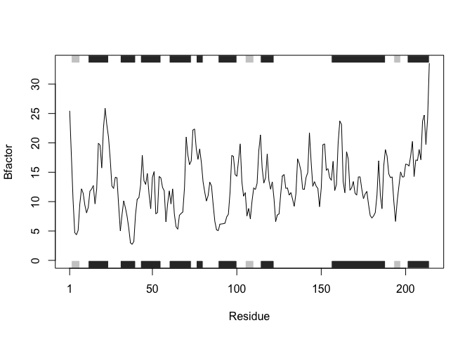

Class 6 - R Function
================
Sarah Murphy
1/23/2020

# Functions

\#\#Level 2 heading

\#\#\#Level 3 Heading

\#Notes \#Data Import Read.table(“your file name”, header = TRUE, Sep =
“\\t”)

``` r
#This is a silly plot
plot(1:5)
```

<!-- -->

Let’s see more about **file import** (i.e. reading files into R) The
main read function in base R is `read.table()` Use different read
functions for different types of data. They each have different
predefined arguments that are specific for different types of data. This
saves typing in creating code.

``` r
read.table("test1.txt")
```

    ##               V1
    ## 1 Col1,Col2,Col3
    ## 2          1,2,3
    ## 3          4,5,6
    ## 4          7,8,9
    ## 5          a,b,c

We need to add arguments to get this file read properly\!

``` r
read.table("test1.txt",sep = ",", header = TRUE)
```

    ##   Col1 Col2 Col3
    ## 1    1    2    3
    ## 2    4    5    6
    ## 3    7    8    9
    ## 4    a    b    c

This is how to read this type of data properly. But this could also be
done using `read.csv`, which has the arguments I want in this case\!

``` r
t1<-read.csv("test1.txt")
t1
```

    ##   Col1 Col2 Col3
    ## 1    1    2    3
    ## 2    4    5    6
    ## 3    7    8    9
    ## 4    a    b    c

The second file

``` r
t2<-read.table("test2.txt", header = TRUE, sep = "$")
t2
```

    ##   Col1 Col2 Col3
    ## 1    1    2    3
    ## 2    4    5    6
    ## 3    7    8    9
    ## 4    a    b    c

The third file

``` r
t3<-read.table("test3.txt")
t3
```

    ##   V1 V2 V3
    ## 1  1  6  a
    ## 2  2  7  b
    ## 3  3  8  c
    ## 4  4  9  d
    ## 5  5 10  e

# Back to functions

Our first example function

``` r
add <- function(x, y=1) {
 # Sum the input x and y
 x + y
}
```

This function has now been added to our global environment. Let’s try
using it\!

``` r
add(34)
```

    ## [1] 35

``` r
add(32,35)
```

    ## [1] 67

How does this work with vectors as the input?

``` r
add( c(1, 2, 3) )
```

    ## [1] 2 3 4

``` r
add( c(1, 2, 3), 4 )
```

    ## [1] 5 6 7

How about multiple vectors?

``` r
add( c(1, 2, 3), c(1,2,3) )
```

    ## [1] 2 4 6

If it is not made into a vector, the additional numbers are considered
extra arguments, and the function does not know what to do with them.
This will result in an error message.

``` r
#add( c(1, 2, 3), 1,2,3 )
```

# Writing Your Own Functions

Helps simplify work and clarify purpose of code Start with a working
code snippet, simplify your variables, reduce calculation duplication,
and *finally* turn it into a function\! i.e. df$a = x `minx <- min (x)`
`rng<-range(x)`

What is this `range()` function you talk of?

``` r
x<-c(4,4,10,3,11)
max(x)
```

    ## [1] 11

``` r
min(x)
```

    ## [1] 3

``` r
range(x)
```

    ## [1]  3 11

This is our second function

``` r
rescale <- function(x) {
 rng <-range(x)
 (x - rng[1]) / (rng[2] - rng[1])
}
rescale(x)
```

    ## [1] 0.125 0.125 0.875 0.000 1.000

Let’s do some more testing of our rescale
    function:

``` r
rescale(1:10)
```

    ##  [1] 0.0000000 0.1111111 0.2222222 0.3333333 0.4444444 0.5555556 0.6666667
    ##  [8] 0.7777778 0.8888889 1.0000000

What happens when a data value has NA in it?

``` r
rescale( c(1,2,NA,3,10) )
```

    ## [1] NA NA NA NA NA

The output is all “NA”\! This is not what we want.

``` r
x<-( c(1,2,NA,3,10) )
rng <-range(x)
rng
```

    ## [1] NA NA

``` r
rng <-range(x, na.rm=TRUE)
rng
```

    ## [1]  1 10

``` r
rescale2 <- function(x) {
 rng <-range(x, na.rm = TRUE)
 (x - rng[1]) / (rng[2] - rng[1])
}
rescale2( c(1,2,NA,3,10) )
```

    ## [1] 0.0000000 0.1111111        NA 0.2222222 1.0000000

Going too far

``` r
rescale3 <- function(x, na.rm=TRUE, plot=FALSE) {
 rng <-range(x, na.rm=na.rm)
 print("Hello")
 answer <- (x - rng[1]) / (rng[2] - rng[1])
 print("is it me you are looking for?")
 if(plot) {
   print("Don't sing again!")
 plot(answer, typ="b", lwd=4)
 }
 print("I can see it in ...")
 return(answer)
}
```

``` r
rescale3(x, plot = FALSE)
```

    ## [1] "Hello"
    ## [1] "is it me you are looking for?"
    ## [1] "I can see it in ..."

    ## [1] 0.0000000 0.1111111        NA 0.2222222 1.0000000

\#Hands On Worksheet \#\#Section B

``` r
library(bio3d)
s1 <- read.pdb("4AKE") # kinase with drug
```

    ##   Note: Accessing on-line PDB file

``` r
s2 <- read.pdb("1AKE") # kinase no drug
```

    ##   Note: Accessing on-line PDB file
    ##    PDB has ALT records, taking A only, rm.alt=TRUE

``` r
s3 <- read.pdb("1E4Y") # kinase with drug
```

    ##   Note: Accessing on-line PDB file

``` r
s1.chainA <- trim.pdb(s1, chain="A", elety="CA")
s2.chainA <- trim.pdb(s2, chain="A", elety="CA")
s3.chainA <- trim.pdb(s3, chain="A", elety="CA")

s1.b <- s1.chainA$atom$b
s2.b <- s2.chainA$atom$b
s3.b <- s3.chainA$atom$b

plotb3(s1.b, typ="l", ylab="Bfactor")
```

<!-- -->

``` r
plotb3(s2.b, sse=s2.chainA, typ="l", ylab="Bfactor")
```

<!-- -->

``` r
plotb3(s3.b, sse=s3.chainA, typ="l", ylab="Bfactor")
```

<!-- -->

\#Q1. What type of object is returned from the read.pdb() function?
`read.pdb()` reads a Protein Data Bank coordinate file and pulls up the
data into the Global Environment. By doing this, the data can be named
and easily input into functions to analyze. `read.pdb()` returns a list
of 8 things and of class “pdb”, “sse”. \#Q2. What does the trim.pdb()
function do? `trim.pdb()` trims a PDB object to a subset of atoms. \#Q3.
What input parameter would turn off the marginal black and grey
rectangles in the plots and what do they represent in this case? The sse
parameter turns of the rectangles in the plots. ?plotb3 \> dssp tells us
that there are 3 values for the rectangles: helix, sheet, or turn. \#Q4.
What would be a better plot to compare across the different proteins? It
would be better to have all 3 proteins in one plot so that it is easier
to recognize patterns without shuffling between 3 different graphs. This
can be done by using `points()` and adding the name \#Q5. Which proteins
are more similar to each other in their B-factor trends. How could you
quantify this? HINT: try the rbind(), dist() and hclust() functions
together with a resulting dendrogram plot. Look up the documentation to
see what each of these functions does. s2.b and s3.b are most closely
related. `rbind()` combines vectors by row and `dist()` finds the
distance between each
    protein.

``` r
s1 <- read.pdb("4AKE") # kinase with drug
```

    ##   Note: Accessing on-line PDB file

    ## Warning in get.pdb(file, path = tempdir(), verbose = FALSE): /var/folders/
    ## f7/0d0q8nqx17j6wv5358nrt34c0000gn/T//RtmpCzj4su/4AKE.pdb exists. Skipping
    ## download

``` r
s1
```

    ## 
    ##  Call:  read.pdb(file = "4AKE")
    ## 
    ##    Total Models#: 1
    ##      Total Atoms#: 3459,  XYZs#: 10377  Chains#: 2  (values: A B)
    ## 
    ##      Protein Atoms#: 3312  (residues/Calpha atoms#: 428)
    ##      Nucleic acid Atoms#: 0  (residues/phosphate atoms#: 0)
    ## 
    ##      Non-protein/nucleic Atoms#: 147  (residues: 147)
    ##      Non-protein/nucleic resid values: [ HOH (147) ]
    ## 
    ##    Protein sequence:
    ##       MRIILLGAPGAGKGTQAQFIMEKYGIPQISTGDMLRAAVKSGSELGKQAKDIMDAGKLVT
    ##       DELVIALVKERIAQEDCRNGFLLDGFPRTIPQADAMKEAGINVDYVLEFDVPDELIVDRI
    ##       VGRRVHAPSGRVYHVKFNPPKVEGKDDVTGEELTTRKDDQEETVRKRLVEYHQMTAPLIG
    ##       YYSKEAEAGNTKYAKVDGTKPVAEVRADLEKILGMRIILLGAPGA...<cut>...KILG
    ## 
    ## + attr: atom, xyz, seqres, helix, sheet,
    ##         calpha, remark, call

``` r
class(s1)
```

    ## [1] "pdb" "sse"

``` r
str(s1)
```

    ## List of 8
    ##  $ atom  :'data.frame':  3459 obs. of  16 variables:
    ##   ..$ type  : chr [1:3459] "ATOM" "ATOM" "ATOM" "ATOM" ...
    ##   ..$ eleno : int [1:3459] 1 2 3 4 5 6 7 8 9 10 ...
    ##   ..$ elety : chr [1:3459] "N" "CA" "C" "O" ...
    ##   ..$ alt   : chr [1:3459] NA NA NA NA ...
    ##   ..$ resid : chr [1:3459] "MET" "MET" "MET" "MET" ...
    ##   ..$ chain : chr [1:3459] "A" "A" "A" "A" ...
    ##   ..$ resno : int [1:3459] 1 1 1 1 1 1 1 1 2 2 ...
    ##   ..$ insert: chr [1:3459] NA NA NA NA ...
    ##   ..$ x     : num [1:3459] -10.93 -9.9 -9.17 -9.8 -10.59 ...
    ##   ..$ y     : num [1:3459] -24.9 -24.4 -23.3 -22.3 -24 ...
    ##   ..$ z     : num [1:3459] -9.52 -10.48 -9.81 -9.35 -11.77 ...
    ##   ..$ o     : num [1:3459] 1 1 1 1 1 1 1 1 1 1 ...
    ##   ..$ b     : num [1:3459] 41.5 29 27.9 26.4 34.2 ...
    ##   ..$ segid : chr [1:3459] NA NA NA NA ...
    ##   ..$ elesy : chr [1:3459] "N" "C" "C" "O" ...
    ##   ..$ charge: chr [1:3459] NA NA NA NA ...
    ##  $ xyz   : 'xyz' num [1, 1:10377] -10.93 -24.89 -9.52 -9.9 -24.42 ...
    ##  $ seqres: Named chr [1:428] "MET" "ARG" "ILE" "ILE" ...
    ##   ..- attr(*, "names")= chr [1:428] "A" "A" "A" "A" ...
    ##  $ helix :List of 4
    ##   ..$ start: Named num [1:19] 13 31 44 61 75 90 113 161 202 13 ...
    ##   .. ..- attr(*, "names")= chr [1:19] "" "" "" "" ...
    ##   ..$ end  : Named num [1:19] 24 40 54 73 77 98 121 187 213 24 ...
    ##   .. ..- attr(*, "names")= chr [1:19] "" "" "" "" ...
    ##   ..$ chain: chr [1:19] "A" "A" "A" "A" ...
    ##   ..$ type : chr [1:19] "5" "1" "1" "1" ...
    ##  $ sheet :List of 4
    ##   ..$ start: Named num [1:14] 192 105 2 81 27 123 131 192 105 2 ...
    ##   .. ..- attr(*, "names")= chr [1:14] "" "" "" "" ...
    ##   ..$ end  : Named num [1:14] 197 110 7 84 29 126 134 197 110 7 ...
    ##   .. ..- attr(*, "names")= chr [1:14] "" "" "" "" ...
    ##   ..$ chain: chr [1:14] "A" "A" "A" "A" ...
    ##   ..$ sense: chr [1:14] "0" "1" "1" "1" ...
    ##  $ calpha: logi [1:3459] FALSE TRUE FALSE FALSE FALSE FALSE ...
    ##  $ remark:List of 1
    ##   ..$ biomat:List of 4
    ##   .. ..$ num   : int 1
    ##   .. ..$ chain :List of 1
    ##   .. .. ..$ : chr [1:2] "A" "B"
    ##   .. ..$ mat   :List of 1
    ##   .. .. ..$ :List of 1
    ##   .. .. .. ..$ A B: num [1:3, 1:4] 1 0 0 0 1 0 0 0 1 0 ...
    ##   .. ..$ method: chr "AUTHOR"
    ##  $ call  : language read.pdb(file = "4AKE")
    ##  - attr(*, "class")= chr [1:2] "pdb" "sse"

``` r
aa321(s1$seqres)
```

    ##   [1] "M" "R" "I" "I" "L" "L" "G" "A" "P" "G" "A" "G" "K" "G" "T" "Q" "A" "Q"
    ##  [19] "F" "I" "M" "E" "K" "Y" "G" "I" "P" "Q" "I" "S" "T" "G" "D" "M" "L" "R"
    ##  [37] "A" "A" "V" "K" "S" "G" "S" "E" "L" "G" "K" "Q" "A" "K" "D" "I" "M" "D"
    ##  [55] "A" "G" "K" "L" "V" "T" "D" "E" "L" "V" "I" "A" "L" "V" "K" "E" "R" "I"
    ##  [73] "A" "Q" "E" "D" "C" "R" "N" "G" "F" "L" "L" "D" "G" "F" "P" "R" "T" "I"
    ##  [91] "P" "Q" "A" "D" "A" "M" "K" "E" "A" "G" "I" "N" "V" "D" "Y" "V" "L" "E"
    ## [109] "F" "D" "V" "P" "D" "E" "L" "I" "V" "D" "R" "I" "V" "G" "R" "R" "V" "H"
    ## [127] "A" "P" "S" "G" "R" "V" "Y" "H" "V" "K" "F" "N" "P" "P" "K" "V" "E" "G"
    ## [145] "K" "D" "D" "V" "T" "G" "E" "E" "L" "T" "T" "R" "K" "D" "D" "Q" "E" "E"
    ## [163] "T" "V" "R" "K" "R" "L" "V" "E" "Y" "H" "Q" "M" "T" "A" "P" "L" "I" "G"
    ## [181] "Y" "Y" "S" "K" "E" "A" "E" "A" "G" "N" "T" "K" "Y" "A" "K" "V" "D" "G"
    ## [199] "T" "K" "P" "V" "A" "E" "V" "R" "A" "D" "L" "E" "K" "I" "L" "G" "M" "R"
    ## [217] "I" "I" "L" "L" "G" "A" "P" "G" "A" "G" "K" "G" "T" "Q" "A" "Q" "F" "I"
    ## [235] "M" "E" "K" "Y" "G" "I" "P" "Q" "I" "S" "T" "G" "D" "M" "L" "R" "A" "A"
    ## [253] "V" "K" "S" "G" "S" "E" "L" "G" "K" "Q" "A" "K" "D" "I" "M" "D" "A" "G"
    ## [271] "K" "L" "V" "T" "D" "E" "L" "V" "I" "A" "L" "V" "K" "E" "R" "I" "A" "Q"
    ## [289] "E" "D" "C" "R" "N" "G" "F" "L" "L" "D" "G" "F" "P" "R" "T" "I" "P" "Q"
    ## [307] "A" "D" "A" "M" "K" "E" "A" "G" "I" "N" "V" "D" "Y" "V" "L" "E" "F" "D"
    ## [325] "V" "P" "D" "E" "L" "I" "V" "D" "R" "I" "V" "G" "R" "R" "V" "H" "A" "P"
    ## [343] "S" "G" "R" "V" "Y" "H" "V" "K" "F" "N" "P" "P" "K" "V" "E" "G" "K" "D"
    ## [361] "D" "V" "T" "G" "E" "E" "L" "T" "T" "R" "K" "D" "D" "Q" "E" "E" "T" "V"
    ## [379] "R" "K" "R" "L" "V" "E" "Y" "H" "Q" "M" "T" "A" "P" "L" "I" "G" "Y" "Y"
    ## [397] "S" "K" "E" "A" "E" "A" "G" "N" "T" "K" "Y" "A" "K" "V" "D" "G" "T" "K"
    ## [415] "P" "V" "A" "E" "V" "R" "A" "D" "L" "E" "K" "I" "L" "G"

``` r
s1$atom
```

    ##        type eleno elety  alt resid chain resno insert       x       y       z
    ## 1      ATOM     1     N <NA>   MET     A     1   <NA> -10.928 -24.892  -9.518
    ## 2      ATOM     2    CA <NA>   MET     A     1   <NA>  -9.901 -24.422 -10.479
    ## 3      ATOM     3     C <NA>   MET     A     1   <NA>  -9.168 -23.266  -9.813
    ## 4      ATOM     4     O <NA>   MET     A     1   <NA>  -9.802 -22.323  -9.346
    ## 5      ATOM     5    CB <NA>   MET     A     1   <NA> -10.585 -23.970 -11.774
    ## 6      ATOM     6    CG <NA>   MET     A     1   <NA>  -9.650 -23.497 -12.856
    ## 7      ATOM     7    SD <NA>   MET     A     1   <NA>  -8.384 -24.690 -13.251
    ## 8      ATOM     8    CE <NA>   MET     A     1   <NA>  -9.002 -25.277 -14.812
    ## 9      ATOM     9     N <NA>   ARG     A     2   <NA>  -7.851 -23.394  -9.673
    ## 10     ATOM    10    CA <NA>   ARG     A     2   <NA>  -7.028 -22.352  -9.051
    ## 11     ATOM    11     C <NA>   ARG     A     2   <NA>  -6.001 -21.906 -10.072
    ## 12     ATOM    12     O <NA>   ARG     A     2   <NA>  -5.150 -22.680 -10.492
    ## 13     ATOM    13    CB <NA>   ARG     A     2   <NA>  -6.337 -22.868  -7.801
    ## 14     ATOM    14    CG <NA>   ARG     A     2   <NA>  -7.222 -22.919  -6.621
    ## 15     ATOM    15    CD <NA>   ARG     A     2   <NA>  -6.632 -23.799  -5.576
    ## 16     ATOM    16    NE <NA>   ARG     A     2   <NA>  -7.440 -23.763  -4.372
    ## 17     ATOM    17    CZ <NA>   ARG     A     2   <NA>  -6.965 -23.881  -3.138
    ## 18     ATOM    18   NH1 <NA>   ARG     A     2   <NA>  -5.664 -24.050  -2.932
    ## 19     ATOM    19   NH2 <NA>   ARG     A     2   <NA>  -7.806 -23.818  -2.112
    ## 20     ATOM    20     N <NA>   ILE     A     3   <NA>  -6.082 -20.641 -10.448
    ## 21     ATOM    21    CA <NA>   ILE     A     3   <NA>  -5.227 -20.106 -11.463
    ## 22     ATOM    22     C <NA>   ILE     A     3   <NA>  -4.540 -18.831 -10.985
    ## 23     ATOM    23     O <NA>   ILE     A     3   <NA>  -5.118 -18.060 -10.228
    ## 24     ATOM    24    CB <NA>   ILE     A     3   <NA>  -6.098 -19.813 -12.702
    ## 25     ATOM    25   CG1 <NA>   ILE     A     3   <NA>  -6.670 -21.108 -13.263
    ## 26     ATOM    26   CG2 <NA>   ILE     A     3   <NA>  -5.337 -19.077 -13.744
    ## 27     ATOM    27   CD1 <NA>   ILE     A     3   <NA>  -7.875 -20.870 -14.122
    ## 28     ATOM    28     N <NA>   ILE     A     4   <NA>  -3.263 -18.691 -11.331
    ## 29     ATOM    29    CA <NA>   ILE     A     4   <NA>  -2.477 -17.496 -11.033
    ## 30     ATOM    30     C <NA>   ILE     A     4   <NA>  -2.299 -16.916 -12.455
    ## 31     ATOM    31     O <NA>   ILE     A     4   <NA>  -1.920 -17.651 -13.376
    ## 32     ATOM    32    CB <NA>   ILE     A     4   <NA>  -1.088 -17.867 -10.428
    ## 33     ATOM    33   CG1 <NA>   ILE     A     4   <NA>  -1.254 -18.305  -8.975
    ## 34     ATOM    34   CG2 <NA>   ILE     A     4   <NA>  -0.134 -16.690 -10.511
    ## 35     ATOM    35   CD1 <NA>   ILE     A     4   <NA>  -0.001 -18.800  -8.363
    ## 36     ATOM    36     N <NA>   LEU     A     5   <NA>  -2.663 -15.647 -12.649
    ## 37     ATOM    37    CA <NA>   LEU     A     5   <NA>  -2.565 -14.983 -13.957
    ## 38     ATOM    38     C <NA>   LEU     A     5   <NA>  -1.444 -13.957 -13.914
    ## 39     ATOM    39     O <NA>   LEU     A     5   <NA>  -1.535 -12.986 -13.177
    ## 40     ATOM    40    CB <NA>   LEU     A     5   <NA>  -3.905 -14.287 -14.286
    ## 41     ATOM    41    CG <NA>   LEU     A     5   <NA>  -4.199 -13.784 -15.709
    ## 42     ATOM    42   CD1 <NA>   LEU     A     5   <NA>  -4.065 -14.897 -16.723
    ## 43     ATOM    43   CD2 <NA>   LEU     A     5   <NA>  -5.602 -13.212 -15.783
    ## 44     ATOM    44     N <NA>   LEU     A     6   <NA>  -0.381 -14.186 -14.680
    ## 45     ATOM    45    CA <NA>   LEU     A     6   <NA>   0.768 -13.265 -14.734
    ## 46     ATOM    46     C <NA>   LEU     A     6   <NA>   0.775 -12.442 -16.033
    ## 47     ATOM    47     O <NA>   LEU     A     6   <NA>   0.313 -12.896 -17.077
    ## 48     ATOM    48    CB <NA>   LEU     A     6   <NA>   2.097 -14.034 -14.657
    ## 49     ATOM    49    CG <NA>   LEU     A     6   <NA>   2.441 -14.999 -13.526
    ## 50     ATOM    50   CD1 <NA>   LEU     A     6   <NA>   3.800 -15.554 -13.804
    ## 51     ATOM    51   CD2 <NA>   LEU     A     6   <NA>   2.436 -14.323 -12.202
    ## 52     ATOM    52     N <NA>   GLY     A     7   <NA>   1.347 -11.252 -15.980
    ## 53     ATOM    53    CA <NA>   GLY     A     7   <NA>   1.394 -10.431 -17.162
    ## 54     ATOM    54     C <NA>   GLY     A     7   <NA>   1.994  -9.074 -16.883
    ## 55     ATOM    55     O <NA>   GLY     A     7   <NA>   1.782  -8.467 -15.829
    ## 56     ATOM    56     N <NA>   ALA     A     8   <NA>   2.748  -8.581 -17.852
    ## 57     ATOM    57    CA <NA>   ALA     A     8   <NA>   3.395  -7.286 -17.735
    ## 58     ATOM    58     C <NA>   ALA     A     8   <NA>   2.367  -6.186 -17.693
    ## 59     ATOM    59     O <NA>   ALA     A     8   <NA>   1.232  -6.380 -18.111
    ## 60     ATOM    60    CB <NA>   ALA     A     8   <NA>   4.341  -7.053 -18.932
    ## 61     ATOM    61     N <NA>   PRO     A     9   <NA>   2.703  -5.066 -17.048
    ## 62     ATOM    62    CA <NA>   PRO     A     9   <NA>   1.751  -3.951 -17.001
    ## 63     ATOM    63     C <NA>   PRO     A     9   <NA>   1.553  -3.408 -18.438
    ## 64     ATOM    64     O <NA>   PRO     A     9   <NA>   2.522  -3.054 -19.124
    ## 65     ATOM    65    CB <NA>   PRO     A     9   <NA>   2.471  -2.924 -16.105
    ## 66     ATOM    66    CG <NA>   PRO     A     9   <NA>   3.927  -3.344 -16.139
    ## 67     ATOM    67    CD <NA>   PRO     A     9   <NA>   3.824  -4.836 -16.122
    ## 68     ATOM    68     N <NA>   GLY     A    10   <NA>   0.310  -3.411 -18.905
    ## 69     ATOM    69    CA <NA>   GLY     A    10   <NA>   0.015  -2.928 -20.242
    ## 70     ATOM    70     C <NA>   GLY     A    10   <NA>  -0.312  -4.025 -21.253
    ## 71     ATOM    71     O <NA>   GLY     A    10   <NA>  -0.853  -3.739 -22.326
    ## 72     ATOM    72     N <NA>   ALA     A    11   <NA>   0.000  -5.277 -20.915
    ## 73     ATOM    73    CA <NA>   ALA     A    11   <NA>  -0.245  -6.408 -21.794
    ## 74     ATOM    74     C <NA>   ALA     A    11   <NA>  -1.725  -6.790 -21.936
    ## 75     ATOM    75     O <NA>   ALA     A    11   <NA>  -2.084  -7.520 -22.854
    ## 76     ATOM    76    CB <NA>   ALA     A    11   <NA>   0.572  -7.611 -21.333
    ## 77     ATOM    77     N <NA>   GLY     A    12   <NA>  -2.573  -6.323 -21.019
    ## 78     ATOM    78    CA <NA>   GLY     A    12   <NA>  -3.997  -6.640 -21.064
    ## 79     ATOM    79     C <NA>   GLY     A    12   <NA>  -4.390  -8.078 -20.715
    ## 80     ATOM    80     O <NA>   GLY     A    12   <NA>  -5.149  -8.694 -21.467
    ## 81     ATOM    81     N <NA>   LYS     A    13   <NA>  -3.911  -8.616 -19.584
    ## 82     ATOM    82    CA <NA>   LYS     A    13   <NA>  -4.260  -9.988 -19.188
    ## 83     ATOM    83     C <NA>   LYS     A    13   <NA>  -5.680 -10.006 -18.658
    ## 84     ATOM    84     O <NA>   LYS     A    13   <NA>  -6.353 -11.031 -18.675
    ## 85     ATOM    85    CB <NA>   LYS     A    13   <NA>  -3.286 -10.535 -18.139
    ## 86     ATOM    86    CG <NA>   LYS     A    13   <NA>  -3.122  -9.642 -16.939
    ## 87     ATOM    87    CD <NA>   LYS     A    13   <NA>  -2.311 -10.303 -15.863
    ## 88     ATOM    88    CE <NA>   LYS     A    13   <NA>  -2.551  -9.626 -14.520
    ## 89     ATOM    89    NZ <NA>   LYS     A    13   <NA>  -1.805  -8.367 -14.274
    ## 90     ATOM    90     N <NA>   GLY     A    14   <NA>  -6.132  -8.842 -18.217
    ## 91     ATOM    91    CA <NA>   GLY     A    14   <NA>  -7.477  -8.701 -17.702
    ## 92     ATOM    92     C <NA>   GLY     A    14   <NA>  -8.531  -9.048 -18.735
    ## 93     ATOM    93     O <NA>   GLY     A    14   <NA>  -9.626  -9.484 -18.386
    ## 94     ATOM    94     N <NA>   THR     A    15   <NA>  -8.180  -8.934 -20.010
    ## 95     ATOM    95    CA <NA>   THR     A    15   <NA>  -9.115  -9.225 -21.105
    ## 96     ATOM    96     C <NA>   THR     A    15   <NA>  -9.729 -10.637 -21.047
    ## 97     ATOM    97     O <NA>   THR     A    15   <NA> -10.866 -10.859 -21.471
    ## 98     ATOM    98    CB <NA>   THR     A    15   <NA>  -8.445  -9.008 -22.522
    ## 99     ATOM    99   OG1 <NA>   THR     A    15   <NA>  -7.462 -10.028 -22.777
    ## 100    ATOM   100   CG2 <NA>   THR     A    15   <NA>  -7.795  -7.613 -22.614
    ## 101    ATOM   101     N <NA>   GLN     A    16   <NA>  -9.003 -11.575 -20.468
    ## 102    ATOM   102    CA <NA>   GLN     A    16   <NA>  -9.497 -12.931 -20.423
    ## 103    ATOM   103     C <NA>   GLN     A    16   <NA> -10.070 -13.344 -19.064
    ## 104    ATOM   104     O <NA>   GLN     A    16   <NA> -10.578 -14.443 -18.909
    ## 105    ATOM   105    CB <NA>   GLN     A    16   <NA>  -8.375 -13.859 -20.883
    ## 106    ATOM   106    CG <NA>   GLN     A    16   <NA>  -8.764 -14.832 -22.010
    ## 107    ATOM   107    CD <NA>   GLN     A    16   <NA>  -9.211 -14.179 -23.318
    ## 108    ATOM   108   OE1 <NA>   GLN     A    16   <NA>  -8.426 -13.538 -24.023
    ## 109    ATOM   109   NE2 <NA>   GLN     A    16   <NA> -10.471 -14.401 -23.676
    ## 110    ATOM   110     N <NA>   ALA     A    17   <NA> -10.089 -12.417 -18.121
    ## 111    ATOM   111    CA <NA>   ALA     A    17   <NA> -10.578 -12.687 -16.783
    ## 112    ATOM   112     C <NA>   ALA     A    17   <NA> -12.046 -13.047 -16.702
    ## 113    ATOM   113     O <NA>   ALA     A    17   <NA> -12.398 -14.055 -16.087
    ## 114    ATOM   114    CB <NA>   ALA     A    17   <NA> -10.276 -11.528 -15.885
    ## 115    ATOM   115     N <NA>   GLN     A    18   <NA> -12.919 -12.231 -17.286
    ## 116    ATOM   116    CA <NA>   GLN     A    18   <NA> -14.357 -12.543 -17.256
    ## 117    ATOM   117     C <NA>   GLN     A    18   <NA> -14.621 -13.930 -17.792
    ## 118    ATOM   118     O <NA>   GLN     A    18   <NA> -15.469 -14.647 -17.276
    ## 119    ATOM   119    CB <NA>   GLN     A    18   <NA> -15.158 -11.560 -18.094
    ## 120    ATOM   120    CG <NA>   GLN     A    18   <NA> -15.836 -10.454 -17.315
    ## 121    ATOM   121    CD <NA>   GLN     A    18   <NA> -16.874  -9.740 -18.151
    ## 122    ATOM   122   OE1 <NA>   GLN     A    18   <NA> -17.676 -10.377 -18.855
    ## 123    ATOM   123   NE2 <NA>   GLN     A    18   <NA> -16.866  -8.410 -18.090
    ## 124    ATOM   124     N <NA>   PHE     A    19   <NA> -13.902 -14.307 -18.842
    ## 125    ATOM   125    CA <NA>   PHE     A    19   <NA> -14.086 -15.630 -19.436
    ## 126    ATOM   126     C <NA>   PHE     A    19   <NA> -13.799 -16.726 -18.404
    ## 127    ATOM   127     O <NA>   PHE     A    19   <NA> -14.609 -17.626 -18.168
    ## 128    ATOM   128    CB <NA>   PHE     A    19   <NA> -13.189 -15.776 -20.691
    ## 129    ATOM   129    CG <NA>   PHE     A    19   <NA> -12.957 -17.207 -21.123
    ## 130    ATOM   130   CD1 <NA>   PHE     A    19   <NA> -14.010 -18.000 -21.575
    ## 131    ATOM   131   CD2 <NA>   PHE     A    19   <NA> -11.689 -17.782 -21.014
    ## 132    ATOM   132   CE1 <NA>   PHE     A    19   <NA> -13.804 -19.340 -21.900
    ## 133    ATOM   133   CE2 <NA>   PHE     A    19   <NA> -11.471 -19.120 -21.337
    ## 134    ATOM   134    CZ <NA>   PHE     A    19   <NA> -12.527 -19.899 -21.778
    ## 135    ATOM   135     N <NA>   ILE     A    20   <NA> -12.648 -16.616 -17.767
    ## 136    ATOM   136    CA <NA>   ILE     A    20   <NA> -12.235 -17.560 -16.776
    ## 137    ATOM   137     C <NA>   ILE     A    20   <NA> -13.256 -17.654 -15.644
    ## 138    ATOM   138     O <NA>   ILE     A    20   <NA> -13.676 -18.743 -15.305
    ## 139    ATOM   139    CB <NA>   ILE     A    20   <NA> -10.849 -17.187 -16.276
    ## 140    ATOM   140   CG1 <NA>   ILE     A    20   <NA>  -9.866 -17.333 -17.431
    ## 141    ATOM   141   CG2 <NA>   ILE     A    20   <NA> -10.417 -18.105 -15.144
    ## 142    ATOM   142   CD1 <NA>   ILE     A    20   <NA>  -8.545 -16.770 -17.128
    ## 143    ATOM   143     N <NA>   MET     A    21   <NA> -13.705 -16.535 -15.090
    ## 144    ATOM   144    CA <NA>   MET     A    21   <NA> -14.712 -16.590 -14.022
    ## 145    ATOM   145     C <NA>   MET     A    21   <NA> -15.991 -17.276 -14.527
    ## 146    ATOM   146     O <NA>   MET     A    21   <NA> -16.523 -18.220 -13.909
    ## 147    ATOM   147    CB <NA>   MET     A    21   <NA> -15.056 -15.189 -13.545
    ## 148    ATOM   148    CG <NA>   MET     A    21   <NA> -13.957 -14.482 -12.818
    ## 149    ATOM   149    SD <NA>   MET     A    21   <NA> -14.247 -12.668 -12.731
    ## 150    ATOM   150    CE <NA>   MET     A    21   <NA> -15.099 -12.499 -11.289
    ## 151    ATOM   151     N <NA>   GLU     A    22   <NA> -16.432 -16.846 -15.699
    ## 152    ATOM   152    CA <NA>   GLU     A    22   <NA> -17.629 -17.379 -16.311
    ## 153    ATOM   153     C <NA>   GLU     A    22   <NA> -17.538 -18.848 -16.683
    ## 154    ATOM   154     O <NA>   GLU     A    22   <NA> -18.543 -19.553 -16.679
    ## 155    ATOM   155    CB <NA>   GLU     A    22   <NA> -17.984 -16.553 -17.535
    ## 156    ATOM   156    CG <NA>   GLU     A    22   <NA> -19.271 -16.996 -18.223
    ## 157    ATOM   157    CD <NA>   GLU     A    22   <NA> -20.171 -15.833 -18.616
    ## 158    ATOM   158   OE1 <NA>   GLU     A    22   <NA> -19.661 -14.689 -18.762
    ## 159    ATOM   159   OE2 <NA>   GLU     A    22   <NA> -21.395 -16.069 -18.773
    ## 160    ATOM   160     N <NA>   LYS     A    23   <NA> -16.347 -19.333 -16.988
    ## 161    ATOM   161    CA <NA>   LYS     A    23   <NA> -16.228 -20.729 -17.365
    ## 162    ATOM   162     C <NA>   LYS     A    23   <NA> -16.122 -21.678 -16.154
    ## 163    ATOM   163     O <NA>   LYS     A    23   <NA> -16.657 -22.792 -16.164
    ## 164    ATOM   164    CB <NA>   LYS     A    23   <NA> -15.026 -20.897 -18.290
    ## 165    ATOM   165    CG <NA>   LYS     A    23   <NA> -15.163 -22.045 -19.276
    ## 166    ATOM   166    CD <NA>   LYS     A    23   <NA> -16.377 -21.832 -20.188
    ## 167    ATOM   167    CE <NA>   LYS     A    23   <NA> -16.556 -22.984 -21.169
    ## 168    ATOM   168    NZ <NA>   LYS     A    23   <NA> -16.822 -24.278 -20.472
    ## 169    ATOM   169     N <NA>   TYR     A    24   <NA> -15.475 -21.213 -15.089
    ## 170    ATOM   170    CA <NA>   TYR     A    24   <NA> -15.265 -22.028 -13.897
    ## 171    ATOM   171     C <NA>   TYR     A    24   <NA> -16.073 -21.622 -12.656
    ## 172    ATOM   172     O <NA>   TYR     A    24   <NA> -16.139 -22.371 -11.694
    ## 173    ATOM   173    CB <NA>   TYR     A    24   <NA> -13.750 -22.093 -13.590
    ## 174    ATOM   174    CG <NA>   TYR     A    24   <NA> -12.969 -22.520 -14.814
    ## 175    ATOM   175   CD1 <NA>   TYR     A    24   <NA> -12.867 -23.870 -15.169
    ## 176    ATOM   176   CD2 <NA>   TYR     A    24   <NA> -12.507 -21.570 -15.724
    ## 177    ATOM   177   CE1 <NA>   TYR     A    24   <NA> -12.343 -24.257 -16.419
    ## 178    ATOM   178   CE2 <NA>   TYR     A    24   <NA> -11.990 -21.940 -16.970
    ## 179    ATOM   179    CZ <NA>   TYR     A    24   <NA> -11.918 -23.280 -17.321
    ## 180    ATOM   180    OH <NA>   TYR     A    24   <NA> -11.500 -23.611 -18.598
    ## 181    ATOM   181     N <NA>   GLY     A    25   <NA> -16.699 -20.456 -12.680
    ## 182    ATOM   182    CA <NA>   GLY     A    25   <NA> -17.460 -20.048 -11.528
    ## 183    ATOM   183     C <NA>   GLY     A    25   <NA> -16.562 -19.793 -10.351
    ## 184    ATOM   184     O <NA>   GLY     A    25   <NA> -16.817 -20.284  -9.254
    ## 185    ATOM   185     N <NA>   ILE     A    26   <NA> -15.548 -18.957 -10.573
    ## 186    ATOM   186    CA <NA>   ILE     A    26   <NA> -14.555 -18.595  -9.561
    ## 187    ATOM   187     C <NA>   ILE     A    26   <NA> -14.380 -17.090  -9.634
    ## 188    ATOM   188     O <NA>   ILE     A    26   <NA> -14.632 -16.480 -10.665
    ## 189    ATOM   189    CB <NA>   ILE     A    26   <NA> -13.164 -19.303  -9.802
    ## 190    ATOM   190   CG1 <NA>   ILE     A    26   <NA> -12.495 -18.788 -11.065
    ## 191    ATOM   191   CG2 <NA>   ILE     A    26   <NA> -13.329 -20.795  -9.973
    ## 192    ATOM   192   CD1 <NA>   ILE     A    26   <NA> -11.387 -19.642 -11.530
    ## 193    ATOM   193     N <NA>   PRO     A    27   <NA> -14.005 -16.463  -8.519
    ## 194    ATOM   194    CA <NA>   PRO     A    27   <NA> -13.805 -15.020  -8.472
    ## 195    ATOM   195     C <NA>   PRO     A    27   <NA> -12.377 -14.587  -8.719
    ## 196    ATOM   196     O <NA>   PRO     A    27   <NA> -11.440 -15.361  -8.564
    ## 197    ATOM   197    CB <NA>   PRO     A    27   <NA> -14.203 -14.694  -7.044
    ## 198    ATOM   198    CG <NA>   PRO     A    27   <NA> -13.650 -15.859  -6.292
    ## 199    ATOM   199    CD <NA>   PRO     A    27   <NA> -14.069 -17.029  -7.158
    ## 200    ATOM   200     N <NA>   GLN     A    28   <NA> -12.216 -13.307  -9.015
    ## 201    ATOM   201    CA <NA>   GLN     A    28   <NA> -10.906 -12.712  -9.244
    ## 202    ATOM   202     C <NA>   GLN     A    28   <NA> -10.476 -12.047  -7.951
    ## 203    ATOM   203     O <NA>   GLN     A    28   <NA> -11.169 -11.188  -7.415
    ## 204    ATOM   204    CB <NA>   GLN     A    28   <NA> -10.968 -11.652 -10.340
    ## 205    ATOM   205    CG <NA>   GLN     A    28   <NA>  -9.661 -10.934 -10.562
    ## 206    ATOM   206    CD <NA>   GLN     A    28   <NA>  -9.785  -9.770 -11.526
    ## 207    ATOM   207   OE1 <NA>   GLN     A    28   <NA> -10.646  -9.759 -12.405
    ## 208    ATOM   208   NE2 <NA>   GLN     A    28   <NA>  -8.915  -8.781 -11.367
    ## 209    ATOM   209     N <NA>   ILE     A    29   <NA>  -9.334 -12.464  -7.439
    ## 210    ATOM   210    CA <NA>   ILE     A    29   <NA>  -8.804 -11.920  -6.211
    ## 211    ATOM   211     C <NA>   ILE     A    29   <NA>  -7.555 -11.176  -6.615
    ## 212    ATOM   212     O <NA>   ILE     A    29   <NA>  -6.773 -11.667  -7.417
    ## 213    ATOM   213    CB <NA>   ILE     A    29   <NA>  -8.363 -13.054  -5.255
    ## 214    ATOM   214   CG1 <NA>   ILE     A    29   <NA>  -9.536 -13.970  -4.895
    ## 215    ATOM   215   CG2 <NA>   ILE     A    29   <NA>  -7.696 -12.466  -4.013
    ## 216    ATOM   216   CD1 <NA>   ILE     A    29   <NA>  -9.074 -15.271  -4.274
    ## 217    ATOM   217     N <NA>   SER     A    30   <NA>  -7.388  -9.976  -6.103
    ## 218    ATOM   218    CA <NA>   SER     A    30   <NA>  -6.192  -9.217  -6.380
    ## 219    ATOM   219     C <NA>   SER     A    30   <NA>  -5.840  -8.669  -4.993
    ## 220    ATOM   220     O <NA>   SER     A    30   <NA>  -6.728  -8.414  -4.181
    ## 221    ATOM   221    CB <NA>   SER     A    30   <NA>  -6.471  -8.124  -7.404
    ## 222    ATOM   222    OG <NA>   SER     A    30   <NA>  -6.760  -6.891  -6.774
    ## 223    ATOM   223     N <NA>   THR     A    31   <NA>  -4.555  -8.536  -4.691
    ## 224    ATOM   224    CA <NA>   THR     A    31   <NA>  -4.144  -8.071  -3.369
    ## 225    ATOM   225     C <NA>   THR     A    31   <NA>  -4.637  -6.676  -2.996
    ## 226    ATOM   226     O <NA>   THR     A    31   <NA>  -4.948  -6.412  -1.835
    ## 227    ATOM   227    CB <NA>   THR     A    31   <NA>  -2.593  -8.247  -3.148
    ## 228    ATOM   228   OG1 <NA>   THR     A    31   <NA>  -1.849  -7.434  -4.063
    ## 229    ATOM   229   CG2 <NA>   THR     A    31   <NA>  -2.210  -9.695  -3.398
    ## 230    ATOM   230     N <NA>   GLY     A    32   <NA>  -4.779  -5.802  -3.983
    ## 231    ATOM   231    CA <NA>   GLY     A    32   <NA>  -5.246  -4.466  -3.685
    ## 232    ATOM   232     C <NA>   GLY     A    32   <NA>  -6.683  -4.515  -3.226
    ## 233    ATOM   233     O <NA>   GLY     A    32   <NA>  -7.057  -3.825  -2.293
    ## 234    ATOM   234     N <NA>   ASP     A    33   <NA>  -7.482  -5.373  -3.848
    ## 235    ATOM   235    CA <NA>   ASP     A    33   <NA>  -8.898  -5.497  -3.509
    ## 236    ATOM   236     C <NA>   ASP     A    33   <NA>  -9.059  -6.134  -2.161
    ## 237    ATOM   237     O <NA>   ASP     A    33   <NA>  -9.866  -5.709  -1.347
    ## 238    ATOM   238    CB <NA>   ASP     A    33   <NA>  -9.636  -6.366  -4.537
    ## 239    ATOM   239    CG <NA>   ASP     A    33   <NA>  -9.907  -5.641  -5.870
    ## 240    ATOM   240   OD1 <NA>   ASP     A    33   <NA>  -9.956  -4.385  -5.901
    ## 241    ATOM   241   OD2 <NA>   ASP     A    33   <NA> -10.093  -6.345  -6.897
    ## 242    ATOM   242     N <NA>   MET     A    34   <NA>  -8.293  -7.191  -1.959
    ## 243    ATOM   243    CA <NA>   MET     A    34   <NA>  -8.292  -7.982  -0.738
    ## 244    ATOM   244     C <NA>   MET     A    34   <NA>  -7.916  -7.163   0.471
    ## 245    ATOM   245     O <NA>   MET     A    34   <NA>  -8.541  -7.301   1.510
    ## 246    ATOM   246    CB <NA>   MET     A    34   <NA>  -7.297  -9.099  -0.907
    ## 247    ATOM   247    CG <NA>   MET     A    34   <NA>  -7.453 -10.222   0.027
    ## 248    ATOM   248    SD <NA>   MET     A    34   <NA>  -6.315 -11.395  -0.602
    ## 249    ATOM   249    CE <NA>   MET     A    34   <NA>  -4.810 -10.551  -0.080
    ## 250    ATOM   250     N <NA>   LEU     A    35   <NA>  -6.861  -6.358   0.341
    ## 251    ATOM   251    CA <NA>   LEU     A    35   <NA>  -6.401  -5.481   1.410
    ## 252    ATOM   252     C <NA>   LEU     A    35   <NA>  -7.534  -4.558   1.789
    ## 253    ATOM   253     O <NA>   LEU     A    35   <NA>  -7.998  -4.564   2.925
    ## 254    ATOM   254    CB <NA>   LEU     A    35   <NA>  -5.237  -4.629   0.933
    ## 255    ATOM   255    CG <NA>   LEU     A    35   <NA>  -3.833  -5.097   1.279
    ## 256    ATOM   256   CD1 <NA>   LEU     A    35   <NA>  -2.837  -4.144   0.655
    ## 257    ATOM   257   CD2 <NA>   LEU     A    35   <NA>  -3.660  -5.108   2.778
    ## 258    ATOM   258     N <NA>   ARG     A    36   <NA>  -7.993  -3.785   0.812
    ## 259    ATOM   259    CA <NA>   ARG     A    36   <NA>  -9.098  -2.856   0.993
    ## 260    ATOM   260     C <NA>   ARG     A    36   <NA> -10.378  -3.506   1.573
    ## 261    ATOM   261     O <NA>   ARG     A    36   <NA> -11.255  -2.819   2.072
    ## 262    ATOM   262    CB <NA>   ARG     A    36   <NA>  -9.389  -2.132  -0.335
    ## 263    ATOM   263    CG <NA>   ARG     A    36   <NA>  -8.223  -1.237  -0.798
    ## 264    ATOM   264    CD <NA>   ARG     A    36   <NA>  -8.593  -0.309  -1.969
    ## 265    ATOM   265    NE <NA>   ARG     A    36   <NA>  -8.576  -0.973  -3.275
    ## 266    ATOM   266    CZ <NA>   ARG     A    36   <NA>  -7.488  -1.132  -4.035
    ## 267    ATOM   267   NH1 <NA>   ARG     A    36   <NA>  -6.310  -0.669  -3.637
    ## 268    ATOM   268   NH2 <NA>   ARG     A    36   <NA>  -7.573  -1.752  -5.206
    ## 269    ATOM   269     N <NA>   ALA     A    37   <NA> -10.457  -4.828   1.555
    ## 270    ATOM   270    CA <NA>   ALA     A    37   <NA> -11.616  -5.549   2.081
    ## 271    ATOM   271     C <NA>   ALA     A    37   <NA> -11.402  -6.114   3.499
    ## 272    ATOM   272     O <NA>   ALA     A    37   <NA> -12.363  -6.482   4.188
    ## 273    ATOM   273    CB <NA>   ALA     A    37   <NA> -11.990  -6.680   1.131
    ## 274    ATOM   274     N <NA>   ALA     A    38   <NA> -10.144  -6.235   3.917
    ## 275    ATOM   275    CA <NA>   ALA     A    38   <NA>  -9.824  -6.758   5.244
    ## 276    ATOM   276     C <NA>   ALA     A    38   <NA> -10.029  -5.651   6.272
    ## 277    ATOM   277     O <NA>   ALA     A    38   <NA> -10.565  -5.876   7.363
    ## 278    ATOM   278    CB <NA>   ALA     A    38   <NA>  -8.382  -7.254   5.269
    ## 279    ATOM   279     N <NA>   VAL     A    39   <NA>  -9.582  -4.457   5.901
    ## 280    ATOM   280    CA <NA>   VAL     A    39   <NA>  -9.687  -3.275   6.731
    ## 281    ATOM   281     C <NA>   VAL     A    39   <NA> -11.142  -3.086   7.134
    ## 282    ATOM   282     O <NA>   VAL     A    39   <NA> -11.490  -3.199   8.307
    ## 283    ATOM   283    CB <NA>   VAL     A    39   <NA>  -9.160  -2.079   5.948
    ## 284    ATOM   284   CG1 <NA>   VAL     A    39   <NA>  -9.642  -0.774   6.535
    ## 285    ATOM   285   CG2 <NA>   VAL     A    39   <NA>  -7.659  -2.132   5.929
    ## 286    ATOM   286     N <NA>   LYS     A    40   <NA> -11.982  -2.853   6.134
    ## 287    ATOM   287    CA <NA>   LYS     A    40   <NA> -13.424  -2.667   6.301
    ## 288    ATOM   288     C <NA>   LYS     A    40   <NA> -13.987  -3.665   7.299
    ## 289    ATOM   289     O <NA>   LYS     A    40   <NA> -14.480  -3.278   8.357
    ## 290    ATOM   290    CB <NA>   LYS     A    40   <NA> -14.113  -2.850   4.943
    ## 291    ATOM   291    CG <NA>   LYS     A    40   <NA> -15.614  -3.110   4.970
    ## 292    ATOM   292    CD <NA>   LYS     A    40   <NA> -16.107  -3.601   3.596
    ## 293    ATOM   293    CE <NA>   LYS     A    40   <NA> -15.513  -4.978   3.218
    ## 294    ATOM   294    NZ <NA>   LYS     A    40   <NA> -15.876  -5.463   1.844
    ## 295    ATOM   295     N <NA>   SER     A    41   <NA> -13.931  -4.945   6.951
    ## 296    ATOM   296    CA <NA>   SER     A    41   <NA> -14.424  -5.983   7.834
    ## 297    ATOM   297     C <NA>   SER     A    41   <NA> -13.399  -6.205   8.925
    ## 298    ATOM   298     O <NA>   SER     A    41   <NA> -12.667  -7.199   8.912
    ## 299    ATOM   299    CB <NA>   SER     A    41   <NA> -14.679  -7.278   7.069
    ## 300    ATOM   300    OG <NA>   SER     A    41   <NA> -15.944  -7.229   6.426
    ## 301    ATOM   301     N <NA>   GLY     A    42   <NA> -13.357  -5.249   9.851
    ## 302    ATOM   302    CA <NA>   GLY     A    42   <NA> -12.442  -5.274  10.976
    ## 303    ATOM   303     C <NA>   GLY     A    42   <NA> -12.241  -6.624  11.622
    ## 304    ATOM   304     O <NA>   GLY     A    42   <NA> -12.844  -6.951  12.639
    ## 305    ATOM   305     N <NA>   SER     A    43   <NA> -11.419  -7.427  10.973
    ## 306    ATOM   306    CA <NA>   SER     A    43   <NA> -11.066  -8.743  11.442
    ## 307    ATOM   307     C <NA>   SER     A    43   <NA>  -9.662  -8.524  12.000
    ## 308    ATOM   308     O <NA>   SER     A    43   <NA>  -9.067  -7.474  11.767
    ## 309    ATOM   309    CB <NA>   SER     A    43   <NA> -11.052  -9.710  10.255
    ## 310    ATOM   310    OG <NA>   SER     A    43   <NA> -10.553  -9.075   9.084
    ## 311    ATOM   311     N <NA>   GLU     A    44   <NA>  -9.130  -9.491  12.735
    ## 312    ATOM   312    CA <NA>   GLU     A    44   <NA>  -7.796  -9.348  13.305
    ## 313    ATOM   313     C <NA>   GLU     A    44   <NA>  -6.751  -8.878  12.279
    ## 314    ATOM   314     O <NA>   GLU     A    44   <NA>  -6.111  -7.846  12.473
    ## 315    ATOM   315    CB <NA>   GLU     A    44   <NA>  -7.367 -10.660  13.969
    ## 316    ATOM   316    CG <NA>   GLU     A    44   <NA>  -5.881 -10.754  14.342
    ## 317    ATOM   317    CD <NA>   GLU     A    44   <NA>  -5.455  -9.816  15.470
    ## 318    ATOM   318   OE1 <NA>   GLU     A    44   <NA>  -6.331  -9.186  16.117
    ## 319    ATOM   319   OE2 <NA>   GLU     A    44   <NA>  -4.227  -9.727  15.711
    ## 320    ATOM   320     N <NA>   LEU     A    45   <NA>  -6.608  -9.602  11.174
    ## 321    ATOM   321    CA <NA>   LEU     A    45   <NA>  -5.639  -9.232  10.148
    ## 322    ATOM   322     C <NA>   LEU     A    45   <NA>  -5.967  -7.886   9.489
    ## 323    ATOM   323     O <NA>   LEU     A    45   <NA>  -5.061  -7.085   9.213
    ## 324    ATOM   324    CB <NA>   LEU     A    45   <NA>  -5.546 -10.327   9.087
    ## 325    ATOM   325    CG <NA>   LEU     A    45   <NA>  -4.790 -11.604   9.463
    ## 326    ATOM   326   CD1 <NA>   LEU     A    45   <NA>  -3.305 -11.337   9.507
    ## 327    ATOM   327   CD2 <NA>   LEU     A    45   <NA>  -5.269 -12.129  10.809
    ## 328    ATOM   328     N <NA>   GLY     A    46   <NA>  -7.263  -7.635   9.274
    ## 329    ATOM   329    CA <NA>   GLY     A    46   <NA>  -7.720  -6.400   8.646
    ## 330    ATOM   330     C <NA>   GLY     A    46   <NA>  -7.338  -5.168   9.421
    ## 331    ATOM   331     O <NA>   GLY     A    46   <NA>  -7.028  -4.119   8.856
    ## 332    ATOM   332     N <NA>   LYS     A    47   <NA>  -7.381  -5.307  10.737
    ## 333    ATOM   333    CA <NA>   LYS     A    47   <NA>  -7.018  -4.236  11.637
    ## 334    ATOM   334     C <NA>   LYS     A    47   <NA>  -5.508  -4.052  11.520
    ## 335    ATOM   335     O <NA>   LYS     A    47   <NA>  -5.031  -2.925  11.418
    ## 336    ATOM   336    CB <NA>   LYS     A    47   <NA>  -7.391  -4.610  13.074
    ## 337    ATOM   337    CG <NA>   LYS     A    47   <NA>  -8.827  -5.132  13.273
    ## 338    ATOM   338    CD <NA>   LYS     A    47   <NA>  -9.840  -4.035  13.570
    ## 339    ATOM   339    CE <NA>   LYS     A    47   <NA> -10.096  -3.117  12.383
    ## 340    ATOM   340    NZ <NA>   LYS     A    47   <NA> -10.995  -1.993  12.789
    ## 341    ATOM   341     N <NA>   GLN     A    48   <NA>  -4.765  -5.164  11.506
    ## 342    ATOM   342    CA <NA>   GLN     A    48   <NA>  -3.304  -5.133  11.385
    ## 343    ATOM   343     C <NA>   GLN     A    48   <NA>  -2.917  -4.401  10.116
    ## 344    ATOM   344     O <NA>   GLN     A    48   <NA>  -2.051  -3.533  10.137
    ## 345    ATOM   345    CB <NA>   GLN     A    48   <NA>  -2.722  -6.553  11.345
    ## 346    ATOM   346    CG <NA>   GLN     A    48   <NA>  -2.593  -7.208  12.705
    ## 347    ATOM   347    CD <NA>   GLN     A    48   <NA>  -2.196  -8.673  12.645
    ## 348    ATOM   348   OE1 <NA>   GLN     A    48   <NA>  -1.031  -9.014  12.438
    ## 349    ATOM   349   NE2 <NA>   GLN     A    48   <NA>  -3.165  -9.548  12.858
    ## 350    ATOM   350     N <NA>   ALA     A    49   <NA>  -3.613  -4.714   9.030
    ## 351    ATOM   351    CA <NA>   ALA     A    49   <NA>  -3.366  -4.114   7.718
    ## 352    ATOM   352     C <NA>   ALA     A    49   <NA>  -3.857  -2.676   7.563
    ## 353    ATOM   353     O <NA>   ALA     A    49   <NA>  -3.302  -1.915   6.761
    ## 354    ATOM   354    CB <NA>   ALA     A    49   <NA>  -3.973  -4.981   6.632
    ## 355    ATOM   355     N <NA>   LYS     A    50   <NA>  -4.921  -2.320   8.284
    ## 356    ATOM   356    CA <NA>   LYS     A    50   <NA>  -5.455  -0.962   8.228
    ## 357    ATOM   357     C <NA>   LYS     A    50   <NA>  -4.451   0.026   8.809
    ## 358    ATOM   358     O <NA>   LYS     A    50   <NA>  -4.229   1.096   8.246
    ## 359    ATOM   359    CB <NA>   LYS     A    50   <NA>  -6.772  -0.858   8.981
    ## 360    ATOM   360    CG <NA>   LYS     A    50   <NA>  -7.296   0.548   9.059
    ## 361    ATOM   361    CD <NA>   LYS     A    50   <NA>  -8.631   0.593   9.767
    ## 362    ATOM   362    CE <NA>   LYS     A    50   <NA>  -9.003   2.007  10.225
    ## 363    ATOM   363    NZ <NA>   LYS     A    50   <NA>  -8.335   2.379  11.514
    ## 364    ATOM   364     N <NA>   ASP     A    51   <NA>  -3.843  -0.341   9.934
    ## 365    ATOM   365    CA <NA>   ASP     A    51   <NA>  -2.842   0.502  10.588
    ## 366    ATOM   366     C <NA>   ASP     A    51   <NA>  -1.627   0.707   9.707
    ## 367    ATOM   367     O <NA>   ASP     A    51   <NA>  -1.145   1.817   9.567
    ## 368    ATOM   368    CB <NA>   ASP     A    51   <NA>  -2.390  -0.104  11.922
    ## 369    ATOM   369    CG <NA>   ASP     A    51   <NA>  -3.425   0.057  13.023
    ## 370    ATOM   370   OD1 <NA>   ASP     A    51   <NA>  -3.719   1.214  13.417
    ## 371    ATOM   371   OD2 <NA>   ASP     A    51   <NA>  -3.930  -0.982  13.500
    ## 372    ATOM   372     N <NA>   ILE     A    52   <NA>  -1.118  -0.375   9.135
    ## 373    ATOM   373    CA <NA>   ILE     A    52   <NA>   0.045  -0.309   8.254
    ## 374    ATOM   374     C <NA>   ILE     A    52   <NA>  -0.174   0.666   7.106
    ## 375    ATOM   375     O <NA>   ILE     A    52   <NA>   0.651   1.538   6.882
    ## 376    ATOM   376    CB <NA>   ILE     A    52   <NA>   0.419  -1.720   7.722
    ## 377    ATOM   377   CG1 <NA>   ILE     A    52   <NA>   1.155  -2.494   8.817
    ## 378    ATOM   378   CG2 <NA>   ILE     A    52   <NA>   1.261  -1.628   6.457
    ## 379    ATOM   379   CD1 <NA>   ILE     A    52   <NA>   1.478  -3.889   8.438
    ## 380    ATOM   380     N <NA>   MET     A    53   <NA>  -1.283   0.505   6.392
    ## 381    ATOM   381    CA <NA>   MET     A    53   <NA>  -1.643   1.374   5.281
    ## 382    ATOM   382     C <NA>   MET     A    53   <NA>  -1.760   2.811   5.757
    ## 383    ATOM   383     O <NA>   MET     A    53   <NA>  -1.244   3.733   5.120
    ## 384    ATOM   384    CB <NA>   MET     A    53   <NA>  -3.012   1.010   4.758
    ## 385    ATOM   385    CG <NA>   MET     A    53   <NA>  -3.118  -0.228   3.941
    ## 386    ATOM   386    SD <NA>   MET     A    53   <NA>  -4.859  -0.224   3.434
    ## 387    ATOM   387    CE <NA>   MET     A    53   <NA>  -4.960   1.325   2.436
    ## 388    ATOM   388     N <NA>   ASP     A    54   <NA>  -2.531   2.991   6.828
    ## 389    ATOM   389    CA <NA>   ASP     A    54   <NA>  -2.778   4.300   7.444
    ## 390    ATOM   390     C <NA>   ASP     A    54   <NA>  -1.495   5.000   7.869
    ## 391    ATOM   391     O <NA>   ASP     A    54   <NA>  -1.418   6.228   7.825
    ## 392    ATOM   392    CB <NA>   ASP     A    54   <NA>  -3.704   4.174   8.667
    ## 393    ATOM   393    CG <NA>   ASP     A    54   <NA>  -5.158   3.935   8.289
    ## 394    ATOM   394   OD1 <NA>   ASP     A    54   <NA>  -5.433   3.561   7.129
    ## 395    ATOM   395   OD2 <NA>   ASP     A    54   <NA>  -6.026   4.124   9.167
    ## 396    ATOM   396     N <NA>   ALA     A    55   <NA>  -0.505   4.224   8.306
    ## 397    ATOM   397    CA <NA>   ALA     A    55   <NA>   0.787   4.770   8.728
    ## 398    ATOM   398     C <NA>   ALA     A    55   <NA>   1.707   4.959   7.530
    ## 399    ATOM   399     O <NA>   ALA     A    55   <NA>   2.870   5.356   7.683
    ## 400    ATOM   400    CB <NA>   ALA     A    55   <NA>   1.438   3.848   9.733
    ## 401    ATOM   401     N <NA>   GLY     A    56   <NA>   1.181   4.654   6.344
    ## 402    ATOM   402    CA <NA>   GLY     A    56   <NA>   1.935   4.782   5.112
    ## 403    ATOM   403     C <NA>   GLY     A    56   <NA>   3.056   3.775   5.051
    ## 404    ATOM   404     O <NA>   GLY     A    56   <NA>   4.089   4.041   4.440
    ## 405    ATOM   405     N <NA>   LYS     A    57   <NA>   2.875   2.656   5.753
    ## 406    ATOM   406    CA <NA>   LYS     A    57   <NA>   3.856   1.578   5.797
    ## 407    ATOM   407     C <NA>   LYS     A    57   <NA>   3.436   0.536   4.783
    ## 408    ATOM   408     O <NA>   LYS     A    57   <NA>   2.258   0.425   4.414
    ## 409    ATOM   409    CB <NA>   LYS     A    57   <NA>   3.954   0.953   7.194
    ## 410    ATOM   410    CG <NA>   LYS     A    57   <NA>   4.758   1.772   8.203
    ## 411    ATOM   411    CD <NA>   LYS     A    57   <NA>   4.726   1.146   9.600
    ## 412    ATOM   412    CE <NA>   LYS     A    57   <NA>   3.291   1.013  10.158
    ## 413    ATOM   413    NZ <NA>   LYS     A    57   <NA>   3.199   0.297  11.484
    ## 414    ATOM   414     N <NA>   LEU     A    58   <NA>   4.411  -0.233   4.332
    ## 415    ATOM   415    CA <NA>   LEU     A    58   <NA>   4.156  -1.240   3.331
    ## 416    ATOM   416     C <NA>   LEU     A    58   <NA>   3.811  -2.553   4.010
    ## 417    ATOM   417     O <NA>   LEU     A    58   <NA>   4.354  -2.881   5.063
    ## 418    ATOM   418    CB <NA>   LEU     A    58   <NA>   5.388  -1.350   2.429
    ## 419    ATOM   419    CG <NA>   LEU     A    58   <NA>   5.291  -1.952   1.032
    ## 420    ATOM   420   CD1 <NA>   LEU     A    58   <NA>   4.016  -1.505   0.294
    ## 421    ATOM   421   CD2 <NA>   LEU     A    58   <NA>   6.545  -1.541   0.293
    ## 422    ATOM   422     N <NA>   VAL     A    59   <NA>   2.833  -3.244   3.441
    ## 423    ATOM   423    CA <NA>   VAL     A    59   <NA>   2.365  -4.528   3.951
    ## 424    ATOM   424     C <NA>   VAL     A    59   <NA>   3.391  -5.614   3.689
    ## 425    ATOM   425     O <NA>   VAL     A    59   <NA>   3.815  -5.824   2.555
    ## 426    ATOM   426    CB <NA>   VAL     A    59   <NA>   1.038  -4.958   3.272
    ## 427    ATOM   427   CG1 <NA>   VAL     A    59   <NA>   0.553  -6.298   3.842
    ## 428    ATOM   428   CG2 <NA>   VAL     A    59   <NA>  -0.018  -3.866   3.440
    ## 429    ATOM   429     N <NA>   THR     A    60   <NA>   3.760  -6.334   4.730
    ## 430    ATOM   430    CA <NA>   THR     A    60   <NA>   4.734  -7.387   4.575
    ## 431    ATOM   431     C <NA>   THR     A    60   <NA>   4.162  -8.657   3.918
    ## 432    ATOM   432     O <NA>   THR     A    60   <NA>   2.963  -8.942   4.000
    ## 433    ATOM   433    CB <NA>   THR     A    60   <NA>   5.351  -7.685   5.918
    ## 434    ATOM   434   OG1 <NA>   THR     A    60   <NA>   4.310  -7.899   6.883
    ## 435    ATOM   435   CG2 <NA>   THR     A    60   <NA>   6.181  -6.502   6.350
    ## 436    ATOM   436     N <NA>   ASP     A    61   <NA>   5.025  -9.410   3.247
    ## 437    ATOM   437    CA <NA>   ASP     A    61   <NA>   4.606 -10.636   2.574
    ## 438    ATOM   438     C <NA>   ASP     A    61   <NA>   3.810 -11.495   3.516
    ## 439    ATOM   439     O <NA>   ASP     A    61   <NA>   2.831 -12.130   3.145
    ## 440    ATOM   440    CB <NA>   ASP     A    61   <NA>   5.820 -11.460   2.149
    ## 441    ATOM   441    CG <NA>   ASP     A    61   <NA>   6.623 -10.810   1.062
    ## 442    ATOM   442   OD1 <NA>   ASP     A    61   <NA>   6.131  -9.825   0.464
    ## 443    ATOM   443   OD2 <NA>   ASP     A    61   <NA>   7.744 -11.306   0.805
    ## 444    ATOM   444     N <NA>   GLU     A    62   <NA>   4.269 -11.502   4.751
    ## 445    ATOM   445    CA <NA>   GLU     A    62   <NA>   3.685 -12.298   5.799
    ## 446    ATOM   446     C <NA>   GLU     A    62   <NA>   2.225 -11.992   6.029
    ## 447    ATOM   447     O <NA>   GLU     A    62   <NA>   1.407 -12.907   6.137
    ## 448    ATOM   448    CB <NA>   GLU     A    62   <NA>   4.506 -12.112   7.072
    ## 449    ATOM   449    CG <NA>   GLU     A    62   <NA>   5.984 -12.590   6.943
    ## 450    ATOM   450    CD <NA>   GLU     A    62   <NA>   6.903 -11.648   6.144
    ## 451    ATOM   451   OE1 <NA>   GLU     A    62   <NA>   6.867 -10.424   6.394
    ## 452    ATOM   452   OE2 <NA>   GLU     A    62   <NA>   7.682 -12.138   5.288
    ## 453    ATOM   453     N <NA>   LEU     A    63   <NA>   1.901 -10.707   6.064
    ## 454    ATOM   454    CA <NA>   LEU     A    63   <NA>   0.529 -10.257   6.268
    ## 455    ATOM   455     C <NA>   LEU     A    63   <NA>  -0.256 -10.493   4.986
    ## 456    ATOM   456     O <NA>   LEU     A    63   <NA>  -1.432 -10.857   5.031
    ## 457    ATOM   457    CB <NA>   LEU     A    63   <NA>   0.509  -8.784   6.658
    ## 458    ATOM   458    CG <NA>   LEU     A    63   <NA>  -0.605  -8.296   7.574
    ## 459    ATOM   459   CD1 <NA>   LEU     A    63   <NA>  -0.221  -6.936   8.069
    ## 460    ATOM   460   CD2 <NA>   LEU     A    63   <NA>  -1.931  -8.226   6.850
    ## 461    ATOM   461     N <NA>   VAL     A    64   <NA>   0.397 -10.331   3.842
    ## 462    ATOM   462    CA <NA>   VAL     A    64   <NA>  -0.278 -10.586   2.587
    ## 463    ATOM   463     C <NA>   VAL     A    64   <NA>  -0.674 -12.043   2.451
    ## 464    ATOM   464     O <NA>   VAL     A    64   <NA>  -1.797 -12.326   2.067
    ## 465    ATOM   465    CB <NA>   VAL     A    64   <NA>   0.561 -10.248   1.381
    ## 466    ATOM   466   CG1 <NA>   VAL     A    64   <NA>  -0.296 -10.350   0.124
    ## 467    ATOM   467   CG2 <NA>   VAL     A    64   <NA>   1.111  -8.875   1.525
    ## 468    ATOM   468     N <NA>   ILE     A    65   <NA>   0.225 -12.977   2.748
    ## 469    ATOM   469    CA <NA>   ILE     A    65   <NA>  -0.115 -14.401   2.626
    ## 470    ATOM   470     C <NA>   ILE     A    65   <NA>  -1.234 -14.782   3.573
    ## 471    ATOM   471     O <NA>   ILE     A    65   <NA>  -2.061 -15.648   3.255
    ## 472    ATOM   472    CB <NA>   ILE     A    65   <NA>   1.124 -15.356   2.772
    ## 473    ATOM   473   CG1 <NA>   ILE     A    65   <NA>   1.655 -15.751   1.390
    ## 474    ATOM   474   CG2 <NA>   ILE     A    65   <NA>   0.734 -16.675   3.418
    ## 475    ATOM   475   CD1 <NA>   ILE     A    65   <NA>   2.201 -14.615   0.586
    ## 476    ATOM   476     N <NA>   ALA     A    66   <NA>  -1.275 -14.102   4.718
    ## 477    ATOM   477    CA <NA>   ALA     A    66   <NA>  -2.297 -14.315   5.740
    ## 478    ATOM   478     C <NA>   ALA     A    66   <NA>  -3.685 -13.867   5.237
    ## 479    ATOM   479     O <NA>   ALA     A    66   <NA>  -4.700 -14.517   5.523
    ## 480    ATOM   480    CB <NA>   ALA     A    66   <NA>  -1.922 -13.562   6.983
    ## 481    ATOM   481     N <NA>   LEU     A    67   <NA>  -3.725 -12.763   4.489
    ## 482    ATOM   482    CA <NA>   LEU     A    67   <NA>  -4.978 -12.266   3.939
    ## 483    ATOM   483     C <NA>   LEU     A    67   <NA>  -5.460 -13.165   2.833
    ## 484    ATOM   484     O <NA>   LEU     A    67   <NA>  -6.653 -13.297   2.644
    ## 485    ATOM   485    CB <NA>   LEU     A    67   <NA>  -4.832 -10.866   3.366
    ## 486    ATOM   486    CG <NA>   LEU     A    67   <NA>  -4.395  -9.691   4.227
    ## 487    ATOM   487   CD1 <NA>   LEU     A    67   <NA>  -4.558  -8.468   3.362
    ## 488    ATOM   488   CD2 <NA>   LEU     A    67   <NA>  -5.226  -9.569   5.501
    ## 489    ATOM   489     N <NA>   VAL     A    68   <NA>  -4.534 -13.774   2.097
    ## 490    ATOM   490    CA <NA>   VAL     A    68   <NA>  -4.880 -14.670   0.987
    ## 491    ATOM   491     C <NA>   VAL     A    68   <NA>  -5.419 -15.970   1.546
    ## 492    ATOM   492     O <NA>   VAL     A    68   <NA>  -6.321 -16.567   0.967
    ## 493    ATOM   493    CB <NA>   VAL     A    68   <NA>  -3.649 -15.001   0.041
    ## 494    ATOM   494   CG1 <NA>   VAL     A    68   <NA>  -4.036 -16.018  -1.022
    ## 495    ATOM   495   CG2 <NA>   VAL     A    68   <NA>  -3.093 -13.752  -0.641
    ## 496    ATOM   496     N <NA>   LYS     A    69   <NA>  -4.876 -16.420   2.671
    ## 497    ATOM   497    CA <NA>   LYS     A    69   <NA>  -5.342 -17.671   3.275
    ## 498    ATOM   498     C <NA>   LYS     A    69   <NA>  -6.732 -17.449   3.875
    ## 499    ATOM   499     O <NA>   LYS     A    69   <NA>  -7.621 -18.294   3.750
    ## 500    ATOM   500    CB <NA>   LYS     A    69   <NA>  -4.342 -18.142   4.321
    ## 501    ATOM   501    CG <NA>   LYS     A    69   <NA>  -4.326 -19.631   4.531
    ## 502    ATOM   502    CD <NA>   LYS     A    69   <NA>  -3.018 -20.052   5.189
    ## 503    ATOM   503    CE <NA>   LYS     A    69   <NA>  -2.716 -19.271   6.489
    ## 504    ATOM   504    NZ <NA>   LYS     A    69   <NA>  -1.350 -19.533   7.084
    ## 505    ATOM   505     N <NA>   GLU     A    70   <NA>  -6.912 -16.286   4.494
    ## 506    ATOM   506    CA <NA>   GLU     A    70   <NA>  -8.182 -15.890   5.071
    ## 507    ATOM   507     C <NA>   GLU     A    70   <NA>  -9.199 -15.792   3.922
    ## 508    ATOM   508     O <NA>   GLU     A    70   <NA> -10.213 -16.489   3.900
    ## 509    ATOM   509    CB <NA>   GLU     A    70   <NA>  -8.017 -14.518   5.740
    ## 510    ATOM   510    CG <NA>   GLU     A    70   <NA>  -9.313 -13.846   6.198
    ## 511    ATOM   511    CD <NA>   GLU     A    70   <NA>  -9.104 -12.459   6.815
    ## 512    ATOM   512   OE1 <NA>   GLU     A    70   <NA>  -8.294 -12.340   7.760
    ## 513    ATOM   513   OE2 <NA>   GLU     A    70   <NA>  -9.759 -11.487   6.367
    ## 514    ATOM   514     N <NA>   ARG     A    71   <NA>  -8.878 -14.966   2.933
    ## 515    ATOM   515    CA <NA>   ARG     A    71   <NA>  -9.735 -14.749   1.788
    ## 516    ATOM   516     C <NA>   ARG     A    71   <NA> -10.196 -15.995   1.081
    ## 517    ATOM   517     O <NA>   ARG     A    71   <NA> -11.393 -16.209   0.943
    ## 518    ATOM   518    CB <NA>   ARG     A    71   <NA>  -9.049 -13.848   0.761
    ## 519    ATOM   519    CG <NA>   ARG     A    71   <NA>  -9.901 -13.566  -0.476
    ## 520    ATOM   520    CD <NA>   ARG     A    71   <NA> -11.097 -12.676  -0.128
    ## 521    ATOM   521    NE <NA>   ARG     A    71   <NA> -11.989 -12.489  -1.266
    ## 522    ATOM   522    CZ <NA>   ARG     A    71   <NA> -12.837 -13.404  -1.713
    ## 523    ATOM   523   NH1 <NA>   ARG     A    71   <NA> -12.950 -14.570  -1.101
    ## 524    ATOM   524   NH2 <NA>   ARG     A    71   <NA> -13.596 -13.143  -2.763
    ## 525    ATOM   525     N <NA>   ILE     A    72   <NA>  -9.268 -16.820   0.618
    ## 526    ATOM   526    CA <NA>   ILE     A    72   <NA>  -9.664 -18.002  -0.136
    ## 527    ATOM   527     C <NA>   ILE     A    72   <NA> -10.391 -19.024   0.700
    ## 528    ATOM   528     O <NA>   ILE     A    72   <NA> -10.702 -20.110   0.229
    ## 529    ATOM   529    CB <NA>   ILE     A    72   <NA>  -8.486 -18.639  -0.878
    ## 530    ATOM   530   CG1 <NA>   ILE     A    72   <NA>  -7.518 -19.277   0.112
    ## 531    ATOM   531   CG2 <NA>   ILE     A    72   <NA>  -7.787 -17.577  -1.728
    ## 532    ATOM   532   CD1 <NA>   ILE     A    72   <NA>  -6.322 -19.871  -0.538
    ## 533    ATOM   533     N <NA>   ALA     A    73   <NA> -10.586 -18.695   1.970
    ## 534    ATOM   534    CA <NA>   ALA     A    73   <NA> -11.326 -19.542   2.895
    ## 535    ATOM   535     C <NA>   ALA     A    73   <NA> -12.815 -19.149   2.819
    ## 536    ATOM   536     O <NA>   ALA     A    73   <NA> -13.678 -19.834   3.379
    ## 537    ATOM   537    CB <NA>   ALA     A    73   <NA> -10.803 -19.373   4.311
    ## 538    ATOM   538     N <NA>   GLN     A    74   <NA> -13.106 -18.019   2.173
    ## 539    ATOM   539    CA <NA>   GLN     A    74   <NA> -14.475 -17.584   1.995
    ## 540    ATOM   540     C <NA>   GLN     A    74   <NA> -15.129 -18.583   1.045
    ## 541    ATOM   541     O <NA>   GLN     A    74   <NA> -14.466 -19.197   0.209
    ## 542    ATOM   542    CB <NA>   GLN     A    74   <NA> -14.526 -16.161   1.484
    ## 543    ATOM   543    CG <NA>   GLN     A    74   <NA> -13.977 -15.201   2.512
    ## 544    ATOM   544    CD <NA>   GLN     A    74   <NA> -14.017 -13.741   2.077
    ## 545    ATOM   545   OE1 <NA>   GLN     A    74   <NA> -13.417 -12.878   2.724
    ## 546    ATOM   546   NE2 <NA>   GLN     A    74   <NA> -14.727 -13.452   0.987
    ## 547    ATOM   547     N <NA>   GLU     A    75   <NA> -16.427 -18.775   1.223
    ## 548    ATOM   548    CA <NA>   GLU     A    75   <NA> -17.200 -19.754   0.468
    ## 549    ATOM   549     C <NA>   GLU     A    75   <NA> -17.335 -19.505  -1.028
    ## 550    ATOM   550     O <NA>   GLU     A    75   <NA> -17.616 -20.435  -1.802
    ## 551    ATOM   551    CB <NA>   GLU     A    75   <NA> -18.569 -19.931   1.139
    ## 552    ATOM   552    CG <NA>   GLU     A    75   <NA> -18.474 -20.343   2.634
    ## 553    ATOM   553    CD <NA>   GLU     A    75   <NA> -19.090 -19.320   3.595
    ## 554    ATOM   554   OE1 <NA>   GLU     A    75   <NA> -18.635 -18.147   3.628
    ## 555    ATOM   555   OE2 <NA>   GLU     A    75   <NA> -20.030 -19.701   4.328
    ## 556    ATOM   556     N <NA>   ASP     A    76   <NA> -17.124 -18.251  -1.429
    ## 557    ATOM   557    CA <NA>   ASP     A    76   <NA> -17.185 -17.880  -2.839
    ## 558    ATOM   558     C <NA>   ASP     A    76   <NA> -15.974 -18.428  -3.616
    ## 559    ATOM   559     O <NA>   ASP     A    76   <NA> -15.989 -18.467  -4.854
    ## 560    ATOM   560    CB <NA>   ASP     A    76   <NA> -17.379 -16.360  -3.028
    ## 561    ATOM   561    CG <NA>   ASP     A    76   <NA> -16.169 -15.533  -2.651
    ## 562    ATOM   562   OD1 <NA>   ASP     A    76   <NA> -15.299 -16.002  -1.907
    ## 563    ATOM   563   OD2 <NA>   ASP     A    76   <NA> -16.100 -14.375  -3.107
    ## 564    ATOM   564     N <NA>   CYS     A    77   <NA> -14.960 -18.897  -2.877
    ## 565    ATOM   565    CA <NA>   CYS     A    77   <NA> -13.764 -19.497  -3.470
    ## 566    ATOM   566     C <NA>   CYS     A    77   <NA> -13.861 -21.002  -3.330
    ## 567    ATOM   567     O <NA>   CYS     A    77   <NA> -12.851 -21.703  -3.328
    ## 568    ATOM   568    CB <NA>   CYS     A    77   <NA> -12.502 -19.027  -2.765
    ## 569    ATOM   569    SG <NA>   CYS     A    77   <NA> -12.229 -17.284  -2.859
    ## 570    ATOM   570     N <NA>   ARG     A    78   <NA> -15.079 -21.502  -3.179
    ## 571    ATOM   571    CA <NA>   ARG     A    78   <NA> -15.293 -22.933  -3.019
    ## 572    ATOM   572     C <NA>   ARG     A    78   <NA> -14.995 -23.694  -4.310
    ## 573    ATOM   573     O <NA>   ARG     A    78   <NA> -14.730 -24.896  -4.269
    ## 574    ATOM   574    CB <NA>   ARG     A    78   <NA> -16.722 -23.179  -2.530
    ## 575    ATOM   575    CG <NA>   ARG     A    78   <NA> -17.100 -24.628  -2.259
    ## 576    ATOM   576    CD <NA>   ARG     A    78   <NA> -18.494 -24.740  -1.607
    ## 577    ATOM   577    NE <NA>   ARG     A    78   <NA> -18.434 -25.043  -0.172
    ## 578    ATOM   578    CZ <NA>   ARG     A    78   <NA> -18.109 -24.167   0.781
    ## 579    ATOM   579   NH1 <NA>   ARG     A    78   <NA> -17.827 -22.907   0.469
    ## 580    ATOM   580   NH2 <NA>   ARG     A    78   <NA> -18.082 -24.551   2.053
    ## 581    ATOM   581     N <NA>   ASN     A    79   <NA> -14.994 -22.988  -5.447
    ## 582    ATOM   582    CA <NA>   ASN     A    79   <NA> -14.722 -23.611  -6.752
    ## 583    ATOM   583     C <NA>   ASN     A    79   <NA> -13.300 -23.366  -7.236
    ## 584    ATOM   584     O <NA>   ASN     A    79   <NA> -12.859 -23.924  -8.236
    ## 585    ATOM   585    CB <NA>   ASN     A    79   <NA> -15.694 -23.098  -7.811
    ## 586    ATOM   586    CG <NA>   ASN     A    79   <NA> -17.134 -23.479  -7.525
    ## 587    ATOM   587   OD1 <NA>   ASN     A    79   <NA> -17.501 -24.650  -7.589
    ## 588    ATOM   588   ND2 <NA>   ASN     A    79   <NA> -17.963 -22.482  -7.234
    ## 589    ATOM   589     N <NA>   GLY     A    80   <NA> -12.593 -22.506  -6.525
    ## 590    ATOM   590    CA <NA>   GLY     A    80   <NA> -11.233 -22.180  -6.869
    ## 591    ATOM   591     C <NA>   GLY     A    80   <NA> -11.157 -20.677  -6.854
    ## 592    ATOM   592     O <NA>   GLY     A    80   <NA> -11.969 -20.005  -6.206
    ## 593    ATOM   593     N <NA>   PHE     A    81   <NA> -10.239 -20.129  -7.628
    ## 594    ATOM   594    CA <NA>   PHE     A    81   <NA> -10.086 -18.686  -7.664
    ## 595    ATOM   595     C <NA>   PHE     A    81   <NA>  -9.076 -18.251  -8.718
    ## 596    ATOM   596     O <NA>   PHE     A    81   <NA>  -8.280 -19.066  -9.186
    ## 597    ATOM   597    CB <NA>   PHE     A    81   <NA>  -9.692 -18.157  -6.275
    ## 598    ATOM   598    CG <NA>   PHE     A    81   <NA>  -8.501 -18.869  -5.645
    ## 599    ATOM   599   CD1 <NA>   PHE     A    81   <NA>  -7.199 -18.586  -6.059
    ## 600    ATOM   600   CD2 <NA>   PHE     A    81   <NA>  -8.687 -19.781  -4.598
    ## 601    ATOM   601   CE1 <NA>   PHE     A    81   <NA>  -6.105 -19.194  -5.440
    ## 602    ATOM   602   CE2 <NA>   PHE     A    81   <NA>  -7.607 -20.386  -3.978
    ## 603    ATOM   603    CZ <NA>   PHE     A    81   <NA>  -6.312 -20.097  -4.396
    ## 604    ATOM   604     N <NA>   LEU     A    82   <NA>  -9.150 -16.980  -9.112
    ## 605    ATOM   605    CA <NA>   LEU     A    82   <NA>  -8.252 -16.401 -10.097
    ## 606    ATOM   606     C <NA>   LEU     A    82   <NA>  -7.502 -15.317  -9.375
    ## 607    ATOM   607     O <NA>   LEU     A    82   <NA>  -8.066 -14.298  -9.018
    ## 608    ATOM   608    CB <NA>   LEU     A    82   <NA>  -9.026 -15.798 -11.273
    ## 609    ATOM   609    CG <NA>   LEU     A    82   <NA>  -8.299 -15.043 -12.386
    ## 610    ATOM   610   CD1 <NA>   LEU     A    82   <NA>  -7.291 -15.935 -13.096
    ## 611    ATOM   611   CD2 <NA>   LEU     A    82   <NA>  -9.336 -14.557 -13.376
    ## 612    ATOM   612     N <NA>   LEU     A    83   <NA>  -6.247 -15.610  -9.077
    ## 613    ATOM   613    CA <NA>   LEU     A    83   <NA>  -5.348 -14.700  -8.398
    ## 614    ATOM   614     C <NA>   LEU     A    83   <NA>  -4.661 -13.917  -9.523
    ## 615    ATOM   615     O <NA>   LEU     A    83   <NA>  -3.934 -14.455 -10.362
    ## 616    ATOM   616    CB <NA>   LEU     A    83   <NA>  -4.371 -15.520  -7.551
    ## 617    ATOM   617    CG <NA>   LEU     A    83   <NA>  -3.488 -14.850  -6.517
    ## 618    ATOM   618   CD1 <NA>   LEU     A    83   <NA>  -4.285 -13.921  -5.611
    ## 619    ATOM   619   CD2 <NA>   LEU     A    83   <NA>  -2.822 -15.949  -5.732
    ## 620    ATOM   620     N <NA>   ASP     A    84   <NA>  -4.938 -12.634  -9.551
    ## 621    ATOM   621    CA <NA>   ASP     A    84   <NA>  -4.443 -11.758 -10.590
    ## 622    ATOM   622     C <NA>   ASP     A    84   <NA>  -3.178 -11.011 -10.155
    ## 623    ATOM   623     O <NA>   ASP     A    84   <NA>  -3.237 -10.195  -9.246
    ## 624    ATOM   624    CB <NA>   ASP     A    84   <NA>  -5.602 -10.799 -10.929
    ## 625    ATOM   625    CG <NA>   ASP     A    84   <NA>  -5.197  -9.652 -11.811
    ## 626    ATOM   626   OD1 <NA>   ASP     A    84   <NA>  -5.003  -9.859 -13.021
    ## 627    ATOM   627   OD2 <NA>   ASP     A    84   <NA>  -5.125  -8.519 -11.300
    ## 628    ATOM   628     N <NA>   GLY     A    85   <NA>  -2.033 -11.320 -10.770
    ## 629    ATOM   629    CA <NA>   GLY     A    85   <NA>  -0.781 -10.634 -10.440
    ## 630    ATOM   630     C <NA>   GLY     A    85   <NA>  -0.128 -10.839  -9.076
    ## 631    ATOM   631     O <NA>   GLY     A    85   <NA>   0.513  -9.917  -8.536
    ## 632    ATOM   632     N <NA>   PHE     A    86   <NA>  -0.348 -12.006  -8.470
    ## 633    ATOM   633    CA <NA>   PHE     A    86   <NA>   0.255 -12.328  -7.186
    ## 634    ATOM   634     C <NA>   PHE     A    86   <NA>   0.346 -13.824  -7.150
    ## 635    ATOM   635     O <NA>   PHE     A    86   <NA>  -0.638 -14.491  -7.401
    ## 636    ATOM   636    CB <NA>   PHE     A    86   <NA>  -0.578 -11.865  -6.000
    ## 637    ATOM   637    CG <NA>   PHE     A    86   <NA>   0.085 -12.155  -4.668
    ## 638    ATOM   638   CD1 <NA>   PHE     A    86   <NA>   1.052 -11.301  -4.155
    ## 639    ATOM   639   CD2 <NA>   PHE     A    86   <NA>  -0.157 -13.345  -3.993
    ## 640    ATOM   640   CE1 <NA>   PHE     A    86   <NA>   1.765 -11.637  -3.008
    ## 641    ATOM   641   CE2 <NA>   PHE     A    86   <NA>   0.563 -13.672  -2.847
    ## 642    ATOM   642    CZ <NA>   PHE     A    86   <NA>   1.516 -12.825  -2.365
    ## 643    ATOM   643     N <NA>   PRO     A    87   <NA>   1.497 -14.371  -6.734
    ## 644    ATOM   644    CA <NA>   PRO     A    87   <NA>   2.733 -13.731  -6.277
    ## 645    ATOM   645     C <NA>   PRO     A    87   <NA>   3.529 -12.859  -7.243
    ## 646    ATOM   646     O <NA>   PRO     A    87   <NA>   3.362 -12.940  -8.445
    ## 647    ATOM   647    CB <NA>   PRO     A    87   <NA>   3.566 -14.926  -5.825
    ## 648    ATOM   648    CG <NA>   PRO     A    87   <NA>   3.097 -16.003  -6.662
    ## 649    ATOM   649    CD <NA>   PRO     A    87   <NA>   1.621 -15.826  -6.597
    ## 650    ATOM   650     N <NA>   ARG     A    88   <NA>   4.370 -11.993  -6.690
    ## 651    ATOM   651    CA <NA>   ARG     A    88   <NA>   5.248 -11.143  -7.479
    ## 652    ATOM   652     C <NA>   ARG     A    88   <NA>   6.734 -11.526  -7.331
    ## 653    ATOM   653     O <NA>   ARG     A    88   <NA>   7.593 -11.006  -8.044
    ## 654    ATOM   654    CB <NA>   ARG     A    88   <NA>   5.080  -9.700  -7.072
    ## 655    ATOM   655    CG <NA>   ARG     A    88   <NA>   3.808  -9.115  -7.543
    ## 656    ATOM   656    CD <NA>   ARG     A    88   <NA>   3.632  -7.743  -7.000
    ## 657    ATOM   657    NE <NA>   ARG     A    88   <NA>   2.337  -7.676  -6.329
    ## 658    ATOM   658    CZ <NA>   ARG     A    88   <NA>   2.174  -7.566  -5.009
    ## 659    ATOM   659   NH1 <NA>   ARG     A    88   <NA>   3.233  -7.457  -4.211
    ## 660    ATOM   660   NH2 <NA>   ARG     A    88   <NA>   0.947  -7.522  -4.489
    ## 661    ATOM   661     N <NA>   THR     A    89   <NA>   7.042 -12.443  -6.414
    ## 662    ATOM   662    CA <NA>   THR     A    89   <NA>   8.423 -12.849  -6.179
    ## 663    ATOM   663     C <NA>   THR     A    89   <NA>   8.469 -14.304  -5.725
    ## 664    ATOM   664     O <NA>   THR     A    89   <NA>   7.450 -14.826  -5.270
    ## 665    ATOM   665    CB <NA>   THR     A    89   <NA>   9.018 -12.014  -5.046
    ## 666    ATOM   666   OG1 <NA>   THR     A    89   <NA>   8.308 -12.308  -3.842
    ## 667    ATOM   667   CG2 <NA>   THR     A    89   <NA>   8.890 -10.535  -5.326
    ## 668    ATOM   668     N <NA>   ILE     A    90   <NA>   9.643 -14.947  -5.829
    ## 669    ATOM   669    CA <NA>   ILE     A    90   <NA>   9.848 -16.353  -5.387
    ## 670    ATOM   670     C <NA>   ILE     A    90   <NA>   9.563 -16.476  -3.899
    ## 671    ATOM   671     O <NA>   ILE     A    90   <NA>   9.058 -17.497  -3.452
    ## 672    ATOM   672    CB <NA>   ILE     A    90   <NA>  11.292 -16.877  -5.667
    ## 673    ATOM   673   CG1 <NA>   ILE     A    90   <NA>  11.481 -17.118  -7.167
    ## 674    ATOM   674   CG2 <NA>   ILE     A    90   <NA>  11.574 -18.178  -4.855
    ## 675    ATOM   675   CD1 <NA>   ILE     A    90   <NA>  12.916 -17.320  -7.596
    ## 676    ATOM   676     N <NA>   PRO     A    91   <NA>   9.982 -15.478  -3.102
    ## 677    ATOM   677    CA <NA>   PRO     A    91   <NA>   9.733 -15.505  -1.668
    ## 678    ATOM   678     C <NA>   PRO     A    91   <NA>   8.248 -15.565  -1.402
    ## 679    ATOM   679     O <NA>   PRO     A    91   <NA>   7.830 -16.255  -0.485
    ## 680    ATOM   680    CB <NA>   PRO     A    91   <NA>  10.304 -14.183  -1.218
    ## 681    ATOM   681    CG <NA>   PRO     A    91   <NA>  11.508 -14.075  -2.055
    ## 682    ATOM   682    CD <NA>   PRO     A    91   <NA>  10.943 -14.403  -3.408
    ## 683    ATOM   683     N <NA>   GLN     A    92   <NA>   7.455 -14.821  -2.175
    ## 684    ATOM   684    CA <NA>   GLN     A    92   <NA>   5.989 -14.839  -2.027
    ## 685    ATOM   685     C <NA>   GLN     A    92   <NA>   5.370 -16.146  -2.508
    ## 686    ATOM   686     O <NA>   GLN     A    92   <NA>   4.463 -16.686  -1.881
    ## 687    ATOM   687    CB <NA>   GLN     A    92   <NA>   5.374 -13.699  -2.800
    ## 688    ATOM   688    CG <NA>   GLN     A    92   <NA>   5.490 -12.400  -2.062
    ## 689    ATOM   689    CD <NA>   GLN     A    92   <NA>   5.209 -11.201  -2.920
    ## 690    ATOM   690   OE1 <NA>   GLN     A    92   <NA>   5.181 -10.077  -2.428
    ## 691    ATOM   691   NE2 <NA>   GLN     A    92   <NA>   5.067 -11.416  -4.222
    ## 692    ATOM   692     N <NA>   ALA     A    93   <NA>   5.895 -16.672  -3.609
    ## 693    ATOM   693    CA <NA>   ALA     A    93   <NA>   5.415 -17.915  -4.186
    ## 694    ATOM   694     C <NA>   ALA     A    93   <NA>   5.724 -19.099  -3.289
    ## 695    ATOM   695     O <NA>   ALA     A    93   <NA>   4.922 -20.004  -3.127
    ## 696    ATOM   696    CB <NA>   ALA     A    93   <NA>   6.049 -18.119  -5.566
    ## 697    ATOM   697     N <NA>   ASP     A    94   <NA>   6.912 -19.096  -2.723
    ## 698    ATOM   698    CA <NA>   ASP     A    94   <NA>   7.335 -20.175  -1.866
    ## 699    ATOM   699     C <NA>   ASP     A    94   <NA>   6.493 -20.235  -0.600
    ## 700    ATOM   700     O <NA>   ASP     A    94   <NA>   6.163 -21.315  -0.132
    ## 701    ATOM   701    CB <NA>   ASP     A    94   <NA>   8.814 -20.013  -1.540
    ## 702    ATOM   702    CG <NA>   ASP     A    94   <NA>   9.487 -21.331  -1.326
    ## 703    ATOM   703   OD1 <NA>   ASP     A    94   <NA>   9.729 -22.033  -2.331
    ## 704    ATOM   704   OD2 <NA>   ASP     A    94   <NA>   9.728 -21.685  -0.153
    ## 705    ATOM   705     N <NA>   ALA     A    95   <NA>   6.127 -19.072  -0.067
    ## 706    ATOM   706    CA <NA>   ALA     A    95   <NA>   5.301 -18.979   1.142
    ## 707    ATOM   707     C <NA>   ALA     A    95   <NA>   3.908 -19.507   0.887
    ## 708    ATOM   708     O <NA>   ALA     A    95   <NA>   3.321 -20.141   1.751
    ## 709    ATOM   709    CB <NA>   ALA     A    95   <NA>   5.225 -17.562   1.644
    ## 710    ATOM   710     N <NA>   MET     A    96   <NA>   3.366 -19.245  -0.292
    ## 711    ATOM   711    CA <NA>   MET     A    96   <NA>   2.051 -19.767  -0.607
    ## 712    ATOM   712     C <NA>   MET     A    96   <NA>   2.112 -21.264  -0.564
    ## 713    ATOM   713     O <NA>   MET     A    96   <NA>   1.181 -21.899  -0.097
    ## 714    ATOM   714    CB <NA>   MET     A    96   <NA>   1.603 -19.350  -1.996
    ## 715    ATOM   715    CG <NA>   MET     A    96   <NA>   0.961 -18.000  -2.012
    ## 716    ATOM   716    SD <NA>   MET     A    96   <NA>   0.720 -17.544  -3.700
    ## 717    ATOM   717    CE <NA>   MET     A    96   <NA>  -0.855 -18.271  -4.003
    ## 718    ATOM   718     N <NA>   LYS     A    97   <NA>   3.198 -21.839  -1.059
    ## 719    ATOM   719    CA <NA>   LYS     A    97   <NA>   3.301 -23.289  -1.077
    ## 720    ATOM   720     C <NA>   LYS     A    97   <NA>   3.358 -23.845   0.332
    ## 721    ATOM   721     O <NA>   LYS     A    97   <NA>   2.708 -24.848   0.632
    ## 722    ATOM   722    CB <NA>   LYS     A    97   <NA>   4.528 -23.758  -1.868
    ## 723    ATOM   723    CG <NA>   LYS     A    97   <NA>   4.538 -25.279  -2.059
    ## 724    ATOM   724    CD <NA>   LYS     A    97   <NA>   5.473 -25.769  -3.159
    ## 725    ATOM   725    CE <NA>   LYS     A    97   <NA>   6.919 -25.770  -2.739
    ## 726    ATOM   726    NZ <NA>   LYS     A    97   <NA>   7.701 -26.651  -3.655
    ## 727    ATOM   727     N <NA>   GLU     A    98   <NA>   4.131 -23.168   1.182
    ## 728    ATOM   728    CA <NA>   GLU     A    98   <NA>   4.337 -23.551   2.575
    ## 729    ATOM   729     C <NA>   GLU     A    98   <NA>   3.073 -23.465   3.401
    ## 730    ATOM   730     O <NA>   GLU     A    98   <NA>   2.905 -24.216   4.359
    ## 731    ATOM   731    CB <NA>   GLU     A    98   <NA>   5.436 -22.698   3.206
    ## 732    ATOM   732    CG <NA>   GLU     A    98   <NA>   6.795 -22.816   2.520
    ## 733    ATOM   733    CD <NA>   GLU     A    98   <NA>   7.554 -24.071   2.911
    ## 734    ATOM   734   OE1 <NA>   GLU     A    98   <NA>   7.983 -24.146   4.087
    ## 735    ATOM   735   OE2 <NA>   GLU     A    98   <NA>   7.733 -24.971   2.047
    ## 736    ATOM   736     N <NA>   ALA     A    99   <NA>   2.197 -22.529   3.058
    ## 737    ATOM   737    CA <NA>   ALA     A    99   <NA>   0.921 -22.393   3.754
    ## 738    ATOM   738     C <NA>   ALA     A    99   <NA>  -0.123 -23.395   3.234
    ## 739    ATOM   739     O <NA>   ALA     A    99   <NA>  -1.263 -23.397   3.704
    ## 740    ATOM   740    CB <NA>   ALA     A    99   <NA>   0.393 -20.971   3.639
    ## 741    ATOM   741     N <NA>   GLY     A   100   <NA>   0.266 -24.217   2.250
    ## 742    ATOM   742    CA <NA>   GLY     A   100   <NA>  -0.621 -25.227   1.679
    ## 743    ATOM   743     C <NA>   GLY     A   100   <NA>  -1.509 -24.747   0.545
    ## 744    ATOM   744     O <NA>   GLY     A   100   <NA>  -2.408 -25.457   0.119
    ## 745    ATOM   745     N <NA>   ILE     A   101   <NA>  -1.248 -23.549   0.046
    ## 746    ATOM   746    CA <NA>   ILE     A   101   <NA>  -2.019 -22.965  -1.036
    ## 747    ATOM   747     C <NA>   ILE     A   101   <NA>  -1.484 -23.407  -2.397
    ## 748    ATOM   748     O <NA>   ILE     A   101   <NA>  -0.587 -22.783  -2.947
    ## 749    ATOM   749    CB <NA>   ILE     A   101   <NA>  -1.952 -21.438  -0.950
    ## 750    ATOM   750   CG1 <NA>   ILE     A   101   <NA>  -2.504 -20.971   0.394
    ## 751    ATOM   751   CG2 <NA>   ILE     A   101   <NA>  -2.757 -20.815  -2.065
    ## 752    ATOM   752   CD1 <NA>   ILE     A   101   <NA>  -2.301 -19.507   0.665
    ## 753    ATOM   753     N <NA>   ASN     A   102   <NA>  -1.995 -24.501  -2.928
    ## 754    ATOM   754    CA <NA>   ASN     A   102   <NA>  -1.521 -24.964  -4.218
    ## 755    ATOM   755     C <NA>   ASN     A   102   <NA>  -2.342 -24.299  -5.311
    ## 756    ATOM   756     O <NA>   ASN     A   102   <NA>  -3.386 -23.727  -5.024
    ## 757    ATOM   757    CB <NA>   ASN     A   102   <NA>  -1.652 -26.481  -4.319
    ## 758    ATOM   758    CG <NA>   ASN     A   102   <NA>  -3.080 -26.931  -4.235
    ## 759    ATOM   759   OD1 <NA>   ASN     A   102   <NA>  -3.741 -26.688  -3.228
    ## 760    ATOM   760   ND2 <NA>   ASN     A   102   <NA>  -3.587 -27.559  -5.301
    ## 761    ATOM   761     N <NA>   VAL     A   103   <NA>  -1.848 -24.340  -6.552
    ## 762    ATOM   762    CA <NA>   VAL     A   103   <NA>  -2.549 -23.751  -7.701
    ## 763    ATOM   763     C <NA>   VAL     A   103   <NA>  -2.460 -24.693  -8.864
    ## 764    ATOM   764     O <NA>   VAL     A   103   <NA>  -1.428 -25.251  -9.138
    ## 765    ATOM   765    CB <NA>   VAL     A   103   <NA>  -1.987 -22.367  -8.166
    ## 766    ATOM   766   CG1 <NA>   VAL     A   103   <NA>  -2.159 -21.336  -7.090
    ## 767    ATOM   767   CG2 <NA>   VAL     A   103   <NA>  -0.546 -22.458  -8.575
    ## 768    ATOM   768     N <NA>   ASP     A   104   <NA>  -3.549 -24.871  -9.570
    ## 769    ATOM   769    CA <NA>   ASP     A   104   <NA>  -3.511 -25.770 -10.690
    ## 770    ATOM   770     C <NA>   ASP     A   104   <NA>  -2.793 -25.183 -11.873
    ## 771    ATOM   771     O <NA>   ASP     A   104   <NA>  -2.163 -25.923 -12.613
    ## 772    ATOM   772    CB <NA>   ASP     A   104   <NA>  -4.927 -26.120 -11.113
    ## 773    ATOM   773    CG <NA>   ASP     A   104   <NA>  -5.708 -26.712 -10.012
    ## 774    ATOM   774   OD1 <NA>   ASP     A   104   <NA>  -5.427 -27.881  -9.675
    ## 775    ATOM   775   OD2 <NA>   ASP     A   104   <NA>  -6.568 -26.002  -9.460
    ## 776    ATOM   776     N <NA>   TYR     A   105   <NA>  -2.969 -23.881 -12.112
    ## 777    ATOM   777    CA <NA>   TYR     A   105   <NA>  -2.364 -23.232 -13.265
    ## 778    ATOM   778     C <NA>   TYR     A   105   <NA>  -1.754 -21.901 -13.021
    ## 779    ATOM   779     O <NA>   TYR     A   105   <NA>  -2.283 -21.077 -12.308
    ## 780    ATOM   780    CB <NA>   TYR     A   105   <NA>  -3.374 -23.004 -14.358
    ## 781    ATOM   781    CG <NA>   TYR     A   105   <NA>  -3.932 -24.246 -14.907
    ## 782    ATOM   782   CD1 <NA>   TYR     A   105   <NA>  -5.070 -24.809 -14.333
    ## 783    ATOM   783   CD2 <NA>   TYR     A   105   <NA>  -3.347 -24.877 -16.002
    ## 784    ATOM   784   CE1 <NA>   TYR     A   105   <NA>  -5.624 -25.978 -14.826
    ## 785    ATOM   785   CE2 <NA>   TYR     A   105   <NA>  -3.896 -26.061 -16.515
    ## 786    ATOM   786    CZ <NA>   TYR     A   105   <NA>  -5.041 -26.598 -15.909
    ## 787    ATOM   787    OH <NA>   TYR     A   105   <NA>  -5.623 -27.759 -16.356
    ## 788    ATOM   788     N <NA>   VAL     A   106   <NA>  -0.694 -21.659 -13.763
    ## 789    ATOM   789    CA <NA>   VAL     A   106   <NA>   0.038 -20.419 -13.718
    ## 790    ATOM   790     C <NA>   VAL     A   106   <NA>   0.133 -20.080 -15.186
    ## 791    ATOM   791     O <NA>   VAL     A   106   <NA>   0.763 -20.799 -15.979
    ## 792    ATOM   792    CB <NA>   VAL     A   106   <NA>   1.436 -20.615 -13.159
    ## 793    ATOM   793   CG1 <NA>   VAL     A   106   <NA>   2.163 -19.304 -13.179
    ## 794    ATOM   794   CG2 <NA>   VAL     A   106   <NA>   1.362 -21.183 -11.754
    ## 795    ATOM   795     N <NA>   LEU     A   107   <NA>  -0.591 -19.041 -15.559
    ## 796    ATOM   796    CA <NA>   LEU     A   107   <NA>  -0.631 -18.614 -16.936
    ## 797    ATOM   797     C <NA>   LEU     A   107   <NA>   0.114 -17.314 -17.072
    ## 798    ATOM   798     O <NA>   LEU     A   107   <NA>  -0.049 -16.424 -16.259
    ## 799    ATOM   799    CB <NA>   LEU     A   107   <NA>  -2.079 -18.414 -17.370
    ## 800    ATOM   800    CG <NA>   LEU     A   107   <NA>  -3.071 -19.535 -17.051
    ## 801    ATOM   801   CD1 <NA>   LEU     A   107   <NA>  -4.463 -19.069 -17.428
    ## 802    ATOM   802   CD2 <NA>   LEU     A   107   <NA>  -2.724 -20.799 -17.807
    ## 803    ATOM   803     N <NA>   GLU     A   108   <NA>   0.979 -17.227 -18.069
    ## 804    ATOM   804    CA <NA>   GLU     A   108   <NA>   1.720 -16.011 -18.301
    ## 805    ATOM   805     C <NA>   GLU     A   108   <NA>   1.173 -15.440 -19.582
    ## 806    ATOM   806     O <NA>   GLU     A   108   <NA>   1.270 -16.058 -20.626
    ## 807    ATOM   807    CB <NA>   GLU     A   108   <NA>   3.209 -16.288 -18.472
    ## 808    ATOM   808    CG <NA>   GLU     A   108   <NA>   4.021 -14.992 -18.546
    ## 809    ATOM   809    CD <NA>   GLU     A   108   <NA>   5.425 -15.174 -19.060
    ## 810    ATOM   810   OE1 <NA>   GLU     A   108   <NA>   5.861 -16.335 -19.245
    ## 811    ATOM   811   OE2 <NA>   GLU     A   108   <NA>   6.082 -14.131 -19.290
    ## 812    ATOM   812     N <NA>   PHE     A   109   <NA>   0.566 -14.273 -19.489
    ## 813    ATOM   813    CA <NA>   PHE     A   109   <NA>  -0.008 -13.621 -20.634
    ## 814    ATOM   814     C <NA>   PHE     A   109   <NA>   1.117 -12.841 -21.283
    ## 815    ATOM   815     O <NA>   PHE     A   109   <NA>   1.519 -11.794 -20.802
    ## 816    ATOM   816    CB <NA>   PHE     A   109   <NA>  -1.113 -12.712 -20.156
    ## 817    ATOM   817    CG <NA>   PHE     A   109   <NA>  -2.099 -12.358 -21.208
    ## 818    ATOM   818   CD1 <NA>   PHE     A   109   <NA>  -3.182 -13.183 -21.451
    ## 819    ATOM   819   CD2 <NA>   PHE     A   109   <NA>  -2.016 -11.127 -21.873
    ## 820    ATOM   820   CE1 <NA>   PHE     A   109   <NA>  -4.186 -12.790 -22.330
    ## 821    ATOM   821   CE2 <NA>   PHE     A   109   <NA>  -3.020 -10.713 -22.763
    ## 822    ATOM   822    CZ <NA>   PHE     A   109   <NA>  -4.107 -11.546 -22.987
    ## 823    ATOM   823     N <NA>   ASP     A   110   <NA>   1.596 -13.334 -22.412
    ## 824    ATOM   824    CA <NA>   ASP     A   110   <NA>   2.733 -12.724 -23.092
    ## 825    ATOM   825     C <NA>   ASP     A   110   <NA>   2.493 -11.719 -24.225
    ## 826    ATOM   826     O <NA>   ASP     A   110   <NA>   1.869 -12.055 -25.224
    ## 827    ATOM   827    CB <NA>   ASP     A   110   <NA>   3.603 -13.856 -23.615
    ## 828    ATOM   828    CG <NA>   ASP     A   110   <NA>   4.915 -13.381 -24.131
    ## 829    ATOM   829   OD1 <NA>   ASP     A   110   <NA>   5.602 -12.653 -23.394
    ## 830    ATOM   830   OD2 <NA>   ASP     A   110   <NA>   5.255 -13.743 -25.276
    ## 831    ATOM   831     N <NA>   VAL     A   111   <NA>   2.979 -10.490 -24.060
    ## 832    ATOM   832    CA <NA>   VAL     A   111   <NA>   2.887  -9.442 -25.089
    ## 833    ATOM   833     C <NA>   VAL     A   111   <NA>   4.222  -8.701 -25.064
    ## 834    ATOM   834     O <NA>   VAL     A   111   <NA>   4.597  -8.130 -24.037
    ## 835    ATOM   835    CB <NA>   VAL     A   111   <NA>   1.783  -8.417 -24.832
    ## 836    ATOM   836   CG1 <NA>   VAL     A   111   <NA>   1.838  -7.346 -25.912
    ## 837    ATOM   837   CG2 <NA>   VAL     A   111   <NA>   0.422  -9.095 -24.811
    ## 838    ATOM   838     N <NA>   PRO     A   112   <NA>   4.967  -8.735 -26.181
    ## 839    ATOM   839    CA <NA>   PRO     A   112   <NA>   6.278  -8.108 -26.392
    ## 840    ATOM   840     C <NA>   PRO     A   112   <NA>   6.342  -6.667 -25.949
    ## 841    ATOM   841     O <NA>   PRO     A   112   <NA>   5.510  -5.839 -26.328
    ## 842    ATOM   842    CB <NA>   PRO     A   112   <NA>   6.471  -8.229 -27.900
    ## 843    ATOM   843    CG <NA>   PRO     A   112   <NA>   5.791  -9.541 -28.202
    ## 844    ATOM   844    CD <NA>   PRO     A   112   <NA>   4.516  -9.418 -27.408
    ## 845    ATOM   845     N <NA>   ASP     A   113   <NA>   7.380  -6.361 -25.189
    ## 846    ATOM   846    CA <NA>   ASP     A   113   <NA>   7.570  -5.021 -24.664
    ## 847    ATOM   847     C <NA>   ASP     A   113   <NA>   7.311  -3.927 -25.661
    ## 848    ATOM   848     O <NA>   ASP     A   113   <NA>   6.638  -2.954 -25.346
    ## 849    ATOM   849    CB <NA>   ASP     A   113   <NA>   8.981  -4.846 -24.090
    ## 850    ATOM   850    CG <NA>   ASP     A   113   <NA>   9.156  -5.514 -22.739
    ## 851    ATOM   851   OD1 <NA>   ASP     A   113   <NA>   8.183  -6.118 -22.218
    ## 852    ATOM   852   OD2 <NA>   ASP     A   113   <NA>  10.276  -5.411 -22.196
    ## 853    ATOM   853     N <NA>   GLU     A   114   <NA>   7.874  -4.067 -26.854
    ## 854    ATOM   854    CA <NA>   GLU     A   114   <NA>   7.702  -3.047 -27.883
    ## 855    ATOM   855     C <NA>   GLU     A   114   <NA>   6.254  -2.841 -28.231
    ## 856    ATOM   856     O <NA>   GLU     A   114   <NA>   5.824  -1.717 -28.432
    ## 857    ATOM   857    CB <NA>   GLU     A   114   <NA>   8.491  -3.383 -29.155
    ## 858    ATOM   858    CG <NA>   GLU     A   114   <NA>   9.983  -3.087 -29.072
    ## 859    ATOM   859    CD <NA>   GLU     A   114   <NA>  10.278  -1.698 -28.530
    ## 860    ATOM   860   OE1 <NA>   GLU     A   114   <NA>   9.791  -0.691 -29.115
    ## 861    ATOM   861   OE2 <NA>   GLU     A   114   <NA>  10.999  -1.629 -27.506
    ## 862    ATOM   862     N <NA>   LEU     A   115   <NA>   5.496  -3.927 -28.286
    ## 863    ATOM   863    CA <NA>   LEU     A   115   <NA>   4.102  -3.807 -28.622
    ## 864    ATOM   864     C <NA>   LEU     A   115   <NA>   3.358  -3.107 -27.513
    ## 865    ATOM   865     O <NA>   LEU     A   115   <NA>   2.516  -2.251 -27.779
    ## 866    ATOM   866    CB <NA>   LEU     A   115   <NA>   3.511  -5.164 -28.966
    ## 867    ATOM   867    CG <NA>   LEU     A   115   <NA>   3.803  -5.594 -30.413
    ## 868    ATOM   868   CD1 <NA>   LEU     A   115   <NA>   5.245  -6.019 -30.624
    ## 869    ATOM   869   CD2 <NA>   LEU     A   115   <NA>   2.878  -6.720 -30.763
    ## 870    ATOM   870     N <NA>   ILE     A   116   <NA>   3.728  -3.409 -26.267
    ## 871    ATOM   871    CA <NA>   ILE     A   116   <NA>   3.103  -2.760 -25.109
    ## 872    ATOM   872     C <NA>   ILE     A   116   <NA>   3.470  -1.267 -25.126
    ## 873    ATOM   873     O <NA>   ILE     A   116   <NA>   2.614  -0.415 -24.873
    ## 874    ATOM   874    CB <NA>   ILE     A   116   <NA>   3.588  -3.359 -23.749
    ## 875    ATOM   875   CG1 <NA>   ILE     A   116   <NA>   3.043  -4.764 -23.535
    ## 876    ATOM   876   CG2 <NA>   ILE     A   116   <NA>   3.142  -2.474 -22.595
    ## 877    ATOM   877   CD1 <NA>   ILE     A   116   <NA>   3.656  -5.447 -22.326
    ## 878    ATOM   878     N <NA>   VAL     A   117   <NA>   4.749  -0.965 -25.368
    ## 879    ATOM   879    CA <NA>   VAL     A   117   <NA>   5.245   0.415 -25.424
    ## 880    ATOM   880     C <NA>   VAL     A   117   <NA>   4.421   1.195 -26.442
    ## 881    ATOM   881     O <NA>   VAL     A   117   <NA>   3.957   2.288 -26.146
    ## 882    ATOM   882    CB <NA>   VAL     A   117   <NA>   6.727   0.499 -25.869
    ## 883    ATOM   883   CG1 <NA>   VAL     A   117   <NA>   7.159   1.924 -25.890
    ## 884    ATOM   884   CG2 <NA>   VAL     A   117   <NA>   7.626  -0.269 -24.949
    ## 885    ATOM   885     N <NA>   ASP     A   118   <NA>   4.209   0.600 -27.617
    ## 886    ATOM   886    CA <NA>   ASP     A   118   <NA>   3.433   1.204 -28.704
    ## 887    ATOM   887     C <NA>   ASP     A   118   <NA>   1.970   1.386 -28.331
    ## 888    ATOM   888     O <NA>   ASP     A   118   <NA>   1.332   2.373 -28.722
    ## 889    ATOM   889    CB <NA>   ASP     A   118   <NA>   3.514   0.345 -29.971
    ## 890    ATOM   890    CG <NA>   ASP     A   118   <NA>   4.943   0.221 -30.524
    ## 891    ATOM   891   OD1 <NA>   ASP     A   118   <NA>   5.836   1.012 -30.129
    ## 892    ATOM   892   OD2 <NA>   ASP     A   118   <NA>   5.176  -0.685 -31.360
    ## 893    ATOM   893     N <NA>   ARG     A   119   <NA>   1.432   0.417 -27.601
    ## 894    ATOM   894    CA <NA>   ARG     A   119   <NA>   0.045   0.469 -27.172
    ## 895    ATOM   895     C <NA>   ARG     A   119   <NA>  -0.177   1.561 -26.158
    ## 896    ATOM   896     O <NA>   ARG     A   119   <NA>  -1.291   2.021 -25.996
    ## 897    ATOM   897    CB <NA>   ARG     A   119   <NA>  -0.402  -0.871 -26.581
    ## 898    ATOM   898    CG <NA>   ARG     A   119   <NA>  -0.466  -1.996 -27.607
    ## 899    ATOM   899    CD <NA>   ARG     A   119   <NA>  -0.728  -3.357 -26.986
    ## 900    ATOM   900    NE <NA>   ARG     A   119   <NA>  -0.775  -4.407 -28.009
    ## 901    ATOM   901    CZ <NA>   ARG     A   119   <NA>  -1.142  -5.667 -27.779
    ## 902    ATOM   902   NH1 <NA>   ARG     A   119   <NA>  -1.483  -6.048 -26.555
    ## 903    ATOM   903   NH2 <NA>   ARG     A   119   <NA>  -1.159  -6.553 -28.768
    ## 904    ATOM   904     N <NA>   ILE     A   120   <NA>   0.887   2.045 -25.538
    ## 905    ATOM   905    CA <NA>   ILE     A   120   <NA>   0.711   3.053 -24.516
    ## 906    ATOM   906     C <NA>   ILE     A   120   <NA>   1.254   4.431 -24.787
    ## 907    ATOM   907     O <NA>   ILE     A   120   <NA>   0.517   5.400 -24.674
    ## 908    ATOM   908    CB <NA>   ILE     A   120   <NA>   1.236   2.547 -23.145
    ## 909    ATOM   909   CG1 <NA>   ILE     A   120   <NA>   0.346   1.416 -22.638
    ## 910    ATOM   910   CG2 <NA>   ILE     A   120   <NA>   1.276   3.673 -22.121
    ## 911    ATOM   911   CD1 <NA>   ILE     A   120   <NA>   1.037   0.511 -21.647
    ## 912    ATOM   912     N <NA>   VAL     A   121   <NA>   2.528   4.551 -25.133
    ## 913    ATOM   913    CA <NA>   VAL     A   121   <NA>   3.078   5.887 -25.342
    ## 914    ATOM   914     C <NA>   VAL     A   121   <NA>   2.273   6.717 -26.340
    ## 915    ATOM   915     O <NA>   VAL     A   121   <NA>   2.068   7.923 -26.134
    ## 916    ATOM   916    CB <NA>   VAL     A   121   <NA>   4.584   5.868 -25.722
    ## 917    ATOM   917   CG1 <NA>   VAL     A   121   <NA>   5.349   4.958 -24.784
    ## 918    ATOM   918   CG2 <NA>   VAL     A   121   <NA>   4.781   5.470 -27.167
    ## 919    ATOM   919     N <NA>   GLY     A   122   <NA>   1.727   6.045 -27.355
    ## 920    ATOM   920    CA <NA>   GLY     A   122   <NA>   0.963   6.738 -28.375
    ## 921    ATOM   921     C <NA>   GLY     A   122   <NA>  -0.485   7.032 -28.044
    ## 922    ATOM   922     O <NA>   GLY     A   122   <NA>  -1.349   6.906 -28.917
    ## 923    ATOM   923     N <NA>   ARG     A   123   <NA>  -0.785   7.399 -26.803
    ## 924    ATOM   924    CA <NA>   ARG     A   123   <NA>  -2.167   7.692 -26.465
    ## 925    ATOM   925     C <NA>   ARG     A   123   <NA>  -2.349   9.062 -25.856
    ## 926    ATOM   926     O <NA>   ARG     A   123   <NA>  -1.581   9.486 -24.985
    ## 927    ATOM   927    CB <NA>   ARG     A   123   <NA>  -2.818   6.581 -25.616
    ## 928    ATOM   928    CG <NA>   ARG     A   123   <NA>  -2.507   6.553 -24.137
    ## 929    ATOM   929    CD <NA>   ARG     A   123   <NA>  -3.358   5.488 -23.448
    ## 930    ATOM   930    NE <NA>   ARG     A   123   <NA>  -2.966   5.312 -22.058
    ## 931    ATOM   931    CZ <NA>   ARG     A   123   <NA>  -2.623   4.145 -21.522
    ## 932    ATOM   932   NH1 <NA>   ARG     A   123   <NA>  -2.660   3.036 -22.248
    ## 933    ATOM   933   NH2 <NA>   ARG     A   123   <NA>  -2.262   4.081 -20.248
    ## 934    ATOM   934     N <NA>   ARG     A   124   <NA>  -3.333   9.767 -26.416
    ## 935    ATOM   935    CA <NA>   ARG     A   124   <NA>  -3.720  11.125 -26.034
    ## 936    ATOM   936     C <NA>   ARG     A   124   <NA>  -5.060  11.016 -25.300
    ## 937    ATOM   937     O <NA>   ARG     A   124   <NA>  -5.944  10.262 -25.718
    ## 938    ATOM   938    CB <NA>   ARG     A   124   <NA>  -3.900  11.999 -27.286
    ## 939    ATOM   939    CG <NA>   ARG     A   124   <NA>  -2.811  11.864 -28.356
    ## 940    ATOM   940    CD <NA>   ARG     A   124   <NA>  -1.474  12.515 -27.972
    ## 941    ATOM   941    NE <NA>   ARG     A   124   <NA>  -0.534  12.491 -29.098
    ## 942    ATOM   942    CZ <NA>   ARG     A   124   <NA>   0.496  11.652 -29.205
    ## 943    ATOM   943   NH1 <NA>   ARG     A   124   <NA>   0.753  10.780 -28.236
    ## 944    ATOM   944   NH2 <NA>   ARG     A   124   <NA>   1.286  11.701 -30.273
    ## 945    ATOM   945     N <NA>   VAL     A   125   <NA>  -5.232  11.816 -24.257
    ## 946    ATOM   946    CA <NA>   VAL     A   125   <NA>  -6.439  11.778 -23.450
    ## 947    ATOM   947     C <NA>   VAL     A   125   <NA>  -7.066  13.153 -23.227
    ## 948    ATOM   948     O <NA>   VAL     A   125   <NA>  -6.369  14.167 -23.167
    ## 949    ATOM   949    CB <NA>   VAL     A   125   <NA>  -6.127  11.154 -22.049
    ## 950    ATOM   950   CG1 <NA>   VAL     A   125   <NA>  -5.422   9.809 -22.206
    ## 951    ATOM   951   CG2 <NA>   VAL     A   125   <NA>  -5.255  12.093 -21.214
    ## 952    ATOM   952     N <NA>   HIS     A   126   <NA>  -8.388  13.205 -23.159
    ## 953    ATOM   953    CA <NA>   HIS     A   126   <NA>  -9.028  14.474 -22.864
    ## 954    ATOM   954     C <NA>   HIS     A   126   <NA>  -9.128  14.522 -21.346
    ## 955    ATOM   955     O <NA>   HIS     A   126   <NA> -10.022  13.905 -20.756
    ## 956    ATOM   956    CB <NA>   HIS     A   126   <NA> -10.424  14.602 -23.466
    ## 957    ATOM   957    CG <NA>   HIS     A   126   <NA> -11.085  15.901 -23.122
    ## 958    ATOM   958   ND1 <NA>   HIS     A   126   <NA> -10.399  17.097 -23.110
    ## 959    ATOM   959   CD2 <NA>   HIS     A   126   <NA> -12.338  16.183 -22.694
    ## 960    ATOM   960   CE1 <NA>   HIS     A   126   <NA> -11.198  18.057 -22.679
    ## 961    ATOM   961   NE2 <NA>   HIS     A   126   <NA> -12.380  17.529 -22.421
    ## 962    ATOM   962     N <NA>   ALA     A   127   <NA>  -8.212  15.261 -20.728
    ## 963    ATOM   963    CA <NA>   ALA     A   127   <NA>  -8.159  15.378 -19.275
    ## 964    ATOM   964     C <NA>   ALA     A   127   <NA>  -9.507  15.494 -18.525
    ## 965    ATOM   965     O <NA>   ALA     A   127   <NA>  -9.860  14.582 -17.767
    ## 966    ATOM   966    CB <NA>   ALA     A   127   <NA>  -7.180  16.486 -18.863
    ## 967    ATOM   967     N <NA>   PRO     A   128   <NA> -10.279  16.596 -18.727
    ## 968    ATOM   968    CA <NA>   PRO     A   128   <NA> -11.571  16.743 -18.026
    ## 969    ATOM   969     C <NA>   PRO     A   128   <NA> -12.766  15.958 -18.619
    ## 970    ATOM   970     O <NA>   PRO     A   128   <NA> -13.784  16.548 -19.003
    ## 971    ATOM   971    CB <NA>   PRO     A   128   <NA> -11.828  18.266 -18.082
    ## 972    ATOM   972    CG <NA>   PRO     A   128   <NA> -10.467  18.874 -18.375
    ## 973    ATOM   973    CD <NA>   PRO     A   128   <NA>  -9.903  17.877 -19.357
    ## 974    ATOM   974     N <NA>   SER     A   129   <NA> -12.644  14.634 -18.672
    ## 975    ATOM   975    CA <NA>   SER     A   129   <NA> -13.695  13.757 -19.199
    ## 976    ATOM   976     C <NA>   SER     A   129   <NA> -13.192  12.322 -19.119
    ## 977    ATOM   977     O <NA>   SER     A   129   <NA> -13.970  11.374 -18.959
    ## 978    ATOM   978    CB <NA>   SER     A   129   <NA> -14.011  14.096 -20.656
    ## 979    ATOM   979    OG <NA>   SER     A   129   <NA> -12.925  13.771 -21.517
    ## 980    ATOM   980     N <NA>   GLY     A   130   <NA> -11.878  12.185 -19.285
    ## 981    ATOM   981    CA <NA>   GLY     A   130   <NA> -11.241  10.889 -19.225
    ## 982    ATOM   982     C <NA>   GLY     A   130   <NA> -11.185  10.173 -20.557
    ## 983    ATOM   983     O <NA>   GLY     A   130   <NA> -10.603   9.090 -20.632
    ## 984    ATOM   984     N <NA>   ARG     A   131   <NA> -11.774  10.759 -21.601
    ## 985    ATOM   985    CA <NA>   ARG     A   131   <NA> -11.770  10.135 -22.926
    ## 986    ATOM   986     C <NA>   ARG     A   131   <NA> -10.342   9.841 -23.385
    ## 987    ATOM   987     O <NA>   ARG     A   131   <NA>  -9.442  10.669 -23.203
    ## 988    ATOM   988    CB <NA>   ARG     A   131   <NA> -12.491  11.014 -23.946
    ## 989    ATOM   989    CG <NA>   ARG     A   131   <NA> -13.945  10.619 -24.193
    ## 990    ATOM   990    CD <NA>   ARG     A   131   <NA> -14.923  11.593 -23.556
    ## 991    ATOM   991    NE <NA>   ARG     A   131   <NA> -14.716  12.969 -24.006
    ## 992    ATOM   992    CZ <NA>   ARG     A   131   <NA> -15.408  14.007 -23.552
    ## 993    ATOM   993   NH1 <NA>   ARG     A   131   <NA> -16.351  13.835 -22.635
    ## 994    ATOM   994   NH2 <NA>   ARG     A   131   <NA> -15.154  15.222 -24.004
    ## 995    ATOM   995     N <NA>   VAL     A   132   <NA> -10.145   8.673 -23.995
    ## 996    ATOM   996    CA <NA>   VAL     A   132   <NA>  -8.814   8.251 -24.434
    ## 997    ATOM   997     C <NA>   VAL     A   132   <NA>  -8.738   7.874 -25.911
    ## 998    ATOM   998     O <NA>   VAL     A   132   <NA>  -9.602   7.166 -26.442
    ## 999    ATOM   999    CB <NA>   VAL     A   132   <NA>  -8.275   7.077 -23.548
    ## 1000   ATOM  1000   CG1 <NA>   VAL     A   132   <NA>  -9.055   5.801 -23.814
    ## 1001   ATOM  1001   CG2 <NA>   VAL     A   132   <NA>  -6.796   6.860 -23.781
    ## 1002   ATOM  1002     N <NA>   TYR     A   133   <NA>  -7.678   8.344 -26.555
    ## 1003   ATOM  1003    CA <NA>   TYR     A   133   <NA>  -7.447   8.105 -27.966
    ## 1004   ATOM  1004     C <NA>   TYR     A   133   <NA>  -6.090   7.485 -28.117
    ## 1005   ATOM  1005     O <NA>   TYR     A   133   <NA>  -5.314   7.447 -27.164
    ## 1006   ATOM  1006    CB <NA>   TYR     A   133   <NA>  -7.451   9.437 -28.726
    ## 1007   ATOM  1007    CG <NA>   TYR     A   133   <NA>  -8.713  10.218 -28.511
    ## 1008   ATOM  1008   CD1 <NA>   TYR     A   133   <NA>  -9.834  10.002 -29.313
    ## 1009   ATOM  1009   CD2 <NA>   TYR     A   133   <NA>  -8.823  11.106 -27.445
    ## 1010   ATOM  1010   CE1 <NA>   TYR     A   133   <NA> -11.035  10.641 -29.050
    ## 1011   ATOM  1011   CE2 <NA>   TYR     A   133   <NA> -10.020  11.754 -27.170
    ## 1012   ATOM  1012    CZ <NA>   TYR     A   133   <NA> -11.122  11.516 -27.973
    ## 1013   ATOM  1013    OH <NA>   TYR     A   133   <NA> -12.316  12.143 -27.681
    ## 1014   ATOM  1014     N <NA>   HIS     A   134   <NA>  -5.839   6.950 -29.305
    ## 1015   ATOM  1015    CA <NA>   HIS     A   134   <NA>  -4.543   6.390 -29.661
    ## 1016   ATOM  1016     C <NA>   HIS     A   134   <NA>  -4.231   6.776 -31.115
    ## 1017   ATOM  1017     O <NA>   HIS     A   134   <NA>  -4.827   6.234 -32.049
    ## 1018   ATOM  1018    CB <NA>   HIS     A   134   <NA>  -4.474   4.871 -29.497
    ## 1019   ATOM  1019    CG <NA>   HIS     A   134   <NA>  -3.086   4.333 -29.676
    ## 1020   ATOM  1020   ND1 <NA>   HIS     A   134   <NA>  -2.531   4.095 -30.911
    ## 1021   ATOM  1021   CD2 <NA>   HIS     A   134   <NA>  -2.116   4.060 -28.770
    ## 1022   ATOM  1022   CE1 <NA>   HIS     A   134   <NA>  -1.281   3.697 -30.765
    ## 1023   ATOM  1023   NE2 <NA>   HIS     A   134   <NA>  -1.002   3.667 -29.476
    ## 1024   ATOM  1024     N <NA>   VAL     A   135   <NA>  -3.272   7.685 -31.284
    ## 1025   ATOM  1025    CA <NA>   VAL     A   135   <NA>  -2.851   8.189 -32.585
    ## 1026   ATOM  1026     C <NA>   VAL     A   135   <NA>  -2.996   7.184 -33.721
    ## 1027   ATOM  1027     O <NA>   VAL     A   135   <NA>  -3.278   7.567 -34.853
    ## 1028   ATOM  1028    CB <NA>   VAL     A   135   <NA>  -1.408   8.723 -32.548
    ## 1029   ATOM  1029   CG1 <NA>   VAL     A   135   <NA>  -1.332   9.958 -31.659
    ## 1030   ATOM  1030   CG2 <NA>   VAL     A   135   <NA>  -0.450   7.652 -32.057
    ## 1031   ATOM  1031     N <NA>   LYS     A   136   <NA>  -2.780   5.904 -33.431
    ## 1032   ATOM  1032    CA <NA>   LYS     A   136   <NA>  -2.947   4.882 -34.453
    ## 1033   ATOM  1033     C <NA>   LYS     A   136   <NA>  -4.286   4.175 -34.306
    ## 1034   ATOM  1034     O <NA>   LYS     A   136   <NA>  -5.138   4.279 -35.180
    ## 1035   ATOM  1035    CB <NA>   LYS     A   136   <NA>  -1.819   3.841 -34.415
    ## 1036   ATOM  1036    CG <NA>   LYS     A   136   <NA>  -0.456   4.320 -34.899
    ## 1037   ATOM  1037    CD <NA>   LYS     A   136   <NA>   0.394   4.850 -33.739
    ## 1038   ATOM  1038    CE <NA>   LYS     A   136   <NA>   1.769   5.375 -34.187
    ## 1039   ATOM  1039    NZ <NA>   LYS     A   136   <NA>   2.563   5.925 -33.036
    ## 1040   ATOM  1040     N <NA>   PHE     A   137   <NA>  -4.489   3.535 -33.154
    ## 1041   ATOM  1041    CA <NA>   PHE     A   137   <NA>  -5.691   2.739 -32.873
    ## 1042   ATOM  1042     C <NA>   PHE     A   137   <NA>  -7.058   3.406 -32.864
    ## 1043   ATOM  1043     O <NA>   PHE     A   137   <NA>  -8.012   2.839 -33.395
    ## 1044   ATOM  1044    CB <NA>   PHE     A   137   <NA>  -5.481   1.891 -31.611
    ## 1045   ATOM  1045    CG <NA>   PHE     A   137   <NA>  -4.126   1.228 -31.557
    ## 1046   ATOM  1046   CD1 <NA>   PHE     A   137   <NA>  -3.505   0.785 -32.722
    ## 1047   ATOM  1047   CD2 <NA>   PHE     A   137   <NA>  -3.428   1.143 -30.360
    ## 1048   ATOM  1048   CE1 <NA>   PHE     A   137   <NA>  -2.213   0.285 -32.700
    ## 1049   ATOM  1049   CE2 <NA>   PHE     A   137   <NA>  -2.128   0.640 -30.327
    ## 1050   ATOM  1050    CZ <NA>   PHE     A   137   <NA>  -1.519   0.214 -31.500
    ## 1051   ATOM  1051     N <NA>   ASN     A   138   <NA>  -7.182   4.560 -32.215
    ## 1052   ATOM  1052    CA <NA>   ASN     A   138   <NA>  -8.460   5.283 -32.185
    ## 1053   ATOM  1053     C <NA>   ASN     A   138   <NA>  -8.200   6.783 -32.173
    ## 1054   ATOM  1054     O <NA>   ASN     A   138   <NA>  -8.435   7.476 -31.183
    ## 1055   ATOM  1055    CB <NA>   ASN     A   138   <NA>  -9.377   4.838 -31.017
    ## 1056   ATOM  1056    CG <NA>   ASN     A   138   <NA>  -8.969   5.414 -29.658
    ## 1057   ATOM  1057   OD1 <NA>   ASN     A   138   <NA>  -7.824   5.268 -29.218
    ## 1058   ATOM  1058   ND2 <NA>   ASN     A   138   <NA>  -9.916   6.064 -28.988
    ## 1059   ATOM  1059     N <NA>   PRO     A   139   <NA>  -7.686   7.302 -33.290
    ## 1060   ATOM  1060    CA <NA>   PRO     A   139   <NA>  -7.389   8.735 -33.401
    ## 1061   ATOM  1061     C <NA>   PRO     A   139   <NA>  -8.636   9.594 -33.286
    ## 1062   ATOM  1062     O <NA>   PRO     A   139   <NA>  -9.752   9.120 -33.508
    ## 1063   ATOM  1063    CB <NA>   PRO     A   139   <NA>  -6.777   8.842 -34.796
    ## 1064   ATOM  1064    CG <NA>   PRO     A   139   <NA>  -7.479   7.737 -35.565
    ## 1065   ATOM  1065    CD <NA>   PRO     A   139   <NA>  -7.448   6.604 -34.570
    ## 1066   ATOM  1066     N <NA>   PRO     A   140   <NA>  -8.482  10.835 -32.815
    ## 1067   ATOM  1067    CA <NA>   PRO     A   140   <NA>  -9.686  11.650 -32.732
    ## 1068   ATOM  1068     C <NA>   PRO     A   140   <NA>  -9.997  12.139 -34.146
    ## 1069   ATOM  1069     O <NA>   PRO     A   140   <NA>  -9.114  12.147 -35.011
    ## 1070   ATOM  1070    CB <NA>   PRO     A   140   <NA>  -9.262  12.784 -31.800
    ## 1071   ATOM  1071    CG <NA>   PRO     A   140   <NA>  -7.821  12.918 -32.060
    ## 1072   ATOM  1072    CD <NA>   PRO     A   140   <NA>  -7.352  11.488 -32.142
    ## 1073   ATOM  1073     N <NA>   LYS     A   141   <NA> -11.262  12.472 -34.399
    ## 1074   ATOM  1074    CA <NA>   LYS     A   141   <NA> -11.703  12.964 -35.707
    ## 1075   ATOM  1075     C <NA>   LYS     A   141   <NA> -10.806  14.130 -36.090
    ## 1076   ATOM  1076     O <NA>   LYS     A   141   <NA> -10.231  14.159 -37.175
    ## 1077   ATOM  1077    CB <NA>   LYS     A   141   <NA> -13.167  13.419 -35.650
    ## 1078   ATOM  1078    CG <NA>   LYS     A   141   <NA> -14.184  12.303 -35.414
    ## 1079   ATOM  1079    CD <NA>   LYS     A   141   <NA> -15.564  12.893 -35.191
    ## 1080   ATOM  1080    CE <NA>   LYS     A   141   <NA> -16.506  11.889 -34.550
    ## 1081   ATOM  1081    NZ <NA>   LYS     A   141   <NA> -17.664  12.574 -33.885
    ## 1082   ATOM  1082     N <NA>   VAL     A   142   <NA> -10.726  15.110 -35.202
    ## 1083   ATOM  1083    CA <NA>   VAL     A   142   <NA>  -9.854  16.249 -35.428
    ## 1084   ATOM  1084     C <NA>   VAL     A   142   <NA>  -8.649  15.832 -34.602
    ## 1085   ATOM  1085     O <NA>   VAL     A   142   <NA>  -8.681  15.895 -33.366
    ## 1086   ATOM  1086    CB <NA>   VAL     A   142   <NA> -10.444  17.559 -34.864
    ## 1087   ATOM  1087   CG1 <NA>   VAL     A   142   <NA>  -9.603  18.746 -35.315
    ## 1088   ATOM  1088   CG2 <NA>   VAL     A   142   <NA> -11.891  17.722 -35.304
    ## 1089   ATOM  1089     N <NA>   GLU     A   143   <NA>  -7.644  15.288 -35.279
    ## 1090   ATOM  1090    CA <NA>   GLU     A   143   <NA>  -6.442  14.821 -34.608
    ## 1091   ATOM  1091     C <NA>   GLU     A   143   <NA>  -5.853  15.885 -33.671
    ## 1092   ATOM  1092     O <NA>   GLU     A   143   <NA>  -5.673  17.045 -34.060
    ## 1093   ATOM  1093    CB <NA>   GLU     A   143   <NA>  -5.416  14.328 -35.634
    ## 1094   ATOM  1094    CG <NA>   GLU     A   143   <NA>  -4.122  13.746 -35.038
    ## 1095   ATOM  1095    CD <NA>   GLU     A   143   <NA>  -4.235  12.312 -34.514
    ## 1096   ATOM  1096   OE1 <NA>   GLU     A   143   <NA>  -4.635  11.406 -35.287
    ## 1097   ATOM  1097   OE2 <NA>   GLU     A   143   <NA>  -3.869  12.094 -33.333
    ## 1098   ATOM  1098     N <NA>   GLY     A   144   <NA>  -5.607  15.473 -32.423
    ## 1099   ATOM  1099    CA <NA>   GLY     A   144   <NA>  -5.069  16.360 -31.402
    ## 1100   ATOM  1100     C <NA>   GLY     A   144   <NA>  -6.166  17.117 -30.671
    ## 1101   ATOM  1101     O <NA>   GLY     A   144   <NA>  -5.901  17.828 -29.699
    ## 1102   ATOM  1102     N <NA>   LYS     A   145   <NA>  -7.410  16.904 -31.095
    ## 1103   ATOM  1103    CA <NA>   LYS     A   145   <NA>  -8.567  17.580 -30.522
    ## 1104   ATOM  1104     C <NA>   LYS     A   145   <NA>  -9.608  16.576 -30.057
    ## 1105   ATOM  1105     O <NA>   LYS     A   145   <NA>  -9.902  15.601 -30.760
    ## 1106   ATOM  1106    CB <NA>   LYS     A   145   <NA>  -9.214  18.463 -31.592
    ## 1107   ATOM  1107    CG <NA>   LYS     A   145   <NA>  -8.310  19.494 -32.221
    ## 1108   ATOM  1108    CD <NA>   LYS     A   145   <NA>  -8.319  20.766 -31.424
    ## 1109   ATOM  1109    CE <NA>   LYS     A   145   <NA>  -7.701  21.899 -32.218
    ## 1110   ATOM  1110    NZ <NA>   LYS     A   145   <NA>  -7.916  23.232 -31.575
    ## 1111   ATOM  1111     N <NA>   ASP     A   146   <NA> -10.194  16.838 -28.895
    ## 1112   ATOM  1112    CA <NA>   ASP     A   146   <NA> -11.239  15.970 -28.344
    ## 1113   ATOM  1113     C <NA>   ASP     A   146   <NA> -12.524  16.157 -29.148
    ## 1114   ATOM  1114     O <NA>   ASP     A   146   <NA> -13.059  17.270 -29.250
    ## 1115   ATOM  1115    CB <NA>   ASP     A   146   <NA> -11.481  16.269 -26.856
    ## 1116   ATOM  1116    CG <NA>   ASP     A   146   <NA> -12.724  15.589 -26.316
    ## 1117   ATOM  1117   OD1 <NA>   ASP     A   146   <NA> -12.882  14.359 -26.481
    ## 1118   ATOM  1118   OD2 <NA>   ASP     A   146   <NA> -13.559  16.306 -25.732
    ## 1119   ATOM  1119     N <NA>   ASP     A   147   <NA> -13.040  15.045 -29.658
    ## 1120   ATOM  1120    CA <NA>   ASP     A   147   <NA> -14.240  15.020 -30.488
    ## 1121   ATOM  1121     C <NA>   ASP     A   147   <NA> -15.532  15.569 -29.907
    ## 1122   ATOM  1122     O <NA>   ASP     A   147   <NA> -16.393  16.040 -30.651
    ## 1123   ATOM  1123    CB <NA>   ASP     A   147   <NA> -14.476  13.600 -30.987
    ## 1124   ATOM  1124    CG <NA>   ASP     A   147   <NA> -13.333  13.093 -31.828
    ## 1125   ATOM  1125   OD1 <NA>   ASP     A   147   <NA> -12.535  13.937 -32.319
    ## 1126   ATOM  1126   OD2 <NA>   ASP     A   147   <NA> -13.241  11.853 -31.997
    ## 1127   ATOM  1127     N <NA>   VAL     A   148   <NA> -15.682  15.487 -28.589
    ## 1128   ATOM  1128    CA <NA>   VAL     A   148   <NA> -16.894  15.968 -27.932
    ## 1129   ATOM  1129     C <NA>   VAL     A   148   <NA> -16.886  17.437 -27.503
    ## 1130   ATOM  1130     O <NA>   VAL     A   148   <NA> -17.931  18.080 -27.500
    ## 1131   ATOM  1131    CB <NA>   VAL     A   148   <NA> -17.278  15.031 -26.761
    ## 1132   ATOM  1132   CG1 <NA>   VAL     A   148   <NA> -18.016  15.785 -25.652
    ## 1133   ATOM  1133   CG2 <NA>   VAL     A   148   <NA> -18.137  13.895 -27.300
    ## 1134   ATOM  1134     N <NA>   THR     A   149   <NA> -15.712  17.982 -27.203
    ## 1135   ATOM  1135    CA <NA>   THR     A   149   <NA> -15.623  19.374 -26.767
    ## 1136   ATOM  1136     C <NA>   THR     A   149   <NA> -14.811  20.278 -27.701
    ## 1137   ATOM  1137     O <NA>   THR     A   149   <NA> -14.901  21.510 -27.626
    ## 1138   ATOM  1138    CB <NA>   THR     A   149   <NA> -15.000  19.457 -25.376
    ## 1139   ATOM  1139   OG1 <NA>   THR     A   149   <NA> -13.665  18.948 -25.437
    ## 1140   ATOM  1140   CG2 <NA>   THR     A   149   <NA> -15.801  18.634 -24.384
    ## 1141   ATOM  1141     N <NA>   GLY     A   150   <NA> -14.050  19.672 -28.606
    ## 1142   ATOM  1142    CA <NA>   GLY     A   150   <NA> -13.222  20.470 -29.487
    ## 1143   ATOM  1143     C <NA>   GLY     A   150   <NA> -12.180  21.096 -28.583
    ## 1144   ATOM  1144     O <NA>   GLY     A   150   <NA> -11.793  22.256 -28.745
    ## 1145   ATOM  1145     N <NA>   GLU     A   151   <NA> -11.765  20.314 -27.589
    ## 1146   ATOM  1146    CA <NA>   GLU     A   151   <NA> -10.771  20.738 -26.611
    ## 1147   ATOM  1147     C <NA>   GLU     A   151   <NA>  -9.517  19.890 -26.810
    ## 1148   ATOM  1148     O <NA>   GLU     A   151   <NA>  -9.610  18.696 -27.093
    ## 1149   ATOM  1149    CB <NA>   GLU     A   151   <NA> -11.327  20.553 -25.196
    ## 1150   ATOM  1150    CG <NA>   GLU     A   151   <NA> -10.614  21.343 -24.100
    ## 1151   ATOM  1151    CD <NA>   GLU     A   151   <NA> -11.304  21.226 -22.742
    ## 1152   ATOM  1152   OE1 <NA>   GLU     A   151   <NA> -12.533  20.991 -22.707
    ## 1153   ATOM  1153   OE2 <NA>   GLU     A   151   <NA> -10.616  21.362 -21.706
    ## 1154   ATOM  1154     N <NA>   GLU     A   152   <NA>  -8.349  20.504 -26.668
    ## 1155   ATOM  1155    CA <NA>   GLU     A   152   <NA>  -7.096  19.788 -26.860
    ## 1156   ATOM  1156     C <NA>   GLU     A   152   <NA>  -6.891  18.600 -25.926
    ## 1157   ATOM  1157     O <NA>   GLU     A   152   <NA>  -7.337  18.588 -24.770
    ## 1158   ATOM  1158    CB <NA>   GLU     A   152   <NA>  -5.902  20.743 -26.784
    ## 1159   ATOM  1159    CG <NA>   GLU     A   152   <NA>  -5.801  21.704 -27.972
    ## 1160   ATOM  1160    CD <NA>   GLU     A   152   <NA>  -4.757  21.297 -29.007
    ## 1161   ATOM  1161   OE1 <NA>   GLU     A   152   <NA>  -4.731  20.115 -29.418
    ## 1162   ATOM  1162   OE2 <NA>   GLU     A   152   <NA>  -3.965  22.177 -29.416
    ## 1163   ATOM  1163     N <NA>   LEU     A   153   <NA>  -6.240  17.584 -26.472
    ## 1164   ATOM  1164    CA <NA>   LEU     A   153   <NA>  -5.950  16.369 -25.742
    ## 1165   ATOM  1165     C <NA>   LEU     A   153   <NA>  -4.543  16.448 -25.172
    ## 1166   ATOM  1166     O <NA>   LEU     A   153   <NA>  -3.738  17.289 -25.586
    ## 1167   ATOM  1167    CB <NA>   LEU     A   153   <NA>  -6.064  15.169 -26.679
    ## 1168   ATOM  1168    CG <NA>   LEU     A   153   <NA>  -7.386  14.988 -27.419
    ## 1169   ATOM  1169   CD1 <NA>   LEU     A   153   <NA>  -7.268  13.807 -28.357
    ## 1170   ATOM  1170   CD2 <NA>   LEU     A   153   <NA>  -8.505  14.780 -26.427
    ## 1171   ATOM  1171     N <NA>   THR     A   154   <NA>  -4.235  15.526 -24.266
    ## 1172   ATOM  1172    CA <NA>   THR     A   154   <NA>  -2.938  15.471 -23.603
    ## 1173   ATOM  1173     C <NA>   THR     A   154   <NA>  -2.388  14.047 -23.503
    ## 1174   ATOM  1174     O <NA>   THR     A   154   <NA>  -2.965  13.100 -24.023
    ## 1175   ATOM  1175    CB <NA>   THR     A   154   <NA>  -3.065  16.032 -22.181
    ## 1176   ATOM  1176   OG1 <NA>   THR     A   154   <NA>  -4.289  15.558 -21.597
    ## 1177   ATOM  1177   CG2 <NA>   THR     A   154   <NA>  -3.070  17.550 -22.206
    ## 1178   ATOM  1178     N <NA>   THR     A   155   <NA>  -1.233  13.906 -22.881
    ## 1179   ATOM  1179    CA <NA>   THR     A   155   <NA>  -0.653  12.593 -22.699
    ## 1180   ATOM  1180     C <NA>   THR     A   155   <NA>  -0.515  12.445 -21.207
    ## 1181   ATOM  1181     O <NA>   THR     A   155   <NA>  -0.205  13.421 -20.521
    ## 1182   ATOM  1182    CB <NA>   THR     A   155   <NA>   0.724  12.480 -23.352
    ## 1183   ATOM  1183   OG1 <NA>   THR     A   155   <NA>   1.319  13.783 -23.447
    ## 1184   ATOM  1184   CG2 <NA>   THR     A   155   <NA>   0.593  11.861 -24.730
    ## 1185   ATOM  1185     N <NA>   ARG     A   156   <NA>  -0.852  11.271 -20.692
    ## 1186   ATOM  1186    CA <NA>   ARG     A   156   <NA>  -0.733  11.036 -19.264
    ## 1187   ATOM  1187     C <NA>   ARG     A   156   <NA>   0.770  10.912 -18.943
    ## 1188   ATOM  1188     O <NA>   ARG     A   156   <NA>   1.577  10.587 -19.823
    ## 1189   ATOM  1189    CB <NA>   ARG     A   156   <NA>  -1.477   9.753 -18.886
    ## 1190   ATOM  1190    CG <NA>   ARG     A   156   <NA>  -2.244   9.818 -17.571
    ## 1191   ATOM  1191    CD <NA>   ARG     A   156   <NA>  -2.705   8.424 -17.089
    ## 1192   ATOM  1192    NE <NA>   ARG     A   156   <NA>  -3.553   7.709 -18.048
    ## 1193   ATOM  1193    CZ <NA>   ARG     A   156   <NA>  -4.870   7.878 -18.184
    ## 1194   ATOM  1194   NH1 <NA>   ARG     A   156   <NA>  -5.530   8.759 -17.440
    ## 1195   ATOM  1195   NH2 <NA>   ARG     A   156   <NA>  -5.533   7.167 -19.088
    ## 1196   ATOM  1196     N <NA>   LYS     A   157   <NA>   1.151  11.196 -17.698
    ## 1197   ATOM  1197    CA <NA>   LYS     A   157   <NA>   2.560  11.095 -17.291
    ## 1198   ATOM  1198     C <NA>   LYS     A   157   <NA>   3.022   9.646 -17.408
    ## 1199   ATOM  1199     O <NA>   LYS     A   157   <NA>   4.129   9.364 -17.868
    ## 1200   ATOM  1200    CB <NA>   LYS     A   157   <NA>   2.747  11.587 -15.846
    ## 1201   ATOM  1201    CG <NA>   LYS     A   157   <NA>   4.131  11.285 -15.234
    ## 1202   ATOM  1202    CD <NA>   LYS     A   157   <NA>   5.283  11.938 -16.010
    ## 1203   ATOM  1203    CE <NA>   LYS     A   157   <NA>   5.409  13.437 -15.727
    ## 1204   ATOM  1204    NZ <NA>   LYS     A   157   <NA>   5.938  13.743 -14.360
    ## 1205   ATOM  1205     N <NA>   ASP     A   158   <NA>   2.135   8.743 -17.007
    ## 1206   ATOM  1206    CA <NA>   ASP     A   158   <NA>   2.384   7.312 -17.042
    ## 1207   ATOM  1207     C <NA>   ASP     A   158   <NA>   2.666   6.839 -18.456
    ## 1208   ATOM  1208     O <NA>   ASP     A   158   <NA>   3.540   6.005 -18.671
    ## 1209   ATOM  1209    CB <NA>   ASP     A   158   <NA>   1.166   6.556 -16.501
    ## 1210   ATOM  1210    CG <NA>   ASP     A   158   <NA>   0.770   6.994 -15.101
    ## 1211   ATOM  1211   OD1 <NA>   ASP     A   158   <NA>   1.650   7.439 -14.330
    ## 1212   ATOM  1212   OD2 <NA>   ASP     A   158   <NA>  -0.433   6.886 -14.776
    ## 1213   ATOM  1213     N <NA>   ASP     A   159   <NA>   1.926   7.390 -19.413
    ## 1214   ATOM  1214    CA <NA>   ASP     A   159   <NA>   2.061   7.029 -20.815
    ## 1215   ATOM  1215     C <NA>   ASP     A   159   <NA>   3.418   7.376 -21.411
    ## 1216   ATOM  1216     O <NA>   ASP     A   159   <NA>   3.785   6.866 -22.464
    ## 1217   ATOM  1217    CB <NA>   ASP     A   159   <NA>   0.956   7.696 -21.618
    ## 1218   ATOM  1218    CG <NA>   ASP     A   159   <NA>  -0.430   7.410 -21.060
    ## 1219   ATOM  1219   OD1 <NA>   ASP     A   159   <NA>  -0.545   6.562 -20.141
    ## 1220   ATOM  1220   OD2 <NA>   ASP     A   159   <NA>  -1.397   8.047 -21.550
    ## 1221   ATOM  1221     N <NA>   GLN     A   160   <NA>   4.169   8.225 -20.721
    ## 1222   ATOM  1222    CA <NA>   GLN     A   160   <NA>   5.498   8.640 -21.167
    ## 1223   ATOM  1223     C <NA>   GLN     A   160   <NA>   6.410   7.457 -21.454
    ## 1224   ATOM  1224     O <NA>   GLN     A   160   <NA>   6.620   6.609 -20.599
    ## 1225   ATOM  1225    CB <NA>   GLN     A   160   <NA>   6.140   9.535 -20.111
    ## 1226   ATOM  1226    CG <NA>   GLN     A   160   <NA>   6.023  11.016 -20.398
    ## 1227   ATOM  1227    CD <NA>   GLN     A   160   <NA>   7.370  11.642 -20.734
    ## 1228   ATOM  1228   OE1 <NA>   GLN     A   160   <NA>   8.332  10.948 -21.103
    ## 1229   ATOM  1229   NE2 <NA>   GLN     A   160   <NA>   7.449  12.960 -20.601
    ## 1230   ATOM  1230     N <NA>   GLU     A   161   <NA>   7.031   7.468 -22.622
    ## 1231   ATOM  1231    CA <NA>   GLU     A   161   <NA>   7.901   6.382 -23.030
    ## 1232   ATOM  1232     C <NA>   GLU     A   161   <NA>   8.967   5.994 -22.019
    ## 1233   ATOM  1233     O <NA>   GLU     A   161   <NA>   9.193   4.806 -21.782
    ## 1234   ATOM  1234    CB <NA>   GLU     A   161   <NA>   8.530   6.693 -24.382
    ## 1235   ATOM  1235    CG <NA>   GLU     A   161   <NA>   8.932   5.445 -25.173
    ## 1236   ATOM  1236    CD <NA>   GLU     A   161   <NA>   9.304   5.744 -26.624
    ## 1237   ATOM  1237   OE1 <NA>   GLU     A   161   <NA>   8.419   6.173 -27.403
    ## 1238   ATOM  1238   OE2 <NA>   GLU     A   161   <NA>  10.484   5.536 -26.988
    ## 1239   ATOM  1239     N <NA>   GLU     A   162   <NA>   9.612   6.989 -21.418
    ## 1240   ATOM  1240    CA <NA>   GLU     A   162   <NA>  10.659   6.758 -20.410
    ## 1241   ATOM  1241     C <NA>   GLU     A   162   <NA>  10.104   6.027 -19.182
    ## 1242   ATOM  1242     O <NA>   GLU     A   162   <NA>  10.739   5.128 -18.631
    ## 1243   ATOM  1243    CB <NA>   GLU     A   162   <NA>  11.269   8.094 -19.971
    ## 1244   ATOM  1244    CG <NA>   GLU     A   162   <NA>  12.210   8.006 -18.762
    ## 1245   ATOM  1245    CD <NA>   GLU     A   162   <NA>  11.938   9.091 -17.718
    ## 1246   ATOM  1246   OE1 <NA>   GLU     A   162   <NA>  11.062   8.874 -16.841
    ## 1247   ATOM  1247   OE2 <NA>   GLU     A   162   <NA>  12.598  10.157 -17.783
    ## 1248   ATOM  1248     N <NA>   THR     A   163   <NA>   8.924   6.446 -18.747
    ## 1249   ATOM  1249    CA <NA>   THR     A   163   <NA>   8.260   5.844 -17.612
    ## 1250   ATOM  1250     C <NA>   THR     A   163   <NA>   7.837   4.416 -17.961
    ## 1251   ATOM  1251     O <NA>   THR     A   163   <NA>   8.109   3.485 -17.202
    ## 1252   ATOM  1252    CB <NA>   THR     A   163   <NA>   7.045   6.688 -17.227
    ## 1253   ATOM  1253   OG1 <NA>   THR     A   163   <NA>   7.485   8.028 -16.966
    ## 1254   ATOM  1254   CG2 <NA>   THR     A   163   <NA>   6.362   6.138 -15.994
    ## 1255   ATOM  1255     N <NA>   VAL     A   164   <NA>   7.248   4.229 -19.142
    ## 1256   ATOM  1256    CA <NA>   VAL     A   164   <NA>   6.785   2.908 -19.578
    ## 1257   ATOM  1257     C <NA>   VAL     A   164   <NA>   7.927   1.908 -19.662
    ## 1258   ATOM  1258     O <NA>   VAL     A   164   <NA>   7.876   0.853 -19.029
    ## 1259   ATOM  1259    CB <NA>   VAL     A   164   <NA>   6.044   2.970 -20.940
    ## 1260   ATOM  1260   CG1 <NA>   VAL     A   164   <NA>   5.581   1.579 -21.380
    ## 1261   ATOM  1261   CG2 <NA>   VAL     A   164   <NA>   4.849   3.876 -20.825
    ## 1262   ATOM  1262     N <NA>   ARG     A   165   <NA>   8.968   2.244 -20.412
    ## 1263   ATOM  1263    CA <NA>   ARG     A   165   <NA>  10.107   1.349 -20.547
    ## 1264   ATOM  1264     C <NA>   ARG     A   165   <NA>  10.772   0.989 -19.219
    ## 1265   ATOM  1265     O <NA>   ARG     A   165   <NA>  11.308  -0.107 -19.067
    ## 1266   ATOM  1266    CB <NA>   ARG     A   165   <NA>  11.116   1.922 -21.526
    ## 1267   ATOM  1267    CG <NA>   ARG     A   165   <NA>  10.627   1.835 -22.941
    ## 1268   ATOM  1268    CD <NA>   ARG     A   165   <NA>  11.782   1.568 -23.884
    ## 1269   ATOM  1269    NE <NA>   ARG     A   165   <NA>  11.329   1.024 -25.161
    ## 1270   ATOM  1270    CZ <NA>   ARG     A   165   <NA>  11.159   1.750 -26.254
    ## 1271   ATOM  1271   NH1 <NA>   ARG     A   165   <NA>  11.400   3.053 -26.222
    ## 1272   ATOM  1272   NH2 <NA>   ARG     A   165   <NA>  10.743   1.176 -27.375
    ## 1273   ATOM  1273     N <NA>   LYS     A   166   <NA>  10.713   1.897 -18.254
    ## 1274   ATOM  1274    CA <NA>   LYS     A   166   <NA>  11.286   1.660 -16.939
    ## 1275   ATOM  1275     C <NA>   LYS     A   166   <NA>  10.416   0.669 -16.173
    ## 1276   ATOM  1276     O <NA>   LYS     A   166   <NA>  10.929  -0.251 -15.541
    ## 1277   ATOM  1277    CB <NA>   LYS     A   166   <NA>  11.363   2.960 -16.175
    ## 1278   ATOM  1278    CG <NA>   LYS     A   166   <NA>  12.762   3.402 -15.823
    ## 1279   ATOM  1279    CD <NA>   LYS     A   166   <NA>  12.730   4.887 -15.465
    ## 1280   ATOM  1280    CE <NA>   LYS     A   166   <NA>  11.525   5.236 -14.565
    ## 1281   ATOM  1281    NZ <NA>   LYS     A   166   <NA>  11.145   6.686 -14.614
    ## 1282   ATOM  1282     N <NA>   ARG     A   167   <NA>   9.102   0.850 -16.222
    ## 1283   ATOM  1283    CA <NA>   ARG     A   167   <NA>   8.203  -0.073 -15.550
    ## 1284   ATOM  1284     C <NA>   ARG     A   167   <NA>   8.415  -1.506 -16.038
    ## 1285   ATOM  1285     O <NA>   ARG     A   167   <NA>   8.424  -2.453 -15.250
    ## 1286   ATOM  1286    CB <NA>   ARG     A   167   <NA>   6.756   0.311 -15.816
    ## 1287   ATOM  1287    CG <NA>   ARG     A   167   <NA>   6.224   1.402 -14.924
    ## 1288   ATOM  1288    CD <NA>   ARG     A   167   <NA>   4.714   1.223 -14.705
    ## 1289   ATOM  1289    NE <NA>   ARG     A   167   <NA>   3.942   1.425 -15.930
    ## 1290   ATOM  1290    CZ <NA>   ARG     A   167   <NA>   3.354   2.570 -16.262
    ## 1291   ATOM  1291   NH1 <NA>   ARG     A   167   <NA>   3.426   3.616 -15.451
    ## 1292   ATOM  1292   NH2 <NA>   ARG     A   167   <NA>   2.680   2.665 -17.399
    ## 1293   ATOM  1293     N <NA>   LEU     A   168   <NA>   8.580  -1.666 -17.346
    ## 1294   ATOM  1294    CA <NA>   LEU     A   168   <NA>   8.761  -2.980 -17.910
    ## 1295   ATOM  1295     C <NA>   LEU     A   168   <NA>  10.058  -3.650 -17.537
    ## 1296   ATOM  1296     O <NA>   LEU     A   168   <NA>  10.068  -4.863 -17.316
    ## 1297   ATOM  1297    CB <NA>   LEU     A   168   <NA>   8.581  -2.950 -19.418
    ## 1298   ATOM  1298    CG <NA>   LEU     A   168   <NA>   7.159  -2.716 -19.963
    ## 1299   ATOM  1299   CD1 <NA>   LEU     A   168   <NA>   7.237  -2.459 -21.484
    ## 1300   ATOM  1300   CD2 <NA>   LEU     A   168   <NA>   6.250  -3.896 -19.640
    ## 1301   ATOM  1301     N <NA>   VAL     A   169   <NA>  11.160  -2.902 -17.471
    ## 1302   ATOM  1302    CA <NA>   VAL     A   169   <NA>  12.440  -3.514 -17.081
    ## 1303   ATOM  1303     C <NA>   VAL     A   169   <NA>  12.330  -3.986 -15.633
    ## 1304   ATOM  1304     O <NA>   VAL     A   169   <NA>  12.645  -5.136 -15.294
    ## 1305   ATOM  1305    CB <NA>   VAL     A   169   <NA>  13.660  -2.544 -17.217
    ## 1306   ATOM  1306   CG1 <NA>   VAL     A   169   <NA>  13.444  -1.276 -16.418
    ## 1307   ATOM  1307   CG2 <NA>   VAL     A   169   <NA>  14.931  -3.228 -16.720
    ## 1308   ATOM  1308     N <NA>   GLU     A   170   <NA>  11.778  -3.101 -14.821
    ## 1309   ATOM  1309    CA <NA>   GLU     A   170   <NA>  11.557  -3.317 -13.412
    ## 1310   ATOM  1310     C <NA>   GLU     A   170   <NA>  10.740  -4.608 -13.205
    ## 1311   ATOM  1311     O <NA>   GLU     A   170   <NA>  11.029  -5.427 -12.309
    ## 1312   ATOM  1312    CB <NA>   GLU     A   170   <NA>  10.803  -2.096 -12.896
    ## 1313   ATOM  1313    CG <NA>   GLU     A   170   <NA>  11.109  -1.692 -11.482
    ## 1314   ATOM  1314    CD <NA>   GLU     A   170   <NA>   9.993  -2.063 -10.530
    ## 1315   ATOM  1315   OE1 <NA>   GLU     A   170   <NA>   8.811  -1.821 -10.882
    ## 1316   ATOM  1316   OE2 <NA>   GLU     A   170   <NA>  10.300  -2.589  -9.432
    ## 1317   ATOM  1317     N <NA>   TYR     A   171   <NA>   9.730  -4.774 -14.059
    ## 1318   ATOM  1318    CA <NA>   TYR     A   171   <NA>   8.844  -5.924 -14.041
    ## 1319   ATOM  1319     C <NA>   TYR     A   171   <NA>   9.596  -7.193 -14.407
    ## 1320   ATOM  1320     O <NA>   TYR     A   171   <NA>   9.454  -8.228 -13.759
    ## 1321   ATOM  1321    CB <NA>   TYR     A   171   <NA>   7.682  -5.701 -15.020
    ## 1322   ATOM  1322    CG <NA>   TYR     A   171   <NA>   6.841  -6.934 -15.244
    ## 1323   ATOM  1323   CD1 <NA>   TYR     A   171   <NA>   5.899  -7.334 -14.310
    ## 1324   ATOM  1324   CD2 <NA>   TYR     A   171   <NA>   7.044  -7.741 -16.362
    ## 1325   ATOM  1325   CE1 <NA>   TYR     A   171   <NA>   5.178  -8.524 -14.477
    ## 1326   ATOM  1326   CE2 <NA>   TYR     A   171   <NA>   6.334  -8.928 -16.539
    ## 1327   ATOM  1327    CZ <NA>   TYR     A   171   <NA>   5.402  -9.319 -15.585
    ## 1328   ATOM  1328    OH <NA>   TYR     A   171   <NA>   4.718 -10.515 -15.765
    ## 1329   ATOM  1329     N <NA>   HIS     A   172   <NA>  10.408  -7.114 -15.443
    ## 1330   ATOM  1330    CA <NA>   HIS     A   172   <NA>  11.163  -8.267 -15.892
    ## 1331   ATOM  1331     C <NA>   HIS     A   172   <NA>  12.279  -8.753 -14.993
    ## 1332   ATOM  1332     O <NA>   HIS     A   172   <NA>  12.481  -9.965 -14.879
    ## 1333   ATOM  1333    CB <NA>   HIS     A   172   <NA>  11.699  -8.024 -17.280
    ## 1334   ATOM  1334    CG <NA>   HIS     A   172   <NA>  10.654  -8.125 -18.327
    ## 1335   ATOM  1335   ND1 <NA>   HIS     A   172   <NA>  10.048  -9.317 -18.643
    ## 1336   ATOM  1336   CD2 <NA>   HIS     A   172   <NA>  10.070  -7.185 -19.101
    ## 1337   ATOM  1337   CE1 <NA>   HIS     A   172   <NA>   9.130  -9.111 -19.567
    ## 1338   ATOM  1338   NE2 <NA>   HIS     A   172   <NA>   9.123  -7.824 -19.862
    ## 1339   ATOM  1339     N <NA>   GLN     A   173   <NA>  13.039  -7.846 -14.388
    ## 1340   ATOM  1340    CA <NA>   GLN     A   173   <NA>  14.107  -8.297 -13.497
    ## 1341   ATOM  1341     C <NA>   GLN     A   173   <NA>  13.486  -9.025 -12.283
    ## 1342   ATOM  1342     O <NA>   GLN     A   173   <NA>  14.040  -9.988 -11.748
    ## 1343   ATOM  1343    CB <NA>   GLN     A   173   <NA>  14.976  -7.115 -13.027
    ## 1344   ATOM  1344    CG <NA>   GLN     A   173   <NA>  14.244  -6.092 -12.144
    ## 1345   ATOM  1345    CD <NA>   GLN     A   173   <NA>  15.124  -4.923 -11.667
    ## 1346   ATOM  1346   OE1 <NA>   GLN     A   173   <NA>  15.010  -4.478 -10.521
    ## 1347   ATOM  1347   NE2 <NA>   GLN     A   173   <NA>  15.974  -4.405 -12.553
    ## 1348   ATOM  1348     N <NA>   MET     A   174   <NA>  12.297  -8.574 -11.899
    ## 1349   ATOM  1349    CA <NA>   MET     A   174   <NA>  11.551  -9.104 -10.763
    ## 1350   ATOM  1350     C <NA>   MET     A   174   <NA>  10.787 -10.413 -11.040
    ## 1351   ATOM  1351     O <NA>   MET     A   174   <NA>  10.794 -11.339 -10.214
    ## 1352   ATOM  1352    CB <NA>   MET     A   174   <NA>  10.615  -7.989 -10.278
    ## 1353   ATOM  1353    CG <NA>   MET     A   174   <NA>   9.726  -8.299  -9.116
    ## 1354   ATOM  1354    SD <NA>   MET     A   174   <NA>   8.965  -6.754  -8.564
    ## 1355   ATOM  1355    CE <NA>   MET     A   174   <NA>   7.217  -7.003  -9.038
    ## 1356   ATOM  1356     N <NA>   THR     A   175   <NA>  10.222 -10.534 -12.236
    ## 1357   ATOM  1357    CA <NA>   THR     A   175   <NA>   9.443 -11.711 -12.583
    ## 1358   ATOM  1358     C <NA>   THR     A   175   <NA>  10.161 -12.826 -13.306
    ## 1359   ATOM  1359     O <NA>   THR     A   175   <NA>   9.667 -13.953 -13.349
    ## 1360   ATOM  1360    CB <NA>   THR     A   175   <NA>   8.207 -11.311 -13.381
    ## 1361   ATOM  1361   OG1 <NA>   THR     A   175   <NA>   7.661 -10.127 -12.795
    ## 1362   ATOM  1362   CG2 <NA>   THR     A   175   <NA>   7.150 -12.384 -13.304
    ## 1363   ATOM  1363     N <NA>   ALA     A   176   <NA>  11.338 -12.545 -13.846
    ## 1364   ATOM  1364    CA <NA>   ALA     A   176   <NA>  12.084 -13.570 -14.552
    ## 1365   ATOM  1365     C <NA>   ALA     A   176   <NA>  12.313 -14.845 -13.702
    ## 1366   ATOM  1366     O <NA>   ALA     A   176   <NA>  12.000 -15.947 -14.153
    ## 1367   ATOM  1367    CB <NA>   ALA     A   176   <NA>  13.418 -12.986 -15.088
    ## 1368   ATOM  1368     N <NA>   PRO     A   177   <NA>  12.846 -14.719 -12.464
    ## 1369   ATOM  1369    CA <NA>   PRO     A   177   <NA>  13.053 -15.945 -11.666
    ## 1370   ATOM  1370     C <NA>   PRO     A   177   <NA>  11.775 -16.617 -11.131
    ## 1371   ATOM  1371     O <NA>   PRO     A   177   <NA>  11.775 -17.815 -10.822
    ## 1372   ATOM  1372    CB <NA>   PRO     A   177   <NA>  14.004 -15.491 -10.558
    ## 1373   ATOM  1373    CG <NA>   PRO     A   177   <NA>  13.695 -14.049 -10.391
    ## 1374   ATOM  1374    CD <NA>   PRO     A   177   <NA>  13.467 -13.552 -11.806
    ## 1375   ATOM  1375     N <NA>   LEU     A   178   <NA>  10.673 -15.866 -11.078
    ## 1376   ATOM  1376    CA <NA>   LEU     A   178   <NA>   9.391 -16.417 -10.632
    ## 1377   ATOM  1377     C <NA>   LEU     A   178   <NA>   8.831 -17.330 -11.709
    ## 1378   ATOM  1378     O <NA>   LEU     A   178   <NA>   8.277 -18.396 -11.431
    ## 1379   ATOM  1379    CB <NA>   LEU     A   178   <NA>   8.411 -15.296 -10.359
    ## 1380   ATOM  1380    CG <NA>   LEU     A   178   <NA>   7.060 -15.800  -9.896
    ## 1381   ATOM  1381   CD1 <NA>   LEU     A   178   <NA>   7.172 -16.639  -8.624
    ## 1382   ATOM  1382   CD2 <NA>   LEU     A   178   <NA>   6.235 -14.588  -9.666
    ## 1383   ATOM  1383     N <NA>   ILE     A   179   <NA>   8.984 -16.896 -12.956
    ## 1384   ATOM  1384    CA <NA>   ILE     A   179   <NA>   8.528 -17.683 -14.088
    ## 1385   ATOM  1385     C <NA>   ILE     A   179   <NA>   9.331 -18.968 -14.057
    ## 1386   ATOM  1386     O <NA>   ILE     A   179   <NA>   8.780 -20.063 -14.239
    ## 1387   ATOM  1387    CB <NA>   ILE     A   179   <NA>   8.829 -16.967 -15.412
    ## 1388   ATOM  1388   CG1 <NA>   ILE     A   179   <NA>   8.162 -15.606 -15.425
    ## 1389   ATOM  1389   CG2 <NA>   ILE     A   179   <NA>   8.358 -17.813 -16.597
    ## 1390   ATOM  1390   CD1 <NA>   ILE     A   179   <NA>   6.682 -15.685 -15.175
    ## 1391   ATOM  1391     N <NA>   GLY     A   180   <NA>  10.642 -18.816 -13.821
    ## 1392   ATOM  1392    CA <NA>   GLY     A   180   <NA>  11.552 -19.954 -13.763
    ## 1393   ATOM  1393     C <NA>   GLY     A   180   <NA>  11.206 -20.871 -12.608
    ## 1394   ATOM  1394     O <NA>   GLY     A   180   <NA>  11.333 -22.087 -12.694
    ## 1395   ATOM  1395     N <NA>   TYR     A   181   <NA>  10.783 -20.269 -11.508
    ## 1396   ATOM  1396    CA <NA>   TYR     A   181   <NA>  10.377 -21.026 -10.344
    ## 1397   ATOM  1397     C <NA>   TYR     A   181   <NA>   9.166 -21.869 -10.735
    ## 1398   ATOM  1398     O <NA>   TYR     A   181   <NA>   9.143 -23.083 -10.507
    ## 1399   ATOM  1399    CB <NA>   TYR     A   181   <NA>   9.987 -20.064  -9.223
    ## 1400   ATOM  1400    CG <NA>   TYR     A   181   <NA>   9.349 -20.732  -8.031
    ## 1401   ATOM  1401   CD1 <NA>   TYR     A   181   <NA>   7.959 -20.921  -7.959
    ## 1402   ATOM  1402   CD2 <NA>   TYR     A   181   <NA>  10.129 -21.166  -6.970
    ## 1403   ATOM  1403   CE1 <NA>   TYR     A   181   <NA>   7.375 -21.522  -6.866
    ## 1404   ATOM  1404   CE2 <NA>   TYR     A   181   <NA>   9.551 -21.769  -5.857
    ## 1405   ATOM  1405    CZ <NA>   TYR     A   181   <NA>   8.176 -21.940  -5.809
    ## 1406   ATOM  1406    OH <NA>   TYR     A   181   <NA>   7.622 -22.490  -4.674
    ## 1407   ATOM  1407     N <NA>   TYR     A   182   <NA>   8.155 -21.225 -11.315
    ## 1408   ATOM  1408    CA <NA>   TYR     A   182   <NA>   6.949 -21.944 -11.714
    ## 1409   ATOM  1409     C <NA>   TYR     A   182   <NA>   7.150 -22.997 -12.796
    ## 1410   ATOM  1410     O <NA>   TYR     A   182   <NA>   6.345 -23.922 -12.888
    ## 1411   ATOM  1411    CB <NA>   TYR     A   182   <NA>   5.824 -20.986 -12.068
    ## 1412   ATOM  1412    CG <NA>   TYR     A   182   <NA>   5.107 -20.480 -10.837
    ## 1413   ATOM  1413   CD1 <NA>   TYR     A   182   <NA>   4.612 -21.371  -9.878
    ## 1414   ATOM  1414   CD2 <NA>   TYR     A   182   <NA>   4.969 -19.118 -10.594
    ## 1415   ATOM  1415   CE1 <NA>   TYR     A   182   <NA>   4.006 -20.914  -8.681
    ## 1416   ATOM  1416   CE2 <NA>   TYR     A   182   <NA>   4.351 -18.653  -9.412
    ## 1417   ATOM  1417    CZ <NA>   TYR     A   182   <NA>   3.882 -19.560  -8.457
    ## 1418   ATOM  1418    OH <NA>   TYR     A   182   <NA>   3.327 -19.091  -7.272
    ## 1419   ATOM  1419     N <NA>   SER     A   183   <NA>   8.181 -22.869 -13.634
    ## 1420   ATOM  1420    CA <NA>   SER     A   183   <NA>   8.422 -23.921 -14.632
    ## 1421   ATOM  1421     C <NA>   SER     A   183   <NA>   9.023 -25.129 -13.935
    ## 1422   ATOM  1422     O <NA>   SER     A   183   <NA>   8.674 -26.256 -14.256
    ## 1423   ATOM  1423    CB <NA>   SER     A   183   <NA>   9.371 -23.483 -15.731
    ## 1424   ATOM  1424    OG <NA>   SER     A   183   <NA>   8.820 -22.409 -16.435
    ## 1425   ATOM  1425     N <NA>   LYS     A   184   <NA>   9.929 -24.904 -12.983
    ## 1426   ATOM  1426    CA <NA>   LYS     A   184   <NA>  10.539 -26.020 -12.265
    ## 1427   ATOM  1427     C <NA>   LYS     A   184   <NA>   9.471 -26.752 -11.498
    ## 1428   ATOM  1428     O <NA>   LYS     A   184   <NA>   9.492 -27.972 -11.410
    ## 1429   ATOM  1429    CB <NA>   LYS     A   184   <NA>  11.670 -25.571 -11.333
    ## 1430   ATOM  1430    CG <NA>   LYS     A   184   <NA>  13.077 -25.875 -11.894
    ## 1431   ATOM  1431    CD <NA>   LYS     A   184   <NA>  14.184 -25.736 -10.832
    ## 1432   ATOM  1432    CE <NA>   LYS     A   184   <NA>  15.580 -25.908 -11.438
    ## 1433   ATOM  1433    NZ <NA>   LYS     A   184   <NA>  16.680 -25.564 -10.478
    ## 1434   ATOM  1434     N <NA>   GLU     A   185   <NA>   8.512 -26.003 -10.971
    ## 1435   ATOM  1435    CA <NA>   GLU     A   185   <NA>   7.403 -26.586 -10.232
    ## 1436   ATOM  1436     C <NA>   GLU     A   185   <NA>   6.535 -27.397 -11.195
    ## 1437   ATOM  1437     O <NA>   GLU     A   185   <NA>   6.105 -28.507 -10.884
    ## 1438   ATOM  1438    CB <NA>   GLU     A   185   <NA>   6.573 -25.477  -9.604
    ## 1439   ATOM  1439    CG <NA>   GLU     A   185   <NA>   7.184 -24.895  -8.376
    ## 1440   ATOM  1440    CD <NA>   GLU     A   185   <NA>   7.262 -25.919  -7.282
    ## 1441   ATOM  1441   OE1 <NA>   GLU     A   185   <NA>   6.221 -26.523  -6.951
    ## 1442   ATOM  1442   OE2 <NA>   GLU     A   185   <NA>   8.369 -26.154  -6.773
    ## 1443   ATOM  1443     N <NA>   ALA     A   186   <NA>   6.287 -26.835 -12.370
    ## 1444   ATOM  1444    CA <NA>   ALA     A   186   <NA>   5.477 -27.492 -13.386
    ## 1445   ATOM  1445     C <NA>   ALA     A   186   <NA>   6.102 -28.820 -13.764
    ## 1446   ATOM  1446     O <NA>   ALA     A   186   <NA>   5.403 -29.829 -13.834
    ## 1447   ATOM  1447    CB <NA>   ALA     A   186   <NA>   5.340 -26.594 -14.601
    ## 1448   ATOM  1448     N <NA>   GLU     A   187   <NA>   7.422 -28.812 -13.986
    ## 1449   ATOM  1449    CA <NA>   GLU     A   187   <NA>   8.198 -30.014 -14.339
    ## 1450   ATOM  1450     C <NA>   GLU     A   187   <NA>   8.194 -31.002 -13.170
    ## 1451   ATOM  1451     O <NA>   GLU     A   187   <NA>   8.260 -32.205 -13.365
    ## 1452   ATOM  1452    CB <NA>   GLU     A   187   <NA>   9.650 -29.655 -14.735
    ## 1453   ATOM  1453    CG <NA>   GLU     A   187   <NA>   9.822 -29.039 -16.160
    ## 1454   ATOM  1454    CD <NA>   GLU     A   187   <NA>  11.211 -28.379 -16.427
    ## 1455   ATOM  1455   OE1 <NA>   GLU     A   187   <NA>  12.247 -28.905 -15.950
    ## 1456   ATOM  1456   OE2 <NA>   GLU     A   187   <NA>  11.259 -27.333 -17.133
    ## 1457   ATOM  1457     N <NA>   ALA     A   188   <NA>   8.083 -30.486 -11.956
    ## 1458   ATOM  1458    CA <NA>   ALA     A   188   <NA>   8.038 -31.325 -10.781
    ## 1459   ATOM  1459     C <NA>   ALA     A   188   <NA>   6.648 -31.925 -10.633
    ## 1460   ATOM  1460     O <NA>   ALA     A   188   <NA>   6.425 -32.775  -9.778
    ## 1461   ATOM  1461    CB <NA>   ALA     A   188   <NA>   8.382 -30.511  -9.551
    ## 1462   ATOM  1462     N <NA>   GLY     A   189   <NA>   5.704 -31.450 -11.440
    ## 1463   ATOM  1463    CA <NA>   GLY     A   189   <NA>   4.339 -31.962 -11.390
    ## 1464   ATOM  1464     C <NA>   GLY     A   189   <NA>   3.459 -31.333 -10.324
    ## 1465   ATOM  1465     O <NA>   GLY     A   189   <NA>   2.335 -31.786 -10.089
    ## 1466   ATOM  1466     N <NA>   ASN     A   190   <NA>   3.949 -30.254  -9.715
    ## 1467   ATOM  1467    CA <NA>   ASN     A   190   <NA>   3.218 -29.550  -8.655
    ## 1468   ATOM  1468     C <NA>   ASN     A   190   <NA>   2.159 -28.546  -9.137
    ## 1469   ATOM  1469     O <NA>   ASN     A   190   <NA>   1.306 -28.099  -8.354
    ## 1470   ATOM  1470    CB <NA>   ASN     A   190   <NA>   4.202 -28.836  -7.710
    ## 1471   ATOM  1471    CG <NA>   ASN     A   190   <NA>   4.907 -29.791  -6.746
    ## 1472   ATOM  1472   OD1 <NA>   ASN     A   190   <NA>   4.269 -30.606  -6.073
    ## 1473   ATOM  1473   ND2 <NA>   ASN     A   190   <NA>   6.230 -29.675  -6.666
    ## 1474   ATOM  1474     N <NA>   THR     A   191   <NA>   2.214 -28.193 -10.417
    ## 1475   ATOM  1475    CA <NA>   THR     A   191   <NA>   1.293 -27.230 -10.992
    ## 1476   ATOM  1476     C <NA>   THR     A   191   <NA>   1.523 -27.295 -12.481
    ## 1477   ATOM  1477     O <NA>   THR     A   191   <NA>   2.388 -28.052 -12.939
    ## 1478   ATOM  1478    CB <NA>   THR     A   191   <NA>   1.601 -25.817 -10.464
    ## 1479   ATOM  1479   OG1 <NA>   THR     A   191   <NA>   0.610 -24.893 -10.917
    ## 1480   ATOM  1480   CG2 <NA>   THR     A   191   <NA>   2.976 -25.353 -10.913
    ## 1481   ATOM  1481     N <NA>   LYS     A   192   <NA>   0.695 -26.594 -13.248
    ## 1482   ATOM  1482    CA <NA>   LYS     A   192   <NA>   0.851 -26.553 -14.706
    ## 1483   ATOM  1483     C <NA>   LYS     A   192   <NA>   1.141 -25.109 -15.085
    ## 1484   ATOM  1484     O <NA>   LYS     A   192   <NA>   0.479 -24.195 -14.619
    ## 1485   ATOM  1485    CB <NA>   LYS     A   192   <NA>  -0.409 -27.041 -15.444
    ## 1486   ATOM  1486    CG <NA>   LYS     A   192   <NA>  -0.716 -28.532 -15.305
    ## 1487   ATOM  1487    CD <NA>   LYS     A   192   <NA>  -1.678 -28.843 -14.134
    ## 1488   ATOM  1488    CE <NA>   LYS     A   192   <NA>  -3.153 -28.883 -14.580
    ## 1489   ATOM  1489    NZ <NA>   LYS     A   192   <NA>  -4.138 -29.125 -13.471
    ## 1490   ATOM  1490     N <NA>   TYR     A   193   <NA>   2.153 -24.894 -15.900
    ## 1491   ATOM  1491    CA <NA>   TYR     A   193   <NA>   2.499 -23.551 -16.307
    ## 1492   ATOM  1492     C <NA>   TYR     A   193   <NA>   2.250 -23.437 -17.807
    ## 1493   ATOM  1493     O <NA>   TYR     A   193   <NA>   2.465 -24.400 -18.535
    ## 1494   ATOM  1494    CB <NA>   TYR     A   193   <NA>   3.971 -23.290 -15.951
    ## 1495   ATOM  1495    CG <NA>   TYR     A   193   <NA>   4.549 -22.097 -16.641
    ## 1496   ATOM  1496   CD1 <NA>   TYR     A   193   <NA>   4.256 -20.799 -16.230
    ## 1497   ATOM  1497   CD2 <NA>   TYR     A   193   <NA>   5.327 -22.266 -17.772
    ## 1498   ATOM  1498   CE1 <NA>   TYR     A   193   <NA>   4.729 -19.697 -16.959
    ## 1499   ATOM  1499   CE2 <NA>   TYR     A   193   <NA>   5.796 -21.187 -18.490
    ## 1500   ATOM  1500    CZ <NA>   TYR     A   193   <NA>   5.500 -19.915 -18.091
    ## 1501   ATOM  1501    OH <NA>   TYR     A   193   <NA>   5.993 -18.892 -18.874
    ## 1502   ATOM  1502     N <NA>   ALA     A   194   <NA>   1.763 -22.298 -18.278
    ## 1503   ATOM  1503    CA <NA>   ALA     A   194   <NA>   1.534 -22.156 -19.717
    ## 1504   ATOM  1504     C <NA>   ALA     A   194   <NA>   1.722 -20.723 -20.148
    ## 1505   ATOM  1505     O <NA>   ALA     A   194   <NA>   1.369 -19.819 -19.411
    ## 1506   ATOM  1506    CB <NA>   ALA     A   194   <NA>   0.134 -22.651 -20.103
    ## 1507   ATOM  1507     N <NA>   LYS     A   195   <NA>   2.332 -20.517 -21.309
    ## 1508   ATOM  1508    CA <NA>   LYS     A   195   <NA>   2.555 -19.171 -21.832
    ## 1509   ATOM  1509     C <NA>   LYS     A   195   <NA>   1.497 -18.899 -22.896
    ## 1510   ATOM  1510     O <NA>   LYS     A   195   <NA>   1.286 -19.711 -23.792
    ## 1511   ATOM  1511    CB <NA>   LYS     A   195   <NA>   3.954 -19.047 -22.427
    ## 1512   ATOM  1512    CG <NA>   LYS     A   195   <NA>   4.236 -17.687 -23.059
    ## 1513   ATOM  1513    CD <NA>   LYS     A   195   <NA>   5.502 -17.017 -22.510
    ## 1514   ATOM  1514    CE <NA>   LYS     A   195   <NA>   6.779 -17.815 -22.769
    ## 1515   ATOM  1515    NZ <NA>   LYS     A   195   <NA>   7.039 -18.869 -21.736
    ## 1516   ATOM  1516     N <NA>   VAL     A   196   <NA>   0.880 -17.730 -22.825
    ## 1517   ATOM  1517    CA <NA>   VAL     A   196   <NA>  -0.205 -17.357 -23.721
    ## 1518   ATOM  1518     C <NA>   VAL     A   196   <NA>   0.193 -16.182 -24.590
    ## 1519   ATOM  1519     O <NA>   VAL     A   196   <NA>   0.638 -15.158 -24.084
    ## 1520   ATOM  1520    CB <NA>   VAL     A   196   <NA>  -1.473 -16.997 -22.864
    ## 1521   ATOM  1521   CG1 <NA>   VAL     A   196   <NA>  -2.439 -16.129 -23.616
    ## 1522   ATOM  1522   CG2 <NA>   VAL     A   196   <NA>  -2.169 -18.258 -22.399
    ## 1523   ATOM  1523     N <NA>   ASP     A   197   <NA>   0.050 -16.323 -25.902
    ## 1524   ATOM  1524    CA <NA>   ASP     A   197   <NA>   0.406 -15.231 -26.795
    ## 1525   ATOM  1525     C <NA>   ASP     A   197   <NA>  -0.721 -14.227 -26.707
    ## 1526   ATOM  1526     O <NA>   ASP     A   197   <NA>  -1.811 -14.478 -27.173
    ## 1527   ATOM  1527    CB <NA>   ASP     A   197   <NA>   0.589 -15.738 -28.238
    ## 1528   ATOM  1528    CG <NA>   ASP     A   197   <NA>   1.167 -14.664 -29.194
    ## 1529   ATOM  1529   OD1 <NA>   ASP     A   197   <NA>   1.892 -13.746 -28.748
    ## 1530   ATOM  1530   OD2 <NA>   ASP     A   197   <NA>   0.918 -14.759 -30.414
    ## 1531   ATOM  1531     N <NA>   GLY     A   198   <NA>  -0.470 -13.123 -26.032
    ## 1532   ATOM  1532    CA <NA>   GLY     A   198   <NA>  -1.480 -12.100 -25.886
    ## 1533   ATOM  1533     C <NA>   GLY     A   198   <NA>  -1.593 -11.200 -27.092
    ## 1534   ATOM  1534     O <NA>   GLY     A   198   <NA>  -2.343 -10.226 -27.081
    ## 1535   ATOM  1535     N <NA>   THR     A   199   <NA>  -0.829 -11.508 -28.132
    ## 1536   ATOM  1536    CA <NA>   THR     A   199   <NA>  -0.846 -10.720 -29.359
    ## 1537   ATOM  1537     C <NA>   THR     A   199   <NA>  -1.840 -11.289 -30.387
    ## 1538   ATOM  1538     O <NA>   THR     A   199   <NA>  -1.817 -10.909 -31.552
    ## 1539   ATOM  1539    CB <NA>   THR     A   199   <NA>   0.549 -10.692 -29.997
    ## 1540   ATOM  1540   OG1 <NA>   THR     A   199   <NA>   0.870 -12.007 -30.465
    ## 1541   ATOM  1541   CG2 <NA>   THR     A   199   <NA>   1.604 -10.245 -28.984
    ## 1542   ATOM  1542     N <NA>   LYS     A   200   <NA>  -2.643 -12.267 -29.980
    ## 1543   ATOM  1543    CA <NA>   LYS     A   200   <NA>  -3.634 -12.872 -30.862
    ## 1544   ATOM  1544     C <NA>   LYS     A   200   <NA>  -5.009 -12.275 -30.638
    ## 1545   ATOM  1545     O <NA>   LYS     A   200   <NA>  -5.259 -11.603 -29.638
    ## 1546   ATOM  1546    CB <NA>   LYS     A   200   <NA>  -3.787 -14.349 -30.581
    ## 1547   ATOM  1547    CG <NA>   LYS     A   200   <NA>  -2.723 -15.192 -31.107
    ## 1548   ATOM  1548    CD <NA>   LYS     A   200   <NA>  -3.154 -16.584 -30.830
    ## 1549   ATOM  1549    CE <NA>   LYS     A   200   <NA>  -2.137 -17.571 -31.279
    ## 1550   ATOM  1550    NZ <NA>   LYS     A   200   <NA>  -2.719 -18.925 -31.120
    ## 1551   ATOM  1551     N <NA>   PRO     A   201   <NA>  -5.927 -12.510 -31.583
    ## 1552   ATOM  1552    CA <NA>   PRO     A   201   <NA>  -7.282 -11.980 -31.421
    ## 1553   ATOM  1553     C <NA>   PRO     A   201   <NA>  -7.880 -12.539 -30.140
    ## 1554   ATOM  1554     O <NA>   PRO     A   201   <NA>  -7.697 -13.717 -29.834
    ## 1555   ATOM  1555    CB <NA>   PRO     A   201   <NA>  -8.020 -12.519 -32.666
    ## 1556   ATOM  1556    CG <NA>   PRO     A   201   <NA>  -7.125 -13.652 -33.193
    ## 1557   ATOM  1557    CD <NA>   PRO     A   201   <NA>  -5.748 -13.106 -32.921
    ## 1558   ATOM  1558     N <NA>   VAL     A   202   <NA>  -8.595 -11.693 -29.408
    ## 1559   ATOM  1559    CA <NA>   VAL     A   202   <NA>  -9.230 -12.083 -28.161
    ## 1560   ATOM  1560     C <NA>   VAL     A   202   <NA>  -9.951 -13.414 -28.312
    ## 1561   ATOM  1561     O <NA>   VAL     A   202   <NA>  -9.889 -14.273 -27.425
    ## 1562   ATOM  1562    CB <NA>   VAL     A   202   <NA> -10.178 -10.968 -27.676
    ## 1563   ATOM  1563   CG1 <NA>   VAL     A   202   <NA> -11.088 -11.455 -26.561
    ## 1564   ATOM  1564   CG2 <NA>   VAL     A   202   <NA>  -9.355  -9.795 -27.187
    ## 1565   ATOM  1565     N <NA>   ALA     A   203   <NA> -10.559 -13.615 -29.481
    ## 1566   ATOM  1566    CA <NA>   ALA     A   203   <NA> -11.280 -14.851 -29.764
    ## 1567   ATOM  1567     C <NA>   ALA     A   203   <NA> -10.326 -16.021 -29.938
    ## 1568   ATOM  1568     O <NA>   ALA     A   203   <NA> -10.704 -17.180 -29.718
    ## 1569   ATOM  1569    CB <NA>   ALA     A   203   <NA> -12.142 -14.695 -30.989
    ## 1570   ATOM  1570     N <NA>   GLU     A   204   <NA>  -9.104 -15.747 -30.382
    ## 1571   ATOM  1571    CA <NA>   GLU     A   204   <NA>  -8.168 -16.841 -30.534
    ## 1572   ATOM  1572     C <NA>   GLU     A   204   <NA>  -7.574 -17.170 -29.191
    ## 1573   ATOM  1573     O <NA>   GLU     A   204   <NA>  -7.516 -18.337 -28.821
    ## 1574   ATOM  1574    CB <NA>   GLU     A   204   <NA>  -7.083 -16.538 -31.546
    ## 1575   ATOM  1575    CG <NA>   GLU     A   204   <NA>  -6.488 -17.813 -32.114
    ## 1576   ATOM  1576    CD <NA>   GLU     A   204   <NA>  -5.650 -17.576 -33.349
    ## 1577   ATOM  1577   OE1 <NA>   GLU     A   204   <NA>  -5.881 -16.568 -34.057
    ## 1578   ATOM  1578   OE2 <NA>   GLU     A   204   <NA>  -4.760 -18.410 -33.614
    ## 1579   ATOM  1579     N <NA>   VAL     A   205   <NA>  -7.209 -16.145 -28.422
    ## 1580   ATOM  1580    CA <NA>   VAL     A   205   <NA>  -6.640 -16.359 -27.091
    ## 1581   ATOM  1581     C <NA>   VAL     A   205   <NA>  -7.611 -17.183 -26.242
    ## 1582   ATOM  1582     O <NA>   VAL     A   205   <NA>  -7.222 -18.163 -25.590
    ## 1583   ATOM  1583    CB <NA>   VAL     A   205   <NA>  -6.383 -15.045 -26.375
    ## 1584   ATOM  1584   CG1 <NA>   VAL     A   205   <NA>  -5.819 -15.325 -25.006
    ## 1585   ATOM  1585   CG2 <NA>   VAL     A   205   <NA>  -5.426 -14.199 -27.162
    ## 1586   ATOM  1586     N <NA>   ARG     A   206   <NA>  -8.879 -16.781 -26.277
    ## 1587   ATOM  1587    CA <NA>   ARG     A   206   <NA>  -9.942 -17.465 -25.555
    ## 1588   ATOM  1588     C <NA>   ARG     A   206   <NA>  -9.970 -18.933 -25.990
    ## 1589   ATOM  1589     O <NA>   ARG     A   206   <NA> -10.055 -19.841 -25.162
    ## 1590   ATOM  1590    CB <NA>   ARG     A   206   <NA> -11.262 -16.770 -25.867
    ## 1591   ATOM  1591    CG <NA>   ARG     A   206   <NA> -12.436 -17.210 -25.042
    ## 1592   ATOM  1592    CD <NA>   ARG     A   206   <NA> -13.457 -17.938 -25.910
    ## 1593   ATOM  1593    NE <NA>   ARG     A   206   <NA> -14.746 -17.254 -25.936
    ## 1594   ATOM  1594    CZ <NA>   ARG     A   206   <NA> -15.876 -17.770 -25.457
    ## 1595   ATOM  1595   NH1 <NA>   ARG     A   206   <NA> -15.887 -18.982 -24.907
    ## 1596   ATOM  1596   NH2 <NA>   ARG     A   206   <NA> -17.003 -17.073 -25.525
    ## 1597   ATOM  1597     N <NA>   ALA     A   207   <NA>  -9.842 -19.171 -27.291
    ## 1598   ATOM  1598    CA <NA>   ALA     A   207   <NA>  -9.823 -20.528 -27.818
    ## 1599   ATOM  1599     C <NA>   ALA     A   207   <NA>  -8.654 -21.266 -27.209
    ## 1600   ATOM  1600     O <NA>   ALA     A   207   <NA>  -8.808 -22.385 -26.745
    ## 1601   ATOM  1601    CB <NA>   ALA     A   207   <NA>  -9.689 -20.504 -29.319
    ## 1602   ATOM  1602     N <NA>   ASP     A   208   <NA>  -7.484 -20.635 -27.197
    ## 1603   ATOM  1603    CA <NA>   ASP     A   208   <NA>  -6.301 -21.256 -26.621
    ## 1604   ATOM  1604     C <NA>   ASP     A   208   <NA>  -6.494 -21.609 -25.158
    ## 1605   ATOM  1605     O <NA>   ASP     A   208   <NA>  -6.120 -22.707 -24.734
    ## 1606   ATOM  1606    CB <NA>   ASP     A   208   <NA>  -5.092 -20.349 -26.742
    ## 1607   ATOM  1607    CG <NA>   ASP     A   208   <NA>  -4.490 -20.363 -28.115
    ## 1608   ATOM  1608   OD1 <NA>   ASP     A   208   <NA>  -4.740 -21.323 -28.885
    ## 1609   ATOM  1609   OD2 <NA>   ASP     A   208   <NA>  -3.748 -19.405 -28.413
    ## 1610   ATOM  1610     N <NA>   LEU     A   209   <NA>  -7.072 -20.684 -24.388
    ## 1611   ATOM  1611    CA <NA>   LEU     A   209   <NA>  -7.317 -20.913 -22.976
    ## 1612   ATOM  1612     C <NA>   LEU     A   209   <NA>  -8.151 -22.142 -22.677
    ## 1613   ATOM  1613     O <NA>   LEU     A   209   <NA>  -7.921 -22.841 -21.692
    ## 1614   ATOM  1614    CB <NA>   LEU     A   209   <NA>  -7.956 -19.694 -22.360
    ## 1615   ATOM  1615    CG <NA>   LEU     A   209   <NA>  -6.861 -18.672 -22.147
    ## 1616   ATOM  1616   CD1 <NA>   LEU     A   209   <NA>  -7.387 -17.573 -21.284
    ## 1617   ATOM  1617   CD2 <NA>   LEU     A   209   <NA>  -5.667 -19.347 -21.476
    ## 1618   ATOM  1618     N <NA>   GLU     A   210   <NA>  -9.137 -22.409 -23.514
    ## 1619   ATOM  1619    CA <NA>   GLU     A   210   <NA>  -9.965 -23.575 -23.311
    ## 1620   ATOM  1620     C <NA>   GLU     A   210   <NA>  -9.170 -24.847 -23.565
    ## 1621   ATOM  1621     O <NA>   GLU     A   210   <NA>  -9.384 -25.856 -22.906
    ## 1622   ATOM  1622    CB <NA>   GLU     A   210   <NA> -11.183 -23.516 -24.212
    ## 1623   ATOM  1623    CG <NA>   GLU     A   210   <NA> -12.162 -22.441 -23.801
    ## 1624   ATOM  1624    CD <NA>   GLU     A   210   <NA> -13.543 -22.640 -24.397
    ## 1625   ATOM  1625   OE1 <NA>   GLU     A   210   <NA> -14.293 -23.514 -23.896
    ## 1626   ATOM  1626   OE2 <NA>   GLU     A   210   <NA> -13.878 -21.912 -25.358
    ## 1627   ATOM  1627     N <NA>   LYS     A   211   <NA>  -8.238 -24.798 -24.508
    ## 1628   ATOM  1628    CA <NA>   LYS     A   211   <NA>  -7.420 -25.965 -24.825
    ## 1629   ATOM  1629     C <NA>   LYS     A   211   <NA>  -6.303 -26.183 -23.794
    ## 1630   ATOM  1630     O <NA>   LYS     A   211   <NA>  -5.577 -27.170 -23.848
    ## 1631   ATOM  1631    CB <NA>   LYS     A   211   <NA>  -6.827 -25.833 -26.234
    ## 1632   ATOM  1632    CG <NA>   LYS     A   211   <NA>  -7.816 -26.118 -27.383
    ## 1633   ATOM  1633    CD <NA>   LYS     A   211   <NA>  -7.782 -25.043 -28.497
    ## 1634   ATOM  1634    CE <NA>   LYS     A   211   <NA>  -6.390 -24.848 -29.128
    ## 1635   ATOM  1635    NZ <NA>   LYS     A   211   <NA>  -6.368 -23.696 -30.091
    ## 1636   ATOM  1636     N <NA>   ILE     A   212   <NA>  -6.152 -25.242 -22.872
    ## 1637   ATOM  1637    CA <NA>   ILE     A   212   <NA>  -5.132 -25.335 -21.828
    ## 1638   ATOM  1638     C <NA>   ILE     A   212   <NA>  -5.769 -25.753 -20.508
    ## 1639   ATOM  1639     O <NA>   ILE     A   212   <NA>  -5.216 -26.572 -19.786
    ## 1640   ATOM  1640    CB <NA>   ILE     A   212   <NA>  -4.408 -23.956 -21.607
    ## 1641   ATOM  1641   CG1 <NA>   ILE     A   212   <NA>  -3.402 -23.675 -22.726
    ## 1642   ATOM  1642   CG2 <NA>   ILE     A   212   <NA>  -3.723 -23.905 -20.243
    ## 1643   ATOM  1643   CD1 <NA>   ILE     A   212   <NA>  -2.764 -22.311 -22.626
    ## 1644   ATOM  1644     N <NA>   LEU     A   213   <NA>  -6.961 -25.226 -20.239
    ## 1645   ATOM  1645    CA <NA>   LEU     A   213   <NA>  -7.671 -25.459 -18.988
    ## 1646   ATOM  1646     C <NA>   LEU     A   213   <NA>  -8.693 -26.586 -18.936
    ## 1647   ATOM  1647     O <NA>   LEU     A   213   <NA>  -8.768 -27.324 -17.940
    ## 1648   ATOM  1648    CB <NA>   LEU     A   213   <NA>  -8.354 -24.163 -18.570
    ## 1649   ATOM  1649    CG <NA>   LEU     A   213   <NA>  -7.367 -23.024 -18.484
    ## 1650   ATOM  1650   CD1 <NA>   LEU     A   213   <NA>  -8.074 -21.705 -18.338
    ## 1651   ATOM  1651   CD2 <NA>   LEU     A   213   <NA>  -6.431 -23.293 -17.346
    ## 1652   ATOM  1652     N <NA>   GLY     A   214   <NA>  -9.507 -26.685 -19.981
    ## 1653   ATOM  1653    CA <NA>   GLY     A   214   <NA> -10.547 -27.696 -20.013
    ## 1654   ATOM  1654     C <NA>   GLY     A   214   <NA> -11.696 -27.223 -19.131
    ## 1655   ATOM  1655     O <NA>   GLY     A   214   <NA> -12.524 -26.410 -19.615
    ## 1656   ATOM  1656   OXT <NA>   GLY     A   214   <NA> -11.742 -27.620 -17.940
    ## 1657   ATOM  1658     N <NA>   MET     B     1   <NA> -12.005  26.032  10.335
    ## 1658   ATOM  1659    CA <NA>   MET     B     1   <NA> -10.923  25.531  11.222
    ## 1659   ATOM  1660     C <NA>   MET     B     1   <NA> -10.230  24.337  10.556
    ## 1660   ATOM  1661     O <NA>   MET     B     1   <NA> -10.873  23.346  10.220
    ## 1661   ATOM  1662    CB <NA>   MET     B     1   <NA> -11.533  25.126  12.567
    ## 1662   ATOM  1663    CG <NA>   MET     B     1   <NA> -10.535  24.741  13.644
    ## 1663   ATOM  1664    SD <NA>   MET     B     1   <NA>  -9.444  26.082  14.089
    ## 1664   ATOM  1665    CE <NA>   MET     B     1   <NA> -10.504  27.013  15.130
    ## 1665   ATOM  1666     N <NA>   ARG     B     2   <NA>  -8.936  24.453  10.288
    ## 1666   ATOM  1667    CA <NA>   ARG     B     2   <NA>  -8.218  23.350   9.673
    ## 1667   ATOM  1668     C <NA>   ARG     B     2   <NA>  -7.190  22.993  10.705
    ## 1668   ATOM  1669     O <NA>   ARG     B     2   <NA>  -6.390  23.834  11.104
    ## 1669   ATOM  1670    CB <NA>   ARG     B     2   <NA>  -7.579  23.807   8.386
    ## 1670   ATOM  1671    CG <NA>   ARG     B     2   <NA>  -8.599  24.218   7.370
    ## 1671   ATOM  1672    CD <NA>   ARG     B     2   <NA>  -7.997  25.173   6.382
    ## 1672   ATOM  1673    NE <NA>   ARG     B     2   <NA>  -8.464  24.887   5.031
    ## 1673   ATOM  1674    CZ <NA>   ARG     B     2   <NA>  -7.733  25.043   3.934
    ## 1674   ATOM  1675   NH1 <NA>   ARG     B     2   <NA>  -6.489  25.516   4.008
    ## 1675   ATOM  1676   NH2 <NA>   ARG     B     2   <NA>  -8.264  24.740   2.757
    ## 1676   ATOM  1677     N <NA>   ILE     B     3   <NA>  -7.237  21.752  11.159
    ## 1677   ATOM  1678    CA <NA>   ILE     B     3   <NA>  -6.373  21.292  12.227
    ## 1678   ATOM  1679     C <NA>   ILE     B     3   <NA>  -5.632  20.031  11.855
    ## 1679   ATOM  1680     O <NA>   ILE     B     3   <NA>  -6.176  19.184  11.181
    ## 1680   ATOM  1681    CB <NA>   ILE     B     3   <NA>  -7.262  20.975  13.449
    ## 1681   ATOM  1682   CG1 <NA>   ILE     B     3   <NA>  -7.823  22.257  14.064
    ## 1682   ATOM  1683   CG2 <NA>   ILE     B     3   <NA>  -6.531  20.150  14.477
    ## 1683   ATOM  1684   CD1 <NA>   ILE     B     3   <NA>  -9.119  22.014  14.806
    ## 1684   ATOM  1685     N <NA>   ILE     B     4   <NA>  -4.375  19.922  12.267
    ## 1685   ATOM  1686    CA <NA>   ILE     B     4   <NA>  -3.583  18.706  12.039
    ## 1686   ATOM  1687     C <NA>   ILE     B     4   <NA>  -3.406  18.108  13.439
    ## 1687   ATOM  1688     O <NA>   ILE     B     4   <NA>  -2.974  18.798  14.357
    ## 1688   ATOM  1689    CB <NA>   ILE     B     4   <NA>  -2.179  19.000  11.430
    ## 1689   ATOM  1690   CG1 <NA>   ILE     B     4   <NA>  -2.298  19.278   9.933
    ## 1690   ATOM  1691   CG2 <NA>   ILE     B     4   <NA>  -1.218  17.810  11.677
    ## 1691   ATOM  1692   CD1 <NA>   ILE     B     4   <NA>  -1.039  19.856   9.359
    ## 1692   ATOM  1693     N <NA>   LEU     B     5   <NA>  -3.787  16.850  13.606
    ## 1693   ATOM  1694    CA <NA>   LEU     B     5   <NA>  -3.693  16.182  14.889
    ## 1694   ATOM  1695     C <NA>   LEU     B     5   <NA>  -2.594  15.143  14.825
    ## 1695   ATOM  1696     O <NA>   LEU     B     5   <NA>  -2.735  14.141  14.112
    ## 1696   ATOM  1697    CB <NA>   LEU     B     5   <NA>  -5.032  15.515  15.207
    ## 1697   ATOM  1698    CG <NA>   LEU     B     5   <NA>  -5.168  15.012  16.636
    ## 1698   ATOM  1699   CD1 <NA>   LEU     B     5   <NA>  -5.124  16.164  17.618
    ## 1699   ATOM  1700   CD2 <NA>   LEU     B     5   <NA>  -6.453  14.248  16.777
    ## 1700   ATOM  1701     N <NA>   LEU     B     6   <NA>  -1.477  15.411  15.506
    ## 1701   ATOM  1702    CA <NA>   LEU     B     6   <NA>  -0.323  14.483  15.537
    ## 1702   ATOM  1703     C <NA>   LEU     B     6   <NA>  -0.269  13.808  16.917
    ## 1703   ATOM  1704     O <NA>   LEU     B     6   <NA>  -0.665  14.402  17.926
    ## 1704   ATOM  1705    CB <NA>   LEU     B     6   <NA>   1.009  15.230  15.274
    ## 1705   ATOM  1706    CG <NA>   LEU     B     6   <NA>   1.124  16.178  14.057
    ## 1706   ATOM  1707   CD1 <NA>   LEU     B     6   <NA>   2.502  16.818  14.005
    ## 1707   ATOM  1708   CD2 <NA>   LEU     B     6   <NA>   0.819  15.457  12.744
    ## 1708   ATOM  1709     N <NA>   GLY     B     7   <NA>   0.206  12.574  16.969
    ## 1709   ATOM  1710    CA <NA>   GLY     B     7   <NA>   0.283  11.871  18.235
    ## 1710   ATOM  1711     C <NA>   GLY     B     7   <NA>   0.890  10.516  17.985
    ## 1711   ATOM  1712     O <NA>   GLY     B     7   <NA>   0.747   9.972  16.893
    ## 1712   ATOM  1713     N <NA>   ALA     B     8   <NA>   1.588   9.985  18.986
    ## 1713   ATOM  1714    CA <NA>   ALA     B     8   <NA>   2.255   8.682  18.907
    ## 1714   ATOM  1715     C <NA>   ALA     B     8   <NA>   1.304   7.536  18.700
    ## 1715   ATOM  1716     O <NA>   ALA     B     8   <NA>   0.116   7.607  19.057
    ## 1716   ATOM  1717    CB <NA>   ALA     B     8   <NA>   3.093   8.412  20.193
    ## 1717   ATOM  1718     N <NA>   PRO     B     9   <NA>   1.789   6.467  18.059
    ## 1718   ATOM  1719    CA <NA>   PRO     B     9   <NA>   0.845   5.364  17.893
    ## 1719   ATOM  1720     C <NA>   PRO     B     9   <NA>   0.488   4.844  19.311
    ## 1720   ATOM  1721     O <NA>   PRO     B     9   <NA>   1.368   4.422  20.079
    ## 1721   ATOM  1722    CB <NA>   PRO     B     9   <NA>   1.652   4.359  17.050
    ## 1722   ATOM  1723    CG <NA>   PRO     B     9   <NA>   3.141   4.754  17.271
    ## 1723   ATOM  1724    CD <NA>   PRO     B     9   <NA>   3.038   6.243  17.298
    ## 1724   ATOM  1725     N <NA>   GLY     B    10   <NA>  -0.781   4.980  19.691
    ## 1725   ATOM  1726    CA <NA>   GLY     B    10   <NA>  -1.218   4.527  21.005
    ## 1726   ATOM  1727     C <NA>   GLY     B    10   <NA>  -1.338   5.614  22.066
    ## 1727   ATOM  1728     O <NA>   GLY     B    10   <NA>  -1.585   5.332  23.239
    ## 1728   ATOM  1729     N <NA>   ALA     B    11   <NA>  -1.138   6.863  21.674
    ## 1729   ATOM  1730    CA <NA>   ALA     B    11   <NA>  -1.243   7.952  22.615
    ## 1730   ATOM  1731     C <NA>   ALA     B    11   <NA>  -2.703   8.289  22.955
    ## 1731   ATOM  1732     O <NA>   ALA     B    11   <NA>  -2.954   8.922  23.969
    ## 1732   ATOM  1733    CB <NA>   ALA     B    11   <NA>  -0.518   9.175  22.088
    ## 1733   ATOM  1734     N <NA>   GLY     B    12   <NA>  -3.657   7.893  22.109
    ## 1734   ATOM  1735    CA <NA>   GLY     B    12   <NA>  -5.067   8.180  22.367
    ## 1735   ATOM  1736     C <NA>   GLY     B    12   <NA>  -5.597   9.551  21.942
    ## 1736   ATOM  1737     O <NA>   GLY     B    12   <NA>  -6.538  10.055  22.544
    ## 1737   ATOM  1738     N <NA>   LYS     B    13   <NA>  -5.043  10.131  20.874
    ## 1738   ATOM  1739    CA <NA>   LYS     B    13   <NA>  -5.471  11.450  20.366
    ## 1739   ATOM  1740     C <NA>   LYS     B    13   <NA>  -6.883  11.462  19.798
    ## 1740   ATOM  1741     O <NA>   LYS     B    13   <NA>  -7.518  12.514  19.723
    ## 1741   ATOM  1742    CB <NA>   LYS     B    13   <NA>  -4.507  11.961  19.289
    ## 1742   ATOM  1743    CG <NA>   LYS     B    13   <NA>  -3.946  10.872  18.418
    ## 1743   ATOM  1744    CD <NA>   LYS     B    13   <NA>  -3.405  11.386  17.116
    ## 1744   ATOM  1745    CE <NA>   LYS     B    13   <NA>  -3.235  10.212  16.170
    ## 1745   ATOM  1746    NZ <NA>   LYS     B    13   <NA>  -3.162  10.603  14.749
    ## 1746   ATOM  1747     N <NA>   GLY     B    14   <NA>  -7.355  10.286  19.391
    ## 1747   ATOM  1748    CA <NA>   GLY     B    14   <NA>  -8.676  10.152  18.814
    ## 1748   ATOM  1749     C <NA>   GLY     B    14   <NA>  -9.757  10.433  19.816
    ## 1749   ATOM  1750     O <NA>   GLY     B    14   <NA> -10.877  10.801  19.472
    ## 1750   ATOM  1751     N <NA>   THR     B    15   <NA>  -9.410  10.302  21.082
    ## 1751   ATOM  1752    CA <NA>   THR     B    15   <NA> -10.366  10.540  22.134
    ## 1752   ATOM  1753     C <NA>   THR     B    15   <NA> -10.877  11.961  22.028
    ## 1753   ATOM  1754     O <NA>   THR     B    15   <NA> -12.014  12.241  22.370
    ## 1754   ATOM  1755    CB <NA>   THR     B    15   <NA>  -9.720  10.338  23.524
    ## 1755   ATOM  1756   OG1 <NA>   THR     B    15   <NA>  -8.724  11.349  23.741
    ## 1756   ATOM  1757   CG2 <NA>   THR     B    15   <NA>  -9.080   8.946  23.622
    ## 1757   ATOM  1758     N <NA>   GLN     B    16   <NA> -10.053  12.854  21.509
    ## 1758   ATOM  1759    CA <NA>   GLN     B    16   <NA> -10.451  14.248  21.416
    ## 1759   ATOM  1760     C <NA>   GLN     B    16   <NA> -11.013  14.719  20.070
    ## 1760   ATOM  1761     O <NA>   GLN     B    16   <NA> -11.439  15.874  19.915
    ## 1761   ATOM  1762    CB <NA>   GLN     B    16   <NA>  -9.268  15.091  21.845
    ## 1762   ATOM  1763    CG <NA>   GLN     B    16   <NA>  -8.827  14.752  23.256
    ## 1763   ATOM  1764    CD <NA>   GLN     B    16   <NA>  -9.900  15.051  24.301
    ## 1764   ATOM  1765   OE1 <NA>   GLN     B    16   <NA> -10.772  15.882  24.094
    ## 1765   ATOM  1766   NE2 <NA>   GLN     B    16   <NA>  -9.821  14.376  25.434
    ## 1766   ATOM  1767     N <NA>   ALA     B    17   <NA> -11.080  13.795  19.122
    ## 1767   ATOM  1768    CA <NA>   ALA     B    17   <NA> -11.564  14.091  17.787
    ## 1768   ATOM  1769     C <NA>   ALA     B    17   <NA> -13.053  14.404  17.717
    ## 1769   ATOM  1770     O <NA>   ALA     B    17   <NA> -13.439  15.432  17.165
    ## 1770   ATOM  1771    CB <NA>   ALA     B    17   <NA> -11.212  12.967  16.854
    ## 1771   ATOM  1772     N <NA>   GLN     B    18   <NA> -13.891  13.543  18.287
    ## 1772   ATOM  1773    CA <NA>   GLN     B    18   <NA> -15.335  13.777  18.253
    ## 1773   ATOM  1774     C <NA>   GLN     B    18   <NA> -15.651  15.127  18.824
    ## 1774   ATOM  1775     O <NA>   GLN     B    18   <NA> -16.563  15.801  18.372
    ## 1775   ATOM  1776    CB <NA>   GLN     B    18   <NA> -16.085  12.718  19.045
    ## 1776   ATOM  1777    CG <NA>   GLN     B    18   <NA> -17.164  12.016  18.241
    ## 1777   ATOM  1778    CD <NA>   GLN     B    18   <NA> -17.983  11.060  19.080
    ## 1778   ATOM  1779   OE1 <NA>   GLN     B    18   <NA> -17.913   9.833  18.898
    ## 1779   ATOM  1780   NE2 <NA>   GLN     B    18   <NA> -18.780  11.614  20.007
    ## 1780   ATOM  1781     N <NA>   PHE     B    19   <NA> -14.882  15.515  19.827
    ## 1781   ATOM  1782    CA <NA>   PHE     B    19   <NA> -15.058  16.799  20.475
    ## 1782   ATOM  1783     C <NA>   PHE     B    19   <NA> -14.794  17.951  19.517
    ## 1783   ATOM  1784     O <NA>   PHE     B    19   <NA> -15.551  18.926  19.471
    ## 1784   ATOM  1785    CB <NA>   PHE     B    19   <NA> -14.128  16.887  21.683
    ## 1785   ATOM  1786    CG <NA>   PHE     B    19   <NA> -14.003  18.267  22.245
    ## 1786   ATOM  1787   CD1 <NA>   PHE     B    19   <NA> -15.122  18.944  22.706
    ## 1787   ATOM  1788   CD2 <NA>   PHE     B    19   <NA> -12.774  18.914  22.252
    ## 1788   ATOM  1789   CE1 <NA>   PHE     B    19   <NA> -15.013  20.244  23.154
    ## 1789   ATOM  1790   CE2 <NA>   PHE     B    19   <NA> -12.659  20.208  22.697
    ## 1790   ATOM  1791    CZ <NA>   PHE     B    19   <NA> -13.767  20.877  23.145
    ## 1791   ATOM  1792     N <NA>   ILE     B    20   <NA> -13.707  17.827  18.764
    ## 1792   ATOM  1793    CA <NA>   ILE     B    20   <NA> -13.299  18.839  17.810
    ## 1793   ATOM  1794     C <NA>   ILE     B    20   <NA> -14.272  18.953  16.653
    ## 1794   ATOM  1795     O <NA>   ILE     B    20   <NA> -14.579  20.047  16.212
    ## 1795   ATOM  1796    CB <NA>   ILE     B    20   <NA> -11.877  18.555  17.313
    ## 1796   ATOM  1797   CG1 <NA>   ILE     B    20   <NA> -10.906  18.699  18.486
    ## 1797   ATOM  1798   CG2 <NA>   ILE     B    20   <NA> -11.502  19.508  16.201
    ## 1798   ATOM  1799   CD1 <NA>   ILE     B    20   <NA>  -9.545  18.188  18.205
    ## 1799   ATOM  1800     N <NA>   MET     B    21   <NA> -14.751  17.820  16.163
    ## 1800   ATOM  1801    CA <NA>   MET     B    21   <NA> -15.724  17.786  15.068
    ## 1801   ATOM  1802     C <NA>   MET     B    21   <NA> -17.035  18.492  15.480
    ## 1802   ATOM  1803     O <NA>   MET     B    21   <NA> -17.568  19.365  14.770
    ## 1803   ATOM  1804    CB <NA>   MET     B    21   <NA> -16.037  16.326  14.689
    ## 1804   ATOM  1805    CG <NA>   MET     B    21   <NA> -14.889  15.553  14.076
    ## 1805   ATOM  1806    SD <NA>   MET     B    21   <NA> -15.453  14.048  13.286
    ## 1806   ATOM  1807    CE <NA>   MET     B    21   <NA> -14.887  12.835  14.273
    ## 1807   ATOM  1808     N <NA>   GLU     B    22   <NA> -17.505  18.151  16.669
    ## 1808   ATOM  1809    CA <NA>   GLU     B    22   <NA> -18.740  18.694  17.202
    ## 1809   ATOM  1810     C <NA>   GLU     B    22   <NA> -18.668  20.168  17.583
    ## 1810   ATOM  1811     O <NA>   GLU     B    22   <NA> -19.679  20.872  17.596
    ## 1811   ATOM  1812    CB <NA>   GLU     B    22   <NA> -19.182  17.857  18.400
    ## 1812   ATOM  1813    CG <NA>   GLU     B    22   <NA> -20.681  17.900  18.670
    ## 1813   ATOM  1814    CD <NA>   GLU     B    22   <NA> -21.137  16.868  19.687
    ## 1814   ATOM  1815   OE1 <NA>   GLU     B    22   <NA> -20.662  15.703  19.632
    ## 1815   ATOM  1816   OE2 <NA>   GLU     B    22   <NA> -21.988  17.226  20.530
    ## 1816   ATOM  1817     N <NA>   LYS     B    23   <NA> -17.478  20.637  17.917
    ## 1817   ATOM  1818    CA <NA>   LYS     B    23   <NA> -17.341  22.028  18.285
    ## 1818   ATOM  1819     C <NA>   LYS     B    23   <NA> -17.293  22.929  17.057
    ## 1819   ATOM  1820     O <NA>   LYS     B    23   <NA> -17.964  23.970  17.011
    ## 1820   ATOM  1821    CB <NA>   LYS     B    23   <NA> -16.095  22.228  19.156
    ## 1821   ATOM  1822    CG <NA>   LYS     B    23   <NA> -15.797  23.691  19.527
    ## 1822   ATOM  1823    CD <NA>   LYS     B    23   <NA> -15.409  23.857  21.006
    ## 1823   ATOM  1824    CE <NA>   LYS     B    23   <NA> -14.647  25.170  21.285
    ## 1824   ATOM  1825    NZ <NA>   LYS     B    23   <NA> -15.436  26.419  21.067
    ## 1825   ATOM  1826     N <NA>   TYR     B    24   <NA> -16.558  22.473  16.041
    ## 1826   ATOM  1827    CA <NA>   TYR     B    24   <NA> -16.334  23.233  14.814
    ## 1827   ATOM  1828     C <NA>   TYR     B    24   <NA> -17.099  22.880  13.557
    ## 1828   ATOM  1829     O <NA>   TYR     B    24   <NA> -17.058  23.634  12.595
    ## 1829   ATOM  1830    CB <NA>   TYR     B    24   <NA> -14.834  23.275  14.524
    ## 1830   ATOM  1831    CG <NA>   TYR     B    24   <NA> -14.074  23.839  15.704
    ## 1831   ATOM  1832   CD1 <NA>   TYR     B    24   <NA> -13.965  25.221  15.893
    ## 1832   ATOM  1833   CD2 <NA>   TYR     B    24   <NA> -13.544  22.994  16.683
    ## 1833   ATOM  1834   CE1 <NA>   TYR     B    24   <NA> -13.358  25.740  17.023
    ## 1834   ATOM  1835   CE2 <NA>   TYR     B    24   <NA> -12.941  23.509  17.815
    ## 1835   ATOM  1836    CZ <NA>   TYR     B    24   <NA> -12.853  24.878  17.972
    ## 1836   ATOM  1837    OH <NA>   TYR     B    24   <NA> -12.267  25.394  19.089
    ## 1837   ATOM  1838     N <NA>   GLY     B    25   <NA> -17.793  21.753  13.537
    ## 1838   ATOM  1839    CA <NA>   GLY     B    25   <NA> -18.534  21.407  12.343
    ## 1839   ATOM  1840     C <NA>   GLY     B    25   <NA> -17.610  21.105  11.187
    ## 1840   ATOM  1841     O <NA>   GLY     B    25   <NA> -17.829  21.564  10.062
    ## 1841   ATOM  1842     N <NA>   ILE     B    26   <NA> -16.621  20.256  11.455
    ## 1842   ATOM  1843    CA <NA>   ILE     B    26   <NA> -15.633  19.865  10.460
    ## 1843   ATOM  1844     C <NA>   ILE     B    26   <NA> -15.463  18.344  10.475
    ## 1844   ATOM  1845     O <NA>   ILE     B    26   <NA> -15.766  17.684  11.473
    ## 1845   ATOM  1846    CB <NA>   ILE     B    26   <NA> -14.289  20.550  10.773
    ## 1846   ATOM  1847   CG1 <NA>   ILE     B    26   <NA> -13.742  20.064  12.128
    ## 1847   ATOM  1848   CG2 <NA>   ILE     B    26   <NA> -14.484  22.046  10.837
    ## 1848   ATOM  1849   CD1 <NA>   ILE     B    26   <NA> -12.419  20.664  12.549
    ## 1849   ATOM  1850     N <NA>   PRO     B    27   <NA> -15.113  17.746   9.327
    ## 1850   ATOM  1851    CA <NA>   PRO     B    27   <NA> -14.943  16.290   9.350
    ## 1851   ATOM  1852     C <NA>   PRO     B    27   <NA> -13.486  15.865   9.620
    ## 1852   ATOM  1853     O <NA>   PRO     B    27   <NA> -12.554  16.657   9.440
    ## 1853   ATOM  1854    CB <NA>   PRO     B    27   <NA> -15.399  15.897   7.957
    ## 1854   ATOM  1855    CG <NA>   PRO     B    27   <NA> -14.957  17.065   7.130
    ## 1855   ATOM  1856    CD <NA>   PRO     B    27   <NA> -15.336  18.234   7.952
    ## 1856   ATOM  1857     N <NA>   GLN     B    28   <NA> -13.303  14.611  10.029
    ## 1857   ATOM  1858    CA <NA>   GLN     B    28   <NA> -11.992  14.016  10.320
    ## 1858   ATOM  1859     C <NA>   GLN     B    28   <NA> -11.477  13.306   9.078
    ## 1859   ATOM  1860     O <NA>   GLN     B    28   <NA> -12.135  12.427   8.528
    ## 1860   ATOM  1861    CB <NA>   GLN     B    28   <NA> -12.119  13.009  11.458
    ## 1861   ATOM  1862    CG <NA>   GLN     B    28   <NA> -10.858  12.231  11.791
    ## 1862   ATOM  1863    CD <NA>   GLN     B    28   <NA> -11.073  11.278  12.959
    ## 1863   ATOM  1864   OE1 <NA>   GLN     B    28   <NA> -12.194  10.847  13.230
    ## 1864   ATOM  1865   NE2 <NA>   GLN     B    28   <NA> -10.003  10.960  13.666
    ## 1865   ATOM  1866     N <NA>   ILE     B    29   <NA> -10.240  13.598   8.717
    ## 1866   ATOM  1867    CA <NA>   ILE     B    29   <NA>  -9.644  13.060   7.508
    ## 1867   ATOM  1868     C <NA>   ILE     B    29   <NA>  -8.372  12.297   7.778
    ## 1868   ATOM  1869     O <NA>   ILE     B    29   <NA>  -7.469  12.785   8.439
    ## 1869   ATOM  1870    CB <NA>   ILE     B    29   <NA>  -9.241  14.223   6.581
    ## 1870   ATOM  1871   CG1 <NA>   ILE     B    29   <NA> -10.447  15.092   6.243
    ## 1871   ATOM  1872   CG2 <NA>   ILE     B    29   <NA>  -8.522  13.706   5.334
    ## 1872   ATOM  1873   CD1 <NA>   ILE     B    29   <NA> -10.044  16.340   5.533
    ## 1873   ATOM  1874     N <NA>   SER     B    30   <NA>  -8.285  11.104   7.235
    ## 1874   ATOM  1875    CA <NA>   SER     B    30   <NA>  -7.089  10.326   7.370
    ## 1875   ATOM  1876     C <NA>   SER     B    30   <NA>  -6.764   9.923   5.939
    ## 1876   ATOM  1877     O <NA>   SER     B    30   <NA>  -7.655   9.736   5.114
    ## 1877   ATOM  1878    CB <NA>   SER     B    30   <NA>  -7.328   9.128   8.261
    ## 1878   ATOM  1879    OG <NA>   SER     B    30   <NA>  -8.471   8.458   7.825
    ## 1879   ATOM  1880     N <NA>   THR     B    31   <NA>  -5.482   9.848   5.626
    ## 1880   ATOM  1881    CA <NA>   THR     B    31   <NA>  -5.072   9.510   4.288
    ## 1881   ATOM  1882     C <NA>   THR     B    31   <NA>  -5.409   8.072   3.943
    ## 1882   ATOM  1883     O <NA>   THR     B    31   <NA>  -5.708   7.773   2.785
    ## 1883   ATOM  1884    CB <NA>   THR     B    31   <NA>  -3.588   9.828   4.089
    ## 1884   ATOM  1885   OG1 <NA>   THR     B    31   <NA>  -2.806   9.015   4.962
    ## 1885   ATOM  1886   CG2 <NA>   THR     B    31   <NA>  -3.343  11.300   4.429
    ## 1886   ATOM  1887     N <NA>   GLY     B    32   <NA>  -5.390   7.195   4.944
    ## 1887   ATOM  1888    CA <NA>   GLY     B    32   <NA>  -5.734   5.807   4.719
    ## 1888   ATOM  1889     C <NA>   GLY     B    32   <NA>  -7.152   5.672   4.176
    ## 1889   ATOM  1890     O <NA>   GLY     B    32   <NA>  -7.373   5.000   3.178
    ## 1890   ATOM  1891     N <NA>   ASP     B    33   <NA>  -8.118   6.320   4.819
    ## 1891   ATOM  1892    CA <NA>   ASP     B    33   <NA>  -9.514   6.261   4.370
    ## 1892   ATOM  1893     C <NA>   ASP     B    33   <NA>  -9.589   6.844   2.990
    ## 1893   ATOM  1894     O <NA>   ASP     B    33   <NA> -10.107   6.224   2.066
    ## 1894   ATOM  1895    CB <NA>   ASP     B    33   <NA> -10.440   7.083   5.286
    ## 1895   ATOM  1896    CG <NA>   ASP     B    33   <NA> -10.843   6.338   6.557
    ## 1896   ATOM  1897   OD1 <NA>   ASP     B    33   <NA> -10.682   5.093   6.627
    ## 1897   ATOM  1898   OD2 <NA>   ASP     B    33   <NA> -11.331   7.013   7.492
    ## 1898   ATOM  1899     N <NA>   MET     B    34   <NA>  -9.065   8.061   2.901
    ## 1899   ATOM  1900    CA <NA>   MET     B    34   <NA>  -8.983   8.876   1.693
    ## 1900   ATOM  1901     C <NA>   MET     B    34   <NA>  -8.526   8.086   0.474
    ## 1901   ATOM  1902     O <NA>   MET     B    34   <NA>  -9.004   8.312  -0.634
    ## 1902   ATOM  1903    CB <NA>   MET     B    34   <NA>  -8.011  10.013   1.956
    ## 1903   ATOM  1904    CG <NA>   MET     B    34   <NA>  -8.319  11.265   1.231
    ## 1904   ATOM  1905    SD <NA>   MET     B    34   <NA>  -7.091  12.418   1.689
    ## 1905   ATOM  1906    CE <NA>   MET     B    34   <NA>  -5.596  11.496   1.118
    ## 1906   ATOM  1907     N <NA>   LEU     B    35   <NA>  -7.565   7.194   0.683
    ## 1907   ATOM  1908    CA <NA>   LEU     B    35   <NA>  -7.060   6.339  -0.377
    ## 1908   ATOM  1909     C <NA>   LEU     B    35   <NA>  -8.094   5.256  -0.661
    ## 1909   ATOM  1910     O <NA>   LEU     B    35   <NA>  -8.500   5.081  -1.803
    ## 1910   ATOM  1911    CB <NA>   LEU     B    35   <NA>  -5.725   5.707   0.023
    ## 1911   ATOM  1912    CG <NA>   LEU     B    35   <NA>  -4.532   6.663   0.026
    ## 1912   ATOM  1913   CD1 <NA>   LEU     B    35   <NA>  -3.457   6.157   0.974
    ## 1913   ATOM  1914   CD2 <NA>   LEU     B    35   <NA>  -3.995   6.821  -1.386
    ## 1914   ATOM  1915     N <NA>   ARG     B    36   <NA>  -8.546   4.543   0.364
    ## 1915   ATOM  1916    CA <NA>   ARG     B    36   <NA>  -9.551   3.509   0.151
    ## 1916   ATOM  1917     C <NA>   ARG     B    36   <NA> -10.771   4.045  -0.594
    ## 1917   ATOM  1918     O <NA>   ARG     B    36   <NA> -11.248   3.428  -1.534
    ## 1918   ATOM  1919    CB <NA>   ARG     B    36   <NA>  -9.950   2.865   1.471
    ## 1919   ATOM  1920    CG <NA>   ARG     B    36   <NA>  -8.889   1.894   1.948
    ## 1920   ATOM  1921    CD <NA>   ARG     B    36   <NA>  -9.309   1.142   3.188
    ## 1921   ATOM  1922    NE <NA>   ARG     B    36   <NA>  -9.185   1.944   4.398
    ## 1922   ATOM  1923    CZ <NA>   ARG     B    36   <NA>  -8.033   2.206   5.011
    ## 1923   ATOM  1924   NH1 <NA>   ARG     B    36   <NA>  -6.887   1.743   4.530
    ## 1924   ATOM  1925   NH2 <NA>   ARG     B    36   <NA>  -8.027   2.945   6.109
    ## 1925   ATOM  1926     N <NA>   ALA     B    37   <NA> -11.213   5.237  -0.248
    ## 1926   ATOM  1927    CA <NA>   ALA     B    37   <NA> -12.362   5.810  -0.913
    ## 1927   ATOM  1928     C <NA>   ALA     B    37   <NA> -12.139   6.238  -2.376
    ## 1928   ATOM  1929     O <NA>   ALA     B    37   <NA> -13.004   6.008  -3.219
    ## 1929   ATOM  1930    CB <NA>   ALA     B    37   <NA> -12.906   6.971  -0.102
    ## 1930   ATOM  1931     N <NA>   ALA     B    38   <NA> -11.007   6.867  -2.685
    ## 1931   ATOM  1932    CA <NA>   ALA     B    38   <NA> -10.726   7.324  -4.059
    ## 1932   ATOM  1933     C <NA>   ALA     B    38   <NA> -10.621   6.214  -5.111
    ## 1933   ATOM  1934     O <NA>   ALA     B    38   <NA> -10.937   6.431  -6.282
    ## 1934   ATOM  1935    CB <NA>   ALA     B    38   <NA>  -9.471   8.179  -4.083
    ## 1935   ATOM  1936     N <NA>   VAL     B    39   <NA> -10.110   5.057  -4.695
    ## 1936   ATOM  1937    CA <NA>   VAL     B    39   <NA>  -9.953   3.894  -5.562
    ## 1937   ATOM  1938     C <NA>   VAL     B    39   <NA> -11.343   3.386  -5.891
    ## 1938   ATOM  1939     O <NA>   VAL     B    39   <NA> -11.656   3.111  -7.049
    ## 1939   ATOM  1940    CB <NA>   VAL     B    39   <NA>  -9.165   2.774  -4.855
    ## 1940   ATOM  1941   CG1 <NA>   VAL     B    39   <NA>  -9.307   1.480  -5.615
    ## 1941   ATOM  1942   CG2 <NA>   VAL     B    39   <NA>  -7.692   3.156  -4.740
    ## 1942   ATOM  1943     N <NA>   LYS     B    40   <NA> -12.165   3.280  -4.850
    ## 1943   ATOM  1944    CA <NA>   LYS     B    40   <NA> -13.553   2.826  -4.944
    ## 1944   ATOM  1945     C <NA>   LYS     B    40   <NA> -14.255   3.598  -6.057
    ## 1945   ATOM  1946     O <NA>   LYS     B    40   <NA> -14.612   3.020  -7.085
    ## 1946   ATOM  1947    CB <NA>   LYS     B    40   <NA> -14.246   3.016  -3.575
    ## 1947   ATOM  1948    CG <NA>   LYS     B    40   <NA> -15.790   3.010  -3.531
    ## 1948   ATOM  1949    CD <NA>   LYS     B    40   <NA> -16.382   4.444  -3.390
    ## 1949   ATOM  1950    CE <NA>   LYS     B    40   <NA> -15.990   5.152  -2.078
    ## 1950   ATOM  1951    NZ <NA>   LYS     B    40   <NA> -16.312   6.618  -2.063
    ## 1951   ATOM  1952     N <NA>   SER     B    41   <NA> -14.442   4.900  -5.864
    ## 1952   ATOM  1953    CA <NA>   SER     B    41   <NA> -15.073   5.708  -6.896
    ## 1953   ATOM  1954     C <NA>   SER     B    41   <NA> -13.968   6.151  -7.844
    ## 1954   ATOM  1955     O <NA>   SER     B    41   <NA> -13.354   7.217  -7.681
    ## 1955   ATOM  1956    CB <NA>   SER     B    41   <NA> -15.863   6.896  -6.313
    ## 1956   ATOM  1957    OG <NA>   SER     B    41   <NA> -15.141   7.591  -5.312
    ## 1957   ATOM  1958     N <NA>   GLY     B    42   <NA> -13.665   5.252  -8.775
    ## 1958   ATOM  1959    CA <NA>   GLY     B    42   <NA> -12.648   5.493  -9.771
    ## 1959   ATOM  1960     C <NA>   GLY     B    42   <NA> -12.627   6.899 -10.342
    ## 1960   ATOM  1961     O <NA>   GLY     B    42   <NA> -13.522   7.326 -11.072
    ## 1961   ATOM  1962     N <NA>   SER     B    43   <NA> -11.627   7.647  -9.908
    ## 1962   ATOM  1963    CA <NA>   SER     B    43   <NA> -11.382   8.995 -10.373
    ## 1963   ATOM  1964     C <NA>   SER     B    43   <NA>  -9.971   8.841 -10.949
    ## 1964   ATOM  1965     O <NA>   SER     B    43   <NA>  -9.360   7.782 -10.797
    ## 1965   ATOM  1966    CB <NA>   SER     B    43   <NA> -11.416   9.975  -9.190
    ## 1966   ATOM  1967    OG <NA>   SER     B    43   <NA> -10.834   9.424  -8.013
    ## 1967   ATOM  1968     N <NA>   GLU     B    44   <NA>  -9.461   9.845 -11.648
    ## 1968   ATOM  1969    CA <NA>   GLU     B    44   <NA>  -8.109   9.755 -12.206
    ## 1969   ATOM  1970     C <NA>   GLU     B    44   <NA>  -7.133   9.267 -11.115
    ## 1970   ATOM  1971     O <NA>   GLU     B    44   <NA>  -6.630   8.145 -11.180
    ## 1971   ATOM  1972    CB <NA>   GLU     B    44   <NA>  -7.684  11.130 -12.750
    ## 1972   ATOM  1973    CG <NA>   GLU     B    44   <NA>  -6.251  11.224 -13.283
    ## 1973   ATOM  1974    CD <NA>   GLU     B    44   <NA>  -6.028  10.449 -14.574
    ## 1974   ATOM  1975   OE1 <NA>   GLU     B    44   <NA>  -6.901  10.499 -15.474
    ## 1975   ATOM  1976   OE2 <NA>   GLU     B    44   <NA>  -4.964   9.798 -14.688
    ## 1976   ATOM  1977     N <NA>   LEU     B    45   <NA>  -6.956  10.084 -10.076
    ## 1977   ATOM  1978    CA <NA>   LEU     B    45   <NA>  -6.074   9.781  -8.948
    ## 1978   ATOM  1979     C <NA>   LEU     B    45   <NA>  -6.317   8.405  -8.325
    ## 1979   ATOM  1980     O <NA>   LEU     B    45   <NA>  -5.384   7.615  -8.193
    ## 1980   ATOM  1981    CB <NA>   LEU     B    45   <NA>  -6.208  10.869  -7.886
    ## 1981   ATOM  1982    CG <NA>   LEU     B    45   <NA>  -5.492  12.207  -8.112
    ## 1982   ATOM  1983   CD1 <NA>   LEU     B    45   <NA>  -4.947  12.311  -9.522
    ## 1983   ATOM  1984   CD2 <NA>   LEU     B    45   <NA>  -6.423  13.377  -7.793
    ## 1984   ATOM  1985     N <NA>   GLY     B    46   <NA>  -7.568   8.113  -7.973
    ## 1985   ATOM  1986    CA <NA>   GLY     B    46   <NA>  -7.911   6.829  -7.381
    ## 1986   ATOM  1987     C <NA>   GLY     B    46   <NA>  -7.534   5.651  -8.258
    ## 1987   ATOM  1988     O <NA>   GLY     B    46   <NA>  -7.369   4.521  -7.770
    ## 1988   ATOM  1989     N <NA>   LYS     B    47   <NA>  -7.469   5.905  -9.563
    ## 1989   ATOM  1990    CA <NA>   LYS     B    47   <NA>  -7.080   4.898 -10.537
    ## 1990   ATOM  1991     C <NA>   LYS     B    47   <NA>  -5.564   4.800 -10.461
    ## 1991   ATOM  1992     O <NA>   LYS     B    47   <NA>  -5.003   3.720 -10.579
    ## 1992   ATOM  1993    CB <NA>   LYS     B    47   <NA>  -7.506   5.293 -11.954
    ## 1993   ATOM  1994    CG <NA>   LYS     B    47   <NA>  -9.007   5.185 -12.271
    ## 1994   ATOM  1995    CD <NA>   LYS     B    47   <NA>  -9.456   3.761 -12.645
    ## 1995   ATOM  1996    CE <NA>   LYS     B    47   <NA>  -9.798   2.894 -11.420
    ## 1996   ATOM  1997    NZ <NA>   LYS     B    47   <NA> -10.388   1.565 -11.797
    ## 1997   ATOM  1998     N <NA>   GLN     B    48   <NA>  -4.892   5.926 -10.270
    ## 1998   ATOM  1999    CA <NA>   GLN     B    48   <NA>  -3.447   5.881 -10.147
    ## 1999   ATOM  2000     C <NA>   GLN     B    48   <NA>  -3.068   5.193  -8.836
    ## 2000   ATOM  2001     O <NA>   GLN     B    48   <NA>  -2.136   4.395  -8.798
    ## 2001   ATOM  2002    CB <NA>   GLN     B    48   <NA>  -2.849   7.281 -10.219
    ## 2002   ATOM  2003    CG <NA>   GLN     B    48   <NA>  -3.182   7.988 -11.522
    ## 2003   ATOM  2004    CD <NA>   GLN     B    48   <NA>  -2.276   9.169 -11.810
    ## 2004   ATOM  2005   OE1 <NA>   GLN     B    48   <NA>  -1.261   9.364 -11.145
    ## 2005   ATOM  2006   NE2 <NA>   GLN     B    48   <NA>  -2.622   9.946 -12.831
    ## 2006   ATOM  2007     N <NA>   ALA     B    49   <NA>  -3.835   5.449  -7.783
    ## 2007   ATOM  2008    CA <NA>   ALA     B    49   <NA>  -3.586   4.861  -6.467
    ## 2008   ATOM  2009     C <NA>   ALA     B    49   <NA>  -3.800   3.363  -6.466
    ## 2009   ATOM  2010     O <NA>   ALA     B    49   <NA>  -2.941   2.614  -6.010
    ## 2010   ATOM  2011    CB <NA>   ALA     B    49   <NA>  -4.478   5.504  -5.423
    ## 2011   ATOM  2012     N <NA>   LYS     B    50   <NA>  -4.960   2.943  -6.963
    ## 2012   ATOM  2013    CA <NA>   LYS     B    50   <NA>  -5.327   1.534  -7.056
    ## 2013   ATOM  2014     C <NA>   LYS     B    50   <NA>  -4.260   0.687  -7.758
    ## 2014   ATOM  2015     O <NA>   LYS     B    50   <NA>  -4.031  -0.463  -7.383
    ## 2015   ATOM  2016    CB <NA>   LYS     B    50   <NA>  -6.643   1.404  -7.811
    ## 2016   ATOM  2017    CG <NA>   LYS     B    50   <NA>  -6.999  -0.013  -8.182
    ## 2017   ATOM  2018    CD <NA>   LYS     B    50   <NA>  -8.304  -0.066  -8.960
    ## 2018   ATOM  2019    CE <NA>   LYS     B    50   <NA>  -8.658  -1.495  -9.412
    ## 2019   ATOM  2020    NZ <NA>   LYS     B    50   <NA>  -8.020  -1.934 -10.694
    ## 2020   ATOM  2021     N <NA>   ASP     B    51   <NA>  -3.635   1.245  -8.793
    ## 2021   ATOM  2022    CA <NA>   ASP     B    51   <NA>  -2.587   0.555  -9.559
    ## 2022   ATOM  2023     C <NA>   ASP     B    51   <NA>  -1.335   0.303  -8.746
    ## 2023   ATOM  2024     O <NA>   ASP     B    51   <NA>  -0.758  -0.783  -8.786
    ## 2024   ATOM  2025    CB <NA>   ASP     B    51   <NA>  -2.190   1.373 -10.791
    ## 2025   ATOM  2026    CG <NA>   ASP     B    51   <NA>  -2.885   0.912 -12.057
    ## 2026   ATOM  2027   OD1 <NA>   ASP     B    51   <NA>  -3.272  -0.279 -12.133
    ## 2027   ATOM  2028   OD2 <NA>   ASP     B    51   <NA>  -3.021   1.743 -12.984
    ## 2028   ATOM  2029     N <NA>   ILE     B    52   <NA>  -0.876   1.348  -8.072
    ## 2029   ATOM  2030    CA <NA>   ILE     B    52   <NA>   0.305   1.281  -7.234
    ## 2030   ATOM  2031     C <NA>   ILE     B    52   <NA>   0.116   0.243  -6.133
    ## 2031   ATOM  2032     O <NA>   ILE     B    52   <NA>   0.934  -0.645  -5.970
    ## 2032   ATOM  2033    CB <NA>   ILE     B    52   <NA>   0.594   2.669  -6.663
    ## 2033   ATOM  2034   CG1 <NA>   ILE     B    52   <NA>   1.294   3.511  -7.730
    ## 2034   ATOM  2035   CG2 <NA>   ILE     B    52   <NA>   1.406   2.573  -5.410
    ## 2035   ATOM  2036   CD1 <NA>   ILE     B    52   <NA>   1.619   4.910  -7.286
    ## 2036   ATOM  2037     N <NA>   MET     B    53   <NA>  -1.008   0.327  -5.438
    ## 2037   ATOM  2038    CA <NA>   MET     B    53   <NA>  -1.344  -0.594  -4.363
    ## 2038   ATOM  2039     C <NA>   MET     B    53   <NA>  -1.467  -2.036  -4.839
    ## 2039   ATOM  2040     O <NA>   MET     B    53   <NA>  -1.115  -2.986  -4.130
    ## 2040   ATOM  2041    CB <NA>   MET     B    53   <NA>  -2.664  -0.160  -3.718
    ## 2041   ATOM  2042    CG <NA>   MET     B    53   <NA>  -2.631   1.247  -3.122
    ## 2042   ATOM  2043    SD <NA>   MET     B    53   <NA>  -4.043   1.557  -2.039
    ## 2043   ATOM  2044    CE <NA>   MET     B    53   <NA>  -4.386  -0.126  -1.411
    ## 2044   ATOM  2045     N <NA>   ASP     B    54   <NA>  -2.042  -2.206  -6.018
    ## 2045   ATOM  2046    CA <NA>   ASP     B    54   <NA>  -2.188  -3.533  -6.580
    ## 2046   ATOM  2047     C <NA>   ASP     B    54   <NA>  -0.820  -4.083  -6.975
    ## 2047   ATOM  2048     O <NA>   ASP     B    54   <NA>  -0.621  -5.291  -6.981
    ## 2048   ATOM  2049    CB <NA>   ASP     B    54   <NA>  -3.143  -3.516  -7.775
    ## 2049   ATOM  2050    CG <NA>   ASP     B    54   <NA>  -4.571  -3.890  -7.386
    ## 2050   ATOM  2051   OD1 <NA>   ASP     B    54   <NA>  -4.768  -5.019  -6.872
    ## 2051   ATOM  2052   OD2 <NA>   ASP     B    54   <NA>  -5.490  -3.063  -7.592
    ## 2052   ATOM  2053     N <NA>   ALA     B    55   <NA>   0.128  -3.202  -7.293
    ## 2053   ATOM  2054    CA <NA>   ALA     B    55   <NA>   1.483  -3.621  -7.666
    ## 2054   ATOM  2055     C <NA>   ALA     B    55   <NA>   2.376  -3.784  -6.437
    ## 2055   ATOM  2056     O <NA>   ALA     B    55   <NA>   3.583  -4.008  -6.571
    ## 2056   ATOM  2057    CB <NA>   ALA     B    55   <NA>   2.092  -2.610  -8.596
    ## 2057   ATOM  2058     N <NA>   GLY     B    56   <NA>   1.798  -3.593  -5.248
    ## 2058   ATOM  2059    CA <NA>   GLY     B    56   <NA>   2.546  -3.722  -4.008
    ## 2059   ATOM  2060     C <NA>   GLY     B    56   <NA>   3.564  -2.631  -3.761
    ## 2060   ATOM  2061     O <NA>   GLY     B    56   <NA>   4.499  -2.813  -2.973
    ## 2061   ATOM  2062     N <NA>   LYS     B    57   <NA>   3.379  -1.501  -4.436
    ## 2062   ATOM  2063    CA <NA>   LYS     B    57   <NA>   4.262  -0.341  -4.318
    ## 2063   ATOM  2064     C <NA>   LYS     B    57   <NA>   3.633   0.654  -3.347
    ## 2064   ATOM  2065     O <NA>   LYS     B    57   <NA>   2.416   0.653  -3.132
    ## 2065   ATOM  2066    CB <NA>   LYS     B    57   <NA>   4.412   0.365  -5.665
    ## 2066   ATOM  2067    CG <NA>   LYS     B    57   <NA>   5.067  -0.422  -6.768
    ## 2067   ATOM  2068    CD <NA>   LYS     B    57   <NA>   4.753   0.232  -8.101
    ## 2068   ATOM  2069    CE <NA>   LYS     B    57   <NA>   5.128  -0.661  -9.275
    ## 2069   ATOM  2070    NZ <NA>   LYS     B    57   <NA>   4.610  -0.127 -10.580
    ## 2070   ATOM  2071     N <NA>   LEU     B    58   <NA>   4.452   1.548  -2.816
    ## 2071   ATOM  2072    CA <NA>   LEU     B    58   <NA>   3.975   2.548  -1.883
    ## 2072   ATOM  2073     C <NA>   LEU     B    58   <NA>   3.458   3.731  -2.676
    ## 2073   ATOM  2074     O <NA>   LEU     B    58   <NA>   4.012   4.079  -3.724
    ## 2074   ATOM  2075    CB <NA>   LEU     B    58   <NA>   5.112   2.963  -0.949
    ## 2075   ATOM  2076    CG <NA>   LEU     B    58   <NA>   4.809   3.919   0.204
    ## 2076   ATOM  2077   CD1 <NA>   LEU     B    58   <NA>   5.637   3.496   1.395
    ## 2077   ATOM  2078   CD2 <NA>   LEU     B    58   <NA>   5.117   5.373  -0.176
    ## 2078   ATOM  2079     N <NA>   VAL     B    59   <NA>   2.393   4.347  -2.184
    ## 2079   ATOM  2080    CA <NA>   VAL     B    59   <NA>   1.834   5.484  -2.886
    ## 2080   ATOM  2081     C <NA>   VAL     B    59   <NA>   2.748   6.683  -2.735
    ## 2081   ATOM  2082     O <NA>   VAL     B    59   <NA>   3.202   7.013  -1.643
    ## 2082   ATOM  2083    CB <NA>   VAL     B    59   <NA>   0.416   5.837  -2.416
    ## 2083   ATOM  2084   CG1 <NA>   VAL     B    59   <NA>  -0.266   6.725  -3.463
    ## 2084   ATOM  2085   CG2 <NA>   VAL     B    59   <NA>  -0.391   4.563  -2.194
    ## 2085   ATOM  2086     N <NA>   THR     B    60   <NA>   3.034   7.308  -3.864
    ## 2086   ATOM  2087    CA <NA>   THR     B    60   <NA>   3.906   8.456  -3.920
    ## 2087   ATOM  2088     C <NA>   THR     B    60   <NA>   3.324   9.660  -3.169
    ## 2088   ATOM  2089     O <NA>   THR     B    60   <NA>   2.127   9.910  -3.218
    ## 2089   ATOM  2090    CB <NA>   THR     B    60   <NA>   4.201   8.792  -5.410
    ## 2090   ATOM  2091   OG1 <NA>   THR     B    60   <NA>   5.082   9.912  -5.491
    ## 2091   ATOM  2092   CG2 <NA>   THR     B    60   <NA>   2.924   9.125  -6.162
    ## 2092   ATOM  2093     N <NA>   ASP     B    61   <NA>   4.174  10.409  -2.477
    ## 2093   ATOM  2094    CA <NA>   ASP     B    61   <NA>   3.733  11.597  -1.742
    ## 2094   ATOM  2095     C <NA>   ASP     B    61   <NA>   3.046  12.534  -2.694
    ## 2095   ATOM  2096     O <NA>   ASP     B    61   <NA>   2.308  13.429  -2.298
    ## 2096   ATOM  2097    CB <NA>   ASP     B    61   <NA>   4.920  12.372  -1.176
    ## 2097   ATOM  2098    CG <NA>   ASP     B    61   <NA>   5.537  11.720   0.038
    ## 2098   ATOM  2099   OD1 <NA>   ASP     B    61   <NA>   4.992  10.700   0.533
    ## 2099   ATOM  2100   OD2 <NA>   ASP     B    61   <NA>   6.587  12.250   0.483
    ## 2100   ATOM  2101     N <NA>   GLU     B    62   <NA>   3.382  12.378  -3.958
    ## 2101   ATOM  2102    CA <NA>   GLU     B    62   <NA>   2.833  13.210  -4.996
    ## 2102   ATOM  2103     C <NA>   GLU     B    62   <NA>   1.333  12.921  -5.155
    ## 2103   ATOM  2104     O <NA>   GLU     B    62   <NA>   0.522  13.850  -5.241
    ## 2104   ATOM  2105    CB <NA>   GLU     B    62   <NA>   3.638  12.976  -6.281
    ## 2105   ATOM  2106    CG <NA>   GLU     B    62   <NA>   5.057  13.655  -6.324
    ## 2106   ATOM  2107    CD <NA>   GLU     B    62   <NA>   6.097  13.176  -5.265
    ## 2107   ATOM  2108   OE1 <NA>   GLU     B    62   <NA>   6.562  12.014  -5.328
    ## 2108   ATOM  2109   OE2 <NA>   GLU     B    62   <NA>   6.506  14.003  -4.407
    ## 2109   ATOM  2110     N <NA>   LEU     B    63   <NA>   0.957  11.642  -5.110
    ## 2110   ATOM  2111    CA <NA>   LEU     B    63   <NA>  -0.448  11.264  -5.235
    ## 2111   ATOM  2112     C <NA>   LEU     B    63   <NA>  -1.196  11.681  -3.994
    ## 2112   ATOM  2113     O <NA>   LEU     B    63   <NA>  -2.202  12.369  -4.087
    ## 2113   ATOM  2114    CB <NA>   LEU     B    63   <NA>  -0.627   9.760  -5.448
    ## 2114   ATOM  2115    CG <NA>   LEU     B    63   <NA>  -1.087   9.349  -6.851
    ## 2115   ATOM  2116   CD1 <NA>   LEU     B    63   <NA>  -1.572   7.923  -6.788
    ## 2116   ATOM  2117   CD2 <NA>   LEU     B    63   <NA>  -2.215  10.256  -7.348
    ## 2117   ATOM  2118     N <NA>   VAL     B    64   <NA>  -0.686  11.295  -2.831
    ## 2118   ATOM  2119    CA <NA>   VAL     B    64   <NA>  -1.322  11.653  -1.567
    ## 2119   ATOM  2120     C <NA>   VAL     B    64   <NA>  -1.645  13.146  -1.437
    ## 2120   ATOM  2121     O <NA>   VAL     B    64   <NA>  -2.765  13.489  -1.068
    ## 2121   ATOM  2122    CB <NA>   VAL     B    64   <NA>  -0.511  11.144  -0.350
    ## 2122   ATOM  2123   CG1 <NA>   VAL     B    64   <NA>  -1.108  11.645   0.948
    ## 2123   ATOM  2124   CG2 <NA>   VAL     B    64   <NA>  -0.525   9.639  -0.344
    ## 2124   ATOM  2125     N <NA>   ILE     B    65   <NA>  -0.718  14.038  -1.779
    ## 2125   ATOM  2126    CA <NA>   ILE     B    65   <NA>  -1.009  15.479  -1.670
    ## 2126   ATOM  2127     C <NA>   ILE     B    65   <NA>  -2.118  15.933  -2.625
    ## 2127   ATOM  2128     O <NA>   ILE     B    65   <NA>  -2.865  16.865  -2.307
    ## 2128   ATOM  2129    CB <NA>   ILE     B    65   <NA>   0.244  16.375  -1.867
    ## 2129   ATOM  2130   CG1 <NA>   ILE     B    65   <NA>   1.184  16.235  -0.669
    ## 2130   ATOM  2131   CG2 <NA>   ILE     B    65   <NA>  -0.154  17.822  -1.916
    ## 2131   ATOM  2132   CD1 <NA>   ILE     B    65   <NA>   0.573  16.710   0.629
    ## 2132   ATOM  2133     N <NA>   ALA     B    66   <NA>  -2.235  15.271  -3.779
    ## 2133   ATOM  2134    CA <NA>   ALA     B    66   <NA>  -3.262  15.601  -4.769
    ## 2134   ATOM  2135     C <NA>   ALA     B    66   <NA>  -4.640  15.135  -4.292
    ## 2135   ATOM  2136     O <NA>   ALA     B    66   <NA>  -5.643  15.827  -4.512
    ## 2136   ATOM  2137    CB <NA>   ALA     B    66   <NA>  -2.916  14.978  -6.120
    ## 2137   ATOM  2138     N <NA>   LEU     B    67   <NA>  -4.671  13.961  -3.645
    ## 2138   ATOM  2139    CA <NA>   LEU     B    67   <NA>  -5.888  13.373  -3.073
    ## 2139   ATOM  2140     C <NA>   LEU     B    67   <NA>  -6.370  14.206  -1.900
    ## 2140   ATOM  2141     O <NA>   LEU     B    67   <NA>  -7.573  14.296  -1.681
    ## 2141   ATOM  2142    CB <NA>   LEU     B    67   <NA>  -5.654  11.940  -2.599
    ## 2142   ATOM  2143    CG <NA>   LEU     B    67   <NA>  -5.715  10.858  -3.673
    ## 2143   ATOM  2144   CD1 <NA>   LEU     B    67   <NA>  -5.290   9.504  -3.127
    ## 2144   ATOM  2145   CD2 <NA>   LEU     B    67   <NA>  -7.124  10.803  -4.200
    ## 2145   ATOM  2146     N <NA>   VAL     B    68   <NA>  -5.442  14.818  -1.155
    ## 2146   ATOM  2147    CA <NA>   VAL     B    68   <NA>  -5.794  15.672  -0.013
    ## 2147   ATOM  2148     C <NA>   VAL     B    68   <NA>  -6.369  16.960  -0.536
    ## 2148   ATOM  2149     O <NA>   VAL     B    68   <NA>  -7.414  17.416  -0.082
    ## 2149   ATOM  2150    CB <NA>   VAL     B    68   <NA>  -4.582  16.053   0.859
    ## 2150   ATOM  2151   CG1 <NA>   VAL     B    68   <NA>  -4.973  17.146   1.840
    ## 2151   ATOM  2152   CG2 <NA>   VAL     B    68   <NA>  -4.088  14.868   1.624
    ## 2152   ATOM  2153     N <NA>   LYS     B    69   <NA>  -5.657  17.571  -1.470
    ## 2153   ATOM  2154    CA <NA>   LYS     B    69   <NA>  -6.115  18.811  -2.067
    ## 2154   ATOM  2155     C <NA>   LYS     B    69   <NA>  -7.467  18.573  -2.731
    ## 2155   ATOM  2156     O <NA>   LYS     B    69   <NA>  -8.292  19.477  -2.778
    ## 2156   ATOM  2157    CB <NA>   LYS     B    69   <NA>  -5.098  19.352  -3.070
    ## 2157   ATOM  2158    CG <NA>   LYS     B    69   <NA>  -5.379  20.782  -3.462
    ## 2158   ATOM  2159    CD <NA>   LYS     B    69   <NA>  -4.310  21.355  -4.374
    ## 2159   ATOM  2160    CE <NA>   LYS     B    69   <NA>  -4.886  21.779  -5.723
    ## 2160   ATOM  2161    NZ <NA>   LYS     B    69   <NA>  -5.393  20.616  -6.521
    ## 2161   ATOM  2162     N <NA>   GLU     B    70   <NA>  -7.689  17.358  -3.231
    ## 2162   ATOM  2163    CA <NA>   GLU     B    70   <NA>  -8.962  16.980  -3.856
    ## 2163   ATOM  2164     C <NA>   GLU     B    70   <NA> -10.072  16.827  -2.786
    ## 2164   ATOM  2165     O <NA>   GLU     B    70   <NA> -11.178  17.362  -2.938
    ## 2165   ATOM  2166    CB <NA>   GLU     B    70   <NA>  -8.798  15.670  -4.630
    ## 2166   ATOM  2167    CG <NA>   GLU     B    70   <NA> -10.082  15.134  -5.261
    ## 2167   ATOM  2168    CD <NA>   GLU     B    70   <NA>  -9.966  13.676  -5.726
    ## 2168   ATOM  2169   OE1 <NA>   GLU     B    70   <NA>  -9.906  12.760  -4.865
    ## 2169   ATOM  2170   OE2 <NA>   GLU     B    70   <NA>  -9.960  13.446  -6.957
    ## 2170   ATOM  2171     N <NA>   ARG     B    71   <NA>  -9.763  16.112  -1.703
    ## 2171   ATOM  2172    CA <NA>   ARG     B    71   <NA> -10.700  15.897  -0.606
    ## 2172   ATOM  2173     C <NA>   ARG     B    71   <NA> -11.154  17.187   0.077
    ## 2173   ATOM  2174     O <NA>   ARG     B    71   <NA> -12.352  17.501   0.129
    ## 2174   ATOM  2175    CB <NA>   ARG     B    71   <NA> -10.077  14.993   0.449
    ## 2175   ATOM  2176    CG <NA>   ARG     B    71   <NA> -10.997  14.736   1.627
    ## 2176   ATOM  2177    CD <NA>   ARG     B    71   <NA> -12.259  13.991   1.176
    ## 2177   ATOM  2178    NE <NA>   ARG     B    71   <NA> -13.212  13.792   2.264
    ## 2178   ATOM  2179    CZ <NA>   ARG     B    71   <NA> -14.017  14.735   2.744
    ## 2179   ATOM  2180   NH1 <NA>   ARG     B    71   <NA> -14.021  15.963   2.236
    ## 2180   ATOM  2181   NH2 <NA>   ARG     B    71   <NA> -14.834  14.440   3.738
    ## 2181   ATOM  2182     N <NA>   ILE     B    72   <NA> -10.195  17.951   0.583
    ## 2182   ATOM  2183    CA <NA>   ILE     B    72   <NA> -10.521  19.185   1.279
    ## 2183   ATOM  2184     C <NA>   ILE     B    72   <NA> -11.256  20.164   0.376
    ## 2184   ATOM  2185     O <NA>   ILE     B    72   <NA> -11.613  21.278   0.788
    ## 2185   ATOM  2186    CB <NA>   ILE     B    72   <NA>  -9.258  19.852   1.872
    ## 2186   ATOM  2187   CG1 <NA>   ILE     B    72   <NA>  -8.292  20.216   0.758
    ## 2187   ATOM  2188   CG2 <NA>   ILE     B    72   <NA>  -8.572  18.912   2.843
    ## 2188   ATOM  2189   CD1 <NA>   ILE     B    72   <NA>  -7.708  21.570   0.934
    ## 2189   ATOM  2190     N <NA>   ALA     B    73   <NA> -11.467  19.746  -0.866
    ## 2190   ATOM  2191    CA <NA>   ALA     B    73   <NA> -12.154  20.569  -1.860
    ## 2191   ATOM  2192     C <NA>   ALA     B    73   <NA> -13.669  20.420  -1.777
    ## 2192   ATOM  2193     O <NA>   ALA     B    73   <NA> -14.412  21.046  -2.539
    ## 2193   ATOM  2194    CB <NA>   ALA     B    73   <NA> -11.680  20.195  -3.270
    ## 2194   ATOM  2195     N <NA>   GLN     B    74   <NA> -14.142  19.604  -0.851
    ## 2195   ATOM  2196    CA <NA>   GLN     B    74   <NA> -15.558  19.408  -0.778
    ## 2196   ATOM  2197     C <NA>   GLN     B    74   <NA> -16.368  20.319   0.124
    ## 2197   ATOM  2198     O <NA>   GLN     B    74   <NA> -15.845  21.189   0.824
    ## 2198   ATOM  2199    CB <NA>   GLN     B    74   <NA> -15.829  17.946  -0.544
    ## 2199   ATOM  2200    CG <NA>   GLN     B    74   <NA> -14.983  17.131  -1.485
    ## 2200   ATOM  2201    CD <NA>   GLN     B    74   <NA> -15.401  15.696  -1.567
    ## 2201   ATOM  2202   OE1 <NA>   GLN     B    74   <NA> -14.596  14.825  -1.905
    ## 2202   ATOM  2203   NE2 <NA>   GLN     B    74   <NA> -16.679  15.429  -1.292
    ## 2203   ATOM  2204     N <NA>   GLU     B    75   <NA> -17.673  20.200  -0.070
    ## 2204   ATOM  2205    CA <NA>   GLU     B    75   <NA> -18.716  20.927   0.644
    ## 2205   ATOM  2206     C <NA>   GLU     B    75   <NA> -18.541  20.800   2.160
    ## 2206   ATOM  2207     O <NA>   GLU     B    75   <NA> -18.633  21.790   2.901
    ## 2207   ATOM  2208    CB <NA>   GLU     B    75   <NA> -20.086  20.340   0.251
    ## 2208   ATOM  2209    CG <NA>   GLU     B    75   <NA> -20.113  19.428  -1.022
    ## 2209   ATOM  2210    CD <NA>   GLU     B    75   <NA> -19.358  18.072  -0.888
    ## 2210   ATOM  2211   OE1 <NA>   GLU     B    75   <NA> -18.928  17.709   0.231
    ## 2211   ATOM  2212   OE2 <NA>   GLU     B    75   <NA> -19.177  17.370  -1.917
    ## 2212   ATOM  2213     N <NA>   ASP     B    76   <NA> -18.286  19.564   2.599
    ## 2213   ATOM  2214    CA <NA>   ASP     B    76   <NA> -18.104  19.233   4.010
    ## 2214   ATOM  2215     C <NA>   ASP     B    76   <NA> -16.846  19.812   4.633
    ## 2215   ATOM  2216     O <NA>   ASP     B    76   <NA> -16.718  19.832   5.863
    ## 2216   ATOM  2217    CB <NA>   ASP     B    76   <NA> -18.131  17.724   4.225
    ## 2217   ATOM  2218    CG <NA>   ASP     B    76   <NA> -17.114  16.993   3.390
    ## 2218   ATOM  2219   OD1 <NA>   ASP     B    76   <NA> -16.293  17.648   2.720
    ## 2219   ATOM  2220   OD2 <NA>   ASP     B    76   <NA> -17.135  15.744   3.406
    ## 2220   ATOM  2221     N <NA>   CYS     B    77   <NA> -15.890  20.210   3.798
    ## 2221   ATOM  2222    CA <NA>   CYS     B    77   <NA> -14.678  20.810   4.320
    ## 2222   ATOM  2223     C <NA>   CYS     B    77   <NA> -14.781  22.322   4.185
    ## 2223   ATOM  2224     O <NA>   CYS     B    77   <NA> -13.786  23.044   4.264
    ## 2224   ATOM  2225    CB <NA>   CYS     B    77   <NA> -13.429  20.263   3.635
    ## 2225   ATOM  2226    SG <NA>   CYS     B    77   <NA> -13.197  18.509   3.863
    ## 2226   ATOM  2227     N <NA>   ARG     B    78   <NA> -16.007  22.808   4.021
    ## 2227   ATOM  2228    CA <NA>   ARG     B    78   <NA> -16.230  24.240   3.916
    ## 2228   ATOM  2229     C <NA>   ARG     B    78   <NA> -15.810  24.905   5.230
    ## 2229   ATOM  2230     O <NA>   ARG     B    78   <NA> -15.096  25.912   5.210
    ## 2230   ATOM  2231    CB <NA>   ARG     B    78   <NA> -17.701  24.539   3.601
    ## 2231   ATOM  2232    CG <NA>   ARG     B    78   <NA> -17.987  26.019   3.324
    ## 2232   ATOM  2233    CD <NA>   ARG     B    78   <NA> -19.240  26.230   2.457
    ## 2233   ATOM  2234    NE <NA>   ARG     B    78   <NA> -19.037  25.871   1.048
    ## 2234   ATOM  2235    CZ <NA>   ARG     B    78   <NA> -19.349  24.688   0.512
    ## 2235   ATOM  2236   NH1 <NA>   ARG     B    78   <NA> -19.880  23.722   1.260
    ## 2236   ATOM  2237   NH2 <NA>   ARG     B    78   <NA> -19.124  24.465  -0.779
    ## 2237   ATOM  2238     N <NA>   ASN     B    79   <NA> -16.219  24.317   6.362
    ## 2238   ATOM  2239    CA <NA>   ASN     B    79   <NA> -15.882  24.847   7.694
    ## 2239   ATOM  2240     C <NA>   ASN     B    79   <NA> -14.448  24.521   8.088
    ## 2240   ATOM  2241     O <NA>   ASN     B    79   <NA> -13.927  25.035   9.076
    ## 2241   ATOM  2242    CB <NA>   ASN     B    79   <NA> -16.808  24.272   8.767
    ## 2242   ATOM  2243    CG <NA>   ASN     B    79   <NA> -18.212  24.814   8.685
    ## 2243   ATOM  2244   OD1 <NA>   ASN     B    79   <NA> -18.437  25.923   8.211
    ## 2244   ATOM  2245   ND2 <NA>   ASN     B    79   <NA> -19.167  24.043   9.176
    ## 2245   ATOM  2246     N <NA>   GLY     B    80   <NA> -13.842  23.598   7.357
    ## 2246   ATOM  2247    CA <NA>   GLY     B    80   <NA> -12.481  23.217   7.645
    ## 2247   ATOM  2248     C <NA>   GLY     B    80   <NA> -12.362  21.714   7.647
    ## 2248   ATOM  2249     O <NA>   GLY     B    80   <NA> -13.183  21.026   7.057
    ## 2249   ATOM  2250     N <NA>   PHE     B    81   <NA> -11.378  21.198   8.369
    ## 2250   ATOM  2251    CA <NA>   PHE     B    81   <NA> -11.155  19.758   8.429
    ## 2251   ATOM  2252     C <NA>   PHE     B    81   <NA> -10.206  19.372   9.569
    ## 2252   ATOM  2253     O <NA>   PHE     B    81   <NA>  -9.482  20.214  10.098
    ## 2253   ATOM  2254    CB <NA>   PHE     B    81   <NA> -10.567  19.302   7.110
    ## 2254   ATOM  2255    CG <NA>   PHE     B    81   <NA>  -9.316  20.041   6.710
    ## 2255   ATOM  2256   CD1 <NA>   PHE     B    81   <NA>  -8.079  19.689   7.250
    ## 2256   ATOM  2257   CD2 <NA>   PHE     B    81   <NA>  -9.375  21.074   5.784
    ## 2257   ATOM  2258   CE1 <NA>   PHE     B    81   <NA>  -6.938  20.351   6.878
    ## 2258   ATOM  2259   CE2 <NA>   PHE     B    81   <NA>  -8.236  21.743   5.400
    ## 2259   ATOM  2260    CZ <NA>   PHE     B    81   <NA>  -7.012  21.387   5.947
    ## 2260   ATOM  2261     N <NA>   LEU     B    82   <NA> -10.231  18.108   9.965
    ## 2261   ATOM  2262    CA <NA>   LEU     B    82   <NA>  -9.339  17.646  11.008
    ## 2262   ATOM  2263     C <NA>   LEU     B    82   <NA>  -8.566  16.532  10.336
    ## 2263   ATOM  2264     O <NA>   LEU     B    82   <NA>  -9.111  15.475  10.063
    ## 2264   ATOM  2265    CB <NA>   LEU     B    82   <NA> -10.113  17.133  12.224
    ## 2265   ATOM  2266    CG <NA>   LEU     B    82   <NA>  -9.366  16.307  13.277
    ## 2266   ATOM  2267   CD1 <NA>   LEU     B    82   <NA>  -8.508  17.194  14.123
    ## 2267   ATOM  2268   CD2 <NA>   LEU     B    82   <NA> -10.373  15.558  14.158
    ## 2268   ATOM  2269     N <NA>   LEU     B    83   <NA>  -7.326  16.840   9.965
    ## 2269   ATOM  2270    CA <NA>   LEU     B    83   <NA>  -6.422  15.905   9.306
    ## 2270   ATOM  2271     C <NA>   LEU     B    83   <NA>  -5.675  15.151  10.390
    ## 2271   ATOM  2272     O <NA>   LEU     B    83   <NA>  -4.863  15.689  11.147
    ## 2272   ATOM  2273    CB <NA>   LEU     B    83   <NA>  -5.463  16.644   8.357
    ## 2273   ATOM  2274    CG <NA>   LEU     B    83   <NA>  -4.590  15.919   7.327
    ## 2274   ATOM  2275   CD1 <NA>   LEU     B    83   <NA>  -5.338  14.900   6.502
    ## 2275   ATOM  2276   CD2 <NA>   LEU     B    83   <NA>  -3.961  16.966   6.435
    ## 2276   ATOM  2277     N <NA>   ASP     B    84   <NA>  -6.016  13.885  10.463
    ## 2277   ATOM  2278    CA <NA>   ASP     B    84   <NA>  -5.505  12.951  11.428
    ## 2278   ATOM  2279     C <NA>   ASP     B    84   <NA>  -4.211  12.283  10.984
    ## 2279   ATOM  2280     O <NA>   ASP     B    84   <NA>  -4.229  11.499  10.038
    ## 2280   ATOM  2281    CB <NA>   ASP     B    84   <NA>  -6.616  11.904  11.639
    ## 2281   ATOM  2282    CG <NA>   ASP     B    84   <NA>  -6.240  10.807  12.601
    ## 2282   ATOM  2283   OD1 <NA>   ASP     B    84   <NA>  -6.040  11.105  13.795
    ## 2283   ATOM  2284   OD2 <NA>   ASP     B    84   <NA>  -6.178   9.636  12.156
    ## 2284   ATOM  2285     N <NA>   GLY     B    85   <NA>  -3.088  12.612  11.629
    ## 2285   ATOM  2286    CA <NA>   GLY     B    85   <NA>  -1.824  11.955  11.308
    ## 2286   ATOM  2287     C <NA>   GLY     B    85   <NA>  -1.203  12.073   9.924
    ## 2287   ATOM  2288     O <NA>   GLY     B    85   <NA>  -0.704  11.082   9.351
    ## 2288   ATOM  2289     N <NA>   PHE     B    86   <NA>  -1.296  13.274   9.360
    ## 2289   ATOM  2290    CA <NA>   PHE     B    86   <NA>  -0.712  13.595   8.068
    ## 2290   ATOM  2291     C <NA>   PHE     B    86   <NA>  -0.545  15.086   8.165
    ## 2291   ATOM  2292     O <NA>   PHE     B    86   <NA>  -1.447  15.767   8.638
    ## 2292   ATOM  2293    CB <NA>   PHE     B    86   <NA>  -1.607  13.236   6.870
    ## 2293   ATOM  2294    CG <NA>   PHE     B    86   <NA>  -0.871  13.302   5.543
    ## 2294   ATOM  2295   CD1 <NA>   PHE     B    86   <NA>  -0.015  12.277   5.154
    ## 2295   ATOM  2296   CD2 <NA>   PHE     B    86   <NA>  -0.912  14.448   4.755
    ## 2296   ATOM  2297   CE1 <NA>   PHE     B    86   <NA>   0.792  12.404   4.013
    ## 2297   ATOM  2298   CE2 <NA>   PHE     B    86   <NA>  -0.106  14.573   3.616
    ## 2298   ATOM  2299    CZ <NA>   PHE     B    86   <NA>   0.741  13.556   3.252
    ## 2299   ATOM  2300     N <NA>   PRO     B    87   <NA>   0.629  15.614   7.773
    ## 2300   ATOM  2301    CA <NA>   PRO     B    87   <NA>   1.774  14.876   7.254
    ## 2301   ATOM  2302     C <NA>   PRO     B    87   <NA>   2.556  14.053   8.251
    ## 2302   ATOM  2303     O <NA>   PRO     B    87   <NA>   2.375  14.194   9.456
    ## 2303   ATOM  2304    CB <NA>   PRO     B    87   <NA>   2.637  15.987   6.651
    ## 2304   ATOM  2305    CG <NA>   PRO     B    87   <NA>   2.361  17.100   7.481
    ## 2305   ATOM  2306    CD <NA>   PRO     B    87   <NA>   0.860  17.048   7.587
    ## 2306   ATOM  2307     N <NA>   ARG     B    88   <NA>   3.381  13.158   7.711
    ## 2307   ATOM  2308    CA <NA>   ARG     B    88   <NA>   4.272  12.295   8.475
    ## 2308   ATOM  2309     C <NA>   ARG     B    88   <NA>   5.737  12.726   8.319
    ## 2309   ATOM  2310     O <NA>   ARG     B    88   <NA>   6.591  12.242   9.048
    ## 2310   ATOM  2311    CB <NA>   ARG     B    88   <NA>   4.156  10.847   8.009
    ## 2311   ATOM  2312    CG <NA>   ARG     B    88   <NA>   2.787  10.234   8.200
    ## 2312   ATOM  2313    CD <NA>   ARG     B    88   <NA>   2.657   8.971   7.414
    ## 2313   ATOM  2314    NE <NA>   ARG     B    88   <NA>   1.350   8.916   6.763
    ## 2314   ATOM  2315    CZ <NA>   ARG     B    88   <NA>   1.168   8.569   5.490
    ## 2315   ATOM  2316   NH1 <NA>   ARG     B    88   <NA>   2.208   8.219   4.736
    ## 2316   ATOM  2317   NH2 <NA>   ARG     B    88   <NA>  -0.051   8.551   4.968
    ## 2317   ATOM  2318     N <NA>   THR     B    89   <NA>   6.051  13.598   7.361
    ## 2318   ATOM  2319    CA <NA>   THR     B    89   <NA>   7.443  14.034   7.178
    ## 2319   ATOM  2320     C <NA>   THR     B    89   <NA>   7.511  15.477   6.703
    ## 2320   ATOM  2321     O <NA>   THR     B    89   <NA>   6.510  16.025   6.280
    ## 2321   ATOM  2322    CB <NA>   THR     B    89   <NA>   8.168  13.184   6.124
    ## 2322   ATOM  2323   OG1 <NA>   THR     B    89   <NA>   7.441  13.240   4.893
    ## 2323   ATOM  2324   CG2 <NA>   THR     B    89   <NA>   8.310  11.745   6.563
    ## 2324   ATOM  2325     N <NA>   ILE     B    90   <NA>   8.695  16.078   6.717
    ## 2325   ATOM  2326    CA <NA>   ILE     B    90   <NA>   8.843  17.463   6.254
    ## 2326   ATOM  2327     C <NA>   ILE     B    90   <NA>   8.530  17.649   4.754
    ## 2327   ATOM  2328     O <NA>   ILE     B    90   <NA>   7.911  18.634   4.365
    ## 2328   ATOM  2329    CB <NA>   ILE     B    90   <NA>  10.243  18.046   6.597
    ## 2329   ATOM  2330   CG1 <NA>   ILE     B    90   <NA>  10.408  18.161   8.111
    ## 2330   ATOM  2331   CG2 <NA>   ILE     B    90   <NA>  10.403  19.443   6.011
    ## 2331   ATOM  2332   CD1 <NA>   ILE     B    90   <NA>  11.815  18.556   8.545
    ## 2332   ATOM  2333     N <NA>   PRO     B    91   <NA>   8.982  16.729   3.885
    ## 2333   ATOM  2334    CA <NA>   PRO     B    91   <NA>   8.656  16.944   2.479
    ## 2334   ATOM  2335     C <NA>   PRO     B    91   <NA>   7.151  16.930   2.252
    ## 2335   ATOM  2336     O <NA>   PRO     B    91   <NA>   6.651  17.569   1.347
    ## 2336   ATOM  2337    CB <NA>   PRO     B    91   <NA>   9.348  15.770   1.798
    ## 2337   ATOM  2338    CG <NA>   PRO     B    91   <NA>  10.529  15.549   2.651
    ## 2338   ATOM  2339    CD <NA>   PRO     B    91   <NA>   9.934  15.613   4.016
    ## 2339   ATOM  2340     N <NA>   GLN     B    92   <NA>   6.423  16.187   3.067
    ## 2340   ATOM  2341    CA <NA>   GLN     B    92   <NA>   4.974  16.135   2.935
    ## 2341   ATOM  2342     C <NA>   GLN     B    92   <NA>   4.339  17.435   3.416
    ## 2342   ATOM  2343     O <NA>   GLN     B    92   <NA>   3.377  17.924   2.827
    ## 2343   ATOM  2344    CB <NA>   GLN     B    92   <NA>   4.430  14.993   3.754
    ## 2344   ATOM  2345    CG <NA>   GLN     B    92   <NA>   4.592  13.686   3.086
    ## 2345   ATOM  2346    CD <NA>   GLN     B    92   <NA>   4.231  12.574   3.991
    ## 2346   ATOM  2347   OE1 <NA>   GLN     B    92   <NA>   3.975  12.786   5.155
    ## 2347   ATOM  2348   NE2 <NA>   GLN     B    92   <NA>   4.191  11.383   3.470
    ## 2348   ATOM  2349     N <NA>   ALA     B    93   <NA>   4.902  18.008   4.475
    ## 2349   ATOM  2350    CA <NA>   ALA     B    93   <NA>   4.401  19.240   5.042
    ## 2350   ATOM  2351     C <NA>   ALA     B    93   <NA>   4.682  20.410   4.087
    ## 2351   ATOM  2352     O <NA>   ALA     B    93   <NA>   3.830  21.264   3.843
    ## 2352   ATOM  2353    CB <NA>   ALA     B    93   <NA>   5.037  19.439   6.405
    ## 2353   ATOM  2354     N <NA>   ASP     B    94   <NA>   5.870  20.386   3.506
    ## 2354   ATOM  2355    CA <NA>   ASP     B    94   <NA>   6.328  21.359   2.535
    ## 2355   ATOM  2356     C <NA>   ASP     B    94   <NA>   5.440  21.281   1.303
    ## 2356   ATOM  2357     O <NA>   ASP     B    94   <NA>   4.999  22.298   0.795
    ## 2357   ATOM  2358    CB <NA>   ASP     B    94   <NA>   7.750  21.007   2.111
    ## 2358   ATOM  2359    CG <NA>   ASP     B    94   <NA>   8.691  22.167   2.198
    ## 2359   ATOM  2360   OD1 <NA>   ASP     B    94   <NA>   8.258  23.321   1.959
    ## 2360   ATOM  2361   OD2 <NA>   ASP     B    94   <NA>   9.876  21.912   2.507
    ## 2361   ATOM  2362     N <NA>   ALA     B    95   <NA>   5.234  20.070   0.799
    ## 2362   ATOM  2363    CA <NA>   ALA     B    95   <NA>   4.383  19.821  -0.359
    ## 2363   ATOM  2364     C <NA>   ALA     B    95   <NA>   2.967  20.321  -0.081
    ## 2364   ATOM  2365     O <NA>   ALA     B    95   <NA>   2.260  20.736  -0.998
    ## 2365   ATOM  2366    CB <NA>   ALA     B    95   <NA>   4.344  18.345  -0.684
    ## 2366   ATOM  2367     N <NA>   MET     B    96   <NA>   2.526  20.259   1.172
    ## 2367   ATOM  2368    CA <NA>   MET     B    96   <NA>   1.198  20.752   1.492
    ## 2368   ATOM  2369     C <NA>   MET     B    96   <NA>   1.175  22.259   1.365
    ## 2369   ATOM  2370     O <NA>   MET     B    96   <NA>   0.277  22.809   0.733
    ## 2370   ATOM  2371    CB <NA>   MET     B    96   <NA>   0.800  20.363   2.900
    ## 2371   ATOM  2372    CG <NA>   MET     B    96   <NA>  -0.120  19.164   2.935
    ## 2372   ATOM  2373    SD <NA>   MET     B    96   <NA>  -0.372  18.665   4.615
    ## 2373   ATOM  2374    CE <NA>   MET     B    96   <NA>  -1.449  19.915   5.197
    ## 2374   ATOM  2375     N <NA>   LYS     B    97   <NA>   2.179  22.925   1.931
    ## 2375   ATOM  2376    CA <NA>   LYS     B    97   <NA>   2.248  24.376   1.881
    ## 2376   ATOM  2377     C <NA>   LYS     B    97   <NA>   2.336  24.929   0.452
    ## 2377   ATOM  2378     O <NA>   LYS     B    97   <NA>   1.708  25.939   0.126
    ## 2378   ATOM  2379    CB <NA>   LYS     B    97   <NA>   3.413  24.886   2.725
    ## 2379   ATOM  2380    CG <NA>   LYS     B    97   <NA>   3.700  26.382   2.493
    ## 2380   ATOM  2381    CD <NA>   LYS     B    97   <NA>   4.597  27.025   3.544
    ## 2381   ATOM  2382    CE <NA>   LYS     B    97   <NA>   6.031  26.596   3.387
    ## 2382   ATOM  2383    NZ <NA>   LYS     B    97   <NA>   6.879  27.333   4.367
    ## 2383   ATOM  2384     N <NA>   GLU     B    98   <NA>   3.116  24.266  -0.397
    ## 2384   ATOM  2385    CA <NA>   GLU     B    98   <NA>   3.275  24.680  -1.787
    ## 2385   ATOM  2386     C <NA>   GLU     B    98   <NA>   1.986  24.571  -2.570
    ## 2386   ATOM  2387     O <NA>   GLU     B    98   <NA>   1.664  25.471  -3.329
    ## 2387   ATOM  2388    CB <NA>   GLU     B    98   <NA>   4.443  23.953  -2.444
    ## 2388   ATOM  2389    CG <NA>   GLU     B    98   <NA>   5.760  24.732  -2.237
    ## 2389   ATOM  2390    CD <NA>   GLU     B    98   <NA>   7.002  23.868  -2.297
    ## 2390   ATOM  2391   OE1 <NA>   GLU     B    98   <NA>   6.947  22.782  -2.900
    ## 2391   ATOM  2392   OE2 <NA>   GLU     B    98   <NA>   8.039  24.277  -1.729
    ## 2392   ATOM  2393     N <NA>   ALA     B    99   <NA>   1.216  23.513  -2.350
    ## 2393   ATOM  2394    CA <NA>   ALA     B    99   <NA>  -0.098  23.384  -2.994
    ## 2394   ATOM  2395     C <NA>   ALA     B    99   <NA>  -1.139  24.317  -2.338
    ## 2395   ATOM  2396     O <NA>   ALA     B    99   <NA>  -2.339  24.196  -2.581
    ## 2396   ATOM  2397    CB <NA>   ALA     B    99   <NA>  -0.588  21.942  -2.940
    ## 2397   ATOM  2398     N <NA>   GLY     B   100   <NA>  -0.679  25.211  -1.469
    ## 2398   ATOM  2399    CA <NA>   GLY     B   100   <NA>  -1.567  26.142  -0.810
    ## 2399   ATOM  2400     C <NA>   GLY     B   100   <NA>  -2.468  25.596   0.275
    ## 2400   ATOM  2401     O <NA>   GLY     B   100   <NA>  -3.400  26.292   0.653
    ## 2401   ATOM  2402     N <NA>   ILE     B   101   <NA>  -2.251  24.367   0.748
    ## 2402   ATOM  2403    CA <NA>   ILE     B   101   <NA>  -3.076  23.790   1.834
    ## 2403   ATOM  2404     C <NA>   ILE     B   101   <NA>  -2.530  24.249   3.180
    ## 2404   ATOM  2405     O <NA>   ILE     B   101   <NA>  -1.494  23.763   3.642
    ## 2405   ATOM  2406    CB <NA>   ILE     B   101   <NA>  -3.047  22.241   1.869
    ## 2406   ATOM  2407   CG1 <NA>   ILE     B   101   <NA>  -3.434  21.641   0.516
    ## 2407   ATOM  2408   CG2 <NA>   ILE     B   101   <NA>  -4.029  21.736   2.921
    ## 2408   ATOM  2409   CD1 <NA>   ILE     B   101   <NA>  -2.944  20.219   0.340
    ## 2409   ATOM  2410     N <NA>   ASN     B   102   <NA>  -3.228  25.166   3.828
    ## 2410   ATOM  2411    CA <NA>   ASN     B   102   <NA>  -2.779  25.683   5.106
    ## 2411   ATOM  2412     C <NA>   ASN     B   102   <NA>  -3.639  25.213   6.252
    ## 2412   ATOM  2413     O <NA>   ASN     B   102   <NA>  -4.791  24.875   6.058
    ## 2413   ATOM  2414    CB <NA>   ASN     B   102   <NA>  -2.748  27.214   5.085
    ## 2414   ATOM  2415    CG <NA>   ASN     B   102   <NA>  -1.599  27.777   4.244
    ## 2415   ATOM  2416   OD1 <NA>   ASN     B   102   <NA>  -1.801  28.709   3.462
    ## 2416   ATOM  2417   ND2 <NA>   ASN     B   102   <NA>  -0.389  27.219   4.408
    ## 2417   ATOM  2418     N <NA>   VAL     B   103   <NA>  -3.055  25.186   7.441
    ## 2418   ATOM  2419    CA <NA>   VAL     B   103   <NA>  -3.754  24.774   8.644
    ## 2419   ATOM  2420     C <NA>   VAL     B   103   <NA>  -3.561  25.854   9.681
    ## 2420   ATOM  2421     O <NA>   VAL     B   103   <NA>  -2.577  26.580   9.676
    ## 2421   ATOM  2422    CB <NA>   VAL     B   103   <NA>  -3.238  23.448   9.195
    ## 2422   ATOM  2423   CG1 <NA>   VAL     B   103   <NA>  -3.401  22.366   8.145
    ## 2423   ATOM  2424   CG2 <NA>   VAL     B   103   <NA>  -1.780  23.592   9.614
    ## 2424   ATOM  2425     N <NA>   ASP     B   104   <NA>  -4.533  25.959  10.562
    ## 2425   ATOM  2426    CA <NA>   ASP     B   104   <NA>  -4.533  26.954  11.607
    ## 2426   ATOM  2427     C <NA>   ASP     B   104   <NA>  -3.818  26.471  12.844
    ## 2427   ATOM  2428     O <NA>   ASP     B   104   <NA>  -3.246  27.266  13.585
    ## 2428   ATOM  2429    CB <NA>   ASP     B   104   <NA>  -5.984  27.289  11.977
    ## 2429   ATOM  2430    CG <NA>   ASP     B   104   <NA>  -6.798  27.719  10.778
    ## 2430   ATOM  2431   OD1 <NA>   ASP     B   104   <NA>  -6.460  28.771  10.203
    ## 2431   ATOM  2432   OD2 <NA>   ASP     B   104   <NA>  -7.747  26.997  10.393
    ## 2432   ATOM  2433     N <NA>   TYR     B   105   <NA>  -3.903  25.176  13.104
    ## 2433   ATOM  2434    CA <NA>   TYR     B   105   <NA>  -3.305  24.624  14.295
    ## 2434   ATOM  2435     C <NA>   TYR     B   105   <NA>  -2.706  23.264  14.036
    ## 2435   ATOM  2436     O <NA>   TYR     B   105   <NA>  -3.231  22.471  13.262
    ## 2436   ATOM  2437    CB <NA>   TYR     B   105   <NA>  -4.361  24.428  15.383
    ## 2437   ATOM  2438    CG <NA>   TYR     B   105   <NA>  -4.929  25.689  15.950
    ## 2438   ATOM  2439   CD1 <NA>   TYR     B   105   <NA>  -6.006  26.329  15.327
    ## 2439   ATOM  2440   CD2 <NA>   TYR     B   105   <NA>  -4.397  26.259  17.097
    ## 2440   ATOM  2441   CE1 <NA>   TYR     B   105   <NA>  -6.535  27.519  15.830
    ## 2441   ATOM  2442   CE2 <NA>   TYR     B   105   <NA>  -4.921  27.449  17.613
    ## 2442   ATOM  2443    CZ <NA>   TYR     B   105   <NA>  -5.989  28.075  16.971
    ## 2443   ATOM  2444    OH <NA>   TYR     B   105   <NA>  -6.501  29.271  17.446
    ## 2444   ATOM  2445     N <NA>   VAL     B   106   <NA>  -1.599  23.001  14.703
    ## 2445   ATOM  2446    CA <NA>   VAL     B   106   <NA>  -0.955  21.720  14.623
    ## 2446   ATOM  2447     C <NA>   VAL     B   106   <NA>  -0.931  21.322  16.079
    ## 2447   ATOM  2448     O <NA>   VAL     B   106   <NA>  -0.348  22.015  16.908
    ## 2448   ATOM  2449    CB <NA>   VAL     B   106   <NA>   0.439  21.833  14.083
    ## 2449   ATOM  2450   CG1 <NA>   VAL     B   106   <NA>   1.051  20.458  14.054
    ## 2450   ATOM  2451   CG2 <NA>   VAL     B   106   <NA>   0.388  22.416  12.686
    ## 2451   ATOM  2452     N <NA>   LEU     B   107   <NA>  -1.668  20.277  16.411
    ## 2452   ATOM  2453    CA <NA>   LEU     B   107   <NA>  -1.756  19.835  17.791
    ## 2453   ATOM  2454     C <NA>   LEU     B   107   <NA>  -0.985  18.561  18.012
    ## 2454   ATOM  2455     O <NA>   LEU     B   107   <NA>  -1.258  17.550  17.377
    ## 2455   ATOM  2456    CB <NA>   LEU     B   107   <NA>  -3.231  19.606  18.206
    ## 2456   ATOM  2457    CG <NA>   LEU     B   107   <NA>  -4.253  20.755  18.166
    ## 2457   ATOM  2458   CD1 <NA>   LEU     B   107   <NA>  -5.624  20.256  18.613
    ## 2458   ATOM  2459   CD2 <NA>   LEU     B   107   <NA>  -3.795  21.912  19.040
    ## 2459   ATOM  2460     N <NA>   GLU     B   108   <NA>   0.003  18.617  18.889
    ## 2460   ATOM  2461    CA <NA>   GLU     B   108   <NA>   0.747  17.416  19.214
    ## 2461   ATOM  2462     C <NA>   GLU     B   108   <NA>   0.205  16.871  20.529
    ## 2462   ATOM  2463     O <NA>   GLU     B   108   <NA>   0.300  17.519  21.563
    ## 2463   ATOM  2464    CB <NA>   GLU     B   108   <NA>   2.241  17.671  19.341
    ## 2464   ATOM  2465    CG <NA>   GLU     B   108   <NA>   2.949  16.372  19.640
    ## 2465   ATOM  2466    CD <NA>   GLU     B   108   <NA>   4.404  16.531  19.860
    ## 2466   ATOM  2467   OE1 <NA>   GLU     B   108   <NA>   4.839  17.679  20.080
    ## 2467   ATOM  2468   OE2 <NA>   GLU     B   108   <NA>   5.109  15.497  19.812
    ## 2468   ATOM  2469     N <NA>   PHE     B   109   <NA>  -0.377  15.689  20.465
    ## 2469   ATOM  2470    CA <NA>   PHE     B   109   <NA>  -0.964  15.038  21.619
    ## 2470   ATOM  2471     C <NA>   PHE     B   109   <NA>   0.120  14.208  22.299
    ## 2471   ATOM  2472     O <NA>   PHE     B   109   <NA>   0.448  13.113  21.870
    ## 2472   ATOM  2473    CB <NA>   PHE     B   109   <NA>  -2.096  14.165  21.117
    ## 2473   ATOM  2474    CG <NA>   PHE     B   109   <NA>  -3.056  13.762  22.177
    ## 2474   ATOM  2475   CD1 <NA>   PHE     B   109   <NA>  -4.168  14.556  22.454
    ## 2475   ATOM  2476   CD2 <NA>   PHE     B   109   <NA>  -2.879  12.557  22.870
    ## 2476   ATOM  2477   CE1 <NA>   PHE     B   109   <NA>  -5.088  14.158  23.388
    ## 2477   ATOM  2478   CE2 <NA>   PHE     B   109   <NA>  -3.802  12.137  23.820
    ## 2478   ATOM  2479    CZ <NA>   PHE     B   109   <NA>  -4.913  12.937  24.081
    ## 2479   ATOM  2480     N <NA>   ASP     B   110   <NA>   0.604  14.683  23.424
    ## 2480   ATOM  2481    CA <NA>   ASP     B   110   <NA>   1.717  14.033  24.095
    ## 2481   ATOM  2482     C <NA>   ASP     B   110   <NA>   1.506  13.086  25.282
    ## 2482   ATOM  2483     O <NA>   ASP     B   110   <NA>   1.074  13.515  26.342
    ## 2483   ATOM  2484    CB <NA>   ASP     B   110   <NA>   2.691  15.147  24.485
    ## 2484   ATOM  2485    CG <NA>   ASP     B   110   <NA>   4.039  14.638  24.927
    ## 2485   ATOM  2486   OD1 <NA>   ASP     B   110   <NA>   4.559  13.680  24.313
    ## 2486   ATOM  2487   OD2 <NA>   ASP     B   110   <NA>   4.587  15.230  25.880
    ## 2487   ATOM  2488     N <NA>   VAL     B   111   <NA>   1.871  11.818  25.104
    ## 2488   ATOM  2489    CA <NA>   VAL     B   111   <NA>   1.807  10.781  26.145
    ## 2489   ATOM  2490     C <NA>   VAL     B   111   <NA>   3.193  10.104  26.105
    ## 2490   ATOM  2491     O <NA>   VAL     B   111   <NA>   3.638   9.690  25.029
    ## 2491   ATOM  2492    CB <NA>   VAL     B   111   <NA>   0.758   9.696  25.847
    ## 2492   ATOM  2493   CG1 <NA>   VAL     B   111   <NA>   0.738   8.677  26.965
    ## 2493   ATOM  2494   CG2 <NA>   VAL     B   111   <NA>  -0.583  10.303  25.693
    ## 2494   ATOM  2495     N <NA>   PRO     B   112   <NA>   3.887   9.969  27.269
    ## 2495   ATOM  2496    CA <NA>   PRO     B   112   <NA>   5.229   9.352  27.376
    ## 2496   ATOM  2497     C <NA>   PRO     B   112   <NA>   5.231   7.921  26.922
    ## 2497   ATOM  2498     O <NA>   PRO     B   112   <NA>   4.267   7.202  27.147
    ## 2498   ATOM  2499    CB <NA>   PRO     B   112   <NA>   5.547   9.443  28.876
    ## 2499   ATOM  2500    CG <NA>   PRO     B   112   <NA>   4.718  10.612  29.348
    ## 2500   ATOM  2501    CD <NA>   PRO     B   112   <NA>   3.411  10.382  28.600
    ## 2501   ATOM  2502     N <NA>   ASP     B   113   <NA>   6.346   7.494  26.343
    ## 2502   ATOM  2503    CA <NA>   ASP     B   113   <NA>   6.473   6.139  25.809
    ## 2503   ATOM  2504     C <NA>   ASP     B   113   <NA>   6.235   5.071  26.840
    ## 2504   ATOM  2505     O <NA>   ASP     B   113   <NA>   5.772   3.976  26.528
    ## 2505   ATOM  2506    CB <NA>   ASP     B   113   <NA>   7.855   5.923  25.164
    ## 2506   ATOM  2507    CG <NA>   ASP     B   113   <NA>   8.065   6.758  23.902
    ## 2507   ATOM  2508   OD1 <NA>   ASP     B   113   <NA>   7.248   7.663  23.630
    ## 2508   ATOM  2509   OD2 <NA>   ASP     B   113   <NA>   9.056   6.511  23.178
    ## 2509   ATOM  2510     N <NA>   GLU     B   114   <NA>   6.571   5.384  28.078
    ## 2510   ATOM  2511    CA <NA>   GLU     B   114   <NA>   6.388   4.432  29.148
    ## 2511   ATOM  2512     C <NA>   GLU     B   114   <NA>   4.930   4.250  29.432
    ## 2512   ATOM  2513     O <NA>   GLU     B   114   <NA>   4.490   3.145  29.674
    ## 2513   ATOM  2514    CB <NA>   GLU     B   114   <NA>   7.142   4.881  30.394
    ## 2514   ATOM  2515    CG <NA>   GLU     B   114   <NA>   8.658   4.865  30.202
    ## 2515   ATOM  2516    CD <NA>   GLU     B   114   <NA>   9.160   3.521  29.686
    ## 2516   ATOM  2517   OE1 <NA>   GLU     B   114   <NA>   8.753   2.484  30.264
    ## 2517   ATOM  2518   OE2 <NA>   GLU     B   114   <NA>   9.941   3.502  28.697
    ## 2518   ATOM  2519     N <NA>   LEU     B   115   <NA>   4.171   5.330  29.371
    ## 2519   ATOM  2520    CA <NA>   LEU     B   115   <NA>   2.745   5.250  29.622
    ## 2520   ATOM  2521     C <NA>   LEU     B   115   <NA>   2.021   4.570  28.473
    ## 2521   ATOM  2522     O <NA>   LEU     B   115   <NA>   1.024   3.868  28.698
    ## 2522   ATOM  2523    CB <NA>   LEU     B   115   <NA>   2.163   6.633  29.871
    ## 2523   ATOM  2524    CG <NA>   LEU     B   115   <NA>   2.261   7.142  31.307
    ## 2524   ATOM  2525   CD1 <NA>   LEU     B   115   <NA>   3.678   7.059  31.814
    ## 2525   ATOM  2526   CD2 <NA>   LEU     B   115   <NA>   1.765   8.564  31.381
    ## 2526   ATOM  2527     N <NA>   ILE     B   116   <NA>   2.508   4.766  27.241
    ## 2527   ATOM  2528    CA <NA>   ILE     B   116   <NA>   1.869   4.124  26.089
    ## 2528   ATOM  2529     C <NA>   ILE     B   116   <NA>   2.178   2.646  26.191
    ## 2529   ATOM  2530     O <NA>   ILE     B   116   <NA>   1.280   1.822  26.053
    ## 2530   ATOM  2531    CB <NA>   ILE     B   116   <NA>   2.321   4.685  24.712
    ## 2531   ATOM  2532   CG1 <NA>   ILE     B   116   <NA>   1.782   6.102  24.511
    ## 2532   ATOM  2533   CG2 <NA>   ILE     B   116   <NA>   1.773   3.793  23.605
    ## 2533   ATOM  2534   CD1 <NA>   ILE     B   116   <NA>   2.598   6.929  23.548
    ## 2534   ATOM  2535     N <NA>   VAL     B   117   <NA>   3.440   2.308  26.460
    ## 2535   ATOM  2536    CA <NA>   VAL     B   117   <NA>   3.823   0.908  26.641
    ## 2536   ATOM  2537     C <NA>   VAL     B   117   <NA>   2.875   0.239  27.663
    ## 2537   ATOM  2538     O <NA>   VAL     B   117   <NA>   2.273  -0.782  27.366
    ## 2538   ATOM  2539    CB <NA>   VAL     B   117   <NA>   5.280   0.781  27.130
    ## 2539   ATOM  2540   CG1 <NA>   VAL     B   117   <NA>   5.585  -0.643  27.470
    ## 2540   ATOM  2541   CG2 <NA>   VAL     B   117   <NA>   6.233   1.248  26.056
    ## 2541   ATOM  2542     N <NA>   ASP     B   118   <NA>   2.691   0.866  28.826
    ## 2542   ATOM  2543    CA <NA>   ASP     B   118   <NA>   1.819   0.362  29.899
    ## 2543   ATOM  2544     C <NA>   ASP     B   118   <NA>   0.394   0.133  29.439
    ## 2544   ATOM  2545     O <NA>   ASP     B   118   <NA>  -0.205  -0.905  29.729
    ## 2545   ATOM  2546    CB <NA>   ASP     B   118   <NA>   1.747   1.357  31.068
    ## 2546   ATOM  2547    CG <NA>   ASP     B   118   <NA>   3.062   1.509  31.823
    ## 2547   ATOM  2548   OD1 <NA>   ASP     B   118   <NA>   4.052   0.777  31.531
    ## 2548   ATOM  2549   OD2 <NA>   ASP     B   118   <NA>   3.088   2.381  32.727
    ## 2549   ATOM  2550     N <NA>   ARG     B   119   <NA>  -0.174   1.149  28.797
    ## 2550   ATOM  2551    CA <NA>   ARG     B   119   <NA>  -1.544   1.092  28.303
    ## 2551   ATOM  2552     C <NA>   ARG     B   119   <NA>  -1.740  -0.041  27.318
    ## 2552   ATOM  2553     O <NA>   ARG     B   119   <NA>  -2.843  -0.556  27.189
    ## 2553   ATOM  2554    CB <NA>   ARG     B   119   <NA>  -1.940   2.432  27.666
    ## 2554   ATOM  2555    CG <NA>   ARG     B   119   <NA>  -1.949   3.556  28.671
    ## 2555   ATOM  2556    CD <NA>   ARG     B   119   <NA>  -2.185   4.935  28.069
    ## 2556   ATOM  2557    NE <NA>   ARG     B   119   <NA>  -2.266   5.955  29.128
    ## 2557   ATOM  2558    CZ <NA>   ARG     B   119   <NA>  -2.327   7.268  28.913
    ## 2558   ATOM  2559   NH1 <NA>   ARG     B   119   <NA>  -2.303   7.738  27.672
    ## 2559   ATOM  2560   NH2 <NA>   ARG     B   119   <NA>  -2.409   8.114  29.936
    ## 2560   ATOM  2561     N <NA>   ILE     B   120   <NA>  -0.655  -0.480  26.686
    ## 2561   ATOM  2562    CA <NA>   ILE     B   120   <NA>  -0.723  -1.537  25.693
    ## 2562   ATOM  2563     C <NA>   ILE     B   120   <NA>  -0.286  -2.946  26.117
    ## 2563   ATOM  2564     O <NA>   ILE     B   120   <NA>  -0.984  -3.914  25.810
    ## 2564   ATOM  2565    CB <NA>   ILE     B   120   <NA>   0.014  -1.110  24.426
    ## 2565   ATOM  2566   CG1 <NA>   ILE     B   120   <NA>  -0.637   0.151  23.853
    ## 2566   ATOM  2567   CG2 <NA>   ILE     B   120   <NA>  -0.002  -2.227  23.408
    ## 2567   ATOM  2568   CD1 <NA>   ILE     B   120   <NA>   0.037   0.685  22.610
    ## 2568   ATOM  2569     N <NA>   VAL     B   121   <NA>   0.851  -3.093  26.800
    ## 2569   ATOM  2570    CA <NA>   VAL     B   121   <NA>   1.289  -4.437  27.216
    ## 2570   ATOM  2571     C <NA>   VAL     B   121   <NA>   0.353  -5.105  28.244
    ## 2571   ATOM  2572     O <NA>   VAL     B   121   <NA>   0.187  -6.339  28.240
    ## 2572   ATOM  2573    CB <NA>   VAL     B   121   <NA>   2.762  -4.479  27.726
    ## 2573   ATOM  2574   CG1 <NA>   VAL     B   121   <NA>   3.682  -3.811  26.711
    ## 2574   ATOM  2575   CG2 <NA>   VAL     B   121   <NA>   2.884  -3.883  29.129
    ## 2575   ATOM  2576     N <NA>   GLY     B   122   <NA>  -0.253  -4.295  29.115
    ## 2576   ATOM  2577    CA <NA>   GLY     B   122   <NA>  -1.175  -4.826  30.102
    ## 2577   ATOM  2578     C <NA>   GLY     B   122   <NA>  -2.566  -4.903  29.497
    ## 2578   ATOM  2579     O <NA>   GLY     B   122   <NA>  -3.533  -4.442  30.091
    ## 2579   ATOM  2580     N <NA>   ARG     B   123   <NA>  -2.668  -5.511  28.323
    ## 2580   ATOM  2581    CA <NA>   ARG     B   123   <NA>  -3.929  -5.634  27.609
    ## 2581   ATOM  2582     C <NA>   ARG     B   123   <NA>  -4.206  -7.092  27.222
    ## 2582   ATOM  2583     O <NA>   ARG     B   123   <NA>  -3.387  -7.745  26.565
    ## 2583   ATOM  2584    CB <NA>   ARG     B   123   <NA>  -3.888  -4.725  26.375
    ## 2584   ATOM  2585    CG <NA>   ARG     B   123   <NA>  -4.998  -4.939  25.391
    ## 2585   ATOM  2586    CD <NA>   ARG     B   123   <NA>  -5.348  -3.655  24.674
    ## 2586   ATOM  2587    NE <NA>   ARG     B   123   <NA>  -4.411  -3.305  23.615
    ## 2587   ATOM  2588    CZ <NA>   ARG     B   123   <NA>  -4.344  -2.100  23.053
    ## 2588   ATOM  2589   NH1 <NA>   ARG     B   123   <NA>  -5.153  -1.127  23.467
    ## 2589   ATOM  2590   NH2 <NA>   ARG     B   123   <NA>  -3.458  -1.863  22.089
    ## 2590   ATOM  2591     N <NA>   ARG     B   124   <NA>  -5.349  -7.603  27.674
    ## 2591   ATOM  2592    CA <NA>   ARG     B   124   <NA>  -5.765  -8.979  27.404
    ## 2592   ATOM  2593     C <NA>   ARG     B   124   <NA>  -6.963  -8.961  26.454
    ## 2593   ATOM  2594     O <NA>   ARG     B   124   <NA>  -7.742  -7.998  26.427
    ## 2594   ATOM  2595    CB <NA>   ARG     B   124   <NA>  -6.164  -9.694  28.706
    ## 2595   ATOM  2596    CG <NA>   ARG     B   124   <NA>  -5.092  -9.761  29.782
    ## 2596   ATOM  2597    CD <NA>   ARG     B   124   <NA>  -4.065 -10.839  29.507
    ## 2597   ATOM  2598    NE <NA>   ARG     B   124   <NA>  -2.971 -10.843  30.482
    ## 2598   ATOM  2599    CZ <NA>   ARG     B   124   <NA>  -2.000  -9.928  30.544
    ## 2599   ATOM  2600   NH1 <NA>   ARG     B   124   <NA>  -1.982  -8.895  29.708
    ## 2600   ATOM  2601   NH2 <NA>   ARG     B   124   <NA>  -1.048 -10.033  31.466
    ## 2601   ATOM  2602     N <NA>   VAL     B   125   <NA>  -7.132 -10.044  25.706
    ## 2602   ATOM  2603    CA <NA>   VAL     B   125   <NA>  -8.225 -10.138  24.756
    ## 2603   ATOM  2604     C <NA>   VAL     B   125   <NA>  -8.790 -11.527  24.651
    ## 2604   ATOM  2605     O <NA>   VAL     B   125   <NA>  -8.076 -12.508  24.789
    ## 2605   ATOM  2606    CB <NA>   VAL     B   125   <NA>  -7.805  -9.724  23.330
    ## 2606   ATOM  2607   CG1 <NA>   VAL     B   125   <NA>  -7.956  -8.230  23.146
    ## 2607   ATOM  2608   CG2 <NA>   VAL     B   125   <NA>  -6.372 -10.178  23.044
    ## 2608   ATOM  2609     N <NA>   HIS     B   126   <NA> -10.097 -11.595  24.429
    ## 2609   ATOM  2610    CA <NA>   HIS     B   126   <NA> -10.768 -12.864  24.250
    ## 2610   ATOM  2611     C <NA>   HIS     B   126   <NA> -10.626 -13.139  22.770
    ## 2611   ATOM  2612     O <NA>   HIS     B   126   <NA> -11.407 -12.635  21.957
    ## 2612   ATOM  2613    CB <NA>   HIS     B   126   <NA> -12.249 -12.789  24.601
    ## 2613   ATOM  2614    CG <NA>   HIS     B   126   <NA> -12.970 -14.064  24.314
    ## 2614   ATOM  2615   ND1 <NA>   HIS     B   126   <NA> -12.757 -15.214  25.043
    ## 2615   ATOM  2616   CD2 <NA>   HIS     B   126   <NA> -13.817 -14.405  23.314
    ## 2616   ATOM  2617   CE1 <NA>   HIS     B   126   <NA> -13.435 -16.208  24.501
    ## 2617   ATOM  2618   NE2 <NA>   HIS     B   126   <NA> -14.090 -15.743  23.452
    ## 2618   ATOM  2619     N <NA>   ALA     B   127   <NA>  -9.640 -13.961  22.440
    ## 2619   ATOM  2620    CA <NA>   ALA     B   127   <NA>  -9.332 -14.299  21.060
    ## 2620   ATOM  2621     C <NA>   ALA     B   127   <NA> -10.516 -14.492  20.099
    ## 2621   ATOM  2622     O <NA>   ALA     B   127   <NA> -10.623 -13.772  19.100
    ## 2622   ATOM  2623    CB <NA>   ALA     B   127   <NA>  -8.380 -15.494  21.015
    ## 2623   ATOM  2624     N <NA>   PRO     B   128   <NA> -11.453 -15.410  20.418
    ## 2624   ATOM  2625    CA <NA>   PRO     B   128   <NA> -12.612 -15.658  19.545
    ## 2625   ATOM  2626     C <NA>   PRO     B   128   <NA> -13.568 -14.493  19.223
    ## 2626   ATOM  2627     O <NA>   PRO     B   128   <NA> -14.286 -14.544  18.222
    ## 2627   ATOM  2628    CB <NA>   PRO     B   128   <NA> -13.338 -16.800  20.267
    ## 2628   ATOM  2629    CG <NA>   PRO     B   128   <NA> -12.220 -17.538  20.940
    ## 2629   ATOM  2630    CD <NA>   PRO     B   128   <NA> -11.420 -16.396  21.516
    ## 2630   ATOM  2631     N <NA>   SER     B   129   <NA> -13.580 -13.449  20.046
    ## 2631   ATOM  2632    CA <NA>   SER     B   129   <NA> -14.481 -12.318  19.815
    ## 2632   ATOM  2633     C <NA>   SER     B   129   <NA> -13.752 -10.988  19.705
    ## 2633   ATOM  2634     O <NA>   SER     B   129   <NA> -14.355  -9.965  19.348
    ## 2634   ATOM  2635    CB <NA>   SER     B   129   <NA> -15.476 -12.222  20.963
    ## 2635   ATOM  2636    OG <NA>   SER     B   129   <NA> -14.784 -12.090  22.196
    ## 2636   ATOM  2637     N <NA>   GLY     B   130   <NA> -12.472 -11.006  20.066
    ## 2637   ATOM  2638    CA <NA>   GLY     B   130   <NA> -11.669  -9.803  20.036
    ## 2638   ATOM  2639     C <NA>   GLY     B   130   <NA> -12.024  -8.860  21.175
    ## 2639   ATOM  2640     O <NA>   GLY     B   130   <NA> -11.605  -7.699  21.160
    ## 2640   ATOM  2641     N <NA>   ARG     B   131   <NA> -12.786  -9.343  22.162
    ## 2641   ATOM  2642    CA <NA>   ARG     B   131   <NA> -13.185  -8.518  23.311
    ## 2642   ATOM  2643     C <NA>   ARG     B   131   <NA> -11.974  -8.143  24.166
    ## 2643   ATOM  2644     O <NA>   ARG     B   131   <NA> -11.232  -9.005  24.639
    ## 2644   ATOM  2645    CB <NA>   ARG     B   131   <NA> -14.262  -9.213  24.155
    ## 2645   ATOM  2646    CG <NA>   ARG     B   131   <NA> -15.670  -9.136  23.555
    ## 2646   ATOM  2647    CD <NA>   ARG     B   131   <NA> -16.721  -9.788  24.456
    ## 2647   ATOM  2648    NE <NA>   ARG     B   131   <NA> -16.543 -11.237  24.598
    ## 2648   ATOM  2649    CZ <NA>   ARG     B   131   <NA> -17.201 -12.153  23.887
    ## 2649   ATOM  2650   NH1 <NA>   ARG     B   131   <NA> -18.062 -11.783  22.948
    ## 2650   ATOM  2651   NH2 <NA>   ARG     B   131   <NA> -16.974 -13.444  24.090
    ## 2651   ATOM  2652     N <NA>   VAL     B   132   <NA> -11.796  -6.846  24.366
    ## 2652   ATOM  2653    CA <NA>   VAL     B   132   <NA> -10.664  -6.319  25.103
    ## 2653   ATOM  2654     C <NA>   VAL     B   132   <NA> -10.863  -6.139  26.606
    ## 2654   ATOM  2655     O <NA>   VAL     B   132   <NA> -11.958  -5.800  27.068
    ## 2655   ATOM  2656    CB <NA>   VAL     B   132   <NA> -10.211  -4.976  24.464
    ## 2656   ATOM  2657   CG1 <NA>   VAL     B   132   <NA>  -9.101  -4.325  25.282
    ## 2657   ATOM  2658   CG2 <NA>   VAL     B   132   <NA>  -9.744  -5.206  23.023
    ## 2658   ATOM  2659     N <NA>   TYR     B   133   <NA>  -9.774  -6.346  27.344
    ## 2659   ATOM  2660    CA <NA>   TYR     B   133   <NA>  -9.712  -6.204  28.795
    ## 2660   ATOM  2661     C <NA>   TYR     B   133   <NA>  -8.345  -5.589  29.105
    ## 2661   ATOM  2662     O <NA>   TYR     B   133   <NA>  -7.392  -5.788  28.352
    ## 2662   ATOM  2663    CB <NA>   TYR     B   133   <NA>  -9.788  -7.581  29.484
    ## 2663   ATOM  2664    CG <NA>   TYR     B   133   <NA> -11.111  -8.279  29.341
    ## 2664   ATOM  2665   CD1 <NA>   TYR     B   133   <NA> -12.260  -7.725  29.893
    ## 2665   ATOM  2666   CD2 <NA>   TYR     B   133   <NA> -11.234  -9.439  28.588
    ## 2666   ATOM  2667   CE1 <NA>   TYR     B   133   <NA> -13.511  -8.296  29.690
    ## 2667   ATOM  2668   CE2 <NA>   TYR     B   133   <NA> -12.483 -10.028  28.374
    ## 2668   ATOM  2669    CZ <NA>   TYR     B   133   <NA> -13.626  -9.445  28.925
    ## 2669   ATOM  2670    OH <NA>   TYR     B   133   <NA> -14.893  -9.954  28.678
    ## 2670   ATOM  2671     N <NA>   HIS     B   134   <NA>  -8.253  -4.822  30.187
    ## 2671   ATOM  2672    CA <NA>   HIS     B   134   <NA>  -6.982  -4.239  30.595
    ## 2672   ATOM  2673     C <NA>   HIS     B   134   <NA>  -6.734  -4.382  32.097
    ## 2673   ATOM  2674     O <NA>   HIS     B   134   <NA>  -7.240  -3.596  32.906
    ## 2674   ATOM  2675    CB <NA>   HIS     B   134   <NA>  -6.834  -2.772  30.184
    ## 2675   ATOM  2676    CG <NA>   HIS     B   134   <NA>  -5.433  -2.271  30.337
    ## 2676   ATOM  2677   ND1 <NA>   HIS     B   134   <NA>  -4.798  -2.210  31.560
    ## 2677   ATOM  2678   CD2 <NA>   HIS     B   134   <NA>  -4.495  -1.946  29.416
    ## 2678   ATOM  2679   CE1 <NA>   HIS     B   134   <NA>  -3.531  -1.884  31.384
    ## 2679   ATOM  2680   NE2 <NA>   HIS     B   134   <NA>  -3.321  -1.718  30.093
    ## 2680   ATOM  2681     N <NA>   VAL     B   135   <NA>  -5.824  -5.296  32.424
    ## 2681   ATOM  2682    CA <NA>   VAL     B   135   <NA>  -5.435  -5.638  33.800
    ## 2682   ATOM  2683     C <NA>   VAL     B   135   <NA>  -5.466  -4.554  34.886
    ## 2683   ATOM  2684     O <NA>   VAL     B   135   <NA>  -5.882  -4.810  36.014
    ## 2684   ATOM  2685    CB <NA>   VAL     B   135   <NA>  -4.058  -6.384  33.838
    ## 2685   ATOM  2686   CG1 <NA>   VAL     B   135   <NA>  -4.161  -7.696  33.091
    ## 2686   ATOM  2687   CG2 <NA>   VAL     B   135   <NA>  -2.954  -5.537  33.246
    ## 2687   ATOM  2688     N <NA>   LYS     B   136   <NA>  -5.010  -3.355  34.559
    ## 2688   ATOM  2689    CA <NA>   LYS     B   136   <NA>  -5.013  -2.290  35.544
    ## 2689   ATOM  2690     C <NA>   LYS     B   136   <NA>  -6.251  -1.418  35.406
    ## 2690   ATOM  2691     O <NA>   LYS     B   136   <NA>  -6.789  -0.927  36.397
    ## 2691   ATOM  2692    CB <NA>   LYS     B   136   <NA>  -3.747  -1.433  35.412
    ## 2692   ATOM  2693    CG <NA>   LYS     B   136   <NA>  -2.427  -2.192  35.578
    ## 2693   ATOM  2694    CD <NA>   LYS     B   136   <NA>  -1.840  -2.613  34.237
    ## 2694   ATOM  2695    CE <NA>   LYS     B   136   <NA>  -0.521  -3.364  34.399
    ## 2695   ATOM  2696    NZ <NA>   LYS     B   136   <NA>   0.111  -3.672  33.077
    ## 2696   ATOM  2697     N <NA>   PHE     B   137   <NA>  -6.680  -1.215  34.166
    ## 2697   ATOM  2698    CA <NA>   PHE     B   137   <NA>  -7.832  -0.385  33.894
    ## 2698   ATOM  2699     C <NA>   PHE     B   137   <NA>  -9.052  -1.246  34.055
    ## 2699   ATOM  2700     O <NA>   PHE     B   137   <NA>  -9.438  -1.557  35.166
    ## 2700   ATOM  2701    CB <NA>   PHE     B   137   <NA>  -7.789   0.165  32.473
    ## 2701   ATOM  2702    CG <NA>   PHE     B   137   <NA>  -6.649   1.094  32.209
    ## 2702   ATOM  2703   CD1 <NA>   PHE     B   137   <NA>  -5.414   0.913  32.834
    ## 2703   ATOM  2704   CD2 <NA>   PHE     B   137   <NA>  -6.804   2.154  31.313
    ## 2704   ATOM  2705   CE1 <NA>   PHE     B   137   <NA>  -4.351   1.767  32.577
    ## 2705   ATOM  2706   CE2 <NA>   PHE     B   137   <NA>  -5.748   3.023  31.042
    ## 2706   ATOM  2707    CZ <NA>   PHE     B   137   <NA>  -4.516   2.827  31.676
    ## 2707   ATOM  2708     N <NA>   ASN     B   138   <NA>  -9.608  -1.680  32.933
    ## 2708   ATOM  2709    CA <NA>   ASN     B   138   <NA> -10.812  -2.503  32.883
    ## 2709   ATOM  2710     C <NA>   ASN     B   138   <NA> -10.501  -3.999  32.961
    ## 2710   ATOM  2711     O <NA>   ASN     B   138   <NA> -10.472  -4.699  31.939
    ## 2711   ATOM  2712    CB <NA>   ASN     B   138   <NA> -11.575  -2.201  31.585
    ## 2712   ATOM  2713    CG <NA>   ASN     B   138   <NA> -10.683  -2.294  30.338
    ## 2713   ATOM  2714   OD1 <NA>   ASN     B   138   <NA>  -9.687  -1.569  30.215
    ## 2714   ATOM  2715   ND2 <NA>   ASN     B   138   <NA> -11.029  -3.194  29.419
    ## 2715   ATOM  2716     N <NA>   PRO     B   139   <NA> -10.321  -4.525  34.172
    ## 2716   ATOM  2717    CA <NA>   PRO     B   139   <NA> -10.017  -5.948  34.258
    ## 2717   ATOM  2718     C <NA>   PRO     B   139   <NA> -11.247  -6.801  33.986
    ## 2718   ATOM  2719     O <NA>   PRO     B   139   <NA> -12.383  -6.298  33.971
    ## 2719   ATOM  2720    CB <NA>   PRO     B   139   <NA>  -9.573  -6.085  35.699
    ## 2720   ATOM  2721    CG <NA>   PRO     B   139   <NA> -10.537  -5.192  36.394
    ## 2721   ATOM  2722    CD <NA>   PRO     B   139   <NA> -10.567  -3.967  35.512
    ## 2722   ATOM  2723     N <NA>   PRO     B   140   <NA> -11.037  -8.087  33.669
    ## 2723   ATOM  2724    CA <NA>   PRO     B   140   <NA> -12.222  -8.903  33.427
    ## 2724   ATOM  2725     C <NA>   PRO     B   140   <NA> -12.771  -9.174  34.824
    ## 2725   ATOM  2726     O <NA>   PRO     B   140   <NA> -11.993  -9.313  35.774
    ## 2726   ATOM  2727    CB <NA>   PRO     B   140   <NA> -11.643 -10.154  32.770
    ## 2727   ATOM  2728    CG <NA>   PRO     B   140   <NA> -10.293 -10.269  33.386
    ## 2728   ATOM  2729    CD <NA>   PRO     B   140   <NA>  -9.799  -8.850  33.429
    ## 2729   ATOM  2730     N <NA>   LYS     B   141   <NA> -14.091  -9.139  34.983
    ## 2730   ATOM  2731    CA <NA>   LYS     B   141   <NA> -14.688  -9.391  36.293
    ## 2731   ATOM  2732     C <NA>   LYS     B   141   <NA> -14.061 -10.658  36.878
    ## 2732   ATOM  2733     O <NA>   LYS     B   141   <NA> -13.668 -10.697  38.044
    ## 2733   ATOM  2734    CB <NA>   LYS     B   141   <NA> -16.212  -9.565  36.188
    ## 2734   ATOM  2735    CG <NA>   LYS     B   141   <NA> -17.006  -8.331  35.728
    ## 2735   ATOM  2736    CD <NA>   LYS     B   141   <NA> -18.426  -8.346  36.330
    ## 2736   ATOM  2737    CE <NA>   LYS     B   141   <NA> -19.371  -7.328  35.687
    ## 2737   ATOM  2738    NZ <NA>   LYS     B   141   <NA> -19.838  -7.755  34.331
    ## 2738   ATOM  2739     N <NA>   VAL     B   142   <NA> -13.922 -11.664  36.019
    ## 2739   ATOM  2740    CA <NA>   VAL     B   142   <NA> -13.336 -12.952  36.378
    ## 2740   ATOM  2741     C <NA>   VAL     B   142   <NA> -11.871 -12.904  35.922
    ## 2741   ATOM  2742     O <NA>   VAL     B   142   <NA> -11.602 -12.915  34.717
    ## 2742   ATOM  2743    CB <NA>   VAL     B   142   <NA> -14.060 -14.113  35.638
    ## 2743   ATOM  2744   CG1 <NA>   VAL     B   142   <NA> -14.181 -15.329  36.554
    ## 2744   ATOM  2745   CG2 <NA>   VAL     B   142   <NA> -15.432 -13.665  35.120
    ## 2745   ATOM  2746     N <NA>   GLU     B   143   <NA> -10.940 -12.858  36.878
    ## 2746   ATOM  2747    CA <NA>   GLU     B   143   <NA>  -9.499 -12.765  36.590
    ## 2747   ATOM  2748     C <NA>   GLU     B   143   <NA>  -8.899 -13.766  35.585
    ## 2748   ATOM  2749     O <NA>   GLU     B   143   <NA>  -8.846 -14.973  35.829
    ## 2749   ATOM  2750    CB <NA>   GLU     B   143   <NA>  -8.684 -12.760  37.889
    ## 2750   ATOM  2751    CG <NA>   GLU     B   143   <NA>  -8.871 -13.994  38.771
    ## 2751   ATOM  2752    CD <NA>   GLU     B   143   <NA>  -7.823 -14.103  39.876
    ## 2752   ATOM  2753   OE1 <NA>   GLU     B   143   <NA>  -7.479 -13.071  40.498
    ## 2753   ATOM  2754   OE2 <NA>   GLU     B   143   <NA>  -7.343 -15.231  40.123
    ## 2754   ATOM  2755     N <NA>   GLY     B   144   <NA>  -8.409 -13.221  34.470
    ## 2755   ATOM  2756    CA <NA>   GLY     B   144   <NA>  -7.817 -14.014  33.404
    ## 2756   ATOM  2757     C <NA>   GLY     B   144   <NA>  -8.868 -14.690  32.543
    ## 2757   ATOM  2758     O <NA>   GLY     B   144   <NA>  -8.528 -15.412  31.607
    ## 2758   ATOM  2759     N <NA>   LYS     B   145   <NA> -10.137 -14.367  32.789
    ## 2759   ATOM  2760    CA <NA>   LYS     B   145   <NA> -11.251 -14.991  32.083
    ## 2760   ATOM  2761     C <NA>   LYS     B   145   <NA> -12.266 -14.055  31.451
    ## 2761   ATOM  2762     O <NA>   LYS     B   145   <NA> -12.566 -12.975  31.970
    ## 2762   ATOM  2763    CB <NA>   LYS     B   145   <NA> -12.019 -15.901  33.040
    ## 2763   ATOM  2764    CG <NA>   LYS     B   145   <NA> -11.159 -16.720  33.993
    ## 2764   ATOM  2765    CD <NA>   LYS     B   145   <NA> -10.792 -18.057  33.423
    ## 2765   ATOM  2766    CE <NA>   LYS     B   145   <NA> -10.148 -18.904  34.476
    ## 2766   ATOM  2767    NZ <NA>   LYS     B   145   <NA> -10.035 -20.275  33.945
    ## 2767   ATOM  2768     N <NA>   ASP     B   146   <NA> -12.843 -14.539  30.354
    ## 2768   ATOM  2769    CA <NA>   ASP     B   146   <NA> -13.870 -13.828  29.605
    ## 2769   ATOM  2770     C <NA>   ASP     B   146   <NA> -15.162 -13.940  30.418
    ## 2770   ATOM  2771     O <NA>   ASP     B   146   <NA> -15.769 -15.000  30.497
    ## 2771   ATOM  2772    CB <NA>   ASP     B   146   <NA> -14.046 -14.465  28.212
    ## 2772   ATOM  2773    CG <NA>   ASP     B   146   <NA> -14.933 -13.640  27.281
    ## 2773   ATOM  2774   OD1 <NA>   ASP     B   146   <NA> -14.850 -12.394  27.285
    ## 2774   ATOM  2775   OD2 <NA>   ASP     B   146   <NA> -15.711 -14.242  26.518
    ## 2775   ATOM  2776     N <NA>   ASP     B   147   <NA> -15.563 -12.831  31.018
    ## 2776   ATOM  2777    CA <NA>   ASP     B   147   <NA> -16.764 -12.747  31.842
    ## 2777   ATOM  2778     C <NA>   ASP     B   147   <NA> -17.962 -13.477  31.235
    ## 2778   ATOM  2779     O <NA>   ASP     B   147   <NA> -18.767 -14.099  31.935
    ## 2779   ATOM  2780    CB <NA>   ASP     B   147   <NA> -17.111 -11.274  32.039
    ## 2780   ATOM  2781    CG <NA>   ASP     B   147   <NA> -15.921 -10.448  32.468
    ## 2781   ATOM  2782   OD1 <NA>   ASP     B   147   <NA> -14.844 -11.022  32.729
    ## 2782   ATOM  2783   OD2 <NA>   ASP     B   147   <NA> -16.064  -9.217  32.553
    ## 2783   ATOM  2784     N <NA>   VAL     B   148   <NA> -18.081 -13.355  29.920
    ## 2784   ATOM  2785    CA <NA>   VAL     B   148   <NA> -19.159 -13.987  29.176
    ## 2785   ATOM  2786     C <NA>   VAL     B   148   <NA> -18.917 -15.480  28.954
    ## 2786   ATOM  2787     O <NA>   VAL     B   148   <NA> -19.411 -16.308  29.714
    ## 2787   ATOM  2788    CB <NA>   VAL     B   148   <NA> -19.483 -13.216  27.825
    ## 2788   ATOM  2789   CG1 <NA>   VAL     B   148   <NA> -18.236 -12.559  27.260
    ## 2789   ATOM  2790   CG2 <NA>   VAL     B   148   <NA> -20.139 -14.142  26.772
    ## 2790   ATOM  2791     N <NA>   THR     B   149   <NA> -18.102 -15.824  27.968
    ## 2791   ATOM  2792    CA <NA>   THR     B   149   <NA> -17.860 -17.225  27.668
    ## 2792   ATOM  2793     C <NA>   THR     B   149   <NA> -17.197 -17.985  28.812
    ## 2793   ATOM  2794     O <NA>   THR     B   149   <NA> -17.469 -19.165  29.042
    ## 2794   ATOM  2795    CB <NA>   THR     B   149   <NA> -16.999 -17.374  26.394
    ## 2795   ATOM  2796   OG1 <NA>   THR     B   149   <NA> -15.724 -16.750  26.600
    ## 2796   ATOM  2797   CG2 <NA>   THR     B   149   <NA> -17.695 -16.730  25.195
    ## 2797   ATOM  2798     N <NA>   GLY     B   150   <NA> -16.321 -17.292  29.525
    ## 2798   ATOM  2799    CA <NA>   GLY     B   150   <NA> -15.587 -17.917  30.603
    ## 2799   ATOM  2800     C <NA>   GLY     B   150   <NA> -14.194 -18.225  30.076
    ## 2800   ATOM  2801     O <NA>   GLY     B   150   <NA> -13.224 -18.206  30.831
    ## 2801   ATOM  2802     N <NA>   GLU     B   151   <NA> -14.097 -18.462  28.765
    ## 2802   ATOM  2803    CA <NA>   GLU     B   151   <NA> -12.833 -18.782  28.088
    ## 2803   ATOM  2804     C <NA>   GLU     B   151   <NA> -11.696 -17.805  28.404
    ## 2804   ATOM  2805     O <NA>   GLU     B   151   <NA> -11.888 -16.582  28.390
    ## 2805   ATOM  2806    CB <NA>   GLU     B   151   <NA> -13.058 -18.887  26.576
    ## 2806   ATOM  2807    CG <NA>   GLU     B   151   <NA> -14.173 -19.864  26.207
    ## 2807   ATOM  2808    CD <NA>   GLU     B   151   <NA> -14.352 -20.033  24.715
    ## 2808   ATOM  2809   OE1 <NA>   GLU     B   151   <NA> -13.696 -20.931  24.149
    ## 2809   ATOM  2810   OE2 <NA>   GLU     B   151   <NA> -15.154 -19.286  24.112
    ## 2810   ATOM  2811     N <NA>   GLU     B   152   <NA> -10.515 -18.366  28.664
    ## 2811   ATOM  2812    CA <NA>   GLU     B   152   <NA>  -9.321 -17.603  29.021
    ## 2812   ATOM  2813     C <NA>   GLU     B   152   <NA>  -8.821 -16.610  27.985
    ## 2813   ATOM  2814     O <NA>   GLU     B   152   <NA>  -8.782 -16.894  26.778
    ## 2814   ATOM  2815    CB <NA>   GLU     B   152   <NA>  -8.182 -18.538  29.413
    ## 2815   ATOM  2816    CG <NA>   GLU     B   152   <NA>  -6.970 -17.810  29.973
    ## 2816   ATOM  2817    CD <NA>   GLU     B   152   <NA>  -5.823 -18.745  30.303
    ## 2817   ATOM  2818   OE1 <NA>   GLU     B   152   <NA>  -5.066 -19.112  29.374
    ## 2818   ATOM  2819   OE2 <NA>   GLU     B   152   <NA>  -5.679 -19.106  31.494
    ## 2819   ATOM  2820     N <NA>   LEU     B   153   <NA>  -8.396 -15.459  28.495
    ## 2820   ATOM  2821    CA <NA>   LEU     B   153   <NA>  -7.895 -14.367  27.682
    ## 2821   ATOM  2822     C <NA>   LEU     B   153   <NA>  -6.480 -14.617  27.181
    ## 2822   ATOM  2823     O <NA>   LEU     B   153   <NA>  -5.656 -15.247  27.852
    ## 2823   ATOM  2824    CB <NA>   LEU     B   153   <NA>  -7.925 -13.057  28.473
    ## 2824   ATOM  2825    CG <NA>   LEU     B   153   <NA>  -9.247 -12.720  29.154
    ## 2825   ATOM  2826   CD1 <NA>   LEU     B   153   <NA>  -9.110 -11.473  30.009
    ## 2826   ATOM  2827   CD2 <NA>   LEU     B   153   <NA> -10.310 -12.555  28.104
    ## 2827   ATOM  2828     N <NA>   THR     B   154   <NA>  -6.226 -14.122  25.975
    ## 2828   ATOM  2829    CA <NA>   THR     B   154   <NA>  -4.932 -14.222  25.316
    ## 2829   ATOM  2830     C <NA>   THR     B   154   <NA>  -4.451 -12.794  25.090
    ## 2830   ATOM  2831     O <NA>   THR     B   154   <NA>  -5.191 -11.821  25.300
    ## 2831   ATOM  2832    CB <NA>   THR     B   154   <NA>  -5.042 -14.907  23.939
    ## 2832   ATOM  2833   OG1 <NA>   THR     B   154   <NA>  -5.920 -14.146  23.094
    ## 2833   ATOM  2834   CG2 <NA>   THR     B   154   <NA>  -5.571 -16.325  24.089
    ## 2834   ATOM  2835     N <NA>   THR     B   155   <NA>  -3.217 -12.669  24.639
    ## 2835   ATOM  2836    CA <NA>   THR     B   155   <NA>  -2.657 -11.364  24.389
    ## 2836   ATOM  2837     C <NA>   THR     B   155   <NA>  -2.389 -11.315  22.889
    ## 2837   ATOM  2838     O <NA>   THR     B   155   <NA>  -2.195 -12.361  22.258
    ## 2838   ATOM  2839    CB <NA>   THR     B   155   <NA>  -1.382 -11.169  25.235
    ## 2839   ATOM  2840   OG1 <NA>   THR     B   155   <NA>  -0.774  -9.908  24.932
    ## 2840   ATOM  2841   CG2 <NA>   THR     B   155   <NA>  -0.404 -12.304  24.993
    ## 2841   ATOM  2842     N <NA>   ARG     B   156   <NA>  -2.475 -10.123  22.305
    ## 2842   ATOM  2843    CA <NA>   ARG     B   156   <NA>  -2.228  -9.971  20.877
    ## 2843   ATOM  2844     C <NA>   ARG     B   156   <NA>  -0.740  -9.861  20.552
    ## 2844   ATOM  2845     O <NA>   ARG     B   156   <NA>   0.022  -9.168  21.229
    ## 2845   ATOM  2846    CB <NA>   ARG     B   156   <NA>  -2.947  -8.753  20.330
    ## 2846   ATOM  2847    CG <NA>   ARG     B   156   <NA>  -3.086  -8.780  18.828
    ## 2847   ATOM  2848    CD <NA>   ARG     B   156   <NA>  -3.494  -7.426  18.258
    ## 2848   ATOM  2849    NE <NA>   ARG     B   156   <NA>  -4.110  -6.559  19.256
    ## 2849   ATOM  2850    CZ <NA>   ARG     B   156   <NA>  -5.344  -6.700  19.724
    ## 2850   ATOM  2851   NH1 <NA>   ARG     B   156   <NA>  -6.125  -7.681  19.281
    ## 2851   ATOM  2852   NH2 <NA>   ARG     B   156   <NA>  -5.794  -5.852  20.641
    ## 2852   ATOM  2853     N <NA>   LYS     B   157   <NA>  -0.340 -10.542  19.488
    ## 2853   ATOM  2854    CA <NA>   LYS     B   157   <NA>   1.044 -10.539  19.031
    ## 2854   ATOM  2855     C <NA>   LYS     B   157   <NA>   1.538  -9.094  18.968
    ## 2855   ATOM  2856     O <NA>   LYS     B   157   <NA>   2.636  -8.771  19.413
    ## 2856   ATOM  2857    CB <NA>   LYS     B   157   <NA>   1.105 -11.168  17.634
    ## 2857   ATOM  2858    CG <NA>   LYS     B   157   <NA>   2.503 -11.440  17.102
    ## 2858   ATOM  2859    CD <NA>   LYS     B   157   <NA>   3.170 -12.601  17.838
    ## 2859   ATOM  2860    CE <NA>   LYS     B   157   <NA>   4.573 -12.888  17.297
    ## 2860   ATOM  2861    NZ <NA>   LYS     B   157   <NA>   4.570 -13.311  15.863
    ## 2861   ATOM  2862     N <NA>   ASP     B   158   <NA>   0.647  -8.224  18.511
    ## 2862   ATOM  2863    CA <NA>   ASP     B   158   <NA>   0.916  -6.803  18.332
    ## 2863   ATOM  2864     C <NA>   ASP     B   158   <NA>   1.176  -5.973  19.580
    ## 2864   ATOM  2865     O <NA>   ASP     B   158   <NA>   1.882  -4.962  19.513
    ## 2865   ATOM  2866    CB <NA>   ASP     B   158   <NA>  -0.233  -6.174  17.556
    ## 2866   ATOM  2867    CG <NA>   ASP     B   158   <NA>  -0.486  -6.864  16.228
    ## 2867   ATOM  2868   OD1 <NA>   ASP     B   158   <NA>  -0.731  -8.100  16.219
    ## 2868   ATOM  2869   OD2 <NA>   ASP     B   158   <NA>  -0.444  -6.160  15.191
    ## 2869   ATOM  2870     N <NA>   ASP     B   159   <NA>   0.599  -6.375  20.706
    ## 2870   ATOM  2871    CA <NA>   ASP     B   159   <NA>   0.770  -5.630  21.947
    ## 2871   ATOM  2872     C <NA>   ASP     B   159   <NA>   2.023  -6.005  22.728
    ## 2872   ATOM  2873     O <NA>   ASP     B   159   <NA>   2.137  -5.703  23.910
    ## 2873   ATOM  2874    CB <NA>   ASP     B   159   <NA>  -0.463  -5.796  22.826
    ## 2874   ATOM  2875    CG <NA>   ASP     B   159   <NA>  -1.737  -5.408  22.115
    ## 2875   ATOM  2876   OD1 <NA>   ASP     B   159   <NA>  -1.675  -4.544  21.211
    ## 2876   ATOM  2877   OD2 <NA>   ASP     B   159   <NA>  -2.805  -5.960  22.467
    ## 2877   ATOM  2878     N <NA>   GLN     B   160   <NA>   2.961  -6.674  22.077
    ## 2878   ATOM  2879    CA <NA>   GLN     B   160   <NA>   4.193  -7.053  22.746
    ## 2879   ATOM  2880     C <NA>   GLN     B   160   <NA>   5.106  -5.878  22.995
    ## 2880   ATOM  2881     O <NA>   GLN     B   160   <NA>   5.487  -5.185  22.069
    ## 2881   ATOM  2882    CB <NA>   GLN     B   160   <NA>   4.949  -8.083  21.932
    ## 2882   ATOM  2883    CG <NA>   GLN     B   160   <NA>   4.302  -9.420  21.962
    ## 2883   ATOM  2884    CD <NA>   GLN     B   160   <NA>   5.102 -10.427  21.204
    ## 2884   ATOM  2885   OE1 <NA>   GLN     B   160   <NA>   6.131 -10.096  20.605
    ## 2885   ATOM  2886   NE2 <NA>   GLN     B   160   <NA>   4.652 -11.680  21.232
    ## 2886   ATOM  2887     N <NA>   GLU     B   161   <NA>   5.494  -5.703  24.248
    ## 2887   ATOM  2888    CA <NA>   GLU     B   161   <NA>   6.388  -4.634  24.668
    ## 2888   ATOM  2889     C <NA>   GLU     B   161   <NA>   7.527  -4.373  23.682
    ## 2889   ATOM  2890     O <NA>   GLU     B   161   <NA>   7.889  -3.222  23.448
    ## 2890   ATOM  2891    CB <NA>   GLU     B   161   <NA>   6.947  -4.953  26.062
    ## 2891   ATOM  2892    CG <NA>   GLU     B   161   <NA>   7.820  -3.872  26.697
    ## 2892   ATOM  2893    CD <NA>   GLU     B   161   <NA>   7.970  -4.043  28.202
    ## 2893   ATOM  2894   OE1 <NA>   GLU     B   161   <NA>   6.958  -4.275  28.891
    ## 2894   ATOM  2895   OE2 <NA>   GLU     B   161   <NA>   9.098  -3.921  28.713
    ## 2895   ATOM  2896     N <NA>   GLU     B   162   <NA>   8.075  -5.419  23.076
    ## 2896   ATOM  2897    CA <NA>   GLU     B   162   <NA>   9.161  -5.223  22.116
    ## 2897   ATOM  2898     C <NA>   GLU     B   162   <NA>   8.631  -4.510  20.871
    ## 2898   ATOM  2899     O <NA>   GLU     B   162   <NA>   9.131  -3.451  20.484
    ## 2899   ATOM  2900    CB <NA>   GLU     B   162   <NA>   9.791  -6.557  21.709
    ## 2900   ATOM  2901    CG <NA>   GLU     B   162   <NA>  10.879  -6.397  20.633
    ## 2901   ATOM  2902    CD <NA>   GLU     B   162   <NA>  11.432  -7.721  20.114
    ## 2902   ATOM  2903   OE1 <NA>   GLU     B   162   <NA>  10.642  -8.683  19.946
    ## 2903   ATOM  2904   OE2 <NA>   GLU     B   162   <NA>  12.660  -7.790  19.867
    ## 2904   ATOM  2905     N <NA>   THR     B   163   <NA>   7.612  -5.098  20.255
    ## 2905   ATOM  2906    CA <NA>   THR     B   163   <NA>   7.007  -4.533  19.068
    ## 2906   ATOM  2907     C <NA>   THR     B   163   <NA>   6.532  -3.112  19.336
    ## 2907   ATOM  2908     O <NA>   THR     B   163   <NA>   6.780  -2.224  18.521
    ## 2908   ATOM  2909    CB <NA>   THR     B   163   <NA>   5.842  -5.398  18.604
    ## 2909   ATOM  2910   OG1 <NA>   THR     B   163   <NA>   6.271  -6.765  18.551
    ## 2910   ATOM  2911   CG2 <NA>   THR     B   163   <NA>   5.389  -4.976  17.227
    ## 2911   ATOM  2912     N <NA>   VAL     B   164   <NA>   5.912  -2.888  20.500
    ## 2912   ATOM  2913    CA <NA>   VAL     B   164   <NA>   5.415  -1.563  20.887
    ## 2913   ATOM  2914     C <NA>   VAL     B   164   <NA>   6.572  -0.587  21.006
    ## 2914   ATOM  2915     O <NA>   VAL     B   164   <NA>   6.503   0.521  20.503
    ## 2915   ATOM  2916    CB <NA>   VAL     B   164   <NA>   4.628  -1.592  22.224
    ## 2916   ATOM  2917   CG1 <NA>   VAL     B   164   <NA>   4.325  -0.167  22.728
    ## 2917   ATOM  2918   CG2 <NA>   VAL     B   164   <NA>   3.349  -2.383  22.048
    ## 2918   ATOM  2919     N <NA>   ARG     B   165   <NA>   7.665  -1.002  21.614
    ## 2919   ATOM  2920    CA <NA>   ARG     B   165   <NA>   8.769  -0.089  21.751
    ## 2920   ATOM  2921     C <NA>   ARG     B   165   <NA>   9.453   0.225  20.443
    ## 2921   ATOM  2922     O <NA>   ARG     B   165   <NA>  10.041   1.290  20.300
    ## 2922   ATOM  2923    CB <NA>   ARG     B   165   <NA>   9.748  -0.590  22.781
    ## 2923   ATOM  2924    CG <NA>   ARG     B   165   <NA>   9.190  -0.500  24.169
    ## 2924   ATOM  2925    CD <NA>   ARG     B   165   <NA>  10.328  -0.420  25.154
    ## 2925   ATOM  2926    NE <NA>   ARG     B   165   <NA>   9.968   0.411  26.296
    ## 2926   ATOM  2927    CZ <NA>   ARG     B   165   <NA>   9.516  -0.069  27.445
    ## 2927   ATOM  2928   NH1 <NA>   ARG     B   165   <NA>   9.379  -1.377  27.607
    ## 2928   ATOM  2929   NH2 <NA>   ARG     B   165   <NA>   9.213   0.755  28.428
    ## 2929   ATOM  2930     N <NA>   LYS     B   166   <NA>   9.355  -0.669  19.473
    ## 2930   ATOM  2931    CA <NA>   LYS     B   166   <NA>   9.965  -0.408  18.172
    ## 2931   ATOM  2932     C <NA>   LYS     B   166   <NA>   9.146   0.615  17.399
    ## 2932   ATOM  2933     O <NA>   LYS     B   166   <NA>   9.703   1.541  16.808
    ## 2933   ATOM  2934    CB <NA>   LYS     B   166   <NA>  10.124  -1.693  17.368
    ## 2934   ATOM  2935    CG <NA>   LYS     B   166   <NA>  11.374  -2.466  17.725
    ## 2935   ATOM  2936    CD <NA>   LYS     B   166   <NA>  11.374  -3.855  17.096
    ## 2936   ATOM  2937    CE <NA>   LYS     B   166   <NA>  10.211  -4.700  17.615
    ## 2937   ATOM  2938    NZ <NA>   LYS     B   166   <NA>  10.239  -6.122  17.153
    ## 2938   ATOM  2939     N <NA>   ARG     B   167   <NA>   7.826   0.448  17.388
    ## 2939   ATOM  2940    CA <NA>   ARG     B   167   <NA>   6.950   1.400  16.710
    ## 2940   ATOM  2941     C <NA>   ARG     B   167   <NA>   7.256   2.814  17.207
    ## 2941   ATOM  2942     O <NA>   ARG     B   167   <NA>   7.372   3.747  16.416
    ## 2942   ATOM  2943    CB <NA>   ARG     B   167   <NA>   5.484   1.123  17.025
    ## 2943   ATOM  2944    CG <NA>   ARG     B   167   <NA>   4.788   0.213  16.089
    ## 2944   ATOM  2945    CD <NA>   ARG     B   167   <NA>   3.287   0.435  16.182
    ## 2945   ATOM  2946    NE <NA>   ARG     B   167   <NA>   2.728   0.178  17.511
    ## 2946   ATOM  2947    CZ <NA>   ARG     B   167   <NA>   2.169  -0.975  17.884
    ## 2947   ATOM  2948   NH1 <NA>   ARG     B   167   <NA>   2.118  -2.007  17.048
    ## 2948   ATOM  2949   NH2 <NA>   ARG     B   167   <NA>   1.679  -1.109  19.107
    ## 2949   ATOM  2950     N <NA>   LEU     B   168   <NA>   7.373   2.962  18.525
    ## 2950   ATOM  2951    CA <NA>   LEU     B   168   <NA>   7.634   4.258  19.121
    ## 2951   ATOM  2952     C <NA>   LEU     B   168   <NA>   8.937   4.867  18.675
    ## 2952   ATOM  2953     O <NA>   LEU     B   168   <NA>   8.945   6.015  18.249
    ## 2953   ATOM  2954    CB <NA>   LEU     B   168   <NA>   7.553   4.210  20.652
    ## 2954   ATOM  2955    CG <NA>   LEU     B   168   <NA>   6.179   3.898  21.281
    ## 2955   ATOM  2956   CD1 <NA>   LEU     B   168   <NA>   6.318   3.725  22.786
    ## 2956   ATOM  2957   CD2 <NA>   LEU     B   168   <NA>   5.130   4.958  20.956
    ## 2957   ATOM  2958     N <NA>   VAL     B   169   <NA>  10.038   4.129  18.748
    ## 2958   ATOM  2959    CA <NA>   VAL     B   169   <NA>  11.300   4.722  18.321
    ## 2959   ATOM  2960     C <NA>   VAL     B   169   <NA>  11.197   5.196  16.891
    ## 2960   ATOM  2961     O <NA>   VAL     B   169   <NA>  11.543   6.336  16.581
    ## 2961   ATOM  2962    CB <NA>   VAL     B   169   <NA>  12.505   3.770  18.454
    ## 2962   ATOM  2963   CG1 <NA>   VAL     B   169   <NA>  12.625   3.306  19.878
    ## 2963   ATOM  2964   CG2 <NA>   VAL     B   169   <NA>  12.394   2.606  17.482
    ## 2964   ATOM  2965     N <NA>   GLU     B   170   <NA>  10.644   4.343  16.043
    ## 2965   ATOM  2966    CA <NA>   GLU     B   170   <NA>  10.481   4.671  14.649
    ## 2966   ATOM  2967     C <NA>   GLU     B   170   <NA>   9.649   5.926  14.506
    ## 2967   ATOM  2968     O <NA>   GLU     B   170   <NA>  10.026   6.869  13.819
    ## 2968   ATOM  2969    CB <NA>   GLU     B   170   <NA>   9.824   3.520  13.909
    ## 2969   ATOM  2970    CG <NA>   GLU     B   170   <NA>   9.437   3.874  12.486
    ## 2970   ATOM  2971    CD <NA>   GLU     B   170   <NA>   9.475   2.680  11.545
    ## 2971   ATOM  2972   OE1 <NA>   GLU     B   170   <NA>   9.280   1.533  12.020
    ## 2972   ATOM  2973   OE2 <NA>   GLU     B   170   <NA>   9.708   2.901  10.328
    ## 2973   ATOM  2974     N <NA>   TYR     B   171   <NA>   8.536   5.962  15.208
    ## 2974   ATOM  2975    CA <NA>   TYR     B   171   <NA>   7.671   7.107  15.142
    ## 2975   ATOM  2976     C <NA>   TYR     B   171   <NA>   8.419   8.368  15.549
    ## 2976   ATOM  2977     O <NA>   TYR     B   171   <NA>   8.351   9.396  14.881
    ## 2977   ATOM  2978    CB <NA>   TYR     B   171   <NA>   6.463   6.898  16.049
    ## 2978   ATOM  2979    CG <NA>   TYR     B   171   <NA>   5.679   8.157  16.252
    ## 2979   ATOM  2980   CD1 <NA>   TYR     B   171   <NA>   4.660   8.518  15.363
    ## 2980   ATOM  2981   CD2 <NA>   TYR     B   171   <NA>   6.003   9.035  17.291
    ## 2981   ATOM  2982   CE1 <NA>   TYR     B   171   <NA>   3.996   9.722  15.505
    ## 2982   ATOM  2983   CE2 <NA>   TYR     B   171   <NA>   5.358  10.233  17.434
    ## 2983   ATOM  2984    CZ <NA>   TYR     B   171   <NA>   4.353  10.576  16.534
    ## 2984   ATOM  2985    OH <NA>   TYR     B   171   <NA>   3.744  11.804  16.653
    ## 2985   ATOM  2986     N <NA>   HIS     B   172   <NA>   9.137   8.307  16.650
    ## 2986   ATOM  2987    CA <NA>   HIS     B   172   <NA>   9.845   9.492  17.107
    ## 2987   ATOM  2988     C <NA>   HIS     B   172   <NA>  10.962  10.013  16.213
    ## 2988   ATOM  2989     O <NA>   HIS     B   172   <NA>  11.125  11.232  16.078
    ## 2989   ATOM  2990    CB <NA>   HIS     B   172   <NA>  10.368   9.286  18.518
    ## 2990   ATOM  2991    CG <NA>   HIS     B   172   <NA>   9.308   9.373  19.563
    ## 2991   ATOM  2992   ND1 <NA>   HIS     B   172   <NA>   8.552  10.508  19.760
    ## 2992   ATOM  2993   CD2 <NA>   HIS     B   172   <NA>   8.886   8.472  20.482
    ## 2993   ATOM  2994   CE1 <NA>   HIS     B   172   <NA>   7.710  10.305  20.757
    ## 2994   ATOM  2995   NE2 <NA>   HIS     B   172   <NA>   7.892   9.076  21.211
    ## 2995   ATOM  2996     N <NA>   GLN     B   173   <NA>  11.750   9.119  15.626
    ## 2996   ATOM  2997    CA <NA>   GLN     B   173   <NA>  12.834   9.573  14.771
    ## 2997   ATOM  2998     C <NA>   GLN     B   173   <NA>  12.288  10.218  13.500
    ## 2998   ATOM  2999     O <NA>   GLN     B   173   <NA>  12.900  11.137  12.954
    ## 2999   ATOM  3000    CB <NA>   GLN     B   173   <NA>  13.820   8.441  14.476
    ## 3000   ATOM  3001    CG <NA>   GLN     B   173   <NA>  13.238   7.216  13.815
    ## 3001   ATOM  3002    CD <NA>   GLN     B   173   <NA>  14.182   6.014  13.891
    ## 3002   ATOM  3003   OE1 <NA>   GLN     B   173   <NA>  14.961   5.881  14.843
    ## 3003   ATOM  3004   NE2 <NA>   GLN     B   173   <NA>  14.106   5.127  12.898
    ## 3004   ATOM  3005     N <NA>   MET     B   174   <NA>  11.106   9.761  13.082
    ## 3005   ATOM  3006    CA <NA>   MET     B   174   <NA>  10.379  10.266  11.907
    ## 3006   ATOM  3007     C <NA>   MET     B   174   <NA>   9.679  11.620  12.182
    ## 3007   ATOM  3008     O <NA>   MET     B   174   <NA>   9.686  12.528  11.348
    ## 3008   ATOM  3009    CB <NA>   MET     B   174   <NA>   9.260   9.285  11.533
    ## 3009   ATOM  3010    CG <NA>   MET     B   174   <NA>   9.520   8.251  10.457
    ## 3010   ATOM  3011    SD <NA>   MET     B   174   <NA>   7.994   8.032   9.423
    ## 3011   ATOM  3012    CE <NA>   MET     B   174   <NA>   6.557   8.311  10.630
    ## 3012   ATOM  3013     N <NA>   THR     B   175   <NA>   9.093  11.742  13.365
    ## 3013   ATOM  3014    CA <NA>   THR     B   175   <NA>   8.326  12.914  13.747
    ## 3014   ATOM  3015     C <NA>   THR     B   175   <NA>   9.052  14.073  14.412
    ## 3015   ATOM  3016     O <NA>   THR     B   175   <NA>   8.547  15.205  14.446
    ## 3016   ATOM  3017    CB <NA>   THR     B   175   <NA>   7.169  12.459  14.634
    ## 3017   ATOM  3018   OG1 <NA>   THR     B   175   <NA>   6.476  11.403  13.963
    ## 3018   ATOM  3019   CG2 <NA>   THR     B   175   <NA>   6.191  13.581  14.888
    ## 3019   ATOM  3020     N <NA>   ALA     B   176   <NA>  10.206  13.798  14.994
    ## 3020   ATOM  3021    CA <NA>   ALA     B   176   <NA>  10.967  14.848  15.655
    ## 3021   ATOM  3022     C <NA>   ALA     B   176   <NA>  11.228  16.090  14.791
    ## 3022   ATOM  3023     O <NA>   ALA     B   176   <NA>  10.912  17.206  15.211
    ## 3023   ATOM  3024    CB <NA>   ALA     B   176   <NA>  12.269  14.283  16.202
    ## 3024   ATOM  3025     N <NA>   PRO     B   177   <NA>  11.825  15.932  13.587
    ## 3025   ATOM  3026    CA <NA>   PRO     B   177   <NA>  12.066  17.135  12.772
    ## 3026   ATOM  3027     C <NA>   PRO     B   177   <NA>  10.798  17.838  12.291
    ## 3027   ATOM  3028     O <NA>   PRO     B   177   <NA>  10.769  19.072  12.222
    ## 3028   ATOM  3029    CB <NA>   PRO     B   177   <NA>  12.941  16.626  11.627
    ## 3029   ATOM  3030    CG <NA>   PRO     B   177   <NA>  12.613  15.185  11.535
    ## 3030   ATOM  3031    CD <NA>   PRO     B   177   <NA>  12.428  14.744  12.960
    ## 3031   ATOM  3032     N <NA>   LEU     B   178   <NA>   9.730  17.067  12.055
    ## 3032   ATOM  3033    CA <NA>   LEU     B   178   <NA>   8.442  17.629  11.630
    ## 3033   ATOM  3034     C <NA>   LEU     B   178   <NA>   7.919  18.540  12.733
    ## 3034   ATOM  3035     O <NA>   LEU     B   178   <NA>   7.424  19.638  12.474
    ## 3035   ATOM  3036    CB <NA>   LEU     B   178   <NA>   7.422  16.527  11.332
    ## 3036   ATOM  3037    CG <NA>   LEU     B   178   <NA>   6.116  17.022  10.693
    ## 3037   ATOM  3038   CD1 <NA>   LEU     B   178   <NA>   6.382  17.463   9.293
    ## 3038   ATOM  3039   CD2 <NA>   LEU     B   178   <NA>   5.109  15.949  10.669
    ## 3039   ATOM  3040     N <NA>   ILE     B   179   <NA>   8.079  18.096  13.976
    ## 3040   ATOM  3041    CA <NA>   ILE     B   179   <NA>   7.661  18.886  15.121
    ## 3041   ATOM  3042     C <NA>   ILE     B   179   <NA>   8.466  20.170  15.108
    ## 3042   ATOM  3043     O <NA>   ILE     B   179   <NA>   7.916  21.241  15.353
    ## 3043   ATOM  3044    CB <NA>   ILE     B   179   <NA>   7.945  18.168  16.458
    ## 3044   ATOM  3045   CG1 <NA>   ILE     B   179   <NA>   7.191  16.852  16.519
    ## 3045   ATOM  3046   CG2 <NA>   ILE     B   179   <NA>   7.544  19.059  17.636
    ## 3046   ATOM  3047   CD1 <NA>   ILE     B   179   <NA>   5.712  17.015  16.264
    ## 3047   ATOM  3048     N <NA>   GLY     B   180   <NA>   9.773  20.056  14.850
    ## 3048   ATOM  3049    CA <NA>   GLY     B   180   <NA>  10.631  21.229  14.807
    ## 3049   ATOM  3050     C <NA>   GLY     B   180   <NA>  10.255  22.129  13.638
    ## 3050   ATOM  3051     O <NA>   GLY     B   180   <NA>  10.285  23.345  13.714
    ## 3051   ATOM  3052     N <NA>   TYR     B   181   <NA>   9.867  21.508  12.542
    ## 3052   ATOM  3053    CA <NA>   TYR     B   181   <NA>   9.441  22.239  11.366
    ## 3053   ATOM  3054     C <NA>   TYR     B   181   <NA>   8.232  23.108  11.730
    ## 3054   ATOM  3055     O <NA>   TYR     B   181   <NA>   8.215  24.315  11.432
    ## 3055   ATOM  3056    CB <NA>   TYR     B   181   <NA>   9.076  21.232  10.252
    ## 3056   ATOM  3057    CG <NA>   TYR     B   181   <NA>   8.339  21.830   9.060
    ## 3057   ATOM  3058   CD1 <NA>   TYR     B   181   <NA>   6.944  21.952   9.057
    ## 3058   ATOM  3059   CD2 <NA>   TYR     B   181   <NA>   9.027  22.271   7.945
    ## 3059   ATOM  3060   CE1 <NA>   TYR     B   181   <NA>   6.265  22.496   7.988
    ## 3060   ATOM  3061   CE2 <NA>   TYR     B   181   <NA>   8.344  22.818   6.856
    ## 3061   ATOM  3062    CZ <NA>   TYR     B   181   <NA>   6.966  22.928   6.890
    ## 3062   ATOM  3063    OH <NA>   TYR     B   181   <NA>   6.307  23.476   5.812
    ## 3063   ATOM  3064     N <NA>   TYR     B   182   <NA>   7.225  22.499  12.370
    ## 3064   ATOM  3065    CA <NA>   TYR     B   182   <NA>   6.006  23.222  12.754
    ## 3065   ATOM  3066     C <NA>   TYR     B   182   <NA>   6.204  24.295  13.783
    ## 3066   ATOM  3067     O <NA>   TYR     B   182   <NA>   5.678  25.400  13.617
    ## 3067   ATOM  3068    CB <NA>   TYR     B   182   <NA>   4.863  22.273  13.152
    ## 3068   ATOM  3069    CG <NA>   TYR     B   182   <NA>   4.171  21.707  11.934
    ## 3069   ATOM  3070   CD1 <NA>   TYR     B   182   <NA>   3.792  22.556  10.878
    ## 3070   ATOM  3071   CD2 <NA>   TYR     B   182   <NA>   3.948  20.336  11.791
    ## 3071   ATOM  3072   CE1 <NA>   TYR     B   182   <NA>   3.207  22.048   9.691
    ## 3072   ATOM  3073   CE2 <NA>   TYR     B   182   <NA>   3.353  19.807  10.612
    ## 3073   ATOM  3074    CZ <NA>   TYR     B   182   <NA>   2.992  20.676   9.573
    ## 3074   ATOM  3075    OH <NA>   TYR     B   182   <NA>   2.419  20.195   8.412
    ## 3075   ATOM  3076     N <NA>   SER     B   183   <NA>   7.000  24.023  14.812
    ## 3076   ATOM  3077    CA <NA>   SER     B   183   <NA>   7.256  25.033  15.847
    ## 3077   ATOM  3078     C <NA>   SER     B   183   <NA>   7.813  26.293  15.211
    ## 3078   ATOM  3079     O <NA>   SER     B   183   <NA>   7.462  27.395  15.626
    ## 3079   ATOM  3080    CB <NA>   SER     B   183   <NA>   8.253  24.526  16.895
    ## 3080   ATOM  3081    OG <NA>   SER     B   183   <NA>   7.913  23.226  17.331
    ## 3081   ATOM  3082     N <NA>   LYS     B   184   <NA>   8.665  26.138  14.194
    ## 3082   ATOM  3083    CA <NA>   LYS     B   184   <NA>   9.241  27.303  13.525
    ## 3083   ATOM  3084     C <NA>   LYS     B   184   <NA>   8.234  27.949  12.605
    ## 3084   ATOM  3085     O <NA>   LYS     B   184   <NA>   8.256  29.161  12.437
    ## 3085   ATOM  3086    CB <NA>   LYS     B   184   <NA>  10.521  26.965  12.756
    ## 3086   ATOM  3087    CG <NA>   LYS     B   184   <NA>  11.783  26.869  13.613
    ## 3087   ATOM  3088    CD <NA>   LYS     B   184   <NA>  13.009  26.648  12.726
    ## 3088   ATOM  3089    CE <NA>   LYS     B   184   <NA>  14.335  26.682  13.498
    ## 3089   ATOM  3090    NZ <NA>   LYS     B   184   <NA>  15.514  26.360  12.611
    ## 3090   ATOM  3091     N <NA>   GLU     B   185   <NA>   7.378  27.149  11.976
    ## 3091   ATOM  3092    CA <NA>   GLU     B   185   <NA>   6.350  27.713  11.107
    ## 3092   ATOM  3093     C <NA>   GLU     B   185   <NA>   5.538  28.651  11.962
    ## 3093   ATOM  3094     O <NA>   GLU     B   185   <NA>   5.174  29.751  11.531
    ## 3094   ATOM  3095    CB <NA>   GLU     B   185   <NA>   5.438  26.631  10.584
    ## 3095   ATOM  3096    CG <NA>   GLU     B   185   <NA>   6.019  25.850   9.449
    ## 3096   ATOM  3097    CD <NA>   GLU     B   185   <NA>   6.205  26.708   8.223
    ## 3097   ATOM  3098   OE1 <NA>   GLU     B   185   <NA>   5.194  27.141   7.628
    ## 3098   ATOM  3099   OE2 <NA>   GLU     B   185   <NA>   7.369  26.965   7.868
    ## 3099   ATOM  3100     N <NA>   ALA     B   186   <NA>   5.301  28.208  13.194
    ## 3100   ATOM  3101    CA <NA>   ALA     B   186   <NA>   4.548  28.948  14.195
    ## 3101   ATOM  3102     C <NA>   ALA     B   186   <NA>   5.273  30.224  14.595
    ## 3102   ATOM  3103     O <NA>   ALA     B   186   <NA>   4.651  31.282  14.692
    ## 3103   ATOM  3104    CB <NA>   ALA     B   186   <NA>   4.306  28.081  15.392
    ## 3104   ATOM  3105     N <NA>   GLU     B   187   <NA>   6.582  30.125  14.839
    ## 3105   ATOM  3106    CA <NA>   GLU     B   187   <NA>   7.408  31.289  15.194
    ## 3106   ATOM  3107     C <NA>   GLU     B   187   <NA>   7.348  32.264  14.033
    ## 3107   ATOM  3108     O <NA>   GLU     B   187   <NA>   7.400  33.473  14.219
    ## 3108   ATOM  3109    CB <NA>   GLU     B   187   <NA>   8.880  30.895  15.382
    ## 3109   ATOM  3110    CG <NA>   GLU     B   187   <NA>   9.297  30.386  16.765
    ## 3110   ATOM  3111    CD <NA>   GLU     B   187   <NA>  10.793  29.999  16.840
    ## 3111   ATOM  3112   OE1 <NA>   GLU     B   187   <NA>  11.611  30.582  16.083
    ## 3112   ATOM  3113   OE2 <NA>   GLU     B   187   <NA>  11.149  29.110  17.655
    ## 3113   ATOM  3114     N <NA>   ALA     B   188   <NA>   7.319  31.706  12.830
    ## 3114   ATOM  3115    CA <NA>   ALA     B   188   <NA>   7.250  32.468  11.595
    ## 3115   ATOM  3116     C <NA>   ALA     B   188   <NA>   5.885  33.123  11.517
    ## 3116   ATOM  3117     O <NA>   ALA     B   188   <NA>   5.715  34.155  10.887
    ## 3117   ATOM  3118    CB <NA>   ALA     B   188   <NA>   7.454  31.535  10.406
    ## 3118   ATOM  3119     N <NA>   GLY     B   189   <NA>   4.898  32.486  12.132
    ## 3119   ATOM  3120    CA <NA>   GLY     B   189   <NA>   3.554  33.032  12.140
    ## 3120   ATOM  3121     C <NA>   GLY     B   189   <NA>   2.631  32.446  11.106
    ## 3121   ATOM  3122     O <NA>   GLY     B   189   <NA>   1.503  32.904  10.970
    ## 3122   ATOM  3123     N <NA>   ASN     B   190   <NA>   3.063  31.380  10.440
    ## 3123   ATOM  3124    CA <NA>   ASN     B   190   <NA>   2.244  30.752   9.408
    ## 3124   ATOM  3125     C <NA>   ASN     B   190   <NA>   1.166  29.788   9.924
    ## 3125   ATOM  3126     O <NA>   ASN     B   190   <NA>   0.235  29.435   9.202
    ## 3126   ATOM  3127    CB <NA>   ASN     B   190   <NA>   3.140  30.065   8.375
    ## 3127   ATOM  3128    CG <NA>   ASN     B   190   <NA>   4.140  31.016   7.747
    ## 3128   ATOM  3129   OD1 <NA>   ASN     B   190   <NA>   3.886  32.216   7.642
    ## 3129   ATOM  3130   ND2 <NA>   ASN     B   190   <NA>   5.294  30.493   7.352
    ## 3130   ATOM  3131     N <NA>   THR     B   191   <NA>   1.279  29.387  11.182
    ## 3131   ATOM  3132    CA <NA>   THR     B   191   <NA>   0.322  28.473  11.791
    ## 3132   ATOM  3133     C <NA>   THR     B   191   <NA>   0.539  28.581  13.305
    ## 3133   ATOM  3134     O <NA>   THR     B   191   <NA>   1.345  29.390  13.752
    ## 3134   ATOM  3135    CB <NA>   THR     B   191   <NA>   0.561  27.024  11.285
    ## 3135   ATOM  3136   OG1 <NA>   THR     B   191   <NA>  -0.542  26.176  11.639
    ## 3136   ATOM  3137   CG2 <NA>   THR     B   191   <NA>   1.834  26.458  11.875
    ## 3137   ATOM  3138     N <NA>   LYS     B   192   <NA>  -0.262  27.882  14.098
    ## 3138   ATOM  3139    CA <NA>   LYS     B   192   <NA>  -0.093  27.886  15.554
    ## 3139   ATOM  3140     C <NA>   LYS     B   192   <NA>   0.147  26.426  15.907
    ## 3140   ATOM  3141     O <NA>   LYS     B   192   <NA>  -0.481  25.543  15.358
    ## 3141   ATOM  3142    CB <NA>   LYS     B   192   <NA>  -1.331  28.413  16.282
    ## 3142   ATOM  3143    CG <NA>   LYS     B   192   <NA>  -1.465  29.918  16.315
    ## 3143   ATOM  3144    CD <NA>   LYS     B   192   <NA>  -2.097  30.466  15.041
    ## 3144   ATOM  3145    CE <NA>   LYS     B   192   <NA>  -3.618  30.223  14.985
    ## 3145   ATOM  3146    NZ <NA>   LYS     B   192   <NA>  -4.220  30.572  13.655
    ## 3146   ATOM  3147     N <NA>   TYR     B   193   <NA>   1.077  26.170  16.803
    ## 3147   ATOM  3148    CA <NA>   TYR     B   193   <NA>   1.420  24.810  17.171
    ## 3148   ATOM  3149     C <NA>   TYR     B   193   <NA>   1.173  24.654  18.665
    ## 3149   ATOM  3150     O <NA>   TYR     B   193   <NA>   1.429  25.569  19.434
    ## 3150   ATOM  3151    CB <NA>   TYR     B   193   <NA>   2.889  24.572  16.781
    ## 3151   ATOM  3152    CG <NA>   TYR     B   193   <NA>   3.504  23.378  17.421
    ## 3152   ATOM  3153   CD1 <NA>   TYR     B   193   <NA>   3.299  22.101  16.913
    ## 3153   ATOM  3154   CD2 <NA>   TYR     B   193   <NA>   4.186  23.510  18.619
    ## 3154   ATOM  3155   CE1 <NA>   TYR     B   193   <NA>   3.747  20.988  17.601
    ## 3155   ATOM  3156   CE2 <NA>   TYR     B   193   <NA>   4.628  22.413  19.312
    ## 3156   ATOM  3157    CZ <NA>   TYR     B   193   <NA>   4.408  21.164  18.812
    ## 3157   ATOM  3158    OH <NA>   TYR     B   193   <NA>   4.826  20.099  19.571
    ## 3158   ATOM  3159     N <NA>   ALA     B   194   <NA>   0.619  23.526  19.094
    ## 3159   ATOM  3160    CA <NA>   ALA     B   194   <NA>   0.379  23.348  20.512
    ## 3160   ATOM  3161     C <NA>   ALA     B   194   <NA>   0.559  21.915  20.968
    ## 3161   ATOM  3162     O <NA>   ALA     B   194   <NA>   0.146  20.984  20.300
    ## 3162   ATOM  3163    CB <NA>   ALA     B   194   <NA>  -1.013  23.855  20.885
    ## 3163   ATOM  3164     N <NA>   LYS     B   195   <NA>   1.231  21.745  22.097
    ## 3164   ATOM  3165    CA <NA>   LYS     B   195   <NA>   1.450  20.421  22.664
    ## 3165   ATOM  3166     C <NA>   LYS     B   195   <NA>   0.302  20.249  23.657
    ## 3166   ATOM  3167     O <NA>   LYS     B   195   <NA>  -0.086  21.205  24.336
    ## 3167   ATOM  3168    CB <NA>   LYS     B   195   <NA>   2.790  20.385  23.388
    ## 3168   ATOM  3169    CG <NA>   LYS     B   195   <NA>   3.225  19.012  23.836
    ## 3169   ATOM  3170    CD <NA>   LYS     B   195   <NA>   4.356  18.517  22.964
    ## 3170   ATOM  3171    CE <NA>   LYS     B   195   <NA>   5.534  19.493  22.948
    ## 3171   ATOM  3172    NZ <NA>   LYS     B   195   <NA>   6.666  19.045  22.064
    ## 3172   ATOM  3173     N <NA>   VAL     B   196   <NA>  -0.256  19.050  23.726
    ## 3173   ATOM  3174    CA <NA>   VAL     B   196   <NA>  -1.378  18.782  24.608
    ## 3174   ATOM  3175     C <NA>   VAL     B   196   <NA>  -0.951  17.624  25.493
    ## 3175   ATOM  3176     O <NA>   VAL     B   196   <NA>  -0.577  16.572  24.993
    ## 3176   ATOM  3177    CB <NA>   VAL     B   196   <NA>  -2.677  18.414  23.772
    ## 3177   ATOM  3178   CG1 <NA>   VAL     B   196   <NA>  -3.800  17.974  24.666
    ## 3178   ATOM  3179   CG2 <NA>   VAL     B   196   <NA>  -3.138  19.605  22.950
    ## 3179   ATOM  3180     N <NA>   ASP     B   197   <NA>  -0.897  17.866  26.799
    ## 3180   ATOM  3181    CA <NA>   ASP     B   197   <NA>  -0.536  16.847  27.785
    ## 3181   ATOM  3182     C <NA>   ASP     B   197   <NA>  -1.742  15.902  27.827
    ## 3182   ATOM  3183     O <NA>   ASP     B   197   <NA>  -2.793  16.246  28.361
    ## 3183   ATOM  3184    CB <NA>   ASP     B   197   <NA>  -0.336  17.519  29.143
    ## 3184   ATOM  3185    CG <NA>   ASP     B   197   <NA>  -0.013  16.544  30.253
    ## 3185   ATOM  3186   OD1 <NA>   ASP     B   197   <NA>   0.162  15.336  30.000
    ## 3186   ATOM  3187   OD2 <NA>   ASP     B   197   <NA>   0.071  17.012  31.403
    ## 3187   ATOM  3188     N <NA>   GLY     B   198   <NA>  -1.585  14.732  27.226
    ## 3188   ATOM  3189    CA <NA>   GLY     B   198   <NA>  -2.666  13.775  27.161
    ## 3189   ATOM  3190     C <NA>   GLY     B   198   <NA>  -2.662  12.792  28.290
    ## 3190   ATOM  3191     O <NA>   GLY     B   198   <NA>  -3.199  11.689  28.174
    ## 3191   ATOM  3192     N <NA>   THR     B   199   <NA>  -1.983  13.150  29.369
    ## 3192   ATOM  3193    CA <NA>   THR     B   199   <NA>  -1.951  12.283  30.540
    ## 3193   ATOM  3194     C <NA>   THR     B   199   <NA>  -3.123  12.730  31.426
    ## 3194   ATOM  3195     O <NA>   THR     B   199   <NA>  -3.674  11.944  32.192
    ## 3195   ATOM  3196    CB <NA>   THR     B   199   <NA>  -0.602  12.384  31.263
    ## 3196   ATOM  3197   OG1 <NA>   THR     B   199   <NA>  -0.419  13.717  31.744
    ## 3197   ATOM  3198   CG2 <NA>   THR     B   199   <NA>   0.534  12.066  30.287
    ## 3198   ATOM  3199     N <NA>   LYS     B   200   <NA>  -3.567  13.970  31.227
    ## 3199   ATOM  3200    CA <NA>   LYS     B   200   <NA>  -4.673  14.521  31.984
    ## 3200   ATOM  3201     C <NA>   LYS     B   200   <NA>  -5.985  13.806  31.751
    ## 3201   ATOM  3202     O <NA>   LYS     B   200   <NA>  -6.129  13.018  30.816
    ## 3202   ATOM  3203    CB <NA>   LYS     B   200   <NA>  -4.886  15.981  31.639
    ## 3203   ATOM  3204    CG <NA>   LYS     B   200   <NA>  -3.738  16.843  31.990
    ## 3204   ATOM  3205    CD <NA>   LYS     B   200   <NA>  -4.006  18.260  31.550
    ## 3205   ATOM  3206    CE <NA>   LYS     B   200   <NA>  -2.827  19.130  31.853
    ## 3206   ATOM  3207    NZ <NA>   LYS     B   200   <NA>  -3.163  20.545  31.604
    ## 3207   ATOM  3208     N <NA>   PRO     B   201   <NA>  -6.921  13.971  32.698
    ## 3208   ATOM  3209    CA <NA>   PRO     B   201   <NA>  -8.222  13.333  32.534
    ## 3209   ATOM  3210     C <NA>   PRO     B   201   <NA>  -8.877  13.979  31.304
    ## 3210   ATOM  3211     O <NA>   PRO     B   201   <NA>  -8.731  15.192  31.062
    ## 3211   ATOM  3212    CB <NA>   PRO     B   201   <NA>  -8.945  13.685  33.849
    ## 3212   ATOM  3213    CG <NA>   PRO     B   201   <NA>  -8.169  14.853  34.418
    ## 3213   ATOM  3214    CD <NA>   PRO     B   201   <NA>  -6.769  14.507  34.065
    ## 3214   ATOM  3215     N <NA>   VAL     B   202   <NA>  -9.594  13.162  30.541
    ## 3215   ATOM  3216    CA <NA>   VAL     B   202   <NA> -10.246  13.601  29.317
    ## 3216   ATOM  3217     C <NA>   VAL     B   202   <NA> -10.991  14.919  29.392
    ## 3217   ATOM  3218     O <NA>   VAL     B   202   <NA> -10.954  15.708  28.444
    ## 3218   ATOM  3219    CB <NA>   VAL     B   202   <NA> -11.183  12.543  28.771
    ## 3219   ATOM  3220   CG1 <NA>   VAL     B   202   <NA> -11.817  13.034  27.489
    ## 3220   ATOM  3221   CG2 <NA>   VAL     B   202   <NA> -10.418  11.269  28.508
    ## 3221   ATOM  3222     N <NA>   ALA     B   203   <NA> -11.649  15.165  30.514
    ## 3222   ATOM  3223    CA <NA>   ALA     B   203   <NA> -12.398  16.399  30.686
    ## 3223   ATOM  3224     C <NA>   ALA     B   203   <NA> -11.482  17.581  30.760
    ## 3224   ATOM  3225     O <NA>   ALA     B   203   <NA> -11.900  18.693  30.423
    ## 3225   ATOM  3226    CB <NA>   ALA     B   203   <NA> -13.237  16.336  31.925
    ## 3226   ATOM  3227     N <NA>   GLU     B   204   <NA> -10.247  17.357  31.228
    ## 3227   ATOM  3228    CA <NA>   GLU     B   204   <NA>  -9.272  18.444  31.336
    ## 3228   ATOM  3229     C <NA>   GLU     B   204   <NA>  -8.560  18.711  30.025
    ## 3229   ATOM  3230     O <NA>   GLU     B   204   <NA>  -8.200  19.857  29.743
    ## 3230   ATOM  3231    CB <NA>   GLU     B   204   <NA>  -8.262  18.212  32.439
    ## 3231   ATOM  3232    CG <NA>   GLU     B   204   <NA>  -7.841  19.519  33.091
    ## 3232   ATOM  3233    CD <NA>   GLU     B   204   <NA>  -6.695  19.348  34.076
    ## 3233   ATOM  3234   OE1 <NA>   GLU     B   204   <NA>  -6.637  18.310  34.785
    ## 3234   ATOM  3235   OE2 <NA>   GLU     B   204   <NA>  -5.836  20.258  34.133
    ## 3235   ATOM  3236     N <NA>   VAL     B   205   <NA>  -8.370  17.661  29.223
    ## 3236   ATOM  3237    CA <NA>   VAL     B   205   <NA>  -7.762  17.807  27.900
    ## 3237   ATOM  3238     C <NA>   VAL     B   205   <NA>  -8.738  18.649  27.074
    ## 3238   ATOM  3239     O <NA>   VAL     B   205   <NA>  -8.374  19.640  26.445
    ## 3239   ATOM  3240    CB <NA>   VAL     B   205   <NA>  -7.587  16.449  27.178
    ## 3240   ATOM  3241   CG1 <NA>   VAL     B   205   <NA>  -6.943  16.660  25.821
    ## 3241   ATOM  3242   CG2 <NA>   VAL     B   205   <NA>  -6.742  15.502  28.004
    ## 3242   ATOM  3243     N <NA>   ARG     B   206   <NA>  -9.998  18.259  27.117
    ## 3243   ATOM  3244    CA <NA>   ARG     B   206   <NA> -11.060  18.959  26.410
    ## 3244   ATOM  3245     C <NA>   ARG     B   206   <NA> -11.081  20.463  26.794
    ## 3245   ATOM  3246     O <NA>   ARG     B   206   <NA> -11.120  21.341  25.923
    ## 3246   ATOM  3247    CB <NA>   ARG     B   206   <NA> -12.351  18.236  26.744
    ## 3247   ATOM  3248    CG <NA>   ARG     B   206   <NA> -13.571  18.637  26.019
    ## 3248   ATOM  3249    CD <NA>   ARG     B   206   <NA> -14.664  17.656  26.437
    ## 3249   ATOM  3250    NE <NA>   ARG     B   206   <NA> -16.010  18.074  26.062
    ## 3250   ATOM  3251    CZ <NA>   ARG     B   206   <NA> -16.593  19.198  26.478
    ## 3251   ATOM  3252   NH1 <NA>   ARG     B   206   <NA> -15.947  20.043  27.278
    ## 3252   ATOM  3253   NH2 <NA>   ARG     B   206   <NA> -17.827  19.483  26.082
    ## 3253   ATOM  3254     N <NA>   ALA     B   207   <NA> -10.983  20.768  28.088
    ## 3254   ATOM  3255    CA <NA>   ALA     B   207   <NA> -10.960  22.155  28.533
    ## 3255   ATOM  3256     C <NA>   ALA     B   207   <NA>  -9.707  22.826  27.983
    ## 3256   ATOM  3257     O <NA>   ALA     B   207   <NA>  -9.742  24.005  27.628
    ## 3257   ATOM  3258    CB <NA>   ALA     B   207   <NA> -10.962  22.233  30.037
    ## 3258   ATOM  3259     N <NA>   ASP     B   208   <NA>  -8.595  22.089  27.944
    ## 3259   ATOM  3260    CA <NA>   ASP     B   208   <NA>  -7.347  22.628  27.402
    ## 3260   ATOM  3261     C <NA>   ASP     B   208   <NA>  -7.523  22.999  25.925
    ## 3261   ATOM  3262     O <NA>   ASP     B   208   <NA>  -7.121  24.077  25.506
    ## 3262   ATOM  3263    CB <NA>   ASP     B   208   <NA>  -6.184  21.640  27.562
    ## 3263   ATOM  3264    CG <NA>   ASP     B   208   <NA>  -5.650  21.568  28.996
    ## 3264   ATOM  3265   OD1 <NA>   ASP     B   208   <NA>  -5.756  22.568  29.745
    ## 3265   ATOM  3266   OD2 <NA>   ASP     B   208   <NA>  -5.115  20.500  29.375
    ## 3266   ATOM  3267     N <NA>   LEU     B   209   <NA>  -8.170  22.138  25.149
    ## 3267   ATOM  3268    CA <NA>   LEU     B   209   <NA>  -8.394  22.423  23.740
    ## 3268   ATOM  3269     C <NA>   LEU     B   209   <NA>  -9.302  23.609  23.507
    ## 3269   ATOM  3270     O <NA>   LEU     B   209   <NA>  -9.132  24.335  22.538
    ## 3270   ATOM  3271    CB <NA>   LEU     B   209   <NA>  -9.020  21.241  23.072
    ## 3271   ATOM  3272    CG <NA>   LEU     B   209   <NA>  -8.174  20.026  23.285
    ## 3272   ATOM  3273   CD1 <NA>   LEU     B   209   <NA>  -8.897  18.846  22.676
    ## 3273   ATOM  3274   CD2 <NA>   LEU     B   209   <NA>  -6.801  20.287  22.664
    ## 3274   ATOM  3275     N <NA>   GLU     B   210   <NA> -10.314  23.775  24.346
    ## 3275   ATOM  3276    CA <NA>   GLU     B   210   <NA> -11.212  24.898  24.162
    ## 3276   ATOM  3277     C <NA>   GLU     B   210   <NA> -10.431  26.168  24.374
    ## 3277   ATOM  3278     O <NA>   GLU     B   210   <NA> -10.640  27.146  23.686
    ## 3278   ATOM  3279    CB <NA>   GLU     B   210   <NA> -12.406  24.842  25.114
    ## 3279   ATOM  3280    CG <NA>   GLU     B   210   <NA> -13.318  23.650  24.884
    ## 3280   ATOM  3281    CD <NA>   GLU     B   210   <NA> -14.654  23.740  25.628
    ## 3281   ATOM  3282   OE1 <NA>   GLU     B   210   <NA> -15.614  24.321  25.068
    ## 3282   ATOM  3283   OE2 <NA>   GLU     B   210   <NA> -14.753  23.201  26.755
    ## 3283   ATOM  3284     N <NA>   LYS     B   211   <NA>  -9.507  26.148  25.320
    ## 3284   ATOM  3285    CA <NA>   LYS     B   211   <NA>  -8.704  27.330  25.596
    ## 3285   ATOM  3286     C <NA>   LYS     B   211   <NA>  -7.735  27.619  24.434
    ## 3286   ATOM  3287     O <NA>   LYS     B   211   <NA>  -7.508  28.777  24.055
    ## 3287   ATOM  3288    CB <NA>   LYS     B   211   <NA>  -7.903  27.134  26.887
    ## 3288   ATOM  3289    CG <NA>   LYS     B   211   <NA>  -8.714  26.980  28.181
    ## 3289   ATOM  3290    CD <NA>   LYS     B   211   <NA>  -7.919  26.162  29.235
    ## 3290   ATOM  3291    CE <NA>   LYS     B   211   <NA>  -6.450  26.626  29.374
    ## 3291   ATOM  3292    NZ <NA>   LYS     B   211   <NA>  -5.569  25.665  30.115
    ## 3292   ATOM  3293     N <NA>   ILE     B   212   <NA>  -7.191  26.553  23.860
    ## 3293   ATOM  3294    CA <NA>   ILE     B   212   <NA>  -6.231  26.655  22.765
    ## 3294   ATOM  3295     C <NA>   ILE     B   212   <NA>  -6.846  27.090  21.433
    ## 3295   ATOM  3296     O <NA>   ILE     B   212   <NA>  -6.295  27.937  20.741
    ## 3296   ATOM  3297    CB <NA>   ILE     B   212   <NA>  -5.489  25.293  22.576
    ## 3297   ATOM  3298   CG1 <NA>   ILE     B   212   <NA>  -4.590  25.005  23.784
    ## 3298   ATOM  3299   CG2 <NA>   ILE     B   212   <NA>  -4.688  25.286  21.278
    ## 3299   ATOM  3300   CD1 <NA>   ILE     B   212   <NA>  -4.251  23.537  23.963
    ## 3300   ATOM  3301     N <NA>   LEU     B   213   <NA>  -8.014  26.546  21.118
    ## 3301   ATOM  3302    CA <NA>   LEU     B   213   <NA>  -8.685  26.803  19.857
    ## 3302   ATOM  3303     C <NA>   LEU     B   213   <NA>  -9.702  27.928  19.804
    ## 3303   ATOM  3304     O <NA>   LEU     B   213   <NA> -10.063  28.398  18.720
    ## 3304   ATOM  3305    CB <NA>   LEU     B   213   <NA>  -9.360  25.519  19.409
    ## 3305   ATOM  3306    CG <NA>   LEU     B   213   <NA>  -8.409  24.350  19.241
    ## 3306   ATOM  3307   CD1 <NA>   LEU     B   213   <NA>  -9.164  23.109  18.910
    ## 3307   ATOM  3308   CD2 <NA>   LEU     B   213   <NA>  -7.479  24.669  18.154
    ## 3308   ATOM  3309     N <NA>   GLY     B   214   <NA> -10.182  28.343  20.963
    ## 3309   ATOM  3310    CA <NA>   GLY     B   214   <NA> -11.180  29.388  21.013
    ## 3310   ATOM  3311     C <NA>   GLY     B   214   <NA> -12.496  28.783  21.466
    ## 3311   ATOM  3312     O <NA>   GLY     B   214   <NA> -13.318  29.510  22.074
    ## 3312   ATOM  3313   OXT <NA>   GLY     B   214   <NA> -12.702  27.567  21.239
    ## 3313 HETATM  3315     O <NA>   HOH     A   215   <NA>  -0.994  -7.251 -18.028
    ## 3314 HETATM  3316     O <NA>   HOH     A   216   <NA>   5.354 -12.406 -17.253
    ## 3315 HETATM  3317     O <NA>   HOH     A   217   <NA> -14.469 -11.582  -8.421
    ## 3316 HETATM  3318     O <NA>   HOH     A   218   <NA>  -5.506  -7.345 -14.356
    ## 3317 HETATM  3319     O <NA>   HOH     A   219   <NA> -20.909 -24.629  -8.331
    ## 3318 HETATM  3320     O <NA>   HOH     A   220   <NA>   1.902 -10.139 -13.257
    ## 3319 HETATM  3321     O <NA>   HOH     A   221   <NA>   3.410 -10.602 -10.980
    ## 3320 HETATM  3322     O <NA>   HOH     A   222   <NA>   1.244 -25.981  -1.284
    ## 3321 HETATM  3323     O <NA>   HOH     A   223   <NA>  -5.799 -18.925 -36.379
    ## 3322 HETATM  3324     O <NA>   HOH     A   224   <NA>   4.157  -9.983 -20.341
    ## 3323 HETATM  3325     O <NA>   HOH     A   225   <NA>  -6.976 -11.505 -24.948
    ## 3324 HETATM  3326     O <NA>   HOH     A   226   <NA>   2.875 -20.840  -5.298
    ## 3325 HETATM  3327     O <NA>   HOH     A   227   <NA>  11.626 -12.724  -7.430
    ## 3326 HETATM  3328     O <NA>   HOH     A   228   <NA>   4.240 -22.792 -22.485
    ## 3327 HETATM  3329     O <NA>   HOH     A   229   <NA>   6.681   3.656 -30.454
    ## 3328 HETATM  3330     O <NA>   HOH     A   230   <NA>  -8.324 -11.223   3.502
    ## 3329 HETATM  3331     O <NA>   HOH     A   231   <NA> -19.208 -22.272  -3.129
    ## 3330 HETATM  3332     O <NA>   HOH     A   232   <NA> -19.772 -21.325 -18.604
    ## 3331 HETATM  3333     O <NA>   HOH     A   233   <NA>  -3.167  -8.101 -25.662
    ## 3332 HETATM  3334     O <NA>   HOH     A   234   <NA>   6.690  -2.659 -12.397
    ## 3333 HETATM  3335     O <NA>   HOH     A   235   <NA>   9.500  -8.384 -25.238
    ## 3334 HETATM  3336     O <NA>   HOH     A   236   <NA> -17.722 -13.002 -19.933
    ## 3335 HETATM  3337     O <NA>   HOH     A   237   <NA>  18.567  -4.451  -8.407
    ## 3336 HETATM  3338     O <NA>   HOH     A   238   <NA>  13.294   0.261 -29.130
    ## 3337 HETATM  3339     O <NA>   HOH     A   239   <NA>   1.212   0.626 -18.070
    ## 3338 HETATM  3340     O <NA>   HOH     A   240   <NA>  -6.512 -21.331   2.984
    ## 3339 HETATM  3341     O <NA>   HOH     A   241   <NA> -14.008 -20.822 -28.580
    ## 3340 HETATM  3342     O <NA>   HOH     A   242   <NA>   7.966  -8.789   3.160
    ## 3341 HETATM  3343     O <NA>   HOH     A   243   <NA>   1.525 -22.673  -4.335
    ## 3342 HETATM  3344     O <NA>   HOH     A   244   <NA>   4.196 -16.329 -26.054
    ## 3343 HETATM  3345     O <NA>   HOH     A   245   <NA>  -5.986  -4.540 -24.096
    ## 3344 HETATM  3346     O <NA>   HOH     A   246   <NA> -13.692  -4.958 -15.750
    ## 3345 HETATM  3347     O <NA>   HOH     A   247   <NA>  -8.339 -11.912  11.054
    ## 3346 HETATM  3348     O <NA>   HOH     A   248   <NA> -16.182 -20.425  -6.267
    ## 3347 HETATM  3349     O <NA>   HOH     A   249   <NA>   4.796 -22.464  -5.119
    ## 3348 HETATM  3350     O <NA>   HOH     A   250   <NA>  -5.259 -10.575 -27.096
    ## 3349 HETATM  3351     O <NA>   HOH     A   251   <NA>  -2.378  -4.013 -17.624
    ## 3350 HETATM  3352     O <NA>   HOH     A   252   <NA> -11.215  -9.556  -5.190
    ## 3351 HETATM  3353     O <NA>   HOH     A   253   <NA>   1.120 -25.877  -6.377
    ## 3352 HETATM  3354     O <NA>   HOH     A   254   <NA>   3.670 -24.750  -6.983
    ## 3353 HETATM  3355     O <NA>   HOH     A   255   <NA>   2.064 -15.589   6.718
    ## 3354 HETATM  3356     O <NA>   HOH     A   256   <NA>   5.916  -7.322  -4.485
    ## 3355 HETATM  3357     O <NA>   HOH     A   257   <NA>   0.683  -3.013 -30.059
    ## 3356 HETATM  3358     O <NA>   HOH     A   258   <NA>  -2.404  -8.369  -6.743
    ## 3357 HETATM  3359     O <NA>   HOH     A   259   <NA>   8.938 -10.884  -1.562
    ## 3358 HETATM  3360     O <NA>   HOH     A   260   <NA>   6.262 -10.042 -10.648
    ## 3359 HETATM  3361     O <NA>   HOH     A   261   <NA>  -6.681 -28.354  -6.680
    ## 3360 HETATM  3362     O <NA>   HOH     A   262   <NA>   9.641 -11.553 -17.134
    ## 3361 HETATM  3363     O <NA>   HOH     A   263   <NA> -14.246 -10.298   1.323
    ## 3362 HETATM  3364     O <NA>   HOH     A   264   <NA>   0.107 -16.183   9.091
    ## 3363 HETATM  3365     O <NA>   HOH     A   265   <NA>   5.921  -3.150   9.238
    ## 3364 HETATM  3366     O <NA>   HOH     A   266   <NA>   3.507   9.531 -24.616
    ## 3365 HETATM  3367     O <NA>   HOH     A   267   <NA> -10.454  -5.041 -24.718
    ## 3366 HETATM  3368     O <NA>   HOH     A   268   <NA>   8.438 -30.492  -4.993
    ## 3367 HETATM  3369     O <NA>   HOH     A   269   <NA> -17.004 -21.289 -26.195
    ## 3368 HETATM  3370     O <NA>   HOH     A   270   <NA>  12.692  -4.165 -25.007
    ## 3369 HETATM  3371     O <NA>   HOH     A   271   <NA>   7.307 -20.072   4.542
    ## 3370 HETATM  3372     O <NA>   HOH     A   272   <NA>   4.134   8.717 -13.047
    ## 3371 HETATM  3373     O <NA>   HOH     A   273   <NA>   6.316  -8.209 -22.135
    ## 3372 HETATM  3374     O <NA>   HOH     A   274   <NA>   3.749 -35.579 -11.099
    ## 3373 HETATM  3375     O <NA>   HOH     A   275   <NA> -12.660  -6.088  -2.099
    ## 3374 HETATM  3376     O <NA>   HOH     A   276   <NA> -23.021 -12.987 -19.786
    ## 3375 HETATM  3377     O <NA>   HOH     A   277   <NA>  -7.812 -26.921 -31.097
    ## 3376 HETATM  3378     O <NA>   HOH     A   278   <NA>  -6.843 -27.882  -3.963
    ## 3377 HETATM  3379     O <NA>   HOH     A   279   <NA>  14.841 -10.419  -8.955
    ## 3378 HETATM  3380     O <NA>   HOH     A   280   <NA>  -9.157  -7.749 -14.619
    ## 3379 HETATM  3381     O <NA>   HOH     A   281   <NA>  -4.737  -5.702 -17.778
    ## 3380 HETATM  3382     O <NA>   HOH     A   282   <NA> -14.055 -21.945   0.062
    ## 3381 HETATM  3383     O <NA>   HOH     A   283   <NA>   0.503   4.011 -18.475
    ## 3382 HETATM  3384     O <NA>   HOH     A   284   <NA> -10.783   1.443 -31.495
    ## 3383 HETATM  3385     O <NA>   HOH     A   285   <NA> -16.560 -25.447 -15.472
    ## 3384 HETATM  3386     O <NA>   HOH     A   286   <NA>  13.909  12.731 -19.034
    ## 3385 HETATM  3387     O <NA>   HOH     B   215   <NA>   0.753  11.463  14.020
    ## 3386 HETATM  3388     O <NA>   HOH     B   216   <NA>   2.312  22.427   5.982
    ## 3387 HETATM  3389     O <NA>   HOH     B   217   <NA>   2.885  17.485  27.282
    ## 3388 HETATM  3390     O <NA>   HOH     B   218   <NA>   2.618  26.125   7.165
    ## 3389 HETATM  3391     O <NA>   HOH     B   219   <NA>   2.325  24.266  23.665
    ## 3390 HETATM  3392     O <NA>   HOH     B   220   <NA>  10.842  14.205   7.658
    ## 3391 HETATM  3393     O <NA>   HOH     B   221   <NA> -15.965  12.859   9.643
    ## 3392 HETATM  3394     O <NA>   HOH     B   222   <NA>   4.269  13.139  18.790
    ## 3393 HETATM  3395     O <NA>   HOH     B   223   <NA>   3.360  28.210  -3.895
    ## 3394 HETATM  3396     O <NA>   HOH     B   224   <NA>   2.398  11.413  21.172
    ## 3395 HETATM  3397     O <NA>   HOH     B   225   <NA>  -0.109   8.945  13.965
    ## 3396 HETATM  3398     O <NA>   HOH     B   226   <NA>  -1.584   6.477   3.979
    ## 3397 HETATM  3399     O <NA>   HOH     B   227   <NA> -17.397  21.840   7.336
    ## 3398 HETATM  3400     O <NA>   HOH     B   228   <NA>   9.917  25.563   9.269
    ## 3399 HETATM  3401     O <NA>   HOH     B   229   <NA> -10.366  10.643  31.926
    ## 3400 HETATM  3402     O <NA>   HOH     B   230   <NA> -14.734   9.720  13.372
    ## 3401 HETATM  3403     O <NA>   HOH     B   231   <NA> -18.444  13.762   6.167
    ## 3402 HETATM  3404     O <NA>   HOH     B   232   <NA>   8.127  11.957   2.636
    ## 3403 HETATM  3405     O <NA>   HOH     B   233   <NA>  -3.193   9.423   7.826
    ## 3404 HETATM  3406     O <NA>   HOH     B   234   <NA>   6.060  20.534  -3.950
    ## 3405 HETATM  3407     O <NA>   HOH     B   235   <NA>   1.444   8.841  11.563
    ## 3406 HETATM  3408     O <NA>   HOH     B   236   <NA>   0.661  24.643   5.340
    ## 3407 HETATM  3409     O <NA>   HOH     B   237   <NA>  -1.422  32.161  12.634
    ## 3408 HETATM  3410     O <NA>   HOH     B   238   <NA> -14.655  19.548  30.014
    ## 3409 HETATM  3411     O <NA>   HOH     B   239   <NA>  -1.094  18.794  -6.500
    ## 3410 HETATM  3412     O <NA>   HOH     B   240   <NA>  -4.839   8.876  26.282
    ## 3411 HETATM  3413     O <NA>   HOH     B   241   <NA>   6.166  -4.007  -8.187
    ## 3412 HETATM  3414     O <NA>   HOH     B   242   <NA> -13.187  10.971  -4.425
    ## 3413 HETATM  3415     O <NA>   HOH     B   243   <NA>  12.167   5.279  30.617
    ## 3414 HETATM  3416     O <NA>   HOH     B   244   <NA>  -2.429  20.391  27.492
    ## 3415 HETATM  3417     O <NA>   HOH     B   245   <NA> -19.060 -11.700  19.382
    ## 3416 HETATM  3418     O <NA>   HOH     B   246   <NA>   4.068  -3.134 -12.123
    ## 3417 HETATM  3419     O <NA>   HOH     B   247   <NA>   0.396  -7.823  25.917
    ## 3418 HETATM  3420     O <NA>   HOH     B   248   <NA>   2.908  12.653  11.870
    ## 3419 HETATM  3421     O <NA>   HOH     B   249   <NA>  -6.729   8.785  16.022
    ## 3420 HETATM  3422     O <NA>   HOH     B   250   <NA>  -2.963   5.487  17.788
    ## 3421 HETATM  3423     O <NA>   HOH     B   251   <NA>  -8.937  30.099  16.322
    ## 3422 HETATM  3424     O <NA>   HOH     B   252   <NA>  -7.788  23.114  -3.303
    ## 3423 HETATM  3425     O <NA>   HOH     B   253   <NA>  -5.794  31.947  22.656
    ## 3424 HETATM  3426     O <NA>   HOH     B   254   <NA>   1.721   1.568  19.785
    ## 3425 HETATM  3427     O <NA>   HOH     B   255   <NA>   0.088   0.636  33.846
    ## 3426 HETATM  3428     O <NA>   HOH     B   256   <NA>  14.137  11.008  10.414
    ## 3427 HETATM  3429     O <NA>   HOH     B   257   <NA> -14.880  14.842  25.870
    ## 3428 HETATM  3430     O <NA>   HOH     B   258   <NA> -11.865  10.748   4.095
    ## 3429 HETATM  3431     O <NA>   HOH     B   259   <NA>   5.231   8.477   5.868
    ## 3430 HETATM  3432     O <NA>   HOH     B   260   <NA>  13.544  -0.100  20.626
    ## 3431 HETATM  3433     O <NA>   HOH     B   261   <NA>   2.104  19.854  -4.819
    ## 3432 HETATM  3434     O <NA>   HOH     B   262   <NA>  -8.845 -18.232  20.878
    ## 3433 HETATM  3435     O <NA>   HOH     B   263   <NA> -13.459   0.357  -9.212
    ## 3434 HETATM  3436     O <NA>   HOH     B   264   <NA>   7.133   1.252  -3.944
    ## 3435 HETATM  3437     O <NA>   HOH     B   265   <NA> -11.446  25.901   5.307
    ## 3436 HETATM  3438     O <NA>   HOH     B   266   <NA>  -6.113  28.286   6.064
    ## 3437 HETATM  3439     O <NA>   HOH     B   267   <NA>   6.157   3.191  14.123
    ## 3438 HETATM  3440     O <NA>   HOH     B   268   <NA>   0.066  20.607  30.154
    ## 3439 HETATM  3441     O <NA>   HOH     B   269   <NA> -15.259  29.479  10.829
    ## 3440 HETATM  3442     O <NA>   HOH     B   270   <NA>   7.636  16.857  -1.730
    ## 3441 HETATM  3443     O <NA>   HOH     B   271   <NA> -12.551  12.651  32.344
    ## 3442 HETATM  3444     O <NA>   HOH     B   272   <NA>  -7.898   6.315  19.969
    ## 3443 HETATM  3445     O <NA>   HOH     B   273   <NA>  -3.329   8.187  12.148
    ## 3444 HETATM  3446     O <NA>   HOH     B   274   <NA>   1.907   1.187 -11.049
    ## 3445 HETATM  3447     O <NA>   HOH     B   275   <NA> -14.282  16.101  -5.765
    ## 3446 HETATM  3448     O <NA>   HOH     B   276   <NA>  -9.236  31.694  22.033
    ## 3447 HETATM  3449     O <NA>   HOH     B   277   <NA>  -9.297  -9.613  38.855
    ## 3448 HETATM  3450     O <NA>   HOH     B   278   <NA>  11.235  32.152  12.896
    ## 3449 HETATM  3451     O <NA>   HOH     B   279   <NA>  17.160   5.051  16.461
    ## 3450 HETATM  3452     O <NA>   HOH     B   280   <NA>   3.990  -5.955 -10.589
    ## 3451 HETATM  3453     O <NA>   HOH     B   281   <NA>   5.311  11.964  21.256
    ## 3452 HETATM  3454     O <NA>   HOH     B   282   <NA> -14.335  13.829  22.078
    ## 3453 HETATM  3455     O <NA>   HOH     B   283   <NA>   2.298  31.749  15.792
    ## 3454 HETATM  3456     O <NA>   HOH     B   284   <NA>   5.546  10.385  23.586
    ## 3455 HETATM  3457     O <NA>   HOH     B   285   <NA> -12.845  28.308  11.296
    ## 3456 HETATM  3458     O <NA>   HOH     B   286   <NA>  12.329  34.095  16.314
    ## 3457 HETATM  3459     O <NA>   HOH     B   287   <NA>   8.485  19.881  -0.784
    ## 3458 HETATM  3460     O <NA>   HOH     B   288   <NA>  -0.660   0.094  16.265
    ## 3459 HETATM  3461     O <NA>   HOH     B   289   <NA>   1.413  -6.322  -9.968
    ##        o      b segid elesy charge
    ## 1    1.0  41.45  <NA>     N   <NA>
    ## 2    1.0  29.02  <NA>     C   <NA>
    ## 3    1.0  27.93  <NA>     C   <NA>
    ## 4    1.0  26.35  <NA>     O   <NA>
    ## 5    1.0  34.19  <NA>     C   <NA>
    ## 6    1.0  35.38  <NA>     C   <NA>
    ## 7    1.0  47.23  <NA>     S   <NA>
    ## 8    1.0  57.10  <NA>     C   <NA>
    ## 9    1.0  18.86  <NA>     N   <NA>
    ## 10   1.0  18.44  <NA>     C   <NA>
    ## 11   1.0  17.92  <NA>     C   <NA>
    ## 12   1.0  14.33  <NA>     O   <NA>
    ## 13   1.0  15.82  <NA>     C   <NA>
    ## 14   1.0  14.62  <NA>     C   <NA>
    ## 15   1.0  16.76  <NA>     C   <NA>
    ## 16   1.0  26.82  <NA>     N   <NA>
    ## 17   1.0  22.35  <NA>     C   <NA>
    ## 18   1.0  17.01  <NA>     N   <NA>
    ## 19   1.0  21.25  <NA>     N   <NA>
    ## 20   1.0  19.81  <NA>     N   <NA>
    ## 21   1.0  16.20  <NA>     C   <NA>
    ## 22   1.0  18.99  <NA>     C   <NA>
    ## 23   1.0  20.46  <NA>     O   <NA>
    ## 24   1.0  20.46  <NA>     C   <NA>
    ## 25   1.0  18.10  <NA>     C   <NA>
    ## 26   1.0  14.03  <NA>     C   <NA>
    ## 27   1.0  14.32  <NA>     C   <NA>
    ## 28   1.0  18.85  <NA>     N   <NA>
    ## 29   1.0  19.67  <NA>     C   <NA>
    ## 30   1.0  24.54  <NA>     C   <NA>
    ## 31   1.0  19.52  <NA>     O   <NA>
    ## 32   1.0  21.12  <NA>     C   <NA>
    ## 33   1.0  20.62  <NA>     C   <NA>
    ## 34   1.0  17.31  <NA>     C   <NA>
    ## 35   1.0  19.71  <NA>     C   <NA>
    ## 36   1.0  26.15  <NA>     N   <NA>
    ## 37   1.0  20.26  <NA>     C   <NA>
    ## 38   1.0  14.75  <NA>     C   <NA>
    ## 39   1.0  15.92  <NA>     O   <NA>
    ## 40   1.0  22.03  <NA>     C   <NA>
    ## 41   1.0  28.96  <NA>     C   <NA>
    ## 42   1.0  25.32  <NA>     C   <NA>
    ## 43   1.0  28.87  <NA>     C   <NA>
    ## 44   1.0  20.24  <NA>     N   <NA>
    ## 45   1.0  20.55  <NA>     C   <NA>
    ## 46   1.0  21.72  <NA>     C   <NA>
    ## 47   1.0  23.55  <NA>     O   <NA>
    ## 48   1.0  20.72  <NA>     C   <NA>
    ## 49   1.0  14.85  <NA>     C   <NA>
    ## 50   1.0  22.94  <NA>     C   <NA>
    ## 51   1.0  10.35  <NA>     C   <NA>
    ## 52   1.0  22.64  <NA>     N   <NA>
    ## 53   1.0  17.05  <NA>     C   <NA>
    ## 54   1.0  19.56  <NA>     C   <NA>
    ## 55   1.0  25.37  <NA>     O   <NA>
    ## 56   1.0  24.85  <NA>     N   <NA>
    ## 57   1.0  22.13  <NA>     C   <NA>
    ## 58   1.0  20.74  <NA>     C   <NA>
    ## 59   1.0  23.78  <NA>     O   <NA>
    ## 60   1.0  23.27  <NA>     C   <NA>
    ## 61   1.0  24.92  <NA>     N   <NA>
    ## 62   1.0  26.71  <NA>     C   <NA>
    ## 63   1.0  27.23  <NA>     C   <NA>
    ## 64   1.0  23.37  <NA>     O   <NA>
    ## 65   1.0  24.88  <NA>     C   <NA>
    ## 66   1.0  20.70  <NA>     C   <NA>
    ## 67   1.0  14.95  <NA>     C   <NA>
    ## 68   1.0  23.82  <NA>     N   <NA>
    ## 69   1.0  33.05  <NA>     C   <NA>
    ## 70   1.0  40.02  <NA>     C   <NA>
    ## 71   1.0  49.11  <NA>     O   <NA>
    ## 72   1.0  35.18  <NA>     N   <NA>
    ## 73   1.0  30.66  <NA>     C   <NA>
    ## 74   1.0  35.56  <NA>     C   <NA>
    ## 75   1.0  44.64  <NA>     O   <NA>
    ## 76   1.0  27.34  <NA>     C   <NA>
    ## 77   1.0  38.51  <NA>     N   <NA>
    ## 78   1.0  32.73  <NA>     C   <NA>
    ## 79   1.0  35.11  <NA>     C   <NA>
    ## 80   1.0  32.17  <NA>     O   <NA>
    ## 81   1.0  28.70  <NA>     N   <NA>
    ## 82   1.0  25.61  <NA>     C   <NA>
    ## 83   1.0  20.57  <NA>     C   <NA>
    ## 84   1.0  25.81  <NA>     O   <NA>
    ## 85   1.0  24.52  <NA>     C   <NA>
    ## 86   1.0  31.99  <NA>     C   <NA>
    ## 87   1.0  28.69  <NA>     C   <NA>
    ## 88   1.0  25.37  <NA>     C   <NA>
    ## 89   1.0  37.66  <NA>     N   <NA>
    ## 90   1.0  25.26  <NA>     N   <NA>
    ## 91   1.0  33.19  <NA>     C   <NA>
    ## 92   1.0  36.66  <NA>     C   <NA>
    ## 93   1.0  47.14  <NA>     O   <NA>
    ## 94   1.0  43.58  <NA>     N   <NA>
    ## 95   1.0  41.03  <NA>     C   <NA>
    ## 96   1.0  35.16  <NA>     C   <NA>
    ## 97   1.0  41.12  <NA>     O   <NA>
    ## 98   1.0  39.87  <NA>     C   <NA>
    ## 99   1.0  33.22  <NA>     O   <NA>
    ## 100  1.0  30.71  <NA>     C   <NA>
    ## 101  1.0  27.06  <NA>     N   <NA>
    ## 102  1.0  24.09  <NA>     C   <NA>
    ## 103  1.0  15.76  <NA>     C   <NA>
    ## 104  1.0  21.86  <NA>     O   <NA>
    ## 105  1.0  32.98  <NA>     C   <NA>
    ## 106  1.0  44.76  <NA>     C   <NA>
    ## 107  1.0  45.91  <NA>     C   <NA>
    ## 108  1.0  42.94  <NA>     O   <NA>
    ## 109  1.0  53.87  <NA>     N   <NA>
    ## 110  1.0  15.73  <NA>     N   <NA>
    ## 111  1.0  16.18  <NA>     C   <NA>
    ## 112  1.0  21.83  <NA>     C   <NA>
    ## 113  1.0  30.75  <NA>     O   <NA>
    ## 114  1.0  18.36  <NA>     C   <NA>
    ## 115  1.0  24.00  <NA>     N   <NA>
    ## 116  1.0  19.14  <NA>     C   <NA>
    ## 117  1.0  23.02  <NA>     C   <NA>
    ## 118  1.0  28.87  <NA>     O   <NA>
    ## 119  1.0  30.86  <NA>     C   <NA>
    ## 120  1.0  39.30  <NA>     C   <NA>
    ## 121  1.0  46.90  <NA>     C   <NA>
    ## 122  1.0  47.07  <NA>     O   <NA>
    ## 123  1.0  49.60  <NA>     N   <NA>
    ## 124  1.0  24.58  <NA>     N   <NA>
    ## 125  1.0  29.19  <NA>     C   <NA>
    ## 126  1.0  25.55  <NA>     C   <NA>
    ## 127  1.0  30.03  <NA>     O   <NA>
    ## 128  1.0  31.02  <NA>     C   <NA>
    ## 129  1.0  37.88  <NA>     C   <NA>
    ## 130  1.0  41.93  <NA>     C   <NA>
    ## 131  1.0  37.56  <NA>     C   <NA>
    ## 132  1.0  36.63  <NA>     C   <NA>
    ## 133  1.0  36.09  <NA>     C   <NA>
    ## 134  1.0  38.23  <NA>     C   <NA>
    ## 135  1.0  21.71  <NA>     N   <NA>
    ## 136  1.0  14.79  <NA>     C   <NA>
    ## 137  1.0  15.12  <NA>     C   <NA>
    ## 138  1.0  22.51  <NA>     O   <NA>
    ## 139  1.0  19.28  <NA>     C   <NA>
    ## 140  1.0  12.35  <NA>     C   <NA>
    ## 141  1.0  22.13  <NA>     C   <NA>
    ## 142  1.0  11.81  <NA>     C   <NA>
    ## 143  1.0  20.31  <NA>     N   <NA>
    ## 144  1.0  19.63  <NA>     C   <NA>
    ## 145  1.0  25.58  <NA>     C   <NA>
    ## 146  1.0  22.94  <NA>     O   <NA>
    ## 147  1.0  14.43  <NA>     C   <NA>
    ## 148  1.0   9.52  <NA>     C   <NA>
    ## 149  1.0  25.46  <NA>     S   <NA>
    ## 150  1.0  25.48  <NA>     C   <NA>
    ## 151  1.0  29.08  <NA>     N   <NA>
    ## 152  1.0  28.54  <NA>     C   <NA>
    ## 153  1.0  30.09  <NA>     C   <NA>
    ## 154  1.0  35.19  <NA>     O   <NA>
    ## 155  1.0  33.18  <NA>     C   <NA>
    ## 156  1.0  51.95  <NA>     C   <NA>
    ## 157  1.0  62.16  <NA>     C   <NA>
    ## 158  1.0  66.90  <NA>     O   <NA>
    ## 159  1.0  69.38  <NA>     O   <NA>
    ## 160  1.0  28.67  <NA>     N   <NA>
    ## 161  1.0  27.49  <NA>     C   <NA>
    ## 162  1.0  31.92  <NA>     C   <NA>
    ## 163  1.0  35.62  <NA>     O   <NA>
    ## 164  1.0  37.77  <NA>     C   <NA>
    ## 165  1.0  52.92  <NA>     C   <NA>
    ## 166  1.0  60.30  <NA>     C   <NA>
    ## 167  1.0  67.95  <NA>     C   <NA>
    ## 168  1.0  76.00  <NA>     N   <NA>
    ## 169  1.0  33.47  <NA>     N   <NA>
    ## 170  1.0  32.56  <NA>     C   <NA>
    ## 171  1.0  29.46  <NA>     C   <NA>
    ## 172  1.0  30.64  <NA>     O   <NA>
    ## 173  1.0  39.55  <NA>     C   <NA>
    ## 174  1.0  49.14  <NA>     C   <NA>
    ## 175  1.0  54.90  <NA>     C   <NA>
    ## 176  1.0  51.82  <NA>     C   <NA>
    ## 177  1.0  58.34  <NA>     C   <NA>
    ## 178  1.0  58.23  <NA>     C   <NA>
    ## 179  1.0  61.65  <NA>     C   <NA>
    ## 180  1.0  59.62  <NA>     O   <NA>
    ## 181  1.0  15.62  <NA>     N   <NA>
    ## 182  1.0  17.13  <NA>     C   <NA>
    ## 183  1.0  18.90  <NA>     C   <NA>
    ## 184  1.0  28.06  <NA>     O   <NA>
    ## 185  1.0  23.56  <NA>     N   <NA>
    ## 186  1.0  15.50  <NA>     C   <NA>
    ## 187  1.0  11.25  <NA>     C   <NA>
    ## 188  1.0  18.41  <NA>     O   <NA>
    ## 189  1.0  12.49  <NA>     C   <NA>
    ## 190  1.0  13.87  <NA>     C   <NA>
    ## 191  1.0  16.25  <NA>     C   <NA>
    ## 192  1.0  10.29  <NA>     C   <NA>
    ## 193  1.0  14.01  <NA>     N   <NA>
    ## 194  1.0   6.98  <NA>     C   <NA>
    ## 195  1.0  13.79  <NA>     C   <NA>
    ## 196  1.0  17.64  <NA>     O   <NA>
    ## 197  1.0  13.98  <NA>     C   <NA>
    ## 198  1.0   9.57  <NA>     C   <NA>
    ## 199  1.0  15.19  <NA>     C   <NA>
    ## 200  1.0  20.42  <NA>     N   <NA>
    ## 201  1.0  24.07  <NA>     C   <NA>
    ## 202  1.0  26.26  <NA>     C   <NA>
    ## 203  1.0  29.64  <NA>     O   <NA>
    ## 204  1.0  24.47  <NA>     C   <NA>
    ## 205  1.0  26.13  <NA>     C   <NA>
    ## 206  1.0  34.52  <NA>     C   <NA>
    ## 207  1.0  34.10  <NA>     O   <NA>
    ## 208  1.0  41.73  <NA>     N   <NA>
    ## 209  1.0  32.32  <NA>     N   <NA>
    ## 210  1.0  24.00  <NA>     C   <NA>
    ## 211  1.0  21.87  <NA>     C   <NA>
    ## 212  1.0  24.59  <NA>     O   <NA>
    ## 213  1.0  27.73  <NA>     C   <NA>
    ## 214  1.0  15.14  <NA>     C   <NA>
    ## 215  1.0  31.71  <NA>     C   <NA>
    ## 216  1.0  17.03  <NA>     C   <NA>
    ## 217  1.0  25.51  <NA>     N   <NA>
    ## 218  1.0  23.94  <NA>     C   <NA>
    ## 219  1.0  29.33  <NA>     C   <NA>
    ## 220  1.0  34.68  <NA>     O   <NA>
    ## 221  1.0  16.98  <NA>     C   <NA>
    ## 222  1.0  38.68  <NA>     O   <NA>
    ## 223  1.0  34.57  <NA>     N   <NA>
    ## 224  1.0  30.70  <NA>     C   <NA>
    ## 225  1.0  28.86  <NA>     C   <NA>
    ## 226  1.0  32.98  <NA>     O   <NA>
    ## 227  1.0  31.15  <NA>     C   <NA>
    ## 228  1.0  24.39  <NA>     O   <NA>
    ## 229  1.0  22.57  <NA>     C   <NA>
    ## 230  1.0  30.48  <NA>     N   <NA>
    ## 231  1.0  24.70  <NA>     C   <NA>
    ## 232  1.0  29.25  <NA>     C   <NA>
    ## 233  1.0  39.43  <NA>     O   <NA>
    ## 234  1.0  32.74  <NA>     N   <NA>
    ## 235  1.0  32.84  <NA>     C   <NA>
    ## 236  1.0  30.19  <NA>     C   <NA>
    ## 237  1.0  34.33  <NA>     O   <NA>
    ## 238  1.0  46.88  <NA>     C   <NA>
    ## 239  1.0  60.27  <NA>     C   <NA>
    ## 240  1.0  62.94  <NA>     O   <NA>
    ## 241  1.0  71.64  <NA>     O   <NA>
    ## 242  1.0  37.94  <NA>     N   <NA>
    ## 243  1.0  34.60  <NA>     C   <NA>
    ## 244  1.0  34.65  <NA>     C   <NA>
    ## 245  1.0  37.79  <NA>     O   <NA>
    ## 246  1.0  30.39  <NA>     C   <NA>
    ## 247  1.0  38.60  <NA>     C   <NA>
    ## 248  1.0  43.86  <NA>     S   <NA>
    ## 249  1.0  53.38  <NA>     C   <NA>
    ## 250  1.0  32.63  <NA>     N   <NA>
    ## 251  1.0  33.01  <NA>     C   <NA>
    ## 252  1.0  37.17  <NA>     C   <NA>
    ## 253  1.0  44.58  <NA>     O   <NA>
    ## 254  1.0  37.24  <NA>     C   <NA>
    ## 255  1.0  43.99  <NA>     C   <NA>
    ## 256  1.0  45.97  <NA>     C   <NA>
    ## 257  1.0  43.67  <NA>     C   <NA>
    ## 258  1.0  40.18  <NA>     N   <NA>
    ## 259  1.0  44.60  <NA>     C   <NA>
    ## 260  1.0  43.82  <NA>     C   <NA>
    ## 261  1.0  50.27  <NA>     O   <NA>
    ## 262  1.0  42.88  <NA>     C   <NA>
    ## 263  1.0  44.29  <NA>     C   <NA>
    ## 264  1.0  53.07  <NA>     C   <NA>
    ## 265  1.0  60.98  <NA>     N   <NA>
    ## 266  1.0  68.24  <NA>     C   <NA>
    ## 267  1.0  72.51  <NA>     N   <NA>
    ## 268  1.0  68.98  <NA>     N   <NA>
    ## 269  1.0  46.52  <NA>     N   <NA>
    ## 270  1.0  50.74  <NA>     C   <NA>
    ## 271  1.0  58.10  <NA>     C   <NA>
    ## 272  1.0  57.67  <NA>     O   <NA>
    ## 273  1.0  56.71  <NA>     C   <NA>
    ## 274  1.0  61.85  <NA>     N   <NA>
    ## 275  1.0  57.32  <NA>     C   <NA>
    ## 276  1.0  53.79  <NA>     C   <NA>
    ## 277  1.0  52.54  <NA>     O   <NA>
    ## 278  1.0  59.46  <NA>     C   <NA>
    ## 279  1.0  47.91  <NA>     N   <NA>
    ## 280  1.0  47.04  <NA>     C   <NA>
    ## 281  1.0  52.43  <NA>     C   <NA>
    ## 282  1.0  55.56  <NA>     O   <NA>
    ## 283  1.0  41.46  <NA>     C   <NA>
    ## 284  1.0  47.42  <NA>     C   <NA>
    ## 285  1.0  42.93  <NA>     C   <NA>
    ## 286  1.0  59.78  <NA>     N   <NA>
    ## 287  1.0  67.13  <NA>     C   <NA>
    ## 288  1.0  71.55  <NA>     C   <NA>
    ## 289  1.0  77.25  <NA>     O   <NA>
    ## 290  1.0  66.92  <NA>     C   <NA>
    ## 291  1.0  65.44  <NA>     C   <NA>
    ## 292  1.0  71.73  <NA>     C   <NA>
    ## 293  1.0  67.86  <NA>     C   <NA>
    ## 294  1.0  64.01  <NA>     N   <NA>
    ## 295  1.0  74.97  <NA>     N   <NA>
    ## 296  1.0  81.04  <NA>     C   <NA>
    ## 297  1.0  83.60  <NA>     C   <NA>
    ## 298  1.0  88.86  <NA>     O   <NA>
    ## 299  1.0  84.97  <NA>     C   <NA>
    ## 300  1.0  98.23  <NA>     O   <NA>
    ## 301  1.0  81.63  <NA>     N   <NA>
    ## 302  1.0  75.20  <NA>     C   <NA>
    ## 303  1.0  69.46  <NA>     C   <NA>
    ## 304  1.0  72.12  <NA>     O   <NA>
    ## 305  1.0  64.93  <NA>     N   <NA>
    ## 306  1.0  59.68  <NA>     C   <NA>
    ## 307  1.0  56.65  <NA>     C   <NA>
    ## 308  1.0  51.43  <NA>     O   <NA>
    ## 309  1.0  61.71  <NA>     C   <NA>
    ## 310  1.0  62.31  <NA>     O   <NA>
    ## 311  1.0  55.07  <NA>     N   <NA>
    ## 312  1.0  55.63  <NA>     C   <NA>
    ## 313  1.0  53.88  <NA>     C   <NA>
    ## 314  1.0  53.83  <NA>     O   <NA>
    ## 315  1.0  63.89  <NA>     C   <NA>
    ## 316  1.0  78.12  <NA>     C   <NA>
    ## 317  1.0  83.24  <NA>     C   <NA>
    ## 318  1.0  86.87  <NA>     O   <NA>
    ## 319  1.0  83.37  <NA>     O   <NA>
    ## 320  1.0  49.26  <NA>     N   <NA>
    ## 321  1.0  45.12  <NA>     C   <NA>
    ## 322  1.0  48.23  <NA>     C   <NA>
    ## 323  1.0  44.66  <NA>     O   <NA>
    ## 324  1.0  45.72  <NA>     C   <NA>
    ## 325  1.0  48.49  <NA>     C   <NA>
    ## 326  1.0  53.63  <NA>     C   <NA>
    ## 327  1.0  58.47  <NA>     C   <NA>
    ## 328  1.0  47.60  <NA>     N   <NA>
    ## 329  1.0  39.04  <NA>     C   <NA>
    ## 330  1.0  35.03  <NA>     C   <NA>
    ## 331  1.0  34.68  <NA>     O   <NA>
    ## 332  1.0  39.91  <NA>     N   <NA>
    ## 333  1.0  44.31  <NA>     C   <NA>
    ## 334  1.0  44.85  <NA>     C   <NA>
    ## 335  1.0  48.38  <NA>     O   <NA>
    ## 336  1.0  56.95  <NA>     C   <NA>
    ## 337  1.0  64.66  <NA>     C   <NA>
    ## 338  1.0  69.88  <NA>     C   <NA>
    ## 339  1.0  72.38  <NA>     C   <NA>
    ## 340  1.0  73.54  <NA>     N   <NA>
    ## 341  1.0  41.88  <NA>     N   <NA>
    ## 342  1.0  38.21  <NA>     C   <NA>
    ## 343  1.0  37.63  <NA>     C   <NA>
    ## 344  1.0  46.52  <NA>     O   <NA>
    ## 345  1.0  34.16  <NA>     C   <NA>
    ## 346  1.0  34.59  <NA>     C   <NA>
    ## 347  1.0  40.52  <NA>     C   <NA>
    ## 348  1.0  45.57  <NA>     O   <NA>
    ## 349  1.0  43.01  <NA>     N   <NA>
    ## 350  1.0  39.47  <NA>     N   <NA>
    ## 351  1.0  43.70  <NA>     C   <NA>
    ## 352  1.0  43.34  <NA>     C   <NA>
    ## 353  1.0  39.64  <NA>     O   <NA>
    ## 354  1.0  48.96  <NA>     C   <NA>
    ## 355  1.0  45.45  <NA>     N   <NA>
    ## 356  1.0  44.19  <NA>     C   <NA>
    ## 357  1.0  43.72  <NA>     C   <NA>
    ## 358  1.0  43.88  <NA>     O   <NA>
    ## 359  1.0  40.76  <NA>     C   <NA>
    ## 360  1.0  43.34  <NA>     C   <NA>
    ## 361  1.0  55.19  <NA>     C   <NA>
    ## 362  1.0  60.91  <NA>     C   <NA>
    ## 363  1.0  66.33  <NA>     N   <NA>
    ## 364  1.0  44.35  <NA>     N   <NA>
    ## 365  1.0  47.00  <NA>     C   <NA>
    ## 366  1.0  45.24  <NA>     C   <NA>
    ## 367  1.0  52.31  <NA>     O   <NA>
    ## 368  1.0  57.14  <NA>     C   <NA>
    ## 369  1.0  58.36  <NA>     C   <NA>
    ## 370  1.0  58.71  <NA>     O   <NA>
    ## 371  1.0  61.95  <NA>     O   <NA>
    ## 372  1.0  49.01  <NA>     N   <NA>
    ## 373  1.0  48.67  <NA>     C   <NA>
    ## 374  1.0  41.70  <NA>     C   <NA>
    ## 375  1.0  41.14  <NA>     O   <NA>
    ## 376  1.0  52.20  <NA>     C   <NA>
    ## 377  1.0  44.00  <NA>     C   <NA>
    ## 378  1.0  51.87  <NA>     C   <NA>
    ## 379  1.0  46.08  <NA>     C   <NA>
    ## 380  1.0  42.06  <NA>     N   <NA>
    ## 381  1.0  41.54  <NA>     C   <NA>
    ## 382  1.0  42.02  <NA>     C   <NA>
    ## 383  1.0  43.31  <NA>     O   <NA>
    ## 384  1.0  47.40  <NA>     C   <NA>
    ## 385  1.0  56.02  <NA>     C   <NA>
    ## 386  1.0  77.33  <NA>     S   <NA>
    ## 387  1.0  59.25  <NA>     C   <NA>
    ## 388  1.0  46.64  <NA>     N   <NA>
    ## 389  1.0  50.22  <NA>     C   <NA>
    ## 390  1.0  50.20  <NA>     C   <NA>
    ## 391  1.0  58.95  <NA>     O   <NA>
    ## 392  1.0  48.85  <NA>     C   <NA>
    ## 393  1.0  47.43  <NA>     C   <NA>
    ## 394  1.0  46.99  <NA>     O   <NA>
    ## 395  1.0  44.24  <NA>     O   <NA>
    ## 396  1.0  48.71  <NA>     N   <NA>
    ## 397  1.0  45.07  <NA>     C   <NA>
    ## 398  1.0  45.60  <NA>     C   <NA>
    ## 399  1.0  46.75  <NA>     O   <NA>
    ## 400  1.0  46.96  <NA>     C   <NA>
    ## 401  1.0  49.46  <NA>     N   <NA>
    ## 402  1.0  49.77  <NA>     C   <NA>
    ## 403  1.0  51.82  <NA>     C   <NA>
    ## 404  1.0  56.12  <NA>     O   <NA>
    ## 405  1.0  55.57  <NA>     N   <NA>
    ## 406  1.0  52.04  <NA>     C   <NA>
    ## 407  1.0  53.24  <NA>     C   <NA>
    ## 408  1.0  55.96  <NA>     O   <NA>
    ## 409  1.0  53.89  <NA>     C   <NA>
    ## 410  1.0  56.37  <NA>     C   <NA>
    ## 411  1.0  67.15  <NA>     C   <NA>
    ## 412  1.0  72.82  <NA>     C   <NA>
    ## 413  1.0  74.93  <NA>     N   <NA>
    ## 414  1.0  50.05  <NA>     N   <NA>
    ## 415  1.0  44.82  <NA>     C   <NA>
    ## 416  1.0  38.82  <NA>     C   <NA>
    ## 417  1.0  36.31  <NA>     O   <NA>
    ## 418  1.0  46.73  <NA>     C   <NA>
    ## 419  1.0  46.84  <NA>     C   <NA>
    ## 420  1.0  46.82  <NA>     C   <NA>
    ## 421  1.0  43.59  <NA>     C   <NA>
    ## 422  1.0  37.98  <NA>     N   <NA>
    ## 423  1.0  39.75  <NA>     C   <NA>
    ## 424  1.0  39.94  <NA>     C   <NA>
    ## 425  1.0  42.76  <NA>     O   <NA>
    ## 426  1.0  42.82  <NA>     C   <NA>
    ## 427  1.0  36.80  <NA>     C   <NA>
    ## 428  1.0  41.69  <NA>     C   <NA>
    ## 429  1.0  36.76  <NA>     N   <NA>
    ## 430  1.0  35.79  <NA>     C   <NA>
    ## 431  1.0  35.29  <NA>     C   <NA>
    ## 432  1.0  33.49  <NA>     O   <NA>
    ## 433  1.0  38.89  <NA>     C   <NA>
    ## 434  1.0  45.98  <NA>     O   <NA>
    ## 435  1.0  42.18  <NA>     C   <NA>
    ## 436  1.0  34.73  <NA>     N   <NA>
    ## 437  1.0  38.92  <NA>     C   <NA>
    ## 438  1.0  35.48  <NA>     C   <NA>
    ## 439  1.0  37.40  <NA>     O   <NA>
    ## 440  1.0  38.14  <NA>     C   <NA>
    ## 441  1.0  32.51  <NA>     C   <NA>
    ## 442  1.0  39.71  <NA>     O   <NA>
    ## 443  1.0  32.57  <NA>     O   <NA>
    ## 444  1.0  35.37  <NA>     N   <NA>
    ## 445  1.0  37.93  <NA>     C   <NA>
    ## 446  1.0  30.79  <NA>     C   <NA>
    ## 447  1.0  30.98  <NA>     O   <NA>
    ## 448  1.0  50.69  <NA>     C   <NA>
    ## 449  1.0  69.90  <NA>     C   <NA>
    ## 450  1.0  71.20  <NA>     C   <NA>
    ## 451  1.0  78.26  <NA>     O   <NA>
    ## 452  1.0  73.01  <NA>     O   <NA>
    ## 453  1.0  29.97  <NA>     N   <NA>
    ## 454  1.0  27.18  <NA>     C   <NA>
    ## 455  1.0  26.99  <NA>     C   <NA>
    ## 456  1.0  31.63  <NA>     O   <NA>
    ## 457  1.0  31.57  <NA>     C   <NA>
    ## 458  1.0  32.06  <NA>     C   <NA>
    ## 459  1.0  39.25  <NA>     C   <NA>
    ## 460  1.0  38.77  <NA>     C   <NA>
    ## 461  1.0  25.11  <NA>     N   <NA>
    ## 462  1.0  26.86  <NA>     C   <NA>
    ## 463  1.0  23.54  <NA>     C   <NA>
    ## 464  1.0  36.24  <NA>     O   <NA>
    ## 465  1.0  29.01  <NA>     C   <NA>
    ## 466  1.0  22.83  <NA>     C   <NA>
    ## 467  1.0  35.77  <NA>     C   <NA>
    ## 468  1.0  32.40  <NA>     N   <NA>
    ## 469  1.0  27.53  <NA>     C   <NA>
    ## 470  1.0  29.39  <NA>     C   <NA>
    ## 471  1.0  32.27  <NA>     O   <NA>
    ## 472  1.0  31.29  <NA>     C   <NA>
    ## 473  1.0  29.25  <NA>     C   <NA>
    ## 474  1.0  35.74  <NA>     C   <NA>
    ## 475  1.0  29.01  <NA>     C   <NA>
    ## 476  1.0  34.26  <NA>     N   <NA>
    ## 477  1.0  31.16  <NA>     C   <NA>
    ## 478  1.0  34.96  <NA>     C   <NA>
    ## 479  1.0  36.19  <NA>     O   <NA>
    ## 480  1.0  32.44  <NA>     C   <NA>
    ## 481  1.0  32.65  <NA>     N   <NA>
    ## 482  1.0  27.08  <NA>     C   <NA>
    ## 483  1.0  23.61  <NA>     C   <NA>
    ## 484  1.0  28.81  <NA>     O   <NA>
    ## 485  1.0  35.03  <NA>     C   <NA>
    ## 486  1.0  34.91  <NA>     C   <NA>
    ## 487  1.0  31.64  <NA>     C   <NA>
    ## 488  1.0  34.52  <NA>     C   <NA>
    ## 489  1.0  23.77  <NA>     N   <NA>
    ## 490  1.0  23.03  <NA>     C   <NA>
    ## 491  1.0  25.05  <NA>     C   <NA>
    ## 492  1.0  36.11  <NA>     O   <NA>
    ## 493  1.0  21.51  <NA>     C   <NA>
    ## 494  1.0  22.42  <NA>     C   <NA>
    ## 495  1.0  12.79  <NA>     C   <NA>
    ## 496  1.0  28.92  <NA>     N   <NA>
    ## 497  1.0  28.12  <NA>     C   <NA>
    ## 498  1.0  28.95  <NA>     C   <NA>
    ## 499  1.0  28.87  <NA>     O   <NA>
    ## 500  1.0  30.34  <NA>     C   <NA>
    ## 501  1.0  33.34  <NA>     C   <NA>
    ## 502  1.0  57.12  <NA>     C   <NA>
    ## 503  1.0  68.29  <NA>     C   <NA>
    ## 504  1.0  73.65  <NA>     N   <NA>
    ## 505  1.0  18.82  <NA>     N   <NA>
    ## 506  1.0  24.78  <NA>     C   <NA>
    ## 507  1.0  34.43  <NA>     C   <NA>
    ## 508  1.0  40.57  <NA>     O   <NA>
    ## 509  1.0  30.48  <NA>     C   <NA>
    ## 510  1.0  47.35  <NA>     C   <NA>
    ## 511  1.0  53.03  <NA>     C   <NA>
    ## 512  1.0  64.48  <NA>     O   <NA>
    ## 513  1.0  57.87  <NA>     O   <NA>
    ## 514  1.0  33.55  <NA>     N   <NA>
    ## 515  1.0  24.22  <NA>     C   <NA>
    ## 516  1.0  23.57  <NA>     C   <NA>
    ## 517  1.0  29.81  <NA>     O   <NA>
    ## 518  1.0  26.48  <NA>     C   <NA>
    ## 519  1.0  21.89  <NA>     C   <NA>
    ## 520  1.0  27.49  <NA>     C   <NA>
    ## 521  1.0  28.17  <NA>     N   <NA>
    ## 522  1.0  30.25  <NA>     C   <NA>
    ## 523  1.0  32.98  <NA>     N   <NA>
    ## 524  1.0  38.84  <NA>     N   <NA>
    ## 525  1.0  21.61  <NA>     N   <NA>
    ## 526  1.0  18.69  <NA>     C   <NA>
    ## 527  1.0  24.84  <NA>     C   <NA>
    ## 528  1.0  28.83  <NA>     O   <NA>
    ## 529  1.0  21.29  <NA>     C   <NA>
    ## 530  1.0  19.14  <NA>     C   <NA>
    ## 531  1.0  15.87  <NA>     C   <NA>
    ## 532  1.0  30.14  <NA>     C   <NA>
    ## 533  1.0  34.95  <NA>     N   <NA>
    ## 534  1.0  40.67  <NA>     C   <NA>
    ## 535  1.0  45.62  <NA>     C   <NA>
    ## 536  1.0  47.72  <NA>     O   <NA>
    ## 537  1.0  35.58  <NA>     C   <NA>
    ## 538  1.0  42.96  <NA>     N   <NA>
    ## 539  1.0  38.08  <NA>     C   <NA>
    ## 540  1.0  41.23  <NA>     C   <NA>
    ## 541  1.0  39.18  <NA>     O   <NA>
    ## 542  1.0  29.08  <NA>     C   <NA>
    ## 543  1.0  39.76  <NA>     C   <NA>
    ## 544  1.0  57.07  <NA>     C   <NA>
    ## 545  1.0  60.07  <NA>     O   <NA>
    ## 546  1.0  64.32  <NA>     N   <NA>
    ## 547  1.0  48.96  <NA>     N   <NA>
    ## 548  1.0  55.26  <NA>     C   <NA>
    ## 549  1.0  51.88  <NA>     C   <NA>
    ## 550  1.0  48.34  <NA>     O   <NA>
    ## 551  1.0  69.32  <NA>     C   <NA>
    ## 552  1.0  79.10  <NA>     C   <NA>
    ## 553  1.0  84.19  <NA>     C   <NA>
    ## 554  1.0  88.37  <NA>     O   <NA>
    ## 555  1.0  84.11  <NA>     O   <NA>
    ## 556  1.0  49.64  <NA>     N   <NA>
    ## 557  1.0  46.29  <NA>     C   <NA>
    ## 558  1.0  44.15  <NA>     C   <NA>
    ## 559  1.0  40.68  <NA>     O   <NA>
    ## 560  1.0  36.81  <NA>     C   <NA>
    ## 561  1.0  31.41  <NA>     C   <NA>
    ## 562  1.0  32.06  <NA>     O   <NA>
    ## 563  1.0  32.87  <NA>     O   <NA>
    ## 564  1.0  34.50  <NA>     N   <NA>
    ## 565  1.0  26.25  <NA>     C   <NA>
    ## 566  1.0  22.86  <NA>     C   <NA>
    ## 567  1.0  30.27  <NA>     O   <NA>
    ## 568  1.0   9.52  <NA>     C   <NA>
    ## 569  1.0  26.99  <NA>     S   <NA>
    ## 570  1.0  32.83  <NA>     N   <NA>
    ## 571  1.0  37.14  <NA>     C   <NA>
    ## 572  1.0  37.85  <NA>     C   <NA>
    ## 573  1.0  43.84  <NA>     O   <NA>
    ## 574  1.0  47.41  <NA>     C   <NA>
    ## 575  1.0  62.01  <NA>     C   <NA>
    ## 576  1.0  73.31  <NA>     C   <NA>
    ## 577  1.0  82.29  <NA>     N   <NA>
    ## 578  1.0  85.11  <NA>     C   <NA>
    ## 579  1.0  83.75  <NA>     N   <NA>
    ## 580  1.0  81.84  <NA>     N   <NA>
    ## 581  1.0  34.73  <NA>     N   <NA>
    ## 582  1.0  27.50  <NA>     C   <NA>
    ## 583  1.0  22.09  <NA>     C   <NA>
    ## 584  1.0  25.67  <NA>     O   <NA>
    ## 585  1.0  34.13  <NA>     C   <NA>
    ## 586  1.0  36.90  <NA>     C   <NA>
    ## 587  1.0  36.68  <NA>     O   <NA>
    ## 588  1.0  45.32  <NA>     N   <NA>
    ## 589  1.0  17.69  <NA>     N   <NA>
    ## 590  1.0  16.86  <NA>     C   <NA>
    ## 591  1.0  17.27  <NA>     C   <NA>
    ## 592  1.0  15.83  <NA>     O   <NA>
    ## 593  1.0  20.66  <NA>     N   <NA>
    ## 594  1.0  27.76  <NA>     C   <NA>
    ## 595  1.0  26.50  <NA>     C   <NA>
    ## 596  1.0  28.02  <NA>     O   <NA>
    ## 597  1.0  29.10  <NA>     C   <NA>
    ## 598  1.0  33.16  <NA>     C   <NA>
    ## 599  1.0  31.40  <NA>     C   <NA>
    ## 600  1.0  27.09  <NA>     C   <NA>
    ## 601  1.0  32.43  <NA>     C   <NA>
    ## 602  1.0  32.66  <NA>     C   <NA>
    ## 603  1.0  30.97  <NA>     C   <NA>
    ## 604  1.0  22.30  <NA>     N   <NA>
    ## 605  1.0  19.27  <NA>     C   <NA>
    ## 606  1.0  19.29  <NA>     C   <NA>
    ## 607  1.0  20.16  <NA>     O   <NA>
    ## 608  1.0  19.17  <NA>     C   <NA>
    ## 609  1.0  20.14  <NA>     C   <NA>
    ## 610  1.0  12.74  <NA>     C   <NA>
    ## 611  1.0  16.91  <NA>     C   <NA>
    ## 612  1.0  22.96  <NA>     N   <NA>
    ## 613  1.0  22.22  <NA>     C   <NA>
    ## 614  1.0  20.44  <NA>     C   <NA>
    ## 615  1.0  17.82  <NA>     O   <NA>
    ## 616  1.0  23.11  <NA>     C   <NA>
    ## 617  1.0  27.73  <NA>     C   <NA>
    ## 618  1.0  37.32  <NA>     C   <NA>
    ## 619  1.0  30.13  <NA>     C   <NA>
    ## 620  1.0  22.61  <NA>     N   <NA>
    ## 621  1.0  26.70  <NA>     C   <NA>
    ## 622  1.0  29.03  <NA>     C   <NA>
    ## 623  1.0  26.81  <NA>     O   <NA>
    ## 624  1.0  24.75  <NA>     C   <NA>
    ## 625  1.0  29.12  <NA>     C   <NA>
    ## 626  1.0  40.54  <NA>     O   <NA>
    ## 627  1.0  38.89  <NA>     O   <NA>
    ## 628  1.0  31.06  <NA>     N   <NA>
    ## 629  1.0  25.52  <NA>     C   <NA>
    ## 630  1.0  35.02  <NA>     C   <NA>
    ## 631  1.0  40.79  <NA>     O   <NA>
    ## 632  1.0  32.55  <NA>     N   <NA>
    ## 633  1.0  21.22  <NA>     C   <NA>
    ## 634  1.0  17.96  <NA>     C   <NA>
    ## 635  1.0  19.83  <NA>     O   <NA>
    ## 636  1.0  23.81  <NA>     C   <NA>
    ## 637  1.0  29.66  <NA>     C   <NA>
    ## 638  1.0  19.34  <NA>     C   <NA>
    ## 639  1.0  29.71  <NA>     C   <NA>
    ## 640  1.0  20.42  <NA>     C   <NA>
    ## 641  1.0  16.47  <NA>     C   <NA>
    ## 642  1.0  14.00  <NA>     C   <NA>
    ## 643  1.0  17.36  <NA>     N   <NA>
    ## 644  1.0  15.90  <NA>     C   <NA>
    ## 645  1.0  17.32  <NA>     C   <NA>
    ## 646  1.0  25.25  <NA>     O   <NA>
    ## 647  1.0  12.44  <NA>     C   <NA>
    ## 648  1.0  14.93  <NA>     C   <NA>
    ## 649  1.0  14.28  <NA>     C   <NA>
    ## 650  1.0  13.73  <NA>     N   <NA>
    ## 651  1.0  15.84  <NA>     C   <NA>
    ## 652  1.0  28.17  <NA>     C   <NA>
    ## 653  1.0  28.27  <NA>     O   <NA>
    ## 654  1.0  16.22  <NA>     C   <NA>
    ## 655  1.0  22.11  <NA>     C   <NA>
    ## 656  1.0  21.72  <NA>     C   <NA>
    ## 657  1.0  48.47  <NA>     N   <NA>
    ## 658  1.0  51.56  <NA>     C   <NA>
    ## 659  1.0  48.80  <NA>     N   <NA>
    ## 660  1.0  49.01  <NA>     N   <NA>
    ## 661  1.0  27.78  <NA>     N   <NA>
    ## 662  1.0  22.44  <NA>     C   <NA>
    ## 663  1.0  23.02  <NA>     C   <NA>
    ## 664  1.0  29.88  <NA>     O   <NA>
    ## 665  1.0  20.50  <NA>     C   <NA>
    ## 666  1.0  26.51  <NA>     O   <NA>
    ## 667  1.0  19.20  <NA>     C   <NA>
    ## 668  1.0  27.74  <NA>     N   <NA>
    ## 669  1.0  19.61  <NA>     C   <NA>
    ## 670  1.0  18.78  <NA>     C   <NA>
    ## 671  1.0  23.93  <NA>     O   <NA>
    ## 672  1.0  21.39  <NA>     C   <NA>
    ## 673  1.0  21.41  <NA>     C   <NA>
    ## 674  1.0  15.36  <NA>     C   <NA>
    ## 675  1.0  22.52  <NA>     C   <NA>
    ## 676  1.0  20.68  <NA>     N   <NA>
    ## 677  1.0  21.23  <NA>     C   <NA>
    ## 678  1.0  24.83  <NA>     C   <NA>
    ## 679  1.0  38.11  <NA>     O   <NA>
    ## 680  1.0  22.95  <NA>     C   <NA>
    ## 681  1.0  19.17  <NA>     C   <NA>
    ## 682  1.0  20.52  <NA>     C   <NA>
    ## 683  1.0  27.67  <NA>     N   <NA>
    ## 684  1.0  21.79  <NA>     C   <NA>
    ## 685  1.0  21.36  <NA>     C   <NA>
    ## 686  1.0  27.98  <NA>     O   <NA>
    ## 687  1.0  18.72  <NA>     C   <NA>
    ## 688  1.0  24.02  <NA>     C   <NA>
    ## 689  1.0  25.75  <NA>     C   <NA>
    ## 690  1.0  26.66  <NA>     O   <NA>
    ## 691  1.0  20.26  <NA>     N   <NA>
    ## 692  1.0  25.28  <NA>     N   <NA>
    ## 693  1.0  17.64  <NA>     C   <NA>
    ## 694  1.0  17.89  <NA>     C   <NA>
    ## 695  1.0  25.23  <NA>     O   <NA>
    ## 696  1.0  20.35  <NA>     C   <NA>
    ## 697  1.0  22.38  <NA>     N   <NA>
    ## 698  1.0  22.19  <NA>     C   <NA>
    ## 699  1.0  15.62  <NA>     C   <NA>
    ## 700  1.0  17.98  <NA>     O   <NA>
    ## 701  1.0  24.08  <NA>     C   <NA>
    ## 702  1.0  34.20  <NA>     C   <NA>
    ## 703  1.0  41.75  <NA>     O   <NA>
    ## 704  1.0  39.06  <NA>     O   <NA>
    ## 705  1.0  15.98  <NA>     N   <NA>
    ## 706  1.0  22.73  <NA>     C   <NA>
    ## 707  1.0  23.86  <NA>     C   <NA>
    ## 708  1.0  33.99  <NA>     O   <NA>
    ## 709  1.0  22.28  <NA>     C   <NA>
    ## 710  1.0  21.31  <NA>     N   <NA>
    ## 711  1.0  16.80  <NA>     C   <NA>
    ## 712  1.0  15.32  <NA>     C   <NA>
    ## 713  1.0  20.89  <NA>     O   <NA>
    ## 714  1.0  10.89  <NA>     C   <NA>
    ## 715  1.0  18.49  <NA>     C   <NA>
    ## 716  1.0  33.23  <NA>     S   <NA>
    ## 717  1.0  16.18  <NA>     C   <NA>
    ## 718  1.0  15.79  <NA>     N   <NA>
    ## 719  1.0  23.25  <NA>     C   <NA>
    ## 720  1.0  30.72  <NA>     C   <NA>
    ## 721  1.0  33.70  <NA>     O   <NA>
    ## 722  1.0  22.15  <NA>     C   <NA>
    ## 723  1.0  36.03  <NA>     C   <NA>
    ## 724  1.0  36.07  <NA>     C   <NA>
    ## 725  1.0  39.56  <NA>     C   <NA>
    ## 726  1.0  37.58  <NA>     N   <NA>
    ## 727  1.0  36.37  <NA>     N   <NA>
    ## 728  1.0  35.95  <NA>     C   <NA>
    ## 729  1.0  33.57  <NA>     C   <NA>
    ## 730  1.0  41.70  <NA>     O   <NA>
    ## 731  1.0  43.10  <NA>     C   <NA>
    ## 732  1.0  56.84  <NA>     C   <NA>
    ## 733  1.0  72.11  <NA>     C   <NA>
    ## 734  1.0  79.50  <NA>     O   <NA>
    ## 735  1.0  76.65  <NA>     O   <NA>
    ## 736  1.0  30.59  <NA>     N   <NA>
    ## 737  1.0  24.42  <NA>     C   <NA>
    ## 738  1.0  23.68  <NA>     C   <NA>
    ## 739  1.0  32.46  <NA>     O   <NA>
    ## 740  1.0  23.91  <NA>     C   <NA>
    ## 741  1.0  22.97  <NA>     N   <NA>
    ## 742  1.0  20.96  <NA>     C   <NA>
    ## 743  1.0  21.24  <NA>     C   <NA>
    ## 744  1.0  34.50  <NA>     O   <NA>
    ## 745  1.0  19.62  <NA>     N   <NA>
    ## 746  1.0  20.00  <NA>     C   <NA>
    ## 747  1.0  22.23  <NA>     C   <NA>
    ## 748  1.0  26.29  <NA>     O   <NA>
    ## 749  1.0  14.37  <NA>     C   <NA>
    ## 750  1.0  20.28  <NA>     C   <NA>
    ## 751  1.0  26.61  <NA>     C   <NA>
    ## 752  1.0  19.51  <NA>     C   <NA>
    ## 753  1.0  22.11  <NA>     N   <NA>
    ## 754  1.0  25.99  <NA>     C   <NA>
    ## 755  1.0  25.65  <NA>     C   <NA>
    ## 756  1.0  24.93  <NA>     O   <NA>
    ## 757  1.0  24.62  <NA>     C   <NA>
    ## 758  1.0  36.20  <NA>     C   <NA>
    ## 759  1.0  41.00  <NA>     O   <NA>
    ## 760  1.0  28.16  <NA>     N   <NA>
    ## 761  1.0  27.03  <NA>     N   <NA>
    ## 762  1.0  24.39  <NA>     C   <NA>
    ## 763  1.0  19.07  <NA>     C   <NA>
    ## 764  1.0  25.97  <NA>     O   <NA>
    ## 765  1.0  22.10  <NA>     C   <NA>
    ## 766  1.0  16.42  <NA>     C   <NA>
    ## 767  1.0  24.02  <NA>     C   <NA>
    ## 768  1.0  19.57  <NA>     N   <NA>
    ## 769  1.0  17.19  <NA>     C   <NA>
    ## 770  1.0  15.75  <NA>     C   <NA>
    ## 771  1.0  22.74  <NA>     O   <NA>
    ## 772  1.0  24.88  <NA>     C   <NA>
    ## 773  1.0  24.98  <NA>     C   <NA>
    ## 774  1.0  43.24  <NA>     O   <NA>
    ## 775  1.0  27.72  <NA>     O   <NA>
    ## 776  1.0  17.82  <NA>     N   <NA>
    ## 777  1.0  12.16  <NA>     C   <NA>
    ## 778  1.0   8.50  <NA>     C   <NA>
    ## 779  1.0  12.46  <NA>     O   <NA>
    ## 780  1.0  11.28  <NA>     C   <NA>
    ## 781  1.0  15.27  <NA>     C   <NA>
    ## 782  1.0  24.66  <NA>     C   <NA>
    ## 783  1.0  19.68  <NA>     C   <NA>
    ## 784  1.0  22.49  <NA>     C   <NA>
    ## 785  1.0  25.60  <NA>     C   <NA>
    ## 786  1.0  25.06  <NA>     C   <NA>
    ## 787  1.0  33.74  <NA>     O   <NA>
    ## 788  1.0  18.01  <NA>     N   <NA>
    ## 789  1.0  17.35  <NA>     C   <NA>
    ## 790  1.0  19.21  <NA>     C   <NA>
    ## 791  1.0  13.86  <NA>     O   <NA>
    ## 792  1.0  18.30  <NA>     C   <NA>
    ## 793  1.0  18.64  <NA>     C   <NA>
    ## 794  1.0  15.06  <NA>     C   <NA>
    ## 795  1.0  18.69  <NA>     N   <NA>
    ## 796  1.0  24.97  <NA>     C   <NA>
    ## 797  1.0  18.25  <NA>     C   <NA>
    ## 798  1.0  23.62  <NA>     O   <NA>
    ## 799  1.0  28.61  <NA>     C   <NA>
    ## 800  1.0  30.93  <NA>     C   <NA>
    ## 801  1.0  34.74  <NA>     C   <NA>
    ## 802  1.0  34.73  <NA>     C   <NA>
    ## 803  1.0  22.27  <NA>     N   <NA>
    ## 804  1.0  14.08  <NA>     C   <NA>
    ## 805  1.0  18.47  <NA>     C   <NA>
    ## 806  1.0  21.54  <NA>     O   <NA>
    ## 807  1.0  21.45  <NA>     C   <NA>
    ## 808  1.0  22.56  <NA>     C   <NA>
    ## 809  1.0  24.65  <NA>     C   <NA>
    ## 810  1.0  19.36  <NA>     O   <NA>
    ## 811  1.0  31.53  <NA>     O   <NA>
    ## 812  1.0  18.92  <NA>     N   <NA>
    ## 813  1.0  22.01  <NA>     C   <NA>
    ## 814  1.0  19.92  <NA>     C   <NA>
    ## 815  1.0  23.47  <NA>     O   <NA>
    ## 816  1.0  22.35  <NA>     C   <NA>
    ## 817  1.0  23.54  <NA>     C   <NA>
    ## 818  1.0  25.40  <NA>     C   <NA>
    ## 819  1.0  30.32  <NA>     C   <NA>
    ## 820  1.0  31.74  <NA>     C   <NA>
    ## 821  1.0  16.97  <NA>     C   <NA>
    ## 822  1.0  27.36  <NA>     C   <NA>
    ## 823  1.0  19.10  <NA>     N   <NA>
    ## 824  1.0  22.26  <NA>     C   <NA>
    ## 825  1.0  25.25  <NA>     C   <NA>
    ## 826  1.0  36.02  <NA>     O   <NA>
    ## 827  1.0  31.65  <NA>     C   <NA>
    ## 828  1.0  35.66  <NA>     C   <NA>
    ## 829  1.0  33.70  <NA>     O   <NA>
    ## 830  1.0  50.40  <NA>     O   <NA>
    ## 831  1.0  25.85  <NA>     N   <NA>
    ## 832  1.0  22.78  <NA>     C   <NA>
    ## 833  1.0  27.86  <NA>     C   <NA>
    ## 834  1.0  36.47  <NA>     O   <NA>
    ## 835  1.0  20.62  <NA>     C   <NA>
    ## 836  1.0  18.76  <NA>     C   <NA>
    ## 837  1.0  18.08  <NA>     C   <NA>
    ## 838  1.0  32.93  <NA>     N   <NA>
    ## 839  1.0  27.47  <NA>     C   <NA>
    ## 840  1.0  24.88  <NA>     C   <NA>
    ## 841  1.0  23.46  <NA>     O   <NA>
    ## 842  1.0  36.49  <NA>     C   <NA>
    ## 843  1.0  36.23  <NA>     C   <NA>
    ## 844  1.0  37.09  <NA>     C   <NA>
    ## 845  1.0  28.58  <NA>     N   <NA>
    ## 846  1.0  30.49  <NA>     C   <NA>
    ## 847  1.0  27.95  <NA>     C   <NA>
    ## 848  1.0  30.96  <NA>     O   <NA>
    ## 849  1.0  35.42  <NA>     C   <NA>
    ## 850  1.0  36.10  <NA>     C   <NA>
    ## 851  1.0  38.70  <NA>     O   <NA>
    ## 852  1.0  34.22  <NA>     O   <NA>
    ## 853  1.0  34.02  <NA>     N   <NA>
    ## 854  1.0  32.02  <NA>     C   <NA>
    ## 855  1.0  26.57  <NA>     C   <NA>
    ## 856  1.0  25.39  <NA>     O   <NA>
    ## 857  1.0  43.95  <NA>     C   <NA>
    ## 858  1.0  52.13  <NA>     C   <NA>
    ## 859  1.0  58.43  <NA>     C   <NA>
    ## 860  1.0  59.64  <NA>     O   <NA>
    ## 861  1.0  55.12  <NA>     O   <NA>
    ## 862  1.0  23.02  <NA>     N   <NA>
    ## 863  1.0  20.90  <NA>     C   <NA>
    ## 864  1.0  24.29  <NA>     C   <NA>
    ## 865  1.0  25.93  <NA>     O   <NA>
    ## 866  1.0  25.86  <NA>     C   <NA>
    ## 867  1.0  24.56  <NA>     C   <NA>
    ## 868  1.0  25.68  <NA>     C   <NA>
    ## 869  1.0  35.21  <NA>     C   <NA>
    ## 870  1.0  28.80  <NA>     N   <NA>
    ## 871  1.0  27.03  <NA>     C   <NA>
    ## 872  1.0  25.43  <NA>     C   <NA>
    ## 873  1.0  32.42  <NA>     O   <NA>
    ## 874  1.0  23.29  <NA>     C   <NA>
    ## 875  1.0  22.29  <NA>     C   <NA>
    ## 876  1.0  25.43  <NA>     C   <NA>
    ## 877  1.0  19.20  <NA>     C   <NA>
    ## 878  1.0  24.16  <NA>     N   <NA>
    ## 879  1.0  23.84  <NA>     C   <NA>
    ## 880  1.0  26.81  <NA>     C   <NA>
    ## 881  1.0  30.82  <NA>     O   <NA>
    ## 882  1.0  21.29  <NA>     C   <NA>
    ## 883  1.0  21.72  <NA>     C   <NA>
    ## 884  1.0  18.79  <NA>     C   <NA>
    ## 885  1.0  35.61  <NA>     N   <NA>
    ## 886  1.0  44.37  <NA>     C   <NA>
    ## 887  1.0  46.52  <NA>     C   <NA>
    ## 888  1.0  50.71  <NA>     O   <NA>
    ## 889  1.0  54.94  <NA>     C   <NA>
    ## 890  1.0  72.81  <NA>     C   <NA>
    ## 891  1.0  79.99  <NA>     O   <NA>
    ## 892  1.0  79.90  <NA>     O   <NA>
    ## 893  1.0  46.17  <NA>     N   <NA>
    ## 894  1.0  42.47  <NA>     C   <NA>
    ## 895  1.0  38.41  <NA>     C   <NA>
    ## 896  1.0  44.02  <NA>     O   <NA>
    ## 897  1.0  44.74  <NA>     C   <NA>
    ## 898  1.0  50.68  <NA>     C   <NA>
    ## 899  1.0  57.44  <NA>     C   <NA>
    ## 900  1.0  62.21  <NA>     N   <NA>
    ## 901  1.0  61.96  <NA>     C   <NA>
    ## 902  1.0  66.73  <NA>     N   <NA>
    ## 903  1.0  60.83  <NA>     N   <NA>
    ## 904  1.0  35.84  <NA>     N   <NA>
    ## 905  1.0  33.48  <NA>     C   <NA>
    ## 906  1.0  38.02  <NA>     C   <NA>
    ## 907  1.0  45.70  <NA>     O   <NA>
    ## 908  1.0  31.88  <NA>     C   <NA>
    ## 909  1.0  28.78  <NA>     C   <NA>
    ## 910  1.0  24.85  <NA>     C   <NA>
    ## 911  1.0  37.67  <NA>     C   <NA>
    ## 912  1.0  40.70  <NA>     N   <NA>
    ## 913  1.0  44.56  <NA>     C   <NA>
    ## 914  1.0  52.05  <NA>     C   <NA>
    ## 915  1.0  52.73  <NA>     O   <NA>
    ## 916  1.0  40.01  <NA>     C   <NA>
    ## 917  1.0  38.17  <NA>     C   <NA>
    ## 918  1.0  37.31  <NA>     C   <NA>
    ## 919  1.0  55.63  <NA>     N   <NA>
    ## 920  1.0  56.67  <NA>     C   <NA>
    ## 921  1.0  58.71  <NA>     C   <NA>
    ## 922  1.0  62.09  <NA>     O   <NA>
    ## 923  1.0  59.98  <NA>     N   <NA>
    ## 924  1.0  60.18  <NA>     C   <NA>
    ## 925  1.0  61.26  <NA>     C   <NA>
    ## 926  1.0  63.95  <NA>     O   <NA>
    ## 927  1.0  58.74  <NA>     C   <NA>
    ## 928  1.0  56.26  <NA>     C   <NA>
    ## 929  1.0  56.51  <NA>     C   <NA>
    ## 930  1.0  54.62  <NA>     N   <NA>
    ## 931  1.0  60.02  <NA>     C   <NA>
    ## 932  1.0  63.19  <NA>     N   <NA>
    ## 933  1.0  57.16  <NA>     N   <NA>
    ## 934  1.0  66.86  <NA>     N   <NA>
    ## 935  1.0  66.62  <NA>     C   <NA>
    ## 936  1.0  62.75  <NA>     C   <NA>
    ## 937  1.0  63.27  <NA>     O   <NA>
    ## 938  1.0  69.46  <NA>     C   <NA>
    ## 939  1.0  74.84  <NA>     C   <NA>
    ## 940  1.0  78.17  <NA>     C   <NA>
    ## 941  1.0  80.81  <NA>     N   <NA>
    ## 942  1.0  79.23  <NA>     C   <NA>
    ## 943  1.0  75.80  <NA>     N   <NA>
    ## 944  1.0  79.30  <NA>     N   <NA>
    ## 945  1.0  59.71  <NA>     N   <NA>
    ## 946  1.0  59.95  <NA>     C   <NA>
    ## 947  1.0  58.01  <NA>     C   <NA>
    ## 948  1.0  54.64  <NA>     O   <NA>
    ## 949  1.0  62.59  <NA>     C   <NA>
    ## 950  1.0  63.31  <NA>     C   <NA>
    ## 951  1.0  58.41  <NA>     C   <NA>
    ## 952  1.0  62.07  <NA>     N   <NA>
    ## 953  1.0  70.81  <NA>     C   <NA>
    ## 954  1.0  73.64  <NA>     C   <NA>
    ## 955  1.0  67.83  <NA>     O   <NA>
    ## 956  1.0  72.91  <NA>     C   <NA>
    ## 957  1.0  76.37  <NA>     C   <NA>
    ## 958  1.0  78.38  <NA>     N   <NA>
    ## 959  1.0  77.84  <NA>     C   <NA>
    ## 960  1.0  75.59  <NA>     C   <NA>
    ## 961  1.0  77.83  <NA>     N   <NA>
    ## 962  1.0  79.04  <NA>     N   <NA>
    ## 963  1.0  88.63  <NA>     C   <NA>
    ## 964  1.0  95.72  <NA>     C   <NA>
    ## 965  1.0  97.84  <NA>     O   <NA>
    ## 966  1.0  88.30  <NA>     C   <NA>
    ## 967  1.0 101.01  <NA>     N   <NA>
    ## 968  1.0 100.11  <NA>     C   <NA>
    ## 969  1.0  97.70  <NA>     C   <NA>
    ## 970  1.0 100.18  <NA>     O   <NA>
    ## 971  1.0 102.27  <NA>     C   <NA>
    ## 972  1.0 102.31  <NA>     C   <NA>
    ## 973  1.0 103.28  <NA>     C   <NA>
    ## 974  1.0  93.37  <NA>     N   <NA>
    ## 975  1.0  86.60  <NA>     C   <NA>
    ## 976  1.0  84.95  <NA>     C   <NA>
    ## 977  1.0  76.21  <NA>     O   <NA>
    ## 978  1.0  84.14  <NA>     C   <NA>
    ## 979  1.0  81.91  <NA>     O   <NA>
    ## 980  1.0  85.52  <NA>     N   <NA>
    ## 981  1.0  85.80  <NA>     C   <NA>
    ## 982  1.0  85.79  <NA>     C   <NA>
    ## 983  1.0  90.38  <NA>     O   <NA>
    ## 984  1.0  81.98  <NA>     N   <NA>
    ## 985  1.0  77.48  <NA>     C   <NA>
    ## 986  1.0  74.18  <NA>     C   <NA>
    ## 987  1.0  71.03  <NA>     O   <NA>
    ## 988  1.0  82.26  <NA>     C   <NA>
    ## 989  1.0  86.49  <NA>     C   <NA>
    ## 990  1.0  88.01  <NA>     C   <NA>
    ## 991  1.0  86.02  <NA>     N   <NA>
    ## 992  1.0  88.71  <NA>     C   <NA>
    ## 993  1.0  95.13  <NA>     N   <NA>
    ## 994  1.0  87.89  <NA>     N   <NA>
    ## 995  1.0  70.85  <NA>     N   <NA>
    ## 996  1.0  68.13  <NA>     C   <NA>
    ## 997  1.0  63.58  <NA>     C   <NA>
    ## 998  1.0  64.70  <NA>     O   <NA>
    ## 999  1.0  65.24  <NA>     C   <NA>
    ## 1000 1.0  69.78  <NA>     C   <NA>
    ## 1001 1.0  67.56  <NA>     C   <NA>
    ## 1002 1.0  59.25  <NA>     N   <NA>
    ## 1003 1.0  52.66  <NA>     C   <NA>
    ## 1004 1.0  47.16  <NA>     C   <NA>
    ## 1005 1.0  44.78  <NA>     O   <NA>
    ## 1006 1.0  51.96  <NA>     C   <NA>
    ## 1007 1.0  53.38  <NA>     C   <NA>
    ## 1008 1.0  48.85  <NA>     C   <NA>
    ## 1009 1.0  54.84  <NA>     C   <NA>
    ## 1010 1.0  48.96  <NA>     C   <NA>
    ## 1011 1.0  54.14  <NA>     C   <NA>
    ## 1012 1.0  52.07  <NA>     C   <NA>
    ## 1013 1.0  55.20  <NA>     O   <NA>
    ## 1014 1.0  44.50  <NA>     N   <NA>
    ## 1015 1.0  45.34  <NA>     C   <NA>
    ## 1016 1.0  47.72  <NA>     C   <NA>
    ## 1017 1.0  44.55  <NA>     O   <NA>
    ## 1018 1.0  41.70  <NA>     C   <NA>
    ## 1019 1.0  42.48  <NA>     C   <NA>
    ## 1020 1.0  43.46  <NA>     N   <NA>
    ## 1021 1.0  40.69  <NA>     C   <NA>
    ## 1022 1.0  48.10  <NA>     C   <NA>
    ## 1023 1.0  44.05  <NA>     N   <NA>
    ## 1024 1.0  49.35  <NA>     N   <NA>
    ## 1025 1.0  52.43  <NA>     C   <NA>
    ## 1026 1.0  60.79  <NA>     C   <NA>
    ## 1027 1.0  67.32  <NA>     O   <NA>
    ## 1028 1.0  54.02  <NA>     C   <NA>
    ## 1029 1.0  55.14  <NA>     C   <NA>
    ## 1030 1.0  48.08  <NA>     C   <NA>
    ## 1031 1.0  63.27  <NA>     N   <NA>
    ## 1032 1.0  60.90  <NA>     C   <NA>
    ## 1033 1.0  60.63  <NA>     C   <NA>
    ## 1034 1.0  65.96  <NA>     O   <NA>
    ## 1035 1.0  61.70  <NA>     C   <NA>
    ## 1036 1.0  67.31  <NA>     C   <NA>
    ## 1037 1.0  78.88  <NA>     C   <NA>
    ## 1038 1.0  80.86  <NA>     C   <NA>
    ## 1039 1.0  81.42  <NA>     N   <NA>
    ## 1040 1.0  60.31  <NA>     N   <NA>
    ## 1041 1.0  62.64  <NA>     C   <NA>
    ## 1042 1.0  64.76  <NA>     C   <NA>
    ## 1043 1.0  67.11  <NA>     O   <NA>
    ## 1044 1.0  60.53  <NA>     C   <NA>
    ## 1045 1.0  60.32  <NA>     C   <NA>
    ## 1046 1.0  57.29  <NA>     C   <NA>
    ## 1047 1.0  60.36  <NA>     C   <NA>
    ## 1048 1.0  52.99  <NA>     C   <NA>
    ## 1049 1.0  56.96  <NA>     C   <NA>
    ## 1050 1.0  56.34  <NA>     C   <NA>
    ## 1051 1.0  69.58  <NA>     N   <NA>
    ## 1052 1.0  72.19  <NA>     C   <NA>
    ## 1053 1.0  68.64  <NA>     C   <NA>
    ## 1054 1.0  70.48  <NA>     O   <NA>
    ## 1055 1.0  79.73  <NA>     C   <NA>
    ## 1056 1.0  83.51  <NA>     C   <NA>
    ## 1057 1.0  87.52  <NA>     O   <NA>
    ## 1058 1.0  82.83  <NA>     N   <NA>
    ## 1059 1.0  67.38  <NA>     N   <NA>
    ## 1060 1.0  66.75  <NA>     C   <NA>
    ## 1061 1.0  64.02  <NA>     C   <NA>
    ## 1062 1.0  68.11  <NA>     O   <NA>
    ## 1063 1.0  72.18  <NA>     C   <NA>
    ## 1064 1.0  71.86  <NA>     C   <NA>
    ## 1065 1.0  67.37  <NA>     C   <NA>
    ## 1066 1.0  58.99  <NA>     N   <NA>
    ## 1067 1.0  58.73  <NA>     C   <NA>
    ## 1068 1.0  62.58  <NA>     C   <NA>
    ## 1069 1.0  59.19  <NA>     O   <NA>
    ## 1070 1.0  54.66  <NA>     C   <NA>
    ## 1071 1.0  54.15  <NA>     C   <NA>
    ## 1072 1.0  58.05  <NA>     C   <NA>
    ## 1073 1.0  69.47  <NA>     N   <NA>
    ## 1074 1.0  74.57  <NA>     C   <NA>
    ## 1075 1.0  73.44  <NA>     C   <NA>
    ## 1076 1.0  72.42  <NA>     O   <NA>
    ## 1077 1.0  80.20  <NA>     C   <NA>
    ## 1078 1.0  82.79  <NA>     C   <NA>
    ## 1079 1.0  89.33  <NA>     C   <NA>
    ## 1080 1.0  96.21  <NA>     C   <NA>
    ## 1081 1.0  99.76  <NA>     N   <NA>
    ## 1082 1.0  77.03  <NA>     N   <NA>
    ## 1083 1.0  79.29  <NA>     C   <NA>
    ## 1084 1.0  79.57  <NA>     C   <NA>
    ## 1085 1.0  77.30  <NA>     O   <NA>
    ## 1086 1.0  79.17  <NA>     C   <NA>
    ## 1087 1.0  76.13  <NA>     C   <NA>
    ## 1088 1.0  80.03  <NA>     C   <NA>
    ## 1089 1.0  77.42  <NA>     N   <NA>
    ## 1090 1.0  79.53  <NA>     C   <NA>
    ## 1091 1.0  78.96  <NA>     C   <NA>
    ## 1092 1.0  74.79  <NA>     O   <NA>
    ## 1093 1.0  81.86  <NA>     C   <NA>
    ## 1094 1.0  85.24  <NA>     C   <NA>
    ## 1095 1.0  83.41  <NA>     C   <NA>
    ## 1096 1.0  76.93  <NA>     O   <NA>
    ## 1097 1.0  85.27  <NA>     O   <NA>
    ## 1098 1.0  79.37  <NA>     N   <NA>
    ## 1099 1.0  76.58  <NA>     C   <NA>
    ## 1100 1.0  75.67  <NA>     C   <NA>
    ## 1101 1.0  77.37  <NA>     O   <NA>
    ## 1102 1.0  72.73  <NA>     N   <NA>
    ## 1103 1.0  66.40  <NA>     C   <NA>
    ## 1104 1.0  64.19  <NA>     C   <NA>
    ## 1105 1.0  64.68  <NA>     O   <NA>
    ## 1106 1.0  63.54  <NA>     C   <NA>
    ## 1107 1.0  56.65  <NA>     C   <NA>
    ## 1108 1.0  61.79  <NA>     C   <NA>
    ## 1109 1.0  71.26  <NA>     C   <NA>
    ## 1110 1.0  74.76  <NA>     N   <NA>
    ## 1111 1.0  60.45  <NA>     N   <NA>
    ## 1112 1.0  64.76  <NA>     C   <NA>
    ## 1113 1.0  65.49  <NA>     C   <NA>
    ## 1114 1.0  65.09  <NA>     O   <NA>
    ## 1115 1.0  63.78  <NA>     C   <NA>
    ## 1116 1.0  62.06  <NA>     C   <NA>
    ## 1117 1.0  58.70  <NA>     O   <NA>
    ## 1118 1.0  59.98  <NA>     O   <NA>
    ## 1119 1.0  67.31  <NA>     N   <NA>
    ## 1120 1.0  70.48  <NA>     C   <NA>
    ## 1121 1.0  74.62  <NA>     C   <NA>
    ## 1122 1.0  79.73  <NA>     O   <NA>
    ## 1123 1.0  64.68  <NA>     C   <NA>
    ## 1124 1.0  67.01  <NA>     C   <NA>
    ## 1125 1.0  62.15  <NA>     O   <NA>
    ## 1126 1.0  63.97  <NA>     O   <NA>
    ## 1127 1.0  78.16  <NA>     N   <NA>
    ## 1128 1.0  74.84  <NA>     C   <NA>
    ## 1129 1.0  73.81  <NA>     C   <NA>
    ## 1130 1.0  78.33  <NA>     O   <NA>
    ## 1131 1.0  73.54  <NA>     C   <NA>
    ## 1132 1.0  73.24  <NA>     C   <NA>
    ## 1133 1.0  68.21  <NA>     C   <NA>
    ## 1134 1.0  72.70  <NA>     N   <NA>
    ## 1135 1.0  70.11  <NA>     C   <NA>
    ## 1136 1.0  72.86  <NA>     C   <NA>
    ## 1137 1.0  72.62  <NA>     O   <NA>
    ## 1138 1.0  62.82  <NA>     C   <NA>
    ## 1139 1.0  62.09  <NA>     O   <NA>
    ## 1140 1.0  63.29  <NA>     C   <NA>
    ## 1141 1.0  72.57  <NA>     N   <NA>
    ## 1142 1.0  74.82  <NA>     C   <NA>
    ## 1143 1.0  74.81  <NA>     C   <NA>
    ## 1144 1.0  76.21  <NA>     O   <NA>
    ## 1145 1.0  75.54  <NA>     N   <NA>
    ## 1146 1.0  78.61  <NA>     C   <NA>
    ## 1147 1.0  76.34  <NA>     C   <NA>
    ## 1148 1.0  74.44  <NA>     O   <NA>
    ## 1149 1.0  80.11  <NA>     C   <NA>
    ## 1150 1.0  88.61  <NA>     C   <NA>
    ## 1151 1.0  92.01  <NA>     C   <NA>
    ## 1152 1.0  93.03  <NA>     O   <NA>
    ## 1153 1.0  95.54  <NA>     O   <NA>
    ## 1154 1.0  76.20  <NA>     N   <NA>
    ## 1155 1.0  78.24  <NA>     C   <NA>
    ## 1156 1.0  75.21  <NA>     C   <NA>
    ## 1157 1.0  75.33  <NA>     O   <NA>
    ## 1158 1.0  83.07  <NA>     C   <NA>
    ## 1159 1.0  87.58  <NA>     C   <NA>
    ## 1160 1.0  86.92  <NA>     C   <NA>
    ## 1161 1.0  82.74  <NA>     O   <NA>
    ## 1162 1.0  87.38  <NA>     O   <NA>
    ## 1163 1.0  69.86  <NA>     N   <NA>
    ## 1164 1.0  66.70  <NA>     C   <NA>
    ## 1165 1.0  67.33  <NA>     C   <NA>
    ## 1166 1.0  68.53  <NA>     O   <NA>
    ## 1167 1.0  62.56  <NA>     C   <NA>
    ## 1168 1.0  50.56  <NA>     C   <NA>
    ## 1169 1.0  46.88  <NA>     C   <NA>
    ## 1170 1.0  44.34  <NA>     C   <NA>
    ## 1171 1.0  67.70  <NA>     N   <NA>
    ## 1172 1.0  66.10  <NA>     C   <NA>
    ## 1173 1.0  62.85  <NA>     C   <NA>
    ## 1174 1.0  53.99  <NA>     O   <NA>
    ## 1175 1.0  68.09  <NA>     C   <NA>
    ## 1176 1.0  72.45  <NA>     O   <NA>
    ## 1177 1.0  68.00  <NA>     C   <NA>
    ## 1178 1.0  63.03  <NA>     N   <NA>
    ## 1179 1.0  67.01  <NA>     C   <NA>
    ## 1180 1.0  66.17  <NA>     C   <NA>
    ## 1181 1.0  63.90  <NA>     O   <NA>
    ## 1182 1.0  68.20  <NA>     C   <NA>
    ## 1183 1.0  68.48  <NA>     O   <NA>
    ## 1184 1.0  71.81  <NA>     C   <NA>
    ## 1185 1.0  66.59  <NA>     N   <NA>
    ## 1186 1.0  72.28  <NA>     C   <NA>
    ## 1187 1.0  73.18  <NA>     C   <NA>
    ## 1188 1.0  68.34  <NA>     O   <NA>
    ## 1189 1.0  79.59  <NA>     C   <NA>
    ## 1190 1.0  93.70  <NA>     C   <NA>
    ## 1191 1.0  99.77  <NA>     C   <NA>
    ## 1192 1.0 103.15  <NA>     N   <NA>
    ## 1193 1.0 105.61  <NA>     C   <NA>
    ## 1194 1.0 105.96  <NA>     N   <NA>
    ## 1195 1.0 108.65  <NA>     N   <NA>
    ## 1196 1.0  78.44  <NA>     N   <NA>
    ## 1197 1.0  80.64  <NA>     C   <NA>
    ## 1198 1.0  75.71  <NA>     C   <NA>
    ## 1199 1.0  71.17  <NA>     O   <NA>
    ## 1200 1.0  89.08  <NA>     C   <NA>
    ## 1201 1.0  97.23  <NA>     C   <NA>
    ## 1202 1.0 104.17  <NA>     C   <NA>
    ## 1203 1.0 106.94  <NA>     C   <NA>
    ## 1204 1.0 109.80  <NA>     N   <NA>
    ## 1205 1.0  73.00  <NA>     N   <NA>
    ## 1206 1.0  68.54  <NA>     C   <NA>
    ## 1207 1.0  62.97  <NA>     C   <NA>
    ## 1208 1.0  65.83  <NA>     O   <NA>
    ## 1209 1.0  74.94  <NA>     C   <NA>
    ## 1210 1.0  76.46  <NA>     C   <NA>
    ## 1211 1.0  78.68  <NA>     O   <NA>
    ## 1212 1.0  79.15  <NA>     O   <NA>
    ## 1213 1.0  54.15  <NA>     N   <NA>
    ## 1214 1.0  43.23  <NA>     C   <NA>
    ## 1215 1.0  42.36  <NA>     C   <NA>
    ## 1216 1.0  43.57  <NA>     O   <NA>
    ## 1217 1.0  49.28  <NA>     C   <NA>
    ## 1218 1.0  50.66  <NA>     C   <NA>
    ## 1219 1.0  43.51  <NA>     O   <NA>
    ## 1220 1.0  51.35  <NA>     O   <NA>
    ## 1221 1.0  47.26  <NA>     N   <NA>
    ## 1222 1.0  51.24  <NA>     C   <NA>
    ## 1223 1.0  44.46  <NA>     C   <NA>
    ## 1224 1.0  43.48  <NA>     O   <NA>
    ## 1225 1.0  61.61  <NA>     C   <NA>
    ## 1226 1.0  72.68  <NA>     C   <NA>
    ## 1227 1.0  83.29  <NA>     C   <NA>
    ## 1228 1.0  86.33  <NA>     O   <NA>
    ## 1229 1.0  85.39  <NA>     N   <NA>
    ## 1230 1.0  41.20  <NA>     N   <NA>
    ## 1231 1.0  45.72  <NA>     C   <NA>
    ## 1232 1.0  48.25  <NA>     C   <NA>
    ## 1233 1.0  50.49  <NA>     O   <NA>
    ## 1234 1.0  52.13  <NA>     C   <NA>
    ## 1235 1.0  57.42  <NA>     C   <NA>
    ## 1236 1.0  62.65  <NA>     C   <NA>
    ## 1237 1.0  59.89  <NA>     O   <NA>
    ## 1238 1.0  67.44  <NA>     O   <NA>
    ## 1239 1.0  56.65  <NA>     N   <NA>
    ## 1240 1.0  61.60  <NA>     C   <NA>
    ## 1241 1.0  57.19  <NA>     C   <NA>
    ## 1242 1.0  52.73  <NA>     O   <NA>
    ## 1243 1.0  76.57  <NA>     C   <NA>
    ## 1244 1.0  94.66  <NA>     C   <NA>
    ## 1245 1.0 103.92  <NA>     C   <NA>
    ## 1246 1.0 107.28  <NA>     O   <NA>
    ## 1247 1.0 105.49  <NA>     O   <NA>
    ## 1248 1.0  53.10  <NA>     N   <NA>
    ## 1249 1.0  45.61  <NA>     C   <NA>
    ## 1250 1.0  43.86  <NA>     C   <NA>
    ## 1251 1.0  49.77  <NA>     O   <NA>
    ## 1252 1.0  42.30  <NA>     C   <NA>
    ## 1253 1.0  56.35  <NA>     O   <NA>
    ## 1254 1.0  42.32  <NA>     C   <NA>
    ## 1255 1.0  45.16  <NA>     N   <NA>
    ## 1256 1.0  42.57  <NA>     C   <NA>
    ## 1257 1.0  42.37  <NA>     C   <NA>
    ## 1258 1.0  46.62  <NA>     O   <NA>
    ## 1259 1.0  39.26  <NA>     C   <NA>
    ## 1260 1.0  31.15  <NA>     C   <NA>
    ## 1261 1.0  40.37  <NA>     C   <NA>
    ## 1262 1.0  42.05  <NA>     N   <NA>
    ## 1263 1.0  41.03  <NA>     C   <NA>
    ## 1264 1.0  39.66  <NA>     C   <NA>
    ## 1265 1.0  40.41  <NA>     O   <NA>
    ## 1266 1.0  38.91  <NA>     C   <NA>
    ## 1267 1.0  42.08  <NA>     C   <NA>
    ## 1268 1.0  39.76  <NA>     C   <NA>
    ## 1269 1.0  34.92  <NA>     N   <NA>
    ## 1270 1.0  37.62  <NA>     C   <NA>
    ## 1271 1.0  38.33  <NA>     N   <NA>
    ## 1272 1.0  38.32  <NA>     N   <NA>
    ## 1273 1.0  41.07  <NA>     N   <NA>
    ## 1274 1.0  41.02  <NA>     C   <NA>
    ## 1275 1.0  42.50  <NA>     C   <NA>
    ## 1276 1.0  49.13  <NA>     O   <NA>
    ## 1277 1.0  45.97  <NA>     C   <NA>
    ## 1278 1.0  58.06  <NA>     C   <NA>
    ## 1279 1.0  75.62  <NA>     C   <NA>
    ## 1280 1.0  81.46  <NA>     C   <NA>
    ## 1281 1.0  82.97  <NA>     N   <NA>
    ## 1282 1.0  37.15  <NA>     N   <NA>
    ## 1283 1.0  33.34  <NA>     C   <NA>
    ## 1284 1.0  35.11  <NA>     C   <NA>
    ## 1285 1.0  35.31  <NA>     O   <NA>
    ## 1286 1.0  36.37  <NA>     C   <NA>
    ## 1287 1.0  47.62  <NA>     C   <NA>
    ## 1288 0.5  40.10  <NA>     C   <NA>
    ## 1289 0.5  36.62  <NA>     N   <NA>
    ## 1290 0.5  32.82  <NA>     C   <NA>
    ## 1291 0.5  30.64  <NA>     N   <NA>
    ## 1292 0.5  28.43  <NA>     N   <NA>
    ## 1293 1.0  30.18  <NA>     N   <NA>
    ## 1294 1.0  19.48  <NA>     C   <NA>
    ## 1295 1.0  26.22  <NA>     C   <NA>
    ## 1296 1.0  31.40  <NA>     O   <NA>
    ## 1297 1.0  28.05  <NA>     C   <NA>
    ## 1298 1.0  26.51  <NA>     C   <NA>
    ## 1299 1.0  18.84  <NA>     C   <NA>
    ## 1300 1.0  17.30  <NA>     C   <NA>
    ## 1301 1.0  30.12  <NA>     N   <NA>
    ## 1302 1.0  34.38  <NA>     C   <NA>
    ## 1303 1.0  30.67  <NA>     C   <NA>
    ## 1304 1.0  34.34  <NA>     O   <NA>
    ## 1305 1.0  38.59  <NA>     C   <NA>
    ## 1306 1.0  47.87  <NA>     C   <NA>
    ## 1307 1.0  40.23  <NA>     C   <NA>
    ## 1308 1.0  27.62  <NA>     N   <NA>
    ## 1309 1.0  33.11  <NA>     C   <NA>
    ## 1310 1.0  36.64  <NA>     C   <NA>
    ## 1311 1.0  32.52  <NA>     O   <NA>
    ## 1312 1.0  40.65  <NA>     C   <NA>
    ## 1313 1.0  66.55  <NA>     C   <NA>
    ## 1314 1.0  79.43  <NA>     C   <NA>
    ## 1315 1.0  83.97  <NA>     O   <NA>
    ## 1316 1.0  87.92  <NA>     O   <NA>
    ## 1317 1.0  31.71  <NA>     N   <NA>
    ## 1318 1.0  25.48  <NA>     C   <NA>
    ## 1319 1.0  24.25  <NA>     C   <NA>
    ## 1320 1.0  24.45  <NA>     O   <NA>
    ## 1321 1.0  21.15  <NA>     C   <NA>
    ## 1322 1.0  16.97  <NA>     C   <NA>
    ## 1323 1.0  10.61  <NA>     C   <NA>
    ## 1324 1.0  18.51  <NA>     C   <NA>
    ## 1325 1.0   9.96  <NA>     C   <NA>
    ## 1326 1.0  18.14  <NA>     C   <NA>
    ## 1327 1.0  14.05  <NA>     C   <NA>
    ## 1328 1.0  21.94  <NA>     O   <NA>
    ## 1329 1.0  26.80  <NA>     N   <NA>
    ## 1330 1.0  29.68  <NA>     C   <NA>
    ## 1331 1.0  35.02  <NA>     C   <NA>
    ## 1332 1.0  40.50  <NA>     O   <NA>
    ## 1333 1.0  31.62  <NA>     C   <NA>
    ## 1334 1.0  26.16  <NA>     C   <NA>
    ## 1335 1.0  34.12  <NA>     N   <NA>
    ## 1336 1.0  28.50  <NA>     C   <NA>
    ## 1337 1.0  34.74  <NA>     C   <NA>
    ## 1338 1.0  37.14  <NA>     N   <NA>
    ## 1339 1.0  30.59  <NA>     N   <NA>
    ## 1340 1.0  40.71  <NA>     C   <NA>
    ## 1341 1.0  40.44  <NA>     C   <NA>
    ## 1342 1.0  38.67  <NA>     O   <NA>
    ## 1343 1.0  48.00  <NA>     C   <NA>
    ## 1344 1.0  64.89  <NA>     C   <NA>
    ## 1345 1.0  72.38  <NA>     C   <NA>
    ## 1346 1.0  78.40  <NA>     O   <NA>
    ## 1347 1.0  72.99  <NA>     N   <NA>
    ## 1348 1.0  39.83  <NA>     N   <NA>
    ## 1349 1.0  32.91  <NA>     C   <NA>
    ## 1350 1.0  28.94  <NA>     C   <NA>
    ## 1351 1.0  32.13  <NA>     O   <NA>
    ## 1352 1.0  34.76  <NA>     C   <NA>
    ## 1353 1.0  37.22  <NA>     C   <NA>
    ## 1354 1.0  49.44  <NA>     S   <NA>
    ## 1355 1.0  51.40  <NA>     C   <NA>
    ## 1356 1.0  22.86  <NA>     N   <NA>
    ## 1357 1.0  24.41  <NA>     C   <NA>
    ## 1358 1.0  27.35  <NA>     C   <NA>
    ## 1359 1.0  35.60  <NA>     O   <NA>
    ## 1360 1.0  26.02  <NA>     C   <NA>
    ## 1361 1.0  32.09  <NA>     O   <NA>
    ## 1362 1.0  30.61  <NA>     C   <NA>
    ## 1363 1.0  25.05  <NA>     N   <NA>
    ## 1364 1.0  19.20  <NA>     C   <NA>
    ## 1365 1.0  13.72  <NA>     C   <NA>
    ## 1366 1.0  22.42  <NA>     O   <NA>
    ## 1367 1.0  22.74  <NA>     C   <NA>
    ## 1368 1.0  13.42  <NA>     N   <NA>
    ## 1369 1.0  15.43  <NA>     C   <NA>
    ## 1370 1.0  22.52  <NA>     C   <NA>
    ## 1371 1.0  24.14  <NA>     O   <NA>
    ## 1372 1.0   8.15  <NA>     C   <NA>
    ## 1373 1.0  10.88  <NA>     C   <NA>
    ## 1374 1.0  12.44  <NA>     C   <NA>
    ## 1375 1.0  21.65  <NA>     N   <NA>
    ## 1376 1.0  19.93  <NA>     C   <NA>
    ## 1377 1.0  22.37  <NA>     C   <NA>
    ## 1378 1.0  23.08  <NA>     O   <NA>
    ## 1379 1.0  18.43  <NA>     C   <NA>
    ## 1380 1.0  19.75  <NA>     C   <NA>
    ## 1381 1.0  22.58  <NA>     C   <NA>
    ## 1382 1.0  14.04  <NA>     C   <NA>
    ## 1383 1.0  24.71  <NA>     N   <NA>
    ## 1384 1.0  20.66  <NA>     C   <NA>
    ## 1385 1.0  20.77  <NA>     C   <NA>
    ## 1386 1.0  27.25  <NA>     O   <NA>
    ## 1387 1.0  21.99  <NA>     C   <NA>
    ## 1388 1.0  18.67  <NA>     C   <NA>
    ## 1389 1.0  26.91  <NA>     C   <NA>
    ## 1390 1.0  30.82  <NA>     C   <NA>
    ## 1391 1.0  19.56  <NA>     N   <NA>
    ## 1392 1.0  12.72  <NA>     C   <NA>
    ## 1393 1.0  15.18  <NA>     C   <NA>
    ## 1394 1.0  18.45  <NA>     O   <NA>
    ## 1395 1.0  15.65  <NA>     N   <NA>
    ## 1396 1.0  21.40  <NA>     C   <NA>
    ## 1397 1.0  19.08  <NA>     C   <NA>
    ## 1398 1.0  22.92  <NA>     O   <NA>
    ## 1399 1.0  19.07  <NA>     C   <NA>
    ## 1400 1.0  24.87  <NA>     C   <NA>
    ## 1401 1.0  17.91  <NA>     C   <NA>
    ## 1402 1.0  23.91  <NA>     C   <NA>
    ## 1403 1.0  18.29  <NA>     C   <NA>
    ## 1404 1.0  33.13  <NA>     C   <NA>
    ## 1405 1.0  28.91  <NA>     C   <NA>
    ## 1406 1.0  34.28  <NA>     O   <NA>
    ## 1407 1.0  18.26  <NA>     N   <NA>
    ## 1408 1.0  18.21  <NA>     C   <NA>
    ## 1409 1.0  22.06  <NA>     C   <NA>
    ## 1410 1.0  27.28  <NA>     O   <NA>
    ## 1411 1.0  14.19  <NA>     C   <NA>
    ## 1412 1.0  17.66  <NA>     C   <NA>
    ## 1413 1.0  18.21  <NA>     C   <NA>
    ## 1414 1.0  13.09  <NA>     C   <NA>
    ## 1415 1.0  12.16  <NA>     C   <NA>
    ## 1416 1.0  11.61  <NA>     C   <NA>
    ## 1417 1.0  12.22  <NA>     C   <NA>
    ## 1418 1.0  21.08  <NA>     O   <NA>
    ## 1419 1.0  22.92  <NA>     N   <NA>
    ## 1420 1.0  26.68  <NA>     C   <NA>
    ## 1421 1.0  29.10  <NA>     C   <NA>
    ## 1422 1.0  34.81  <NA>     O   <NA>
    ## 1423 1.0  23.95  <NA>     C   <NA>
    ## 1424 1.0  37.60  <NA>     O   <NA>
    ## 1425 1.0  36.67  <NA>     N   <NA>
    ## 1426 1.0  34.50  <NA>     C   <NA>
    ## 1427 1.0  25.15  <NA>     C   <NA>
    ## 1428 1.0  29.47  <NA>     O   <NA>
    ## 1429 1.0  39.16  <NA>     C   <NA>
    ## 1430 1.0  53.60  <NA>     C   <NA>
    ## 1431 1.0  59.66  <NA>     C   <NA>
    ## 1432 1.0  62.49  <NA>     C   <NA>
    ## 1433 1.0  57.64  <NA>     N   <NA>
    ## 1434 1.0  28.89  <NA>     N   <NA>
    ## 1435 1.0  25.77  <NA>     C   <NA>
    ## 1436 1.0  26.79  <NA>     C   <NA>
    ## 1437 1.0  31.32  <NA>     O   <NA>
    ## 1438 1.0  25.81  <NA>     C   <NA>
    ## 1439 1.0  22.97  <NA>     C   <NA>
    ## 1440 1.0  29.00  <NA>     C   <NA>
    ## 1441 1.0  30.95  <NA>     O   <NA>
    ## 1442 1.0  39.73  <NA>     O   <NA>
    ## 1443 1.0  28.67  <NA>     N   <NA>
    ## 1444 1.0  26.52  <NA>     C   <NA>
    ## 1445 1.0  30.40  <NA>     C   <NA>
    ## 1446 1.0  29.92  <NA>     O   <NA>
    ## 1447 1.0  27.90  <NA>     C   <NA>
    ## 1448 1.0  35.13  <NA>     N   <NA>
    ## 1449 1.0  36.85  <NA>     C   <NA>
    ## 1450 1.0  34.57  <NA>     C   <NA>
    ## 1451 1.0  36.32  <NA>     O   <NA>
    ## 1452 1.0  42.18  <NA>     C   <NA>
    ## 1453 1.0  63.33  <NA>     C   <NA>
    ## 1454 1.0  71.47  <NA>     C   <NA>
    ## 1455 1.0  70.70  <NA>     O   <NA>
    ## 1456 1.0  70.52  <NA>     O   <NA>
    ## 1457 1.0  31.66  <NA>     N   <NA>
    ## 1458 1.0  31.05  <NA>     C   <NA>
    ## 1459 1.0  37.92  <NA>     C   <NA>
    ## 1460 1.0  42.09  <NA>     O   <NA>
    ## 1461 1.0  40.95  <NA>     C   <NA>
    ## 1462 1.0  43.82  <NA>     N   <NA>
    ## 1463 1.0  39.84  <NA>     C   <NA>
    ## 1464 1.0  40.67  <NA>     C   <NA>
    ## 1465 1.0  40.03  <NA>     O   <NA>
    ## 1466 1.0  45.25  <NA>     N   <NA>
    ## 1467 1.0  48.03  <NA>     C   <NA>
    ## 1468 1.0  45.98  <NA>     C   <NA>
    ## 1469 1.0  49.43  <NA>     O   <NA>
    ## 1470 1.0  51.97  <NA>     C   <NA>
    ## 1471 1.0  54.12  <NA>     C   <NA>
    ## 1472 1.0  50.36  <NA>     O   <NA>
    ## 1473 1.0  57.10  <NA>     N   <NA>
    ## 1474 1.0  38.13  <NA>     N   <NA>
    ## 1475 1.0  23.04  <NA>     C   <NA>
    ## 1476 1.0  24.67  <NA>     C   <NA>
    ## 1477 1.0  29.73  <NA>     O   <NA>
    ## 1478 1.0  20.36  <NA>     C   <NA>
    ## 1479 1.0  23.68  <NA>     O   <NA>
    ## 1480 1.0  27.08  <NA>     C   <NA>
    ## 1481 1.0  25.19  <NA>     N   <NA>
    ## 1482 1.0  29.57  <NA>     C   <NA>
    ## 1483 1.0  24.06  <NA>     C   <NA>
    ## 1484 1.0  33.84  <NA>     O   <NA>
    ## 1485 1.0  39.79  <NA>     C   <NA>
    ## 1486 1.0  58.09  <NA>     C   <NA>
    ## 1487 1.0  80.93  <NA>     C   <NA>
    ## 1488 1.0  86.10  <NA>     C   <NA>
    ## 1489 1.0  87.44  <NA>     N   <NA>
    ## 1490 1.0  26.11  <NA>     N   <NA>
    ## 1491 1.0  23.00  <NA>     C   <NA>
    ## 1492 1.0  24.47  <NA>     C   <NA>
    ## 1493 1.0  27.90  <NA>     O   <NA>
    ## 1494 1.0  20.40  <NA>     C   <NA>
    ## 1495 1.0  15.61  <NA>     C   <NA>
    ## 1496 1.0  14.33  <NA>     C   <NA>
    ## 1497 1.0  26.90  <NA>     C   <NA>
    ## 1498 1.0  15.21  <NA>     C   <NA>
    ## 1499 1.0  22.16  <NA>     C   <NA>
    ## 1500 1.0  21.66  <NA>     C   <NA>
    ## 1501 1.0  30.60  <NA>     O   <NA>
    ## 1502 1.0  20.69  <NA>     N   <NA>
    ## 1503 1.0  23.80  <NA>     C   <NA>
    ## 1504 1.0  17.05  <NA>     C   <NA>
    ## 1505 1.0  22.29  <NA>     O   <NA>
    ## 1506 1.0  26.70  <NA>     C   <NA>
    ## 1507 1.0  24.56  <NA>     N   <NA>
    ## 1508 1.0  26.59  <NA>     C   <NA>
    ## 1509 1.0  29.31  <NA>     C   <NA>
    ## 1510 1.0  33.69  <NA>     O   <NA>
    ## 1511 1.0  35.58  <NA>     C   <NA>
    ## 1512 1.0  44.75  <NA>     C   <NA>
    ## 1513 1.0  51.77  <NA>     C   <NA>
    ## 1514 1.0  57.49  <NA>     C   <NA>
    ## 1515 1.0  65.45  <NA>     N   <NA>
    ## 1516 1.0  27.35  <NA>     N   <NA>
    ## 1517 1.0  25.49  <NA>     C   <NA>
    ## 1518 1.0  23.26  <NA>     C   <NA>
    ## 1519 1.0  28.62  <NA>     O   <NA>
    ## 1520 1.0  27.39  <NA>     C   <NA>
    ## 1521 1.0  22.64  <NA>     C   <NA>
    ## 1522 1.0  32.05  <NA>     C   <NA>
    ## 1523 1.0  28.15  <NA>     N   <NA>
    ## 1524 1.0  23.25  <NA>     C   <NA>
    ## 1525 1.0  16.79  <NA>     C   <NA>
    ## 1526 1.0  20.36  <NA>     O   <NA>
    ## 1527 1.0  32.87  <NA>     C   <NA>
    ## 1528 1.0  35.14  <NA>     C   <NA>
    ## 1529 1.0  46.33  <NA>     O   <NA>
    ## 1530 1.0  43.69  <NA>     O   <NA>
    ## 1531 1.0  19.21  <NA>     N   <NA>
    ## 1532 1.0  19.89  <NA>     C   <NA>
    ## 1533 1.0  27.39  <NA>     C   <NA>
    ## 1534 1.0  30.38  <NA>     O   <NA>
    ## 1535 1.0  31.47  <NA>     N   <NA>
    ## 1536 1.0  32.37  <NA>     C   <NA>
    ## 1537 1.0  33.29  <NA>     C   <NA>
    ## 1538 1.0  43.40  <NA>     O   <NA>
    ## 1539 1.0  28.38  <NA>     C   <NA>
    ## 1540 1.0  22.59  <NA>     O   <NA>
    ## 1541 1.0  25.36  <NA>     C   <NA>
    ## 1542 1.0  29.14  <NA>     N   <NA>
    ## 1543 1.0  30.97  <NA>     C   <NA>
    ## 1544 1.0  34.73  <NA>     C   <NA>
    ## 1545 1.0  31.37  <NA>     O   <NA>
    ## 1546 1.0  15.22  <NA>     C   <NA>
    ## 1547 1.0  20.06  <NA>     C   <NA>
    ## 1548 1.0  20.76  <NA>     C   <NA>
    ## 1549 1.0  30.61  <NA>     C   <NA>
    ## 1550 1.0  43.04  <NA>     N   <NA>
    ## 1551 1.0  41.64  <NA>     N   <NA>
    ## 1552 1.0  42.16  <NA>     C   <NA>
    ## 1553 1.0  33.66  <NA>     C   <NA>
    ## 1554 1.0  32.12  <NA>     O   <NA>
    ## 1555 1.0  52.95  <NA>     C   <NA>
    ## 1556 1.0  52.65  <NA>     C   <NA>
    ## 1557 1.0  44.40  <NA>     C   <NA>
    ## 1558 1.0  29.89  <NA>     N   <NA>
    ## 1559 1.0  29.64  <NA>     C   <NA>
    ## 1560 1.0  30.93  <NA>     C   <NA>
    ## 1561 1.0  24.39  <NA>     O   <NA>
    ## 1562 1.0  32.20  <NA>     C   <NA>
    ## 1563 1.0  34.01  <NA>     C   <NA>
    ## 1564 1.0  30.52  <NA>     C   <NA>
    ## 1565 1.0  33.40  <NA>     N   <NA>
    ## 1566 1.0  29.69  <NA>     C   <NA>
    ## 1567 1.0  33.81  <NA>     C   <NA>
    ## 1568 1.0  31.21  <NA>     O   <NA>
    ## 1569 1.0  28.43  <NA>     C   <NA>
    ## 1570 1.0  32.92  <NA>     N   <NA>
    ## 1571 1.0  33.15  <NA>     C   <NA>
    ## 1572 1.0  32.48  <NA>     C   <NA>
    ## 1573 1.0  41.01  <NA>     O   <NA>
    ## 1574 1.0  36.60  <NA>     C   <NA>
    ## 1575 1.0  41.38  <NA>     C   <NA>
    ## 1576 1.0  48.51  <NA>     C   <NA>
    ## 1577 1.0  53.83  <NA>     O   <NA>
    ## 1578 1.0  56.13  <NA>     O   <NA>
    ## 1579 1.0  30.87  <NA>     N   <NA>
    ## 1580 1.0  26.38  <NA>     C   <NA>
    ## 1581 1.0  27.71  <NA>     C   <NA>
    ## 1582 1.0  29.37  <NA>     O   <NA>
    ## 1583 1.0  27.74  <NA>     C   <NA>
    ## 1584 1.0  28.54  <NA>     C   <NA>
    ## 1585 1.0  16.10  <NA>     C   <NA>
    ## 1586 1.0  23.16  <NA>     N   <NA>
    ## 1587 1.0  23.17  <NA>     C   <NA>
    ## 1588 1.0  30.66  <NA>     C   <NA>
    ## 1589 1.0  36.98  <NA>     O   <NA>
    ## 1590 1.0  25.95  <NA>     C   <NA>
    ## 1591 1.0  37.04  <NA>     C   <NA>
    ## 1592 1.0  53.87  <NA>     C   <NA>
    ## 1593 1.0  68.01  <NA>     N   <NA>
    ## 1594 1.0  75.18  <NA>     C   <NA>
    ## 1595 1.0  73.48  <NA>     N   <NA>
    ## 1596 1.0  78.87  <NA>     N   <NA>
    ## 1597 1.0  36.91  <NA>     N   <NA>
    ## 1598 1.0  29.35  <NA>     C   <NA>
    ## 1599 1.0  26.83  <NA>     C   <NA>
    ## 1600 1.0  31.96  <NA>     O   <NA>
    ## 1601 1.0  35.74  <NA>     C   <NA>
    ## 1602 1.0  32.05  <NA>     N   <NA>
    ## 1603 1.0  32.80  <NA>     C   <NA>
    ## 1604 1.0  36.41  <NA>     C   <NA>
    ## 1605 1.0  37.78  <NA>     O   <NA>
    ## 1606 1.0  37.45  <NA>     C   <NA>
    ## 1607 1.0  40.62  <NA>     C   <NA>
    ## 1608 1.0  51.35  <NA>     O   <NA>
    ## 1609 1.0  42.58  <NA>     O   <NA>
    ## 1610 1.0  30.14  <NA>     N   <NA>
    ## 1611 1.0  25.92  <NA>     C   <NA>
    ## 1612 1.0  32.60  <NA>     C   <NA>
    ## 1613 1.0  38.97  <NA>     O   <NA>
    ## 1614 1.0  20.57  <NA>     C   <NA>
    ## 1615 1.0  20.93  <NA>     C   <NA>
    ## 1616 1.0  21.58  <NA>     C   <NA>
    ## 1617 1.0  21.62  <NA>     C   <NA>
    ## 1618 1.0  39.91  <NA>     N   <NA>
    ## 1619 1.0  38.01  <NA>     C   <NA>
    ## 1620 1.0  41.28  <NA>     C   <NA>
    ## 1621 1.0  46.63  <NA>     O   <NA>
    ## 1622 1.0  41.76  <NA>     C   <NA>
    ## 1623 1.0  52.63  <NA>     C   <NA>
    ## 1624 1.0  58.45  <NA>     C   <NA>
    ## 1625 1.0  53.83  <NA>     O   <NA>
    ## 1626 1.0  63.79  <NA>     O   <NA>
    ## 1627 1.0  42.39  <NA>     N   <NA>
    ## 1628 1.0  45.95  <NA>     C   <NA>
    ## 1629 1.0  47.91  <NA>     C   <NA>
    ## 1630 1.0  51.78  <NA>     O   <NA>
    ## 1631 1.0  54.80  <NA>     C   <NA>
    ## 1632 1.0  66.24  <NA>     C   <NA>
    ## 1633 1.0  75.93  <NA>     C   <NA>
    ## 1634 1.0  77.63  <NA>     C   <NA>
    ## 1635 1.0  75.70  <NA>     N   <NA>
    ## 1636 1.0  49.73  <NA>     N   <NA>
    ## 1637 1.0  44.26  <NA>     C   <NA>
    ## 1638 1.0  43.63  <NA>     C   <NA>
    ## 1639 1.0  46.06  <NA>     O   <NA>
    ## 1640 1.0  41.60  <NA>     C   <NA>
    ## 1641 1.0  35.98  <NA>     C   <NA>
    ## 1642 1.0  42.76  <NA>     C   <NA>
    ## 1643 1.0  38.06  <NA>     C   <NA>
    ## 1644 1.0  44.75  <NA>     N   <NA>
    ## 1645 1.0  44.35  <NA>     C   <NA>
    ## 1646 1.0  52.29  <NA>     C   <NA>
    ## 1647 1.0  47.46  <NA>     O   <NA>
    ## 1648 1.0  30.95  <NA>     C   <NA>
    ## 1649 1.0  26.56  <NA>     C   <NA>
    ## 1650 1.0  28.13  <NA>     C   <NA>
    ## 1651 1.0  22.13  <NA>     C   <NA>
    ## 1652 1.0  59.71  <NA>     N   <NA>
    ## 1653 1.0  70.26  <NA>     C   <NA>
    ## 1654 1.0  78.29  <NA>     C   <NA>
    ## 1655 1.0  83.78  <NA>     O   <NA>
    ## 1656 1.0  79.24  <NA>     O   <NA>
    ## 1657 1.0  38.38  <NA>     N   <NA>
    ## 1658 1.0  26.14  <NA>     C   <NA>
    ## 1659 1.0  23.90  <NA>     C   <NA>
    ## 1660 1.0  20.27  <NA>     O   <NA>
    ## 1661 1.0  31.73  <NA>     C   <NA>
    ## 1662 1.0  35.74  <NA>     C   <NA>
    ## 1663 1.0  39.69  <NA>     S   <NA>
    ## 1664 1.0  39.02  <NA>     C   <NA>
    ## 1665 1.0  16.63  <NA>     N   <NA>
    ## 1666 1.0  16.71  <NA>     C   <NA>
    ## 1667 1.0  20.47  <NA>     C   <NA>
    ## 1668 1.0  21.86  <NA>     O   <NA>
    ## 1669 1.0  27.49  <NA>     C   <NA>
    ## 1670 1.0  29.58  <NA>     C   <NA>
    ## 1671 1.0  39.14  <NA>     C   <NA>
    ## 1672 1.0  45.43  <NA>     N   <NA>
    ## 1673 1.0  43.13  <NA>     C   <NA>
    ## 1674 1.0  32.44  <NA>     N   <NA>
    ## 1675 1.0  44.42  <NA>     N   <NA>
    ## 1676 1.0  19.35  <NA>     N   <NA>
    ## 1677 1.0  15.54  <NA>     C   <NA>
    ## 1678 1.0  15.29  <NA>     C   <NA>
    ## 1679 1.0  18.83  <NA>     O   <NA>
    ## 1680 1.0  20.99  <NA>     C   <NA>
    ## 1681 1.0  17.87  <NA>     C   <NA>
    ## 1682 1.0  22.72  <NA>     C   <NA>
    ## 1683 1.0  14.74  <NA>     C   <NA>
    ## 1684 1.0  19.32  <NA>     N   <NA>
    ## 1685 1.0  20.37  <NA>     C   <NA>
    ## 1686 1.0  19.61  <NA>     C   <NA>
    ## 1687 1.0  19.76  <NA>     O   <NA>
    ## 1688 1.0  28.16  <NA>     C   <NA>
    ## 1689 1.0  17.10  <NA>     C   <NA>
    ## 1690 1.0  28.24  <NA>     C   <NA>
    ## 1691 1.0  12.08  <NA>     C   <NA>
    ## 1692 1.0  18.91  <NA>     N   <NA>
    ## 1693 1.0  17.08  <NA>     C   <NA>
    ## 1694 1.0  17.45  <NA>     C   <NA>
    ## 1695 1.0  23.44  <NA>     O   <NA>
    ## 1696 1.0  18.00  <NA>     C   <NA>
    ## 1697 1.0  22.57  <NA>     C   <NA>
    ## 1698 1.0  19.07  <NA>     C   <NA>
    ## 1699 1.0  30.32  <NA>     C   <NA>
    ## 1700 1.0  18.86  <NA>     N   <NA>
    ## 1701 1.0  19.01  <NA>     C   <NA>
    ## 1702 1.0  18.47  <NA>     C   <NA>
    ## 1703 1.0  27.19  <NA>     O   <NA>
    ## 1704 1.0  11.00  <NA>     C   <NA>
    ## 1705 1.0  21.73  <NA>     C   <NA>
    ## 1706 1.0  13.75  <NA>     C   <NA>
    ## 1707 1.0  15.07  <NA>     C   <NA>
    ## 1708 1.0  22.28  <NA>     N   <NA>
    ## 1709 1.0  16.74  <NA>     C   <NA>
    ## 1710 1.0  17.47  <NA>     C   <NA>
    ## 1711 1.0  20.37  <NA>     O   <NA>
    ## 1712 1.0  27.03  <NA>     N   <NA>
    ## 1713 1.0  20.81  <NA>     C   <NA>
    ## 1714 1.0  22.77  <NA>     C   <NA>
    ## 1715 1.0  27.45  <NA>     O   <NA>
    ## 1716 1.0  19.89  <NA>     C   <NA>
    ## 1717 1.0  28.81  <NA>     N   <NA>
    ## 1718 1.0  20.62  <NA>     C   <NA>
    ## 1719 1.0  27.01  <NA>     C   <NA>
    ## 1720 1.0  26.39  <NA>     O   <NA>
    ## 1721 1.0  23.29  <NA>     C   <NA>
    ## 1722 1.0  16.08  <NA>     C   <NA>
    ## 1723 1.0  22.28  <NA>     C   <NA>
    ## 1724 1.0  29.20  <NA>     N   <NA>
    ## 1725 1.0  25.54  <NA>     C   <NA>
    ## 1726 1.0  28.56  <NA>     C   <NA>
    ## 1727 1.0  34.54  <NA>     O   <NA>
    ## 1728 1.0  27.46  <NA>     N   <NA>
    ## 1729 1.0  27.71  <NA>     C   <NA>
    ## 1730 1.0  30.55  <NA>     C   <NA>
    ## 1731 1.0  42.55  <NA>     O   <NA>
    ## 1732 1.0  21.94  <NA>     C   <NA>
    ## 1733 1.0  35.60  <NA>     N   <NA>
    ## 1734 1.0  30.26  <NA>     C   <NA>
    ## 1735 1.0  31.17  <NA>     C   <NA>
    ## 1736 1.0  31.14  <NA>     O   <NA>
    ## 1737 1.0  29.63  <NA>     N   <NA>
    ## 1738 1.0  29.44  <NA>     C   <NA>
    ## 1739 1.0  31.56  <NA>     C   <NA>
    ## 1740 1.0  32.16  <NA>     O   <NA>
    ## 1741 1.0  23.69  <NA>     C   <NA>
    ## 1742 1.0  23.01  <NA>     C   <NA>
    ## 1743 1.0  24.28  <NA>     C   <NA>
    ## 1744 1.0  31.21  <NA>     C   <NA>
    ## 1745 1.0  34.69  <NA>     N   <NA>
    ## 1746 1.0  31.86  <NA>     N   <NA>
    ## 1747 1.0  32.28  <NA>     C   <NA>
    ## 1748 1.0  35.03  <NA>     C   <NA>
    ## 1749 1.0  46.12  <NA>     O   <NA>
    ## 1750 1.0  39.78  <NA>     N   <NA>
    ## 1751 1.0  37.59  <NA>     C   <NA>
    ## 1752 1.0  33.26  <NA>     C   <NA>
    ## 1753 1.0  45.76  <NA>     O   <NA>
    ## 1754 1.0  40.67  <NA>     C   <NA>
    ## 1755 1.0  46.97  <NA>     O   <NA>
    ## 1756 1.0  34.81  <NA>     C   <NA>
    ## 1757 1.0  27.58  <NA>     N   <NA>
    ## 1758 1.0  26.78  <NA>     C   <NA>
    ## 1759 1.0  24.01  <NA>     C   <NA>
    ## 1760 1.0  24.42  <NA>     O   <NA>
    ## 1761 1.0  30.56  <NA>     C   <NA>
    ## 1762 1.0  37.68  <NA>     C   <NA>
    ## 1763 1.0  37.25  <NA>     C   <NA>
    ## 1764 1.0  33.80  <NA>     O   <NA>
    ## 1765 1.0  40.37  <NA>     N   <NA>
    ## 1766 1.0  24.84  <NA>     N   <NA>
    ## 1767 1.0  27.10  <NA>     C   <NA>
    ## 1768 1.0  27.26  <NA>     C   <NA>
    ## 1769 1.0  33.13  <NA>     O   <NA>
    ## 1770 1.0  23.33  <NA>     C   <NA>
    ## 1771 1.0  27.99  <NA>     N   <NA>
    ## 1772 1.0  26.97  <NA>     C   <NA>
    ## 1773 1.0  24.78  <NA>     C   <NA>
    ## 1774 1.0  27.05  <NA>     O   <NA>
    ## 1775 1.0  36.42  <NA>     C   <NA>
    ## 1776 1.0  42.94  <NA>     C   <NA>
    ## 1777 1.0  50.81  <NA>     C   <NA>
    ## 1778 1.0  51.24  <NA>     O   <NA>
    ## 1779 1.0  51.74  <NA>     N   <NA>
    ## 1780 1.0  24.96  <NA>     N   <NA>
    ## 1781 1.0  25.39  <NA>     C   <NA>
    ## 1782 1.0  26.16  <NA>     C   <NA>
    ## 1783 1.0  29.88  <NA>     O   <NA>
    ## 1784 1.0  29.34  <NA>     C   <NA>
    ## 1785 1.0  34.74  <NA>     C   <NA>
    ## 1786 1.0  37.15  <NA>     C   <NA>
    ## 1787 1.0  31.98  <NA>     C   <NA>
    ## 1788 1.0  41.73  <NA>     C   <NA>
    ## 1789 1.0  30.62  <NA>     C   <NA>
    ## 1790 1.0  39.05  <NA>     C   <NA>
    ## 1791 1.0  25.42  <NA>     N   <NA>
    ## 1792 1.0  20.88  <NA>     C   <NA>
    ## 1793 1.0  18.82  <NA>     C   <NA>
    ## 1794 1.0  23.31  <NA>     O   <NA>
    ## 1795 1.0  20.41  <NA>     C   <NA>
    ## 1796 1.0  21.67  <NA>     C   <NA>
    ## 1797 1.0  17.32  <NA>     C   <NA>
    ## 1798 1.0  21.59  <NA>     C   <NA>
    ## 1799 1.0  20.84  <NA>     N   <NA>
    ## 1800 1.0  21.04  <NA>     C   <NA>
    ## 1801 1.0  24.85  <NA>     C   <NA>
    ## 1802 1.0  21.56  <NA>     O   <NA>
    ## 1803 1.0  21.42  <NA>     C   <NA>
    ## 1804 1.0  13.40  <NA>     C   <NA>
    ## 1805 1.0  28.59  <NA>     S   <NA>
    ## 1806 1.0  27.97  <NA>     C   <NA>
    ## 1807 1.0  23.59  <NA>     N   <NA>
    ## 1808 1.0  32.65  <NA>     C   <NA>
    ## 1809 1.0  31.66  <NA>     C   <NA>
    ## 1810 1.0  33.22  <NA>     O   <NA>
    ## 1811 1.0  39.43  <NA>     C   <NA>
    ## 1812 1.0  52.77  <NA>     C   <NA>
    ## 1813 1.0  55.84  <NA>     C   <NA>
    ## 1814 1.0  58.06  <NA>     O   <NA>
    ## 1815 1.0  66.12  <NA>     O   <NA>
    ## 1816 1.0  32.63  <NA>     N   <NA>
    ## 1817 1.0  35.63  <NA>     C   <NA>
    ## 1818 1.0  36.20  <NA>     C   <NA>
    ## 1819 1.0  41.36  <NA>     O   <NA>
    ## 1820 1.0  43.91  <NA>     C   <NA>
    ## 1821 1.0  53.92  <NA>     C   <NA>
    ## 1822 1.0  60.12  <NA>     C   <NA>
    ## 1823 1.0  61.26  <NA>     C   <NA>
    ## 1824 1.0  63.66  <NA>     N   <NA>
    ## 1825 1.0  37.20  <NA>     N   <NA>
    ## 1826 1.0  27.87  <NA>     C   <NA>
    ## 1827 1.0  25.86  <NA>     C   <NA>
    ## 1828 1.0  35.14  <NA>     O   <NA>
    ## 1829 1.0  27.44  <NA>     C   <NA>
    ## 1830 1.0  34.51  <NA>     C   <NA>
    ## 1831 1.0  36.36  <NA>     C   <NA>
    ## 1832 1.0  32.21  <NA>     C   <NA>
    ## 1833 1.0  34.94  <NA>     C   <NA>
    ## 1834 1.0  37.47  <NA>     C   <NA>
    ## 1835 1.0  40.00  <NA>     C   <NA>
    ## 1836 1.0  54.33  <NA>     O   <NA>
    ## 1837 1.0  23.04  <NA>     N   <NA>
    ## 1838 1.0  21.20  <NA>     C   <NA>
    ## 1839 1.0  25.31  <NA>     C   <NA>
    ## 1840 1.0  28.30  <NA>     O   <NA>
    ## 1841 1.0  22.09  <NA>     N   <NA>
    ## 1842 1.0  14.88  <NA>     C   <NA>
    ## 1843 1.0  15.21  <NA>     C   <NA>
    ## 1844 1.0  16.28  <NA>     O   <NA>
    ## 1845 1.0  13.60  <NA>     C   <NA>
    ## 1846 1.0  16.26  <NA>     C   <NA>
    ## 1847 1.0  10.35  <NA>     C   <NA>
    ## 1848 1.0   7.58  <NA>     C   <NA>
    ## 1849 1.0  13.64  <NA>     N   <NA>
    ## 1850 1.0  11.23  <NA>     C   <NA>
    ## 1851 1.0  18.17  <NA>     C   <NA>
    ## 1852 1.0  24.15  <NA>     O   <NA>
    ## 1853 1.0  10.30  <NA>     C   <NA>
    ## 1854 1.0   8.34  <NA>     C   <NA>
    ## 1855 1.0   7.56  <NA>     C   <NA>
    ## 1856 1.0  21.44  <NA>     N   <NA>
    ## 1857 1.0  24.04  <NA>     C   <NA>
    ## 1858 1.0  23.79  <NA>     C   <NA>
    ## 1859 1.0  23.53  <NA>     O   <NA>
    ## 1860 1.0  28.91  <NA>     C   <NA>
    ## 1861 1.0  31.80  <NA>     C   <NA>
    ## 1862 1.0  37.79  <NA>     C   <NA>
    ## 1863 1.0  40.82  <NA>     O   <NA>
    ## 1864 1.0  42.77  <NA>     N   <NA>
    ## 1865 1.0  29.44  <NA>     N   <NA>
    ## 1866 1.0  20.40  <NA>     C   <NA>
    ## 1867 1.0  18.98  <NA>     C   <NA>
    ## 1868 1.0  22.80  <NA>     O   <NA>
    ## 1869 1.0  30.75  <NA>     C   <NA>
    ## 1870 1.0  23.69  <NA>     C   <NA>
    ## 1871 1.0  36.03  <NA>     C   <NA>
    ## 1872 1.0  28.59  <NA>     C   <NA>
    ## 1873 1.0  24.77  <NA>     N   <NA>
    ## 1874 1.0  23.92  <NA>     C   <NA>
    ## 1875 1.0  26.47  <NA>     C   <NA>
    ## 1876 1.0  29.50  <NA>     O   <NA>
    ## 1877 1.0  23.08  <NA>     C   <NA>
    ## 1878 1.0  31.57  <NA>     O   <NA>
    ## 1879 1.0  28.16  <NA>     N   <NA>
    ## 1880 1.0  29.64  <NA>     C   <NA>
    ## 1881 1.0  32.16  <NA>     C   <NA>
    ## 1882 1.0  41.41  <NA>     O   <NA>
    ## 1883 1.0  31.83  <NA>     C   <NA>
    ## 1884 1.0  32.46  <NA>     O   <NA>
    ## 1885 1.0  28.07  <NA>     C   <NA>
    ## 1886 1.0  24.68  <NA>     N   <NA>
    ## 1887 1.0  24.39  <NA>     C   <NA>
    ## 1888 1.0  30.73  <NA>     C   <NA>
    ## 1889 1.0  34.51  <NA>     O   <NA>
    ## 1890 1.0  35.80  <NA>     N   <NA>
    ## 1891 1.0  38.02  <NA>     C   <NA>
    ## 1892 1.0  35.80  <NA>     C   <NA>
    ## 1893 1.0  39.72  <NA>     O   <NA>
    ## 1894 1.0  37.07  <NA>     C   <NA>
    ## 1895 1.0  42.09  <NA>     C   <NA>
    ## 1896 1.0  43.99  <NA>     O   <NA>
    ## 1897 1.0  44.21  <NA>     O   <NA>
    ## 1898 1.0  41.46  <NA>     N   <NA>
    ## 1899 1.0  40.87  <NA>     C   <NA>
    ## 1900 1.0  38.85  <NA>     C   <NA>
    ## 1901 1.0  34.14  <NA>     O   <NA>
    ## 1902 1.0  39.20  <NA>     C   <NA>
    ## 1903 1.0  35.24  <NA>     C   <NA>
    ## 1904 1.0  44.57  <NA>     S   <NA>
    ## 1905 1.0  41.16  <NA>     C   <NA>
    ## 1906 1.0  42.33  <NA>     N   <NA>
    ## 1907 1.0  45.53  <NA>     C   <NA>
    ## 1908 1.0  45.85  <NA>     C   <NA>
    ## 1909 1.0  56.61  <NA>     O   <NA>
    ## 1910 1.0  49.35  <NA>     C   <NA>
    ## 1911 1.0  52.56  <NA>     C   <NA>
    ## 1912 1.0  58.92  <NA>     C   <NA>
    ## 1913 1.0  52.37  <NA>     C   <NA>
    ## 1914 1.0  45.36  <NA>     N   <NA>
    ## 1915 1.0  42.39  <NA>     C   <NA>
    ## 1916 1.0  41.63  <NA>     C   <NA>
    ## 1917 1.0  48.24  <NA>     O   <NA>
    ## 1918 1.0  41.71  <NA>     C   <NA>
    ## 1919 1.0  45.39  <NA>     C   <NA>
    ## 1920 1.0  51.19  <NA>     C   <NA>
    ## 1921 1.0  58.60  <NA>     N   <NA>
    ## 1922 1.0  61.21  <NA>     C   <NA>
    ## 1923 1.0  62.74  <NA>     N   <NA>
    ## 1924 1.0  63.10  <NA>     N   <NA>
    ## 1925 1.0  35.52  <NA>     N   <NA>
    ## 1926 1.0  45.45  <NA>     C   <NA>
    ## 1927 1.0  52.61  <NA>     C   <NA>
    ## 1928 1.0  62.24  <NA>     O   <NA>
    ## 1929 1.0  51.54  <NA>     C   <NA>
    ## 1930 1.0  52.92  <NA>     N   <NA>
    ## 1931 1.0  51.67  <NA>     C   <NA>
    ## 1932 1.0  52.97  <NA>     C   <NA>
    ## 1933 1.0  50.30  <NA>     O   <NA>
    ## 1934 1.0  52.36  <NA>     C   <NA>
    ## 1935 1.0  56.23  <NA>     N   <NA>
    ## 1936 1.0  56.95  <NA>     C   <NA>
    ## 1937 1.0  63.03  <NA>     C   <NA>
    ## 1938 1.0  70.03  <NA>     O   <NA>
    ## 1939 1.0  53.04  <NA>     C   <NA>
    ## 1940 1.0  52.64  <NA>     C   <NA>
    ## 1941 1.0  52.14  <NA>     C   <NA>
    ## 1942 1.0  69.30  <NA>     N   <NA>
    ## 1943 1.0  73.31  <NA>     C   <NA>
    ## 1944 1.0  72.81  <NA>     C   <NA>
    ## 1945 1.0  72.57  <NA>     O   <NA>
    ## 1946 1.0  78.94  <NA>     C   <NA>
    ## 1947 1.0  81.30  <NA>     C   <NA>
    ## 1948 1.0  80.58  <NA>     C   <NA>
    ## 1949 1.0  74.80  <NA>     C   <NA>
    ## 1950 1.0  61.65  <NA>     N   <NA>
    ## 1951 1.0  75.64  <NA>     N   <NA>
    ## 1952 1.0  78.97  <NA>     C   <NA>
    ## 1953 1.0  75.30  <NA>     C   <NA>
    ## 1954 1.0  76.48  <NA>     O   <NA>
    ## 1955 1.0  85.04  <NA>     C   <NA>
    ## 1956 1.0  97.95  <NA>     O   <NA>
    ## 1957 1.0  70.12  <NA>     N   <NA>
    ## 1958 1.0  64.76  <NA>     C   <NA>
    ## 1959 1.0  63.86  <NA>     C   <NA>
    ## 1960 1.0  65.89  <NA>     O   <NA>
    ## 1961 1.0  61.41  <NA>     N   <NA>
    ## 1962 1.0  55.63  <NA>     C   <NA>
    ## 1963 1.0  55.12  <NA>     C   <NA>
    ## 1964 1.0  54.12  <NA>     O   <NA>
    ## 1965 1.0  57.25  <NA>     C   <NA>
    ## 1966 1.0  55.11  <NA>     O   <NA>
    ## 1967 1.0  56.78  <NA>     N   <NA>
    ## 1968 1.0  54.14  <NA>     C   <NA>
    ## 1969 1.0  49.30  <NA>     C   <NA>
    ## 1970 1.0  45.15  <NA>     O   <NA>
    ## 1971 1.0  60.09  <NA>     C   <NA>
    ## 1972 1.0  69.81  <NA>     C   <NA>
    ## 1973 1.0  77.89  <NA>     C   <NA>
    ## 1974 1.0  81.52  <NA>     O   <NA>
    ## 1975 1.0  79.87  <NA>     O   <NA>
    ## 1976 1.0  46.63  <NA>     N   <NA>
    ## 1977 1.0  40.59  <NA>     C   <NA>
    ## 1978 1.0  41.55  <NA>     C   <NA>
    ## 1979 1.0  44.88  <NA>     O   <NA>
    ## 1980 1.0  38.48  <NA>     C   <NA>
    ## 1981 1.0  46.01  <NA>     C   <NA>
    ## 1982 1.0  49.64  <NA>     C   <NA>
    ## 1983 1.0  44.28  <NA>     C   <NA>
    ## 1984 1.0  39.11  <NA>     N   <NA>
    ## 1985 1.0  36.89  <NA>     C   <NA>
    ## 1986 1.0  40.06  <NA>     C   <NA>
    ## 1987 1.0  39.11  <NA>     O   <NA>
    ## 1988 1.0  45.15  <NA>     N   <NA>
    ## 1989 1.0  48.77  <NA>     C   <NA>
    ## 1990 1.0  45.79  <NA>     C   <NA>
    ## 1991 1.0  48.46  <NA>     O   <NA>
    ## 1992 1.0  61.79  <NA>     C   <NA>
    ## 1993 1.0  75.73  <NA>     C   <NA>
    ## 1994 1.0  87.90  <NA>     C   <NA>
    ## 1995 1.0  93.57  <NA>     C   <NA>
    ## 1996 1.0  93.53  <NA>     N   <NA>
    ## 1997 1.0  38.94  <NA>     N   <NA>
    ## 1998 1.0  40.56  <NA>     C   <NA>
    ## 1999 1.0  39.82  <NA>     C   <NA>
    ## 2000 1.0  46.21  <NA>     O   <NA>
    ## 2001 1.0  41.55  <NA>     C   <NA>
    ## 2002 1.0  49.76  <NA>     C   <NA>
    ## 2003 1.0  59.04  <NA>     C   <NA>
    ## 2004 1.0  68.60  <NA>     O   <NA>
    ## 2005 1.0  63.25  <NA>     N   <NA>
    ## 2006 1.0  35.46  <NA>     N   <NA>
    ## 2007 1.0  37.77  <NA>     C   <NA>
    ## 2008 1.0  33.54  <NA>     C   <NA>
    ## 2009 1.0  34.18  <NA>     O   <NA>
    ## 2010 1.0  36.19  <NA>     C   <NA>
    ## 2011 1.0  37.20  <NA>     N   <NA>
    ## 2012 1.0  39.67  <NA>     C   <NA>
    ## 2013 1.0  45.94  <NA>     C   <NA>
    ## 2014 1.0  52.82  <NA>     O   <NA>
    ## 2015 1.0  37.90  <NA>     C   <NA>
    ## 2016 1.0  43.72  <NA>     C   <NA>
    ## 2017 1.0  54.39  <NA>     C   <NA>
    ## 2018 1.0  59.30  <NA>     C   <NA>
    ## 2019 1.0  55.97  <NA>     N   <NA>
    ## 2020 1.0  51.15  <NA>     N   <NA>
    ## 2021 1.0  53.21  <NA>     C   <NA>
    ## 2022 1.0  51.51  <NA>     C   <NA>
    ## 2023 1.0  59.71  <NA>     O   <NA>
    ## 2024 1.0  63.72  <NA>     C   <NA>
    ## 2025 1.0  67.01  <NA>     C   <NA>
    ## 2026 1.0  73.02  <NA>     O   <NA>
    ## 2027 1.0  70.56  <NA>     O   <NA>
    ## 2028 1.0  47.89  <NA>     N   <NA>
    ## 2029 1.0  40.57  <NA>     C   <NA>
    ## 2030 1.0  37.94  <NA>     C   <NA>
    ## 2031 1.0  35.40  <NA>     O   <NA>
    ## 2032 1.0  36.84  <NA>     C   <NA>
    ## 2033 1.0  36.20  <NA>     C   <NA>
    ## 2034 1.0  48.04  <NA>     C   <NA>
    ## 2035 1.0  37.29  <NA>     C   <NA>
    ## 2036 1.0  37.71  <NA>     N   <NA>
    ## 2037 1.0  39.53  <NA>     C   <NA>
    ## 2038 1.0  40.51  <NA>     C   <NA>
    ## 2039 1.0  44.01  <NA>     O   <NA>
    ## 2040 1.0  46.72  <NA>     C   <NA>
    ## 2041 1.0  43.52  <NA>     C   <NA>
    ## 2042 1.0  56.93  <NA>     S   <NA>
    ## 2043 1.0  41.03  <NA>     C   <NA>
    ## 2044 1.0  45.48  <NA>     N   <NA>
    ## 2045 1.0  45.81  <NA>     C   <NA>
    ## 2046 1.0  46.85  <NA>     C   <NA>
    ## 2047 1.0  56.39  <NA>     O   <NA>
    ## 2048 1.0  52.24  <NA>     C   <NA>
    ## 2049 1.0  62.30  <NA>     C   <NA>
    ## 2050 1.0  63.02  <NA>     O   <NA>
    ## 2051 1.0  58.36  <NA>     O   <NA>
    ## 2052 1.0  43.59  <NA>     N   <NA>
    ## 2053 1.0  36.05  <NA>     C   <NA>
    ## 2054 1.0  38.73  <NA>     C   <NA>
    ## 2055 1.0  43.28  <NA>     O   <NA>
    ## 2056 1.0  35.95  <NA>     C   <NA>
    ## 2057 1.0  39.60  <NA>     N   <NA>
    ## 2058 1.0  38.73  <NA>     C   <NA>
    ## 2059 1.0  40.86  <NA>     C   <NA>
    ## 2060 1.0  45.91  <NA>     O   <NA>
    ## 2061 1.0  41.31  <NA>     N   <NA>
    ## 2062 1.0  41.52  <NA>     C   <NA>
    ## 2063 1.0  44.61  <NA>     C   <NA>
    ## 2064 1.0  47.51  <NA>     O   <NA>
    ## 2065 1.0  44.58  <NA>     C   <NA>
    ## 2066 1.0  48.61  <NA>     C   <NA>
    ## 2067 1.0  65.20  <NA>     C   <NA>
    ## 2068 1.0  80.57  <NA>     C   <NA>
    ## 2069 1.0  91.10  <NA>     N   <NA>
    ## 2070 1.0  42.50  <NA>     N   <NA>
    ## 2071 1.0  41.31  <NA>     C   <NA>
    ## 2072 1.0  37.94  <NA>     C   <NA>
    ## 2073 1.0  34.91  <NA>     O   <NA>
    ## 2074 1.0  49.79  <NA>     C   <NA>
    ## 2075 1.0  59.35  <NA>     C   <NA>
    ## 2076 1.0  64.46  <NA>     C   <NA>
    ## 2077 1.0  64.39  <NA>     C   <NA>
    ## 2078 1.0  34.61  <NA>     N   <NA>
    ## 2079 1.0  38.09  <NA>     C   <NA>
    ## 2080 1.0  40.55  <NA>     C   <NA>
    ## 2081 1.0  44.62  <NA>     O   <NA>
    ## 2082 1.0  37.16  <NA>     C   <NA>
    ## 2083 1.0  29.31  <NA>     C   <NA>
    ## 2084 1.0  38.74  <NA>     C   <NA>
    ## 2085 1.0  36.37  <NA>     N   <NA>
    ## 2086 1.0  36.94  <NA>     C   <NA>
    ## 2087 1.0  33.91  <NA>     C   <NA>
    ## 2088 1.0  40.02  <NA>     O   <NA>
    ## 2089 1.0  33.40  <NA>     C   <NA>
    ## 2090 1.0  55.59  <NA>     O   <NA>
    ## 2091 1.0  37.63  <NA>     C   <NA>
    ## 2092 1.0  34.59  <NA>     N   <NA>
    ## 2093 1.0  35.88  <NA>     C   <NA>
    ## 2094 1.0  35.79  <NA>     C   <NA>
    ## 2095 1.0  37.13  <NA>     O   <NA>
    ## 2096 1.0  38.64  <NA>     C   <NA>
    ## 2097 1.0  42.76  <NA>     C   <NA>
    ## 2098 1.0  46.43  <NA>     O   <NA>
    ## 2099 1.0  39.22  <NA>     O   <NA>
    ## 2100 1.0  40.63  <NA>     N   <NA>
    ## 2101 1.0  44.10  <NA>     C   <NA>
    ## 2102 1.0  43.04  <NA>     C   <NA>
    ## 2103 1.0  43.66  <NA>     O   <NA>
    ## 2104 1.0  53.46  <NA>     C   <NA>
    ## 2105 1.0  66.83  <NA>     C   <NA>
    ## 2106 1.0  68.64  <NA>     C   <NA>
    ## 2107 1.0  56.54  <NA>     O   <NA>
    ## 2108 1.0  75.34  <NA>     O   <NA>
    ## 2109 1.0  39.81  <NA>     N   <NA>
    ## 2110 1.0  36.69  <NA>     C   <NA>
    ## 2111 1.0  32.24  <NA>     C   <NA>
    ## 2112 1.0  39.83  <NA>     O   <NA>
    ## 2113 1.0  37.51  <NA>     C   <NA>
    ## 2114 1.0  39.18  <NA>     C   <NA>
    ## 2115 1.0  35.96  <NA>     C   <NA>
    ## 2116 1.0  39.71  <NA>     C   <NA>
    ## 2117 1.0  31.53  <NA>     N   <NA>
    ## 2118 1.0  28.90  <NA>     C   <NA>
    ## 2119 1.0  26.39  <NA>     C   <NA>
    ## 2120 1.0  36.03  <NA>     O   <NA>
    ## 2121 1.0  25.85  <NA>     C   <NA>
    ## 2122 1.0  18.87  <NA>     C   <NA>
    ## 2123 1.0  20.43  <NA>     C   <NA>
    ## 2124 1.0  27.67  <NA>     N   <NA>
    ## 2125 1.0  28.83  <NA>     C   <NA>
    ## 2126 1.0  34.16  <NA>     C   <NA>
    ## 2127 1.0  40.01  <NA>     O   <NA>
    ## 2128 1.0  25.22  <NA>     C   <NA>
    ## 2129 1.0  33.61  <NA>     C   <NA>
    ## 2130 1.0  18.19  <NA>     C   <NA>
    ## 2131 1.0  30.27  <NA>     C   <NA>
    ## 2132 1.0  34.42  <NA>     N   <NA>
    ## 2133 1.0  28.31  <NA>     C   <NA>
    ## 2134 1.0  30.69  <NA>     C   <NA>
    ## 2135 1.0  26.97  <NA>     O   <NA>
    ## 2136 1.0  35.50  <NA>     C   <NA>
    ## 2137 1.0  29.19  <NA>     N   <NA>
    ## 2138 1.0  23.30  <NA>     C   <NA>
    ## 2139 1.0  25.91  <NA>     C   <NA>
    ## 2140 1.0  33.61  <NA>     O   <NA>
    ## 2141 1.0  23.87  <NA>     C   <NA>
    ## 2142 1.0  31.16  <NA>     C   <NA>
    ## 2143 1.0  27.64  <NA>     C   <NA>
    ## 2144 1.0  28.83  <NA>     C   <NA>
    ## 2145 1.0  23.17  <NA>     N   <NA>
    ## 2146 1.0  20.83  <NA>     C   <NA>
    ## 2147 1.0  24.96  <NA>     C   <NA>
    ## 2148 1.0  32.02  <NA>     O   <NA>
    ## 2149 1.0  12.87  <NA>     C   <NA>
    ## 2150 1.0  14.23  <NA>     C   <NA>
    ## 2151 1.0   7.72  <NA>     C   <NA>
    ## 2152 1.0  34.47  <NA>     N   <NA>
    ## 2153 1.0  35.09  <NA>     C   <NA>
    ## 2154 1.0  34.20  <NA>     C   <NA>
    ## 2155 1.0  37.93  <NA>     O   <NA>
    ## 2156 1.0  30.26  <NA>     C   <NA>
    ## 2157 1.0  45.18  <NA>     C   <NA>
    ## 2158 1.0  61.91  <NA>     C   <NA>
    ## 2159 1.0  69.18  <NA>     C   <NA>
    ## 2160 1.0  74.35  <NA>     N   <NA>
    ## 2161 1.0  36.78  <NA>     N   <NA>
    ## 2162 1.0  39.16  <NA>     C   <NA>
    ## 2163 1.0  46.87  <NA>     C   <NA>
    ## 2164 1.0  46.47  <NA>     O   <NA>
    ## 2165 1.0  41.49  <NA>     C   <NA>
    ## 2166 1.0  58.36  <NA>     C   <NA>
    ## 2167 1.0  69.37  <NA>     C   <NA>
    ## 2168 1.0  73.73  <NA>     O   <NA>
    ## 2169 1.0  77.04  <NA>     O   <NA>
    ## 2170 1.0  43.11  <NA>     N   <NA>
    ## 2171 1.0  38.85  <NA>     C   <NA>
    ## 2172 1.0  38.23  <NA>     C   <NA>
    ## 2173 1.0  40.20  <NA>     O   <NA>
    ## 2174 1.0  38.85  <NA>     C   <NA>
    ## 2175 1.0  40.51  <NA>     C   <NA>
    ## 2176 1.0  43.33  <NA>     C   <NA>
    ## 2177 1.0  36.20  <NA>     N   <NA>
    ## 2178 1.0  41.57  <NA>     C   <NA>
    ## 2179 1.0  41.12  <NA>     N   <NA>
    ## 2180 1.0  54.93  <NA>     N   <NA>
    ## 2181 1.0  33.63  <NA>     N   <NA>
    ## 2182 1.0  31.19  <NA>     C   <NA>
    ## 2183 1.0  33.65  <NA>     C   <NA>
    ## 2184 1.0  36.92  <NA>     O   <NA>
    ## 2185 1.0  28.59  <NA>     C   <NA>
    ## 2186 1.0  22.46  <NA>     C   <NA>
    ## 2187 1.0  19.29  <NA>     C   <NA>
    ## 2188 1.0  24.69  <NA>     C   <NA>
    ## 2189 1.0  41.51  <NA>     N   <NA>
    ## 2190 1.0  53.03  <NA>     C   <NA>
    ## 2191 1.0  54.85  <NA>     C   <NA>
    ## 2192 1.0  56.75  <NA>     O   <NA>
    ## 2193 1.0  54.46  <NA>     C   <NA>
    ## 2194 1.0  49.53  <NA>     N   <NA>
    ## 2195 1.0  40.59  <NA>     C   <NA>
    ## 2196 1.0  41.99  <NA>     C   <NA>
    ## 2197 1.0  39.59  <NA>     O   <NA>
    ## 2198 1.0  32.24  <NA>     C   <NA>
    ## 2199 1.0  36.69  <NA>     C   <NA>
    ## 2200 1.0  48.86  <NA>     C   <NA>
    ## 2201 1.0  46.32  <NA>     O   <NA>
    ## 2202 1.0  59.42  <NA>     N   <NA>
    ## 2203 1.0  47.26  <NA>     N   <NA>
    ## 2204 1.0  48.42  <NA>     C   <NA>
    ## 2205 1.0  45.42  <NA>     C   <NA>
    ## 2206 1.0  37.41  <NA>     O   <NA>
    ## 2207 1.0  60.78  <NA>     C   <NA>
    ## 2208 1.0  73.50  <NA>     C   <NA>
    ## 2209 1.0  83.98  <NA>     C   <NA>
    ## 2210 1.0  88.37  <NA>     O   <NA>
    ## 2211 1.0  85.81  <NA>     O   <NA>
    ## 2212 1.0  43.26  <NA>     N   <NA>
    ## 2213 1.0  40.02  <NA>     C   <NA>
    ## 2214 1.0  43.91  <NA>     C   <NA>
    ## 2215 1.0  45.27  <NA>     O   <NA>
    ## 2216 1.0  31.81  <NA>     C   <NA>
    ## 2217 1.0  39.08  <NA>     C   <NA>
    ## 2218 1.0  50.36  <NA>     O   <NA>
    ## 2219 1.0  39.60  <NA>     O   <NA>
    ## 2220 1.0  37.15  <NA>     N   <NA>
    ## 2221 1.0  36.92  <NA>     C   <NA>
    ## 2222 1.0  41.32  <NA>     C   <NA>
    ## 2223 1.0  45.23  <NA>     O   <NA>
    ## 2224 1.0  23.54  <NA>     C   <NA>
    ## 2225 1.0  27.71  <NA>     S   <NA>
    ## 2226 1.0  51.22  <NA>     N   <NA>
    ## 2227 1.0  56.27  <NA>     C   <NA>
    ## 2228 1.0  53.19  <NA>     C   <NA>
    ## 2229 1.0  59.17  <NA>     O   <NA>
    ## 2230 1.0  68.07  <NA>     C   <NA>
    ## 2231 1.0  82.76  <NA>     C   <NA>
    ## 2232 1.0  98.32  <NA>     C   <NA>
    ## 2233 1.0 108.68  <NA>     N   <NA>
    ## 2234 1.0 114.92  <NA>     C   <NA>
    ## 2235 1.0 116.25  <NA>     N   <NA>
    ## 2236 1.0 116.82  <NA>     N   <NA>
    ## 2237 1.0  46.04  <NA>     N   <NA>
    ## 2238 1.0  39.56  <NA>     C   <NA>
    ## 2239 1.0  29.25  <NA>     C   <NA>
    ## 2240 1.0  22.30  <NA>     O   <NA>
    ## 2241 1.0  47.27  <NA>     C   <NA>
    ## 2242 1.0  48.82  <NA>     C   <NA>
    ## 2243 1.0  54.28  <NA>     O   <NA>
    ## 2244 1.0  50.66  <NA>     N   <NA>
    ## 2245 1.0  26.08  <NA>     N   <NA>
    ## 2246 1.0  22.02  <NA>     C   <NA>
    ## 2247 1.0  14.66  <NA>     C   <NA>
    ## 2248 1.0  19.39  <NA>     O   <NA>
    ## 2249 1.0  20.47  <NA>     N   <NA>
    ## 2250 1.0  18.93  <NA>     C   <NA>
    ## 2251 1.0  20.64  <NA>     C   <NA>
    ## 2252 1.0  27.80  <NA>     O   <NA>
    ## 2253 1.0  18.72  <NA>     C   <NA>
    ## 2254 1.0  26.25  <NA>     C   <NA>
    ## 2255 1.0  25.55  <NA>     C   <NA>
    ## 2256 1.0  25.31  <NA>     C   <NA>
    ## 2257 1.0  26.89  <NA>     C   <NA>
    ## 2258 1.0  34.18  <NA>     C   <NA>
    ## 2259 1.0  36.07  <NA>     C   <NA>
    ## 2260 1.0  16.38  <NA>     N   <NA>
    ## 2261 1.0  16.49  <NA>     C   <NA>
    ## 2262 1.0  13.99  <NA>     C   <NA>
    ## 2263 1.0  13.15  <NA>     O   <NA>
    ## 2264 1.0  16.35  <NA>     C   <NA>
    ## 2265 1.0  20.33  <NA>     C   <NA>
    ## 2266 1.0  12.87  <NA>     C   <NA>
    ## 2267 1.0  17.86  <NA>     C   <NA>
    ## 2268 1.0  17.48  <NA>     N   <NA>
    ## 2269 1.0  22.73  <NA>     C   <NA>
    ## 2270 1.0  22.98  <NA>     C   <NA>
    ## 2271 1.0  22.35  <NA>     O   <NA>
    ## 2272 1.0  19.21  <NA>     C   <NA>
    ## 2273 1.0  19.94  <NA>     C   <NA>
    ## 2274 1.0  16.00  <NA>     C   <NA>
    ## 2275 1.0  21.47  <NA>     C   <NA>
    ## 2276 1.0  27.25  <NA>     N   <NA>
    ## 2277 1.0  27.85  <NA>     C   <NA>
    ## 2278 1.0  26.30  <NA>     C   <NA>
    ## 2279 1.0  28.72  <NA>     O   <NA>
    ## 2280 1.0  32.44  <NA>     C   <NA>
    ## 2281 1.0  32.92  <NA>     C   <NA>
    ## 2282 1.0  32.19  <NA>     O   <NA>
    ## 2283 1.0  43.25  <NA>     O   <NA>
    ## 2284 1.0  27.55  <NA>     N   <NA>
    ## 2285 1.0  23.06  <NA>     C   <NA>
    ## 2286 1.0  26.83  <NA>     C   <NA>
    ## 2287 1.0  25.59  <NA>     O   <NA>
    ## 2288 1.0  25.87  <NA>     N   <NA>
    ## 2289 1.0  15.48  <NA>     C   <NA>
    ## 2290 1.0  17.56  <NA>     C   <NA>
    ## 2291 1.0  19.06  <NA>     O   <NA>
    ## 2292 1.0  18.43  <NA>     C   <NA>
    ## 2293 1.0  20.09  <NA>     C   <NA>
    ## 2294 1.0  24.63  <NA>     C   <NA>
    ## 2295 1.0  26.54  <NA>     C   <NA>
    ## 2296 1.0  23.20  <NA>     C   <NA>
    ## 2297 1.0  19.79  <NA>     C   <NA>
    ## 2298 1.0  19.41  <NA>     C   <NA>
    ## 2299 1.0  17.11  <NA>     N   <NA>
    ## 2300 1.0  19.21  <NA>     C   <NA>
    ## 2301 1.0  17.63  <NA>     C   <NA>
    ## 2302 1.0  19.75  <NA>     O   <NA>
    ## 2303 1.0  13.07  <NA>     C   <NA>
    ## 2304 1.0  17.24  <NA>     C   <NA>
    ## 2305 1.0  13.33  <NA>     C   <NA>
    ## 2306 1.0  14.15  <NA>     N   <NA>
    ## 2307 1.0  14.98  <NA>     C   <NA>
    ## 2308 1.0  23.25  <NA>     C   <NA>
    ## 2309 1.0  27.61  <NA>     O   <NA>
    ## 2310 1.0  16.92  <NA>     C   <NA>
    ## 2311 1.0  18.39  <NA>     C   <NA>
    ## 2312 1.0  20.24  <NA>     C   <NA>
    ## 2313 1.0  36.94  <NA>     N   <NA>
    ## 2314 1.0  44.77  <NA>     C   <NA>
    ## 2315 1.0  55.78  <NA>     N   <NA>
    ## 2316 1.0  47.18  <NA>     N   <NA>
    ## 2317 1.0  23.36  <NA>     N   <NA>
    ## 2318 1.0  22.11  <NA>     C   <NA>
    ## 2319 1.0  18.51  <NA>     C   <NA>
    ## 2320 1.0  26.92  <NA>     O   <NA>
    ## 2321 1.0  16.65  <NA>     C   <NA>
    ## 2322 1.0  26.01  <NA>     O   <NA>
    ## 2323 1.0  15.36  <NA>     C   <NA>
    ## 2324 1.0  22.76  <NA>     N   <NA>
    ## 2325 1.0  22.61  <NA>     C   <NA>
    ## 2326 1.0  20.46  <NA>     C   <NA>
    ## 2327 1.0  25.53  <NA>     O   <NA>
    ## 2328 1.0  21.30  <NA>     C   <NA>
    ## 2329 1.0  25.68  <NA>     C   <NA>
    ## 2330 1.0  20.03  <NA>     C   <NA>
    ## 2331 1.0  21.56  <NA>     C   <NA>
    ## 2332 1.0  20.46  <NA>     N   <NA>
    ## 2333 1.0  15.59  <NA>     C   <NA>
    ## 2334 1.0  15.46  <NA>     C   <NA>
    ## 2335 1.0  24.15  <NA>     O   <NA>
    ## 2336 1.0  21.86  <NA>     C   <NA>
    ## 2337 1.0  18.39  <NA>     C   <NA>
    ## 2338 1.0  18.14  <NA>     C   <NA>
    ## 2339 1.0  18.16  <NA>     N   <NA>
    ## 2340 1.0  13.43  <NA>     C   <NA>
    ## 2341 1.0  19.74  <NA>     C   <NA>
    ## 2342 1.0  28.70  <NA>     O   <NA>
    ## 2343 1.0  10.13  <NA>     C   <NA>
    ## 2344 1.0   8.94  <NA>     C   <NA>
    ## 2345 1.0   4.64  <NA>     C   <NA>
    ## 2346 1.0  13.75  <NA>     O   <NA>
    ## 2347 1.0   5.23  <NA>     N   <NA>
    ## 2348 1.0  20.76  <NA>     N   <NA>
    ## 2349 1.0  15.10  <NA>     C   <NA>
    ## 2350 1.0  19.17  <NA>     C   <NA>
    ## 2351 1.0  22.68  <NA>     O   <NA>
    ## 2352 1.0  14.53  <NA>     C   <NA>
    ## 2353 1.0  19.13  <NA>     N   <NA>
    ## 2354 1.0  21.38  <NA>     C   <NA>
    ## 2355 1.0  12.12  <NA>     C   <NA>
    ## 2356 1.0  19.89  <NA>     O   <NA>
    ## 2357 1.0  35.93  <NA>     C   <NA>
    ## 2358 1.0  43.23  <NA>     C   <NA>
    ## 2359 1.0  45.04  <NA>     O   <NA>
    ## 2360 1.0  55.68  <NA>     O   <NA>
    ## 2361 1.0  15.34  <NA>     N   <NA>
    ## 2362 1.0  15.68  <NA>     C   <NA>
    ## 2363 1.0  26.27  <NA>     C   <NA>
    ## 2364 1.0  31.08  <NA>     O   <NA>
    ## 2365 1.0  18.87  <NA>     C   <NA>
    ## 2366 1.0  28.12  <NA>     N   <NA>
    ## 2367 1.0  18.64  <NA>     C   <NA>
    ## 2368 1.0  21.62  <NA>     C   <NA>
    ## 2369 1.0  21.88  <NA>     O   <NA>
    ## 2370 1.0  21.88  <NA>     C   <NA>
    ## 2371 1.0  23.19  <NA>     C   <NA>
    ## 2372 1.0  30.11  <NA>     S   <NA>
    ## 2373 1.0  26.50  <NA>     C   <NA>
    ## 2374 1.0  18.93  <NA>     N   <NA>
    ## 2375 1.0  20.41  <NA>     C   <NA>
    ## 2376 1.0  25.63  <NA>     C   <NA>
    ## 2377 1.0  28.85  <NA>     O   <NA>
    ## 2378 1.0  22.45  <NA>     C   <NA>
    ## 2379 1.0  37.74  <NA>     C   <NA>
    ## 2380 1.0  39.30  <NA>     C   <NA>
    ## 2381 1.0  51.18  <NA>     C   <NA>
    ## 2382 1.0  62.04  <NA>     N   <NA>
    ## 2383 1.0  32.24  <NA>     N   <NA>
    ## 2384 1.0  27.39  <NA>     C   <NA>
    ## 2385 1.0  23.66  <NA>     C   <NA>
    ## 2386 1.0  39.15  <NA>     O   <NA>
    ## 2387 1.0  31.20  <NA>     C   <NA>
    ## 2388 1.0  42.50  <NA>     C   <NA>
    ## 2389 1.0  47.68  <NA>     C   <NA>
    ## 2390 1.0  49.30  <NA>     O   <NA>
    ## 2391 1.0  58.97  <NA>     O   <NA>
    ## 2392 1.0  19.28  <NA>     N   <NA>
    ## 2393 1.0  16.75  <NA>     C   <NA>
    ## 2394 1.0  18.40  <NA>     C   <NA>
    ## 2395 1.0  27.04  <NA>     O   <NA>
    ## 2396 1.0  15.23  <NA>     C   <NA>
    ## 2397 1.0  22.75  <NA>     N   <NA>
    ## 2398 1.0  20.38  <NA>     C   <NA>
    ## 2399 1.0  23.56  <NA>     C   <NA>
    ## 2400 1.0  27.58  <NA>     O   <NA>
    ## 2401 1.0  21.94  <NA>     N   <NA>
    ## 2402 1.0  17.98  <NA>     C   <NA>
    ## 2403 1.0  19.64  <NA>     C   <NA>
    ## 2404 1.0  28.81  <NA>     O   <NA>
    ## 2405 1.0  23.42  <NA>     C   <NA>
    ## 2406 1.0  16.57  <NA>     C   <NA>
    ## 2407 1.0  16.00  <NA>     C   <NA>
    ## 2408 1.0  20.63  <NA>     C   <NA>
    ## 2409 1.0  20.82  <NA>     N   <NA>
    ## 2410 1.0  24.17  <NA>     C   <NA>
    ## 2411 1.0  20.93  <NA>     C   <NA>
    ## 2412 1.0  24.13  <NA>     O   <NA>
    ## 2413 1.0  39.85  <NA>     C   <NA>
    ## 2414 1.0  55.23  <NA>     C   <NA>
    ## 2415 1.0  60.74  <NA>     O   <NA>
    ## 2416 1.0  59.19  <NA>     N   <NA>
    ## 2417 1.0  19.01  <NA>     N   <NA>
    ## 2418 1.0  20.87  <NA>     C   <NA>
    ## 2419 1.0  20.36  <NA>     C   <NA>
    ## 2420 1.0  24.77  <NA>     O   <NA>
    ## 2421 1.0  16.16  <NA>     C   <NA>
    ## 2422 1.0  14.90  <NA>     C   <NA>
    ## 2423 1.0  24.05  <NA>     C   <NA>
    ## 2424 1.0  22.66  <NA>     N   <NA>
    ## 2425 1.0  23.76  <NA>     C   <NA>
    ## 2426 1.0  22.93  <NA>     C   <NA>
    ## 2427 1.0  27.60  <NA>     O   <NA>
    ## 2428 1.0  29.51  <NA>     C   <NA>
    ## 2429 1.0  28.18  <NA>     C   <NA>
    ## 2430 1.0  33.52  <NA>     O   <NA>
    ## 2431 1.0  35.50  <NA>     O   <NA>
    ## 2432 1.0  17.46  <NA>     N   <NA>
    ## 2433 1.0  17.75  <NA>     C   <NA>
    ## 2434 1.0  17.91  <NA>     C   <NA>
    ## 2435 1.0  22.58  <NA>     O   <NA>
    ## 2436 1.0  25.29  <NA>     C   <NA>
    ## 2437 1.0  27.69  <NA>     C   <NA>
    ## 2438 1.0  39.16  <NA>     C   <NA>
    ## 2439 1.0  24.86  <NA>     C   <NA>
    ## 2440 1.0  33.85  <NA>     C   <NA>
    ## 2441 1.0  31.01  <NA>     C   <NA>
    ## 2442 1.0  34.85  <NA>     C   <NA>
    ## 2443 1.0  43.04  <NA>     O   <NA>
    ## 2444 1.0  20.63  <NA>     N   <NA>
    ## 2445 1.0  18.09  <NA>     C   <NA>
    ## 2446 1.0  19.17  <NA>     C   <NA>
    ## 2447 1.0  19.67  <NA>     O   <NA>
    ## 2448 1.0  16.64  <NA>     C   <NA>
    ## 2449 1.0  23.02  <NA>     C   <NA>
    ## 2450 1.0   8.07  <NA>     C   <NA>
    ## 2451 1.0  23.09  <NA>     N   <NA>
    ## 2452 1.0  22.63  <NA>     C   <NA>
    ## 2453 1.0  19.82  <NA>     C   <NA>
    ## 2454 1.0  23.26  <NA>     O   <NA>
    ## 2455 1.0  21.04  <NA>     C   <NA>
    ## 2456 1.0  24.06  <NA>     C   <NA>
    ## 2457 1.0  18.27  <NA>     C   <NA>
    ## 2458 1.0  21.28  <NA>     C   <NA>
    ## 2459 1.0  25.04  <NA>     N   <NA>
    ## 2460 1.0  25.96  <NA>     C   <NA>
    ## 2461 1.0  19.21  <NA>     C   <NA>
    ## 2462 1.0  20.42  <NA>     O   <NA>
    ## 2463 1.0  23.15  <NA>     C   <NA>
    ## 2464 1.0  30.09  <NA>     C   <NA>
    ## 2465 1.0  31.64  <NA>     C   <NA>
    ## 2466 1.0  27.45  <NA>     O   <NA>
    ## 2467 1.0  43.35  <NA>     O   <NA>
    ## 2468 1.0  18.44  <NA>     N   <NA>
    ## 2469 1.0  22.02  <NA>     C   <NA>
    ## 2470 1.0  18.29  <NA>     C   <NA>
    ## 2471 1.0  26.70  <NA>     O   <NA>
    ## 2472 1.0  23.30  <NA>     C   <NA>
    ## 2473 1.0  32.34  <NA>     C   <NA>
    ## 2474 1.0  24.74  <NA>     C   <NA>
    ## 2475 1.0  31.22  <NA>     C   <NA>
    ## 2476 1.0  27.11  <NA>     C   <NA>
    ## 2477 1.0  21.56  <NA>     C   <NA>
    ## 2478 1.0  35.13  <NA>     C   <NA>
    ## 2479 1.0  24.29  <NA>     N   <NA>
    ## 2480 1.0  25.71  <NA>     C   <NA>
    ## 2481 1.0  23.65  <NA>     C   <NA>
    ## 2482 1.0  29.01  <NA>     O   <NA>
    ## 2483 1.0  33.25  <NA>     C   <NA>
    ## 2484 1.0  37.23  <NA>     C   <NA>
    ## 2485 1.0  41.30  <NA>     O   <NA>
    ## 2486 1.0  43.61  <NA>     O   <NA>
    ## 2487 1.0  23.54  <NA>     N   <NA>
    ## 2488 1.0  23.72  <NA>     C   <NA>
    ## 2489 1.0  34.24  <NA>     C   <NA>
    ## 2490 1.0  37.81  <NA>     O   <NA>
    ## 2491 1.0  21.05  <NA>     C   <NA>
    ## 2492 1.0  20.50  <NA>     C   <NA>
    ## 2493 1.0  22.09  <NA>     C   <NA>
    ## 2494 1.0  36.62  <NA>     N   <NA>
    ## 2495 1.0  30.84  <NA>     C   <NA>
    ## 2496 1.0  22.56  <NA>     C   <NA>
    ## 2497 1.0  25.67  <NA>     O   <NA>
    ## 2498 1.0  38.02  <NA>     C   <NA>
    ## 2499 1.0  35.90  <NA>     C   <NA>
    ## 2500 1.0  38.49  <NA>     C   <NA>
    ## 2501 1.0  23.34  <NA>     N   <NA>
    ## 2502 1.0  26.25  <NA>     C   <NA>
    ## 2503 1.0  27.19  <NA>     C   <NA>
    ## 2504 1.0  32.50  <NA>     O   <NA>
    ## 2505 1.0  36.64  <NA>     C   <NA>
    ## 2506 1.0  42.07  <NA>     C   <NA>
    ## 2507 1.0  48.74  <NA>     O   <NA>
    ## 2508 1.0  51.52  <NA>     O   <NA>
    ## 2509 1.0  31.23  <NA>     N   <NA>
    ## 2510 1.0  27.88  <NA>     C   <NA>
    ## 2511 1.0  23.57  <NA>     C   <NA>
    ## 2512 1.0  29.01  <NA>     O   <NA>
    ## 2513 1.0  38.23  <NA>     C   <NA>
    ## 2514 1.0  48.35  <NA>     C   <NA>
    ## 2515 1.0  59.17  <NA>     C   <NA>
    ## 2516 1.0  62.46  <NA>     O   <NA>
    ## 2517 1.0  62.43  <NA>     O   <NA>
    ## 2518 1.0  23.60  <NA>     N   <NA>
    ## 2519 1.0  21.09  <NA>     C   <NA>
    ## 2520 1.0  28.76  <NA>     C   <NA>
    ## 2521 1.0  34.80  <NA>     O   <NA>
    ## 2522 1.0  22.57  <NA>     C   <NA>
    ## 2523 1.0  28.59  <NA>     C   <NA>
    ## 2524 1.0  32.18  <NA>     C   <NA>
    ## 2525 1.0  35.82  <NA>     C   <NA>
    ## 2526 1.0  32.33  <NA>     N   <NA>
    ## 2527 1.0  30.08  <NA>     C   <NA>
    ## 2528 1.0  29.92  <NA>     C   <NA>
    ## 2529 1.0  35.31  <NA>     O   <NA>
    ## 2530 1.0  27.21  <NA>     C   <NA>
    ## 2531 1.0  14.84  <NA>     C   <NA>
    ## 2532 1.0  21.76  <NA>     C   <NA>
    ## 2533 1.0  17.85  <NA>     C   <NA>
    ## 2534 1.0  28.75  <NA>     N   <NA>
    ## 2535 1.0  29.83  <NA>     C   <NA>
    ## 2536 1.0  30.54  <NA>     C   <NA>
    ## 2537 1.0  35.28  <NA>     O   <NA>
    ## 2538 1.0  25.58  <NA>     C   <NA>
    ## 2539 1.0  25.46  <NA>     C   <NA>
    ## 2540 1.0  23.15  <NA>     C   <NA>
    ## 2541 1.0  39.93  <NA>     N   <NA>
    ## 2542 1.0  43.15  <NA>     C   <NA>
    ## 2543 1.0  45.06  <NA>     C   <NA>
    ## 2544 1.0  49.07  <NA>     O   <NA>
    ## 2545 1.0  52.80  <NA>     C   <NA>
    ## 2546 1.0  68.65  <NA>     C   <NA>
    ## 2547 1.0  75.70  <NA>     O   <NA>
    ## 2548 1.0  70.34  <NA>     O   <NA>
    ## 2549 1.0  46.71  <NA>     N   <NA>
    ## 2550 1.0  43.75  <NA>     C   <NA>
    ## 2551 1.0  43.35  <NA>     C   <NA>
    ## 2552 1.0  49.53  <NA>     O   <NA>
    ## 2553 1.0  40.12  <NA>     C   <NA>
    ## 2554 1.0  53.67  <NA>     C   <NA>
    ## 2555 1.0  65.49  <NA>     C   <NA>
    ## 2556 1.0  71.35  <NA>     N   <NA>
    ## 2557 1.0  73.79  <NA>     C   <NA>
    ## 2558 1.0  76.27  <NA>     N   <NA>
    ## 2559 1.0  72.98  <NA>     N   <NA>
    ## 2560 1.0  41.72  <NA>     N   <NA>
    ## 2561 1.0  37.45  <NA>     C   <NA>
    ## 2562 1.0  44.66  <NA>     C   <NA>
    ## 2563 1.0  46.88  <NA>     O   <NA>
    ## 2564 1.0  35.36  <NA>     C   <NA>
    ## 2565 1.0  33.27  <NA>     C   <NA>
    ## 2566 1.0  43.76  <NA>     C   <NA>
    ## 2567 1.0  31.87  <NA>     C   <NA>
    ## 2568 1.0  47.48  <NA>     N   <NA>
    ## 2569 1.0  49.74  <NA>     C   <NA>
    ## 2570 1.0  54.55  <NA>     C   <NA>
    ## 2571 1.0  53.08  <NA>     O   <NA>
    ## 2572 1.0  41.99  <NA>     C   <NA>
    ## 2573 1.0  35.57  <NA>     C   <NA>
    ## 2574 1.0  26.84  <NA>     C   <NA>
    ## 2575 1.0  51.76  <NA>     N   <NA>
    ## 2576 1.0  55.61  <NA>     C   <NA>
    ## 2577 1.0  56.92  <NA>     C   <NA>
    ## 2578 1.0  60.89  <NA>     O   <NA>
    ## 2579 1.0  58.19  <NA>     N   <NA>
    ## 2580 1.0  56.03  <NA>     C   <NA>
    ## 2581 1.0  55.56  <NA>     C   <NA>
    ## 2582 1.0  57.78  <NA>     O   <NA>
    ## 2583 1.0  51.91  <NA>     C   <NA>
    ## 2584 1.0  53.93  <NA>     C   <NA>
    ## 2585 1.0  57.17  <NA>     C   <NA>
    ## 2586 1.0  62.65  <NA>     N   <NA>
    ## 2587 1.0  67.87  <NA>     C   <NA>
    ## 2588 1.0  63.19  <NA>     N   <NA>
    ## 2589 1.0  69.37  <NA>     N   <NA>
    ## 2590 1.0  56.11  <NA>     N   <NA>
    ## 2591 1.0  54.98  <NA>     C   <NA>
    ## 2592 1.0  54.77  <NA>     C   <NA>
    ## 2593 1.0  47.77  <NA>     O   <NA>
    ## 2594 1.0  52.49  <NA>     C   <NA>
    ## 2595 1.0  50.71  <NA>     C   <NA>
    ## 2596 1.0  56.38  <NA>     C   <NA>
    ## 2597 1.0  63.83  <NA>     N   <NA>
    ## 2598 1.0  66.35  <NA>     C   <NA>
    ## 2599 1.0  63.58  <NA>     N   <NA>
    ## 2600 1.0  68.17  <NA>     N   <NA>
    ## 2601 1.0  53.94  <NA>     N   <NA>
    ## 2602 1.0  54.91  <NA>     C   <NA>
    ## 2603 1.0  53.81  <NA>     C   <NA>
    ## 2604 1.0  42.06  <NA>     O   <NA>
    ## 2605 1.0  56.88  <NA>     C   <NA>
    ## 2606 1.0  54.19  <NA>     C   <NA>
    ## 2607 1.0  61.33  <NA>     C   <NA>
    ## 2608 1.0  61.63  <NA>     N   <NA>
    ## 2609 1.0  66.46  <NA>     C   <NA>
    ## 2610 1.0  68.50  <NA>     C   <NA>
    ## 2611 1.0  60.94  <NA>     O   <NA>
    ## 2612 1.0  70.75  <NA>     C   <NA>
    ## 2613 1.0  76.26  <NA>     C   <NA>
    ## 2614 1.0  78.19  <NA>     N   <NA>
    ## 2615 1.0  76.26  <NA>     C   <NA>
    ## 2616 1.0  81.07  <NA>     C   <NA>
    ## 2617 1.0  77.04  <NA>     N   <NA>
    ## 2618 1.0  76.05  <NA>     N   <NA>
    ## 2619 1.0  84.52  <NA>     C   <NA>
    ## 2620 1.0  89.57  <NA>     C   <NA>
    ## 2621 1.0  93.25  <NA>     O   <NA>
    ## 2622 1.0  81.88  <NA>     C   <NA>
    ## 2623 1.0  92.28  <NA>     N   <NA>
    ## 2624 1.0  91.87  <NA>     C   <NA>
    ## 2625 1.0  91.45  <NA>     C   <NA>
    ## 2626 1.0  90.80  <NA>     O   <NA>
    ## 2627 1.0  93.23  <NA>     C   <NA>
    ## 2628 1.0  89.99  <NA>     C   <NA>
    ## 2629 1.0  92.09  <NA>     C   <NA>
    ## 2630 1.0  91.21  <NA>     N   <NA>
    ## 2631 1.0  89.20  <NA>     C   <NA>
    ## 2632 1.0  90.09  <NA>     C   <NA>
    ## 2633 1.0  85.30  <NA>     O   <NA>
    ## 2634 1.0  88.62  <NA>     C   <NA>
    ## 2635 1.0  79.96  <NA>     O   <NA>
    ## 2636 1.0  91.51  <NA>     N   <NA>
    ## 2637 1.0  94.90  <NA>     C   <NA>
    ## 2638 1.0  97.82  <NA>     C   <NA>
    ## 2639 1.0 102.80  <NA>     O   <NA>
    ## 2640 1.0  96.26  <NA>     N   <NA>
    ## 2641 1.0  91.83  <NA>     C   <NA>
    ## 2642 1.0  85.72  <NA>     C   <NA>
    ## 2643 1.0  86.15  <NA>     O   <NA>
    ## 2644 1.0  96.66  <NA>     C   <NA>
    ## 2645 1.0  98.30  <NA>     C   <NA>
    ## 2646 1.0 101.06  <NA>     C   <NA>
    ## 2647 1.0 105.07  <NA>     N   <NA>
    ## 2648 1.0 106.81  <NA>     C   <NA>
    ## 2649 1.0 108.74  <NA>     N   <NA>
    ## 2650 1.0 107.48  <NA>     N   <NA>
    ## 2651 1.0  78.51  <NA>     N   <NA>
    ## 2652 1.0  73.90  <NA>     C   <NA>
    ## 2653 1.0  70.16  <NA>     C   <NA>
    ## 2654 1.0  72.77  <NA>     O   <NA>
    ## 2655 1.0  76.20  <NA>     C   <NA>
    ## 2656 1.0  82.52  <NA>     C   <NA>
    ## 2657 1.0  71.04  <NA>     C   <NA>
    ## 2658 1.0  62.51  <NA>     N   <NA>
    ## 2659 1.0  54.04  <NA>     C   <NA>
    ## 2660 1.0  51.16  <NA>     C   <NA>
    ## 2661 1.0  45.47  <NA>     O   <NA>
    ## 2662 1.0  56.02  <NA>     C   <NA>
    ## 2663 1.0  54.00  <NA>     C   <NA>
    ## 2664 1.0  58.76  <NA>     C   <NA>
    ## 2665 1.0  50.22  <NA>     C   <NA>
    ## 2666 1.0  61.15  <NA>     C   <NA>
    ## 2667 1.0  58.26  <NA>     C   <NA>
    ## 2668 1.0  62.07  <NA>     C   <NA>
    ## 2669 1.0  63.76  <NA>     O   <NA>
    ## 2670 1.0  47.06  <NA>     N   <NA>
    ## 2671 1.0  47.83  <NA>     C   <NA>
    ## 2672 1.0  51.63  <NA>     C   <NA>
    ## 2673 1.0  53.61  <NA>     O   <NA>
    ## 2674 1.0  45.75  <NA>     C   <NA>
    ## 2675 1.0  44.95  <NA>     C   <NA>
    ## 2676 1.0  40.58  <NA>     N   <NA>
    ## 2677 1.0  44.56  <NA>     C   <NA>
    ## 2678 1.0  35.83  <NA>     C   <NA>
    ## 2679 1.0  40.61  <NA>     N   <NA>
    ## 2680 1.0  55.41  <NA>     N   <NA>
    ## 2681 1.0  57.09  <NA>     C   <NA>
    ## 2682 1.0  58.35  <NA>     C   <NA>
    ## 2683 1.0  57.47  <NA>     O   <NA>
    ## 2684 1.0  51.17  <NA>     C   <NA>
    ## 2685 1.0  40.67  <NA>     C   <NA>
    ## 2686 1.0  46.00  <NA>     C   <NA>
    ## 2687 1.0  59.68  <NA>     N   <NA>
    ## 2688 1.0  62.89  <NA>     C   <NA>
    ## 2689 1.0  63.42  <NA>     C   <NA>
    ## 2690 1.0  65.69  <NA>     O   <NA>
    ## 2691 1.0  70.20  <NA>     C   <NA>
    ## 2692 1.0  79.02  <NA>     C   <NA>
    ## 2693 1.0  85.61  <NA>     C   <NA>
    ## 2694 1.0  90.38  <NA>     C   <NA>
    ## 2695 1.0  91.26  <NA>     N   <NA>
    ## 2696 1.0  61.23  <NA>     N   <NA>
    ## 2697 1.0  62.34  <NA>     C   <NA>
    ## 2698 1.0  64.89  <NA>     C   <NA>
    ## 2699 1.0  70.95  <NA>     O   <NA>
    ## 2700 1.0  68.26  <NA>     C   <NA>
    ## 2701 1.0  80.10  <NA>     C   <NA>
    ## 2702 1.0  81.46  <NA>     C   <NA>
    ## 2703 1.0  88.93  <NA>     C   <NA>
    ## 2704 1.0  80.79  <NA>     C   <NA>
    ## 2705 1.0  88.64  <NA>     C   <NA>
    ## 2706 1.0  89.82  <NA>     C   <NA>
    ## 2707 1.0  66.65  <NA>     N   <NA>
    ## 2708 1.0  70.15  <NA>     C   <NA>
    ## 2709 1.0  67.29  <NA>     C   <NA>
    ## 2710 1.0  70.07  <NA>     O   <NA>
    ## 2711 1.0  79.26  <NA>     C   <NA>
    ## 2712 1.0  85.40  <NA>     C   <NA>
    ## 2713 1.0  86.47  <NA>     O   <NA>
    ## 2714 1.0  90.13  <NA>     N   <NA>
    ## 2715 1.0  62.01  <NA>     N   <NA>
    ## 2716 1.0  61.94  <NA>     C   <NA>
    ## 2717 1.0  63.38  <NA>     C   <NA>
    ## 2718 1.0  61.88  <NA>     O   <NA>
    ## 2719 1.0  61.87  <NA>     C   <NA>
    ## 2720 1.0  64.63  <NA>     C   <NA>
    ## 2721 1.0  58.80  <NA>     C   <NA>
    ## 2722 1.0  62.19  <NA>     N   <NA>
    ## 2723 1.0  63.09  <NA>     C   <NA>
    ## 2724 1.0  68.70  <NA>     C   <NA>
    ## 2725 1.0  69.17  <NA>     O   <NA>
    ## 2726 1.0  55.41  <NA>     C   <NA>
    ## 2727 1.0  57.25  <NA>     C   <NA>
    ## 2728 1.0  60.34  <NA>     C   <NA>
    ## 2729 1.0  75.53  <NA>     N   <NA>
    ## 2730 1.0  83.10  <NA>     C   <NA>
    ## 2731 1.0  84.21  <NA>     C   <NA>
    ## 2732 1.0  82.93  <NA>     O   <NA>
    ## 2733 1.0  89.71  <NA>     C   <NA>
    ## 2734 1.0  93.81  <NA>     C   <NA>
    ## 2735 1.0  97.60  <NA>     C   <NA>
    ## 2736 1.0  94.39  <NA>     C   <NA>
    ## 2737 1.0  96.09  <NA>     N   <NA>
    ## 2738 1.0  88.40  <NA>     N   <NA>
    ## 2739 1.0  92.48  <NA>     C   <NA>
    ## 2740 1.0  90.47  <NA>     C   <NA>
    ## 2741 1.0  89.39  <NA>     O   <NA>
    ## 2742 1.0  98.20  <NA>     C   <NA>
    ## 2743 1.0  99.61  <NA>     C   <NA>
    ## 2744 1.0  94.89  <NA>     C   <NA>
    ## 2745 1.0  88.64  <NA>     N   <NA>
    ## 2746 1.0  85.75  <NA>     C   <NA>
    ## 2747 1.0  80.52  <NA>     C   <NA>
    ## 2748 1.0  78.32  <NA>     O   <NA>
    ## 2749 1.0  89.63  <NA>     C   <NA>
    ## 2750 1.0  99.02  <NA>     C   <NA>
    ## 2751 1.0 102.07  <NA>     C   <NA>
    ## 2752 1.0 103.98  <NA>     O   <NA>
    ## 2753 1.0 104.35  <NA>     O   <NA>
    ## 2754 1.0  78.09  <NA>     N   <NA>
    ## 2755 1.0  68.95  <NA>     C   <NA>
    ## 2756 1.0  62.92  <NA>     C   <NA>
    ## 2757 1.0  62.03  <NA>     O   <NA>
    ## 2758 1.0  62.36  <NA>     N   <NA>
    ## 2759 1.0  58.58  <NA>     C   <NA>
    ## 2760 1.0  54.84  <NA>     C   <NA>
    ## 2761 1.0  50.93  <NA>     O   <NA>
    ## 2762 1.0  60.08  <NA>     C   <NA>
    ## 2763 1.0  61.50  <NA>     C   <NA>
    ## 2764 1.0  56.60  <NA>     C   <NA>
    ## 2765 1.0  54.23  <NA>     C   <NA>
    ## 2766 1.0  63.55  <NA>     N   <NA>
    ## 2767 1.0  55.13  <NA>     N   <NA>
    ## 2768 1.0  58.10  <NA>     C   <NA>
    ## 2769 1.0  58.32  <NA>     C   <NA>
    ## 2770 1.0  60.62  <NA>     O   <NA>
    ## 2771 1.0  55.63  <NA>     C   <NA>
    ## 2772 1.0  56.25  <NA>     C   <NA>
    ## 2773 1.0  52.59  <NA>     O   <NA>
    ## 2774 1.0  53.79  <NA>     O   <NA>
    ## 2775 1.0  59.46  <NA>     N   <NA>
    ## 2776 1.0  59.79  <NA>     C   <NA>
    ## 2777 1.0  62.04  <NA>     C   <NA>
    ## 2778 1.0  61.87  <NA>     O   <NA>
    ## 2779 1.0  53.91  <NA>     C   <NA>
    ## 2780 1.0  47.41  <NA>     C   <NA>
    ## 2781 1.0  56.61  <NA>     O   <NA>
    ## 2782 1.0  46.22  <NA>     O   <NA>
    ## 2783 1.0  67.19  <NA>     N   <NA>
    ## 2784 1.0  71.10  <NA>     C   <NA>
    ## 2785 1.0  70.62  <NA>     C   <NA>
    ## 2786 1.0  75.90  <NA>     O   <NA>
    ## 2787 1.0  71.67  <NA>     C   <NA>
    ## 2788 1.0  75.99  <NA>     C   <NA>
    ## 2789 1.0  67.52  <NA>     C   <NA>
    ## 2790 1.0  69.66  <NA>     N   <NA>
    ## 2791 1.0  73.02  <NA>     C   <NA>
    ## 2792 1.0  76.86  <NA>     C   <NA>
    ## 2793 1.0  74.63  <NA>     O   <NA>
    ## 2794 1.0  67.49  <NA>     C   <NA>
    ## 2795 1.0  61.94  <NA>     O   <NA>
    ## 2796 1.0  63.16  <NA>     C   <NA>
    ## 2797 1.0  80.11  <NA>     N   <NA>
    ## 2798 1.0  84.85  <NA>     C   <NA>
    ## 2799 1.0  87.94  <NA>     C   <NA>
    ## 2800 1.0  92.68  <NA>     O   <NA>
    ## 2801 1.0  90.50  <NA>     N   <NA>
    ## 2802 1.0  91.56  <NA>     C   <NA>
    ## 2803 1.0  93.10  <NA>     C   <NA>
    ## 2804 1.0  92.89  <NA>     O   <NA>
    ## 2805 1.0  89.34  <NA>     C   <NA>
    ## 2806 1.0  89.69  <NA>     C   <NA>
    ## 2807 1.0  90.04  <NA>     C   <NA>
    ## 2808 1.0  93.88  <NA>     O   <NA>
    ## 2809 1.0  89.58  <NA>     O   <NA>
    ## 2810 1.0  94.43  <NA>     N   <NA>
    ## 2811 1.0  93.14  <NA>     C   <NA>
    ## 2812 1.0  90.52  <NA>     C   <NA>
    ## 2813 1.0  90.17  <NA>     O   <NA>
    ## 2814 1.0  98.13  <NA>     C   <NA>
    ## 2815 1.0 107.66  <NA>     C   <NA>
    ## 2816 1.0 114.09  <NA>     C   <NA>
    ## 2817 1.0 114.94  <NA>     O   <NA>
    ## 2818 1.0 119.84  <NA>     O   <NA>
    ## 2819 1.0  87.62  <NA>     N   <NA>
    ## 2820 1.0  84.68  <NA>     C   <NA>
    ## 2821 1.0  88.42  <NA>     C   <NA>
    ## 2822 1.0  88.22  <NA>     O   <NA>
    ## 2823 1.0  74.14  <NA>     C   <NA>
    ## 2824 1.0  65.86  <NA>     C   <NA>
    ## 2825 1.0  67.02  <NA>     C   <NA>
    ## 2826 1.0  61.86  <NA>     C   <NA>
    ## 2827 1.0  92.78  <NA>     N   <NA>
    ## 2828 1.0  90.46  <NA>     C   <NA>
    ## 2829 1.0  89.00  <NA>     C   <NA>
    ## 2830 1.0  88.20  <NA>     O   <NA>
    ## 2831 1.0  90.31  <NA>     C   <NA>
    ## 2832 1.0  89.90  <NA>     O   <NA>
    ## 2833 1.0  95.72  <NA>     C   <NA>
    ## 2834 1.0  83.39  <NA>     N   <NA>
    ## 2835 1.0  78.00  <NA>     C   <NA>
    ## 2836 1.0  73.58  <NA>     C   <NA>
    ## 2837 1.0  73.09  <NA>     O   <NA>
    ## 2838 1.0  77.13  <NA>     C   <NA>
    ## 2839 1.0  85.41  <NA>     O   <NA>
    ## 2840 1.0  76.17  <NA>     C   <NA>
    ## 2841 1.0  69.35  <NA>     N   <NA>
    ## 2842 1.0  64.70  <NA>     C   <NA>
    ## 2843 1.0  66.24  <NA>     C   <NA>
    ## 2844 1.0  62.29  <NA>     O   <NA>
    ## 2845 1.0  56.35  <NA>     C   <NA>
    ## 2846 1.0  67.98  <NA>     C   <NA>
    ## 2847 1.0  75.18  <NA>     C   <NA>
    ## 2848 1.0  79.21  <NA>     N   <NA>
    ## 2849 1.0  80.17  <NA>     C   <NA>
    ## 2850 1.0  82.43  <NA>     N   <NA>
    ## 2851 1.0  85.42  <NA>     N   <NA>
    ## 2852 1.0  73.28  <NA>     N   <NA>
    ## 2853 1.0  76.27  <NA>     C   <NA>
    ## 2854 1.0  73.63  <NA>     C   <NA>
    ## 2855 1.0  71.12  <NA>     O   <NA>
    ## 2856 1.0  83.68  <NA>     C   <NA>
    ## 2857 1.0  94.60  <NA>     C   <NA>
    ## 2858 1.0 102.79  <NA>     C   <NA>
    ## 2859 1.0 105.31  <NA>     C   <NA>
    ## 2860 1.0 108.27  <NA>     N   <NA>
    ## 2861 1.0  74.18  <NA>     N   <NA>
    ## 2862 1.0  72.06  <NA>     C   <NA>
    ## 2863 1.0  66.36  <NA>     C   <NA>
    ## 2864 1.0  67.51  <NA>     O   <NA>
    ## 2865 1.0  83.65  <NA>     C   <NA>
    ## 2866 1.0  95.07  <NA>     C   <NA>
    ## 2867 1.0  94.29  <NA>     O   <NA>
    ## 2868 1.0 105.04  <NA>     O   <NA>
    ## 2869 1.0  56.14  <NA>     N   <NA>
    ## 2870 1.0  48.30  <NA>     C   <NA>
    ## 2871 1.0  45.46  <NA>     C   <NA>
    ## 2872 1.0  49.01  <NA>     O   <NA>
    ## 2873 1.0  48.61  <NA>     C   <NA>
    ## 2874 1.0  48.99  <NA>     C   <NA>
    ## 2875 1.0  54.01  <NA>     O   <NA>
    ## 2876 1.0  55.57  <NA>     O   <NA>
    ## 2877 1.0  45.41  <NA>     N   <NA>
    ## 2878 1.0  49.98  <NA>     C   <NA>
    ## 2879 1.0  43.67  <NA>     C   <NA>
    ## 2880 1.0  51.86  <NA>     O   <NA>
    ## 2881 1.0  54.98  <NA>     C   <NA>
    ## 2882 1.0  65.69  <NA>     C   <NA>
    ## 2883 1.0  75.73  <NA>     C   <NA>
    ## 2884 1.0  79.12  <NA>     O   <NA>
    ## 2885 1.0  84.62  <NA>     N   <NA>
    ## 2886 1.0  41.24  <NA>     N   <NA>
    ## 2887 1.0  41.98  <NA>     C   <NA>
    ## 2888 1.0  40.19  <NA>     C   <NA>
    ## 2889 1.0  45.73  <NA>     O   <NA>
    ## 2890 1.0  46.38  <NA>     C   <NA>
    ## 2891 1.0  43.30  <NA>     C   <NA>
    ## 2892 1.0  42.65  <NA>     C   <NA>
    ## 2893 1.0  47.97  <NA>     O   <NA>
    ## 2894 1.0  57.57  <NA>     O   <NA>
    ## 2895 1.0  45.06  <NA>     N   <NA>
    ## 2896 1.0  51.63  <NA>     C   <NA>
    ## 2897 1.0  49.54  <NA>     C   <NA>
    ## 2898 1.0  51.31  <NA>     O   <NA>
    ## 2899 1.0  62.15  <NA>     C   <NA>
    ## 2900 1.0  78.37  <NA>     C   <NA>
    ## 2901 1.0  85.82  <NA>     C   <NA>
    ## 2902 1.0  88.86  <NA>     O   <NA>
    ## 2903 1.0  88.83  <NA>     O   <NA>
    ## 2904 1.0  44.46  <NA>     N   <NA>
    ## 2905 1.0  38.98  <NA>     C   <NA>
    ## 2906 1.0  38.03  <NA>     C   <NA>
    ## 2907 1.0  37.72  <NA>     O   <NA>
    ## 2908 1.0  48.24  <NA>     C   <NA>
    ## 2909 1.0  59.62  <NA>     O   <NA>
    ## 2910 1.0  46.18  <NA>     C   <NA>
    ## 2911 1.0  35.32  <NA>     N   <NA>
    ## 2912 1.0  25.16  <NA>     C   <NA>
    ## 2913 1.0  28.19  <NA>     C   <NA>
    ## 2914 1.0  36.62  <NA>     O   <NA>
    ## 2915 1.0  20.40  <NA>     C   <NA>
    ## 2916 1.0   4.81  <NA>     C   <NA>
    ## 2917 1.0  19.93  <NA>     C   <NA>
    ## 2918 1.0  29.57  <NA>     N   <NA>
    ## 2919 1.0  25.74  <NA>     C   <NA>
    ## 2920 1.0  25.80  <NA>     C   <NA>
    ## 2921 1.0  35.56  <NA>     O   <NA>
    ## 2922 1.0  28.50  <NA>     C   <NA>
    ## 2923 1.0  30.35  <NA>     C   <NA>
    ## 2924 1.0  31.72  <NA>     C   <NA>
    ## 2925 1.0  39.92  <NA>     N   <NA>
    ## 2926 1.0  37.41  <NA>     C   <NA>
    ## 2927 1.0  45.07  <NA>     N   <NA>
    ## 2928 1.0  32.76  <NA>     N   <NA>
    ## 2929 1.0  29.71  <NA>     N   <NA>
    ## 2930 1.0  34.69  <NA>     C   <NA>
    ## 2931 1.0  34.15  <NA>     C   <NA>
    ## 2932 1.0  41.71  <NA>     O   <NA>
    ## 2933 1.0  40.87  <NA>     C   <NA>
    ## 2934 1.0  55.98  <NA>     C   <NA>
    ## 2935 1.0  69.72  <NA>     C   <NA>
    ## 2936 1.0  77.72  <NA>     C   <NA>
    ## 2937 1.0  82.99  <NA>     N   <NA>
    ## 2938 1.0  32.99  <NA>     N   <NA>
    ## 2939 1.0  31.89  <NA>     C   <NA>
    ## 2940 1.0  34.22  <NA>     C   <NA>
    ## 2941 1.0  35.85  <NA>     O   <NA>
    ## 2942 1.0  25.71  <NA>     C   <NA>
    ## 2943 1.0  28.41  <NA>     C   <NA>
    ## 2944 0.5  30.64  <NA>     C   <NA>
    ## 2945 0.5  29.76  <NA>     N   <NA>
    ## 2946 0.5  32.13  <NA>     C   <NA>
    ## 2947 0.5  30.84  <NA>     N   <NA>
    ## 2948 0.5  27.72  <NA>     N   <NA>
    ## 2949 1.0  30.78  <NA>     N   <NA>
    ## 2950 1.0  27.26  <NA>     C   <NA>
    ## 2951 1.0  27.72  <NA>     C   <NA>
    ## 2952 1.0  32.62  <NA>     O   <NA>
    ## 2953 1.0  23.82  <NA>     C   <NA>
    ## 2954 1.0  30.70  <NA>     C   <NA>
    ## 2955 1.0  28.31  <NA>     C   <NA>
    ## 2956 1.0  20.56  <NA>     C   <NA>
    ## 2957 1.0  28.78  <NA>     N   <NA>
    ## 2958 1.0  32.04  <NA>     C   <NA>
    ## 2959 1.0  29.24  <NA>     C   <NA>
    ## 2960 1.0  35.28  <NA>     O   <NA>
    ## 2961 1.0  36.27  <NA>     C   <NA>
    ## 2962 1.0  41.31  <NA>     C   <NA>
    ## 2963 1.0  39.56  <NA>     C   <NA>
    ## 2964 1.0  27.31  <NA>     N   <NA>
    ## 2965 1.0  30.02  <NA>     C   <NA>
    ## 2966 1.0  29.20  <NA>     C   <NA>
    ## 2967 1.0  34.79  <NA>     O   <NA>
    ## 2968 1.0  39.60  <NA>     C   <NA>
    ## 2969 1.0  61.97  <NA>     C   <NA>
    ## 2970 1.0  74.59  <NA>     C   <NA>
    ## 2971 1.0  76.47  <NA>     O   <NA>
    ## 2972 1.0  79.94  <NA>     O   <NA>
    ## 2973 1.0  27.40  <NA>     N   <NA>
    ## 2974 1.0  22.24  <NA>     C   <NA>
    ## 2975 1.0  26.18  <NA>     C   <NA>
    ## 2976 1.0  30.38  <NA>     O   <NA>
    ## 2977 1.0  24.65  <NA>     C   <NA>
    ## 2978 1.0  24.88  <NA>     C   <NA>
    ## 2979 1.0  19.94  <NA>     C   <NA>
    ## 2980 1.0  17.20  <NA>     C   <NA>
    ## 2981 1.0  14.35  <NA>     C   <NA>
    ## 2982 1.0  17.48  <NA>     C   <NA>
    ## 2983 1.0  18.36  <NA>     C   <NA>
    ## 2984 1.0  27.55  <NA>     O   <NA>
    ## 2985 1.0  27.05  <NA>     N   <NA>
    ## 2986 1.0  29.56  <NA>     C   <NA>
    ## 2987 1.0  29.86  <NA>     C   <NA>
    ## 2988 1.0  36.73  <NA>     O   <NA>
    ## 2989 1.0  27.82  <NA>     C   <NA>
    ## 2990 1.0  27.65  <NA>     C   <NA>
    ## 2991 1.0  31.11  <NA>     N   <NA>
    ## 2992 1.0  23.13  <NA>     C   <NA>
    ## 2993 1.0  36.57  <NA>     C   <NA>
    ## 2994 1.0  31.35  <NA>     N   <NA>
    ## 2995 1.0  30.06  <NA>     N   <NA>
    ## 2996 1.0  36.78  <NA>     C   <NA>
    ## 2997 1.0  35.66  <NA>     C   <NA>
    ## 2998 1.0  36.00  <NA>     O   <NA>
    ## 2999 1.0  43.46  <NA>     C   <NA>
    ## 3000 1.0  60.67  <NA>     C   <NA>
    ## 3001 1.0  75.54  <NA>     C   <NA>
    ## 3002 1.0  79.95  <NA>     O   <NA>
    ## 3003 1.0  78.32  <NA>     N   <NA>
    ## 3004 1.0  37.48  <NA>     N   <NA>
    ## 3005 1.0  35.24  <NA>     C   <NA>
    ## 3006 1.0  33.47  <NA>     C   <NA>
    ## 3007 1.0  38.42  <NA>     O   <NA>
    ## 3008 1.0  41.55  <NA>     C   <NA>
    ## 3009 1.0  42.48  <NA>     C   <NA>
    ## 3010 1.0  62.60  <NA>     S   <NA>
    ## 3011 1.0  46.90  <NA>     C   <NA>
    ## 3012 1.0  27.53  <NA>     N   <NA>
    ## 3013 1.0  25.10  <NA>     C   <NA>
    ## 3014 1.0  28.43  <NA>     C   <NA>
    ## 3015 1.0  30.30  <NA>     O   <NA>
    ## 3016 1.0  23.22  <NA>     C   <NA>
    ## 3017 1.0  26.83  <NA>     O   <NA>
    ## 3018 1.0  27.97  <NA>     C   <NA>
    ## 3019 1.0  25.89  <NA>     N   <NA>
    ## 3020 1.0  20.81  <NA>     C   <NA>
    ## 3021 1.0  15.73  <NA>     C   <NA>
    ## 3022 1.0  20.68  <NA>     O   <NA>
    ## 3023 1.0  25.39  <NA>     C   <NA>
    ## 3024 1.0  14.03  <NA>     N   <NA>
    ## 3025 1.0  15.32  <NA>     C   <NA>
    ## 3026 1.0  20.84  <NA>     C   <NA>
    ## 3027 1.0  23.30  <NA>     O   <NA>
    ## 3028 1.0  12.31  <NA>     C   <NA>
    ## 3029 1.0  10.00  <NA>     C   <NA>
    ## 3030 1.0  13.00  <NA>     C   <NA>
    ## 3031 1.0  23.29  <NA>     N   <NA>
    ## 3032 1.0  22.38  <NA>     C   <NA>
    ## 3033 1.0  19.71  <NA>     C   <NA>
    ## 3034 1.0  22.87  <NA>     O   <NA>
    ## 3035 1.0  24.08  <NA>     C   <NA>
    ## 3036 1.0  23.51  <NA>     C   <NA>
    ## 3037 1.0  27.12  <NA>     C   <NA>
    ## 3038 1.0   7.32  <NA>     C   <NA>
    ## 3039 1.0  24.37  <NA>     N   <NA>
    ## 3040 1.0  16.24  <NA>     C   <NA>
    ## 3041 1.0  17.05  <NA>     C   <NA>
    ## 3042 1.0  21.78  <NA>     O   <NA>
    ## 3043 1.0  22.39  <NA>     C   <NA>
    ## 3044 1.0  24.54  <NA>     C   <NA>
    ## 3045 1.0  18.51  <NA>     C   <NA>
    ## 3046 1.0  32.49  <NA>     C   <NA>
    ## 3047 1.0  15.27  <NA>     N   <NA>
    ## 3048 1.0   8.75  <NA>     C   <NA>
    ## 3049 1.0   8.75  <NA>     C   <NA>
    ## 3050 1.0  13.07  <NA>     O   <NA>
    ## 3051 1.0  16.58  <NA>     N   <NA>
    ## 3052 1.0  17.70  <NA>     C   <NA>
    ## 3053 1.0  19.92  <NA>     C   <NA>
    ## 3054 1.0  24.93  <NA>     O   <NA>
    ## 3055 1.0  14.78  <NA>     C   <NA>
    ## 3056 1.0  23.20  <NA>     C   <NA>
    ## 3057 1.0  22.58  <NA>     C   <NA>
    ## 3058 1.0  24.76  <NA>     C   <NA>
    ## 3059 1.0  15.70  <NA>     C   <NA>
    ## 3060 1.0  31.29  <NA>     C   <NA>
    ## 3061 1.0  22.52  <NA>     C   <NA>
    ## 3062 1.0  32.12  <NA>     O   <NA>
    ## 3063 1.0  19.08  <NA>     N   <NA>
    ## 3064 1.0  15.15  <NA>     C   <NA>
    ## 3065 1.0  18.36  <NA>     C   <NA>
    ## 3066 1.0  31.46  <NA>     O   <NA>
    ## 3067 1.0  12.85  <NA>     C   <NA>
    ## 3068 1.0   8.71  <NA>     C   <NA>
    ## 3069 1.0  18.08  <NA>     C   <NA>
    ## 3070 1.0   7.44  <NA>     C   <NA>
    ## 3071 1.0   5.86  <NA>     C   <NA>
    ## 3072 1.0  10.64  <NA>     C   <NA>
    ## 3073 1.0  14.36  <NA>     C   <NA>
    ## 3074 1.0  20.64  <NA>     O   <NA>
    ## 3075 1.0  20.91  <NA>     N   <NA>
    ## 3076 1.0  22.04  <NA>     C   <NA>
    ## 3077 1.0  18.20  <NA>     C   <NA>
    ## 3078 1.0  24.53  <NA>     O   <NA>
    ## 3079 1.0  21.39  <NA>     C   <NA>
    ## 3080 1.0  38.19  <NA>     O   <NA>
    ## 3081 1.0  17.98  <NA>     N   <NA>
    ## 3082 1.0  22.57  <NA>     C   <NA>
    ## 3083 1.0  20.33  <NA>     C   <NA>
    ## 3084 1.0  24.19  <NA>     O   <NA>
    ## 3085 1.0  31.27  <NA>     C   <NA>
    ## 3086 1.0  37.02  <NA>     C   <NA>
    ## 3087 1.0  52.37  <NA>     C   <NA>
    ## 3088 1.0  57.09  <NA>     C   <NA>
    ## 3089 1.0  54.13  <NA>     N   <NA>
    ## 3090 1.0  18.89  <NA>     N   <NA>
    ## 3091 1.0  17.40  <NA>     C   <NA>
    ## 3092 1.0  18.81  <NA>     C   <NA>
    ## 3093 1.0  21.73  <NA>     O   <NA>
    ## 3094 1.0  12.07  <NA>     C   <NA>
    ## 3095 1.0  21.07  <NA>     C   <NA>
    ## 3096 1.0  31.67  <NA>     C   <NA>
    ## 3097 1.0  31.48  <NA>     O   <NA>
    ## 3098 1.0  38.11  <NA>     O   <NA>
    ## 3099 1.0  18.16  <NA>     N   <NA>
    ## 3100 1.0  16.89  <NA>     C   <NA>
    ## 3101 1.0  24.93  <NA>     C   <NA>
    ## 3102 1.0  28.97  <NA>     O   <NA>
    ## 3103 1.0  18.94  <NA>     C   <NA>
    ## 3104 1.0  31.76  <NA>     N   <NA>
    ## 3105 1.0  32.72  <NA>     C   <NA>
    ## 3106 1.0  30.67  <NA>     C   <NA>
    ## 3107 1.0  36.59  <NA>     O   <NA>
    ## 3108 1.0  44.24  <NA>     C   <NA>
    ## 3109 1.0  62.20  <NA>     C   <NA>
    ## 3110 1.0  73.36  <NA>     C   <NA>
    ## 3111 1.0  74.91  <NA>     O   <NA>
    ## 3112 1.0  78.46  <NA>     O   <NA>
    ## 3113 1.0  29.99  <NA>     N   <NA>
    ## 3114 1.0  27.62  <NA>     C   <NA>
    ## 3115 1.0  30.46  <NA>     C   <NA>
    ## 3116 1.0  37.39  <NA>     O   <NA>
    ## 3117 1.0  33.19  <NA>     C   <NA>
    ## 3118 1.0  35.86  <NA>     N   <NA>
    ## 3119 1.0  28.81  <NA>     C   <NA>
    ## 3120 1.0  29.18  <NA>     C   <NA>
    ## 3121 1.0  34.90  <NA>     O   <NA>
    ## 3122 1.0  31.05  <NA>     N   <NA>
    ## 3123 1.0  30.80  <NA>     C   <NA>
    ## 3124 1.0  30.51  <NA>     C   <NA>
    ## 3125 1.0  31.26  <NA>     O   <NA>
    ## 3126 1.0  35.28  <NA>     C   <NA>
    ## 3127 1.0  37.72  <NA>     C   <NA>
    ## 3128 1.0  45.12  <NA>     O   <NA>
    ## 3129 1.0  39.51  <NA>     N   <NA>
    ## 3130 1.0  28.17  <NA>     N   <NA>
    ## 3131 1.0  26.13  <NA>     C   <NA>
    ## 3132 1.0  26.64  <NA>     C   <NA>
    ## 3133 1.0  30.09  <NA>     O   <NA>
    ## 3134 1.0  24.83  <NA>     C   <NA>
    ## 3135 1.0  21.97  <NA>     O   <NA>
    ## 3136 1.0  25.37  <NA>     C   <NA>
    ## 3137 1.0  26.92  <NA>     N   <NA>
    ## 3138 1.0  24.41  <NA>     C   <NA>
    ## 3139 1.0  18.31  <NA>     C   <NA>
    ## 3140 1.0  23.38  <NA>     O   <NA>
    ## 3141 1.0  26.07  <NA>     C   <NA>
    ## 3142 1.0  36.62  <NA>     C   <NA>
    ## 3143 1.0  61.81  <NA>     C   <NA>
    ## 3144 1.0  67.59  <NA>     C   <NA>
    ## 3145 1.0  63.20  <NA>     N   <NA>
    ## 3146 1.0  25.04  <NA>     N   <NA>
    ## 3147 1.0  14.69  <NA>     C   <NA>
    ## 3148 1.0  21.73  <NA>     C   <NA>
    ## 3149 1.0  22.36  <NA>     O   <NA>
    ## 3150 1.0  14.99  <NA>     C   <NA>
    ## 3151 1.0  13.65  <NA>     C   <NA>
    ## 3152 1.0  17.01  <NA>     C   <NA>
    ## 3153 1.0  19.51  <NA>     C   <NA>
    ## 3154 1.0  18.87  <NA>     C   <NA>
    ## 3155 1.0  16.69  <NA>     C   <NA>
    ## 3156 1.0  19.64  <NA>     C   <NA>
    ## 3157 1.0  24.53  <NA>     O   <NA>
    ## 3158 1.0  22.44  <NA>     N   <NA>
    ## 3159 1.0  16.48  <NA>     C   <NA>
    ## 3160 1.0  18.64  <NA>     C   <NA>
    ## 3161 1.0  21.76  <NA>     O   <NA>
    ## 3162 1.0  22.94  <NA>     C   <NA>
    ## 3163 1.0  28.81  <NA>     N   <NA>
    ## 3164 1.0  30.51  <NA>     C   <NA>
    ## 3165 1.0  31.72  <NA>     C   <NA>
    ## 3166 1.0  37.20  <NA>     O   <NA>
    ## 3167 1.0  34.07  <NA>     C   <NA>
    ## 3168 1.0  36.49  <NA>     C   <NA>
    ## 3169 1.0  49.99  <NA>     C   <NA>
    ## 3170 1.0  61.44  <NA>     C   <NA>
    ## 3171 1.0  64.95  <NA>     N   <NA>
    ## 3172 1.0  27.06  <NA>     N   <NA>
    ## 3173 1.0  21.88  <NA>     C   <NA>
    ## 3174 1.0  22.72  <NA>     C   <NA>
    ## 3175 1.0  27.11  <NA>     O   <NA>
    ## 3176 1.0  17.90  <NA>     C   <NA>
    ## 3177 1.0  19.19  <NA>     C   <NA>
    ## 3178 1.0  21.51  <NA>     C   <NA>
    ## 3179 1.0  28.75  <NA>     N   <NA>
    ## 3180 1.0  25.29  <NA>     C   <NA>
    ## 3181 1.0  24.93  <NA>     C   <NA>
    ## 3182 1.0  27.95  <NA>     O   <NA>
    ## 3183 1.0  27.71  <NA>     C   <NA>
    ## 3184 1.0  26.58  <NA>     C   <NA>
    ## 3185 1.0  26.21  <NA>     O   <NA>
    ## 3186 1.0  42.69  <NA>     O   <NA>
    ## 3187 1.0  23.56  <NA>     N   <NA>
    ## 3188 1.0  23.39  <NA>     C   <NA>
    ## 3189 1.0  28.12  <NA>     C   <NA>
    ## 3190 1.0  33.42  <NA>     O   <NA>
    ## 3191 1.0  34.03  <NA>     N   <NA>
    ## 3192 1.0  34.89  <NA>     C   <NA>
    ## 3193 1.0  33.45  <NA>     C   <NA>
    ## 3194 1.0  43.30  <NA>     O   <NA>
    ## 3195 1.0  25.77  <NA>     C   <NA>
    ## 3196 1.0  28.87  <NA>     O   <NA>
    ## 3197 1.0  25.19  <NA>     C   <NA>
    ## 3198 1.0  31.82  <NA>     N   <NA>
    ## 3199 1.0  28.10  <NA>     C   <NA>
    ## 3200 1.0  32.66  <NA>     C   <NA>
    ## 3201 1.0  32.43  <NA>     O   <NA>
    ## 3202 1.0  16.90  <NA>     C   <NA>
    ## 3203 1.0  19.85  <NA>     C   <NA>
    ## 3204 1.0  20.39  <NA>     C   <NA>
    ## 3205 1.0  21.38  <NA>     C   <NA>
    ## 3206 1.0  32.66  <NA>     N   <NA>
    ## 3207 1.0  40.73  <NA>     N   <NA>
    ## 3208 1.0  41.23  <NA>     C   <NA>
    ## 3209 1.0  36.11  <NA>     C   <NA>
    ## 3210 1.0  33.86  <NA>     O   <NA>
    ## 3211 1.0  45.50  <NA>     C   <NA>
    ## 3212 1.0  42.55  <NA>     C   <NA>
    ## 3213 1.0  37.11  <NA>     C   <NA>
    ## 3214 1.0  33.77  <NA>     N   <NA>
    ## 3215 1.0  34.49  <NA>     C   <NA>
    ## 3216 1.0  31.45  <NA>     C   <NA>
    ## 3217 1.0  39.11  <NA>     O   <NA>
    ## 3218 1.0  33.02  <NA>     C   <NA>
    ## 3219 1.0  41.67  <NA>     C   <NA>
    ## 3220 1.0  37.01  <NA>     C   <NA>
    ## 3221 1.0  31.49  <NA>     N   <NA>
    ## 3222 1.0  23.62  <NA>     C   <NA>
    ## 3223 1.0  24.28  <NA>     C   <NA>
    ## 3224 1.0  23.82  <NA>     O   <NA>
    ## 3225 1.0  35.36  <NA>     C   <NA>
    ## 3226 1.0  28.04  <NA>     N   <NA>
    ## 3227 1.0  28.03  <NA>     C   <NA>
    ## 3228 1.0  29.07  <NA>     C   <NA>
    ## 3229 1.0  30.28  <NA>     O   <NA>
    ## 3230 1.0  31.68  <NA>     C   <NA>
    ## 3231 1.0  31.63  <NA>     C   <NA>
    ## 3232 1.0  51.58  <NA>     C   <NA>
    ## 3233 1.0  49.89  <NA>     O   <NA>
    ## 3234 1.0  61.19  <NA>     O   <NA>
    ## 3235 1.0  28.11  <NA>     N   <NA>
    ## 3236 1.0  26.22  <NA>     C   <NA>
    ## 3237 1.0  23.94  <NA>     C   <NA>
    ## 3238 1.0  29.50  <NA>     O   <NA>
    ## 3239 1.0  33.28  <NA>     C   <NA>
    ## 3240 1.0  27.17  <NA>     C   <NA>
    ## 3241 1.0  25.81  <NA>     C   <NA>
    ## 3242 1.0  21.18  <NA>     N   <NA>
    ## 3243 1.0  23.40  <NA>     C   <NA>
    ## 3244 1.0  27.50  <NA>     C   <NA>
    ## 3245 1.0  31.74  <NA>     O   <NA>
    ## 3246 1.0  14.01  <NA>     C   <NA>
    ## 3247 1.0  31.33  <NA>     C   <NA>
    ## 3248 1.0  47.99  <NA>     C   <NA>
    ## 3249 1.0  64.20  <NA>     N   <NA>
    ## 3250 1.0  74.24  <NA>     C   <NA>
    ## 3251 1.0  78.57  <NA>     N   <NA>
    ## 3252 1.0  79.06  <NA>     N   <NA>
    ## 3253 1.0  29.51  <NA>     N   <NA>
    ## 3254 1.0  21.31  <NA>     C   <NA>
    ## 3255 1.0  30.49  <NA>     C   <NA>
    ## 3256 1.0  31.94  <NA>     O   <NA>
    ## 3257 1.0  27.53  <NA>     C   <NA>
    ## 3258 1.0  30.32  <NA>     N   <NA>
    ## 3259 1.0  29.85  <NA>     C   <NA>
    ## 3260 1.0  30.05  <NA>     C   <NA>
    ## 3261 1.0  27.04  <NA>     O   <NA>
    ## 3262 1.0  31.66  <NA>     C   <NA>
    ## 3263 1.0  38.57  <NA>     C   <NA>
    ## 3264 1.0  42.73  <NA>     O   <NA>
    ## 3265 1.0  38.85  <NA>     O   <NA>
    ## 3266 1.0  23.62  <NA>     N   <NA>
    ## 3267 1.0  18.00  <NA>     C   <NA>
    ## 3268 1.0  23.95  <NA>     C   <NA>
    ## 3269 1.0  29.62  <NA>     O   <NA>
    ## 3270 1.0  13.98  <NA>     C   <NA>
    ## 3271 1.0  20.60  <NA>     C   <NA>
    ## 3272 1.0  17.69  <NA>     C   <NA>
    ## 3273 1.0  17.56  <NA>     C   <NA>
    ## 3274 1.0  29.96  <NA>     N   <NA>
    ## 3275 1.0  34.24  <NA>     C   <NA>
    ## 3276 1.0  35.97  <NA>     C   <NA>
    ## 3277 1.0  39.44  <NA>     O   <NA>
    ## 3278 1.0  36.22  <NA>     C   <NA>
    ## 3279 1.0  50.16  <NA>     C   <NA>
    ## 3280 1.0  58.26  <NA>     C   <NA>
    ## 3281 1.0  60.21  <NA>     O   <NA>
    ## 3282 1.0  62.44  <NA>     O   <NA>
    ## 3283 1.0  39.54  <NA>     N   <NA>
    ## 3284 1.0  45.82  <NA>     C   <NA>
    ## 3285 1.0  45.32  <NA>     C   <NA>
    ## 3286 1.0  41.65  <NA>     O   <NA>
    ## 3287 1.0  56.42  <NA>     C   <NA>
    ## 3288 1.0  65.10  <NA>     C   <NA>
    ## 3289 1.0  73.03  <NA>     C   <NA>
    ## 3290 1.0  76.00  <NA>     C   <NA>
    ## 3291 1.0  70.33  <NA>     N   <NA>
    ## 3292 1.0  43.16  <NA>     N   <NA>
    ## 3293 1.0  42.82  <NA>     C   <NA>
    ## 3294 1.0  40.58  <NA>     C   <NA>
    ## 3295 1.0  40.69  <NA>     O   <NA>
    ## 3296 1.0  39.87  <NA>     C   <NA>
    ## 3297 1.0  32.71  <NA>     C   <NA>
    ## 3298 1.0  43.73  <NA>     C   <NA>
    ## 3299 1.0  35.56  <NA>     C   <NA>
    ## 3300 1.0  38.78  <NA>     N   <NA>
    ## 3301 1.0  39.78  <NA>     C   <NA>
    ## 3302 1.0  47.57  <NA>     C   <NA>
    ## 3303 1.0  55.44  <NA>     O   <NA>
    ## 3304 1.0  32.19  <NA>     C   <NA>
    ## 3305 1.0  26.04  <NA>     C   <NA>
    ## 3306 1.0  29.00  <NA>     C   <NA>
    ## 3307 1.0  24.49  <NA>     C   <NA>
    ## 3308 1.0  54.94  <NA>     N   <NA>
    ## 3309 1.0  61.27  <NA>     C   <NA>
    ## 3310 1.0  69.53  <NA>     C   <NA>
    ## 3311 1.0  78.47  <NA>     O   <NA>
    ## 3312 1.0  71.89  <NA>     O   <NA>
    ## 3313 1.0  28.52  <NA>     O   <NA>
    ## 3314 1.0  55.00  <NA>     O   <NA>
    ## 3315 1.0  31.07  <NA>     O   <NA>
    ## 3316 1.0  39.91  <NA>     O   <NA>
    ## 3317 1.0  29.11  <NA>     O   <NA>
    ## 3318 1.0  23.58  <NA>     O   <NA>
    ## 3319 1.0  24.48  <NA>     O   <NA>
    ## 3320 1.0  30.73  <NA>     O   <NA>
    ## 3321 1.0  29.89  <NA>     O   <NA>
    ## 3322 1.0  34.71  <NA>     O   <NA>
    ## 3323 1.0  29.39  <NA>     O   <NA>
    ## 3324 1.0  18.63  <NA>     O   <NA>
    ## 3325 1.0  33.11  <NA>     O   <NA>
    ## 3326 1.0  41.02  <NA>     O   <NA>
    ## 3327 1.0  39.60  <NA>     O   <NA>
    ## 3328 1.0  34.63  <NA>     O   <NA>
    ## 3329 1.0  37.43  <NA>     O   <NA>
    ## 3330 1.0  44.62  <NA>     O   <NA>
    ## 3331 1.0  39.14  <NA>     O   <NA>
    ## 3332 1.0  36.12  <NA>     O   <NA>
    ## 3333 1.0  40.37  <NA>     O   <NA>
    ## 3334 1.0  76.22  <NA>     O   <NA>
    ## 3335 1.0  64.47  <NA>     O   <NA>
    ## 3336 1.0  42.83  <NA>     O   <NA>
    ## 3337 1.0  51.42  <NA>     O   <NA>
    ## 3338 1.0  47.03  <NA>     O   <NA>
    ## 3339 1.0  47.59  <NA>     O   <NA>
    ## 3340 1.0  40.93  <NA>     O   <NA>
    ## 3341 1.0  30.58  <NA>     O   <NA>
    ## 3342 1.0  48.61  <NA>     O   <NA>
    ## 3343 1.0  61.76  <NA>     O   <NA>
    ## 3344 1.0  75.55  <NA>     O   <NA>
    ## 3345 1.0  43.78  <NA>     O   <NA>
    ## 3346 1.0  25.32  <NA>     O   <NA>
    ## 3347 1.0  26.42  <NA>     O   <NA>
    ## 3348 1.0  35.75  <NA>     O   <NA>
    ## 3349 1.0  36.17  <NA>     O   <NA>
    ## 3350 1.0  40.76  <NA>     O   <NA>
    ## 3351 1.0  38.38  <NA>     O   <NA>
    ## 3352 1.0  37.15  <NA>     O   <NA>
    ## 3353 1.0  52.72  <NA>     O   <NA>
    ## 3354 1.0  56.12  <NA>     O   <NA>
    ## 3355 1.0  50.34  <NA>     O   <NA>
    ## 3356 1.0  40.13  <NA>     O   <NA>
    ## 3357 1.0  47.15  <NA>     O   <NA>
    ## 3358 1.0  33.77  <NA>     O   <NA>
    ## 3359 1.0  76.43  <NA>     O   <NA>
    ## 3360 1.0  34.50  <NA>     O   <NA>
    ## 3361 1.0  63.43  <NA>     O   <NA>
    ## 3362 1.0  91.26  <NA>     O   <NA>
    ## 3363 1.0  73.81  <NA>     O   <NA>
    ## 3364 1.0  45.51  <NA>     O   <NA>
    ## 3365 1.0  61.63  <NA>     O   <NA>
    ## 3366 1.0  68.03  <NA>     O   <NA>
    ## 3367 1.0  72.53  <NA>     O   <NA>
    ## 3368 1.0  68.16  <NA>     O   <NA>
    ## 3369 1.0  60.11  <NA>     O   <NA>
    ## 3370 1.0  71.80  <NA>     O   <NA>
    ## 3371 1.0  49.64  <NA>     O   <NA>
    ## 3372 1.0  58.23  <NA>     O   <NA>
    ## 3373 1.0  45.67  <NA>     O   <NA>
    ## 3374 1.0  64.70  <NA>     O   <NA>
    ## 3375 1.0  93.29  <NA>     O   <NA>
    ## 3376 1.0  81.88  <NA>     O   <NA>
    ## 3377 1.0  63.37  <NA>     O   <NA>
    ## 3378 1.0  59.95  <NA>     O   <NA>
    ## 3379 1.0  41.18  <NA>     O   <NA>
    ## 3380 1.0  55.10  <NA>     O   <NA>
    ## 3381 1.0  56.01  <NA>     O   <NA>
    ## 3382 1.0  60.69  <NA>     O   <NA>
    ## 3383 1.0  74.05  <NA>     O   <NA>
    ## 3384 1.0  83.13  <NA>     O   <NA>
    ## 3385 1.0  21.95  <NA>     O   <NA>
    ## 3386 1.0  32.61  <NA>     O   <NA>
    ## 3387 1.0  28.57  <NA>     O   <NA>
    ## 3388 1.0  30.22  <NA>     O   <NA>
    ## 3389 1.0  34.86  <NA>     O   <NA>
    ## 3390 1.0  34.06  <NA>     O   <NA>
    ## 3391 1.0  36.22  <NA>     O   <NA>
    ## 3392 1.0  37.07  <NA>     O   <NA>
    ## 3393 1.0  27.21  <NA>     O   <NA>
    ## 3394 1.0  27.63  <NA>     O   <NA>
    ## 3395 1.0  50.16  <NA>     O   <NA>
    ## 3396 1.0  40.20  <NA>     O   <NA>
    ## 3397 1.0  27.58  <NA>     O   <NA>
    ## 3398 1.0  30.28  <NA>     O   <NA>
    ## 3399 1.0  40.43  <NA>     O   <NA>
    ## 3400 1.0  39.49  <NA>     O   <NA>
    ## 3401 1.0  46.46  <NA>     O   <NA>
    ## 3402 1.0  34.28  <NA>     O   <NA>
    ## 3403 1.0  32.99  <NA>     O   <NA>
    ## 3404 1.0  34.51  <NA>     O   <NA>
    ## 3405 1.0  42.61  <NA>     O   <NA>
    ## 3406 1.0  43.59  <NA>     O   <NA>
    ## 3407 1.0  34.54  <NA>     O   <NA>
    ## 3408 1.0  41.07  <NA>     O   <NA>
    ## 3409 1.0  50.54  <NA>     O   <NA>
    ## 3410 1.0  38.94  <NA>     O   <NA>
    ## 3411 1.0  42.04  <NA>     O   <NA>
    ## 3412 1.0  50.01  <NA>     O   <NA>
    ## 3413 1.0  43.99  <NA>     O   <NA>
    ## 3414 1.0  35.30  <NA>     O   <NA>
    ## 3415 1.0  50.08  <NA>     O   <NA>
    ## 3416 1.0  44.38  <NA>     O   <NA>
    ## 3417 1.0  38.22  <NA>     O   <NA>
    ## 3418 1.0  34.89  <NA>     O   <NA>
    ## 3419 1.0  49.56  <NA>     O   <NA>
    ## 3420 1.0  51.45  <NA>     O   <NA>
    ## 3421 1.0  45.41  <NA>     O   <NA>
    ## 3422 1.0  59.89  <NA>     O   <NA>
    ## 3423 1.0  65.53  <NA>     O   <NA>
    ## 3424 1.0  51.04  <NA>     O   <NA>
    ## 3425 1.0  54.31  <NA>     O   <NA>
    ## 3426 1.0  48.91  <NA>     O   <NA>
    ## 3427 1.0  51.89  <NA>     O   <NA>
    ## 3428 1.0  51.54  <NA>     O   <NA>
    ## 3429 1.0  51.29  <NA>     O   <NA>
    ## 3430 1.0  55.89  <NA>     O   <NA>
    ## 3431 1.0  64.21  <NA>     O   <NA>
    ## 3432 1.0  56.73  <NA>     O   <NA>
    ## 3433 1.0  76.38  <NA>     O   <NA>
    ## 3434 1.0  53.42  <NA>     O   <NA>
    ## 3435 1.0  48.15  <NA>     O   <NA>
    ## 3436 1.0  57.10  <NA>     O   <NA>
    ## 3437 1.0  47.62  <NA>     O   <NA>
    ## 3438 1.0  71.54  <NA>     O   <NA>
    ## 3439 1.0  89.95  <NA>     O   <NA>
    ## 3440 1.0  53.67  <NA>     O   <NA>
    ## 3441 1.0  58.97  <NA>     O   <NA>
    ## 3442 1.0  49.96  <NA>     O   <NA>
    ## 3443 1.0  65.65  <NA>     O   <NA>
    ## 3444 1.0  58.74  <NA>     O   <NA>
    ## 3445 1.0  59.83  <NA>     O   <NA>
    ## 3446 1.0  63.80  <NA>     O   <NA>
    ## 3447 1.0  70.36  <NA>     O   <NA>
    ## 3448 1.0  55.70  <NA>     O   <NA>
    ## 3449 1.0  65.19  <NA>     O   <NA>
    ## 3450 1.0  57.23  <NA>     O   <NA>
    ## 3451 1.0  53.76  <NA>     O   <NA>
    ## 3452 1.0  42.85  <NA>     O   <NA>
    ## 3453 1.0  44.15  <NA>     O   <NA>
    ## 3454 1.0  52.01  <NA>     O   <NA>
    ## 3455 1.0  81.32  <NA>     O   <NA>
    ## 3456 1.0  77.22  <NA>     O   <NA>
    ## 3457 1.0  42.17  <NA>     O   <NA>
    ## 3458 1.0  86.54  <NA>     O   <NA>
    ## 3459 1.0  69.58  <NA>     O   <NA>

``` r
plotb3(s1.b, sse=s1.chainA, typ="l", ylab="Bfactor")
points(s2.b, typ="l", col="PURPLE",lwd=2)
points(s3.b, typ="l", col="PINK",lwd=2)
```

<!-- -->

``` r
hc <- hclust( dist( rbind(s1.b, s2.b, s3.b) ) )
plot(hc)
```

<!-- -->

\#Q6. How would you generalize the original code above to work with any
set of input protein structures?

``` r
library(bio3d)
proteins <- c(read.pdb("4AKE"), read.pdb("1AKE"), read.pdb("1E4Y"))
```

    ##   Note: Accessing on-line PDB file

    ## Warning in get.pdb(file, path = tempdir(), verbose = FALSE): /var/folders/
    ## f7/0d0q8nqx17j6wv5358nrt34c0000gn/T//RtmpCzj4su/4AKE.pdb exists. Skipping
    ## download

    ##   Note: Accessing on-line PDB file

    ## Warning in get.pdb(file, path = tempdir(), verbose = FALSE): /var/folders/
    ## f7/0d0q8nqx17j6wv5358nrt34c0000gn/T//RtmpCzj4su/1AKE.pdb exists. Skipping
    ## download

    ##    PDB has ALT records, taking A only, rm.alt=TRUE
    ##   Note: Accessing on-line PDB file

    ## Warning in get.pdb(file, path = tempdir(), verbose = FALSE): /var/folders/
    ## f7/0d0q8nqx17j6wv5358nrt34c0000gn/T//RtmpCzj4su/1E4Y.pdb exists. Skipping
    ## download

``` r
proteins
```

    ## $atom
    ##        type eleno elety  alt resid chain resno insert       x       y       z
    ## 1      ATOM     1     N <NA>   MET     A     1   <NA> -10.928 -24.892  -9.518
    ## 2      ATOM     2    CA <NA>   MET     A     1   <NA>  -9.901 -24.422 -10.479
    ## 3      ATOM     3     C <NA>   MET     A     1   <NA>  -9.168 -23.266  -9.813
    ## 4      ATOM     4     O <NA>   MET     A     1   <NA>  -9.802 -22.323  -9.346
    ## 5      ATOM     5    CB <NA>   MET     A     1   <NA> -10.585 -23.970 -11.774
    ## 6      ATOM     6    CG <NA>   MET     A     1   <NA>  -9.650 -23.497 -12.856
    ## 7      ATOM     7    SD <NA>   MET     A     1   <NA>  -8.384 -24.690 -13.251
    ## 8      ATOM     8    CE <NA>   MET     A     1   <NA>  -9.002 -25.277 -14.812
    ## 9      ATOM     9     N <NA>   ARG     A     2   <NA>  -7.851 -23.394  -9.673
    ## 10     ATOM    10    CA <NA>   ARG     A     2   <NA>  -7.028 -22.352  -9.051
    ## 11     ATOM    11     C <NA>   ARG     A     2   <NA>  -6.001 -21.906 -10.072
    ## 12     ATOM    12     O <NA>   ARG     A     2   <NA>  -5.150 -22.680 -10.492
    ## 13     ATOM    13    CB <NA>   ARG     A     2   <NA>  -6.337 -22.868  -7.801
    ## 14     ATOM    14    CG <NA>   ARG     A     2   <NA>  -7.222 -22.919  -6.621
    ## 15     ATOM    15    CD <NA>   ARG     A     2   <NA>  -6.632 -23.799  -5.576
    ## 16     ATOM    16    NE <NA>   ARG     A     2   <NA>  -7.440 -23.763  -4.372
    ## 17     ATOM    17    CZ <NA>   ARG     A     2   <NA>  -6.965 -23.881  -3.138
    ## 18     ATOM    18   NH1 <NA>   ARG     A     2   <NA>  -5.664 -24.050  -2.932
    ## 19     ATOM    19   NH2 <NA>   ARG     A     2   <NA>  -7.806 -23.818  -2.112
    ## 20     ATOM    20     N <NA>   ILE     A     3   <NA>  -6.082 -20.641 -10.448
    ## 21     ATOM    21    CA <NA>   ILE     A     3   <NA>  -5.227 -20.106 -11.463
    ## 22     ATOM    22     C <NA>   ILE     A     3   <NA>  -4.540 -18.831 -10.985
    ## 23     ATOM    23     O <NA>   ILE     A     3   <NA>  -5.118 -18.060 -10.228
    ## 24     ATOM    24    CB <NA>   ILE     A     3   <NA>  -6.098 -19.813 -12.702
    ## 25     ATOM    25   CG1 <NA>   ILE     A     3   <NA>  -6.670 -21.108 -13.263
    ## 26     ATOM    26   CG2 <NA>   ILE     A     3   <NA>  -5.337 -19.077 -13.744
    ## 27     ATOM    27   CD1 <NA>   ILE     A     3   <NA>  -7.875 -20.870 -14.122
    ## 28     ATOM    28     N <NA>   ILE     A     4   <NA>  -3.263 -18.691 -11.331
    ## 29     ATOM    29    CA <NA>   ILE     A     4   <NA>  -2.477 -17.496 -11.033
    ## 30     ATOM    30     C <NA>   ILE     A     4   <NA>  -2.299 -16.916 -12.455
    ## 31     ATOM    31     O <NA>   ILE     A     4   <NA>  -1.920 -17.651 -13.376
    ## 32     ATOM    32    CB <NA>   ILE     A     4   <NA>  -1.088 -17.867 -10.428
    ## 33     ATOM    33   CG1 <NA>   ILE     A     4   <NA>  -1.254 -18.305  -8.975
    ## 34     ATOM    34   CG2 <NA>   ILE     A     4   <NA>  -0.134 -16.690 -10.511
    ## 35     ATOM    35   CD1 <NA>   ILE     A     4   <NA>  -0.001 -18.800  -8.363
    ## 36     ATOM    36     N <NA>   LEU     A     5   <NA>  -2.663 -15.647 -12.649
    ## 37     ATOM    37    CA <NA>   LEU     A     5   <NA>  -2.565 -14.983 -13.957
    ## 38     ATOM    38     C <NA>   LEU     A     5   <NA>  -1.444 -13.957 -13.914
    ## 39     ATOM    39     O <NA>   LEU     A     5   <NA>  -1.535 -12.986 -13.177
    ## 40     ATOM    40    CB <NA>   LEU     A     5   <NA>  -3.905 -14.287 -14.286
    ## 41     ATOM    41    CG <NA>   LEU     A     5   <NA>  -4.199 -13.784 -15.709
    ## 42     ATOM    42   CD1 <NA>   LEU     A     5   <NA>  -4.065 -14.897 -16.723
    ## 43     ATOM    43   CD2 <NA>   LEU     A     5   <NA>  -5.602 -13.212 -15.783
    ## 44     ATOM    44     N <NA>   LEU     A     6   <NA>  -0.381 -14.186 -14.680
    ## 45     ATOM    45    CA <NA>   LEU     A     6   <NA>   0.768 -13.265 -14.734
    ## 46     ATOM    46     C <NA>   LEU     A     6   <NA>   0.775 -12.442 -16.033
    ## 47     ATOM    47     O <NA>   LEU     A     6   <NA>   0.313 -12.896 -17.077
    ## 48     ATOM    48    CB <NA>   LEU     A     6   <NA>   2.097 -14.034 -14.657
    ## 49     ATOM    49    CG <NA>   LEU     A     6   <NA>   2.441 -14.999 -13.526
    ## 50     ATOM    50   CD1 <NA>   LEU     A     6   <NA>   3.800 -15.554 -13.804
    ## 51     ATOM    51   CD2 <NA>   LEU     A     6   <NA>   2.436 -14.323 -12.202
    ## 52     ATOM    52     N <NA>   GLY     A     7   <NA>   1.347 -11.252 -15.980
    ## 53     ATOM    53    CA <NA>   GLY     A     7   <NA>   1.394 -10.431 -17.162
    ## 54     ATOM    54     C <NA>   GLY     A     7   <NA>   1.994  -9.074 -16.883
    ## 55     ATOM    55     O <NA>   GLY     A     7   <NA>   1.782  -8.467 -15.829
    ## 56     ATOM    56     N <NA>   ALA     A     8   <NA>   2.748  -8.581 -17.852
    ## 57     ATOM    57    CA <NA>   ALA     A     8   <NA>   3.395  -7.286 -17.735
    ## 58     ATOM    58     C <NA>   ALA     A     8   <NA>   2.367  -6.186 -17.693
    ## 59     ATOM    59     O <NA>   ALA     A     8   <NA>   1.232  -6.380 -18.111
    ## 60     ATOM    60    CB <NA>   ALA     A     8   <NA>   4.341  -7.053 -18.932
    ## 61     ATOM    61     N <NA>   PRO     A     9   <NA>   2.703  -5.066 -17.048
    ## 62     ATOM    62    CA <NA>   PRO     A     9   <NA>   1.751  -3.951 -17.001
    ## 63     ATOM    63     C <NA>   PRO     A     9   <NA>   1.553  -3.408 -18.438
    ## 64     ATOM    64     O <NA>   PRO     A     9   <NA>   2.522  -3.054 -19.124
    ## 65     ATOM    65    CB <NA>   PRO     A     9   <NA>   2.471  -2.924 -16.105
    ## 66     ATOM    66    CG <NA>   PRO     A     9   <NA>   3.927  -3.344 -16.139
    ## 67     ATOM    67    CD <NA>   PRO     A     9   <NA>   3.824  -4.836 -16.122
    ## 68     ATOM    68     N <NA>   GLY     A    10   <NA>   0.310  -3.411 -18.905
    ## 69     ATOM    69    CA <NA>   GLY     A    10   <NA>   0.015  -2.928 -20.242
    ## 70     ATOM    70     C <NA>   GLY     A    10   <NA>  -0.312  -4.025 -21.253
    ## 71     ATOM    71     O <NA>   GLY     A    10   <NA>  -0.853  -3.739 -22.326
    ## 72     ATOM    72     N <NA>   ALA     A    11   <NA>   0.000  -5.277 -20.915
    ## 73     ATOM    73    CA <NA>   ALA     A    11   <NA>  -0.245  -6.408 -21.794
    ## 74     ATOM    74     C <NA>   ALA     A    11   <NA>  -1.725  -6.790 -21.936
    ## 75     ATOM    75     O <NA>   ALA     A    11   <NA>  -2.084  -7.520 -22.854
    ## 76     ATOM    76    CB <NA>   ALA     A    11   <NA>   0.572  -7.611 -21.333
    ## 77     ATOM    77     N <NA>   GLY     A    12   <NA>  -2.573  -6.323 -21.019
    ## 78     ATOM    78    CA <NA>   GLY     A    12   <NA>  -3.997  -6.640 -21.064
    ## 79     ATOM    79     C <NA>   GLY     A    12   <NA>  -4.390  -8.078 -20.715
    ## 80     ATOM    80     O <NA>   GLY     A    12   <NA>  -5.149  -8.694 -21.467
    ## 81     ATOM    81     N <NA>   LYS     A    13   <NA>  -3.911  -8.616 -19.584
    ## 82     ATOM    82    CA <NA>   LYS     A    13   <NA>  -4.260  -9.988 -19.188
    ## 83     ATOM    83     C <NA>   LYS     A    13   <NA>  -5.680 -10.006 -18.658
    ## 84     ATOM    84     O <NA>   LYS     A    13   <NA>  -6.353 -11.031 -18.675
    ## 85     ATOM    85    CB <NA>   LYS     A    13   <NA>  -3.286 -10.535 -18.139
    ## 86     ATOM    86    CG <NA>   LYS     A    13   <NA>  -3.122  -9.642 -16.939
    ## 87     ATOM    87    CD <NA>   LYS     A    13   <NA>  -2.311 -10.303 -15.863
    ## 88     ATOM    88    CE <NA>   LYS     A    13   <NA>  -2.551  -9.626 -14.520
    ## 89     ATOM    89    NZ <NA>   LYS     A    13   <NA>  -1.805  -8.367 -14.274
    ## 90     ATOM    90     N <NA>   GLY     A    14   <NA>  -6.132  -8.842 -18.217
    ## 91     ATOM    91    CA <NA>   GLY     A    14   <NA>  -7.477  -8.701 -17.702
    ## 92     ATOM    92     C <NA>   GLY     A    14   <NA>  -8.531  -9.048 -18.735
    ## 93     ATOM    93     O <NA>   GLY     A    14   <NA>  -9.626  -9.484 -18.386
    ## 94     ATOM    94     N <NA>   THR     A    15   <NA>  -8.180  -8.934 -20.010
    ## 95     ATOM    95    CA <NA>   THR     A    15   <NA>  -9.115  -9.225 -21.105
    ## 96     ATOM    96     C <NA>   THR     A    15   <NA>  -9.729 -10.637 -21.047
    ## 97     ATOM    97     O <NA>   THR     A    15   <NA> -10.866 -10.859 -21.471
    ## 98     ATOM    98    CB <NA>   THR     A    15   <NA>  -8.445  -9.008 -22.522
    ## 99     ATOM    99   OG1 <NA>   THR     A    15   <NA>  -7.462 -10.028 -22.777
    ## 100    ATOM   100   CG2 <NA>   THR     A    15   <NA>  -7.795  -7.613 -22.614
    ## 101    ATOM   101     N <NA>   GLN     A    16   <NA>  -9.003 -11.575 -20.468
    ## 102    ATOM   102    CA <NA>   GLN     A    16   <NA>  -9.497 -12.931 -20.423
    ## 103    ATOM   103     C <NA>   GLN     A    16   <NA> -10.070 -13.344 -19.064
    ## 104    ATOM   104     O <NA>   GLN     A    16   <NA> -10.578 -14.443 -18.909
    ## 105    ATOM   105    CB <NA>   GLN     A    16   <NA>  -8.375 -13.859 -20.883
    ## 106    ATOM   106    CG <NA>   GLN     A    16   <NA>  -8.764 -14.832 -22.010
    ## 107    ATOM   107    CD <NA>   GLN     A    16   <NA>  -9.211 -14.179 -23.318
    ## 108    ATOM   108   OE1 <NA>   GLN     A    16   <NA>  -8.426 -13.538 -24.023
    ## 109    ATOM   109   NE2 <NA>   GLN     A    16   <NA> -10.471 -14.401 -23.676
    ## 110    ATOM   110     N <NA>   ALA     A    17   <NA> -10.089 -12.417 -18.121
    ## 111    ATOM   111    CA <NA>   ALA     A    17   <NA> -10.578 -12.687 -16.783
    ## 112    ATOM   112     C <NA>   ALA     A    17   <NA> -12.046 -13.047 -16.702
    ## 113    ATOM   113     O <NA>   ALA     A    17   <NA> -12.398 -14.055 -16.087
    ## 114    ATOM   114    CB <NA>   ALA     A    17   <NA> -10.276 -11.528 -15.885
    ## 115    ATOM   115     N <NA>   GLN     A    18   <NA> -12.919 -12.231 -17.286
    ## 116    ATOM   116    CA <NA>   GLN     A    18   <NA> -14.357 -12.543 -17.256
    ## 117    ATOM   117     C <NA>   GLN     A    18   <NA> -14.621 -13.930 -17.792
    ## 118    ATOM   118     O <NA>   GLN     A    18   <NA> -15.469 -14.647 -17.276
    ## 119    ATOM   119    CB <NA>   GLN     A    18   <NA> -15.158 -11.560 -18.094
    ## 120    ATOM   120    CG <NA>   GLN     A    18   <NA> -15.836 -10.454 -17.315
    ## 121    ATOM   121    CD <NA>   GLN     A    18   <NA> -16.874  -9.740 -18.151
    ## 122    ATOM   122   OE1 <NA>   GLN     A    18   <NA> -17.676 -10.377 -18.855
    ## 123    ATOM   123   NE2 <NA>   GLN     A    18   <NA> -16.866  -8.410 -18.090
    ## 124    ATOM   124     N <NA>   PHE     A    19   <NA> -13.902 -14.307 -18.842
    ## 125    ATOM   125    CA <NA>   PHE     A    19   <NA> -14.086 -15.630 -19.436
    ## 126    ATOM   126     C <NA>   PHE     A    19   <NA> -13.799 -16.726 -18.404
    ## 127    ATOM   127     O <NA>   PHE     A    19   <NA> -14.609 -17.626 -18.168
    ## 128    ATOM   128    CB <NA>   PHE     A    19   <NA> -13.189 -15.776 -20.691
    ## 129    ATOM   129    CG <NA>   PHE     A    19   <NA> -12.957 -17.207 -21.123
    ## 130    ATOM   130   CD1 <NA>   PHE     A    19   <NA> -14.010 -18.000 -21.575
    ## 131    ATOM   131   CD2 <NA>   PHE     A    19   <NA> -11.689 -17.782 -21.014
    ## 132    ATOM   132   CE1 <NA>   PHE     A    19   <NA> -13.804 -19.340 -21.900
    ## 133    ATOM   133   CE2 <NA>   PHE     A    19   <NA> -11.471 -19.120 -21.337
    ## 134    ATOM   134    CZ <NA>   PHE     A    19   <NA> -12.527 -19.899 -21.778
    ## 135    ATOM   135     N <NA>   ILE     A    20   <NA> -12.648 -16.616 -17.767
    ## 136    ATOM   136    CA <NA>   ILE     A    20   <NA> -12.235 -17.560 -16.776
    ## 137    ATOM   137     C <NA>   ILE     A    20   <NA> -13.256 -17.654 -15.644
    ## 138    ATOM   138     O <NA>   ILE     A    20   <NA> -13.676 -18.743 -15.305
    ## 139    ATOM   139    CB <NA>   ILE     A    20   <NA> -10.849 -17.187 -16.276
    ## 140    ATOM   140   CG1 <NA>   ILE     A    20   <NA>  -9.866 -17.333 -17.431
    ## 141    ATOM   141   CG2 <NA>   ILE     A    20   <NA> -10.417 -18.105 -15.144
    ## 142    ATOM   142   CD1 <NA>   ILE     A    20   <NA>  -8.545 -16.770 -17.128
    ## 143    ATOM   143     N <NA>   MET     A    21   <NA> -13.705 -16.535 -15.090
    ## 144    ATOM   144    CA <NA>   MET     A    21   <NA> -14.712 -16.590 -14.022
    ## 145    ATOM   145     C <NA>   MET     A    21   <NA> -15.991 -17.276 -14.527
    ## 146    ATOM   146     O <NA>   MET     A    21   <NA> -16.523 -18.220 -13.909
    ## 147    ATOM   147    CB <NA>   MET     A    21   <NA> -15.056 -15.189 -13.545
    ## 148    ATOM   148    CG <NA>   MET     A    21   <NA> -13.957 -14.482 -12.818
    ## 149    ATOM   149    SD <NA>   MET     A    21   <NA> -14.247 -12.668 -12.731
    ## 150    ATOM   150    CE <NA>   MET     A    21   <NA> -15.099 -12.499 -11.289
    ## 151    ATOM   151     N <NA>   GLU     A    22   <NA> -16.432 -16.846 -15.699
    ## 152    ATOM   152    CA <NA>   GLU     A    22   <NA> -17.629 -17.379 -16.311
    ## 153    ATOM   153     C <NA>   GLU     A    22   <NA> -17.538 -18.848 -16.683
    ## 154    ATOM   154     O <NA>   GLU     A    22   <NA> -18.543 -19.553 -16.679
    ## 155    ATOM   155    CB <NA>   GLU     A    22   <NA> -17.984 -16.553 -17.535
    ## 156    ATOM   156    CG <NA>   GLU     A    22   <NA> -19.271 -16.996 -18.223
    ## 157    ATOM   157    CD <NA>   GLU     A    22   <NA> -20.171 -15.833 -18.616
    ## 158    ATOM   158   OE1 <NA>   GLU     A    22   <NA> -19.661 -14.689 -18.762
    ## 159    ATOM   159   OE2 <NA>   GLU     A    22   <NA> -21.395 -16.069 -18.773
    ## 160    ATOM   160     N <NA>   LYS     A    23   <NA> -16.347 -19.333 -16.988
    ## 161    ATOM   161    CA <NA>   LYS     A    23   <NA> -16.228 -20.729 -17.365
    ## 162    ATOM   162     C <NA>   LYS     A    23   <NA> -16.122 -21.678 -16.154
    ## 163    ATOM   163     O <NA>   LYS     A    23   <NA> -16.657 -22.792 -16.164
    ## 164    ATOM   164    CB <NA>   LYS     A    23   <NA> -15.026 -20.897 -18.290
    ## 165    ATOM   165    CG <NA>   LYS     A    23   <NA> -15.163 -22.045 -19.276
    ## 166    ATOM   166    CD <NA>   LYS     A    23   <NA> -16.377 -21.832 -20.188
    ## 167    ATOM   167    CE <NA>   LYS     A    23   <NA> -16.556 -22.984 -21.169
    ## 168    ATOM   168    NZ <NA>   LYS     A    23   <NA> -16.822 -24.278 -20.472
    ## 169    ATOM   169     N <NA>   TYR     A    24   <NA> -15.475 -21.213 -15.089
    ## 170    ATOM   170    CA <NA>   TYR     A    24   <NA> -15.265 -22.028 -13.897
    ## 171    ATOM   171     C <NA>   TYR     A    24   <NA> -16.073 -21.622 -12.656
    ## 172    ATOM   172     O <NA>   TYR     A    24   <NA> -16.139 -22.371 -11.694
    ## 173    ATOM   173    CB <NA>   TYR     A    24   <NA> -13.750 -22.093 -13.590
    ## 174    ATOM   174    CG <NA>   TYR     A    24   <NA> -12.969 -22.520 -14.814
    ## 175    ATOM   175   CD1 <NA>   TYR     A    24   <NA> -12.867 -23.870 -15.169
    ## 176    ATOM   176   CD2 <NA>   TYR     A    24   <NA> -12.507 -21.570 -15.724
    ## 177    ATOM   177   CE1 <NA>   TYR     A    24   <NA> -12.343 -24.257 -16.419
    ## 178    ATOM   178   CE2 <NA>   TYR     A    24   <NA> -11.990 -21.940 -16.970
    ## 179    ATOM   179    CZ <NA>   TYR     A    24   <NA> -11.918 -23.280 -17.321
    ## 180    ATOM   180    OH <NA>   TYR     A    24   <NA> -11.500 -23.611 -18.598
    ## 181    ATOM   181     N <NA>   GLY     A    25   <NA> -16.699 -20.456 -12.680
    ## 182    ATOM   182    CA <NA>   GLY     A    25   <NA> -17.460 -20.048 -11.528
    ## 183    ATOM   183     C <NA>   GLY     A    25   <NA> -16.562 -19.793 -10.351
    ## 184    ATOM   184     O <NA>   GLY     A    25   <NA> -16.817 -20.284  -9.254
    ## 185    ATOM   185     N <NA>   ILE     A    26   <NA> -15.548 -18.957 -10.573
    ## 186    ATOM   186    CA <NA>   ILE     A    26   <NA> -14.555 -18.595  -9.561
    ## 187    ATOM   187     C <NA>   ILE     A    26   <NA> -14.380 -17.090  -9.634
    ## 188    ATOM   188     O <NA>   ILE     A    26   <NA> -14.632 -16.480 -10.665
    ## 189    ATOM   189    CB <NA>   ILE     A    26   <NA> -13.164 -19.303  -9.802
    ## 190    ATOM   190   CG1 <NA>   ILE     A    26   <NA> -12.495 -18.788 -11.065
    ## 191    ATOM   191   CG2 <NA>   ILE     A    26   <NA> -13.329 -20.795  -9.973
    ## 192    ATOM   192   CD1 <NA>   ILE     A    26   <NA> -11.387 -19.642 -11.530
    ## 193    ATOM   193     N <NA>   PRO     A    27   <NA> -14.005 -16.463  -8.519
    ## 194    ATOM   194    CA <NA>   PRO     A    27   <NA> -13.805 -15.020  -8.472
    ## 195    ATOM   195     C <NA>   PRO     A    27   <NA> -12.377 -14.587  -8.719
    ## 196    ATOM   196     O <NA>   PRO     A    27   <NA> -11.440 -15.361  -8.564
    ## 197    ATOM   197    CB <NA>   PRO     A    27   <NA> -14.203 -14.694  -7.044
    ## 198    ATOM   198    CG <NA>   PRO     A    27   <NA> -13.650 -15.859  -6.292
    ## 199    ATOM   199    CD <NA>   PRO     A    27   <NA> -14.069 -17.029  -7.158
    ## 200    ATOM   200     N <NA>   GLN     A    28   <NA> -12.216 -13.307  -9.015
    ## 201    ATOM   201    CA <NA>   GLN     A    28   <NA> -10.906 -12.712  -9.244
    ## 202    ATOM   202     C <NA>   GLN     A    28   <NA> -10.476 -12.047  -7.951
    ## 203    ATOM   203     O <NA>   GLN     A    28   <NA> -11.169 -11.188  -7.415
    ## 204    ATOM   204    CB <NA>   GLN     A    28   <NA> -10.968 -11.652 -10.340
    ## 205    ATOM   205    CG <NA>   GLN     A    28   <NA>  -9.661 -10.934 -10.562
    ## 206    ATOM   206    CD <NA>   GLN     A    28   <NA>  -9.785  -9.770 -11.526
    ## 207    ATOM   207   OE1 <NA>   GLN     A    28   <NA> -10.646  -9.759 -12.405
    ## 208    ATOM   208   NE2 <NA>   GLN     A    28   <NA>  -8.915  -8.781 -11.367
    ## 209    ATOM   209     N <NA>   ILE     A    29   <NA>  -9.334 -12.464  -7.439
    ## 210    ATOM   210    CA <NA>   ILE     A    29   <NA>  -8.804 -11.920  -6.211
    ## 211    ATOM   211     C <NA>   ILE     A    29   <NA>  -7.555 -11.176  -6.615
    ## 212    ATOM   212     O <NA>   ILE     A    29   <NA>  -6.773 -11.667  -7.417
    ## 213    ATOM   213    CB <NA>   ILE     A    29   <NA>  -8.363 -13.054  -5.255
    ## 214    ATOM   214   CG1 <NA>   ILE     A    29   <NA>  -9.536 -13.970  -4.895
    ## 215    ATOM   215   CG2 <NA>   ILE     A    29   <NA>  -7.696 -12.466  -4.013
    ## 216    ATOM   216   CD1 <NA>   ILE     A    29   <NA>  -9.074 -15.271  -4.274
    ## 217    ATOM   217     N <NA>   SER     A    30   <NA>  -7.388  -9.976  -6.103
    ## 218    ATOM   218    CA <NA>   SER     A    30   <NA>  -6.192  -9.217  -6.380
    ## 219    ATOM   219     C <NA>   SER     A    30   <NA>  -5.840  -8.669  -4.993
    ## 220    ATOM   220     O <NA>   SER     A    30   <NA>  -6.728  -8.414  -4.181
    ## 221    ATOM   221    CB <NA>   SER     A    30   <NA>  -6.471  -8.124  -7.404
    ## 222    ATOM   222    OG <NA>   SER     A    30   <NA>  -6.760  -6.891  -6.774
    ## 223    ATOM   223     N <NA>   THR     A    31   <NA>  -4.555  -8.536  -4.691
    ## 224    ATOM   224    CA <NA>   THR     A    31   <NA>  -4.144  -8.071  -3.369
    ## 225    ATOM   225     C <NA>   THR     A    31   <NA>  -4.637  -6.676  -2.996
    ## 226    ATOM   226     O <NA>   THR     A    31   <NA>  -4.948  -6.412  -1.835
    ## 227    ATOM   227    CB <NA>   THR     A    31   <NA>  -2.593  -8.247  -3.148
    ## 228    ATOM   228   OG1 <NA>   THR     A    31   <NA>  -1.849  -7.434  -4.063
    ## 229    ATOM   229   CG2 <NA>   THR     A    31   <NA>  -2.210  -9.695  -3.398
    ## 230    ATOM   230     N <NA>   GLY     A    32   <NA>  -4.779  -5.802  -3.983
    ## 231    ATOM   231    CA <NA>   GLY     A    32   <NA>  -5.246  -4.466  -3.685
    ## 232    ATOM   232     C <NA>   GLY     A    32   <NA>  -6.683  -4.515  -3.226
    ## 233    ATOM   233     O <NA>   GLY     A    32   <NA>  -7.057  -3.825  -2.293
    ## 234    ATOM   234     N <NA>   ASP     A    33   <NA>  -7.482  -5.373  -3.848
    ## 235    ATOM   235    CA <NA>   ASP     A    33   <NA>  -8.898  -5.497  -3.509
    ## 236    ATOM   236     C <NA>   ASP     A    33   <NA>  -9.059  -6.134  -2.161
    ## 237    ATOM   237     O <NA>   ASP     A    33   <NA>  -9.866  -5.709  -1.347
    ## 238    ATOM   238    CB <NA>   ASP     A    33   <NA>  -9.636  -6.366  -4.537
    ## 239    ATOM   239    CG <NA>   ASP     A    33   <NA>  -9.907  -5.641  -5.870
    ## 240    ATOM   240   OD1 <NA>   ASP     A    33   <NA>  -9.956  -4.385  -5.901
    ## 241    ATOM   241   OD2 <NA>   ASP     A    33   <NA> -10.093  -6.345  -6.897
    ## 242    ATOM   242     N <NA>   MET     A    34   <NA>  -8.293  -7.191  -1.959
    ## 243    ATOM   243    CA <NA>   MET     A    34   <NA>  -8.292  -7.982  -0.738
    ## 244    ATOM   244     C <NA>   MET     A    34   <NA>  -7.916  -7.163   0.471
    ## 245    ATOM   245     O <NA>   MET     A    34   <NA>  -8.541  -7.301   1.510
    ## 246    ATOM   246    CB <NA>   MET     A    34   <NA>  -7.297  -9.099  -0.907
    ## 247    ATOM   247    CG <NA>   MET     A    34   <NA>  -7.453 -10.222   0.027
    ## 248    ATOM   248    SD <NA>   MET     A    34   <NA>  -6.315 -11.395  -0.602
    ## 249    ATOM   249    CE <NA>   MET     A    34   <NA>  -4.810 -10.551  -0.080
    ## 250    ATOM   250     N <NA>   LEU     A    35   <NA>  -6.861  -6.358   0.341
    ## 251    ATOM   251    CA <NA>   LEU     A    35   <NA>  -6.401  -5.481   1.410
    ## 252    ATOM   252     C <NA>   LEU     A    35   <NA>  -7.534  -4.558   1.789
    ## 253    ATOM   253     O <NA>   LEU     A    35   <NA>  -7.998  -4.564   2.925
    ## 254    ATOM   254    CB <NA>   LEU     A    35   <NA>  -5.237  -4.629   0.933
    ## 255    ATOM   255    CG <NA>   LEU     A    35   <NA>  -3.833  -5.097   1.279
    ## 256    ATOM   256   CD1 <NA>   LEU     A    35   <NA>  -2.837  -4.144   0.655
    ## 257    ATOM   257   CD2 <NA>   LEU     A    35   <NA>  -3.660  -5.108   2.778
    ## 258    ATOM   258     N <NA>   ARG     A    36   <NA>  -7.993  -3.785   0.812
    ## 259    ATOM   259    CA <NA>   ARG     A    36   <NA>  -9.098  -2.856   0.993
    ## 260    ATOM   260     C <NA>   ARG     A    36   <NA> -10.378  -3.506   1.573
    ## 261    ATOM   261     O <NA>   ARG     A    36   <NA> -11.255  -2.819   2.072
    ## 262    ATOM   262    CB <NA>   ARG     A    36   <NA>  -9.389  -2.132  -0.335
    ## 263    ATOM   263    CG <NA>   ARG     A    36   <NA>  -8.223  -1.237  -0.798
    ## 264    ATOM   264    CD <NA>   ARG     A    36   <NA>  -8.593  -0.309  -1.969
    ## 265    ATOM   265    NE <NA>   ARG     A    36   <NA>  -8.576  -0.973  -3.275
    ## 266    ATOM   266    CZ <NA>   ARG     A    36   <NA>  -7.488  -1.132  -4.035
    ## 267    ATOM   267   NH1 <NA>   ARG     A    36   <NA>  -6.310  -0.669  -3.637
    ## 268    ATOM   268   NH2 <NA>   ARG     A    36   <NA>  -7.573  -1.752  -5.206
    ## 269    ATOM   269     N <NA>   ALA     A    37   <NA> -10.457  -4.828   1.555
    ## 270    ATOM   270    CA <NA>   ALA     A    37   <NA> -11.616  -5.549   2.081
    ## 271    ATOM   271     C <NA>   ALA     A    37   <NA> -11.402  -6.114   3.499
    ## 272    ATOM   272     O <NA>   ALA     A    37   <NA> -12.363  -6.482   4.188
    ## 273    ATOM   273    CB <NA>   ALA     A    37   <NA> -11.990  -6.680   1.131
    ## 274    ATOM   274     N <NA>   ALA     A    38   <NA> -10.144  -6.235   3.917
    ## 275    ATOM   275    CA <NA>   ALA     A    38   <NA>  -9.824  -6.758   5.244
    ## 276    ATOM   276     C <NA>   ALA     A    38   <NA> -10.029  -5.651   6.272
    ## 277    ATOM   277     O <NA>   ALA     A    38   <NA> -10.565  -5.876   7.363
    ## 278    ATOM   278    CB <NA>   ALA     A    38   <NA>  -8.382  -7.254   5.269
    ## 279    ATOM   279     N <NA>   VAL     A    39   <NA>  -9.582  -4.457   5.901
    ## 280    ATOM   280    CA <NA>   VAL     A    39   <NA>  -9.687  -3.275   6.731
    ## 281    ATOM   281     C <NA>   VAL     A    39   <NA> -11.142  -3.086   7.134
    ## 282    ATOM   282     O <NA>   VAL     A    39   <NA> -11.490  -3.199   8.307
    ## 283    ATOM   283    CB <NA>   VAL     A    39   <NA>  -9.160  -2.079   5.948
    ## 284    ATOM   284   CG1 <NA>   VAL     A    39   <NA>  -9.642  -0.774   6.535
    ## 285    ATOM   285   CG2 <NA>   VAL     A    39   <NA>  -7.659  -2.132   5.929
    ## 286    ATOM   286     N <NA>   LYS     A    40   <NA> -11.982  -2.853   6.134
    ## 287    ATOM   287    CA <NA>   LYS     A    40   <NA> -13.424  -2.667   6.301
    ## 288    ATOM   288     C <NA>   LYS     A    40   <NA> -13.987  -3.665   7.299
    ## 289    ATOM   289     O <NA>   LYS     A    40   <NA> -14.480  -3.278   8.357
    ## 290    ATOM   290    CB <NA>   LYS     A    40   <NA> -14.113  -2.850   4.943
    ## 291    ATOM   291    CG <NA>   LYS     A    40   <NA> -15.614  -3.110   4.970
    ## 292    ATOM   292    CD <NA>   LYS     A    40   <NA> -16.107  -3.601   3.596
    ## 293    ATOM   293    CE <NA>   LYS     A    40   <NA> -15.513  -4.978   3.218
    ## 294    ATOM   294    NZ <NA>   LYS     A    40   <NA> -15.876  -5.463   1.844
    ## 295    ATOM   295     N <NA>   SER     A    41   <NA> -13.931  -4.945   6.951
    ## 296    ATOM   296    CA <NA>   SER     A    41   <NA> -14.424  -5.983   7.834
    ## 297    ATOM   297     C <NA>   SER     A    41   <NA> -13.399  -6.205   8.925
    ## 298    ATOM   298     O <NA>   SER     A    41   <NA> -12.667  -7.199   8.912
    ## 299    ATOM   299    CB <NA>   SER     A    41   <NA> -14.679  -7.278   7.069
    ## 300    ATOM   300    OG <NA>   SER     A    41   <NA> -15.944  -7.229   6.426
    ## 301    ATOM   301     N <NA>   GLY     A    42   <NA> -13.357  -5.249   9.851
    ## 302    ATOM   302    CA <NA>   GLY     A    42   <NA> -12.442  -5.274  10.976
    ## 303    ATOM   303     C <NA>   GLY     A    42   <NA> -12.241  -6.624  11.622
    ## 304    ATOM   304     O <NA>   GLY     A    42   <NA> -12.844  -6.951  12.639
    ## 305    ATOM   305     N <NA>   SER     A    43   <NA> -11.419  -7.427  10.973
    ## 306    ATOM   306    CA <NA>   SER     A    43   <NA> -11.066  -8.743  11.442
    ## 307    ATOM   307     C <NA>   SER     A    43   <NA>  -9.662  -8.524  12.000
    ## 308    ATOM   308     O <NA>   SER     A    43   <NA>  -9.067  -7.474  11.767
    ## 309    ATOM   309    CB <NA>   SER     A    43   <NA> -11.052  -9.710  10.255
    ## 310    ATOM   310    OG <NA>   SER     A    43   <NA> -10.553  -9.075   9.084
    ## 311    ATOM   311     N <NA>   GLU     A    44   <NA>  -9.130  -9.491  12.735
    ## 312    ATOM   312    CA <NA>   GLU     A    44   <NA>  -7.796  -9.348  13.305
    ## 313    ATOM   313     C <NA>   GLU     A    44   <NA>  -6.751  -8.878  12.279
    ## 314    ATOM   314     O <NA>   GLU     A    44   <NA>  -6.111  -7.846  12.473
    ## 315    ATOM   315    CB <NA>   GLU     A    44   <NA>  -7.367 -10.660  13.969
    ## 316    ATOM   316    CG <NA>   GLU     A    44   <NA>  -5.881 -10.754  14.342
    ## 317    ATOM   317    CD <NA>   GLU     A    44   <NA>  -5.455  -9.816  15.470
    ## 318    ATOM   318   OE1 <NA>   GLU     A    44   <NA>  -6.331  -9.186  16.117
    ## 319    ATOM   319   OE2 <NA>   GLU     A    44   <NA>  -4.227  -9.727  15.711
    ## 320    ATOM   320     N <NA>   LEU     A    45   <NA>  -6.608  -9.602  11.174
    ## 321    ATOM   321    CA <NA>   LEU     A    45   <NA>  -5.639  -9.232  10.148
    ## 322    ATOM   322     C <NA>   LEU     A    45   <NA>  -5.967  -7.886   9.489
    ## 323    ATOM   323     O <NA>   LEU     A    45   <NA>  -5.061  -7.085   9.213
    ## 324    ATOM   324    CB <NA>   LEU     A    45   <NA>  -5.546 -10.327   9.087
    ## 325    ATOM   325    CG <NA>   LEU     A    45   <NA>  -4.790 -11.604   9.463
    ## 326    ATOM   326   CD1 <NA>   LEU     A    45   <NA>  -3.305 -11.337   9.507
    ## 327    ATOM   327   CD2 <NA>   LEU     A    45   <NA>  -5.269 -12.129  10.809
    ## 328    ATOM   328     N <NA>   GLY     A    46   <NA>  -7.263  -7.635   9.274
    ## 329    ATOM   329    CA <NA>   GLY     A    46   <NA>  -7.720  -6.400   8.646
    ## 330    ATOM   330     C <NA>   GLY     A    46   <NA>  -7.338  -5.168   9.421
    ## 331    ATOM   331     O <NA>   GLY     A    46   <NA>  -7.028  -4.119   8.856
    ## 332    ATOM   332     N <NA>   LYS     A    47   <NA>  -7.381  -5.307  10.737
    ## 333    ATOM   333    CA <NA>   LYS     A    47   <NA>  -7.018  -4.236  11.637
    ## 334    ATOM   334     C <NA>   LYS     A    47   <NA>  -5.508  -4.052  11.520
    ## 335    ATOM   335     O <NA>   LYS     A    47   <NA>  -5.031  -2.925  11.418
    ## 336    ATOM   336    CB <NA>   LYS     A    47   <NA>  -7.391  -4.610  13.074
    ## 337    ATOM   337    CG <NA>   LYS     A    47   <NA>  -8.827  -5.132  13.273
    ## 338    ATOM   338    CD <NA>   LYS     A    47   <NA>  -9.840  -4.035  13.570
    ## 339    ATOM   339    CE <NA>   LYS     A    47   <NA> -10.096  -3.117  12.383
    ## 340    ATOM   340    NZ <NA>   LYS     A    47   <NA> -10.995  -1.993  12.789
    ## 341    ATOM   341     N <NA>   GLN     A    48   <NA>  -4.765  -5.164  11.506
    ## 342    ATOM   342    CA <NA>   GLN     A    48   <NA>  -3.304  -5.133  11.385
    ## 343    ATOM   343     C <NA>   GLN     A    48   <NA>  -2.917  -4.401  10.116
    ## 344    ATOM   344     O <NA>   GLN     A    48   <NA>  -2.051  -3.533  10.137
    ## 345    ATOM   345    CB <NA>   GLN     A    48   <NA>  -2.722  -6.553  11.345
    ## 346    ATOM   346    CG <NA>   GLN     A    48   <NA>  -2.593  -7.208  12.705
    ## 347    ATOM   347    CD <NA>   GLN     A    48   <NA>  -2.196  -8.673  12.645
    ## 348    ATOM   348   OE1 <NA>   GLN     A    48   <NA>  -1.031  -9.014  12.438
    ## 349    ATOM   349   NE2 <NA>   GLN     A    48   <NA>  -3.165  -9.548  12.858
    ## 350    ATOM   350     N <NA>   ALA     A    49   <NA>  -3.613  -4.714   9.030
    ## 351    ATOM   351    CA <NA>   ALA     A    49   <NA>  -3.366  -4.114   7.718
    ## 352    ATOM   352     C <NA>   ALA     A    49   <NA>  -3.857  -2.676   7.563
    ## 353    ATOM   353     O <NA>   ALA     A    49   <NA>  -3.302  -1.915   6.761
    ## 354    ATOM   354    CB <NA>   ALA     A    49   <NA>  -3.973  -4.981   6.632
    ## 355    ATOM   355     N <NA>   LYS     A    50   <NA>  -4.921  -2.320   8.284
    ## 356    ATOM   356    CA <NA>   LYS     A    50   <NA>  -5.455  -0.962   8.228
    ## 357    ATOM   357     C <NA>   LYS     A    50   <NA>  -4.451   0.026   8.809
    ## 358    ATOM   358     O <NA>   LYS     A    50   <NA>  -4.229   1.096   8.246
    ## 359    ATOM   359    CB <NA>   LYS     A    50   <NA>  -6.772  -0.858   8.981
    ## 360    ATOM   360    CG <NA>   LYS     A    50   <NA>  -7.296   0.548   9.059
    ## 361    ATOM   361    CD <NA>   LYS     A    50   <NA>  -8.631   0.593   9.767
    ## 362    ATOM   362    CE <NA>   LYS     A    50   <NA>  -9.003   2.007  10.225
    ## 363    ATOM   363    NZ <NA>   LYS     A    50   <NA>  -8.335   2.379  11.514
    ## 364    ATOM   364     N <NA>   ASP     A    51   <NA>  -3.843  -0.341   9.934
    ## 365    ATOM   365    CA <NA>   ASP     A    51   <NA>  -2.842   0.502  10.588
    ## 366    ATOM   366     C <NA>   ASP     A    51   <NA>  -1.627   0.707   9.707
    ## 367    ATOM   367     O <NA>   ASP     A    51   <NA>  -1.145   1.817   9.567
    ## 368    ATOM   368    CB <NA>   ASP     A    51   <NA>  -2.390  -0.104  11.922
    ## 369    ATOM   369    CG <NA>   ASP     A    51   <NA>  -3.425   0.057  13.023
    ## 370    ATOM   370   OD1 <NA>   ASP     A    51   <NA>  -3.719   1.214  13.417
    ## 371    ATOM   371   OD2 <NA>   ASP     A    51   <NA>  -3.930  -0.982  13.500
    ## 372    ATOM   372     N <NA>   ILE     A    52   <NA>  -1.118  -0.375   9.135
    ## 373    ATOM   373    CA <NA>   ILE     A    52   <NA>   0.045  -0.309   8.254
    ## 374    ATOM   374     C <NA>   ILE     A    52   <NA>  -0.174   0.666   7.106
    ## 375    ATOM   375     O <NA>   ILE     A    52   <NA>   0.651   1.538   6.882
    ## 376    ATOM   376    CB <NA>   ILE     A    52   <NA>   0.419  -1.720   7.722
    ## 377    ATOM   377   CG1 <NA>   ILE     A    52   <NA>   1.155  -2.494   8.817
    ## 378    ATOM   378   CG2 <NA>   ILE     A    52   <NA>   1.261  -1.628   6.457
    ## 379    ATOM   379   CD1 <NA>   ILE     A    52   <NA>   1.478  -3.889   8.438
    ## 380    ATOM   380     N <NA>   MET     A    53   <NA>  -1.283   0.505   6.392
    ## 381    ATOM   381    CA <NA>   MET     A    53   <NA>  -1.643   1.374   5.281
    ## 382    ATOM   382     C <NA>   MET     A    53   <NA>  -1.760   2.811   5.757
    ## 383    ATOM   383     O <NA>   MET     A    53   <NA>  -1.244   3.733   5.120
    ## 384    ATOM   384    CB <NA>   MET     A    53   <NA>  -3.012   1.010   4.758
    ## 385    ATOM   385    CG <NA>   MET     A    53   <NA>  -3.118  -0.228   3.941
    ## 386    ATOM   386    SD <NA>   MET     A    53   <NA>  -4.859  -0.224   3.434
    ## 387    ATOM   387    CE <NA>   MET     A    53   <NA>  -4.960   1.325   2.436
    ## 388    ATOM   388     N <NA>   ASP     A    54   <NA>  -2.531   2.991   6.828
    ## 389    ATOM   389    CA <NA>   ASP     A    54   <NA>  -2.778   4.300   7.444
    ## 390    ATOM   390     C <NA>   ASP     A    54   <NA>  -1.495   5.000   7.869
    ## 391    ATOM   391     O <NA>   ASP     A    54   <NA>  -1.418   6.228   7.825
    ## 392    ATOM   392    CB <NA>   ASP     A    54   <NA>  -3.704   4.174   8.667
    ## 393    ATOM   393    CG <NA>   ASP     A    54   <NA>  -5.158   3.935   8.289
    ## 394    ATOM   394   OD1 <NA>   ASP     A    54   <NA>  -5.433   3.561   7.129
    ## 395    ATOM   395   OD2 <NA>   ASP     A    54   <NA>  -6.026   4.124   9.167
    ## 396    ATOM   396     N <NA>   ALA     A    55   <NA>  -0.505   4.224   8.306
    ## 397    ATOM   397    CA <NA>   ALA     A    55   <NA>   0.787   4.770   8.728
    ## 398    ATOM   398     C <NA>   ALA     A    55   <NA>   1.707   4.959   7.530
    ## 399    ATOM   399     O <NA>   ALA     A    55   <NA>   2.870   5.356   7.683
    ## 400    ATOM   400    CB <NA>   ALA     A    55   <NA>   1.438   3.848   9.733
    ## 401    ATOM   401     N <NA>   GLY     A    56   <NA>   1.181   4.654   6.344
    ## 402    ATOM   402    CA <NA>   GLY     A    56   <NA>   1.935   4.782   5.112
    ## 403    ATOM   403     C <NA>   GLY     A    56   <NA>   3.056   3.775   5.051
    ## 404    ATOM   404     O <NA>   GLY     A    56   <NA>   4.089   4.041   4.440
    ## 405    ATOM   405     N <NA>   LYS     A    57   <NA>   2.875   2.656   5.753
    ## 406    ATOM   406    CA <NA>   LYS     A    57   <NA>   3.856   1.578   5.797
    ## 407    ATOM   407     C <NA>   LYS     A    57   <NA>   3.436   0.536   4.783
    ## 408    ATOM   408     O <NA>   LYS     A    57   <NA>   2.258   0.425   4.414
    ## 409    ATOM   409    CB <NA>   LYS     A    57   <NA>   3.954   0.953   7.194
    ## 410    ATOM   410    CG <NA>   LYS     A    57   <NA>   4.758   1.772   8.203
    ## 411    ATOM   411    CD <NA>   LYS     A    57   <NA>   4.726   1.146   9.600
    ## 412    ATOM   412    CE <NA>   LYS     A    57   <NA>   3.291   1.013  10.158
    ## 413    ATOM   413    NZ <NA>   LYS     A    57   <NA>   3.199   0.297  11.484
    ## 414    ATOM   414     N <NA>   LEU     A    58   <NA>   4.411  -0.233   4.332
    ## 415    ATOM   415    CA <NA>   LEU     A    58   <NA>   4.156  -1.240   3.331
    ## 416    ATOM   416     C <NA>   LEU     A    58   <NA>   3.811  -2.553   4.010
    ## 417    ATOM   417     O <NA>   LEU     A    58   <NA>   4.354  -2.881   5.063
    ## 418    ATOM   418    CB <NA>   LEU     A    58   <NA>   5.388  -1.350   2.429
    ## 419    ATOM   419    CG <NA>   LEU     A    58   <NA>   5.291  -1.952   1.032
    ## 420    ATOM   420   CD1 <NA>   LEU     A    58   <NA>   4.016  -1.505   0.294
    ## 421    ATOM   421   CD2 <NA>   LEU     A    58   <NA>   6.545  -1.541   0.293
    ## 422    ATOM   422     N <NA>   VAL     A    59   <NA>   2.833  -3.244   3.441
    ## 423    ATOM   423    CA <NA>   VAL     A    59   <NA>   2.365  -4.528   3.951
    ## 424    ATOM   424     C <NA>   VAL     A    59   <NA>   3.391  -5.614   3.689
    ## 425    ATOM   425     O <NA>   VAL     A    59   <NA>   3.815  -5.824   2.555
    ## 426    ATOM   426    CB <NA>   VAL     A    59   <NA>   1.038  -4.958   3.272
    ## 427    ATOM   427   CG1 <NA>   VAL     A    59   <NA>   0.553  -6.298   3.842
    ## 428    ATOM   428   CG2 <NA>   VAL     A    59   <NA>  -0.018  -3.866   3.440
    ## 429    ATOM   429     N <NA>   THR     A    60   <NA>   3.760  -6.334   4.730
    ## 430    ATOM   430    CA <NA>   THR     A    60   <NA>   4.734  -7.387   4.575
    ## 431    ATOM   431     C <NA>   THR     A    60   <NA>   4.162  -8.657   3.918
    ## 432    ATOM   432     O <NA>   THR     A    60   <NA>   2.963  -8.942   4.000
    ## 433    ATOM   433    CB <NA>   THR     A    60   <NA>   5.351  -7.685   5.918
    ## 434    ATOM   434   OG1 <NA>   THR     A    60   <NA>   4.310  -7.899   6.883
    ## 435    ATOM   435   CG2 <NA>   THR     A    60   <NA>   6.181  -6.502   6.350
    ## 436    ATOM   436     N <NA>   ASP     A    61   <NA>   5.025  -9.410   3.247
    ## 437    ATOM   437    CA <NA>   ASP     A    61   <NA>   4.606 -10.636   2.574
    ## 438    ATOM   438     C <NA>   ASP     A    61   <NA>   3.810 -11.495   3.516
    ## 439    ATOM   439     O <NA>   ASP     A    61   <NA>   2.831 -12.130   3.145
    ## 440    ATOM   440    CB <NA>   ASP     A    61   <NA>   5.820 -11.460   2.149
    ## 441    ATOM   441    CG <NA>   ASP     A    61   <NA>   6.623 -10.810   1.062
    ## 442    ATOM   442   OD1 <NA>   ASP     A    61   <NA>   6.131  -9.825   0.464
    ## 443    ATOM   443   OD2 <NA>   ASP     A    61   <NA>   7.744 -11.306   0.805
    ## 444    ATOM   444     N <NA>   GLU     A    62   <NA>   4.269 -11.502   4.751
    ## 445    ATOM   445    CA <NA>   GLU     A    62   <NA>   3.685 -12.298   5.799
    ## 446    ATOM   446     C <NA>   GLU     A    62   <NA>   2.225 -11.992   6.029
    ## 447    ATOM   447     O <NA>   GLU     A    62   <NA>   1.407 -12.907   6.137
    ## 448    ATOM   448    CB <NA>   GLU     A    62   <NA>   4.506 -12.112   7.072
    ## 449    ATOM   449    CG <NA>   GLU     A    62   <NA>   5.984 -12.590   6.943
    ## 450    ATOM   450    CD <NA>   GLU     A    62   <NA>   6.903 -11.648   6.144
    ## 451    ATOM   451   OE1 <NA>   GLU     A    62   <NA>   6.867 -10.424   6.394
    ## 452    ATOM   452   OE2 <NA>   GLU     A    62   <NA>   7.682 -12.138   5.288
    ## 453    ATOM   453     N <NA>   LEU     A    63   <NA>   1.901 -10.707   6.064
    ## 454    ATOM   454    CA <NA>   LEU     A    63   <NA>   0.529 -10.257   6.268
    ## 455    ATOM   455     C <NA>   LEU     A    63   <NA>  -0.256 -10.493   4.986
    ## 456    ATOM   456     O <NA>   LEU     A    63   <NA>  -1.432 -10.857   5.031
    ## 457    ATOM   457    CB <NA>   LEU     A    63   <NA>   0.509  -8.784   6.658
    ## 458    ATOM   458    CG <NA>   LEU     A    63   <NA>  -0.605  -8.296   7.574
    ## 459    ATOM   459   CD1 <NA>   LEU     A    63   <NA>  -0.221  -6.936   8.069
    ## 460    ATOM   460   CD2 <NA>   LEU     A    63   <NA>  -1.931  -8.226   6.850
    ## 461    ATOM   461     N <NA>   VAL     A    64   <NA>   0.397 -10.331   3.842
    ## 462    ATOM   462    CA <NA>   VAL     A    64   <NA>  -0.278 -10.586   2.587
    ## 463    ATOM   463     C <NA>   VAL     A    64   <NA>  -0.674 -12.043   2.451
    ## 464    ATOM   464     O <NA>   VAL     A    64   <NA>  -1.797 -12.326   2.067
    ## 465    ATOM   465    CB <NA>   VAL     A    64   <NA>   0.561 -10.248   1.381
    ## 466    ATOM   466   CG1 <NA>   VAL     A    64   <NA>  -0.296 -10.350   0.124
    ## 467    ATOM   467   CG2 <NA>   VAL     A    64   <NA>   1.111  -8.875   1.525
    ## 468    ATOM   468     N <NA>   ILE     A    65   <NA>   0.225 -12.977   2.748
    ## 469    ATOM   469    CA <NA>   ILE     A    65   <NA>  -0.115 -14.401   2.626
    ## 470    ATOM   470     C <NA>   ILE     A    65   <NA>  -1.234 -14.782   3.573
    ## 471    ATOM   471     O <NA>   ILE     A    65   <NA>  -2.061 -15.648   3.255
    ## 472    ATOM   472    CB <NA>   ILE     A    65   <NA>   1.124 -15.356   2.772
    ## 473    ATOM   473   CG1 <NA>   ILE     A    65   <NA>   1.655 -15.751   1.390
    ## 474    ATOM   474   CG2 <NA>   ILE     A    65   <NA>   0.734 -16.675   3.418
    ## 475    ATOM   475   CD1 <NA>   ILE     A    65   <NA>   2.201 -14.615   0.586
    ## 476    ATOM   476     N <NA>   ALA     A    66   <NA>  -1.275 -14.102   4.718
    ## 477    ATOM   477    CA <NA>   ALA     A    66   <NA>  -2.297 -14.315   5.740
    ## 478    ATOM   478     C <NA>   ALA     A    66   <NA>  -3.685 -13.867   5.237
    ## 479    ATOM   479     O <NA>   ALA     A    66   <NA>  -4.700 -14.517   5.523
    ## 480    ATOM   480    CB <NA>   ALA     A    66   <NA>  -1.922 -13.562   6.983
    ## 481    ATOM   481     N <NA>   LEU     A    67   <NA>  -3.725 -12.763   4.489
    ## 482    ATOM   482    CA <NA>   LEU     A    67   <NA>  -4.978 -12.266   3.939
    ## 483    ATOM   483     C <NA>   LEU     A    67   <NA>  -5.460 -13.165   2.833
    ## 484    ATOM   484     O <NA>   LEU     A    67   <NA>  -6.653 -13.297   2.644
    ## 485    ATOM   485    CB <NA>   LEU     A    67   <NA>  -4.832 -10.866   3.366
    ## 486    ATOM   486    CG <NA>   LEU     A    67   <NA>  -4.395  -9.691   4.227
    ## 487    ATOM   487   CD1 <NA>   LEU     A    67   <NA>  -4.558  -8.468   3.362
    ## 488    ATOM   488   CD2 <NA>   LEU     A    67   <NA>  -5.226  -9.569   5.501
    ## 489    ATOM   489     N <NA>   VAL     A    68   <NA>  -4.534 -13.774   2.097
    ## 490    ATOM   490    CA <NA>   VAL     A    68   <NA>  -4.880 -14.670   0.987
    ## 491    ATOM   491     C <NA>   VAL     A    68   <NA>  -5.419 -15.970   1.546
    ## 492    ATOM   492     O <NA>   VAL     A    68   <NA>  -6.321 -16.567   0.967
    ## 493    ATOM   493    CB <NA>   VAL     A    68   <NA>  -3.649 -15.001   0.041
    ## 494    ATOM   494   CG1 <NA>   VAL     A    68   <NA>  -4.036 -16.018  -1.022
    ## 495    ATOM   495   CG2 <NA>   VAL     A    68   <NA>  -3.093 -13.752  -0.641
    ## 496    ATOM   496     N <NA>   LYS     A    69   <NA>  -4.876 -16.420   2.671
    ## 497    ATOM   497    CA <NA>   LYS     A    69   <NA>  -5.342 -17.671   3.275
    ## 498    ATOM   498     C <NA>   LYS     A    69   <NA>  -6.732 -17.449   3.875
    ## 499    ATOM   499     O <NA>   LYS     A    69   <NA>  -7.621 -18.294   3.750
    ## 500    ATOM   500    CB <NA>   LYS     A    69   <NA>  -4.342 -18.142   4.321
    ## 501    ATOM   501    CG <NA>   LYS     A    69   <NA>  -4.326 -19.631   4.531
    ## 502    ATOM   502    CD <NA>   LYS     A    69   <NA>  -3.018 -20.052   5.189
    ## 503    ATOM   503    CE <NA>   LYS     A    69   <NA>  -2.716 -19.271   6.489
    ## 504    ATOM   504    NZ <NA>   LYS     A    69   <NA>  -1.350 -19.533   7.084
    ## 505    ATOM   505     N <NA>   GLU     A    70   <NA>  -6.912 -16.286   4.494
    ## 506    ATOM   506    CA <NA>   GLU     A    70   <NA>  -8.182 -15.890   5.071
    ## 507    ATOM   507     C <NA>   GLU     A    70   <NA>  -9.199 -15.792   3.922
    ## 508    ATOM   508     O <NA>   GLU     A    70   <NA> -10.213 -16.489   3.900
    ## 509    ATOM   509    CB <NA>   GLU     A    70   <NA>  -8.017 -14.518   5.740
    ## 510    ATOM   510    CG <NA>   GLU     A    70   <NA>  -9.313 -13.846   6.198
    ## 511    ATOM   511    CD <NA>   GLU     A    70   <NA>  -9.104 -12.459   6.815
    ## 512    ATOM   512   OE1 <NA>   GLU     A    70   <NA>  -8.294 -12.340   7.760
    ## 513    ATOM   513   OE2 <NA>   GLU     A    70   <NA>  -9.759 -11.487   6.367
    ## 514    ATOM   514     N <NA>   ARG     A    71   <NA>  -8.878 -14.966   2.933
    ## 515    ATOM   515    CA <NA>   ARG     A    71   <NA>  -9.735 -14.749   1.788
    ## 516    ATOM   516     C <NA>   ARG     A    71   <NA> -10.196 -15.995   1.081
    ## 517    ATOM   517     O <NA>   ARG     A    71   <NA> -11.393 -16.209   0.943
    ## 518    ATOM   518    CB <NA>   ARG     A    71   <NA>  -9.049 -13.848   0.761
    ## 519    ATOM   519    CG <NA>   ARG     A    71   <NA>  -9.901 -13.566  -0.476
    ## 520    ATOM   520    CD <NA>   ARG     A    71   <NA> -11.097 -12.676  -0.128
    ## 521    ATOM   521    NE <NA>   ARG     A    71   <NA> -11.989 -12.489  -1.266
    ## 522    ATOM   522    CZ <NA>   ARG     A    71   <NA> -12.837 -13.404  -1.713
    ## 523    ATOM   523   NH1 <NA>   ARG     A    71   <NA> -12.950 -14.570  -1.101
    ## 524    ATOM   524   NH2 <NA>   ARG     A    71   <NA> -13.596 -13.143  -2.763
    ## 525    ATOM   525     N <NA>   ILE     A    72   <NA>  -9.268 -16.820   0.618
    ## 526    ATOM   526    CA <NA>   ILE     A    72   <NA>  -9.664 -18.002  -0.136
    ## 527    ATOM   527     C <NA>   ILE     A    72   <NA> -10.391 -19.024   0.700
    ## 528    ATOM   528     O <NA>   ILE     A    72   <NA> -10.702 -20.110   0.229
    ## 529    ATOM   529    CB <NA>   ILE     A    72   <NA>  -8.486 -18.639  -0.878
    ## 530    ATOM   530   CG1 <NA>   ILE     A    72   <NA>  -7.518 -19.277   0.112
    ## 531    ATOM   531   CG2 <NA>   ILE     A    72   <NA>  -7.787 -17.577  -1.728
    ## 532    ATOM   532   CD1 <NA>   ILE     A    72   <NA>  -6.322 -19.871  -0.538
    ## 533    ATOM   533     N <NA>   ALA     A    73   <NA> -10.586 -18.695   1.970
    ## 534    ATOM   534    CA <NA>   ALA     A    73   <NA> -11.326 -19.542   2.895
    ## 535    ATOM   535     C <NA>   ALA     A    73   <NA> -12.815 -19.149   2.819
    ## 536    ATOM   536     O <NA>   ALA     A    73   <NA> -13.678 -19.834   3.379
    ## 537    ATOM   537    CB <NA>   ALA     A    73   <NA> -10.803 -19.373   4.311
    ## 538    ATOM   538     N <NA>   GLN     A    74   <NA> -13.106 -18.019   2.173
    ## 539    ATOM   539    CA <NA>   GLN     A    74   <NA> -14.475 -17.584   1.995
    ## 540    ATOM   540     C <NA>   GLN     A    74   <NA> -15.129 -18.583   1.045
    ## 541    ATOM   541     O <NA>   GLN     A    74   <NA> -14.466 -19.197   0.209
    ## 542    ATOM   542    CB <NA>   GLN     A    74   <NA> -14.526 -16.161   1.484
    ## 543    ATOM   543    CG <NA>   GLN     A    74   <NA> -13.977 -15.201   2.512
    ## 544    ATOM   544    CD <NA>   GLN     A    74   <NA> -14.017 -13.741   2.077
    ## 545    ATOM   545   OE1 <NA>   GLN     A    74   <NA> -13.417 -12.878   2.724
    ## 546    ATOM   546   NE2 <NA>   GLN     A    74   <NA> -14.727 -13.452   0.987
    ## 547    ATOM   547     N <NA>   GLU     A    75   <NA> -16.427 -18.775   1.223
    ## 548    ATOM   548    CA <NA>   GLU     A    75   <NA> -17.200 -19.754   0.468
    ## 549    ATOM   549     C <NA>   GLU     A    75   <NA> -17.335 -19.505  -1.028
    ## 550    ATOM   550     O <NA>   GLU     A    75   <NA> -17.616 -20.435  -1.802
    ## 551    ATOM   551    CB <NA>   GLU     A    75   <NA> -18.569 -19.931   1.139
    ## 552    ATOM   552    CG <NA>   GLU     A    75   <NA> -18.474 -20.343   2.634
    ## 553    ATOM   553    CD <NA>   GLU     A    75   <NA> -19.090 -19.320   3.595
    ## 554    ATOM   554   OE1 <NA>   GLU     A    75   <NA> -18.635 -18.147   3.628
    ## 555    ATOM   555   OE2 <NA>   GLU     A    75   <NA> -20.030 -19.701   4.328
    ## 556    ATOM   556     N <NA>   ASP     A    76   <NA> -17.124 -18.251  -1.429
    ## 557    ATOM   557    CA <NA>   ASP     A    76   <NA> -17.185 -17.880  -2.839
    ## 558    ATOM   558     C <NA>   ASP     A    76   <NA> -15.974 -18.428  -3.616
    ## 559    ATOM   559     O <NA>   ASP     A    76   <NA> -15.989 -18.467  -4.854
    ## 560    ATOM   560    CB <NA>   ASP     A    76   <NA> -17.379 -16.360  -3.028
    ## 561    ATOM   561    CG <NA>   ASP     A    76   <NA> -16.169 -15.533  -2.651
    ## 562    ATOM   562   OD1 <NA>   ASP     A    76   <NA> -15.299 -16.002  -1.907
    ## 563    ATOM   563   OD2 <NA>   ASP     A    76   <NA> -16.100 -14.375  -3.107
    ## 564    ATOM   564     N <NA>   CYS     A    77   <NA> -14.960 -18.897  -2.877
    ## 565    ATOM   565    CA <NA>   CYS     A    77   <NA> -13.764 -19.497  -3.470
    ## 566    ATOM   566     C <NA>   CYS     A    77   <NA> -13.861 -21.002  -3.330
    ## 567    ATOM   567     O <NA>   CYS     A    77   <NA> -12.851 -21.703  -3.328
    ## 568    ATOM   568    CB <NA>   CYS     A    77   <NA> -12.502 -19.027  -2.765
    ## 569    ATOM   569    SG <NA>   CYS     A    77   <NA> -12.229 -17.284  -2.859
    ## 570    ATOM   570     N <NA>   ARG     A    78   <NA> -15.079 -21.502  -3.179
    ## 571    ATOM   571    CA <NA>   ARG     A    78   <NA> -15.293 -22.933  -3.019
    ## 572    ATOM   572     C <NA>   ARG     A    78   <NA> -14.995 -23.694  -4.310
    ## 573    ATOM   573     O <NA>   ARG     A    78   <NA> -14.730 -24.896  -4.269
    ## 574    ATOM   574    CB <NA>   ARG     A    78   <NA> -16.722 -23.179  -2.530
    ## 575    ATOM   575    CG <NA>   ARG     A    78   <NA> -17.100 -24.628  -2.259
    ## 576    ATOM   576    CD <NA>   ARG     A    78   <NA> -18.494 -24.740  -1.607
    ## 577    ATOM   577    NE <NA>   ARG     A    78   <NA> -18.434 -25.043  -0.172
    ## 578    ATOM   578    CZ <NA>   ARG     A    78   <NA> -18.109 -24.167   0.781
    ## 579    ATOM   579   NH1 <NA>   ARG     A    78   <NA> -17.827 -22.907   0.469
    ## 580    ATOM   580   NH2 <NA>   ARG     A    78   <NA> -18.082 -24.551   2.053
    ## 581    ATOM   581     N <NA>   ASN     A    79   <NA> -14.994 -22.988  -5.447
    ## 582    ATOM   582    CA <NA>   ASN     A    79   <NA> -14.722 -23.611  -6.752
    ## 583    ATOM   583     C <NA>   ASN     A    79   <NA> -13.300 -23.366  -7.236
    ## 584    ATOM   584     O <NA>   ASN     A    79   <NA> -12.859 -23.924  -8.236
    ## 585    ATOM   585    CB <NA>   ASN     A    79   <NA> -15.694 -23.098  -7.811
    ## 586    ATOM   586    CG <NA>   ASN     A    79   <NA> -17.134 -23.479  -7.525
    ## 587    ATOM   587   OD1 <NA>   ASN     A    79   <NA> -17.501 -24.650  -7.589
    ## 588    ATOM   588   ND2 <NA>   ASN     A    79   <NA> -17.963 -22.482  -7.234
    ## 589    ATOM   589     N <NA>   GLY     A    80   <NA> -12.593 -22.506  -6.525
    ## 590    ATOM   590    CA <NA>   GLY     A    80   <NA> -11.233 -22.180  -6.869
    ## 591    ATOM   591     C <NA>   GLY     A    80   <NA> -11.157 -20.677  -6.854
    ## 592    ATOM   592     O <NA>   GLY     A    80   <NA> -11.969 -20.005  -6.206
    ## 593    ATOM   593     N <NA>   PHE     A    81   <NA> -10.239 -20.129  -7.628
    ## 594    ATOM   594    CA <NA>   PHE     A    81   <NA> -10.086 -18.686  -7.664
    ## 595    ATOM   595     C <NA>   PHE     A    81   <NA>  -9.076 -18.251  -8.718
    ## 596    ATOM   596     O <NA>   PHE     A    81   <NA>  -8.280 -19.066  -9.186
    ## 597    ATOM   597    CB <NA>   PHE     A    81   <NA>  -9.692 -18.157  -6.275
    ## 598    ATOM   598    CG <NA>   PHE     A    81   <NA>  -8.501 -18.869  -5.645
    ## 599    ATOM   599   CD1 <NA>   PHE     A    81   <NA>  -7.199 -18.586  -6.059
    ## 600    ATOM   600   CD2 <NA>   PHE     A    81   <NA>  -8.687 -19.781  -4.598
    ## 601    ATOM   601   CE1 <NA>   PHE     A    81   <NA>  -6.105 -19.194  -5.440
    ## 602    ATOM   602   CE2 <NA>   PHE     A    81   <NA>  -7.607 -20.386  -3.978
    ## 603    ATOM   603    CZ <NA>   PHE     A    81   <NA>  -6.312 -20.097  -4.396
    ## 604    ATOM   604     N <NA>   LEU     A    82   <NA>  -9.150 -16.980  -9.112
    ## 605    ATOM   605    CA <NA>   LEU     A    82   <NA>  -8.252 -16.401 -10.097
    ## 606    ATOM   606     C <NA>   LEU     A    82   <NA>  -7.502 -15.317  -9.375
    ## 607    ATOM   607     O <NA>   LEU     A    82   <NA>  -8.066 -14.298  -9.018
    ## 608    ATOM   608    CB <NA>   LEU     A    82   <NA>  -9.026 -15.798 -11.273
    ## 609    ATOM   609    CG <NA>   LEU     A    82   <NA>  -8.299 -15.043 -12.386
    ## 610    ATOM   610   CD1 <NA>   LEU     A    82   <NA>  -7.291 -15.935 -13.096
    ## 611    ATOM   611   CD2 <NA>   LEU     A    82   <NA>  -9.336 -14.557 -13.376
    ## 612    ATOM   612     N <NA>   LEU     A    83   <NA>  -6.247 -15.610  -9.077
    ## 613    ATOM   613    CA <NA>   LEU     A    83   <NA>  -5.348 -14.700  -8.398
    ## 614    ATOM   614     C <NA>   LEU     A    83   <NA>  -4.661 -13.917  -9.523
    ## 615    ATOM   615     O <NA>   LEU     A    83   <NA>  -3.934 -14.455 -10.362
    ## 616    ATOM   616    CB <NA>   LEU     A    83   <NA>  -4.371 -15.520  -7.551
    ## 617    ATOM   617    CG <NA>   LEU     A    83   <NA>  -3.488 -14.850  -6.517
    ## 618    ATOM   618   CD1 <NA>   LEU     A    83   <NA>  -4.285 -13.921  -5.611
    ## 619    ATOM   619   CD2 <NA>   LEU     A    83   <NA>  -2.822 -15.949  -5.732
    ## 620    ATOM   620     N <NA>   ASP     A    84   <NA>  -4.938 -12.634  -9.551
    ## 621    ATOM   621    CA <NA>   ASP     A    84   <NA>  -4.443 -11.758 -10.590
    ## 622    ATOM   622     C <NA>   ASP     A    84   <NA>  -3.178 -11.011 -10.155
    ## 623    ATOM   623     O <NA>   ASP     A    84   <NA>  -3.237 -10.195  -9.246
    ## 624    ATOM   624    CB <NA>   ASP     A    84   <NA>  -5.602 -10.799 -10.929
    ## 625    ATOM   625    CG <NA>   ASP     A    84   <NA>  -5.197  -9.652 -11.811
    ## 626    ATOM   626   OD1 <NA>   ASP     A    84   <NA>  -5.003  -9.859 -13.021
    ## 627    ATOM   627   OD2 <NA>   ASP     A    84   <NA>  -5.125  -8.519 -11.300
    ## 628    ATOM   628     N <NA>   GLY     A    85   <NA>  -2.033 -11.320 -10.770
    ## 629    ATOM   629    CA <NA>   GLY     A    85   <NA>  -0.781 -10.634 -10.440
    ## 630    ATOM   630     C <NA>   GLY     A    85   <NA>  -0.128 -10.839  -9.076
    ## 631    ATOM   631     O <NA>   GLY     A    85   <NA>   0.513  -9.917  -8.536
    ## 632    ATOM   632     N <NA>   PHE     A    86   <NA>  -0.348 -12.006  -8.470
    ## 633    ATOM   633    CA <NA>   PHE     A    86   <NA>   0.255 -12.328  -7.186
    ## 634    ATOM   634     C <NA>   PHE     A    86   <NA>   0.346 -13.824  -7.150
    ## 635    ATOM   635     O <NA>   PHE     A    86   <NA>  -0.638 -14.491  -7.401
    ## 636    ATOM   636    CB <NA>   PHE     A    86   <NA>  -0.578 -11.865  -6.000
    ## 637    ATOM   637    CG <NA>   PHE     A    86   <NA>   0.085 -12.155  -4.668
    ## 638    ATOM   638   CD1 <NA>   PHE     A    86   <NA>   1.052 -11.301  -4.155
    ## 639    ATOM   639   CD2 <NA>   PHE     A    86   <NA>  -0.157 -13.345  -3.993
    ## 640    ATOM   640   CE1 <NA>   PHE     A    86   <NA>   1.765 -11.637  -3.008
    ## 641    ATOM   641   CE2 <NA>   PHE     A    86   <NA>   0.563 -13.672  -2.847
    ## 642    ATOM   642    CZ <NA>   PHE     A    86   <NA>   1.516 -12.825  -2.365
    ## 643    ATOM   643     N <NA>   PRO     A    87   <NA>   1.497 -14.371  -6.734
    ## 644    ATOM   644    CA <NA>   PRO     A    87   <NA>   2.733 -13.731  -6.277
    ## 645    ATOM   645     C <NA>   PRO     A    87   <NA>   3.529 -12.859  -7.243
    ## 646    ATOM   646     O <NA>   PRO     A    87   <NA>   3.362 -12.940  -8.445
    ## 647    ATOM   647    CB <NA>   PRO     A    87   <NA>   3.566 -14.926  -5.825
    ## 648    ATOM   648    CG <NA>   PRO     A    87   <NA>   3.097 -16.003  -6.662
    ## 649    ATOM   649    CD <NA>   PRO     A    87   <NA>   1.621 -15.826  -6.597
    ## 650    ATOM   650     N <NA>   ARG     A    88   <NA>   4.370 -11.993  -6.690
    ## 651    ATOM   651    CA <NA>   ARG     A    88   <NA>   5.248 -11.143  -7.479
    ## 652    ATOM   652     C <NA>   ARG     A    88   <NA>   6.734 -11.526  -7.331
    ## 653    ATOM   653     O <NA>   ARG     A    88   <NA>   7.593 -11.006  -8.044
    ## 654    ATOM   654    CB <NA>   ARG     A    88   <NA>   5.080  -9.700  -7.072
    ## 655    ATOM   655    CG <NA>   ARG     A    88   <NA>   3.808  -9.115  -7.543
    ## 656    ATOM   656    CD <NA>   ARG     A    88   <NA>   3.632  -7.743  -7.000
    ## 657    ATOM   657    NE <NA>   ARG     A    88   <NA>   2.337  -7.676  -6.329
    ## 658    ATOM   658    CZ <NA>   ARG     A    88   <NA>   2.174  -7.566  -5.009
    ## 659    ATOM   659   NH1 <NA>   ARG     A    88   <NA>   3.233  -7.457  -4.211
    ## 660    ATOM   660   NH2 <NA>   ARG     A    88   <NA>   0.947  -7.522  -4.489
    ## 661    ATOM   661     N <NA>   THR     A    89   <NA>   7.042 -12.443  -6.414
    ## 662    ATOM   662    CA <NA>   THR     A    89   <NA>   8.423 -12.849  -6.179
    ## 663    ATOM   663     C <NA>   THR     A    89   <NA>   8.469 -14.304  -5.725
    ## 664    ATOM   664     O <NA>   THR     A    89   <NA>   7.450 -14.826  -5.270
    ## 665    ATOM   665    CB <NA>   THR     A    89   <NA>   9.018 -12.014  -5.046
    ## 666    ATOM   666   OG1 <NA>   THR     A    89   <NA>   8.308 -12.308  -3.842
    ## 667    ATOM   667   CG2 <NA>   THR     A    89   <NA>   8.890 -10.535  -5.326
    ## 668    ATOM   668     N <NA>   ILE     A    90   <NA>   9.643 -14.947  -5.829
    ## 669    ATOM   669    CA <NA>   ILE     A    90   <NA>   9.848 -16.353  -5.387
    ## 670    ATOM   670     C <NA>   ILE     A    90   <NA>   9.563 -16.476  -3.899
    ## 671    ATOM   671     O <NA>   ILE     A    90   <NA>   9.058 -17.497  -3.452
    ## 672    ATOM   672    CB <NA>   ILE     A    90   <NA>  11.292 -16.877  -5.667
    ## 673    ATOM   673   CG1 <NA>   ILE     A    90   <NA>  11.481 -17.118  -7.167
    ## 674    ATOM   674   CG2 <NA>   ILE     A    90   <NA>  11.574 -18.178  -4.855
    ## 675    ATOM   675   CD1 <NA>   ILE     A    90   <NA>  12.916 -17.320  -7.596
    ## 676    ATOM   676     N <NA>   PRO     A    91   <NA>   9.982 -15.478  -3.102
    ## 677    ATOM   677    CA <NA>   PRO     A    91   <NA>   9.733 -15.505  -1.668
    ## 678    ATOM   678     C <NA>   PRO     A    91   <NA>   8.248 -15.565  -1.402
    ## 679    ATOM   679     O <NA>   PRO     A    91   <NA>   7.830 -16.255  -0.485
    ## 680    ATOM   680    CB <NA>   PRO     A    91   <NA>  10.304 -14.183  -1.218
    ## 681    ATOM   681    CG <NA>   PRO     A    91   <NA>  11.508 -14.075  -2.055
    ## 682    ATOM   682    CD <NA>   PRO     A    91   <NA>  10.943 -14.403  -3.408
    ## 683    ATOM   683     N <NA>   GLN     A    92   <NA>   7.455 -14.821  -2.175
    ## 684    ATOM   684    CA <NA>   GLN     A    92   <NA>   5.989 -14.839  -2.027
    ## 685    ATOM   685     C <NA>   GLN     A    92   <NA>   5.370 -16.146  -2.508
    ## 686    ATOM   686     O <NA>   GLN     A    92   <NA>   4.463 -16.686  -1.881
    ## 687    ATOM   687    CB <NA>   GLN     A    92   <NA>   5.374 -13.699  -2.800
    ## 688    ATOM   688    CG <NA>   GLN     A    92   <NA>   5.490 -12.400  -2.062
    ## 689    ATOM   689    CD <NA>   GLN     A    92   <NA>   5.209 -11.201  -2.920
    ## 690    ATOM   690   OE1 <NA>   GLN     A    92   <NA>   5.181 -10.077  -2.428
    ## 691    ATOM   691   NE2 <NA>   GLN     A    92   <NA>   5.067 -11.416  -4.222
    ## 692    ATOM   692     N <NA>   ALA     A    93   <NA>   5.895 -16.672  -3.609
    ## 693    ATOM   693    CA <NA>   ALA     A    93   <NA>   5.415 -17.915  -4.186
    ## 694    ATOM   694     C <NA>   ALA     A    93   <NA>   5.724 -19.099  -3.289
    ## 695    ATOM   695     O <NA>   ALA     A    93   <NA>   4.922 -20.004  -3.127
    ## 696    ATOM   696    CB <NA>   ALA     A    93   <NA>   6.049 -18.119  -5.566
    ## 697    ATOM   697     N <NA>   ASP     A    94   <NA>   6.912 -19.096  -2.723
    ## 698    ATOM   698    CA <NA>   ASP     A    94   <NA>   7.335 -20.175  -1.866
    ## 699    ATOM   699     C <NA>   ASP     A    94   <NA>   6.493 -20.235  -0.600
    ## 700    ATOM   700     O <NA>   ASP     A    94   <NA>   6.163 -21.315  -0.132
    ## 701    ATOM   701    CB <NA>   ASP     A    94   <NA>   8.814 -20.013  -1.540
    ## 702    ATOM   702    CG <NA>   ASP     A    94   <NA>   9.487 -21.331  -1.326
    ## 703    ATOM   703   OD1 <NA>   ASP     A    94   <NA>   9.729 -22.033  -2.331
    ## 704    ATOM   704   OD2 <NA>   ASP     A    94   <NA>   9.728 -21.685  -0.153
    ## 705    ATOM   705     N <NA>   ALA     A    95   <NA>   6.127 -19.072  -0.067
    ## 706    ATOM   706    CA <NA>   ALA     A    95   <NA>   5.301 -18.979   1.142
    ## 707    ATOM   707     C <NA>   ALA     A    95   <NA>   3.908 -19.507   0.887
    ## 708    ATOM   708     O <NA>   ALA     A    95   <NA>   3.321 -20.141   1.751
    ## 709    ATOM   709    CB <NA>   ALA     A    95   <NA>   5.225 -17.562   1.644
    ## 710    ATOM   710     N <NA>   MET     A    96   <NA>   3.366 -19.245  -0.292
    ## 711    ATOM   711    CA <NA>   MET     A    96   <NA>   2.051 -19.767  -0.607
    ## 712    ATOM   712     C <NA>   MET     A    96   <NA>   2.112 -21.264  -0.564
    ## 713    ATOM   713     O <NA>   MET     A    96   <NA>   1.181 -21.899  -0.097
    ## 714    ATOM   714    CB <NA>   MET     A    96   <NA>   1.603 -19.350  -1.996
    ## 715    ATOM   715    CG <NA>   MET     A    96   <NA>   0.961 -18.000  -2.012
    ## 716    ATOM   716    SD <NA>   MET     A    96   <NA>   0.720 -17.544  -3.700
    ## 717    ATOM   717    CE <NA>   MET     A    96   <NA>  -0.855 -18.271  -4.003
    ## 718    ATOM   718     N <NA>   LYS     A    97   <NA>   3.198 -21.839  -1.059
    ## 719    ATOM   719    CA <NA>   LYS     A    97   <NA>   3.301 -23.289  -1.077
    ## 720    ATOM   720     C <NA>   LYS     A    97   <NA>   3.358 -23.845   0.332
    ## 721    ATOM   721     O <NA>   LYS     A    97   <NA>   2.708 -24.848   0.632
    ## 722    ATOM   722    CB <NA>   LYS     A    97   <NA>   4.528 -23.758  -1.868
    ## 723    ATOM   723    CG <NA>   LYS     A    97   <NA>   4.538 -25.279  -2.059
    ## 724    ATOM   724    CD <NA>   LYS     A    97   <NA>   5.473 -25.769  -3.159
    ## 725    ATOM   725    CE <NA>   LYS     A    97   <NA>   6.919 -25.770  -2.739
    ## 726    ATOM   726    NZ <NA>   LYS     A    97   <NA>   7.701 -26.651  -3.655
    ## 727    ATOM   727     N <NA>   GLU     A    98   <NA>   4.131 -23.168   1.182
    ## 728    ATOM   728    CA <NA>   GLU     A    98   <NA>   4.337 -23.551   2.575
    ## 729    ATOM   729     C <NA>   GLU     A    98   <NA>   3.073 -23.465   3.401
    ## 730    ATOM   730     O <NA>   GLU     A    98   <NA>   2.905 -24.216   4.359
    ## 731    ATOM   731    CB <NA>   GLU     A    98   <NA>   5.436 -22.698   3.206
    ## 732    ATOM   732    CG <NA>   GLU     A    98   <NA>   6.795 -22.816   2.520
    ## 733    ATOM   733    CD <NA>   GLU     A    98   <NA>   7.554 -24.071   2.911
    ## 734    ATOM   734   OE1 <NA>   GLU     A    98   <NA>   7.983 -24.146   4.087
    ## 735    ATOM   735   OE2 <NA>   GLU     A    98   <NA>   7.733 -24.971   2.047
    ## 736    ATOM   736     N <NA>   ALA     A    99   <NA>   2.197 -22.529   3.058
    ## 737    ATOM   737    CA <NA>   ALA     A    99   <NA>   0.921 -22.393   3.754
    ## 738    ATOM   738     C <NA>   ALA     A    99   <NA>  -0.123 -23.395   3.234
    ## 739    ATOM   739     O <NA>   ALA     A    99   <NA>  -1.263 -23.397   3.704
    ## 740    ATOM   740    CB <NA>   ALA     A    99   <NA>   0.393 -20.971   3.639
    ## 741    ATOM   741     N <NA>   GLY     A   100   <NA>   0.266 -24.217   2.250
    ## 742    ATOM   742    CA <NA>   GLY     A   100   <NA>  -0.621 -25.227   1.679
    ## 743    ATOM   743     C <NA>   GLY     A   100   <NA>  -1.509 -24.747   0.545
    ## 744    ATOM   744     O <NA>   GLY     A   100   <NA>  -2.408 -25.457   0.119
    ## 745    ATOM   745     N <NA>   ILE     A   101   <NA>  -1.248 -23.549   0.046
    ## 746    ATOM   746    CA <NA>   ILE     A   101   <NA>  -2.019 -22.965  -1.036
    ## 747    ATOM   747     C <NA>   ILE     A   101   <NA>  -1.484 -23.407  -2.397
    ## 748    ATOM   748     O <NA>   ILE     A   101   <NA>  -0.587 -22.783  -2.947
    ## 749    ATOM   749    CB <NA>   ILE     A   101   <NA>  -1.952 -21.438  -0.950
    ## 750    ATOM   750   CG1 <NA>   ILE     A   101   <NA>  -2.504 -20.971   0.394
    ## 751    ATOM   751   CG2 <NA>   ILE     A   101   <NA>  -2.757 -20.815  -2.065
    ## 752    ATOM   752   CD1 <NA>   ILE     A   101   <NA>  -2.301 -19.507   0.665
    ## 753    ATOM   753     N <NA>   ASN     A   102   <NA>  -1.995 -24.501  -2.928
    ## 754    ATOM   754    CA <NA>   ASN     A   102   <NA>  -1.521 -24.964  -4.218
    ## 755    ATOM   755     C <NA>   ASN     A   102   <NA>  -2.342 -24.299  -5.311
    ## 756    ATOM   756     O <NA>   ASN     A   102   <NA>  -3.386 -23.727  -5.024
    ## 757    ATOM   757    CB <NA>   ASN     A   102   <NA>  -1.652 -26.481  -4.319
    ## 758    ATOM   758    CG <NA>   ASN     A   102   <NA>  -3.080 -26.931  -4.235
    ## 759    ATOM   759   OD1 <NA>   ASN     A   102   <NA>  -3.741 -26.688  -3.228
    ## 760    ATOM   760   ND2 <NA>   ASN     A   102   <NA>  -3.587 -27.559  -5.301
    ## 761    ATOM   761     N <NA>   VAL     A   103   <NA>  -1.848 -24.340  -6.552
    ## 762    ATOM   762    CA <NA>   VAL     A   103   <NA>  -2.549 -23.751  -7.701
    ## 763    ATOM   763     C <NA>   VAL     A   103   <NA>  -2.460 -24.693  -8.864
    ## 764    ATOM   764     O <NA>   VAL     A   103   <NA>  -1.428 -25.251  -9.138
    ## 765    ATOM   765    CB <NA>   VAL     A   103   <NA>  -1.987 -22.367  -8.166
    ## 766    ATOM   766   CG1 <NA>   VAL     A   103   <NA>  -2.159 -21.336  -7.090
    ## 767    ATOM   767   CG2 <NA>   VAL     A   103   <NA>  -0.546 -22.458  -8.575
    ## 768    ATOM   768     N <NA>   ASP     A   104   <NA>  -3.549 -24.871  -9.570
    ## 769    ATOM   769    CA <NA>   ASP     A   104   <NA>  -3.511 -25.770 -10.690
    ## 770    ATOM   770     C <NA>   ASP     A   104   <NA>  -2.793 -25.183 -11.873
    ## 771    ATOM   771     O <NA>   ASP     A   104   <NA>  -2.163 -25.923 -12.613
    ## 772    ATOM   772    CB <NA>   ASP     A   104   <NA>  -4.927 -26.120 -11.113
    ## 773    ATOM   773    CG <NA>   ASP     A   104   <NA>  -5.708 -26.712 -10.012
    ## 774    ATOM   774   OD1 <NA>   ASP     A   104   <NA>  -5.427 -27.881  -9.675
    ## 775    ATOM   775   OD2 <NA>   ASP     A   104   <NA>  -6.568 -26.002  -9.460
    ## 776    ATOM   776     N <NA>   TYR     A   105   <NA>  -2.969 -23.881 -12.112
    ## 777    ATOM   777    CA <NA>   TYR     A   105   <NA>  -2.364 -23.232 -13.265
    ## 778    ATOM   778     C <NA>   TYR     A   105   <NA>  -1.754 -21.901 -13.021
    ## 779    ATOM   779     O <NA>   TYR     A   105   <NA>  -2.283 -21.077 -12.308
    ## 780    ATOM   780    CB <NA>   TYR     A   105   <NA>  -3.374 -23.004 -14.358
    ## 781    ATOM   781    CG <NA>   TYR     A   105   <NA>  -3.932 -24.246 -14.907
    ## 782    ATOM   782   CD1 <NA>   TYR     A   105   <NA>  -5.070 -24.809 -14.333
    ## 783    ATOM   783   CD2 <NA>   TYR     A   105   <NA>  -3.347 -24.877 -16.002
    ## 784    ATOM   784   CE1 <NA>   TYR     A   105   <NA>  -5.624 -25.978 -14.826
    ## 785    ATOM   785   CE2 <NA>   TYR     A   105   <NA>  -3.896 -26.061 -16.515
    ## 786    ATOM   786    CZ <NA>   TYR     A   105   <NA>  -5.041 -26.598 -15.909
    ## 787    ATOM   787    OH <NA>   TYR     A   105   <NA>  -5.623 -27.759 -16.356
    ## 788    ATOM   788     N <NA>   VAL     A   106   <NA>  -0.694 -21.659 -13.763
    ## 789    ATOM   789    CA <NA>   VAL     A   106   <NA>   0.038 -20.419 -13.718
    ## 790    ATOM   790     C <NA>   VAL     A   106   <NA>   0.133 -20.080 -15.186
    ## 791    ATOM   791     O <NA>   VAL     A   106   <NA>   0.763 -20.799 -15.979
    ## 792    ATOM   792    CB <NA>   VAL     A   106   <NA>   1.436 -20.615 -13.159
    ## 793    ATOM   793   CG1 <NA>   VAL     A   106   <NA>   2.163 -19.304 -13.179
    ## 794    ATOM   794   CG2 <NA>   VAL     A   106   <NA>   1.362 -21.183 -11.754
    ## 795    ATOM   795     N <NA>   LEU     A   107   <NA>  -0.591 -19.041 -15.559
    ## 796    ATOM   796    CA <NA>   LEU     A   107   <NA>  -0.631 -18.614 -16.936
    ## 797    ATOM   797     C <NA>   LEU     A   107   <NA>   0.114 -17.314 -17.072
    ## 798    ATOM   798     O <NA>   LEU     A   107   <NA>  -0.049 -16.424 -16.259
    ## 799    ATOM   799    CB <NA>   LEU     A   107   <NA>  -2.079 -18.414 -17.370
    ## 800    ATOM   800    CG <NA>   LEU     A   107   <NA>  -3.071 -19.535 -17.051
    ## 801    ATOM   801   CD1 <NA>   LEU     A   107   <NA>  -4.463 -19.069 -17.428
    ## 802    ATOM   802   CD2 <NA>   LEU     A   107   <NA>  -2.724 -20.799 -17.807
    ## 803    ATOM   803     N <NA>   GLU     A   108   <NA>   0.979 -17.227 -18.069
    ## 804    ATOM   804    CA <NA>   GLU     A   108   <NA>   1.720 -16.011 -18.301
    ## 805    ATOM   805     C <NA>   GLU     A   108   <NA>   1.173 -15.440 -19.582
    ## 806    ATOM   806     O <NA>   GLU     A   108   <NA>   1.270 -16.058 -20.626
    ## 807    ATOM   807    CB <NA>   GLU     A   108   <NA>   3.209 -16.288 -18.472
    ## 808    ATOM   808    CG <NA>   GLU     A   108   <NA>   4.021 -14.992 -18.546
    ## 809    ATOM   809    CD <NA>   GLU     A   108   <NA>   5.425 -15.174 -19.060
    ## 810    ATOM   810   OE1 <NA>   GLU     A   108   <NA>   5.861 -16.335 -19.245
    ## 811    ATOM   811   OE2 <NA>   GLU     A   108   <NA>   6.082 -14.131 -19.290
    ## 812    ATOM   812     N <NA>   PHE     A   109   <NA>   0.566 -14.273 -19.489
    ## 813    ATOM   813    CA <NA>   PHE     A   109   <NA>  -0.008 -13.621 -20.634
    ## 814    ATOM   814     C <NA>   PHE     A   109   <NA>   1.117 -12.841 -21.283
    ## 815    ATOM   815     O <NA>   PHE     A   109   <NA>   1.519 -11.794 -20.802
    ## 816    ATOM   816    CB <NA>   PHE     A   109   <NA>  -1.113 -12.712 -20.156
    ## 817    ATOM   817    CG <NA>   PHE     A   109   <NA>  -2.099 -12.358 -21.208
    ## 818    ATOM   818   CD1 <NA>   PHE     A   109   <NA>  -3.182 -13.183 -21.451
    ## 819    ATOM   819   CD2 <NA>   PHE     A   109   <NA>  -2.016 -11.127 -21.873
    ## 820    ATOM   820   CE1 <NA>   PHE     A   109   <NA>  -4.186 -12.790 -22.330
    ## 821    ATOM   821   CE2 <NA>   PHE     A   109   <NA>  -3.020 -10.713 -22.763
    ## 822    ATOM   822    CZ <NA>   PHE     A   109   <NA>  -4.107 -11.546 -22.987
    ## 823    ATOM   823     N <NA>   ASP     A   110   <NA>   1.596 -13.334 -22.412
    ## 824    ATOM   824    CA <NA>   ASP     A   110   <NA>   2.733 -12.724 -23.092
    ## 825    ATOM   825     C <NA>   ASP     A   110   <NA>   2.493 -11.719 -24.225
    ## 826    ATOM   826     O <NA>   ASP     A   110   <NA>   1.869 -12.055 -25.224
    ## 827    ATOM   827    CB <NA>   ASP     A   110   <NA>   3.603 -13.856 -23.615
    ## 828    ATOM   828    CG <NA>   ASP     A   110   <NA>   4.915 -13.381 -24.131
    ## 829    ATOM   829   OD1 <NA>   ASP     A   110   <NA>   5.602 -12.653 -23.394
    ## 830    ATOM   830   OD2 <NA>   ASP     A   110   <NA>   5.255 -13.743 -25.276
    ## 831    ATOM   831     N <NA>   VAL     A   111   <NA>   2.979 -10.490 -24.060
    ## 832    ATOM   832    CA <NA>   VAL     A   111   <NA>   2.887  -9.442 -25.089
    ## 833    ATOM   833     C <NA>   VAL     A   111   <NA>   4.222  -8.701 -25.064
    ## 834    ATOM   834     O <NA>   VAL     A   111   <NA>   4.597  -8.130 -24.037
    ## 835    ATOM   835    CB <NA>   VAL     A   111   <NA>   1.783  -8.417 -24.832
    ## 836    ATOM   836   CG1 <NA>   VAL     A   111   <NA>   1.838  -7.346 -25.912
    ## 837    ATOM   837   CG2 <NA>   VAL     A   111   <NA>   0.422  -9.095 -24.811
    ## 838    ATOM   838     N <NA>   PRO     A   112   <NA>   4.967  -8.735 -26.181
    ## 839    ATOM   839    CA <NA>   PRO     A   112   <NA>   6.278  -8.108 -26.392
    ## 840    ATOM   840     C <NA>   PRO     A   112   <NA>   6.342  -6.667 -25.949
    ## 841    ATOM   841     O <NA>   PRO     A   112   <NA>   5.510  -5.839 -26.328
    ## 842    ATOM   842    CB <NA>   PRO     A   112   <NA>   6.471  -8.229 -27.900
    ## 843    ATOM   843    CG <NA>   PRO     A   112   <NA>   5.791  -9.541 -28.202
    ## 844    ATOM   844    CD <NA>   PRO     A   112   <NA>   4.516  -9.418 -27.408
    ## 845    ATOM   845     N <NA>   ASP     A   113   <NA>   7.380  -6.361 -25.189
    ## 846    ATOM   846    CA <NA>   ASP     A   113   <NA>   7.570  -5.021 -24.664
    ## 847    ATOM   847     C <NA>   ASP     A   113   <NA>   7.311  -3.927 -25.661
    ## 848    ATOM   848     O <NA>   ASP     A   113   <NA>   6.638  -2.954 -25.346
    ## 849    ATOM   849    CB <NA>   ASP     A   113   <NA>   8.981  -4.846 -24.090
    ## 850    ATOM   850    CG <NA>   ASP     A   113   <NA>   9.156  -5.514 -22.739
    ## 851    ATOM   851   OD1 <NA>   ASP     A   113   <NA>   8.183  -6.118 -22.218
    ## 852    ATOM   852   OD2 <NA>   ASP     A   113   <NA>  10.276  -5.411 -22.196
    ## 853    ATOM   853     N <NA>   GLU     A   114   <NA>   7.874  -4.067 -26.854
    ## 854    ATOM   854    CA <NA>   GLU     A   114   <NA>   7.702  -3.047 -27.883
    ## 855    ATOM   855     C <NA>   GLU     A   114   <NA>   6.254  -2.841 -28.231
    ## 856    ATOM   856     O <NA>   GLU     A   114   <NA>   5.824  -1.717 -28.432
    ## 857    ATOM   857    CB <NA>   GLU     A   114   <NA>   8.491  -3.383 -29.155
    ## 858    ATOM   858    CG <NA>   GLU     A   114   <NA>   9.983  -3.087 -29.072
    ## 859    ATOM   859    CD <NA>   GLU     A   114   <NA>  10.278  -1.698 -28.530
    ## 860    ATOM   860   OE1 <NA>   GLU     A   114   <NA>   9.791  -0.691 -29.115
    ## 861    ATOM   861   OE2 <NA>   GLU     A   114   <NA>  10.999  -1.629 -27.506
    ## 862    ATOM   862     N <NA>   LEU     A   115   <NA>   5.496  -3.927 -28.286
    ## 863    ATOM   863    CA <NA>   LEU     A   115   <NA>   4.102  -3.807 -28.622
    ## 864    ATOM   864     C <NA>   LEU     A   115   <NA>   3.358  -3.107 -27.513
    ## 865    ATOM   865     O <NA>   LEU     A   115   <NA>   2.516  -2.251 -27.779
    ## 866    ATOM   866    CB <NA>   LEU     A   115   <NA>   3.511  -5.164 -28.966
    ## 867    ATOM   867    CG <NA>   LEU     A   115   <NA>   3.803  -5.594 -30.413
    ## 868    ATOM   868   CD1 <NA>   LEU     A   115   <NA>   5.245  -6.019 -30.624
    ## 869    ATOM   869   CD2 <NA>   LEU     A   115   <NA>   2.878  -6.720 -30.763
    ## 870    ATOM   870     N <NA>   ILE     A   116   <NA>   3.728  -3.409 -26.267
    ## 871    ATOM   871    CA <NA>   ILE     A   116   <NA>   3.103  -2.760 -25.109
    ## 872    ATOM   872     C <NA>   ILE     A   116   <NA>   3.470  -1.267 -25.126
    ## 873    ATOM   873     O <NA>   ILE     A   116   <NA>   2.614  -0.415 -24.873
    ## 874    ATOM   874    CB <NA>   ILE     A   116   <NA>   3.588  -3.359 -23.749
    ## 875    ATOM   875   CG1 <NA>   ILE     A   116   <NA>   3.043  -4.764 -23.535
    ## 876    ATOM   876   CG2 <NA>   ILE     A   116   <NA>   3.142  -2.474 -22.595
    ## 877    ATOM   877   CD1 <NA>   ILE     A   116   <NA>   3.656  -5.447 -22.326
    ## 878    ATOM   878     N <NA>   VAL     A   117   <NA>   4.749  -0.965 -25.368
    ## 879    ATOM   879    CA <NA>   VAL     A   117   <NA>   5.245   0.415 -25.424
    ## 880    ATOM   880     C <NA>   VAL     A   117   <NA>   4.421   1.195 -26.442
    ## 881    ATOM   881     O <NA>   VAL     A   117   <NA>   3.957   2.288 -26.146
    ## 882    ATOM   882    CB <NA>   VAL     A   117   <NA>   6.727   0.499 -25.869
    ## 883    ATOM   883   CG1 <NA>   VAL     A   117   <NA>   7.159   1.924 -25.890
    ## 884    ATOM   884   CG2 <NA>   VAL     A   117   <NA>   7.626  -0.269 -24.949
    ## 885    ATOM   885     N <NA>   ASP     A   118   <NA>   4.209   0.600 -27.617
    ## 886    ATOM   886    CA <NA>   ASP     A   118   <NA>   3.433   1.204 -28.704
    ## 887    ATOM   887     C <NA>   ASP     A   118   <NA>   1.970   1.386 -28.331
    ## 888    ATOM   888     O <NA>   ASP     A   118   <NA>   1.332   2.373 -28.722
    ## 889    ATOM   889    CB <NA>   ASP     A   118   <NA>   3.514   0.345 -29.971
    ## 890    ATOM   890    CG <NA>   ASP     A   118   <NA>   4.943   0.221 -30.524
    ## 891    ATOM   891   OD1 <NA>   ASP     A   118   <NA>   5.836   1.012 -30.129
    ## 892    ATOM   892   OD2 <NA>   ASP     A   118   <NA>   5.176  -0.685 -31.360
    ## 893    ATOM   893     N <NA>   ARG     A   119   <NA>   1.432   0.417 -27.601
    ## 894    ATOM   894    CA <NA>   ARG     A   119   <NA>   0.045   0.469 -27.172
    ## 895    ATOM   895     C <NA>   ARG     A   119   <NA>  -0.177   1.561 -26.158
    ## 896    ATOM   896     O <NA>   ARG     A   119   <NA>  -1.291   2.021 -25.996
    ## 897    ATOM   897    CB <NA>   ARG     A   119   <NA>  -0.402  -0.871 -26.581
    ## 898    ATOM   898    CG <NA>   ARG     A   119   <NA>  -0.466  -1.996 -27.607
    ## 899    ATOM   899    CD <NA>   ARG     A   119   <NA>  -0.728  -3.357 -26.986
    ## 900    ATOM   900    NE <NA>   ARG     A   119   <NA>  -0.775  -4.407 -28.009
    ## 901    ATOM   901    CZ <NA>   ARG     A   119   <NA>  -1.142  -5.667 -27.779
    ## 902    ATOM   902   NH1 <NA>   ARG     A   119   <NA>  -1.483  -6.048 -26.555
    ## 903    ATOM   903   NH2 <NA>   ARG     A   119   <NA>  -1.159  -6.553 -28.768
    ## 904    ATOM   904     N <NA>   ILE     A   120   <NA>   0.887   2.045 -25.538
    ## 905    ATOM   905    CA <NA>   ILE     A   120   <NA>   0.711   3.053 -24.516
    ## 906    ATOM   906     C <NA>   ILE     A   120   <NA>   1.254   4.431 -24.787
    ## 907    ATOM   907     O <NA>   ILE     A   120   <NA>   0.517   5.400 -24.674
    ## 908    ATOM   908    CB <NA>   ILE     A   120   <NA>   1.236   2.547 -23.145
    ## 909    ATOM   909   CG1 <NA>   ILE     A   120   <NA>   0.346   1.416 -22.638
    ## 910    ATOM   910   CG2 <NA>   ILE     A   120   <NA>   1.276   3.673 -22.121
    ## 911    ATOM   911   CD1 <NA>   ILE     A   120   <NA>   1.037   0.511 -21.647
    ## 912    ATOM   912     N <NA>   VAL     A   121   <NA>   2.528   4.551 -25.133
    ## 913    ATOM   913    CA <NA>   VAL     A   121   <NA>   3.078   5.887 -25.342
    ## 914    ATOM   914     C <NA>   VAL     A   121   <NA>   2.273   6.717 -26.340
    ## 915    ATOM   915     O <NA>   VAL     A   121   <NA>   2.068   7.923 -26.134
    ## 916    ATOM   916    CB <NA>   VAL     A   121   <NA>   4.584   5.868 -25.722
    ## 917    ATOM   917   CG1 <NA>   VAL     A   121   <NA>   5.349   4.958 -24.784
    ## 918    ATOM   918   CG2 <NA>   VAL     A   121   <NA>   4.781   5.470 -27.167
    ## 919    ATOM   919     N <NA>   GLY     A   122   <NA>   1.727   6.045 -27.355
    ## 920    ATOM   920    CA <NA>   GLY     A   122   <NA>   0.963   6.738 -28.375
    ## 921    ATOM   921     C <NA>   GLY     A   122   <NA>  -0.485   7.032 -28.044
    ## 922    ATOM   922     O <NA>   GLY     A   122   <NA>  -1.349   6.906 -28.917
    ## 923    ATOM   923     N <NA>   ARG     A   123   <NA>  -0.785   7.399 -26.803
    ## 924    ATOM   924    CA <NA>   ARG     A   123   <NA>  -2.167   7.692 -26.465
    ## 925    ATOM   925     C <NA>   ARG     A   123   <NA>  -2.349   9.062 -25.856
    ## 926    ATOM   926     O <NA>   ARG     A   123   <NA>  -1.581   9.486 -24.985
    ## 927    ATOM   927    CB <NA>   ARG     A   123   <NA>  -2.818   6.581 -25.616
    ## 928    ATOM   928    CG <NA>   ARG     A   123   <NA>  -2.507   6.553 -24.137
    ## 929    ATOM   929    CD <NA>   ARG     A   123   <NA>  -3.358   5.488 -23.448
    ## 930    ATOM   930    NE <NA>   ARG     A   123   <NA>  -2.966   5.312 -22.058
    ## 931    ATOM   931    CZ <NA>   ARG     A   123   <NA>  -2.623   4.145 -21.522
    ## 932    ATOM   932   NH1 <NA>   ARG     A   123   <NA>  -2.660   3.036 -22.248
    ## 933    ATOM   933   NH2 <NA>   ARG     A   123   <NA>  -2.262   4.081 -20.248
    ## 934    ATOM   934     N <NA>   ARG     A   124   <NA>  -3.333   9.767 -26.416
    ## 935    ATOM   935    CA <NA>   ARG     A   124   <NA>  -3.720  11.125 -26.034
    ## 936    ATOM   936     C <NA>   ARG     A   124   <NA>  -5.060  11.016 -25.300
    ## 937    ATOM   937     O <NA>   ARG     A   124   <NA>  -5.944  10.262 -25.718
    ## 938    ATOM   938    CB <NA>   ARG     A   124   <NA>  -3.900  11.999 -27.286
    ## 939    ATOM   939    CG <NA>   ARG     A   124   <NA>  -2.811  11.864 -28.356
    ## 940    ATOM   940    CD <NA>   ARG     A   124   <NA>  -1.474  12.515 -27.972
    ## 941    ATOM   941    NE <NA>   ARG     A   124   <NA>  -0.534  12.491 -29.098
    ## 942    ATOM   942    CZ <NA>   ARG     A   124   <NA>   0.496  11.652 -29.205
    ## 943    ATOM   943   NH1 <NA>   ARG     A   124   <NA>   0.753  10.780 -28.236
    ## 944    ATOM   944   NH2 <NA>   ARG     A   124   <NA>   1.286  11.701 -30.273
    ## 945    ATOM   945     N <NA>   VAL     A   125   <NA>  -5.232  11.816 -24.257
    ## 946    ATOM   946    CA <NA>   VAL     A   125   <NA>  -6.439  11.778 -23.450
    ## 947    ATOM   947     C <NA>   VAL     A   125   <NA>  -7.066  13.153 -23.227
    ## 948    ATOM   948     O <NA>   VAL     A   125   <NA>  -6.369  14.167 -23.167
    ## 949    ATOM   949    CB <NA>   VAL     A   125   <NA>  -6.127  11.154 -22.049
    ## 950    ATOM   950   CG1 <NA>   VAL     A   125   <NA>  -5.422   9.809 -22.206
    ## 951    ATOM   951   CG2 <NA>   VAL     A   125   <NA>  -5.255  12.093 -21.214
    ## 952    ATOM   952     N <NA>   HIS     A   126   <NA>  -8.388  13.205 -23.159
    ## 953    ATOM   953    CA <NA>   HIS     A   126   <NA>  -9.028  14.474 -22.864
    ## 954    ATOM   954     C <NA>   HIS     A   126   <NA>  -9.128  14.522 -21.346
    ## 955    ATOM   955     O <NA>   HIS     A   126   <NA> -10.022  13.905 -20.756
    ## 956    ATOM   956    CB <NA>   HIS     A   126   <NA> -10.424  14.602 -23.466
    ## 957    ATOM   957    CG <NA>   HIS     A   126   <NA> -11.085  15.901 -23.122
    ## 958    ATOM   958   ND1 <NA>   HIS     A   126   <NA> -10.399  17.097 -23.110
    ## 959    ATOM   959   CD2 <NA>   HIS     A   126   <NA> -12.338  16.183 -22.694
    ## 960    ATOM   960   CE1 <NA>   HIS     A   126   <NA> -11.198  18.057 -22.679
    ## 961    ATOM   961   NE2 <NA>   HIS     A   126   <NA> -12.380  17.529 -22.421
    ## 962    ATOM   962     N <NA>   ALA     A   127   <NA>  -8.212  15.261 -20.728
    ## 963    ATOM   963    CA <NA>   ALA     A   127   <NA>  -8.159  15.378 -19.275
    ## 964    ATOM   964     C <NA>   ALA     A   127   <NA>  -9.507  15.494 -18.525
    ## 965    ATOM   965     O <NA>   ALA     A   127   <NA>  -9.860  14.582 -17.767
    ## 966    ATOM   966    CB <NA>   ALA     A   127   <NA>  -7.180  16.486 -18.863
    ## 967    ATOM   967     N <NA>   PRO     A   128   <NA> -10.279  16.596 -18.727
    ## 968    ATOM   968    CA <NA>   PRO     A   128   <NA> -11.571  16.743 -18.026
    ## 969    ATOM   969     C <NA>   PRO     A   128   <NA> -12.766  15.958 -18.619
    ## 970    ATOM   970     O <NA>   PRO     A   128   <NA> -13.784  16.548 -19.003
    ## 971    ATOM   971    CB <NA>   PRO     A   128   <NA> -11.828  18.266 -18.082
    ## 972    ATOM   972    CG <NA>   PRO     A   128   <NA> -10.467  18.874 -18.375
    ## 973    ATOM   973    CD <NA>   PRO     A   128   <NA>  -9.903  17.877 -19.357
    ## 974    ATOM   974     N <NA>   SER     A   129   <NA> -12.644  14.634 -18.672
    ## 975    ATOM   975    CA <NA>   SER     A   129   <NA> -13.695  13.757 -19.199
    ## 976    ATOM   976     C <NA>   SER     A   129   <NA> -13.192  12.322 -19.119
    ## 977    ATOM   977     O <NA>   SER     A   129   <NA> -13.970  11.374 -18.959
    ## 978    ATOM   978    CB <NA>   SER     A   129   <NA> -14.011  14.096 -20.656
    ## 979    ATOM   979    OG <NA>   SER     A   129   <NA> -12.925  13.771 -21.517
    ## 980    ATOM   980     N <NA>   GLY     A   130   <NA> -11.878  12.185 -19.285
    ## 981    ATOM   981    CA <NA>   GLY     A   130   <NA> -11.241  10.889 -19.225
    ## 982    ATOM   982     C <NA>   GLY     A   130   <NA> -11.185  10.173 -20.557
    ## 983    ATOM   983     O <NA>   GLY     A   130   <NA> -10.603   9.090 -20.632
    ## 984    ATOM   984     N <NA>   ARG     A   131   <NA> -11.774  10.759 -21.601
    ## 985    ATOM   985    CA <NA>   ARG     A   131   <NA> -11.770  10.135 -22.926
    ## 986    ATOM   986     C <NA>   ARG     A   131   <NA> -10.342   9.841 -23.385
    ## 987    ATOM   987     O <NA>   ARG     A   131   <NA>  -9.442  10.669 -23.203
    ## 988    ATOM   988    CB <NA>   ARG     A   131   <NA> -12.491  11.014 -23.946
    ## 989    ATOM   989    CG <NA>   ARG     A   131   <NA> -13.945  10.619 -24.193
    ## 990    ATOM   990    CD <NA>   ARG     A   131   <NA> -14.923  11.593 -23.556
    ## 991    ATOM   991    NE <NA>   ARG     A   131   <NA> -14.716  12.969 -24.006
    ## 992    ATOM   992    CZ <NA>   ARG     A   131   <NA> -15.408  14.007 -23.552
    ## 993    ATOM   993   NH1 <NA>   ARG     A   131   <NA> -16.351  13.835 -22.635
    ## 994    ATOM   994   NH2 <NA>   ARG     A   131   <NA> -15.154  15.222 -24.004
    ## 995    ATOM   995     N <NA>   VAL     A   132   <NA> -10.145   8.673 -23.995
    ## 996    ATOM   996    CA <NA>   VAL     A   132   <NA>  -8.814   8.251 -24.434
    ## 997    ATOM   997     C <NA>   VAL     A   132   <NA>  -8.738   7.874 -25.911
    ## 998    ATOM   998     O <NA>   VAL     A   132   <NA>  -9.602   7.166 -26.442
    ## 999    ATOM   999    CB <NA>   VAL     A   132   <NA>  -8.275   7.077 -23.548
    ## 1000   ATOM  1000   CG1 <NA>   VAL     A   132   <NA>  -9.055   5.801 -23.814
    ## 1001   ATOM  1001   CG2 <NA>   VAL     A   132   <NA>  -6.796   6.860 -23.781
    ## 1002   ATOM  1002     N <NA>   TYR     A   133   <NA>  -7.678   8.344 -26.555
    ## 1003   ATOM  1003    CA <NA>   TYR     A   133   <NA>  -7.447   8.105 -27.966
    ## 1004   ATOM  1004     C <NA>   TYR     A   133   <NA>  -6.090   7.485 -28.117
    ## 1005   ATOM  1005     O <NA>   TYR     A   133   <NA>  -5.314   7.447 -27.164
    ## 1006   ATOM  1006    CB <NA>   TYR     A   133   <NA>  -7.451   9.437 -28.726
    ## 1007   ATOM  1007    CG <NA>   TYR     A   133   <NA>  -8.713  10.218 -28.511
    ## 1008   ATOM  1008   CD1 <NA>   TYR     A   133   <NA>  -9.834  10.002 -29.313
    ## 1009   ATOM  1009   CD2 <NA>   TYR     A   133   <NA>  -8.823  11.106 -27.445
    ## 1010   ATOM  1010   CE1 <NA>   TYR     A   133   <NA> -11.035  10.641 -29.050
    ## 1011   ATOM  1011   CE2 <NA>   TYR     A   133   <NA> -10.020  11.754 -27.170
    ## 1012   ATOM  1012    CZ <NA>   TYR     A   133   <NA> -11.122  11.516 -27.973
    ## 1013   ATOM  1013    OH <NA>   TYR     A   133   <NA> -12.316  12.143 -27.681
    ## 1014   ATOM  1014     N <NA>   HIS     A   134   <NA>  -5.839   6.950 -29.305
    ## 1015   ATOM  1015    CA <NA>   HIS     A   134   <NA>  -4.543   6.390 -29.661
    ## 1016   ATOM  1016     C <NA>   HIS     A   134   <NA>  -4.231   6.776 -31.115
    ## 1017   ATOM  1017     O <NA>   HIS     A   134   <NA>  -4.827   6.234 -32.049
    ## 1018   ATOM  1018    CB <NA>   HIS     A   134   <NA>  -4.474   4.871 -29.497
    ## 1019   ATOM  1019    CG <NA>   HIS     A   134   <NA>  -3.086   4.333 -29.676
    ## 1020   ATOM  1020   ND1 <NA>   HIS     A   134   <NA>  -2.531   4.095 -30.911
    ## 1021   ATOM  1021   CD2 <NA>   HIS     A   134   <NA>  -2.116   4.060 -28.770
    ## 1022   ATOM  1022   CE1 <NA>   HIS     A   134   <NA>  -1.281   3.697 -30.765
    ## 1023   ATOM  1023   NE2 <NA>   HIS     A   134   <NA>  -1.002   3.667 -29.476
    ## 1024   ATOM  1024     N <NA>   VAL     A   135   <NA>  -3.272   7.685 -31.284
    ## 1025   ATOM  1025    CA <NA>   VAL     A   135   <NA>  -2.851   8.189 -32.585
    ## 1026   ATOM  1026     C <NA>   VAL     A   135   <NA>  -2.996   7.184 -33.721
    ## 1027   ATOM  1027     O <NA>   VAL     A   135   <NA>  -3.278   7.567 -34.853
    ## 1028   ATOM  1028    CB <NA>   VAL     A   135   <NA>  -1.408   8.723 -32.548
    ## 1029   ATOM  1029   CG1 <NA>   VAL     A   135   <NA>  -1.332   9.958 -31.659
    ## 1030   ATOM  1030   CG2 <NA>   VAL     A   135   <NA>  -0.450   7.652 -32.057
    ## 1031   ATOM  1031     N <NA>   LYS     A   136   <NA>  -2.780   5.904 -33.431
    ## 1032   ATOM  1032    CA <NA>   LYS     A   136   <NA>  -2.947   4.882 -34.453
    ## 1033   ATOM  1033     C <NA>   LYS     A   136   <NA>  -4.286   4.175 -34.306
    ## 1034   ATOM  1034     O <NA>   LYS     A   136   <NA>  -5.138   4.279 -35.180
    ## 1035   ATOM  1035    CB <NA>   LYS     A   136   <NA>  -1.819   3.841 -34.415
    ## 1036   ATOM  1036    CG <NA>   LYS     A   136   <NA>  -0.456   4.320 -34.899
    ## 1037   ATOM  1037    CD <NA>   LYS     A   136   <NA>   0.394   4.850 -33.739
    ## 1038   ATOM  1038    CE <NA>   LYS     A   136   <NA>   1.769   5.375 -34.187
    ## 1039   ATOM  1039    NZ <NA>   LYS     A   136   <NA>   2.563   5.925 -33.036
    ## 1040   ATOM  1040     N <NA>   PHE     A   137   <NA>  -4.489   3.535 -33.154
    ## 1041   ATOM  1041    CA <NA>   PHE     A   137   <NA>  -5.691   2.739 -32.873
    ## 1042   ATOM  1042     C <NA>   PHE     A   137   <NA>  -7.058   3.406 -32.864
    ## 1043   ATOM  1043     O <NA>   PHE     A   137   <NA>  -8.012   2.839 -33.395
    ## 1044   ATOM  1044    CB <NA>   PHE     A   137   <NA>  -5.481   1.891 -31.611
    ## 1045   ATOM  1045    CG <NA>   PHE     A   137   <NA>  -4.126   1.228 -31.557
    ## 1046   ATOM  1046   CD1 <NA>   PHE     A   137   <NA>  -3.505   0.785 -32.722
    ## 1047   ATOM  1047   CD2 <NA>   PHE     A   137   <NA>  -3.428   1.143 -30.360
    ## 1048   ATOM  1048   CE1 <NA>   PHE     A   137   <NA>  -2.213   0.285 -32.700
    ## 1049   ATOM  1049   CE2 <NA>   PHE     A   137   <NA>  -2.128   0.640 -30.327
    ## 1050   ATOM  1050    CZ <NA>   PHE     A   137   <NA>  -1.519   0.214 -31.500
    ## 1051   ATOM  1051     N <NA>   ASN     A   138   <NA>  -7.182   4.560 -32.215
    ## 1052   ATOM  1052    CA <NA>   ASN     A   138   <NA>  -8.460   5.283 -32.185
    ## 1053   ATOM  1053     C <NA>   ASN     A   138   <NA>  -8.200   6.783 -32.173
    ## 1054   ATOM  1054     O <NA>   ASN     A   138   <NA>  -8.435   7.476 -31.183
    ## 1055   ATOM  1055    CB <NA>   ASN     A   138   <NA>  -9.377   4.838 -31.017
    ## 1056   ATOM  1056    CG <NA>   ASN     A   138   <NA>  -8.969   5.414 -29.658
    ## 1057   ATOM  1057   OD1 <NA>   ASN     A   138   <NA>  -7.824   5.268 -29.218
    ## 1058   ATOM  1058   ND2 <NA>   ASN     A   138   <NA>  -9.916   6.064 -28.988
    ## 1059   ATOM  1059     N <NA>   PRO     A   139   <NA>  -7.686   7.302 -33.290
    ## 1060   ATOM  1060    CA <NA>   PRO     A   139   <NA>  -7.389   8.735 -33.401
    ## 1061   ATOM  1061     C <NA>   PRO     A   139   <NA>  -8.636   9.594 -33.286
    ## 1062   ATOM  1062     O <NA>   PRO     A   139   <NA>  -9.752   9.120 -33.508
    ## 1063   ATOM  1063    CB <NA>   PRO     A   139   <NA>  -6.777   8.842 -34.796
    ## 1064   ATOM  1064    CG <NA>   PRO     A   139   <NA>  -7.479   7.737 -35.565
    ## 1065   ATOM  1065    CD <NA>   PRO     A   139   <NA>  -7.448   6.604 -34.570
    ## 1066   ATOM  1066     N <NA>   PRO     A   140   <NA>  -8.482  10.835 -32.815
    ## 1067   ATOM  1067    CA <NA>   PRO     A   140   <NA>  -9.686  11.650 -32.732
    ## 1068   ATOM  1068     C <NA>   PRO     A   140   <NA>  -9.997  12.139 -34.146
    ## 1069   ATOM  1069     O <NA>   PRO     A   140   <NA>  -9.114  12.147 -35.011
    ## 1070   ATOM  1070    CB <NA>   PRO     A   140   <NA>  -9.262  12.784 -31.800
    ## 1071   ATOM  1071    CG <NA>   PRO     A   140   <NA>  -7.821  12.918 -32.060
    ## 1072   ATOM  1072    CD <NA>   PRO     A   140   <NA>  -7.352  11.488 -32.142
    ## 1073   ATOM  1073     N <NA>   LYS     A   141   <NA> -11.262  12.472 -34.399
    ## 1074   ATOM  1074    CA <NA>   LYS     A   141   <NA> -11.703  12.964 -35.707
    ## 1075   ATOM  1075     C <NA>   LYS     A   141   <NA> -10.806  14.130 -36.090
    ## 1076   ATOM  1076     O <NA>   LYS     A   141   <NA> -10.231  14.159 -37.175
    ## 1077   ATOM  1077    CB <NA>   LYS     A   141   <NA> -13.167  13.419 -35.650
    ## 1078   ATOM  1078    CG <NA>   LYS     A   141   <NA> -14.184  12.303 -35.414
    ## 1079   ATOM  1079    CD <NA>   LYS     A   141   <NA> -15.564  12.893 -35.191
    ## 1080   ATOM  1080    CE <NA>   LYS     A   141   <NA> -16.506  11.889 -34.550
    ## 1081   ATOM  1081    NZ <NA>   LYS     A   141   <NA> -17.664  12.574 -33.885
    ## 1082   ATOM  1082     N <NA>   VAL     A   142   <NA> -10.726  15.110 -35.202
    ## 1083   ATOM  1083    CA <NA>   VAL     A   142   <NA>  -9.854  16.249 -35.428
    ## 1084   ATOM  1084     C <NA>   VAL     A   142   <NA>  -8.649  15.832 -34.602
    ## 1085   ATOM  1085     O <NA>   VAL     A   142   <NA>  -8.681  15.895 -33.366
    ## 1086   ATOM  1086    CB <NA>   VAL     A   142   <NA> -10.444  17.559 -34.864
    ## 1087   ATOM  1087   CG1 <NA>   VAL     A   142   <NA>  -9.603  18.746 -35.315
    ## 1088   ATOM  1088   CG2 <NA>   VAL     A   142   <NA> -11.891  17.722 -35.304
    ## 1089   ATOM  1089     N <NA>   GLU     A   143   <NA>  -7.644  15.288 -35.279
    ## 1090   ATOM  1090    CA <NA>   GLU     A   143   <NA>  -6.442  14.821 -34.608
    ## 1091   ATOM  1091     C <NA>   GLU     A   143   <NA>  -5.853  15.885 -33.671
    ## 1092   ATOM  1092     O <NA>   GLU     A   143   <NA>  -5.673  17.045 -34.060
    ## 1093   ATOM  1093    CB <NA>   GLU     A   143   <NA>  -5.416  14.328 -35.634
    ## 1094   ATOM  1094    CG <NA>   GLU     A   143   <NA>  -4.122  13.746 -35.038
    ## 1095   ATOM  1095    CD <NA>   GLU     A   143   <NA>  -4.235  12.312 -34.514
    ## 1096   ATOM  1096   OE1 <NA>   GLU     A   143   <NA>  -4.635  11.406 -35.287
    ## 1097   ATOM  1097   OE2 <NA>   GLU     A   143   <NA>  -3.869  12.094 -33.333
    ## 1098   ATOM  1098     N <NA>   GLY     A   144   <NA>  -5.607  15.473 -32.423
    ## 1099   ATOM  1099    CA <NA>   GLY     A   144   <NA>  -5.069  16.360 -31.402
    ## 1100   ATOM  1100     C <NA>   GLY     A   144   <NA>  -6.166  17.117 -30.671
    ## 1101   ATOM  1101     O <NA>   GLY     A   144   <NA>  -5.901  17.828 -29.699
    ## 1102   ATOM  1102     N <NA>   LYS     A   145   <NA>  -7.410  16.904 -31.095
    ## 1103   ATOM  1103    CA <NA>   LYS     A   145   <NA>  -8.567  17.580 -30.522
    ## 1104   ATOM  1104     C <NA>   LYS     A   145   <NA>  -9.608  16.576 -30.057
    ## 1105   ATOM  1105     O <NA>   LYS     A   145   <NA>  -9.902  15.601 -30.760
    ## 1106   ATOM  1106    CB <NA>   LYS     A   145   <NA>  -9.214  18.463 -31.592
    ## 1107   ATOM  1107    CG <NA>   LYS     A   145   <NA>  -8.310  19.494 -32.221
    ## 1108   ATOM  1108    CD <NA>   LYS     A   145   <NA>  -8.319  20.766 -31.424
    ## 1109   ATOM  1109    CE <NA>   LYS     A   145   <NA>  -7.701  21.899 -32.218
    ## 1110   ATOM  1110    NZ <NA>   LYS     A   145   <NA>  -7.916  23.232 -31.575
    ## 1111   ATOM  1111     N <NA>   ASP     A   146   <NA> -10.194  16.838 -28.895
    ## 1112   ATOM  1112    CA <NA>   ASP     A   146   <NA> -11.239  15.970 -28.344
    ## 1113   ATOM  1113     C <NA>   ASP     A   146   <NA> -12.524  16.157 -29.148
    ## 1114   ATOM  1114     O <NA>   ASP     A   146   <NA> -13.059  17.270 -29.250
    ## 1115   ATOM  1115    CB <NA>   ASP     A   146   <NA> -11.481  16.269 -26.856
    ## 1116   ATOM  1116    CG <NA>   ASP     A   146   <NA> -12.724  15.589 -26.316
    ## 1117   ATOM  1117   OD1 <NA>   ASP     A   146   <NA> -12.882  14.359 -26.481
    ## 1118   ATOM  1118   OD2 <NA>   ASP     A   146   <NA> -13.559  16.306 -25.732
    ## 1119   ATOM  1119     N <NA>   ASP     A   147   <NA> -13.040  15.045 -29.658
    ## 1120   ATOM  1120    CA <NA>   ASP     A   147   <NA> -14.240  15.020 -30.488
    ## 1121   ATOM  1121     C <NA>   ASP     A   147   <NA> -15.532  15.569 -29.907
    ## 1122   ATOM  1122     O <NA>   ASP     A   147   <NA> -16.393  16.040 -30.651
    ## 1123   ATOM  1123    CB <NA>   ASP     A   147   <NA> -14.476  13.600 -30.987
    ## 1124   ATOM  1124    CG <NA>   ASP     A   147   <NA> -13.333  13.093 -31.828
    ## 1125   ATOM  1125   OD1 <NA>   ASP     A   147   <NA> -12.535  13.937 -32.319
    ## 1126   ATOM  1126   OD2 <NA>   ASP     A   147   <NA> -13.241  11.853 -31.997
    ## 1127   ATOM  1127     N <NA>   VAL     A   148   <NA> -15.682  15.487 -28.589
    ## 1128   ATOM  1128    CA <NA>   VAL     A   148   <NA> -16.894  15.968 -27.932
    ## 1129   ATOM  1129     C <NA>   VAL     A   148   <NA> -16.886  17.437 -27.503
    ## 1130   ATOM  1130     O <NA>   VAL     A   148   <NA> -17.931  18.080 -27.500
    ## 1131   ATOM  1131    CB <NA>   VAL     A   148   <NA> -17.278  15.031 -26.761
    ## 1132   ATOM  1132   CG1 <NA>   VAL     A   148   <NA> -18.016  15.785 -25.652
    ## 1133   ATOM  1133   CG2 <NA>   VAL     A   148   <NA> -18.137  13.895 -27.300
    ## 1134   ATOM  1134     N <NA>   THR     A   149   <NA> -15.712  17.982 -27.203
    ## 1135   ATOM  1135    CA <NA>   THR     A   149   <NA> -15.623  19.374 -26.767
    ## 1136   ATOM  1136     C <NA>   THR     A   149   <NA> -14.811  20.278 -27.701
    ## 1137   ATOM  1137     O <NA>   THR     A   149   <NA> -14.901  21.510 -27.626
    ## 1138   ATOM  1138    CB <NA>   THR     A   149   <NA> -15.000  19.457 -25.376
    ## 1139   ATOM  1139   OG1 <NA>   THR     A   149   <NA> -13.665  18.948 -25.437
    ## 1140   ATOM  1140   CG2 <NA>   THR     A   149   <NA> -15.801  18.634 -24.384
    ## 1141   ATOM  1141     N <NA>   GLY     A   150   <NA> -14.050  19.672 -28.606
    ## 1142   ATOM  1142    CA <NA>   GLY     A   150   <NA> -13.222  20.470 -29.487
    ## 1143   ATOM  1143     C <NA>   GLY     A   150   <NA> -12.180  21.096 -28.583
    ## 1144   ATOM  1144     O <NA>   GLY     A   150   <NA> -11.793  22.256 -28.745
    ## 1145   ATOM  1145     N <NA>   GLU     A   151   <NA> -11.765  20.314 -27.589
    ## 1146   ATOM  1146    CA <NA>   GLU     A   151   <NA> -10.771  20.738 -26.611
    ## 1147   ATOM  1147     C <NA>   GLU     A   151   <NA>  -9.517  19.890 -26.810
    ## 1148   ATOM  1148     O <NA>   GLU     A   151   <NA>  -9.610  18.696 -27.093
    ## 1149   ATOM  1149    CB <NA>   GLU     A   151   <NA> -11.327  20.553 -25.196
    ## 1150   ATOM  1150    CG <NA>   GLU     A   151   <NA> -10.614  21.343 -24.100
    ## 1151   ATOM  1151    CD <NA>   GLU     A   151   <NA> -11.304  21.226 -22.742
    ## 1152   ATOM  1152   OE1 <NA>   GLU     A   151   <NA> -12.533  20.991 -22.707
    ## 1153   ATOM  1153   OE2 <NA>   GLU     A   151   <NA> -10.616  21.362 -21.706
    ## 1154   ATOM  1154     N <NA>   GLU     A   152   <NA>  -8.349  20.504 -26.668
    ## 1155   ATOM  1155    CA <NA>   GLU     A   152   <NA>  -7.096  19.788 -26.860
    ## 1156   ATOM  1156     C <NA>   GLU     A   152   <NA>  -6.891  18.600 -25.926
    ## 1157   ATOM  1157     O <NA>   GLU     A   152   <NA>  -7.337  18.588 -24.770
    ## 1158   ATOM  1158    CB <NA>   GLU     A   152   <NA>  -5.902  20.743 -26.784
    ## 1159   ATOM  1159    CG <NA>   GLU     A   152   <NA>  -5.801  21.704 -27.972
    ## 1160   ATOM  1160    CD <NA>   GLU     A   152   <NA>  -4.757  21.297 -29.007
    ## 1161   ATOM  1161   OE1 <NA>   GLU     A   152   <NA>  -4.731  20.115 -29.418
    ## 1162   ATOM  1162   OE2 <NA>   GLU     A   152   <NA>  -3.965  22.177 -29.416
    ## 1163   ATOM  1163     N <NA>   LEU     A   153   <NA>  -6.240  17.584 -26.472
    ## 1164   ATOM  1164    CA <NA>   LEU     A   153   <NA>  -5.950  16.369 -25.742
    ## 1165   ATOM  1165     C <NA>   LEU     A   153   <NA>  -4.543  16.448 -25.172
    ## 1166   ATOM  1166     O <NA>   LEU     A   153   <NA>  -3.738  17.289 -25.586
    ## 1167   ATOM  1167    CB <NA>   LEU     A   153   <NA>  -6.064  15.169 -26.679
    ## 1168   ATOM  1168    CG <NA>   LEU     A   153   <NA>  -7.386  14.988 -27.419
    ## 1169   ATOM  1169   CD1 <NA>   LEU     A   153   <NA>  -7.268  13.807 -28.357
    ## 1170   ATOM  1170   CD2 <NA>   LEU     A   153   <NA>  -8.505  14.780 -26.427
    ## 1171   ATOM  1171     N <NA>   THR     A   154   <NA>  -4.235  15.526 -24.266
    ## 1172   ATOM  1172    CA <NA>   THR     A   154   <NA>  -2.938  15.471 -23.603
    ## 1173   ATOM  1173     C <NA>   THR     A   154   <NA>  -2.388  14.047 -23.503
    ## 1174   ATOM  1174     O <NA>   THR     A   154   <NA>  -2.965  13.100 -24.023
    ## 1175   ATOM  1175    CB <NA>   THR     A   154   <NA>  -3.065  16.032 -22.181
    ## 1176   ATOM  1176   OG1 <NA>   THR     A   154   <NA>  -4.289  15.558 -21.597
    ## 1177   ATOM  1177   CG2 <NA>   THR     A   154   <NA>  -3.070  17.550 -22.206
    ## 1178   ATOM  1178     N <NA>   THR     A   155   <NA>  -1.233  13.906 -22.881
    ## 1179   ATOM  1179    CA <NA>   THR     A   155   <NA>  -0.653  12.593 -22.699
    ## 1180   ATOM  1180     C <NA>   THR     A   155   <NA>  -0.515  12.445 -21.207
    ## 1181   ATOM  1181     O <NA>   THR     A   155   <NA>  -0.205  13.421 -20.521
    ## 1182   ATOM  1182    CB <NA>   THR     A   155   <NA>   0.724  12.480 -23.352
    ## 1183   ATOM  1183   OG1 <NA>   THR     A   155   <NA>   1.319  13.783 -23.447
    ## 1184   ATOM  1184   CG2 <NA>   THR     A   155   <NA>   0.593  11.861 -24.730
    ## 1185   ATOM  1185     N <NA>   ARG     A   156   <NA>  -0.852  11.271 -20.692
    ## 1186   ATOM  1186    CA <NA>   ARG     A   156   <NA>  -0.733  11.036 -19.264
    ## 1187   ATOM  1187     C <NA>   ARG     A   156   <NA>   0.770  10.912 -18.943
    ## 1188   ATOM  1188     O <NA>   ARG     A   156   <NA>   1.577  10.587 -19.823
    ## 1189   ATOM  1189    CB <NA>   ARG     A   156   <NA>  -1.477   9.753 -18.886
    ## 1190   ATOM  1190    CG <NA>   ARG     A   156   <NA>  -2.244   9.818 -17.571
    ## 1191   ATOM  1191    CD <NA>   ARG     A   156   <NA>  -2.705   8.424 -17.089
    ## 1192   ATOM  1192    NE <NA>   ARG     A   156   <NA>  -3.553   7.709 -18.048
    ## 1193   ATOM  1193    CZ <NA>   ARG     A   156   <NA>  -4.870   7.878 -18.184
    ## 1194   ATOM  1194   NH1 <NA>   ARG     A   156   <NA>  -5.530   8.759 -17.440
    ## 1195   ATOM  1195   NH2 <NA>   ARG     A   156   <NA>  -5.533   7.167 -19.088
    ## 1196   ATOM  1196     N <NA>   LYS     A   157   <NA>   1.151  11.196 -17.698
    ## 1197   ATOM  1197    CA <NA>   LYS     A   157   <NA>   2.560  11.095 -17.291
    ## 1198   ATOM  1198     C <NA>   LYS     A   157   <NA>   3.022   9.646 -17.408
    ## 1199   ATOM  1199     O <NA>   LYS     A   157   <NA>   4.129   9.364 -17.868
    ## 1200   ATOM  1200    CB <NA>   LYS     A   157   <NA>   2.747  11.587 -15.846
    ## 1201   ATOM  1201    CG <NA>   LYS     A   157   <NA>   4.131  11.285 -15.234
    ## 1202   ATOM  1202    CD <NA>   LYS     A   157   <NA>   5.283  11.938 -16.010
    ## 1203   ATOM  1203    CE <NA>   LYS     A   157   <NA>   5.409  13.437 -15.727
    ## 1204   ATOM  1204    NZ <NA>   LYS     A   157   <NA>   5.938  13.743 -14.360
    ## 1205   ATOM  1205     N <NA>   ASP     A   158   <NA>   2.135   8.743 -17.007
    ## 1206   ATOM  1206    CA <NA>   ASP     A   158   <NA>   2.384   7.312 -17.042
    ## 1207   ATOM  1207     C <NA>   ASP     A   158   <NA>   2.666   6.839 -18.456
    ## 1208   ATOM  1208     O <NA>   ASP     A   158   <NA>   3.540   6.005 -18.671
    ## 1209   ATOM  1209    CB <NA>   ASP     A   158   <NA>   1.166   6.556 -16.501
    ## 1210   ATOM  1210    CG <NA>   ASP     A   158   <NA>   0.770   6.994 -15.101
    ## 1211   ATOM  1211   OD1 <NA>   ASP     A   158   <NA>   1.650   7.439 -14.330
    ## 1212   ATOM  1212   OD2 <NA>   ASP     A   158   <NA>  -0.433   6.886 -14.776
    ## 1213   ATOM  1213     N <NA>   ASP     A   159   <NA>   1.926   7.390 -19.413
    ## 1214   ATOM  1214    CA <NA>   ASP     A   159   <NA>   2.061   7.029 -20.815
    ## 1215   ATOM  1215     C <NA>   ASP     A   159   <NA>   3.418   7.376 -21.411
    ## 1216   ATOM  1216     O <NA>   ASP     A   159   <NA>   3.785   6.866 -22.464
    ## 1217   ATOM  1217    CB <NA>   ASP     A   159   <NA>   0.956   7.696 -21.618
    ## 1218   ATOM  1218    CG <NA>   ASP     A   159   <NA>  -0.430   7.410 -21.060
    ## 1219   ATOM  1219   OD1 <NA>   ASP     A   159   <NA>  -0.545   6.562 -20.141
    ## 1220   ATOM  1220   OD2 <NA>   ASP     A   159   <NA>  -1.397   8.047 -21.550
    ## 1221   ATOM  1221     N <NA>   GLN     A   160   <NA>   4.169   8.225 -20.721
    ## 1222   ATOM  1222    CA <NA>   GLN     A   160   <NA>   5.498   8.640 -21.167
    ## 1223   ATOM  1223     C <NA>   GLN     A   160   <NA>   6.410   7.457 -21.454
    ## 1224   ATOM  1224     O <NA>   GLN     A   160   <NA>   6.620   6.609 -20.599
    ## 1225   ATOM  1225    CB <NA>   GLN     A   160   <NA>   6.140   9.535 -20.111
    ## 1226   ATOM  1226    CG <NA>   GLN     A   160   <NA>   6.023  11.016 -20.398
    ## 1227   ATOM  1227    CD <NA>   GLN     A   160   <NA>   7.370  11.642 -20.734
    ## 1228   ATOM  1228   OE1 <NA>   GLN     A   160   <NA>   8.332  10.948 -21.103
    ## 1229   ATOM  1229   NE2 <NA>   GLN     A   160   <NA>   7.449  12.960 -20.601
    ## 1230   ATOM  1230     N <NA>   GLU     A   161   <NA>   7.031   7.468 -22.622
    ## 1231   ATOM  1231    CA <NA>   GLU     A   161   <NA>   7.901   6.382 -23.030
    ## 1232   ATOM  1232     C <NA>   GLU     A   161   <NA>   8.967   5.994 -22.019
    ## 1233   ATOM  1233     O <NA>   GLU     A   161   <NA>   9.193   4.806 -21.782
    ## 1234   ATOM  1234    CB <NA>   GLU     A   161   <NA>   8.530   6.693 -24.382
    ## 1235   ATOM  1235    CG <NA>   GLU     A   161   <NA>   8.932   5.445 -25.173
    ## 1236   ATOM  1236    CD <NA>   GLU     A   161   <NA>   9.304   5.744 -26.624
    ## 1237   ATOM  1237   OE1 <NA>   GLU     A   161   <NA>   8.419   6.173 -27.403
    ## 1238   ATOM  1238   OE2 <NA>   GLU     A   161   <NA>  10.484   5.536 -26.988
    ## 1239   ATOM  1239     N <NA>   GLU     A   162   <NA>   9.612   6.989 -21.418
    ## 1240   ATOM  1240    CA <NA>   GLU     A   162   <NA>  10.659   6.758 -20.410
    ## 1241   ATOM  1241     C <NA>   GLU     A   162   <NA>  10.104   6.027 -19.182
    ## 1242   ATOM  1242     O <NA>   GLU     A   162   <NA>  10.739   5.128 -18.631
    ## 1243   ATOM  1243    CB <NA>   GLU     A   162   <NA>  11.269   8.094 -19.971
    ## 1244   ATOM  1244    CG <NA>   GLU     A   162   <NA>  12.210   8.006 -18.762
    ## 1245   ATOM  1245    CD <NA>   GLU     A   162   <NA>  11.938   9.091 -17.718
    ## 1246   ATOM  1246   OE1 <NA>   GLU     A   162   <NA>  11.062   8.874 -16.841
    ## 1247   ATOM  1247   OE2 <NA>   GLU     A   162   <NA>  12.598  10.157 -17.783
    ## 1248   ATOM  1248     N <NA>   THR     A   163   <NA>   8.924   6.446 -18.747
    ## 1249   ATOM  1249    CA <NA>   THR     A   163   <NA>   8.260   5.844 -17.612
    ## 1250   ATOM  1250     C <NA>   THR     A   163   <NA>   7.837   4.416 -17.961
    ## 1251   ATOM  1251     O <NA>   THR     A   163   <NA>   8.109   3.485 -17.202
    ## 1252   ATOM  1252    CB <NA>   THR     A   163   <NA>   7.045   6.688 -17.227
    ## 1253   ATOM  1253   OG1 <NA>   THR     A   163   <NA>   7.485   8.028 -16.966
    ## 1254   ATOM  1254   CG2 <NA>   THR     A   163   <NA>   6.362   6.138 -15.994
    ## 1255   ATOM  1255     N <NA>   VAL     A   164   <NA>   7.248   4.229 -19.142
    ## 1256   ATOM  1256    CA <NA>   VAL     A   164   <NA>   6.785   2.908 -19.578
    ## 1257   ATOM  1257     C <NA>   VAL     A   164   <NA>   7.927   1.908 -19.662
    ## 1258   ATOM  1258     O <NA>   VAL     A   164   <NA>   7.876   0.853 -19.029
    ## 1259   ATOM  1259    CB <NA>   VAL     A   164   <NA>   6.044   2.970 -20.940
    ## 1260   ATOM  1260   CG1 <NA>   VAL     A   164   <NA>   5.581   1.579 -21.380
    ## 1261   ATOM  1261   CG2 <NA>   VAL     A   164   <NA>   4.849   3.876 -20.825
    ## 1262   ATOM  1262     N <NA>   ARG     A   165   <NA>   8.968   2.244 -20.412
    ## 1263   ATOM  1263    CA <NA>   ARG     A   165   <NA>  10.107   1.349 -20.547
    ## 1264   ATOM  1264     C <NA>   ARG     A   165   <NA>  10.772   0.989 -19.219
    ## 1265   ATOM  1265     O <NA>   ARG     A   165   <NA>  11.308  -0.107 -19.067
    ## 1266   ATOM  1266    CB <NA>   ARG     A   165   <NA>  11.116   1.922 -21.526
    ## 1267   ATOM  1267    CG <NA>   ARG     A   165   <NA>  10.627   1.835 -22.941
    ## 1268   ATOM  1268    CD <NA>   ARG     A   165   <NA>  11.782   1.568 -23.884
    ## 1269   ATOM  1269    NE <NA>   ARG     A   165   <NA>  11.329   1.024 -25.161
    ## 1270   ATOM  1270    CZ <NA>   ARG     A   165   <NA>  11.159   1.750 -26.254
    ## 1271   ATOM  1271   NH1 <NA>   ARG     A   165   <NA>  11.400   3.053 -26.222
    ## 1272   ATOM  1272   NH2 <NA>   ARG     A   165   <NA>  10.743   1.176 -27.375
    ## 1273   ATOM  1273     N <NA>   LYS     A   166   <NA>  10.713   1.897 -18.254
    ## 1274   ATOM  1274    CA <NA>   LYS     A   166   <NA>  11.286   1.660 -16.939
    ## 1275   ATOM  1275     C <NA>   LYS     A   166   <NA>  10.416   0.669 -16.173
    ## 1276   ATOM  1276     O <NA>   LYS     A   166   <NA>  10.929  -0.251 -15.541
    ## 1277   ATOM  1277    CB <NA>   LYS     A   166   <NA>  11.363   2.960 -16.175
    ## 1278   ATOM  1278    CG <NA>   LYS     A   166   <NA>  12.762   3.402 -15.823
    ## 1279   ATOM  1279    CD <NA>   LYS     A   166   <NA>  12.730   4.887 -15.465
    ## 1280   ATOM  1280    CE <NA>   LYS     A   166   <NA>  11.525   5.236 -14.565
    ## 1281   ATOM  1281    NZ <NA>   LYS     A   166   <NA>  11.145   6.686 -14.614
    ## 1282   ATOM  1282     N <NA>   ARG     A   167   <NA>   9.102   0.850 -16.222
    ## 1283   ATOM  1283    CA <NA>   ARG     A   167   <NA>   8.203  -0.073 -15.550
    ## 1284   ATOM  1284     C <NA>   ARG     A   167   <NA>   8.415  -1.506 -16.038
    ## 1285   ATOM  1285     O <NA>   ARG     A   167   <NA>   8.424  -2.453 -15.250
    ## 1286   ATOM  1286    CB <NA>   ARG     A   167   <NA>   6.756   0.311 -15.816
    ## 1287   ATOM  1287    CG <NA>   ARG     A   167   <NA>   6.224   1.402 -14.924
    ## 1288   ATOM  1288    CD <NA>   ARG     A   167   <NA>   4.714   1.223 -14.705
    ## 1289   ATOM  1289    NE <NA>   ARG     A   167   <NA>   3.942   1.425 -15.930
    ## 1290   ATOM  1290    CZ <NA>   ARG     A   167   <NA>   3.354   2.570 -16.262
    ## 1291   ATOM  1291   NH1 <NA>   ARG     A   167   <NA>   3.426   3.616 -15.451
    ## 1292   ATOM  1292   NH2 <NA>   ARG     A   167   <NA>   2.680   2.665 -17.399
    ## 1293   ATOM  1293     N <NA>   LEU     A   168   <NA>   8.580  -1.666 -17.346
    ## 1294   ATOM  1294    CA <NA>   LEU     A   168   <NA>   8.761  -2.980 -17.910
    ## 1295   ATOM  1295     C <NA>   LEU     A   168   <NA>  10.058  -3.650 -17.537
    ## 1296   ATOM  1296     O <NA>   LEU     A   168   <NA>  10.068  -4.863 -17.316
    ## 1297   ATOM  1297    CB <NA>   LEU     A   168   <NA>   8.581  -2.950 -19.418
    ## 1298   ATOM  1298    CG <NA>   LEU     A   168   <NA>   7.159  -2.716 -19.963
    ## 1299   ATOM  1299   CD1 <NA>   LEU     A   168   <NA>   7.237  -2.459 -21.484
    ## 1300   ATOM  1300   CD2 <NA>   LEU     A   168   <NA>   6.250  -3.896 -19.640
    ## 1301   ATOM  1301     N <NA>   VAL     A   169   <NA>  11.160  -2.902 -17.471
    ## 1302   ATOM  1302    CA <NA>   VAL     A   169   <NA>  12.440  -3.514 -17.081
    ## 1303   ATOM  1303     C <NA>   VAL     A   169   <NA>  12.330  -3.986 -15.633
    ## 1304   ATOM  1304     O <NA>   VAL     A   169   <NA>  12.645  -5.136 -15.294
    ## 1305   ATOM  1305    CB <NA>   VAL     A   169   <NA>  13.660  -2.544 -17.217
    ## 1306   ATOM  1306   CG1 <NA>   VAL     A   169   <NA>  13.444  -1.276 -16.418
    ## 1307   ATOM  1307   CG2 <NA>   VAL     A   169   <NA>  14.931  -3.228 -16.720
    ## 1308   ATOM  1308     N <NA>   GLU     A   170   <NA>  11.778  -3.101 -14.821
    ## 1309   ATOM  1309    CA <NA>   GLU     A   170   <NA>  11.557  -3.317 -13.412
    ## 1310   ATOM  1310     C <NA>   GLU     A   170   <NA>  10.740  -4.608 -13.205
    ## 1311   ATOM  1311     O <NA>   GLU     A   170   <NA>  11.029  -5.427 -12.309
    ## 1312   ATOM  1312    CB <NA>   GLU     A   170   <NA>  10.803  -2.096 -12.896
    ## 1313   ATOM  1313    CG <NA>   GLU     A   170   <NA>  11.109  -1.692 -11.482
    ## 1314   ATOM  1314    CD <NA>   GLU     A   170   <NA>   9.993  -2.063 -10.530
    ## 1315   ATOM  1315   OE1 <NA>   GLU     A   170   <NA>   8.811  -1.821 -10.882
    ## 1316   ATOM  1316   OE2 <NA>   GLU     A   170   <NA>  10.300  -2.589  -9.432
    ## 1317   ATOM  1317     N <NA>   TYR     A   171   <NA>   9.730  -4.774 -14.059
    ## 1318   ATOM  1318    CA <NA>   TYR     A   171   <NA>   8.844  -5.924 -14.041
    ## 1319   ATOM  1319     C <NA>   TYR     A   171   <NA>   9.596  -7.193 -14.407
    ## 1320   ATOM  1320     O <NA>   TYR     A   171   <NA>   9.454  -8.228 -13.759
    ## 1321   ATOM  1321    CB <NA>   TYR     A   171   <NA>   7.682  -5.701 -15.020
    ## 1322   ATOM  1322    CG <NA>   TYR     A   171   <NA>   6.841  -6.934 -15.244
    ## 1323   ATOM  1323   CD1 <NA>   TYR     A   171   <NA>   5.899  -7.334 -14.310
    ## 1324   ATOM  1324   CD2 <NA>   TYR     A   171   <NA>   7.044  -7.741 -16.362
    ## 1325   ATOM  1325   CE1 <NA>   TYR     A   171   <NA>   5.178  -8.524 -14.477
    ## 1326   ATOM  1326   CE2 <NA>   TYR     A   171   <NA>   6.334  -8.928 -16.539
    ## 1327   ATOM  1327    CZ <NA>   TYR     A   171   <NA>   5.402  -9.319 -15.585
    ## 1328   ATOM  1328    OH <NA>   TYR     A   171   <NA>   4.718 -10.515 -15.765
    ## 1329   ATOM  1329     N <NA>   HIS     A   172   <NA>  10.408  -7.114 -15.443
    ## 1330   ATOM  1330    CA <NA>   HIS     A   172   <NA>  11.163  -8.267 -15.892
    ## 1331   ATOM  1331     C <NA>   HIS     A   172   <NA>  12.279  -8.753 -14.993
    ## 1332   ATOM  1332     O <NA>   HIS     A   172   <NA>  12.481  -9.965 -14.879
    ## 1333   ATOM  1333    CB <NA>   HIS     A   172   <NA>  11.699  -8.024 -17.280
    ## 1334   ATOM  1334    CG <NA>   HIS     A   172   <NA>  10.654  -8.125 -18.327
    ## 1335   ATOM  1335   ND1 <NA>   HIS     A   172   <NA>  10.048  -9.317 -18.643
    ## 1336   ATOM  1336   CD2 <NA>   HIS     A   172   <NA>  10.070  -7.185 -19.101
    ## 1337   ATOM  1337   CE1 <NA>   HIS     A   172   <NA>   9.130  -9.111 -19.567
    ## 1338   ATOM  1338   NE2 <NA>   HIS     A   172   <NA>   9.123  -7.824 -19.862
    ## 1339   ATOM  1339     N <NA>   GLN     A   173   <NA>  13.039  -7.846 -14.388
    ## 1340   ATOM  1340    CA <NA>   GLN     A   173   <NA>  14.107  -8.297 -13.497
    ## 1341   ATOM  1341     C <NA>   GLN     A   173   <NA>  13.486  -9.025 -12.283
    ## 1342   ATOM  1342     O <NA>   GLN     A   173   <NA>  14.040  -9.988 -11.748
    ## 1343   ATOM  1343    CB <NA>   GLN     A   173   <NA>  14.976  -7.115 -13.027
    ## 1344   ATOM  1344    CG <NA>   GLN     A   173   <NA>  14.244  -6.092 -12.144
    ## 1345   ATOM  1345    CD <NA>   GLN     A   173   <NA>  15.124  -4.923 -11.667
    ## 1346   ATOM  1346   OE1 <NA>   GLN     A   173   <NA>  15.010  -4.478 -10.521
    ## 1347   ATOM  1347   NE2 <NA>   GLN     A   173   <NA>  15.974  -4.405 -12.553
    ## 1348   ATOM  1348     N <NA>   MET     A   174   <NA>  12.297  -8.574 -11.899
    ## 1349   ATOM  1349    CA <NA>   MET     A   174   <NA>  11.551  -9.104 -10.763
    ## 1350   ATOM  1350     C <NA>   MET     A   174   <NA>  10.787 -10.413 -11.040
    ## 1351   ATOM  1351     O <NA>   MET     A   174   <NA>  10.794 -11.339 -10.214
    ## 1352   ATOM  1352    CB <NA>   MET     A   174   <NA>  10.615  -7.989 -10.278
    ## 1353   ATOM  1353    CG <NA>   MET     A   174   <NA>   9.726  -8.299  -9.116
    ## 1354   ATOM  1354    SD <NA>   MET     A   174   <NA>   8.965  -6.754  -8.564
    ## 1355   ATOM  1355    CE <NA>   MET     A   174   <NA>   7.217  -7.003  -9.038
    ## 1356   ATOM  1356     N <NA>   THR     A   175   <NA>  10.222 -10.534 -12.236
    ## 1357   ATOM  1357    CA <NA>   THR     A   175   <NA>   9.443 -11.711 -12.583
    ## 1358   ATOM  1358     C <NA>   THR     A   175   <NA>  10.161 -12.826 -13.306
    ## 1359   ATOM  1359     O <NA>   THR     A   175   <NA>   9.667 -13.953 -13.349
    ## 1360   ATOM  1360    CB <NA>   THR     A   175   <NA>   8.207 -11.311 -13.381
    ## 1361   ATOM  1361   OG1 <NA>   THR     A   175   <NA>   7.661 -10.127 -12.795
    ## 1362   ATOM  1362   CG2 <NA>   THR     A   175   <NA>   7.150 -12.384 -13.304
    ## 1363   ATOM  1363     N <NA>   ALA     A   176   <NA>  11.338 -12.545 -13.846
    ## 1364   ATOM  1364    CA <NA>   ALA     A   176   <NA>  12.084 -13.570 -14.552
    ## 1365   ATOM  1365     C <NA>   ALA     A   176   <NA>  12.313 -14.845 -13.702
    ## 1366   ATOM  1366     O <NA>   ALA     A   176   <NA>  12.000 -15.947 -14.153
    ## 1367   ATOM  1367    CB <NA>   ALA     A   176   <NA>  13.418 -12.986 -15.088
    ## 1368   ATOM  1368     N <NA>   PRO     A   177   <NA>  12.846 -14.719 -12.464
    ## 1369   ATOM  1369    CA <NA>   PRO     A   177   <NA>  13.053 -15.945 -11.666
    ## 1370   ATOM  1370     C <NA>   PRO     A   177   <NA>  11.775 -16.617 -11.131
    ## 1371   ATOM  1371     O <NA>   PRO     A   177   <NA>  11.775 -17.815 -10.822
    ## 1372   ATOM  1372    CB <NA>   PRO     A   177   <NA>  14.004 -15.491 -10.558
    ## 1373   ATOM  1373    CG <NA>   PRO     A   177   <NA>  13.695 -14.049 -10.391
    ## 1374   ATOM  1374    CD <NA>   PRO     A   177   <NA>  13.467 -13.552 -11.806
    ## 1375   ATOM  1375     N <NA>   LEU     A   178   <NA>  10.673 -15.866 -11.078
    ## 1376   ATOM  1376    CA <NA>   LEU     A   178   <NA>   9.391 -16.417 -10.632
    ## 1377   ATOM  1377     C <NA>   LEU     A   178   <NA>   8.831 -17.330 -11.709
    ## 1378   ATOM  1378     O <NA>   LEU     A   178   <NA>   8.277 -18.396 -11.431
    ## 1379   ATOM  1379    CB <NA>   LEU     A   178   <NA>   8.411 -15.296 -10.359
    ## 1380   ATOM  1380    CG <NA>   LEU     A   178   <NA>   7.060 -15.800  -9.896
    ## 1381   ATOM  1381   CD1 <NA>   LEU     A   178   <NA>   7.172 -16.639  -8.624
    ## 1382   ATOM  1382   CD2 <NA>   LEU     A   178   <NA>   6.235 -14.588  -9.666
    ## 1383   ATOM  1383     N <NA>   ILE     A   179   <NA>   8.984 -16.896 -12.956
    ## 1384   ATOM  1384    CA <NA>   ILE     A   179   <NA>   8.528 -17.683 -14.088
    ## 1385   ATOM  1385     C <NA>   ILE     A   179   <NA>   9.331 -18.968 -14.057
    ## 1386   ATOM  1386     O <NA>   ILE     A   179   <NA>   8.780 -20.063 -14.239
    ## 1387   ATOM  1387    CB <NA>   ILE     A   179   <NA>   8.829 -16.967 -15.412
    ## 1388   ATOM  1388   CG1 <NA>   ILE     A   179   <NA>   8.162 -15.606 -15.425
    ## 1389   ATOM  1389   CG2 <NA>   ILE     A   179   <NA>   8.358 -17.813 -16.597
    ## 1390   ATOM  1390   CD1 <NA>   ILE     A   179   <NA>   6.682 -15.685 -15.175
    ## 1391   ATOM  1391     N <NA>   GLY     A   180   <NA>  10.642 -18.816 -13.821
    ## 1392   ATOM  1392    CA <NA>   GLY     A   180   <NA>  11.552 -19.954 -13.763
    ## 1393   ATOM  1393     C <NA>   GLY     A   180   <NA>  11.206 -20.871 -12.608
    ## 1394   ATOM  1394     O <NA>   GLY     A   180   <NA>  11.333 -22.087 -12.694
    ## 1395   ATOM  1395     N <NA>   TYR     A   181   <NA>  10.783 -20.269 -11.508
    ## 1396   ATOM  1396    CA <NA>   TYR     A   181   <NA>  10.377 -21.026 -10.344
    ## 1397   ATOM  1397     C <NA>   TYR     A   181   <NA>   9.166 -21.869 -10.735
    ## 1398   ATOM  1398     O <NA>   TYR     A   181   <NA>   9.143 -23.083 -10.507
    ## 1399   ATOM  1399    CB <NA>   TYR     A   181   <NA>   9.987 -20.064  -9.223
    ## 1400   ATOM  1400    CG <NA>   TYR     A   181   <NA>   9.349 -20.732  -8.031
    ## 1401   ATOM  1401   CD1 <NA>   TYR     A   181   <NA>   7.959 -20.921  -7.959
    ## 1402   ATOM  1402   CD2 <NA>   TYR     A   181   <NA>  10.129 -21.166  -6.970
    ## 1403   ATOM  1403   CE1 <NA>   TYR     A   181   <NA>   7.375 -21.522  -6.866
    ## 1404   ATOM  1404   CE2 <NA>   TYR     A   181   <NA>   9.551 -21.769  -5.857
    ## 1405   ATOM  1405    CZ <NA>   TYR     A   181   <NA>   8.176 -21.940  -5.809
    ## 1406   ATOM  1406    OH <NA>   TYR     A   181   <NA>   7.622 -22.490  -4.674
    ## 1407   ATOM  1407     N <NA>   TYR     A   182   <NA>   8.155 -21.225 -11.315
    ## 1408   ATOM  1408    CA <NA>   TYR     A   182   <NA>   6.949 -21.944 -11.714
    ## 1409   ATOM  1409     C <NA>   TYR     A   182   <NA>   7.150 -22.997 -12.796
    ## 1410   ATOM  1410     O <NA>   TYR     A   182   <NA>   6.345 -23.922 -12.888
    ## 1411   ATOM  1411    CB <NA>   TYR     A   182   <NA>   5.824 -20.986 -12.068
    ## 1412   ATOM  1412    CG <NA>   TYR     A   182   <NA>   5.107 -20.480 -10.837
    ## 1413   ATOM  1413   CD1 <NA>   TYR     A   182   <NA>   4.612 -21.371  -9.878
    ## 1414   ATOM  1414   CD2 <NA>   TYR     A   182   <NA>   4.969 -19.118 -10.594
    ## 1415   ATOM  1415   CE1 <NA>   TYR     A   182   <NA>   4.006 -20.914  -8.681
    ## 1416   ATOM  1416   CE2 <NA>   TYR     A   182   <NA>   4.351 -18.653  -9.412
    ## 1417   ATOM  1417    CZ <NA>   TYR     A   182   <NA>   3.882 -19.560  -8.457
    ## 1418   ATOM  1418    OH <NA>   TYR     A   182   <NA>   3.327 -19.091  -7.272
    ## 1419   ATOM  1419     N <NA>   SER     A   183   <NA>   8.181 -22.869 -13.634
    ## 1420   ATOM  1420    CA <NA>   SER     A   183   <NA>   8.422 -23.921 -14.632
    ## 1421   ATOM  1421     C <NA>   SER     A   183   <NA>   9.023 -25.129 -13.935
    ## 1422   ATOM  1422     O <NA>   SER     A   183   <NA>   8.674 -26.256 -14.256
    ## 1423   ATOM  1423    CB <NA>   SER     A   183   <NA>   9.371 -23.483 -15.731
    ## 1424   ATOM  1424    OG <NA>   SER     A   183   <NA>   8.820 -22.409 -16.435
    ## 1425   ATOM  1425     N <NA>   LYS     A   184   <NA>   9.929 -24.904 -12.983
    ## 1426   ATOM  1426    CA <NA>   LYS     A   184   <NA>  10.539 -26.020 -12.265
    ## 1427   ATOM  1427     C <NA>   LYS     A   184   <NA>   9.471 -26.752 -11.498
    ## 1428   ATOM  1428     O <NA>   LYS     A   184   <NA>   9.492 -27.972 -11.410
    ## 1429   ATOM  1429    CB <NA>   LYS     A   184   <NA>  11.670 -25.571 -11.333
    ## 1430   ATOM  1430    CG <NA>   LYS     A   184   <NA>  13.077 -25.875 -11.894
    ## 1431   ATOM  1431    CD <NA>   LYS     A   184   <NA>  14.184 -25.736 -10.832
    ## 1432   ATOM  1432    CE <NA>   LYS     A   184   <NA>  15.580 -25.908 -11.438
    ## 1433   ATOM  1433    NZ <NA>   LYS     A   184   <NA>  16.680 -25.564 -10.478
    ## 1434   ATOM  1434     N <NA>   GLU     A   185   <NA>   8.512 -26.003 -10.971
    ## 1435   ATOM  1435    CA <NA>   GLU     A   185   <NA>   7.403 -26.586 -10.232
    ## 1436   ATOM  1436     C <NA>   GLU     A   185   <NA>   6.535 -27.397 -11.195
    ## 1437   ATOM  1437     O <NA>   GLU     A   185   <NA>   6.105 -28.507 -10.884
    ## 1438   ATOM  1438    CB <NA>   GLU     A   185   <NA>   6.573 -25.477  -9.604
    ## 1439   ATOM  1439    CG <NA>   GLU     A   185   <NA>   7.184 -24.895  -8.376
    ## 1440   ATOM  1440    CD <NA>   GLU     A   185   <NA>   7.262 -25.919  -7.282
    ## 1441   ATOM  1441   OE1 <NA>   GLU     A   185   <NA>   6.221 -26.523  -6.951
    ## 1442   ATOM  1442   OE2 <NA>   GLU     A   185   <NA>   8.369 -26.154  -6.773
    ## 1443   ATOM  1443     N <NA>   ALA     A   186   <NA>   6.287 -26.835 -12.370
    ## 1444   ATOM  1444    CA <NA>   ALA     A   186   <NA>   5.477 -27.492 -13.386
    ## 1445   ATOM  1445     C <NA>   ALA     A   186   <NA>   6.102 -28.820 -13.764
    ## 1446   ATOM  1446     O <NA>   ALA     A   186   <NA>   5.403 -29.829 -13.834
    ## 1447   ATOM  1447    CB <NA>   ALA     A   186   <NA>   5.340 -26.594 -14.601
    ## 1448   ATOM  1448     N <NA>   GLU     A   187   <NA>   7.422 -28.812 -13.986
    ## 1449   ATOM  1449    CA <NA>   GLU     A   187   <NA>   8.198 -30.014 -14.339
    ## 1450   ATOM  1450     C <NA>   GLU     A   187   <NA>   8.194 -31.002 -13.170
    ## 1451   ATOM  1451     O <NA>   GLU     A   187   <NA>   8.260 -32.205 -13.365
    ## 1452   ATOM  1452    CB <NA>   GLU     A   187   <NA>   9.650 -29.655 -14.735
    ## 1453   ATOM  1453    CG <NA>   GLU     A   187   <NA>   9.822 -29.039 -16.160
    ## 1454   ATOM  1454    CD <NA>   GLU     A   187   <NA>  11.211 -28.379 -16.427
    ## 1455   ATOM  1455   OE1 <NA>   GLU     A   187   <NA>  12.247 -28.905 -15.950
    ## 1456   ATOM  1456   OE2 <NA>   GLU     A   187   <NA>  11.259 -27.333 -17.133
    ## 1457   ATOM  1457     N <NA>   ALA     A   188   <NA>   8.083 -30.486 -11.956
    ## 1458   ATOM  1458    CA <NA>   ALA     A   188   <NA>   8.038 -31.325 -10.781
    ## 1459   ATOM  1459     C <NA>   ALA     A   188   <NA>   6.648 -31.925 -10.633
    ## 1460   ATOM  1460     O <NA>   ALA     A   188   <NA>   6.425 -32.775  -9.778
    ## 1461   ATOM  1461    CB <NA>   ALA     A   188   <NA>   8.382 -30.511  -9.551
    ## 1462   ATOM  1462     N <NA>   GLY     A   189   <NA>   5.704 -31.450 -11.440
    ## 1463   ATOM  1463    CA <NA>   GLY     A   189   <NA>   4.339 -31.962 -11.390
    ## 1464   ATOM  1464     C <NA>   GLY     A   189   <NA>   3.459 -31.333 -10.324
    ## 1465   ATOM  1465     O <NA>   GLY     A   189   <NA>   2.335 -31.786 -10.089
    ## 1466   ATOM  1466     N <NA>   ASN     A   190   <NA>   3.949 -30.254  -9.715
    ## 1467   ATOM  1467    CA <NA>   ASN     A   190   <NA>   3.218 -29.550  -8.655
    ## 1468   ATOM  1468     C <NA>   ASN     A   190   <NA>   2.159 -28.546  -9.137
    ## 1469   ATOM  1469     O <NA>   ASN     A   190   <NA>   1.306 -28.099  -8.354
    ## 1470   ATOM  1470    CB <NA>   ASN     A   190   <NA>   4.202 -28.836  -7.710
    ## 1471   ATOM  1471    CG <NA>   ASN     A   190   <NA>   4.907 -29.791  -6.746
    ## 1472   ATOM  1472   OD1 <NA>   ASN     A   190   <NA>   4.269 -30.606  -6.073
    ## 1473   ATOM  1473   ND2 <NA>   ASN     A   190   <NA>   6.230 -29.675  -6.666
    ## 1474   ATOM  1474     N <NA>   THR     A   191   <NA>   2.214 -28.193 -10.417
    ## 1475   ATOM  1475    CA <NA>   THR     A   191   <NA>   1.293 -27.230 -10.992
    ## 1476   ATOM  1476     C <NA>   THR     A   191   <NA>   1.523 -27.295 -12.481
    ## 1477   ATOM  1477     O <NA>   THR     A   191   <NA>   2.388 -28.052 -12.939
    ## 1478   ATOM  1478    CB <NA>   THR     A   191   <NA>   1.601 -25.817 -10.464
    ## 1479   ATOM  1479   OG1 <NA>   THR     A   191   <NA>   0.610 -24.893 -10.917
    ## 1480   ATOM  1480   CG2 <NA>   THR     A   191   <NA>   2.976 -25.353 -10.913
    ## 1481   ATOM  1481     N <NA>   LYS     A   192   <NA>   0.695 -26.594 -13.248
    ## 1482   ATOM  1482    CA <NA>   LYS     A   192   <NA>   0.851 -26.553 -14.706
    ## 1483   ATOM  1483     C <NA>   LYS     A   192   <NA>   1.141 -25.109 -15.085
    ## 1484   ATOM  1484     O <NA>   LYS     A   192   <NA>   0.479 -24.195 -14.619
    ## 1485   ATOM  1485    CB <NA>   LYS     A   192   <NA>  -0.409 -27.041 -15.444
    ## 1486   ATOM  1486    CG <NA>   LYS     A   192   <NA>  -0.716 -28.532 -15.305
    ## 1487   ATOM  1487    CD <NA>   LYS     A   192   <NA>  -1.678 -28.843 -14.134
    ## 1488   ATOM  1488    CE <NA>   LYS     A   192   <NA>  -3.153 -28.883 -14.580
    ## 1489   ATOM  1489    NZ <NA>   LYS     A   192   <NA>  -4.138 -29.125 -13.471
    ## 1490   ATOM  1490     N <NA>   TYR     A   193   <NA>   2.153 -24.894 -15.900
    ## 1491   ATOM  1491    CA <NA>   TYR     A   193   <NA>   2.499 -23.551 -16.307
    ## 1492   ATOM  1492     C <NA>   TYR     A   193   <NA>   2.250 -23.437 -17.807
    ## 1493   ATOM  1493     O <NA>   TYR     A   193   <NA>   2.465 -24.400 -18.535
    ## 1494   ATOM  1494    CB <NA>   TYR     A   193   <NA>   3.971 -23.290 -15.951
    ## 1495   ATOM  1495    CG <NA>   TYR     A   193   <NA>   4.549 -22.097 -16.641
    ## 1496   ATOM  1496   CD1 <NA>   TYR     A   193   <NA>   4.256 -20.799 -16.230
    ## 1497   ATOM  1497   CD2 <NA>   TYR     A   193   <NA>   5.327 -22.266 -17.772
    ## 1498   ATOM  1498   CE1 <NA>   TYR     A   193   <NA>   4.729 -19.697 -16.959
    ## 1499   ATOM  1499   CE2 <NA>   TYR     A   193   <NA>   5.796 -21.187 -18.490
    ## 1500   ATOM  1500    CZ <NA>   TYR     A   193   <NA>   5.500 -19.915 -18.091
    ## 1501   ATOM  1501    OH <NA>   TYR     A   193   <NA>   5.993 -18.892 -18.874
    ## 1502   ATOM  1502     N <NA>   ALA     A   194   <NA>   1.763 -22.298 -18.278
    ## 1503   ATOM  1503    CA <NA>   ALA     A   194   <NA>   1.534 -22.156 -19.717
    ## 1504   ATOM  1504     C <NA>   ALA     A   194   <NA>   1.722 -20.723 -20.148
    ## 1505   ATOM  1505     O <NA>   ALA     A   194   <NA>   1.369 -19.819 -19.411
    ## 1506   ATOM  1506    CB <NA>   ALA     A   194   <NA>   0.134 -22.651 -20.103
    ## 1507   ATOM  1507     N <NA>   LYS     A   195   <NA>   2.332 -20.517 -21.309
    ## 1508   ATOM  1508    CA <NA>   LYS     A   195   <NA>   2.555 -19.171 -21.832
    ## 1509   ATOM  1509     C <NA>   LYS     A   195   <NA>   1.497 -18.899 -22.896
    ## 1510   ATOM  1510     O <NA>   LYS     A   195   <NA>   1.286 -19.711 -23.792
    ## 1511   ATOM  1511    CB <NA>   LYS     A   195   <NA>   3.954 -19.047 -22.427
    ## 1512   ATOM  1512    CG <NA>   LYS     A   195   <NA>   4.236 -17.687 -23.059
    ## 1513   ATOM  1513    CD <NA>   LYS     A   195   <NA>   5.502 -17.017 -22.510
    ## 1514   ATOM  1514    CE <NA>   LYS     A   195   <NA>   6.779 -17.815 -22.769
    ## 1515   ATOM  1515    NZ <NA>   LYS     A   195   <NA>   7.039 -18.869 -21.736
    ## 1516   ATOM  1516     N <NA>   VAL     A   196   <NA>   0.880 -17.730 -22.825
    ## 1517   ATOM  1517    CA <NA>   VAL     A   196   <NA>  -0.205 -17.357 -23.721
    ## 1518   ATOM  1518     C <NA>   VAL     A   196   <NA>   0.193 -16.182 -24.590
    ## 1519   ATOM  1519     O <NA>   VAL     A   196   <NA>   0.638 -15.158 -24.084
    ## 1520   ATOM  1520    CB <NA>   VAL     A   196   <NA>  -1.473 -16.997 -22.864
    ## 1521   ATOM  1521   CG1 <NA>   VAL     A   196   <NA>  -2.439 -16.129 -23.616
    ## 1522   ATOM  1522   CG2 <NA>   VAL     A   196   <NA>  -2.169 -18.258 -22.399
    ## 1523   ATOM  1523     N <NA>   ASP     A   197   <NA>   0.050 -16.323 -25.902
    ## 1524   ATOM  1524    CA <NA>   ASP     A   197   <NA>   0.406 -15.231 -26.795
    ## 1525   ATOM  1525     C <NA>   ASP     A   197   <NA>  -0.721 -14.227 -26.707
    ## 1526   ATOM  1526     O <NA>   ASP     A   197   <NA>  -1.811 -14.478 -27.173
    ## 1527   ATOM  1527    CB <NA>   ASP     A   197   <NA>   0.589 -15.738 -28.238
    ## 1528   ATOM  1528    CG <NA>   ASP     A   197   <NA>   1.167 -14.664 -29.194
    ## 1529   ATOM  1529   OD1 <NA>   ASP     A   197   <NA>   1.892 -13.746 -28.748
    ## 1530   ATOM  1530   OD2 <NA>   ASP     A   197   <NA>   0.918 -14.759 -30.414
    ## 1531   ATOM  1531     N <NA>   GLY     A   198   <NA>  -0.470 -13.123 -26.032
    ## 1532   ATOM  1532    CA <NA>   GLY     A   198   <NA>  -1.480 -12.100 -25.886
    ## 1533   ATOM  1533     C <NA>   GLY     A   198   <NA>  -1.593 -11.200 -27.092
    ## 1534   ATOM  1534     O <NA>   GLY     A   198   <NA>  -2.343 -10.226 -27.081
    ## 1535   ATOM  1535     N <NA>   THR     A   199   <NA>  -0.829 -11.508 -28.132
    ## 1536   ATOM  1536    CA <NA>   THR     A   199   <NA>  -0.846 -10.720 -29.359
    ## 1537   ATOM  1537     C <NA>   THR     A   199   <NA>  -1.840 -11.289 -30.387
    ## 1538   ATOM  1538     O <NA>   THR     A   199   <NA>  -1.817 -10.909 -31.552
    ## 1539   ATOM  1539    CB <NA>   THR     A   199   <NA>   0.549 -10.692 -29.997
    ## 1540   ATOM  1540   OG1 <NA>   THR     A   199   <NA>   0.870 -12.007 -30.465
    ## 1541   ATOM  1541   CG2 <NA>   THR     A   199   <NA>   1.604 -10.245 -28.984
    ## 1542   ATOM  1542     N <NA>   LYS     A   200   <NA>  -2.643 -12.267 -29.980
    ## 1543   ATOM  1543    CA <NA>   LYS     A   200   <NA>  -3.634 -12.872 -30.862
    ## 1544   ATOM  1544     C <NA>   LYS     A   200   <NA>  -5.009 -12.275 -30.638
    ## 1545   ATOM  1545     O <NA>   LYS     A   200   <NA>  -5.259 -11.603 -29.638
    ## 1546   ATOM  1546    CB <NA>   LYS     A   200   <NA>  -3.787 -14.349 -30.581
    ## 1547   ATOM  1547    CG <NA>   LYS     A   200   <NA>  -2.723 -15.192 -31.107
    ## 1548   ATOM  1548    CD <NA>   LYS     A   200   <NA>  -3.154 -16.584 -30.830
    ## 1549   ATOM  1549    CE <NA>   LYS     A   200   <NA>  -2.137 -17.571 -31.279
    ## 1550   ATOM  1550    NZ <NA>   LYS     A   200   <NA>  -2.719 -18.925 -31.120
    ## 1551   ATOM  1551     N <NA>   PRO     A   201   <NA>  -5.927 -12.510 -31.583
    ## 1552   ATOM  1552    CA <NA>   PRO     A   201   <NA>  -7.282 -11.980 -31.421
    ## 1553   ATOM  1553     C <NA>   PRO     A   201   <NA>  -7.880 -12.539 -30.140
    ## 1554   ATOM  1554     O <NA>   PRO     A   201   <NA>  -7.697 -13.717 -29.834
    ## 1555   ATOM  1555    CB <NA>   PRO     A   201   <NA>  -8.020 -12.519 -32.666
    ## 1556   ATOM  1556    CG <NA>   PRO     A   201   <NA>  -7.125 -13.652 -33.193
    ## 1557   ATOM  1557    CD <NA>   PRO     A   201   <NA>  -5.748 -13.106 -32.921
    ## 1558   ATOM  1558     N <NA>   VAL     A   202   <NA>  -8.595 -11.693 -29.408
    ## 1559   ATOM  1559    CA <NA>   VAL     A   202   <NA>  -9.230 -12.083 -28.161
    ## 1560   ATOM  1560     C <NA>   VAL     A   202   <NA>  -9.951 -13.414 -28.312
    ## 1561   ATOM  1561     O <NA>   VAL     A   202   <NA>  -9.889 -14.273 -27.425
    ## 1562   ATOM  1562    CB <NA>   VAL     A   202   <NA> -10.178 -10.968 -27.676
    ## 1563   ATOM  1563   CG1 <NA>   VAL     A   202   <NA> -11.088 -11.455 -26.561
    ## 1564   ATOM  1564   CG2 <NA>   VAL     A   202   <NA>  -9.355  -9.795 -27.187
    ## 1565   ATOM  1565     N <NA>   ALA     A   203   <NA> -10.559 -13.615 -29.481
    ## 1566   ATOM  1566    CA <NA>   ALA     A   203   <NA> -11.280 -14.851 -29.764
    ## 1567   ATOM  1567     C <NA>   ALA     A   203   <NA> -10.326 -16.021 -29.938
    ## 1568   ATOM  1568     O <NA>   ALA     A   203   <NA> -10.704 -17.180 -29.718
    ## 1569   ATOM  1569    CB <NA>   ALA     A   203   <NA> -12.142 -14.695 -30.989
    ## 1570   ATOM  1570     N <NA>   GLU     A   204   <NA>  -9.104 -15.747 -30.382
    ## 1571   ATOM  1571    CA <NA>   GLU     A   204   <NA>  -8.168 -16.841 -30.534
    ## 1572   ATOM  1572     C <NA>   GLU     A   204   <NA>  -7.574 -17.170 -29.191
    ## 1573   ATOM  1573     O <NA>   GLU     A   204   <NA>  -7.516 -18.337 -28.821
    ## 1574   ATOM  1574    CB <NA>   GLU     A   204   <NA>  -7.083 -16.538 -31.546
    ## 1575   ATOM  1575    CG <NA>   GLU     A   204   <NA>  -6.488 -17.813 -32.114
    ## 1576   ATOM  1576    CD <NA>   GLU     A   204   <NA>  -5.650 -17.576 -33.349
    ## 1577   ATOM  1577   OE1 <NA>   GLU     A   204   <NA>  -5.881 -16.568 -34.057
    ## 1578   ATOM  1578   OE2 <NA>   GLU     A   204   <NA>  -4.760 -18.410 -33.614
    ## 1579   ATOM  1579     N <NA>   VAL     A   205   <NA>  -7.209 -16.145 -28.422
    ## 1580   ATOM  1580    CA <NA>   VAL     A   205   <NA>  -6.640 -16.359 -27.091
    ## 1581   ATOM  1581     C <NA>   VAL     A   205   <NA>  -7.611 -17.183 -26.242
    ## 1582   ATOM  1582     O <NA>   VAL     A   205   <NA>  -7.222 -18.163 -25.590
    ## 1583   ATOM  1583    CB <NA>   VAL     A   205   <NA>  -6.383 -15.045 -26.375
    ## 1584   ATOM  1584   CG1 <NA>   VAL     A   205   <NA>  -5.819 -15.325 -25.006
    ## 1585   ATOM  1585   CG2 <NA>   VAL     A   205   <NA>  -5.426 -14.199 -27.162
    ## 1586   ATOM  1586     N <NA>   ARG     A   206   <NA>  -8.879 -16.781 -26.277
    ## 1587   ATOM  1587    CA <NA>   ARG     A   206   <NA>  -9.942 -17.465 -25.555
    ## 1588   ATOM  1588     C <NA>   ARG     A   206   <NA>  -9.970 -18.933 -25.990
    ## 1589   ATOM  1589     O <NA>   ARG     A   206   <NA> -10.055 -19.841 -25.162
    ## 1590   ATOM  1590    CB <NA>   ARG     A   206   <NA> -11.262 -16.770 -25.867
    ## 1591   ATOM  1591    CG <NA>   ARG     A   206   <NA> -12.436 -17.210 -25.042
    ## 1592   ATOM  1592    CD <NA>   ARG     A   206   <NA> -13.457 -17.938 -25.910
    ## 1593   ATOM  1593    NE <NA>   ARG     A   206   <NA> -14.746 -17.254 -25.936
    ## 1594   ATOM  1594    CZ <NA>   ARG     A   206   <NA> -15.876 -17.770 -25.457
    ## 1595   ATOM  1595   NH1 <NA>   ARG     A   206   <NA> -15.887 -18.982 -24.907
    ## 1596   ATOM  1596   NH2 <NA>   ARG     A   206   <NA> -17.003 -17.073 -25.525
    ## 1597   ATOM  1597     N <NA>   ALA     A   207   <NA>  -9.842 -19.171 -27.291
    ## 1598   ATOM  1598    CA <NA>   ALA     A   207   <NA>  -9.823 -20.528 -27.818
    ## 1599   ATOM  1599     C <NA>   ALA     A   207   <NA>  -8.654 -21.266 -27.209
    ## 1600   ATOM  1600     O <NA>   ALA     A   207   <NA>  -8.808 -22.385 -26.745
    ## 1601   ATOM  1601    CB <NA>   ALA     A   207   <NA>  -9.689 -20.504 -29.319
    ## 1602   ATOM  1602     N <NA>   ASP     A   208   <NA>  -7.484 -20.635 -27.197
    ## 1603   ATOM  1603    CA <NA>   ASP     A   208   <NA>  -6.301 -21.256 -26.621
    ## 1604   ATOM  1604     C <NA>   ASP     A   208   <NA>  -6.494 -21.609 -25.158
    ## 1605   ATOM  1605     O <NA>   ASP     A   208   <NA>  -6.120 -22.707 -24.734
    ## 1606   ATOM  1606    CB <NA>   ASP     A   208   <NA>  -5.092 -20.349 -26.742
    ## 1607   ATOM  1607    CG <NA>   ASP     A   208   <NA>  -4.490 -20.363 -28.115
    ## 1608   ATOM  1608   OD1 <NA>   ASP     A   208   <NA>  -4.740 -21.323 -28.885
    ## 1609   ATOM  1609   OD2 <NA>   ASP     A   208   <NA>  -3.748 -19.405 -28.413
    ## 1610   ATOM  1610     N <NA>   LEU     A   209   <NA>  -7.072 -20.684 -24.388
    ## 1611   ATOM  1611    CA <NA>   LEU     A   209   <NA>  -7.317 -20.913 -22.976
    ## 1612   ATOM  1612     C <NA>   LEU     A   209   <NA>  -8.151 -22.142 -22.677
    ## 1613   ATOM  1613     O <NA>   LEU     A   209   <NA>  -7.921 -22.841 -21.692
    ## 1614   ATOM  1614    CB <NA>   LEU     A   209   <NA>  -7.956 -19.694 -22.360
    ## 1615   ATOM  1615    CG <NA>   LEU     A   209   <NA>  -6.861 -18.672 -22.147
    ## 1616   ATOM  1616   CD1 <NA>   LEU     A   209   <NA>  -7.387 -17.573 -21.284
    ## 1617   ATOM  1617   CD2 <NA>   LEU     A   209   <NA>  -5.667 -19.347 -21.476
    ## 1618   ATOM  1618     N <NA>   GLU     A   210   <NA>  -9.137 -22.409 -23.514
    ## 1619   ATOM  1619    CA <NA>   GLU     A   210   <NA>  -9.965 -23.575 -23.311
    ## 1620   ATOM  1620     C <NA>   GLU     A   210   <NA>  -9.170 -24.847 -23.565
    ## 1621   ATOM  1621     O <NA>   GLU     A   210   <NA>  -9.384 -25.856 -22.906
    ## 1622   ATOM  1622    CB <NA>   GLU     A   210   <NA> -11.183 -23.516 -24.212
    ## 1623   ATOM  1623    CG <NA>   GLU     A   210   <NA> -12.162 -22.441 -23.801
    ## 1624   ATOM  1624    CD <NA>   GLU     A   210   <NA> -13.543 -22.640 -24.397
    ## 1625   ATOM  1625   OE1 <NA>   GLU     A   210   <NA> -14.293 -23.514 -23.896
    ## 1626   ATOM  1626   OE2 <NA>   GLU     A   210   <NA> -13.878 -21.912 -25.358
    ## 1627   ATOM  1627     N <NA>   LYS     A   211   <NA>  -8.238 -24.798 -24.508
    ## 1628   ATOM  1628    CA <NA>   LYS     A   211   <NA>  -7.420 -25.965 -24.825
    ## 1629   ATOM  1629     C <NA>   LYS     A   211   <NA>  -6.303 -26.183 -23.794
    ## 1630   ATOM  1630     O <NA>   LYS     A   211   <NA>  -5.577 -27.170 -23.848
    ## 1631   ATOM  1631    CB <NA>   LYS     A   211   <NA>  -6.827 -25.833 -26.234
    ## 1632   ATOM  1632    CG <NA>   LYS     A   211   <NA>  -7.816 -26.118 -27.383
    ## 1633   ATOM  1633    CD <NA>   LYS     A   211   <NA>  -7.782 -25.043 -28.497
    ## 1634   ATOM  1634    CE <NA>   LYS     A   211   <NA>  -6.390 -24.848 -29.128
    ## 1635   ATOM  1635    NZ <NA>   LYS     A   211   <NA>  -6.368 -23.696 -30.091
    ## 1636   ATOM  1636     N <NA>   ILE     A   212   <NA>  -6.152 -25.242 -22.872
    ## 1637   ATOM  1637    CA <NA>   ILE     A   212   <NA>  -5.132 -25.335 -21.828
    ## 1638   ATOM  1638     C <NA>   ILE     A   212   <NA>  -5.769 -25.753 -20.508
    ## 1639   ATOM  1639     O <NA>   ILE     A   212   <NA>  -5.216 -26.572 -19.786
    ## 1640   ATOM  1640    CB <NA>   ILE     A   212   <NA>  -4.408 -23.956 -21.607
    ## 1641   ATOM  1641   CG1 <NA>   ILE     A   212   <NA>  -3.402 -23.675 -22.726
    ## 1642   ATOM  1642   CG2 <NA>   ILE     A   212   <NA>  -3.723 -23.905 -20.243
    ## 1643   ATOM  1643   CD1 <NA>   ILE     A   212   <NA>  -2.764 -22.311 -22.626
    ## 1644   ATOM  1644     N <NA>   LEU     A   213   <NA>  -6.961 -25.226 -20.239
    ## 1645   ATOM  1645    CA <NA>   LEU     A   213   <NA>  -7.671 -25.459 -18.988
    ## 1646   ATOM  1646     C <NA>   LEU     A   213   <NA>  -8.693 -26.586 -18.936
    ## 1647   ATOM  1647     O <NA>   LEU     A   213   <NA>  -8.768 -27.324 -17.940
    ## 1648   ATOM  1648    CB <NA>   LEU     A   213   <NA>  -8.354 -24.163 -18.570
    ## 1649   ATOM  1649    CG <NA>   LEU     A   213   <NA>  -7.367 -23.024 -18.484
    ## 1650   ATOM  1650   CD1 <NA>   LEU     A   213   <NA>  -8.074 -21.705 -18.338
    ## 1651   ATOM  1651   CD2 <NA>   LEU     A   213   <NA>  -6.431 -23.293 -17.346
    ## 1652   ATOM  1652     N <NA>   GLY     A   214   <NA>  -9.507 -26.685 -19.981
    ## 1653   ATOM  1653    CA <NA>   GLY     A   214   <NA> -10.547 -27.696 -20.013
    ## 1654   ATOM  1654     C <NA>   GLY     A   214   <NA> -11.696 -27.223 -19.131
    ## 1655   ATOM  1655     O <NA>   GLY     A   214   <NA> -12.524 -26.410 -19.615
    ## 1656   ATOM  1656   OXT <NA>   GLY     A   214   <NA> -11.742 -27.620 -17.940
    ## 1657   ATOM  1658     N <NA>   MET     B     1   <NA> -12.005  26.032  10.335
    ## 1658   ATOM  1659    CA <NA>   MET     B     1   <NA> -10.923  25.531  11.222
    ## 1659   ATOM  1660     C <NA>   MET     B     1   <NA> -10.230  24.337  10.556
    ## 1660   ATOM  1661     O <NA>   MET     B     1   <NA> -10.873  23.346  10.220
    ## 1661   ATOM  1662    CB <NA>   MET     B     1   <NA> -11.533  25.126  12.567
    ## 1662   ATOM  1663    CG <NA>   MET     B     1   <NA> -10.535  24.741  13.644
    ## 1663   ATOM  1664    SD <NA>   MET     B     1   <NA>  -9.444  26.082  14.089
    ## 1664   ATOM  1665    CE <NA>   MET     B     1   <NA> -10.504  27.013  15.130
    ## 1665   ATOM  1666     N <NA>   ARG     B     2   <NA>  -8.936  24.453  10.288
    ## 1666   ATOM  1667    CA <NA>   ARG     B     2   <NA>  -8.218  23.350   9.673
    ## 1667   ATOM  1668     C <NA>   ARG     B     2   <NA>  -7.190  22.993  10.705
    ## 1668   ATOM  1669     O <NA>   ARG     B     2   <NA>  -6.390  23.834  11.104
    ## 1669   ATOM  1670    CB <NA>   ARG     B     2   <NA>  -7.579  23.807   8.386
    ## 1670   ATOM  1671    CG <NA>   ARG     B     2   <NA>  -8.599  24.218   7.370
    ## 1671   ATOM  1672    CD <NA>   ARG     B     2   <NA>  -7.997  25.173   6.382
    ## 1672   ATOM  1673    NE <NA>   ARG     B     2   <NA>  -8.464  24.887   5.031
    ## 1673   ATOM  1674    CZ <NA>   ARG     B     2   <NA>  -7.733  25.043   3.934
    ## 1674   ATOM  1675   NH1 <NA>   ARG     B     2   <NA>  -6.489  25.516   4.008
    ## 1675   ATOM  1676   NH2 <NA>   ARG     B     2   <NA>  -8.264  24.740   2.757
    ## 1676   ATOM  1677     N <NA>   ILE     B     3   <NA>  -7.237  21.752  11.159
    ## 1677   ATOM  1678    CA <NA>   ILE     B     3   <NA>  -6.373  21.292  12.227
    ## 1678   ATOM  1679     C <NA>   ILE     B     3   <NA>  -5.632  20.031  11.855
    ## 1679   ATOM  1680     O <NA>   ILE     B     3   <NA>  -6.176  19.184  11.181
    ## 1680   ATOM  1681    CB <NA>   ILE     B     3   <NA>  -7.262  20.975  13.449
    ## 1681   ATOM  1682   CG1 <NA>   ILE     B     3   <NA>  -7.823  22.257  14.064
    ## 1682   ATOM  1683   CG2 <NA>   ILE     B     3   <NA>  -6.531  20.150  14.477
    ## 1683   ATOM  1684   CD1 <NA>   ILE     B     3   <NA>  -9.119  22.014  14.806
    ## 1684   ATOM  1685     N <NA>   ILE     B     4   <NA>  -4.375  19.922  12.267
    ## 1685   ATOM  1686    CA <NA>   ILE     B     4   <NA>  -3.583  18.706  12.039
    ## 1686   ATOM  1687     C <NA>   ILE     B     4   <NA>  -3.406  18.108  13.439
    ## 1687   ATOM  1688     O <NA>   ILE     B     4   <NA>  -2.974  18.798  14.357
    ## 1688   ATOM  1689    CB <NA>   ILE     B     4   <NA>  -2.179  19.000  11.430
    ## 1689   ATOM  1690   CG1 <NA>   ILE     B     4   <NA>  -2.298  19.278   9.933
    ## 1690   ATOM  1691   CG2 <NA>   ILE     B     4   <NA>  -1.218  17.810  11.677
    ## 1691   ATOM  1692   CD1 <NA>   ILE     B     4   <NA>  -1.039  19.856   9.359
    ## 1692   ATOM  1693     N <NA>   LEU     B     5   <NA>  -3.787  16.850  13.606
    ## 1693   ATOM  1694    CA <NA>   LEU     B     5   <NA>  -3.693  16.182  14.889
    ## 1694   ATOM  1695     C <NA>   LEU     B     5   <NA>  -2.594  15.143  14.825
    ## 1695   ATOM  1696     O <NA>   LEU     B     5   <NA>  -2.735  14.141  14.112
    ## 1696   ATOM  1697    CB <NA>   LEU     B     5   <NA>  -5.032  15.515  15.207
    ## 1697   ATOM  1698    CG <NA>   LEU     B     5   <NA>  -5.168  15.012  16.636
    ## 1698   ATOM  1699   CD1 <NA>   LEU     B     5   <NA>  -5.124  16.164  17.618
    ## 1699   ATOM  1700   CD2 <NA>   LEU     B     5   <NA>  -6.453  14.248  16.777
    ## 1700   ATOM  1701     N <NA>   LEU     B     6   <NA>  -1.477  15.411  15.506
    ## 1701   ATOM  1702    CA <NA>   LEU     B     6   <NA>  -0.323  14.483  15.537
    ## 1702   ATOM  1703     C <NA>   LEU     B     6   <NA>  -0.269  13.808  16.917
    ## 1703   ATOM  1704     O <NA>   LEU     B     6   <NA>  -0.665  14.402  17.926
    ## 1704   ATOM  1705    CB <NA>   LEU     B     6   <NA>   1.009  15.230  15.274
    ## 1705   ATOM  1706    CG <NA>   LEU     B     6   <NA>   1.124  16.178  14.057
    ## 1706   ATOM  1707   CD1 <NA>   LEU     B     6   <NA>   2.502  16.818  14.005
    ## 1707   ATOM  1708   CD2 <NA>   LEU     B     6   <NA>   0.819  15.457  12.744
    ## 1708   ATOM  1709     N <NA>   GLY     B     7   <NA>   0.206  12.574  16.969
    ## 1709   ATOM  1710    CA <NA>   GLY     B     7   <NA>   0.283  11.871  18.235
    ## 1710   ATOM  1711     C <NA>   GLY     B     7   <NA>   0.890  10.516  17.985
    ## 1711   ATOM  1712     O <NA>   GLY     B     7   <NA>   0.747   9.972  16.893
    ## 1712   ATOM  1713     N <NA>   ALA     B     8   <NA>   1.588   9.985  18.986
    ## 1713   ATOM  1714    CA <NA>   ALA     B     8   <NA>   2.255   8.682  18.907
    ## 1714   ATOM  1715     C <NA>   ALA     B     8   <NA>   1.304   7.536  18.700
    ## 1715   ATOM  1716     O <NA>   ALA     B     8   <NA>   0.116   7.607  19.057
    ## 1716   ATOM  1717    CB <NA>   ALA     B     8   <NA>   3.093   8.412  20.193
    ## 1717   ATOM  1718     N <NA>   PRO     B     9   <NA>   1.789   6.467  18.059
    ## 1718   ATOM  1719    CA <NA>   PRO     B     9   <NA>   0.845   5.364  17.893
    ## 1719   ATOM  1720     C <NA>   PRO     B     9   <NA>   0.488   4.844  19.311
    ## 1720   ATOM  1721     O <NA>   PRO     B     9   <NA>   1.368   4.422  20.079
    ## 1721   ATOM  1722    CB <NA>   PRO     B     9   <NA>   1.652   4.359  17.050
    ## 1722   ATOM  1723    CG <NA>   PRO     B     9   <NA>   3.141   4.754  17.271
    ## 1723   ATOM  1724    CD <NA>   PRO     B     9   <NA>   3.038   6.243  17.298
    ## 1724   ATOM  1725     N <NA>   GLY     B    10   <NA>  -0.781   4.980  19.691
    ## 1725   ATOM  1726    CA <NA>   GLY     B    10   <NA>  -1.218   4.527  21.005
    ## 1726   ATOM  1727     C <NA>   GLY     B    10   <NA>  -1.338   5.614  22.066
    ## 1727   ATOM  1728     O <NA>   GLY     B    10   <NA>  -1.585   5.332  23.239
    ## 1728   ATOM  1729     N <NA>   ALA     B    11   <NA>  -1.138   6.863  21.674
    ## 1729   ATOM  1730    CA <NA>   ALA     B    11   <NA>  -1.243   7.952  22.615
    ## 1730   ATOM  1731     C <NA>   ALA     B    11   <NA>  -2.703   8.289  22.955
    ## 1731   ATOM  1732     O <NA>   ALA     B    11   <NA>  -2.954   8.922  23.969
    ## 1732   ATOM  1733    CB <NA>   ALA     B    11   <NA>  -0.518   9.175  22.088
    ## 1733   ATOM  1734     N <NA>   GLY     B    12   <NA>  -3.657   7.893  22.109
    ## 1734   ATOM  1735    CA <NA>   GLY     B    12   <NA>  -5.067   8.180  22.367
    ## 1735   ATOM  1736     C <NA>   GLY     B    12   <NA>  -5.597   9.551  21.942
    ## 1736   ATOM  1737     O <NA>   GLY     B    12   <NA>  -6.538  10.055  22.544
    ## 1737   ATOM  1738     N <NA>   LYS     B    13   <NA>  -5.043  10.131  20.874
    ## 1738   ATOM  1739    CA <NA>   LYS     B    13   <NA>  -5.471  11.450  20.366
    ## 1739   ATOM  1740     C <NA>   LYS     B    13   <NA>  -6.883  11.462  19.798
    ## 1740   ATOM  1741     O <NA>   LYS     B    13   <NA>  -7.518  12.514  19.723
    ## 1741   ATOM  1742    CB <NA>   LYS     B    13   <NA>  -4.507  11.961  19.289
    ## 1742   ATOM  1743    CG <NA>   LYS     B    13   <NA>  -3.946  10.872  18.418
    ## 1743   ATOM  1744    CD <NA>   LYS     B    13   <NA>  -3.405  11.386  17.116
    ## 1744   ATOM  1745    CE <NA>   LYS     B    13   <NA>  -3.235  10.212  16.170
    ## 1745   ATOM  1746    NZ <NA>   LYS     B    13   <NA>  -3.162  10.603  14.749
    ## 1746   ATOM  1747     N <NA>   GLY     B    14   <NA>  -7.355  10.286  19.391
    ## 1747   ATOM  1748    CA <NA>   GLY     B    14   <NA>  -8.676  10.152  18.814
    ## 1748   ATOM  1749     C <NA>   GLY     B    14   <NA>  -9.757  10.433  19.816
    ## 1749   ATOM  1750     O <NA>   GLY     B    14   <NA> -10.877  10.801  19.472
    ## 1750   ATOM  1751     N <NA>   THR     B    15   <NA>  -9.410  10.302  21.082
    ## 1751   ATOM  1752    CA <NA>   THR     B    15   <NA> -10.366  10.540  22.134
    ## 1752   ATOM  1753     C <NA>   THR     B    15   <NA> -10.877  11.961  22.028
    ## 1753   ATOM  1754     O <NA>   THR     B    15   <NA> -12.014  12.241  22.370
    ## 1754   ATOM  1755    CB <NA>   THR     B    15   <NA>  -9.720  10.338  23.524
    ## 1755   ATOM  1756   OG1 <NA>   THR     B    15   <NA>  -8.724  11.349  23.741
    ## 1756   ATOM  1757   CG2 <NA>   THR     B    15   <NA>  -9.080   8.946  23.622
    ## 1757   ATOM  1758     N <NA>   GLN     B    16   <NA> -10.053  12.854  21.509
    ## 1758   ATOM  1759    CA <NA>   GLN     B    16   <NA> -10.451  14.248  21.416
    ## 1759   ATOM  1760     C <NA>   GLN     B    16   <NA> -11.013  14.719  20.070
    ## 1760   ATOM  1761     O <NA>   GLN     B    16   <NA> -11.439  15.874  19.915
    ## 1761   ATOM  1762    CB <NA>   GLN     B    16   <NA>  -9.268  15.091  21.845
    ## 1762   ATOM  1763    CG <NA>   GLN     B    16   <NA>  -8.827  14.752  23.256
    ## 1763   ATOM  1764    CD <NA>   GLN     B    16   <NA>  -9.900  15.051  24.301
    ## 1764   ATOM  1765   OE1 <NA>   GLN     B    16   <NA> -10.772  15.882  24.094
    ## 1765   ATOM  1766   NE2 <NA>   GLN     B    16   <NA>  -9.821  14.376  25.434
    ## 1766   ATOM  1767     N <NA>   ALA     B    17   <NA> -11.080  13.795  19.122
    ## 1767   ATOM  1768    CA <NA>   ALA     B    17   <NA> -11.564  14.091  17.787
    ## 1768   ATOM  1769     C <NA>   ALA     B    17   <NA> -13.053  14.404  17.717
    ## 1769   ATOM  1770     O <NA>   ALA     B    17   <NA> -13.439  15.432  17.165
    ## 1770   ATOM  1771    CB <NA>   ALA     B    17   <NA> -11.212  12.967  16.854
    ## 1771   ATOM  1772     N <NA>   GLN     B    18   <NA> -13.891  13.543  18.287
    ## 1772   ATOM  1773    CA <NA>   GLN     B    18   <NA> -15.335  13.777  18.253
    ## 1773   ATOM  1774     C <NA>   GLN     B    18   <NA> -15.651  15.127  18.824
    ## 1774   ATOM  1775     O <NA>   GLN     B    18   <NA> -16.563  15.801  18.372
    ## 1775   ATOM  1776    CB <NA>   GLN     B    18   <NA> -16.085  12.718  19.045
    ## 1776   ATOM  1777    CG <NA>   GLN     B    18   <NA> -17.164  12.016  18.241
    ## 1777   ATOM  1778    CD <NA>   GLN     B    18   <NA> -17.983  11.060  19.080
    ## 1778   ATOM  1779   OE1 <NA>   GLN     B    18   <NA> -17.913   9.833  18.898
    ## 1779   ATOM  1780   NE2 <NA>   GLN     B    18   <NA> -18.780  11.614  20.007
    ## 1780   ATOM  1781     N <NA>   PHE     B    19   <NA> -14.882  15.515  19.827
    ## 1781   ATOM  1782    CA <NA>   PHE     B    19   <NA> -15.058  16.799  20.475
    ## 1782   ATOM  1783     C <NA>   PHE     B    19   <NA> -14.794  17.951  19.517
    ## 1783   ATOM  1784     O <NA>   PHE     B    19   <NA> -15.551  18.926  19.471
    ## 1784   ATOM  1785    CB <NA>   PHE     B    19   <NA> -14.128  16.887  21.683
    ## 1785   ATOM  1786    CG <NA>   PHE     B    19   <NA> -14.003  18.267  22.245
    ## 1786   ATOM  1787   CD1 <NA>   PHE     B    19   <NA> -15.122  18.944  22.706
    ## 1787   ATOM  1788   CD2 <NA>   PHE     B    19   <NA> -12.774  18.914  22.252
    ## 1788   ATOM  1789   CE1 <NA>   PHE     B    19   <NA> -15.013  20.244  23.154
    ## 1789   ATOM  1790   CE2 <NA>   PHE     B    19   <NA> -12.659  20.208  22.697
    ## 1790   ATOM  1791    CZ <NA>   PHE     B    19   <NA> -13.767  20.877  23.145
    ## 1791   ATOM  1792     N <NA>   ILE     B    20   <NA> -13.707  17.827  18.764
    ## 1792   ATOM  1793    CA <NA>   ILE     B    20   <NA> -13.299  18.839  17.810
    ## 1793   ATOM  1794     C <NA>   ILE     B    20   <NA> -14.272  18.953  16.653
    ## 1794   ATOM  1795     O <NA>   ILE     B    20   <NA> -14.579  20.047  16.212
    ## 1795   ATOM  1796    CB <NA>   ILE     B    20   <NA> -11.877  18.555  17.313
    ## 1796   ATOM  1797   CG1 <NA>   ILE     B    20   <NA> -10.906  18.699  18.486
    ## 1797   ATOM  1798   CG2 <NA>   ILE     B    20   <NA> -11.502  19.508  16.201
    ## 1798   ATOM  1799   CD1 <NA>   ILE     B    20   <NA>  -9.545  18.188  18.205
    ## 1799   ATOM  1800     N <NA>   MET     B    21   <NA> -14.751  17.820  16.163
    ## 1800   ATOM  1801    CA <NA>   MET     B    21   <NA> -15.724  17.786  15.068
    ## 1801   ATOM  1802     C <NA>   MET     B    21   <NA> -17.035  18.492  15.480
    ## 1802   ATOM  1803     O <NA>   MET     B    21   <NA> -17.568  19.365  14.770
    ## 1803   ATOM  1804    CB <NA>   MET     B    21   <NA> -16.037  16.326  14.689
    ## 1804   ATOM  1805    CG <NA>   MET     B    21   <NA> -14.889  15.553  14.076
    ## 1805   ATOM  1806    SD <NA>   MET     B    21   <NA> -15.453  14.048  13.286
    ## 1806   ATOM  1807    CE <NA>   MET     B    21   <NA> -14.887  12.835  14.273
    ## 1807   ATOM  1808     N <NA>   GLU     B    22   <NA> -17.505  18.151  16.669
    ## 1808   ATOM  1809    CA <NA>   GLU     B    22   <NA> -18.740  18.694  17.202
    ## 1809   ATOM  1810     C <NA>   GLU     B    22   <NA> -18.668  20.168  17.583
    ## 1810   ATOM  1811     O <NA>   GLU     B    22   <NA> -19.679  20.872  17.596
    ## 1811   ATOM  1812    CB <NA>   GLU     B    22   <NA> -19.182  17.857  18.400
    ## 1812   ATOM  1813    CG <NA>   GLU     B    22   <NA> -20.681  17.900  18.670
    ## 1813   ATOM  1814    CD <NA>   GLU     B    22   <NA> -21.137  16.868  19.687
    ## 1814   ATOM  1815   OE1 <NA>   GLU     B    22   <NA> -20.662  15.703  19.632
    ## 1815   ATOM  1816   OE2 <NA>   GLU     B    22   <NA> -21.988  17.226  20.530
    ## 1816   ATOM  1817     N <NA>   LYS     B    23   <NA> -17.478  20.637  17.917
    ## 1817   ATOM  1818    CA <NA>   LYS     B    23   <NA> -17.341  22.028  18.285
    ## 1818   ATOM  1819     C <NA>   LYS     B    23   <NA> -17.293  22.929  17.057
    ## 1819   ATOM  1820     O <NA>   LYS     B    23   <NA> -17.964  23.970  17.011
    ## 1820   ATOM  1821    CB <NA>   LYS     B    23   <NA> -16.095  22.228  19.156
    ## 1821   ATOM  1822    CG <NA>   LYS     B    23   <NA> -15.797  23.691  19.527
    ## 1822   ATOM  1823    CD <NA>   LYS     B    23   <NA> -15.409  23.857  21.006
    ## 1823   ATOM  1824    CE <NA>   LYS     B    23   <NA> -14.647  25.170  21.285
    ## 1824   ATOM  1825    NZ <NA>   LYS     B    23   <NA> -15.436  26.419  21.067
    ## 1825   ATOM  1826     N <NA>   TYR     B    24   <NA> -16.558  22.473  16.041
    ## 1826   ATOM  1827    CA <NA>   TYR     B    24   <NA> -16.334  23.233  14.814
    ## 1827   ATOM  1828     C <NA>   TYR     B    24   <NA> -17.099  22.880  13.557
    ## 1828   ATOM  1829     O <NA>   TYR     B    24   <NA> -17.058  23.634  12.595
    ## 1829   ATOM  1830    CB <NA>   TYR     B    24   <NA> -14.834  23.275  14.524
    ## 1830   ATOM  1831    CG <NA>   TYR     B    24   <NA> -14.074  23.839  15.704
    ## 1831   ATOM  1832   CD1 <NA>   TYR     B    24   <NA> -13.965  25.221  15.893
    ## 1832   ATOM  1833   CD2 <NA>   TYR     B    24   <NA> -13.544  22.994  16.683
    ## 1833   ATOM  1834   CE1 <NA>   TYR     B    24   <NA> -13.358  25.740  17.023
    ## 1834   ATOM  1835   CE2 <NA>   TYR     B    24   <NA> -12.941  23.509  17.815
    ## 1835   ATOM  1836    CZ <NA>   TYR     B    24   <NA> -12.853  24.878  17.972
    ## 1836   ATOM  1837    OH <NA>   TYR     B    24   <NA> -12.267  25.394  19.089
    ## 1837   ATOM  1838     N <NA>   GLY     B    25   <NA> -17.793  21.753  13.537
    ## 1838   ATOM  1839    CA <NA>   GLY     B    25   <NA> -18.534  21.407  12.343
    ## 1839   ATOM  1840     C <NA>   GLY     B    25   <NA> -17.610  21.105  11.187
    ## 1840   ATOM  1841     O <NA>   GLY     B    25   <NA> -17.829  21.564  10.062
    ## 1841   ATOM  1842     N <NA>   ILE     B    26   <NA> -16.621  20.256  11.455
    ## 1842   ATOM  1843    CA <NA>   ILE     B    26   <NA> -15.633  19.865  10.460
    ## 1843   ATOM  1844     C <NA>   ILE     B    26   <NA> -15.463  18.344  10.475
    ## 1844   ATOM  1845     O <NA>   ILE     B    26   <NA> -15.766  17.684  11.473
    ## 1845   ATOM  1846    CB <NA>   ILE     B    26   <NA> -14.289  20.550  10.773
    ## 1846   ATOM  1847   CG1 <NA>   ILE     B    26   <NA> -13.742  20.064  12.128
    ## 1847   ATOM  1848   CG2 <NA>   ILE     B    26   <NA> -14.484  22.046  10.837
    ## 1848   ATOM  1849   CD1 <NA>   ILE     B    26   <NA> -12.419  20.664  12.549
    ## 1849   ATOM  1850     N <NA>   PRO     B    27   <NA> -15.113  17.746   9.327
    ## 1850   ATOM  1851    CA <NA>   PRO     B    27   <NA> -14.943  16.290   9.350
    ## 1851   ATOM  1852     C <NA>   PRO     B    27   <NA> -13.486  15.865   9.620
    ## 1852   ATOM  1853     O <NA>   PRO     B    27   <NA> -12.554  16.657   9.440
    ## 1853   ATOM  1854    CB <NA>   PRO     B    27   <NA> -15.399  15.897   7.957
    ## 1854   ATOM  1855    CG <NA>   PRO     B    27   <NA> -14.957  17.065   7.130
    ## 1855   ATOM  1856    CD <NA>   PRO     B    27   <NA> -15.336  18.234   7.952
    ## 1856   ATOM  1857     N <NA>   GLN     B    28   <NA> -13.303  14.611  10.029
    ## 1857   ATOM  1858    CA <NA>   GLN     B    28   <NA> -11.992  14.016  10.320
    ## 1858   ATOM  1859     C <NA>   GLN     B    28   <NA> -11.477  13.306   9.078
    ## 1859   ATOM  1860     O <NA>   GLN     B    28   <NA> -12.135  12.427   8.528
    ## 1860   ATOM  1861    CB <NA>   GLN     B    28   <NA> -12.119  13.009  11.458
    ## 1861   ATOM  1862    CG <NA>   GLN     B    28   <NA> -10.858  12.231  11.791
    ## 1862   ATOM  1863    CD <NA>   GLN     B    28   <NA> -11.073  11.278  12.959
    ## 1863   ATOM  1864   OE1 <NA>   GLN     B    28   <NA> -12.194  10.847  13.230
    ## 1864   ATOM  1865   NE2 <NA>   GLN     B    28   <NA> -10.003  10.960  13.666
    ## 1865   ATOM  1866     N <NA>   ILE     B    29   <NA> -10.240  13.598   8.717
    ## 1866   ATOM  1867    CA <NA>   ILE     B    29   <NA>  -9.644  13.060   7.508
    ## 1867   ATOM  1868     C <NA>   ILE     B    29   <NA>  -8.372  12.297   7.778
    ## 1868   ATOM  1869     O <NA>   ILE     B    29   <NA>  -7.469  12.785   8.439
    ## 1869   ATOM  1870    CB <NA>   ILE     B    29   <NA>  -9.241  14.223   6.581
    ## 1870   ATOM  1871   CG1 <NA>   ILE     B    29   <NA> -10.447  15.092   6.243
    ## 1871   ATOM  1872   CG2 <NA>   ILE     B    29   <NA>  -8.522  13.706   5.334
    ## 1872   ATOM  1873   CD1 <NA>   ILE     B    29   <NA> -10.044  16.340   5.533
    ## 1873   ATOM  1874     N <NA>   SER     B    30   <NA>  -8.285  11.104   7.235
    ## 1874   ATOM  1875    CA <NA>   SER     B    30   <NA>  -7.089  10.326   7.370
    ## 1875   ATOM  1876     C <NA>   SER     B    30   <NA>  -6.764   9.923   5.939
    ## 1876   ATOM  1877     O <NA>   SER     B    30   <NA>  -7.655   9.736   5.114
    ## 1877   ATOM  1878    CB <NA>   SER     B    30   <NA>  -7.328   9.128   8.261
    ## 1878   ATOM  1879    OG <NA>   SER     B    30   <NA>  -8.471   8.458   7.825
    ## 1879   ATOM  1880     N <NA>   THR     B    31   <NA>  -5.482   9.848   5.626
    ## 1880   ATOM  1881    CA <NA>   THR     B    31   <NA>  -5.072   9.510   4.288
    ## 1881   ATOM  1882     C <NA>   THR     B    31   <NA>  -5.409   8.072   3.943
    ## 1882   ATOM  1883     O <NA>   THR     B    31   <NA>  -5.708   7.773   2.785
    ## 1883   ATOM  1884    CB <NA>   THR     B    31   <NA>  -3.588   9.828   4.089
    ## 1884   ATOM  1885   OG1 <NA>   THR     B    31   <NA>  -2.806   9.015   4.962
    ## 1885   ATOM  1886   CG2 <NA>   THR     B    31   <NA>  -3.343  11.300   4.429
    ## 1886   ATOM  1887     N <NA>   GLY     B    32   <NA>  -5.390   7.195   4.944
    ## 1887   ATOM  1888    CA <NA>   GLY     B    32   <NA>  -5.734   5.807   4.719
    ## 1888   ATOM  1889     C <NA>   GLY     B    32   <NA>  -7.152   5.672   4.176
    ## 1889   ATOM  1890     O <NA>   GLY     B    32   <NA>  -7.373   5.000   3.178
    ## 1890   ATOM  1891     N <NA>   ASP     B    33   <NA>  -8.118   6.320   4.819
    ## 1891   ATOM  1892    CA <NA>   ASP     B    33   <NA>  -9.514   6.261   4.370
    ## 1892   ATOM  1893     C <NA>   ASP     B    33   <NA>  -9.589   6.844   2.990
    ## 1893   ATOM  1894     O <NA>   ASP     B    33   <NA> -10.107   6.224   2.066
    ## 1894   ATOM  1895    CB <NA>   ASP     B    33   <NA> -10.440   7.083   5.286
    ## 1895   ATOM  1896    CG <NA>   ASP     B    33   <NA> -10.843   6.338   6.557
    ## 1896   ATOM  1897   OD1 <NA>   ASP     B    33   <NA> -10.682   5.093   6.627
    ## 1897   ATOM  1898   OD2 <NA>   ASP     B    33   <NA> -11.331   7.013   7.492
    ## 1898   ATOM  1899     N <NA>   MET     B    34   <NA>  -9.065   8.061   2.901
    ## 1899   ATOM  1900    CA <NA>   MET     B    34   <NA>  -8.983   8.876   1.693
    ## 1900   ATOM  1901     C <NA>   MET     B    34   <NA>  -8.526   8.086   0.474
    ## 1901   ATOM  1902     O <NA>   MET     B    34   <NA>  -9.004   8.312  -0.634
    ## 1902   ATOM  1903    CB <NA>   MET     B    34   <NA>  -8.011  10.013   1.956
    ## 1903   ATOM  1904    CG <NA>   MET     B    34   <NA>  -8.319  11.265   1.231
    ## 1904   ATOM  1905    SD <NA>   MET     B    34   <NA>  -7.091  12.418   1.689
    ## 1905   ATOM  1906    CE <NA>   MET     B    34   <NA>  -5.596  11.496   1.118
    ## 1906   ATOM  1907     N <NA>   LEU     B    35   <NA>  -7.565   7.194   0.683
    ## 1907   ATOM  1908    CA <NA>   LEU     B    35   <NA>  -7.060   6.339  -0.377
    ## 1908   ATOM  1909     C <NA>   LEU     B    35   <NA>  -8.094   5.256  -0.661
    ## 1909   ATOM  1910     O <NA>   LEU     B    35   <NA>  -8.500   5.081  -1.803
    ## 1910   ATOM  1911    CB <NA>   LEU     B    35   <NA>  -5.725   5.707   0.023
    ## 1911   ATOM  1912    CG <NA>   LEU     B    35   <NA>  -4.532   6.663   0.026
    ## 1912   ATOM  1913   CD1 <NA>   LEU     B    35   <NA>  -3.457   6.157   0.974
    ## 1913   ATOM  1914   CD2 <NA>   LEU     B    35   <NA>  -3.995   6.821  -1.386
    ## 1914   ATOM  1915     N <NA>   ARG     B    36   <NA>  -8.546   4.543   0.364
    ## 1915   ATOM  1916    CA <NA>   ARG     B    36   <NA>  -9.551   3.509   0.151
    ## 1916   ATOM  1917     C <NA>   ARG     B    36   <NA> -10.771   4.045  -0.594
    ## 1917   ATOM  1918     O <NA>   ARG     B    36   <NA> -11.248   3.428  -1.534
    ## 1918   ATOM  1919    CB <NA>   ARG     B    36   <NA>  -9.950   2.865   1.471
    ## 1919   ATOM  1920    CG <NA>   ARG     B    36   <NA>  -8.889   1.894   1.948
    ## 1920   ATOM  1921    CD <NA>   ARG     B    36   <NA>  -9.309   1.142   3.188
    ## 1921   ATOM  1922    NE <NA>   ARG     B    36   <NA>  -9.185   1.944   4.398
    ## 1922   ATOM  1923    CZ <NA>   ARG     B    36   <NA>  -8.033   2.206   5.011
    ## 1923   ATOM  1924   NH1 <NA>   ARG     B    36   <NA>  -6.887   1.743   4.530
    ## 1924   ATOM  1925   NH2 <NA>   ARG     B    36   <NA>  -8.027   2.945   6.109
    ## 1925   ATOM  1926     N <NA>   ALA     B    37   <NA> -11.213   5.237  -0.248
    ## 1926   ATOM  1927    CA <NA>   ALA     B    37   <NA> -12.362   5.810  -0.913
    ## 1927   ATOM  1928     C <NA>   ALA     B    37   <NA> -12.139   6.238  -2.376
    ## 1928   ATOM  1929     O <NA>   ALA     B    37   <NA> -13.004   6.008  -3.219
    ## 1929   ATOM  1930    CB <NA>   ALA     B    37   <NA> -12.906   6.971  -0.102
    ## 1930   ATOM  1931     N <NA>   ALA     B    38   <NA> -11.007   6.867  -2.685
    ## 1931   ATOM  1932    CA <NA>   ALA     B    38   <NA> -10.726   7.324  -4.059
    ## 1932   ATOM  1933     C <NA>   ALA     B    38   <NA> -10.621   6.214  -5.111
    ## 1933   ATOM  1934     O <NA>   ALA     B    38   <NA> -10.937   6.431  -6.282
    ## 1934   ATOM  1935    CB <NA>   ALA     B    38   <NA>  -9.471   8.179  -4.083
    ## 1935   ATOM  1936     N <NA>   VAL     B    39   <NA> -10.110   5.057  -4.695
    ## 1936   ATOM  1937    CA <NA>   VAL     B    39   <NA>  -9.953   3.894  -5.562
    ## 1937   ATOM  1938     C <NA>   VAL     B    39   <NA> -11.343   3.386  -5.891
    ## 1938   ATOM  1939     O <NA>   VAL     B    39   <NA> -11.656   3.111  -7.049
    ## 1939   ATOM  1940    CB <NA>   VAL     B    39   <NA>  -9.165   2.774  -4.855
    ## 1940   ATOM  1941   CG1 <NA>   VAL     B    39   <NA>  -9.307   1.480  -5.615
    ## 1941   ATOM  1942   CG2 <NA>   VAL     B    39   <NA>  -7.692   3.156  -4.740
    ## 1942   ATOM  1943     N <NA>   LYS     B    40   <NA> -12.165   3.280  -4.850
    ## 1943   ATOM  1944    CA <NA>   LYS     B    40   <NA> -13.553   2.826  -4.944
    ## 1944   ATOM  1945     C <NA>   LYS     B    40   <NA> -14.255   3.598  -6.057
    ## 1945   ATOM  1946     O <NA>   LYS     B    40   <NA> -14.612   3.020  -7.085
    ## 1946   ATOM  1947    CB <NA>   LYS     B    40   <NA> -14.246   3.016  -3.575
    ## 1947   ATOM  1948    CG <NA>   LYS     B    40   <NA> -15.790   3.010  -3.531
    ## 1948   ATOM  1949    CD <NA>   LYS     B    40   <NA> -16.382   4.444  -3.390
    ## 1949   ATOM  1950    CE <NA>   LYS     B    40   <NA> -15.990   5.152  -2.078
    ## 1950   ATOM  1951    NZ <NA>   LYS     B    40   <NA> -16.312   6.618  -2.063
    ## 1951   ATOM  1952     N <NA>   SER     B    41   <NA> -14.442   4.900  -5.864
    ## 1952   ATOM  1953    CA <NA>   SER     B    41   <NA> -15.073   5.708  -6.896
    ## 1953   ATOM  1954     C <NA>   SER     B    41   <NA> -13.968   6.151  -7.844
    ## 1954   ATOM  1955     O <NA>   SER     B    41   <NA> -13.354   7.217  -7.681
    ## 1955   ATOM  1956    CB <NA>   SER     B    41   <NA> -15.863   6.896  -6.313
    ## 1956   ATOM  1957    OG <NA>   SER     B    41   <NA> -15.141   7.591  -5.312
    ## 1957   ATOM  1958     N <NA>   GLY     B    42   <NA> -13.665   5.252  -8.775
    ## 1958   ATOM  1959    CA <NA>   GLY     B    42   <NA> -12.648   5.493  -9.771
    ## 1959   ATOM  1960     C <NA>   GLY     B    42   <NA> -12.627   6.899 -10.342
    ## 1960   ATOM  1961     O <NA>   GLY     B    42   <NA> -13.522   7.326 -11.072
    ## 1961   ATOM  1962     N <NA>   SER     B    43   <NA> -11.627   7.647  -9.908
    ## 1962   ATOM  1963    CA <NA>   SER     B    43   <NA> -11.382   8.995 -10.373
    ## 1963   ATOM  1964     C <NA>   SER     B    43   <NA>  -9.971   8.841 -10.949
    ## 1964   ATOM  1965     O <NA>   SER     B    43   <NA>  -9.360   7.782 -10.797
    ## 1965   ATOM  1966    CB <NA>   SER     B    43   <NA> -11.416   9.975  -9.190
    ## 1966   ATOM  1967    OG <NA>   SER     B    43   <NA> -10.834   9.424  -8.013
    ## 1967   ATOM  1968     N <NA>   GLU     B    44   <NA>  -9.461   9.845 -11.648
    ## 1968   ATOM  1969    CA <NA>   GLU     B    44   <NA>  -8.109   9.755 -12.206
    ## 1969   ATOM  1970     C <NA>   GLU     B    44   <NA>  -7.133   9.267 -11.115
    ## 1970   ATOM  1971     O <NA>   GLU     B    44   <NA>  -6.630   8.145 -11.180
    ## 1971   ATOM  1972    CB <NA>   GLU     B    44   <NA>  -7.684  11.130 -12.750
    ## 1972   ATOM  1973    CG <NA>   GLU     B    44   <NA>  -6.251  11.224 -13.283
    ## 1973   ATOM  1974    CD <NA>   GLU     B    44   <NA>  -6.028  10.449 -14.574
    ## 1974   ATOM  1975   OE1 <NA>   GLU     B    44   <NA>  -6.901  10.499 -15.474
    ## 1975   ATOM  1976   OE2 <NA>   GLU     B    44   <NA>  -4.964   9.798 -14.688
    ## 1976   ATOM  1977     N <NA>   LEU     B    45   <NA>  -6.956  10.084 -10.076
    ## 1977   ATOM  1978    CA <NA>   LEU     B    45   <NA>  -6.074   9.781  -8.948
    ## 1978   ATOM  1979     C <NA>   LEU     B    45   <NA>  -6.317   8.405  -8.325
    ## 1979   ATOM  1980     O <NA>   LEU     B    45   <NA>  -5.384   7.615  -8.193
    ## 1980   ATOM  1981    CB <NA>   LEU     B    45   <NA>  -6.208  10.869  -7.886
    ## 1981   ATOM  1982    CG <NA>   LEU     B    45   <NA>  -5.492  12.207  -8.112
    ## 1982   ATOM  1983   CD1 <NA>   LEU     B    45   <NA>  -4.947  12.311  -9.522
    ## 1983   ATOM  1984   CD2 <NA>   LEU     B    45   <NA>  -6.423  13.377  -7.793
    ## 1984   ATOM  1985     N <NA>   GLY     B    46   <NA>  -7.568   8.113  -7.973
    ## 1985   ATOM  1986    CA <NA>   GLY     B    46   <NA>  -7.911   6.829  -7.381
    ## 1986   ATOM  1987     C <NA>   GLY     B    46   <NA>  -7.534   5.651  -8.258
    ## 1987   ATOM  1988     O <NA>   GLY     B    46   <NA>  -7.369   4.521  -7.770
    ## 1988   ATOM  1989     N <NA>   LYS     B    47   <NA>  -7.469   5.905  -9.563
    ## 1989   ATOM  1990    CA <NA>   LYS     B    47   <NA>  -7.080   4.898 -10.537
    ## 1990   ATOM  1991     C <NA>   LYS     B    47   <NA>  -5.564   4.800 -10.461
    ## 1991   ATOM  1992     O <NA>   LYS     B    47   <NA>  -5.003   3.720 -10.579
    ## 1992   ATOM  1993    CB <NA>   LYS     B    47   <NA>  -7.506   5.293 -11.954
    ## 1993   ATOM  1994    CG <NA>   LYS     B    47   <NA>  -9.007   5.185 -12.271
    ## 1994   ATOM  1995    CD <NA>   LYS     B    47   <NA>  -9.456   3.761 -12.645
    ## 1995   ATOM  1996    CE <NA>   LYS     B    47   <NA>  -9.798   2.894 -11.420
    ## 1996   ATOM  1997    NZ <NA>   LYS     B    47   <NA> -10.388   1.565 -11.797
    ## 1997   ATOM  1998     N <NA>   GLN     B    48   <NA>  -4.892   5.926 -10.270
    ## 1998   ATOM  1999    CA <NA>   GLN     B    48   <NA>  -3.447   5.881 -10.147
    ## 1999   ATOM  2000     C <NA>   GLN     B    48   <NA>  -3.068   5.193  -8.836
    ## 2000   ATOM  2001     O <NA>   GLN     B    48   <NA>  -2.136   4.395  -8.798
    ## 2001   ATOM  2002    CB <NA>   GLN     B    48   <NA>  -2.849   7.281 -10.219
    ## 2002   ATOM  2003    CG <NA>   GLN     B    48   <NA>  -3.182   7.988 -11.522
    ## 2003   ATOM  2004    CD <NA>   GLN     B    48   <NA>  -2.276   9.169 -11.810
    ## 2004   ATOM  2005   OE1 <NA>   GLN     B    48   <NA>  -1.261   9.364 -11.145
    ## 2005   ATOM  2006   NE2 <NA>   GLN     B    48   <NA>  -2.622   9.946 -12.831
    ## 2006   ATOM  2007     N <NA>   ALA     B    49   <NA>  -3.835   5.449  -7.783
    ## 2007   ATOM  2008    CA <NA>   ALA     B    49   <NA>  -3.586   4.861  -6.467
    ## 2008   ATOM  2009     C <NA>   ALA     B    49   <NA>  -3.800   3.363  -6.466
    ## 2009   ATOM  2010     O <NA>   ALA     B    49   <NA>  -2.941   2.614  -6.010
    ## 2010   ATOM  2011    CB <NA>   ALA     B    49   <NA>  -4.478   5.504  -5.423
    ## 2011   ATOM  2012     N <NA>   LYS     B    50   <NA>  -4.960   2.943  -6.963
    ## 2012   ATOM  2013    CA <NA>   LYS     B    50   <NA>  -5.327   1.534  -7.056
    ## 2013   ATOM  2014     C <NA>   LYS     B    50   <NA>  -4.260   0.687  -7.758
    ## 2014   ATOM  2015     O <NA>   LYS     B    50   <NA>  -4.031  -0.463  -7.383
    ## 2015   ATOM  2016    CB <NA>   LYS     B    50   <NA>  -6.643   1.404  -7.811
    ## 2016   ATOM  2017    CG <NA>   LYS     B    50   <NA>  -6.999  -0.013  -8.182
    ## 2017   ATOM  2018    CD <NA>   LYS     B    50   <NA>  -8.304  -0.066  -8.960
    ## 2018   ATOM  2019    CE <NA>   LYS     B    50   <NA>  -8.658  -1.495  -9.412
    ## 2019   ATOM  2020    NZ <NA>   LYS     B    50   <NA>  -8.020  -1.934 -10.694
    ## 2020   ATOM  2021     N <NA>   ASP     B    51   <NA>  -3.635   1.245  -8.793
    ## 2021   ATOM  2022    CA <NA>   ASP     B    51   <NA>  -2.587   0.555  -9.559
    ## 2022   ATOM  2023     C <NA>   ASP     B    51   <NA>  -1.335   0.303  -8.746
    ## 2023   ATOM  2024     O <NA>   ASP     B    51   <NA>  -0.758  -0.783  -8.786
    ## 2024   ATOM  2025    CB <NA>   ASP     B    51   <NA>  -2.190   1.373 -10.791
    ## 2025   ATOM  2026    CG <NA>   ASP     B    51   <NA>  -2.885   0.912 -12.057
    ## 2026   ATOM  2027   OD1 <NA>   ASP     B    51   <NA>  -3.272  -0.279 -12.133
    ## 2027   ATOM  2028   OD2 <NA>   ASP     B    51   <NA>  -3.021   1.743 -12.984
    ## 2028   ATOM  2029     N <NA>   ILE     B    52   <NA>  -0.876   1.348  -8.072
    ## 2029   ATOM  2030    CA <NA>   ILE     B    52   <NA>   0.305   1.281  -7.234
    ## 2030   ATOM  2031     C <NA>   ILE     B    52   <NA>   0.116   0.243  -6.133
    ## 2031   ATOM  2032     O <NA>   ILE     B    52   <NA>   0.934  -0.645  -5.970
    ## 2032   ATOM  2033    CB <NA>   ILE     B    52   <NA>   0.594   2.669  -6.663
    ## 2033   ATOM  2034   CG1 <NA>   ILE     B    52   <NA>   1.294   3.511  -7.730
    ## 2034   ATOM  2035   CG2 <NA>   ILE     B    52   <NA>   1.406   2.573  -5.410
    ## 2035   ATOM  2036   CD1 <NA>   ILE     B    52   <NA>   1.619   4.910  -7.286
    ## 2036   ATOM  2037     N <NA>   MET     B    53   <NA>  -1.008   0.327  -5.438
    ## 2037   ATOM  2038    CA <NA>   MET     B    53   <NA>  -1.344  -0.594  -4.363
    ## 2038   ATOM  2039     C <NA>   MET     B    53   <NA>  -1.467  -2.036  -4.839
    ## 2039   ATOM  2040     O <NA>   MET     B    53   <NA>  -1.115  -2.986  -4.130
    ## 2040   ATOM  2041    CB <NA>   MET     B    53   <NA>  -2.664  -0.160  -3.718
    ## 2041   ATOM  2042    CG <NA>   MET     B    53   <NA>  -2.631   1.247  -3.122
    ## 2042   ATOM  2043    SD <NA>   MET     B    53   <NA>  -4.043   1.557  -2.039
    ## 2043   ATOM  2044    CE <NA>   MET     B    53   <NA>  -4.386  -0.126  -1.411
    ## 2044   ATOM  2045     N <NA>   ASP     B    54   <NA>  -2.042  -2.206  -6.018
    ## 2045   ATOM  2046    CA <NA>   ASP     B    54   <NA>  -2.188  -3.533  -6.580
    ## 2046   ATOM  2047     C <NA>   ASP     B    54   <NA>  -0.820  -4.083  -6.975
    ## 2047   ATOM  2048     O <NA>   ASP     B    54   <NA>  -0.621  -5.291  -6.981
    ## 2048   ATOM  2049    CB <NA>   ASP     B    54   <NA>  -3.143  -3.516  -7.775
    ## 2049   ATOM  2050    CG <NA>   ASP     B    54   <NA>  -4.571  -3.890  -7.386
    ## 2050   ATOM  2051   OD1 <NA>   ASP     B    54   <NA>  -4.768  -5.019  -6.872
    ## 2051   ATOM  2052   OD2 <NA>   ASP     B    54   <NA>  -5.490  -3.063  -7.592
    ## 2052   ATOM  2053     N <NA>   ALA     B    55   <NA>   0.128  -3.202  -7.293
    ## 2053   ATOM  2054    CA <NA>   ALA     B    55   <NA>   1.483  -3.621  -7.666
    ## 2054   ATOM  2055     C <NA>   ALA     B    55   <NA>   2.376  -3.784  -6.437
    ## 2055   ATOM  2056     O <NA>   ALA     B    55   <NA>   3.583  -4.008  -6.571
    ## 2056   ATOM  2057    CB <NA>   ALA     B    55   <NA>   2.092  -2.610  -8.596
    ## 2057   ATOM  2058     N <NA>   GLY     B    56   <NA>   1.798  -3.593  -5.248
    ## 2058   ATOM  2059    CA <NA>   GLY     B    56   <NA>   2.546  -3.722  -4.008
    ## 2059   ATOM  2060     C <NA>   GLY     B    56   <NA>   3.564  -2.631  -3.761
    ## 2060   ATOM  2061     O <NA>   GLY     B    56   <NA>   4.499  -2.813  -2.973
    ## 2061   ATOM  2062     N <NA>   LYS     B    57   <NA>   3.379  -1.501  -4.436
    ## 2062   ATOM  2063    CA <NA>   LYS     B    57   <NA>   4.262  -0.341  -4.318
    ## 2063   ATOM  2064     C <NA>   LYS     B    57   <NA>   3.633   0.654  -3.347
    ## 2064   ATOM  2065     O <NA>   LYS     B    57   <NA>   2.416   0.653  -3.132
    ## 2065   ATOM  2066    CB <NA>   LYS     B    57   <NA>   4.412   0.365  -5.665
    ## 2066   ATOM  2067    CG <NA>   LYS     B    57   <NA>   5.067  -0.422  -6.768
    ## 2067   ATOM  2068    CD <NA>   LYS     B    57   <NA>   4.753   0.232  -8.101
    ## 2068   ATOM  2069    CE <NA>   LYS     B    57   <NA>   5.128  -0.661  -9.275
    ## 2069   ATOM  2070    NZ <NA>   LYS     B    57   <NA>   4.610  -0.127 -10.580
    ## 2070   ATOM  2071     N <NA>   LEU     B    58   <NA>   4.452   1.548  -2.816
    ## 2071   ATOM  2072    CA <NA>   LEU     B    58   <NA>   3.975   2.548  -1.883
    ## 2072   ATOM  2073     C <NA>   LEU     B    58   <NA>   3.458   3.731  -2.676
    ## 2073   ATOM  2074     O <NA>   LEU     B    58   <NA>   4.012   4.079  -3.724
    ## 2074   ATOM  2075    CB <NA>   LEU     B    58   <NA>   5.112   2.963  -0.949
    ## 2075   ATOM  2076    CG <NA>   LEU     B    58   <NA>   4.809   3.919   0.204
    ## 2076   ATOM  2077   CD1 <NA>   LEU     B    58   <NA>   5.637   3.496   1.395
    ## 2077   ATOM  2078   CD2 <NA>   LEU     B    58   <NA>   5.117   5.373  -0.176
    ## 2078   ATOM  2079     N <NA>   VAL     B    59   <NA>   2.393   4.347  -2.184
    ## 2079   ATOM  2080    CA <NA>   VAL     B    59   <NA>   1.834   5.484  -2.886
    ## 2080   ATOM  2081     C <NA>   VAL     B    59   <NA>   2.748   6.683  -2.735
    ## 2081   ATOM  2082     O <NA>   VAL     B    59   <NA>   3.202   7.013  -1.643
    ## 2082   ATOM  2083    CB <NA>   VAL     B    59   <NA>   0.416   5.837  -2.416
    ## 2083   ATOM  2084   CG1 <NA>   VAL     B    59   <NA>  -0.266   6.725  -3.463
    ## 2084   ATOM  2085   CG2 <NA>   VAL     B    59   <NA>  -0.391   4.563  -2.194
    ## 2085   ATOM  2086     N <NA>   THR     B    60   <NA>   3.034   7.308  -3.864
    ## 2086   ATOM  2087    CA <NA>   THR     B    60   <NA>   3.906   8.456  -3.920
    ## 2087   ATOM  2088     C <NA>   THR     B    60   <NA>   3.324   9.660  -3.169
    ## 2088   ATOM  2089     O <NA>   THR     B    60   <NA>   2.127   9.910  -3.218
    ## 2089   ATOM  2090    CB <NA>   THR     B    60   <NA>   4.201   8.792  -5.410
    ## 2090   ATOM  2091   OG1 <NA>   THR     B    60   <NA>   5.082   9.912  -5.491
    ## 2091   ATOM  2092   CG2 <NA>   THR     B    60   <NA>   2.924   9.125  -6.162
    ## 2092   ATOM  2093     N <NA>   ASP     B    61   <NA>   4.174  10.409  -2.477
    ## 2093   ATOM  2094    CA <NA>   ASP     B    61   <NA>   3.733  11.597  -1.742
    ## 2094   ATOM  2095     C <NA>   ASP     B    61   <NA>   3.046  12.534  -2.694
    ## 2095   ATOM  2096     O <NA>   ASP     B    61   <NA>   2.308  13.429  -2.298
    ## 2096   ATOM  2097    CB <NA>   ASP     B    61   <NA>   4.920  12.372  -1.176
    ## 2097   ATOM  2098    CG <NA>   ASP     B    61   <NA>   5.537  11.720   0.038
    ## 2098   ATOM  2099   OD1 <NA>   ASP     B    61   <NA>   4.992  10.700   0.533
    ## 2099   ATOM  2100   OD2 <NA>   ASP     B    61   <NA>   6.587  12.250   0.483
    ## 2100   ATOM  2101     N <NA>   GLU     B    62   <NA>   3.382  12.378  -3.958
    ## 2101   ATOM  2102    CA <NA>   GLU     B    62   <NA>   2.833  13.210  -4.996
    ## 2102   ATOM  2103     C <NA>   GLU     B    62   <NA>   1.333  12.921  -5.155
    ## 2103   ATOM  2104     O <NA>   GLU     B    62   <NA>   0.522  13.850  -5.241
    ## 2104   ATOM  2105    CB <NA>   GLU     B    62   <NA>   3.638  12.976  -6.281
    ## 2105   ATOM  2106    CG <NA>   GLU     B    62   <NA>   5.057  13.655  -6.324
    ## 2106   ATOM  2107    CD <NA>   GLU     B    62   <NA>   6.097  13.176  -5.265
    ## 2107   ATOM  2108   OE1 <NA>   GLU     B    62   <NA>   6.562  12.014  -5.328
    ## 2108   ATOM  2109   OE2 <NA>   GLU     B    62   <NA>   6.506  14.003  -4.407
    ## 2109   ATOM  2110     N <NA>   LEU     B    63   <NA>   0.957  11.642  -5.110
    ## 2110   ATOM  2111    CA <NA>   LEU     B    63   <NA>  -0.448  11.264  -5.235
    ## 2111   ATOM  2112     C <NA>   LEU     B    63   <NA>  -1.196  11.681  -3.994
    ## 2112   ATOM  2113     O <NA>   LEU     B    63   <NA>  -2.202  12.369  -4.087
    ## 2113   ATOM  2114    CB <NA>   LEU     B    63   <NA>  -0.627   9.760  -5.448
    ## 2114   ATOM  2115    CG <NA>   LEU     B    63   <NA>  -1.087   9.349  -6.851
    ## 2115   ATOM  2116   CD1 <NA>   LEU     B    63   <NA>  -1.572   7.923  -6.788
    ## 2116   ATOM  2117   CD2 <NA>   LEU     B    63   <NA>  -2.215  10.256  -7.348
    ## 2117   ATOM  2118     N <NA>   VAL     B    64   <NA>  -0.686  11.295  -2.831
    ## 2118   ATOM  2119    CA <NA>   VAL     B    64   <NA>  -1.322  11.653  -1.567
    ## 2119   ATOM  2120     C <NA>   VAL     B    64   <NA>  -1.645  13.146  -1.437
    ## 2120   ATOM  2121     O <NA>   VAL     B    64   <NA>  -2.765  13.489  -1.068
    ## 2121   ATOM  2122    CB <NA>   VAL     B    64   <NA>  -0.511  11.144  -0.350
    ## 2122   ATOM  2123   CG1 <NA>   VAL     B    64   <NA>  -1.108  11.645   0.948
    ## 2123   ATOM  2124   CG2 <NA>   VAL     B    64   <NA>  -0.525   9.639  -0.344
    ## 2124   ATOM  2125     N <NA>   ILE     B    65   <NA>  -0.718  14.038  -1.779
    ## 2125   ATOM  2126    CA <NA>   ILE     B    65   <NA>  -1.009  15.479  -1.670
    ## 2126   ATOM  2127     C <NA>   ILE     B    65   <NA>  -2.118  15.933  -2.625
    ## 2127   ATOM  2128     O <NA>   ILE     B    65   <NA>  -2.865  16.865  -2.307
    ## 2128   ATOM  2129    CB <NA>   ILE     B    65   <NA>   0.244  16.375  -1.867
    ## 2129   ATOM  2130   CG1 <NA>   ILE     B    65   <NA>   1.184  16.235  -0.669
    ## 2130   ATOM  2131   CG2 <NA>   ILE     B    65   <NA>  -0.154  17.822  -1.916
    ## 2131   ATOM  2132   CD1 <NA>   ILE     B    65   <NA>   0.573  16.710   0.629
    ## 2132   ATOM  2133     N <NA>   ALA     B    66   <NA>  -2.235  15.271  -3.779
    ## 2133   ATOM  2134    CA <NA>   ALA     B    66   <NA>  -3.262  15.601  -4.769
    ## 2134   ATOM  2135     C <NA>   ALA     B    66   <NA>  -4.640  15.135  -4.292
    ## 2135   ATOM  2136     O <NA>   ALA     B    66   <NA>  -5.643  15.827  -4.512
    ## 2136   ATOM  2137    CB <NA>   ALA     B    66   <NA>  -2.916  14.978  -6.120
    ## 2137   ATOM  2138     N <NA>   LEU     B    67   <NA>  -4.671  13.961  -3.645
    ## 2138   ATOM  2139    CA <NA>   LEU     B    67   <NA>  -5.888  13.373  -3.073
    ## 2139   ATOM  2140     C <NA>   LEU     B    67   <NA>  -6.370  14.206  -1.900
    ## 2140   ATOM  2141     O <NA>   LEU     B    67   <NA>  -7.573  14.296  -1.681
    ## 2141   ATOM  2142    CB <NA>   LEU     B    67   <NA>  -5.654  11.940  -2.599
    ## 2142   ATOM  2143    CG <NA>   LEU     B    67   <NA>  -5.715  10.858  -3.673
    ## 2143   ATOM  2144   CD1 <NA>   LEU     B    67   <NA>  -5.290   9.504  -3.127
    ## 2144   ATOM  2145   CD2 <NA>   LEU     B    67   <NA>  -7.124  10.803  -4.200
    ## 2145   ATOM  2146     N <NA>   VAL     B    68   <NA>  -5.442  14.818  -1.155
    ## 2146   ATOM  2147    CA <NA>   VAL     B    68   <NA>  -5.794  15.672  -0.013
    ## 2147   ATOM  2148     C <NA>   VAL     B    68   <NA>  -6.369  16.960  -0.536
    ## 2148   ATOM  2149     O <NA>   VAL     B    68   <NA>  -7.414  17.416  -0.082
    ## 2149   ATOM  2150    CB <NA>   VAL     B    68   <NA>  -4.582  16.053   0.859
    ## 2150   ATOM  2151   CG1 <NA>   VAL     B    68   <NA>  -4.973  17.146   1.840
    ## 2151   ATOM  2152   CG2 <NA>   VAL     B    68   <NA>  -4.088  14.868   1.624
    ## 2152   ATOM  2153     N <NA>   LYS     B    69   <NA>  -5.657  17.571  -1.470
    ## 2153   ATOM  2154    CA <NA>   LYS     B    69   <NA>  -6.115  18.811  -2.067
    ## 2154   ATOM  2155     C <NA>   LYS     B    69   <NA>  -7.467  18.573  -2.731
    ## 2155   ATOM  2156     O <NA>   LYS     B    69   <NA>  -8.292  19.477  -2.778
    ## 2156   ATOM  2157    CB <NA>   LYS     B    69   <NA>  -5.098  19.352  -3.070
    ## 2157   ATOM  2158    CG <NA>   LYS     B    69   <NA>  -5.379  20.782  -3.462
    ## 2158   ATOM  2159    CD <NA>   LYS     B    69   <NA>  -4.310  21.355  -4.374
    ## 2159   ATOM  2160    CE <NA>   LYS     B    69   <NA>  -4.886  21.779  -5.723
    ## 2160   ATOM  2161    NZ <NA>   LYS     B    69   <NA>  -5.393  20.616  -6.521
    ## 2161   ATOM  2162     N <NA>   GLU     B    70   <NA>  -7.689  17.358  -3.231
    ## 2162   ATOM  2163    CA <NA>   GLU     B    70   <NA>  -8.962  16.980  -3.856
    ## 2163   ATOM  2164     C <NA>   GLU     B    70   <NA> -10.072  16.827  -2.786
    ## 2164   ATOM  2165     O <NA>   GLU     B    70   <NA> -11.178  17.362  -2.938
    ## 2165   ATOM  2166    CB <NA>   GLU     B    70   <NA>  -8.798  15.670  -4.630
    ## 2166   ATOM  2167    CG <NA>   GLU     B    70   <NA> -10.082  15.134  -5.261
    ## 2167   ATOM  2168    CD <NA>   GLU     B    70   <NA>  -9.966  13.676  -5.726
    ## 2168   ATOM  2169   OE1 <NA>   GLU     B    70   <NA>  -9.906  12.760  -4.865
    ## 2169   ATOM  2170   OE2 <NA>   GLU     B    70   <NA>  -9.960  13.446  -6.957
    ## 2170   ATOM  2171     N <NA>   ARG     B    71   <NA>  -9.763  16.112  -1.703
    ## 2171   ATOM  2172    CA <NA>   ARG     B    71   <NA> -10.700  15.897  -0.606
    ## 2172   ATOM  2173     C <NA>   ARG     B    71   <NA> -11.154  17.187   0.077
    ## 2173   ATOM  2174     O <NA>   ARG     B    71   <NA> -12.352  17.501   0.129
    ## 2174   ATOM  2175    CB <NA>   ARG     B    71   <NA> -10.077  14.993   0.449
    ## 2175   ATOM  2176    CG <NA>   ARG     B    71   <NA> -10.997  14.736   1.627
    ## 2176   ATOM  2177    CD <NA>   ARG     B    71   <NA> -12.259  13.991   1.176
    ## 2177   ATOM  2178    NE <NA>   ARG     B    71   <NA> -13.212  13.792   2.264
    ## 2178   ATOM  2179    CZ <NA>   ARG     B    71   <NA> -14.017  14.735   2.744
    ## 2179   ATOM  2180   NH1 <NA>   ARG     B    71   <NA> -14.021  15.963   2.236
    ## 2180   ATOM  2181   NH2 <NA>   ARG     B    71   <NA> -14.834  14.440   3.738
    ## 2181   ATOM  2182     N <NA>   ILE     B    72   <NA> -10.195  17.951   0.583
    ## 2182   ATOM  2183    CA <NA>   ILE     B    72   <NA> -10.521  19.185   1.279
    ## 2183   ATOM  2184     C <NA>   ILE     B    72   <NA> -11.256  20.164   0.376
    ## 2184   ATOM  2185     O <NA>   ILE     B    72   <NA> -11.613  21.278   0.788
    ## 2185   ATOM  2186    CB <NA>   ILE     B    72   <NA>  -9.258  19.852   1.872
    ## 2186   ATOM  2187   CG1 <NA>   ILE     B    72   <NA>  -8.292  20.216   0.758
    ## 2187   ATOM  2188   CG2 <NA>   ILE     B    72   <NA>  -8.572  18.912   2.843
    ## 2188   ATOM  2189   CD1 <NA>   ILE     B    72   <NA>  -7.708  21.570   0.934
    ## 2189   ATOM  2190     N <NA>   ALA     B    73   <NA> -11.467  19.746  -0.866
    ## 2190   ATOM  2191    CA <NA>   ALA     B    73   <NA> -12.154  20.569  -1.860
    ## 2191   ATOM  2192     C <NA>   ALA     B    73   <NA> -13.669  20.420  -1.777
    ## 2192   ATOM  2193     O <NA>   ALA     B    73   <NA> -14.412  21.046  -2.539
    ## 2193   ATOM  2194    CB <NA>   ALA     B    73   <NA> -11.680  20.195  -3.270
    ## 2194   ATOM  2195     N <NA>   GLN     B    74   <NA> -14.142  19.604  -0.851
    ## 2195   ATOM  2196    CA <NA>   GLN     B    74   <NA> -15.558  19.408  -0.778
    ## 2196   ATOM  2197     C <NA>   GLN     B    74   <NA> -16.368  20.319   0.124
    ## 2197   ATOM  2198     O <NA>   GLN     B    74   <NA> -15.845  21.189   0.824
    ## 2198   ATOM  2199    CB <NA>   GLN     B    74   <NA> -15.829  17.946  -0.544
    ## 2199   ATOM  2200    CG <NA>   GLN     B    74   <NA> -14.983  17.131  -1.485
    ## 2200   ATOM  2201    CD <NA>   GLN     B    74   <NA> -15.401  15.696  -1.567
    ## 2201   ATOM  2202   OE1 <NA>   GLN     B    74   <NA> -14.596  14.825  -1.905
    ## 2202   ATOM  2203   NE2 <NA>   GLN     B    74   <NA> -16.679  15.429  -1.292
    ## 2203   ATOM  2204     N <NA>   GLU     B    75   <NA> -17.673  20.200  -0.070
    ## 2204   ATOM  2205    CA <NA>   GLU     B    75   <NA> -18.716  20.927   0.644
    ## 2205   ATOM  2206     C <NA>   GLU     B    75   <NA> -18.541  20.800   2.160
    ## 2206   ATOM  2207     O <NA>   GLU     B    75   <NA> -18.633  21.790   2.901
    ## 2207   ATOM  2208    CB <NA>   GLU     B    75   <NA> -20.086  20.340   0.251
    ## 2208   ATOM  2209    CG <NA>   GLU     B    75   <NA> -20.113  19.428  -1.022
    ## 2209   ATOM  2210    CD <NA>   GLU     B    75   <NA> -19.358  18.072  -0.888
    ## 2210   ATOM  2211   OE1 <NA>   GLU     B    75   <NA> -18.928  17.709   0.231
    ## 2211   ATOM  2212   OE2 <NA>   GLU     B    75   <NA> -19.177  17.370  -1.917
    ## 2212   ATOM  2213     N <NA>   ASP     B    76   <NA> -18.286  19.564   2.599
    ## 2213   ATOM  2214    CA <NA>   ASP     B    76   <NA> -18.104  19.233   4.010
    ## 2214   ATOM  2215     C <NA>   ASP     B    76   <NA> -16.846  19.812   4.633
    ## 2215   ATOM  2216     O <NA>   ASP     B    76   <NA> -16.718  19.832   5.863
    ## 2216   ATOM  2217    CB <NA>   ASP     B    76   <NA> -18.131  17.724   4.225
    ## 2217   ATOM  2218    CG <NA>   ASP     B    76   <NA> -17.114  16.993   3.390
    ## 2218   ATOM  2219   OD1 <NA>   ASP     B    76   <NA> -16.293  17.648   2.720
    ## 2219   ATOM  2220   OD2 <NA>   ASP     B    76   <NA> -17.135  15.744   3.406
    ## 2220   ATOM  2221     N <NA>   CYS     B    77   <NA> -15.890  20.210   3.798
    ## 2221   ATOM  2222    CA <NA>   CYS     B    77   <NA> -14.678  20.810   4.320
    ## 2222   ATOM  2223     C <NA>   CYS     B    77   <NA> -14.781  22.322   4.185
    ## 2223   ATOM  2224     O <NA>   CYS     B    77   <NA> -13.786  23.044   4.264
    ## 2224   ATOM  2225    CB <NA>   CYS     B    77   <NA> -13.429  20.263   3.635
    ## 2225   ATOM  2226    SG <NA>   CYS     B    77   <NA> -13.197  18.509   3.863
    ## 2226   ATOM  2227     N <NA>   ARG     B    78   <NA> -16.007  22.808   4.021
    ## 2227   ATOM  2228    CA <NA>   ARG     B    78   <NA> -16.230  24.240   3.916
    ## 2228   ATOM  2229     C <NA>   ARG     B    78   <NA> -15.810  24.905   5.230
    ## 2229   ATOM  2230     O <NA>   ARG     B    78   <NA> -15.096  25.912   5.210
    ## 2230   ATOM  2231    CB <NA>   ARG     B    78   <NA> -17.701  24.539   3.601
    ## 2231   ATOM  2232    CG <NA>   ARG     B    78   <NA> -17.987  26.019   3.324
    ## 2232   ATOM  2233    CD <NA>   ARG     B    78   <NA> -19.240  26.230   2.457
    ## 2233   ATOM  2234    NE <NA>   ARG     B    78   <NA> -19.037  25.871   1.048
    ## 2234   ATOM  2235    CZ <NA>   ARG     B    78   <NA> -19.349  24.688   0.512
    ## 2235   ATOM  2236   NH1 <NA>   ARG     B    78   <NA> -19.880  23.722   1.260
    ## 2236   ATOM  2237   NH2 <NA>   ARG     B    78   <NA> -19.124  24.465  -0.779
    ## 2237   ATOM  2238     N <NA>   ASN     B    79   <NA> -16.219  24.317   6.362
    ## 2238   ATOM  2239    CA <NA>   ASN     B    79   <NA> -15.882  24.847   7.694
    ## 2239   ATOM  2240     C <NA>   ASN     B    79   <NA> -14.448  24.521   8.088
    ## 2240   ATOM  2241     O <NA>   ASN     B    79   <NA> -13.927  25.035   9.076
    ## 2241   ATOM  2242    CB <NA>   ASN     B    79   <NA> -16.808  24.272   8.767
    ## 2242   ATOM  2243    CG <NA>   ASN     B    79   <NA> -18.212  24.814   8.685
    ## 2243   ATOM  2244   OD1 <NA>   ASN     B    79   <NA> -18.437  25.923   8.211
    ## 2244   ATOM  2245   ND2 <NA>   ASN     B    79   <NA> -19.167  24.043   9.176
    ## 2245   ATOM  2246     N <NA>   GLY     B    80   <NA> -13.842  23.598   7.357
    ## 2246   ATOM  2247    CA <NA>   GLY     B    80   <NA> -12.481  23.217   7.645
    ## 2247   ATOM  2248     C <NA>   GLY     B    80   <NA> -12.362  21.714   7.647
    ## 2248   ATOM  2249     O <NA>   GLY     B    80   <NA> -13.183  21.026   7.057
    ## 2249   ATOM  2250     N <NA>   PHE     B    81   <NA> -11.378  21.198   8.369
    ## 2250   ATOM  2251    CA <NA>   PHE     B    81   <NA> -11.155  19.758   8.429
    ## 2251   ATOM  2252     C <NA>   PHE     B    81   <NA> -10.206  19.372   9.569
    ## 2252   ATOM  2253     O <NA>   PHE     B    81   <NA>  -9.482  20.214  10.098
    ## 2253   ATOM  2254    CB <NA>   PHE     B    81   <NA> -10.567  19.302   7.110
    ## 2254   ATOM  2255    CG <NA>   PHE     B    81   <NA>  -9.316  20.041   6.710
    ## 2255   ATOM  2256   CD1 <NA>   PHE     B    81   <NA>  -8.079  19.689   7.250
    ## 2256   ATOM  2257   CD2 <NA>   PHE     B    81   <NA>  -9.375  21.074   5.784
    ## 2257   ATOM  2258   CE1 <NA>   PHE     B    81   <NA>  -6.938  20.351   6.878
    ## 2258   ATOM  2259   CE2 <NA>   PHE     B    81   <NA>  -8.236  21.743   5.400
    ## 2259   ATOM  2260    CZ <NA>   PHE     B    81   <NA>  -7.012  21.387   5.947
    ## 2260   ATOM  2261     N <NA>   LEU     B    82   <NA> -10.231  18.108   9.965
    ## 2261   ATOM  2262    CA <NA>   LEU     B    82   <NA>  -9.339  17.646  11.008
    ## 2262   ATOM  2263     C <NA>   LEU     B    82   <NA>  -8.566  16.532  10.336
    ## 2263   ATOM  2264     O <NA>   LEU     B    82   <NA>  -9.111  15.475  10.063
    ## 2264   ATOM  2265    CB <NA>   LEU     B    82   <NA> -10.113  17.133  12.224
    ## 2265   ATOM  2266    CG <NA>   LEU     B    82   <NA>  -9.366  16.307  13.277
    ## 2266   ATOM  2267   CD1 <NA>   LEU     B    82   <NA>  -8.508  17.194  14.123
    ## 2267   ATOM  2268   CD2 <NA>   LEU     B    82   <NA> -10.373  15.558  14.158
    ## 2268   ATOM  2269     N <NA>   LEU     B    83   <NA>  -7.326  16.840   9.965
    ## 2269   ATOM  2270    CA <NA>   LEU     B    83   <NA>  -6.422  15.905   9.306
    ## 2270   ATOM  2271     C <NA>   LEU     B    83   <NA>  -5.675  15.151  10.390
    ## 2271   ATOM  2272     O <NA>   LEU     B    83   <NA>  -4.863  15.689  11.147
    ## 2272   ATOM  2273    CB <NA>   LEU     B    83   <NA>  -5.463  16.644   8.357
    ## 2273   ATOM  2274    CG <NA>   LEU     B    83   <NA>  -4.590  15.919   7.327
    ## 2274   ATOM  2275   CD1 <NA>   LEU     B    83   <NA>  -5.338  14.900   6.502
    ## 2275   ATOM  2276   CD2 <NA>   LEU     B    83   <NA>  -3.961  16.966   6.435
    ## 2276   ATOM  2277     N <NA>   ASP     B    84   <NA>  -6.016  13.885  10.463
    ## 2277   ATOM  2278    CA <NA>   ASP     B    84   <NA>  -5.505  12.951  11.428
    ## 2278   ATOM  2279     C <NA>   ASP     B    84   <NA>  -4.211  12.283  10.984
    ## 2279   ATOM  2280     O <NA>   ASP     B    84   <NA>  -4.229  11.499  10.038
    ## 2280   ATOM  2281    CB <NA>   ASP     B    84   <NA>  -6.616  11.904  11.639
    ## 2281   ATOM  2282    CG <NA>   ASP     B    84   <NA>  -6.240  10.807  12.601
    ## 2282   ATOM  2283   OD1 <NA>   ASP     B    84   <NA>  -6.040  11.105  13.795
    ## 2283   ATOM  2284   OD2 <NA>   ASP     B    84   <NA>  -6.178   9.636  12.156
    ## 2284   ATOM  2285     N <NA>   GLY     B    85   <NA>  -3.088  12.612  11.629
    ## 2285   ATOM  2286    CA <NA>   GLY     B    85   <NA>  -1.824  11.955  11.308
    ## 2286   ATOM  2287     C <NA>   GLY     B    85   <NA>  -1.203  12.073   9.924
    ## 2287   ATOM  2288     O <NA>   GLY     B    85   <NA>  -0.704  11.082   9.351
    ## 2288   ATOM  2289     N <NA>   PHE     B    86   <NA>  -1.296  13.274   9.360
    ## 2289   ATOM  2290    CA <NA>   PHE     B    86   <NA>  -0.712  13.595   8.068
    ## 2290   ATOM  2291     C <NA>   PHE     B    86   <NA>  -0.545  15.086   8.165
    ## 2291   ATOM  2292     O <NA>   PHE     B    86   <NA>  -1.447  15.767   8.638
    ## 2292   ATOM  2293    CB <NA>   PHE     B    86   <NA>  -1.607  13.236   6.870
    ## 2293   ATOM  2294    CG <NA>   PHE     B    86   <NA>  -0.871  13.302   5.543
    ## 2294   ATOM  2295   CD1 <NA>   PHE     B    86   <NA>  -0.015  12.277   5.154
    ## 2295   ATOM  2296   CD2 <NA>   PHE     B    86   <NA>  -0.912  14.448   4.755
    ## 2296   ATOM  2297   CE1 <NA>   PHE     B    86   <NA>   0.792  12.404   4.013
    ## 2297   ATOM  2298   CE2 <NA>   PHE     B    86   <NA>  -0.106  14.573   3.616
    ## 2298   ATOM  2299    CZ <NA>   PHE     B    86   <NA>   0.741  13.556   3.252
    ## 2299   ATOM  2300     N <NA>   PRO     B    87   <NA>   0.629  15.614   7.773
    ## 2300   ATOM  2301    CA <NA>   PRO     B    87   <NA>   1.774  14.876   7.254
    ## 2301   ATOM  2302     C <NA>   PRO     B    87   <NA>   2.556  14.053   8.251
    ## 2302   ATOM  2303     O <NA>   PRO     B    87   <NA>   2.375  14.194   9.456
    ## 2303   ATOM  2304    CB <NA>   PRO     B    87   <NA>   2.637  15.987   6.651
    ## 2304   ATOM  2305    CG <NA>   PRO     B    87   <NA>   2.361  17.100   7.481
    ## 2305   ATOM  2306    CD <NA>   PRO     B    87   <NA>   0.860  17.048   7.587
    ## 2306   ATOM  2307     N <NA>   ARG     B    88   <NA>   3.381  13.158   7.711
    ## 2307   ATOM  2308    CA <NA>   ARG     B    88   <NA>   4.272  12.295   8.475
    ## 2308   ATOM  2309     C <NA>   ARG     B    88   <NA>   5.737  12.726   8.319
    ## 2309   ATOM  2310     O <NA>   ARG     B    88   <NA>   6.591  12.242   9.048
    ## 2310   ATOM  2311    CB <NA>   ARG     B    88   <NA>   4.156  10.847   8.009
    ## 2311   ATOM  2312    CG <NA>   ARG     B    88   <NA>   2.787  10.234   8.200
    ## 2312   ATOM  2313    CD <NA>   ARG     B    88   <NA>   2.657   8.971   7.414
    ## 2313   ATOM  2314    NE <NA>   ARG     B    88   <NA>   1.350   8.916   6.763
    ## 2314   ATOM  2315    CZ <NA>   ARG     B    88   <NA>   1.168   8.569   5.490
    ## 2315   ATOM  2316   NH1 <NA>   ARG     B    88   <NA>   2.208   8.219   4.736
    ## 2316   ATOM  2317   NH2 <NA>   ARG     B    88   <NA>  -0.051   8.551   4.968
    ## 2317   ATOM  2318     N <NA>   THR     B    89   <NA>   6.051  13.598   7.361
    ## 2318   ATOM  2319    CA <NA>   THR     B    89   <NA>   7.443  14.034   7.178
    ## 2319   ATOM  2320     C <NA>   THR     B    89   <NA>   7.511  15.477   6.703
    ## 2320   ATOM  2321     O <NA>   THR     B    89   <NA>   6.510  16.025   6.280
    ## 2321   ATOM  2322    CB <NA>   THR     B    89   <NA>   8.168  13.184   6.124
    ## 2322   ATOM  2323   OG1 <NA>   THR     B    89   <NA>   7.441  13.240   4.893
    ## 2323   ATOM  2324   CG2 <NA>   THR     B    89   <NA>   8.310  11.745   6.563
    ## 2324   ATOM  2325     N <NA>   ILE     B    90   <NA>   8.695  16.078   6.717
    ## 2325   ATOM  2326    CA <NA>   ILE     B    90   <NA>   8.843  17.463   6.254
    ## 2326   ATOM  2327     C <NA>   ILE     B    90   <NA>   8.530  17.649   4.754
    ## 2327   ATOM  2328     O <NA>   ILE     B    90   <NA>   7.911  18.634   4.365
    ## 2328   ATOM  2329    CB <NA>   ILE     B    90   <NA>  10.243  18.046   6.597
    ## 2329   ATOM  2330   CG1 <NA>   ILE     B    90   <NA>  10.408  18.161   8.111
    ## 2330   ATOM  2331   CG2 <NA>   ILE     B    90   <NA>  10.403  19.443   6.011
    ## 2331   ATOM  2332   CD1 <NA>   ILE     B    90   <NA>  11.815  18.556   8.545
    ## 2332   ATOM  2333     N <NA>   PRO     B    91   <NA>   8.982  16.729   3.885
    ## 2333   ATOM  2334    CA <NA>   PRO     B    91   <NA>   8.656  16.944   2.479
    ## 2334   ATOM  2335     C <NA>   PRO     B    91   <NA>   7.151  16.930   2.252
    ## 2335   ATOM  2336     O <NA>   PRO     B    91   <NA>   6.651  17.569   1.347
    ## 2336   ATOM  2337    CB <NA>   PRO     B    91   <NA>   9.348  15.770   1.798
    ## 2337   ATOM  2338    CG <NA>   PRO     B    91   <NA>  10.529  15.549   2.651
    ## 2338   ATOM  2339    CD <NA>   PRO     B    91   <NA>   9.934  15.613   4.016
    ## 2339   ATOM  2340     N <NA>   GLN     B    92   <NA>   6.423  16.187   3.067
    ## 2340   ATOM  2341    CA <NA>   GLN     B    92   <NA>   4.974  16.135   2.935
    ## 2341   ATOM  2342     C <NA>   GLN     B    92   <NA>   4.339  17.435   3.416
    ## 2342   ATOM  2343     O <NA>   GLN     B    92   <NA>   3.377  17.924   2.827
    ## 2343   ATOM  2344    CB <NA>   GLN     B    92   <NA>   4.430  14.993   3.754
    ## 2344   ATOM  2345    CG <NA>   GLN     B    92   <NA>   4.592  13.686   3.086
    ## 2345   ATOM  2346    CD <NA>   GLN     B    92   <NA>   4.231  12.574   3.991
    ## 2346   ATOM  2347   OE1 <NA>   GLN     B    92   <NA>   3.975  12.786   5.155
    ## 2347   ATOM  2348   NE2 <NA>   GLN     B    92   <NA>   4.191  11.383   3.470
    ## 2348   ATOM  2349     N <NA>   ALA     B    93   <NA>   4.902  18.008   4.475
    ## 2349   ATOM  2350    CA <NA>   ALA     B    93   <NA>   4.401  19.240   5.042
    ## 2350   ATOM  2351     C <NA>   ALA     B    93   <NA>   4.682  20.410   4.087
    ## 2351   ATOM  2352     O <NA>   ALA     B    93   <NA>   3.830  21.264   3.843
    ## 2352   ATOM  2353    CB <NA>   ALA     B    93   <NA>   5.037  19.439   6.405
    ## 2353   ATOM  2354     N <NA>   ASP     B    94   <NA>   5.870  20.386   3.506
    ## 2354   ATOM  2355    CA <NA>   ASP     B    94   <NA>   6.328  21.359   2.535
    ## 2355   ATOM  2356     C <NA>   ASP     B    94   <NA>   5.440  21.281   1.303
    ## 2356   ATOM  2357     O <NA>   ASP     B    94   <NA>   4.999  22.298   0.795
    ## 2357   ATOM  2358    CB <NA>   ASP     B    94   <NA>   7.750  21.007   2.111
    ## 2358   ATOM  2359    CG <NA>   ASP     B    94   <NA>   8.691  22.167   2.198
    ## 2359   ATOM  2360   OD1 <NA>   ASP     B    94   <NA>   8.258  23.321   1.959
    ## 2360   ATOM  2361   OD2 <NA>   ASP     B    94   <NA>   9.876  21.912   2.507
    ## 2361   ATOM  2362     N <NA>   ALA     B    95   <NA>   5.234  20.070   0.799
    ## 2362   ATOM  2363    CA <NA>   ALA     B    95   <NA>   4.383  19.821  -0.359
    ## 2363   ATOM  2364     C <NA>   ALA     B    95   <NA>   2.967  20.321  -0.081
    ## 2364   ATOM  2365     O <NA>   ALA     B    95   <NA>   2.260  20.736  -0.998
    ## 2365   ATOM  2366    CB <NA>   ALA     B    95   <NA>   4.344  18.345  -0.684
    ## 2366   ATOM  2367     N <NA>   MET     B    96   <NA>   2.526  20.259   1.172
    ## 2367   ATOM  2368    CA <NA>   MET     B    96   <NA>   1.198  20.752   1.492
    ## 2368   ATOM  2369     C <NA>   MET     B    96   <NA>   1.175  22.259   1.365
    ## 2369   ATOM  2370     O <NA>   MET     B    96   <NA>   0.277  22.809   0.733
    ## 2370   ATOM  2371    CB <NA>   MET     B    96   <NA>   0.800  20.363   2.900
    ## 2371   ATOM  2372    CG <NA>   MET     B    96   <NA>  -0.120  19.164   2.935
    ## 2372   ATOM  2373    SD <NA>   MET     B    96   <NA>  -0.372  18.665   4.615
    ## 2373   ATOM  2374    CE <NA>   MET     B    96   <NA>  -1.449  19.915   5.197
    ## 2374   ATOM  2375     N <NA>   LYS     B    97   <NA>   2.179  22.925   1.931
    ## 2375   ATOM  2376    CA <NA>   LYS     B    97   <NA>   2.248  24.376   1.881
    ## 2376   ATOM  2377     C <NA>   LYS     B    97   <NA>   2.336  24.929   0.452
    ## 2377   ATOM  2378     O <NA>   LYS     B    97   <NA>   1.708  25.939   0.126
    ## 2378   ATOM  2379    CB <NA>   LYS     B    97   <NA>   3.413  24.886   2.725
    ## 2379   ATOM  2380    CG <NA>   LYS     B    97   <NA>   3.700  26.382   2.493
    ## 2380   ATOM  2381    CD <NA>   LYS     B    97   <NA>   4.597  27.025   3.544
    ## 2381   ATOM  2382    CE <NA>   LYS     B    97   <NA>   6.031  26.596   3.387
    ## 2382   ATOM  2383    NZ <NA>   LYS     B    97   <NA>   6.879  27.333   4.367
    ## 2383   ATOM  2384     N <NA>   GLU     B    98   <NA>   3.116  24.266  -0.397
    ## 2384   ATOM  2385    CA <NA>   GLU     B    98   <NA>   3.275  24.680  -1.787
    ## 2385   ATOM  2386     C <NA>   GLU     B    98   <NA>   1.986  24.571  -2.570
    ## 2386   ATOM  2387     O <NA>   GLU     B    98   <NA>   1.664  25.471  -3.329
    ## 2387   ATOM  2388    CB <NA>   GLU     B    98   <NA>   4.443  23.953  -2.444
    ## 2388   ATOM  2389    CG <NA>   GLU     B    98   <NA>   5.760  24.732  -2.237
    ## 2389   ATOM  2390    CD <NA>   GLU     B    98   <NA>   7.002  23.868  -2.297
    ## 2390   ATOM  2391   OE1 <NA>   GLU     B    98   <NA>   6.947  22.782  -2.900
    ## 2391   ATOM  2392   OE2 <NA>   GLU     B    98   <NA>   8.039  24.277  -1.729
    ## 2392   ATOM  2393     N <NA>   ALA     B    99   <NA>   1.216  23.513  -2.350
    ## 2393   ATOM  2394    CA <NA>   ALA     B    99   <NA>  -0.098  23.384  -2.994
    ## 2394   ATOM  2395     C <NA>   ALA     B    99   <NA>  -1.139  24.317  -2.338
    ## 2395   ATOM  2396     O <NA>   ALA     B    99   <NA>  -2.339  24.196  -2.581
    ## 2396   ATOM  2397    CB <NA>   ALA     B    99   <NA>  -0.588  21.942  -2.940
    ## 2397   ATOM  2398     N <NA>   GLY     B   100   <NA>  -0.679  25.211  -1.469
    ## 2398   ATOM  2399    CA <NA>   GLY     B   100   <NA>  -1.567  26.142  -0.810
    ## 2399   ATOM  2400     C <NA>   GLY     B   100   <NA>  -2.468  25.596   0.275
    ## 2400   ATOM  2401     O <NA>   GLY     B   100   <NA>  -3.400  26.292   0.653
    ## 2401   ATOM  2402     N <NA>   ILE     B   101   <NA>  -2.251  24.367   0.748
    ## 2402   ATOM  2403    CA <NA>   ILE     B   101   <NA>  -3.076  23.790   1.834
    ## 2403   ATOM  2404     C <NA>   ILE     B   101   <NA>  -2.530  24.249   3.180
    ## 2404   ATOM  2405     O <NA>   ILE     B   101   <NA>  -1.494  23.763   3.642
    ## 2405   ATOM  2406    CB <NA>   ILE     B   101   <NA>  -3.047  22.241   1.869
    ## 2406   ATOM  2407   CG1 <NA>   ILE     B   101   <NA>  -3.434  21.641   0.516
    ## 2407   ATOM  2408   CG2 <NA>   ILE     B   101   <NA>  -4.029  21.736   2.921
    ## 2408   ATOM  2409   CD1 <NA>   ILE     B   101   <NA>  -2.944  20.219   0.340
    ## 2409   ATOM  2410     N <NA>   ASN     B   102   <NA>  -3.228  25.166   3.828
    ## 2410   ATOM  2411    CA <NA>   ASN     B   102   <NA>  -2.779  25.683   5.106
    ## 2411   ATOM  2412     C <NA>   ASN     B   102   <NA>  -3.639  25.213   6.252
    ## 2412   ATOM  2413     O <NA>   ASN     B   102   <NA>  -4.791  24.875   6.058
    ## 2413   ATOM  2414    CB <NA>   ASN     B   102   <NA>  -2.748  27.214   5.085
    ## 2414   ATOM  2415    CG <NA>   ASN     B   102   <NA>  -1.599  27.777   4.244
    ## 2415   ATOM  2416   OD1 <NA>   ASN     B   102   <NA>  -1.801  28.709   3.462
    ## 2416   ATOM  2417   ND2 <NA>   ASN     B   102   <NA>  -0.389  27.219   4.408
    ## 2417   ATOM  2418     N <NA>   VAL     B   103   <NA>  -3.055  25.186   7.441
    ## 2418   ATOM  2419    CA <NA>   VAL     B   103   <NA>  -3.754  24.774   8.644
    ## 2419   ATOM  2420     C <NA>   VAL     B   103   <NA>  -3.561  25.854   9.681
    ## 2420   ATOM  2421     O <NA>   VAL     B   103   <NA>  -2.577  26.580   9.676
    ## 2421   ATOM  2422    CB <NA>   VAL     B   103   <NA>  -3.238  23.448   9.195
    ## 2422   ATOM  2423   CG1 <NA>   VAL     B   103   <NA>  -3.401  22.366   8.145
    ## 2423   ATOM  2424   CG2 <NA>   VAL     B   103   <NA>  -1.780  23.592   9.614
    ## 2424   ATOM  2425     N <NA>   ASP     B   104   <NA>  -4.533  25.959  10.562
    ## 2425   ATOM  2426    CA <NA>   ASP     B   104   <NA>  -4.533  26.954  11.607
    ## 2426   ATOM  2427     C <NA>   ASP     B   104   <NA>  -3.818  26.471  12.844
    ## 2427   ATOM  2428     O <NA>   ASP     B   104   <NA>  -3.246  27.266  13.585
    ## 2428   ATOM  2429    CB <NA>   ASP     B   104   <NA>  -5.984  27.289  11.977
    ## 2429   ATOM  2430    CG <NA>   ASP     B   104   <NA>  -6.798  27.719  10.778
    ## 2430   ATOM  2431   OD1 <NA>   ASP     B   104   <NA>  -6.460  28.771  10.203
    ## 2431   ATOM  2432   OD2 <NA>   ASP     B   104   <NA>  -7.747  26.997  10.393
    ## 2432   ATOM  2433     N <NA>   TYR     B   105   <NA>  -3.903  25.176  13.104
    ## 2433   ATOM  2434    CA <NA>   TYR     B   105   <NA>  -3.305  24.624  14.295
    ## 2434   ATOM  2435     C <NA>   TYR     B   105   <NA>  -2.706  23.264  14.036
    ## 2435   ATOM  2436     O <NA>   TYR     B   105   <NA>  -3.231  22.471  13.262
    ## 2436   ATOM  2437    CB <NA>   TYR     B   105   <NA>  -4.361  24.428  15.383
    ## 2437   ATOM  2438    CG <NA>   TYR     B   105   <NA>  -4.929  25.689  15.950
    ## 2438   ATOM  2439   CD1 <NA>   TYR     B   105   <NA>  -6.006  26.329  15.327
    ## 2439   ATOM  2440   CD2 <NA>   TYR     B   105   <NA>  -4.397  26.259  17.097
    ## 2440   ATOM  2441   CE1 <NA>   TYR     B   105   <NA>  -6.535  27.519  15.830
    ## 2441   ATOM  2442   CE2 <NA>   TYR     B   105   <NA>  -4.921  27.449  17.613
    ## 2442   ATOM  2443    CZ <NA>   TYR     B   105   <NA>  -5.989  28.075  16.971
    ## 2443   ATOM  2444    OH <NA>   TYR     B   105   <NA>  -6.501  29.271  17.446
    ## 2444   ATOM  2445     N <NA>   VAL     B   106   <NA>  -1.599  23.001  14.703
    ## 2445   ATOM  2446    CA <NA>   VAL     B   106   <NA>  -0.955  21.720  14.623
    ## 2446   ATOM  2447     C <NA>   VAL     B   106   <NA>  -0.931  21.322  16.079
    ## 2447   ATOM  2448     O <NA>   VAL     B   106   <NA>  -0.348  22.015  16.908
    ## 2448   ATOM  2449    CB <NA>   VAL     B   106   <NA>   0.439  21.833  14.083
    ## 2449   ATOM  2450   CG1 <NA>   VAL     B   106   <NA>   1.051  20.458  14.054
    ## 2450   ATOM  2451   CG2 <NA>   VAL     B   106   <NA>   0.388  22.416  12.686
    ## 2451   ATOM  2452     N <NA>   LEU     B   107   <NA>  -1.668  20.277  16.411
    ## 2452   ATOM  2453    CA <NA>   LEU     B   107   <NA>  -1.756  19.835  17.791
    ## 2453   ATOM  2454     C <NA>   LEU     B   107   <NA>  -0.985  18.561  18.012
    ## 2454   ATOM  2455     O <NA>   LEU     B   107   <NA>  -1.258  17.550  17.377
    ## 2455   ATOM  2456    CB <NA>   LEU     B   107   <NA>  -3.231  19.606  18.206
    ## 2456   ATOM  2457    CG <NA>   LEU     B   107   <NA>  -4.253  20.755  18.166
    ## 2457   ATOM  2458   CD1 <NA>   LEU     B   107   <NA>  -5.624  20.256  18.613
    ## 2458   ATOM  2459   CD2 <NA>   LEU     B   107   <NA>  -3.795  21.912  19.040
    ## 2459   ATOM  2460     N <NA>   GLU     B   108   <NA>   0.003  18.617  18.889
    ## 2460   ATOM  2461    CA <NA>   GLU     B   108   <NA>   0.747  17.416  19.214
    ## 2461   ATOM  2462     C <NA>   GLU     B   108   <NA>   0.205  16.871  20.529
    ## 2462   ATOM  2463     O <NA>   GLU     B   108   <NA>   0.300  17.519  21.563
    ## 2463   ATOM  2464    CB <NA>   GLU     B   108   <NA>   2.241  17.671  19.341
    ## 2464   ATOM  2465    CG <NA>   GLU     B   108   <NA>   2.949  16.372  19.640
    ## 2465   ATOM  2466    CD <NA>   GLU     B   108   <NA>   4.404  16.531  19.860
    ## 2466   ATOM  2467   OE1 <NA>   GLU     B   108   <NA>   4.839  17.679  20.080
    ## 2467   ATOM  2468   OE2 <NA>   GLU     B   108   <NA>   5.109  15.497  19.812
    ## 2468   ATOM  2469     N <NA>   PHE     B   109   <NA>  -0.377  15.689  20.465
    ## 2469   ATOM  2470    CA <NA>   PHE     B   109   <NA>  -0.964  15.038  21.619
    ## 2470   ATOM  2471     C <NA>   PHE     B   109   <NA>   0.120  14.208  22.299
    ## 2471   ATOM  2472     O <NA>   PHE     B   109   <NA>   0.448  13.113  21.870
    ## 2472   ATOM  2473    CB <NA>   PHE     B   109   <NA>  -2.096  14.165  21.117
    ## 2473   ATOM  2474    CG <NA>   PHE     B   109   <NA>  -3.056  13.762  22.177
    ## 2474   ATOM  2475   CD1 <NA>   PHE     B   109   <NA>  -4.168  14.556  22.454
    ## 2475   ATOM  2476   CD2 <NA>   PHE     B   109   <NA>  -2.879  12.557  22.870
    ## 2476   ATOM  2477   CE1 <NA>   PHE     B   109   <NA>  -5.088  14.158  23.388
    ## 2477   ATOM  2478   CE2 <NA>   PHE     B   109   <NA>  -3.802  12.137  23.820
    ## 2478   ATOM  2479    CZ <NA>   PHE     B   109   <NA>  -4.913  12.937  24.081
    ## 2479   ATOM  2480     N <NA>   ASP     B   110   <NA>   0.604  14.683  23.424
    ## 2480   ATOM  2481    CA <NA>   ASP     B   110   <NA>   1.717  14.033  24.095
    ## 2481   ATOM  2482     C <NA>   ASP     B   110   <NA>   1.506  13.086  25.282
    ## 2482   ATOM  2483     O <NA>   ASP     B   110   <NA>   1.074  13.515  26.342
    ## 2483   ATOM  2484    CB <NA>   ASP     B   110   <NA>   2.691  15.147  24.485
    ## 2484   ATOM  2485    CG <NA>   ASP     B   110   <NA>   4.039  14.638  24.927
    ## 2485   ATOM  2486   OD1 <NA>   ASP     B   110   <NA>   4.559  13.680  24.313
    ## 2486   ATOM  2487   OD2 <NA>   ASP     B   110   <NA>   4.587  15.230  25.880
    ## 2487   ATOM  2488     N <NA>   VAL     B   111   <NA>   1.871  11.818  25.104
    ## 2488   ATOM  2489    CA <NA>   VAL     B   111   <NA>   1.807  10.781  26.145
    ## 2489   ATOM  2490     C <NA>   VAL     B   111   <NA>   3.193  10.104  26.105
    ## 2490   ATOM  2491     O <NA>   VAL     B   111   <NA>   3.638   9.690  25.029
    ## 2491   ATOM  2492    CB <NA>   VAL     B   111   <NA>   0.758   9.696  25.847
    ## 2492   ATOM  2493   CG1 <NA>   VAL     B   111   <NA>   0.738   8.677  26.965
    ## 2493   ATOM  2494   CG2 <NA>   VAL     B   111   <NA>  -0.583  10.303  25.693
    ## 2494   ATOM  2495     N <NA>   PRO     B   112   <NA>   3.887   9.969  27.269
    ## 2495   ATOM  2496    CA <NA>   PRO     B   112   <NA>   5.229   9.352  27.376
    ## 2496   ATOM  2497     C <NA>   PRO     B   112   <NA>   5.231   7.921  26.922
    ## 2497   ATOM  2498     O <NA>   PRO     B   112   <NA>   4.267   7.202  27.147
    ## 2498   ATOM  2499    CB <NA>   PRO     B   112   <NA>   5.547   9.443  28.876
    ## 2499   ATOM  2500    CG <NA>   PRO     B   112   <NA>   4.718  10.612  29.348
    ## 2500   ATOM  2501    CD <NA>   PRO     B   112   <NA>   3.411  10.382  28.600
    ## 2501   ATOM  2502     N <NA>   ASP     B   113   <NA>   6.346   7.494  26.343
    ## 2502   ATOM  2503    CA <NA>   ASP     B   113   <NA>   6.473   6.139  25.809
    ## 2503   ATOM  2504     C <NA>   ASP     B   113   <NA>   6.235   5.071  26.840
    ## 2504   ATOM  2505     O <NA>   ASP     B   113   <NA>   5.772   3.976  26.528
    ## 2505   ATOM  2506    CB <NA>   ASP     B   113   <NA>   7.855   5.923  25.164
    ## 2506   ATOM  2507    CG <NA>   ASP     B   113   <NA>   8.065   6.758  23.902
    ## 2507   ATOM  2508   OD1 <NA>   ASP     B   113   <NA>   7.248   7.663  23.630
    ## 2508   ATOM  2509   OD2 <NA>   ASP     B   113   <NA>   9.056   6.511  23.178
    ## 2509   ATOM  2510     N <NA>   GLU     B   114   <NA>   6.571   5.384  28.078
    ## 2510   ATOM  2511    CA <NA>   GLU     B   114   <NA>   6.388   4.432  29.148
    ## 2511   ATOM  2512     C <NA>   GLU     B   114   <NA>   4.930   4.250  29.432
    ## 2512   ATOM  2513     O <NA>   GLU     B   114   <NA>   4.490   3.145  29.674
    ## 2513   ATOM  2514    CB <NA>   GLU     B   114   <NA>   7.142   4.881  30.394
    ## 2514   ATOM  2515    CG <NA>   GLU     B   114   <NA>   8.658   4.865  30.202
    ## 2515   ATOM  2516    CD <NA>   GLU     B   114   <NA>   9.160   3.521  29.686
    ## 2516   ATOM  2517   OE1 <NA>   GLU     B   114   <NA>   8.753   2.484  30.264
    ## 2517   ATOM  2518   OE2 <NA>   GLU     B   114   <NA>   9.941   3.502  28.697
    ## 2518   ATOM  2519     N <NA>   LEU     B   115   <NA>   4.171   5.330  29.371
    ## 2519   ATOM  2520    CA <NA>   LEU     B   115   <NA>   2.745   5.250  29.622
    ## 2520   ATOM  2521     C <NA>   LEU     B   115   <NA>   2.021   4.570  28.473
    ## 2521   ATOM  2522     O <NA>   LEU     B   115   <NA>   1.024   3.868  28.698
    ## 2522   ATOM  2523    CB <NA>   LEU     B   115   <NA>   2.163   6.633  29.871
    ## 2523   ATOM  2524    CG <NA>   LEU     B   115   <NA>   2.261   7.142  31.307
    ## 2524   ATOM  2525   CD1 <NA>   LEU     B   115   <NA>   3.678   7.059  31.814
    ## 2525   ATOM  2526   CD2 <NA>   LEU     B   115   <NA>   1.765   8.564  31.381
    ## 2526   ATOM  2527     N <NA>   ILE     B   116   <NA>   2.508   4.766  27.241
    ## 2527   ATOM  2528    CA <NA>   ILE     B   116   <NA>   1.869   4.124  26.089
    ## 2528   ATOM  2529     C <NA>   ILE     B   116   <NA>   2.178   2.646  26.191
    ## 2529   ATOM  2530     O <NA>   ILE     B   116   <NA>   1.280   1.822  26.053
    ## 2530   ATOM  2531    CB <NA>   ILE     B   116   <NA>   2.321   4.685  24.712
    ## 2531   ATOM  2532   CG1 <NA>   ILE     B   116   <NA>   1.782   6.102  24.511
    ## 2532   ATOM  2533   CG2 <NA>   ILE     B   116   <NA>   1.773   3.793  23.605
    ## 2533   ATOM  2534   CD1 <NA>   ILE     B   116   <NA>   2.598   6.929  23.548
    ## 2534   ATOM  2535     N <NA>   VAL     B   117   <NA>   3.440   2.308  26.460
    ## 2535   ATOM  2536    CA <NA>   VAL     B   117   <NA>   3.823   0.908  26.641
    ## 2536   ATOM  2537     C <NA>   VAL     B   117   <NA>   2.875   0.239  27.663
    ## 2537   ATOM  2538     O <NA>   VAL     B   117   <NA>   2.273  -0.782  27.366
    ## 2538   ATOM  2539    CB <NA>   VAL     B   117   <NA>   5.280   0.781  27.130
    ## 2539   ATOM  2540   CG1 <NA>   VAL     B   117   <NA>   5.585  -0.643  27.470
    ## 2540   ATOM  2541   CG2 <NA>   VAL     B   117   <NA>   6.233   1.248  26.056
    ## 2541   ATOM  2542     N <NA>   ASP     B   118   <NA>   2.691   0.866  28.826
    ## 2542   ATOM  2543    CA <NA>   ASP     B   118   <NA>   1.819   0.362  29.899
    ## 2543   ATOM  2544     C <NA>   ASP     B   118   <NA>   0.394   0.133  29.439
    ## 2544   ATOM  2545     O <NA>   ASP     B   118   <NA>  -0.205  -0.905  29.729
    ## 2545   ATOM  2546    CB <NA>   ASP     B   118   <NA>   1.747   1.357  31.068
    ## 2546   ATOM  2547    CG <NA>   ASP     B   118   <NA>   3.062   1.509  31.823
    ## 2547   ATOM  2548   OD1 <NA>   ASP     B   118   <NA>   4.052   0.777  31.531
    ## 2548   ATOM  2549   OD2 <NA>   ASP     B   118   <NA>   3.088   2.381  32.727
    ## 2549   ATOM  2550     N <NA>   ARG     B   119   <NA>  -0.174   1.149  28.797
    ## 2550   ATOM  2551    CA <NA>   ARG     B   119   <NA>  -1.544   1.092  28.303
    ## 2551   ATOM  2552     C <NA>   ARG     B   119   <NA>  -1.740  -0.041  27.318
    ## 2552   ATOM  2553     O <NA>   ARG     B   119   <NA>  -2.843  -0.556  27.189
    ## 2553   ATOM  2554    CB <NA>   ARG     B   119   <NA>  -1.940   2.432  27.666
    ## 2554   ATOM  2555    CG <NA>   ARG     B   119   <NA>  -1.949   3.556  28.671
    ## 2555   ATOM  2556    CD <NA>   ARG     B   119   <NA>  -2.185   4.935  28.069
    ## 2556   ATOM  2557    NE <NA>   ARG     B   119   <NA>  -2.266   5.955  29.128
    ## 2557   ATOM  2558    CZ <NA>   ARG     B   119   <NA>  -2.327   7.268  28.913
    ## 2558   ATOM  2559   NH1 <NA>   ARG     B   119   <NA>  -2.303   7.738  27.672
    ## 2559   ATOM  2560   NH2 <NA>   ARG     B   119   <NA>  -2.409   8.114  29.936
    ## 2560   ATOM  2561     N <NA>   ILE     B   120   <NA>  -0.655  -0.480  26.686
    ## 2561   ATOM  2562    CA <NA>   ILE     B   120   <NA>  -0.723  -1.537  25.693
    ## 2562   ATOM  2563     C <NA>   ILE     B   120   <NA>  -0.286  -2.946  26.117
    ## 2563   ATOM  2564     O <NA>   ILE     B   120   <NA>  -0.984  -3.914  25.810
    ## 2564   ATOM  2565    CB <NA>   ILE     B   120   <NA>   0.014  -1.110  24.426
    ## 2565   ATOM  2566   CG1 <NA>   ILE     B   120   <NA>  -0.637   0.151  23.853
    ## 2566   ATOM  2567   CG2 <NA>   ILE     B   120   <NA>  -0.002  -2.227  23.408
    ## 2567   ATOM  2568   CD1 <NA>   ILE     B   120   <NA>   0.037   0.685  22.610
    ## 2568   ATOM  2569     N <NA>   VAL     B   121   <NA>   0.851  -3.093  26.800
    ## 2569   ATOM  2570    CA <NA>   VAL     B   121   <NA>   1.289  -4.437  27.216
    ## 2570   ATOM  2571     C <NA>   VAL     B   121   <NA>   0.353  -5.105  28.244
    ## 2571   ATOM  2572     O <NA>   VAL     B   121   <NA>   0.187  -6.339  28.240
    ## 2572   ATOM  2573    CB <NA>   VAL     B   121   <NA>   2.762  -4.479  27.726
    ## 2573   ATOM  2574   CG1 <NA>   VAL     B   121   <NA>   3.682  -3.811  26.711
    ## 2574   ATOM  2575   CG2 <NA>   VAL     B   121   <NA>   2.884  -3.883  29.129
    ## 2575   ATOM  2576     N <NA>   GLY     B   122   <NA>  -0.253  -4.295  29.115
    ## 2576   ATOM  2577    CA <NA>   GLY     B   122   <NA>  -1.175  -4.826  30.102
    ## 2577   ATOM  2578     C <NA>   GLY     B   122   <NA>  -2.566  -4.903  29.497
    ## 2578   ATOM  2579     O <NA>   GLY     B   122   <NA>  -3.533  -4.442  30.091
    ## 2579   ATOM  2580     N <NA>   ARG     B   123   <NA>  -2.668  -5.511  28.323
    ## 2580   ATOM  2581    CA <NA>   ARG     B   123   <NA>  -3.929  -5.634  27.609
    ## 2581   ATOM  2582     C <NA>   ARG     B   123   <NA>  -4.206  -7.092  27.222
    ## 2582   ATOM  2583     O <NA>   ARG     B   123   <NA>  -3.387  -7.745  26.565
    ## 2583   ATOM  2584    CB <NA>   ARG     B   123   <NA>  -3.888  -4.725  26.375
    ## 2584   ATOM  2585    CG <NA>   ARG     B   123   <NA>  -4.998  -4.939  25.391
    ## 2585   ATOM  2586    CD <NA>   ARG     B   123   <NA>  -5.348  -3.655  24.674
    ## 2586   ATOM  2587    NE <NA>   ARG     B   123   <NA>  -4.411  -3.305  23.615
    ## 2587   ATOM  2588    CZ <NA>   ARG     B   123   <NA>  -4.344  -2.100  23.053
    ## 2588   ATOM  2589   NH1 <NA>   ARG     B   123   <NA>  -5.153  -1.127  23.467
    ## 2589   ATOM  2590   NH2 <NA>   ARG     B   123   <NA>  -3.458  -1.863  22.089
    ## 2590   ATOM  2591     N <NA>   ARG     B   124   <NA>  -5.349  -7.603  27.674
    ## 2591   ATOM  2592    CA <NA>   ARG     B   124   <NA>  -5.765  -8.979  27.404
    ## 2592   ATOM  2593     C <NA>   ARG     B   124   <NA>  -6.963  -8.961  26.454
    ## 2593   ATOM  2594     O <NA>   ARG     B   124   <NA>  -7.742  -7.998  26.427
    ## 2594   ATOM  2595    CB <NA>   ARG     B   124   <NA>  -6.164  -9.694  28.706
    ## 2595   ATOM  2596    CG <NA>   ARG     B   124   <NA>  -5.092  -9.761  29.782
    ## 2596   ATOM  2597    CD <NA>   ARG     B   124   <NA>  -4.065 -10.839  29.507
    ## 2597   ATOM  2598    NE <NA>   ARG     B   124   <NA>  -2.971 -10.843  30.482
    ## 2598   ATOM  2599    CZ <NA>   ARG     B   124   <NA>  -2.000  -9.928  30.544
    ## 2599   ATOM  2600   NH1 <NA>   ARG     B   124   <NA>  -1.982  -8.895  29.708
    ## 2600   ATOM  2601   NH2 <NA>   ARG     B   124   <NA>  -1.048 -10.033  31.466
    ## 2601   ATOM  2602     N <NA>   VAL     B   125   <NA>  -7.132 -10.044  25.706
    ## 2602   ATOM  2603    CA <NA>   VAL     B   125   <NA>  -8.225 -10.138  24.756
    ## 2603   ATOM  2604     C <NA>   VAL     B   125   <NA>  -8.790 -11.527  24.651
    ## 2604   ATOM  2605     O <NA>   VAL     B   125   <NA>  -8.076 -12.508  24.789
    ## 2605   ATOM  2606    CB <NA>   VAL     B   125   <NA>  -7.805  -9.724  23.330
    ## 2606   ATOM  2607   CG1 <NA>   VAL     B   125   <NA>  -7.956  -8.230  23.146
    ## 2607   ATOM  2608   CG2 <NA>   VAL     B   125   <NA>  -6.372 -10.178  23.044
    ## 2608   ATOM  2609     N <NA>   HIS     B   126   <NA> -10.097 -11.595  24.429
    ## 2609   ATOM  2610    CA <NA>   HIS     B   126   <NA> -10.768 -12.864  24.250
    ## 2610   ATOM  2611     C <NA>   HIS     B   126   <NA> -10.626 -13.139  22.770
    ## 2611   ATOM  2612     O <NA>   HIS     B   126   <NA> -11.407 -12.635  21.957
    ## 2612   ATOM  2613    CB <NA>   HIS     B   126   <NA> -12.249 -12.789  24.601
    ## 2613   ATOM  2614    CG <NA>   HIS     B   126   <NA> -12.970 -14.064  24.314
    ## 2614   ATOM  2615   ND1 <NA>   HIS     B   126   <NA> -12.757 -15.214  25.043
    ## 2615   ATOM  2616   CD2 <NA>   HIS     B   126   <NA> -13.817 -14.405  23.314
    ## 2616   ATOM  2617   CE1 <NA>   HIS     B   126   <NA> -13.435 -16.208  24.501
    ## 2617   ATOM  2618   NE2 <NA>   HIS     B   126   <NA> -14.090 -15.743  23.452
    ## 2618   ATOM  2619     N <NA>   ALA     B   127   <NA>  -9.640 -13.961  22.440
    ## 2619   ATOM  2620    CA <NA>   ALA     B   127   <NA>  -9.332 -14.299  21.060
    ## 2620   ATOM  2621     C <NA>   ALA     B   127   <NA> -10.516 -14.492  20.099
    ## 2621   ATOM  2622     O <NA>   ALA     B   127   <NA> -10.623 -13.772  19.100
    ## 2622   ATOM  2623    CB <NA>   ALA     B   127   <NA>  -8.380 -15.494  21.015
    ## 2623   ATOM  2624     N <NA>   PRO     B   128   <NA> -11.453 -15.410  20.418
    ## 2624   ATOM  2625    CA <NA>   PRO     B   128   <NA> -12.612 -15.658  19.545
    ## 2625   ATOM  2626     C <NA>   PRO     B   128   <NA> -13.568 -14.493  19.223
    ## 2626   ATOM  2627     O <NA>   PRO     B   128   <NA> -14.286 -14.544  18.222
    ## 2627   ATOM  2628    CB <NA>   PRO     B   128   <NA> -13.338 -16.800  20.267
    ## 2628   ATOM  2629    CG <NA>   PRO     B   128   <NA> -12.220 -17.538  20.940
    ## 2629   ATOM  2630    CD <NA>   PRO     B   128   <NA> -11.420 -16.396  21.516
    ## 2630   ATOM  2631     N <NA>   SER     B   129   <NA> -13.580 -13.449  20.046
    ## 2631   ATOM  2632    CA <NA>   SER     B   129   <NA> -14.481 -12.318  19.815
    ## 2632   ATOM  2633     C <NA>   SER     B   129   <NA> -13.752 -10.988  19.705
    ## 2633   ATOM  2634     O <NA>   SER     B   129   <NA> -14.355  -9.965  19.348
    ## 2634   ATOM  2635    CB <NA>   SER     B   129   <NA> -15.476 -12.222  20.963
    ## 2635   ATOM  2636    OG <NA>   SER     B   129   <NA> -14.784 -12.090  22.196
    ## 2636   ATOM  2637     N <NA>   GLY     B   130   <NA> -12.472 -11.006  20.066
    ## 2637   ATOM  2638    CA <NA>   GLY     B   130   <NA> -11.669  -9.803  20.036
    ## 2638   ATOM  2639     C <NA>   GLY     B   130   <NA> -12.024  -8.860  21.175
    ## 2639   ATOM  2640     O <NA>   GLY     B   130   <NA> -11.605  -7.699  21.160
    ## 2640   ATOM  2641     N <NA>   ARG     B   131   <NA> -12.786  -9.343  22.162
    ## 2641   ATOM  2642    CA <NA>   ARG     B   131   <NA> -13.185  -8.518  23.311
    ## 2642   ATOM  2643     C <NA>   ARG     B   131   <NA> -11.974  -8.143  24.166
    ## 2643   ATOM  2644     O <NA>   ARG     B   131   <NA> -11.232  -9.005  24.639
    ## 2644   ATOM  2645    CB <NA>   ARG     B   131   <NA> -14.262  -9.213  24.155
    ## 2645   ATOM  2646    CG <NA>   ARG     B   131   <NA> -15.670  -9.136  23.555
    ## 2646   ATOM  2647    CD <NA>   ARG     B   131   <NA> -16.721  -9.788  24.456
    ## 2647   ATOM  2648    NE <NA>   ARG     B   131   <NA> -16.543 -11.237  24.598
    ## 2648   ATOM  2649    CZ <NA>   ARG     B   131   <NA> -17.201 -12.153  23.887
    ## 2649   ATOM  2650   NH1 <NA>   ARG     B   131   <NA> -18.062 -11.783  22.948
    ## 2650   ATOM  2651   NH2 <NA>   ARG     B   131   <NA> -16.974 -13.444  24.090
    ## 2651   ATOM  2652     N <NA>   VAL     B   132   <NA> -11.796  -6.846  24.366
    ## 2652   ATOM  2653    CA <NA>   VAL     B   132   <NA> -10.664  -6.319  25.103
    ## 2653   ATOM  2654     C <NA>   VAL     B   132   <NA> -10.863  -6.139  26.606
    ## 2654   ATOM  2655     O <NA>   VAL     B   132   <NA> -11.958  -5.800  27.068
    ## 2655   ATOM  2656    CB <NA>   VAL     B   132   <NA> -10.211  -4.976  24.464
    ## 2656   ATOM  2657   CG1 <NA>   VAL     B   132   <NA>  -9.101  -4.325  25.282
    ## 2657   ATOM  2658   CG2 <NA>   VAL     B   132   <NA>  -9.744  -5.206  23.023
    ## 2658   ATOM  2659     N <NA>   TYR     B   133   <NA>  -9.774  -6.346  27.344
    ## 2659   ATOM  2660    CA <NA>   TYR     B   133   <NA>  -9.712  -6.204  28.795
    ## 2660   ATOM  2661     C <NA>   TYR     B   133   <NA>  -8.345  -5.589  29.105
    ## 2661   ATOM  2662     O <NA>   TYR     B   133   <NA>  -7.392  -5.788  28.352
    ## 2662   ATOM  2663    CB <NA>   TYR     B   133   <NA>  -9.788  -7.581  29.484
    ## 2663   ATOM  2664    CG <NA>   TYR     B   133   <NA> -11.111  -8.279  29.341
    ## 2664   ATOM  2665   CD1 <NA>   TYR     B   133   <NA> -12.260  -7.725  29.893
    ## 2665   ATOM  2666   CD2 <NA>   TYR     B   133   <NA> -11.234  -9.439  28.588
    ## 2666   ATOM  2667   CE1 <NA>   TYR     B   133   <NA> -13.511  -8.296  29.690
    ## 2667   ATOM  2668   CE2 <NA>   TYR     B   133   <NA> -12.483 -10.028  28.374
    ## 2668   ATOM  2669    CZ <NA>   TYR     B   133   <NA> -13.626  -9.445  28.925
    ## 2669   ATOM  2670    OH <NA>   TYR     B   133   <NA> -14.893  -9.954  28.678
    ## 2670   ATOM  2671     N <NA>   HIS     B   134   <NA>  -8.253  -4.822  30.187
    ## 2671   ATOM  2672    CA <NA>   HIS     B   134   <NA>  -6.982  -4.239  30.595
    ## 2672   ATOM  2673     C <NA>   HIS     B   134   <NA>  -6.734  -4.382  32.097
    ## 2673   ATOM  2674     O <NA>   HIS     B   134   <NA>  -7.240  -3.596  32.906
    ## 2674   ATOM  2675    CB <NA>   HIS     B   134   <NA>  -6.834  -2.772  30.184
    ## 2675   ATOM  2676    CG <NA>   HIS     B   134   <NA>  -5.433  -2.271  30.337
    ## 2676   ATOM  2677   ND1 <NA>   HIS     B   134   <NA>  -4.798  -2.210  31.560
    ## 2677   ATOM  2678   CD2 <NA>   HIS     B   134   <NA>  -4.495  -1.946  29.416
    ## 2678   ATOM  2679   CE1 <NA>   HIS     B   134   <NA>  -3.531  -1.884  31.384
    ## 2679   ATOM  2680   NE2 <NA>   HIS     B   134   <NA>  -3.321  -1.718  30.093
    ## 2680   ATOM  2681     N <NA>   VAL     B   135   <NA>  -5.824  -5.296  32.424
    ## 2681   ATOM  2682    CA <NA>   VAL     B   135   <NA>  -5.435  -5.638  33.800
    ## 2682   ATOM  2683     C <NA>   VAL     B   135   <NA>  -5.466  -4.554  34.886
    ## 2683   ATOM  2684     O <NA>   VAL     B   135   <NA>  -5.882  -4.810  36.014
    ## 2684   ATOM  2685    CB <NA>   VAL     B   135   <NA>  -4.058  -6.384  33.838
    ## 2685   ATOM  2686   CG1 <NA>   VAL     B   135   <NA>  -4.161  -7.696  33.091
    ## 2686   ATOM  2687   CG2 <NA>   VAL     B   135   <NA>  -2.954  -5.537  33.246
    ## 2687   ATOM  2688     N <NA>   LYS     B   136   <NA>  -5.010  -3.355  34.559
    ## 2688   ATOM  2689    CA <NA>   LYS     B   136   <NA>  -5.013  -2.290  35.544
    ## 2689   ATOM  2690     C <NA>   LYS     B   136   <NA>  -6.251  -1.418  35.406
    ## 2690   ATOM  2691     O <NA>   LYS     B   136   <NA>  -6.789  -0.927  36.397
    ## 2691   ATOM  2692    CB <NA>   LYS     B   136   <NA>  -3.747  -1.433  35.412
    ## 2692   ATOM  2693    CG <NA>   LYS     B   136   <NA>  -2.427  -2.192  35.578
    ## 2693   ATOM  2694    CD <NA>   LYS     B   136   <NA>  -1.840  -2.613  34.237
    ## 2694   ATOM  2695    CE <NA>   LYS     B   136   <NA>  -0.521  -3.364  34.399
    ## 2695   ATOM  2696    NZ <NA>   LYS     B   136   <NA>   0.111  -3.672  33.077
    ## 2696   ATOM  2697     N <NA>   PHE     B   137   <NA>  -6.680  -1.215  34.166
    ## 2697   ATOM  2698    CA <NA>   PHE     B   137   <NA>  -7.832  -0.385  33.894
    ## 2698   ATOM  2699     C <NA>   PHE     B   137   <NA>  -9.052  -1.246  34.055
    ## 2699   ATOM  2700     O <NA>   PHE     B   137   <NA>  -9.438  -1.557  35.166
    ## 2700   ATOM  2701    CB <NA>   PHE     B   137   <NA>  -7.789   0.165  32.473
    ## 2701   ATOM  2702    CG <NA>   PHE     B   137   <NA>  -6.649   1.094  32.209
    ## 2702   ATOM  2703   CD1 <NA>   PHE     B   137   <NA>  -5.414   0.913  32.834
    ## 2703   ATOM  2704   CD2 <NA>   PHE     B   137   <NA>  -6.804   2.154  31.313
    ## 2704   ATOM  2705   CE1 <NA>   PHE     B   137   <NA>  -4.351   1.767  32.577
    ## 2705   ATOM  2706   CE2 <NA>   PHE     B   137   <NA>  -5.748   3.023  31.042
    ## 2706   ATOM  2707    CZ <NA>   PHE     B   137   <NA>  -4.516   2.827  31.676
    ## 2707   ATOM  2708     N <NA>   ASN     B   138   <NA>  -9.608  -1.680  32.933
    ## 2708   ATOM  2709    CA <NA>   ASN     B   138   <NA> -10.812  -2.503  32.883
    ## 2709   ATOM  2710     C <NA>   ASN     B   138   <NA> -10.501  -3.999  32.961
    ## 2710   ATOM  2711     O <NA>   ASN     B   138   <NA> -10.472  -4.699  31.939
    ## 2711   ATOM  2712    CB <NA>   ASN     B   138   <NA> -11.575  -2.201  31.585
    ## 2712   ATOM  2713    CG <NA>   ASN     B   138   <NA> -10.683  -2.294  30.338
    ## 2713   ATOM  2714   OD1 <NA>   ASN     B   138   <NA>  -9.687  -1.569  30.215
    ## 2714   ATOM  2715   ND2 <NA>   ASN     B   138   <NA> -11.029  -3.194  29.419
    ## 2715   ATOM  2716     N <NA>   PRO     B   139   <NA> -10.321  -4.525  34.172
    ## 2716   ATOM  2717    CA <NA>   PRO     B   139   <NA> -10.017  -5.948  34.258
    ## 2717   ATOM  2718     C <NA>   PRO     B   139   <NA> -11.247  -6.801  33.986
    ## 2718   ATOM  2719     O <NA>   PRO     B   139   <NA> -12.383  -6.298  33.971
    ## 2719   ATOM  2720    CB <NA>   PRO     B   139   <NA>  -9.573  -6.085  35.699
    ## 2720   ATOM  2721    CG <NA>   PRO     B   139   <NA> -10.537  -5.192  36.394
    ## 2721   ATOM  2722    CD <NA>   PRO     B   139   <NA> -10.567  -3.967  35.512
    ## 2722   ATOM  2723     N <NA>   PRO     B   140   <NA> -11.037  -8.087  33.669
    ## 2723   ATOM  2724    CA <NA>   PRO     B   140   <NA> -12.222  -8.903  33.427
    ## 2724   ATOM  2725     C <NA>   PRO     B   140   <NA> -12.771  -9.174  34.824
    ## 2725   ATOM  2726     O <NA>   PRO     B   140   <NA> -11.993  -9.313  35.774
    ## 2726   ATOM  2727    CB <NA>   PRO     B   140   <NA> -11.643 -10.154  32.770
    ## 2727   ATOM  2728    CG <NA>   PRO     B   140   <NA> -10.293 -10.269  33.386
    ## 2728   ATOM  2729    CD <NA>   PRO     B   140   <NA>  -9.799  -8.850  33.429
    ## 2729   ATOM  2730     N <NA>   LYS     B   141   <NA> -14.091  -9.139  34.983
    ## 2730   ATOM  2731    CA <NA>   LYS     B   141   <NA> -14.688  -9.391  36.293
    ## 2731   ATOM  2732     C <NA>   LYS     B   141   <NA> -14.061 -10.658  36.878
    ## 2732   ATOM  2733     O <NA>   LYS     B   141   <NA> -13.668 -10.697  38.044
    ## 2733   ATOM  2734    CB <NA>   LYS     B   141   <NA> -16.212  -9.565  36.188
    ## 2734   ATOM  2735    CG <NA>   LYS     B   141   <NA> -17.006  -8.331  35.728
    ## 2735   ATOM  2736    CD <NA>   LYS     B   141   <NA> -18.426  -8.346  36.330
    ## 2736   ATOM  2737    CE <NA>   LYS     B   141   <NA> -19.371  -7.328  35.687
    ## 2737   ATOM  2738    NZ <NA>   LYS     B   141   <NA> -19.838  -7.755  34.331
    ## 2738   ATOM  2739     N <NA>   VAL     B   142   <NA> -13.922 -11.664  36.019
    ## 2739   ATOM  2740    CA <NA>   VAL     B   142   <NA> -13.336 -12.952  36.378
    ## 2740   ATOM  2741     C <NA>   VAL     B   142   <NA> -11.871 -12.904  35.922
    ## 2741   ATOM  2742     O <NA>   VAL     B   142   <NA> -11.602 -12.915  34.717
    ## 2742   ATOM  2743    CB <NA>   VAL     B   142   <NA> -14.060 -14.113  35.638
    ## 2743   ATOM  2744   CG1 <NA>   VAL     B   142   <NA> -14.181 -15.329  36.554
    ## 2744   ATOM  2745   CG2 <NA>   VAL     B   142   <NA> -15.432 -13.665  35.120
    ## 2745   ATOM  2746     N <NA>   GLU     B   143   <NA> -10.940 -12.858  36.878
    ## 2746   ATOM  2747    CA <NA>   GLU     B   143   <NA>  -9.499 -12.765  36.590
    ## 2747   ATOM  2748     C <NA>   GLU     B   143   <NA>  -8.899 -13.766  35.585
    ## 2748   ATOM  2749     O <NA>   GLU     B   143   <NA>  -8.846 -14.973  35.829
    ## 2749   ATOM  2750    CB <NA>   GLU     B   143   <NA>  -8.684 -12.760  37.889
    ## 2750   ATOM  2751    CG <NA>   GLU     B   143   <NA>  -8.871 -13.994  38.771
    ## 2751   ATOM  2752    CD <NA>   GLU     B   143   <NA>  -7.823 -14.103  39.876
    ## 2752   ATOM  2753   OE1 <NA>   GLU     B   143   <NA>  -7.479 -13.071  40.498
    ## 2753   ATOM  2754   OE2 <NA>   GLU     B   143   <NA>  -7.343 -15.231  40.123
    ## 2754   ATOM  2755     N <NA>   GLY     B   144   <NA>  -8.409 -13.221  34.470
    ## 2755   ATOM  2756    CA <NA>   GLY     B   144   <NA>  -7.817 -14.014  33.404
    ## 2756   ATOM  2757     C <NA>   GLY     B   144   <NA>  -8.868 -14.690  32.543
    ## 2757   ATOM  2758     O <NA>   GLY     B   144   <NA>  -8.528 -15.412  31.607
    ## 2758   ATOM  2759     N <NA>   LYS     B   145   <NA> -10.137 -14.367  32.789
    ## 2759   ATOM  2760    CA <NA>   LYS     B   145   <NA> -11.251 -14.991  32.083
    ## 2760   ATOM  2761     C <NA>   LYS     B   145   <NA> -12.266 -14.055  31.451
    ## 2761   ATOM  2762     O <NA>   LYS     B   145   <NA> -12.566 -12.975  31.970
    ## 2762   ATOM  2763    CB <NA>   LYS     B   145   <NA> -12.019 -15.901  33.040
    ## 2763   ATOM  2764    CG <NA>   LYS     B   145   <NA> -11.159 -16.720  33.993
    ## 2764   ATOM  2765    CD <NA>   LYS     B   145   <NA> -10.792 -18.057  33.423
    ## 2765   ATOM  2766    CE <NA>   LYS     B   145   <NA> -10.148 -18.904  34.476
    ## 2766   ATOM  2767    NZ <NA>   LYS     B   145   <NA> -10.035 -20.275  33.945
    ## 2767   ATOM  2768     N <NA>   ASP     B   146   <NA> -12.843 -14.539  30.354
    ## 2768   ATOM  2769    CA <NA>   ASP     B   146   <NA> -13.870 -13.828  29.605
    ## 2769   ATOM  2770     C <NA>   ASP     B   146   <NA> -15.162 -13.940  30.418
    ## 2770   ATOM  2771     O <NA>   ASP     B   146   <NA> -15.769 -15.000  30.497
    ## 2771   ATOM  2772    CB <NA>   ASP     B   146   <NA> -14.046 -14.465  28.212
    ## 2772   ATOM  2773    CG <NA>   ASP     B   146   <NA> -14.933 -13.640  27.281
    ## 2773   ATOM  2774   OD1 <NA>   ASP     B   146   <NA> -14.850 -12.394  27.285
    ## 2774   ATOM  2775   OD2 <NA>   ASP     B   146   <NA> -15.711 -14.242  26.518
    ## 2775   ATOM  2776     N <NA>   ASP     B   147   <NA> -15.563 -12.831  31.018
    ## 2776   ATOM  2777    CA <NA>   ASP     B   147   <NA> -16.764 -12.747  31.842
    ## 2777   ATOM  2778     C <NA>   ASP     B   147   <NA> -17.962 -13.477  31.235
    ## 2778   ATOM  2779     O <NA>   ASP     B   147   <NA> -18.767 -14.099  31.935
    ## 2779   ATOM  2780    CB <NA>   ASP     B   147   <NA> -17.111 -11.274  32.039
    ## 2780   ATOM  2781    CG <NA>   ASP     B   147   <NA> -15.921 -10.448  32.468
    ## 2781   ATOM  2782   OD1 <NA>   ASP     B   147   <NA> -14.844 -11.022  32.729
    ## 2782   ATOM  2783   OD2 <NA>   ASP     B   147   <NA> -16.064  -9.217  32.553
    ## 2783   ATOM  2784     N <NA>   VAL     B   148   <NA> -18.081 -13.355  29.920
    ## 2784   ATOM  2785    CA <NA>   VAL     B   148   <NA> -19.159 -13.987  29.176
    ## 2785   ATOM  2786     C <NA>   VAL     B   148   <NA> -18.917 -15.480  28.954
    ## 2786   ATOM  2787     O <NA>   VAL     B   148   <NA> -19.411 -16.308  29.714
    ## 2787   ATOM  2788    CB <NA>   VAL     B   148   <NA> -19.483 -13.216  27.825
    ## 2788   ATOM  2789   CG1 <NA>   VAL     B   148   <NA> -18.236 -12.559  27.260
    ## 2789   ATOM  2790   CG2 <NA>   VAL     B   148   <NA> -20.139 -14.142  26.772
    ## 2790   ATOM  2791     N <NA>   THR     B   149   <NA> -18.102 -15.824  27.968
    ## 2791   ATOM  2792    CA <NA>   THR     B   149   <NA> -17.860 -17.225  27.668
    ## 2792   ATOM  2793     C <NA>   THR     B   149   <NA> -17.197 -17.985  28.812
    ## 2793   ATOM  2794     O <NA>   THR     B   149   <NA> -17.469 -19.165  29.042
    ## 2794   ATOM  2795    CB <NA>   THR     B   149   <NA> -16.999 -17.374  26.394
    ## 2795   ATOM  2796   OG1 <NA>   THR     B   149   <NA> -15.724 -16.750  26.600
    ## 2796   ATOM  2797   CG2 <NA>   THR     B   149   <NA> -17.695 -16.730  25.195
    ## 2797   ATOM  2798     N <NA>   GLY     B   150   <NA> -16.321 -17.292  29.525
    ## 2798   ATOM  2799    CA <NA>   GLY     B   150   <NA> -15.587 -17.917  30.603
    ## 2799   ATOM  2800     C <NA>   GLY     B   150   <NA> -14.194 -18.225  30.076
    ## 2800   ATOM  2801     O <NA>   GLY     B   150   <NA> -13.224 -18.206  30.831
    ## 2801   ATOM  2802     N <NA>   GLU     B   151   <NA> -14.097 -18.462  28.765
    ## 2802   ATOM  2803    CA <NA>   GLU     B   151   <NA> -12.833 -18.782  28.088
    ## 2803   ATOM  2804     C <NA>   GLU     B   151   <NA> -11.696 -17.805  28.404
    ## 2804   ATOM  2805     O <NA>   GLU     B   151   <NA> -11.888 -16.582  28.390
    ## 2805   ATOM  2806    CB <NA>   GLU     B   151   <NA> -13.058 -18.887  26.576
    ## 2806   ATOM  2807    CG <NA>   GLU     B   151   <NA> -14.173 -19.864  26.207
    ## 2807   ATOM  2808    CD <NA>   GLU     B   151   <NA> -14.352 -20.033  24.715
    ## 2808   ATOM  2809   OE1 <NA>   GLU     B   151   <NA> -13.696 -20.931  24.149
    ## 2809   ATOM  2810   OE2 <NA>   GLU     B   151   <NA> -15.154 -19.286  24.112
    ## 2810   ATOM  2811     N <NA>   GLU     B   152   <NA> -10.515 -18.366  28.664
    ## 2811   ATOM  2812    CA <NA>   GLU     B   152   <NA>  -9.321 -17.603  29.021
    ## 2812   ATOM  2813     C <NA>   GLU     B   152   <NA>  -8.821 -16.610  27.985
    ## 2813   ATOM  2814     O <NA>   GLU     B   152   <NA>  -8.782 -16.894  26.778
    ## 2814   ATOM  2815    CB <NA>   GLU     B   152   <NA>  -8.182 -18.538  29.413
    ## 2815   ATOM  2816    CG <NA>   GLU     B   152   <NA>  -6.970 -17.810  29.973
    ## 2816   ATOM  2817    CD <NA>   GLU     B   152   <NA>  -5.823 -18.745  30.303
    ## 2817   ATOM  2818   OE1 <NA>   GLU     B   152   <NA>  -5.066 -19.112  29.374
    ## 2818   ATOM  2819   OE2 <NA>   GLU     B   152   <NA>  -5.679 -19.106  31.494
    ## 2819   ATOM  2820     N <NA>   LEU     B   153   <NA>  -8.396 -15.459  28.495
    ## 2820   ATOM  2821    CA <NA>   LEU     B   153   <NA>  -7.895 -14.367  27.682
    ## 2821   ATOM  2822     C <NA>   LEU     B   153   <NA>  -6.480 -14.617  27.181
    ## 2822   ATOM  2823     O <NA>   LEU     B   153   <NA>  -5.656 -15.247  27.852
    ## 2823   ATOM  2824    CB <NA>   LEU     B   153   <NA>  -7.925 -13.057  28.473
    ## 2824   ATOM  2825    CG <NA>   LEU     B   153   <NA>  -9.247 -12.720  29.154
    ## 2825   ATOM  2826   CD1 <NA>   LEU     B   153   <NA>  -9.110 -11.473  30.009
    ## 2826   ATOM  2827   CD2 <NA>   LEU     B   153   <NA> -10.310 -12.555  28.104
    ## 2827   ATOM  2828     N <NA>   THR     B   154   <NA>  -6.226 -14.122  25.975
    ## 2828   ATOM  2829    CA <NA>   THR     B   154   <NA>  -4.932 -14.222  25.316
    ## 2829   ATOM  2830     C <NA>   THR     B   154   <NA>  -4.451 -12.794  25.090
    ## 2830   ATOM  2831     O <NA>   THR     B   154   <NA>  -5.191 -11.821  25.300
    ## 2831   ATOM  2832    CB <NA>   THR     B   154   <NA>  -5.042 -14.907  23.939
    ## 2832   ATOM  2833   OG1 <NA>   THR     B   154   <NA>  -5.920 -14.146  23.094
    ## 2833   ATOM  2834   CG2 <NA>   THR     B   154   <NA>  -5.571 -16.325  24.089
    ## 2834   ATOM  2835     N <NA>   THR     B   155   <NA>  -3.217 -12.669  24.639
    ## 2835   ATOM  2836    CA <NA>   THR     B   155   <NA>  -2.657 -11.364  24.389
    ## 2836   ATOM  2837     C <NA>   THR     B   155   <NA>  -2.389 -11.315  22.889
    ## 2837   ATOM  2838     O <NA>   THR     B   155   <NA>  -2.195 -12.361  22.258
    ## 2838   ATOM  2839    CB <NA>   THR     B   155   <NA>  -1.382 -11.169  25.235
    ## 2839   ATOM  2840   OG1 <NA>   THR     B   155   <NA>  -0.774  -9.908  24.932
    ## 2840   ATOM  2841   CG2 <NA>   THR     B   155   <NA>  -0.404 -12.304  24.993
    ## 2841   ATOM  2842     N <NA>   ARG     B   156   <NA>  -2.475 -10.123  22.305
    ## 2842   ATOM  2843    CA <NA>   ARG     B   156   <NA>  -2.228  -9.971  20.877
    ## 2843   ATOM  2844     C <NA>   ARG     B   156   <NA>  -0.740  -9.861  20.552
    ## 2844   ATOM  2845     O <NA>   ARG     B   156   <NA>   0.022  -9.168  21.229
    ## 2845   ATOM  2846    CB <NA>   ARG     B   156   <NA>  -2.947  -8.753  20.330
    ## 2846   ATOM  2847    CG <NA>   ARG     B   156   <NA>  -3.086  -8.780  18.828
    ## 2847   ATOM  2848    CD <NA>   ARG     B   156   <NA>  -3.494  -7.426  18.258
    ## 2848   ATOM  2849    NE <NA>   ARG     B   156   <NA>  -4.110  -6.559  19.256
    ## 2849   ATOM  2850    CZ <NA>   ARG     B   156   <NA>  -5.344  -6.700  19.724
    ## 2850   ATOM  2851   NH1 <NA>   ARG     B   156   <NA>  -6.125  -7.681  19.281
    ## 2851   ATOM  2852   NH2 <NA>   ARG     B   156   <NA>  -5.794  -5.852  20.641
    ## 2852   ATOM  2853     N <NA>   LYS     B   157   <NA>  -0.340 -10.542  19.488
    ## 2853   ATOM  2854    CA <NA>   LYS     B   157   <NA>   1.044 -10.539  19.031
    ## 2854   ATOM  2855     C <NA>   LYS     B   157   <NA>   1.538  -9.094  18.968
    ## 2855   ATOM  2856     O <NA>   LYS     B   157   <NA>   2.636  -8.771  19.413
    ## 2856   ATOM  2857    CB <NA>   LYS     B   157   <NA>   1.105 -11.168  17.634
    ## 2857   ATOM  2858    CG <NA>   LYS     B   157   <NA>   2.503 -11.440  17.102
    ## 2858   ATOM  2859    CD <NA>   LYS     B   157   <NA>   3.170 -12.601  17.838
    ## 2859   ATOM  2860    CE <NA>   LYS     B   157   <NA>   4.573 -12.888  17.297
    ## 2860   ATOM  2861    NZ <NA>   LYS     B   157   <NA>   4.570 -13.311  15.863
    ## 2861   ATOM  2862     N <NA>   ASP     B   158   <NA>   0.647  -8.224  18.511
    ## 2862   ATOM  2863    CA <NA>   ASP     B   158   <NA>   0.916  -6.803  18.332
    ## 2863   ATOM  2864     C <NA>   ASP     B   158   <NA>   1.176  -5.973  19.580
    ## 2864   ATOM  2865     O <NA>   ASP     B   158   <NA>   1.882  -4.962  19.513
    ## 2865   ATOM  2866    CB <NA>   ASP     B   158   <NA>  -0.233  -6.174  17.556
    ## 2866   ATOM  2867    CG <NA>   ASP     B   158   <NA>  -0.486  -6.864  16.228
    ## 2867   ATOM  2868   OD1 <NA>   ASP     B   158   <NA>  -0.731  -8.100  16.219
    ## 2868   ATOM  2869   OD2 <NA>   ASP     B   158   <NA>  -0.444  -6.160  15.191
    ## 2869   ATOM  2870     N <NA>   ASP     B   159   <NA>   0.599  -6.375  20.706
    ## 2870   ATOM  2871    CA <NA>   ASP     B   159   <NA>   0.770  -5.630  21.947
    ## 2871   ATOM  2872     C <NA>   ASP     B   159   <NA>   2.023  -6.005  22.728
    ## 2872   ATOM  2873     O <NA>   ASP     B   159   <NA>   2.137  -5.703  23.910
    ## 2873   ATOM  2874    CB <NA>   ASP     B   159   <NA>  -0.463  -5.796  22.826
    ## 2874   ATOM  2875    CG <NA>   ASP     B   159   <NA>  -1.737  -5.408  22.115
    ## 2875   ATOM  2876   OD1 <NA>   ASP     B   159   <NA>  -1.675  -4.544  21.211
    ## 2876   ATOM  2877   OD2 <NA>   ASP     B   159   <NA>  -2.805  -5.960  22.467
    ## 2877   ATOM  2878     N <NA>   GLN     B   160   <NA>   2.961  -6.674  22.077
    ## 2878   ATOM  2879    CA <NA>   GLN     B   160   <NA>   4.193  -7.053  22.746
    ## 2879   ATOM  2880     C <NA>   GLN     B   160   <NA>   5.106  -5.878  22.995
    ## 2880   ATOM  2881     O <NA>   GLN     B   160   <NA>   5.487  -5.185  22.069
    ## 2881   ATOM  2882    CB <NA>   GLN     B   160   <NA>   4.949  -8.083  21.932
    ## 2882   ATOM  2883    CG <NA>   GLN     B   160   <NA>   4.302  -9.420  21.962
    ## 2883   ATOM  2884    CD <NA>   GLN     B   160   <NA>   5.102 -10.427  21.204
    ## 2884   ATOM  2885   OE1 <NA>   GLN     B   160   <NA>   6.131 -10.096  20.605
    ## 2885   ATOM  2886   NE2 <NA>   GLN     B   160   <NA>   4.652 -11.680  21.232
    ## 2886   ATOM  2887     N <NA>   GLU     B   161   <NA>   5.494  -5.703  24.248
    ## 2887   ATOM  2888    CA <NA>   GLU     B   161   <NA>   6.388  -4.634  24.668
    ## 2888   ATOM  2889     C <NA>   GLU     B   161   <NA>   7.527  -4.373  23.682
    ## 2889   ATOM  2890     O <NA>   GLU     B   161   <NA>   7.889  -3.222  23.448
    ## 2890   ATOM  2891    CB <NA>   GLU     B   161   <NA>   6.947  -4.953  26.062
    ## 2891   ATOM  2892    CG <NA>   GLU     B   161   <NA>   7.820  -3.872  26.697
    ## 2892   ATOM  2893    CD <NA>   GLU     B   161   <NA>   7.970  -4.043  28.202
    ## 2893   ATOM  2894   OE1 <NA>   GLU     B   161   <NA>   6.958  -4.275  28.891
    ## 2894   ATOM  2895   OE2 <NA>   GLU     B   161   <NA>   9.098  -3.921  28.713
    ## 2895   ATOM  2896     N <NA>   GLU     B   162   <NA>   8.075  -5.419  23.076
    ## 2896   ATOM  2897    CA <NA>   GLU     B   162   <NA>   9.161  -5.223  22.116
    ## 2897   ATOM  2898     C <NA>   GLU     B   162   <NA>   8.631  -4.510  20.871
    ## 2898   ATOM  2899     O <NA>   GLU     B   162   <NA>   9.131  -3.451  20.484
    ## 2899   ATOM  2900    CB <NA>   GLU     B   162   <NA>   9.791  -6.557  21.709
    ## 2900   ATOM  2901    CG <NA>   GLU     B   162   <NA>  10.879  -6.397  20.633
    ## 2901   ATOM  2902    CD <NA>   GLU     B   162   <NA>  11.432  -7.721  20.114
    ## 2902   ATOM  2903   OE1 <NA>   GLU     B   162   <NA>  10.642  -8.683  19.946
    ## 2903   ATOM  2904   OE2 <NA>   GLU     B   162   <NA>  12.660  -7.790  19.867
    ## 2904   ATOM  2905     N <NA>   THR     B   163   <NA>   7.612  -5.098  20.255
    ## 2905   ATOM  2906    CA <NA>   THR     B   163   <NA>   7.007  -4.533  19.068
    ## 2906   ATOM  2907     C <NA>   THR     B   163   <NA>   6.532  -3.112  19.336
    ## 2907   ATOM  2908     O <NA>   THR     B   163   <NA>   6.780  -2.224  18.521
    ## 2908   ATOM  2909    CB <NA>   THR     B   163   <NA>   5.842  -5.398  18.604
    ## 2909   ATOM  2910   OG1 <NA>   THR     B   163   <NA>   6.271  -6.765  18.551
    ## 2910   ATOM  2911   CG2 <NA>   THR     B   163   <NA>   5.389  -4.976  17.227
    ## 2911   ATOM  2912     N <NA>   VAL     B   164   <NA>   5.912  -2.888  20.500
    ## 2912   ATOM  2913    CA <NA>   VAL     B   164   <NA>   5.415  -1.563  20.887
    ## 2913   ATOM  2914     C <NA>   VAL     B   164   <NA>   6.572  -0.587  21.006
    ## 2914   ATOM  2915     O <NA>   VAL     B   164   <NA>   6.503   0.521  20.503
    ## 2915   ATOM  2916    CB <NA>   VAL     B   164   <NA>   4.628  -1.592  22.224
    ## 2916   ATOM  2917   CG1 <NA>   VAL     B   164   <NA>   4.325  -0.167  22.728
    ## 2917   ATOM  2918   CG2 <NA>   VAL     B   164   <NA>   3.349  -2.383  22.048
    ## 2918   ATOM  2919     N <NA>   ARG     B   165   <NA>   7.665  -1.002  21.614
    ## 2919   ATOM  2920    CA <NA>   ARG     B   165   <NA>   8.769  -0.089  21.751
    ## 2920   ATOM  2921     C <NA>   ARG     B   165   <NA>   9.453   0.225  20.443
    ## 2921   ATOM  2922     O <NA>   ARG     B   165   <NA>  10.041   1.290  20.300
    ## 2922   ATOM  2923    CB <NA>   ARG     B   165   <NA>   9.748  -0.590  22.781
    ## 2923   ATOM  2924    CG <NA>   ARG     B   165   <NA>   9.190  -0.500  24.169
    ## 2924   ATOM  2925    CD <NA>   ARG     B   165   <NA>  10.328  -0.420  25.154
    ## 2925   ATOM  2926    NE <NA>   ARG     B   165   <NA>   9.968   0.411  26.296
    ## 2926   ATOM  2927    CZ <NA>   ARG     B   165   <NA>   9.516  -0.069  27.445
    ## 2927   ATOM  2928   NH1 <NA>   ARG     B   165   <NA>   9.379  -1.377  27.607
    ## 2928   ATOM  2929   NH2 <NA>   ARG     B   165   <NA>   9.213   0.755  28.428
    ## 2929   ATOM  2930     N <NA>   LYS     B   166   <NA>   9.355  -0.669  19.473
    ## 2930   ATOM  2931    CA <NA>   LYS     B   166   <NA>   9.965  -0.408  18.172
    ## 2931   ATOM  2932     C <NA>   LYS     B   166   <NA>   9.146   0.615  17.399
    ## 2932   ATOM  2933     O <NA>   LYS     B   166   <NA>   9.703   1.541  16.808
    ## 2933   ATOM  2934    CB <NA>   LYS     B   166   <NA>  10.124  -1.693  17.368
    ## 2934   ATOM  2935    CG <NA>   LYS     B   166   <NA>  11.374  -2.466  17.725
    ## 2935   ATOM  2936    CD <NA>   LYS     B   166   <NA>  11.374  -3.855  17.096
    ## 2936   ATOM  2937    CE <NA>   LYS     B   166   <NA>  10.211  -4.700  17.615
    ## 2937   ATOM  2938    NZ <NA>   LYS     B   166   <NA>  10.239  -6.122  17.153
    ## 2938   ATOM  2939     N <NA>   ARG     B   167   <NA>   7.826   0.448  17.388
    ## 2939   ATOM  2940    CA <NA>   ARG     B   167   <NA>   6.950   1.400  16.710
    ## 2940   ATOM  2941     C <NA>   ARG     B   167   <NA>   7.256   2.814  17.207
    ## 2941   ATOM  2942     O <NA>   ARG     B   167   <NA>   7.372   3.747  16.416
    ## 2942   ATOM  2943    CB <NA>   ARG     B   167   <NA>   5.484   1.123  17.025
    ## 2943   ATOM  2944    CG <NA>   ARG     B   167   <NA>   4.788   0.213  16.089
    ## 2944   ATOM  2945    CD <NA>   ARG     B   167   <NA>   3.287   0.435  16.182
    ## 2945   ATOM  2946    NE <NA>   ARG     B   167   <NA>   2.728   0.178  17.511
    ## 2946   ATOM  2947    CZ <NA>   ARG     B   167   <NA>   2.169  -0.975  17.884
    ## 2947   ATOM  2948   NH1 <NA>   ARG     B   167   <NA>   2.118  -2.007  17.048
    ## 2948   ATOM  2949   NH2 <NA>   ARG     B   167   <NA>   1.679  -1.109  19.107
    ## 2949   ATOM  2950     N <NA>   LEU     B   168   <NA>   7.373   2.962  18.525
    ## 2950   ATOM  2951    CA <NA>   LEU     B   168   <NA>   7.634   4.258  19.121
    ## 2951   ATOM  2952     C <NA>   LEU     B   168   <NA>   8.937   4.867  18.675
    ## 2952   ATOM  2953     O <NA>   LEU     B   168   <NA>   8.945   6.015  18.249
    ## 2953   ATOM  2954    CB <NA>   LEU     B   168   <NA>   7.553   4.210  20.652
    ## 2954   ATOM  2955    CG <NA>   LEU     B   168   <NA>   6.179   3.898  21.281
    ## 2955   ATOM  2956   CD1 <NA>   LEU     B   168   <NA>   6.318   3.725  22.786
    ## 2956   ATOM  2957   CD2 <NA>   LEU     B   168   <NA>   5.130   4.958  20.956
    ## 2957   ATOM  2958     N <NA>   VAL     B   169   <NA>  10.038   4.129  18.748
    ## 2958   ATOM  2959    CA <NA>   VAL     B   169   <NA>  11.300   4.722  18.321
    ## 2959   ATOM  2960     C <NA>   VAL     B   169   <NA>  11.197   5.196  16.891
    ## 2960   ATOM  2961     O <NA>   VAL     B   169   <NA>  11.543   6.336  16.581
    ## 2961   ATOM  2962    CB <NA>   VAL     B   169   <NA>  12.505   3.770  18.454
    ## 2962   ATOM  2963   CG1 <NA>   VAL     B   169   <NA>  12.625   3.306  19.878
    ## 2963   ATOM  2964   CG2 <NA>   VAL     B   169   <NA>  12.394   2.606  17.482
    ## 2964   ATOM  2965     N <NA>   GLU     B   170   <NA>  10.644   4.343  16.043
    ## 2965   ATOM  2966    CA <NA>   GLU     B   170   <NA>  10.481   4.671  14.649
    ## 2966   ATOM  2967     C <NA>   GLU     B   170   <NA>   9.649   5.926  14.506
    ## 2967   ATOM  2968     O <NA>   GLU     B   170   <NA>  10.026   6.869  13.819
    ## 2968   ATOM  2969    CB <NA>   GLU     B   170   <NA>   9.824   3.520  13.909
    ## 2969   ATOM  2970    CG <NA>   GLU     B   170   <NA>   9.437   3.874  12.486
    ## 2970   ATOM  2971    CD <NA>   GLU     B   170   <NA>   9.475   2.680  11.545
    ## 2971   ATOM  2972   OE1 <NA>   GLU     B   170   <NA>   9.280   1.533  12.020
    ## 2972   ATOM  2973   OE2 <NA>   GLU     B   170   <NA>   9.708   2.901  10.328
    ## 2973   ATOM  2974     N <NA>   TYR     B   171   <NA>   8.536   5.962  15.208
    ## 2974   ATOM  2975    CA <NA>   TYR     B   171   <NA>   7.671   7.107  15.142
    ## 2975   ATOM  2976     C <NA>   TYR     B   171   <NA>   8.419   8.368  15.549
    ## 2976   ATOM  2977     O <NA>   TYR     B   171   <NA>   8.351   9.396  14.881
    ## 2977   ATOM  2978    CB <NA>   TYR     B   171   <NA>   6.463   6.898  16.049
    ## 2978   ATOM  2979    CG <NA>   TYR     B   171   <NA>   5.679   8.157  16.252
    ## 2979   ATOM  2980   CD1 <NA>   TYR     B   171   <NA>   4.660   8.518  15.363
    ## 2980   ATOM  2981   CD2 <NA>   TYR     B   171   <NA>   6.003   9.035  17.291
    ## 2981   ATOM  2982   CE1 <NA>   TYR     B   171   <NA>   3.996   9.722  15.505
    ## 2982   ATOM  2983   CE2 <NA>   TYR     B   171   <NA>   5.358  10.233  17.434
    ## 2983   ATOM  2984    CZ <NA>   TYR     B   171   <NA>   4.353  10.576  16.534
    ## 2984   ATOM  2985    OH <NA>   TYR     B   171   <NA>   3.744  11.804  16.653
    ## 2985   ATOM  2986     N <NA>   HIS     B   172   <NA>   9.137   8.307  16.650
    ## 2986   ATOM  2987    CA <NA>   HIS     B   172   <NA>   9.845   9.492  17.107
    ## 2987   ATOM  2988     C <NA>   HIS     B   172   <NA>  10.962  10.013  16.213
    ## 2988   ATOM  2989     O <NA>   HIS     B   172   <NA>  11.125  11.232  16.078
    ## 2989   ATOM  2990    CB <NA>   HIS     B   172   <NA>  10.368   9.286  18.518
    ## 2990   ATOM  2991    CG <NA>   HIS     B   172   <NA>   9.308   9.373  19.563
    ## 2991   ATOM  2992   ND1 <NA>   HIS     B   172   <NA>   8.552  10.508  19.760
    ## 2992   ATOM  2993   CD2 <NA>   HIS     B   172   <NA>   8.886   8.472  20.482
    ## 2993   ATOM  2994   CE1 <NA>   HIS     B   172   <NA>   7.710  10.305  20.757
    ## 2994   ATOM  2995   NE2 <NA>   HIS     B   172   <NA>   7.892   9.076  21.211
    ## 2995   ATOM  2996     N <NA>   GLN     B   173   <NA>  11.750   9.119  15.626
    ## 2996   ATOM  2997    CA <NA>   GLN     B   173   <NA>  12.834   9.573  14.771
    ## 2997   ATOM  2998     C <NA>   GLN     B   173   <NA>  12.288  10.218  13.500
    ## 2998   ATOM  2999     O <NA>   GLN     B   173   <NA>  12.900  11.137  12.954
    ## 2999   ATOM  3000    CB <NA>   GLN     B   173   <NA>  13.820   8.441  14.476
    ## 3000   ATOM  3001    CG <NA>   GLN     B   173   <NA>  13.238   7.216  13.815
    ## 3001   ATOM  3002    CD <NA>   GLN     B   173   <NA>  14.182   6.014  13.891
    ## 3002   ATOM  3003   OE1 <NA>   GLN     B   173   <NA>  14.961   5.881  14.843
    ## 3003   ATOM  3004   NE2 <NA>   GLN     B   173   <NA>  14.106   5.127  12.898
    ## 3004   ATOM  3005     N <NA>   MET     B   174   <NA>  11.106   9.761  13.082
    ## 3005   ATOM  3006    CA <NA>   MET     B   174   <NA>  10.379  10.266  11.907
    ## 3006   ATOM  3007     C <NA>   MET     B   174   <NA>   9.679  11.620  12.182
    ## 3007   ATOM  3008     O <NA>   MET     B   174   <NA>   9.686  12.528  11.348
    ## 3008   ATOM  3009    CB <NA>   MET     B   174   <NA>   9.260   9.285  11.533
    ## 3009   ATOM  3010    CG <NA>   MET     B   174   <NA>   9.520   8.251  10.457
    ## 3010   ATOM  3011    SD <NA>   MET     B   174   <NA>   7.994   8.032   9.423
    ## 3011   ATOM  3012    CE <NA>   MET     B   174   <NA>   6.557   8.311  10.630
    ## 3012   ATOM  3013     N <NA>   THR     B   175   <NA>   9.093  11.742  13.365
    ## 3013   ATOM  3014    CA <NA>   THR     B   175   <NA>   8.326  12.914  13.747
    ## 3014   ATOM  3015     C <NA>   THR     B   175   <NA>   9.052  14.073  14.412
    ## 3015   ATOM  3016     O <NA>   THR     B   175   <NA>   8.547  15.205  14.446
    ## 3016   ATOM  3017    CB <NA>   THR     B   175   <NA>   7.169  12.459  14.634
    ## 3017   ATOM  3018   OG1 <NA>   THR     B   175   <NA>   6.476  11.403  13.963
    ## 3018   ATOM  3019   CG2 <NA>   THR     B   175   <NA>   6.191  13.581  14.888
    ## 3019   ATOM  3020     N <NA>   ALA     B   176   <NA>  10.206  13.798  14.994
    ## 3020   ATOM  3021    CA <NA>   ALA     B   176   <NA>  10.967  14.848  15.655
    ## 3021   ATOM  3022     C <NA>   ALA     B   176   <NA>  11.228  16.090  14.791
    ## 3022   ATOM  3023     O <NA>   ALA     B   176   <NA>  10.912  17.206  15.211
    ## 3023   ATOM  3024    CB <NA>   ALA     B   176   <NA>  12.269  14.283  16.202
    ## 3024   ATOM  3025     N <NA>   PRO     B   177   <NA>  11.825  15.932  13.587
    ## 3025   ATOM  3026    CA <NA>   PRO     B   177   <NA>  12.066  17.135  12.772
    ## 3026   ATOM  3027     C <NA>   PRO     B   177   <NA>  10.798  17.838  12.291
    ## 3027   ATOM  3028     O <NA>   PRO     B   177   <NA>  10.769  19.072  12.222
    ## 3028   ATOM  3029    CB <NA>   PRO     B   177   <NA>  12.941  16.626  11.627
    ## 3029   ATOM  3030    CG <NA>   PRO     B   177   <NA>  12.613  15.185  11.535
    ## 3030   ATOM  3031    CD <NA>   PRO     B   177   <NA>  12.428  14.744  12.960
    ## 3031   ATOM  3032     N <NA>   LEU     B   178   <NA>   9.730  17.067  12.055
    ## 3032   ATOM  3033    CA <NA>   LEU     B   178   <NA>   8.442  17.629  11.630
    ## 3033   ATOM  3034     C <NA>   LEU     B   178   <NA>   7.919  18.540  12.733
    ## 3034   ATOM  3035     O <NA>   LEU     B   178   <NA>   7.424  19.638  12.474
    ## 3035   ATOM  3036    CB <NA>   LEU     B   178   <NA>   7.422  16.527  11.332
    ## 3036   ATOM  3037    CG <NA>   LEU     B   178   <NA>   6.116  17.022  10.693
    ## 3037   ATOM  3038   CD1 <NA>   LEU     B   178   <NA>   6.382  17.463   9.293
    ## 3038   ATOM  3039   CD2 <NA>   LEU     B   178   <NA>   5.109  15.949  10.669
    ## 3039   ATOM  3040     N <NA>   ILE     B   179   <NA>   8.079  18.096  13.976
    ## 3040   ATOM  3041    CA <NA>   ILE     B   179   <NA>   7.661  18.886  15.121
    ## 3041   ATOM  3042     C <NA>   ILE     B   179   <NA>   8.466  20.170  15.108
    ## 3042   ATOM  3043     O <NA>   ILE     B   179   <NA>   7.916  21.241  15.353
    ## 3043   ATOM  3044    CB <NA>   ILE     B   179   <NA>   7.945  18.168  16.458
    ## 3044   ATOM  3045   CG1 <NA>   ILE     B   179   <NA>   7.191  16.852  16.519
    ## 3045   ATOM  3046   CG2 <NA>   ILE     B   179   <NA>   7.544  19.059  17.636
    ## 3046   ATOM  3047   CD1 <NA>   ILE     B   179   <NA>   5.712  17.015  16.264
    ## 3047   ATOM  3048     N <NA>   GLY     B   180   <NA>   9.773  20.056  14.850
    ## 3048   ATOM  3049    CA <NA>   GLY     B   180   <NA>  10.631  21.229  14.807
    ## 3049   ATOM  3050     C <NA>   GLY     B   180   <NA>  10.255  22.129  13.638
    ## 3050   ATOM  3051     O <NA>   GLY     B   180   <NA>  10.285  23.345  13.714
    ## 3051   ATOM  3052     N <NA>   TYR     B   181   <NA>   9.867  21.508  12.542
    ## 3052   ATOM  3053    CA <NA>   TYR     B   181   <NA>   9.441  22.239  11.366
    ## 3053   ATOM  3054     C <NA>   TYR     B   181   <NA>   8.232  23.108  11.730
    ## 3054   ATOM  3055     O <NA>   TYR     B   181   <NA>   8.215  24.315  11.432
    ## 3055   ATOM  3056    CB <NA>   TYR     B   181   <NA>   9.076  21.232  10.252
    ## 3056   ATOM  3057    CG <NA>   TYR     B   181   <NA>   8.339  21.830   9.060
    ## 3057   ATOM  3058   CD1 <NA>   TYR     B   181   <NA>   6.944  21.952   9.057
    ## 3058   ATOM  3059   CD2 <NA>   TYR     B   181   <NA>   9.027  22.271   7.945
    ## 3059   ATOM  3060   CE1 <NA>   TYR     B   181   <NA>   6.265  22.496   7.988
    ## 3060   ATOM  3061   CE2 <NA>   TYR     B   181   <NA>   8.344  22.818   6.856
    ## 3061   ATOM  3062    CZ <NA>   TYR     B   181   <NA>   6.966  22.928   6.890
    ## 3062   ATOM  3063    OH <NA>   TYR     B   181   <NA>   6.307  23.476   5.812
    ## 3063   ATOM  3064     N <NA>   TYR     B   182   <NA>   7.225  22.499  12.370
    ## 3064   ATOM  3065    CA <NA>   TYR     B   182   <NA>   6.006  23.222  12.754
    ## 3065   ATOM  3066     C <NA>   TYR     B   182   <NA>   6.204  24.295  13.783
    ## 3066   ATOM  3067     O <NA>   TYR     B   182   <NA>   5.678  25.400  13.617
    ## 3067   ATOM  3068    CB <NA>   TYR     B   182   <NA>   4.863  22.273  13.152
    ## 3068   ATOM  3069    CG <NA>   TYR     B   182   <NA>   4.171  21.707  11.934
    ## 3069   ATOM  3070   CD1 <NA>   TYR     B   182   <NA>   3.792  22.556  10.878
    ## 3070   ATOM  3071   CD2 <NA>   TYR     B   182   <NA>   3.948  20.336  11.791
    ## 3071   ATOM  3072   CE1 <NA>   TYR     B   182   <NA>   3.207  22.048   9.691
    ## 3072   ATOM  3073   CE2 <NA>   TYR     B   182   <NA>   3.353  19.807  10.612
    ## 3073   ATOM  3074    CZ <NA>   TYR     B   182   <NA>   2.992  20.676   9.573
    ## 3074   ATOM  3075    OH <NA>   TYR     B   182   <NA>   2.419  20.195   8.412
    ## 3075   ATOM  3076     N <NA>   SER     B   183   <NA>   7.000  24.023  14.812
    ## 3076   ATOM  3077    CA <NA>   SER     B   183   <NA>   7.256  25.033  15.847
    ## 3077   ATOM  3078     C <NA>   SER     B   183   <NA>   7.813  26.293  15.211
    ## 3078   ATOM  3079     O <NA>   SER     B   183   <NA>   7.462  27.395  15.626
    ## 3079   ATOM  3080    CB <NA>   SER     B   183   <NA>   8.253  24.526  16.895
    ## 3080   ATOM  3081    OG <NA>   SER     B   183   <NA>   7.913  23.226  17.331
    ## 3081   ATOM  3082     N <NA>   LYS     B   184   <NA>   8.665  26.138  14.194
    ## 3082   ATOM  3083    CA <NA>   LYS     B   184   <NA>   9.241  27.303  13.525
    ## 3083   ATOM  3084     C <NA>   LYS     B   184   <NA>   8.234  27.949  12.605
    ## 3084   ATOM  3085     O <NA>   LYS     B   184   <NA>   8.256  29.161  12.437
    ## 3085   ATOM  3086    CB <NA>   LYS     B   184   <NA>  10.521  26.965  12.756
    ## 3086   ATOM  3087    CG <NA>   LYS     B   184   <NA>  11.783  26.869  13.613
    ## 3087   ATOM  3088    CD <NA>   LYS     B   184   <NA>  13.009  26.648  12.726
    ## 3088   ATOM  3089    CE <NA>   LYS     B   184   <NA>  14.335  26.682  13.498
    ## 3089   ATOM  3090    NZ <NA>   LYS     B   184   <NA>  15.514  26.360  12.611
    ## 3090   ATOM  3091     N <NA>   GLU     B   185   <NA>   7.378  27.149  11.976
    ## 3091   ATOM  3092    CA <NA>   GLU     B   185   <NA>   6.350  27.713  11.107
    ## 3092   ATOM  3093     C <NA>   GLU     B   185   <NA>   5.538  28.651  11.962
    ## 3093   ATOM  3094     O <NA>   GLU     B   185   <NA>   5.174  29.751  11.531
    ## 3094   ATOM  3095    CB <NA>   GLU     B   185   <NA>   5.438  26.631  10.584
    ## 3095   ATOM  3096    CG <NA>   GLU     B   185   <NA>   6.019  25.850   9.449
    ## 3096   ATOM  3097    CD <NA>   GLU     B   185   <NA>   6.205  26.708   8.223
    ## 3097   ATOM  3098   OE1 <NA>   GLU     B   185   <NA>   5.194  27.141   7.628
    ## 3098   ATOM  3099   OE2 <NA>   GLU     B   185   <NA>   7.369  26.965   7.868
    ## 3099   ATOM  3100     N <NA>   ALA     B   186   <NA>   5.301  28.208  13.194
    ## 3100   ATOM  3101    CA <NA>   ALA     B   186   <NA>   4.548  28.948  14.195
    ## 3101   ATOM  3102     C <NA>   ALA     B   186   <NA>   5.273  30.224  14.595
    ## 3102   ATOM  3103     O <NA>   ALA     B   186   <NA>   4.651  31.282  14.692
    ## 3103   ATOM  3104    CB <NA>   ALA     B   186   <NA>   4.306  28.081  15.392
    ## 3104   ATOM  3105     N <NA>   GLU     B   187   <NA>   6.582  30.125  14.839
    ## 3105   ATOM  3106    CA <NA>   GLU     B   187   <NA>   7.408  31.289  15.194
    ## 3106   ATOM  3107     C <NA>   GLU     B   187   <NA>   7.348  32.264  14.033
    ## 3107   ATOM  3108     O <NA>   GLU     B   187   <NA>   7.400  33.473  14.219
    ## 3108   ATOM  3109    CB <NA>   GLU     B   187   <NA>   8.880  30.895  15.382
    ## 3109   ATOM  3110    CG <NA>   GLU     B   187   <NA>   9.297  30.386  16.765
    ## 3110   ATOM  3111    CD <NA>   GLU     B   187   <NA>  10.793  29.999  16.840
    ## 3111   ATOM  3112   OE1 <NA>   GLU     B   187   <NA>  11.611  30.582  16.083
    ## 3112   ATOM  3113   OE2 <NA>   GLU     B   187   <NA>  11.149  29.110  17.655
    ## 3113   ATOM  3114     N <NA>   ALA     B   188   <NA>   7.319  31.706  12.830
    ## 3114   ATOM  3115    CA <NA>   ALA     B   188   <NA>   7.250  32.468  11.595
    ## 3115   ATOM  3116     C <NA>   ALA     B   188   <NA>   5.885  33.123  11.517
    ## 3116   ATOM  3117     O <NA>   ALA     B   188   <NA>   5.715  34.155  10.887
    ## 3117   ATOM  3118    CB <NA>   ALA     B   188   <NA>   7.454  31.535  10.406
    ## 3118   ATOM  3119     N <NA>   GLY     B   189   <NA>   4.898  32.486  12.132
    ## 3119   ATOM  3120    CA <NA>   GLY     B   189   <NA>   3.554  33.032  12.140
    ## 3120   ATOM  3121     C <NA>   GLY     B   189   <NA>   2.631  32.446  11.106
    ## 3121   ATOM  3122     O <NA>   GLY     B   189   <NA>   1.503  32.904  10.970
    ## 3122   ATOM  3123     N <NA>   ASN     B   190   <NA>   3.063  31.380  10.440
    ## 3123   ATOM  3124    CA <NA>   ASN     B   190   <NA>   2.244  30.752   9.408
    ## 3124   ATOM  3125     C <NA>   ASN     B   190   <NA>   1.166  29.788   9.924
    ## 3125   ATOM  3126     O <NA>   ASN     B   190   <NA>   0.235  29.435   9.202
    ## 3126   ATOM  3127    CB <NA>   ASN     B   190   <NA>   3.140  30.065   8.375
    ## 3127   ATOM  3128    CG <NA>   ASN     B   190   <NA>   4.140  31.016   7.747
    ## 3128   ATOM  3129   OD1 <NA>   ASN     B   190   <NA>   3.886  32.216   7.642
    ## 3129   ATOM  3130   ND2 <NA>   ASN     B   190   <NA>   5.294  30.493   7.352
    ## 3130   ATOM  3131     N <NA>   THR     B   191   <NA>   1.279  29.387  11.182
    ## 3131   ATOM  3132    CA <NA>   THR     B   191   <NA>   0.322  28.473  11.791
    ## 3132   ATOM  3133     C <NA>   THR     B   191   <NA>   0.539  28.581  13.305
    ## 3133   ATOM  3134     O <NA>   THR     B   191   <NA>   1.345  29.390  13.752
    ## 3134   ATOM  3135    CB <NA>   THR     B   191   <NA>   0.561  27.024  11.285
    ## 3135   ATOM  3136   OG1 <NA>   THR     B   191   <NA>  -0.542  26.176  11.639
    ## 3136   ATOM  3137   CG2 <NA>   THR     B   191   <NA>   1.834  26.458  11.875
    ## 3137   ATOM  3138     N <NA>   LYS     B   192   <NA>  -0.262  27.882  14.098
    ## 3138   ATOM  3139    CA <NA>   LYS     B   192   <NA>  -0.093  27.886  15.554
    ## 3139   ATOM  3140     C <NA>   LYS     B   192   <NA>   0.147  26.426  15.907
    ## 3140   ATOM  3141     O <NA>   LYS     B   192   <NA>  -0.481  25.543  15.358
    ## 3141   ATOM  3142    CB <NA>   LYS     B   192   <NA>  -1.331  28.413  16.282
    ## 3142   ATOM  3143    CG <NA>   LYS     B   192   <NA>  -1.465  29.918  16.315
    ## 3143   ATOM  3144    CD <NA>   LYS     B   192   <NA>  -2.097  30.466  15.041
    ## 3144   ATOM  3145    CE <NA>   LYS     B   192   <NA>  -3.618  30.223  14.985
    ## 3145   ATOM  3146    NZ <NA>   LYS     B   192   <NA>  -4.220  30.572  13.655
    ## 3146   ATOM  3147     N <NA>   TYR     B   193   <NA>   1.077  26.170  16.803
    ## 3147   ATOM  3148    CA <NA>   TYR     B   193   <NA>   1.420  24.810  17.171
    ## 3148   ATOM  3149     C <NA>   TYR     B   193   <NA>   1.173  24.654  18.665
    ## 3149   ATOM  3150     O <NA>   TYR     B   193   <NA>   1.429  25.569  19.434
    ## 3150   ATOM  3151    CB <NA>   TYR     B   193   <NA>   2.889  24.572  16.781
    ## 3151   ATOM  3152    CG <NA>   TYR     B   193   <NA>   3.504  23.378  17.421
    ## 3152   ATOM  3153   CD1 <NA>   TYR     B   193   <NA>   3.299  22.101  16.913
    ## 3153   ATOM  3154   CD2 <NA>   TYR     B   193   <NA>   4.186  23.510  18.619
    ## 3154   ATOM  3155   CE1 <NA>   TYR     B   193   <NA>   3.747  20.988  17.601
    ## 3155   ATOM  3156   CE2 <NA>   TYR     B   193   <NA>   4.628  22.413  19.312
    ## 3156   ATOM  3157    CZ <NA>   TYR     B   193   <NA>   4.408  21.164  18.812
    ## 3157   ATOM  3158    OH <NA>   TYR     B   193   <NA>   4.826  20.099  19.571
    ## 3158   ATOM  3159     N <NA>   ALA     B   194   <NA>   0.619  23.526  19.094
    ## 3159   ATOM  3160    CA <NA>   ALA     B   194   <NA>   0.379  23.348  20.512
    ## 3160   ATOM  3161     C <NA>   ALA     B   194   <NA>   0.559  21.915  20.968
    ## 3161   ATOM  3162     O <NA>   ALA     B   194   <NA>   0.146  20.984  20.300
    ## 3162   ATOM  3163    CB <NA>   ALA     B   194   <NA>  -1.013  23.855  20.885
    ## 3163   ATOM  3164     N <NA>   LYS     B   195   <NA>   1.231  21.745  22.097
    ## 3164   ATOM  3165    CA <NA>   LYS     B   195   <NA>   1.450  20.421  22.664
    ## 3165   ATOM  3166     C <NA>   LYS     B   195   <NA>   0.302  20.249  23.657
    ## 3166   ATOM  3167     O <NA>   LYS     B   195   <NA>  -0.086  21.205  24.336
    ## 3167   ATOM  3168    CB <NA>   LYS     B   195   <NA>   2.790  20.385  23.388
    ## 3168   ATOM  3169    CG <NA>   LYS     B   195   <NA>   3.225  19.012  23.836
    ## 3169   ATOM  3170    CD <NA>   LYS     B   195   <NA>   4.356  18.517  22.964
    ## 3170   ATOM  3171    CE <NA>   LYS     B   195   <NA>   5.534  19.493  22.948
    ## 3171   ATOM  3172    NZ <NA>   LYS     B   195   <NA>   6.666  19.045  22.064
    ## 3172   ATOM  3173     N <NA>   VAL     B   196   <NA>  -0.256  19.050  23.726
    ## 3173   ATOM  3174    CA <NA>   VAL     B   196   <NA>  -1.378  18.782  24.608
    ## 3174   ATOM  3175     C <NA>   VAL     B   196   <NA>  -0.951  17.624  25.493
    ## 3175   ATOM  3176     O <NA>   VAL     B   196   <NA>  -0.577  16.572  24.993
    ## 3176   ATOM  3177    CB <NA>   VAL     B   196   <NA>  -2.677  18.414  23.772
    ## 3177   ATOM  3178   CG1 <NA>   VAL     B   196   <NA>  -3.800  17.974  24.666
    ## 3178   ATOM  3179   CG2 <NA>   VAL     B   196   <NA>  -3.138  19.605  22.950
    ## 3179   ATOM  3180     N <NA>   ASP     B   197   <NA>  -0.897  17.866  26.799
    ## 3180   ATOM  3181    CA <NA>   ASP     B   197   <NA>  -0.536  16.847  27.785
    ## 3181   ATOM  3182     C <NA>   ASP     B   197   <NA>  -1.742  15.902  27.827
    ## 3182   ATOM  3183     O <NA>   ASP     B   197   <NA>  -2.793  16.246  28.361
    ## 3183   ATOM  3184    CB <NA>   ASP     B   197   <NA>  -0.336  17.519  29.143
    ## 3184   ATOM  3185    CG <NA>   ASP     B   197   <NA>  -0.013  16.544  30.253
    ## 3185   ATOM  3186   OD1 <NA>   ASP     B   197   <NA>   0.162  15.336  30.000
    ## 3186   ATOM  3187   OD2 <NA>   ASP     B   197   <NA>   0.071  17.012  31.403
    ## 3187   ATOM  3188     N <NA>   GLY     B   198   <NA>  -1.585  14.732  27.226
    ## 3188   ATOM  3189    CA <NA>   GLY     B   198   <NA>  -2.666  13.775  27.161
    ## 3189   ATOM  3190     C <NA>   GLY     B   198   <NA>  -2.662  12.792  28.290
    ## 3190   ATOM  3191     O <NA>   GLY     B   198   <NA>  -3.199  11.689  28.174
    ## 3191   ATOM  3192     N <NA>   THR     B   199   <NA>  -1.983  13.150  29.369
    ## 3192   ATOM  3193    CA <NA>   THR     B   199   <NA>  -1.951  12.283  30.540
    ## 3193   ATOM  3194     C <NA>   THR     B   199   <NA>  -3.123  12.730  31.426
    ## 3194   ATOM  3195     O <NA>   THR     B   199   <NA>  -3.674  11.944  32.192
    ## 3195   ATOM  3196    CB <NA>   THR     B   199   <NA>  -0.602  12.384  31.263
    ## 3196   ATOM  3197   OG1 <NA>   THR     B   199   <NA>  -0.419  13.717  31.744
    ## 3197   ATOM  3198   CG2 <NA>   THR     B   199   <NA>   0.534  12.066  30.287
    ## 3198   ATOM  3199     N <NA>   LYS     B   200   <NA>  -3.567  13.970  31.227
    ## 3199   ATOM  3200    CA <NA>   LYS     B   200   <NA>  -4.673  14.521  31.984
    ## 3200   ATOM  3201     C <NA>   LYS     B   200   <NA>  -5.985  13.806  31.751
    ## 3201   ATOM  3202     O <NA>   LYS     B   200   <NA>  -6.129  13.018  30.816
    ## 3202   ATOM  3203    CB <NA>   LYS     B   200   <NA>  -4.886  15.981  31.639
    ## 3203   ATOM  3204    CG <NA>   LYS     B   200   <NA>  -3.738  16.843  31.990
    ## 3204   ATOM  3205    CD <NA>   LYS     B   200   <NA>  -4.006  18.260  31.550
    ## 3205   ATOM  3206    CE <NA>   LYS     B   200   <NA>  -2.827  19.130  31.853
    ## 3206   ATOM  3207    NZ <NA>   LYS     B   200   <NA>  -3.163  20.545  31.604
    ## 3207   ATOM  3208     N <NA>   PRO     B   201   <NA>  -6.921  13.971  32.698
    ## 3208   ATOM  3209    CA <NA>   PRO     B   201   <NA>  -8.222  13.333  32.534
    ## 3209   ATOM  3210     C <NA>   PRO     B   201   <NA>  -8.877  13.979  31.304
    ## 3210   ATOM  3211     O <NA>   PRO     B   201   <NA>  -8.731  15.192  31.062
    ## 3211   ATOM  3212    CB <NA>   PRO     B   201   <NA>  -8.945  13.685  33.849
    ## 3212   ATOM  3213    CG <NA>   PRO     B   201   <NA>  -8.169  14.853  34.418
    ## 3213   ATOM  3214    CD <NA>   PRO     B   201   <NA>  -6.769  14.507  34.065
    ## 3214   ATOM  3215     N <NA>   VAL     B   202   <NA>  -9.594  13.162  30.541
    ## 3215   ATOM  3216    CA <NA>   VAL     B   202   <NA> -10.246  13.601  29.317
    ## 3216   ATOM  3217     C <NA>   VAL     B   202   <NA> -10.991  14.919  29.392
    ## 3217   ATOM  3218     O <NA>   VAL     B   202   <NA> -10.954  15.708  28.444
    ## 3218   ATOM  3219    CB <NA>   VAL     B   202   <NA> -11.183  12.543  28.771
    ## 3219   ATOM  3220   CG1 <NA>   VAL     B   202   <NA> -11.817  13.034  27.489
    ## 3220   ATOM  3221   CG2 <NA>   VAL     B   202   <NA> -10.418  11.269  28.508
    ## 3221   ATOM  3222     N <NA>   ALA     B   203   <NA> -11.649  15.165  30.514
    ## 3222   ATOM  3223    CA <NA>   ALA     B   203   <NA> -12.398  16.399  30.686
    ## 3223   ATOM  3224     C <NA>   ALA     B   203   <NA> -11.482  17.581  30.760
    ## 3224   ATOM  3225     O <NA>   ALA     B   203   <NA> -11.900  18.693  30.423
    ## 3225   ATOM  3226    CB <NA>   ALA     B   203   <NA> -13.237  16.336  31.925
    ## 3226   ATOM  3227     N <NA>   GLU     B   204   <NA> -10.247  17.357  31.228
    ## 3227   ATOM  3228    CA <NA>   GLU     B   204   <NA>  -9.272  18.444  31.336
    ## 3228   ATOM  3229     C <NA>   GLU     B   204   <NA>  -8.560  18.711  30.025
    ## 3229   ATOM  3230     O <NA>   GLU     B   204   <NA>  -8.200  19.857  29.743
    ## 3230   ATOM  3231    CB <NA>   GLU     B   204   <NA>  -8.262  18.212  32.439
    ## 3231   ATOM  3232    CG <NA>   GLU     B   204   <NA>  -7.841  19.519  33.091
    ## 3232   ATOM  3233    CD <NA>   GLU     B   204   <NA>  -6.695  19.348  34.076
    ## 3233   ATOM  3234   OE1 <NA>   GLU     B   204   <NA>  -6.637  18.310  34.785
    ## 3234   ATOM  3235   OE2 <NA>   GLU     B   204   <NA>  -5.836  20.258  34.133
    ## 3235   ATOM  3236     N <NA>   VAL     B   205   <NA>  -8.370  17.661  29.223
    ## 3236   ATOM  3237    CA <NA>   VAL     B   205   <NA>  -7.762  17.807  27.900
    ## 3237   ATOM  3238     C <NA>   VAL     B   205   <NA>  -8.738  18.649  27.074
    ## 3238   ATOM  3239     O <NA>   VAL     B   205   <NA>  -8.374  19.640  26.445
    ## 3239   ATOM  3240    CB <NA>   VAL     B   205   <NA>  -7.587  16.449  27.178
    ## 3240   ATOM  3241   CG1 <NA>   VAL     B   205   <NA>  -6.943  16.660  25.821
    ## 3241   ATOM  3242   CG2 <NA>   VAL     B   205   <NA>  -6.742  15.502  28.004
    ## 3242   ATOM  3243     N <NA>   ARG     B   206   <NA>  -9.998  18.259  27.117
    ## 3243   ATOM  3244    CA <NA>   ARG     B   206   <NA> -11.060  18.959  26.410
    ## 3244   ATOM  3245     C <NA>   ARG     B   206   <NA> -11.081  20.463  26.794
    ## 3245   ATOM  3246     O <NA>   ARG     B   206   <NA> -11.120  21.341  25.923
    ## 3246   ATOM  3247    CB <NA>   ARG     B   206   <NA> -12.351  18.236  26.744
    ## 3247   ATOM  3248    CG <NA>   ARG     B   206   <NA> -13.571  18.637  26.019
    ## 3248   ATOM  3249    CD <NA>   ARG     B   206   <NA> -14.664  17.656  26.437
    ## 3249   ATOM  3250    NE <NA>   ARG     B   206   <NA> -16.010  18.074  26.062
    ## 3250   ATOM  3251    CZ <NA>   ARG     B   206   <NA> -16.593  19.198  26.478
    ## 3251   ATOM  3252   NH1 <NA>   ARG     B   206   <NA> -15.947  20.043  27.278
    ## 3252   ATOM  3253   NH2 <NA>   ARG     B   206   <NA> -17.827  19.483  26.082
    ## 3253   ATOM  3254     N <NA>   ALA     B   207   <NA> -10.983  20.768  28.088
    ## 3254   ATOM  3255    CA <NA>   ALA     B   207   <NA> -10.960  22.155  28.533
    ## 3255   ATOM  3256     C <NA>   ALA     B   207   <NA>  -9.707  22.826  27.983
    ## 3256   ATOM  3257     O <NA>   ALA     B   207   <NA>  -9.742  24.005  27.628
    ## 3257   ATOM  3258    CB <NA>   ALA     B   207   <NA> -10.962  22.233  30.037
    ## 3258   ATOM  3259     N <NA>   ASP     B   208   <NA>  -8.595  22.089  27.944
    ## 3259   ATOM  3260    CA <NA>   ASP     B   208   <NA>  -7.347  22.628  27.402
    ## 3260   ATOM  3261     C <NA>   ASP     B   208   <NA>  -7.523  22.999  25.925
    ## 3261   ATOM  3262     O <NA>   ASP     B   208   <NA>  -7.121  24.077  25.506
    ## 3262   ATOM  3263    CB <NA>   ASP     B   208   <NA>  -6.184  21.640  27.562
    ## 3263   ATOM  3264    CG <NA>   ASP     B   208   <NA>  -5.650  21.568  28.996
    ## 3264   ATOM  3265   OD1 <NA>   ASP     B   208   <NA>  -5.756  22.568  29.745
    ## 3265   ATOM  3266   OD2 <NA>   ASP     B   208   <NA>  -5.115  20.500  29.375
    ## 3266   ATOM  3267     N <NA>   LEU     B   209   <NA>  -8.170  22.138  25.149
    ## 3267   ATOM  3268    CA <NA>   LEU     B   209   <NA>  -8.394  22.423  23.740
    ## 3268   ATOM  3269     C <NA>   LEU     B   209   <NA>  -9.302  23.609  23.507
    ## 3269   ATOM  3270     O <NA>   LEU     B   209   <NA>  -9.132  24.335  22.538
    ## 3270   ATOM  3271    CB <NA>   LEU     B   209   <NA>  -9.020  21.241  23.072
    ## 3271   ATOM  3272    CG <NA>   LEU     B   209   <NA>  -8.174  20.026  23.285
    ## 3272   ATOM  3273   CD1 <NA>   LEU     B   209   <NA>  -8.897  18.846  22.676
    ## 3273   ATOM  3274   CD2 <NA>   LEU     B   209   <NA>  -6.801  20.287  22.664
    ## 3274   ATOM  3275     N <NA>   GLU     B   210   <NA> -10.314  23.775  24.346
    ## 3275   ATOM  3276    CA <NA>   GLU     B   210   <NA> -11.212  24.898  24.162
    ## 3276   ATOM  3277     C <NA>   GLU     B   210   <NA> -10.431  26.168  24.374
    ## 3277   ATOM  3278     O <NA>   GLU     B   210   <NA> -10.640  27.146  23.686
    ## 3278   ATOM  3279    CB <NA>   GLU     B   210   <NA> -12.406  24.842  25.114
    ## 3279   ATOM  3280    CG <NA>   GLU     B   210   <NA> -13.318  23.650  24.884
    ## 3280   ATOM  3281    CD <NA>   GLU     B   210   <NA> -14.654  23.740  25.628
    ## 3281   ATOM  3282   OE1 <NA>   GLU     B   210   <NA> -15.614  24.321  25.068
    ## 3282   ATOM  3283   OE2 <NA>   GLU     B   210   <NA> -14.753  23.201  26.755
    ## 3283   ATOM  3284     N <NA>   LYS     B   211   <NA>  -9.507  26.148  25.320
    ## 3284   ATOM  3285    CA <NA>   LYS     B   211   <NA>  -8.704  27.330  25.596
    ## 3285   ATOM  3286     C <NA>   LYS     B   211   <NA>  -7.735  27.619  24.434
    ## 3286   ATOM  3287     O <NA>   LYS     B   211   <NA>  -7.508  28.777  24.055
    ## 3287   ATOM  3288    CB <NA>   LYS     B   211   <NA>  -7.903  27.134  26.887
    ## 3288   ATOM  3289    CG <NA>   LYS     B   211   <NA>  -8.714  26.980  28.181
    ## 3289   ATOM  3290    CD <NA>   LYS     B   211   <NA>  -7.919  26.162  29.235
    ## 3290   ATOM  3291    CE <NA>   LYS     B   211   <NA>  -6.450  26.626  29.374
    ## 3291   ATOM  3292    NZ <NA>   LYS     B   211   <NA>  -5.569  25.665  30.115
    ## 3292   ATOM  3293     N <NA>   ILE     B   212   <NA>  -7.191  26.553  23.860
    ## 3293   ATOM  3294    CA <NA>   ILE     B   212   <NA>  -6.231  26.655  22.765
    ## 3294   ATOM  3295     C <NA>   ILE     B   212   <NA>  -6.846  27.090  21.433
    ## 3295   ATOM  3296     O <NA>   ILE     B   212   <NA>  -6.295  27.937  20.741
    ## 3296   ATOM  3297    CB <NA>   ILE     B   212   <NA>  -5.489  25.293  22.576
    ## 3297   ATOM  3298   CG1 <NA>   ILE     B   212   <NA>  -4.590  25.005  23.784
    ## 3298   ATOM  3299   CG2 <NA>   ILE     B   212   <NA>  -4.688  25.286  21.278
    ## 3299   ATOM  3300   CD1 <NA>   ILE     B   212   <NA>  -4.251  23.537  23.963
    ## 3300   ATOM  3301     N <NA>   LEU     B   213   <NA>  -8.014  26.546  21.118
    ## 3301   ATOM  3302    CA <NA>   LEU     B   213   <NA>  -8.685  26.803  19.857
    ## 3302   ATOM  3303     C <NA>   LEU     B   213   <NA>  -9.702  27.928  19.804
    ## 3303   ATOM  3304     O <NA>   LEU     B   213   <NA> -10.063  28.398  18.720
    ## 3304   ATOM  3305    CB <NA>   LEU     B   213   <NA>  -9.360  25.519  19.409
    ## 3305   ATOM  3306    CG <NA>   LEU     B   213   <NA>  -8.409  24.350  19.241
    ## 3306   ATOM  3307   CD1 <NA>   LEU     B   213   <NA>  -9.164  23.109  18.910
    ## 3307   ATOM  3308   CD2 <NA>   LEU     B   213   <NA>  -7.479  24.669  18.154
    ## 3308   ATOM  3309     N <NA>   GLY     B   214   <NA> -10.182  28.343  20.963
    ## 3309   ATOM  3310    CA <NA>   GLY     B   214   <NA> -11.180  29.388  21.013
    ## 3310   ATOM  3311     C <NA>   GLY     B   214   <NA> -12.496  28.783  21.466
    ## 3311   ATOM  3312     O <NA>   GLY     B   214   <NA> -13.318  29.510  22.074
    ## 3312   ATOM  3313   OXT <NA>   GLY     B   214   <NA> -12.702  27.567  21.239
    ## 3313 HETATM  3315     O <NA>   HOH     A   215   <NA>  -0.994  -7.251 -18.028
    ## 3314 HETATM  3316     O <NA>   HOH     A   216   <NA>   5.354 -12.406 -17.253
    ## 3315 HETATM  3317     O <NA>   HOH     A   217   <NA> -14.469 -11.582  -8.421
    ## 3316 HETATM  3318     O <NA>   HOH     A   218   <NA>  -5.506  -7.345 -14.356
    ## 3317 HETATM  3319     O <NA>   HOH     A   219   <NA> -20.909 -24.629  -8.331
    ## 3318 HETATM  3320     O <NA>   HOH     A   220   <NA>   1.902 -10.139 -13.257
    ## 3319 HETATM  3321     O <NA>   HOH     A   221   <NA>   3.410 -10.602 -10.980
    ## 3320 HETATM  3322     O <NA>   HOH     A   222   <NA>   1.244 -25.981  -1.284
    ## 3321 HETATM  3323     O <NA>   HOH     A   223   <NA>  -5.799 -18.925 -36.379
    ## 3322 HETATM  3324     O <NA>   HOH     A   224   <NA>   4.157  -9.983 -20.341
    ## 3323 HETATM  3325     O <NA>   HOH     A   225   <NA>  -6.976 -11.505 -24.948
    ## 3324 HETATM  3326     O <NA>   HOH     A   226   <NA>   2.875 -20.840  -5.298
    ## 3325 HETATM  3327     O <NA>   HOH     A   227   <NA>  11.626 -12.724  -7.430
    ## 3326 HETATM  3328     O <NA>   HOH     A   228   <NA>   4.240 -22.792 -22.485
    ## 3327 HETATM  3329     O <NA>   HOH     A   229   <NA>   6.681   3.656 -30.454
    ## 3328 HETATM  3330     O <NA>   HOH     A   230   <NA>  -8.324 -11.223   3.502
    ## 3329 HETATM  3331     O <NA>   HOH     A   231   <NA> -19.208 -22.272  -3.129
    ## 3330 HETATM  3332     O <NA>   HOH     A   232   <NA> -19.772 -21.325 -18.604
    ## 3331 HETATM  3333     O <NA>   HOH     A   233   <NA>  -3.167  -8.101 -25.662
    ## 3332 HETATM  3334     O <NA>   HOH     A   234   <NA>   6.690  -2.659 -12.397
    ## 3333 HETATM  3335     O <NA>   HOH     A   235   <NA>   9.500  -8.384 -25.238
    ## 3334 HETATM  3336     O <NA>   HOH     A   236   <NA> -17.722 -13.002 -19.933
    ## 3335 HETATM  3337     O <NA>   HOH     A   237   <NA>  18.567  -4.451  -8.407
    ## 3336 HETATM  3338     O <NA>   HOH     A   238   <NA>  13.294   0.261 -29.130
    ## 3337 HETATM  3339     O <NA>   HOH     A   239   <NA>   1.212   0.626 -18.070
    ## 3338 HETATM  3340     O <NA>   HOH     A   240   <NA>  -6.512 -21.331   2.984
    ## 3339 HETATM  3341     O <NA>   HOH     A   241   <NA> -14.008 -20.822 -28.580
    ## 3340 HETATM  3342     O <NA>   HOH     A   242   <NA>   7.966  -8.789   3.160
    ## 3341 HETATM  3343     O <NA>   HOH     A   243   <NA>   1.525 -22.673  -4.335
    ## 3342 HETATM  3344     O <NA>   HOH     A   244   <NA>   4.196 -16.329 -26.054
    ## 3343 HETATM  3345     O <NA>   HOH     A   245   <NA>  -5.986  -4.540 -24.096
    ## 3344 HETATM  3346     O <NA>   HOH     A   246   <NA> -13.692  -4.958 -15.750
    ## 3345 HETATM  3347     O <NA>   HOH     A   247   <NA>  -8.339 -11.912  11.054
    ## 3346 HETATM  3348     O <NA>   HOH     A   248   <NA> -16.182 -20.425  -6.267
    ## 3347 HETATM  3349     O <NA>   HOH     A   249   <NA>   4.796 -22.464  -5.119
    ## 3348 HETATM  3350     O <NA>   HOH     A   250   <NA>  -5.259 -10.575 -27.096
    ## 3349 HETATM  3351     O <NA>   HOH     A   251   <NA>  -2.378  -4.013 -17.624
    ## 3350 HETATM  3352     O <NA>   HOH     A   252   <NA> -11.215  -9.556  -5.190
    ## 3351 HETATM  3353     O <NA>   HOH     A   253   <NA>   1.120 -25.877  -6.377
    ## 3352 HETATM  3354     O <NA>   HOH     A   254   <NA>   3.670 -24.750  -6.983
    ## 3353 HETATM  3355     O <NA>   HOH     A   255   <NA>   2.064 -15.589   6.718
    ## 3354 HETATM  3356     O <NA>   HOH     A   256   <NA>   5.916  -7.322  -4.485
    ## 3355 HETATM  3357     O <NA>   HOH     A   257   <NA>   0.683  -3.013 -30.059
    ## 3356 HETATM  3358     O <NA>   HOH     A   258   <NA>  -2.404  -8.369  -6.743
    ## 3357 HETATM  3359     O <NA>   HOH     A   259   <NA>   8.938 -10.884  -1.562
    ## 3358 HETATM  3360     O <NA>   HOH     A   260   <NA>   6.262 -10.042 -10.648
    ## 3359 HETATM  3361     O <NA>   HOH     A   261   <NA>  -6.681 -28.354  -6.680
    ## 3360 HETATM  3362     O <NA>   HOH     A   262   <NA>   9.641 -11.553 -17.134
    ## 3361 HETATM  3363     O <NA>   HOH     A   263   <NA> -14.246 -10.298   1.323
    ## 3362 HETATM  3364     O <NA>   HOH     A   264   <NA>   0.107 -16.183   9.091
    ## 3363 HETATM  3365     O <NA>   HOH     A   265   <NA>   5.921  -3.150   9.238
    ## 3364 HETATM  3366     O <NA>   HOH     A   266   <NA>   3.507   9.531 -24.616
    ## 3365 HETATM  3367     O <NA>   HOH     A   267   <NA> -10.454  -5.041 -24.718
    ## 3366 HETATM  3368     O <NA>   HOH     A   268   <NA>   8.438 -30.492  -4.993
    ## 3367 HETATM  3369     O <NA>   HOH     A   269   <NA> -17.004 -21.289 -26.195
    ## 3368 HETATM  3370     O <NA>   HOH     A   270   <NA>  12.692  -4.165 -25.007
    ## 3369 HETATM  3371     O <NA>   HOH     A   271   <NA>   7.307 -20.072   4.542
    ## 3370 HETATM  3372     O <NA>   HOH     A   272   <NA>   4.134   8.717 -13.047
    ## 3371 HETATM  3373     O <NA>   HOH     A   273   <NA>   6.316  -8.209 -22.135
    ## 3372 HETATM  3374     O <NA>   HOH     A   274   <NA>   3.749 -35.579 -11.099
    ## 3373 HETATM  3375     O <NA>   HOH     A   275   <NA> -12.660  -6.088  -2.099
    ## 3374 HETATM  3376     O <NA>   HOH     A   276   <NA> -23.021 -12.987 -19.786
    ## 3375 HETATM  3377     O <NA>   HOH     A   277   <NA>  -7.812 -26.921 -31.097
    ## 3376 HETATM  3378     O <NA>   HOH     A   278   <NA>  -6.843 -27.882  -3.963
    ## 3377 HETATM  3379     O <NA>   HOH     A   279   <NA>  14.841 -10.419  -8.955
    ## 3378 HETATM  3380     O <NA>   HOH     A   280   <NA>  -9.157  -7.749 -14.619
    ## 3379 HETATM  3381     O <NA>   HOH     A   281   <NA>  -4.737  -5.702 -17.778
    ## 3380 HETATM  3382     O <NA>   HOH     A   282   <NA> -14.055 -21.945   0.062
    ## 3381 HETATM  3383     O <NA>   HOH     A   283   <NA>   0.503   4.011 -18.475
    ## 3382 HETATM  3384     O <NA>   HOH     A   284   <NA> -10.783   1.443 -31.495
    ## 3383 HETATM  3385     O <NA>   HOH     A   285   <NA> -16.560 -25.447 -15.472
    ## 3384 HETATM  3386     O <NA>   HOH     A   286   <NA>  13.909  12.731 -19.034
    ## 3385 HETATM  3387     O <NA>   HOH     B   215   <NA>   0.753  11.463  14.020
    ## 3386 HETATM  3388     O <NA>   HOH     B   216   <NA>   2.312  22.427   5.982
    ## 3387 HETATM  3389     O <NA>   HOH     B   217   <NA>   2.885  17.485  27.282
    ## 3388 HETATM  3390     O <NA>   HOH     B   218   <NA>   2.618  26.125   7.165
    ## 3389 HETATM  3391     O <NA>   HOH     B   219   <NA>   2.325  24.266  23.665
    ## 3390 HETATM  3392     O <NA>   HOH     B   220   <NA>  10.842  14.205   7.658
    ## 3391 HETATM  3393     O <NA>   HOH     B   221   <NA> -15.965  12.859   9.643
    ## 3392 HETATM  3394     O <NA>   HOH     B   222   <NA>   4.269  13.139  18.790
    ## 3393 HETATM  3395     O <NA>   HOH     B   223   <NA>   3.360  28.210  -3.895
    ## 3394 HETATM  3396     O <NA>   HOH     B   224   <NA>   2.398  11.413  21.172
    ## 3395 HETATM  3397     O <NA>   HOH     B   225   <NA>  -0.109   8.945  13.965
    ## 3396 HETATM  3398     O <NA>   HOH     B   226   <NA>  -1.584   6.477   3.979
    ## 3397 HETATM  3399     O <NA>   HOH     B   227   <NA> -17.397  21.840   7.336
    ## 3398 HETATM  3400     O <NA>   HOH     B   228   <NA>   9.917  25.563   9.269
    ## 3399 HETATM  3401     O <NA>   HOH     B   229   <NA> -10.366  10.643  31.926
    ## 3400 HETATM  3402     O <NA>   HOH     B   230   <NA> -14.734   9.720  13.372
    ## 3401 HETATM  3403     O <NA>   HOH     B   231   <NA> -18.444  13.762   6.167
    ## 3402 HETATM  3404     O <NA>   HOH     B   232   <NA>   8.127  11.957   2.636
    ## 3403 HETATM  3405     O <NA>   HOH     B   233   <NA>  -3.193   9.423   7.826
    ## 3404 HETATM  3406     O <NA>   HOH     B   234   <NA>   6.060  20.534  -3.950
    ## 3405 HETATM  3407     O <NA>   HOH     B   235   <NA>   1.444   8.841  11.563
    ## 3406 HETATM  3408     O <NA>   HOH     B   236   <NA>   0.661  24.643   5.340
    ## 3407 HETATM  3409     O <NA>   HOH     B   237   <NA>  -1.422  32.161  12.634
    ## 3408 HETATM  3410     O <NA>   HOH     B   238   <NA> -14.655  19.548  30.014
    ## 3409 HETATM  3411     O <NA>   HOH     B   239   <NA>  -1.094  18.794  -6.500
    ## 3410 HETATM  3412     O <NA>   HOH     B   240   <NA>  -4.839   8.876  26.282
    ## 3411 HETATM  3413     O <NA>   HOH     B   241   <NA>   6.166  -4.007  -8.187
    ## 3412 HETATM  3414     O <NA>   HOH     B   242   <NA> -13.187  10.971  -4.425
    ## 3413 HETATM  3415     O <NA>   HOH     B   243   <NA>  12.167   5.279  30.617
    ## 3414 HETATM  3416     O <NA>   HOH     B   244   <NA>  -2.429  20.391  27.492
    ## 3415 HETATM  3417     O <NA>   HOH     B   245   <NA> -19.060 -11.700  19.382
    ## 3416 HETATM  3418     O <NA>   HOH     B   246   <NA>   4.068  -3.134 -12.123
    ## 3417 HETATM  3419     O <NA>   HOH     B   247   <NA>   0.396  -7.823  25.917
    ## 3418 HETATM  3420     O <NA>   HOH     B   248   <NA>   2.908  12.653  11.870
    ## 3419 HETATM  3421     O <NA>   HOH     B   249   <NA>  -6.729   8.785  16.022
    ## 3420 HETATM  3422     O <NA>   HOH     B   250   <NA>  -2.963   5.487  17.788
    ## 3421 HETATM  3423     O <NA>   HOH     B   251   <NA>  -8.937  30.099  16.322
    ## 3422 HETATM  3424     O <NA>   HOH     B   252   <NA>  -7.788  23.114  -3.303
    ## 3423 HETATM  3425     O <NA>   HOH     B   253   <NA>  -5.794  31.947  22.656
    ## 3424 HETATM  3426     O <NA>   HOH     B   254   <NA>   1.721   1.568  19.785
    ## 3425 HETATM  3427     O <NA>   HOH     B   255   <NA>   0.088   0.636  33.846
    ## 3426 HETATM  3428     O <NA>   HOH     B   256   <NA>  14.137  11.008  10.414
    ## 3427 HETATM  3429     O <NA>   HOH     B   257   <NA> -14.880  14.842  25.870
    ## 3428 HETATM  3430     O <NA>   HOH     B   258   <NA> -11.865  10.748   4.095
    ## 3429 HETATM  3431     O <NA>   HOH     B   259   <NA>   5.231   8.477   5.868
    ## 3430 HETATM  3432     O <NA>   HOH     B   260   <NA>  13.544  -0.100  20.626
    ## 3431 HETATM  3433     O <NA>   HOH     B   261   <NA>   2.104  19.854  -4.819
    ## 3432 HETATM  3434     O <NA>   HOH     B   262   <NA>  -8.845 -18.232  20.878
    ## 3433 HETATM  3435     O <NA>   HOH     B   263   <NA> -13.459   0.357  -9.212
    ## 3434 HETATM  3436     O <NA>   HOH     B   264   <NA>   7.133   1.252  -3.944
    ## 3435 HETATM  3437     O <NA>   HOH     B   265   <NA> -11.446  25.901   5.307
    ## 3436 HETATM  3438     O <NA>   HOH     B   266   <NA>  -6.113  28.286   6.064
    ## 3437 HETATM  3439     O <NA>   HOH     B   267   <NA>   6.157   3.191  14.123
    ## 3438 HETATM  3440     O <NA>   HOH     B   268   <NA>   0.066  20.607  30.154
    ## 3439 HETATM  3441     O <NA>   HOH     B   269   <NA> -15.259  29.479  10.829
    ## 3440 HETATM  3442     O <NA>   HOH     B   270   <NA>   7.636  16.857  -1.730
    ## 3441 HETATM  3443     O <NA>   HOH     B   271   <NA> -12.551  12.651  32.344
    ## 3442 HETATM  3444     O <NA>   HOH     B   272   <NA>  -7.898   6.315  19.969
    ## 3443 HETATM  3445     O <NA>   HOH     B   273   <NA>  -3.329   8.187  12.148
    ## 3444 HETATM  3446     O <NA>   HOH     B   274   <NA>   1.907   1.187 -11.049
    ## 3445 HETATM  3447     O <NA>   HOH     B   275   <NA> -14.282  16.101  -5.765
    ## 3446 HETATM  3448     O <NA>   HOH     B   276   <NA>  -9.236  31.694  22.033
    ## 3447 HETATM  3449     O <NA>   HOH     B   277   <NA>  -9.297  -9.613  38.855
    ## 3448 HETATM  3450     O <NA>   HOH     B   278   <NA>  11.235  32.152  12.896
    ## 3449 HETATM  3451     O <NA>   HOH     B   279   <NA>  17.160   5.051  16.461
    ## 3450 HETATM  3452     O <NA>   HOH     B   280   <NA>   3.990  -5.955 -10.589
    ## 3451 HETATM  3453     O <NA>   HOH     B   281   <NA>   5.311  11.964  21.256
    ## 3452 HETATM  3454     O <NA>   HOH     B   282   <NA> -14.335  13.829  22.078
    ## 3453 HETATM  3455     O <NA>   HOH     B   283   <NA>   2.298  31.749  15.792
    ## 3454 HETATM  3456     O <NA>   HOH     B   284   <NA>   5.546  10.385  23.586
    ## 3455 HETATM  3457     O <NA>   HOH     B   285   <NA> -12.845  28.308  11.296
    ## 3456 HETATM  3458     O <NA>   HOH     B   286   <NA>  12.329  34.095  16.314
    ## 3457 HETATM  3459     O <NA>   HOH     B   287   <NA>   8.485  19.881  -0.784
    ## 3458 HETATM  3460     O <NA>   HOH     B   288   <NA>  -0.660   0.094  16.265
    ## 3459 HETATM  3461     O <NA>   HOH     B   289   <NA>   1.413  -6.322  -9.968
    ##        o      b segid elesy charge
    ## 1    1.0  41.45  <NA>     N   <NA>
    ## 2    1.0  29.02  <NA>     C   <NA>
    ## 3    1.0  27.93  <NA>     C   <NA>
    ## 4    1.0  26.35  <NA>     O   <NA>
    ## 5    1.0  34.19  <NA>     C   <NA>
    ## 6    1.0  35.38  <NA>     C   <NA>
    ## 7    1.0  47.23  <NA>     S   <NA>
    ## 8    1.0  57.10  <NA>     C   <NA>
    ## 9    1.0  18.86  <NA>     N   <NA>
    ## 10   1.0  18.44  <NA>     C   <NA>
    ## 11   1.0  17.92  <NA>     C   <NA>
    ## 12   1.0  14.33  <NA>     O   <NA>
    ## 13   1.0  15.82  <NA>     C   <NA>
    ## 14   1.0  14.62  <NA>     C   <NA>
    ## 15   1.0  16.76  <NA>     C   <NA>
    ## 16   1.0  26.82  <NA>     N   <NA>
    ## 17   1.0  22.35  <NA>     C   <NA>
    ## 18   1.0  17.01  <NA>     N   <NA>
    ## 19   1.0  21.25  <NA>     N   <NA>
    ## 20   1.0  19.81  <NA>     N   <NA>
    ## 21   1.0  16.20  <NA>     C   <NA>
    ## 22   1.0  18.99  <NA>     C   <NA>
    ## 23   1.0  20.46  <NA>     O   <NA>
    ## 24   1.0  20.46  <NA>     C   <NA>
    ## 25   1.0  18.10  <NA>     C   <NA>
    ## 26   1.0  14.03  <NA>     C   <NA>
    ## 27   1.0  14.32  <NA>     C   <NA>
    ## 28   1.0  18.85  <NA>     N   <NA>
    ## 29   1.0  19.67  <NA>     C   <NA>
    ## 30   1.0  24.54  <NA>     C   <NA>
    ## 31   1.0  19.52  <NA>     O   <NA>
    ## 32   1.0  21.12  <NA>     C   <NA>
    ## 33   1.0  20.62  <NA>     C   <NA>
    ## 34   1.0  17.31  <NA>     C   <NA>
    ## 35   1.0  19.71  <NA>     C   <NA>
    ## 36   1.0  26.15  <NA>     N   <NA>
    ## 37   1.0  20.26  <NA>     C   <NA>
    ## 38   1.0  14.75  <NA>     C   <NA>
    ## 39   1.0  15.92  <NA>     O   <NA>
    ## 40   1.0  22.03  <NA>     C   <NA>
    ## 41   1.0  28.96  <NA>     C   <NA>
    ## 42   1.0  25.32  <NA>     C   <NA>
    ## 43   1.0  28.87  <NA>     C   <NA>
    ## 44   1.0  20.24  <NA>     N   <NA>
    ## 45   1.0  20.55  <NA>     C   <NA>
    ## 46   1.0  21.72  <NA>     C   <NA>
    ## 47   1.0  23.55  <NA>     O   <NA>
    ## 48   1.0  20.72  <NA>     C   <NA>
    ## 49   1.0  14.85  <NA>     C   <NA>
    ## 50   1.0  22.94  <NA>     C   <NA>
    ## 51   1.0  10.35  <NA>     C   <NA>
    ## 52   1.0  22.64  <NA>     N   <NA>
    ## 53   1.0  17.05  <NA>     C   <NA>
    ## 54   1.0  19.56  <NA>     C   <NA>
    ## 55   1.0  25.37  <NA>     O   <NA>
    ## 56   1.0  24.85  <NA>     N   <NA>
    ## 57   1.0  22.13  <NA>     C   <NA>
    ## 58   1.0  20.74  <NA>     C   <NA>
    ## 59   1.0  23.78  <NA>     O   <NA>
    ## 60   1.0  23.27  <NA>     C   <NA>
    ## 61   1.0  24.92  <NA>     N   <NA>
    ## 62   1.0  26.71  <NA>     C   <NA>
    ## 63   1.0  27.23  <NA>     C   <NA>
    ## 64   1.0  23.37  <NA>     O   <NA>
    ## 65   1.0  24.88  <NA>     C   <NA>
    ## 66   1.0  20.70  <NA>     C   <NA>
    ## 67   1.0  14.95  <NA>     C   <NA>
    ## 68   1.0  23.82  <NA>     N   <NA>
    ## 69   1.0  33.05  <NA>     C   <NA>
    ## 70   1.0  40.02  <NA>     C   <NA>
    ## 71   1.0  49.11  <NA>     O   <NA>
    ## 72   1.0  35.18  <NA>     N   <NA>
    ## 73   1.0  30.66  <NA>     C   <NA>
    ## 74   1.0  35.56  <NA>     C   <NA>
    ## 75   1.0  44.64  <NA>     O   <NA>
    ## 76   1.0  27.34  <NA>     C   <NA>
    ## 77   1.0  38.51  <NA>     N   <NA>
    ## 78   1.0  32.73  <NA>     C   <NA>
    ## 79   1.0  35.11  <NA>     C   <NA>
    ## 80   1.0  32.17  <NA>     O   <NA>
    ## 81   1.0  28.70  <NA>     N   <NA>
    ## 82   1.0  25.61  <NA>     C   <NA>
    ## 83   1.0  20.57  <NA>     C   <NA>
    ## 84   1.0  25.81  <NA>     O   <NA>
    ## 85   1.0  24.52  <NA>     C   <NA>
    ## 86   1.0  31.99  <NA>     C   <NA>
    ## 87   1.0  28.69  <NA>     C   <NA>
    ## 88   1.0  25.37  <NA>     C   <NA>
    ## 89   1.0  37.66  <NA>     N   <NA>
    ## 90   1.0  25.26  <NA>     N   <NA>
    ## 91   1.0  33.19  <NA>     C   <NA>
    ## 92   1.0  36.66  <NA>     C   <NA>
    ## 93   1.0  47.14  <NA>     O   <NA>
    ## 94   1.0  43.58  <NA>     N   <NA>
    ## 95   1.0  41.03  <NA>     C   <NA>
    ## 96   1.0  35.16  <NA>     C   <NA>
    ## 97   1.0  41.12  <NA>     O   <NA>
    ## 98   1.0  39.87  <NA>     C   <NA>
    ## 99   1.0  33.22  <NA>     O   <NA>
    ## 100  1.0  30.71  <NA>     C   <NA>
    ## 101  1.0  27.06  <NA>     N   <NA>
    ## 102  1.0  24.09  <NA>     C   <NA>
    ## 103  1.0  15.76  <NA>     C   <NA>
    ## 104  1.0  21.86  <NA>     O   <NA>
    ## 105  1.0  32.98  <NA>     C   <NA>
    ## 106  1.0  44.76  <NA>     C   <NA>
    ## 107  1.0  45.91  <NA>     C   <NA>
    ## 108  1.0  42.94  <NA>     O   <NA>
    ## 109  1.0  53.87  <NA>     N   <NA>
    ## 110  1.0  15.73  <NA>     N   <NA>
    ## 111  1.0  16.18  <NA>     C   <NA>
    ## 112  1.0  21.83  <NA>     C   <NA>
    ## 113  1.0  30.75  <NA>     O   <NA>
    ## 114  1.0  18.36  <NA>     C   <NA>
    ## 115  1.0  24.00  <NA>     N   <NA>
    ## 116  1.0  19.14  <NA>     C   <NA>
    ## 117  1.0  23.02  <NA>     C   <NA>
    ## 118  1.0  28.87  <NA>     O   <NA>
    ## 119  1.0  30.86  <NA>     C   <NA>
    ## 120  1.0  39.30  <NA>     C   <NA>
    ## 121  1.0  46.90  <NA>     C   <NA>
    ## 122  1.0  47.07  <NA>     O   <NA>
    ## 123  1.0  49.60  <NA>     N   <NA>
    ## 124  1.0  24.58  <NA>     N   <NA>
    ## 125  1.0  29.19  <NA>     C   <NA>
    ## 126  1.0  25.55  <NA>     C   <NA>
    ## 127  1.0  30.03  <NA>     O   <NA>
    ## 128  1.0  31.02  <NA>     C   <NA>
    ## 129  1.0  37.88  <NA>     C   <NA>
    ## 130  1.0  41.93  <NA>     C   <NA>
    ## 131  1.0  37.56  <NA>     C   <NA>
    ## 132  1.0  36.63  <NA>     C   <NA>
    ## 133  1.0  36.09  <NA>     C   <NA>
    ## 134  1.0  38.23  <NA>     C   <NA>
    ## 135  1.0  21.71  <NA>     N   <NA>
    ## 136  1.0  14.79  <NA>     C   <NA>
    ## 137  1.0  15.12  <NA>     C   <NA>
    ## 138  1.0  22.51  <NA>     O   <NA>
    ## 139  1.0  19.28  <NA>     C   <NA>
    ## 140  1.0  12.35  <NA>     C   <NA>
    ## 141  1.0  22.13  <NA>     C   <NA>
    ## 142  1.0  11.81  <NA>     C   <NA>
    ## 143  1.0  20.31  <NA>     N   <NA>
    ## 144  1.0  19.63  <NA>     C   <NA>
    ## 145  1.0  25.58  <NA>     C   <NA>
    ## 146  1.0  22.94  <NA>     O   <NA>
    ## 147  1.0  14.43  <NA>     C   <NA>
    ## 148  1.0   9.52  <NA>     C   <NA>
    ## 149  1.0  25.46  <NA>     S   <NA>
    ## 150  1.0  25.48  <NA>     C   <NA>
    ## 151  1.0  29.08  <NA>     N   <NA>
    ## 152  1.0  28.54  <NA>     C   <NA>
    ## 153  1.0  30.09  <NA>     C   <NA>
    ## 154  1.0  35.19  <NA>     O   <NA>
    ## 155  1.0  33.18  <NA>     C   <NA>
    ## 156  1.0  51.95  <NA>     C   <NA>
    ## 157  1.0  62.16  <NA>     C   <NA>
    ## 158  1.0  66.90  <NA>     O   <NA>
    ## 159  1.0  69.38  <NA>     O   <NA>
    ## 160  1.0  28.67  <NA>     N   <NA>
    ## 161  1.0  27.49  <NA>     C   <NA>
    ## 162  1.0  31.92  <NA>     C   <NA>
    ## 163  1.0  35.62  <NA>     O   <NA>
    ## 164  1.0  37.77  <NA>     C   <NA>
    ## 165  1.0  52.92  <NA>     C   <NA>
    ## 166  1.0  60.30  <NA>     C   <NA>
    ## 167  1.0  67.95  <NA>     C   <NA>
    ## 168  1.0  76.00  <NA>     N   <NA>
    ## 169  1.0  33.47  <NA>     N   <NA>
    ## 170  1.0  32.56  <NA>     C   <NA>
    ## 171  1.0  29.46  <NA>     C   <NA>
    ## 172  1.0  30.64  <NA>     O   <NA>
    ## 173  1.0  39.55  <NA>     C   <NA>
    ## 174  1.0  49.14  <NA>     C   <NA>
    ## 175  1.0  54.90  <NA>     C   <NA>
    ## 176  1.0  51.82  <NA>     C   <NA>
    ## 177  1.0  58.34  <NA>     C   <NA>
    ## 178  1.0  58.23  <NA>     C   <NA>
    ## 179  1.0  61.65  <NA>     C   <NA>
    ## 180  1.0  59.62  <NA>     O   <NA>
    ## 181  1.0  15.62  <NA>     N   <NA>
    ## 182  1.0  17.13  <NA>     C   <NA>
    ## 183  1.0  18.90  <NA>     C   <NA>
    ## 184  1.0  28.06  <NA>     O   <NA>
    ## 185  1.0  23.56  <NA>     N   <NA>
    ## 186  1.0  15.50  <NA>     C   <NA>
    ## 187  1.0  11.25  <NA>     C   <NA>
    ## 188  1.0  18.41  <NA>     O   <NA>
    ## 189  1.0  12.49  <NA>     C   <NA>
    ## 190  1.0  13.87  <NA>     C   <NA>
    ## 191  1.0  16.25  <NA>     C   <NA>
    ## 192  1.0  10.29  <NA>     C   <NA>
    ## 193  1.0  14.01  <NA>     N   <NA>
    ## 194  1.0   6.98  <NA>     C   <NA>
    ## 195  1.0  13.79  <NA>     C   <NA>
    ## 196  1.0  17.64  <NA>     O   <NA>
    ## 197  1.0  13.98  <NA>     C   <NA>
    ## 198  1.0   9.57  <NA>     C   <NA>
    ## 199  1.0  15.19  <NA>     C   <NA>
    ## 200  1.0  20.42  <NA>     N   <NA>
    ## 201  1.0  24.07  <NA>     C   <NA>
    ## 202  1.0  26.26  <NA>     C   <NA>
    ## 203  1.0  29.64  <NA>     O   <NA>
    ## 204  1.0  24.47  <NA>     C   <NA>
    ## 205  1.0  26.13  <NA>     C   <NA>
    ## 206  1.0  34.52  <NA>     C   <NA>
    ## 207  1.0  34.10  <NA>     O   <NA>
    ## 208  1.0  41.73  <NA>     N   <NA>
    ## 209  1.0  32.32  <NA>     N   <NA>
    ## 210  1.0  24.00  <NA>     C   <NA>
    ## 211  1.0  21.87  <NA>     C   <NA>
    ## 212  1.0  24.59  <NA>     O   <NA>
    ## 213  1.0  27.73  <NA>     C   <NA>
    ## 214  1.0  15.14  <NA>     C   <NA>
    ## 215  1.0  31.71  <NA>     C   <NA>
    ## 216  1.0  17.03  <NA>     C   <NA>
    ## 217  1.0  25.51  <NA>     N   <NA>
    ## 218  1.0  23.94  <NA>     C   <NA>
    ## 219  1.0  29.33  <NA>     C   <NA>
    ## 220  1.0  34.68  <NA>     O   <NA>
    ## 221  1.0  16.98  <NA>     C   <NA>
    ## 222  1.0  38.68  <NA>     O   <NA>
    ## 223  1.0  34.57  <NA>     N   <NA>
    ## 224  1.0  30.70  <NA>     C   <NA>
    ## 225  1.0  28.86  <NA>     C   <NA>
    ## 226  1.0  32.98  <NA>     O   <NA>
    ## 227  1.0  31.15  <NA>     C   <NA>
    ## 228  1.0  24.39  <NA>     O   <NA>
    ## 229  1.0  22.57  <NA>     C   <NA>
    ## 230  1.0  30.48  <NA>     N   <NA>
    ## 231  1.0  24.70  <NA>     C   <NA>
    ## 232  1.0  29.25  <NA>     C   <NA>
    ## 233  1.0  39.43  <NA>     O   <NA>
    ## 234  1.0  32.74  <NA>     N   <NA>
    ## 235  1.0  32.84  <NA>     C   <NA>
    ## 236  1.0  30.19  <NA>     C   <NA>
    ## 237  1.0  34.33  <NA>     O   <NA>
    ## 238  1.0  46.88  <NA>     C   <NA>
    ## 239  1.0  60.27  <NA>     C   <NA>
    ## 240  1.0  62.94  <NA>     O   <NA>
    ## 241  1.0  71.64  <NA>     O   <NA>
    ## 242  1.0  37.94  <NA>     N   <NA>
    ## 243  1.0  34.60  <NA>     C   <NA>
    ## 244  1.0  34.65  <NA>     C   <NA>
    ## 245  1.0  37.79  <NA>     O   <NA>
    ## 246  1.0  30.39  <NA>     C   <NA>
    ## 247  1.0  38.60  <NA>     C   <NA>
    ## 248  1.0  43.86  <NA>     S   <NA>
    ## 249  1.0  53.38  <NA>     C   <NA>
    ## 250  1.0  32.63  <NA>     N   <NA>
    ## 251  1.0  33.01  <NA>     C   <NA>
    ## 252  1.0  37.17  <NA>     C   <NA>
    ## 253  1.0  44.58  <NA>     O   <NA>
    ## 254  1.0  37.24  <NA>     C   <NA>
    ## 255  1.0  43.99  <NA>     C   <NA>
    ## 256  1.0  45.97  <NA>     C   <NA>
    ## 257  1.0  43.67  <NA>     C   <NA>
    ## 258  1.0  40.18  <NA>     N   <NA>
    ## 259  1.0  44.60  <NA>     C   <NA>
    ## 260  1.0  43.82  <NA>     C   <NA>
    ## 261  1.0  50.27  <NA>     O   <NA>
    ## 262  1.0  42.88  <NA>     C   <NA>
    ## 263  1.0  44.29  <NA>     C   <NA>
    ## 264  1.0  53.07  <NA>     C   <NA>
    ## 265  1.0  60.98  <NA>     N   <NA>
    ## 266  1.0  68.24  <NA>     C   <NA>
    ## 267  1.0  72.51  <NA>     N   <NA>
    ## 268  1.0  68.98  <NA>     N   <NA>
    ## 269  1.0  46.52  <NA>     N   <NA>
    ## 270  1.0  50.74  <NA>     C   <NA>
    ## 271  1.0  58.10  <NA>     C   <NA>
    ## 272  1.0  57.67  <NA>     O   <NA>
    ## 273  1.0  56.71  <NA>     C   <NA>
    ## 274  1.0  61.85  <NA>     N   <NA>
    ## 275  1.0  57.32  <NA>     C   <NA>
    ## 276  1.0  53.79  <NA>     C   <NA>
    ## 277  1.0  52.54  <NA>     O   <NA>
    ## 278  1.0  59.46  <NA>     C   <NA>
    ## 279  1.0  47.91  <NA>     N   <NA>
    ## 280  1.0  47.04  <NA>     C   <NA>
    ## 281  1.0  52.43  <NA>     C   <NA>
    ## 282  1.0  55.56  <NA>     O   <NA>
    ## 283  1.0  41.46  <NA>     C   <NA>
    ## 284  1.0  47.42  <NA>     C   <NA>
    ## 285  1.0  42.93  <NA>     C   <NA>
    ## 286  1.0  59.78  <NA>     N   <NA>
    ## 287  1.0  67.13  <NA>     C   <NA>
    ## 288  1.0  71.55  <NA>     C   <NA>
    ## 289  1.0  77.25  <NA>     O   <NA>
    ## 290  1.0  66.92  <NA>     C   <NA>
    ## 291  1.0  65.44  <NA>     C   <NA>
    ## 292  1.0  71.73  <NA>     C   <NA>
    ## 293  1.0  67.86  <NA>     C   <NA>
    ## 294  1.0  64.01  <NA>     N   <NA>
    ## 295  1.0  74.97  <NA>     N   <NA>
    ## 296  1.0  81.04  <NA>     C   <NA>
    ## 297  1.0  83.60  <NA>     C   <NA>
    ## 298  1.0  88.86  <NA>     O   <NA>
    ## 299  1.0  84.97  <NA>     C   <NA>
    ## 300  1.0  98.23  <NA>     O   <NA>
    ## 301  1.0  81.63  <NA>     N   <NA>
    ## 302  1.0  75.20  <NA>     C   <NA>
    ## 303  1.0  69.46  <NA>     C   <NA>
    ## 304  1.0  72.12  <NA>     O   <NA>
    ## 305  1.0  64.93  <NA>     N   <NA>
    ## 306  1.0  59.68  <NA>     C   <NA>
    ## 307  1.0  56.65  <NA>     C   <NA>
    ## 308  1.0  51.43  <NA>     O   <NA>
    ## 309  1.0  61.71  <NA>     C   <NA>
    ## 310  1.0  62.31  <NA>     O   <NA>
    ## 311  1.0  55.07  <NA>     N   <NA>
    ## 312  1.0  55.63  <NA>     C   <NA>
    ## 313  1.0  53.88  <NA>     C   <NA>
    ## 314  1.0  53.83  <NA>     O   <NA>
    ## 315  1.0  63.89  <NA>     C   <NA>
    ## 316  1.0  78.12  <NA>     C   <NA>
    ## 317  1.0  83.24  <NA>     C   <NA>
    ## 318  1.0  86.87  <NA>     O   <NA>
    ## 319  1.0  83.37  <NA>     O   <NA>
    ## 320  1.0  49.26  <NA>     N   <NA>
    ## 321  1.0  45.12  <NA>     C   <NA>
    ## 322  1.0  48.23  <NA>     C   <NA>
    ## 323  1.0  44.66  <NA>     O   <NA>
    ## 324  1.0  45.72  <NA>     C   <NA>
    ## 325  1.0  48.49  <NA>     C   <NA>
    ## 326  1.0  53.63  <NA>     C   <NA>
    ## 327  1.0  58.47  <NA>     C   <NA>
    ## 328  1.0  47.60  <NA>     N   <NA>
    ## 329  1.0  39.04  <NA>     C   <NA>
    ## 330  1.0  35.03  <NA>     C   <NA>
    ## 331  1.0  34.68  <NA>     O   <NA>
    ## 332  1.0  39.91  <NA>     N   <NA>
    ## 333  1.0  44.31  <NA>     C   <NA>
    ## 334  1.0  44.85  <NA>     C   <NA>
    ## 335  1.0  48.38  <NA>     O   <NA>
    ## 336  1.0  56.95  <NA>     C   <NA>
    ## 337  1.0  64.66  <NA>     C   <NA>
    ## 338  1.0  69.88  <NA>     C   <NA>
    ## 339  1.0  72.38  <NA>     C   <NA>
    ## 340  1.0  73.54  <NA>     N   <NA>
    ## 341  1.0  41.88  <NA>     N   <NA>
    ## 342  1.0  38.21  <NA>     C   <NA>
    ## 343  1.0  37.63  <NA>     C   <NA>
    ## 344  1.0  46.52  <NA>     O   <NA>
    ## 345  1.0  34.16  <NA>     C   <NA>
    ## 346  1.0  34.59  <NA>     C   <NA>
    ## 347  1.0  40.52  <NA>     C   <NA>
    ## 348  1.0  45.57  <NA>     O   <NA>
    ## 349  1.0  43.01  <NA>     N   <NA>
    ## 350  1.0  39.47  <NA>     N   <NA>
    ## 351  1.0  43.70  <NA>     C   <NA>
    ## 352  1.0  43.34  <NA>     C   <NA>
    ## 353  1.0  39.64  <NA>     O   <NA>
    ## 354  1.0  48.96  <NA>     C   <NA>
    ## 355  1.0  45.45  <NA>     N   <NA>
    ## 356  1.0  44.19  <NA>     C   <NA>
    ## 357  1.0  43.72  <NA>     C   <NA>
    ## 358  1.0  43.88  <NA>     O   <NA>
    ## 359  1.0  40.76  <NA>     C   <NA>
    ## 360  1.0  43.34  <NA>     C   <NA>
    ## 361  1.0  55.19  <NA>     C   <NA>
    ## 362  1.0  60.91  <NA>     C   <NA>
    ## 363  1.0  66.33  <NA>     N   <NA>
    ## 364  1.0  44.35  <NA>     N   <NA>
    ## 365  1.0  47.00  <NA>     C   <NA>
    ## 366  1.0  45.24  <NA>     C   <NA>
    ## 367  1.0  52.31  <NA>     O   <NA>
    ## 368  1.0  57.14  <NA>     C   <NA>
    ## 369  1.0  58.36  <NA>     C   <NA>
    ## 370  1.0  58.71  <NA>     O   <NA>
    ## 371  1.0  61.95  <NA>     O   <NA>
    ## 372  1.0  49.01  <NA>     N   <NA>
    ## 373  1.0  48.67  <NA>     C   <NA>
    ## 374  1.0  41.70  <NA>     C   <NA>
    ## 375  1.0  41.14  <NA>     O   <NA>
    ## 376  1.0  52.20  <NA>     C   <NA>
    ## 377  1.0  44.00  <NA>     C   <NA>
    ## 378  1.0  51.87  <NA>     C   <NA>
    ## 379  1.0  46.08  <NA>     C   <NA>
    ## 380  1.0  42.06  <NA>     N   <NA>
    ## 381  1.0  41.54  <NA>     C   <NA>
    ## 382  1.0  42.02  <NA>     C   <NA>
    ## 383  1.0  43.31  <NA>     O   <NA>
    ## 384  1.0  47.40  <NA>     C   <NA>
    ## 385  1.0  56.02  <NA>     C   <NA>
    ## 386  1.0  77.33  <NA>     S   <NA>
    ## 387  1.0  59.25  <NA>     C   <NA>
    ## 388  1.0  46.64  <NA>     N   <NA>
    ## 389  1.0  50.22  <NA>     C   <NA>
    ## 390  1.0  50.20  <NA>     C   <NA>
    ## 391  1.0  58.95  <NA>     O   <NA>
    ## 392  1.0  48.85  <NA>     C   <NA>
    ## 393  1.0  47.43  <NA>     C   <NA>
    ## 394  1.0  46.99  <NA>     O   <NA>
    ## 395  1.0  44.24  <NA>     O   <NA>
    ## 396  1.0  48.71  <NA>     N   <NA>
    ## 397  1.0  45.07  <NA>     C   <NA>
    ## 398  1.0  45.60  <NA>     C   <NA>
    ## 399  1.0  46.75  <NA>     O   <NA>
    ## 400  1.0  46.96  <NA>     C   <NA>
    ## 401  1.0  49.46  <NA>     N   <NA>
    ## 402  1.0  49.77  <NA>     C   <NA>
    ## 403  1.0  51.82  <NA>     C   <NA>
    ## 404  1.0  56.12  <NA>     O   <NA>
    ## 405  1.0  55.57  <NA>     N   <NA>
    ## 406  1.0  52.04  <NA>     C   <NA>
    ## 407  1.0  53.24  <NA>     C   <NA>
    ## 408  1.0  55.96  <NA>     O   <NA>
    ## 409  1.0  53.89  <NA>     C   <NA>
    ## 410  1.0  56.37  <NA>     C   <NA>
    ## 411  1.0  67.15  <NA>     C   <NA>
    ## 412  1.0  72.82  <NA>     C   <NA>
    ## 413  1.0  74.93  <NA>     N   <NA>
    ## 414  1.0  50.05  <NA>     N   <NA>
    ## 415  1.0  44.82  <NA>     C   <NA>
    ## 416  1.0  38.82  <NA>     C   <NA>
    ## 417  1.0  36.31  <NA>     O   <NA>
    ## 418  1.0  46.73  <NA>     C   <NA>
    ## 419  1.0  46.84  <NA>     C   <NA>
    ## 420  1.0  46.82  <NA>     C   <NA>
    ## 421  1.0  43.59  <NA>     C   <NA>
    ## 422  1.0  37.98  <NA>     N   <NA>
    ## 423  1.0  39.75  <NA>     C   <NA>
    ## 424  1.0  39.94  <NA>     C   <NA>
    ## 425  1.0  42.76  <NA>     O   <NA>
    ## 426  1.0  42.82  <NA>     C   <NA>
    ## 427  1.0  36.80  <NA>     C   <NA>
    ## 428  1.0  41.69  <NA>     C   <NA>
    ## 429  1.0  36.76  <NA>     N   <NA>
    ## 430  1.0  35.79  <NA>     C   <NA>
    ## 431  1.0  35.29  <NA>     C   <NA>
    ## 432  1.0  33.49  <NA>     O   <NA>
    ## 433  1.0  38.89  <NA>     C   <NA>
    ## 434  1.0  45.98  <NA>     O   <NA>
    ## 435  1.0  42.18  <NA>     C   <NA>
    ## 436  1.0  34.73  <NA>     N   <NA>
    ## 437  1.0  38.92  <NA>     C   <NA>
    ## 438  1.0  35.48  <NA>     C   <NA>
    ## 439  1.0  37.40  <NA>     O   <NA>
    ## 440  1.0  38.14  <NA>     C   <NA>
    ## 441  1.0  32.51  <NA>     C   <NA>
    ## 442  1.0  39.71  <NA>     O   <NA>
    ## 443  1.0  32.57  <NA>     O   <NA>
    ## 444  1.0  35.37  <NA>     N   <NA>
    ## 445  1.0  37.93  <NA>     C   <NA>
    ## 446  1.0  30.79  <NA>     C   <NA>
    ## 447  1.0  30.98  <NA>     O   <NA>
    ## 448  1.0  50.69  <NA>     C   <NA>
    ## 449  1.0  69.90  <NA>     C   <NA>
    ## 450  1.0  71.20  <NA>     C   <NA>
    ## 451  1.0  78.26  <NA>     O   <NA>
    ## 452  1.0  73.01  <NA>     O   <NA>
    ## 453  1.0  29.97  <NA>     N   <NA>
    ## 454  1.0  27.18  <NA>     C   <NA>
    ## 455  1.0  26.99  <NA>     C   <NA>
    ## 456  1.0  31.63  <NA>     O   <NA>
    ## 457  1.0  31.57  <NA>     C   <NA>
    ## 458  1.0  32.06  <NA>     C   <NA>
    ## 459  1.0  39.25  <NA>     C   <NA>
    ## 460  1.0  38.77  <NA>     C   <NA>
    ## 461  1.0  25.11  <NA>     N   <NA>
    ## 462  1.0  26.86  <NA>     C   <NA>
    ## 463  1.0  23.54  <NA>     C   <NA>
    ## 464  1.0  36.24  <NA>     O   <NA>
    ## 465  1.0  29.01  <NA>     C   <NA>
    ## 466  1.0  22.83  <NA>     C   <NA>
    ## 467  1.0  35.77  <NA>     C   <NA>
    ## 468  1.0  32.40  <NA>     N   <NA>
    ## 469  1.0  27.53  <NA>     C   <NA>
    ## 470  1.0  29.39  <NA>     C   <NA>
    ## 471  1.0  32.27  <NA>     O   <NA>
    ## 472  1.0  31.29  <NA>     C   <NA>
    ## 473  1.0  29.25  <NA>     C   <NA>
    ## 474  1.0  35.74  <NA>     C   <NA>
    ## 475  1.0  29.01  <NA>     C   <NA>
    ## 476  1.0  34.26  <NA>     N   <NA>
    ## 477  1.0  31.16  <NA>     C   <NA>
    ## 478  1.0  34.96  <NA>     C   <NA>
    ## 479  1.0  36.19  <NA>     O   <NA>
    ## 480  1.0  32.44  <NA>     C   <NA>
    ## 481  1.0  32.65  <NA>     N   <NA>
    ## 482  1.0  27.08  <NA>     C   <NA>
    ## 483  1.0  23.61  <NA>     C   <NA>
    ## 484  1.0  28.81  <NA>     O   <NA>
    ## 485  1.0  35.03  <NA>     C   <NA>
    ## 486  1.0  34.91  <NA>     C   <NA>
    ## 487  1.0  31.64  <NA>     C   <NA>
    ## 488  1.0  34.52  <NA>     C   <NA>
    ## 489  1.0  23.77  <NA>     N   <NA>
    ## 490  1.0  23.03  <NA>     C   <NA>
    ## 491  1.0  25.05  <NA>     C   <NA>
    ## 492  1.0  36.11  <NA>     O   <NA>
    ## 493  1.0  21.51  <NA>     C   <NA>
    ## 494  1.0  22.42  <NA>     C   <NA>
    ## 495  1.0  12.79  <NA>     C   <NA>
    ## 496  1.0  28.92  <NA>     N   <NA>
    ## 497  1.0  28.12  <NA>     C   <NA>
    ## 498  1.0  28.95  <NA>     C   <NA>
    ## 499  1.0  28.87  <NA>     O   <NA>
    ## 500  1.0  30.34  <NA>     C   <NA>
    ## 501  1.0  33.34  <NA>     C   <NA>
    ## 502  1.0  57.12  <NA>     C   <NA>
    ## 503  1.0  68.29  <NA>     C   <NA>
    ## 504  1.0  73.65  <NA>     N   <NA>
    ## 505  1.0  18.82  <NA>     N   <NA>
    ## 506  1.0  24.78  <NA>     C   <NA>
    ## 507  1.0  34.43  <NA>     C   <NA>
    ## 508  1.0  40.57  <NA>     O   <NA>
    ## 509  1.0  30.48  <NA>     C   <NA>
    ## 510  1.0  47.35  <NA>     C   <NA>
    ## 511  1.0  53.03  <NA>     C   <NA>
    ## 512  1.0  64.48  <NA>     O   <NA>
    ## 513  1.0  57.87  <NA>     O   <NA>
    ## 514  1.0  33.55  <NA>     N   <NA>
    ## 515  1.0  24.22  <NA>     C   <NA>
    ## 516  1.0  23.57  <NA>     C   <NA>
    ## 517  1.0  29.81  <NA>     O   <NA>
    ## 518  1.0  26.48  <NA>     C   <NA>
    ## 519  1.0  21.89  <NA>     C   <NA>
    ## 520  1.0  27.49  <NA>     C   <NA>
    ## 521  1.0  28.17  <NA>     N   <NA>
    ## 522  1.0  30.25  <NA>     C   <NA>
    ## 523  1.0  32.98  <NA>     N   <NA>
    ## 524  1.0  38.84  <NA>     N   <NA>
    ## 525  1.0  21.61  <NA>     N   <NA>
    ## 526  1.0  18.69  <NA>     C   <NA>
    ## 527  1.0  24.84  <NA>     C   <NA>
    ## 528  1.0  28.83  <NA>     O   <NA>
    ## 529  1.0  21.29  <NA>     C   <NA>
    ## 530  1.0  19.14  <NA>     C   <NA>
    ## 531  1.0  15.87  <NA>     C   <NA>
    ## 532  1.0  30.14  <NA>     C   <NA>
    ## 533  1.0  34.95  <NA>     N   <NA>
    ## 534  1.0  40.67  <NA>     C   <NA>
    ## 535  1.0  45.62  <NA>     C   <NA>
    ## 536  1.0  47.72  <NA>     O   <NA>
    ## 537  1.0  35.58  <NA>     C   <NA>
    ## 538  1.0  42.96  <NA>     N   <NA>
    ## 539  1.0  38.08  <NA>     C   <NA>
    ## 540  1.0  41.23  <NA>     C   <NA>
    ## 541  1.0  39.18  <NA>     O   <NA>
    ## 542  1.0  29.08  <NA>     C   <NA>
    ## 543  1.0  39.76  <NA>     C   <NA>
    ## 544  1.0  57.07  <NA>     C   <NA>
    ## 545  1.0  60.07  <NA>     O   <NA>
    ## 546  1.0  64.32  <NA>     N   <NA>
    ## 547  1.0  48.96  <NA>     N   <NA>
    ## 548  1.0  55.26  <NA>     C   <NA>
    ## 549  1.0  51.88  <NA>     C   <NA>
    ## 550  1.0  48.34  <NA>     O   <NA>
    ## 551  1.0  69.32  <NA>     C   <NA>
    ## 552  1.0  79.10  <NA>     C   <NA>
    ## 553  1.0  84.19  <NA>     C   <NA>
    ## 554  1.0  88.37  <NA>     O   <NA>
    ## 555  1.0  84.11  <NA>     O   <NA>
    ## 556  1.0  49.64  <NA>     N   <NA>
    ## 557  1.0  46.29  <NA>     C   <NA>
    ## 558  1.0  44.15  <NA>     C   <NA>
    ## 559  1.0  40.68  <NA>     O   <NA>
    ## 560  1.0  36.81  <NA>     C   <NA>
    ## 561  1.0  31.41  <NA>     C   <NA>
    ## 562  1.0  32.06  <NA>     O   <NA>
    ## 563  1.0  32.87  <NA>     O   <NA>
    ## 564  1.0  34.50  <NA>     N   <NA>
    ## 565  1.0  26.25  <NA>     C   <NA>
    ## 566  1.0  22.86  <NA>     C   <NA>
    ## 567  1.0  30.27  <NA>     O   <NA>
    ## 568  1.0   9.52  <NA>     C   <NA>
    ## 569  1.0  26.99  <NA>     S   <NA>
    ## 570  1.0  32.83  <NA>     N   <NA>
    ## 571  1.0  37.14  <NA>     C   <NA>
    ## 572  1.0  37.85  <NA>     C   <NA>
    ## 573  1.0  43.84  <NA>     O   <NA>
    ## 574  1.0  47.41  <NA>     C   <NA>
    ## 575  1.0  62.01  <NA>     C   <NA>
    ## 576  1.0  73.31  <NA>     C   <NA>
    ## 577  1.0  82.29  <NA>     N   <NA>
    ## 578  1.0  85.11  <NA>     C   <NA>
    ## 579  1.0  83.75  <NA>     N   <NA>
    ## 580  1.0  81.84  <NA>     N   <NA>
    ## 581  1.0  34.73  <NA>     N   <NA>
    ## 582  1.0  27.50  <NA>     C   <NA>
    ## 583  1.0  22.09  <NA>     C   <NA>
    ## 584  1.0  25.67  <NA>     O   <NA>
    ## 585  1.0  34.13  <NA>     C   <NA>
    ## 586  1.0  36.90  <NA>     C   <NA>
    ## 587  1.0  36.68  <NA>     O   <NA>
    ## 588  1.0  45.32  <NA>     N   <NA>
    ## 589  1.0  17.69  <NA>     N   <NA>
    ## 590  1.0  16.86  <NA>     C   <NA>
    ## 591  1.0  17.27  <NA>     C   <NA>
    ## 592  1.0  15.83  <NA>     O   <NA>
    ## 593  1.0  20.66  <NA>     N   <NA>
    ## 594  1.0  27.76  <NA>     C   <NA>
    ## 595  1.0  26.50  <NA>     C   <NA>
    ## 596  1.0  28.02  <NA>     O   <NA>
    ## 597  1.0  29.10  <NA>     C   <NA>
    ## 598  1.0  33.16  <NA>     C   <NA>
    ## 599  1.0  31.40  <NA>     C   <NA>
    ## 600  1.0  27.09  <NA>     C   <NA>
    ## 601  1.0  32.43  <NA>     C   <NA>
    ## 602  1.0  32.66  <NA>     C   <NA>
    ## 603  1.0  30.97  <NA>     C   <NA>
    ## 604  1.0  22.30  <NA>     N   <NA>
    ## 605  1.0  19.27  <NA>     C   <NA>
    ## 606  1.0  19.29  <NA>     C   <NA>
    ## 607  1.0  20.16  <NA>     O   <NA>
    ## 608  1.0  19.17  <NA>     C   <NA>
    ## 609  1.0  20.14  <NA>     C   <NA>
    ## 610  1.0  12.74  <NA>     C   <NA>
    ## 611  1.0  16.91  <NA>     C   <NA>
    ## 612  1.0  22.96  <NA>     N   <NA>
    ## 613  1.0  22.22  <NA>     C   <NA>
    ## 614  1.0  20.44  <NA>     C   <NA>
    ## 615  1.0  17.82  <NA>     O   <NA>
    ## 616  1.0  23.11  <NA>     C   <NA>
    ## 617  1.0  27.73  <NA>     C   <NA>
    ## 618  1.0  37.32  <NA>     C   <NA>
    ## 619  1.0  30.13  <NA>     C   <NA>
    ## 620  1.0  22.61  <NA>     N   <NA>
    ## 621  1.0  26.70  <NA>     C   <NA>
    ## 622  1.0  29.03  <NA>     C   <NA>
    ## 623  1.0  26.81  <NA>     O   <NA>
    ## 624  1.0  24.75  <NA>     C   <NA>
    ## 625  1.0  29.12  <NA>     C   <NA>
    ## 626  1.0  40.54  <NA>     O   <NA>
    ## 627  1.0  38.89  <NA>     O   <NA>
    ## 628  1.0  31.06  <NA>     N   <NA>
    ## 629  1.0  25.52  <NA>     C   <NA>
    ## 630  1.0  35.02  <NA>     C   <NA>
    ## 631  1.0  40.79  <NA>     O   <NA>
    ## 632  1.0  32.55  <NA>     N   <NA>
    ## 633  1.0  21.22  <NA>     C   <NA>
    ## 634  1.0  17.96  <NA>     C   <NA>
    ## 635  1.0  19.83  <NA>     O   <NA>
    ## 636  1.0  23.81  <NA>     C   <NA>
    ## 637  1.0  29.66  <NA>     C   <NA>
    ## 638  1.0  19.34  <NA>     C   <NA>
    ## 639  1.0  29.71  <NA>     C   <NA>
    ## 640  1.0  20.42  <NA>     C   <NA>
    ## 641  1.0  16.47  <NA>     C   <NA>
    ## 642  1.0  14.00  <NA>     C   <NA>
    ## 643  1.0  17.36  <NA>     N   <NA>
    ## 644  1.0  15.90  <NA>     C   <NA>
    ## 645  1.0  17.32  <NA>     C   <NA>
    ## 646  1.0  25.25  <NA>     O   <NA>
    ## 647  1.0  12.44  <NA>     C   <NA>
    ## 648  1.0  14.93  <NA>     C   <NA>
    ## 649  1.0  14.28  <NA>     C   <NA>
    ## 650  1.0  13.73  <NA>     N   <NA>
    ## 651  1.0  15.84  <NA>     C   <NA>
    ## 652  1.0  28.17  <NA>     C   <NA>
    ## 653  1.0  28.27  <NA>     O   <NA>
    ## 654  1.0  16.22  <NA>     C   <NA>
    ## 655  1.0  22.11  <NA>     C   <NA>
    ## 656  1.0  21.72  <NA>     C   <NA>
    ## 657  1.0  48.47  <NA>     N   <NA>
    ## 658  1.0  51.56  <NA>     C   <NA>
    ## 659  1.0  48.80  <NA>     N   <NA>
    ## 660  1.0  49.01  <NA>     N   <NA>
    ## 661  1.0  27.78  <NA>     N   <NA>
    ## 662  1.0  22.44  <NA>     C   <NA>
    ## 663  1.0  23.02  <NA>     C   <NA>
    ## 664  1.0  29.88  <NA>     O   <NA>
    ## 665  1.0  20.50  <NA>     C   <NA>
    ## 666  1.0  26.51  <NA>     O   <NA>
    ## 667  1.0  19.20  <NA>     C   <NA>
    ## 668  1.0  27.74  <NA>     N   <NA>
    ## 669  1.0  19.61  <NA>     C   <NA>
    ## 670  1.0  18.78  <NA>     C   <NA>
    ## 671  1.0  23.93  <NA>     O   <NA>
    ## 672  1.0  21.39  <NA>     C   <NA>
    ## 673  1.0  21.41  <NA>     C   <NA>
    ## 674  1.0  15.36  <NA>     C   <NA>
    ## 675  1.0  22.52  <NA>     C   <NA>
    ## 676  1.0  20.68  <NA>     N   <NA>
    ## 677  1.0  21.23  <NA>     C   <NA>
    ## 678  1.0  24.83  <NA>     C   <NA>
    ## 679  1.0  38.11  <NA>     O   <NA>
    ## 680  1.0  22.95  <NA>     C   <NA>
    ## 681  1.0  19.17  <NA>     C   <NA>
    ## 682  1.0  20.52  <NA>     C   <NA>
    ## 683  1.0  27.67  <NA>     N   <NA>
    ## 684  1.0  21.79  <NA>     C   <NA>
    ## 685  1.0  21.36  <NA>     C   <NA>
    ## 686  1.0  27.98  <NA>     O   <NA>
    ## 687  1.0  18.72  <NA>     C   <NA>
    ## 688  1.0  24.02  <NA>     C   <NA>
    ## 689  1.0  25.75  <NA>     C   <NA>
    ## 690  1.0  26.66  <NA>     O   <NA>
    ## 691  1.0  20.26  <NA>     N   <NA>
    ## 692  1.0  25.28  <NA>     N   <NA>
    ## 693  1.0  17.64  <NA>     C   <NA>
    ## 694  1.0  17.89  <NA>     C   <NA>
    ## 695  1.0  25.23  <NA>     O   <NA>
    ## 696  1.0  20.35  <NA>     C   <NA>
    ## 697  1.0  22.38  <NA>     N   <NA>
    ## 698  1.0  22.19  <NA>     C   <NA>
    ## 699  1.0  15.62  <NA>     C   <NA>
    ## 700  1.0  17.98  <NA>     O   <NA>
    ## 701  1.0  24.08  <NA>     C   <NA>
    ## 702  1.0  34.20  <NA>     C   <NA>
    ## 703  1.0  41.75  <NA>     O   <NA>
    ## 704  1.0  39.06  <NA>     O   <NA>
    ## 705  1.0  15.98  <NA>     N   <NA>
    ## 706  1.0  22.73  <NA>     C   <NA>
    ## 707  1.0  23.86  <NA>     C   <NA>
    ## 708  1.0  33.99  <NA>     O   <NA>
    ## 709  1.0  22.28  <NA>     C   <NA>
    ## 710  1.0  21.31  <NA>     N   <NA>
    ## 711  1.0  16.80  <NA>     C   <NA>
    ## 712  1.0  15.32  <NA>     C   <NA>
    ## 713  1.0  20.89  <NA>     O   <NA>
    ## 714  1.0  10.89  <NA>     C   <NA>
    ## 715  1.0  18.49  <NA>     C   <NA>
    ## 716  1.0  33.23  <NA>     S   <NA>
    ## 717  1.0  16.18  <NA>     C   <NA>
    ## 718  1.0  15.79  <NA>     N   <NA>
    ## 719  1.0  23.25  <NA>     C   <NA>
    ## 720  1.0  30.72  <NA>     C   <NA>
    ## 721  1.0  33.70  <NA>     O   <NA>
    ## 722  1.0  22.15  <NA>     C   <NA>
    ## 723  1.0  36.03  <NA>     C   <NA>
    ## 724  1.0  36.07  <NA>     C   <NA>
    ## 725  1.0  39.56  <NA>     C   <NA>
    ## 726  1.0  37.58  <NA>     N   <NA>
    ## 727  1.0  36.37  <NA>     N   <NA>
    ## 728  1.0  35.95  <NA>     C   <NA>
    ## 729  1.0  33.57  <NA>     C   <NA>
    ## 730  1.0  41.70  <NA>     O   <NA>
    ## 731  1.0  43.10  <NA>     C   <NA>
    ## 732  1.0  56.84  <NA>     C   <NA>
    ## 733  1.0  72.11  <NA>     C   <NA>
    ## 734  1.0  79.50  <NA>     O   <NA>
    ## 735  1.0  76.65  <NA>     O   <NA>
    ## 736  1.0  30.59  <NA>     N   <NA>
    ## 737  1.0  24.42  <NA>     C   <NA>
    ## 738  1.0  23.68  <NA>     C   <NA>
    ## 739  1.0  32.46  <NA>     O   <NA>
    ## 740  1.0  23.91  <NA>     C   <NA>
    ## 741  1.0  22.97  <NA>     N   <NA>
    ## 742  1.0  20.96  <NA>     C   <NA>
    ## 743  1.0  21.24  <NA>     C   <NA>
    ## 744  1.0  34.50  <NA>     O   <NA>
    ## 745  1.0  19.62  <NA>     N   <NA>
    ## 746  1.0  20.00  <NA>     C   <NA>
    ## 747  1.0  22.23  <NA>     C   <NA>
    ## 748  1.0  26.29  <NA>     O   <NA>
    ## 749  1.0  14.37  <NA>     C   <NA>
    ## 750  1.0  20.28  <NA>     C   <NA>
    ## 751  1.0  26.61  <NA>     C   <NA>
    ## 752  1.0  19.51  <NA>     C   <NA>
    ## 753  1.0  22.11  <NA>     N   <NA>
    ## 754  1.0  25.99  <NA>     C   <NA>
    ## 755  1.0  25.65  <NA>     C   <NA>
    ## 756  1.0  24.93  <NA>     O   <NA>
    ## 757  1.0  24.62  <NA>     C   <NA>
    ## 758  1.0  36.20  <NA>     C   <NA>
    ## 759  1.0  41.00  <NA>     O   <NA>
    ## 760  1.0  28.16  <NA>     N   <NA>
    ## 761  1.0  27.03  <NA>     N   <NA>
    ## 762  1.0  24.39  <NA>     C   <NA>
    ## 763  1.0  19.07  <NA>     C   <NA>
    ## 764  1.0  25.97  <NA>     O   <NA>
    ## 765  1.0  22.10  <NA>     C   <NA>
    ## 766  1.0  16.42  <NA>     C   <NA>
    ## 767  1.0  24.02  <NA>     C   <NA>
    ## 768  1.0  19.57  <NA>     N   <NA>
    ## 769  1.0  17.19  <NA>     C   <NA>
    ## 770  1.0  15.75  <NA>     C   <NA>
    ## 771  1.0  22.74  <NA>     O   <NA>
    ## 772  1.0  24.88  <NA>     C   <NA>
    ## 773  1.0  24.98  <NA>     C   <NA>
    ## 774  1.0  43.24  <NA>     O   <NA>
    ## 775  1.0  27.72  <NA>     O   <NA>
    ## 776  1.0  17.82  <NA>     N   <NA>
    ## 777  1.0  12.16  <NA>     C   <NA>
    ## 778  1.0   8.50  <NA>     C   <NA>
    ## 779  1.0  12.46  <NA>     O   <NA>
    ## 780  1.0  11.28  <NA>     C   <NA>
    ## 781  1.0  15.27  <NA>     C   <NA>
    ## 782  1.0  24.66  <NA>     C   <NA>
    ## 783  1.0  19.68  <NA>     C   <NA>
    ## 784  1.0  22.49  <NA>     C   <NA>
    ## 785  1.0  25.60  <NA>     C   <NA>
    ## 786  1.0  25.06  <NA>     C   <NA>
    ## 787  1.0  33.74  <NA>     O   <NA>
    ## 788  1.0  18.01  <NA>     N   <NA>
    ## 789  1.0  17.35  <NA>     C   <NA>
    ## 790  1.0  19.21  <NA>     C   <NA>
    ## 791  1.0  13.86  <NA>     O   <NA>
    ## 792  1.0  18.30  <NA>     C   <NA>
    ## 793  1.0  18.64  <NA>     C   <NA>
    ## 794  1.0  15.06  <NA>     C   <NA>
    ## 795  1.0  18.69  <NA>     N   <NA>
    ## 796  1.0  24.97  <NA>     C   <NA>
    ## 797  1.0  18.25  <NA>     C   <NA>
    ## 798  1.0  23.62  <NA>     O   <NA>
    ## 799  1.0  28.61  <NA>     C   <NA>
    ## 800  1.0  30.93  <NA>     C   <NA>
    ## 801  1.0  34.74  <NA>     C   <NA>
    ## 802  1.0  34.73  <NA>     C   <NA>
    ## 803  1.0  22.27  <NA>     N   <NA>
    ## 804  1.0  14.08  <NA>     C   <NA>
    ## 805  1.0  18.47  <NA>     C   <NA>
    ## 806  1.0  21.54  <NA>     O   <NA>
    ## 807  1.0  21.45  <NA>     C   <NA>
    ## 808  1.0  22.56  <NA>     C   <NA>
    ## 809  1.0  24.65  <NA>     C   <NA>
    ## 810  1.0  19.36  <NA>     O   <NA>
    ## 811  1.0  31.53  <NA>     O   <NA>
    ## 812  1.0  18.92  <NA>     N   <NA>
    ## 813  1.0  22.01  <NA>     C   <NA>
    ## 814  1.0  19.92  <NA>     C   <NA>
    ## 815  1.0  23.47  <NA>     O   <NA>
    ## 816  1.0  22.35  <NA>     C   <NA>
    ## 817  1.0  23.54  <NA>     C   <NA>
    ## 818  1.0  25.40  <NA>     C   <NA>
    ## 819  1.0  30.32  <NA>     C   <NA>
    ## 820  1.0  31.74  <NA>     C   <NA>
    ## 821  1.0  16.97  <NA>     C   <NA>
    ## 822  1.0  27.36  <NA>     C   <NA>
    ## 823  1.0  19.10  <NA>     N   <NA>
    ## 824  1.0  22.26  <NA>     C   <NA>
    ## 825  1.0  25.25  <NA>     C   <NA>
    ## 826  1.0  36.02  <NA>     O   <NA>
    ## 827  1.0  31.65  <NA>     C   <NA>
    ## 828  1.0  35.66  <NA>     C   <NA>
    ## 829  1.0  33.70  <NA>     O   <NA>
    ## 830  1.0  50.40  <NA>     O   <NA>
    ## 831  1.0  25.85  <NA>     N   <NA>
    ## 832  1.0  22.78  <NA>     C   <NA>
    ## 833  1.0  27.86  <NA>     C   <NA>
    ## 834  1.0  36.47  <NA>     O   <NA>
    ## 835  1.0  20.62  <NA>     C   <NA>
    ## 836  1.0  18.76  <NA>     C   <NA>
    ## 837  1.0  18.08  <NA>     C   <NA>
    ## 838  1.0  32.93  <NA>     N   <NA>
    ## 839  1.0  27.47  <NA>     C   <NA>
    ## 840  1.0  24.88  <NA>     C   <NA>
    ## 841  1.0  23.46  <NA>     O   <NA>
    ## 842  1.0  36.49  <NA>     C   <NA>
    ## 843  1.0  36.23  <NA>     C   <NA>
    ## 844  1.0  37.09  <NA>     C   <NA>
    ## 845  1.0  28.58  <NA>     N   <NA>
    ## 846  1.0  30.49  <NA>     C   <NA>
    ## 847  1.0  27.95  <NA>     C   <NA>
    ## 848  1.0  30.96  <NA>     O   <NA>
    ## 849  1.0  35.42  <NA>     C   <NA>
    ## 850  1.0  36.10  <NA>     C   <NA>
    ## 851  1.0  38.70  <NA>     O   <NA>
    ## 852  1.0  34.22  <NA>     O   <NA>
    ## 853  1.0  34.02  <NA>     N   <NA>
    ## 854  1.0  32.02  <NA>     C   <NA>
    ## 855  1.0  26.57  <NA>     C   <NA>
    ## 856  1.0  25.39  <NA>     O   <NA>
    ## 857  1.0  43.95  <NA>     C   <NA>
    ## 858  1.0  52.13  <NA>     C   <NA>
    ## 859  1.0  58.43  <NA>     C   <NA>
    ## 860  1.0  59.64  <NA>     O   <NA>
    ## 861  1.0  55.12  <NA>     O   <NA>
    ## 862  1.0  23.02  <NA>     N   <NA>
    ## 863  1.0  20.90  <NA>     C   <NA>
    ## 864  1.0  24.29  <NA>     C   <NA>
    ## 865  1.0  25.93  <NA>     O   <NA>
    ## 866  1.0  25.86  <NA>     C   <NA>
    ## 867  1.0  24.56  <NA>     C   <NA>
    ## 868  1.0  25.68  <NA>     C   <NA>
    ## 869  1.0  35.21  <NA>     C   <NA>
    ## 870  1.0  28.80  <NA>     N   <NA>
    ## 871  1.0  27.03  <NA>     C   <NA>
    ## 872  1.0  25.43  <NA>     C   <NA>
    ## 873  1.0  32.42  <NA>     O   <NA>
    ## 874  1.0  23.29  <NA>     C   <NA>
    ## 875  1.0  22.29  <NA>     C   <NA>
    ## 876  1.0  25.43  <NA>     C   <NA>
    ## 877  1.0  19.20  <NA>     C   <NA>
    ## 878  1.0  24.16  <NA>     N   <NA>
    ## 879  1.0  23.84  <NA>     C   <NA>
    ## 880  1.0  26.81  <NA>     C   <NA>
    ## 881  1.0  30.82  <NA>     O   <NA>
    ## 882  1.0  21.29  <NA>     C   <NA>
    ## 883  1.0  21.72  <NA>     C   <NA>
    ## 884  1.0  18.79  <NA>     C   <NA>
    ## 885  1.0  35.61  <NA>     N   <NA>
    ## 886  1.0  44.37  <NA>     C   <NA>
    ## 887  1.0  46.52  <NA>     C   <NA>
    ## 888  1.0  50.71  <NA>     O   <NA>
    ## 889  1.0  54.94  <NA>     C   <NA>
    ## 890  1.0  72.81  <NA>     C   <NA>
    ## 891  1.0  79.99  <NA>     O   <NA>
    ## 892  1.0  79.90  <NA>     O   <NA>
    ## 893  1.0  46.17  <NA>     N   <NA>
    ## 894  1.0  42.47  <NA>     C   <NA>
    ## 895  1.0  38.41  <NA>     C   <NA>
    ## 896  1.0  44.02  <NA>     O   <NA>
    ## 897  1.0  44.74  <NA>     C   <NA>
    ## 898  1.0  50.68  <NA>     C   <NA>
    ## 899  1.0  57.44  <NA>     C   <NA>
    ## 900  1.0  62.21  <NA>     N   <NA>
    ## 901  1.0  61.96  <NA>     C   <NA>
    ## 902  1.0  66.73  <NA>     N   <NA>
    ## 903  1.0  60.83  <NA>     N   <NA>
    ## 904  1.0  35.84  <NA>     N   <NA>
    ## 905  1.0  33.48  <NA>     C   <NA>
    ## 906  1.0  38.02  <NA>     C   <NA>
    ## 907  1.0  45.70  <NA>     O   <NA>
    ## 908  1.0  31.88  <NA>     C   <NA>
    ## 909  1.0  28.78  <NA>     C   <NA>
    ## 910  1.0  24.85  <NA>     C   <NA>
    ## 911  1.0  37.67  <NA>     C   <NA>
    ## 912  1.0  40.70  <NA>     N   <NA>
    ## 913  1.0  44.56  <NA>     C   <NA>
    ## 914  1.0  52.05  <NA>     C   <NA>
    ## 915  1.0  52.73  <NA>     O   <NA>
    ## 916  1.0  40.01  <NA>     C   <NA>
    ## 917  1.0  38.17  <NA>     C   <NA>
    ## 918  1.0  37.31  <NA>     C   <NA>
    ## 919  1.0  55.63  <NA>     N   <NA>
    ## 920  1.0  56.67  <NA>     C   <NA>
    ## 921  1.0  58.71  <NA>     C   <NA>
    ## 922  1.0  62.09  <NA>     O   <NA>
    ## 923  1.0  59.98  <NA>     N   <NA>
    ## 924  1.0  60.18  <NA>     C   <NA>
    ## 925  1.0  61.26  <NA>     C   <NA>
    ## 926  1.0  63.95  <NA>     O   <NA>
    ## 927  1.0  58.74  <NA>     C   <NA>
    ## 928  1.0  56.26  <NA>     C   <NA>
    ## 929  1.0  56.51  <NA>     C   <NA>
    ## 930  1.0  54.62  <NA>     N   <NA>
    ## 931  1.0  60.02  <NA>     C   <NA>
    ## 932  1.0  63.19  <NA>     N   <NA>
    ## 933  1.0  57.16  <NA>     N   <NA>
    ## 934  1.0  66.86  <NA>     N   <NA>
    ## 935  1.0  66.62  <NA>     C   <NA>
    ## 936  1.0  62.75  <NA>     C   <NA>
    ## 937  1.0  63.27  <NA>     O   <NA>
    ## 938  1.0  69.46  <NA>     C   <NA>
    ## 939  1.0  74.84  <NA>     C   <NA>
    ## 940  1.0  78.17  <NA>     C   <NA>
    ## 941  1.0  80.81  <NA>     N   <NA>
    ## 942  1.0  79.23  <NA>     C   <NA>
    ## 943  1.0  75.80  <NA>     N   <NA>
    ## 944  1.0  79.30  <NA>     N   <NA>
    ## 945  1.0  59.71  <NA>     N   <NA>
    ## 946  1.0  59.95  <NA>     C   <NA>
    ## 947  1.0  58.01  <NA>     C   <NA>
    ## 948  1.0  54.64  <NA>     O   <NA>
    ## 949  1.0  62.59  <NA>     C   <NA>
    ## 950  1.0  63.31  <NA>     C   <NA>
    ## 951  1.0  58.41  <NA>     C   <NA>
    ## 952  1.0  62.07  <NA>     N   <NA>
    ## 953  1.0  70.81  <NA>     C   <NA>
    ## 954  1.0  73.64  <NA>     C   <NA>
    ## 955  1.0  67.83  <NA>     O   <NA>
    ## 956  1.0  72.91  <NA>     C   <NA>
    ## 957  1.0  76.37  <NA>     C   <NA>
    ## 958  1.0  78.38  <NA>     N   <NA>
    ## 959  1.0  77.84  <NA>     C   <NA>
    ## 960  1.0  75.59  <NA>     C   <NA>
    ## 961  1.0  77.83  <NA>     N   <NA>
    ## 962  1.0  79.04  <NA>     N   <NA>
    ## 963  1.0  88.63  <NA>     C   <NA>
    ## 964  1.0  95.72  <NA>     C   <NA>
    ## 965  1.0  97.84  <NA>     O   <NA>
    ## 966  1.0  88.30  <NA>     C   <NA>
    ## 967  1.0 101.01  <NA>     N   <NA>
    ## 968  1.0 100.11  <NA>     C   <NA>
    ## 969  1.0  97.70  <NA>     C   <NA>
    ## 970  1.0 100.18  <NA>     O   <NA>
    ## 971  1.0 102.27  <NA>     C   <NA>
    ## 972  1.0 102.31  <NA>     C   <NA>
    ## 973  1.0 103.28  <NA>     C   <NA>
    ## 974  1.0  93.37  <NA>     N   <NA>
    ## 975  1.0  86.60  <NA>     C   <NA>
    ## 976  1.0  84.95  <NA>     C   <NA>
    ## 977  1.0  76.21  <NA>     O   <NA>
    ## 978  1.0  84.14  <NA>     C   <NA>
    ## 979  1.0  81.91  <NA>     O   <NA>
    ## 980  1.0  85.52  <NA>     N   <NA>
    ## 981  1.0  85.80  <NA>     C   <NA>
    ## 982  1.0  85.79  <NA>     C   <NA>
    ## 983  1.0  90.38  <NA>     O   <NA>
    ## 984  1.0  81.98  <NA>     N   <NA>
    ## 985  1.0  77.48  <NA>     C   <NA>
    ## 986  1.0  74.18  <NA>     C   <NA>
    ## 987  1.0  71.03  <NA>     O   <NA>
    ## 988  1.0  82.26  <NA>     C   <NA>
    ## 989  1.0  86.49  <NA>     C   <NA>
    ## 990  1.0  88.01  <NA>     C   <NA>
    ## 991  1.0  86.02  <NA>     N   <NA>
    ## 992  1.0  88.71  <NA>     C   <NA>
    ## 993  1.0  95.13  <NA>     N   <NA>
    ## 994  1.0  87.89  <NA>     N   <NA>
    ## 995  1.0  70.85  <NA>     N   <NA>
    ## 996  1.0  68.13  <NA>     C   <NA>
    ## 997  1.0  63.58  <NA>     C   <NA>
    ## 998  1.0  64.70  <NA>     O   <NA>
    ## 999  1.0  65.24  <NA>     C   <NA>
    ## 1000 1.0  69.78  <NA>     C   <NA>
    ## 1001 1.0  67.56  <NA>     C   <NA>
    ## 1002 1.0  59.25  <NA>     N   <NA>
    ## 1003 1.0  52.66  <NA>     C   <NA>
    ## 1004 1.0  47.16  <NA>     C   <NA>
    ## 1005 1.0  44.78  <NA>     O   <NA>
    ## 1006 1.0  51.96  <NA>     C   <NA>
    ## 1007 1.0  53.38  <NA>     C   <NA>
    ## 1008 1.0  48.85  <NA>     C   <NA>
    ## 1009 1.0  54.84  <NA>     C   <NA>
    ## 1010 1.0  48.96  <NA>     C   <NA>
    ## 1011 1.0  54.14  <NA>     C   <NA>
    ## 1012 1.0  52.07  <NA>     C   <NA>
    ## 1013 1.0  55.20  <NA>     O   <NA>
    ## 1014 1.0  44.50  <NA>     N   <NA>
    ## 1015 1.0  45.34  <NA>     C   <NA>
    ## 1016 1.0  47.72  <NA>     C   <NA>
    ## 1017 1.0  44.55  <NA>     O   <NA>
    ## 1018 1.0  41.70  <NA>     C   <NA>
    ## 1019 1.0  42.48  <NA>     C   <NA>
    ## 1020 1.0  43.46  <NA>     N   <NA>
    ## 1021 1.0  40.69  <NA>     C   <NA>
    ## 1022 1.0  48.10  <NA>     C   <NA>
    ## 1023 1.0  44.05  <NA>     N   <NA>
    ## 1024 1.0  49.35  <NA>     N   <NA>
    ## 1025 1.0  52.43  <NA>     C   <NA>
    ## 1026 1.0  60.79  <NA>     C   <NA>
    ## 1027 1.0  67.32  <NA>     O   <NA>
    ## 1028 1.0  54.02  <NA>     C   <NA>
    ## 1029 1.0  55.14  <NA>     C   <NA>
    ## 1030 1.0  48.08  <NA>     C   <NA>
    ## 1031 1.0  63.27  <NA>     N   <NA>
    ## 1032 1.0  60.90  <NA>     C   <NA>
    ## 1033 1.0  60.63  <NA>     C   <NA>
    ## 1034 1.0  65.96  <NA>     O   <NA>
    ## 1035 1.0  61.70  <NA>     C   <NA>
    ## 1036 1.0  67.31  <NA>     C   <NA>
    ## 1037 1.0  78.88  <NA>     C   <NA>
    ## 1038 1.0  80.86  <NA>     C   <NA>
    ## 1039 1.0  81.42  <NA>     N   <NA>
    ## 1040 1.0  60.31  <NA>     N   <NA>
    ## 1041 1.0  62.64  <NA>     C   <NA>
    ## 1042 1.0  64.76  <NA>     C   <NA>
    ## 1043 1.0  67.11  <NA>     O   <NA>
    ## 1044 1.0  60.53  <NA>     C   <NA>
    ## 1045 1.0  60.32  <NA>     C   <NA>
    ## 1046 1.0  57.29  <NA>     C   <NA>
    ## 1047 1.0  60.36  <NA>     C   <NA>
    ## 1048 1.0  52.99  <NA>     C   <NA>
    ## 1049 1.0  56.96  <NA>     C   <NA>
    ## 1050 1.0  56.34  <NA>     C   <NA>
    ## 1051 1.0  69.58  <NA>     N   <NA>
    ## 1052 1.0  72.19  <NA>     C   <NA>
    ## 1053 1.0  68.64  <NA>     C   <NA>
    ## 1054 1.0  70.48  <NA>     O   <NA>
    ## 1055 1.0  79.73  <NA>     C   <NA>
    ## 1056 1.0  83.51  <NA>     C   <NA>
    ## 1057 1.0  87.52  <NA>     O   <NA>
    ## 1058 1.0  82.83  <NA>     N   <NA>
    ## 1059 1.0  67.38  <NA>     N   <NA>
    ## 1060 1.0  66.75  <NA>     C   <NA>
    ## 1061 1.0  64.02  <NA>     C   <NA>
    ## 1062 1.0  68.11  <NA>     O   <NA>
    ## 1063 1.0  72.18  <NA>     C   <NA>
    ## 1064 1.0  71.86  <NA>     C   <NA>
    ## 1065 1.0  67.37  <NA>     C   <NA>
    ## 1066 1.0  58.99  <NA>     N   <NA>
    ## 1067 1.0  58.73  <NA>     C   <NA>
    ## 1068 1.0  62.58  <NA>     C   <NA>
    ## 1069 1.0  59.19  <NA>     O   <NA>
    ## 1070 1.0  54.66  <NA>     C   <NA>
    ## 1071 1.0  54.15  <NA>     C   <NA>
    ## 1072 1.0  58.05  <NA>     C   <NA>
    ## 1073 1.0  69.47  <NA>     N   <NA>
    ## 1074 1.0  74.57  <NA>     C   <NA>
    ## 1075 1.0  73.44  <NA>     C   <NA>
    ## 1076 1.0  72.42  <NA>     O   <NA>
    ## 1077 1.0  80.20  <NA>     C   <NA>
    ## 1078 1.0  82.79  <NA>     C   <NA>
    ## 1079 1.0  89.33  <NA>     C   <NA>
    ## 1080 1.0  96.21  <NA>     C   <NA>
    ## 1081 1.0  99.76  <NA>     N   <NA>
    ## 1082 1.0  77.03  <NA>     N   <NA>
    ## 1083 1.0  79.29  <NA>     C   <NA>
    ## 1084 1.0  79.57  <NA>     C   <NA>
    ## 1085 1.0  77.30  <NA>     O   <NA>
    ## 1086 1.0  79.17  <NA>     C   <NA>
    ## 1087 1.0  76.13  <NA>     C   <NA>
    ## 1088 1.0  80.03  <NA>     C   <NA>
    ## 1089 1.0  77.42  <NA>     N   <NA>
    ## 1090 1.0  79.53  <NA>     C   <NA>
    ## 1091 1.0  78.96  <NA>     C   <NA>
    ## 1092 1.0  74.79  <NA>     O   <NA>
    ## 1093 1.0  81.86  <NA>     C   <NA>
    ## 1094 1.0  85.24  <NA>     C   <NA>
    ## 1095 1.0  83.41  <NA>     C   <NA>
    ## 1096 1.0  76.93  <NA>     O   <NA>
    ## 1097 1.0  85.27  <NA>     O   <NA>
    ## 1098 1.0  79.37  <NA>     N   <NA>
    ## 1099 1.0  76.58  <NA>     C   <NA>
    ## 1100 1.0  75.67  <NA>     C   <NA>
    ## 1101 1.0  77.37  <NA>     O   <NA>
    ## 1102 1.0  72.73  <NA>     N   <NA>
    ## 1103 1.0  66.40  <NA>     C   <NA>
    ## 1104 1.0  64.19  <NA>     C   <NA>
    ## 1105 1.0  64.68  <NA>     O   <NA>
    ## 1106 1.0  63.54  <NA>     C   <NA>
    ## 1107 1.0  56.65  <NA>     C   <NA>
    ## 1108 1.0  61.79  <NA>     C   <NA>
    ## 1109 1.0  71.26  <NA>     C   <NA>
    ## 1110 1.0  74.76  <NA>     N   <NA>
    ## 1111 1.0  60.45  <NA>     N   <NA>
    ## 1112 1.0  64.76  <NA>     C   <NA>
    ## 1113 1.0  65.49  <NA>     C   <NA>
    ## 1114 1.0  65.09  <NA>     O   <NA>
    ## 1115 1.0  63.78  <NA>     C   <NA>
    ## 1116 1.0  62.06  <NA>     C   <NA>
    ## 1117 1.0  58.70  <NA>     O   <NA>
    ## 1118 1.0  59.98  <NA>     O   <NA>
    ## 1119 1.0  67.31  <NA>     N   <NA>
    ## 1120 1.0  70.48  <NA>     C   <NA>
    ## 1121 1.0  74.62  <NA>     C   <NA>
    ## 1122 1.0  79.73  <NA>     O   <NA>
    ## 1123 1.0  64.68  <NA>     C   <NA>
    ## 1124 1.0  67.01  <NA>     C   <NA>
    ## 1125 1.0  62.15  <NA>     O   <NA>
    ## 1126 1.0  63.97  <NA>     O   <NA>
    ## 1127 1.0  78.16  <NA>     N   <NA>
    ## 1128 1.0  74.84  <NA>     C   <NA>
    ## 1129 1.0  73.81  <NA>     C   <NA>
    ## 1130 1.0  78.33  <NA>     O   <NA>
    ## 1131 1.0  73.54  <NA>     C   <NA>
    ## 1132 1.0  73.24  <NA>     C   <NA>
    ## 1133 1.0  68.21  <NA>     C   <NA>
    ## 1134 1.0  72.70  <NA>     N   <NA>
    ## 1135 1.0  70.11  <NA>     C   <NA>
    ## 1136 1.0  72.86  <NA>     C   <NA>
    ## 1137 1.0  72.62  <NA>     O   <NA>
    ## 1138 1.0  62.82  <NA>     C   <NA>
    ## 1139 1.0  62.09  <NA>     O   <NA>
    ## 1140 1.0  63.29  <NA>     C   <NA>
    ## 1141 1.0  72.57  <NA>     N   <NA>
    ## 1142 1.0  74.82  <NA>     C   <NA>
    ## 1143 1.0  74.81  <NA>     C   <NA>
    ## 1144 1.0  76.21  <NA>     O   <NA>
    ## 1145 1.0  75.54  <NA>     N   <NA>
    ## 1146 1.0  78.61  <NA>     C   <NA>
    ## 1147 1.0  76.34  <NA>     C   <NA>
    ## 1148 1.0  74.44  <NA>     O   <NA>
    ## 1149 1.0  80.11  <NA>     C   <NA>
    ## 1150 1.0  88.61  <NA>     C   <NA>
    ## 1151 1.0  92.01  <NA>     C   <NA>
    ## 1152 1.0  93.03  <NA>     O   <NA>
    ## 1153 1.0  95.54  <NA>     O   <NA>
    ## 1154 1.0  76.20  <NA>     N   <NA>
    ## 1155 1.0  78.24  <NA>     C   <NA>
    ## 1156 1.0  75.21  <NA>     C   <NA>
    ## 1157 1.0  75.33  <NA>     O   <NA>
    ## 1158 1.0  83.07  <NA>     C   <NA>
    ## 1159 1.0  87.58  <NA>     C   <NA>
    ## 1160 1.0  86.92  <NA>     C   <NA>
    ## 1161 1.0  82.74  <NA>     O   <NA>
    ## 1162 1.0  87.38  <NA>     O   <NA>
    ## 1163 1.0  69.86  <NA>     N   <NA>
    ## 1164 1.0  66.70  <NA>     C   <NA>
    ## 1165 1.0  67.33  <NA>     C   <NA>
    ## 1166 1.0  68.53  <NA>     O   <NA>
    ## 1167 1.0  62.56  <NA>     C   <NA>
    ## 1168 1.0  50.56  <NA>     C   <NA>
    ## 1169 1.0  46.88  <NA>     C   <NA>
    ## 1170 1.0  44.34  <NA>     C   <NA>
    ## 1171 1.0  67.70  <NA>     N   <NA>
    ## 1172 1.0  66.10  <NA>     C   <NA>
    ## 1173 1.0  62.85  <NA>     C   <NA>
    ## 1174 1.0  53.99  <NA>     O   <NA>
    ## 1175 1.0  68.09  <NA>     C   <NA>
    ## 1176 1.0  72.45  <NA>     O   <NA>
    ## 1177 1.0  68.00  <NA>     C   <NA>
    ## 1178 1.0  63.03  <NA>     N   <NA>
    ## 1179 1.0  67.01  <NA>     C   <NA>
    ## 1180 1.0  66.17  <NA>     C   <NA>
    ## 1181 1.0  63.90  <NA>     O   <NA>
    ## 1182 1.0  68.20  <NA>     C   <NA>
    ## 1183 1.0  68.48  <NA>     O   <NA>
    ## 1184 1.0  71.81  <NA>     C   <NA>
    ## 1185 1.0  66.59  <NA>     N   <NA>
    ## 1186 1.0  72.28  <NA>     C   <NA>
    ## 1187 1.0  73.18  <NA>     C   <NA>
    ## 1188 1.0  68.34  <NA>     O   <NA>
    ## 1189 1.0  79.59  <NA>     C   <NA>
    ## 1190 1.0  93.70  <NA>     C   <NA>
    ## 1191 1.0  99.77  <NA>     C   <NA>
    ## 1192 1.0 103.15  <NA>     N   <NA>
    ## 1193 1.0 105.61  <NA>     C   <NA>
    ## 1194 1.0 105.96  <NA>     N   <NA>
    ## 1195 1.0 108.65  <NA>     N   <NA>
    ## 1196 1.0  78.44  <NA>     N   <NA>
    ## 1197 1.0  80.64  <NA>     C   <NA>
    ## 1198 1.0  75.71  <NA>     C   <NA>
    ## 1199 1.0  71.17  <NA>     O   <NA>
    ## 1200 1.0  89.08  <NA>     C   <NA>
    ## 1201 1.0  97.23  <NA>     C   <NA>
    ## 1202 1.0 104.17  <NA>     C   <NA>
    ## 1203 1.0 106.94  <NA>     C   <NA>
    ## 1204 1.0 109.80  <NA>     N   <NA>
    ## 1205 1.0  73.00  <NA>     N   <NA>
    ## 1206 1.0  68.54  <NA>     C   <NA>
    ## 1207 1.0  62.97  <NA>     C   <NA>
    ## 1208 1.0  65.83  <NA>     O   <NA>
    ## 1209 1.0  74.94  <NA>     C   <NA>
    ## 1210 1.0  76.46  <NA>     C   <NA>
    ## 1211 1.0  78.68  <NA>     O   <NA>
    ## 1212 1.0  79.15  <NA>     O   <NA>
    ## 1213 1.0  54.15  <NA>     N   <NA>
    ## 1214 1.0  43.23  <NA>     C   <NA>
    ## 1215 1.0  42.36  <NA>     C   <NA>
    ## 1216 1.0  43.57  <NA>     O   <NA>
    ## 1217 1.0  49.28  <NA>     C   <NA>
    ## 1218 1.0  50.66  <NA>     C   <NA>
    ## 1219 1.0  43.51  <NA>     O   <NA>
    ## 1220 1.0  51.35  <NA>     O   <NA>
    ## 1221 1.0  47.26  <NA>     N   <NA>
    ## 1222 1.0  51.24  <NA>     C   <NA>
    ## 1223 1.0  44.46  <NA>     C   <NA>
    ## 1224 1.0  43.48  <NA>     O   <NA>
    ## 1225 1.0  61.61  <NA>     C   <NA>
    ## 1226 1.0  72.68  <NA>     C   <NA>
    ## 1227 1.0  83.29  <NA>     C   <NA>
    ## 1228 1.0  86.33  <NA>     O   <NA>
    ## 1229 1.0  85.39  <NA>     N   <NA>
    ## 1230 1.0  41.20  <NA>     N   <NA>
    ## 1231 1.0  45.72  <NA>     C   <NA>
    ## 1232 1.0  48.25  <NA>     C   <NA>
    ## 1233 1.0  50.49  <NA>     O   <NA>
    ## 1234 1.0  52.13  <NA>     C   <NA>
    ## 1235 1.0  57.42  <NA>     C   <NA>
    ## 1236 1.0  62.65  <NA>     C   <NA>
    ## 1237 1.0  59.89  <NA>     O   <NA>
    ## 1238 1.0  67.44  <NA>     O   <NA>
    ## 1239 1.0  56.65  <NA>     N   <NA>
    ## 1240 1.0  61.60  <NA>     C   <NA>
    ## 1241 1.0  57.19  <NA>     C   <NA>
    ## 1242 1.0  52.73  <NA>     O   <NA>
    ## 1243 1.0  76.57  <NA>     C   <NA>
    ## 1244 1.0  94.66  <NA>     C   <NA>
    ## 1245 1.0 103.92  <NA>     C   <NA>
    ## 1246 1.0 107.28  <NA>     O   <NA>
    ## 1247 1.0 105.49  <NA>     O   <NA>
    ## 1248 1.0  53.10  <NA>     N   <NA>
    ## 1249 1.0  45.61  <NA>     C   <NA>
    ## 1250 1.0  43.86  <NA>     C   <NA>
    ## 1251 1.0  49.77  <NA>     O   <NA>
    ## 1252 1.0  42.30  <NA>     C   <NA>
    ## 1253 1.0  56.35  <NA>     O   <NA>
    ## 1254 1.0  42.32  <NA>     C   <NA>
    ## 1255 1.0  45.16  <NA>     N   <NA>
    ## 1256 1.0  42.57  <NA>     C   <NA>
    ## 1257 1.0  42.37  <NA>     C   <NA>
    ## 1258 1.0  46.62  <NA>     O   <NA>
    ## 1259 1.0  39.26  <NA>     C   <NA>
    ## 1260 1.0  31.15  <NA>     C   <NA>
    ## 1261 1.0  40.37  <NA>     C   <NA>
    ## 1262 1.0  42.05  <NA>     N   <NA>
    ## 1263 1.0  41.03  <NA>     C   <NA>
    ## 1264 1.0  39.66  <NA>     C   <NA>
    ## 1265 1.0  40.41  <NA>     O   <NA>
    ## 1266 1.0  38.91  <NA>     C   <NA>
    ## 1267 1.0  42.08  <NA>     C   <NA>
    ## 1268 1.0  39.76  <NA>     C   <NA>
    ## 1269 1.0  34.92  <NA>     N   <NA>
    ## 1270 1.0  37.62  <NA>     C   <NA>
    ## 1271 1.0  38.33  <NA>     N   <NA>
    ## 1272 1.0  38.32  <NA>     N   <NA>
    ## 1273 1.0  41.07  <NA>     N   <NA>
    ## 1274 1.0  41.02  <NA>     C   <NA>
    ## 1275 1.0  42.50  <NA>     C   <NA>
    ## 1276 1.0  49.13  <NA>     O   <NA>
    ## 1277 1.0  45.97  <NA>     C   <NA>
    ## 1278 1.0  58.06  <NA>     C   <NA>
    ## 1279 1.0  75.62  <NA>     C   <NA>
    ## 1280 1.0  81.46  <NA>     C   <NA>
    ## 1281 1.0  82.97  <NA>     N   <NA>
    ## 1282 1.0  37.15  <NA>     N   <NA>
    ## 1283 1.0  33.34  <NA>     C   <NA>
    ## 1284 1.0  35.11  <NA>     C   <NA>
    ## 1285 1.0  35.31  <NA>     O   <NA>
    ## 1286 1.0  36.37  <NA>     C   <NA>
    ## 1287 1.0  47.62  <NA>     C   <NA>
    ## 1288 0.5  40.10  <NA>     C   <NA>
    ## 1289 0.5  36.62  <NA>     N   <NA>
    ## 1290 0.5  32.82  <NA>     C   <NA>
    ## 1291 0.5  30.64  <NA>     N   <NA>
    ## 1292 0.5  28.43  <NA>     N   <NA>
    ## 1293 1.0  30.18  <NA>     N   <NA>
    ## 1294 1.0  19.48  <NA>     C   <NA>
    ## 1295 1.0  26.22  <NA>     C   <NA>
    ## 1296 1.0  31.40  <NA>     O   <NA>
    ## 1297 1.0  28.05  <NA>     C   <NA>
    ## 1298 1.0  26.51  <NA>     C   <NA>
    ## 1299 1.0  18.84  <NA>     C   <NA>
    ## 1300 1.0  17.30  <NA>     C   <NA>
    ## 1301 1.0  30.12  <NA>     N   <NA>
    ## 1302 1.0  34.38  <NA>     C   <NA>
    ## 1303 1.0  30.67  <NA>     C   <NA>
    ## 1304 1.0  34.34  <NA>     O   <NA>
    ## 1305 1.0  38.59  <NA>     C   <NA>
    ## 1306 1.0  47.87  <NA>     C   <NA>
    ## 1307 1.0  40.23  <NA>     C   <NA>
    ## 1308 1.0  27.62  <NA>     N   <NA>
    ## 1309 1.0  33.11  <NA>     C   <NA>
    ## 1310 1.0  36.64  <NA>     C   <NA>
    ## 1311 1.0  32.52  <NA>     O   <NA>
    ## 1312 1.0  40.65  <NA>     C   <NA>
    ## 1313 1.0  66.55  <NA>     C   <NA>
    ## 1314 1.0  79.43  <NA>     C   <NA>
    ## 1315 1.0  83.97  <NA>     O   <NA>
    ## 1316 1.0  87.92  <NA>     O   <NA>
    ## 1317 1.0  31.71  <NA>     N   <NA>
    ## 1318 1.0  25.48  <NA>     C   <NA>
    ## 1319 1.0  24.25  <NA>     C   <NA>
    ## 1320 1.0  24.45  <NA>     O   <NA>
    ## 1321 1.0  21.15  <NA>     C   <NA>
    ## 1322 1.0  16.97  <NA>     C   <NA>
    ## 1323 1.0  10.61  <NA>     C   <NA>
    ## 1324 1.0  18.51  <NA>     C   <NA>
    ## 1325 1.0   9.96  <NA>     C   <NA>
    ## 1326 1.0  18.14  <NA>     C   <NA>
    ## 1327 1.0  14.05  <NA>     C   <NA>
    ## 1328 1.0  21.94  <NA>     O   <NA>
    ## 1329 1.0  26.80  <NA>     N   <NA>
    ## 1330 1.0  29.68  <NA>     C   <NA>
    ## 1331 1.0  35.02  <NA>     C   <NA>
    ## 1332 1.0  40.50  <NA>     O   <NA>
    ## 1333 1.0  31.62  <NA>     C   <NA>
    ## 1334 1.0  26.16  <NA>     C   <NA>
    ## 1335 1.0  34.12  <NA>     N   <NA>
    ## 1336 1.0  28.50  <NA>     C   <NA>
    ## 1337 1.0  34.74  <NA>     C   <NA>
    ## 1338 1.0  37.14  <NA>     N   <NA>
    ## 1339 1.0  30.59  <NA>     N   <NA>
    ## 1340 1.0  40.71  <NA>     C   <NA>
    ## 1341 1.0  40.44  <NA>     C   <NA>
    ## 1342 1.0  38.67  <NA>     O   <NA>
    ## 1343 1.0  48.00  <NA>     C   <NA>
    ## 1344 1.0  64.89  <NA>     C   <NA>
    ## 1345 1.0  72.38  <NA>     C   <NA>
    ## 1346 1.0  78.40  <NA>     O   <NA>
    ## 1347 1.0  72.99  <NA>     N   <NA>
    ## 1348 1.0  39.83  <NA>     N   <NA>
    ## 1349 1.0  32.91  <NA>     C   <NA>
    ## 1350 1.0  28.94  <NA>     C   <NA>
    ## 1351 1.0  32.13  <NA>     O   <NA>
    ## 1352 1.0  34.76  <NA>     C   <NA>
    ## 1353 1.0  37.22  <NA>     C   <NA>
    ## 1354 1.0  49.44  <NA>     S   <NA>
    ## 1355 1.0  51.40  <NA>     C   <NA>
    ## 1356 1.0  22.86  <NA>     N   <NA>
    ## 1357 1.0  24.41  <NA>     C   <NA>
    ## 1358 1.0  27.35  <NA>     C   <NA>
    ## 1359 1.0  35.60  <NA>     O   <NA>
    ## 1360 1.0  26.02  <NA>     C   <NA>
    ## 1361 1.0  32.09  <NA>     O   <NA>
    ## 1362 1.0  30.61  <NA>     C   <NA>
    ## 1363 1.0  25.05  <NA>     N   <NA>
    ## 1364 1.0  19.20  <NA>     C   <NA>
    ## 1365 1.0  13.72  <NA>     C   <NA>
    ## 1366 1.0  22.42  <NA>     O   <NA>
    ## 1367 1.0  22.74  <NA>     C   <NA>
    ## 1368 1.0  13.42  <NA>     N   <NA>
    ## 1369 1.0  15.43  <NA>     C   <NA>
    ## 1370 1.0  22.52  <NA>     C   <NA>
    ## 1371 1.0  24.14  <NA>     O   <NA>
    ## 1372 1.0   8.15  <NA>     C   <NA>
    ## 1373 1.0  10.88  <NA>     C   <NA>
    ## 1374 1.0  12.44  <NA>     C   <NA>
    ## 1375 1.0  21.65  <NA>     N   <NA>
    ## 1376 1.0  19.93  <NA>     C   <NA>
    ## 1377 1.0  22.37  <NA>     C   <NA>
    ## 1378 1.0  23.08  <NA>     O   <NA>
    ## 1379 1.0  18.43  <NA>     C   <NA>
    ## 1380 1.0  19.75  <NA>     C   <NA>
    ## 1381 1.0  22.58  <NA>     C   <NA>
    ## 1382 1.0  14.04  <NA>     C   <NA>
    ## 1383 1.0  24.71  <NA>     N   <NA>
    ## 1384 1.0  20.66  <NA>     C   <NA>
    ## 1385 1.0  20.77  <NA>     C   <NA>
    ## 1386 1.0  27.25  <NA>     O   <NA>
    ## 1387 1.0  21.99  <NA>     C   <NA>
    ## 1388 1.0  18.67  <NA>     C   <NA>
    ## 1389 1.0  26.91  <NA>     C   <NA>
    ## 1390 1.0  30.82  <NA>     C   <NA>
    ## 1391 1.0  19.56  <NA>     N   <NA>
    ## 1392 1.0  12.72  <NA>     C   <NA>
    ## 1393 1.0  15.18  <NA>     C   <NA>
    ## 1394 1.0  18.45  <NA>     O   <NA>
    ## 1395 1.0  15.65  <NA>     N   <NA>
    ## 1396 1.0  21.40  <NA>     C   <NA>
    ## 1397 1.0  19.08  <NA>     C   <NA>
    ## 1398 1.0  22.92  <NA>     O   <NA>
    ## 1399 1.0  19.07  <NA>     C   <NA>
    ## 1400 1.0  24.87  <NA>     C   <NA>
    ## 1401 1.0  17.91  <NA>     C   <NA>
    ## 1402 1.0  23.91  <NA>     C   <NA>
    ## 1403 1.0  18.29  <NA>     C   <NA>
    ## 1404 1.0  33.13  <NA>     C   <NA>
    ## 1405 1.0  28.91  <NA>     C   <NA>
    ## 1406 1.0  34.28  <NA>     O   <NA>
    ## 1407 1.0  18.26  <NA>     N   <NA>
    ## 1408 1.0  18.21  <NA>     C   <NA>
    ## 1409 1.0  22.06  <NA>     C   <NA>
    ## 1410 1.0  27.28  <NA>     O   <NA>
    ## 1411 1.0  14.19  <NA>     C   <NA>
    ## 1412 1.0  17.66  <NA>     C   <NA>
    ## 1413 1.0  18.21  <NA>     C   <NA>
    ## 1414 1.0  13.09  <NA>     C   <NA>
    ## 1415 1.0  12.16  <NA>     C   <NA>
    ## 1416 1.0  11.61  <NA>     C   <NA>
    ## 1417 1.0  12.22  <NA>     C   <NA>
    ## 1418 1.0  21.08  <NA>     O   <NA>
    ## 1419 1.0  22.92  <NA>     N   <NA>
    ## 1420 1.0  26.68  <NA>     C   <NA>
    ## 1421 1.0  29.10  <NA>     C   <NA>
    ## 1422 1.0  34.81  <NA>     O   <NA>
    ## 1423 1.0  23.95  <NA>     C   <NA>
    ## 1424 1.0  37.60  <NA>     O   <NA>
    ## 1425 1.0  36.67  <NA>     N   <NA>
    ## 1426 1.0  34.50  <NA>     C   <NA>
    ## 1427 1.0  25.15  <NA>     C   <NA>
    ## 1428 1.0  29.47  <NA>     O   <NA>
    ## 1429 1.0  39.16  <NA>     C   <NA>
    ## 1430 1.0  53.60  <NA>     C   <NA>
    ## 1431 1.0  59.66  <NA>     C   <NA>
    ## 1432 1.0  62.49  <NA>     C   <NA>
    ## 1433 1.0  57.64  <NA>     N   <NA>
    ## 1434 1.0  28.89  <NA>     N   <NA>
    ## 1435 1.0  25.77  <NA>     C   <NA>
    ## 1436 1.0  26.79  <NA>     C   <NA>
    ## 1437 1.0  31.32  <NA>     O   <NA>
    ## 1438 1.0  25.81  <NA>     C   <NA>
    ## 1439 1.0  22.97  <NA>     C   <NA>
    ## 1440 1.0  29.00  <NA>     C   <NA>
    ## 1441 1.0  30.95  <NA>     O   <NA>
    ## 1442 1.0  39.73  <NA>     O   <NA>
    ## 1443 1.0  28.67  <NA>     N   <NA>
    ## 1444 1.0  26.52  <NA>     C   <NA>
    ## 1445 1.0  30.40  <NA>     C   <NA>
    ## 1446 1.0  29.92  <NA>     O   <NA>
    ## 1447 1.0  27.90  <NA>     C   <NA>
    ## 1448 1.0  35.13  <NA>     N   <NA>
    ## 1449 1.0  36.85  <NA>     C   <NA>
    ## 1450 1.0  34.57  <NA>     C   <NA>
    ## 1451 1.0  36.32  <NA>     O   <NA>
    ## 1452 1.0  42.18  <NA>     C   <NA>
    ## 1453 1.0  63.33  <NA>     C   <NA>
    ## 1454 1.0  71.47  <NA>     C   <NA>
    ## 1455 1.0  70.70  <NA>     O   <NA>
    ## 1456 1.0  70.52  <NA>     O   <NA>
    ## 1457 1.0  31.66  <NA>     N   <NA>
    ## 1458 1.0  31.05  <NA>     C   <NA>
    ## 1459 1.0  37.92  <NA>     C   <NA>
    ## 1460 1.0  42.09  <NA>     O   <NA>
    ## 1461 1.0  40.95  <NA>     C   <NA>
    ## 1462 1.0  43.82  <NA>     N   <NA>
    ## 1463 1.0  39.84  <NA>     C   <NA>
    ## 1464 1.0  40.67  <NA>     C   <NA>
    ## 1465 1.0  40.03  <NA>     O   <NA>
    ## 1466 1.0  45.25  <NA>     N   <NA>
    ## 1467 1.0  48.03  <NA>     C   <NA>
    ## 1468 1.0  45.98  <NA>     C   <NA>
    ## 1469 1.0  49.43  <NA>     O   <NA>
    ## 1470 1.0  51.97  <NA>     C   <NA>
    ## 1471 1.0  54.12  <NA>     C   <NA>
    ## 1472 1.0  50.36  <NA>     O   <NA>
    ## 1473 1.0  57.10  <NA>     N   <NA>
    ## 1474 1.0  38.13  <NA>     N   <NA>
    ## 1475 1.0  23.04  <NA>     C   <NA>
    ## 1476 1.0  24.67  <NA>     C   <NA>
    ## 1477 1.0  29.73  <NA>     O   <NA>
    ## 1478 1.0  20.36  <NA>     C   <NA>
    ## 1479 1.0  23.68  <NA>     O   <NA>
    ## 1480 1.0  27.08  <NA>     C   <NA>
    ## 1481 1.0  25.19  <NA>     N   <NA>
    ## 1482 1.0  29.57  <NA>     C   <NA>
    ## 1483 1.0  24.06  <NA>     C   <NA>
    ## 1484 1.0  33.84  <NA>     O   <NA>
    ## 1485 1.0  39.79  <NA>     C   <NA>
    ## 1486 1.0  58.09  <NA>     C   <NA>
    ## 1487 1.0  80.93  <NA>     C   <NA>
    ## 1488 1.0  86.10  <NA>     C   <NA>
    ## 1489 1.0  87.44  <NA>     N   <NA>
    ## 1490 1.0  26.11  <NA>     N   <NA>
    ## 1491 1.0  23.00  <NA>     C   <NA>
    ## 1492 1.0  24.47  <NA>     C   <NA>
    ## 1493 1.0  27.90  <NA>     O   <NA>
    ## 1494 1.0  20.40  <NA>     C   <NA>
    ## 1495 1.0  15.61  <NA>     C   <NA>
    ## 1496 1.0  14.33  <NA>     C   <NA>
    ## 1497 1.0  26.90  <NA>     C   <NA>
    ## 1498 1.0  15.21  <NA>     C   <NA>
    ## 1499 1.0  22.16  <NA>     C   <NA>
    ## 1500 1.0  21.66  <NA>     C   <NA>
    ## 1501 1.0  30.60  <NA>     O   <NA>
    ## 1502 1.0  20.69  <NA>     N   <NA>
    ## 1503 1.0  23.80  <NA>     C   <NA>
    ## 1504 1.0  17.05  <NA>     C   <NA>
    ## 1505 1.0  22.29  <NA>     O   <NA>
    ## 1506 1.0  26.70  <NA>     C   <NA>
    ## 1507 1.0  24.56  <NA>     N   <NA>
    ## 1508 1.0  26.59  <NA>     C   <NA>
    ## 1509 1.0  29.31  <NA>     C   <NA>
    ## 1510 1.0  33.69  <NA>     O   <NA>
    ## 1511 1.0  35.58  <NA>     C   <NA>
    ## 1512 1.0  44.75  <NA>     C   <NA>
    ## 1513 1.0  51.77  <NA>     C   <NA>
    ## 1514 1.0  57.49  <NA>     C   <NA>
    ## 1515 1.0  65.45  <NA>     N   <NA>
    ## 1516 1.0  27.35  <NA>     N   <NA>
    ## 1517 1.0  25.49  <NA>     C   <NA>
    ## 1518 1.0  23.26  <NA>     C   <NA>
    ## 1519 1.0  28.62  <NA>     O   <NA>
    ## 1520 1.0  27.39  <NA>     C   <NA>
    ## 1521 1.0  22.64  <NA>     C   <NA>
    ## 1522 1.0  32.05  <NA>     C   <NA>
    ## 1523 1.0  28.15  <NA>     N   <NA>
    ## 1524 1.0  23.25  <NA>     C   <NA>
    ## 1525 1.0  16.79  <NA>     C   <NA>
    ## 1526 1.0  20.36  <NA>     O   <NA>
    ## 1527 1.0  32.87  <NA>     C   <NA>
    ## 1528 1.0  35.14  <NA>     C   <NA>
    ## 1529 1.0  46.33  <NA>     O   <NA>
    ## 1530 1.0  43.69  <NA>     O   <NA>
    ## 1531 1.0  19.21  <NA>     N   <NA>
    ## 1532 1.0  19.89  <NA>     C   <NA>
    ## 1533 1.0  27.39  <NA>     C   <NA>
    ## 1534 1.0  30.38  <NA>     O   <NA>
    ## 1535 1.0  31.47  <NA>     N   <NA>
    ## 1536 1.0  32.37  <NA>     C   <NA>
    ## 1537 1.0  33.29  <NA>     C   <NA>
    ## 1538 1.0  43.40  <NA>     O   <NA>
    ## 1539 1.0  28.38  <NA>     C   <NA>
    ## 1540 1.0  22.59  <NA>     O   <NA>
    ## 1541 1.0  25.36  <NA>     C   <NA>
    ## 1542 1.0  29.14  <NA>     N   <NA>
    ## 1543 1.0  30.97  <NA>     C   <NA>
    ## 1544 1.0  34.73  <NA>     C   <NA>
    ## 1545 1.0  31.37  <NA>     O   <NA>
    ## 1546 1.0  15.22  <NA>     C   <NA>
    ## 1547 1.0  20.06  <NA>     C   <NA>
    ## 1548 1.0  20.76  <NA>     C   <NA>
    ## 1549 1.0  30.61  <NA>     C   <NA>
    ## 1550 1.0  43.04  <NA>     N   <NA>
    ## 1551 1.0  41.64  <NA>     N   <NA>
    ## 1552 1.0  42.16  <NA>     C   <NA>
    ## 1553 1.0  33.66  <NA>     C   <NA>
    ## 1554 1.0  32.12  <NA>     O   <NA>
    ## 1555 1.0  52.95  <NA>     C   <NA>
    ## 1556 1.0  52.65  <NA>     C   <NA>
    ## 1557 1.0  44.40  <NA>     C   <NA>
    ## 1558 1.0  29.89  <NA>     N   <NA>
    ## 1559 1.0  29.64  <NA>     C   <NA>
    ## 1560 1.0  30.93  <NA>     C   <NA>
    ## 1561 1.0  24.39  <NA>     O   <NA>
    ## 1562 1.0  32.20  <NA>     C   <NA>
    ## 1563 1.0  34.01  <NA>     C   <NA>
    ## 1564 1.0  30.52  <NA>     C   <NA>
    ## 1565 1.0  33.40  <NA>     N   <NA>
    ## 1566 1.0  29.69  <NA>     C   <NA>
    ## 1567 1.0  33.81  <NA>     C   <NA>
    ## 1568 1.0  31.21  <NA>     O   <NA>
    ## 1569 1.0  28.43  <NA>     C   <NA>
    ## 1570 1.0  32.92  <NA>     N   <NA>
    ## 1571 1.0  33.15  <NA>     C   <NA>
    ## 1572 1.0  32.48  <NA>     C   <NA>
    ## 1573 1.0  41.01  <NA>     O   <NA>
    ## 1574 1.0  36.60  <NA>     C   <NA>
    ## 1575 1.0  41.38  <NA>     C   <NA>
    ## 1576 1.0  48.51  <NA>     C   <NA>
    ## 1577 1.0  53.83  <NA>     O   <NA>
    ## 1578 1.0  56.13  <NA>     O   <NA>
    ## 1579 1.0  30.87  <NA>     N   <NA>
    ## 1580 1.0  26.38  <NA>     C   <NA>
    ## 1581 1.0  27.71  <NA>     C   <NA>
    ## 1582 1.0  29.37  <NA>     O   <NA>
    ## 1583 1.0  27.74  <NA>     C   <NA>
    ## 1584 1.0  28.54  <NA>     C   <NA>
    ## 1585 1.0  16.10  <NA>     C   <NA>
    ## 1586 1.0  23.16  <NA>     N   <NA>
    ## 1587 1.0  23.17  <NA>     C   <NA>
    ## 1588 1.0  30.66  <NA>     C   <NA>
    ## 1589 1.0  36.98  <NA>     O   <NA>
    ## 1590 1.0  25.95  <NA>     C   <NA>
    ## 1591 1.0  37.04  <NA>     C   <NA>
    ## 1592 1.0  53.87  <NA>     C   <NA>
    ## 1593 1.0  68.01  <NA>     N   <NA>
    ## 1594 1.0  75.18  <NA>     C   <NA>
    ## 1595 1.0  73.48  <NA>     N   <NA>
    ## 1596 1.0  78.87  <NA>     N   <NA>
    ## 1597 1.0  36.91  <NA>     N   <NA>
    ## 1598 1.0  29.35  <NA>     C   <NA>
    ## 1599 1.0  26.83  <NA>     C   <NA>
    ## 1600 1.0  31.96  <NA>     O   <NA>
    ## 1601 1.0  35.74  <NA>     C   <NA>
    ## 1602 1.0  32.05  <NA>     N   <NA>
    ## 1603 1.0  32.80  <NA>     C   <NA>
    ## 1604 1.0  36.41  <NA>     C   <NA>
    ## 1605 1.0  37.78  <NA>     O   <NA>
    ## 1606 1.0  37.45  <NA>     C   <NA>
    ## 1607 1.0  40.62  <NA>     C   <NA>
    ## 1608 1.0  51.35  <NA>     O   <NA>
    ## 1609 1.0  42.58  <NA>     O   <NA>
    ## 1610 1.0  30.14  <NA>     N   <NA>
    ## 1611 1.0  25.92  <NA>     C   <NA>
    ## 1612 1.0  32.60  <NA>     C   <NA>
    ## 1613 1.0  38.97  <NA>     O   <NA>
    ## 1614 1.0  20.57  <NA>     C   <NA>
    ## 1615 1.0  20.93  <NA>     C   <NA>
    ## 1616 1.0  21.58  <NA>     C   <NA>
    ## 1617 1.0  21.62  <NA>     C   <NA>
    ## 1618 1.0  39.91  <NA>     N   <NA>
    ## 1619 1.0  38.01  <NA>     C   <NA>
    ## 1620 1.0  41.28  <NA>     C   <NA>
    ## 1621 1.0  46.63  <NA>     O   <NA>
    ## 1622 1.0  41.76  <NA>     C   <NA>
    ## 1623 1.0  52.63  <NA>     C   <NA>
    ## 1624 1.0  58.45  <NA>     C   <NA>
    ## 1625 1.0  53.83  <NA>     O   <NA>
    ## 1626 1.0  63.79  <NA>     O   <NA>
    ## 1627 1.0  42.39  <NA>     N   <NA>
    ## 1628 1.0  45.95  <NA>     C   <NA>
    ## 1629 1.0  47.91  <NA>     C   <NA>
    ## 1630 1.0  51.78  <NA>     O   <NA>
    ## 1631 1.0  54.80  <NA>     C   <NA>
    ## 1632 1.0  66.24  <NA>     C   <NA>
    ## 1633 1.0  75.93  <NA>     C   <NA>
    ## 1634 1.0  77.63  <NA>     C   <NA>
    ## 1635 1.0  75.70  <NA>     N   <NA>
    ## 1636 1.0  49.73  <NA>     N   <NA>
    ## 1637 1.0  44.26  <NA>     C   <NA>
    ## 1638 1.0  43.63  <NA>     C   <NA>
    ## 1639 1.0  46.06  <NA>     O   <NA>
    ## 1640 1.0  41.60  <NA>     C   <NA>
    ## 1641 1.0  35.98  <NA>     C   <NA>
    ## 1642 1.0  42.76  <NA>     C   <NA>
    ## 1643 1.0  38.06  <NA>     C   <NA>
    ## 1644 1.0  44.75  <NA>     N   <NA>
    ## 1645 1.0  44.35  <NA>     C   <NA>
    ## 1646 1.0  52.29  <NA>     C   <NA>
    ## 1647 1.0  47.46  <NA>     O   <NA>
    ## 1648 1.0  30.95  <NA>     C   <NA>
    ## 1649 1.0  26.56  <NA>     C   <NA>
    ## 1650 1.0  28.13  <NA>     C   <NA>
    ## 1651 1.0  22.13  <NA>     C   <NA>
    ## 1652 1.0  59.71  <NA>     N   <NA>
    ## 1653 1.0  70.26  <NA>     C   <NA>
    ## 1654 1.0  78.29  <NA>     C   <NA>
    ## 1655 1.0  83.78  <NA>     O   <NA>
    ## 1656 1.0  79.24  <NA>     O   <NA>
    ## 1657 1.0  38.38  <NA>     N   <NA>
    ## 1658 1.0  26.14  <NA>     C   <NA>
    ## 1659 1.0  23.90  <NA>     C   <NA>
    ## 1660 1.0  20.27  <NA>     O   <NA>
    ## 1661 1.0  31.73  <NA>     C   <NA>
    ## 1662 1.0  35.74  <NA>     C   <NA>
    ## 1663 1.0  39.69  <NA>     S   <NA>
    ## 1664 1.0  39.02  <NA>     C   <NA>
    ## 1665 1.0  16.63  <NA>     N   <NA>
    ## 1666 1.0  16.71  <NA>     C   <NA>
    ## 1667 1.0  20.47  <NA>     C   <NA>
    ## 1668 1.0  21.86  <NA>     O   <NA>
    ## 1669 1.0  27.49  <NA>     C   <NA>
    ## 1670 1.0  29.58  <NA>     C   <NA>
    ## 1671 1.0  39.14  <NA>     C   <NA>
    ## 1672 1.0  45.43  <NA>     N   <NA>
    ## 1673 1.0  43.13  <NA>     C   <NA>
    ## 1674 1.0  32.44  <NA>     N   <NA>
    ## 1675 1.0  44.42  <NA>     N   <NA>
    ## 1676 1.0  19.35  <NA>     N   <NA>
    ## 1677 1.0  15.54  <NA>     C   <NA>
    ## 1678 1.0  15.29  <NA>     C   <NA>
    ## 1679 1.0  18.83  <NA>     O   <NA>
    ## 1680 1.0  20.99  <NA>     C   <NA>
    ## 1681 1.0  17.87  <NA>     C   <NA>
    ## 1682 1.0  22.72  <NA>     C   <NA>
    ## 1683 1.0  14.74  <NA>     C   <NA>
    ## 1684 1.0  19.32  <NA>     N   <NA>
    ## 1685 1.0  20.37  <NA>     C   <NA>
    ## 1686 1.0  19.61  <NA>     C   <NA>
    ## 1687 1.0  19.76  <NA>     O   <NA>
    ## 1688 1.0  28.16  <NA>     C   <NA>
    ## 1689 1.0  17.10  <NA>     C   <NA>
    ## 1690 1.0  28.24  <NA>     C   <NA>
    ## 1691 1.0  12.08  <NA>     C   <NA>
    ## 1692 1.0  18.91  <NA>     N   <NA>
    ## 1693 1.0  17.08  <NA>     C   <NA>
    ## 1694 1.0  17.45  <NA>     C   <NA>
    ## 1695 1.0  23.44  <NA>     O   <NA>
    ## 1696 1.0  18.00  <NA>     C   <NA>
    ## 1697 1.0  22.57  <NA>     C   <NA>
    ## 1698 1.0  19.07  <NA>     C   <NA>
    ## 1699 1.0  30.32  <NA>     C   <NA>
    ## 1700 1.0  18.86  <NA>     N   <NA>
    ## 1701 1.0  19.01  <NA>     C   <NA>
    ## 1702 1.0  18.47  <NA>     C   <NA>
    ## 1703 1.0  27.19  <NA>     O   <NA>
    ## 1704 1.0  11.00  <NA>     C   <NA>
    ## 1705 1.0  21.73  <NA>     C   <NA>
    ## 1706 1.0  13.75  <NA>     C   <NA>
    ## 1707 1.0  15.07  <NA>     C   <NA>
    ## 1708 1.0  22.28  <NA>     N   <NA>
    ## 1709 1.0  16.74  <NA>     C   <NA>
    ## 1710 1.0  17.47  <NA>     C   <NA>
    ## 1711 1.0  20.37  <NA>     O   <NA>
    ## 1712 1.0  27.03  <NA>     N   <NA>
    ## 1713 1.0  20.81  <NA>     C   <NA>
    ## 1714 1.0  22.77  <NA>     C   <NA>
    ## 1715 1.0  27.45  <NA>     O   <NA>
    ## 1716 1.0  19.89  <NA>     C   <NA>
    ## 1717 1.0  28.81  <NA>     N   <NA>
    ## 1718 1.0  20.62  <NA>     C   <NA>
    ## 1719 1.0  27.01  <NA>     C   <NA>
    ## 1720 1.0  26.39  <NA>     O   <NA>
    ## 1721 1.0  23.29  <NA>     C   <NA>
    ## 1722 1.0  16.08  <NA>     C   <NA>
    ## 1723 1.0  22.28  <NA>     C   <NA>
    ## 1724 1.0  29.20  <NA>     N   <NA>
    ## 1725 1.0  25.54  <NA>     C   <NA>
    ## 1726 1.0  28.56  <NA>     C   <NA>
    ## 1727 1.0  34.54  <NA>     O   <NA>
    ## 1728 1.0  27.46  <NA>     N   <NA>
    ## 1729 1.0  27.71  <NA>     C   <NA>
    ## 1730 1.0  30.55  <NA>     C   <NA>
    ## 1731 1.0  42.55  <NA>     O   <NA>
    ## 1732 1.0  21.94  <NA>     C   <NA>
    ## 1733 1.0  35.60  <NA>     N   <NA>
    ## 1734 1.0  30.26  <NA>     C   <NA>
    ## 1735 1.0  31.17  <NA>     C   <NA>
    ## 1736 1.0  31.14  <NA>     O   <NA>
    ## 1737 1.0  29.63  <NA>     N   <NA>
    ## 1738 1.0  29.44  <NA>     C   <NA>
    ## 1739 1.0  31.56  <NA>     C   <NA>
    ## 1740 1.0  32.16  <NA>     O   <NA>
    ## 1741 1.0  23.69  <NA>     C   <NA>
    ## 1742 1.0  23.01  <NA>     C   <NA>
    ## 1743 1.0  24.28  <NA>     C   <NA>
    ## 1744 1.0  31.21  <NA>     C   <NA>
    ## 1745 1.0  34.69  <NA>     N   <NA>
    ## 1746 1.0  31.86  <NA>     N   <NA>
    ## 1747 1.0  32.28  <NA>     C   <NA>
    ## 1748 1.0  35.03  <NA>     C   <NA>
    ## 1749 1.0  46.12  <NA>     O   <NA>
    ## 1750 1.0  39.78  <NA>     N   <NA>
    ## 1751 1.0  37.59  <NA>     C   <NA>
    ## 1752 1.0  33.26  <NA>     C   <NA>
    ## 1753 1.0  45.76  <NA>     O   <NA>
    ## 1754 1.0  40.67  <NA>     C   <NA>
    ## 1755 1.0  46.97  <NA>     O   <NA>
    ## 1756 1.0  34.81  <NA>     C   <NA>
    ## 1757 1.0  27.58  <NA>     N   <NA>
    ## 1758 1.0  26.78  <NA>     C   <NA>
    ## 1759 1.0  24.01  <NA>     C   <NA>
    ## 1760 1.0  24.42  <NA>     O   <NA>
    ## 1761 1.0  30.56  <NA>     C   <NA>
    ## 1762 1.0  37.68  <NA>     C   <NA>
    ## 1763 1.0  37.25  <NA>     C   <NA>
    ## 1764 1.0  33.80  <NA>     O   <NA>
    ## 1765 1.0  40.37  <NA>     N   <NA>
    ## 1766 1.0  24.84  <NA>     N   <NA>
    ## 1767 1.0  27.10  <NA>     C   <NA>
    ## 1768 1.0  27.26  <NA>     C   <NA>
    ## 1769 1.0  33.13  <NA>     O   <NA>
    ## 1770 1.0  23.33  <NA>     C   <NA>
    ## 1771 1.0  27.99  <NA>     N   <NA>
    ## 1772 1.0  26.97  <NA>     C   <NA>
    ## 1773 1.0  24.78  <NA>     C   <NA>
    ## 1774 1.0  27.05  <NA>     O   <NA>
    ## 1775 1.0  36.42  <NA>     C   <NA>
    ## 1776 1.0  42.94  <NA>     C   <NA>
    ## 1777 1.0  50.81  <NA>     C   <NA>
    ## 1778 1.0  51.24  <NA>     O   <NA>
    ## 1779 1.0  51.74  <NA>     N   <NA>
    ## 1780 1.0  24.96  <NA>     N   <NA>
    ## 1781 1.0  25.39  <NA>     C   <NA>
    ## 1782 1.0  26.16  <NA>     C   <NA>
    ## 1783 1.0  29.88  <NA>     O   <NA>
    ## 1784 1.0  29.34  <NA>     C   <NA>
    ## 1785 1.0  34.74  <NA>     C   <NA>
    ## 1786 1.0  37.15  <NA>     C   <NA>
    ## 1787 1.0  31.98  <NA>     C   <NA>
    ## 1788 1.0  41.73  <NA>     C   <NA>
    ## 1789 1.0  30.62  <NA>     C   <NA>
    ## 1790 1.0  39.05  <NA>     C   <NA>
    ## 1791 1.0  25.42  <NA>     N   <NA>
    ## 1792 1.0  20.88  <NA>     C   <NA>
    ## 1793 1.0  18.82  <NA>     C   <NA>
    ## 1794 1.0  23.31  <NA>     O   <NA>
    ## 1795 1.0  20.41  <NA>     C   <NA>
    ## 1796 1.0  21.67  <NA>     C   <NA>
    ## 1797 1.0  17.32  <NA>     C   <NA>
    ## 1798 1.0  21.59  <NA>     C   <NA>
    ## 1799 1.0  20.84  <NA>     N   <NA>
    ## 1800 1.0  21.04  <NA>     C   <NA>
    ## 1801 1.0  24.85  <NA>     C   <NA>
    ## 1802 1.0  21.56  <NA>     O   <NA>
    ## 1803 1.0  21.42  <NA>     C   <NA>
    ## 1804 1.0  13.40  <NA>     C   <NA>
    ## 1805 1.0  28.59  <NA>     S   <NA>
    ## 1806 1.0  27.97  <NA>     C   <NA>
    ## 1807 1.0  23.59  <NA>     N   <NA>
    ## 1808 1.0  32.65  <NA>     C   <NA>
    ## 1809 1.0  31.66  <NA>     C   <NA>
    ## 1810 1.0  33.22  <NA>     O   <NA>
    ## 1811 1.0  39.43  <NA>     C   <NA>
    ## 1812 1.0  52.77  <NA>     C   <NA>
    ## 1813 1.0  55.84  <NA>     C   <NA>
    ## 1814 1.0  58.06  <NA>     O   <NA>
    ## 1815 1.0  66.12  <NA>     O   <NA>
    ## 1816 1.0  32.63  <NA>     N   <NA>
    ## 1817 1.0  35.63  <NA>     C   <NA>
    ## 1818 1.0  36.20  <NA>     C   <NA>
    ## 1819 1.0  41.36  <NA>     O   <NA>
    ## 1820 1.0  43.91  <NA>     C   <NA>
    ## 1821 1.0  53.92  <NA>     C   <NA>
    ## 1822 1.0  60.12  <NA>     C   <NA>
    ## 1823 1.0  61.26  <NA>     C   <NA>
    ## 1824 1.0  63.66  <NA>     N   <NA>
    ## 1825 1.0  37.20  <NA>     N   <NA>
    ## 1826 1.0  27.87  <NA>     C   <NA>
    ## 1827 1.0  25.86  <NA>     C   <NA>
    ## 1828 1.0  35.14  <NA>     O   <NA>
    ## 1829 1.0  27.44  <NA>     C   <NA>
    ## 1830 1.0  34.51  <NA>     C   <NA>
    ## 1831 1.0  36.36  <NA>     C   <NA>
    ## 1832 1.0  32.21  <NA>     C   <NA>
    ## 1833 1.0  34.94  <NA>     C   <NA>
    ## 1834 1.0  37.47  <NA>     C   <NA>
    ## 1835 1.0  40.00  <NA>     C   <NA>
    ## 1836 1.0  54.33  <NA>     O   <NA>
    ## 1837 1.0  23.04  <NA>     N   <NA>
    ## 1838 1.0  21.20  <NA>     C   <NA>
    ## 1839 1.0  25.31  <NA>     C   <NA>
    ## 1840 1.0  28.30  <NA>     O   <NA>
    ## 1841 1.0  22.09  <NA>     N   <NA>
    ## 1842 1.0  14.88  <NA>     C   <NA>
    ## 1843 1.0  15.21  <NA>     C   <NA>
    ## 1844 1.0  16.28  <NA>     O   <NA>
    ## 1845 1.0  13.60  <NA>     C   <NA>
    ## 1846 1.0  16.26  <NA>     C   <NA>
    ## 1847 1.0  10.35  <NA>     C   <NA>
    ## 1848 1.0   7.58  <NA>     C   <NA>
    ## 1849 1.0  13.64  <NA>     N   <NA>
    ## 1850 1.0  11.23  <NA>     C   <NA>
    ## 1851 1.0  18.17  <NA>     C   <NA>
    ## 1852 1.0  24.15  <NA>     O   <NA>
    ## 1853 1.0  10.30  <NA>     C   <NA>
    ## 1854 1.0   8.34  <NA>     C   <NA>
    ## 1855 1.0   7.56  <NA>     C   <NA>
    ## 1856 1.0  21.44  <NA>     N   <NA>
    ## 1857 1.0  24.04  <NA>     C   <NA>
    ## 1858 1.0  23.79  <NA>     C   <NA>
    ## 1859 1.0  23.53  <NA>     O   <NA>
    ## 1860 1.0  28.91  <NA>     C   <NA>
    ## 1861 1.0  31.80  <NA>     C   <NA>
    ## 1862 1.0  37.79  <NA>     C   <NA>
    ## 1863 1.0  40.82  <NA>     O   <NA>
    ## 1864 1.0  42.77  <NA>     N   <NA>
    ## 1865 1.0  29.44  <NA>     N   <NA>
    ## 1866 1.0  20.40  <NA>     C   <NA>
    ## 1867 1.0  18.98  <NA>     C   <NA>
    ## 1868 1.0  22.80  <NA>     O   <NA>
    ## 1869 1.0  30.75  <NA>     C   <NA>
    ## 1870 1.0  23.69  <NA>     C   <NA>
    ## 1871 1.0  36.03  <NA>     C   <NA>
    ## 1872 1.0  28.59  <NA>     C   <NA>
    ## 1873 1.0  24.77  <NA>     N   <NA>
    ## 1874 1.0  23.92  <NA>     C   <NA>
    ## 1875 1.0  26.47  <NA>     C   <NA>
    ## 1876 1.0  29.50  <NA>     O   <NA>
    ## 1877 1.0  23.08  <NA>     C   <NA>
    ## 1878 1.0  31.57  <NA>     O   <NA>
    ## 1879 1.0  28.16  <NA>     N   <NA>
    ## 1880 1.0  29.64  <NA>     C   <NA>
    ## 1881 1.0  32.16  <NA>     C   <NA>
    ## 1882 1.0  41.41  <NA>     O   <NA>
    ## 1883 1.0  31.83  <NA>     C   <NA>
    ## 1884 1.0  32.46  <NA>     O   <NA>
    ## 1885 1.0  28.07  <NA>     C   <NA>
    ## 1886 1.0  24.68  <NA>     N   <NA>
    ## 1887 1.0  24.39  <NA>     C   <NA>
    ## 1888 1.0  30.73  <NA>     C   <NA>
    ## 1889 1.0  34.51  <NA>     O   <NA>
    ## 1890 1.0  35.80  <NA>     N   <NA>
    ## 1891 1.0  38.02  <NA>     C   <NA>
    ## 1892 1.0  35.80  <NA>     C   <NA>
    ## 1893 1.0  39.72  <NA>     O   <NA>
    ## 1894 1.0  37.07  <NA>     C   <NA>
    ## 1895 1.0  42.09  <NA>     C   <NA>
    ## 1896 1.0  43.99  <NA>     O   <NA>
    ## 1897 1.0  44.21  <NA>     O   <NA>
    ## 1898 1.0  41.46  <NA>     N   <NA>
    ## 1899 1.0  40.87  <NA>     C   <NA>
    ## 1900 1.0  38.85  <NA>     C   <NA>
    ## 1901 1.0  34.14  <NA>     O   <NA>
    ## 1902 1.0  39.20  <NA>     C   <NA>
    ## 1903 1.0  35.24  <NA>     C   <NA>
    ## 1904 1.0  44.57  <NA>     S   <NA>
    ## 1905 1.0  41.16  <NA>     C   <NA>
    ## 1906 1.0  42.33  <NA>     N   <NA>
    ## 1907 1.0  45.53  <NA>     C   <NA>
    ## 1908 1.0  45.85  <NA>     C   <NA>
    ## 1909 1.0  56.61  <NA>     O   <NA>
    ## 1910 1.0  49.35  <NA>     C   <NA>
    ## 1911 1.0  52.56  <NA>     C   <NA>
    ## 1912 1.0  58.92  <NA>     C   <NA>
    ## 1913 1.0  52.37  <NA>     C   <NA>
    ## 1914 1.0  45.36  <NA>     N   <NA>
    ## 1915 1.0  42.39  <NA>     C   <NA>
    ## 1916 1.0  41.63  <NA>     C   <NA>
    ## 1917 1.0  48.24  <NA>     O   <NA>
    ## 1918 1.0  41.71  <NA>     C   <NA>
    ## 1919 1.0  45.39  <NA>     C   <NA>
    ## 1920 1.0  51.19  <NA>     C   <NA>
    ## 1921 1.0  58.60  <NA>     N   <NA>
    ## 1922 1.0  61.21  <NA>     C   <NA>
    ## 1923 1.0  62.74  <NA>     N   <NA>
    ## 1924 1.0  63.10  <NA>     N   <NA>
    ## 1925 1.0  35.52  <NA>     N   <NA>
    ## 1926 1.0  45.45  <NA>     C   <NA>
    ## 1927 1.0  52.61  <NA>     C   <NA>
    ## 1928 1.0  62.24  <NA>     O   <NA>
    ## 1929 1.0  51.54  <NA>     C   <NA>
    ## 1930 1.0  52.92  <NA>     N   <NA>
    ## 1931 1.0  51.67  <NA>     C   <NA>
    ## 1932 1.0  52.97  <NA>     C   <NA>
    ## 1933 1.0  50.30  <NA>     O   <NA>
    ## 1934 1.0  52.36  <NA>     C   <NA>
    ## 1935 1.0  56.23  <NA>     N   <NA>
    ## 1936 1.0  56.95  <NA>     C   <NA>
    ## 1937 1.0  63.03  <NA>     C   <NA>
    ## 1938 1.0  70.03  <NA>     O   <NA>
    ## 1939 1.0  53.04  <NA>     C   <NA>
    ## 1940 1.0  52.64  <NA>     C   <NA>
    ## 1941 1.0  52.14  <NA>     C   <NA>
    ## 1942 1.0  69.30  <NA>     N   <NA>
    ## 1943 1.0  73.31  <NA>     C   <NA>
    ## 1944 1.0  72.81  <NA>     C   <NA>
    ## 1945 1.0  72.57  <NA>     O   <NA>
    ## 1946 1.0  78.94  <NA>     C   <NA>
    ## 1947 1.0  81.30  <NA>     C   <NA>
    ## 1948 1.0  80.58  <NA>     C   <NA>
    ## 1949 1.0  74.80  <NA>     C   <NA>
    ## 1950 1.0  61.65  <NA>     N   <NA>
    ## 1951 1.0  75.64  <NA>     N   <NA>
    ## 1952 1.0  78.97  <NA>     C   <NA>
    ## 1953 1.0  75.30  <NA>     C   <NA>
    ## 1954 1.0  76.48  <NA>     O   <NA>
    ## 1955 1.0  85.04  <NA>     C   <NA>
    ## 1956 1.0  97.95  <NA>     O   <NA>
    ## 1957 1.0  70.12  <NA>     N   <NA>
    ## 1958 1.0  64.76  <NA>     C   <NA>
    ## 1959 1.0  63.86  <NA>     C   <NA>
    ## 1960 1.0  65.89  <NA>     O   <NA>
    ## 1961 1.0  61.41  <NA>     N   <NA>
    ## 1962 1.0  55.63  <NA>     C   <NA>
    ## 1963 1.0  55.12  <NA>     C   <NA>
    ## 1964 1.0  54.12  <NA>     O   <NA>
    ## 1965 1.0  57.25  <NA>     C   <NA>
    ## 1966 1.0  55.11  <NA>     O   <NA>
    ## 1967 1.0  56.78  <NA>     N   <NA>
    ## 1968 1.0  54.14  <NA>     C   <NA>
    ## 1969 1.0  49.30  <NA>     C   <NA>
    ## 1970 1.0  45.15  <NA>     O   <NA>
    ## 1971 1.0  60.09  <NA>     C   <NA>
    ## 1972 1.0  69.81  <NA>     C   <NA>
    ## 1973 1.0  77.89  <NA>     C   <NA>
    ## 1974 1.0  81.52  <NA>     O   <NA>
    ## 1975 1.0  79.87  <NA>     O   <NA>
    ## 1976 1.0  46.63  <NA>     N   <NA>
    ## 1977 1.0  40.59  <NA>     C   <NA>
    ## 1978 1.0  41.55  <NA>     C   <NA>
    ## 1979 1.0  44.88  <NA>     O   <NA>
    ## 1980 1.0  38.48  <NA>     C   <NA>
    ## 1981 1.0  46.01  <NA>     C   <NA>
    ## 1982 1.0  49.64  <NA>     C   <NA>
    ## 1983 1.0  44.28  <NA>     C   <NA>
    ## 1984 1.0  39.11  <NA>     N   <NA>
    ## 1985 1.0  36.89  <NA>     C   <NA>
    ## 1986 1.0  40.06  <NA>     C   <NA>
    ## 1987 1.0  39.11  <NA>     O   <NA>
    ## 1988 1.0  45.15  <NA>     N   <NA>
    ## 1989 1.0  48.77  <NA>     C   <NA>
    ## 1990 1.0  45.79  <NA>     C   <NA>
    ## 1991 1.0  48.46  <NA>     O   <NA>
    ## 1992 1.0  61.79  <NA>     C   <NA>
    ## 1993 1.0  75.73  <NA>     C   <NA>
    ## 1994 1.0  87.90  <NA>     C   <NA>
    ## 1995 1.0  93.57  <NA>     C   <NA>
    ## 1996 1.0  93.53  <NA>     N   <NA>
    ## 1997 1.0  38.94  <NA>     N   <NA>
    ## 1998 1.0  40.56  <NA>     C   <NA>
    ## 1999 1.0  39.82  <NA>     C   <NA>
    ## 2000 1.0  46.21  <NA>     O   <NA>
    ## 2001 1.0  41.55  <NA>     C   <NA>
    ## 2002 1.0  49.76  <NA>     C   <NA>
    ## 2003 1.0  59.04  <NA>     C   <NA>
    ## 2004 1.0  68.60  <NA>     O   <NA>
    ## 2005 1.0  63.25  <NA>     N   <NA>
    ## 2006 1.0  35.46  <NA>     N   <NA>
    ## 2007 1.0  37.77  <NA>     C   <NA>
    ## 2008 1.0  33.54  <NA>     C   <NA>
    ## 2009 1.0  34.18  <NA>     O   <NA>
    ## 2010 1.0  36.19  <NA>     C   <NA>
    ## 2011 1.0  37.20  <NA>     N   <NA>
    ## 2012 1.0  39.67  <NA>     C   <NA>
    ## 2013 1.0  45.94  <NA>     C   <NA>
    ## 2014 1.0  52.82  <NA>     O   <NA>
    ## 2015 1.0  37.90  <NA>     C   <NA>
    ## 2016 1.0  43.72  <NA>     C   <NA>
    ## 2017 1.0  54.39  <NA>     C   <NA>
    ## 2018 1.0  59.30  <NA>     C   <NA>
    ## 2019 1.0  55.97  <NA>     N   <NA>
    ## 2020 1.0  51.15  <NA>     N   <NA>
    ## 2021 1.0  53.21  <NA>     C   <NA>
    ## 2022 1.0  51.51  <NA>     C   <NA>
    ## 2023 1.0  59.71  <NA>     O   <NA>
    ## 2024 1.0  63.72  <NA>     C   <NA>
    ## 2025 1.0  67.01  <NA>     C   <NA>
    ## 2026 1.0  73.02  <NA>     O   <NA>
    ## 2027 1.0  70.56  <NA>     O   <NA>
    ## 2028 1.0  47.89  <NA>     N   <NA>
    ## 2029 1.0  40.57  <NA>     C   <NA>
    ## 2030 1.0  37.94  <NA>     C   <NA>
    ## 2031 1.0  35.40  <NA>     O   <NA>
    ## 2032 1.0  36.84  <NA>     C   <NA>
    ## 2033 1.0  36.20  <NA>     C   <NA>
    ## 2034 1.0  48.04  <NA>     C   <NA>
    ## 2035 1.0  37.29  <NA>     C   <NA>
    ## 2036 1.0  37.71  <NA>     N   <NA>
    ## 2037 1.0  39.53  <NA>     C   <NA>
    ## 2038 1.0  40.51  <NA>     C   <NA>
    ## 2039 1.0  44.01  <NA>     O   <NA>
    ## 2040 1.0  46.72  <NA>     C   <NA>
    ## 2041 1.0  43.52  <NA>     C   <NA>
    ## 2042 1.0  56.93  <NA>     S   <NA>
    ## 2043 1.0  41.03  <NA>     C   <NA>
    ## 2044 1.0  45.48  <NA>     N   <NA>
    ## 2045 1.0  45.81  <NA>     C   <NA>
    ## 2046 1.0  46.85  <NA>     C   <NA>
    ## 2047 1.0  56.39  <NA>     O   <NA>
    ## 2048 1.0  52.24  <NA>     C   <NA>
    ## 2049 1.0  62.30  <NA>     C   <NA>
    ## 2050 1.0  63.02  <NA>     O   <NA>
    ## 2051 1.0  58.36  <NA>     O   <NA>
    ## 2052 1.0  43.59  <NA>     N   <NA>
    ## 2053 1.0  36.05  <NA>     C   <NA>
    ## 2054 1.0  38.73  <NA>     C   <NA>
    ## 2055 1.0  43.28  <NA>     O   <NA>
    ## 2056 1.0  35.95  <NA>     C   <NA>
    ## 2057 1.0  39.60  <NA>     N   <NA>
    ## 2058 1.0  38.73  <NA>     C   <NA>
    ## 2059 1.0  40.86  <NA>     C   <NA>
    ## 2060 1.0  45.91  <NA>     O   <NA>
    ## 2061 1.0  41.31  <NA>     N   <NA>
    ## 2062 1.0  41.52  <NA>     C   <NA>
    ## 2063 1.0  44.61  <NA>     C   <NA>
    ## 2064 1.0  47.51  <NA>     O   <NA>
    ## 2065 1.0  44.58  <NA>     C   <NA>
    ## 2066 1.0  48.61  <NA>     C   <NA>
    ## 2067 1.0  65.20  <NA>     C   <NA>
    ## 2068 1.0  80.57  <NA>     C   <NA>
    ## 2069 1.0  91.10  <NA>     N   <NA>
    ## 2070 1.0  42.50  <NA>     N   <NA>
    ## 2071 1.0  41.31  <NA>     C   <NA>
    ## 2072 1.0  37.94  <NA>     C   <NA>
    ## 2073 1.0  34.91  <NA>     O   <NA>
    ## 2074 1.0  49.79  <NA>     C   <NA>
    ## 2075 1.0  59.35  <NA>     C   <NA>
    ## 2076 1.0  64.46  <NA>     C   <NA>
    ## 2077 1.0  64.39  <NA>     C   <NA>
    ## 2078 1.0  34.61  <NA>     N   <NA>
    ## 2079 1.0  38.09  <NA>     C   <NA>
    ## 2080 1.0  40.55  <NA>     C   <NA>
    ## 2081 1.0  44.62  <NA>     O   <NA>
    ## 2082 1.0  37.16  <NA>     C   <NA>
    ## 2083 1.0  29.31  <NA>     C   <NA>
    ## 2084 1.0  38.74  <NA>     C   <NA>
    ## 2085 1.0  36.37  <NA>     N   <NA>
    ## 2086 1.0  36.94  <NA>     C   <NA>
    ## 2087 1.0  33.91  <NA>     C   <NA>
    ## 2088 1.0  40.02  <NA>     O   <NA>
    ## 2089 1.0  33.40  <NA>     C   <NA>
    ## 2090 1.0  55.59  <NA>     O   <NA>
    ## 2091 1.0  37.63  <NA>     C   <NA>
    ## 2092 1.0  34.59  <NA>     N   <NA>
    ## 2093 1.0  35.88  <NA>     C   <NA>
    ## 2094 1.0  35.79  <NA>     C   <NA>
    ## 2095 1.0  37.13  <NA>     O   <NA>
    ## 2096 1.0  38.64  <NA>     C   <NA>
    ## 2097 1.0  42.76  <NA>     C   <NA>
    ## 2098 1.0  46.43  <NA>     O   <NA>
    ## 2099 1.0  39.22  <NA>     O   <NA>
    ## 2100 1.0  40.63  <NA>     N   <NA>
    ## 2101 1.0  44.10  <NA>     C   <NA>
    ## 2102 1.0  43.04  <NA>     C   <NA>
    ## 2103 1.0  43.66  <NA>     O   <NA>
    ## 2104 1.0  53.46  <NA>     C   <NA>
    ## 2105 1.0  66.83  <NA>     C   <NA>
    ## 2106 1.0  68.64  <NA>     C   <NA>
    ## 2107 1.0  56.54  <NA>     O   <NA>
    ## 2108 1.0  75.34  <NA>     O   <NA>
    ## 2109 1.0  39.81  <NA>     N   <NA>
    ## 2110 1.0  36.69  <NA>     C   <NA>
    ## 2111 1.0  32.24  <NA>     C   <NA>
    ## 2112 1.0  39.83  <NA>     O   <NA>
    ## 2113 1.0  37.51  <NA>     C   <NA>
    ## 2114 1.0  39.18  <NA>     C   <NA>
    ## 2115 1.0  35.96  <NA>     C   <NA>
    ## 2116 1.0  39.71  <NA>     C   <NA>
    ## 2117 1.0  31.53  <NA>     N   <NA>
    ## 2118 1.0  28.90  <NA>     C   <NA>
    ## 2119 1.0  26.39  <NA>     C   <NA>
    ## 2120 1.0  36.03  <NA>     O   <NA>
    ## 2121 1.0  25.85  <NA>     C   <NA>
    ## 2122 1.0  18.87  <NA>     C   <NA>
    ## 2123 1.0  20.43  <NA>     C   <NA>
    ## 2124 1.0  27.67  <NA>     N   <NA>
    ## 2125 1.0  28.83  <NA>     C   <NA>
    ## 2126 1.0  34.16  <NA>     C   <NA>
    ## 2127 1.0  40.01  <NA>     O   <NA>
    ## 2128 1.0  25.22  <NA>     C   <NA>
    ## 2129 1.0  33.61  <NA>     C   <NA>
    ## 2130 1.0  18.19  <NA>     C   <NA>
    ## 2131 1.0  30.27  <NA>     C   <NA>
    ## 2132 1.0  34.42  <NA>     N   <NA>
    ## 2133 1.0  28.31  <NA>     C   <NA>
    ## 2134 1.0  30.69  <NA>     C   <NA>
    ## 2135 1.0  26.97  <NA>     O   <NA>
    ## 2136 1.0  35.50  <NA>     C   <NA>
    ## 2137 1.0  29.19  <NA>     N   <NA>
    ## 2138 1.0  23.30  <NA>     C   <NA>
    ## 2139 1.0  25.91  <NA>     C   <NA>
    ## 2140 1.0  33.61  <NA>     O   <NA>
    ## 2141 1.0  23.87  <NA>     C   <NA>
    ## 2142 1.0  31.16  <NA>     C   <NA>
    ## 2143 1.0  27.64  <NA>     C   <NA>
    ## 2144 1.0  28.83  <NA>     C   <NA>
    ## 2145 1.0  23.17  <NA>     N   <NA>
    ## 2146 1.0  20.83  <NA>     C   <NA>
    ## 2147 1.0  24.96  <NA>     C   <NA>
    ## 2148 1.0  32.02  <NA>     O   <NA>
    ## 2149 1.0  12.87  <NA>     C   <NA>
    ## 2150 1.0  14.23  <NA>     C   <NA>
    ## 2151 1.0   7.72  <NA>     C   <NA>
    ## 2152 1.0  34.47  <NA>     N   <NA>
    ## 2153 1.0  35.09  <NA>     C   <NA>
    ## 2154 1.0  34.20  <NA>     C   <NA>
    ## 2155 1.0  37.93  <NA>     O   <NA>
    ## 2156 1.0  30.26  <NA>     C   <NA>
    ## 2157 1.0  45.18  <NA>     C   <NA>
    ## 2158 1.0  61.91  <NA>     C   <NA>
    ## 2159 1.0  69.18  <NA>     C   <NA>
    ## 2160 1.0  74.35  <NA>     N   <NA>
    ## 2161 1.0  36.78  <NA>     N   <NA>
    ## 2162 1.0  39.16  <NA>     C   <NA>
    ## 2163 1.0  46.87  <NA>     C   <NA>
    ## 2164 1.0  46.47  <NA>     O   <NA>
    ## 2165 1.0  41.49  <NA>     C   <NA>
    ## 2166 1.0  58.36  <NA>     C   <NA>
    ## 2167 1.0  69.37  <NA>     C   <NA>
    ## 2168 1.0  73.73  <NA>     O   <NA>
    ## 2169 1.0  77.04  <NA>     O   <NA>
    ## 2170 1.0  43.11  <NA>     N   <NA>
    ## 2171 1.0  38.85  <NA>     C   <NA>
    ## 2172 1.0  38.23  <NA>     C   <NA>
    ## 2173 1.0  40.20  <NA>     O   <NA>
    ## 2174 1.0  38.85  <NA>     C   <NA>
    ## 2175 1.0  40.51  <NA>     C   <NA>
    ## 2176 1.0  43.33  <NA>     C   <NA>
    ## 2177 1.0  36.20  <NA>     N   <NA>
    ## 2178 1.0  41.57  <NA>     C   <NA>
    ## 2179 1.0  41.12  <NA>     N   <NA>
    ## 2180 1.0  54.93  <NA>     N   <NA>
    ## 2181 1.0  33.63  <NA>     N   <NA>
    ## 2182 1.0  31.19  <NA>     C   <NA>
    ## 2183 1.0  33.65  <NA>     C   <NA>
    ## 2184 1.0  36.92  <NA>     O   <NA>
    ## 2185 1.0  28.59  <NA>     C   <NA>
    ## 2186 1.0  22.46  <NA>     C   <NA>
    ## 2187 1.0  19.29  <NA>     C   <NA>
    ## 2188 1.0  24.69  <NA>     C   <NA>
    ## 2189 1.0  41.51  <NA>     N   <NA>
    ## 2190 1.0  53.03  <NA>     C   <NA>
    ## 2191 1.0  54.85  <NA>     C   <NA>
    ## 2192 1.0  56.75  <NA>     O   <NA>
    ## 2193 1.0  54.46  <NA>     C   <NA>
    ## 2194 1.0  49.53  <NA>     N   <NA>
    ## 2195 1.0  40.59  <NA>     C   <NA>
    ## 2196 1.0  41.99  <NA>     C   <NA>
    ## 2197 1.0  39.59  <NA>     O   <NA>
    ## 2198 1.0  32.24  <NA>     C   <NA>
    ## 2199 1.0  36.69  <NA>     C   <NA>
    ## 2200 1.0  48.86  <NA>     C   <NA>
    ## 2201 1.0  46.32  <NA>     O   <NA>
    ## 2202 1.0  59.42  <NA>     N   <NA>
    ## 2203 1.0  47.26  <NA>     N   <NA>
    ## 2204 1.0  48.42  <NA>     C   <NA>
    ## 2205 1.0  45.42  <NA>     C   <NA>
    ## 2206 1.0  37.41  <NA>     O   <NA>
    ## 2207 1.0  60.78  <NA>     C   <NA>
    ## 2208 1.0  73.50  <NA>     C   <NA>
    ## 2209 1.0  83.98  <NA>     C   <NA>
    ## 2210 1.0  88.37  <NA>     O   <NA>
    ## 2211 1.0  85.81  <NA>     O   <NA>
    ## 2212 1.0  43.26  <NA>     N   <NA>
    ## 2213 1.0  40.02  <NA>     C   <NA>
    ## 2214 1.0  43.91  <NA>     C   <NA>
    ## 2215 1.0  45.27  <NA>     O   <NA>
    ## 2216 1.0  31.81  <NA>     C   <NA>
    ## 2217 1.0  39.08  <NA>     C   <NA>
    ## 2218 1.0  50.36  <NA>     O   <NA>
    ## 2219 1.0  39.60  <NA>     O   <NA>
    ## 2220 1.0  37.15  <NA>     N   <NA>
    ## 2221 1.0  36.92  <NA>     C   <NA>
    ## 2222 1.0  41.32  <NA>     C   <NA>
    ## 2223 1.0  45.23  <NA>     O   <NA>
    ## 2224 1.0  23.54  <NA>     C   <NA>
    ## 2225 1.0  27.71  <NA>     S   <NA>
    ## 2226 1.0  51.22  <NA>     N   <NA>
    ## 2227 1.0  56.27  <NA>     C   <NA>
    ## 2228 1.0  53.19  <NA>     C   <NA>
    ## 2229 1.0  59.17  <NA>     O   <NA>
    ## 2230 1.0  68.07  <NA>     C   <NA>
    ## 2231 1.0  82.76  <NA>     C   <NA>
    ## 2232 1.0  98.32  <NA>     C   <NA>
    ## 2233 1.0 108.68  <NA>     N   <NA>
    ## 2234 1.0 114.92  <NA>     C   <NA>
    ## 2235 1.0 116.25  <NA>     N   <NA>
    ## 2236 1.0 116.82  <NA>     N   <NA>
    ## 2237 1.0  46.04  <NA>     N   <NA>
    ## 2238 1.0  39.56  <NA>     C   <NA>
    ## 2239 1.0  29.25  <NA>     C   <NA>
    ## 2240 1.0  22.30  <NA>     O   <NA>
    ## 2241 1.0  47.27  <NA>     C   <NA>
    ## 2242 1.0  48.82  <NA>     C   <NA>
    ## 2243 1.0  54.28  <NA>     O   <NA>
    ## 2244 1.0  50.66  <NA>     N   <NA>
    ## 2245 1.0  26.08  <NA>     N   <NA>
    ## 2246 1.0  22.02  <NA>     C   <NA>
    ## 2247 1.0  14.66  <NA>     C   <NA>
    ## 2248 1.0  19.39  <NA>     O   <NA>
    ## 2249 1.0  20.47  <NA>     N   <NA>
    ## 2250 1.0  18.93  <NA>     C   <NA>
    ## 2251 1.0  20.64  <NA>     C   <NA>
    ## 2252 1.0  27.80  <NA>     O   <NA>
    ## 2253 1.0  18.72  <NA>     C   <NA>
    ## 2254 1.0  26.25  <NA>     C   <NA>
    ## 2255 1.0  25.55  <NA>     C   <NA>
    ## 2256 1.0  25.31  <NA>     C   <NA>
    ## 2257 1.0  26.89  <NA>     C   <NA>
    ## 2258 1.0  34.18  <NA>     C   <NA>
    ## 2259 1.0  36.07  <NA>     C   <NA>
    ## 2260 1.0  16.38  <NA>     N   <NA>
    ## 2261 1.0  16.49  <NA>     C   <NA>
    ## 2262 1.0  13.99  <NA>     C   <NA>
    ## 2263 1.0  13.15  <NA>     O   <NA>
    ## 2264 1.0  16.35  <NA>     C   <NA>
    ## 2265 1.0  20.33  <NA>     C   <NA>
    ## 2266 1.0  12.87  <NA>     C   <NA>
    ## 2267 1.0  17.86  <NA>     C   <NA>
    ## 2268 1.0  17.48  <NA>     N   <NA>
    ## 2269 1.0  22.73  <NA>     C   <NA>
    ## 2270 1.0  22.98  <NA>     C   <NA>
    ## 2271 1.0  22.35  <NA>     O   <NA>
    ## 2272 1.0  19.21  <NA>     C   <NA>
    ## 2273 1.0  19.94  <NA>     C   <NA>
    ## 2274 1.0  16.00  <NA>     C   <NA>
    ## 2275 1.0  21.47  <NA>     C   <NA>
    ## 2276 1.0  27.25  <NA>     N   <NA>
    ## 2277 1.0  27.85  <NA>     C   <NA>
    ## 2278 1.0  26.30  <NA>     C   <NA>
    ## 2279 1.0  28.72  <NA>     O   <NA>
    ## 2280 1.0  32.44  <NA>     C   <NA>
    ## 2281 1.0  32.92  <NA>     C   <NA>
    ## 2282 1.0  32.19  <NA>     O   <NA>
    ## 2283 1.0  43.25  <NA>     O   <NA>
    ## 2284 1.0  27.55  <NA>     N   <NA>
    ## 2285 1.0  23.06  <NA>     C   <NA>
    ## 2286 1.0  26.83  <NA>     C   <NA>
    ## 2287 1.0  25.59  <NA>     O   <NA>
    ## 2288 1.0  25.87  <NA>     N   <NA>
    ## 2289 1.0  15.48  <NA>     C   <NA>
    ## 2290 1.0  17.56  <NA>     C   <NA>
    ## 2291 1.0  19.06  <NA>     O   <NA>
    ## 2292 1.0  18.43  <NA>     C   <NA>
    ## 2293 1.0  20.09  <NA>     C   <NA>
    ## 2294 1.0  24.63  <NA>     C   <NA>
    ## 2295 1.0  26.54  <NA>     C   <NA>
    ## 2296 1.0  23.20  <NA>     C   <NA>
    ## 2297 1.0  19.79  <NA>     C   <NA>
    ## 2298 1.0  19.41  <NA>     C   <NA>
    ## 2299 1.0  17.11  <NA>     N   <NA>
    ## 2300 1.0  19.21  <NA>     C   <NA>
    ## 2301 1.0  17.63  <NA>     C   <NA>
    ## 2302 1.0  19.75  <NA>     O   <NA>
    ## 2303 1.0  13.07  <NA>     C   <NA>
    ## 2304 1.0  17.24  <NA>     C   <NA>
    ## 2305 1.0  13.33  <NA>     C   <NA>
    ## 2306 1.0  14.15  <NA>     N   <NA>
    ## 2307 1.0  14.98  <NA>     C   <NA>
    ## 2308 1.0  23.25  <NA>     C   <NA>
    ## 2309 1.0  27.61  <NA>     O   <NA>
    ## 2310 1.0  16.92  <NA>     C   <NA>
    ## 2311 1.0  18.39  <NA>     C   <NA>
    ## 2312 1.0  20.24  <NA>     C   <NA>
    ## 2313 1.0  36.94  <NA>     N   <NA>
    ## 2314 1.0  44.77  <NA>     C   <NA>
    ## 2315 1.0  55.78  <NA>     N   <NA>
    ## 2316 1.0  47.18  <NA>     N   <NA>
    ## 2317 1.0  23.36  <NA>     N   <NA>
    ## 2318 1.0  22.11  <NA>     C   <NA>
    ## 2319 1.0  18.51  <NA>     C   <NA>
    ## 2320 1.0  26.92  <NA>     O   <NA>
    ## 2321 1.0  16.65  <NA>     C   <NA>
    ## 2322 1.0  26.01  <NA>     O   <NA>
    ## 2323 1.0  15.36  <NA>     C   <NA>
    ## 2324 1.0  22.76  <NA>     N   <NA>
    ## 2325 1.0  22.61  <NA>     C   <NA>
    ## 2326 1.0  20.46  <NA>     C   <NA>
    ## 2327 1.0  25.53  <NA>     O   <NA>
    ## 2328 1.0  21.30  <NA>     C   <NA>
    ## 2329 1.0  25.68  <NA>     C   <NA>
    ## 2330 1.0  20.03  <NA>     C   <NA>
    ## 2331 1.0  21.56  <NA>     C   <NA>
    ## 2332 1.0  20.46  <NA>     N   <NA>
    ## 2333 1.0  15.59  <NA>     C   <NA>
    ## 2334 1.0  15.46  <NA>     C   <NA>
    ## 2335 1.0  24.15  <NA>     O   <NA>
    ## 2336 1.0  21.86  <NA>     C   <NA>
    ## 2337 1.0  18.39  <NA>     C   <NA>
    ## 2338 1.0  18.14  <NA>     C   <NA>
    ## 2339 1.0  18.16  <NA>     N   <NA>
    ## 2340 1.0  13.43  <NA>     C   <NA>
    ## 2341 1.0  19.74  <NA>     C   <NA>
    ## 2342 1.0  28.70  <NA>     O   <NA>
    ## 2343 1.0  10.13  <NA>     C   <NA>
    ## 2344 1.0   8.94  <NA>     C   <NA>
    ## 2345 1.0   4.64  <NA>     C   <NA>
    ## 2346 1.0  13.75  <NA>     O   <NA>
    ## 2347 1.0   5.23  <NA>     N   <NA>
    ## 2348 1.0  20.76  <NA>     N   <NA>
    ## 2349 1.0  15.10  <NA>     C   <NA>
    ## 2350 1.0  19.17  <NA>     C   <NA>
    ## 2351 1.0  22.68  <NA>     O   <NA>
    ## 2352 1.0  14.53  <NA>     C   <NA>
    ## 2353 1.0  19.13  <NA>     N   <NA>
    ## 2354 1.0  21.38  <NA>     C   <NA>
    ## 2355 1.0  12.12  <NA>     C   <NA>
    ## 2356 1.0  19.89  <NA>     O   <NA>
    ## 2357 1.0  35.93  <NA>     C   <NA>
    ## 2358 1.0  43.23  <NA>     C   <NA>
    ## 2359 1.0  45.04  <NA>     O   <NA>
    ## 2360 1.0  55.68  <NA>     O   <NA>
    ## 2361 1.0  15.34  <NA>     N   <NA>
    ## 2362 1.0  15.68  <NA>     C   <NA>
    ## 2363 1.0  26.27  <NA>     C   <NA>
    ## 2364 1.0  31.08  <NA>     O   <NA>
    ## 2365 1.0  18.87  <NA>     C   <NA>
    ## 2366 1.0  28.12  <NA>     N   <NA>
    ## 2367 1.0  18.64  <NA>     C   <NA>
    ## 2368 1.0  21.62  <NA>     C   <NA>
    ## 2369 1.0  21.88  <NA>     O   <NA>
    ## 2370 1.0  21.88  <NA>     C   <NA>
    ## 2371 1.0  23.19  <NA>     C   <NA>
    ## 2372 1.0  30.11  <NA>     S   <NA>
    ## 2373 1.0  26.50  <NA>     C   <NA>
    ## 2374 1.0  18.93  <NA>     N   <NA>
    ## 2375 1.0  20.41  <NA>     C   <NA>
    ## 2376 1.0  25.63  <NA>     C   <NA>
    ## 2377 1.0  28.85  <NA>     O   <NA>
    ## 2378 1.0  22.45  <NA>     C   <NA>
    ## 2379 1.0  37.74  <NA>     C   <NA>
    ## 2380 1.0  39.30  <NA>     C   <NA>
    ## 2381 1.0  51.18  <NA>     C   <NA>
    ## 2382 1.0  62.04  <NA>     N   <NA>
    ## 2383 1.0  32.24  <NA>     N   <NA>
    ## 2384 1.0  27.39  <NA>     C   <NA>
    ## 2385 1.0  23.66  <NA>     C   <NA>
    ## 2386 1.0  39.15  <NA>     O   <NA>
    ## 2387 1.0  31.20  <NA>     C   <NA>
    ## 2388 1.0  42.50  <NA>     C   <NA>
    ## 2389 1.0  47.68  <NA>     C   <NA>
    ## 2390 1.0  49.30  <NA>     O   <NA>
    ## 2391 1.0  58.97  <NA>     O   <NA>
    ## 2392 1.0  19.28  <NA>     N   <NA>
    ## 2393 1.0  16.75  <NA>     C   <NA>
    ## 2394 1.0  18.40  <NA>     C   <NA>
    ## 2395 1.0  27.04  <NA>     O   <NA>
    ## 2396 1.0  15.23  <NA>     C   <NA>
    ## 2397 1.0  22.75  <NA>     N   <NA>
    ## 2398 1.0  20.38  <NA>     C   <NA>
    ## 2399 1.0  23.56  <NA>     C   <NA>
    ## 2400 1.0  27.58  <NA>     O   <NA>
    ## 2401 1.0  21.94  <NA>     N   <NA>
    ## 2402 1.0  17.98  <NA>     C   <NA>
    ## 2403 1.0  19.64  <NA>     C   <NA>
    ## 2404 1.0  28.81  <NA>     O   <NA>
    ## 2405 1.0  23.42  <NA>     C   <NA>
    ## 2406 1.0  16.57  <NA>     C   <NA>
    ## 2407 1.0  16.00  <NA>     C   <NA>
    ## 2408 1.0  20.63  <NA>     C   <NA>
    ## 2409 1.0  20.82  <NA>     N   <NA>
    ## 2410 1.0  24.17  <NA>     C   <NA>
    ## 2411 1.0  20.93  <NA>     C   <NA>
    ## 2412 1.0  24.13  <NA>     O   <NA>
    ## 2413 1.0  39.85  <NA>     C   <NA>
    ## 2414 1.0  55.23  <NA>     C   <NA>
    ## 2415 1.0  60.74  <NA>     O   <NA>
    ## 2416 1.0  59.19  <NA>     N   <NA>
    ## 2417 1.0  19.01  <NA>     N   <NA>
    ## 2418 1.0  20.87  <NA>     C   <NA>
    ## 2419 1.0  20.36  <NA>     C   <NA>
    ## 2420 1.0  24.77  <NA>     O   <NA>
    ## 2421 1.0  16.16  <NA>     C   <NA>
    ## 2422 1.0  14.90  <NA>     C   <NA>
    ## 2423 1.0  24.05  <NA>     C   <NA>
    ## 2424 1.0  22.66  <NA>     N   <NA>
    ## 2425 1.0  23.76  <NA>     C   <NA>
    ## 2426 1.0  22.93  <NA>     C   <NA>
    ## 2427 1.0  27.60  <NA>     O   <NA>
    ## 2428 1.0  29.51  <NA>     C   <NA>
    ## 2429 1.0  28.18  <NA>     C   <NA>
    ## 2430 1.0  33.52  <NA>     O   <NA>
    ## 2431 1.0  35.50  <NA>     O   <NA>
    ## 2432 1.0  17.46  <NA>     N   <NA>
    ## 2433 1.0  17.75  <NA>     C   <NA>
    ## 2434 1.0  17.91  <NA>     C   <NA>
    ## 2435 1.0  22.58  <NA>     O   <NA>
    ## 2436 1.0  25.29  <NA>     C   <NA>
    ## 2437 1.0  27.69  <NA>     C   <NA>
    ## 2438 1.0  39.16  <NA>     C   <NA>
    ## 2439 1.0  24.86  <NA>     C   <NA>
    ## 2440 1.0  33.85  <NA>     C   <NA>
    ## 2441 1.0  31.01  <NA>     C   <NA>
    ## 2442 1.0  34.85  <NA>     C   <NA>
    ## 2443 1.0  43.04  <NA>     O   <NA>
    ## 2444 1.0  20.63  <NA>     N   <NA>
    ## 2445 1.0  18.09  <NA>     C   <NA>
    ## 2446 1.0  19.17  <NA>     C   <NA>
    ## 2447 1.0  19.67  <NA>     O   <NA>
    ## 2448 1.0  16.64  <NA>     C   <NA>
    ## 2449 1.0  23.02  <NA>     C   <NA>
    ## 2450 1.0   8.07  <NA>     C   <NA>
    ## 2451 1.0  23.09  <NA>     N   <NA>
    ## 2452 1.0  22.63  <NA>     C   <NA>
    ## 2453 1.0  19.82  <NA>     C   <NA>
    ## 2454 1.0  23.26  <NA>     O   <NA>
    ## 2455 1.0  21.04  <NA>     C   <NA>
    ## 2456 1.0  24.06  <NA>     C   <NA>
    ## 2457 1.0  18.27  <NA>     C   <NA>
    ## 2458 1.0  21.28  <NA>     C   <NA>
    ## 2459 1.0  25.04  <NA>     N   <NA>
    ## 2460 1.0  25.96  <NA>     C   <NA>
    ## 2461 1.0  19.21  <NA>     C   <NA>
    ## 2462 1.0  20.42  <NA>     O   <NA>
    ## 2463 1.0  23.15  <NA>     C   <NA>
    ## 2464 1.0  30.09  <NA>     C   <NA>
    ## 2465 1.0  31.64  <NA>     C   <NA>
    ## 2466 1.0  27.45  <NA>     O   <NA>
    ## 2467 1.0  43.35  <NA>     O   <NA>
    ## 2468 1.0  18.44  <NA>     N   <NA>
    ## 2469 1.0  22.02  <NA>     C   <NA>
    ## 2470 1.0  18.29  <NA>     C   <NA>
    ## 2471 1.0  26.70  <NA>     O   <NA>
    ## 2472 1.0  23.30  <NA>     C   <NA>
    ## 2473 1.0  32.34  <NA>     C   <NA>
    ## 2474 1.0  24.74  <NA>     C   <NA>
    ## 2475 1.0  31.22  <NA>     C   <NA>
    ## 2476 1.0  27.11  <NA>     C   <NA>
    ## 2477 1.0  21.56  <NA>     C   <NA>
    ## 2478 1.0  35.13  <NA>     C   <NA>
    ## 2479 1.0  24.29  <NA>     N   <NA>
    ## 2480 1.0  25.71  <NA>     C   <NA>
    ## 2481 1.0  23.65  <NA>     C   <NA>
    ## 2482 1.0  29.01  <NA>     O   <NA>
    ## 2483 1.0  33.25  <NA>     C   <NA>
    ## 2484 1.0  37.23  <NA>     C   <NA>
    ## 2485 1.0  41.30  <NA>     O   <NA>
    ## 2486 1.0  43.61  <NA>     O   <NA>
    ## 2487 1.0  23.54  <NA>     N   <NA>
    ## 2488 1.0  23.72  <NA>     C   <NA>
    ## 2489 1.0  34.24  <NA>     C   <NA>
    ## 2490 1.0  37.81  <NA>     O   <NA>
    ## 2491 1.0  21.05  <NA>     C   <NA>
    ## 2492 1.0  20.50  <NA>     C   <NA>
    ## 2493 1.0  22.09  <NA>     C   <NA>
    ## 2494 1.0  36.62  <NA>     N   <NA>
    ## 2495 1.0  30.84  <NA>     C   <NA>
    ## 2496 1.0  22.56  <NA>     C   <NA>
    ## 2497 1.0  25.67  <NA>     O   <NA>
    ## 2498 1.0  38.02  <NA>     C   <NA>
    ## 2499 1.0  35.90  <NA>     C   <NA>
    ## 2500 1.0  38.49  <NA>     C   <NA>
    ## 2501 1.0  23.34  <NA>     N   <NA>
    ## 2502 1.0  26.25  <NA>     C   <NA>
    ## 2503 1.0  27.19  <NA>     C   <NA>
    ## 2504 1.0  32.50  <NA>     O   <NA>
    ## 2505 1.0  36.64  <NA>     C   <NA>
    ## 2506 1.0  42.07  <NA>     C   <NA>
    ## 2507 1.0  48.74  <NA>     O   <NA>
    ## 2508 1.0  51.52  <NA>     O   <NA>
    ## 2509 1.0  31.23  <NA>     N   <NA>
    ## 2510 1.0  27.88  <NA>     C   <NA>
    ## 2511 1.0  23.57  <NA>     C   <NA>
    ## 2512 1.0  29.01  <NA>     O   <NA>
    ## 2513 1.0  38.23  <NA>     C   <NA>
    ## 2514 1.0  48.35  <NA>     C   <NA>
    ## 2515 1.0  59.17  <NA>     C   <NA>
    ## 2516 1.0  62.46  <NA>     O   <NA>
    ## 2517 1.0  62.43  <NA>     O   <NA>
    ## 2518 1.0  23.60  <NA>     N   <NA>
    ## 2519 1.0  21.09  <NA>     C   <NA>
    ## 2520 1.0  28.76  <NA>     C   <NA>
    ## 2521 1.0  34.80  <NA>     O   <NA>
    ## 2522 1.0  22.57  <NA>     C   <NA>
    ## 2523 1.0  28.59  <NA>     C   <NA>
    ## 2524 1.0  32.18  <NA>     C   <NA>
    ## 2525 1.0  35.82  <NA>     C   <NA>
    ## 2526 1.0  32.33  <NA>     N   <NA>
    ## 2527 1.0  30.08  <NA>     C   <NA>
    ## 2528 1.0  29.92  <NA>     C   <NA>
    ## 2529 1.0  35.31  <NA>     O   <NA>
    ## 2530 1.0  27.21  <NA>     C   <NA>
    ## 2531 1.0  14.84  <NA>     C   <NA>
    ## 2532 1.0  21.76  <NA>     C   <NA>
    ## 2533 1.0  17.85  <NA>     C   <NA>
    ## 2534 1.0  28.75  <NA>     N   <NA>
    ## 2535 1.0  29.83  <NA>     C   <NA>
    ## 2536 1.0  30.54  <NA>     C   <NA>
    ## 2537 1.0  35.28  <NA>     O   <NA>
    ## 2538 1.0  25.58  <NA>     C   <NA>
    ## 2539 1.0  25.46  <NA>     C   <NA>
    ## 2540 1.0  23.15  <NA>     C   <NA>
    ## 2541 1.0  39.93  <NA>     N   <NA>
    ## 2542 1.0  43.15  <NA>     C   <NA>
    ## 2543 1.0  45.06  <NA>     C   <NA>
    ## 2544 1.0  49.07  <NA>     O   <NA>
    ## 2545 1.0  52.80  <NA>     C   <NA>
    ## 2546 1.0  68.65  <NA>     C   <NA>
    ## 2547 1.0  75.70  <NA>     O   <NA>
    ## 2548 1.0  70.34  <NA>     O   <NA>
    ## 2549 1.0  46.71  <NA>     N   <NA>
    ## 2550 1.0  43.75  <NA>     C   <NA>
    ## 2551 1.0  43.35  <NA>     C   <NA>
    ## 2552 1.0  49.53  <NA>     O   <NA>
    ## 2553 1.0  40.12  <NA>     C   <NA>
    ## 2554 1.0  53.67  <NA>     C   <NA>
    ## 2555 1.0  65.49  <NA>     C   <NA>
    ## 2556 1.0  71.35  <NA>     N   <NA>
    ## 2557 1.0  73.79  <NA>     C   <NA>
    ## 2558 1.0  76.27  <NA>     N   <NA>
    ## 2559 1.0  72.98  <NA>     N   <NA>
    ## 2560 1.0  41.72  <NA>     N   <NA>
    ## 2561 1.0  37.45  <NA>     C   <NA>
    ## 2562 1.0  44.66  <NA>     C   <NA>
    ## 2563 1.0  46.88  <NA>     O   <NA>
    ## 2564 1.0  35.36  <NA>     C   <NA>
    ## 2565 1.0  33.27  <NA>     C   <NA>
    ## 2566 1.0  43.76  <NA>     C   <NA>
    ## 2567 1.0  31.87  <NA>     C   <NA>
    ## 2568 1.0  47.48  <NA>     N   <NA>
    ## 2569 1.0  49.74  <NA>     C   <NA>
    ## 2570 1.0  54.55  <NA>     C   <NA>
    ## 2571 1.0  53.08  <NA>     O   <NA>
    ## 2572 1.0  41.99  <NA>     C   <NA>
    ## 2573 1.0  35.57  <NA>     C   <NA>
    ## 2574 1.0  26.84  <NA>     C   <NA>
    ## 2575 1.0  51.76  <NA>     N   <NA>
    ## 2576 1.0  55.61  <NA>     C   <NA>
    ## 2577 1.0  56.92  <NA>     C   <NA>
    ## 2578 1.0  60.89  <NA>     O   <NA>
    ## 2579 1.0  58.19  <NA>     N   <NA>
    ## 2580 1.0  56.03  <NA>     C   <NA>
    ## 2581 1.0  55.56  <NA>     C   <NA>
    ## 2582 1.0  57.78  <NA>     O   <NA>
    ## 2583 1.0  51.91  <NA>     C   <NA>
    ## 2584 1.0  53.93  <NA>     C   <NA>
    ## 2585 1.0  57.17  <NA>     C   <NA>
    ## 2586 1.0  62.65  <NA>     N   <NA>
    ## 2587 1.0  67.87  <NA>     C   <NA>
    ## 2588 1.0  63.19  <NA>     N   <NA>
    ## 2589 1.0  69.37  <NA>     N   <NA>
    ## 2590 1.0  56.11  <NA>     N   <NA>
    ## 2591 1.0  54.98  <NA>     C   <NA>
    ## 2592 1.0  54.77  <NA>     C   <NA>
    ## 2593 1.0  47.77  <NA>     O   <NA>
    ## 2594 1.0  52.49  <NA>     C   <NA>
    ## 2595 1.0  50.71  <NA>     C   <NA>
    ## 2596 1.0  56.38  <NA>     C   <NA>
    ## 2597 1.0  63.83  <NA>     N   <NA>
    ## 2598 1.0  66.35  <NA>     C   <NA>
    ## 2599 1.0  63.58  <NA>     N   <NA>
    ## 2600 1.0  68.17  <NA>     N   <NA>
    ## 2601 1.0  53.94  <NA>     N   <NA>
    ## 2602 1.0  54.91  <NA>     C   <NA>
    ## 2603 1.0  53.81  <NA>     C   <NA>
    ## 2604 1.0  42.06  <NA>     O   <NA>
    ## 2605 1.0  56.88  <NA>     C   <NA>
    ## 2606 1.0  54.19  <NA>     C   <NA>
    ## 2607 1.0  61.33  <NA>     C   <NA>
    ## 2608 1.0  61.63  <NA>     N   <NA>
    ## 2609 1.0  66.46  <NA>     C   <NA>
    ## 2610 1.0  68.50  <NA>     C   <NA>
    ## 2611 1.0  60.94  <NA>     O   <NA>
    ## 2612 1.0  70.75  <NA>     C   <NA>
    ## 2613 1.0  76.26  <NA>     C   <NA>
    ## 2614 1.0  78.19  <NA>     N   <NA>
    ## 2615 1.0  76.26  <NA>     C   <NA>
    ## 2616 1.0  81.07  <NA>     C   <NA>
    ## 2617 1.0  77.04  <NA>     N   <NA>
    ## 2618 1.0  76.05  <NA>     N   <NA>
    ## 2619 1.0  84.52  <NA>     C   <NA>
    ## 2620 1.0  89.57  <NA>     C   <NA>
    ## 2621 1.0  93.25  <NA>     O   <NA>
    ## 2622 1.0  81.88  <NA>     C   <NA>
    ## 2623 1.0  92.28  <NA>     N   <NA>
    ## 2624 1.0  91.87  <NA>     C   <NA>
    ## 2625 1.0  91.45  <NA>     C   <NA>
    ## 2626 1.0  90.80  <NA>     O   <NA>
    ## 2627 1.0  93.23  <NA>     C   <NA>
    ## 2628 1.0  89.99  <NA>     C   <NA>
    ## 2629 1.0  92.09  <NA>     C   <NA>
    ## 2630 1.0  91.21  <NA>     N   <NA>
    ## 2631 1.0  89.20  <NA>     C   <NA>
    ## 2632 1.0  90.09  <NA>     C   <NA>
    ## 2633 1.0  85.30  <NA>     O   <NA>
    ## 2634 1.0  88.62  <NA>     C   <NA>
    ## 2635 1.0  79.96  <NA>     O   <NA>
    ## 2636 1.0  91.51  <NA>     N   <NA>
    ## 2637 1.0  94.90  <NA>     C   <NA>
    ## 2638 1.0  97.82  <NA>     C   <NA>
    ## 2639 1.0 102.80  <NA>     O   <NA>
    ## 2640 1.0  96.26  <NA>     N   <NA>
    ## 2641 1.0  91.83  <NA>     C   <NA>
    ## 2642 1.0  85.72  <NA>     C   <NA>
    ## 2643 1.0  86.15  <NA>     O   <NA>
    ## 2644 1.0  96.66  <NA>     C   <NA>
    ## 2645 1.0  98.30  <NA>     C   <NA>
    ## 2646 1.0 101.06  <NA>     C   <NA>
    ## 2647 1.0 105.07  <NA>     N   <NA>
    ## 2648 1.0 106.81  <NA>     C   <NA>
    ## 2649 1.0 108.74  <NA>     N   <NA>
    ## 2650 1.0 107.48  <NA>     N   <NA>
    ## 2651 1.0  78.51  <NA>     N   <NA>
    ## 2652 1.0  73.90  <NA>     C   <NA>
    ## 2653 1.0  70.16  <NA>     C   <NA>
    ## 2654 1.0  72.77  <NA>     O   <NA>
    ## 2655 1.0  76.20  <NA>     C   <NA>
    ## 2656 1.0  82.52  <NA>     C   <NA>
    ## 2657 1.0  71.04  <NA>     C   <NA>
    ## 2658 1.0  62.51  <NA>     N   <NA>
    ## 2659 1.0  54.04  <NA>     C   <NA>
    ## 2660 1.0  51.16  <NA>     C   <NA>
    ## 2661 1.0  45.47  <NA>     O   <NA>
    ## 2662 1.0  56.02  <NA>     C   <NA>
    ## 2663 1.0  54.00  <NA>     C   <NA>
    ## 2664 1.0  58.76  <NA>     C   <NA>
    ## 2665 1.0  50.22  <NA>     C   <NA>
    ## 2666 1.0  61.15  <NA>     C   <NA>
    ## 2667 1.0  58.26  <NA>     C   <NA>
    ## 2668 1.0  62.07  <NA>     C   <NA>
    ## 2669 1.0  63.76  <NA>     O   <NA>
    ## 2670 1.0  47.06  <NA>     N   <NA>
    ## 2671 1.0  47.83  <NA>     C   <NA>
    ## 2672 1.0  51.63  <NA>     C   <NA>
    ## 2673 1.0  53.61  <NA>     O   <NA>
    ## 2674 1.0  45.75  <NA>     C   <NA>
    ## 2675 1.0  44.95  <NA>     C   <NA>
    ## 2676 1.0  40.58  <NA>     N   <NA>
    ## 2677 1.0  44.56  <NA>     C   <NA>
    ## 2678 1.0  35.83  <NA>     C   <NA>
    ## 2679 1.0  40.61  <NA>     N   <NA>
    ## 2680 1.0  55.41  <NA>     N   <NA>
    ## 2681 1.0  57.09  <NA>     C   <NA>
    ## 2682 1.0  58.35  <NA>     C   <NA>
    ## 2683 1.0  57.47  <NA>     O   <NA>
    ## 2684 1.0  51.17  <NA>     C   <NA>
    ## 2685 1.0  40.67  <NA>     C   <NA>
    ## 2686 1.0  46.00  <NA>     C   <NA>
    ## 2687 1.0  59.68  <NA>     N   <NA>
    ## 2688 1.0  62.89  <NA>     C   <NA>
    ## 2689 1.0  63.42  <NA>     C   <NA>
    ## 2690 1.0  65.69  <NA>     O   <NA>
    ## 2691 1.0  70.20  <NA>     C   <NA>
    ## 2692 1.0  79.02  <NA>     C   <NA>
    ## 2693 1.0  85.61  <NA>     C   <NA>
    ## 2694 1.0  90.38  <NA>     C   <NA>
    ## 2695 1.0  91.26  <NA>     N   <NA>
    ## 2696 1.0  61.23  <NA>     N   <NA>
    ## 2697 1.0  62.34  <NA>     C   <NA>
    ## 2698 1.0  64.89  <NA>     C   <NA>
    ## 2699 1.0  70.95  <NA>     O   <NA>
    ## 2700 1.0  68.26  <NA>     C   <NA>
    ## 2701 1.0  80.10  <NA>     C   <NA>
    ## 2702 1.0  81.46  <NA>     C   <NA>
    ## 2703 1.0  88.93  <NA>     C   <NA>
    ## 2704 1.0  80.79  <NA>     C   <NA>
    ## 2705 1.0  88.64  <NA>     C   <NA>
    ## 2706 1.0  89.82  <NA>     C   <NA>
    ## 2707 1.0  66.65  <NA>     N   <NA>
    ## 2708 1.0  70.15  <NA>     C   <NA>
    ## 2709 1.0  67.29  <NA>     C   <NA>
    ## 2710 1.0  70.07  <NA>     O   <NA>
    ## 2711 1.0  79.26  <NA>     C   <NA>
    ## 2712 1.0  85.40  <NA>     C   <NA>
    ## 2713 1.0  86.47  <NA>     O   <NA>
    ## 2714 1.0  90.13  <NA>     N   <NA>
    ## 2715 1.0  62.01  <NA>     N   <NA>
    ## 2716 1.0  61.94  <NA>     C   <NA>
    ## 2717 1.0  63.38  <NA>     C   <NA>
    ## 2718 1.0  61.88  <NA>     O   <NA>
    ## 2719 1.0  61.87  <NA>     C   <NA>
    ## 2720 1.0  64.63  <NA>     C   <NA>
    ## 2721 1.0  58.80  <NA>     C   <NA>
    ## 2722 1.0  62.19  <NA>     N   <NA>
    ## 2723 1.0  63.09  <NA>     C   <NA>
    ## 2724 1.0  68.70  <NA>     C   <NA>
    ## 2725 1.0  69.17  <NA>     O   <NA>
    ## 2726 1.0  55.41  <NA>     C   <NA>
    ## 2727 1.0  57.25  <NA>     C   <NA>
    ## 2728 1.0  60.34  <NA>     C   <NA>
    ## 2729 1.0  75.53  <NA>     N   <NA>
    ## 2730 1.0  83.10  <NA>     C   <NA>
    ## 2731 1.0  84.21  <NA>     C   <NA>
    ## 2732 1.0  82.93  <NA>     O   <NA>
    ## 2733 1.0  89.71  <NA>     C   <NA>
    ## 2734 1.0  93.81  <NA>     C   <NA>
    ## 2735 1.0  97.60  <NA>     C   <NA>
    ## 2736 1.0  94.39  <NA>     C   <NA>
    ## 2737 1.0  96.09  <NA>     N   <NA>
    ## 2738 1.0  88.40  <NA>     N   <NA>
    ## 2739 1.0  92.48  <NA>     C   <NA>
    ## 2740 1.0  90.47  <NA>     C   <NA>
    ## 2741 1.0  89.39  <NA>     O   <NA>
    ## 2742 1.0  98.20  <NA>     C   <NA>
    ## 2743 1.0  99.61  <NA>     C   <NA>
    ## 2744 1.0  94.89  <NA>     C   <NA>
    ## 2745 1.0  88.64  <NA>     N   <NA>
    ## 2746 1.0  85.75  <NA>     C   <NA>
    ## 2747 1.0  80.52  <NA>     C   <NA>
    ## 2748 1.0  78.32  <NA>     O   <NA>
    ## 2749 1.0  89.63  <NA>     C   <NA>
    ## 2750 1.0  99.02  <NA>     C   <NA>
    ## 2751 1.0 102.07  <NA>     C   <NA>
    ## 2752 1.0 103.98  <NA>     O   <NA>
    ## 2753 1.0 104.35  <NA>     O   <NA>
    ## 2754 1.0  78.09  <NA>     N   <NA>
    ## 2755 1.0  68.95  <NA>     C   <NA>
    ## 2756 1.0  62.92  <NA>     C   <NA>
    ## 2757 1.0  62.03  <NA>     O   <NA>
    ## 2758 1.0  62.36  <NA>     N   <NA>
    ## 2759 1.0  58.58  <NA>     C   <NA>
    ## 2760 1.0  54.84  <NA>     C   <NA>
    ## 2761 1.0  50.93  <NA>     O   <NA>
    ## 2762 1.0  60.08  <NA>     C   <NA>
    ## 2763 1.0  61.50  <NA>     C   <NA>
    ## 2764 1.0  56.60  <NA>     C   <NA>
    ## 2765 1.0  54.23  <NA>     C   <NA>
    ## 2766 1.0  63.55  <NA>     N   <NA>
    ## 2767 1.0  55.13  <NA>     N   <NA>
    ## 2768 1.0  58.10  <NA>     C   <NA>
    ## 2769 1.0  58.32  <NA>     C   <NA>
    ## 2770 1.0  60.62  <NA>     O   <NA>
    ## 2771 1.0  55.63  <NA>     C   <NA>
    ## 2772 1.0  56.25  <NA>     C   <NA>
    ## 2773 1.0  52.59  <NA>     O   <NA>
    ## 2774 1.0  53.79  <NA>     O   <NA>
    ## 2775 1.0  59.46  <NA>     N   <NA>
    ## 2776 1.0  59.79  <NA>     C   <NA>
    ## 2777 1.0  62.04  <NA>     C   <NA>
    ## 2778 1.0  61.87  <NA>     O   <NA>
    ## 2779 1.0  53.91  <NA>     C   <NA>
    ## 2780 1.0  47.41  <NA>     C   <NA>
    ## 2781 1.0  56.61  <NA>     O   <NA>
    ## 2782 1.0  46.22  <NA>     O   <NA>
    ## 2783 1.0  67.19  <NA>     N   <NA>
    ## 2784 1.0  71.10  <NA>     C   <NA>
    ## 2785 1.0  70.62  <NA>     C   <NA>
    ## 2786 1.0  75.90  <NA>     O   <NA>
    ## 2787 1.0  71.67  <NA>     C   <NA>
    ## 2788 1.0  75.99  <NA>     C   <NA>
    ## 2789 1.0  67.52  <NA>     C   <NA>
    ## 2790 1.0  69.66  <NA>     N   <NA>
    ## 2791 1.0  73.02  <NA>     C   <NA>
    ## 2792 1.0  76.86  <NA>     C   <NA>
    ## 2793 1.0  74.63  <NA>     O   <NA>
    ## 2794 1.0  67.49  <NA>     C   <NA>
    ## 2795 1.0  61.94  <NA>     O   <NA>
    ## 2796 1.0  63.16  <NA>     C   <NA>
    ## 2797 1.0  80.11  <NA>     N   <NA>
    ## 2798 1.0  84.85  <NA>     C   <NA>
    ## 2799 1.0  87.94  <NA>     C   <NA>
    ## 2800 1.0  92.68  <NA>     O   <NA>
    ## 2801 1.0  90.50  <NA>     N   <NA>
    ## 2802 1.0  91.56  <NA>     C   <NA>
    ## 2803 1.0  93.10  <NA>     C   <NA>
    ## 2804 1.0  92.89  <NA>     O   <NA>
    ## 2805 1.0  89.34  <NA>     C   <NA>
    ## 2806 1.0  89.69  <NA>     C   <NA>
    ## 2807 1.0  90.04  <NA>     C   <NA>
    ## 2808 1.0  93.88  <NA>     O   <NA>
    ## 2809 1.0  89.58  <NA>     O   <NA>
    ## 2810 1.0  94.43  <NA>     N   <NA>
    ## 2811 1.0  93.14  <NA>     C   <NA>
    ## 2812 1.0  90.52  <NA>     C   <NA>
    ## 2813 1.0  90.17  <NA>     O   <NA>
    ## 2814 1.0  98.13  <NA>     C   <NA>
    ## 2815 1.0 107.66  <NA>     C   <NA>
    ## 2816 1.0 114.09  <NA>     C   <NA>
    ## 2817 1.0 114.94  <NA>     O   <NA>
    ## 2818 1.0 119.84  <NA>     O   <NA>
    ## 2819 1.0  87.62  <NA>     N   <NA>
    ## 2820 1.0  84.68  <NA>     C   <NA>
    ## 2821 1.0  88.42  <NA>     C   <NA>
    ## 2822 1.0  88.22  <NA>     O   <NA>
    ## 2823 1.0  74.14  <NA>     C   <NA>
    ## 2824 1.0  65.86  <NA>     C   <NA>
    ## 2825 1.0  67.02  <NA>     C   <NA>
    ## 2826 1.0  61.86  <NA>     C   <NA>
    ## 2827 1.0  92.78  <NA>     N   <NA>
    ## 2828 1.0  90.46  <NA>     C   <NA>
    ## 2829 1.0  89.00  <NA>     C   <NA>
    ## 2830 1.0  88.20  <NA>     O   <NA>
    ## 2831 1.0  90.31  <NA>     C   <NA>
    ## 2832 1.0  89.90  <NA>     O   <NA>
    ## 2833 1.0  95.72  <NA>     C   <NA>
    ## 2834 1.0  83.39  <NA>     N   <NA>
    ## 2835 1.0  78.00  <NA>     C   <NA>
    ## 2836 1.0  73.58  <NA>     C   <NA>
    ## 2837 1.0  73.09  <NA>     O   <NA>
    ## 2838 1.0  77.13  <NA>     C   <NA>
    ## 2839 1.0  85.41  <NA>     O   <NA>
    ## 2840 1.0  76.17  <NA>     C   <NA>
    ## 2841 1.0  69.35  <NA>     N   <NA>
    ## 2842 1.0  64.70  <NA>     C   <NA>
    ## 2843 1.0  66.24  <NA>     C   <NA>
    ## 2844 1.0  62.29  <NA>     O   <NA>
    ## 2845 1.0  56.35  <NA>     C   <NA>
    ## 2846 1.0  67.98  <NA>     C   <NA>
    ## 2847 1.0  75.18  <NA>     C   <NA>
    ## 2848 1.0  79.21  <NA>     N   <NA>
    ## 2849 1.0  80.17  <NA>     C   <NA>
    ## 2850 1.0  82.43  <NA>     N   <NA>
    ## 2851 1.0  85.42  <NA>     N   <NA>
    ## 2852 1.0  73.28  <NA>     N   <NA>
    ## 2853 1.0  76.27  <NA>     C   <NA>
    ## 2854 1.0  73.63  <NA>     C   <NA>
    ## 2855 1.0  71.12  <NA>     O   <NA>
    ## 2856 1.0  83.68  <NA>     C   <NA>
    ## 2857 1.0  94.60  <NA>     C   <NA>
    ## 2858 1.0 102.79  <NA>     C   <NA>
    ## 2859 1.0 105.31  <NA>     C   <NA>
    ## 2860 1.0 108.27  <NA>     N   <NA>
    ## 2861 1.0  74.18  <NA>     N   <NA>
    ## 2862 1.0  72.06  <NA>     C   <NA>
    ## 2863 1.0  66.36  <NA>     C   <NA>
    ## 2864 1.0  67.51  <NA>     O   <NA>
    ## 2865 1.0  83.65  <NA>     C   <NA>
    ## 2866 1.0  95.07  <NA>     C   <NA>
    ## 2867 1.0  94.29  <NA>     O   <NA>
    ## 2868 1.0 105.04  <NA>     O   <NA>
    ## 2869 1.0  56.14  <NA>     N   <NA>
    ## 2870 1.0  48.30  <NA>     C   <NA>
    ## 2871 1.0  45.46  <NA>     C   <NA>
    ## 2872 1.0  49.01  <NA>     O   <NA>
    ## 2873 1.0  48.61  <NA>     C   <NA>
    ## 2874 1.0  48.99  <NA>     C   <NA>
    ## 2875 1.0  54.01  <NA>     O   <NA>
    ## 2876 1.0  55.57  <NA>     O   <NA>
    ## 2877 1.0  45.41  <NA>     N   <NA>
    ## 2878 1.0  49.98  <NA>     C   <NA>
    ## 2879 1.0  43.67  <NA>     C   <NA>
    ## 2880 1.0  51.86  <NA>     O   <NA>
    ## 2881 1.0  54.98  <NA>     C   <NA>
    ## 2882 1.0  65.69  <NA>     C   <NA>
    ## 2883 1.0  75.73  <NA>     C   <NA>
    ## 2884 1.0  79.12  <NA>     O   <NA>
    ## 2885 1.0  84.62  <NA>     N   <NA>
    ## 2886 1.0  41.24  <NA>     N   <NA>
    ## 2887 1.0  41.98  <NA>     C   <NA>
    ## 2888 1.0  40.19  <NA>     C   <NA>
    ## 2889 1.0  45.73  <NA>     O   <NA>
    ## 2890 1.0  46.38  <NA>     C   <NA>
    ## 2891 1.0  43.30  <NA>     C   <NA>
    ## 2892 1.0  42.65  <NA>     C   <NA>
    ## 2893 1.0  47.97  <NA>     O   <NA>
    ## 2894 1.0  57.57  <NA>     O   <NA>
    ## 2895 1.0  45.06  <NA>     N   <NA>
    ## 2896 1.0  51.63  <NA>     C   <NA>
    ## 2897 1.0  49.54  <NA>     C   <NA>
    ## 2898 1.0  51.31  <NA>     O   <NA>
    ## 2899 1.0  62.15  <NA>     C   <NA>
    ## 2900 1.0  78.37  <NA>     C   <NA>
    ## 2901 1.0  85.82  <NA>     C   <NA>
    ## 2902 1.0  88.86  <NA>     O   <NA>
    ## 2903 1.0  88.83  <NA>     O   <NA>
    ## 2904 1.0  44.46  <NA>     N   <NA>
    ## 2905 1.0  38.98  <NA>     C   <NA>
    ## 2906 1.0  38.03  <NA>     C   <NA>
    ## 2907 1.0  37.72  <NA>     O   <NA>
    ## 2908 1.0  48.24  <NA>     C   <NA>
    ## 2909 1.0  59.62  <NA>     O   <NA>
    ## 2910 1.0  46.18  <NA>     C   <NA>
    ## 2911 1.0  35.32  <NA>     N   <NA>
    ## 2912 1.0  25.16  <NA>     C   <NA>
    ## 2913 1.0  28.19  <NA>     C   <NA>
    ## 2914 1.0  36.62  <NA>     O   <NA>
    ## 2915 1.0  20.40  <NA>     C   <NA>
    ## 2916 1.0   4.81  <NA>     C   <NA>
    ## 2917 1.0  19.93  <NA>     C   <NA>
    ## 2918 1.0  29.57  <NA>     N   <NA>
    ## 2919 1.0  25.74  <NA>     C   <NA>
    ## 2920 1.0  25.80  <NA>     C   <NA>
    ## 2921 1.0  35.56  <NA>     O   <NA>
    ## 2922 1.0  28.50  <NA>     C   <NA>
    ## 2923 1.0  30.35  <NA>     C   <NA>
    ## 2924 1.0  31.72  <NA>     C   <NA>
    ## 2925 1.0  39.92  <NA>     N   <NA>
    ## 2926 1.0  37.41  <NA>     C   <NA>
    ## 2927 1.0  45.07  <NA>     N   <NA>
    ## 2928 1.0  32.76  <NA>     N   <NA>
    ## 2929 1.0  29.71  <NA>     N   <NA>
    ## 2930 1.0  34.69  <NA>     C   <NA>
    ## 2931 1.0  34.15  <NA>     C   <NA>
    ## 2932 1.0  41.71  <NA>     O   <NA>
    ## 2933 1.0  40.87  <NA>     C   <NA>
    ## 2934 1.0  55.98  <NA>     C   <NA>
    ## 2935 1.0  69.72  <NA>     C   <NA>
    ## 2936 1.0  77.72  <NA>     C   <NA>
    ## 2937 1.0  82.99  <NA>     N   <NA>
    ## 2938 1.0  32.99  <NA>     N   <NA>
    ## 2939 1.0  31.89  <NA>     C   <NA>
    ## 2940 1.0  34.22  <NA>     C   <NA>
    ## 2941 1.0  35.85  <NA>     O   <NA>
    ## 2942 1.0  25.71  <NA>     C   <NA>
    ## 2943 1.0  28.41  <NA>     C   <NA>
    ## 2944 0.5  30.64  <NA>     C   <NA>
    ## 2945 0.5  29.76  <NA>     N   <NA>
    ## 2946 0.5  32.13  <NA>     C   <NA>
    ## 2947 0.5  30.84  <NA>     N   <NA>
    ## 2948 0.5  27.72  <NA>     N   <NA>
    ## 2949 1.0  30.78  <NA>     N   <NA>
    ## 2950 1.0  27.26  <NA>     C   <NA>
    ## 2951 1.0  27.72  <NA>     C   <NA>
    ## 2952 1.0  32.62  <NA>     O   <NA>
    ## 2953 1.0  23.82  <NA>     C   <NA>
    ## 2954 1.0  30.70  <NA>     C   <NA>
    ## 2955 1.0  28.31  <NA>     C   <NA>
    ## 2956 1.0  20.56  <NA>     C   <NA>
    ## 2957 1.0  28.78  <NA>     N   <NA>
    ## 2958 1.0  32.04  <NA>     C   <NA>
    ## 2959 1.0  29.24  <NA>     C   <NA>
    ## 2960 1.0  35.28  <NA>     O   <NA>
    ## 2961 1.0  36.27  <NA>     C   <NA>
    ## 2962 1.0  41.31  <NA>     C   <NA>
    ## 2963 1.0  39.56  <NA>     C   <NA>
    ## 2964 1.0  27.31  <NA>     N   <NA>
    ## 2965 1.0  30.02  <NA>     C   <NA>
    ## 2966 1.0  29.20  <NA>     C   <NA>
    ## 2967 1.0  34.79  <NA>     O   <NA>
    ## 2968 1.0  39.60  <NA>     C   <NA>
    ## 2969 1.0  61.97  <NA>     C   <NA>
    ## 2970 1.0  74.59  <NA>     C   <NA>
    ## 2971 1.0  76.47  <NA>     O   <NA>
    ## 2972 1.0  79.94  <NA>     O   <NA>
    ## 2973 1.0  27.40  <NA>     N   <NA>
    ## 2974 1.0  22.24  <NA>     C   <NA>
    ## 2975 1.0  26.18  <NA>     C   <NA>
    ## 2976 1.0  30.38  <NA>     O   <NA>
    ## 2977 1.0  24.65  <NA>     C   <NA>
    ## 2978 1.0  24.88  <NA>     C   <NA>
    ## 2979 1.0  19.94  <NA>     C   <NA>
    ## 2980 1.0  17.20  <NA>     C   <NA>
    ## 2981 1.0  14.35  <NA>     C   <NA>
    ## 2982 1.0  17.48  <NA>     C   <NA>
    ## 2983 1.0  18.36  <NA>     C   <NA>
    ## 2984 1.0  27.55  <NA>     O   <NA>
    ## 2985 1.0  27.05  <NA>     N   <NA>
    ## 2986 1.0  29.56  <NA>     C   <NA>
    ## 2987 1.0  29.86  <NA>     C   <NA>
    ## 2988 1.0  36.73  <NA>     O   <NA>
    ## 2989 1.0  27.82  <NA>     C   <NA>
    ## 2990 1.0  27.65  <NA>     C   <NA>
    ## 2991 1.0  31.11  <NA>     N   <NA>
    ## 2992 1.0  23.13  <NA>     C   <NA>
    ## 2993 1.0  36.57  <NA>     C   <NA>
    ## 2994 1.0  31.35  <NA>     N   <NA>
    ## 2995 1.0  30.06  <NA>     N   <NA>
    ## 2996 1.0  36.78  <NA>     C   <NA>
    ## 2997 1.0  35.66  <NA>     C   <NA>
    ## 2998 1.0  36.00  <NA>     O   <NA>
    ## 2999 1.0  43.46  <NA>     C   <NA>
    ## 3000 1.0  60.67  <NA>     C   <NA>
    ## 3001 1.0  75.54  <NA>     C   <NA>
    ## 3002 1.0  79.95  <NA>     O   <NA>
    ## 3003 1.0  78.32  <NA>     N   <NA>
    ## 3004 1.0  37.48  <NA>     N   <NA>
    ## 3005 1.0  35.24  <NA>     C   <NA>
    ## 3006 1.0  33.47  <NA>     C   <NA>
    ## 3007 1.0  38.42  <NA>     O   <NA>
    ## 3008 1.0  41.55  <NA>     C   <NA>
    ## 3009 1.0  42.48  <NA>     C   <NA>
    ## 3010 1.0  62.60  <NA>     S   <NA>
    ## 3011 1.0  46.90  <NA>     C   <NA>
    ## 3012 1.0  27.53  <NA>     N   <NA>
    ## 3013 1.0  25.10  <NA>     C   <NA>
    ## 3014 1.0  28.43  <NA>     C   <NA>
    ## 3015 1.0  30.30  <NA>     O   <NA>
    ## 3016 1.0  23.22  <NA>     C   <NA>
    ## 3017 1.0  26.83  <NA>     O   <NA>
    ## 3018 1.0  27.97  <NA>     C   <NA>
    ## 3019 1.0  25.89  <NA>     N   <NA>
    ## 3020 1.0  20.81  <NA>     C   <NA>
    ## 3021 1.0  15.73  <NA>     C   <NA>
    ## 3022 1.0  20.68  <NA>     O   <NA>
    ## 3023 1.0  25.39  <NA>     C   <NA>
    ## 3024 1.0  14.03  <NA>     N   <NA>
    ## 3025 1.0  15.32  <NA>     C   <NA>
    ## 3026 1.0  20.84  <NA>     C   <NA>
    ## 3027 1.0  23.30  <NA>     O   <NA>
    ## 3028 1.0  12.31  <NA>     C   <NA>
    ## 3029 1.0  10.00  <NA>     C   <NA>
    ## 3030 1.0  13.00  <NA>     C   <NA>
    ## 3031 1.0  23.29  <NA>     N   <NA>
    ## 3032 1.0  22.38  <NA>     C   <NA>
    ## 3033 1.0  19.71  <NA>     C   <NA>
    ## 3034 1.0  22.87  <NA>     O   <NA>
    ## 3035 1.0  24.08  <NA>     C   <NA>
    ## 3036 1.0  23.51  <NA>     C   <NA>
    ## 3037 1.0  27.12  <NA>     C   <NA>
    ## 3038 1.0   7.32  <NA>     C   <NA>
    ## 3039 1.0  24.37  <NA>     N   <NA>
    ## 3040 1.0  16.24  <NA>     C   <NA>
    ## 3041 1.0  17.05  <NA>     C   <NA>
    ## 3042 1.0  21.78  <NA>     O   <NA>
    ## 3043 1.0  22.39  <NA>     C   <NA>
    ## 3044 1.0  24.54  <NA>     C   <NA>
    ## 3045 1.0  18.51  <NA>     C   <NA>
    ## 3046 1.0  32.49  <NA>     C   <NA>
    ## 3047 1.0  15.27  <NA>     N   <NA>
    ## 3048 1.0   8.75  <NA>     C   <NA>
    ## 3049 1.0   8.75  <NA>     C   <NA>
    ## 3050 1.0  13.07  <NA>     O   <NA>
    ## 3051 1.0  16.58  <NA>     N   <NA>
    ## 3052 1.0  17.70  <NA>     C   <NA>
    ## 3053 1.0  19.92  <NA>     C   <NA>
    ## 3054 1.0  24.93  <NA>     O   <NA>
    ## 3055 1.0  14.78  <NA>     C   <NA>
    ## 3056 1.0  23.20  <NA>     C   <NA>
    ## 3057 1.0  22.58  <NA>     C   <NA>
    ## 3058 1.0  24.76  <NA>     C   <NA>
    ## 3059 1.0  15.70  <NA>     C   <NA>
    ## 3060 1.0  31.29  <NA>     C   <NA>
    ## 3061 1.0  22.52  <NA>     C   <NA>
    ## 3062 1.0  32.12  <NA>     O   <NA>
    ## 3063 1.0  19.08  <NA>     N   <NA>
    ## 3064 1.0  15.15  <NA>     C   <NA>
    ## 3065 1.0  18.36  <NA>     C   <NA>
    ## 3066 1.0  31.46  <NA>     O   <NA>
    ## 3067 1.0  12.85  <NA>     C   <NA>
    ## 3068 1.0   8.71  <NA>     C   <NA>
    ## 3069 1.0  18.08  <NA>     C   <NA>
    ## 3070 1.0   7.44  <NA>     C   <NA>
    ## 3071 1.0   5.86  <NA>     C   <NA>
    ## 3072 1.0  10.64  <NA>     C   <NA>
    ## 3073 1.0  14.36  <NA>     C   <NA>
    ## 3074 1.0  20.64  <NA>     O   <NA>
    ## 3075 1.0  20.91  <NA>     N   <NA>
    ## 3076 1.0  22.04  <NA>     C   <NA>
    ## 3077 1.0  18.20  <NA>     C   <NA>
    ## 3078 1.0  24.53  <NA>     O   <NA>
    ## 3079 1.0  21.39  <NA>     C   <NA>
    ## 3080 1.0  38.19  <NA>     O   <NA>
    ## 3081 1.0  17.98  <NA>     N   <NA>
    ## 3082 1.0  22.57  <NA>     C   <NA>
    ## 3083 1.0  20.33  <NA>     C   <NA>
    ## 3084 1.0  24.19  <NA>     O   <NA>
    ## 3085 1.0  31.27  <NA>     C   <NA>
    ## 3086 1.0  37.02  <NA>     C   <NA>
    ## 3087 1.0  52.37  <NA>     C   <NA>
    ## 3088 1.0  57.09  <NA>     C   <NA>
    ## 3089 1.0  54.13  <NA>     N   <NA>
    ## 3090 1.0  18.89  <NA>     N   <NA>
    ## 3091 1.0  17.40  <NA>     C   <NA>
    ## 3092 1.0  18.81  <NA>     C   <NA>
    ## 3093 1.0  21.73  <NA>     O   <NA>
    ## 3094 1.0  12.07  <NA>     C   <NA>
    ## 3095 1.0  21.07  <NA>     C   <NA>
    ## 3096 1.0  31.67  <NA>     C   <NA>
    ## 3097 1.0  31.48  <NA>     O   <NA>
    ## 3098 1.0  38.11  <NA>     O   <NA>
    ## 3099 1.0  18.16  <NA>     N   <NA>
    ## 3100 1.0  16.89  <NA>     C   <NA>
    ## 3101 1.0  24.93  <NA>     C   <NA>
    ## 3102 1.0  28.97  <NA>     O   <NA>
    ## 3103 1.0  18.94  <NA>     C   <NA>
    ## 3104 1.0  31.76  <NA>     N   <NA>
    ## 3105 1.0  32.72  <NA>     C   <NA>
    ## 3106 1.0  30.67  <NA>     C   <NA>
    ## 3107 1.0  36.59  <NA>     O   <NA>
    ## 3108 1.0  44.24  <NA>     C   <NA>
    ## 3109 1.0  62.20  <NA>     C   <NA>
    ## 3110 1.0  73.36  <NA>     C   <NA>
    ## 3111 1.0  74.91  <NA>     O   <NA>
    ## 3112 1.0  78.46  <NA>     O   <NA>
    ## 3113 1.0  29.99  <NA>     N   <NA>
    ## 3114 1.0  27.62  <NA>     C   <NA>
    ## 3115 1.0  30.46  <NA>     C   <NA>
    ## 3116 1.0  37.39  <NA>     O   <NA>
    ## 3117 1.0  33.19  <NA>     C   <NA>
    ## 3118 1.0  35.86  <NA>     N   <NA>
    ## 3119 1.0  28.81  <NA>     C   <NA>
    ## 3120 1.0  29.18  <NA>     C   <NA>
    ## 3121 1.0  34.90  <NA>     O   <NA>
    ## 3122 1.0  31.05  <NA>     N   <NA>
    ## 3123 1.0  30.80  <NA>     C   <NA>
    ## 3124 1.0  30.51  <NA>     C   <NA>
    ## 3125 1.0  31.26  <NA>     O   <NA>
    ## 3126 1.0  35.28  <NA>     C   <NA>
    ## 3127 1.0  37.72  <NA>     C   <NA>
    ## 3128 1.0  45.12  <NA>     O   <NA>
    ## 3129 1.0  39.51  <NA>     N   <NA>
    ## 3130 1.0  28.17  <NA>     N   <NA>
    ## 3131 1.0  26.13  <NA>     C   <NA>
    ## 3132 1.0  26.64  <NA>     C   <NA>
    ## 3133 1.0  30.09  <NA>     O   <NA>
    ## 3134 1.0  24.83  <NA>     C   <NA>
    ## 3135 1.0  21.97  <NA>     O   <NA>
    ## 3136 1.0  25.37  <NA>     C   <NA>
    ## 3137 1.0  26.92  <NA>     N   <NA>
    ## 3138 1.0  24.41  <NA>     C   <NA>
    ## 3139 1.0  18.31  <NA>     C   <NA>
    ## 3140 1.0  23.38  <NA>     O   <NA>
    ## 3141 1.0  26.07  <NA>     C   <NA>
    ## 3142 1.0  36.62  <NA>     C   <NA>
    ## 3143 1.0  61.81  <NA>     C   <NA>
    ## 3144 1.0  67.59  <NA>     C   <NA>
    ## 3145 1.0  63.20  <NA>     N   <NA>
    ## 3146 1.0  25.04  <NA>     N   <NA>
    ## 3147 1.0  14.69  <NA>     C   <NA>
    ## 3148 1.0  21.73  <NA>     C   <NA>
    ## 3149 1.0  22.36  <NA>     O   <NA>
    ## 3150 1.0  14.99  <NA>     C   <NA>
    ## 3151 1.0  13.65  <NA>     C   <NA>
    ## 3152 1.0  17.01  <NA>     C   <NA>
    ## 3153 1.0  19.51  <NA>     C   <NA>
    ## 3154 1.0  18.87  <NA>     C   <NA>
    ## 3155 1.0  16.69  <NA>     C   <NA>
    ## 3156 1.0  19.64  <NA>     C   <NA>
    ## 3157 1.0  24.53  <NA>     O   <NA>
    ## 3158 1.0  22.44  <NA>     N   <NA>
    ## 3159 1.0  16.48  <NA>     C   <NA>
    ## 3160 1.0  18.64  <NA>     C   <NA>
    ## 3161 1.0  21.76  <NA>     O   <NA>
    ## 3162 1.0  22.94  <NA>     C   <NA>
    ## 3163 1.0  28.81  <NA>     N   <NA>
    ## 3164 1.0  30.51  <NA>     C   <NA>
    ## 3165 1.0  31.72  <NA>     C   <NA>
    ## 3166 1.0  37.20  <NA>     O   <NA>
    ## 3167 1.0  34.07  <NA>     C   <NA>
    ## 3168 1.0  36.49  <NA>     C   <NA>
    ## 3169 1.0  49.99  <NA>     C   <NA>
    ## 3170 1.0  61.44  <NA>     C   <NA>
    ## 3171 1.0  64.95  <NA>     N   <NA>
    ## 3172 1.0  27.06  <NA>     N   <NA>
    ## 3173 1.0  21.88  <NA>     C   <NA>
    ## 3174 1.0  22.72  <NA>     C   <NA>
    ## 3175 1.0  27.11  <NA>     O   <NA>
    ## 3176 1.0  17.90  <NA>     C   <NA>
    ## 3177 1.0  19.19  <NA>     C   <NA>
    ## 3178 1.0  21.51  <NA>     C   <NA>
    ## 3179 1.0  28.75  <NA>     N   <NA>
    ## 3180 1.0  25.29  <NA>     C   <NA>
    ## 3181 1.0  24.93  <NA>     C   <NA>
    ## 3182 1.0  27.95  <NA>     O   <NA>
    ## 3183 1.0  27.71  <NA>     C   <NA>
    ## 3184 1.0  26.58  <NA>     C   <NA>
    ## 3185 1.0  26.21  <NA>     O   <NA>
    ## 3186 1.0  42.69  <NA>     O   <NA>
    ## 3187 1.0  23.56  <NA>     N   <NA>
    ## 3188 1.0  23.39  <NA>     C   <NA>
    ## 3189 1.0  28.12  <NA>     C   <NA>
    ## 3190 1.0  33.42  <NA>     O   <NA>
    ## 3191 1.0  34.03  <NA>     N   <NA>
    ## 3192 1.0  34.89  <NA>     C   <NA>
    ## 3193 1.0  33.45  <NA>     C   <NA>
    ## 3194 1.0  43.30  <NA>     O   <NA>
    ## 3195 1.0  25.77  <NA>     C   <NA>
    ## 3196 1.0  28.87  <NA>     O   <NA>
    ## 3197 1.0  25.19  <NA>     C   <NA>
    ## 3198 1.0  31.82  <NA>     N   <NA>
    ## 3199 1.0  28.10  <NA>     C   <NA>
    ## 3200 1.0  32.66  <NA>     C   <NA>
    ## 3201 1.0  32.43  <NA>     O   <NA>
    ## 3202 1.0  16.90  <NA>     C   <NA>
    ## 3203 1.0  19.85  <NA>     C   <NA>
    ## 3204 1.0  20.39  <NA>     C   <NA>
    ## 3205 1.0  21.38  <NA>     C   <NA>
    ## 3206 1.0  32.66  <NA>     N   <NA>
    ## 3207 1.0  40.73  <NA>     N   <NA>
    ## 3208 1.0  41.23  <NA>     C   <NA>
    ## 3209 1.0  36.11  <NA>     C   <NA>
    ## 3210 1.0  33.86  <NA>     O   <NA>
    ## 3211 1.0  45.50  <NA>     C   <NA>
    ## 3212 1.0  42.55  <NA>     C   <NA>
    ## 3213 1.0  37.11  <NA>     C   <NA>
    ## 3214 1.0  33.77  <NA>     N   <NA>
    ## 3215 1.0  34.49  <NA>     C   <NA>
    ## 3216 1.0  31.45  <NA>     C   <NA>
    ## 3217 1.0  39.11  <NA>     O   <NA>
    ## 3218 1.0  33.02  <NA>     C   <NA>
    ## 3219 1.0  41.67  <NA>     C   <NA>
    ## 3220 1.0  37.01  <NA>     C   <NA>
    ## 3221 1.0  31.49  <NA>     N   <NA>
    ## 3222 1.0  23.62  <NA>     C   <NA>
    ## 3223 1.0  24.28  <NA>     C   <NA>
    ## 3224 1.0  23.82  <NA>     O   <NA>
    ## 3225 1.0  35.36  <NA>     C   <NA>
    ## 3226 1.0  28.04  <NA>     N   <NA>
    ## 3227 1.0  28.03  <NA>     C   <NA>
    ## 3228 1.0  29.07  <NA>     C   <NA>
    ## 3229 1.0  30.28  <NA>     O   <NA>
    ## 3230 1.0  31.68  <NA>     C   <NA>
    ## 3231 1.0  31.63  <NA>     C   <NA>
    ## 3232 1.0  51.58  <NA>     C   <NA>
    ## 3233 1.0  49.89  <NA>     O   <NA>
    ## 3234 1.0  61.19  <NA>     O   <NA>
    ## 3235 1.0  28.11  <NA>     N   <NA>
    ## 3236 1.0  26.22  <NA>     C   <NA>
    ## 3237 1.0  23.94  <NA>     C   <NA>
    ## 3238 1.0  29.50  <NA>     O   <NA>
    ## 3239 1.0  33.28  <NA>     C   <NA>
    ## 3240 1.0  27.17  <NA>     C   <NA>
    ## 3241 1.0  25.81  <NA>     C   <NA>
    ## 3242 1.0  21.18  <NA>     N   <NA>
    ## 3243 1.0  23.40  <NA>     C   <NA>
    ## 3244 1.0  27.50  <NA>     C   <NA>
    ## 3245 1.0  31.74  <NA>     O   <NA>
    ## 3246 1.0  14.01  <NA>     C   <NA>
    ## 3247 1.0  31.33  <NA>     C   <NA>
    ## 3248 1.0  47.99  <NA>     C   <NA>
    ## 3249 1.0  64.20  <NA>     N   <NA>
    ## 3250 1.0  74.24  <NA>     C   <NA>
    ## 3251 1.0  78.57  <NA>     N   <NA>
    ## 3252 1.0  79.06  <NA>     N   <NA>
    ## 3253 1.0  29.51  <NA>     N   <NA>
    ## 3254 1.0  21.31  <NA>     C   <NA>
    ## 3255 1.0  30.49  <NA>     C   <NA>
    ## 3256 1.0  31.94  <NA>     O   <NA>
    ## 3257 1.0  27.53  <NA>     C   <NA>
    ## 3258 1.0  30.32  <NA>     N   <NA>
    ## 3259 1.0  29.85  <NA>     C   <NA>
    ## 3260 1.0  30.05  <NA>     C   <NA>
    ## 3261 1.0  27.04  <NA>     O   <NA>
    ## 3262 1.0  31.66  <NA>     C   <NA>
    ## 3263 1.0  38.57  <NA>     C   <NA>
    ## 3264 1.0  42.73  <NA>     O   <NA>
    ## 3265 1.0  38.85  <NA>     O   <NA>
    ## 3266 1.0  23.62  <NA>     N   <NA>
    ## 3267 1.0  18.00  <NA>     C   <NA>
    ## 3268 1.0  23.95  <NA>     C   <NA>
    ## 3269 1.0  29.62  <NA>     O   <NA>
    ## 3270 1.0  13.98  <NA>     C   <NA>
    ## 3271 1.0  20.60  <NA>     C   <NA>
    ## 3272 1.0  17.69  <NA>     C   <NA>
    ## 3273 1.0  17.56  <NA>     C   <NA>
    ## 3274 1.0  29.96  <NA>     N   <NA>
    ## 3275 1.0  34.24  <NA>     C   <NA>
    ## 3276 1.0  35.97  <NA>     C   <NA>
    ## 3277 1.0  39.44  <NA>     O   <NA>
    ## 3278 1.0  36.22  <NA>     C   <NA>
    ## 3279 1.0  50.16  <NA>     C   <NA>
    ## 3280 1.0  58.26  <NA>     C   <NA>
    ## 3281 1.0  60.21  <NA>     O   <NA>
    ## 3282 1.0  62.44  <NA>     O   <NA>
    ## 3283 1.0  39.54  <NA>     N   <NA>
    ## 3284 1.0  45.82  <NA>     C   <NA>
    ## 3285 1.0  45.32  <NA>     C   <NA>
    ## 3286 1.0  41.65  <NA>     O   <NA>
    ## 3287 1.0  56.42  <NA>     C   <NA>
    ## 3288 1.0  65.10  <NA>     C   <NA>
    ## 3289 1.0  73.03  <NA>     C   <NA>
    ## 3290 1.0  76.00  <NA>     C   <NA>
    ## 3291 1.0  70.33  <NA>     N   <NA>
    ## 3292 1.0  43.16  <NA>     N   <NA>
    ## 3293 1.0  42.82  <NA>     C   <NA>
    ## 3294 1.0  40.58  <NA>     C   <NA>
    ## 3295 1.0  40.69  <NA>     O   <NA>
    ## 3296 1.0  39.87  <NA>     C   <NA>
    ## 3297 1.0  32.71  <NA>     C   <NA>
    ## 3298 1.0  43.73  <NA>     C   <NA>
    ## 3299 1.0  35.56  <NA>     C   <NA>
    ## 3300 1.0  38.78  <NA>     N   <NA>
    ## 3301 1.0  39.78  <NA>     C   <NA>
    ## 3302 1.0  47.57  <NA>     C   <NA>
    ## 3303 1.0  55.44  <NA>     O   <NA>
    ## 3304 1.0  32.19  <NA>     C   <NA>
    ## 3305 1.0  26.04  <NA>     C   <NA>
    ## 3306 1.0  29.00  <NA>     C   <NA>
    ## 3307 1.0  24.49  <NA>     C   <NA>
    ## 3308 1.0  54.94  <NA>     N   <NA>
    ## 3309 1.0  61.27  <NA>     C   <NA>
    ## 3310 1.0  69.53  <NA>     C   <NA>
    ## 3311 1.0  78.47  <NA>     O   <NA>
    ## 3312 1.0  71.89  <NA>     O   <NA>
    ## 3313 1.0  28.52  <NA>     O   <NA>
    ## 3314 1.0  55.00  <NA>     O   <NA>
    ## 3315 1.0  31.07  <NA>     O   <NA>
    ## 3316 1.0  39.91  <NA>     O   <NA>
    ## 3317 1.0  29.11  <NA>     O   <NA>
    ## 3318 1.0  23.58  <NA>     O   <NA>
    ## 3319 1.0  24.48  <NA>     O   <NA>
    ## 3320 1.0  30.73  <NA>     O   <NA>
    ## 3321 1.0  29.89  <NA>     O   <NA>
    ## 3322 1.0  34.71  <NA>     O   <NA>
    ## 3323 1.0  29.39  <NA>     O   <NA>
    ## 3324 1.0  18.63  <NA>     O   <NA>
    ## 3325 1.0  33.11  <NA>     O   <NA>
    ## 3326 1.0  41.02  <NA>     O   <NA>
    ## 3327 1.0  39.60  <NA>     O   <NA>
    ## 3328 1.0  34.63  <NA>     O   <NA>
    ## 3329 1.0  37.43  <NA>     O   <NA>
    ## 3330 1.0  44.62  <NA>     O   <NA>
    ## 3331 1.0  39.14  <NA>     O   <NA>
    ## 3332 1.0  36.12  <NA>     O   <NA>
    ## 3333 1.0  40.37  <NA>     O   <NA>
    ## 3334 1.0  76.22  <NA>     O   <NA>
    ## 3335 1.0  64.47  <NA>     O   <NA>
    ## 3336 1.0  42.83  <NA>     O   <NA>
    ## 3337 1.0  51.42  <NA>     O   <NA>
    ## 3338 1.0  47.03  <NA>     O   <NA>
    ## 3339 1.0  47.59  <NA>     O   <NA>
    ## 3340 1.0  40.93  <NA>     O   <NA>
    ## 3341 1.0  30.58  <NA>     O   <NA>
    ## 3342 1.0  48.61  <NA>     O   <NA>
    ## 3343 1.0  61.76  <NA>     O   <NA>
    ## 3344 1.0  75.55  <NA>     O   <NA>
    ## 3345 1.0  43.78  <NA>     O   <NA>
    ## 3346 1.0  25.32  <NA>     O   <NA>
    ## 3347 1.0  26.42  <NA>     O   <NA>
    ## 3348 1.0  35.75  <NA>     O   <NA>
    ## 3349 1.0  36.17  <NA>     O   <NA>
    ## 3350 1.0  40.76  <NA>     O   <NA>
    ## 3351 1.0  38.38  <NA>     O   <NA>
    ## 3352 1.0  37.15  <NA>     O   <NA>
    ## 3353 1.0  52.72  <NA>     O   <NA>
    ## 3354 1.0  56.12  <NA>     O   <NA>
    ## 3355 1.0  50.34  <NA>     O   <NA>
    ## 3356 1.0  40.13  <NA>     O   <NA>
    ## 3357 1.0  47.15  <NA>     O   <NA>
    ## 3358 1.0  33.77  <NA>     O   <NA>
    ## 3359 1.0  76.43  <NA>     O   <NA>
    ## 3360 1.0  34.50  <NA>     O   <NA>
    ## 3361 1.0  63.43  <NA>     O   <NA>
    ## 3362 1.0  91.26  <NA>     O   <NA>
    ## 3363 1.0  73.81  <NA>     O   <NA>
    ## 3364 1.0  45.51  <NA>     O   <NA>
    ## 3365 1.0  61.63  <NA>     O   <NA>
    ## 3366 1.0  68.03  <NA>     O   <NA>
    ## 3367 1.0  72.53  <NA>     O   <NA>
    ## 3368 1.0  68.16  <NA>     O   <NA>
    ## 3369 1.0  60.11  <NA>     O   <NA>
    ## 3370 1.0  71.80  <NA>     O   <NA>
    ## 3371 1.0  49.64  <NA>     O   <NA>
    ## 3372 1.0  58.23  <NA>     O   <NA>
    ## 3373 1.0  45.67  <NA>     O   <NA>
    ## 3374 1.0  64.70  <NA>     O   <NA>
    ## 3375 1.0  93.29  <NA>     O   <NA>
    ## 3376 1.0  81.88  <NA>     O   <NA>
    ## 3377 1.0  63.37  <NA>     O   <NA>
    ## 3378 1.0  59.95  <NA>     O   <NA>
    ## 3379 1.0  41.18  <NA>     O   <NA>
    ## 3380 1.0  55.10  <NA>     O   <NA>
    ## 3381 1.0  56.01  <NA>     O   <NA>
    ## 3382 1.0  60.69  <NA>     O   <NA>
    ## 3383 1.0  74.05  <NA>     O   <NA>
    ## 3384 1.0  83.13  <NA>     O   <NA>
    ## 3385 1.0  21.95  <NA>     O   <NA>
    ## 3386 1.0  32.61  <NA>     O   <NA>
    ## 3387 1.0  28.57  <NA>     O   <NA>
    ## 3388 1.0  30.22  <NA>     O   <NA>
    ## 3389 1.0  34.86  <NA>     O   <NA>
    ## 3390 1.0  34.06  <NA>     O   <NA>
    ## 3391 1.0  36.22  <NA>     O   <NA>
    ## 3392 1.0  37.07  <NA>     O   <NA>
    ## 3393 1.0  27.21  <NA>     O   <NA>
    ## 3394 1.0  27.63  <NA>     O   <NA>
    ## 3395 1.0  50.16  <NA>     O   <NA>
    ## 3396 1.0  40.20  <NA>     O   <NA>
    ## 3397 1.0  27.58  <NA>     O   <NA>
    ## 3398 1.0  30.28  <NA>     O   <NA>
    ## 3399 1.0  40.43  <NA>     O   <NA>
    ## 3400 1.0  39.49  <NA>     O   <NA>
    ## 3401 1.0  46.46  <NA>     O   <NA>
    ## 3402 1.0  34.28  <NA>     O   <NA>
    ## 3403 1.0  32.99  <NA>     O   <NA>
    ## 3404 1.0  34.51  <NA>     O   <NA>
    ## 3405 1.0  42.61  <NA>     O   <NA>
    ## 3406 1.0  43.59  <NA>     O   <NA>
    ## 3407 1.0  34.54  <NA>     O   <NA>
    ## 3408 1.0  41.07  <NA>     O   <NA>
    ## 3409 1.0  50.54  <NA>     O   <NA>
    ## 3410 1.0  38.94  <NA>     O   <NA>
    ## 3411 1.0  42.04  <NA>     O   <NA>
    ## 3412 1.0  50.01  <NA>     O   <NA>
    ## 3413 1.0  43.99  <NA>     O   <NA>
    ## 3414 1.0  35.30  <NA>     O   <NA>
    ## 3415 1.0  50.08  <NA>     O   <NA>
    ## 3416 1.0  44.38  <NA>     O   <NA>
    ## 3417 1.0  38.22  <NA>     O   <NA>
    ## 3418 1.0  34.89  <NA>     O   <NA>
    ## 3419 1.0  49.56  <NA>     O   <NA>
    ## 3420 1.0  51.45  <NA>     O   <NA>
    ## 3421 1.0  45.41  <NA>     O   <NA>
    ## 3422 1.0  59.89  <NA>     O   <NA>
    ## 3423 1.0  65.53  <NA>     O   <NA>
    ## 3424 1.0  51.04  <NA>     O   <NA>
    ## 3425 1.0  54.31  <NA>     O   <NA>
    ## 3426 1.0  48.91  <NA>     O   <NA>
    ## 3427 1.0  51.89  <NA>     O   <NA>
    ## 3428 1.0  51.54  <NA>     O   <NA>
    ## 3429 1.0  51.29  <NA>     O   <NA>
    ## 3430 1.0  55.89  <NA>     O   <NA>
    ## 3431 1.0  64.21  <NA>     O   <NA>
    ## 3432 1.0  56.73  <NA>     O   <NA>
    ## 3433 1.0  76.38  <NA>     O   <NA>
    ## 3434 1.0  53.42  <NA>     O   <NA>
    ## 3435 1.0  48.15  <NA>     O   <NA>
    ## 3436 1.0  57.10  <NA>     O   <NA>
    ## 3437 1.0  47.62  <NA>     O   <NA>
    ## 3438 1.0  71.54  <NA>     O   <NA>
    ## 3439 1.0  89.95  <NA>     O   <NA>
    ## 3440 1.0  53.67  <NA>     O   <NA>
    ## 3441 1.0  58.97  <NA>     O   <NA>
    ## 3442 1.0  49.96  <NA>     O   <NA>
    ## 3443 1.0  65.65  <NA>     O   <NA>
    ## 3444 1.0  58.74  <NA>     O   <NA>
    ## 3445 1.0  59.83  <NA>     O   <NA>
    ## 3446 1.0  63.80  <NA>     O   <NA>
    ## 3447 1.0  70.36  <NA>     O   <NA>
    ## 3448 1.0  55.70  <NA>     O   <NA>
    ## 3449 1.0  65.19  <NA>     O   <NA>
    ## 3450 1.0  57.23  <NA>     O   <NA>
    ## 3451 1.0  53.76  <NA>     O   <NA>
    ## 3452 1.0  42.85  <NA>     O   <NA>
    ## 3453 1.0  44.15  <NA>     O   <NA>
    ## 3454 1.0  52.01  <NA>     O   <NA>
    ## 3455 1.0  81.32  <NA>     O   <NA>
    ## 3456 1.0  77.22  <NA>     O   <NA>
    ## 3457 1.0  42.17  <NA>     O   <NA>
    ## 3458 1.0  86.54  <NA>     O   <NA>
    ## 3459 1.0  69.58  <NA>     O   <NA>
    ## 
    ## $xyz
    ## 
    ##    Total Frames#: 1
    ##    Total XYZs#:   10377,  (Atoms#:  3459)
    ## 
    ##     [1]  -10.928  -24.892  -9.518  <...>  1.413  -6.322  -9.968  [10377] 
    ## 
    ## + attr: Matrix DIM = 1 x 10377
    ## 
    ## $seqres
    ##     A     A     A     A     A     A     A     A     A     A     A     A     A 
    ## "MET" "ARG" "ILE" "ILE" "LEU" "LEU" "GLY" "ALA" "PRO" "GLY" "ALA" "GLY" "LYS" 
    ##     A     A     A     A     A     A     A     A     A     A     A     A     A 
    ## "GLY" "THR" "GLN" "ALA" "GLN" "PHE" "ILE" "MET" "GLU" "LYS" "TYR" "GLY" "ILE" 
    ##     A     A     A     A     A     A     A     A     A     A     A     A     A 
    ## "PRO" "GLN" "ILE" "SER" "THR" "GLY" "ASP" "MET" "LEU" "ARG" "ALA" "ALA" "VAL" 
    ##     A     A     A     A     A     A     A     A     A     A     A     A     A 
    ## "LYS" "SER" "GLY" "SER" "GLU" "LEU" "GLY" "LYS" "GLN" "ALA" "LYS" "ASP" "ILE" 
    ##     A     A     A     A     A     A     A     A     A     A     A     A     A 
    ## "MET" "ASP" "ALA" "GLY" "LYS" "LEU" "VAL" "THR" "ASP" "GLU" "LEU" "VAL" "ILE" 
    ##     A     A     A     A     A     A     A     A     A     A     A     A     A 
    ## "ALA" "LEU" "VAL" "LYS" "GLU" "ARG" "ILE" "ALA" "GLN" "GLU" "ASP" "CYS" "ARG" 
    ##     A     A     A     A     A     A     A     A     A     A     A     A     A 
    ## "ASN" "GLY" "PHE" "LEU" "LEU" "ASP" "GLY" "PHE" "PRO" "ARG" "THR" "ILE" "PRO" 
    ##     A     A     A     A     A     A     A     A     A     A     A     A     A 
    ## "GLN" "ALA" "ASP" "ALA" "MET" "LYS" "GLU" "ALA" "GLY" "ILE" "ASN" "VAL" "ASP" 
    ##     A     A     A     A     A     A     A     A     A     A     A     A     A 
    ## "TYR" "VAL" "LEU" "GLU" "PHE" "ASP" "VAL" "PRO" "ASP" "GLU" "LEU" "ILE" "VAL" 
    ##     A     A     A     A     A     A     A     A     A     A     A     A     A 
    ## "ASP" "ARG" "ILE" "VAL" "GLY" "ARG" "ARG" "VAL" "HIS" "ALA" "PRO" "SER" "GLY" 
    ##     A     A     A     A     A     A     A     A     A     A     A     A     A 
    ## "ARG" "VAL" "TYR" "HIS" "VAL" "LYS" "PHE" "ASN" "PRO" "PRO" "LYS" "VAL" "GLU" 
    ##     A     A     A     A     A     A     A     A     A     A     A     A     A 
    ## "GLY" "LYS" "ASP" "ASP" "VAL" "THR" "GLY" "GLU" "GLU" "LEU" "THR" "THR" "ARG" 
    ##     A     A     A     A     A     A     A     A     A     A     A     A     A 
    ## "LYS" "ASP" "ASP" "GLN" "GLU" "GLU" "THR" "VAL" "ARG" "LYS" "ARG" "LEU" "VAL" 
    ##     A     A     A     A     A     A     A     A     A     A     A     A     A 
    ## "GLU" "TYR" "HIS" "GLN" "MET" "THR" "ALA" "PRO" "LEU" "ILE" "GLY" "TYR" "TYR" 
    ##     A     A     A     A     A     A     A     A     A     A     A     A     A 
    ## "SER" "LYS" "GLU" "ALA" "GLU" "ALA" "GLY" "ASN" "THR" "LYS" "TYR" "ALA" "LYS" 
    ##     A     A     A     A     A     A     A     A     A     A     A     A     A 
    ## "VAL" "ASP" "GLY" "THR" "LYS" "PRO" "VAL" "ALA" "GLU" "VAL" "ARG" "ALA" "ASP" 
    ##     A     A     A     A     A     A     B     B     B     B     B     B     B 
    ## "LEU" "GLU" "LYS" "ILE" "LEU" "GLY" "MET" "ARG" "ILE" "ILE" "LEU" "LEU" "GLY" 
    ##     B     B     B     B     B     B     B     B     B     B     B     B     B 
    ## "ALA" "PRO" "GLY" "ALA" "GLY" "LYS" "GLY" "THR" "GLN" "ALA" "GLN" "PHE" "ILE" 
    ##     B     B     B     B     B     B     B     B     B     B     B     B     B 
    ## "MET" "GLU" "LYS" "TYR" "GLY" "ILE" "PRO" "GLN" "ILE" "SER" "THR" "GLY" "ASP" 
    ##     B     B     B     B     B     B     B     B     B     B     B     B     B 
    ## "MET" "LEU" "ARG" "ALA" "ALA" "VAL" "LYS" "SER" "GLY" "SER" "GLU" "LEU" "GLY" 
    ##     B     B     B     B     B     B     B     B     B     B     B     B     B 
    ## "LYS" "GLN" "ALA" "LYS" "ASP" "ILE" "MET" "ASP" "ALA" "GLY" "LYS" "LEU" "VAL" 
    ##     B     B     B     B     B     B     B     B     B     B     B     B     B 
    ## "THR" "ASP" "GLU" "LEU" "VAL" "ILE" "ALA" "LEU" "VAL" "LYS" "GLU" "ARG" "ILE" 
    ##     B     B     B     B     B     B     B     B     B     B     B     B     B 
    ## "ALA" "GLN" "GLU" "ASP" "CYS" "ARG" "ASN" "GLY" "PHE" "LEU" "LEU" "ASP" "GLY" 
    ##     B     B     B     B     B     B     B     B     B     B     B     B     B 
    ## "PHE" "PRO" "ARG" "THR" "ILE" "PRO" "GLN" "ALA" "ASP" "ALA" "MET" "LYS" "GLU" 
    ##     B     B     B     B     B     B     B     B     B     B     B     B     B 
    ## "ALA" "GLY" "ILE" "ASN" "VAL" "ASP" "TYR" "VAL" "LEU" "GLU" "PHE" "ASP" "VAL" 
    ##     B     B     B     B     B     B     B     B     B     B     B     B     B 
    ## "PRO" "ASP" "GLU" "LEU" "ILE" "VAL" "ASP" "ARG" "ILE" "VAL" "GLY" "ARG" "ARG" 
    ##     B     B     B     B     B     B     B     B     B     B     B     B     B 
    ## "VAL" "HIS" "ALA" "PRO" "SER" "GLY" "ARG" "VAL" "TYR" "HIS" "VAL" "LYS" "PHE" 
    ##     B     B     B     B     B     B     B     B     B     B     B     B     B 
    ## "ASN" "PRO" "PRO" "LYS" "VAL" "GLU" "GLY" "LYS" "ASP" "ASP" "VAL" "THR" "GLY" 
    ##     B     B     B     B     B     B     B     B     B     B     B     B     B 
    ## "GLU" "GLU" "LEU" "THR" "THR" "ARG" "LYS" "ASP" "ASP" "GLN" "GLU" "GLU" "THR" 
    ##     B     B     B     B     B     B     B     B     B     B     B     B     B 
    ## "VAL" "ARG" "LYS" "ARG" "LEU" "VAL" "GLU" "TYR" "HIS" "GLN" "MET" "THR" "ALA" 
    ##     B     B     B     B     B     B     B     B     B     B     B     B     B 
    ## "PRO" "LEU" "ILE" "GLY" "TYR" "TYR" "SER" "LYS" "GLU" "ALA" "GLU" "ALA" "GLY" 
    ##     B     B     B     B     B     B     B     B     B     B     B     B     B 
    ## "ASN" "THR" "LYS" "TYR" "ALA" "LYS" "VAL" "ASP" "GLY" "THR" "LYS" "PRO" "VAL" 
    ##     B     B     B     B     B     B     B     B     B     B     B     B 
    ## "ALA" "GLU" "VAL" "ARG" "ALA" "ASP" "LEU" "GLU" "LYS" "ILE" "LEU" "GLY" 
    ## 
    ## $helix
    ## $helix$start
    ##                                                                             
    ##  13  31  44  61  75  90 113 161 202  13  31  44  61  75  90 113 157 161 202 
    ## 
    ## $helix$end
    ##                                                                             
    ##  24  40  54  73  77  98 121 187 213  24  40  54  73  77  98 121 159 188 212 
    ## 
    ## $helix$chain
    ##  [1] "A" "A" "A" "A" "A" "A" "A" "A" "A" "B" "B" "B" "B" "B" "B" "B" "B" "B" "B"
    ## 
    ## $helix$type
    ##  [1] "5" "1" "1" "1" "5" "1" "1" "1" "1" "5" "1" "1" "1" "5" "1" "1" "5" "1" "1"
    ## 
    ## 
    ## $sheet
    ## $sheet$start
    ##                                                         
    ## 192 105   2  81  27 123 131 192 105   2  81  27 124 131 
    ## 
    ## $sheet$end
    ##                                                         
    ## 197 110   7  84  29 126 134 197 110   7  84  29 126 133 
    ## 
    ## $sheet$chain
    ##  [1] "A" "A" "A" "A" "A" "A" "A" "B" "B" "B" "B" "B" "B" "B"
    ## 
    ## $sheet$sense
    ##  [1] "0"  "1"  "1"  "1"  "1"  "0"  "-1" "0"  "1"  "1"  "1"  "1"  "0"  "-1"
    ## 
    ## 
    ## $calpha
    ##    [1] FALSE  TRUE FALSE FALSE FALSE FALSE FALSE FALSE FALSE  TRUE FALSE FALSE
    ##   [13] FALSE FALSE FALSE FALSE FALSE FALSE FALSE FALSE  TRUE FALSE FALSE FALSE
    ##   [25] FALSE FALSE FALSE FALSE  TRUE FALSE FALSE FALSE FALSE FALSE FALSE FALSE
    ##   [37]  TRUE FALSE FALSE FALSE FALSE FALSE FALSE FALSE  TRUE FALSE FALSE FALSE
    ##   [49] FALSE FALSE FALSE FALSE  TRUE FALSE FALSE FALSE  TRUE FALSE FALSE FALSE
    ##   [61] FALSE  TRUE FALSE FALSE FALSE FALSE FALSE FALSE  TRUE FALSE FALSE FALSE
    ##   [73]  TRUE FALSE FALSE FALSE FALSE  TRUE FALSE FALSE FALSE  TRUE FALSE FALSE
    ##   [85] FALSE FALSE FALSE FALSE FALSE FALSE  TRUE FALSE FALSE FALSE  TRUE FALSE
    ##   [97] FALSE FALSE FALSE FALSE FALSE  TRUE FALSE FALSE FALSE FALSE FALSE FALSE
    ##  [109] FALSE FALSE  TRUE FALSE FALSE FALSE FALSE  TRUE FALSE FALSE FALSE FALSE
    ##  [121] FALSE FALSE FALSE FALSE  TRUE FALSE FALSE FALSE FALSE FALSE FALSE FALSE
    ##  [133] FALSE FALSE FALSE  TRUE FALSE FALSE FALSE FALSE FALSE FALSE FALSE  TRUE
    ##  [145] FALSE FALSE FALSE FALSE FALSE FALSE FALSE  TRUE FALSE FALSE FALSE FALSE
    ##  [157] FALSE FALSE FALSE FALSE  TRUE FALSE FALSE FALSE FALSE FALSE FALSE FALSE
    ##  [169] FALSE  TRUE FALSE FALSE FALSE FALSE FALSE FALSE FALSE FALSE FALSE FALSE
    ##  [181] FALSE  TRUE FALSE FALSE FALSE  TRUE FALSE FALSE FALSE FALSE FALSE FALSE
    ##  [193] FALSE  TRUE FALSE FALSE FALSE FALSE FALSE FALSE  TRUE FALSE FALSE FALSE
    ##  [205] FALSE FALSE FALSE FALSE FALSE  TRUE FALSE FALSE FALSE FALSE FALSE FALSE
    ##  [217] FALSE  TRUE FALSE FALSE FALSE FALSE FALSE  TRUE FALSE FALSE FALSE FALSE
    ##  [229] FALSE FALSE  TRUE FALSE FALSE FALSE  TRUE FALSE FALSE FALSE FALSE FALSE
    ##  [241] FALSE FALSE  TRUE FALSE FALSE FALSE FALSE FALSE FALSE FALSE  TRUE FALSE
    ##  [253] FALSE FALSE FALSE FALSE FALSE FALSE  TRUE FALSE FALSE FALSE FALSE FALSE
    ##  [265] FALSE FALSE FALSE FALSE FALSE  TRUE FALSE FALSE FALSE FALSE  TRUE FALSE
    ##  [277] FALSE FALSE FALSE  TRUE FALSE FALSE FALSE FALSE FALSE FALSE  TRUE FALSE
    ##  [289] FALSE FALSE FALSE FALSE FALSE FALSE FALSE  TRUE FALSE FALSE FALSE FALSE
    ##  [301] FALSE  TRUE FALSE FALSE FALSE  TRUE FALSE FALSE FALSE FALSE FALSE  TRUE
    ##  [313] FALSE FALSE FALSE FALSE FALSE FALSE FALSE FALSE  TRUE FALSE FALSE FALSE
    ##  [325] FALSE FALSE FALSE FALSE  TRUE FALSE FALSE FALSE  TRUE FALSE FALSE FALSE
    ##  [337] FALSE FALSE FALSE FALSE FALSE  TRUE FALSE FALSE FALSE FALSE FALSE FALSE
    ##  [349] FALSE FALSE  TRUE FALSE FALSE FALSE FALSE  TRUE FALSE FALSE FALSE FALSE
    ##  [361] FALSE FALSE FALSE FALSE  TRUE FALSE FALSE FALSE FALSE FALSE FALSE FALSE
    ##  [373]  TRUE FALSE FALSE FALSE FALSE FALSE FALSE FALSE  TRUE FALSE FALSE FALSE
    ##  [385] FALSE FALSE FALSE FALSE  TRUE FALSE FALSE FALSE FALSE FALSE FALSE FALSE
    ##  [397]  TRUE FALSE FALSE FALSE FALSE  TRUE FALSE FALSE FALSE  TRUE FALSE FALSE
    ##  [409] FALSE FALSE FALSE FALSE FALSE FALSE  TRUE FALSE FALSE FALSE FALSE FALSE
    ##  [421] FALSE FALSE  TRUE FALSE FALSE FALSE FALSE FALSE FALSE  TRUE FALSE FALSE
    ##  [433] FALSE FALSE FALSE FALSE  TRUE FALSE FALSE FALSE FALSE FALSE FALSE FALSE
    ##  [445]  TRUE FALSE FALSE FALSE FALSE FALSE FALSE FALSE FALSE  TRUE FALSE FALSE
    ##  [457] FALSE FALSE FALSE FALSE FALSE  TRUE FALSE FALSE FALSE FALSE FALSE FALSE
    ##  [469]  TRUE FALSE FALSE FALSE FALSE FALSE FALSE FALSE  TRUE FALSE FALSE FALSE
    ##  [481] FALSE  TRUE FALSE FALSE FALSE FALSE FALSE FALSE FALSE  TRUE FALSE FALSE
    ##  [493] FALSE FALSE FALSE FALSE  TRUE FALSE FALSE FALSE FALSE FALSE FALSE FALSE
    ##  [505] FALSE  TRUE FALSE FALSE FALSE FALSE FALSE FALSE FALSE FALSE  TRUE FALSE
    ##  [517] FALSE FALSE FALSE FALSE FALSE FALSE FALSE FALSE FALSE  TRUE FALSE FALSE
    ##  [529] FALSE FALSE FALSE FALSE FALSE  TRUE FALSE FALSE FALSE FALSE  TRUE FALSE
    ##  [541] FALSE FALSE FALSE FALSE FALSE FALSE FALSE  TRUE FALSE FALSE FALSE FALSE
    ##  [553] FALSE FALSE FALSE FALSE  TRUE FALSE FALSE FALSE FALSE FALSE FALSE FALSE
    ##  [565]  TRUE FALSE FALSE FALSE FALSE FALSE  TRUE FALSE FALSE FALSE FALSE FALSE
    ##  [577] FALSE FALSE FALSE FALSE FALSE  TRUE FALSE FALSE FALSE FALSE FALSE FALSE
    ##  [589] FALSE  TRUE FALSE FALSE FALSE  TRUE FALSE FALSE FALSE FALSE FALSE FALSE
    ##  [601] FALSE FALSE FALSE FALSE  TRUE FALSE FALSE FALSE FALSE FALSE FALSE FALSE
    ##  [613]  TRUE FALSE FALSE FALSE FALSE FALSE FALSE FALSE  TRUE FALSE FALSE FALSE
    ##  [625] FALSE FALSE FALSE FALSE  TRUE FALSE FALSE FALSE  TRUE FALSE FALSE FALSE
    ##  [637] FALSE FALSE FALSE FALSE FALSE FALSE FALSE  TRUE FALSE FALSE FALSE FALSE
    ##  [649] FALSE FALSE  TRUE FALSE FALSE FALSE FALSE FALSE FALSE FALSE FALSE FALSE
    ##  [661] FALSE  TRUE FALSE FALSE FALSE FALSE FALSE FALSE  TRUE FALSE FALSE FALSE
    ##  [673] FALSE FALSE FALSE FALSE  TRUE FALSE FALSE FALSE FALSE FALSE FALSE  TRUE
    ##  [685] FALSE FALSE FALSE FALSE FALSE FALSE FALSE FALSE  TRUE FALSE FALSE FALSE
    ##  [697] FALSE  TRUE FALSE FALSE FALSE FALSE FALSE FALSE FALSE  TRUE FALSE FALSE
    ##  [709] FALSE FALSE  TRUE FALSE FALSE FALSE FALSE FALSE FALSE FALSE  TRUE FALSE
    ##  [721] FALSE FALSE FALSE FALSE FALSE FALSE FALSE  TRUE FALSE FALSE FALSE FALSE
    ##  [733] FALSE FALSE FALSE FALSE  TRUE FALSE FALSE FALSE FALSE  TRUE FALSE FALSE
    ##  [745] FALSE  TRUE FALSE FALSE FALSE FALSE FALSE FALSE FALSE  TRUE FALSE FALSE
    ##  [757] FALSE FALSE FALSE FALSE FALSE  TRUE FALSE FALSE FALSE FALSE FALSE FALSE
    ##  [769]  TRUE FALSE FALSE FALSE FALSE FALSE FALSE FALSE  TRUE FALSE FALSE FALSE
    ##  [781] FALSE FALSE FALSE FALSE FALSE FALSE FALSE FALSE  TRUE FALSE FALSE FALSE
    ##  [793] FALSE FALSE FALSE  TRUE FALSE FALSE FALSE FALSE FALSE FALSE FALSE  TRUE
    ##  [805] FALSE FALSE FALSE FALSE FALSE FALSE FALSE FALSE  TRUE FALSE FALSE FALSE
    ##  [817] FALSE FALSE FALSE FALSE FALSE FALSE FALSE  TRUE FALSE FALSE FALSE FALSE
    ##  [829] FALSE FALSE FALSE  TRUE FALSE FALSE FALSE FALSE FALSE FALSE  TRUE FALSE
    ##  [841] FALSE FALSE FALSE FALSE FALSE  TRUE FALSE FALSE FALSE FALSE FALSE FALSE
    ##  [853] FALSE  TRUE FALSE FALSE FALSE FALSE FALSE FALSE FALSE FALSE  TRUE FALSE
    ##  [865] FALSE FALSE FALSE FALSE FALSE FALSE  TRUE FALSE FALSE FALSE FALSE FALSE
    ##  [877] FALSE FALSE  TRUE FALSE FALSE FALSE FALSE FALSE FALSE  TRUE FALSE FALSE
    ##  [889] FALSE FALSE FALSE FALSE FALSE  TRUE FALSE FALSE FALSE FALSE FALSE FALSE
    ##  [901] FALSE FALSE FALSE FALSE  TRUE FALSE FALSE FALSE FALSE FALSE FALSE FALSE
    ##  [913]  TRUE FALSE FALSE FALSE FALSE FALSE FALSE  TRUE FALSE FALSE FALSE  TRUE
    ##  [925] FALSE FALSE FALSE FALSE FALSE FALSE FALSE FALSE FALSE FALSE  TRUE FALSE
    ##  [937] FALSE FALSE FALSE FALSE FALSE FALSE FALSE FALSE FALSE  TRUE FALSE FALSE
    ##  [949] FALSE FALSE FALSE FALSE  TRUE FALSE FALSE FALSE FALSE FALSE FALSE FALSE
    ##  [961] FALSE FALSE  TRUE FALSE FALSE FALSE FALSE  TRUE FALSE FALSE FALSE FALSE
    ##  [973] FALSE FALSE  TRUE FALSE FALSE FALSE FALSE FALSE  TRUE FALSE FALSE FALSE
    ##  [985]  TRUE FALSE FALSE FALSE FALSE FALSE FALSE FALSE FALSE FALSE FALSE  TRUE
    ##  [997] FALSE FALSE FALSE FALSE FALSE FALSE  TRUE FALSE FALSE FALSE FALSE FALSE
    ## [1009] FALSE FALSE FALSE FALSE FALSE FALSE  TRUE FALSE FALSE FALSE FALSE FALSE
    ## [1021] FALSE FALSE FALSE FALSE  TRUE FALSE FALSE FALSE FALSE FALSE FALSE  TRUE
    ## [1033] FALSE FALSE FALSE FALSE FALSE FALSE FALSE FALSE  TRUE FALSE FALSE FALSE
    ## [1045] FALSE FALSE FALSE FALSE FALSE FALSE FALSE  TRUE FALSE FALSE FALSE FALSE
    ## [1057] FALSE FALSE FALSE  TRUE FALSE FALSE FALSE FALSE FALSE FALSE  TRUE FALSE
    ## [1069] FALSE FALSE FALSE FALSE FALSE  TRUE FALSE FALSE FALSE FALSE FALSE FALSE
    ## [1081] FALSE FALSE  TRUE FALSE FALSE FALSE FALSE FALSE FALSE  TRUE FALSE FALSE
    ## [1093] FALSE FALSE FALSE FALSE FALSE FALSE  TRUE FALSE FALSE FALSE  TRUE FALSE
    ## [1105] FALSE FALSE FALSE FALSE FALSE FALSE FALSE  TRUE FALSE FALSE FALSE FALSE
    ## [1117] FALSE FALSE FALSE  TRUE FALSE FALSE FALSE FALSE FALSE FALSE FALSE  TRUE
    ## [1129] FALSE FALSE FALSE FALSE FALSE FALSE  TRUE FALSE FALSE FALSE FALSE FALSE
    ## [1141] FALSE  TRUE FALSE FALSE FALSE  TRUE FALSE FALSE FALSE FALSE FALSE FALSE
    ## [1153] FALSE FALSE  TRUE FALSE FALSE FALSE FALSE FALSE FALSE FALSE FALSE  TRUE
    ## [1165] FALSE FALSE FALSE FALSE FALSE FALSE FALSE  TRUE FALSE FALSE FALSE FALSE
    ## [1177] FALSE FALSE  TRUE FALSE FALSE FALSE FALSE FALSE FALSE  TRUE FALSE FALSE
    ## [1189] FALSE FALSE FALSE FALSE FALSE FALSE FALSE FALSE  TRUE FALSE FALSE FALSE
    ## [1201] FALSE FALSE FALSE FALSE FALSE  TRUE FALSE FALSE FALSE FALSE FALSE FALSE
    ## [1213] FALSE  TRUE FALSE FALSE FALSE FALSE FALSE FALSE FALSE  TRUE FALSE FALSE
    ## [1225] FALSE FALSE FALSE FALSE FALSE FALSE  TRUE FALSE FALSE FALSE FALSE FALSE
    ## [1237] FALSE FALSE FALSE  TRUE FALSE FALSE FALSE FALSE FALSE FALSE FALSE FALSE
    ## [1249]  TRUE FALSE FALSE FALSE FALSE FALSE FALSE  TRUE FALSE FALSE FALSE FALSE
    ## [1261] FALSE FALSE  TRUE FALSE FALSE FALSE FALSE FALSE FALSE FALSE FALSE FALSE
    ## [1273] FALSE  TRUE FALSE FALSE FALSE FALSE FALSE FALSE FALSE FALSE  TRUE FALSE
    ## [1285] FALSE FALSE FALSE FALSE FALSE FALSE FALSE FALSE FALSE  TRUE FALSE FALSE
    ## [1297] FALSE FALSE FALSE FALSE FALSE  TRUE FALSE FALSE FALSE FALSE FALSE FALSE
    ## [1309]  TRUE FALSE FALSE FALSE FALSE FALSE FALSE FALSE FALSE  TRUE FALSE FALSE
    ## [1321] FALSE FALSE FALSE FALSE FALSE FALSE FALSE FALSE FALSE  TRUE FALSE FALSE
    ## [1333] FALSE FALSE FALSE FALSE FALSE FALSE FALSE  TRUE FALSE FALSE FALSE FALSE
    ## [1345] FALSE FALSE FALSE FALSE  TRUE FALSE FALSE FALSE FALSE FALSE FALSE FALSE
    ## [1357]  TRUE FALSE FALSE FALSE FALSE FALSE FALSE  TRUE FALSE FALSE FALSE FALSE
    ## [1369]  TRUE FALSE FALSE FALSE FALSE FALSE FALSE  TRUE FALSE FALSE FALSE FALSE
    ## [1381] FALSE FALSE FALSE  TRUE FALSE FALSE FALSE FALSE FALSE FALSE FALSE  TRUE
    ## [1393] FALSE FALSE FALSE  TRUE FALSE FALSE FALSE FALSE FALSE FALSE FALSE FALSE
    ## [1405] FALSE FALSE FALSE  TRUE FALSE FALSE FALSE FALSE FALSE FALSE FALSE FALSE
    ## [1417] FALSE FALSE FALSE  TRUE FALSE FALSE FALSE FALSE FALSE  TRUE FALSE FALSE
    ## [1429] FALSE FALSE FALSE FALSE FALSE FALSE  TRUE FALSE FALSE FALSE FALSE FALSE
    ## [1441] FALSE FALSE FALSE  TRUE FALSE FALSE FALSE FALSE  TRUE FALSE FALSE FALSE
    ## [1453] FALSE FALSE FALSE FALSE FALSE  TRUE FALSE FALSE FALSE FALSE  TRUE FALSE
    ## [1465] FALSE FALSE  TRUE FALSE FALSE FALSE FALSE FALSE FALSE FALSE  TRUE FALSE
    ## [1477] FALSE FALSE FALSE FALSE FALSE  TRUE FALSE FALSE FALSE FALSE FALSE FALSE
    ## [1489] FALSE FALSE  TRUE FALSE FALSE FALSE FALSE FALSE FALSE FALSE FALSE FALSE
    ## [1501] FALSE FALSE  TRUE FALSE FALSE FALSE FALSE  TRUE FALSE FALSE FALSE FALSE
    ## [1513] FALSE FALSE FALSE FALSE  TRUE FALSE FALSE FALSE FALSE FALSE FALSE  TRUE
    ## [1525] FALSE FALSE FALSE FALSE FALSE FALSE FALSE  TRUE FALSE FALSE FALSE  TRUE
    ## [1537] FALSE FALSE FALSE FALSE FALSE FALSE  TRUE FALSE FALSE FALSE FALSE FALSE
    ## [1549] FALSE FALSE FALSE  TRUE FALSE FALSE FALSE FALSE FALSE FALSE  TRUE FALSE
    ## [1561] FALSE FALSE FALSE FALSE FALSE  TRUE FALSE FALSE FALSE FALSE  TRUE FALSE
    ## [1573] FALSE FALSE FALSE FALSE FALSE FALSE FALSE  TRUE FALSE FALSE FALSE FALSE
    ## [1585] FALSE FALSE  TRUE FALSE FALSE FALSE FALSE FALSE FALSE FALSE FALSE FALSE
    ## [1597] FALSE  TRUE FALSE FALSE FALSE FALSE  TRUE FALSE FALSE FALSE FALSE FALSE
    ## [1609] FALSE FALSE  TRUE FALSE FALSE FALSE FALSE FALSE FALSE FALSE  TRUE FALSE
    ## [1621] FALSE FALSE FALSE FALSE FALSE FALSE FALSE  TRUE FALSE FALSE FALSE FALSE
    ## [1633] FALSE FALSE FALSE FALSE  TRUE FALSE FALSE FALSE FALSE FALSE FALSE FALSE
    ## [1645]  TRUE FALSE FALSE FALSE FALSE FALSE FALSE FALSE  TRUE FALSE FALSE FALSE
    ## [1657] FALSE  TRUE FALSE FALSE FALSE FALSE FALSE FALSE FALSE  TRUE FALSE FALSE
    ## [1669] FALSE FALSE FALSE FALSE FALSE FALSE FALSE FALSE  TRUE FALSE FALSE FALSE
    ## [1681] FALSE FALSE FALSE FALSE  TRUE FALSE FALSE FALSE FALSE FALSE FALSE FALSE
    ## [1693]  TRUE FALSE FALSE FALSE FALSE FALSE FALSE FALSE  TRUE FALSE FALSE FALSE
    ## [1705] FALSE FALSE FALSE FALSE  TRUE FALSE FALSE FALSE  TRUE FALSE FALSE FALSE
    ## [1717] FALSE  TRUE FALSE FALSE FALSE FALSE FALSE FALSE  TRUE FALSE FALSE FALSE
    ## [1729]  TRUE FALSE FALSE FALSE FALSE  TRUE FALSE FALSE FALSE  TRUE FALSE FALSE
    ## [1741] FALSE FALSE FALSE FALSE FALSE FALSE  TRUE FALSE FALSE FALSE  TRUE FALSE
    ## [1753] FALSE FALSE FALSE FALSE FALSE  TRUE FALSE FALSE FALSE FALSE FALSE FALSE
    ## [1765] FALSE FALSE  TRUE FALSE FALSE FALSE FALSE  TRUE FALSE FALSE FALSE FALSE
    ## [1777] FALSE FALSE FALSE FALSE  TRUE FALSE FALSE FALSE FALSE FALSE FALSE FALSE
    ## [1789] FALSE FALSE FALSE  TRUE FALSE FALSE FALSE FALSE FALSE FALSE FALSE  TRUE
    ## [1801] FALSE FALSE FALSE FALSE FALSE FALSE FALSE  TRUE FALSE FALSE FALSE FALSE
    ## [1813] FALSE FALSE FALSE FALSE  TRUE FALSE FALSE FALSE FALSE FALSE FALSE FALSE
    ## [1825] FALSE  TRUE FALSE FALSE FALSE FALSE FALSE FALSE FALSE FALSE FALSE FALSE
    ## [1837] FALSE  TRUE FALSE FALSE FALSE  TRUE FALSE FALSE FALSE FALSE FALSE FALSE
    ## [1849] FALSE  TRUE FALSE FALSE FALSE FALSE FALSE FALSE  TRUE FALSE FALSE FALSE
    ## [1861] FALSE FALSE FALSE FALSE FALSE  TRUE FALSE FALSE FALSE FALSE FALSE FALSE
    ## [1873] FALSE  TRUE FALSE FALSE FALSE FALSE FALSE  TRUE FALSE FALSE FALSE FALSE
    ## [1885] FALSE FALSE  TRUE FALSE FALSE FALSE  TRUE FALSE FALSE FALSE FALSE FALSE
    ## [1897] FALSE FALSE  TRUE FALSE FALSE FALSE FALSE FALSE FALSE FALSE  TRUE FALSE
    ## [1909] FALSE FALSE FALSE FALSE FALSE FALSE  TRUE FALSE FALSE FALSE FALSE FALSE
    ## [1921] FALSE FALSE FALSE FALSE FALSE  TRUE FALSE FALSE FALSE FALSE  TRUE FALSE
    ## [1933] FALSE FALSE FALSE  TRUE FALSE FALSE FALSE FALSE FALSE FALSE  TRUE FALSE
    ## [1945] FALSE FALSE FALSE FALSE FALSE FALSE FALSE  TRUE FALSE FALSE FALSE FALSE
    ## [1957] FALSE  TRUE FALSE FALSE FALSE  TRUE FALSE FALSE FALSE FALSE FALSE  TRUE
    ## [1969] FALSE FALSE FALSE FALSE FALSE FALSE FALSE FALSE  TRUE FALSE FALSE FALSE
    ## [1981] FALSE FALSE FALSE FALSE  TRUE FALSE FALSE FALSE  TRUE FALSE FALSE FALSE
    ## [1993] FALSE FALSE FALSE FALSE FALSE  TRUE FALSE FALSE FALSE FALSE FALSE FALSE
    ## [2005] FALSE FALSE  TRUE FALSE FALSE FALSE FALSE  TRUE FALSE FALSE FALSE FALSE
    ## [2017] FALSE FALSE FALSE FALSE  TRUE FALSE FALSE FALSE FALSE FALSE FALSE FALSE
    ## [2029]  TRUE FALSE FALSE FALSE FALSE FALSE FALSE FALSE  TRUE FALSE FALSE FALSE
    ## [2041] FALSE FALSE FALSE FALSE  TRUE FALSE FALSE FALSE FALSE FALSE FALSE FALSE
    ## [2053]  TRUE FALSE FALSE FALSE FALSE  TRUE FALSE FALSE FALSE  TRUE FALSE FALSE
    ## [2065] FALSE FALSE FALSE FALSE FALSE FALSE  TRUE FALSE FALSE FALSE FALSE FALSE
    ## [2077] FALSE FALSE  TRUE FALSE FALSE FALSE FALSE FALSE FALSE  TRUE FALSE FALSE
    ## [2089] FALSE FALSE FALSE FALSE  TRUE FALSE FALSE FALSE FALSE FALSE FALSE FALSE
    ## [2101]  TRUE FALSE FALSE FALSE FALSE FALSE FALSE FALSE FALSE  TRUE FALSE FALSE
    ## [2113] FALSE FALSE FALSE FALSE FALSE  TRUE FALSE FALSE FALSE FALSE FALSE FALSE
    ## [2125]  TRUE FALSE FALSE FALSE FALSE FALSE FALSE FALSE  TRUE FALSE FALSE FALSE
    ## [2137] FALSE  TRUE FALSE FALSE FALSE FALSE FALSE FALSE FALSE  TRUE FALSE FALSE
    ## [2149] FALSE FALSE FALSE FALSE  TRUE FALSE FALSE FALSE FALSE FALSE FALSE FALSE
    ## [2161] FALSE  TRUE FALSE FALSE FALSE FALSE FALSE FALSE FALSE FALSE  TRUE FALSE
    ## [2173] FALSE FALSE FALSE FALSE FALSE FALSE FALSE FALSE FALSE  TRUE FALSE FALSE
    ## [2185] FALSE FALSE FALSE FALSE FALSE  TRUE FALSE FALSE FALSE FALSE  TRUE FALSE
    ## [2197] FALSE FALSE FALSE FALSE FALSE FALSE FALSE  TRUE FALSE FALSE FALSE FALSE
    ## [2209] FALSE FALSE FALSE FALSE  TRUE FALSE FALSE FALSE FALSE FALSE FALSE FALSE
    ## [2221]  TRUE FALSE FALSE FALSE FALSE FALSE  TRUE FALSE FALSE FALSE FALSE FALSE
    ## [2233] FALSE FALSE FALSE FALSE FALSE  TRUE FALSE FALSE FALSE FALSE FALSE FALSE
    ## [2245] FALSE  TRUE FALSE FALSE FALSE  TRUE FALSE FALSE FALSE FALSE FALSE FALSE
    ## [2257] FALSE FALSE FALSE FALSE  TRUE FALSE FALSE FALSE FALSE FALSE FALSE FALSE
    ## [2269]  TRUE FALSE FALSE FALSE FALSE FALSE FALSE FALSE  TRUE FALSE FALSE FALSE
    ## [2281] FALSE FALSE FALSE FALSE  TRUE FALSE FALSE FALSE  TRUE FALSE FALSE FALSE
    ## [2293] FALSE FALSE FALSE FALSE FALSE FALSE FALSE  TRUE FALSE FALSE FALSE FALSE
    ## [2305] FALSE FALSE  TRUE FALSE FALSE FALSE FALSE FALSE FALSE FALSE FALSE FALSE
    ## [2317] FALSE  TRUE FALSE FALSE FALSE FALSE FALSE FALSE  TRUE FALSE FALSE FALSE
    ## [2329] FALSE FALSE FALSE FALSE  TRUE FALSE FALSE FALSE FALSE FALSE FALSE  TRUE
    ## [2341] FALSE FALSE FALSE FALSE FALSE FALSE FALSE FALSE  TRUE FALSE FALSE FALSE
    ## [2353] FALSE  TRUE FALSE FALSE FALSE FALSE FALSE FALSE FALSE  TRUE FALSE FALSE
    ## [2365] FALSE FALSE  TRUE FALSE FALSE FALSE FALSE FALSE FALSE FALSE  TRUE FALSE
    ## [2377] FALSE FALSE FALSE FALSE FALSE FALSE FALSE  TRUE FALSE FALSE FALSE FALSE
    ## [2389] FALSE FALSE FALSE FALSE  TRUE FALSE FALSE FALSE FALSE  TRUE FALSE FALSE
    ## [2401] FALSE  TRUE FALSE FALSE FALSE FALSE FALSE FALSE FALSE  TRUE FALSE FALSE
    ## [2413] FALSE FALSE FALSE FALSE FALSE  TRUE FALSE FALSE FALSE FALSE FALSE FALSE
    ## [2425]  TRUE FALSE FALSE FALSE FALSE FALSE FALSE FALSE  TRUE FALSE FALSE FALSE
    ## [2437] FALSE FALSE FALSE FALSE FALSE FALSE FALSE FALSE  TRUE FALSE FALSE FALSE
    ## [2449] FALSE FALSE FALSE  TRUE FALSE FALSE FALSE FALSE FALSE FALSE FALSE  TRUE
    ## [2461] FALSE FALSE FALSE FALSE FALSE FALSE FALSE FALSE  TRUE FALSE FALSE FALSE
    ## [2473] FALSE FALSE FALSE FALSE FALSE FALSE FALSE  TRUE FALSE FALSE FALSE FALSE
    ## [2485] FALSE FALSE FALSE  TRUE FALSE FALSE FALSE FALSE FALSE FALSE  TRUE FALSE
    ## [2497] FALSE FALSE FALSE FALSE FALSE  TRUE FALSE FALSE FALSE FALSE FALSE FALSE
    ## [2509] FALSE  TRUE FALSE FALSE FALSE FALSE FALSE FALSE FALSE FALSE  TRUE FALSE
    ## [2521] FALSE FALSE FALSE FALSE FALSE FALSE  TRUE FALSE FALSE FALSE FALSE FALSE
    ## [2533] FALSE FALSE  TRUE FALSE FALSE FALSE FALSE FALSE FALSE  TRUE FALSE FALSE
    ## [2545] FALSE FALSE FALSE FALSE FALSE  TRUE FALSE FALSE FALSE FALSE FALSE FALSE
    ## [2557] FALSE FALSE FALSE FALSE  TRUE FALSE FALSE FALSE FALSE FALSE FALSE FALSE
    ## [2569]  TRUE FALSE FALSE FALSE FALSE FALSE FALSE  TRUE FALSE FALSE FALSE  TRUE
    ## [2581] FALSE FALSE FALSE FALSE FALSE FALSE FALSE FALSE FALSE FALSE  TRUE FALSE
    ## [2593] FALSE FALSE FALSE FALSE FALSE FALSE FALSE FALSE FALSE  TRUE FALSE FALSE
    ## [2605] FALSE FALSE FALSE FALSE  TRUE FALSE FALSE FALSE FALSE FALSE FALSE FALSE
    ## [2617] FALSE FALSE  TRUE FALSE FALSE FALSE FALSE  TRUE FALSE FALSE FALSE FALSE
    ## [2629] FALSE FALSE  TRUE FALSE FALSE FALSE FALSE FALSE  TRUE FALSE FALSE FALSE
    ## [2641]  TRUE FALSE FALSE FALSE FALSE FALSE FALSE FALSE FALSE FALSE FALSE  TRUE
    ## [2653] FALSE FALSE FALSE FALSE FALSE FALSE  TRUE FALSE FALSE FALSE FALSE FALSE
    ## [2665] FALSE FALSE FALSE FALSE FALSE FALSE  TRUE FALSE FALSE FALSE FALSE FALSE
    ## [2677] FALSE FALSE FALSE FALSE  TRUE FALSE FALSE FALSE FALSE FALSE FALSE  TRUE
    ## [2689] FALSE FALSE FALSE FALSE FALSE FALSE FALSE FALSE  TRUE FALSE FALSE FALSE
    ## [2701] FALSE FALSE FALSE FALSE FALSE FALSE FALSE  TRUE FALSE FALSE FALSE FALSE
    ## [2713] FALSE FALSE FALSE  TRUE FALSE FALSE FALSE FALSE FALSE FALSE  TRUE FALSE
    ## [2725] FALSE FALSE FALSE FALSE FALSE  TRUE FALSE FALSE FALSE FALSE FALSE FALSE
    ## [2737] FALSE FALSE  TRUE FALSE FALSE FALSE FALSE FALSE FALSE  TRUE FALSE FALSE
    ## [2749] FALSE FALSE FALSE FALSE FALSE FALSE  TRUE FALSE FALSE FALSE  TRUE FALSE
    ## [2761] FALSE FALSE FALSE FALSE FALSE FALSE FALSE  TRUE FALSE FALSE FALSE FALSE
    ## [2773] FALSE FALSE FALSE  TRUE FALSE FALSE FALSE FALSE FALSE FALSE FALSE  TRUE
    ## [2785] FALSE FALSE FALSE FALSE FALSE FALSE  TRUE FALSE FALSE FALSE FALSE FALSE
    ## [2797] FALSE  TRUE FALSE FALSE FALSE  TRUE FALSE FALSE FALSE FALSE FALSE FALSE
    ## [2809] FALSE FALSE  TRUE FALSE FALSE FALSE FALSE FALSE FALSE FALSE FALSE  TRUE
    ## [2821] FALSE FALSE FALSE FALSE FALSE FALSE FALSE  TRUE FALSE FALSE FALSE FALSE
    ## [2833] FALSE FALSE  TRUE FALSE FALSE FALSE FALSE FALSE FALSE  TRUE FALSE FALSE
    ## [2845] FALSE FALSE FALSE FALSE FALSE FALSE FALSE FALSE  TRUE FALSE FALSE FALSE
    ## [2857] FALSE FALSE FALSE FALSE FALSE  TRUE FALSE FALSE FALSE FALSE FALSE FALSE
    ## [2869] FALSE  TRUE FALSE FALSE FALSE FALSE FALSE FALSE FALSE  TRUE FALSE FALSE
    ## [2881] FALSE FALSE FALSE FALSE FALSE FALSE  TRUE FALSE FALSE FALSE FALSE FALSE
    ## [2893] FALSE FALSE FALSE  TRUE FALSE FALSE FALSE FALSE FALSE FALSE FALSE FALSE
    ## [2905]  TRUE FALSE FALSE FALSE FALSE FALSE FALSE  TRUE FALSE FALSE FALSE FALSE
    ## [2917] FALSE FALSE  TRUE FALSE FALSE FALSE FALSE FALSE FALSE FALSE FALSE FALSE
    ## [2929] FALSE  TRUE FALSE FALSE FALSE FALSE FALSE FALSE FALSE FALSE  TRUE FALSE
    ## [2941] FALSE FALSE FALSE FALSE FALSE FALSE FALSE FALSE FALSE  TRUE FALSE FALSE
    ## [2953] FALSE FALSE FALSE FALSE FALSE  TRUE FALSE FALSE FALSE FALSE FALSE FALSE
    ## [2965]  TRUE FALSE FALSE FALSE FALSE FALSE FALSE FALSE FALSE  TRUE FALSE FALSE
    ## [2977] FALSE FALSE FALSE FALSE FALSE FALSE FALSE FALSE FALSE  TRUE FALSE FALSE
    ## [2989] FALSE FALSE FALSE FALSE FALSE FALSE FALSE  TRUE FALSE FALSE FALSE FALSE
    ## [3001] FALSE FALSE FALSE FALSE  TRUE FALSE FALSE FALSE FALSE FALSE FALSE FALSE
    ## [3013]  TRUE FALSE FALSE FALSE FALSE FALSE FALSE  TRUE FALSE FALSE FALSE FALSE
    ## [3025]  TRUE FALSE FALSE FALSE FALSE FALSE FALSE  TRUE FALSE FALSE FALSE FALSE
    ## [3037] FALSE FALSE FALSE  TRUE FALSE FALSE FALSE FALSE FALSE FALSE FALSE  TRUE
    ## [3049] FALSE FALSE FALSE  TRUE FALSE FALSE FALSE FALSE FALSE FALSE FALSE FALSE
    ## [3061] FALSE FALSE FALSE  TRUE FALSE FALSE FALSE FALSE FALSE FALSE FALSE FALSE
    ## [3073] FALSE FALSE FALSE  TRUE FALSE FALSE FALSE FALSE FALSE  TRUE FALSE FALSE
    ## [3085] FALSE FALSE FALSE FALSE FALSE FALSE  TRUE FALSE FALSE FALSE FALSE FALSE
    ## [3097] FALSE FALSE FALSE  TRUE FALSE FALSE FALSE FALSE  TRUE FALSE FALSE FALSE
    ## [3109] FALSE FALSE FALSE FALSE FALSE  TRUE FALSE FALSE FALSE FALSE  TRUE FALSE
    ## [3121] FALSE FALSE  TRUE FALSE FALSE FALSE FALSE FALSE FALSE FALSE  TRUE FALSE
    ## [3133] FALSE FALSE FALSE FALSE FALSE  TRUE FALSE FALSE FALSE FALSE FALSE FALSE
    ## [3145] FALSE FALSE  TRUE FALSE FALSE FALSE FALSE FALSE FALSE FALSE FALSE FALSE
    ## [3157] FALSE FALSE  TRUE FALSE FALSE FALSE FALSE  TRUE FALSE FALSE FALSE FALSE
    ## [3169] FALSE FALSE FALSE FALSE  TRUE FALSE FALSE FALSE FALSE FALSE FALSE  TRUE
    ## [3181] FALSE FALSE FALSE FALSE FALSE FALSE FALSE  TRUE FALSE FALSE FALSE  TRUE
    ## [3193] FALSE FALSE FALSE FALSE FALSE FALSE  TRUE FALSE FALSE FALSE FALSE FALSE
    ## [3205] FALSE FALSE FALSE  TRUE FALSE FALSE FALSE FALSE FALSE FALSE  TRUE FALSE
    ## [3217] FALSE FALSE FALSE FALSE FALSE  TRUE FALSE FALSE FALSE FALSE  TRUE FALSE
    ## [3229] FALSE FALSE FALSE FALSE FALSE FALSE FALSE  TRUE FALSE FALSE FALSE FALSE
    ## [3241] FALSE FALSE  TRUE FALSE FALSE FALSE FALSE FALSE FALSE FALSE FALSE FALSE
    ## [3253] FALSE  TRUE FALSE FALSE FALSE FALSE  TRUE FALSE FALSE FALSE FALSE FALSE
    ## [3265] FALSE FALSE  TRUE FALSE FALSE FALSE FALSE FALSE FALSE FALSE  TRUE FALSE
    ## [3277] FALSE FALSE FALSE FALSE FALSE FALSE FALSE  TRUE FALSE FALSE FALSE FALSE
    ## [3289] FALSE FALSE FALSE FALSE  TRUE FALSE FALSE FALSE FALSE FALSE FALSE FALSE
    ## [3301]  TRUE FALSE FALSE FALSE FALSE FALSE FALSE FALSE  TRUE FALSE FALSE FALSE
    ## [3313] FALSE FALSE FALSE FALSE FALSE FALSE FALSE FALSE FALSE FALSE FALSE FALSE
    ## [3325] FALSE FALSE FALSE FALSE FALSE FALSE FALSE FALSE FALSE FALSE FALSE FALSE
    ## [3337] FALSE FALSE FALSE FALSE FALSE FALSE FALSE FALSE FALSE FALSE FALSE FALSE
    ## [3349] FALSE FALSE FALSE FALSE FALSE FALSE FALSE FALSE FALSE FALSE FALSE FALSE
    ## [3361] FALSE FALSE FALSE FALSE FALSE FALSE FALSE FALSE FALSE FALSE FALSE FALSE
    ## [3373] FALSE FALSE FALSE FALSE FALSE FALSE FALSE FALSE FALSE FALSE FALSE FALSE
    ## [3385] FALSE FALSE FALSE FALSE FALSE FALSE FALSE FALSE FALSE FALSE FALSE FALSE
    ## [3397] FALSE FALSE FALSE FALSE FALSE FALSE FALSE FALSE FALSE FALSE FALSE FALSE
    ## [3409] FALSE FALSE FALSE FALSE FALSE FALSE FALSE FALSE FALSE FALSE FALSE FALSE
    ## [3421] FALSE FALSE FALSE FALSE FALSE FALSE FALSE FALSE FALSE FALSE FALSE FALSE
    ## [3433] FALSE FALSE FALSE FALSE FALSE FALSE FALSE FALSE FALSE FALSE FALSE FALSE
    ## [3445] FALSE FALSE FALSE FALSE FALSE FALSE FALSE FALSE FALSE FALSE FALSE FALSE
    ## [3457] FALSE FALSE FALSE
    ## 
    ## $remark
    ## $remark$biomat
    ## $remark$biomat$num
    ## [1] 1
    ## 
    ## $remark$biomat$chain
    ## $remark$biomat$chain[[1]]
    ## [1] "A" "B"
    ## 
    ## 
    ## $remark$biomat$mat
    ## $remark$biomat$mat[[1]]
    ## $remark$biomat$mat[[1]]$`A B`
    ##      [,1] [,2] [,3] [,4]
    ## [1,]    1    0    0    0
    ## [2,]    0    1    0    0
    ## [3,]    0    0    1    0
    ## 
    ## 
    ## 
    ## $remark$biomat$method
    ## [1] "AUTHOR"
    ## 
    ## 
    ## 
    ## $call
    ## read.pdb(file = "4AKE")
    ## 
    ## $atom
    ##        type eleno elety  alt resid chain resno insert      x       y      z   o
    ## 1      ATOM     1     N <NA>   MET     A     1   <NA> 26.981  53.977 40.085 1.0
    ## 2      ATOM     2    CA <NA>   MET     A     1   <NA> 26.091  52.849 39.889 1.0
    ## 3      ATOM     3     C <NA>   MET     A     1   <NA> 26.679  52.163 38.675 1.0
    ## 4      ATOM     4     O <NA>   MET     A     1   <NA> 27.020  52.865 37.715 1.0
    ## 5      ATOM     5    CB <NA>   MET     A     1   <NA> 24.677  53.310 39.580 1.0
    ## 6      ATOM     6    CG <NA>   MET     A     1   <NA> 23.624  52.189 39.442 1.0
    ## 7      ATOM     7    SD <NA>   MET     A     1   <NA> 21.917  52.816 39.301 1.0
    ## 8      ATOM     8    CE <NA>   MET     A     1   <NA> 21.930  53.926 37.910 1.0
    ## 9      ATOM     9     N <NA>   ARG     A     2   <NA> 26.861  50.841 38.803 1.0
    ## 10     ATOM    10    CA <NA>   ARG     A     2   <NA> 27.437  49.969 37.786 1.0
    ## 11     ATOM    11     C <NA>   ARG     A     2   <NA> 26.336  48.959 37.429 1.0
    ## 12     ATOM    12     O <NA>   ARG     A     2   <NA> 25.745  48.313 38.312 1.0
    ## 13     ATOM    13    CB <NA>   ARG     A     2   <NA> 28.653  49.266 38.349 1.0
    ## 14     ATOM    14    CG <NA>   ARG     A     2   <NA> 29.870  50.188 38.416 1.0
    ## 15     ATOM    15    CD <NA>   ARG     A     2   <NA> 31.033  49.532 39.173 1.0
    ## 16     ATOM    16    NE <NA>   ARG     A     2   <NA> 32.318  50.244 39.125 1.0
    ## 17     ATOM    17    CZ <NA>   ARG     A     2   <NA> 33.462  49.750 39.679 1.0
    ## 18     ATOM    18   NH1 <NA>   ARG     A     2   <NA> 33.522  48.572 40.308 1.0
    ## 19     ATOM    19   NH2 <NA>   ARG     A     2   <NA> 34.610  50.427 39.597 1.0
    ## 20     ATOM    20     N <NA>   ILE     A     3   <NA> 26.039  48.836 36.139 1.0
    ## 21     ATOM    21    CA <NA>   ILE     A     3   <NA> 24.961  47.988 35.671 1.0
    ## 22     ATOM    22     C <NA>   ILE     A     3   <NA> 25.374  47.080 34.537 1.0
    ## 23     ATOM    23     O <NA>   ILE     A     3   <NA> 26.029  47.614 33.642 1.0
    ## 24     ATOM    24    CB <NA>   ILE     A     3   <NA> 23.802  48.880 35.202 1.0
    ## 25     ATOM    25   CG1 <NA>   ILE     A     3   <NA> 23.317  49.724 36.378 1.0
    ## 26     ATOM    26   CG2 <NA>   ILE     A     3   <NA> 22.660  48.010 34.642 1.0
    ## 27     ATOM    27   CD1 <NA>   ILE     A     3   <NA> 22.436  50.890 35.992 1.0
    ## 28     ATOM    28     N <NA>   ILE     A     4   <NA> 25.062  45.774 34.541 1.0
    ## 29     ATOM    29    CA <NA>   ILE     A     4   <NA> 25.194  44.925 33.360 1.0
    ## 30     ATOM    30     C <NA>   ILE     A     4   <NA> 23.804  44.715 32.751 1.0
    ## 31     ATOM    31     O <NA>   ILE     A     4   <NA> 22.824  44.536 33.484 1.0
    ## 32     ATOM    32    CB <NA>   ILE     A     4   <NA> 25.789  43.561 33.720 1.0
    ## 33     ATOM    33   CG1 <NA>   ILE     A     4   <NA> 27.206  43.753 34.233 1.0
    ## 34     ATOM    34   CG2 <NA>   ILE     A     4   <NA> 25.829  42.650 32.463 1.0
    ## 35     ATOM    35   CD1 <NA>   ILE     A     4   <NA> 27.967  42.486 34.621 1.0
    ## 36     ATOM    36     N <NA>   LEU     A     5   <NA> 23.655  44.874 31.424 1.0
    ## 37     ATOM    37    CA <NA>   LEU     A     5   <NA> 22.428  44.503 30.712 1.0
    ## 38     ATOM    38     C <NA>   LEU     A     5   <NA> 22.668  43.134 30.012 1.0
    ## 39     ATOM    39     O <NA>   LEU     A     5   <NA> 23.614  42.932 29.232 1.0
    ## 40     ATOM    40    CB <NA>   LEU     A     5   <NA> 22.088  45.547 29.675 1.0
    ## 41     ATOM    41    CG <NA>   LEU     A     5   <NA> 22.076  47.021 30.069 1.0
    ## 42     ATOM    42   CD1 <NA>   LEU     A     5   <NA> 21.735  47.848 28.817 1.0
    ## 43     ATOM    43   CD2 <NA>   LEU     A     5   <NA> 21.088  47.249 31.193 1.0
    ## 44     ATOM    44     N <NA>   LEU     A     6   <NA> 21.787  42.178 30.248 1.0
    ## 45     ATOM    45    CA <NA>   LEU     A     6   <NA> 21.933  40.811 29.752 1.0
    ## 46     ATOM    46     C <NA>   LEU     A     6   <NA> 20.711  40.529 28.870 1.0
    ## 47     ATOM    47     O <NA>   LEU     A     6   <NA> 19.602  40.977 29.220 1.0
    ## 48     ATOM    48    CB <NA>   LEU     A     6   <NA> 21.919  39.891 30.945 1.0
    ## 49     ATOM    49    CG <NA>   LEU     A     6   <NA> 22.847  38.789 31.103 1.0
    ## 50     ATOM    50   CD1 <NA>   LEU     A     6   <NA> 24.254  39.345 31.210 1.0
    ## 51     ATOM    51   CD2 <NA>   LEU     A     6   <NA> 22.465  38.042 32.355 1.0
    ## 52     ATOM    52     N <NA>   GLY     A     7   <NA> 20.800  39.799 27.764 1.0
    ## 53     ATOM    53    CA <NA>   GLY     A     7   <NA> 19.604  39.512 26.973 1.0
    ## 54     ATOM    54     C <NA>   GLY     A     7   <NA> 19.959  39.035 25.585 1.0
    ## 55     ATOM    55     O <NA>   GLY     A     7   <NA> 21.049  39.324 25.122 1.0
    ## 56     ATOM    56     N <NA>   ALA     A     8   <NA> 19.117  38.232 24.936 1.0
    ## 57     ATOM    57    CA <NA>   ALA     A     8   <NA> 19.324  37.742 23.567 1.0
    ## 58     ATOM    58     C <NA>   ALA     A     8   <NA> 19.530  38.886 22.568 1.0
    ## 59     ATOM    59     O <NA>   ALA     A     8   <NA> 19.158  40.013 22.889 1.0
    ## 60     ATOM    60    CB <NA>   ALA     A     8   <NA> 18.092  36.960 23.169 1.0
    ## 61     ATOM    61     N <NA>   PRO     A     9   <NA> 20.069  38.660 21.359 1.0
    ## 62     ATOM    62    CA <NA>   PRO     A     9   <NA> 20.108  39.651 20.294 1.0
    ## 63     ATOM    63     C <NA>   PRO     A     9   <NA> 18.750  40.300 20.095 1.0
    ## 64     ATOM    64     O <NA>   PRO     A     9   <NA> 17.760  39.552 20.084 1.0
    ## 65     ATOM    65    CB <NA>   PRO     A     9   <NA> 20.574  38.908 19.047 1.0
    ## 66     ATOM    66    CG <NA>   PRO     A     9   <NA> 20.687  37.425 19.450 1.0
    ## 67     ATOM    67    CD <NA>   PRO     A     9   <NA> 20.695  37.403 20.958 1.0
    ## 68     ATOM    68     N <NA>   GLY     A    10   <NA> 18.697  41.656 20.019 1.0
    ## 69     ATOM    69    CA <NA>   GLY     A    10   <NA> 17.487  42.426 19.756 1.0
    ## 70     ATOM    70     C <NA>   GLY     A    10   <NA> 16.476  42.449 20.905 1.0
    ## 71     ATOM    71     O <NA>   GLY     A    10   <NA> 15.311  42.745 20.642 1.0
    ## 72     ATOM    72     N <NA>   ALA     A    11   <NA> 16.899  42.259 22.187 1.0
    ## 73     ATOM    73    CA <NA>   ALA     A    11   <NA> 15.960  42.201 23.284 1.0
    ## 74     ATOM    74     C <NA>   ALA     A    11   <NA> 15.625  43.630 23.738 1.0
    ## 75     ATOM    75     O <NA>   ALA     A    11   <NA> 14.821  43.804 24.675 1.0
    ## 76     ATOM    76    CB <NA>   ALA     A    11   <NA> 16.528  41.416 24.561 1.0
    ## 77     ATOM    77     N <NA>   GLY     A    12   <NA> 16.317  44.646 23.192 1.0
    ## 78     ATOM    78    CA <NA>   GLY     A    12   <NA> 16.082  46.035 23.547 1.0
    ## 79     ATOM    79     C <NA>   GLY     A    12   <NA> 17.115  46.628 24.499 1.0
    ## 80     ATOM    80     O <NA>   GLY     A    12   <NA> 16.847  47.654 25.139 1.0
    ## 81     ATOM    81     N <NA>   LYS     A    13   <NA> 18.320  46.036 24.586 1.0
    ## 82     ATOM    82    CA <NA>   LYS     A    13   <NA> 19.303  46.427 25.595 1.0
    ## 83     ATOM    83     C <NA>   LYS     A    13   <NA> 19.811  47.802 25.236 1.0
    ## 84     ATOM    84     O <NA>   LYS     A    13   <NA> 19.666  48.712 26.068 1.0
    ## 85     ATOM    85    CB <NA>   LYS     A    13   <NA> 20.485  45.442 25.661 1.0
    ## 86     ATOM    86    CG <NA>   LYS     A    13   <NA> 20.219  44.133 26.392 1.0
    ## 87     ATOM    87    CD <NA>   LYS     A    13   <NA> 21.297  43.055 26.321 1.0
    ## 88     ATOM    88    CE <NA>   LYS     A    13   <NA> 21.965  42.761 24.960 1.0
    ## 89     ATOM    89    NZ <NA>   LYS     A    13   <NA> 21.056  42.207 23.991 1.0
    ## 90     ATOM    90     N <NA>   GLY     A    14   <NA> 20.270  47.997 23.985 1.0
    ## 91     ATOM    91    CA <NA>   GLY     A    14   <NA> 20.816  49.254 23.528 1.0
    ## 92     ATOM    92     C <NA>   GLY     A    14   <NA> 19.793  50.385 23.631 1.0
    ## 93     ATOM    93     O <NA>   GLY     A    14   <NA> 20.196  51.500 24.037 1.0
    ## 94     ATOM    94     N <NA>   THR     A    15   <NA> 18.498  50.132 23.306 1.0
    ## 95     ATOM    95    CA <NA>   THR     A    15   <NA> 17.421  51.124 23.373 1.0
    ## 96     ATOM    96     C <NA>   THR     A    15   <NA> 17.273  51.590 24.830 1.0
    ## 97     ATOM    97     O <NA>   THR     A    15   <NA> 17.270  52.795 25.123 1.0
    ## 98     ATOM    98    CB <NA>   THR     A    15   <NA> 16.120  50.501 22.872 1.0
    ## 99     ATOM    99   OG1 <NA>   THR     A    15   <NA> 16.372  50.206 21.494 1.0
    ## 100    ATOM   100   CG2 <NA>   THR     A    15   <NA> 14.890  51.418 22.995 1.0
    ## 101    ATOM   101     N <NA>   GLN     A    16   <NA> 17.226  50.671 25.798 1.0
    ## 102    ATOM   102    CA <NA>   GLN     A    16   <NA> 17.135  51.071 27.210 1.0
    ## 103    ATOM   103     C <NA>   GLN     A    16   <NA> 18.402  51.664 27.843 1.0
    ## 104    ATOM   104     O <NA>   GLN     A    16   <NA> 18.310  52.464 28.793 1.0
    ## 105    ATOM   105    CB <NA>   GLN     A    16   <NA> 16.681  49.884 28.037 1.0
    ## 106    ATOM   106    CG <NA>   GLN     A    16   <NA> 15.323  49.406 27.525 1.0
    ## 107    ATOM   107    CD <NA>   GLN     A    16   <NA> 14.227  50.459 27.630 1.0
    ## 108    ATOM   108   OE1 <NA>   GLN     A    16   <NA> 13.285  50.464 26.849 1.0
    ## 109    ATOM   109   NE2 <NA>   GLN     A    16   <NA> 14.220  51.378 28.575 1.0
    ## 110    ATOM   110     N <NA>   ALA     A    17   <NA> 19.571  51.282 27.302 1.0
    ## 111    ATOM   111    CA <NA>   ALA     A    17   <NA> 20.821  51.825 27.722 1.0
    ## 112    ATOM   112     C <NA>   ALA     A    17   <NA> 20.827  53.331 27.452 1.0
    ## 113    ATOM   113     O <NA>   ALA     A    17   <NA> 21.287  54.060 28.335 1.0
    ## 114    ATOM   114    CB <NA>   ALA     A    17   <NA> 21.915  51.150 26.941 1.0
    ## 115    ATOM   115     N <NA>   GLN     A    18   <NA> 20.335  53.865 26.299 1.0
    ## 116    ATOM   116    CA <NA>   GLN     A    18   <NA> 20.249  55.314 26.080 1.0
    ## 117    ATOM   117     C <NA>   GLN     A    18   <NA> 19.380  55.998 27.161 1.0
    ## 118    ATOM   118     O <NA>   GLN     A    18   <NA> 19.805  57.033 27.660 1.0
    ## 119    ATOM   119    CB <NA>   GLN     A    18   <NA> 19.663  55.642 24.704 1.0
    ## 120    ATOM   120    CG <NA>   GLN     A    18   <NA> 20.470  55.251 23.446 1.0
    ## 121    ATOM   121    CD <NA>   GLN     A    18   <NA> 19.589  55.276 22.173 1.0
    ## 122    ATOM   122   OE1 <NA>   GLN     A    18   <NA> 19.597  54.383 21.297 1.0
    ## 123    ATOM   123   NE2 <NA>   GLN     A    18   <NA> 18.775  56.322 22.023 1.0
    ## 124    ATOM   124     N <NA>   PHE     A    19   <NA> 18.249  55.451 27.639 1.0
    ## 125    ATOM   125    CA <NA>   PHE     A    19   <NA> 17.474  56.050 28.712 1.0
    ## 126    ATOM   126     C <NA>   PHE     A    19   <NA> 18.238  56.003 30.023 1.0
    ## 127    ATOM   127     O <NA>   PHE     A    19   <NA> 18.209  56.994 30.747 1.0
    ## 128    ATOM   128    CB <NA>   PHE     A    19   <NA> 16.077  55.343 28.905 1.0
    ## 129    ATOM   129    CG <NA>   PHE     A    19   <NA> 15.536  55.268 30.366 1.0
    ## 130    ATOM   130   CD1 <NA>   PHE     A    19   <NA> 15.100  56.407 31.053 1.0
    ## 131    ATOM   131   CD2 <NA>   PHE     A    19   <NA> 15.580  54.062 31.054 1.0
    ## 132    ATOM   132   CE1 <NA>   PHE     A    19   <NA> 14.735  56.359 32.386 1.0
    ## 133    ATOM   133   CE2 <NA>   PHE     A    19   <NA> 15.213  54.022 32.386 1.0
    ## 134    ATOM   134    CZ <NA>   PHE     A    19   <NA> 14.799  55.160 33.050 1.0
    ## 135    ATOM   135     N <NA>   ILE     A    20   <NA> 18.869  54.909 30.422 1.0
    ## 136    ATOM   136    CA <NA>   ILE     A    20   <NA> 19.532  54.877 31.696 1.0
    ## 137    ATOM   137     C <NA>   ILE     A    20   <NA> 20.645  55.887 31.681 1.0
    ## 138    ATOM   138     O <NA>   ILE     A    20   <NA> 20.846  56.617 32.663 1.0
    ## 139    ATOM   139    CB <NA>   ILE     A    20   <NA> 20.070  53.459 31.980 1.0
    ## 140    ATOM   140   CG1 <NA>   ILE     A    20   <NA> 18.829  52.589 32.155 1.0
    ## 141    ATOM   141   CG2 <NA>   ILE     A    20   <NA> 20.994  53.376 33.235 1.0
    ## 142    ATOM   142   CD1 <NA>   ILE     A    20   <NA> 19.248  51.106 32.066 1.0
    ## 143    ATOM   143     N <NA>   MET     A    21   <NA> 21.352  55.962 30.577 1.0
    ## 144    ATOM   144    CA <NA>   MET     A    21   <NA> 22.441  56.903 30.479 1.0
    ## 145    ATOM   145     C <NA>   MET     A    21   <NA> 21.963  58.344 30.645 1.0
    ## 146    ATOM   146     O <NA>   MET     A    21   <NA> 22.537  59.094 31.451 1.0
    ## 147    ATOM   147    CB <NA>   MET     A    21   <NA> 23.126  56.713 29.136 1.0
    ## 148    ATOM   148    CG <NA>   MET     A    21   <NA> 23.987  57.889 28.770 1.0
    ## 149    ATOM   149    SD <NA>   MET     A    21   <NA> 24.666  57.634 27.140 1.0
    ## 150    ATOM   150    CE <NA>   MET     A    21   <NA> 26.316  57.426 27.691 1.0
    ## 151    ATOM   151     N <NA>   GLU     A    22   <NA> 20.892  58.740 29.957 1.0
    ## 152    ATOM   152    CA <NA>   GLU     A    22   <NA> 20.467  60.117 30.020 1.0
    ## 153    ATOM   153     C <NA>   GLU     A    22   <NA> 19.853  60.448 31.354 1.0
    ## 154    ATOM   154     O <NA>   GLU     A    22   <NA> 20.085  61.541 31.858 1.0
    ## 155    ATOM   155    CB <NA>   GLU     A    22   <NA> 19.479  60.433 28.914 1.0
    ## 156    ATOM   156    CG <NA>   GLU     A    22   <NA> 18.092  59.796 28.979 1.0
    ## 157    ATOM   157    CD <NA>   GLU     A    22   <NA> 17.103  60.339 27.946 1.0
    ## 158    ATOM   158   OE1 <NA>   GLU     A    22   <NA> 17.363  60.191 26.740 1.0
    ## 159    ATOM   159   OE2 <NA>   GLU     A    22   <NA> 16.077  60.905 28.360 1.0
    ## 160    ATOM   160     N <NA>   LYS     A    23   <NA> 19.160  59.507 31.983 1.0
    ## 161    ATOM   161    CA <NA>   LYS     A    23   <NA> 18.497  59.710 33.252 1.0
    ## 162    ATOM   162     C <NA>   LYS     A    23   <NA> 19.376  59.568 34.467 1.0
    ## 163    ATOM   163     O <NA>   LYS     A    23   <NA> 19.054  60.110 35.524 1.0
    ## 164    ATOM   164    CB <NA>   LYS     A    23   <NA> 17.349  58.727 33.381 1.0
    ## 165    ATOM   165    CG <NA>   LYS     A    23   <NA> 16.112  59.315 34.008 1.0
    ## 166    ATOM   166    CD <NA>   LYS     A    23   <NA> 15.916  58.649 35.332 1.0
    ## 167    ATOM   167    CE <NA>   LYS     A    23   <NA> 14.562  59.056 35.858 1.0
    ## 168    ATOM   168    NZ <NA>   LYS     A    23   <NA> 14.238  58.262 37.026 1.0
    ## 169    ATOM   169     N <NA>   TYR     A    24   <NA> 20.432  58.765 34.406 1.0
    ## 170    ATOM   170    CA <NA>   TYR     A    24   <NA> 21.269  58.502 35.566 1.0
    ## 171    ATOM   171     C <NA>   TYR     A    24   <NA> 22.706  58.970 35.378 1.0
    ## 172    ATOM   172     O <NA>   TYR     A    24   <NA> 23.565  58.695 36.216 1.0
    ## 173    ATOM   173    CB <NA>   TYR     A    24   <NA> 21.239  57.011 35.866 1.0
    ## 174    ATOM   174    CG <NA>   TYR     A    24   <NA> 19.834  56.522 36.193 1.0
    ## 175    ATOM   175   CD1 <NA>   TYR     A    24   <NA> 19.324  56.640 37.474 1.0
    ## 176    ATOM   176   CD2 <NA>   TYR     A    24   <NA> 19.065  55.950 35.192 1.0
    ## 177    ATOM   177   CE1 <NA>   TYR     A    24   <NA> 18.047  56.180 37.751 1.0
    ## 178    ATOM   178   CE2 <NA>   TYR     A    24   <NA> 17.787  55.490 35.459 1.0
    ## 179    ATOM   179    CZ <NA>   TYR     A    24   <NA> 17.283  55.607 36.743 1.0
    ## 180    ATOM   180    OH <NA>   TYR     A    24   <NA> 16.010  55.128 36.994 1.0
    ## 181    ATOM   181     N <NA>   GLY     A    25   <NA> 22.969  59.641 34.252 1.0
    ## 182    ATOM   182    CA <NA>   GLY     A    25   <NA> 24.253  60.217 33.938 1.0
    ## 183    ATOM   183     C <NA>   GLY     A    25   <NA> 25.410  59.236 33.969 1.0
    ## 184    ATOM   184     O <NA>   GLY     A    25   <NA> 26.527  59.669 34.253 1.0
    ## 185    ATOM   185     N <NA>   ILE     A    26   <NA> 25.220  57.924 33.751 1.0
    ## 186    ATOM   186    CA <NA>   ILE     A    26   <NA> 26.346  56.989 33.707 1.0
    ## 187    ATOM   187     C <NA>   ILE     A    26   <NA> 26.607  56.614 32.249 1.0
    ## 188    ATOM   188     O <NA>   ILE     A    26   <NA> 25.682  56.499 31.427 1.0
    ## 189    ATOM   189    CB <NA>   ILE     A    26   <NA> 26.052  55.747 34.560 1.0
    ## 190    ATOM   190   CG1 <NA>   ILE     A    26   <NA> 24.746  55.087 34.229 1.0
    ## 191    ATOM   191   CG2 <NA>   ILE     A    26   <NA> 26.001  56.219 36.017 1.0
    ## 192    ATOM   192   CD1 <NA>   ILE     A    26   <NA> 24.439  53.923 35.198 1.0
    ## 193    ATOM   193     N <NA>   PRO     A    27   <NA> 27.875  56.500 31.841 1.0
    ## 194    ATOM   194    CA <NA>   PRO     A    27   <NA> 28.231  56.198 30.472 1.0
    ## 195    ATOM   195     C <NA>   PRO     A    27   <NA> 27.891  54.763 30.180 1.0
    ## 196    ATOM   196     O <NA>   PRO     A    27   <NA> 28.027  53.875 31.033 1.0
    ## 197    ATOM   197    CB <NA>   PRO     A    27   <NA> 29.693  56.494 30.393 1.0
    ## 198    ATOM   198    CG <NA>   PRO     A    27   <NA> 30.135  56.089 31.760 1.0
    ## 199    ATOM   199    CD <NA>   PRO     A    27   <NA> 29.069  56.668 32.663 1.0
    ## 200    ATOM   200     N <NA>   GLN     A    28   <NA> 27.439  54.643 28.939 1.0
    ## 201    ATOM   201    CA <NA>   GLN     A    28   <NA> 27.118  53.394 28.303 1.0
    ## 202    ATOM   202     C <NA>   GLN     A    28   <NA> 28.433  52.911 27.659 1.0
    ## 203    ATOM   203     O <NA>   GLN     A    28   <NA> 28.996  53.606 26.809 1.0
    ## 204    ATOM   204    CB <NA>   GLN     A    28   <NA> 26.069  53.601 27.214 1.0
    ## 205    ATOM   205    CG <NA>   GLN     A    28   <NA> 25.883  52.370 26.246 1.0
    ## 206    ATOM   206    CD <NA>   GLN     A    28   <NA> 24.954  52.485 25.024 1.0
    ## 207    ATOM   207   OE1 <NA>   GLN     A    28   <NA> 24.659  53.643 24.452 1.0
    ## 208    ATOM   208   NE2 <NA>   GLN     A    28   <NA> 24.463  51.483 24.505 1.0
    ## 209    ATOM   209     N <NA>   ILE     A    29   <NA> 28.954  51.735 28.010 1.0
    ## 210    ATOM   210    CA <NA>   ILE     A    29   <NA> 30.122  51.105 27.381 1.0
    ## 211    ATOM   211     C <NA>   ILE     A    29   <NA> 29.558  49.951 26.533 1.0
    ## 212    ATOM   212     O <NA>   ILE     A    29   <NA> 29.160  48.912 27.052 1.0
    ## 213    ATOM   213    CB <NA>   ILE     A    29   <NA> 31.060  50.660 28.537 1.0
    ## 214    ATOM   214   CG1 <NA>   ILE     A    29   <NA> 31.505  51.927 29.291 1.0
    ## 215    ATOM   215   CG2 <NA>   ILE     A    29   <NA> 32.195  49.761 27.969 1.0
    ## 216    ATOM   216   CD1 <NA>   ILE     A    29   <NA> 32.357  51.636 30.507 1.0
    ## 217    ATOM   217     N <NA>   SER     A    30   <NA> 29.386  50.098 25.234 1.0
    ## 218    ATOM   218    CA <NA>   SER     A    30   <NA> 28.780  49.070 24.408 1.0
    ## 219    ATOM   219     C <NA>   SER     A    30   <NA> 29.856  48.513 23.484 1.0
    ## 220    ATOM   220     O <NA>   SER     A    30   <NA> 30.450  49.195 22.628 1.0
    ## 221    ATOM   221    CB <NA>   SER     A    30   <NA> 27.641  49.674 23.614 1.0
    ## 222    ATOM   222    OG <NA>   SER     A    30   <NA> 27.393  49.012 22.382 1.0
    ## 223    ATOM   223     N <NA>   THR     A    31   <NA> 30.102  47.225 23.695 1.0
    ## 224    ATOM   224    CA <NA>   THR     A    31   <NA> 31.156  46.587 22.987 1.0
    ## 225    ATOM   225     C <NA>   THR     A    31   <NA> 30.787  46.464 21.542 1.0
    ## 226    ATOM   226     O <NA>   THR     A    31   <NA> 31.720  46.622 20.766 1.0
    ## 227    ATOM   227    CB <NA>   THR     A    31   <NA> 31.489  45.205 23.617 1.0
    ## 228    ATOM   228   OG1 <NA>   THR     A    31   <NA> 30.313  44.530 23.975 1.0
    ## 229    ATOM   229   CG2 <NA>   THR     A    31   <NA> 32.316  45.409 24.879 1.0
    ## 230    ATOM   230     N <NA>   GLY     A    32   <NA> 29.544  46.231 21.122 1.0
    ## 231    ATOM   231    CA <NA>   GLY     A    32   <NA> 29.191  46.253 19.704 1.0
    ## 232    ATOM   232     C <NA>   GLY     A    32   <NA> 29.525  47.627 19.099 1.0
    ## 233    ATOM   233     O <NA>   GLY     A    32   <NA> 30.121  47.705 18.019 1.0
    ## 234    ATOM   234     N <NA>   ASP     A    33   <NA> 29.237  48.726 19.826 1.0
    ## 235    ATOM   235    CA <NA>   ASP     A    33   <NA> 29.487  50.042 19.273 1.0
    ## 236    ATOM   236     C <NA>   ASP     A    33   <NA> 30.983  50.250 19.161 1.0
    ## 237    ATOM   237     O <NA>   ASP     A    33   <NA> 31.454  50.638 18.077 1.0
    ## 238    ATOM   238    CB <NA>   ASP     A    33   <NA> 28.914  51.173 20.141 1.0
    ## 239    ATOM   239    CG <NA>   ASP     A    33   <NA> 27.419  51.446 19.994 1.0
    ## 240    ATOM   240   OD1 <NA>   ASP     A    33   <NA> 26.816  50.961 19.027 1.0
    ## 241    ATOM   241   OD2 <NA>   ASP     A    33   <NA> 26.880  52.176 20.852 1.0
    ## 242    ATOM   242     N <NA>   MET     A    34   <NA> 31.738  49.947 20.223 1.0
    ## 243    ATOM   243    CA <NA>   MET     A    34   <NA> 33.184  50.074 20.161 1.0
    ## 244    ATOM   244     C <NA>   MET     A    34   <NA> 33.787  49.222 19.073 1.0
    ## 245    ATOM   245     O <NA>   MET     A    34   <NA> 34.703  49.685 18.386 1.0
    ## 246    ATOM   246    CB <NA>   MET     A    34   <NA> 33.832  49.679 21.452 1.0
    ## 247    ATOM   247    CG <NA>   MET     A    34   <NA> 33.464  50.634 22.545 1.0
    ## 248    ATOM   248    SD <NA>   MET     A    34   <NA> 34.415  50.284 24.035 1.0
    ## 249    ATOM   249    CE <NA>   MET     A    34   <NA> 33.371  49.008 24.702 1.0
    ## 250    ATOM   250     N <NA>   LEU     A    35   <NA> 33.336  48.008 18.816 1.0
    ## 251    ATOM   251    CA <NA>   LEU     A    35   <NA> 33.940  47.195 17.763 1.0
    ## 252    ATOM   252     C <NA>   LEU     A    35   <NA> 33.532  47.687 16.374 1.0
    ## 253    ATOM   253     O <NA>   LEU     A    35   <NA> 34.397  47.686 15.499 1.0
    ## 254    ATOM   254    CB <NA>   LEU     A    35   <NA> 33.538  45.702 17.921 1.0
    ## 255    ATOM   255    CG <NA>   LEU     A    35   <NA> 34.178  44.933 19.144 1.0
    ## 256    ATOM   256   CD1 <NA>   LEU     A    35   <NA> 33.426  43.634 19.487 1.0
    ## 257    ATOM   257   CD2 <NA>   LEU     A    35   <NA> 35.633  44.683 18.796 1.0
    ## 258    ATOM   258     N <NA>   ARG     A    36   <NA> 32.291  48.095 16.040 1.0
    ## 259    ATOM   259    CA <NA>   ARG     A    36   <NA> 31.961  48.619 14.693 1.0
    ## 260    ATOM   260     C <NA>   ARG     A    36   <NA> 32.777  49.890 14.437 1.0
    ## 261    ATOM   261     O <NA>   ARG     A    36   <NA> 33.328  50.113 13.362 1.0
    ## 262    ATOM   262    CB <NA>   ARG     A    36   <NA> 30.469  48.931 14.605 1.0
    ## 263    ATOM   263    CG <NA>   ARG     A    36   <NA> 29.578  47.699 14.429 1.0
    ## 264    ATOM   264    CD <NA>   ARG     A    36   <NA> 28.058  47.971 14.453 1.0
    ## 265    ATOM   265    NE <NA>   ARG     A    36   <NA> 27.555  48.398 15.764 1.0
    ## 266    ATOM   266    CZ <NA>   ARG     A    36   <NA> 27.064  47.570 16.706 1.0
    ## 267    ATOM   267   NH1 <NA>   ARG     A    36   <NA> 27.106  46.256 16.575 1.0
    ## 268    ATOM   268   NH2 <NA>   ARG     A    36   <NA> 26.547  48.043 17.839 1.0
    ## 269    ATOM   269     N <NA>   ALA     A    37   <NA> 32.963  50.707 15.460 1.0
    ## 270    ATOM   270    CA <NA>   ALA     A    37   <NA> 33.778  51.895 15.373 1.0
    ## 271    ATOM   271     C <NA>   ALA     A    37   <NA> 35.212  51.490 15.060 1.0
    ## 272    ATOM   272     O <NA>   ALA     A    37   <NA> 35.775  51.983 14.083 1.0
    ## 273    ATOM   273    CB <NA>   ALA     A    37   <NA> 33.764  52.668 16.691 1.0
    ## 274    ATOM   274     N <NA>   ALA     A    38   <NA> 35.832  50.581 15.801 1.0
    ## 275    ATOM   275    CA <NA>   ALA     A    38   <NA> 37.207  50.146 15.498 1.0
    ## 276    ATOM   276     C <NA>   ALA     A    38   <NA> 37.350  49.607 14.071 1.0
    ## 277    ATOM   277     O <NA>   ALA     A    38   <NA> 38.315  49.935 13.355 1.0
    ## 278    ATOM   278    CB <NA>   ALA     A    38   <NA> 37.658  49.037 16.499 1.0
    ## 279    ATOM   279     N <NA>   VAL     A    39   <NA> 36.370  48.833 13.594 1.0
    ## 280    ATOM   280    CA <NA>   VAL     A    39   <NA> 36.426  48.279 12.266 1.0
    ## 281    ATOM   281     C <NA>   VAL     A    39   <NA> 36.378  49.421 11.306 1.0
    ## 282    ATOM   282     O <NA>   VAL     A    39   <NA> 37.180  49.428 10.380 1.0
    ## 283    ATOM   283    CB <NA>   VAL     A    39   <NA> 35.264  47.365 12.049 1.0
    ## 284    ATOM   284   CG1 <NA>   VAL     A    39   <NA> 35.016  47.117 10.563 1.0
    ## 285    ATOM   285   CG2 <NA>   VAL     A    39   <NA> 35.625  46.029 12.675 1.0
    ## 286    ATOM   286     N <NA>   LYS     A    40   <NA> 35.526  50.417 11.553 1.0
    ## 287    ATOM   287    CA <NA>   LYS     A    40   <NA> 35.384  51.553 10.650 1.0
    ## 288    ATOM   288     C <NA>   LYS     A    40   <NA> 36.590  52.492 10.671 1.0
    ## 289    ATOM   289     O <NA>   LYS     A    40   <NA> 36.908  53.028  9.605 1.0
    ## 290    ATOM   290    CB <NA>   LYS     A    40   <NA> 34.110  52.246 11.044 1.0
    ## 291    ATOM   291    CG <NA>   LYS     A    40   <NA> 33.417  53.311 10.207 1.0
    ## 292    ATOM   292    CD <NA>   LYS     A    40   <NA> 32.105  53.543 10.986 1.0
    ## 293    ATOM   293    CE <NA>   LYS     A    40   <NA> 32.307  53.985 12.477 1.0
    ## 294    ATOM   294    NZ <NA>   LYS     A    40   <NA> 31.158  53.781 13.360 1.0
    ## 295    ATOM   295     N <NA>   SER     A    41   <NA> 37.272  52.721 11.806 1.0
    ## 296    ATOM   296    CA <NA>   SER     A    41   <NA> 38.507  53.491 11.905 1.0
    ## 297    ATOM   297     C <NA>   SER     A    41   <NA> 39.777  52.736 11.541 1.0
    ## 298    ATOM   298     O <NA>   SER     A    41   <NA> 40.837  53.367 11.412 1.0
    ## 299    ATOM   299    CB <NA>   SER     A    41   <NA> 38.784  53.990 13.294 1.0
    ## 300    ATOM   300    OG <NA>   SER     A    41   <NA> 37.700  54.780 13.703 1.0
    ## 301    ATOM   301     N <NA>   GLY     A    42   <NA> 39.746  51.404 11.382 1.0
    ## 302    ATOM   302    CA <NA>   GLY     A    42   <NA> 40.955  50.617 11.185 1.0
    ## 303    ATOM   303     C <NA>   GLY     A    42   <NA> 41.822  50.731 12.450 1.0
    ## 304    ATOM   304     O <NA>   GLY     A    42   <NA> 43.052  50.709 12.332 1.0
    ## 305    ATOM   305     N <NA>   SER     A    43   <NA> 41.232  50.910 13.656 1.0
    ## 306    ATOM   306    CA <NA>   SER     A    43   <NA> 41.976  50.997 14.916 1.0
    ## 307    ATOM   307     C <NA>   SER     A    43   <NA> 42.661  49.644 15.134 1.0
    ## 308    ATOM   308     O <NA>   SER     A    43   <NA> 42.039  48.580 14.922 1.0
    ## 309    ATOM   309    CB <NA>   SER     A    43   <NA> 41.035  51.263 16.084 1.0
    ## 310    ATOM   310    OG <NA>   SER     A    43   <NA> 40.232  52.405 15.825 1.0
    ## 311    ATOM   311     N <NA>   GLU     A    44   <NA> 43.932  49.643 15.550 1.0
    ## 312    ATOM   312    CA <NA>   GLU     A    44   <NA> 44.618  48.368 15.772 1.0
    ## 313    ATOM   313     C <NA>   GLU     A    44   <NA> 43.907  47.521 16.842 1.0
    ## 314    ATOM   314     O <NA>   GLU     A    44   <NA> 43.847  46.298 16.691 1.0
    ## 315    ATOM   315    CB <NA>   GLU     A    44   <NA> 46.104  48.609 16.173 1.0
    ## 316    ATOM   316    CG <NA>   GLU     A    44   <NA> 46.901  47.312 16.527 1.0
    ## 317    ATOM   317    CD <NA>   GLU     A    44   <NA> 46.976  46.124 15.533 1.0
    ## 318    ATOM   318   OE1 <NA>   GLU     A    44   <NA> 46.829  46.355 14.334 1.0
    ## 319    ATOM   319   OE2 <NA>   GLU     A    44   <NA> 47.197  44.971 15.941 1.0
    ## 320    ATOM   320     N <NA>   LEU     A    45   <NA> 43.369  48.073 17.935 1.0
    ## 321    ATOM   321    CA <NA>   LEU     A    45   <NA> 42.604  47.255 18.836 1.0
    ## 322    ATOM   322     C <NA>   LEU     A    45   <NA> 41.154  47.218 18.387 1.0
    ## 323    ATOM   323     O <NA>   LEU     A    45   <NA> 40.358  48.129 18.639 1.0
    ## 324    ATOM   324    CB <NA>   LEU     A    45   <NA> 42.682  47.763 20.285 1.0
    ## 325    ATOM   325    CG <NA>   LEU     A    45   <NA> 42.073  46.942 21.452 1.0
    ## 326    ATOM   326   CD1 <NA>   LEU     A    45   <NA> 42.721  45.578 21.647 1.0
    ## 327    ATOM   327   CD2 <NA>   LEU     A    45   <NA> 42.367  47.680 22.716 1.0
    ## 328    ATOM   328     N <NA>   GLY     A    46   <NA> 40.826  46.179 17.622 1.0
    ## 329    ATOM   329    CA <NA>   GLY     A    46   <NA> 39.438  45.942 17.303 1.0
    ## 330    ATOM   330     C <NA>   GLY     A    46   <NA> 39.168  45.842 15.824 1.0
    ## 331    ATOM   331     O <NA>   GLY     A    46   <NA> 38.144  45.232 15.468 1.0
    ## 332    ATOM   332     N <NA>   LYS     A    47   <NA> 39.996  46.362 14.895 1.0
    ## 333    ATOM   333    CA <NA>   LYS     A    47   <NA> 39.679  46.226 13.467 1.0
    ## 334    ATOM   334     C <NA>   LYS     A    47   <NA> 39.573  44.757 13.054 1.0
    ## 335    ATOM   335     O <NA>   LYS     A    47   <NA> 38.879  44.398 12.105 1.0
    ## 336    ATOM   336    CB <NA>   LYS     A    47   <NA> 40.745  46.915 12.592 1.0
    ## 337    ATOM   337    CG <NA>   LYS     A    47   <NA> 42.100  46.284 12.693 1.0
    ## 338    ATOM   338    CD <NA>   LYS     A    47   <NA> 43.176  46.843 11.807 1.0
    ## 339    ATOM   339    CE <NA>   LYS     A    47   <NA> 44.309  45.903 12.225 1.0
    ## 340    ATOM   340    NZ <NA>   LYS     A    47   <NA> 45.613  46.363 11.795 1.0
    ## 341    ATOM   341     N <NA>   GLN     A    48   <NA> 40.174  43.863 13.838 1.0
    ## 342    ATOM   342    CA <NA>   GLN     A    48   <NA> 40.193  42.426 13.556 1.0
    ## 343    ATOM   343     C <NA>   GLN     A    48   <NA> 38.799  41.803 13.641 1.0
    ## 344    ATOM   344     O <NA>   GLN     A    48   <NA> 38.628  40.680 13.160 1.0
    ## 345    ATOM   345    CB <NA>   GLN     A    48   <NA> 41.091  41.651 14.550 1.0
    ## 346    ATOM   346    CG <NA>   GLN     A    48   <NA> 42.545  42.077 14.615 1.0
    ## 347    ATOM   347    CD <NA>   GLN     A    48   <NA> 42.764  43.318 15.409 1.0
    ## 348    ATOM   348   OE1 <NA>   GLN     A    48   <NA> 41.872  43.870 16.081 1.0
    ## 349    ATOM   349   NE2 <NA>   GLN     A    48   <NA> 43.995  43.740 15.370 1.0
    ## 350    ATOM   350     N <NA>   ALA     A    49   <NA> 37.806  42.475 14.253 1.0
    ## 351    ATOM   351    CA <NA>   ALA     A    49   <NA> 36.488  41.903 14.418 1.0
    ## 352    ATOM   352     C <NA>   ALA     A    49   <NA> 35.659  41.895 13.161 1.0
    ## 353    ATOM   353     O <NA>   ALA     A    49   <NA> 34.709  41.109 13.072 1.0
    ## 354    ATOM   354    CB <NA>   ALA     A    49   <NA> 35.759  42.659 15.487 1.0
    ## 355    ATOM   355     N <NA>   LYS     A    50   <NA> 36.097  42.602 12.125 1.0
    ## 356    ATOM   356    CA <NA>   LYS     A    50   <NA> 35.308  42.759 10.917 1.0
    ## 357    ATOM   357     C <NA>   LYS     A    50   <NA> 34.650  41.524 10.384 1.0
    ## 358    ATOM   358     O <NA>   LYS     A    50   <NA> 33.426  41.471 10.278 1.0
    ## 359    ATOM   359    CB <NA>   LYS     A    50   <NA> 36.143  43.316  9.800 1.0
    ## 360    ATOM   360    CG <NA>   LYS     A    50   <NA> 35.224  43.799  8.664 1.0
    ## 361    ATOM   361    CD <NA>   LYS     A    50   <NA> 36.154  44.209  7.561 1.0
    ## 362    ATOM   362    CE <NA>   LYS     A    50   <NA> 35.425  44.373  6.250 1.0
    ## 363    ATOM   363    NZ <NA>   LYS     A    50   <NA> 36.415  44.386  5.180 1.0
    ## 364    ATOM   364     N <NA>   ASP     A    51   <NA> 35.416  40.493 10.111 1.0
    ## 365    ATOM   365    CA <NA>   ASP     A    51   <NA> 34.849  39.271  9.552 1.0
    ## 366    ATOM   366     C <NA>   ASP     A    51   <NA> 34.045  38.338 10.448 1.0
    ## 367    ATOM   367     O <NA>   ASP     A    51   <NA> 33.120  37.663 10.011 1.0
    ## 368    ATOM   368    CB <NA>   ASP     A    51   <NA> 35.989  38.504  8.921 1.0
    ## 369    ATOM   369    CG <NA>   ASP     A    51   <NA> 36.454  39.059  7.573 1.0
    ## 370    ATOM   370   OD1 <NA>   ASP     A    51   <NA> 35.853  40.016  7.050 1.0
    ## 371    ATOM   371   OD2 <NA>   ASP     A    51   <NA> 37.423  38.492  7.051 1.0
    ## 372    ATOM   372     N <NA>   ILE     A    52   <NA> 34.418  38.333 11.713 1.0
    ## 373    ATOM   373    CA <NA>   ILE     A    52   <NA> 33.759  37.591 12.753 1.0
    ## 374    ATOM   374     C <NA>   ILE     A    52   <NA> 32.335  38.163 12.892 1.0
    ## 375    ATOM   375     O <NA>   ILE     A    52   <NA> 31.372  37.397 12.769 1.0
    ## 376    ATOM   376    CB <NA>   ILE     A    52   <NA> 34.522  37.749 14.102 1.0
    ## 377    ATOM   377   CG1 <NA>   ILE     A    52   <NA> 36.035  37.435 13.963 1.0
    ## 378    ATOM   378   CG2 <NA>   ILE     A    52   <NA> 33.881  36.769 15.110 1.0
    ## 379    ATOM   379   CD1 <NA>   ILE     A    52   <NA> 36.841  37.512 15.303 1.0
    ## 380    ATOM   380     N <NA>   MET     A    53   <NA> 32.175  39.479 13.080 1.0
    ## 381    ATOM   381    CA <NA>   MET     A    53   <NA> 30.854  40.075 13.253 1.0
    ## 382    ATOM   382     C <NA>   MET     A    53   <NA> 29.979  39.860 12.019 1.0
    ## 383    ATOM   383     O <NA>   MET     A    53   <NA> 28.783  39.588 12.107 1.0
    ## 384    ATOM   384    CB <NA>   MET     A    53   <NA> 30.924  41.555 13.495 1.0
    ## 385    ATOM   385    CG <NA>   MET     A    53   <NA> 31.597  41.967 14.781 1.0
    ## 386    ATOM   386    SD <NA>   MET     A    53   <NA> 31.472  43.709 15.259 1.0
    ## 387    ATOM   387    CE <NA>   MET     A    53   <NA> 32.499  44.502 14.091 1.0
    ## 388    ATOM   388     N <NA>   ASP     A    54   <NA> 30.589  39.897 10.843 1.0
    ## 389    ATOM   389    CA <NA>   ASP     A    54   <NA> 29.903  39.620  9.595 1.0
    ## 390    ATOM   390     C <NA>   ASP     A    54   <NA> 29.341  38.234  9.548 1.0
    ## 391    ATOM   391     O <NA>   ASP     A    54   <NA> 28.271  38.002  8.980 1.0
    ## 392    ATOM   392    CB <NA>   ASP     A    54   <NA> 30.846  39.759  8.427 1.0
    ## 393    ATOM   393    CG <NA>   ASP     A    54   <NA> 30.564  41.029  7.641 1.0
    ## 394    ATOM   394   OD1 <NA>   ASP     A    54   <NA> 29.567  41.055  6.910 1.0
    ## 395    ATOM   395   OD2 <NA>   ASP     A    54   <NA> 31.337  41.984  7.762 1.0
    ## 396    ATOM   396     N <NA>   ALA     A    55   <NA> 30.099  37.277 10.090 1.0
    ## 397    ATOM   397    CA <NA>   ALA     A    55   <NA> 29.654  35.907 10.111 1.0
    ## 398    ATOM   398     C <NA>   ALA     A    55   <NA> 28.643  35.688 11.231 1.0
    ## 399    ATOM   399     O <NA>   ALA     A    55   <NA> 27.968  34.667 11.178 1.0
    ## 400    ATOM   400    CB <NA>   ALA     A    55   <NA> 30.846  34.979 10.311 1.0
    ## 401    ATOM   401     N <NA>   GLY     A    56   <NA> 28.424  36.586 12.210 1.0
    ## 402    ATOM   402    CA <NA>   GLY     A    56   <NA> 27.438  36.396 13.278 1.0
    ## 403    ATOM   403     C <NA>   GLY     A    56   <NA> 28.029  35.715 14.500 1.0
    ## 404    ATOM   404     O <NA>   GLY     A    56   <NA> 27.354  35.184 15.394 1.0
    ## 405    ATOM   405     N <NA>   LYS     A    57   <NA> 29.353  35.725 14.527 1.0
    ## 406    ATOM   406    CA <NA>   LYS     A    57   <NA> 30.045  35.011 15.563 1.0
    ## 407    ATOM   407     C <NA>   LYS     A    57   <NA> 30.554  35.895 16.685 1.0
    ## 408    ATOM   408     O <NA>   LYS     A    57   <NA> 30.776  37.065 16.459 1.0
    ## 409    ATOM   409    CB <NA>   LYS     A    57   <NA> 31.199  34.244 14.906 1.0
    ## 410    ATOM   410    CG <NA>   LYS     A    57   <NA> 30.657  32.925 14.399 1.0
    ## 411    ATOM   411    CD <NA>   LYS     A    57   <NA> 31.789  32.009 13.997 1.0
    ## 412    ATOM   412    CE <NA>   LYS     A    57   <NA> 31.195  30.661 13.561 1.0
    ## 413    ATOM   413    NZ <NA>   LYS     A    57   <NA> 32.082  29.917 12.671 1.0
    ## 414    ATOM   414     N <NA>   LEU     A    58   <NA> 30.876  35.344 17.855 1.0
    ## 415    ATOM   415    CA <NA>   LEU     A    58   <NA> 31.439  36.126 18.922 1.0
    ## 416    ATOM   416     C <NA>   LEU     A    58   <NA> 32.927  36.378 18.633 1.0
    ## 417    ATOM   417     O <NA>   LEU     A    58   <NA> 33.598  35.546 18.015 1.0
    ## 418    ATOM   418    CB <NA>   LEU     A    58   <NA> 31.221  35.381 20.215 1.0
    ## 419    ATOM   419    CG <NA>   LEU     A    58   <NA> 29.766  35.311 20.615 1.0
    ## 420    ATOM   420   CD1 <NA>   LEU     A    58   <NA> 29.660  34.685 22.003 1.0
    ## 421    ATOM   421   CD2 <NA>   LEU     A    58   <NA> 29.175  36.702 20.724 1.0
    ## 422    ATOM   422     N <NA>   VAL     A    59   <NA> 33.396  37.616 18.899 1.0
    ## 423    ATOM   423    CA <NA>   VAL     A    59   <NA> 34.805  38.036 18.787 1.0
    ## 424    ATOM   424     C <NA>   VAL     A    59   <NA> 35.544  37.378 20.008 1.0
    ## 425    ATOM   425     O <NA>   VAL     A    59   <NA> 34.935  37.144 21.071 1.0
    ## 426    ATOM   426    CB <NA>   VAL     A    59   <NA> 34.761  39.591 18.806 1.0
    ## 427    ATOM   427   CG1 <NA>   VAL     A    59   <NA> 36.142  40.223 18.968 1.0
    ## 428    ATOM   428   CG2 <NA>   VAL     A    59   <NA> 34.130  40.031 17.478 1.0
    ## 429    ATOM   429     N <NA>   THR     A    60   <NA> 36.865  37.120 19.939 1.0
    ## 430    ATOM   430    CA <NA>   THR     A    60   <NA> 37.608  36.412 20.972 1.0
    ## 431    ATOM   431     C <NA>   THR     A    60   <NA> 37.527  37.208 22.258 1.0
    ## 432    ATOM   432     O <NA>   THR     A    60   <NA> 37.609  38.459 22.254 1.0
    ## 433    ATOM   433    CB <NA>   THR     A    60   <NA> 39.117  36.197 20.509 1.0
    ## 434    ATOM   434   OG1 <NA>   THR     A    60   <NA> 39.753  37.453 20.343 1.0
    ## 435    ATOM   435   CG2 <NA>   THR     A    60   <NA> 39.207  35.549 19.155 1.0
    ## 436    ATOM   436     N <NA>   ASP     A    61   <NA> 37.436  36.473 23.370 1.0
    ## 437    ATOM   437    CA <NA>   ASP     A    61   <NA> 37.300  37.089 24.665 1.0
    ## 438    ATOM   438     C <NA>   ASP     A    61   <NA> 38.471  37.991 24.925 1.0
    ## 439    ATOM   439     O <NA>   ASP     A    61   <NA> 38.270  39.110 25.380 1.0
    ## 440    ATOM   440    CB <NA>   ASP     A    61   <NA> 37.283  36.074 25.778 1.0
    ## 441    ATOM   441    CG <NA>   ASP     A    61   <NA> 36.119  35.113 25.728 1.0
    ## 442    ATOM   442   OD1 <NA>   ASP     A    61   <NA> 35.028  35.471 25.285 1.0
    ## 443    ATOM   443   OD2 <NA>   ASP     A    61   <NA> 36.303  34.003 26.173 1.0
    ## 444    ATOM   444     N <NA>   GLU     A    62   <NA> 39.673  37.506 24.610 1.0
    ## 445    ATOM   445    CA <NA>   GLU     A    62   <NA> 40.905  38.219 24.879 1.0
    ## 446    ATOM   446     C <NA>   GLU     A    62   <NA> 40.846  39.627 24.225 1.0
    ## 447    ATOM   447     O <NA>   GLU     A    62   <NA> 41.185  40.658 24.843 1.0
    ## 448    ATOM   448    CB <NA>   GLU     A    62   <NA> 41.978  37.216 24.370 1.0
    ## 449    ATOM   449    CG <NA>   GLU     A    62   <NA> 43.314  37.871 24.232 1.0
    ## 450    ATOM   450    CD <NA>   GLU     A    62   <NA> 44.432  37.171 23.444 1.0
    ## 451    ATOM   451   OE1 <NA>   GLU     A    62   <NA> 44.232  36.601 22.375 1.0
    ## 452    ATOM   452   OE2 <NA>   GLU     A    62   <NA> 45.550  37.294 23.917 1.0
    ## 453    ATOM   453     N <NA>   LEU     A    63   <NA> 40.288  39.759 23.018 1.0
    ## 454    ATOM   454    CA <NA>   LEU     A    63   <NA> 40.206  41.060 22.376 1.0
    ## 455    ATOM   455     C <NA>   LEU     A    63   <NA> 39.236  42.029 23.037 1.0
    ## 456    ATOM   456     O <NA>   LEU     A    63   <NA> 39.556  43.177 23.403 1.0
    ## 457    ATOM   457    CB <NA>   LEU     A    63   <NA> 39.820  40.866 20.937 1.0
    ## 458    ATOM   458    CG <NA>   LEU     A    63   <NA> 39.963  41.979 19.870 1.0
    ## 459    ATOM   459   CD1 <NA>   LEU     A    63   <NA> 41.386  42.539 19.788 1.0
    ## 460    ATOM   460   CD2 <NA>   LEU     A    63   <NA> 39.567  41.359 18.551 1.0
    ## 461    ATOM   461     N <NA>   VAL     A    64   <NA> 38.042  41.515 23.278 1.0
    ## 462    ATOM   462    CA <NA>   VAL     A    64   <NA> 36.989  42.314 23.858 1.0
    ## 463    ATOM   463     C <NA>   VAL     A    64   <NA> 37.317  42.711 25.310 1.0
    ## 464    ATOM   464     O <NA>   VAL     A    64   <NA> 37.064  43.855 25.724 1.0
    ## 465    ATOM   465    CB <NA>   VAL     A    64   <NA> 35.727  41.422 23.626 1.0
    ## 466    ATOM   466   CG1 <NA>   VAL     A    64   <NA> 34.666  41.782 24.563 1.0
    ## 467    ATOM   467   CG2 <NA>   VAL     A    64   <NA> 35.186  41.635 22.200 1.0
    ## 468    ATOM   468     N <NA>   ILE     A    65   <NA> 37.932  41.831 26.118 1.0
    ## 469    ATOM   469    CA <NA>   ILE     A    65   <NA> 38.291  42.205 27.487 1.0
    ## 470    ATOM   470     C <NA>   ILE     A    65   <NA> 39.308  43.361 27.450 1.0
    ## 471    ATOM   471     O <NA>   ILE     A    65   <NA> 39.185  44.270 28.275 1.0
    ## 472    ATOM   472    CB <NA>   ILE     A    65   <NA> 38.880  40.988 28.218 1.0
    ## 473    ATOM   473   CG1 <NA>   ILE     A    65   <NA> 37.768  39.982 28.459 1.0
    ## 474    ATOM   474   CG2 <NA>   ILE     A    65   <NA> 39.518  41.397 29.563 1.0
    ## 475    ATOM   475   CD1 <NA>   ILE     A    65   <NA> 38.290  38.529 28.684 1.0
    ## 476    ATOM   476     N <NA>   ALA     A    66   <NA> 40.247  43.371 26.490 1.0
    ## 477    ATOM   477    CA <NA>   ALA     A    66   <NA> 41.229  44.428 26.326 1.0
    ## 478    ATOM   478     C <NA>   ALA     A    66   <NA> 40.556  45.752 26.050 1.0
    ## 479    ATOM   479     O <NA>   ALA     A    66   <NA> 40.889  46.691 26.771 1.0
    ## 480    ATOM   480    CB <NA>   ALA     A    66   <NA> 42.154  44.098 25.181 1.0
    ## 481    ATOM   481     N <NA>   LEU     A    67   <NA> 39.598  45.847 25.096 1.0
    ## 482    ATOM   482    CA <NA>   LEU     A    67   <NA> 38.822  47.067 24.857 1.0
    ## 483    ATOM   483     C <NA>   LEU     A    67   <NA> 38.087  47.631 26.094 1.0
    ## 484    ATOM   484     O <NA>   LEU     A    67   <NA> 38.032  48.833 26.366 1.0
    ## 485    ATOM   485    CB <NA>   LEU     A    67   <NA> 37.710  46.875 23.851 1.0
    ## 486    ATOM   486    CG <NA>   LEU     A    67   <NA> 37.953  46.957 22.398 1.0
    ## 487    ATOM   487   CD1 <NA>   LEU     A    67   <NA> 36.584  47.044 21.775 1.0
    ## 488    ATOM   488   CD2 <NA>   LEU     A    67   <NA> 38.687  48.217 21.983 1.0
    ## 489    ATOM   489     N <NA>   VAL     A    68   <NA> 37.431  46.744 26.840 1.0
    ## 490    ATOM   490    CA <NA>   VAL     A    68   <NA> 36.653  47.149 28.003 1.0
    ## 491    ATOM   491     C <NA>   VAL     A    68   <NA> 37.537  47.626 29.102 1.0
    ## 492    ATOM   492     O <NA>   VAL     A    68   <NA> 37.203  48.612 29.736 1.0
    ## 493    ATOM   493    CB <NA>   VAL     A    68   <NA> 35.831  45.965 28.478 1.0
    ## 494    ATOM   494   CG1 <NA>   VAL     A    68   <NA> 34.940  46.335 29.616 1.0
    ## 495    ATOM   495   CG2 <NA>   VAL     A    68   <NA> 34.898  45.539 27.352 1.0
    ## 496    ATOM   496     N <NA>   LYS     A    69   <NA> 38.667  46.995 29.384 1.0
    ## 497    ATOM   497    CA <NA>   LYS     A    69   <NA> 39.562  47.475 30.424 1.0
    ## 498    ATOM   498     C <NA>   LYS     A    69   <NA> 40.090  48.852 30.080 1.0
    ## 499    ATOM   499     O <NA>   LYS     A    69   <NA> 40.097  49.753 30.915 1.0
    ## 500    ATOM   500    CB <NA>   LYS     A    69   <NA> 40.700  46.501 30.600 1.0
    ## 501    ATOM   501    CG <NA>   LYS     A    69   <NA> 40.167  45.297 31.338 1.0
    ## 502    ATOM   502    CD <NA>   LYS     A    69   <NA> 41.270  44.299 31.635 1.0
    ## 503    ATOM   503    CE <NA>   LYS     A    69   <NA> 40.783  43.298 32.706 1.0
    ## 504    ATOM   504    NZ <NA>   LYS     A    69   <NA> 41.758  42.233 32.928 1.0
    ## 505    ATOM   505     N <NA>   GLU     A    70   <NA> 40.397  49.079 28.816 1.0
    ## 506    ATOM   506    CA <NA>   GLU     A    70   <NA> 40.826  50.385 28.390 1.0
    ## 507    ATOM   507     C <NA>   GLU     A    70   <NA> 39.776  51.431 28.654 1.0
    ## 508    ATOM   508     O <NA>   GLU     A    70   <NA> 40.061  52.492 29.219 1.0
    ## 509    ATOM   509    CB <NA>   GLU     A    70   <NA> 41.137  50.372 26.925 1.0
    ## 510    ATOM   510    CG <NA>   GLU     A    70   <NA> 42.419  49.619 26.569 1.0
    ## 511    ATOM   511    CD <NA>   GLU     A    70   <NA> 43.756  50.224 27.053 1.0
    ## 512    ATOM   512   OE1 <NA>   GLU     A    70   <NA> 44.192  51.213 26.452 1.0
    ## 513    ATOM   513   OE2 <NA>   GLU     A    70   <NA> 44.377  49.696 27.992 1.0
    ## 514    ATOM   514     N <NA>   ARG     A    71   <NA> 38.530  51.127 28.314 1.0
    ## 515    ATOM   515    CA <NA>   ARG     A    71   <NA> 37.492  52.114 28.408 1.0
    ## 516    ATOM   516     C <NA>   ARG     A    71   <NA> 37.148  52.412 29.843 1.0
    ## 517    ATOM   517     O <NA>   ARG     A    71   <NA> 36.991  53.574 30.227 1.0
    ## 518    ATOM   518    CB <NA>   ARG     A    71   <NA> 36.343  51.567 27.618 1.0
    ## 519    ATOM   519    CG <NA>   ARG     A    71   <NA> 35.168  52.512 27.514 1.0
    ## 520    ATOM   520    CD <NA>   ARG     A    71   <NA> 35.377  53.828 26.770 1.0
    ## 521    ATOM   521    NE <NA>   ARG     A    71   <NA> 34.191  54.670 26.914 1.0
    ## 522    ATOM   522    CZ <NA>   ARG     A    71   <NA> 33.973  55.394 28.021 1.0
    ## 523    ATOM   523   NH1 <NA>   ARG     A    71   <NA> 34.867  55.374 29.010 1.0
    ## 524    ATOM   524   NH2 <NA>   ARG     A    71   <NA> 32.869  56.143 28.147 1.0
    ## 525    ATOM   525     N <NA>   ILE     A    72   <NA> 37.112  51.388 30.683 1.0
    ## 526    ATOM   526    CA <NA>   ILE     A    72   <NA> 36.751  51.628 32.046 1.0
    ## 527    ATOM   527     C <NA>   ILE     A    72   <NA> 37.787  52.553 32.685 1.0
    ## 528    ATOM   528     O <NA>   ILE     A    72   <NA> 37.427  53.302 33.600 1.0
    ## 529    ATOM   529    CB <NA>   ILE     A    72   <NA> 36.610  50.224 32.696 1.0
    ## 530    ATOM   530   CG1 <NA>   ILE     A    72   <NA> 35.159  49.850 32.530 1.0
    ## 531    ATOM   531   CG2 <NA>   ILE     A    72   <NA> 36.972  50.163 34.165 1.0
    ## 532    ATOM   532   CD1 <NA>   ILE     A    72   <NA> 34.812  48.546 33.232 1.0
    ## 533    ATOM   533     N <NA>   ALA     A    73   <NA> 39.030  52.562 32.162 1.0
    ## 534    ATOM   534    CA <NA>   ALA     A    73   <NA> 40.118  53.390 32.667 1.0
    ## 535    ATOM   535     C <NA>   ALA     A    73   <NA> 40.006  54.893 32.371 1.0
    ## 536    ATOM   536     O <NA>   ALA     A    73   <NA> 40.631  55.700 33.076 1.0
    ## 537    ATOM   537    CB <NA>   ALA     A    73   <NA> 41.427  52.868 32.102 1.0
    ## 538    ATOM   538     N <NA>   GLN     A    74   <NA> 39.183  55.305 31.395 1.0
    ## 539    ATOM   539    CA <NA>   GLN     A    74   <NA> 38.879  56.700 31.105 1.0
    ## 540    ATOM   540     C <NA>   GLN     A    74   <NA> 38.149  57.337 32.249 1.0
    ## 541    ATOM   541     O <NA>   GLN     A    74   <NA> 37.207  56.740 32.781 1.0
    ## 542    ATOM   542    CB <NA>   GLN     A    74   <NA> 37.966  56.863 29.913 1.0
    ## 543    ATOM   543    CG <NA>   GLN     A    74   <NA> 38.663  57.055 28.588 1.0
    ## 544    ATOM   544    CD <NA>   GLN     A    74   <NA> 39.765  56.027 28.429 1.0
    ## 545    ATOM   545   OE1 <NA>   GLN     A    74   <NA> 40.864  56.177 28.960 1.0
    ## 546    ATOM   546   NE2 <NA>   GLN     A    74   <NA> 39.490  54.937 27.738 1.0
    ## 547    ATOM   547     N <NA>   GLU     A    75   <NA> 38.475  58.612 32.497 1.0
    ## 548    ATOM   548    CA <NA>   GLU     A    75   <NA> 37.942  59.347 33.644 1.0
    ## 549    ATOM   549     C <NA>   GLU     A    75   <NA> 36.415  59.360 33.749 1.0
    ## 550    ATOM   550     O <NA>   GLU     A    75   <NA> 35.879  59.633 34.819 1.0
    ## 551    ATOM   551    CB <NA>   GLU     A    75   <NA> 38.425  60.829 33.654 1.0
    ## 552    ATOM   552    CG <NA>   GLU     A    75   <NA> 38.526  61.372 35.113 1.0
    ## 553    ATOM   553    CD <NA>   GLU     A    75   <NA> 38.185  62.829 35.468 1.0
    ## 554    ATOM   554   OE1 <NA>   GLU     A    75   <NA> 37.004  63.210 35.441 1.0
    ## 555    ATOM   555   OE2 <NA>   GLU     A    75   <NA> 39.105  63.564 35.839 1.0
    ## 556    ATOM   556     N <NA>   ASP     A    76   <NA> 35.616  59.078 32.718 1.0
    ## 557    ATOM   557    CA <NA>   ASP     A    76   <NA> 34.169  59.072 32.914 1.0
    ## 558    ATOM   558     C <NA>   ASP     A    76   <NA> 33.706  57.854 33.711 1.0
    ## 559    ATOM   559     O <NA>   ASP     A    76   <NA> 32.676  57.919 34.384 1.0
    ## 560    ATOM   560    CB <NA>   ASP     A    76   <NA> 33.458  59.100 31.568 1.0
    ## 561    ATOM   561    CG <NA>   ASP     A    76   <NA> 33.882  57.975 30.644 1.0
    ## 562    ATOM   562   OD1 <NA>   ASP     A    76   <NA> 33.457  56.847 30.869 1.0
    ## 563    ATOM   563   OD2 <NA>   ASP     A    76   <NA> 34.641  58.228 29.711 1.0
    ## 564    ATOM   564     N <NA>   CYS     A    77   <NA> 34.453  56.748 33.687 1.0
    ## 565    ATOM   565    CA <NA>   CYS     A    77   <NA> 34.023  55.549 34.377 1.0
    ## 566    ATOM   566     C <NA>   CYS     A    77   <NA> 34.310  55.413 35.882 1.0
    ## 567    ATOM   567     O <NA>   CYS     A    77   <NA> 33.851  54.454 36.538 1.0
    ## 568    ATOM   568    CB <NA>   CYS     A    77   <NA> 34.601  54.387 33.587 1.0
    ## 569    ATOM   569    SG <NA>   CYS     A    77   <NA> 33.687  54.075 32.043 1.0
    ## 570    ATOM   570     N <NA>   ARG     A    78   <NA> 35.006  56.403 36.489 1.0
    ## 571    ATOM   571    CA <NA>   ARG     A    78   <NA> 35.295  56.377 37.930 1.0
    ## 572    ATOM   572     C <NA>   ARG     A    78   <NA> 34.070  56.504 38.817 1.0
    ## 573    ATOM   573     O <NA>   ARG     A    78   <NA> 34.124  56.054 39.971 1.0
    ## 574    ATOM   574    CB <NA>   ARG     A    78   <NA> 36.300  57.470 38.328 1.0
    ## 575    ATOM   575    CG <NA>   ARG     A    78   <NA> 36.332  58.732 37.505 1.0
    ## 576    ATOM   576    CD <NA>   ARG     A    78   <NA> 35.130  59.641 37.680 1.0
    ## 577    ATOM   577    NE <NA>   ARG     A    78   <NA> 35.264  60.191 39.007 1.0
    ## 578    ATOM   578    CZ <NA>   ARG     A    78   <NA> 35.993  61.277 39.249 1.0
    ## 579    ATOM   579   NH1 <NA>   ARG     A    78   <NA> 36.520  62.025 38.277 1.0
    ## 580    ATOM   580   NH2 <NA>   ARG     A    78   <NA> 36.144  61.646 40.515 1.0
    ## 581    ATOM   581     N <NA>   ASN     A    79   <NA> 32.968  57.042 38.246 1.0
    ## 582    ATOM   582    CA <NA>   ASN     A    79   <NA> 31.688  57.065 38.942 1.0
    ## 583    ATOM   583     C <NA>   ASN     A    79   <NA> 30.547  56.203 38.348 1.0
    ## 584    ATOM   584     O <NA>   ASN     A    79   <NA> 29.333  56.432 38.474 1.0
    ## 585    ATOM   585    CB <NA>   ASN     A    79   <NA> 31.248  58.516 39.083 1.0
    ## 586    ATOM   586    CG <NA>   ASN     A    79   <NA> 31.876  59.229 40.281 1.0
    ## 587    ATOM   587   OD1 <NA>   ASN     A    79   <NA> 32.717  58.723 41.031 1.0
    ## 588    ATOM   588   ND2 <NA>   ASN     A    79   <NA> 31.493  60.483 40.481 1.0
    ## 589    ATOM   589     N <NA>   GLY     A    80   <NA> 30.893  55.065 37.766 1.0
    ## 590    ATOM   590    CA <NA>   GLY     A    80   <NA> 29.874  54.162 37.301 1.0
    ## 591    ATOM   591     C <NA>   GLY     A    80   <NA> 29.876  54.131 35.806 1.0
    ## 592    ATOM   592     O <NA>   GLY     A    80   <NA> 30.481  54.954 35.108 1.0
    ## 593    ATOM   593     N <NA>   PHE     A    81   <NA> 29.175  53.126 35.339 1.0
    ## 594    ATOM   594    CA <NA>   PHE     A    81   <NA> 29.106  52.875 33.933 1.0
    ## 595    ATOM   595     C <NA>   PHE     A    81   <NA> 28.054  51.772 33.789 1.0
    ## 596    ATOM   596     O <NA>   PHE     A    81   <NA> 27.708  51.011 34.721 1.0
    ## 597    ATOM   597    CB <NA>   PHE     A    81   <NA> 30.488  52.437 33.455 1.0
    ## 598    ATOM   598    CG <NA>   PHE     A    81   <NA> 31.144  51.301 34.244 1.0
    ## 599    ATOM   599   CD1 <NA>   PHE     A    81   <NA> 30.709  49.987 34.151 1.0
    ## 600    ATOM   600   CD2 <NA>   PHE     A    81   <NA> 32.177  51.582 35.106 1.0
    ## 601    ATOM   601   CE1 <NA>   PHE     A    81   <NA> 31.276  48.981 34.900 1.0
    ## 602    ATOM   602   CE2 <NA>   PHE     A    81   <NA> 32.753  50.572 35.859 1.0
    ## 603    ATOM   603    CZ <NA>   PHE     A    81   <NA> 32.307  49.275 35.761 1.0
    ## 604    ATOM   604     N <NA>   LEU     A    82   <NA> 27.572  51.677 32.576 1.0
    ## 605    ATOM   605    CA <NA>   LEU     A    82   <NA> 26.566  50.720 32.180 1.0
    ## 606    ATOM   606     C <NA>   LEU     A    82   <NA> 27.232  49.795 31.129 1.0
    ## 607    ATOM   607     O <NA>   LEU     A    82   <NA> 27.737  50.305 30.120 1.0
    ## 608    ATOM   608    CB <NA>   LEU     A    82   <NA> 25.443  51.611 31.676 1.0
    ## 609    ATOM   609    CG <NA>   LEU     A    82   <NA> 24.393  51.169 30.711 1.0
    ## 610    ATOM   610   CD1 <NA>   LEU     A    82   <NA> 23.487  50.154 31.356 1.0
    ## 611    ATOM   611   CD2 <NA>   LEU     A    82   <NA> 23.647  52.397 30.272 1.0
    ## 612    ATOM   612     N <NA>   LEU     A    83   <NA> 27.322  48.468 31.312 1.0
    ## 613    ATOM   613    CA <NA>   LEU     A    83   <NA> 27.916  47.525 30.373 1.0
    ## 614    ATOM   614     C <NA>   LEU     A    83   <NA> 26.790  46.979 29.510 1.0
    ## 615    ATOM   615     O <NA>   LEU     A    83   <NA> 25.890  46.273 29.957 1.0
    ## 616    ATOM   616    CB <NA>   LEU     A    83   <NA> 28.647  46.397 31.158 1.0
    ## 617    ATOM   617    CG <NA>   LEU     A    83   <NA> 29.913  46.836 31.911 1.0
    ## 618    ATOM   618   CD1 <NA>   LEU     A    83   <NA> 30.399  45.707 32.742 1.0
    ## 619    ATOM   619   CD2 <NA>   LEU     A    83   <NA> 30.969  47.306 30.942 1.0
    ## 620    ATOM   620     N <NA>   ASP     A    84   <NA> 26.821  47.301 28.234 1.0
    ## 621    ATOM   621    CA <NA>   ASP     A    84   <NA> 25.834  46.813 27.329 1.0
    ## 622    ATOM   622     C <NA>   ASP     A    84   <NA> 26.538  45.908 26.331 1.0
    ## 623    ATOM   623     O <NA>   ASP     A    84   <NA> 27.279  46.353 25.444 1.0
    ## 624    ATOM   624    CB <NA>   ASP     A    84   <NA> 25.219  48.071 26.753 1.0
    ## 625    ATOM   625    CG <NA>   ASP     A    84   <NA> 24.284  47.851 25.579 1.0
    ## 626    ATOM   626   OD1 <NA>   ASP     A    84   <NA> 23.727  46.759 25.479 1.0
    ## 627    ATOM   627   OD2 <NA>   ASP     A    84   <NA> 24.147  48.769 24.756 1.0
    ## 628    ATOM   628     N <NA>   GLY     A    85   <NA> 26.338  44.610 26.441 1.0
    ## 629    ATOM   629    CA <NA>   GLY     A    85   <NA> 26.933  43.697 25.483 1.0
    ## 630    ATOM   630     C <NA>   GLY     A    85   <NA> 28.144  42.984 25.997 1.0
    ## 631    ATOM   631     O <NA>   GLY     A    85   <NA> 28.746  42.135 25.324 1.0
    ## 632    ATOM   632     N <NA>   PHE     A    86   <NA> 28.474  43.263 27.270 1.0
    ## 633    ATOM   633    CA <NA>   PHE     A    86   <NA> 29.653  42.677 27.895 1.0
    ## 634    ATOM   634     C <NA>   PHE     A    86   <NA> 29.300  42.433 29.357 1.0
    ## 635    ATOM   635     O <NA>   PHE     A    86   <NA> 28.662  43.281 29.948 1.0
    ## 636    ATOM   636    CB <NA>   PHE     A    86   <NA> 30.850  43.633 27.792 1.0
    ## 637    ATOM   637    CG <NA>   PHE     A    86   <NA> 32.110  43.083 28.429 1.0
    ## 638    ATOM   638   CD1 <NA>   PHE     A    86   <NA> 32.380  43.279 29.780 1.0
    ## 639    ATOM   639   CD2 <NA>   PHE     A    86   <NA> 32.982  42.320 27.685 1.0
    ## 640    ATOM   640   CE1 <NA>   PHE     A    86   <NA> 33.516  42.701 30.345 1.0
    ## 641    ATOM   641   CE2 <NA>   PHE     A    86   <NA> 34.127  41.744 28.271 1.0
    ## 642    ATOM   642    CZ <NA>   PHE     A    86   <NA> 34.396  41.931 29.608 1.0
    ## 643    ATOM   643     N <NA>   PRO     A    87   <NA> 29.637  41.373 30.042 1.0
    ## 644    ATOM   644    CA <NA>   PRO     A    87   <NA> 30.201  40.135 29.493 1.0
    ## 645    ATOM   645     C <NA>   PRO     A    87   <NA> 29.220  39.423 28.586 1.0
    ## 646    ATOM   646     O <NA>   PRO     A    87   <NA> 28.004  39.540 28.685 1.0
    ## 647    ATOM   647    CB <NA>   PRO     A    87   <NA> 30.562  39.298 30.721 1.0
    ## 648    ATOM   648    CG <NA>   PRO     A    87   <NA> 29.514  39.755 31.754 1.0
    ## 649    ATOM   649    CD <NA>   PRO     A    87   <NA> 29.467  41.275 31.506 1.0
    ## 650    ATOM   650     N <NA>   ARG     A    88   <NA> 29.801  38.654 27.722 1.0
    ## 651    ATOM   651    CA <NA>   ARG     A    88   <NA> 29.055  37.920 26.723 1.0
    ## 652    ATOM   652     C <NA>   ARG     A    88   <NA> 29.382  36.436 26.897 1.0
    ## 653    ATOM   653     O <NA>   ARG     A    88   <NA> 28.787  35.564 26.251 1.0
    ## 654    ATOM   654    CB <NA>   ARG     A    88   <NA> 29.526  38.549 25.414 1.0
    ## 655    ATOM   655    CG <NA>   ARG     A    88   <NA> 28.725  38.490 24.178 1.0
    ## 656    ATOM   656    CD <NA>   ARG     A    88   <NA> 27.454  39.281 24.359 1.0
    ## 657    ATOM   657    NE <NA>   ARG     A    88   <NA> 26.873  39.298 23.031 1.0
    ## 658    ATOM   658    CZ <NA>   ARG     A    88   <NA> 26.792  40.409 22.295 1.0
    ## 659    ATOM   659   NH1 <NA>   ARG     A    88   <NA> 27.107  41.605 22.798 1.0
    ## 660    ATOM   660   NH2 <NA>   ARG     A    88   <NA> 26.328  40.311 21.053 1.0
    ## 661    ATOM   661     N <NA>   THR     A    89   <NA> 30.404  36.096 27.685 1.0
    ## 662    ATOM   662    CA <NA>   THR     A    89   <NA> 30.715  34.709 27.886 1.0
    ## 663    ATOM   663     C <NA>   THR     A    89   <NA> 31.195  34.573 29.346 1.0
    ## 664    ATOM   664     O <NA>   THR     A    89   <NA> 31.458  35.571 30.025 1.0
    ## 665    ATOM   665    CB <NA>   THR     A    89   <NA> 31.822  34.210 26.905 1.0
    ## 666    ATOM   666   OG1 <NA>   THR     A    89   <NA> 32.985  34.981 27.240 1.0
    ## 667    ATOM   667   CG2 <NA>   THR     A    89   <NA> 31.513  34.326 25.412 1.0
    ## 668    ATOM   668     N <NA>   ILE     A    90   <NA> 31.283  33.344 29.853 1.0
    ## 669    ATOM   669    CA <NA>   ILE     A    90   <NA> 31.743  33.110 31.221 1.0
    ## 670    ATOM   670     C <NA>   ILE     A    90   <NA> 33.216  33.563 31.349 1.0
    ## 671    ATOM   671     O <NA>   ILE     A    90   <NA> 33.497  34.260 32.324 1.0
    ## 672    ATOM   672    CB <NA>   ILE     A    90   <NA> 31.625  31.590 31.611 1.0
    ## 673    ATOM   673   CG1 <NA>   ILE     A    90   <NA> 30.193  31.055 31.591 1.0
    ## 674    ATOM   674   CG2 <NA>   ILE     A    90   <NA> 32.227  31.450 33.022 1.0
    ## 675    ATOM   675   CD1 <NA>   ILE     A    90   <NA> 29.211  31.631 32.634 1.0
    ## 676    ATOM   676     N <NA>   PRO     A    91   <NA> 34.212  33.299 30.483 1.0
    ## 677    ATOM   677    CA <NA>   PRO     A    91   <NA> 35.535  33.921 30.568 1.0
    ## 678    ATOM   678     C <NA>   PRO     A    91   <NA> 35.502  35.437 30.711 1.0
    ## 679    ATOM   679     O <NA>   PRO     A    91   <NA> 36.288  35.971 31.495 1.0
    ## 680    ATOM   680    CB <NA>   PRO     A    91   <NA> 36.242  33.526 29.317 1.0
    ## 681    ATOM   681    CG <NA>   PRO     A    91   <NA> 35.677  32.159 29.063 1.0
    ## 682    ATOM   682    CD <NA>   PRO     A    91   <NA> 34.181  32.354 29.365 1.0
    ## 683    ATOM   683     N <NA>   GLN     A    92   <NA> 34.624  36.171 29.974 1.0
    ## 684    ATOM   684    CA <NA>   GLN     A    92   <NA> 34.575  37.605 30.140 1.0
    ## 685    ATOM   685     C <NA>   GLN     A    92   <NA> 34.007  37.921 31.517 1.0
    ## 686    ATOM   686     O <NA>   GLN     A    92   <NA> 34.421  38.926 32.116 1.0
    ## 687    ATOM   687    CB <NA>   GLN     A    92   <NA> 33.734  38.195 29.024 1.0
    ## 688    ATOM   688    CG <NA>   GLN     A    92   <NA> 34.303  37.956 27.594 1.0
    ## 689    ATOM   689    CD <NA>   GLN     A    92   <NA> 33.377  38.444 26.478 1.0
    ## 690    ATOM   690   OE1 <NA>   GLN     A    92   <NA> 32.493  39.288 26.669 1.0
    ## 691    ATOM   691   NE2 <NA>   GLN     A    92   <NA> 33.519  37.974 25.252 1.0
    ## 692    ATOM   692     N <NA>   ALA     A    93   <NA> 33.089  37.118 32.100 1.0
    ## 693    ATOM   693    CA <NA>   ALA     A    93   <NA> 32.541  37.446 33.423 1.0
    ## 694    ATOM   694     C <NA>   ALA     A    93   <NA> 33.605  37.178 34.477 1.0
    ## 695    ATOM   695     O <NA>   ALA     A    93   <NA> 33.790  37.986 35.396 1.0
    ## 696    ATOM   696    CB <NA>   ALA     A    93   <NA> 31.308  36.594 33.760 1.0
    ## 697    ATOM   697     N <NA>   ASP     A    94   <NA> 34.311  36.050 34.355 1.0
    ## 698    ATOM   698    CA <NA>   ASP     A    94   <NA> 35.444  35.776 35.246 1.0
    ## 699    ATOM   699     C <NA>   ASP     A    94   <NA> 36.510  36.853 35.215 1.0
    ## 700    ATOM   700     O <NA>   ASP     A    94   <NA> 36.945  37.281 36.287 1.0
    ## 701    ATOM   701    CB <NA>   ASP     A    94   <NA> 36.128  34.487 34.895 1.0
    ## 702    ATOM   702    CG <NA>   ASP     A    94   <NA> 35.301  33.302 35.338 1.0
    ## 703    ATOM   703   OD1 <NA>   ASP     A    94   <NA> 34.611  33.382 36.374 1.0
    ## 704    ATOM   704   OD2 <NA>   ASP     A    94   <NA> 35.361  32.307 34.623 1.0
    ## 705    ATOM   705     N <NA>   ALA     A    95   <NA> 36.870  37.362 34.022 1.0
    ## 706    ATOM   706    CA <NA>   ALA     A    95   <NA> 37.851  38.413 33.908 1.0
    ## 707    ATOM   707     C <NA>   ALA     A    95   <NA> 37.456  39.643 34.695 1.0
    ## 708    ATOM   708     O <NA>   ALA     A    95   <NA> 38.316  40.287 35.305 1.0
    ## 709    ATOM   709    CB <NA>   ALA     A    95   <NA> 38.030  38.801 32.439 1.0
    ## 710    ATOM   710     N <NA>   MET     A    96   <NA> 36.171  40.029 34.687 1.0
    ## 711    ATOM   711    CA <NA>   MET     A    96   <NA> 35.660  41.143 35.472 1.0
    ## 712    ATOM   712     C <NA>   MET     A    96   <NA> 35.829  40.881 36.968 1.0
    ## 713    ATOM   713     O <NA>   MET     A    96   <NA> 36.231  41.756 37.735 1.0
    ## 714    ATOM   714    CB <NA>   MET     A    96   <NA> 34.193  41.341 35.189 1.0
    ## 715    ATOM   715    CG <NA>   MET     A    96   <NA> 33.874  42.444 34.199 1.0
    ## 716    ATOM   716    SD <NA>   MET     A    96   <NA> 32.075  42.465 33.950 1.0
    ## 717    ATOM   717    CE <NA>   MET     A    96   <NA> 31.495  43.419 35.312 1.0
    ## 718    ATOM   718     N <NA>   LYS     A    97   <NA> 35.579  39.630 37.360 1.0
    ## 719    ATOM   719    CA <NA>   LYS     A    97   <NA> 35.733  39.148 38.737 1.0
    ## 720    ATOM   720     C <NA>   LYS     A    97   <NA> 37.192  39.350 39.141 1.0
    ## 721    ATOM   721     O <NA>   LYS     A    97   <NA> 37.472  40.257 39.920 1.0
    ## 722    ATOM   722    CB <NA>   LYS     A    97   <NA> 35.355  37.656 38.817 1.0
    ## 723    ATOM   723    CG <NA>   LYS     A    97   <NA> 34.564  37.502 40.078 1.0
    ## 724    ATOM   724    CD <NA>   LYS     A    97   <NA> 33.783  36.222 40.196 1.0
    ## 725    ATOM   725    CE <NA>   LYS     A    97   <NA> 33.050  36.502 41.498 1.0
    ## 726    ATOM   726    NZ <NA>   LYS     A    97   <NA> 32.365  35.323 41.977 1.0
    ## 727    ATOM   727     N <NA>   GLU     A    98   <NA> 38.122  38.596 38.530 1.0
    ## 728    ATOM   728    CA <NA>   GLU     A    98   <NA> 39.569  38.768 38.720 1.0
    ## 729    ATOM   729     C <NA>   GLU     A    98   <NA> 40.078  40.206 38.835 1.0
    ## 730    ATOM   730     O <NA>   GLU     A    98   <NA> 40.993  40.501 39.623 1.0
    ## 731    ATOM   731    CB <NA>   GLU     A    98   <NA> 40.337  38.096 37.566 1.0
    ## 732    ATOM   732    CG <NA>   GLU     A    98   <NA> 40.135  36.609 37.434 1.0
    ## 733    ATOM   733    CD <NA>   GLU     A    98   <NA> 40.527  35.822 38.674 1.0
    ## 734    ATOM   734   OE1 <NA>   GLU     A    98   <NA> 39.691  35.639 39.568 1.0
    ## 735    ATOM   735   OE2 <NA>   GLU     A    98   <NA> 41.678  35.379 38.736 1.0
    ## 736    ATOM   736     N <NA>   ALA     A    99   <NA> 39.495  41.100 38.025 1.0
    ## 737    ATOM   737    CA <NA>   ALA     A    99   <NA> 39.899  42.490 37.999 1.0
    ## 738    ATOM   738     C <NA>   ALA     A    99   <NA> 39.206  43.370 39.028 1.0
    ## 739    ATOM   739     O <NA>   ALA     A    99   <NA> 39.436  44.578 39.006 1.0
    ## 740    ATOM   740    CB <NA>   ALA     A    99   <NA> 39.670  43.086 36.578 1.0
    ## 741    ATOM   741     N <NA>   GLY     A   100   <NA> 38.375  42.922 39.962 1.0
    ## 742    ATOM   742    CA <NA>   GLY     A   100   <NA> 37.775  43.860 40.924 1.0
    ## 743    ATOM   743     C <NA>   GLY     A   100   <NA> 36.680  44.765 40.354 1.0
    ## 744    ATOM   744     O <NA>   GLY     A   100   <NA> 36.431  45.866 40.852 1.0
    ## 745    ATOM   745     N <NA>   ILE     A   101   <NA> 35.985  44.319 39.280 1.0
    ## 746    ATOM   746    CA <NA>   ILE     A   101   <NA> 34.864  45.066 38.723 1.0
    ## 747    ATOM   747     C <NA>   ILE     A   101   <NA> 33.614  44.296 39.115 1.0
    ## 748    ATOM   748     O <NA>   ILE     A   101   <NA> 33.219  43.281 38.517 1.0
    ## 749    ATOM   749    CB <NA>   ILE     A   101   <NA> 34.865  45.177 37.170 1.0
    ## 750    ATOM   750   CG1 <NA>   ILE     A   101   <NA> 36.173  45.753 36.598 1.0
    ## 751    ATOM   751   CG2 <NA>   ILE     A   101   <NA> 33.628  46.042 36.841 1.0
    ## 752    ATOM   752   CD1 <NA>   ILE     A   101   <NA> 36.469  45.273 35.166 1.0
    ## 753    ATOM   753     N <NA>   ASN     A   102   <NA> 33.039  44.800 40.182 1.0
    ## 754    ATOM   754    CA <NA>   ASN     A   102   <NA> 31.793  44.278 40.733 1.0
    ## 755    ATOM   755     C <NA>   ASN     A   102   <NA> 30.685  45.229 40.224 1.0
    ## 756    ATOM   756     O <NA>   ASN     A   102   <NA> 30.982  46.365 39.806 1.0
    ## 757    ATOM   757    CB <NA>   ASN     A   102   <NA> 31.854  44.260 42.290 1.0
    ## 758    ATOM   758    CG <NA>   ASN     A   102   <NA> 32.154  45.659 42.838 1.0
    ## 759    ATOM   759   OD1 <NA>   ASN     A   102   <NA> 33.249  46.185 42.565 1.0
    ## 760    ATOM   760   ND2 <NA>   ASN     A   102   <NA> 31.246  46.346 43.552 1.0
    ## 761    ATOM   761     N <NA>   VAL     A   103   <NA> 29.399  44.824 40.159 1.0
    ## 762    ATOM   762    CA <NA>   VAL     A   103   <NA> 28.372  45.707 39.643 1.0
    ## 763    ATOM   763     C <NA>   VAL     A   103   <NA> 27.271  45.729 40.658 1.0
    ## 764    ATOM   764     O <NA>   VAL     A   103   <NA> 27.144  44.832 41.501 1.0
    ## 765    ATOM   765    CB <NA>   VAL     A   103   <NA> 27.780  45.248 38.259 1.0
    ## 766    ATOM   766   CG1 <NA>   VAL     A   103   <NA> 28.899  45.246 37.269 1.0
    ## 767    ATOM   767   CG2 <NA>   VAL     A   103   <NA> 27.146  43.894 38.301 1.0
    ## 768    ATOM   768     N <NA>   ASP     A   104   <NA> 26.464  46.759 40.530 1.0
    ## 769    ATOM   769    CA <NA>   ASP     A   104   <NA> 25.332  46.877 41.404 1.0
    ## 770    ATOM   770     C <NA>   ASP     A   104   <NA> 24.124  46.100 40.979 1.0
    ## 771    ATOM   771     O <NA>   ASP     A   104   <NA> 23.498  45.493 41.846 1.0
    ## 772    ATOM   772    CB <NA>   ASP     A   104   <NA> 24.986  48.303 41.522 1.0
    ## 773    ATOM   773    CG <NA>   ASP     A   104   <NA> 26.128  49.007 42.261 1.0
    ## 774    ATOM   774   OD1 <NA>   ASP     A   104   <NA> 26.394  48.723 43.441 1.0
    ## 775    ATOM   775   OD2 <NA>   ASP     A   104   <NA> 26.773  49.834 41.630 1.0
    ## 776    ATOM   776     N <NA>   TYR     A   105   <NA> 23.831  46.089 39.678 1.0
    ## 777    ATOM   777    CA <NA>   TYR     A   105   <NA> 22.614  45.492 39.142 1.0
    ## 778    ATOM   778     C <NA>   TYR     A   105   <NA> 22.931  44.745 37.883 1.0
    ## 779    ATOM   779     O <NA>   TYR     A   105   <NA> 23.764  45.224 37.097 1.0
    ## 780    ATOM   780    CB <NA>   TYR     A   105   <NA> 21.548  46.495 38.715 1.0
    ## 781    ATOM   781    CG <NA>   TYR     A   105   <NA> 20.839  47.286 39.803 1.0
    ## 782    ATOM   782   CD1 <NA>   TYR     A   105   <NA> 21.434  48.446 40.274 1.0
    ## 783    ATOM   783   CD2 <NA>   TYR     A   105   <NA> 19.604  46.881 40.304 1.0
    ## 784    ATOM   784   CE1 <NA>   TYR     A   105   <NA> 20.809  49.220 41.239 1.0
    ## 785    ATOM   785   CE2 <NA>   TYR     A   105   <NA> 18.972  47.644 41.280 1.0
    ## 786    ATOM   786    CZ <NA>   TYR     A   105   <NA> 19.583  48.816 41.737 1.0
    ## 787    ATOM   787    OH <NA>   TYR     A   105   <NA> 18.989  49.616 42.708 1.0
    ## 788    ATOM   788     N <NA>   VAL     A   106   <NA> 22.320  43.572 37.739 1.0
    ## 789    ATOM   789    CA <NA>   VAL     A   106   <NA> 22.348  42.878 36.473 1.0
    ## 790    ATOM   790     C <NA>   VAL     A   106   <NA> 20.870  42.849 36.044 1.0
    ## 791    ATOM   791     O <NA>   VAL     A   106   <NA> 19.967  42.515 36.823 1.0
    ## 792    ATOM   792    CB <NA>   VAL     A   106   <NA> 22.942  41.493 36.681 1.0
    ## 793    ATOM   793   CG1 <NA>   VAL     A   106   <NA> 22.901  40.759 35.332 1.0
    ## 794    ATOM   794   CG2 <NA>   VAL     A   106   <NA> 24.412  41.568 37.146 1.0
    ## 795    ATOM   795     N <NA>   LEU     A   107   <NA> 20.543  43.290 34.837 1.0
    ## 796    ATOM   796    CA <NA>   LEU     A   107   <NA> 19.163  43.331 34.358 1.0
    ## 797    ATOM   797     C <NA>   LEU     A   107   <NA> 19.072  42.441 33.134 1.0
    ## 798    ATOM   798     O <NA>   LEU     A   107   <NA> 19.839  42.522 32.166 1.0
    ## 799    ATOM   799    CB <NA>   LEU     A   107   <NA> 18.781  44.770 34.012 1.0
    ## 800    ATOM   800    CG <NA>   LEU     A   107   <NA> 19.037  45.845 35.123 1.0
    ## 801    ATOM   801   CD1 <NA>   LEU     A   107   <NA> 18.745  47.167 34.547 1.0
    ## 802    ATOM   802   CD2 <NA>   LEU     A   107   <NA> 18.136  45.687 36.346 1.0
    ## 803    ATOM   803     N <NA>   GLU     A   108   <NA> 18.168  41.477 33.207 1.0
    ## 804    ATOM   804    CA <NA>   GLU     A   108   <NA> 17.976  40.535 32.145 1.0
    ## 805    ATOM   805     C <NA>   GLU     A   108   <NA> 16.739  41.024 31.406 1.0
    ## 806    ATOM   806     O <NA>   GLU     A   108   <NA> 15.736  41.348 32.022 1.0
    ## 807    ATOM   807    CB <NA>   GLU     A   108   <NA> 17.795  39.197 32.772 1.0
    ## 808    ATOM   808    CG <NA>   GLU     A   108   <NA> 17.479  38.112 31.769 1.0
    ## 809    ATOM   809    CD <NA>   GLU     A   108   <NA> 16.878  36.862 32.373 1.0
    ## 810    ATOM   810   OE1 <NA>   GLU     A   108   <NA> 16.949  36.652 33.582 1.0
    ## 811    ATOM   811   OE2 <NA>   GLU     A   108   <NA> 16.327  36.092 31.607 1.0
    ## 812    ATOM   812     N <NA>   PHE     A   109   <NA> 16.860  41.159 30.095 1.0
    ## 813    ATOM   813    CA <NA>   PHE     A   109   <NA> 15.795  41.545 29.219 1.0
    ## 814    ATOM   814     C <NA>   PHE     A   109   <NA> 15.347  40.241 28.577 1.0
    ## 815    ATOM   815     O <NA>   PHE     A   109   <NA> 16.033  39.691 27.704 1.0
    ## 816    ATOM   816    CB <NA>   PHE     A   109   <NA> 16.303  42.506 28.144 1.0
    ## 817    ATOM   817    CG <NA>   PHE     A   109   <NA> 16.534  43.943 28.597 1.0
    ## 818    ATOM   818   CD1 <NA>   PHE     A   109   <NA> 17.292  44.250 29.712 1.0
    ## 819    ATOM   819   CD2 <NA>   PHE     A   109   <NA> 15.962  44.982 27.878 1.0
    ## 820    ATOM   820   CE1 <NA>   PHE     A   109   <NA> 17.484  45.555 30.122 1.0
    ## 821    ATOM   821   CE2 <NA>   PHE     A   109   <NA> 16.160  46.290 28.294 1.0
    ## 822    ATOM   822    CZ <NA>   PHE     A   109   <NA> 16.916  46.586 29.411 1.0
    ## 823    ATOM   823     N <NA>   ASP     A   110   <NA> 14.196  39.690 28.948 1.0
    ## 824    ATOM   824    CA <NA>   ASP     A   110   <NA> 13.724  38.460 28.356 1.0
    ## 825    ATOM   825     C <NA>   ASP     A   110   <NA> 12.796  38.645 27.163 1.0
    ## 826    ATOM   826     O <NA>   ASP     A   110   <NA> 11.750  39.309 27.235 1.0
    ## 827    ATOM   827    CB <NA>   ASP     A   110   <NA> 13.057  37.683 29.461 1.0
    ## 828    ATOM   828    CG <NA>   ASP     A   110   <NA> 12.395  36.407 28.943 1.0
    ## 829    ATOM   829   OD1 <NA>   ASP     A   110   <NA> 13.069  35.651 28.223 1.0
    ## 830    ATOM   830   OD2 <NA>   ASP     A   110   <NA> 11.211  36.195 29.261 1.0
    ## 831    ATOM   831     N <NA>   VAL     A   111   <NA> 13.115  38.026 26.066 1.0
    ## 832    ATOM   832    CA <NA>   VAL     A   111   <NA> 12.261  38.125 24.898 1.0
    ## 833    ATOM   833     C <NA>   VAL     A   111   <NA> 12.190  36.725 24.317 1.0
    ## 834    ATOM   834     O <NA>   VAL     A   111   <NA> 13.216  36.063 24.352 1.0
    ## 835    ATOM   835    CB <NA>   VAL     A   111   <NA> 12.903  39.113 23.915 1.0
    ## 836    ATOM   836   CG1 <NA>   VAL     A   111   <NA> 12.176  39.180 22.613 1.0
    ## 837    ATOM   837   CG2 <NA>   VAL     A   111   <NA> 12.652  40.546 24.393 1.0
    ## 838    ATOM   838     N <NA>   PRO     A   112   <NA> 11.100  36.192 23.795 1.0
    ## 839    ATOM   839    CA <NA>   PRO     A   112   <NA> 11.073  34.932 23.064 1.0
    ## 840    ATOM   840     C <NA>   PRO     A   112   <NA> 11.931  34.951 21.804 1.0
    ## 841    ATOM   841     O <NA>   PRO     A   112   <NA> 11.936  35.964 21.097 1.0
    ## 842    ATOM   842    CB <NA>   PRO     A   112   <NA>  9.604  34.695 22.743 1.0
    ## 843    ATOM   843    CG <NA>   PRO     A   112   <NA>  8.875  35.631 23.655 1.0
    ## 844    ATOM   844    CD <NA>   PRO     A   112   <NA>  9.794  36.808 23.854 1.0
    ## 845    ATOM   845     N <NA>   ASP     A   113   <NA> 12.616  33.862 21.441 1.0
    ## 846    ATOM   846    CA <NA>   ASP     A   113   <NA> 13.347  33.748 20.186 1.0
    ## 847    ATOM   847     C <NA>   ASP     A   113   <NA> 12.584  34.097 18.926 1.0
    ## 848    ATOM   848     O <NA>   ASP     A   113   <NA> 13.097  34.687 18.000 1.0
    ## 849    ATOM   849    CB <NA>   ASP     A   113   <NA> 13.861  32.342 19.980 1.0
    ## 850    ATOM   850    CG <NA>   ASP     A   113   <NA> 15.006  31.883 20.899 1.0
    ## 851    ATOM   851   OD1 <NA>   ASP     A   113   <NA> 15.672  32.736 21.459 1.0
    ## 852    ATOM   852   OD2 <NA>   ASP     A   113   <NA> 15.240  30.674 21.052 1.0
    ## 853    ATOM   853     N <NA>   GLU     A   114   <NA> 11.311  33.801 18.881 1.0
    ## 854    ATOM   854    CA <NA>   GLU     A   114   <NA> 10.481  34.000 17.694 1.0
    ## 855    ATOM   855     C <NA>   GLU     A   114   <NA> 10.252  35.458 17.333 1.0
    ## 856    ATOM   856     O <NA>   GLU     A   114   <NA>  9.862  35.766 16.207 1.0
    ## 857    ATOM   857    CB <NA>   GLU     A   114   <NA>  9.111  33.311 17.908 1.0
    ## 858    ATOM   858    CG <NA>   GLU     A   114   <NA>  9.285  31.800 18.061 1.0
    ## 859    ATOM   859    CD <NA>   GLU     A   114   <NA>  9.575  31.249 19.445 1.0
    ## 860    ATOM   860   OE1 <NA>   GLU     A   114   <NA>  9.790  31.988 20.409 1.0
    ## 861    ATOM   861   OE2 <NA>   GLU     A   114   <NA>  9.547  30.034 19.574 1.0
    ## 862    ATOM   862     N <NA>   LEU     A   115   <NA> 10.447  36.399 18.260 1.0
    ## 863    ATOM   863    CA <NA>   LEU     A   115   <NA> 10.260  37.817 17.934 1.0
    ## 864    ATOM   864     C <NA>   LEU     A   115   <NA> 11.520  38.459 17.358 1.0
    ## 865    ATOM   865     O <NA>   LEU     A   115   <NA> 11.445  39.577 16.853 1.0
    ## 866    ATOM   866    CB <NA>   LEU     A   115   <NA>  9.894  38.618 19.183 1.0
    ## 867    ATOM   867    CG <NA>   LEU     A   115   <NA>  8.447  38.724 19.632 1.0
    ## 868    ATOM   868   CD1 <NA>   LEU     A   115   <NA>  7.704  37.409 19.736 1.0
    ## 869    ATOM   869   CD2 <NA>   LEU     A   115   <NA>  8.535  39.366 21.024 1.0
    ## 870    ATOM   870     N <NA>   ILE     A   116   <NA> 12.688  37.820 17.416 1.0
    ## 871    ATOM   871    CA <NA>   ILE     A   116   <NA> 13.933  38.508 17.208 1.0
    ## 872    ATOM   872     C <NA>   ILE     A   116   <NA> 14.128  38.875 15.783 1.0
    ## 873    ATOM   873     O <NA>   ILE     A   116   <NA> 14.512  40.022 15.543 1.0
    ## 874    ATOM   874    CB <NA>   ILE     A   116   <NA> 15.118  37.648 17.676 1.0
    ## 875    ATOM   875   CG1 <NA>   ILE     A   116   <NA> 15.038  37.342 19.166 1.0
    ## 876    ATOM   876   CG2 <NA>   ILE     A   116   <NA> 16.410  38.405 17.515 1.0
    ## 877    ATOM   877   CD1 <NA>   ILE     A   116   <NA> 14.720  38.497 20.100 1.0
    ## 878    ATOM   878     N <NA>   VAL     A   117   <NA> 13.897  37.966 14.832 1.0
    ## 879    ATOM   879    CA <NA>   VAL     A   117   <NA> 14.225  38.291 13.469 1.0
    ## 880    ATOM   880     C <NA>   VAL     A   117   <NA> 13.446  39.514 12.993 1.0
    ## 881    ATOM   881     O <NA>   VAL     A   117   <NA> 14.126  40.388 12.436 1.0
    ## 882    ATOM   882    CB <NA>   VAL     A   117   <NA> 13.999  37.013 12.648 1.0
    ## 883    ATOM   883   CG1 <NA>   VAL     A   117   <NA> 13.955  37.307 11.153 1.0
    ## 884    ATOM   884   CG2 <NA>   VAL     A   117   <NA> 15.191  36.083 12.902 1.0
    ## 885    ATOM   885     N <NA>   ASP     A   118   <NA> 12.133  39.750 13.252 1.0
    ## 886    ATOM   886    CA <NA>   ASP     A   118   <NA> 11.453  40.992 12.840 1.0
    ## 887    ATOM   887     C <NA>   ASP     A   118   <NA> 11.855  42.240 13.570 1.0
    ## 888    ATOM   888     O <NA>   ASP     A   118   <NA> 11.803  43.327 12.976 1.0
    ## 889    ATOM   889    CB <NA>   ASP     A   118   <NA>  9.956  40.872 12.967 1.0
    ## 890    ATOM   890    CG <NA>   ASP     A   118   <NA>  9.362  39.878 11.975 1.0
    ## 891    ATOM   891   OD1 <NA>   ASP     A   118   <NA>  9.972  39.579 10.941 1.0
    ## 892    ATOM   892   OD2 <NA>   ASP     A   118   <NA>  8.263  39.402 12.240 1.0
    ## 893    ATOM   893     N <NA>   ARG     A   119   <NA> 12.271  42.147 14.844 1.0
    ## 894    ATOM   894    CA <NA>   ARG     A   119   <NA> 12.823  43.313 15.486 1.0
    ## 895    ATOM   895     C <NA>   ARG     A   119   <NA> 14.023  43.741 14.703 1.0
    ## 896    ATOM   896     O <NA>   ARG     A   119   <NA> 14.076  44.882 14.235 1.0
    ## 897    ATOM   897    CB <NA>   ARG     A   119   <NA> 13.349  43.091 16.885 1.0
    ## 898    ATOM   898    CG <NA>   ARG     A   119   <NA> 12.147  43.270 17.709 1.0
    ## 899    ATOM   899    CD <NA>   ARG     A   119   <NA> 12.614  43.243 19.102 1.0
    ## 900    ATOM   900    NE <NA>   ARG     A   119   <NA> 11.421  43.252 19.890 1.0
    ## 901    ATOM   901    CZ <NA>   ARG     A   119   <NA> 11.441  43.334 21.207 1.0
    ## 902    ATOM   902   NH1 <NA>   ARG     A   119   <NA> 12.549  43.550 21.878 1.0
    ## 903    ATOM   903   NH2 <NA>   ARG     A   119   <NA> 10.279  43.260 21.851 1.0
    ## 904    ATOM   904     N <NA>   ILE     A   120   <NA> 14.928  42.797 14.446 1.0
    ## 905    ATOM   905    CA <NA>   ILE     A   120   <NA> 16.144  43.201 13.823 1.0
    ## 906    ATOM   906     C <NA>   ILE     A   120   <NA> 15.993  43.613 12.372 1.0
    ## 907    ATOM   907     O <NA>   ILE     A   120   <NA> 16.753  44.515 12.019 1.0
    ## 908    ATOM   908    CB <NA>   ILE     A   120   <NA> 17.173  42.082 14.081 1.0
    ## 909    ATOM   909   CG1 <NA>   ILE     A   120   <NA> 17.584  42.257 15.571 1.0
    ## 910    ATOM   910   CG2 <NA>   ILE     A   120   <NA> 18.409  42.194 13.267 1.0
    ## 911    ATOM   911   CD1 <NA>   ILE     A   120   <NA> 18.641  41.390 16.229 1.0
    ## 912    ATOM   912     N <NA>   VAL     A   121   <NA> 15.022  43.213 11.561 1.0
    ## 913    ATOM   913    CA <NA>   VAL     A   121   <NA> 14.990  43.687 10.181 1.0
    ## 914    ATOM   914     C <NA>   VAL     A   121   <NA> 14.486  45.127 10.063 1.0
    ## 915    ATOM   915     O <NA>   VAL     A   121   <NA> 14.749  45.831  9.069 1.0
    ## 916    ATOM   916    CB <NA>   VAL     A   121   <NA> 14.109  42.771  9.195 1.0
    ## 917    ATOM   917   CG1 <NA>   VAL     A   121   <NA> 14.722  41.392  9.259 1.0
    ## 918    ATOM   918   CG2 <NA>   VAL     A   121   <NA> 12.609  42.770  9.486 1.0
    ## 919    ATOM   919     N <NA>   GLY     A   122   <NA> 13.725  45.594 11.052 1.0
    ## 920    ATOM   920    CA <NA>   GLY     A   122   <NA> 13.285  46.970 11.062 1.0
    ## 921    ATOM   921     C <NA>   GLY     A   122   <NA> 14.309  47.830 11.795 1.0
    ## 922    ATOM   922     O <NA>   GLY     A   122   <NA> 14.030  49.017 11.944 1.0
    ## 923    ATOM   923     N <NA>   ARG     A   123   <NA> 15.453  47.336 12.286 1.0
    ## 924    ATOM   924    CA <NA>   ARG     A   123   <NA> 16.370  48.198 12.993 1.0
    ## 925    ATOM   925     C <NA>   ARG     A   123   <NA> 17.171  49.081 12.041 1.0
    ## 926    ATOM   926     O <NA>   ARG     A   123   <NA> 17.626  48.652 10.981 1.0
    ## 927    ATOM   927    CB <NA>   ARG     A   123   <NA> 17.314  47.379 13.834 1.0
    ## 928    ATOM   928    CG <NA>   ARG     A   123   <NA> 18.432  48.166 14.505 1.0
    ## 929    ATOM   929    CD <NA>   ARG     A   123   <NA> 19.062  47.450 15.704 1.0
    ## 930    ATOM   930    NE <NA>   ARG     A   123   <NA> 19.820  46.254 15.332 1.0
    ## 931    ATOM   931    CZ <NA>   ARG     A   123   <NA> 20.399  45.419 16.211 1.0
    ## 932    ATOM   932   NH1 <NA>   ARG     A   123   <NA> 20.319  45.627 17.515 1.0
    ## 933    ATOM   933   NH2 <NA>   ARG     A   123   <NA> 21.068  44.353 15.795 1.0
    ## 934    ATOM   934     N <NA>   ARG     A   124   <NA> 17.329  50.354 12.446 1.0
    ## 935    ATOM   935    CA <NA>   ARG     A   124   <NA> 18.075  51.418 11.759 1.0
    ## 936    ATOM   936     C <NA>   ARG     A   124   <NA> 18.848  52.144 12.874 1.0
    ## 937    ATOM   937     O <NA>   ARG     A   124   <NA> 18.380  52.374 14.014 1.0
    ## 938    ATOM   938    CB <NA>   ARG     A   124   <NA> 17.102  52.390 11.080 1.0
    ## 939    ATOM   939    CG <NA>   ARG     A   124   <NA> 16.056  51.719 10.134 1.0
    ## 940    ATOM   940    CD <NA>   ARG     A   124   <NA> 16.756  51.250  8.837 1.0
    ## 941    ATOM   941    NE <NA>   ARG     A   124   <NA> 15.849  50.731  7.802 1.0
    ## 942    ATOM   942    CZ <NA>   ARG     A   124   <NA> 15.457  49.451  7.820 1.0
    ## 943    ATOM   943   NH1 <NA>   ARG     A   124   <NA> 15.860  48.603  8.760 1.0
    ## 944    ATOM   944   NH2 <NA>   ARG     A   124   <NA> 14.671  48.979  6.874 1.0
    ## 945    ATOM   945     N <NA>   VAL     A   125   <NA> 20.088  52.483 12.559 1.0
    ## 946    ATOM   946    CA <NA>   VAL     A   125   <NA> 20.966  53.077 13.531 1.0
    ## 947    ATOM   947     C <NA>   VAL     A   125   <NA> 21.605  54.366 12.987 1.0
    ## 948    ATOM   948     O <NA>   VAL     A   125   <NA> 21.692  54.631 11.783 1.0
    ## 949    ATOM   949    CB <NA>   VAL     A   125   <NA> 22.074  52.053 13.931 1.0
    ## 950    ATOM   950   CG1 <NA>   VAL     A   125   <NA> 21.467  50.733 14.377 1.0
    ## 951    ATOM   951   CG2 <NA>   VAL     A   125   <NA> 22.950  51.736 12.737 1.0
    ## 952    ATOM   952     N <NA>   HIS     A   126   <NA> 21.928  55.220 13.949 1.0
    ## 953    ATOM   953    CA <NA>   HIS     A   126   <NA> 22.804  56.339 13.735 1.0
    ## 954    ATOM   954     C <NA>   HIS     A   126   <NA> 24.189  55.862 14.226 1.0
    ## 955    ATOM   955     O <NA>   HIS     A   126   <NA> 24.537  55.932 15.416 1.0
    ## 956    ATOM   956    CB <NA>   HIS     A   126   <NA> 22.295  57.498 14.554 1.0
    ## 957    ATOM   957    CG <NA>   HIS     A   126   <NA> 23.213  58.665 14.288 1.0
    ## 958    ATOM   958   ND1 <NA>   HIS     A   126   <NA> 23.867  59.380 15.198 1.0
    ## 959    ATOM   959   CD2 <NA>   HIS     A   126   <NA> 23.473  59.169 13.019 1.0
    ## 960    ATOM   960   CE1 <NA>   HIS     A   126   <NA> 24.521  60.319 14.545 1.0
    ## 961    ATOM   961   NE2 <NA>   HIS     A   126   <NA> 24.272  60.172 13.258 1.0
    ## 962    ATOM   962     N <NA>   ALA     A   127   <NA> 25.066  55.475 13.319 1.0
    ## 963    ATOM   963    CA <NA>   ALA     A   127   <NA> 26.322  54.841 13.688 1.0
    ## 964    ATOM   964     C <NA>   ALA     A   127   <NA> 27.277  55.648 14.511 1.0
    ## 965    ATOM   965     O <NA>   ALA     A   127   <NA> 27.802  55.137 15.509 1.0
    ## 966    ATOM   966    CB <NA>   ALA     A   127   <NA> 27.041  54.387 12.447 1.0
    ## 967    ATOM   967     N <NA>   PRO     A   128   <NA> 27.458  56.954 14.262 1.0
    ## 968    ATOM   968    CA <NA>   PRO     A   128   <NA> 28.355  57.764 15.058 1.0
    ## 969    ATOM   969     C <NA>   PRO     A   128   <NA> 27.943  57.745 16.524 1.0
    ## 970    ATOM   970     O <NA>   PRO     A   128   <NA> 28.805  57.752 17.407 1.0
    ## 971    ATOM   971    CB <NA>   PRO     A   128   <NA> 28.277  59.143 14.438 1.0
    ## 972    ATOM   972    CG <NA>   PRO     A   128   <NA> 27.812  58.895 13.050 1.0
    ## 973    ATOM   973    CD <NA>   PRO     A   128   <NA> 26.822  57.781 13.235 1.0
    ## 974    ATOM   974     N <NA>   SER     A   129   <NA> 26.656  57.667 16.849 1.0
    ## 975    ATOM   975    CA <NA>   SER     A   129   <NA> 26.333  57.776 18.239 1.0
    ## 976    ATOM   976     C <NA>   SER     A   129   <NA> 25.926  56.464 18.824 1.0
    ## 977    ATOM   977     O <NA>   SER     A   129   <NA> 25.808  56.334 20.061 1.0
    ## 978    ATOM   978    CB <NA>   SER     A   129   <NA> 25.223  58.760 18.417 1.0
    ## 979    ATOM   979    OG <NA>   SER     A   129   <NA> 24.044  58.377 17.705 1.0
    ## 980    ATOM   980     N <NA>   GLY     A   130   <NA> 25.612  55.532 17.923 1.0
    ## 981    ATOM   981    CA <NA>   GLY     A   130   <NA> 25.086  54.264 18.402 1.0
    ## 982    ATOM   982     C <NA>   GLY     A   130   <NA> 23.598  54.425 18.751 1.0
    ## 983    ATOM   983     O <NA>   GLY     A   130   <NA> 23.027  53.495 19.323 1.0
    ## 984    ATOM   984     N <NA>   ARG     A   131   <NA> 22.885  55.539 18.455 1.0
    ## 985    ATOM   985    CA <NA>   ARG     A   131   <NA> 21.452  55.561 18.766 1.0
    ## 986    ATOM   986     C <NA>   ARG     A   131   <NA> 20.753  54.602 17.792 1.0
    ## 987    ATOM   987     O <NA>   ARG     A   131   <NA> 21.124  54.515 16.607 1.0
    ## 988    ATOM   988    CB <NA>   ARG     A   131   <NA> 20.834  56.943 18.600 1.0
    ## 989    ATOM   989    CG <NA>   ARG     A   131   <NA> 21.186  57.787 19.786 1.0
    ## 990    ATOM   990    CD <NA>   ARG     A   131   <NA> 20.561  59.179 19.746 1.0
    ## 991    ATOM   991    NE <NA>   ARG     A   131   <NA> 21.221  59.976 18.723 1.0
    ## 992    ATOM   992    CZ <NA>   ARG     A   131   <NA> 22.354  60.630 18.959 1.0
    ## 993    ATOM   993   NH1 <NA>   ARG     A   131   <NA> 22.938  60.617 20.160 1.0
    ## 994    ATOM   994   NH2 <NA>   ARG     A   131   <NA> 22.908  61.281 17.947 1.0
    ## 995    ATOM   995     N <NA>   VAL     A   132   <NA> 19.743  53.897 18.296 1.0
    ## 996    ATOM   996    CA <NA>   VAL     A   132   <NA> 18.996  52.896 17.538 1.0
    ## 997    ATOM   997     C <NA>   VAL     A   132   <NA> 17.477  53.158 17.515 1.0
    ## 998    ATOM   998     O <NA>   VAL     A   132   <NA> 16.814  53.564 18.478 1.0
    ## 999    ATOM   999    CB <NA>   VAL     A   132   <NA> 19.419  51.464 18.159 1.0
    ## 1000   ATOM  1000   CG1 <NA>   VAL     A   132   <NA> 19.165  51.388 19.655 1.0
    ## 1001   ATOM  1001   CG2 <NA>   VAL     A   132   <NA> 18.586  50.364 17.565 1.0
    ## 1002   ATOM  1002     N <NA>   TYR     A   133   <NA> 16.916  52.890 16.343 1.0
    ## 1003   ATOM  1003    CA <NA>   TYR     A   133   <NA> 15.513  53.093 16.026 1.0
    ## 1004   ATOM  1004     C <NA>   TYR     A   133   <NA> 14.915  51.820 15.394 1.0
    ## 1005   ATOM  1005     O <NA>   TYR     A   133   <NA> 15.625  50.920 14.954 1.0
    ## 1006   ATOM  1006    CB <NA>   TYR     A   133   <NA> 15.433  54.267 15.027 1.0
    ## 1007   ATOM  1007    CG <NA>   TYR     A   133   <NA> 16.013  55.579 15.528 1.0
    ## 1008   ATOM  1008   CD1 <NA>   TYR     A   133   <NA> 15.224  56.455 16.286 1.0
    ## 1009   ATOM  1009   CD2 <NA>   TYR     A   133   <NA> 17.316  55.908 15.188 1.0
    ## 1010   ATOM  1010   CE1 <NA>   TYR     A   133   <NA> 15.785  57.673 16.667 1.0
    ## 1011   ATOM  1011   CE2 <NA>   TYR     A   133   <NA> 17.887  57.132 15.588 1.0
    ## 1012   ATOM  1012    CZ <NA>   TYR     A   133   <NA> 17.104  58.005 16.323 1.0
    ## 1013   ATOM  1013    OH <NA>   TYR     A   133   <NA> 17.628  59.229 16.733 1.0
    ## 1014   ATOM  1014     N <NA>   HIS     A   134   <NA> 13.592  51.753 15.260 1.0
    ## 1015   ATOM  1015    CA <NA>   HIS     A   134   <NA> 12.920  50.671 14.575 1.0
    ## 1016   ATOM  1016     C <NA>   HIS     A   134   <NA> 11.872  51.327 13.699 1.0
    ## 1017   ATOM  1017     O <NA>   HIS     A   134   <NA> 11.007  52.053 14.215 1.0
    ## 1018   ATOM  1018    CB <NA>   HIS     A   134   <NA> 12.210  49.730 15.557 1.0
    ## 1019   ATOM  1019    CG <NA>   HIS     A   134   <NA> 11.706  48.501 14.821 1.0
    ## 1020   ATOM  1020   ND1 <NA>   HIS     A   134   <NA> 10.556  48.276 14.167 1.0
    ## 1021   ATOM  1021   CD2 <NA>   HIS     A   134   <NA> 12.468  47.369 14.712 1.0
    ## 1022   ATOM  1022   CE1 <NA>   HIS     A   134   <NA> 10.613  47.062 13.668 1.0
    ## 1023   ATOM  1023   NE2 <NA>   HIS     A   134   <NA> 11.757  46.532 13.999 1.0
    ## 1024   ATOM  1024     N <NA>   VAL     A   135   <NA> 11.820  50.979 12.420 1.0
    ## 1025   ATOM  1025    CA <NA>   VAL     A   135   <NA> 10.854  51.600 11.529 1.0
    ## 1026   ATOM  1026     C <NA>   VAL     A   135   <NA>  9.394  51.546 11.945 1.0
    ## 1027   ATOM  1027     O <NA>   VAL     A   135   <NA>  8.615  52.427 11.555 1.0
    ## 1028   ATOM  1028    CB <NA>   VAL     A   135   <NA> 10.957  51.010 10.116 1.0
    ## 1029   ATOM  1029   CG1 <NA>   VAL     A   135   <NA> 12.323  51.398  9.568 1.0
    ## 1030   ATOM  1030   CG2 <NA>   VAL     A   135   <NA> 10.715  49.521 10.097 1.0
    ## 1031   ATOM  1031     N <NA>   LYS     A   136   <NA>  9.031  50.478 12.695 1.0
    ## 1032   ATOM  1032    CA <NA>   LYS     A   136   <NA>  7.667  50.304 13.237 1.0
    ## 1033   ATOM  1033     C <NA>   LYS     A   136   <NA>  7.568  50.589 14.724 1.0
    ## 1034   ATOM  1034     O <NA>   LYS     A   136   <NA>  6.735  51.363 15.188 1.0
    ## 1035   ATOM  1035    CB <NA>   LYS     A   136   <NA>  7.130  48.860 13.071 1.0
    ## 1036   ATOM  1036    CG <NA>   LYS     A   136   <NA>  7.245  48.246 11.697 1.0
    ## 1037   ATOM  1037    CD <NA>   LYS     A   136   <NA>  6.950  46.762 11.781 1.0
    ## 1038   ATOM  1038    CE <NA>   LYS     A   136   <NA>  6.657  46.207 10.383 1.0
    ## 1039   ATOM  1039    NZ <NA>   LYS     A   136   <NA>  6.469  44.763 10.438 1.0
    ## 1040   ATOM  1040     N <NA>   PHE     A   137   <NA>  8.501  50.023 15.507 1.0
    ## 1041   ATOM  1041    CA <NA>   PHE     A   137   <NA>  8.263  49.977 16.941 1.0
    ## 1042   ATOM  1042     C <NA>   PHE     A   137   <NA>  8.764  51.187 17.679 1.0
    ## 1043   ATOM  1043     O <NA>   PHE     A   137   <NA>  8.381  51.422 18.832 1.0
    ## 1044   ATOM  1044    CB <NA>   PHE     A   137   <NA>  8.914  48.710 17.552 1.0
    ## 1045   ATOM  1045    CG <NA>   PHE     A   137   <NA>  8.346  47.450 16.934 1.0
    ## 1046   ATOM  1046   CD1 <NA>   PHE     A   137   <NA>  6.992  47.346 16.631 1.0
    ## 1047   ATOM  1047   CD2 <NA>   PHE     A   137   <NA>  9.194  46.386 16.624 1.0
    ## 1048   ATOM  1048   CE1 <NA>   PHE     A   137   <NA>  6.489  46.191 16.029 1.0
    ## 1049   ATOM  1049   CE2 <NA>   PHE     A   137   <NA>  8.688  45.235 16.023 1.0
    ## 1050   ATOM  1050    CZ <NA>   PHE     A   137   <NA>  7.333  45.131 15.713 1.0
    ## 1051   ATOM  1051     N <NA>   ASN     A   138   <NA>  9.642  51.947 17.056 1.0
    ## 1052   ATOM  1052    CA <NA>   ASN     A   138   <NA> 10.221  53.056 17.749 1.0
    ## 1053   ATOM  1053     C <NA>   ASN     A   138   <NA> 10.871  53.923 16.696 1.0
    ## 1054   ATOM  1054     O <NA>   ASN     A   138   <NA> 12.104  54.056 16.622 1.0
    ## 1055   ATOM  1055    CB <NA>   ASN     A   138   <NA> 11.246  52.544 18.729 1.0
    ## 1056   ATOM  1056    CG <NA>   ASN     A   138   <NA> 11.698  53.585 19.740 1.0
    ## 1057   ATOM  1057   OD1 <NA>   ASN     A   138   <NA> 12.777  53.462 20.329 1.0
    ## 1058   ATOM  1058   ND2 <NA>   ASN     A   138   <NA> 10.944  54.633 20.051 1.0
    ## 1059   ATOM  1059     N <NA>   PRO     A   139   <NA> 10.068  54.516 15.808 1.0
    ## 1060   ATOM  1060    CA <NA>   PRO     A   139   <NA> 10.584  55.204 14.637 1.0
    ## 1061   ATOM  1061     C <NA>   PRO     A   139   <NA> 11.249  56.549 14.973 1.0
    ## 1062   ATOM  1062     O <NA>   PRO     A   139   <NA> 10.957  57.118 16.053 1.0
    ## 1063   ATOM  1063    CB <NA>   PRO     A   139   <NA>  9.361  55.282 13.743 1.0
    ## 1064   ATOM  1064    CG <NA>   PRO     A   139   <NA>  8.226  55.412 14.673 1.0
    ## 1065   ATOM  1065    CD <NA>   PRO     A   139   <NA>  8.622  54.613 15.916 1.0
    ## 1066   ATOM  1066     N <NA>   PRO     A   140   <NA> 12.156  57.097 14.143 1.0
    ## 1067   ATOM  1067    CA <NA>   PRO     A   140   <NA> 12.639  58.484 14.325 1.0
    ## 1068   ATOM  1068     C <NA>   PRO     A   140   <NA> 11.489  59.513 14.106 1.0
    ## 1069   ATOM  1069     O <NA>   PRO     A   140   <NA> 10.477  59.167 13.475 1.0
    ## 1070   ATOM  1070    CB <NA>   PRO     A   140   <NA> 13.777  58.555 13.334 1.0
    ## 1071   ATOM  1071    CG <NA>   PRO     A   140   <NA> 13.249  57.750 12.177 1.0
    ## 1072   ATOM  1072    CD <NA>   PRO     A   140   <NA> 12.651  56.529 12.894 1.0
    ## 1073   ATOM  1073     N <NA>   LYS     A   141   <NA> 11.577  60.786 14.571 1.0
    ## 1074   ATOM  1074    CA <NA>   LYS     A   141   <NA> 10.533  61.820 14.450 1.0
    ## 1075   ATOM  1075     C <NA>   LYS     A   141   <NA> 10.428  62.236 13.006 1.0
    ## 1076   ATOM  1076     O <NA>   LYS     A   141   <NA>  9.377  62.640 12.524 1.0
    ## 1077   ATOM  1077    CB <NA>   LYS     A   141   <NA> 10.883  63.022 15.357 1.0
    ## 1078   ATOM  1078    CG <NA>   LYS     A   141   <NA> 10.754  62.565 16.817 1.0
    ## 1079   ATOM  1079    CD <NA>   LYS     A   141   <NA> 11.473  63.536 17.715 1.0
    ## 1080   ATOM  1080    CE <NA>   LYS     A   141   <NA> 11.519  63.023 19.151 1.0
    ## 1081   ATOM  1081    NZ <NA>   LYS     A   141   <NA> 12.323  63.885 20.020 1.0
    ## 1082   ATOM  1082     N <NA>   VAL     A   142   <NA> 11.505  62.114 12.251 1.0
    ## 1083   ATOM  1083    CA <NA>   VAL     A   142   <NA> 11.505  62.370 10.828 1.0
    ## 1084   ATOM  1084     C <NA>   VAL     A   142   <NA> 12.110  61.082 10.227 1.0
    ## 1085   ATOM  1085     O <NA>   VAL     A   142   <NA> 13.252  60.661 10.498 1.0
    ## 1086   ATOM  1086    CB <NA>   VAL     A   142   <NA> 12.377  63.646 10.539 1.0
    ## 1087   ATOM  1087   CG1 <NA>   VAL     A   142   <NA> 12.325  63.850  9.046 1.0
    ## 1088   ATOM  1088   CG2 <NA>   VAL     A   142   <NA> 11.957  64.872 11.407 1.0
    ## 1089   ATOM  1089     N <NA>   GLU     A   143   <NA> 11.321  60.416  9.410 1.0
    ## 1090   ATOM  1090    CA <NA>   GLU     A   143   <NA> 11.718  59.172  8.801 1.0
    ## 1091   ATOM  1091     C <NA>   GLU     A   143   <NA> 13.096  59.198  8.139 1.0
    ## 1092   ATOM  1092     O <NA>   GLU     A   143   <NA> 13.448  60.073  7.340 1.0
    ## 1093   ATOM  1093    CB <NA>   GLU     A   143   <NA> 10.606  58.810  7.824 1.0
    ## 1094   ATOM  1094    CG <NA>   GLU     A   143   <NA> 10.749  57.508  7.007 1.0
    ## 1095   ATOM  1095    CD <NA>   GLU     A   143   <NA>  9.483  57.011  6.281 1.0
    ## 1096   ATOM  1096   OE1 <NA>   GLU     A   143   <NA>  8.626  57.820  5.890 1.0
    ## 1097   ATOM  1097   OE2 <NA>   GLU     A   143   <NA>  9.362  55.790  6.107 1.0
    ## 1098   ATOM  1098     N <NA>   GLY     A   144   <NA> 13.927  58.251  8.571 1.0
    ## 1099   ATOM  1099    CA <NA>   GLY     A   144   <NA> 15.260  58.064  8.028 1.0
    ## 1100   ATOM  1100     C <NA>   GLY     A   144   <NA> 16.320  58.957  8.633 1.0
    ## 1101   ATOM  1101     O <NA>   GLY     A   144   <NA> 17.474  58.897  8.193 1.0
    ## 1102   ATOM  1102     N <NA>   LYS     A   145   <NA> 16.033  59.770  9.638 1.0
    ## 1103   ATOM  1103    CA <NA>   LYS     A   145   <NA> 17.037  60.722 10.089 1.0
    ## 1104   ATOM  1104     C <NA>   LYS     A   145   <NA> 17.154  60.573 11.575 1.0
    ## 1105   ATOM  1105     O <NA>   LYS     A   145   <NA> 16.188  60.303 12.293 1.0
    ## 1106   ATOM  1106    CB <NA>   LYS     A   145   <NA> 16.659  62.186  9.822 1.0
    ## 1107   ATOM  1107    CG <NA>   LYS     A   145   <NA> 16.244  62.558  8.408 1.0
    ## 1108   ATOM  1108    CD <NA>   LYS     A   145   <NA> 17.425  62.505  7.529 1.0
    ## 1109   ATOM  1109    CE <NA>   LYS     A   145   <NA> 16.816  62.743  6.193 1.0
    ## 1110   ATOM  1110    NZ <NA>   LYS     A   145   <NA> 17.869  62.607  5.232 1.0
    ## 1111   ATOM  1111     N <NA>   ASP     A   146   <NA> 18.354  60.773 12.087 1.0
    ## 1112   ATOM  1112    CA <NA>   ASP     A   146   <NA> 18.527  60.716 13.497 1.0
    ## 1113   ATOM  1113     C <NA>   ASP     A   146   <NA> 17.902  61.992 14.096 1.0
    ## 1114   ATOM  1114     O <NA>   ASP     A   146   <NA> 18.118  63.080 13.573 1.0
    ## 1115   ATOM  1115    CB <NA>   ASP     A   146   <NA> 20.019  60.587 13.695 1.0
    ## 1116   ATOM  1116    CG <NA>   ASP     A   146   <NA> 20.437  60.730 15.135 1.0
    ## 1117   ATOM  1117   OD1 <NA>   ASP     A   146   <NA> 20.070  59.919 15.991 1.0
    ## 1118   ATOM  1118   OD2 <NA>   ASP     A   146   <NA> 21.164  61.676 15.393 1.0
    ## 1119   ATOM  1119     N <NA>   ASP     A   147   <NA> 17.190  61.879 15.213 1.0
    ## 1120   ATOM  1120    CA <NA>   ASP     A   147   <NA> 16.517  62.933 15.961 1.0
    ## 1121   ATOM  1121     C <NA>   ASP     A   147   <NA> 17.370  64.106 16.391 1.0
    ## 1122   ATOM  1122     O <NA>   ASP     A   147   <NA> 16.985  65.266 16.259 1.0
    ## 1123   ATOM  1123    CB <NA>   ASP     A   147   <NA> 15.898  62.337 17.210 1.0
    ## 1124   ATOM  1124    CG <NA>   ASP     A   147   <NA> 14.693  61.426 16.990 1.0
    ## 1125   ATOM  1125   OD1 <NA>   ASP     A   147   <NA> 14.242  61.247 15.880 1.0
    ## 1126   ATOM  1126   OD2 <NA>   ASP     A   147   <NA> 14.187  60.871 17.943 1.0
    ## 1127   ATOM  1127     N <NA>   VAL     A   148   <NA> 18.572  63.785 16.853 1.0
    ## 1128   ATOM  1128    CA <NA>   VAL     A   148   <NA> 19.530  64.752 17.344 1.0
    ## 1129   ATOM  1129     C <NA>   VAL     A   148   <NA> 20.308  65.445 16.239 1.0
    ## 1130   ATOM  1130     O <NA>   VAL     A   148   <NA> 20.359  66.663 16.142 1.0
    ## 1131   ATOM  1131    CB <NA>   VAL     A   148   <NA> 20.453  63.990 18.325 1.0
    ## 1132   ATOM  1132   CG1 <NA>   VAL     A   148   <NA> 21.535  64.842 18.981 1.0
    ## 1133   ATOM  1133   CG2 <NA>   VAL     A   148   <NA> 19.558  63.529 19.462 1.0
    ## 1134   ATOM  1134     N <NA>   THR     A   149   <NA> 20.915  64.727 15.344 1.0
    ## 1135   ATOM  1135    CA <NA>   THR     A   149   <NA> 21.763  65.360 14.392 1.0
    ## 1136   ATOM  1136     C <NA>   THR     A   149   <NA> 21.109  65.528 13.059 1.0
    ## 1137   ATOM  1137     O <NA>   THR     A   149   <NA> 21.721  66.135 12.166 1.0
    ## 1138   ATOM  1138    CB <NA>   THR     A   149   <NA> 23.067  64.545 14.212 1.0
    ## 1139   ATOM  1139   OG1 <NA>   THR     A   149   <NA> 22.740  63.377 13.487 1.0
    ## 1140   ATOM  1140   CG2 <NA>   THR     A   149   <NA> 23.714  64.169 15.499 1.0
    ## 1141   ATOM  1141     N <NA>   GLY     A   150   <NA> 19.955  64.916 12.789 1.0
    ## 1142   ATOM  1142    CA <NA>   GLY     A   150   <NA> 19.389  65.023 11.444 1.0
    ## 1143   ATOM  1143     C <NA>   GLY     A   150   <NA> 20.135  64.251 10.365 1.0
    ## 1144   ATOM  1144     O <NA>   GLY     A   150   <NA> 19.877  64.351  9.159 1.0
    ## 1145   ATOM  1145     N <NA>   GLU     A   151   <NA> 21.081  63.418 10.801 1.0
    ## 1146   ATOM  1146    CA <NA>   GLU     A   151   <NA> 21.826  62.570  9.898 1.0
    ## 1147   ATOM  1147     C <NA>   GLU     A   151   <NA> 21.047  61.311  9.535 1.0
    ## 1148   ATOM  1148     O <NA>   GLU     A   151   <NA> 20.270  60.766 10.319 1.0
    ## 1149   ATOM  1149    CB <NA>   GLU     A   151   <NA> 23.117  62.205 10.560 1.0
    ## 1150   ATOM  1150    CG <NA>   GLU     A   151   <NA> 24.145  63.317 10.561 1.0
    ## 1151   ATOM  1151    CD <NA>   GLU     A   151   <NA> 25.317  63.047 11.493 1.0
    ## 1152   ATOM  1152   OE1 <NA>   GLU     A   151   <NA> 25.895  61.969 11.408 1.0
    ## 1153   ATOM  1153   OE2 <NA>   GLU     A   151   <NA> 25.664  63.907 12.303 1.0
    ## 1154   ATOM  1154     N <NA>   GLU     A   152   <NA> 21.328  60.861  8.327 1.0
    ## 1155   ATOM  1155    CA <NA>   GLU     A   152   <NA> 20.683  59.723  7.720 1.0
    ## 1156   ATOM  1156     C <NA>   GLU     A   152   <NA> 20.987  58.437  8.522 1.0
    ## 1157   ATOM  1157     O <NA>   GLU     A   152   <NA> 22.117  58.203  9.003 1.0
    ## 1158   ATOM  1158    CB <NA>   GLU     A   152   <NA> 21.194  59.697  6.283 1.0
    ## 1159   ATOM  1159    CG <NA>   GLU     A   152   <NA> 20.390  58.891  5.261 1.0
    ## 1160   ATOM  1160    CD <NA>   GLU     A   152   <NA> 19.048  59.446  4.773 1.0
    ## 1161   ATOM  1161   OE1 <NA>   GLU     A   152   <NA> 18.109  59.534  5.550 1.0
    ## 1162   ATOM  1162   OE2 <NA>   GLU     A   152   <NA> 18.918  59.765  3.590 1.0
    ## 1163   ATOM  1163     N <NA>   LEU     A   153   <NA> 19.934  57.666  8.790 1.0
    ## 1164   ATOM  1164    CA <NA>   LEU     A   153   <NA> 20.090  56.412  9.516 1.0
    ## 1165   ATOM  1165     C <NA>   LEU     A   153   <NA> 20.514  55.309  8.534 1.0
    ## 1166   ATOM  1166     O <NA>   LEU     A   153   <NA> 20.252  55.401  7.326 1.0
    ## 1167   ATOM  1167    CB <NA>   LEU     A   153   <NA> 18.781  56.079 10.188 1.0
    ## 1168   ATOM  1168    CG <NA>   LEU     A   153   <NA> 18.374  57.112 11.221 1.0
    ## 1169   ATOM  1169   CD1 <NA>   LEU     A   153   <NA> 17.029  56.729 11.739 1.0
    ## 1170   ATOM  1170   CD2 <NA>   LEU     A   153   <NA> 19.407  57.231 12.302 1.0
    ## 1171   ATOM  1171     N <NA>   THR     A   154   <NA> 21.202  54.249  8.973 1.0
    ## 1172   ATOM  1172    CA <NA>   THR     A   154   <NA> 21.658  53.190  8.095 1.0
    ## 1173   ATOM  1173     C <NA>   THR     A   154   <NA> 21.204  51.862  8.721 1.0
    ## 1174   ATOM  1174     O <NA>   THR     A   154   <NA> 20.647  51.837  9.850 1.0
    ## 1175   ATOM  1175    CB <NA>   THR     A   154   <NA> 23.240  53.250  7.944 1.0
    ## 1176   ATOM  1176   OG1 <NA>   THR     A   154   <NA> 23.887  53.318  9.212 1.0
    ## 1177   ATOM  1177   CG2 <NA>   THR     A   154   <NA> 23.697  54.526  7.287 1.0
    ## 1178   ATOM  1178     N <NA>   THR     A   155   <NA> 21.420  50.764  7.992 1.0
    ## 1179   ATOM  1179    CA <NA>   THR     A   155   <NA> 21.171  49.444  8.553 1.0
    ## 1180   ATOM  1180     C <NA>   THR     A   155   <NA> 22.511  48.807  8.882 1.0
    ## 1181   ATOM  1181     O <NA>   THR     A   155   <NA> 23.544  49.124  8.298 1.0
    ## 1182   ATOM  1182    CB <NA>   THR     A   155   <NA> 20.398  48.630  7.547 1.0
    ## 1183   ATOM  1183   OG1 <NA>   THR     A   155   <NA> 21.165  48.608  6.369 1.0
    ## 1184   ATOM  1184   CG2 <NA>   THR     A   155   <NA> 19.135  49.291  7.127 1.0
    ## 1185   ATOM  1185     N <NA>   ARG     A   156   <NA> 22.602  47.980  9.890 1.0
    ## 1186   ATOM  1186    CA <NA>   ARG     A   156   <NA> 23.818  47.270 10.158 1.0
    ## 1187   ATOM  1187     C <NA>   ARG     A   156   <NA> 23.937  46.129  9.152 1.0
    ## 1188   ATOM  1188     O <NA>   ARG     A   156   <NA> 22.965  45.487  8.692 1.0
    ## 1189   ATOM  1189    CB <NA>   ARG     A   156   <NA> 23.770  46.767 11.585 1.0
    ## 1190   ATOM  1190    CG <NA>   ARG     A   156   <NA> 24.197  47.879 12.528 1.0
    ## 1191   ATOM  1191    CD <NA>   ARG     A   156   <NA> 24.163  47.484 13.977 1.0
    ## 1192   ATOM  1192    NE <NA>   ARG     A   156   <NA> 24.554  46.097 14.182 1.0
    ## 1193   ATOM  1193    CZ <NA>   ARG     A   156   <NA> 24.321  45.507 15.337 1.0
    ## 1194   ATOM  1194   NH1 <NA>   ARG     A   156   <NA> 23.810  46.190 16.331 1.0
    ## 1195   ATOM  1195   NH2 <NA>   ARG     A   156   <NA> 24.583  44.231 15.522 1.0
    ## 1196   ATOM  1196     N <NA>   LYS     A   157   <NA> 25.209  45.893  8.840 1.0
    ## 1197   ATOM  1197    CA <NA>   LYS     A   157   <NA> 25.618  44.885  7.852 1.0
    ## 1198   ATOM  1198     C <NA>   LYS     A   157   <NA> 25.246  43.470  8.313 1.0
    ## 1199   ATOM  1199     O <NA>   LYS     A   157   <NA> 24.904  42.622  7.505 1.0
    ## 1200   ATOM  1200    CB <NA>   LYS     A   157   <NA> 27.139  44.916  7.632 1.0
    ## 1201   ATOM  1201    CG <NA>   LYS     A   157   <NA> 27.925  46.171  7.166 1.0
    ## 1202   ATOM  1202    CD <NA>   LYS     A   157   <NA> 27.832  47.491  7.978 1.0
    ## 1203   ATOM  1203    CE <NA>   LYS     A   157   <NA> 28.295  47.435  9.433 1.0
    ## 1204   ATOM  1204    NZ <NA>   LYS     A   157   <NA> 27.330  48.130 10.268 1.0
    ## 1205   ATOM  1205     N <NA>   ASP     A   158   <NA> 25.330  43.207  9.631 1.0
    ## 1206   ATOM  1206    CA <NA>   ASP     A   158   <NA> 25.037  41.923 10.230 1.0
    ## 1207   ATOM  1207     C <NA>   ASP     A   158   <NA> 23.558  41.788 10.628 1.0
    ## 1208   ATOM  1208     O <NA>   ASP     A   158   <NA> 23.137  40.888 11.347 1.0
    ## 1209   ATOM  1209    CB <NA>   ASP     A   158   <NA> 26.023  41.808 11.400 1.0
    ## 1210   ATOM  1210    CG <NA>   ASP     A   158   <NA> 25.801  42.776 12.548 1.0
    ## 1211   ATOM  1211   OD1 <NA>   ASP     A   158   <NA> 25.283  43.851 12.308 1.0
    ## 1212   ATOM  1212   OD2 <NA>   ASP     A   158   <NA> 26.141  42.476 13.699 1.0
    ## 1213   ATOM  1213     N <NA>   ASP     A   159   <NA> 22.670  42.699 10.221 1.0
    ## 1214   ATOM  1214    CA <NA>   ASP     A   159   <NA> 21.262  42.561 10.522 1.0
    ## 1215   ATOM  1215     C <NA>   ASP     A   159   <NA> 20.494  42.016  9.332 1.0
    ## 1216   ATOM  1216     O <NA>   ASP     A   159   <NA> 19.650  42.689  8.724 1.0
    ## 1217   ATOM  1217    CB <NA>   ASP     A   159   <NA> 20.648  43.890 10.940 1.0
    ## 1218   ATOM  1218    CG <NA>   ASP     A   159   <NA> 21.002  44.350 12.347 1.0
    ## 1219   ATOM  1219   OD1 <NA>   ASP     A   159   <NA> 21.619  43.630 13.123 1.0
    ## 1220   ATOM  1220   OD2 <NA>   ASP     A   159   <NA> 20.672  45.479 12.638 1.0
    ## 1221   ATOM  1221     N <NA>   GLN     A   160   <NA> 20.899  40.828  8.874 1.0
    ## 1222   ATOM  1222    CA <NA>   GLN     A   160   <NA> 20.054  40.082  7.944 1.0
    ## 1223   ATOM  1223     C <NA>   GLN     A   160   <NA> 19.689  38.809  8.687 1.0
    ## 1224   ATOM  1224     O <NA>   GLN     A   160   <NA> 20.435  38.358  9.585 1.0
    ## 1225   ATOM  1225    CB <NA>   GLN     A   160   <NA> 20.728  39.640  6.676 1.0
    ## 1226   ATOM  1226    CG <NA>   GLN     A   160   <NA> 21.152  40.744  5.745 1.0
    ## 1227   ATOM  1227    CD <NA>   GLN     A   160   <NA> 22.649  40.914  5.852 1.0
    ## 1228   ATOM  1228   OE1 <NA>   GLN     A   160   <NA> 23.385  40.029  6.315 1.0
    ## 1229   ATOM  1229   NE2 <NA>   GLN     A   160   <NA> 23.142  42.076  5.456 1.0
    ## 1230   ATOM  1230     N <NA>   GLU     A   161   <NA> 18.553  38.261  8.255 1.0
    ## 1231   ATOM  1231    CA <NA>   GLU     A   161   <NA> 17.942  37.066  8.799 1.0
    ## 1232   ATOM  1232     C <NA>   GLU     A   161   <NA> 18.925  35.929  9.092 1.0
    ## 1233   ATOM  1233     O <NA>   GLU     A   161   <NA> 18.945  35.421 10.227 1.0
    ## 1234   ATOM  1234    CB <NA>   GLU     A   161   <NA> 16.920  36.733  7.795 1.0
    ## 1235   ATOM  1235    CG <NA>   GLU     A   161   <NA> 15.999  35.552  8.012 1.0
    ## 1236   ATOM  1236    CD <NA>   GLU     A   161   <NA> 14.748  35.661  7.126 1.0
    ## 1237   ATOM  1237   OE1 <NA>   GLU     A   161   <NA> 14.858  35.852  5.898 1.0
    ## 1238   ATOM  1238   OE2 <NA>   GLU     A   161   <NA> 13.649  35.573  7.684 1.0
    ## 1239   ATOM  1239     N <NA>   GLU     A   162   <NA> 19.847  35.559  8.181 1.0
    ## 1240   ATOM  1240    CA <NA>   GLU     A   162   <NA> 20.712  34.443  8.506 1.0
    ## 1241   ATOM  1241     C <NA>   GLU     A   162   <NA> 21.809  34.739  9.498 1.0
    ## 1242   ATOM  1242     O <NA>   GLU     A   162   <NA> 22.129  33.853 10.290 1.0
    ## 1243   ATOM  1243    CB <NA>   GLU     A   162   <NA> 21.297  33.885  7.242 1.0
    ## 1244   ATOM  1244    CG <NA>   GLU     A   162   <NA> 20.162  33.253  6.378 1.0
    ## 1245   ATOM  1245    CD <NA>   GLU     A   162   <NA> 19.068  32.377  7.051 1.0
    ## 1246   ATOM  1246   OE1 <NA>   GLU     A   162   <NA> 19.372  31.314  7.615 1.0
    ## 1247   ATOM  1247   OE2 <NA>   GLU     A   162   <NA> 17.891  32.766  6.989 1.0
    ## 1248   ATOM  1248     N <NA>   THR     A   163   <NA> 22.382  35.951  9.529 1.0
    ## 1249   ATOM  1249    CA <NA>   THR     A   163   <NA> 23.378  36.312 10.514 1.0
    ## 1250   ATOM  1250     C <NA>   THR     A   163   <NA> 22.699  36.426 11.855 1.0
    ## 1251   ATOM  1251     O <NA>   THR     A   163   <NA> 23.332  35.982 12.797 1.0
    ## 1252   ATOM  1252    CB <NA>   THR     A   163   <NA> 24.024  37.637 10.229 1.0
    ## 1253   ATOM  1253   OG1 <NA>   THR     A   163   <NA> 24.370  37.534  8.871 1.0
    ## 1254   ATOM  1254   CG2 <NA>   THR     A   163   <NA> 25.227  37.972 11.077 1.0
    ## 1255   ATOM  1255     N <NA>   VAL     A   164   <NA> 21.460  36.915 11.989 1.0
    ## 1256   ATOM  1256    CA <NA>   VAL     A   164   <NA> 20.732  36.952 13.256 1.0
    ## 1257   ATOM  1257     C <NA>   VAL     A   164   <NA> 20.535  35.509 13.773 1.0
    ## 1258   ATOM  1258     O <NA>   VAL     A   164   <NA> 20.627  35.211 14.964 1.0
    ## 1259   ATOM  1259    CB <NA>   VAL     A   164   <NA> 19.358  37.625 12.994 1.0
    ## 1260   ATOM  1260   CG1 <NA>   VAL     A   164   <NA> 18.500  37.663 14.231 1.0
    ## 1261   ATOM  1261   CG2 <NA>   VAL     A   164   <NA> 19.575  39.045 12.591 1.0
    ## 1262   ATOM  1262     N <NA>   ARG     A   165   <NA> 20.189  34.559 12.910 1.0
    ## 1263   ATOM  1263    CA <NA>   ARG     A   165   <NA> 20.001  33.162 13.347 1.0
    ## 1264   ATOM  1264     C <NA>   ARG     A   165   <NA> 21.249  32.540 13.966 1.0
    ## 1265   ATOM  1265     O <NA>   ARG     A   165   <NA> 21.232  31.882 15.043 1.0
    ## 1266   ATOM  1266    CB <NA>   ARG     A   165   <NA> 19.529  32.365 12.146 1.0
    ## 1267   ATOM  1267    CG <NA>   ARG     A   165   <NA> 18.077  32.631 12.181 1.0
    ## 1268   ATOM  1268    CD <NA>   ARG     A   165   <NA> 17.291  31.953 11.104 1.0
    ## 1269   ATOM  1269    NE <NA>   ARG     A   165   <NA> 15.902  32.196 11.468 1.0
    ## 1270   ATOM  1270    CZ <NA>   ARG     A   165   <NA> 14.909  32.325 10.581 1.0
    ## 1271   ATOM  1271   NH1 <NA>   ARG     A   165   <NA> 15.099  32.226  9.250 1.0
    ## 1272   ATOM  1272   NH2 <NA>   ARG     A   165   <NA> 13.692  32.568 11.074 1.0
    ## 1273   ATOM  1273     N <NA>   LYS     A   166   <NA> 22.365  32.880 13.294 1.0
    ## 1274   ATOM  1274    CA <NA>   LYS     A   166   <NA> 23.644  32.450 13.793 1.0
    ## 1275   ATOM  1275     C <NA>   LYS     A   166   <NA> 23.895  33.093 15.129 1.0
    ## 1276   ATOM  1276     O <NA>   LYS     A   166   <NA> 24.266  32.386 16.088 1.0
    ## 1277   ATOM  1277    CB <NA>   LYS     A   166   <NA> 24.755  32.828 12.834 1.0
    ## 1278   ATOM  1278    CG <NA>   LYS     A   166   <NA> 24.691  31.972 11.575 1.0
    ## 1279   ATOM  1279    CD <NA>   LYS     A   166   <NA> 25.711  32.369 10.502 1.0
    ## 1280   ATOM  1280    CE <NA>   LYS     A   166   <NA> 25.353  31.635  9.208 1.0
    ## 1281   ATOM  1281    NZ <NA>   LYS     A   166   <NA> 26.274  31.961  8.135 1.0
    ## 1282   ATOM  1282     N <NA>   ARG     A   167   <NA> 23.637  34.403 15.257 1.0
    ## 1283   ATOM  1283    CA <NA>   ARG     A   167   <NA> 23.859  35.071 16.525 1.0
    ## 1284   ATOM  1284     C <NA>   ARG     A   167   <NA> 22.992  34.466 17.608 1.0
    ## 1285   ATOM  1285     O <NA>   ARG     A   167   <NA> 23.486  34.362 18.729 1.0
    ## 1286   ATOM  1286    CB <NA>   ARG     A   167   <NA> 23.527  36.558 16.451 1.0
    ## 1287   ATOM  1287    CG <NA>   ARG     A   167   <NA> 24.499  37.362 15.615 1.0
    ## 1288   ATOM  1288    CD    A   ARG     A   167   <NA> 24.502  38.811 16.129 0.5
    ## 1290   ATOM  1290    NE    A   ARG     A   167   <NA> 23.377  39.692 15.806 0.5
    ## 1292   ATOM  1292    CZ    A   ARG     A   167   <NA> 23.342  40.399 14.676 0.5
    ## 1294   ATOM  1294   NH1    A   ARG     A   167   <NA> 24.181  40.144 13.699 0.5
    ## 1296   ATOM  1296   NH2    A   ARG     A   167   <NA> 22.424  41.308 14.455 0.5
    ## 1298   ATOM  1298     N <NA>   LEU     A   168   <NA> 21.736  34.060 17.339 1.0
    ## 1299   ATOM  1299    CA <NA>   LEU     A   168   <NA> 20.894  33.428 18.379 1.0
    ## 1300   ATOM  1300     C <NA>   LEU     A   168   <NA> 21.418  32.111 18.964 1.0
    ## 1301   ATOM  1301     O <NA>   LEU     A   168   <NA> 21.293  31.824 20.148 1.0
    ## 1302   ATOM  1302    CB <NA>   LEU     A   168   <NA> 19.541  33.109 17.853 1.0
    ## 1303   ATOM  1303    CG <NA>   LEU     A   168   <NA> 18.389  33.876 18.318 1.0
    ## 1304   ATOM  1304   CD1 <NA>   LEU     A   168   <NA> 17.174  33.001 18.017 1.0
    ## 1305   ATOM  1305   CD2 <NA>   LEU     A   168   <NA> 18.501  34.209 19.829 1.0
    ## 1306   ATOM  1306     N <NA>   VAL     A   169   <NA> 21.925  31.249 18.094 1.0
    ## 1307   ATOM  1307    CA <NA>   VAL     A   169   <NA> 22.603  29.993 18.470 1.0
    ## 1308   ATOM  1308     C <NA>   VAL     A   169   <NA> 23.842  30.245 19.353 1.0
    ## 1309   ATOM  1309     O <NA>   VAL     A   169   <NA> 24.011  29.553 20.374 1.0
    ## 1310   ATOM  1310    CB <NA>   VAL     A   169   <NA> 23.019  29.242 17.160 1.0
    ## 1311   ATOM  1311   CG1 <NA>   VAL     A   169   <NA> 23.878  28.046 17.490 1.0
    ## 1312   ATOM  1312   CG2 <NA>   VAL     A   169   <NA> 21.780  28.769 16.406 1.0
    ## 1313   ATOM  1313     N <NA>   GLU     A   170   <NA> 24.692  31.241 19.012 1.0
    ## 1314   ATOM  1314    CA <NA>   GLU     A   170   <NA> 25.889  31.549 19.798 1.0
    ## 1315   ATOM  1315     C <NA>   GLU     A   170   <NA> 25.434  32.130 21.117 1.0
    ## 1316   ATOM  1316     O <NA>   GLU     A   170   <NA> 26.081  31.833 22.115 1.0
    ## 1317   ATOM  1317    CB <NA>   GLU     A   170   <NA> 26.793  32.602 19.179 1.0
    ## 1318   ATOM  1318    CG <NA>   GLU     A   170   <NA> 27.357  32.183 17.895 1.0
    ## 1319   ATOM  1319    CD <NA>   GLU     A   170   <NA> 28.771  31.674 18.056 1.0
    ## 1320   ATOM  1320   OE1 <NA>   GLU     A   170   <NA> 29.666  32.406 18.493 1.0
    ## 1321   ATOM  1321   OE2 <NA>   GLU     A   170   <NA> 28.978  30.523 17.692 1.0
    ## 1322   ATOM  1322     N <NA>   TYR     A   171   <NA> 24.354  32.925 21.145 1.0
    ## 1323   ATOM  1323    CA <NA>   TYR     A   171   <NA> 23.794  33.424 22.374 1.0
    ## 1324   ATOM  1324     C <NA>   TYR     A   171   <NA> 23.393  32.236 23.239 1.0
    ## 1325   ATOM  1325     O <NA>   TYR     A   171   <NA> 23.705  32.182 24.426 1.0
    ## 1326   ATOM  1326    CB <NA>   TYR     A   171   <NA> 22.586  34.304 22.076 1.0
    ## 1327   ATOM  1327    CG <NA>   TYR     A   171   <NA> 21.855  34.686 23.358 1.0
    ## 1328   ATOM  1328   CD1 <NA>   TYR     A   171   <NA> 22.379  35.655 24.198 1.0
    ## 1329   ATOM  1329   CD2 <NA>   TYR     A   171   <NA> 20.712  34.037 23.753 1.0
    ## 1330   ATOM  1330   CE1 <NA>   TYR     A   171   <NA> 21.813  35.981 25.410 1.0
    ## 1331   ATOM  1331   CE2 <NA>   TYR     A   171   <NA> 20.127  34.341 24.992 1.0
    ## 1332   ATOM  1332    CZ <NA>   TYR     A   171   <NA> 20.679  35.318 25.814 1.0
    ## 1333   ATOM  1333    OH <NA>   TYR     A   171   <NA> 20.111  35.638 27.042 1.0
    ## 1334   ATOM  1334     N <NA>   HIS     A   172   <NA> 22.676  31.248 22.763 1.0
    ## 1335   ATOM  1335    CA <NA>   HIS     A   172   <NA> 22.188  30.172 23.627 1.0
    ## 1336   ATOM  1336     C <NA>   HIS     A   172   <NA> 23.312  29.286 24.119 1.0
    ## 1337   ATOM  1337     O <NA>   HIS     A   172   <NA> 23.372  28.883 25.294 1.0
    ## 1338   ATOM  1338    CB <NA>   HIS     A   172   <NA> 21.136  29.341 22.873 1.0
    ## 1339   ATOM  1339    CG <NA>   HIS     A   172   <NA> 19.759  29.989 22.906 1.0
    ## 1340   ATOM  1340   ND1 <NA>   HIS     A   172   <NA> 18.953  30.156 23.953 1.0
    ## 1341   ATOM  1341   CD2 <NA>   HIS     A   172   <NA> 19.144  30.562 21.809 1.0
    ## 1342   ATOM  1342   CE1 <NA>   HIS     A   172   <NA> 17.891  30.813 23.549 1.0
    ## 1343   ATOM  1343   NE2 <NA>   HIS     A   172   <NA> 18.026  31.049 22.258 1.0
    ## 1344   ATOM  1344     N <NA>   GLN     A   173   <NA> 24.306  29.134 23.258 1.0
    ## 1345   ATOM  1345    CA <NA>   GLN     A   173   <NA> 25.463  28.312 23.673 1.0
    ## 1346   ATOM  1346     C <NA>   GLN     A   173   <NA> 26.378  28.959 24.688 1.0
    ## 1347   ATOM  1347     O <NA>   GLN     A   173   <NA> 26.768  28.327 25.650 1.0
    ## 1348   ATOM  1348    CB <NA>   GLN     A   173   <NA> 26.334  27.911 22.449 1.0
    ## 1349   ATOM  1349    CG <NA>   GLN     A   173   <NA> 25.723  26.838 21.571 1.0
    ## 1350   ATOM  1350    CD <NA>   GLN     A   173   <NA> 26.438  26.524 20.286 1.0
    ## 1351   ATOM  1351   OE1 <NA>   GLN     A   173   <NA> 26.463  25.381 19.838 1.0
    ## 1352   ATOM  1352   NE2 <NA>   GLN     A   173   <NA> 27.046  27.457 19.592 1.0
    ## 1353   ATOM  1353     N <NA>   MET     A   174   <NA> 26.696  30.254 24.523 1.0
    ## 1354   ATOM  1354    CA <NA>   MET     A   174   <NA> 27.780  30.924 25.231 1.0
    ## 1355   ATOM  1355     C <NA>   MET     A   174   <NA> 27.350  31.962 26.189 1.0
    ## 1356   ATOM  1356     O <NA>   MET     A   174   <NA> 28.031  32.138 27.194 1.0
    ## 1357   ATOM  1357    CB <NA>   MET     A   174   <NA> 28.718  31.680 24.356 1.0
    ## 1358   ATOM  1358    CG <NA>   MET     A   174   <NA> 29.289  31.050 23.072 1.0
    ## 1359   ATOM  1359    SD <NA>   MET     A   174   <NA> 30.211  29.526 23.399 1.0
    ## 1360   ATOM  1360    CE <NA>   MET     A   174   <NA> 31.373  30.185 24.584 1.0
    ## 1361   ATOM  1361     N <NA>   THR     A   175   <NA> 26.232  32.646 25.930 1.0
    ## 1362   ATOM  1362    CA <NA>   THR     A   175   <NA> 25.882  33.824 26.706 1.0
    ## 1363   ATOM  1363     C <NA>   THR     A   175   <NA> 24.768  33.506 27.662 1.0
    ## 1364   ATOM  1364     O <NA>   THR     A   175   <NA> 24.838  33.941 28.815 1.0
    ## 1365   ATOM  1365    CB <NA>   THR     A   175   <NA> 25.427  35.010 25.806 1.0
    ## 1366   ATOM  1366   OG1 <NA>   THR     A   175   <NA> 26.434  35.116 24.831 1.0
    ## 1367   ATOM  1367   CG2 <NA>   THR     A   175   <NA> 25.209  36.343 26.547 1.0
    ## 1368   ATOM  1368     N <NA>   ALA     A   176   <NA> 23.791  32.708 27.207 1.0
    ## 1369   ATOM  1369    CA <NA>   ALA     A   176   <NA> 22.709  32.326 28.101 1.0
    ## 1370   ATOM  1370     C <NA>   ALA     A   176   <NA> 23.182  31.802 29.462 1.0
    ## 1371   ATOM  1371     O <NA>   ALA     A   176   <NA> 22.468  32.016 30.452 1.0
    ## 1372   ATOM  1372    CB <NA>   ALA     A   176   <NA> 21.839  31.236 27.463 1.0
    ## 1373   ATOM  1373     N <NA>   PRO     A   177   <NA> 24.354  31.136 29.583 1.0
    ## 1374   ATOM  1374    CA <NA>   PRO     A   177   <NA> 24.840  30.655 30.859 1.0
    ## 1375   ATOM  1375     C <NA>   PRO     A   177   <NA> 25.098  31.759 31.872 1.0
    ## 1376   ATOM  1376     O <NA>   PRO     A   177   <NA> 25.183  31.459 33.070 1.0
    ## 1377   ATOM  1377    CB <NA>   PRO     A   177   <NA> 26.070  29.871 30.484 1.0
    ## 1378   ATOM  1378    CG <NA>   PRO     A   177   <NA> 25.742  29.241 29.117 1.0
    ## 1379   ATOM  1379    CD <NA>   PRO     A   177   <NA> 25.070  30.405 28.505 1.0
    ## 1380   ATOM  1380     N <NA>   LEU     A   178   <NA> 25.280  33.013 31.433 1.0
    ## 1381   ATOM  1381    CA <NA>   LEU     A   178   <NA> 25.494  34.116 32.326 1.0
    ## 1382   ATOM  1382     C <NA>   LEU     A   178   <NA> 24.251  34.374 33.171 1.0
    ## 1383   ATOM  1383     O <NA>   LEU     A   178   <NA> 24.392  34.955 34.262 1.0
    ## 1384   ATOM  1384    CB <NA>   LEU     A   178   <NA> 25.871  35.370 31.534 1.0
    ## 1385   ATOM  1385    CG <NA>   LEU     A   178   <NA> 27.246  35.357 30.896 1.0
    ## 1386   ATOM  1386   CD1 <NA>   LEU     A   178   <NA> 27.437  36.608 30.127 1.0
    ## 1387   ATOM  1387   CD2 <NA>   LEU     A   178   <NA> 28.317  35.341 31.955 1.0
    ## 1388   ATOM  1388     N <NA>   ILE     A   179   <NA> 23.041  33.926 32.787 1.0
    ## 1389   ATOM  1389    CA <NA>   ILE     A   179   <NA> 21.847  34.121 33.617 1.0
    ## 1390   ATOM  1390     C <NA>   ILE     A   179   <NA> 22.043  33.341 34.922 1.0
    ## 1391   ATOM  1391     O <NA>   ILE     A   179   <NA> 21.829  33.929 35.978 1.0
    ## 1392   ATOM  1392    CB <NA>   ILE     A   179   <NA> 20.563  33.642 32.860 1.0
    ## 1393   ATOM  1393   CG1 <NA>   ILE     A   179   <NA> 20.330  34.577 31.655 1.0
    ## 1394   ATOM  1394   CG2 <NA>   ILE     A   179   <NA> 19.359  33.621 33.820 1.0
    ## 1395   ATOM  1395   CD1 <NA>   ILE     A   179   <NA> 19.363  34.061 30.604 1.0
    ## 1396   ATOM  1396     N <NA>   GLY     A   180   <NA> 22.507  32.094 34.879 1.0
    ## 1397   ATOM  1397    CA <NA>   GLY     A   180   <NA> 22.743  31.291 36.059 1.0
    ## 1398   ATOM  1398     C <NA>   GLY     A   180   <NA> 23.936  31.788 36.861 1.0
    ## 1399   ATOM  1399     O <NA>   GLY     A   180   <NA> 23.881  31.828 38.106 1.0
    ## 1400   ATOM  1400     N <NA>   TYR     A   181   <NA> 25.001  32.215 36.144 1.0
    ## 1401   ATOM  1401    CA <NA>   TYR     A   181   <NA> 26.209  32.813 36.742 1.0
    ## 1402   ATOM  1402     C <NA>   TYR     A   181   <NA> 25.873  33.945 37.716 1.0
    ## 1403   ATOM  1403     O <NA>   TYR     A   181   <NA> 26.193  33.901 38.911 1.0
    ## 1404   ATOM  1404    CB <NA>   TYR     A   181   <NA> 27.140  33.355 35.625 1.0
    ## 1405   ATOM  1405    CG <NA>   TYR     A   181   <NA> 28.489  33.927 36.089 1.0
    ## 1406   ATOM  1406   CD1 <NA>   TYR     A   181   <NA> 28.603  35.224 36.552 1.0
    ## 1407   ATOM  1407   CD2 <NA>   TYR     A   181   <NA> 29.618  33.116 36.045 1.0
    ## 1408   ATOM  1408   CE1 <NA>   TYR     A   181   <NA> 29.825  35.728 36.976 1.0
    ## 1409   ATOM  1409   CE2 <NA>   TYR     A   181   <NA> 30.840  33.617 36.468 1.0
    ## 1410   ATOM  1410    CZ <NA>   TYR     A   181   <NA> 30.947  34.918 36.928 1.0
    ## 1411   ATOM  1411    OH <NA>   TYR     A   181   <NA> 32.186  35.413 37.317 1.0
    ## 1412   ATOM  1412     N <NA>   TYR     A   182   <NA> 25.194  34.979 37.221 1.0
    ## 1413   ATOM  1413    CA <NA>   TYR     A   182   <NA> 24.857  36.175 37.960 1.0
    ## 1414   ATOM  1414     C <NA>   TYR     A   182   <NA> 23.688  35.939 38.869 1.0
    ## 1415   ATOM  1415     O <NA>   TYR     A   182   <NA> 23.566  36.705 39.814 1.0
    ## 1416   ATOM  1416    CB <NA>   TYR     A   182   <NA> 24.536  37.293 36.986 1.0
    ## 1417   ATOM  1417    CG <NA>   TYR     A   182   <NA> 25.815  37.884 36.435 1.0
    ## 1418   ATOM  1418   CD1 <NA>   TYR     A   182   <NA> 26.753  38.411 37.316 1.0
    ## 1419   ATOM  1419   CD2 <NA>   TYR     A   182   <NA> 26.071  37.822 35.075 1.0
    ## 1420   ATOM  1420   CE1 <NA>   TYR     A   182   <NA> 27.950  38.888 36.826 1.0
    ## 1421   ATOM  1421   CE2 <NA>   TYR     A   182   <NA> 27.282  38.286 34.588 1.0
    ## 1422   ATOM  1422    CZ <NA>   TYR     A   182   <NA> 28.218  38.800 35.463 1.0
    ## 1423   ATOM  1423    OH <NA>   TYR     A   182   <NA> 29.467  39.174 34.966 1.0
    ## 1424   ATOM  1424     N <NA>   SER     A   183   <NA> 22.802  34.974 38.593 1.0
    ## 1425   ATOM  1425    CA <NA>   SER     A   183   <NA> 21.773  34.685 39.550 1.0
    ## 1426   ATOM  1426     C <NA>   SER     A   183   <NA> 22.498  34.117 40.779 1.0
    ## 1427   ATOM  1427     O <NA>   SER     A   183   <NA> 22.192  34.532 41.892 1.0
    ## 1428   ATOM  1428    CB <NA>   SER     A   183   <NA> 20.820  33.670 38.952 1.0
    ## 1429   ATOM  1429    OG <NA>   SER     A   183   <NA> 19.962  34.251 37.970 1.0
    ## 1430   ATOM  1430     N <NA>   LYS     A   184   <NA> 23.470  33.220 40.641 1.0
    ## 1431   ATOM  1431    CA <NA>   LYS     A   184   <NA> 24.305  32.796 41.740 1.0
    ## 1432   ATOM  1432     C <NA>   LYS     A   184   <NA> 25.041  33.947 42.441 1.0
    ## 1433   ATOM  1433     O <NA>   LYS     A   184   <NA> 25.197  33.926 43.674 1.0
    ## 1434   ATOM  1434    CB <NA>   LYS     A   184   <NA> 25.349  31.811 41.274 1.0
    ## 1435   ATOM  1435    CG <NA>   LYS     A   184   <NA> 24.805  30.395 41.301 1.0
    ## 1436   ATOM  1436    CD <NA>   LYS     A   184   <NA> 25.953  29.372 41.312 1.0
    ## 1437   ATOM  1437    CE <NA>   LYS     A   184   <NA> 25.516  27.942 41.715 1.0
    ## 1438   ATOM  1438    NZ <NA>   LYS     A   184   <NA> 25.133  27.852 43.121 1.0
    ## 1439   ATOM  1439     N <NA>   GLU     A   185   <NA> 25.532  34.938 41.694 1.0
    ## 1440   ATOM  1440    CA <NA>   GLU     A   185   <NA> 26.114  36.110 42.295 1.0
    ## 1441   ATOM  1441     C <NA>   GLU     A   185   <NA> 25.074  36.823 43.129 1.0
    ## 1442   ATOM  1442     O <NA>   GLU     A   185   <NA> 25.445  37.289 44.215 1.0
    ## 1443   ATOM  1443    CB <NA>   GLU     A   185   <NA> 26.630  37.121 41.249 1.0
    ## 1444   ATOM  1444    CG <NA>   GLU     A   185   <NA> 27.857  36.591 40.537 1.0
    ## 1445   ATOM  1445    CD <NA>   GLU     A   185   <NA> 29.022  36.322 41.493 1.0
    ## 1446   ATOM  1446   OE1 <NA>   GLU     A   185   <NA> 29.457  37.242 42.181 1.0
    ## 1447   ATOM  1447   OE2 <NA>   GLU     A   185   <NA> 29.501  35.191 41.552 1.0
    ## 1448   ATOM  1448     N <NA>   ALA     A   186   <NA> 23.799  36.967 42.704 1.0
    ## 1449   ATOM  1449    CA <NA>   ALA     A   186   <NA> 22.815  37.702 43.488 1.0
    ## 1450   ATOM  1450     C <NA>   ALA     A   186   <NA> 22.450  36.961 44.777 1.0
    ## 1451   ATOM  1451     O <NA>   ALA     A   186   <NA> 22.235  37.529 45.854 1.0
    ## 1452   ATOM  1452    CB <NA>   ALA     A   186   <NA> 21.568  37.882 42.680 1.0
    ## 1453   ATOM  1453     N <NA>   GLU     A   187   <NA> 22.415  35.638 44.701 1.0
    ## 1454   ATOM  1454    CA <NA>   GLU     A   187   <NA> 22.141  34.782 45.857 1.0
    ## 1455   ATOM  1455     C <NA>   GLU     A   187   <NA> 23.150  34.955 46.976 1.0
    ## 1456   ATOM  1456     O <NA>   GLU     A   187   <NA> 22.828  34.905 48.176 1.0
    ## 1457   ATOM  1457    CB <NA>   GLU     A   187   <NA> 22.152  33.310 45.466 1.0
    ## 1458   ATOM  1458    CG <NA>   GLU     A   187   <NA> 20.806  32.860 44.911 1.0
    ## 1459   ATOM  1459    CD <NA>   GLU     A   187   <NA> 20.739  31.369 44.618 1.0
    ## 1460   ATOM  1460   OE1 <NA>   GLU     A   187   <NA> 20.664  30.571 45.562 1.0
    ## 1461   ATOM  1461   OE2 <NA>   GLU     A   187   <NA> 20.757  31.020 43.436 1.0
    ## 1462   ATOM  1462     N <NA>   ALA     A   188   <NA> 24.399  35.166 46.536 1.0
    ## 1463   ATOM  1463    CA <NA>   ALA     A   188   <NA> 25.497  35.366 47.468 1.0
    ## 1464   ATOM  1464     C <NA>   ALA     A   188   <NA> 25.615  36.777 48.053 1.0
    ## 1465   ATOM  1465     O <NA>   ALA     A   188   <NA> 26.471  37.056 48.894 1.0
    ## 1466   ATOM  1466    CB <NA>   ALA     A   188   <NA> 26.798  34.962 46.745 1.0
    ## 1467   ATOM  1467     N <NA>   GLY     A   189   <NA> 24.743  37.688 47.643 1.0
    ## 1468   ATOM  1468    CA <NA>   GLY     A   189   <NA> 24.765  39.076 48.082 1.0
    ## 1469   ATOM  1469     C <NA>   GLY     A   189   <NA> 25.738  40.009 47.310 1.0
    ## 1470   ATOM  1470     O <NA>   GLY     A   189   <NA> 25.867  41.197 47.661 1.0
    ## 1471   ATOM  1471     N <NA>   ASN     A   190   <NA> 26.374  39.541 46.221 1.0
    ## 1472   ATOM  1472    CA <NA>   ASN     A   190   <NA> 27.363  40.312 45.461 1.0
    ## 1473   ATOM  1473     C <NA>   ASN     A   190   <NA> 26.836  41.319 44.448 1.0
    ## 1474   ATOM  1474     O <NA>   ASN     A   190   <NA> 27.599  42.167 44.016 1.0
    ## 1475   ATOM  1475    CB <NA>   ASN     A   190   <NA> 28.307  39.357 44.735 1.0
    ## 1476   ATOM  1476    CG <NA>   ASN     A   190   <NA> 29.016  38.341 45.616 1.0
    ## 1477   ATOM  1477   OD1 <NA>   ASN     A   190   <NA> 29.153  38.496 46.827 1.0
    ## 1478   ATOM  1478   ND2 <NA>   ASN     A   190   <NA> 29.479  37.218 45.112 1.0
    ## 1479   ATOM  1479     N <NA>   THR     A   191   <NA> 25.556  41.263 44.069 1.0
    ## 1480   ATOM  1480    CA <NA>   THR     A   191   <NA> 24.855  42.119 43.112 1.0
    ## 1481   ATOM  1481     C <NA>   THR     A   191   <NA> 23.337  41.897 43.350 1.0
    ## 1482   ATOM  1482     O <NA>   THR     A   191   <NA> 22.924  40.980 44.099 1.0
    ## 1483   ATOM  1483    CB <NA>   THR     A   191   <NA> 25.234  41.732 41.612 1.0
    ## 1484   ATOM  1484   OG1 <NA>   THR     A   191   <NA> 24.835  42.853 40.815 1.0
    ## 1485   ATOM  1485   CG2 <NA>   THR     A   191   <NA> 24.563  40.464 41.070 1.0
    ## 1486   ATOM  1486     N <NA>   LYS     A   192   <NA> 22.520  42.760 42.707 1.0
    ## 1487   ATOM  1487    CA <NA>   LYS     A   192   <NA> 21.066  42.643 42.614 1.0
    ## 1488   ATOM  1488     C <NA>   LYS     A   192   <NA> 20.766  42.082 41.200 1.0
    ## 1489   ATOM  1489     O <NA>   LYS     A   192   <NA> 21.477  42.422 40.243 1.0
    ## 1490   ATOM  1490    CB <NA>   LYS     A   192   <NA> 20.449  44.043 42.842 1.0
    ## 1491   ATOM  1491    CG <NA>   LYS     A   192   <NA> 20.470  44.348 44.357 1.0
    ## 1492   ATOM  1492    CD <NA>   LYS     A   192   <NA> 20.175  45.801 44.791 1.0
    ## 1493   ATOM  1493    CE <NA>   LYS     A   192   <NA> 19.401  45.922 46.117 1.0
    ## 1494   ATOM  1494    NZ <NA>   LYS     A   192   <NA> 17.996  45.547 45.934 1.0
    ## 1495   ATOM  1495     N <NA>   TYR     A   193   <NA> 19.780  41.212 40.951 1.0
    ## 1496   ATOM  1496    CA <NA>   TYR     A   193   <NA> 19.512  40.627 39.611 1.0
    ## 1497   ATOM  1497     C <NA>   TYR     A   193   <NA> 18.078  41.014 39.353 1.0
    ## 1498   ATOM  1498     O <NA>   TYR     A   193   <NA> 17.328  40.851 40.302 1.0
    ## 1499   ATOM  1499    CB <NA>   TYR     A   193   <NA> 19.649  39.084 39.628 1.0
    ## 1500   ATOM  1500    CG <NA>   TYR     A   193   <NA> 19.616  38.390 38.306 1.0
    ## 1501   ATOM  1501   CD1 <NA>   TYR     A   193   <NA> 18.419  38.015 37.750 1.0
    ## 1502   ATOM  1502   CD2 <NA>   TYR     A   193   <NA> 20.768  38.216 37.613 1.0
    ## 1503   ATOM  1503   CE1 <NA>   TYR     A   193   <NA> 18.368  37.484 36.473 1.0
    ## 1504   ATOM  1504   CE2 <NA>   TYR     A   193   <NA> 20.734  37.682 36.334 1.0
    ## 1505   ATOM  1505    CZ <NA>   TYR     A   193   <NA> 19.534  37.328 35.772 1.0
    ## 1506   ATOM  1506    OH <NA>   TYR     A   193   <NA> 19.490  36.855 34.496 1.0
    ## 1507   ATOM  1507     N <NA>   ALA     A   194   <NA> 17.604  41.586 38.241 1.0
    ## 1508   ATOM  1508    CA <NA>   ALA     A   194   <NA> 16.181  41.854 38.027 1.0
    ## 1509   ATOM  1509     C <NA>   ALA     A   194   <NA> 15.867  41.433 36.601 1.0
    ## 1510   ATOM  1510     O <NA>   ALA     A   194   <NA> 16.666  41.662 35.701 1.0
    ## 1511   ATOM  1511    CB <NA>   ALA     A   194   <NA> 15.820  43.324 38.124 1.0
    ## 1512   ATOM  1512     N <NA>   LYS     A   195   <NA> 14.803  40.679 36.385 1.0
    ## 1513   ATOM  1513    CA <NA>   LYS     A   195   <NA> 14.390  40.266 35.066 1.0
    ## 1514   ATOM  1514     C <NA>   LYS     A   195   <NA> 13.277  41.223 34.553 1.0
    ## 1515   ATOM  1515     O <NA>   LYS     A   195   <NA> 12.415  41.677 35.322 1.0
    ## 1516   ATOM  1516    CB <NA>   LYS     A   195   <NA> 13.973  38.819 35.238 1.0
    ## 1517   ATOM  1517    CG <NA>   LYS     A   195   <NA> 13.755  38.186 33.909 1.0
    ## 1518   ATOM  1518    CD <NA>   LYS     A   195   <NA> 13.211  36.799 34.127 1.0
    ## 1519   ATOM  1519    CE <NA>   LYS     A   195   <NA> 12.745  36.343 32.751 1.0
    ## 1520   ATOM  1520    NZ <NA>   LYS     A   195   <NA> 12.355  34.938 32.727 1.0
    ## 1521   ATOM  1521     N <NA>   VAL     A   196   <NA> 13.287  41.732 33.311 1.0
    ## 1522   ATOM  1522    CA <NA>   VAL     A   196   <NA> 12.218  42.589 32.815 1.0
    ## 1523   ATOM  1523     C <NA>   VAL     A   196   <NA> 11.666  41.946 31.524 1.0
    ## 1524   ATOM  1524     O <NA>   VAL     A   196   <NA> 12.321  41.203 30.767 1.0
    ## 1525   ATOM  1525    CB <NA>   VAL     A   196   <NA> 12.717  44.035 32.521 1.0
    ## 1526   ATOM  1526   CG1 <NA>   VAL     A   196   <NA> 13.508  44.521 33.736 1.0
    ## 1527   ATOM  1527   CG2 <NA>   VAL     A   196   <NA> 13.623  44.112 31.315 1.0
    ## 1528   ATOM  1528     N <NA>   ASP     A   197   <NA> 10.384  42.181 31.309 1.0
    ## 1529   ATOM  1529    CA <NA>   ASP     A   197   <NA>  9.688  41.664 30.175 1.0
    ## 1530   ATOM  1530     C <NA>   ASP     A   197   <NA> 10.000  42.516 28.963 1.0
    ## 1531   ATOM  1531     O <NA>   ASP     A   197   <NA>  9.359  43.537 28.745 1.0
    ## 1532   ATOM  1532    CB <NA>   ASP     A   197   <NA>  8.206  41.681 30.416 1.0
    ## 1533   ATOM  1533    CG <NA>   ASP     A   197   <NA>  7.386  41.039 29.288 1.0
    ## 1534   ATOM  1534   OD1 <NA>   ASP     A   197   <NA>  7.877  40.724 28.216 1.0
    ## 1535   ATOM  1535   OD2 <NA>   ASP     A   197   <NA>  6.214  40.837 29.484 1.0
    ## 1536   ATOM  1536     N <NA>   GLY     A   198   <NA> 10.921  42.068 28.123 1.0
    ## 1537   ATOM  1537    CA <NA>   GLY     A   198   <NA> 11.316  42.835 26.964 1.0
    ## 1538   ATOM  1538     C <NA>   GLY     A   198   <NA> 10.257  42.800 25.859 1.0
    ## 1539   ATOM  1539     O <NA>   GLY     A   198   <NA> 10.499  43.434 24.830 1.0
    ## 1540   ATOM  1540     N <NA>   THR     A   199   <NA>  9.094  42.109 25.950 1.0
    ## 1541   ATOM  1541    CA <NA>   THR     A   199   <NA>  8.045  42.211 24.904 1.0
    ## 1542   ATOM  1542     C <NA>   THR     A   199   <NA>  7.121  43.430 25.058 1.0
    ## 1543   ATOM  1543     O <NA>   THR     A   199   <NA>  6.469  43.835 24.074 1.0
    ## 1544   ATOM  1544    CB <NA>   THR     A   199   <NA>  7.149  40.904 24.823 1.0
    ## 1545   ATOM  1545   OG1 <NA>   THR     A   199   <NA>  6.307  40.816 25.949 1.0
    ## 1546   ATOM  1546   CG2 <NA>   THR     A   199   <NA>  8.016  39.649 24.778 1.0
    ## 1547   ATOM  1547     N <NA>   LYS     A   200   <NA>  7.171  44.113 26.224 1.0
    ## 1548   ATOM  1548    CA <NA>   LYS     A   200   <NA>  6.346  45.271 26.476 1.0
    ## 1549   ATOM  1549     C <NA>   LYS     A   200   <NA>  6.785  46.344 25.533 1.0
    ## 1550   ATOM  1550     O <NA>   LYS     A   200   <NA>  7.861  46.304 24.939 1.0
    ## 1551   ATOM  1551    CB <NA>   LYS     A   200   <NA>  6.509  45.758 27.894 1.0
    ## 1552   ATOM  1552    CG <NA>   LYS     A   200   <NA>  5.870  44.746 28.839 1.0
    ## 1553   ATOM  1553    CD <NA>   LYS     A   200   <NA>  5.898  45.383 30.175 1.0
    ## 1554   ATOM  1554    CE <NA>   LYS     A   200   <NA>  5.474  44.334 31.116 1.0
    ## 1555   ATOM  1555    NZ <NA>   LYS     A   200   <NA>  5.688  44.892 32.400 1.0
    ## 1556   ATOM  1556     N <NA>   PRO     A   201   <NA>  5.945  47.296 25.281 1.0
    ## 1557   ATOM  1557    CA <NA>   PRO     A   201   <NA>  6.324  48.459 24.505 1.0
    ## 1558   ATOM  1558     C <NA>   PRO     A   201   <NA>  7.525  49.152 25.131 1.0
    ## 1559   ATOM  1559     O <NA>   PRO     A   201   <NA>  7.674  49.071 26.368 1.0
    ## 1560   ATOM  1560    CB <NA>   PRO     A   201   <NA>  5.022  49.240 24.502 1.0
    ## 1561   ATOM  1561    CG <NA>   PRO     A   201   <NA>  3.940  48.167 24.515 1.0
    ## 1562   ATOM  1562    CD <NA>   PRO     A   201   <NA>  4.511  47.257 25.583 1.0
    ## 1563   ATOM  1563     N <NA>   VAL     A   202   <NA>  8.368  49.799 24.296 1.0
    ## 1564   ATOM  1564    CA <NA>   VAL     A   202   <NA>  9.572  50.527 24.721 1.0
    ## 1565   ATOM  1565     C <NA>   VAL     A   202   <NA>  9.234  51.377 25.959 1.0
    ## 1566   ATOM  1566     O <NA>   VAL     A   202   <NA>  9.796  51.162 27.026 1.0
    ## 1567   ATOM  1567    CB <NA>   VAL     A   202   <NA> 10.094  51.474 23.582 1.0
    ## 1568   ATOM  1568   CG1 <NA>   VAL     A   202   <NA> 11.238  52.354 24.054 1.0
    ## 1569   ATOM  1569   CG2 <NA>   VAL     A   202   <NA> 10.665  50.653 22.471 1.0
    ## 1570   ATOM  1570     N <NA>   ALA     A   203   <NA>  8.262  52.286 25.965 1.0
    ## 1571   ATOM  1571    CA <NA>   ALA     A   203   <NA>  8.001  53.132 27.123 1.0
    ## 1572   ATOM  1572     C <NA>   ALA     A   203   <NA>  7.638  52.381 28.370 1.0
    ## 1573   ATOM  1573     O <NA>   ALA     A   203   <NA>  7.981  52.795 29.484 1.0
    ## 1574   ATOM  1574    CB <NA>   ALA     A   203   <NA>  6.872  54.099 26.846 1.0
    ## 1575   ATOM  1575     N <NA>   GLU     A   204   <NA>  6.959  51.252 28.190 1.0
    ## 1576   ATOM  1576    CA <NA>   GLU     A   204   <NA>  6.592  50.429 29.321 1.0
    ## 1577   ATOM  1577     C <NA>   GLU     A   204   <NA>  7.818  49.739 29.914 1.0
    ## 1578   ATOM  1578     O <NA>   GLU     A   204   <NA>  7.951  49.646 31.138 1.0
    ## 1579   ATOM  1579    CB <NA>   GLU     A   204   <NA>  5.587  49.382 28.900 1.0
    ## 1580   ATOM  1580    CG <NA>   GLU     A   204   <NA>  4.144  49.866 28.988 1.0
    ## 1581   ATOM  1581    CD <NA>   GLU     A   204   <NA>  3.138  48.709 28.884 1.0
    ## 1582   ATOM  1582   OE1 <NA>   GLU     A   204   <NA>  2.993  47.948 29.851 1.0
    ## 1583   ATOM  1583   OE2 <NA>   GLU     A   204   <NA>  2.506  48.562 27.836 1.0
    ## 1584   ATOM  1584     N <NA>   VAL     A   205   <NA>  8.729  49.235 29.080 1.0
    ## 1585   ATOM  1585    CA <NA>   VAL     A   205   <NA>  9.958  48.634 29.563 1.0
    ## 1586   ATOM  1586     C <NA>   VAL     A   205   <NA> 10.665  49.763 30.292 1.0
    ## 1587   ATOM  1587     O <NA>   VAL     A   205   <NA> 11.202  49.541 31.373 1.0
    ## 1588   ATOM  1588    CB <NA>   VAL     A   205   <NA> 10.851  48.117 28.381 1.0
    ## 1589   ATOM  1589   CG1 <NA>   VAL     A   205   <NA> 12.176  47.554 28.946 1.0
    ## 1590   ATOM  1590   CG2 <NA>   VAL     A   205   <NA> 10.157  47.007 27.589 1.0
    ## 1591   ATOM  1591     N <NA>   ARG     A   206   <NA> 10.676  50.985 29.748 1.0
    ## 1592   ATOM  1592    CA <NA>   ARG     A   206   <NA> 11.381  52.102 30.354 1.0
    ## 1593   ATOM  1593     C <NA>   ARG     A   206   <NA> 10.866  52.395 31.765 1.0
    ## 1594   ATOM  1594     O <NA>   ARG     A   206   <NA> 11.653  52.530 32.704 1.0
    ## 1595   ATOM  1595    CB <NA>   ARG     A   206   <NA> 11.196  53.246 29.421 1.0
    ## 1596   ATOM  1596    CG <NA>   ARG     A   206   <NA> 11.935  54.435 29.920 1.0
    ## 1597   ATOM  1597    CD <NA>   ARG     A   206   <NA> 11.129  55.634 29.476 1.0
    ## 1598   ATOM  1598    NE <NA>   ARG     A   206   <NA> 11.566  56.767 30.264 1.0
    ## 1599   ATOM  1599    CZ <NA>   ARG     A   206   <NA> 12.176  57.834 29.727 1.0
    ## 1600   ATOM  1600   NH1 <NA>   ARG     A   206   <NA> 12.338  57.978 28.402 1.0
    ## 1601   ATOM  1601   NH2 <NA>   ARG     A   206   <NA> 12.607  58.797 30.557 1.0
    ## 1602   ATOM  1602     N <NA>   ALA     A   207   <NA>  9.544  52.377 31.942 1.0
    ## 1603   ATOM  1603    CA <NA>   ALA     A   207   <NA>  8.907  52.492 33.247 1.0
    ## 1604   ATOM  1604     C <NA>   ALA     A   207   <NA>  9.202  51.350 34.241 1.0
    ## 1605   ATOM  1605     O <NA>   ALA     A   207   <NA>  9.309  51.604 35.465 1.0
    ## 1606   ATOM  1606    CB <NA>   ALA     A   207   <NA>  7.414  52.565 33.084 1.0
    ## 1607   ATOM  1607     N <NA>   ASP     A   208   <NA>  9.362  50.072 33.834 1.0
    ## 1608   ATOM  1608    CA <NA>   ASP     A   208   <NA>  9.716  48.993 34.790 1.0
    ## 1609   ATOM  1609     C <NA>   ASP     A   208   <NA> 11.108  49.181 35.354 1.0
    ## 1610   ATOM  1610     O <NA>   ASP     A   208   <NA> 11.374  49.013 36.553 1.0
    ## 1611   ATOM  1611    CB <NA>   ASP     A   208   <NA>  9.597  47.611 34.097 1.0
    ## 1612   ATOM  1612    CG <NA>   ASP     A   208   <NA>  8.157  47.235 33.726 1.0
    ## 1613   ATOM  1613   OD1 <NA>   ASP     A   208   <NA>  7.226  47.532 34.481 1.0
    ## 1614   ATOM  1614   OD2 <NA>   ASP     A   208   <NA>  7.946  46.649 32.669 1.0
    ## 1615   ATOM  1615     N <NA>   LEU     A   209   <NA> 11.976  49.631 34.439 1.0
    ## 1616   ATOM  1616    CA <NA>   LEU     A   209   <NA> 13.339  49.966 34.772 1.0
    ## 1617   ATOM  1617     C <NA>   LEU     A   209   <NA> 13.384  51.107 35.751 1.0
    ## 1618   ATOM  1618     O <NA>   LEU     A   209   <NA> 14.199  50.983 36.656 1.0
    ## 1619   ATOM  1619    CB <NA>   LEU     A   209   <NA> 14.144  50.369 33.555 1.0
    ## 1620   ATOM  1620    CG <NA>   LEU     A   209   <NA> 14.484  49.203 32.619 1.0
    ## 1621   ATOM  1621   CD1 <NA>   LEU     A   209   <NA> 15.195  49.765 31.380 1.0
    ## 1622   ATOM  1622   CD2 <NA>   LEU     A   209   <NA> 15.357  48.179 33.319 1.0
    ## 1623   ATOM  1623     N <NA>   GLU     A   210   <NA> 12.618  52.198 35.657 1.0
    ## 1624   ATOM  1624    CA <NA>   GLU     A   210   <NA> 12.663  53.230 36.684 1.0
    ## 1625   ATOM  1625     C <NA>   GLU     A   210   <NA> 12.246  52.665 38.009 1.0
    ## 1626   ATOM  1626     O <NA>   GLU     A   210   <NA> 12.926  52.974 38.982 1.0
    ## 1627   ATOM  1627    CB <NA>   GLU     A   210   <NA> 11.762  54.334 36.399 1.0
    ## 1628   ATOM  1628    CG <NA>   GLU     A   210   <NA> 12.483  55.212 35.433 1.0
    ## 1629   ATOM  1629    CD <NA>   GLU     A   210   <NA> 11.646  56.411 35.024 1.0
    ## 1630   ATOM  1630   OE1 <NA>   GLU     A   210   <NA> 11.393  57.236 35.902 1.0
    ## 1631   ATOM  1631   OE2 <NA>   GLU     A   210   <NA> 11.248  56.534 33.859 1.0
    ## 1632   ATOM  1632     N <NA>   LYS     A   211   <NA> 11.260  51.747 38.076 1.0
    ## 1633   ATOM  1633    CA <NA>   LYS     A   211   <NA> 10.927  51.111 39.364 1.0
    ## 1634   ATOM  1634     C <NA>   LYS     A   211   <NA> 12.078  50.386 40.001 1.0
    ## 1635   ATOM  1635     O <NA>   LYS     A   211   <NA> 12.239  50.401 41.213 1.0
    ## 1636   ATOM  1636    CB <NA>   LYS     A   211   <NA>  9.840  50.063 39.295 1.0
    ## 1637   ATOM  1637    CG <NA>   LYS     A   211   <NA>  8.532  50.780 39.159 1.0
    ## 1638   ATOM  1638    CD <NA>   LYS     A   211   <NA>  7.786  50.219 37.961 1.0
    ## 1639   ATOM  1639    CE <NA>   LYS     A   211   <NA>  6.678  51.165 37.481 1.0
    ## 1640   ATOM  1640    NZ <NA>   LYS     A   211   <NA>  6.007  50.590 36.327 1.0
    ## 1641   ATOM  1641     N <NA>   ILE     A   212   <NA> 12.897  49.723 39.210 1.0
    ## 1642   ATOM  1642    CA <NA>   ILE     A   212   <NA> 14.037  48.992 39.744 1.0
    ## 1643   ATOM  1643     C <NA>   ILE     A   212   <NA> 15.155  49.961 40.162 1.0
    ## 1644   ATOM  1644     O <NA>   ILE     A   212   <NA> 15.751  49.755 41.216 1.0
    ## 1645   ATOM  1645    CB <NA>   ILE     A   212   <NA> 14.508  47.961 38.630 1.0
    ## 1646   ATOM  1646   CG1 <NA>   ILE     A   212   <NA> 13.375  46.935 38.326 1.0
    ## 1647   ATOM  1647   CG2 <NA>   ILE     A   212   <NA> 15.806  47.281 39.075 1.0
    ## 1648   ATOM  1648   CD1 <NA>   ILE     A   212   <NA> 13.602  46.019 37.091 1.0
    ## 1649   ATOM  1649     N <NA>   LEU     A   213   <NA> 15.456  51.032 39.420 1.0
    ## 1650   ATOM  1650    CA <NA>   LEU     A   213   <NA> 16.624  51.868 39.661 1.0
    ## 1651   ATOM  1651     C <NA>   LEU     A   213   <NA> 16.440  53.187 40.423 1.0
    ## 1652   ATOM  1652     O <NA>   LEU     A   213   <NA> 17.458  53.704 40.904 1.0
    ## 1653   ATOM  1653    CB <NA>   LEU     A   213   <NA> 17.321  52.160 38.292 1.0
    ## 1654   ATOM  1654    CG <NA>   LEU     A   213   <NA> 17.772  50.963 37.443 1.0
    ## 1655   ATOM  1655   CD1 <NA>   LEU     A   213   <NA> 18.238  51.457 36.081 1.0
    ## 1656   ATOM  1656   CD2 <NA>   LEU     A   213   <NA> 18.910  50.230 38.104 1.0
    ## 1657   ATOM  1657     N <NA>   GLY     A   214   <NA> 15.248  53.773 40.555 1.0
    ## 1658   ATOM  1658    CA <NA>   GLY     A   214   <NA> 15.055  55.001 41.318 1.0
    ## 1659   ATOM  1659     C <NA>   GLY     A   214   <NA> 14.400  56.086 40.466 1.0
    ## 1660   ATOM  1660     O <NA>   GLY     A   214   <NA> 13.852  57.041 41.020 1.0
    ## 1661   ATOM  1661   OXT <NA>   GLY     A   214   <NA> 14.430  55.983 39.238 1.0
    ## 1662   ATOM  1663     N <NA>   MET     B     1   <NA> 12.440   6.614 -1.137 1.0
    ## 1663   ATOM  1664    CA <NA>   MET     B     1   <NA> 13.491   5.717 -0.668 1.0
    ## 1664   ATOM  1665     C <NA>   MET     B     1   <NA> 13.148   5.442  0.796 1.0
    ## 1665   ATOM  1666     O <NA>   MET     B     1   <NA> 12.868   6.366  1.556 1.0
    ## 1666   ATOM  1667    CB <NA>   MET     B     1   <NA> 14.812   6.448 -0.874 1.0
    ## 1667   ATOM  1668    CG <NA>   MET     B     1   <NA> 15.976   5.572 -1.280 1.0
    ## 1668   ATOM  1669    SD <NA>   MET     B     1   <NA> 17.080   5.513  0.137 1.0
    ## 1669   ATOM  1670    CE <NA>   MET     B     1   <NA> 18.072   6.943 -0.151 1.0
    ## 1670   ATOM  1671     N <NA>   ARG     B     2   <NA> 13.034   4.158  1.147 1.0
    ## 1671   ATOM  1672    CA <NA>   ARG     B     2   <NA> 12.484   3.732  2.434 1.0
    ## 1672   ATOM  1673     C <NA>   ARG     B     2   <NA> 13.498   2.869  3.183 1.0
    ## 1673   ATOM  1674     O <NA>   ARG     B     2   <NA> 14.114   1.992  2.555 1.0
    ## 1674   ATOM  1675    CB <NA>   ARG     B     2   <NA> 11.195   2.956  2.146 1.0
    ## 1675   ATOM  1676    CG <NA>   ARG     B     2   <NA> 10.165   3.697  1.313 1.0
    ## 1676   ATOM  1677    CD <NA>   ARG     B     2   <NA>  9.624   2.850  0.185 1.0
    ## 1677   ATOM  1678    NE <NA>   ARG     B     2   <NA>  8.201   3.110  0.140 1.0
    ## 1678   ATOM  1679    CZ <NA>   ARG     B     2   <NA>  7.320   2.313 -0.472 1.0
    ## 1679   ATOM  1680   NH1 <NA>   ARG     B     2   <NA>  7.700   1.235 -1.169 1.0
    ## 1680   ATOM  1681   NH2 <NA>   ARG     B     2   <NA>  6.024   2.633 -0.378 1.0
    ## 1681   ATOM  1682     N <NA>   ILE     B     3   <NA> 13.757   3.053  4.467 1.0
    ## 1682   ATOM  1683    CA <NA>   ILE     B     3   <NA> 14.820   2.298  5.099 1.0
    ## 1683   ATOM  1684     C <NA>   ILE     B     3   <NA> 14.372   2.025  6.524 1.0
    ## 1684   ATOM  1685     O <NA>   ILE     B     3   <NA> 13.660   2.825  7.142 1.0
    ## 1685   ATOM  1686    CB <NA>   ILE     B     3   <NA> 16.126   3.129  5.107 1.0
    ## 1686   ATOM  1687   CG1 <NA>   ILE     B     3   <NA> 16.572   3.543  3.735 1.0
    ## 1687   ATOM  1688   CG2 <NA>   ILE     B     3   <NA> 17.243   2.280  5.656 1.0
    ## 1688   ATOM  1689   CD1 <NA>   ILE     B     3   <NA> 17.526   4.738  3.782 1.0
    ## 1689   ATOM  1690     N <NA>   ILE     B     4   <NA> 14.732   0.846  7.026 1.0
    ## 1690   ATOM  1691    CA <NA>   ILE     B     4   <NA> 14.527   0.452  8.416 1.0
    ## 1691   ATOM  1692     C <NA>   ILE     B     4   <NA> 15.955   0.383  9.003 1.0
    ## 1692   ATOM  1693     O <NA>   ILE     B     4   <NA> 16.934   0.000  8.324 1.0
    ## 1693   ATOM  1694    CB <NA>   ILE     B     4   <NA> 13.839  -0.968  8.544 1.0
    ## 1694   ATOM  1695   CG1 <NA>   ILE     B     4   <NA> 12.411  -0.962  8.018 1.0
    ## 1695   ATOM  1696   CG2 <NA>   ILE     B     4   <NA> 13.787  -1.370 10.010 1.0
    ## 1696   ATOM  1697   CD1 <NA>   ILE     B     4   <NA> 11.690  -2.343  8.025 1.0
    ## 1697   ATOM  1698     N <NA>   LEU     B     5   <NA> 16.113   0.790 10.258 1.0
    ## 1698   ATOM  1699    CA <NA>   LEU     B     5   <NA> 17.364   0.610 10.949 1.0
    ## 1699   ATOM  1700     C <NA>   LEU     B     5   <NA> 17.066  -0.411 12.013 1.0
    ## 1700   ATOM  1701     O <NA>   LEU     B     5   <NA> 16.071  -0.292 12.735 1.0
    ## 1701   ATOM  1702    CB <NA>   LEU     B     5   <NA> 17.817   1.896 11.571 1.0
    ## 1702   ATOM  1703    CG <NA>   LEU     B     5   <NA> 17.955   3.057 10.600 1.0
    ## 1703   ATOM  1704   CD1 <NA>   LEU     B     5   <NA> 18.514   4.244 11.389 1.0
    ## 1704   ATOM  1705   CD2 <NA>   LEU     B     5   <NA> 18.845   2.684  9.406 1.0
    ## 1705   ATOM  1706     N <NA>   LEU     B     6   <NA> 17.961  -1.390 12.084 1.0
    ## 1706   ATOM  1707    CA <NA>   LEU     B     6   <NA> 17.873  -2.565 12.933 1.0
    ## 1707   ATOM  1708     C <NA>   LEU     B     6   <NA> 19.120  -2.684 13.799 1.0
    ## 1708   ATOM  1709     O <NA>   LEU     B     6   <NA> 20.227  -2.447 13.301 1.0
    ## 1709   ATOM  1710    CB <NA>   LEU     B     6   <NA> 17.758  -3.744 12.031 1.0
    ## 1710   ATOM  1711    CG <NA>   LEU     B     6   <NA> 16.842  -4.871 12.331 1.0
    ## 1711   ATOM  1712   CD1 <NA>   LEU     B     6   <NA> 15.402  -4.380 12.555 1.0
    ## 1712   ATOM  1713   CD2 <NA>   LEU     B     6   <NA> 16.983  -5.852 11.167 1.0
    ## 1713   ATOM  1714     N <NA>   GLY     B     7   <NA> 19.057  -3.003 15.080 1.0
    ## 1714   ATOM  1715    CA <NA>   GLY     B     7   <NA> 20.272  -3.070 15.888 1.0
    ## 1715   ATOM  1716     C <NA>   GLY     B     7   <NA> 19.954  -2.918 17.356 1.0
    ## 1716   ATOM  1717     O <NA>   GLY     B     7   <NA> 18.844  -2.521 17.735 1.0
    ## 1717   ATOM  1718     N <NA>   ALA     B     8   <NA> 20.929  -3.294 18.183 1.0
    ## 1718   ATOM  1719    CA <NA>   ALA     B     8   <NA> 20.758  -3.337 19.621 1.0
    ## 1719   ATOM  1720     C <NA>   ALA     B     8   <NA> 20.475  -1.974 20.190 1.0
    ## 1720   ATOM  1721     O <NA>   ALA     B     8   <NA> 20.799  -0.992 19.522 1.0
    ## 1721   ATOM  1722    CB <NA>   ALA     B     8   <NA> 22.035  -3.915 20.266 1.0
    ## 1722   ATOM  1723     N <NA>   PRO     B     9   <NA> 19.946  -1.841 21.419 1.0
    ## 1723   ATOM  1724    CA <NA>   PRO     B     9   <NA> 19.941  -0.573 22.161 1.0
    ## 1724   ATOM  1725     C <NA>   PRO     B     9   <NA> 21.313   0.109 22.079 1.0
    ## 1725   ATOM  1726     O <NA>   PRO     B     9   <NA> 22.304  -0.513 22.486 1.0
    ## 1726   ATOM  1727    CB <NA>   PRO     B     9   <NA> 19.573  -1.010 23.539 1.0
    ## 1727   ATOM  1728    CG <NA>   PRO     B     9   <NA> 18.671  -2.184 23.335 1.0
    ## 1728   ATOM  1729    CD <NA>   PRO     B     9   <NA> 19.367  -2.929 22.219 1.0
    ## 1729   ATOM  1730     N <NA>   GLY     B    10   <NA> 21.464   1.299 21.495 1.0
    ## 1730   ATOM  1731    CA <NA>   GLY     B    10   <NA> 22.728   2.031 21.494 1.0
    ## 1731   ATOM  1732     C <NA>   GLY     B    10   <NA> 23.612   1.650 20.330 1.0
    ## 1732   ATOM  1733     O <NA>   GLY     B    10   <NA> 24.784   2.003 20.301 1.0
    ## 1733   ATOM  1734     N <NA>   ALA     B    11   <NA> 23.098   0.947 19.342 1.0
    ## 1734   ATOM  1735    CA <NA>   ALA     B    11   <NA> 23.890   0.547 18.190 1.0
    ## 1735   ATOM  1736     C <NA>   ALA     B    11   <NA> 24.343   1.712 17.300 1.0
    ## 1736   ATOM  1737     O <NA>   ALA     B    11   <NA> 25.245   1.535 16.462 1.0
    ## 1737   ATOM  1738    CB <NA>   ALA     B    11   <NA> 23.091  -0.431 17.346 1.0
    ## 1738   ATOM  1739     N <NA>   GLY     B    12   <NA> 23.720   2.893 17.440 1.0
    ## 1739   ATOM  1740    CA <NA>   GLY     B    12   <NA> 24.077   4.056 16.658 1.0
    ## 1740   ATOM  1741     C <NA>   GLY     B    12   <NA> 22.990   4.425 15.684 1.0
    ## 1741   ATOM  1742     O <NA>   GLY     B    12   <NA> 23.215   5.330 14.878 1.0
    ## 1742   ATOM  1743     N <NA>   LYS     B    13   <NA> 21.787   3.848 15.763 1.0
    ## 1743   ATOM  1744    CA <NA>   LYS     B    13   <NA> 20.779   4.049 14.730 1.0
    ## 1744   ATOM  1745     C <NA>   LYS     B    13   <NA> 20.288   5.485 14.599 1.0
    ## 1745   ATOM  1746     O <NA>   LYS     B    13   <NA> 20.339   6.050 13.502 1.0
    ## 1746   ATOM  1747    CB <NA>   LYS     B    13   <NA> 19.571   3.150 14.972 1.0
    ## 1747   ATOM  1748    CG <NA>   LYS     B    13   <NA> 19.826   1.646 14.878 1.0
    ## 1748   ATOM  1749    CD <NA>   LYS     B    13   <NA> 18.593   0.810 15.259 1.0
    ## 1749   ATOM  1750    CE <NA>   LYS     B    13   <NA> 18.013   1.059 16.675 1.0
    ## 1750   ATOM  1751    NZ <NA>   LYS     B    13   <NA> 18.879   0.536 17.689 1.0
    ## 1751   ATOM  1752     N <NA>   GLY     B    14   <NA> 19.841   6.161 15.640 1.0
    ## 1752   ATOM  1753    CA <NA>   GLY     B    14   <NA> 19.422   7.545 15.550 1.0
    ## 1753   ATOM  1754     C <NA>   GLY     B    14   <NA> 20.566   8.450 15.119 1.0
    ## 1754   ATOM  1755     O <NA>   GLY     B    14   <NA> 20.348   9.299 14.248 1.0
    ## 1755   ATOM  1756     N <NA>   THR     B    15   <NA> 21.786   8.237 15.651 1.0
    ## 1756   ATOM  1757    CA <NA>   THR     B    15   <NA> 22.940   9.041 15.293 1.0
    ## 1757   ATOM  1758     C <NA>   THR     B    15   <NA> 23.058   8.991 13.791 1.0
    ## 1758   ATOM  1759     O <NA>   THR     B    15   <NA> 23.175  10.044 13.166 1.0
    ## 1759   ATOM  1760    CB <NA>   THR     B    15   <NA> 24.234   8.500 15.922 1.0
    ## 1760   ATOM  1761   OG1 <NA>   THR     B    15   <NA> 24.090   8.662 17.329 1.0
    ## 1761   ATOM  1762   CG2 <NA>   THR     B    15   <NA> 25.481   9.251 15.515 1.0
    ## 1762   ATOM  1763     N <NA>   GLN     B    16   <NA> 22.914   7.843 13.158 1.0
    ## 1763   ATOM  1764    CA <NA>   GLN     B    16   <NA> 23.052   7.821 11.715 1.0
    ## 1764   ATOM  1765     C <NA>   GLN     B    16   <NA> 21.813   8.215 10.931 1.0
    ## 1765   ATOM  1766     O <NA>   GLN     B    16   <NA> 21.889   8.729  9.816 1.0
    ## 1766   ATOM  1767    CB <NA>   GLN     B    16   <NA> 23.502   6.458 11.302 1.0
    ## 1767   ATOM  1768    CG <NA>   GLN     B    16   <NA> 24.868   6.174 11.887 1.0
    ## 1768   ATOM  1769    CD <NA>   GLN     B    16   <NA> 25.969   7.091 11.400 1.0
    ## 1769   ATOM  1770   OE1 <NA>   GLN     B    16   <NA> 26.979   7.292 12.064 1.0
    ## 1770   ATOM  1771   NE2 <NA>   GLN     B    16   <NA> 25.870   7.644 10.208 1.0
    ## 1771   ATOM  1772     N <NA>   ALA     B    17   <NA> 20.653   7.998 11.495 1.0
    ## 1772   ATOM  1773    CA <NA>   ALA     B    17   <NA> 19.414   8.452 10.923 1.0
    ## 1773   ATOM  1774     C <NA>   ALA     B    17   <NA> 19.407   9.931 10.549 1.0
    ## 1774   ATOM  1775     O <NA>   ALA     B    17   <NA> 18.894  10.279  9.485 1.0
    ## 1775   ATOM  1776    CB <NA>   ALA     B    17   <NA> 18.311   8.228 11.918 1.0
    ## 1776   ATOM  1777     N <NA>   GLN     B    18   <NA> 19.997  10.805 11.370 1.0
    ## 1777   ATOM  1778    CA <NA>   GLN     B    18   <NA> 20.001  12.242 11.128 1.0
    ## 1778   ATOM  1779     C <NA>   GLN     B    18   <NA> 20.752  12.539  9.870 1.0
    ## 1779   ATOM  1780     O <NA>   GLN     B    18   <NA> 20.228  13.295  9.050 1.0
    ## 1780   ATOM  1781    CB <NA>   GLN     B    18   <NA> 20.651  13.030 12.231 1.0
    ## 1781   ATOM  1782    CG <NA>   GLN     B    18   <NA> 19.844  13.002 13.529 1.0
    ## 1782   ATOM  1783    CD <NA>   GLN     B    18   <NA> 20.717  13.009 14.801 1.0
    ## 1783   ATOM  1784   OE1 <NA>   GLN     B    18   <NA> 20.261  12.589 15.863 1.0
    ## 1784   ATOM  1785   NE2 <NA>   GLN     B    18   <NA> 21.988  13.408 14.870 1.0
    ## 1785   ATOM  1786     N <NA>   PHE     B    19   <NA> 21.915  11.920  9.668 1.0
    ## 1786   ATOM  1787    CA <NA>   PHE     B    19   <NA> 22.622  12.089  8.417 1.0
    ## 1787   ATOM  1788     C <NA>   PHE     B    19   <NA> 21.761  11.614  7.227 1.0
    ## 1788   ATOM  1789     O <NA>   PHE     B    19   <NA> 21.701  12.322  6.217 1.0
    ## 1789   ATOM  1790    CB <NA>   PHE     B    19   <NA> 23.982  11.315  8.458 1.0
    ## 1790   ATOM  1791    CG <NA>   PHE     B    19   <NA> 24.366  10.647  7.110 1.0
    ## 1791   ATOM  1792   CD1 <NA>   PHE     B    19   <NA> 24.827  11.402  6.031 1.0
    ## 1792   ATOM  1793   CD2 <NA>   PHE     B    19   <NA> 24.156   9.276  6.923 1.0
    ## 1793   ATOM  1794   CE1 <NA>   PHE     B    19   <NA> 25.059  10.794  4.810 1.0
    ## 1794   ATOM  1795   CE2 <NA>   PHE     B    19   <NA> 24.391   8.681  5.697 1.0
    ## 1795   ATOM  1796    CZ <NA>   PHE     B    19   <NA> 24.835   9.443  4.648 1.0
    ## 1796   ATOM  1797     N <NA>   ILE     B    20   <NA> 21.096  10.442  7.257 1.0
    ## 1797   ATOM  1798    CA <NA>   ILE     B    20   <NA> 20.352   9.941  6.085 1.0
    ## 1798   ATOM  1799     C <NA>   ILE     B    20   <NA> 19.277  10.955  5.691 1.0
    ## 1799   ATOM  1800     O <NA>   ILE     B    20   <NA> 19.088  11.260  4.516 1.0
    ## 1800   ATOM  1801    CB <NA>   ILE     B    20   <NA> 19.727   8.544  6.428 1.0
    ## 1801   ATOM  1802   CG1 <NA>   ILE     B    20   <NA> 20.853   7.526  6.571 1.0
    ## 1802   ATOM  1803   CG2 <NA>   ILE     B    20   <NA> 18.783   8.072  5.326 1.0
    ## 1803   ATOM  1804   CD1 <NA>   ILE     B    20   <NA> 20.692   6.504  7.714 1.0
    ## 1804   ATOM  1805     N <NA>   MET     B    21   <NA> 18.640  11.539  6.706 1.0
    ## 1805   ATOM  1806    CA <NA>   MET     B    21   <NA> 17.584  12.511  6.566 1.0
    ## 1806   ATOM  1807     C <NA>   MET     B    21   <NA> 18.019  13.768  5.786 1.0
    ## 1807   ATOM  1808     O <NA>   MET     B    21   <NA> 17.646  14.000  4.619 1.0
    ## 1808   ATOM  1809    CB <NA>   MET     B    21   <NA> 17.171  12.741  7.993 1.0
    ## 1809   ATOM  1810    CG <NA>   MET     B    21   <NA> 16.117  13.778  8.216 1.0
    ## 1810   ATOM  1811    SD <NA>   MET     B    21   <NA> 15.667  13.800  9.963 1.0
    ## 1811   ATOM  1812    CE <NA>   MET     B    21   <NA> 17.230  14.160 10.717 1.0
    ## 1812   ATOM  1813     N <NA>   GLU     B    22   <NA> 18.939  14.517  6.400 1.0
    ## 1813   ATOM  1814    CA <NA>   GLU     B    22   <NA> 19.457  15.752  5.835 1.0
    ## 1814   ATOM  1815     C <NA>   GLU     B    22   <NA> 20.054  15.548  4.462 1.0
    ## 1815   ATOM  1816     O <NA>   GLU     B    22   <NA> 20.015  16.446  3.627 1.0
    ## 1816   ATOM  1817    CB <NA>   GLU     B    22   <NA> 20.556  16.389  6.736 1.0
    ## 1817   ATOM  1818    CG <NA>   GLU     B    22   <NA> 21.914  15.659  6.882 1.0
    ## 1818   ATOM  1819    CD <NA>   GLU     B    22   <NA> 23.132  16.441  7.418 1.0
    ## 1819   ATOM  1820   OE1 <NA>   GLU     B    22   <NA> 23.305  16.504  8.643 1.0
    ## 1820   ATOM  1821   OE2 <NA>   GLU     B    22   <NA> 23.927  16.950  6.610 1.0
    ## 1821   ATOM  1822     N <NA>   LYS     B    23   <NA> 20.610  14.371  4.225 1.0
    ## 1822   ATOM  1823    CA <NA>   LYS     B    23   <NA> 21.283  14.154  2.976 1.0
    ## 1823   ATOM  1824     C <NA>   LYS     B    23   <NA> 20.345  13.533  1.962 1.0
    ## 1824   ATOM  1825     O <NA>   LYS     B    23   <NA> 20.562  13.666  0.760 1.0
    ## 1825   ATOM  1826    CB <NA>   LYS     B    23   <NA> 22.495  13.252  3.214 1.0
    ## 1826   ATOM  1827    CG <NA>   LYS     B    23   <NA> 23.671  13.477  2.258 1.0
    ## 1827   ATOM  1828    CD <NA>   LYS     B    23   <NA> 24.033  12.153  1.600 1.0
    ## 1828   ATOM  1829    CE <NA>   LYS     B    23   <NA> 25.035  12.305  0.473 1.0
    ## 1829   ATOM  1830    NZ <NA>   LYS     B    23   <NA> 25.206  11.005 -0.143 1.0
    ## 1830   ATOM  1831     N <NA>   TYR     B    24   <NA> 19.288  12.836  2.336 1.0
    ## 1831   ATOM  1832    CA <NA>   TYR     B    24   <NA> 18.518  12.180  1.304 1.0
    ## 1832   ATOM  1833     C <NA>   TYR     B    24   <NA> 17.121  12.746  1.190 1.0
    ## 1833   ATOM  1834     O <NA>   TYR     B    24   <NA> 16.349  12.397  0.290 1.0
    ## 1834   ATOM  1835    CB <NA>   TYR     B    24   <NA> 18.537  10.672  1.616 1.0
    ## 1835   ATOM  1836    CG <NA>   TYR     B    24   <NA> 19.927  10.040  1.444 1.0
    ## 1836   ATOM  1837   CD1 <NA>   TYR     B    24   <NA> 20.337   9.705  0.176 1.0
    ## 1837   ATOM  1838   CD2 <NA>   TYR     B    24   <NA> 20.777   9.794  2.509 1.0
    ## 1838   ATOM  1839   CE1 <NA>   TYR     B    24   <NA> 21.572   9.134 -0.033 1.0
    ## 1839   ATOM  1840   CE2 <NA>   TYR     B    24   <NA> 22.015   9.222  2.301 1.0
    ## 1840   ATOM  1841    CZ <NA>   TYR     B    24   <NA> 22.406   8.896  1.020 1.0
    ## 1841   ATOM  1842    OH <NA>   TYR     B    24   <NA> 23.642   8.343  0.766 1.0
    ## 1842   ATOM  1843     N <NA>   GLY     B    25   <NA> 16.807  13.633  2.130 1.0
    ## 1843   ATOM  1844    CA <NA>   GLY     B    25   <NA> 15.537  14.321  2.173 1.0
    ## 1844   ATOM  1845     C <NA>   GLY     B    25   <NA> 14.372  13.599  2.839 1.0
    ## 1845   ATOM  1846     O <NA>   GLY     B    25   <NA> 13.421  14.262  3.273 1.0
    ## 1846   ATOM  1847     N <NA>   ILE     B    26   <NA> 14.388  12.268  2.923 1.0
    ## 1847   ATOM  1848    CA <NA>   ILE     B    26   <NA> 13.304  11.475  3.522 1.0
    ## 1848   ATOM  1849     C <NA>   ILE     B    26   <NA> 13.047  11.819  4.978 1.0
    ## 1849   ATOM  1850     O <NA>   ILE     B    26   <NA> 14.011  12.185  5.640 1.0
    ## 1850   ATOM  1851    CB <NA>   ILE     B    26   <NA> 13.627   9.977  3.429 1.0
    ## 1851   ATOM  1852   CG1 <NA>   ILE     B    26   <NA> 15.003   9.610  3.977 1.0
    ## 1852   ATOM  1853   CG2 <NA>   ILE     B    26   <NA> 13.497   9.635  1.979 1.0
    ## 1853   ATOM  1854   CD1 <NA>   ILE     B    26   <NA> 15.252   8.104  4.018 1.0
    ## 1854   ATOM  1855     N <NA>   PRO     B    27   <NA> 11.843  11.768  5.552 1.0
    ## 1855   ATOM  1856    CA <NA>   PRO     B    27   <NA> 11.619  11.921  6.997 1.0
    ## 1856   ATOM  1857     C <NA>   PRO     B    27   <NA> 11.911  10.709  7.912 1.0
    ## 1857   ATOM  1858     O <NA>   PRO     B    27   <NA> 11.626   9.544  7.591 1.0
    ## 1858   ATOM  1859    CB <NA>   PRO     B    27   <NA> 10.169  12.403  7.067 1.0
    ## 1859   ATOM  1860    CG <NA>   PRO     B    27   <NA>  9.544  11.660  5.902 1.0
    ## 1860   ATOM  1861    CD <NA>   PRO     B    27   <NA> 10.584  11.838  4.809 1.0
    ## 1861   ATOM  1862     N <NA>   GLN     B    28   <NA> 12.496  10.968  9.087 1.0
    ## 1862   ATOM  1863    CA <NA>   GLN     B    28   <NA> 12.800   9.945 10.086 1.0
    ## 1863   ATOM  1864     C <NA>   GLN     B    28   <NA> 11.521   9.669 10.885 1.0
    ## 1864   ATOM  1865     O <NA>   GLN     B    28   <NA> 10.899  10.585 11.427 1.0
    ## 1865   ATOM  1866    CB <NA>   GLN     B    28   <NA> 13.937  10.449 11.024 1.0
    ## 1866   ATOM  1867    CG <NA>   GLN     B    28   <NA> 14.373   9.546 12.192 1.0
    ## 1867   ATOM  1868    CD <NA>   GLN     B    28   <NA> 15.089  10.216 13.380 1.0
    ## 1868   ATOM  1869   OE1 <NA>   GLN     B    28   <NA> 15.294  11.528 13.541 1.0
    ## 1869   ATOM  1870   NE2 <NA>   GLN     B    28   <NA> 15.483   9.498 14.298 1.0
    ## 1870   ATOM  1871     N <NA>   ILE     B    29   <NA> 11.086   8.429 10.990 1.0
    ## 1871   ATOM  1872    CA <NA>   ILE     B    29   <NA>  9.920   8.082 11.769 1.0
    ## 1872   ATOM  1873     C <NA>   ILE     B    29   <NA> 10.517   7.211 12.854 1.0
    ## 1873   ATOM  1874     O <NA>   ILE     B    29   <NA> 10.844   6.054 12.613 1.0
    ## 1874   ATOM  1875    CB <NA>   ILE     B    29   <NA>  8.960   7.369 10.808 1.0
    ## 1875   ATOM  1876   CG1 <NA>   ILE     B    29   <NA>  8.476   8.369  9.762 1.0
    ## 1876   ATOM  1877   CG2 <NA>   ILE     B    29   <NA>  7.765   6.817 11.548 1.0
    ## 1877   ATOM  1878   CD1 <NA>   ILE     B    29   <NA>  7.649   7.677  8.664 1.0
    ## 1878   ATOM  1879     N <NA>   SER     B    30   <NA> 10.761   7.798 14.008 1.0
    ## 1879   ATOM  1880    CA <NA>   SER     B    30   <NA> 11.332   7.135 15.151 1.0
    ## 1880   ATOM  1881     C <NA>   SER     B    30   <NA> 10.293   6.883 16.240 1.0
    ## 1881   ATOM  1882     O <NA>   SER     B    30   <NA>  9.831   7.812 16.932 1.0
    ## 1882   ATOM  1883    CB <NA>   SER     B    30   <NA> 12.486   8.009 15.664 1.0
    ## 1883   ATOM  1884    OG <NA>   SER     B    30   <NA> 12.863   7.872 17.046 1.0
    ## 1884   ATOM  1885     N <NA>   THR     B    31   <NA>  9.905   5.621 16.468 1.0
    ## 1885   ATOM  1886    CA <NA>   THR     B    31   <NA>  8.911   5.306 17.473 1.0
    ## 1886   ATOM  1887     C <NA>   THR     B    31   <NA>  9.309   5.682 18.870 1.0
    ## 1887   ATOM  1888     O <NA>   THR     B    31   <NA>  8.414   5.905 19.663 1.0
    ## 1888   ATOM  1889    CB <NA>   THR     B    31   <NA>  8.583   3.831 17.460 1.0
    ## 1889   ATOM  1890   OG1 <NA>   THR     B    31   <NA>  9.767   3.088 17.284 1.0
    ## 1890   ATOM  1891   CG2 <NA>   THR     B    31   <NA>  7.681   3.521 16.314 1.0
    ## 1891   ATOM  1892     N <NA>   GLY     B    32   <NA> 10.580   5.793 19.220 1.0
    ## 1892   ATOM  1893    CA <NA>   GLY     B    32   <NA> 10.958   6.188 20.552 1.0
    ## 1893   ATOM  1894     C <NA>   GLY     B    32   <NA> 10.749   7.689 20.740 1.0
    ## 1894   ATOM  1895     O <NA>   GLY     B    32   <NA> 10.201   8.174 21.744 1.0
    ## 1895   ATOM  1896     N <NA>   ASP     B    33   <NA> 11.152   8.457 19.730 1.0
    ## 1896   ATOM  1897    CA <NA>   ASP     B    33   <NA> 10.994   9.894 19.767 1.0
    ## 1897   ATOM  1898     C <NA>   ASP     B    33   <NA>  9.496  10.192 19.774 1.0
    ## 1898   ATOM  1899     O <NA>   ASP     B    33   <NA>  9.056  11.057 20.535 1.0
    ## 1899   ATOM  1900    CB <NA>   ASP     B    33   <NA> 11.707  10.528 18.538 1.0
    ## 1900   ATOM  1901    CG <NA>   ASP     B    33   <NA> 13.263  10.632 18.532 1.0
    ## 1901   ATOM  1902   OD1 <NA>   ASP     B    33   <NA> 13.922  10.356 19.548 1.0
    ## 1902   ATOM  1903   OD2 <NA>   ASP     B    33   <NA> 13.828  11.004 17.487 1.0
    ## 1903   ATOM  1904     N <NA>   MET     B    34   <NA>  8.671   9.451 19.020 1.0
    ## 1904   ATOM  1905    CA <NA>   MET     B    34   <NA>  7.221   9.637 19.070 1.0
    ## 1905   ATOM  1906     C <NA>   MET     B    34   <NA>  6.636   9.262 20.413 1.0
    ## 1906   ATOM  1907     O <NA>   MET     B    34   <NA>  5.726   9.945 20.879 1.0
    ## 1907   ATOM  1908    CB <NA>   MET     B    34   <NA>  6.461   8.809 18.056 1.0
    ## 1908   ATOM  1909    CG <NA>   MET     B    34   <NA>  6.756   9.341 16.691 1.0
    ## 1909   ATOM  1910    SD <NA>   MET     B    34   <NA>  5.799   8.544 15.390 1.0
    ## 1910   ATOM  1911    CE <NA>   MET     B    34   <NA>  7.099   7.506 14.808 1.0
    ## 1911   ATOM  1912     N <NA>   LEU     B    35   <NA>  7.104   8.194 21.055 1.0
    ## 1912   ATOM  1913    CA <NA>   LEU     B    35   <NA>  6.569   7.770 22.340 1.0
    ## 1913   ATOM  1914     C <NA>   LEU     B    35   <NA>  6.937   8.754 23.435 1.0
    ## 1914   ATOM  1915     O <NA>   LEU     B    35   <NA>  6.074   9.184 24.198 1.0
    ## 1915   ATOM  1916    CB <NA>   LEU     B    35   <NA>  7.097   6.375 22.686 1.0
    ## 1916   ATOM  1917    CG <NA>   LEU     B    35   <NA>  6.388   5.204 22.029 1.0
    ## 1917   ATOM  1918   CD1 <NA>   LEU     B    35   <NA>  7.211   3.945 22.230 1.0
    ## 1918   ATOM  1919   CD2 <NA>   LEU     B    35   <NA>  4.986   5.061 22.624 1.0
    ## 1919   ATOM  1920     N <NA>   ARG     B    36   <NA>  8.198   9.161 23.466 1.0
    ## 1920   ATOM  1921    CA <NA>   ARG     B    36   <NA>  8.667  10.117 24.416 1.0
    ## 1921   ATOM  1922     C <NA>   ARG     B    36   <NA>  7.979  11.474 24.392 1.0
    ## 1922   ATOM  1923     O <NA>   ARG     B    36   <NA>  7.697  12.078 25.452 1.0
    ## 1923   ATOM  1924    CB <NA>   ARG     B    36   <NA> 10.143  10.267 24.207 1.0
    ## 1924   ATOM  1925    CG <NA>   ARG     B    36   <NA> 10.814   9.212 25.063 1.0
    ## 1925   ATOM  1926    CD <NA>   ARG     B    36   <NA> 12.282   9.577 25.135 1.0
    ## 1926   ATOM  1927    NE <NA>   ARG     B    36   <NA> 12.877   9.364 23.836 1.0
    ## 1927   ATOM  1928    CZ <NA>   ARG     B    36   <NA> 13.272   8.150 23.436 1.0
    ## 1928   ATOM  1929   NH1 <NA>   ARG     B    36   <NA> 13.234   7.081 24.267 1.0
    ## 1929   ATOM  1930   NH2 <NA>   ARG     B    36   <NA> 13.729   8.029 22.179 1.0
    ## 1930   ATOM  1931     N <NA>   ALA     B    37   <NA>  7.701  11.931 23.172 1.0
    ## 1931   ATOM  1932    CA <NA>   ALA     B    37   <NA>  6.975  13.176 22.941 1.0
    ## 1932   ATOM  1933     C <NA>   ALA     B    37   <NA>  5.509  13.082 23.384 1.0
    ## 1933   ATOM  1934     O <NA>   ALA     B    37   <NA>  5.050  13.907 24.176 1.0
    ## 1934   ATOM  1935    CB <NA>   ALA     B    37   <NA>  6.990  13.540 21.458 1.0
    ## 1935   ATOM  1936     N <NA>   ALA     B    38   <NA>  4.775  12.045 22.956 1.0
    ## 1936   ATOM  1937    CA <NA>   ALA     B    38   <NA>  3.400  11.801 23.354 1.0
    ## 1937   ATOM  1938     C <NA>   ALA     B    38   <NA>  3.314  11.682 24.854 1.0
    ## 1938   ATOM  1939     O <NA>   ALA     B    38   <NA>  2.391  12.202 25.447 1.0
    ## 1939   ATOM  1940    CB <NA>   ALA     B    38   <NA>  2.875  10.516 22.745 1.0
    ## 1940   ATOM  1941     N <NA>   VAL     B    39   <NA>  4.292  11.129 25.525 1.0
    ## 1941   ATOM  1942    CA <NA>   VAL     B    39   <NA>  4.238  11.005 26.952 1.0
    ## 1942   ATOM  1943     C <NA>   VAL     B    39   <NA>  4.357  12.370 27.603 1.0
    ## 1943   ATOM  1944     O <NA>   VAL     B    39   <NA>  3.553  12.697 28.481 1.0
    ## 1944   ATOM  1945    CB <NA>   VAL     B    39   <NA>  5.356  10.051 27.348 1.0
    ## 1945   ATOM  1946   CG1 <NA>   VAL     B    39   <NA>  5.677  10.089 28.836 1.0
    ## 1946   ATOM  1947   CG2 <NA>   VAL     B    39   <NA>  4.877   8.665 26.992 1.0
    ## 1947   ATOM  1948     N <NA>   LYS     B    40   <NA>  5.289  13.199 27.126 1.0
    ## 1948   ATOM  1949    CA <NA>   LYS     B    40   <NA>  5.546  14.510 27.721 1.0
    ## 1949   ATOM  1950     C <NA>   LYS     B    40   <NA>  4.438  15.511 27.407 1.0
    ## 1950   ATOM  1951     O <NA>   LYS     B    40   <NA>  3.980  16.237 28.289 1.0
    ## 1951   ATOM  1952    CB <NA>   LYS     B    40   <NA>  6.898  15.004 27.210 1.0
    ## 1952   ATOM  1953    CG <NA>   LYS     B    40   <NA>  7.519  16.263 27.791 1.0
    ## 1953   ATOM  1954    CD <NA>   LYS     B    40   <NA>  8.835  16.514 27.057 1.0
    ## 1954   ATOM  1955    CE <NA>   LYS     B    40   <NA>  8.650  16.761 25.545 1.0
    ## 1955   ATOM  1956    NZ <NA>   LYS     B    40   <NA>  9.293  15.742 24.715 1.0
    ## 1956   ATOM  1957     N <NA>   SER     B    41   <NA>  3.968  15.591 26.168 1.0
    ## 1957   ATOM  1958    CA <NA>   SER     B    41   <NA>  2.819  16.413 25.859 1.0
    ## 1958   ATOM  1959     C <NA>   SER     B    41   <NA>  1.571  15.797 26.495 1.0
    ## 1959   ATOM  1960     O <NA>   SER     B    41   <NA>  0.571  16.489 26.698 1.0
    ## 1960   ATOM  1961    CB <NA>   SER     B    41   <NA>  2.627  16.523 24.332 1.0
    ## 1961   ATOM  1962    OG <NA>   SER     B    41   <NA>  2.808  15.317 23.584 1.0
    ## 1962   ATOM  1963     N <NA>   GLY     B    42   <NA>  1.596  14.512 26.853 1.0
    ## 1963   ATOM  1964    CA <NA>   GLY     B    42   <NA>  0.438  13.857 27.405 1.0
    ## 1964   ATOM  1965     C <NA>   GLY     B    42   <NA> -0.532  13.598 26.266 1.0
    ## 1965   ATOM  1966     O <NA>   GLY     B    42   <NA> -1.731  13.779 26.429 1.0
    ## 1966   ATOM  1967     N <NA>   SER     B    43   <NA> -0.070  13.240 25.071 1.0
    ## 1967   ATOM  1968    CA <NA>   SER     B    43   <NA> -0.939  12.910 23.957 1.0
    ## 1968   ATOM  1969     C <NA>   SER     B    43   <NA> -1.754  11.654 24.247 1.0
    ## 1969   ATOM  1970     O <NA>   SER     B    43   <NA> -1.260  10.659 24.783 1.0
    ## 1970   ATOM  1971    CB <NA>   SER     B    43   <NA> -0.109  12.688 22.705 1.0
    ## 1971   ATOM  1972    OG <NA>   SER     B    43   <NA>  0.685  13.818 22.337 1.0
    ## 1972   ATOM  1973     N <NA>   GLU     B    44   <NA> -3.028  11.687 23.872 1.0
    ## 1973   ATOM  1974    CA <NA>   GLU     B    44   <NA> -3.914  10.574 24.145 1.0
    ## 1974   ATOM  1975     C <NA>   GLU     B    44   <NA> -3.350   9.314 23.546 1.0
    ## 1975   ATOM  1976     O <NA>   GLU     B    44   <NA> -3.311   8.312 24.250 1.0
    ## 1976   ATOM  1977    CB <NA>   GLU     B    44   <NA> -5.301  10.879 23.579 1.0
    ## 1977   ATOM  1978    CG <NA>   GLU     B    44   <NA> -6.371   9.765 23.612 1.0
    ## 1978   ATOM  1979    CD <NA>   GLU     B    44   <NA> -6.927   9.266 24.950 1.0
    ## 1979   ATOM  1980   OE1 <NA>   GLU     B    44   <NA> -7.222  10.088 25.819 1.0
    ## 1980   ATOM  1981   OE2 <NA>   GLU     B    44   <NA> -7.105   8.050 25.099 1.0
    ## 1981   ATOM  1982     N <NA>   LEU     B    45   <NA> -2.848   9.360 22.309 1.0
    ## 1982   ATOM  1983    CA <NA>   LEU     B    45   <NA> -2.279   8.167 21.707 1.0
    ## 1983   ATOM  1984     C <NA>   LEU     B    45   <NA> -0.802   8.174 22.016 1.0
    ## 1984   ATOM  1985     O <NA>   LEU     B    45   <NA> -0.068   8.944 21.391 1.0
    ## 1985   ATOM  1986    CB <NA>   LEU     B    45   <NA> -2.454   8.169 20.207 1.0
    ## 1986   ATOM  1987    CG <NA>   LEU     B    45   <NA> -1.929   6.973 19.433 1.0
    ## 1987   ATOM  1988   CD1 <NA>   LEU     B    45   <NA> -2.779   5.761 19.740 1.0
    ## 1988   ATOM  1989   CD2 <NA>   LEU     B    45   <NA> -1.925   7.306 17.946 1.0
    ## 1989   ATOM  1990     N <NA>   GLY     B    46   <NA> -0.397   7.440 23.040 1.0
    ## 1990   ATOM  1991    CA <NA>   GLY     B    46   <NA>  0.994   7.330 23.385 1.0
    ## 1991   ATOM  1992     C <NA>   GLY     B    46   <NA>  1.269   7.591 24.845 1.0
    ## 1992   ATOM  1993     O <NA>   GLY     B    46   <NA>  2.190   6.959 25.366 1.0
    ## 1993   ATOM  1994     N <NA>   LYS     B    47   <NA>  0.516   8.409 25.583 1.0
    ## 1994   ATOM  1995    CA <NA>   LYS     B    47   <NA>  0.896   8.739 26.955 1.0
    ## 1995   ATOM  1996     C <NA>   LYS     B    47   <NA>  0.986   7.551 27.909 1.0
    ## 1996   ATOM  1997     O <NA>   LYS     B    47   <NA>  1.601   7.636 28.977 1.0
    ## 1997   ATOM  1998    CB <NA>   LYS     B    47   <NA> -0.083   9.749 27.598 1.0
    ## 1998   ATOM  1999    CG <NA>   LYS     B    47   <NA> -1.349   9.152 28.257 1.0
    ## 1999   ATOM  2000    CD <NA>   LYS     B    47   <NA> -2.120  10.148 29.094 1.0
    ## 2000   ATOM  2001    CE <NA>   LYS     B    47   <NA> -3.090  10.878 28.186 1.0
    ## 2001   ATOM  2002    NZ <NA>   LYS     B    47   <NA> -4.131   9.974 27.738 1.0
    ## 2002   ATOM  2003     N <NA>   GLN     B    48   <NA>  0.329   6.442 27.545 1.0
    ## 2003   ATOM  2004    CA <NA>   GLN     B    48   <NA>  0.249   5.192 28.309 1.0
    ## 2004   ATOM  2005     C <NA>   GLN     B    48   <NA>  1.612   4.507 28.445 1.0
    ## 2005   ATOM  2006     O <NA>   GLN     B    48   <NA>  1.938   3.797 29.409 1.0
    ## 2006   ATOM  2007    CB <NA>   GLN     B    48   <NA> -0.726   4.229 27.614 1.0
    ## 2007   ATOM  2008    CG <NA>   GLN     B    48   <NA> -2.144   4.711 27.249 1.0
    ## 2008   ATOM  2009    CD <NA>   GLN     B    48   <NA> -2.333   5.574 25.995 1.0
    ## 2009   ATOM  2010   OE1 <NA>   GLN     B    48   <NA> -1.390   5.994 25.310 1.0
    ## 2010   ATOM  2011   NE2 <NA>   GLN     B    48   <NA> -3.569   5.901 25.655 1.0
    ## 2011   ATOM  2012     N <NA>   ALA     B    49   <NA>  2.453   4.788 27.452 1.0
    ## 2012   ATOM  2013    CA <NA>   ALA     B    49   <NA>  3.783   4.237 27.335 1.0
    ## 2013   ATOM  2014     C <NA>   ALA     B    49   <NA>  4.777   4.553 28.453 1.0
    ## 2014   ATOM  2015     O <NA>   ALA     B    49   <NA>  5.685   3.765 28.719 1.0
    ## 2015   ATOM  2016    CB <NA>   ALA     B    49   <NA>  4.312   4.711 26.016 1.0
    ## 2016   ATOM  2017     N <NA>   LYS     B    50   <NA>  4.582   5.631 29.194 1.0
    ## 2017   ATOM  2018    CA <NA>   LYS     B    50   <NA>  5.489   6.087 30.234 1.0
    ## 2018   ATOM  2019     C <NA>   LYS     B    50   <NA>  6.086   5.036 31.138 1.0
    ## 2019   ATOM  2020     O <NA>   LYS     B    50   <NA>  7.301   4.954 31.288 1.0
    ## 2020   ATOM  2021    CB <NA>   LYS     B    50   <NA>  4.783   7.096 31.108 1.0
    ## 2021   ATOM  2022    CG <NA>   LYS     B    50   <NA>  5.626   7.789 32.161 1.0
    ## 2022   ATOM  2023    CD <NA>   LYS     B    50   <NA>  4.632   8.683 32.840 1.0
    ## 2023   ATOM  2024    CE <NA>   LYS     B    50   <NA>  5.178   9.299 34.103 1.0
    ## 2024   ATOM  2025    NZ <NA>   LYS     B    50   <NA>  4.081   9.929 34.828 1.0
    ## 2025   ATOM  2026     N <NA>   ASP     B    51   <NA>  5.260   4.164 31.669 1.0
    ## 2026   ATOM  2027    CA <NA>   ASP     B    51   <NA>  5.736   3.198 32.630 1.0
    ## 2027   ATOM  2028     C <NA>   ASP     B    51   <NA>  6.553   2.095 32.011 1.0
    ## 2028   ATOM  2029     O <NA>   ASP     B    51   <NA>  7.607   1.717 32.519 1.0
    ## 2029   ATOM  2030    CB <NA>   ASP     B    51   <NA>  4.541   2.635 33.335 1.0
    ## 2030   ATOM  2031    CG <NA>   ASP     B    51   <NA>  3.647   3.750 33.845 1.0
    ## 2031   ATOM  2032   OD1 <NA>   ASP     B    51   <NA>  4.113   4.530 34.688 1.0
    ## 2032   ATOM  2033   OD2 <NA>   ASP     B    51   <NA>  2.511   3.838 33.359 1.0
    ## 2033   ATOM  2034     N <NA>   ILE     B    52   <NA>  6.092   1.683 30.844 1.0
    ## 2034   ATOM  2035    CA <NA>   ILE     B    52   <NA>  6.692   0.600 30.082 1.0
    ## 2035   ATOM  2036     C <NA>   ILE     B    52   <NA>  8.089   1.046 29.623 1.0
    ## 2036   ATOM  2037     O <NA>   ILE     B    52   <NA>  9.080   0.350 29.847 1.0
    ## 2037   ATOM  2038    CB <NA>   ILE     B    52   <NA>  5.754   0.262 28.869 1.0
    ## 2038   ATOM  2039   CG1 <NA>   ILE     B    52   <NA>  4.294  -0.025 29.286 1.0
    ## 2039   ATOM  2040   CG2 <NA>   ILE     B    52   <NA>  6.323  -0.968 28.208 1.0
    ## 2040   ATOM  2041   CD1 <NA>   ILE     B    52   <NA>  3.223  -0.134 28.157 1.0
    ## 2041   ATOM  2042     N <NA>   MET     B    53   <NA>  8.216   2.245 29.064 1.0
    ## 2042   ATOM  2043    CA <NA>   MET     B    53   <NA>  9.509   2.727 28.650 1.0
    ## 2043   ATOM  2044     C <NA>   MET     B    53   <NA> 10.389   2.778 29.871 1.0
    ## 2044   ATOM  2045     O <NA>   MET     B    53   <NA> 11.467   2.196 29.842 1.0
    ## 2045   ATOM  2046    CB <NA>   MET     B    53   <NA>  9.432   4.104 28.065 1.0
    ## 2046   ATOM  2047    CG <NA>   MET     B    53   <NA>  8.669   4.061 26.775 1.0
    ## 2047   ATOM  2048    SD <NA>   MET     B    53   <NA>  8.836   5.554 25.762 1.0
    ## 2048   ATOM  2049    CE <NA>   MET     B    53   <NA>  8.063   6.762 26.802 1.0
    ## 2049   ATOM  2050     N <NA>   ASP     B    54   <NA>  9.915   3.315 30.994 1.0
    ## 2050   ATOM  2051    CA <NA>   ASP     B    54   <NA> 10.705   3.391 32.218 1.0
    ## 2051   ATOM  2052     C <NA>   ASP     B    54   <NA> 11.149   2.033 32.755 1.0
    ## 2052   ATOM  2053     O <NA>   ASP     B    54   <NA> 12.149   1.951 33.468 1.0
    ## 2053   ATOM  2054    CB <NA>   ASP     B    54   <NA>  9.923   4.099 33.359 1.0
    ## 2054   ATOM  2055    CG <NA>   ASP     B    54   <NA>  9.581   5.599 33.232 1.0
    ## 2055   ATOM  2056   OD1 <NA>   ASP     B    54   <NA>  9.976   6.243 32.249 1.0
    ## 2056   ATOM  2057   OD2 <NA>   ASP     B    54   <NA>  8.904   6.122 34.135 1.0
    ## 2057   ATOM  2058     N <NA>   ALA     B    55   <NA> 10.424   0.945 32.456 1.0
    ## 2058   ATOM  2059    CA <NA>   ALA     B    55   <NA> 10.773  -0.390 32.953 1.0
    ## 2059   ATOM  2060     C <NA>   ALA     B    55   <NA> 11.801  -1.140 32.117 1.0
    ## 2060   ATOM  2061     O <NA>   ALA     B    55   <NA> 12.313  -2.195 32.516 1.0
    ## 2061   ATOM  2062    CB <NA>   ALA     B    55   <NA>  9.520  -1.262 33.034 1.0
    ## 2062   ATOM  2063     N <NA>   GLY     B    56   <NA> 12.033  -0.566 30.923 1.0
    ## 2063   ATOM  2064    CA <NA>   GLY     B    56   <NA> 12.958  -1.089 29.927 1.0
    ## 2064   ATOM  2065     C <NA>   GLY     B    56   <NA> 12.318  -2.202 29.137 1.0
    ## 2065   ATOM  2066     O <NA>   GLY     B    56   <NA> 12.985  -3.089 28.638 1.0
    ## 2066   ATOM  2067     N <NA>   LYS     B    57   <NA> 11.002  -2.152 29.032 1.0
    ## 2067   ATOM  2068    CA <NA>   LYS     B    57   <NA> 10.224  -3.170 28.370 1.0
    ## 2068   ATOM  2069     C <NA>   LYS     B    57   <NA>  9.640  -2.444 27.192 1.0
    ## 2069   ATOM  2070     O <NA>   LYS     B    57   <NA>  9.420  -1.227 27.247 1.0
    ## 2070   ATOM  2071    CB <NA>   LYS     B    57   <NA>  9.088  -3.641 29.225 1.0
    ## 2071   ATOM  2072    CG <NA>   LYS     B    57   <NA>  9.416  -4.276 30.563 1.0
    ## 2072   ATOM  2073    CD <NA>   LYS     B    57   <NA>  8.061  -4.546 31.235 1.0
    ## 2073   ATOM  2074    CE <NA>   LYS     B    57   <NA>  8.138  -5.684 32.268 1.0
    ## 2074   ATOM  2075    NZ <NA>   LYS     B    57   <NA>  6.831  -6.094 32.775 1.0
    ## 2075   ATOM  2076     N <NA>   LEU     B    58   <NA>  9.365  -3.223 26.158 1.0
    ## 2076   ATOM  2077    CA <NA>   LEU     B    58   <NA>  8.770  -2.710 24.929 1.0
    ## 2077   ATOM  2078     C <NA>   LEU     B    58   <NA>  7.281  -2.432 25.132 1.0
    ## 2078   ATOM  2079     O <NA>   LEU     B    58   <NA>  6.558  -3.036 25.947 1.0
    ## 2079   ATOM  2080    CB <NA>   LEU     B    58   <NA>  8.884  -3.712 23.801 1.0
    ## 2080   ATOM  2081    CG <NA>   LEU     B    58   <NA> 10.140  -4.492 23.547 1.0
    ## 2081   ATOM  2082   CD1 <NA>   LEU     B    58   <NA>  9.792  -5.698 22.701 1.0
    ## 2082   ATOM  2083   CD2 <NA>   LEU     B    58   <NA> 11.170  -3.594 22.932 1.0
    ## 2083   ATOM  2084     N <NA>   VAL     B    59   <NA>  6.813  -1.491 24.345 1.0
    ## 2084   ATOM  2085    CA <NA>   VAL     B    59   <NA>  5.426  -1.105 24.382 1.0
    ## 2085   ATOM  2086     C <NA>   VAL     B    59   <NA>  4.610  -2.098 23.555 1.0
    ## 2086   ATOM  2087     O <NA>   VAL     B    59   <NA>  5.188  -2.787 22.697 1.0
    ## 2087   ATOM  2088    CB <NA>   VAL     B    59   <NA>  5.419   0.333 23.862 1.0
    ## 2088   ATOM  2089   CG1 <NA>   VAL     B    59   <NA>  4.086   0.900 23.403 1.0
    ## 2089   ATOM  2090   CG2 <NA>   VAL     B    59   <NA>  5.898   1.110 25.053 1.0
    ## 2090   ATOM  2091     N <NA>   THR     B    60   <NA>  3.276  -2.161 23.760 1.0
    ## 2091   ATOM  2092    CA <NA>   THR     B    60   <NA>  2.428  -3.065 23.022 1.0
    ## 2092   ATOM  2093     C <NA>   THR     B    60   <NA>  2.498  -2.787 21.527 1.0
    ## 2093   ATOM  2094     O <NA>   THR     B    60   <NA>  2.586  -1.653 21.042 1.0
    ## 2094   ATOM  2095    CB <NA>   THR     B    60   <NA>  0.940  -2.955 23.496 1.0
    ## 2095   ATOM  2096   OG1 <NA>   THR     B    60   <NA>  0.443  -1.640 23.240 1.0
    ## 2096   ATOM  2097   CG2 <NA>   THR     B    60   <NA>  0.829  -3.289 24.961 1.0
    ## 2097   ATOM  2098     N <NA>   ASP     B    61   <NA>  2.416  -3.852 20.770 1.0
    ## 2098   ATOM  2099    CA <NA>   ASP     B    61   <NA>  2.464  -3.706 19.347 1.0
    ## 2099   ATOM  2100     C <NA>   ASP     B    61   <NA>  1.340  -2.865 18.766 1.0
    ## 2100   ATOM  2101     O <NA>   ASP     B    61   <NA>  1.680  -1.998 17.962 1.0
    ## 2101   ATOM  2102    CB <NA>   ASP     B    61   <NA>  2.466  -5.089 18.713 1.0
    ## 2102   ATOM  2103    CG <NA>   ASP     B    61   <NA>  3.722  -5.934 18.938 1.0
    ## 2103   ATOM  2104   OD1 <NA>   ASP     B    61   <NA>  4.842  -5.458 18.798 1.0
    ## 2104   ATOM  2105   OD2 <NA>   ASP     B    61   <NA>  3.571  -7.099 19.262 1.0
    ## 2105   ATOM  2106     N <NA>   GLU     B    62   <NA>  0.054  -3.007 19.131 1.0
    ## 2106   ATOM  2107    CA <NA>   GLU     B    62   <NA> -0.980  -2.262 18.431 1.0
    ## 2107   ATOM  2108     C <NA>   GLU     B    62   <NA> -0.812  -0.781 18.674 1.0
    ## 2108   ATOM  2109     O <NA>   GLU     B    62   <NA> -0.981  -0.001 17.725 1.0
    ## 2109   ATOM  2110    CB <NA>   GLU     B    62   <NA> -2.398  -2.652 18.856 1.0
    ## 2110   ATOM  2111    CG <NA>   GLU     B    62   <NA> -2.906  -2.294 20.251 1.0
    ## 2111   ATOM  2112    CD <NA>   GLU     B    62   <NA> -4.401  -2.550 20.536 1.0
    ## 2112   ATOM  2113   OE1 <NA>   GLU     B    62   <NA> -5.277  -2.371 19.675 1.0
    ## 2113   ATOM  2114   OE2 <NA>   GLU     B    62   <NA> -4.698  -2.909 21.669 1.0
    ## 2114   ATOM  2115     N <NA>   LEU     B    63   <NA> -0.379  -0.403 19.890 1.0
    ## 2115   ATOM  2116    CA <NA>   LEU     B    63   <NA> -0.167   1.001 20.252 1.0
    ## 2116   ATOM  2117     C <NA>   LEU     B    63   <NA>  0.882   1.632 19.355 1.0
    ## 2117   ATOM  2118     O <NA>   LEU     B    63   <NA>  0.627   2.675 18.728 1.0
    ## 2118   ATOM  2119    CB <NA>   LEU     B    63   <NA>  0.252   1.089 21.740 1.0
    ## 2119   ATOM  2120    CG <NA>   LEU     B    63   <NA>  0.344   2.398 22.544 1.0
    ## 2120   ATOM  2121   CD1 <NA>   LEU     B    63   <NA> -0.817   3.360 22.227 1.0
    ## 2121   ATOM  2122   CD2 <NA>   LEU     B    63   <NA>  0.329   2.022 24.022 1.0
    ## 2122   ATOM  2123     N <NA>   VAL     B    64   <NA>  2.023   0.949 19.202 1.0
    ## 2123   ATOM  2124    CA <NA>   VAL     B    64   <NA>  3.083   1.437 18.332 1.0
    ## 2124   ATOM  2125     C <NA>   VAL     B    64   <NA>  2.649   1.396 16.859 1.0
    ## 2125   ATOM  2126     O <NA>   VAL     B    64   <NA>  2.973   2.312 16.079 1.0
    ## 2126   ATOM  2127    CB <NA>   VAL     B    64   <NA>  4.359   0.583 18.528 1.0
    ## 2127   ATOM  2128   CG1 <NA>   VAL     B    64   <NA>  5.473   1.079 17.666 1.0
    ## 2128   ATOM  2129   CG2 <NA>   VAL     B    64   <NA>  4.894   0.763 19.910 1.0
    ## 2129   ATOM  2130     N <NA>   ILE     B    65   <NA>  1.881   0.382 16.430 1.0
    ## 2130   ATOM  2131    CA <NA>   ILE     B    65   <NA>  1.493   0.261 15.027 1.0
    ## 2131   ATOM  2132     C <NA>   ILE     B    65   <NA>  0.553   1.381 14.622 1.0
    ## 2132   ATOM  2133     O <NA>   ILE     B    65   <NA>  0.658   1.929 13.521 1.0
    ## 2133   ATOM  2134    CB <NA>   ILE     B    65   <NA>  0.871  -1.127 14.814 1.0
    ## 2134   ATOM  2135   CG1 <NA>   ILE     B    65   <NA>  2.025  -2.107 14.691 1.0
    ## 2135   ATOM  2136   CG2 <NA>   ILE     B    65   <NA>  0.009  -1.191 13.583 1.0
    ## 2136   ATOM  2137   CD1 <NA>   ILE     B    65   <NA>  1.611  -3.587 14.634 1.0
    ## 2137   ATOM  2138     N <NA>   ALA     B    66   <NA> -0.334   1.772 15.519 1.0
    ## 2138   ATOM  2139    CA <NA>   ALA     B    66   <NA> -1.205   2.906 15.276 1.0
    ## 2139   ATOM  2140     C <NA>   ALA     B    66   <NA> -0.348   4.153 15.135 1.0
    ## 2140   ATOM  2141     O <NA>   ALA     B    66   <NA> -0.538   4.883 14.161 1.0
    ## 2141   ATOM  2142    CB <NA>   ALA     B    66   <NA> -2.155   3.117 16.436 1.0
    ## 2142   ATOM  2143     N <NA>   LEU     B    67   <NA>  0.631   4.370 16.040 1.0
    ## 2143   ATOM  2144    CA <NA>   LEU     B    67   <NA>  1.480   5.552 16.017 1.0
    ## 2144   ATOM  2145     C <NA>   LEU     B    67   <NA>  2.198   5.689 14.711 1.0
    ## 2145   ATOM  2146     O <NA>   LEU     B    67   <NA>  2.193   6.771 14.123 1.0
    ## 2146   ATOM  2147    CB <NA>   LEU     B    67   <NA>  2.538   5.540 17.131 1.0
    ## 2147   ATOM  2148    CG <NA>   LEU     B    67   <NA>  2.243   6.252 18.471 1.0
    ## 2148   ATOM  2149   CD1 <NA>   LEU     B    67   <NA>  3.540   6.387 19.240 1.0
    ## 2149   ATOM  2150   CD2 <NA>   LEU     B    67   <NA>  1.732   7.674 18.263 1.0
    ## 2150   ATOM  2151     N <NA>   VAL     B    68   <NA>  2.724   4.565 14.231 1.0
    ## 2151   ATOM  2152    CA <NA>   VAL     B    68   <NA>  3.397   4.540 12.946 1.0
    ## 2152   ATOM  2153     C <NA>   VAL     B    68   <NA>  2.403   4.764 11.833 1.0
    ## 2153   ATOM  2154     O <NA>   VAL     B    68   <NA>  2.696   5.626 11.010 1.0
    ## 2154   ATOM  2155    CB <NA>   VAL     B    68   <NA>  4.140   3.197 12.725 1.0
    ## 2155   ATOM  2156   CG1 <NA>   VAL     B    68   <NA>  4.774   3.092 11.339 1.0
    ## 2156   ATOM  2157   CG2 <NA>   VAL     B    68   <NA>  5.274   3.135 13.726 1.0
    ## 2157   ATOM  2158     N <NA>   LYS     B    69   <NA>  1.230   4.119 11.778 1.0
    ## 2158   ATOM  2159    CA <NA>   LYS     B    69   <NA>  0.274   4.312 10.686 1.0
    ## 2159   ATOM  2160     C <NA>   LYS     B    69   <NA> -0.219   5.748 10.539 1.0
    ## 2160   ATOM  2161     O <NA>   LYS     B    69   <NA> -0.409   6.260  9.427 1.0
    ## 2161   ATOM  2162    CB <NA>   LYS     B    69   <NA> -0.915   3.383 10.880 1.0
    ## 2162   ATOM  2163    CG <NA>   LYS     B    69   <NA> -0.573   1.977 10.417 1.0
    ## 2163   ATOM  2164    CD <NA>   LYS     B    69   <NA> -1.631   0.969 10.859 1.0
    ## 2164   ATOM  2165    CE <NA>   LYS     B    69   <NA> -1.179  -0.415 10.424 1.0
    ## 2165   ATOM  2166    NZ <NA>   LYS     B    69   <NA> -2.032  -1.424 11.012 1.0
    ## 2166   ATOM  2167     N <NA>   GLU     B    70   <NA> -0.361   6.430 11.662 1.0
    ## 2167   ATOM  2168    CA <NA>   GLU     B    70   <NA> -0.744   7.814 11.654 1.0
    ## 2168   ATOM  2169     C <NA>   GLU     B    70   <NA>  0.393   8.510 10.946 1.0
    ## 2169   ATOM  2170     O <NA>   GLU     B    70   <NA>  0.194   8.940  9.819 1.0
    ## 2170   ATOM  2171    CB <NA>   GLU     B    70   <NA> -0.877   8.402 13.071 1.0
    ## 2171   ATOM  2172    CG <NA>   GLU     B    70   <NA> -1.886   7.798 14.038 1.0
    ## 2172   ATOM  2173    CD <NA>   GLU     B    70   <NA> -3.344   7.828 13.579 1.0
    ## 2173   ATOM  2174   OE1 <NA>   GLU     B    70   <NA> -3.979   8.887 13.710 1.0
    ## 2174   ATOM  2175   OE2 <NA>   GLU     B    70   <NA> -3.835   6.783 13.116 1.0
    ## 2175   ATOM  2176     N <NA>   ARG     B    71   <NA>  1.610   8.498 11.506 1.0
    ## 2176   ATOM  2177    CA <NA>   ARG     B    71   <NA>  2.741   9.226 10.944 1.0
    ## 2177   ATOM  2178     C <NA>   ARG     B    71   <NA>  2.938   9.030  9.448 1.0
    ## 2178   ATOM  2179     O <NA>   ARG     B    71   <NA>  3.167  10.007  8.747 1.0
    ## 2179   ATOM  2180    CB <NA>   ARG     B    71   <NA>  4.030   8.824 11.654 1.0
    ## 2180   ATOM  2181    CG <NA>   ARG     B    71   <NA>  5.246   9.639 11.205 1.0
    ## 2181   ATOM  2182    CD <NA>   ARG     B    71   <NA>  5.084  11.108 11.608 1.0
    ## 2182   ATOM  2183    NE <NA>   ARG     B    71   <NA>  6.132  11.968 11.080 1.0
    ## 2183   ATOM  2184    CZ <NA>   ARG     B    71   <NA>  6.120  12.405  9.814 1.0
    ## 2184   ATOM  2185   NH1 <NA>   ARG     B    71   <NA>  5.166  12.031  8.972 1.0
    ## 2185   ATOM  2186   NH2 <NA>   ARG     B    71   <NA>  7.082  13.218  9.381 1.0
    ## 2186   ATOM  2187     N <NA>   ILE     B    72   <NA>  2.769   7.813  8.945 1.0
    ## 2187   ATOM  2188    CA <NA>   ILE     B    72   <NA>  2.974   7.510  7.546 1.0
    ## 2188   ATOM  2189     C <NA>   ILE     B    72   <NA>  1.957   8.186  6.652 1.0
    ## 2189   ATOM  2190     O <NA>   ILE     B    72   <NA>  2.263   8.508  5.495 1.0
    ## 2190   ATOM  2191    CB <NA>   ILE     B    72   <NA>  2.968   5.962  7.404 1.0
    ## 2191   ATOM  2192   CG1 <NA>   ILE     B    72   <NA>  4.304   5.477  7.952 1.0
    ## 2192   ATOM  2193   CG2 <NA>   ILE     B    72   <NA>  2.813   5.482  5.964 1.0
    ## 2193   ATOM  2194   CD1 <NA>   ILE     B    72   <NA>  4.571   3.975  7.791 1.0
    ## 2194   ATOM  2195     N <NA>   ALA     B    73   <NA>  0.741   8.430  7.128 1.0
    ## 2195   ATOM  2196    CA <NA>   ALA     B    73   <NA> -0.224   9.153  6.314 1.0
    ## 2196   ATOM  2197     C <NA>   ALA     B    73   <NA>  0.275  10.549  5.889 1.0
    ## 2197   ATOM  2198     O <NA>   ALA     B    73   <NA> -0.004  10.996  4.761 1.0
    ## 2198   ATOM  2199    CB <NA>   ALA     B    73   <NA> -1.515   9.314  7.091 1.0
    ## 2199   ATOM  2200     N <NA>   GLN     B    74   <NA>  1.085  11.194  6.753 1.0
    ## 2200   ATOM  2201    CA <NA>   GLN     B    74   <NA>  1.632  12.531  6.561 1.0
    ## 2201   ATOM  2202     C <NA>   GLN     B    74   <NA>  2.406  12.700  5.272 1.0
    ## 2202   ATOM  2203     O <NA>   GLN     B    74   <NA>  3.483  12.122  5.105 1.0
    ## 2203   ATOM  2204    CB <NA>   GLN     B    74   <NA>  2.573  12.906  7.674 1.0
    ## 2204   ATOM  2205    CG <NA>   GLN     B    74   <NA>  2.035  13.685  8.854 1.0
    ## 2205   ATOM  2206    CD <NA>   GLN     B    74   <NA>  1.076  12.930  9.751 1.0
    ## 2206   ATOM  2207   OE1 <NA>   GLN     B    74   <NA> -0.080  12.694  9.407 1.0
    ## 2207   ATOM  2208   NE2 <NA>   GLN     B    74   <NA>  1.513  12.547 10.942 1.0
    ## 2208   ATOM  2209     N <NA>   GLU     B    75   <NA>  1.857  13.593  4.428 1.0
    ## 2209   ATOM  2210    CA <NA>   GLU     B    75   <NA>  2.316  13.888  3.064 1.0
    ## 2210   ATOM  2211     C <NA>   GLU     B    75   <NA>  3.815  13.877  2.779 1.0
    ## 2211   ATOM  2212     O <NA>   GLU     B    75   <NA>  4.265  13.478  1.697 1.0
    ## 2212   ATOM  2213    CB <NA>   GLU     B    75   <NA>  1.796  15.253  2.598 1.0
    ## 2213   ATOM  2214    CG <NA>   GLU     B    75   <NA>  1.590  15.166  1.080 1.0
    ## 2214   ATOM  2215    CD <NA>   GLU     B    75   <NA>  1.966  16.317  0.151 1.0
    ## 2215   ATOM  2216   OE1 <NA>   GLU     B    75   <NA>  1.986  17.495  0.533 1.0
    ## 2216   ATOM  2217   OE2 <NA>   GLU     B    75   <NA>  2.219  15.994 -1.007 1.0
    ## 2217   ATOM  2218     N <NA>   ASP     B    76   <NA>  4.619  14.367  3.713 1.0
    ## 2218   ATOM  2219    CA <NA>   ASP     B    76   <NA>  6.069  14.325  3.608 1.0
    ## 2219   ATOM  2220     C <NA>   ASP     B    76   <NA>  6.611  12.948  3.165 1.0
    ## 2220   ATOM  2221     O <NA>   ASP     B    76   <NA>  7.319  12.811  2.148 1.0
    ## 2221   ATOM  2222    CB <NA>   ASP     B    76   <NA>  6.635  14.769  4.995 1.0
    ## 2222   ATOM  2223    CG <NA>   ASP     B    76   <NA>  6.000  14.159  6.257 1.0
    ## 2223   ATOM  2224   OD1 <NA>   ASP     B    76   <NA>  6.331  13.036  6.608 1.0
    ## 2224   ATOM  2225   OD2 <NA>   ASP     B    76   <NA>  5.177  14.804  6.899 1.0
    ## 2225   ATOM  2226     N <NA>   CYS     B    77   <NA>  6.102  11.912  3.853 1.0
    ## 2226   ATOM  2227    CA <NA>   CYS     B    77   <NA>  6.504  10.515  3.695 1.0
    ## 2227   ATOM  2228     C <NA>   CYS     B    77   <NA>  6.252   9.939  2.323 1.0
    ## 2228   ATOM  2229     O <NA>   CYS     B    77   <NA>  6.795   8.873  2.025 1.0
    ## 2229   ATOM  2230    CB <NA>   CYS     B    77   <NA>  5.769   9.601  4.668 1.0
    ## 2230   ATOM  2231    SG <NA>   CYS     B    77   <NA>  5.734  10.200  6.370 1.0
    ## 2231   ATOM  2232     N <NA>   ARG     B    78   <NA>  5.488  10.627  1.453 1.0
    ## 2232   ATOM  2233    CA <NA>   ARG     B    78   <NA>  5.130  10.084  0.154 1.0
    ## 2233   ATOM  2234     C <NA>   ARG     B    78   <NA>  6.365   9.702 -0.635 1.0
    ## 2234   ATOM  2235     O <NA>   ARG     B    78   <NA>  6.292   8.810 -1.477 1.0
    ## 2235   ATOM  2236    CB <NA>   ARG     B    78   <NA>  4.298  11.085 -0.660 1.0
    ## 2236   ATOM  2237    CG <NA>   ARG     B    78   <NA>  5.035  12.328 -1.138 1.0
    ## 2237   ATOM  2238    CD <NA>   ARG     B    78   <NA>  4.185  13.041 -2.177 1.0
    ## 2238   ATOM  2239    NE <NA>   ARG     B    78   <NA>  4.955  14.053 -2.895 1.0
    ## 2239   ATOM  2240    CZ <NA>   ARG     B    78   <NA>  4.419  14.868 -3.824 1.0
    ## 2240   ATOM  2241   NH1 <NA>   ARG     B    78   <NA>  3.116  14.827 -4.134 1.0
    ## 2241   ATOM  2242   NH2 <NA>   ARG     B    78   <NA>  5.197  15.760 -4.448 1.0
    ## 2242   ATOM  2243     N <NA>   ASN     B    79   <NA>  7.530  10.285 -0.343 1.0
    ## 2243   ATOM  2244    CA <NA>   ASN     B    79   <NA>  8.736   9.884 -1.063 1.0
    ## 2244   ATOM  2245     C <NA>   ASN     B    79   <NA>  9.784   9.053 -0.323 1.0
    ## 2245   ATOM  2246     O <NA>   ASN     B    79   <NA> 10.985   8.945 -0.651 1.0
    ## 2246   ATOM  2247    CB <NA>   ASN     B    79   <NA>  9.353  11.143 -1.637 1.0
    ## 2247   ATOM  2248    CG <NA>   ASN     B    79   <NA>  8.667  11.358 -2.977 1.0
    ## 2248   ATOM  2249   OD1 <NA>   ASN     B    79   <NA>  8.837  10.570 -3.905 1.0
    ## 2249   ATOM  2250   ND2 <NA>   ASN     B    79   <NA>  7.827  12.376 -3.147 1.0
    ## 2250   ATOM  2251     N <NA>   GLY     B    80   <NA>  9.251   8.280  0.608 1.0
    ## 2251   ATOM  2252    CA <NA>   GLY     B    80   <NA> 10.068   7.470  1.453 1.0
    ## 2252   ATOM  2253     C <NA>   GLY     B    80   <NA> 10.187   8.180  2.776 1.0
    ## 2253   ATOM  2254     O <NA>   GLY     B    80   <NA>  9.901   9.373  2.958 1.0
    ## 2254   ATOM  2255     N <NA>   PHE     B    81   <NA> 10.719   7.328  3.636 1.0
    ## 2255   ATOM  2256    CA <NA>   PHE     B    81   <NA> 10.833   7.550  5.056 1.0
    ## 2256   ATOM  2257     C <NA>   PHE     B    81   <NA> 11.969   6.653  5.523 1.0
    ## 2257   ATOM  2258     O <NA>   PHE     B    81   <NA> 12.493   5.775  4.826 1.0
    ## 2258   ATOM  2259    CB <NA>   PHE     B    81   <NA>  9.539   7.153  5.746 1.0
    ## 2259   ATOM  2260    CG <NA>   PHE     B    81   <NA>  9.045   5.786  5.292 1.0
    ## 2260   ATOM  2261   CD1 <NA>   PHE     B    81   <NA>  8.279   5.682  4.145 1.0
    ## 2261   ATOM  2262   CD2 <NA>   PHE     B    81   <NA>  9.384   4.641  5.984 1.0
    ## 2262   ATOM  2263   CE1 <NA>   PHE     B    81   <NA>  7.857   4.453  3.685 1.0
    ## 2263   ATOM  2264   CE2 <NA>   PHE     B    81   <NA>  8.957   3.412  5.518 1.0
    ## 2264   ATOM  2265    CZ <NA>   PHE     B    81   <NA>  8.199   3.315  4.372 1.0
    ## 2265   ATOM  2266     N <NA>   LEU     B    82   <NA> 12.312   6.876  6.760 1.0
    ## 2266   ATOM  2267    CA <NA>   LEU     B    82   <NA> 13.355   6.159  7.442 1.0
    ## 2267   ATOM  2268     C <NA>   LEU     B    82   <NA> 12.555   5.719  8.633 1.0
    ## 2268   ATOM  2269     O <NA>   LEU     B    82   <NA> 11.788   6.504  9.200 1.0
    ## 2269   ATOM  2270    CB <NA>   LEU     B    82   <NA> 14.439   7.148  7.791 1.0
    ## 2270   ATOM  2271    CG <NA>   LEU     B    82   <NA> 15.647   6.746  8.563 1.0
    ## 2271   ATOM  2272   CD1 <NA>   LEU     B    82   <NA> 16.451   5.698  7.822 1.0
    ## 2272   ATOM  2273   CD2 <NA>   LEU     B    82   <NA> 16.485   7.985  8.743 1.0
    ## 2273   ATOM  2274     N <NA>   LEU     B    83   <NA> 12.681   4.457  8.964 1.0
    ## 2274   ATOM  2275    CA <NA>   LEU     B    83   <NA> 11.948   3.880 10.053 1.0
    ## 2275   ATOM  2276     C <NA>   LEU     B    83   <NA> 13.062   3.526 11.000 1.0
    ## 2276   ATOM  2277     O <NA>   LEU     B    83   <NA> 14.007   2.831 10.612 1.0
    ## 2277   ATOM  2278    CB <NA>   LEU     B    83   <NA> 11.184   2.659  9.556 1.0
    ## 2278   ATOM  2279    CG <NA>   LEU     B    83   <NA>  9.743   2.935  9.132 1.0
    ## 2279   ATOM  2280   CD1 <NA>   LEU     B    83   <NA>  9.077   1.657  8.722 1.0
    ## 2280   ATOM  2281   CD2 <NA>   LEU     B    83   <NA>  8.918   3.419 10.298 1.0
    ## 2281   ATOM  2282     N <NA>   ASP     B    84   <NA> 12.970   4.035 12.218 1.0
    ## 2282   ATOM  2283    CA <NA>   ASP     B    84   <NA> 14.011   3.954 13.209 1.0
    ## 2283   ATOM  2284     C <NA>   ASP     B    84   <NA> 13.350   3.462 14.465 1.0
    ## 2284   ATOM  2285     O <NA>   ASP     B    84   <NA> 12.627   4.208 15.132 1.0
    ## 2285   ATOM  2286    CB <NA>   ASP     B    84   <NA> 14.591   5.354 13.432 1.0
    ## 2286   ATOM  2287    CG <NA>   ASP     B    84   <NA> 15.772   5.476 14.380 1.0
    ## 2287   ATOM  2288   OD1 <NA>   ASP     B    84   <NA> 16.560   4.538 14.440 1.0
    ## 2288   ATOM  2289   OD2 <NA>   ASP     B    84   <NA> 15.905   6.514 15.041 1.0
    ## 2289   ATOM  2290     N <NA>   GLY     B    85   <NA> 13.579   2.204 14.796 1.0
    ## 2290   ATOM  2291    CA <NA>   GLY     B    85   <NA> 12.986   1.631 15.992 1.0
    ## 2291   ATOM  2292     C <NA>   GLY     B    85   <NA> 11.720   0.821 15.721 1.0
    ## 2292   ATOM  2293     O <NA>   GLY     B    85   <NA> 11.130   0.257 16.651 1.0
    ## 2293   ATOM  2294     N <NA>   PHE     B    86   <NA> 11.249   0.732 14.486 1.0
    ## 2294   ATOM  2295    CA <NA>   PHE     B    86   <NA> 10.080  -0.063 14.184 1.0
    ## 2295   ATOM  2296     C <NA>   PHE     B    86   <NA> 10.480  -0.682 12.861 1.0
    ## 2296   ATOM  2297     O <NA>   PHE     B    86   <NA> 11.115   0.017 12.061 1.0
    ## 2297   ATOM  2298    CB <NA>   PHE     B    86   <NA>  8.800   0.806 14.011 1.0
    ## 2298   ATOM  2299    CG <NA>   PHE     B    86   <NA>  7.480   0.079 13.638 1.0
    ## 2299   ATOM  2300   CD1 <NA>   PHE     B    86   <NA>  7.161  -0.218 12.328 1.0
    ## 2300   ATOM  2301   CD2 <NA>   PHE     B    86   <NA>  6.551  -0.266 14.595 1.0
    ## 2301   ATOM  2302   CE1 <NA>   PHE     B    86   <NA>  5.960  -0.825 12.009 1.0
    ## 2302   ATOM  2303   CE2 <NA>   PHE     B    86   <NA>  5.351  -0.873 14.264 1.0
    ## 2303   ATOM  2304    CZ <NA>   PHE     B    86   <NA>  5.049  -1.157 12.965 1.0
    ## 2304   ATOM  2305     N <NA>   PRO     B    87   <NA> 10.152  -1.940 12.545 1.0
    ## 2305   ATOM  2306    CA <NA>   PRO     B    87   <NA>  9.584  -2.868 13.486 1.0
    ## 2306   ATOM  2307     C <NA>   PRO     B    87   <NA> 10.624  -3.366 14.488 1.0
    ## 2307   ATOM  2308     O <NA>   PRO     B    87   <NA> 11.818  -3.504 14.206 1.0
    ## 2308   ATOM  2309    CB <NA>   PRO     B    87   <NA>  8.986  -3.921 12.606 1.0
    ## 2309   ATOM  2310    CG <NA>   PRO     B    87   <NA>  9.854  -3.907 11.376 1.0
    ## 2310   ATOM  2311    CD <NA>   PRO     B    87   <NA> 10.129  -2.446 11.184 1.0
    ## 2311   ATOM  2312     N <NA>   ARG     B    88   <NA> 10.094  -3.503 15.698 1.0
    ## 2312   ATOM  2313    CA <NA>   ARG     B    88   <NA> 10.800  -3.986 16.884 1.0
    ## 2313   ATOM  2314     C <NA>   ARG     B    88   <NA> 10.410  -5.434 17.227 1.0
    ## 2314   ATOM  2315     O <NA>   ARG     B    88   <NA> 11.021  -6.026 18.130 1.0
    ## 2315   ATOM  2316    CB <NA>   ARG     B    88   <NA> 10.441  -3.098 18.067 1.0
    ## 2316   ATOM  2317    CG <NA>   ARG     B    88   <NA> 11.463  -2.941 19.138 1.0
    ## 2317   ATOM  2318    CD <NA>   ARG     B    88   <NA> 12.614  -2.060 18.703 1.0
    ## 2318   ATOM  2319    NE <NA>   ARG     B    88   <NA> 13.239  -1.644 19.945 1.0
    ## 2319   ATOM  2320    CZ <NA>   ARG     B    88   <NA> 13.296  -0.370 20.370 1.0
    ## 2320   ATOM  2321   NH1 <NA>   ARG     B    88   <NA> 12.849   0.642 19.630 1.0
    ## 2321   ATOM  2322   NH2 <NA>   ARG     B    88   <NA> 13.841  -0.111 21.570 1.0
    ## 2322   ATOM  2323     N <NA>   THR     B    89   <NA>  9.318  -5.984 16.639 1.0
    ## 2323   ATOM  2324    CA <NA>   THR     B    89   <NA>  8.893  -7.377 16.798 1.0
    ## 2324   ATOM  2325     C <NA>   THR     B    89   <NA>  8.407  -7.917 15.421 1.0
    ## 2325   ATOM  2326     O <NA>   THR     B    89   <NA>  8.100  -7.202 14.441 1.0
    ## 2326   ATOM  2327    CB <NA>   THR     B    89   <NA>  7.738  -7.516 17.885 1.0
    ## 2327   ATOM  2328   OG1 <NA>   THR     B    89   <NA>  6.574  -6.891 17.319 1.0
    ## 2328   ATOM  2329   CG2 <NA>   THR     B    89   <NA>  8.067  -6.865 19.259 1.0
    ## 2329   ATOM  2330     N <NA>   ILE     B    90   <NA>  8.352  -9.248 15.336 1.0
    ## 2330   ATOM  2331    CA <NA>   ILE     B    90   <NA>  7.803 -10.005 14.204 1.0
    ## 2331   ATOM  2332     C <NA>   ILE     B    90   <NA>  6.344  -9.527 13.953 1.0
    ## 2332   ATOM  2333     O <NA>   ILE     B    90   <NA>  6.021  -9.250 12.794 1.0
    ## 2333   ATOM  2334    CB <NA>   ILE     B    90   <NA>  7.898 -11.567 14.583 1.0
    ## 2334   ATOM  2335   CG1 <NA>   ILE     B    90   <NA>  9.359 -12.029 14.754 1.0
    ## 2335   ATOM  2336   CG2 <NA>   ILE     B    90   <NA>  7.179 -12.403 13.523 1.0
    ## 2336   ATOM  2337   CD1 <NA>   ILE     B    90   <NA> 10.124 -12.434 13.471 1.0
    ## 2337   ATOM  2338     N <NA>   PRO     B    91   <NA>  5.406  -9.382 14.922 1.0
    ## 2338   ATOM  2339    CA <NA>   PRO     B    91   <NA>  4.084  -8.813 14.682 1.0
    ## 2339   ATOM  2340     C <NA>   PRO     B    91   <NA>  4.147  -7.490 13.901 1.0
    ## 2340   ATOM  2341     O <NA>   PRO     B    91   <NA>  3.482  -7.324 12.869 1.0
    ## 2341   ATOM  2342    CB <NA>   PRO     B    91   <NA>  3.525  -8.681 16.083 1.0
    ## 2342   ATOM  2343    CG <NA>   PRO     B    91   <NA>  4.114  -9.839 16.882 1.0
    ## 2343   ATOM  2344    CD <NA>   PRO     B    91   <NA>  5.512  -9.832 16.325 1.0
    ## 2344   ATOM  2345     N <NA>   GLN     B    92   <NA>  5.016  -6.575 14.362 1.0
    ## 2345   ATOM  2346    CA <NA>   GLN     B    92   <NA>  5.130  -5.250 13.791 1.0
    ## 2346   ATOM  2347     C <NA>   GLN     B    92   <NA>  5.677  -5.292 12.386 1.0
    ## 2347   ATOM  2348     O <NA>   GLN     B    92   <NA>  5.292  -4.478 11.543 1.0
    ## 2348   ATOM  2349    CB <NA>   GLN     B    92   <NA>  6.016  -4.388 14.686 1.0
    ## 2349   ATOM  2350    CG <NA>   GLN     B    92   <NA>  5.447  -3.995 16.061 1.0
    ## 2350   ATOM  2351    CD <NA>   GLN     B    92   <NA>  6.437  -3.247 16.944 1.0
    ## 2351   ATOM  2352   OE1 <NA>   GLN     B    92   <NA>  7.404  -2.698 16.430 1.0
    ## 2352   ATOM  2353   NE2 <NA>   GLN     B    92   <NA>  6.363  -3.131 18.261 1.0
    ## 2353   ATOM  2354     N <NA>   ALA     B    93   <NA>  6.562  -6.247 12.113 1.0
    ## 2354   ATOM  2355    CA <NA>   ALA     B    93   <NA>  7.076  -6.402 10.769 1.0
    ## 2355   ATOM  2356     C <NA>   ALA     B    93   <NA>  5.974  -6.950  9.897 1.0
    ## 2356   ATOM  2357     O <NA>   ALA     B    93   <NA>  5.808  -6.504  8.773 1.0
    ## 2357   ATOM  2358    CB <NA>   ALA     B    93   <NA>  8.229  -7.372 10.723 1.0
    ## 2358   ATOM  2359     N <NA>   ASP     B    94   <NA>  5.168  -7.864 10.421 1.0
    ## 2359   ATOM  2360    CA <NA>   ASP     B    94   <NA>  4.066  -8.436  9.691 1.0
    ## 2360   ATOM  2361     C <NA>   ASP     B    94   <NA>  3.023  -7.418  9.348 1.0
    ## 2361   ATOM  2362     O <NA>   ASP     B    94   <NA>  2.535  -7.409  8.215 1.0
    ## 2362   ATOM  2363    CB <NA>   ASP     B    94   <NA>  3.400  -9.528 10.487 1.0
    ## 2363   ATOM  2364    CG <NA>   ASP     B    94   <NA>  4.127 -10.865 10.392 1.0
    ## 2364   ATOM  2365   OD1 <NA>   ASP     B    94   <NA>  4.729 -11.152  9.351 1.0
    ## 2365   ATOM  2366   OD2 <NA>   ASP     B    94   <NA>  4.062 -11.630 11.362 1.0
    ## 2366   ATOM  2367     N <NA>   ALA     B    95   <NA>  2.721  -6.549 10.310 1.0
    ## 2367   ATOM  2368    CA <NA>   ALA     B    95   <NA>  1.768  -5.465 10.117 1.0
    ## 2368   ATOM  2369     C <NA>   ALA     B    95   <NA>  2.197  -4.560  8.970 1.0
    ## 2369   ATOM  2370     O <NA>   ALA     B    95   <NA>  1.348  -4.042  8.239 1.0
    ## 2370   ATOM  2371    CB <NA>   ALA     B    95   <NA>  1.659  -4.606 11.347 1.0
    ## 2371   ATOM  2372     N <NA>   MET     B    96   <NA>  3.495  -4.367  8.750 1.0
    ## 2372   ATOM  2373    CA <NA>   MET     B    96   <NA>  3.926  -3.591  7.615 1.0
    ## 2373   ATOM  2374     C <NA>   MET     B    96   <NA>  3.616  -4.384  6.362 1.0
    ## 2374   ATOM  2375     O <NA>   MET     B    96   <NA>  3.193  -3.771  5.386 1.0
    ## 2375   ATOM  2376    CB <NA>   MET     B    96   <NA>  5.410  -3.331  7.608 1.0
    ## 2376   ATOM  2377    CG <NA>   MET     B    96   <NA>  5.979  -2.390  8.640 1.0
    ## 2377   ATOM  2378    SD <NA>   MET     B    96   <NA>  7.776  -2.407  8.402 1.0
    ## 2378   ATOM  2379    CE <NA>   MET     B    96   <NA>  8.009  -1.756  6.771 1.0
    ## 2379   ATOM  2380     N <NA>   LYS     B    97   <NA>  3.768  -5.718  6.368 1.0
    ## 2380   ATOM  2381    CA <NA>   LYS     B    97   <NA>  3.507  -6.545  5.186 1.0
    ## 2381   ATOM  2382     C <NA>   LYS     B    97   <NA>  2.079  -6.452  4.649 1.0
    ## 2382   ATOM  2383     O <NA>   LYS     B    97   <NA>  1.875  -6.282  3.438 1.0
    ## 2383   ATOM  2384    CB <NA>   LYS     B    97   <NA>  3.731  -8.023  5.429 1.0
    ## 2384   ATOM  2385    CG <NA>   LYS     B    97   <NA>  5.067  -8.366  5.979 1.0
    ## 2385   ATOM  2386    CD <NA>   LYS     B    97   <NA>  5.414  -9.710  5.426 1.0
    ## 2386   ATOM  2387    CE <NA>   LYS     B    97   <NA>  5.974  -9.497  4.041 1.0
    ## 2387   ATOM  2388    NZ <NA>   LYS     B    97   <NA>  6.795 -10.642  3.713 1.0
    ## 2388   ATOM  2389     N <NA>   GLU     B    98   <NA>  1.074  -6.618  5.524 1.0
    ## 2389   ATOM  2390    CA <NA>   GLU     B    98   <NA> -0.293  -6.477  5.069 1.0
    ## 2390   ATOM  2391     C <NA>   GLU     B    98   <NA> -0.558  -5.026  4.755 1.0
    ## 2391   ATOM  2392     O <NA>   GLU     B    98   <NA> -0.957  -4.785  3.625 1.0
    ## 2392   ATOM  2393    CB <NA>   GLU     B    98   <NA> -1.335  -6.936  6.099 1.0
    ## 2393   ATOM  2394    CG <NA>   GLU     B    98   <NA> -1.102  -6.640  7.569 1.0
    ## 2394   ATOM  2395    CD <NA>   GLU     B    98   <NA> -0.708  -7.871  8.384 1.0
    ## 2395   ATOM  2396   OE1 <NA>   GLU     B    98   <NA>  0.079  -8.702  7.914 1.0
    ## 2396   ATOM  2397   OE2 <NA>   GLU     B    98   <NA> -1.195  -7.995  9.508 1.0
    ## 2397   ATOM  2398     N <NA>   ALA     B    99   <NA> -0.285  -4.030  5.612 1.0
    ## 2398   ATOM  2399    CA <NA>   ALA     B    99   <NA> -0.570  -2.637  5.287 1.0
    ## 2399   ATOM  2400     C <NA>   ALA     B    99   <NA>  0.129  -2.066  4.041 1.0
    ## 2400   ATOM  2401     O <NA>   ALA     B    99   <NA>  0.049  -0.851  3.841 1.0
    ## 2401   ATOM  2402    CB <NA>   ALA     B    99   <NA> -0.222  -1.770  6.503 1.0
    ## 2402   ATOM  2403     N <NA>   GLY     B   100   <NA>  0.849  -2.863  3.217 1.0
    ## 2403   ATOM  2404    CA <NA>   GLY     B   100   <NA>  1.413  -2.494  1.905 1.0
    ## 2404   ATOM  2405     C <NA>   GLY     B   100   <NA>  2.809  -1.860  1.794 1.0
    ## 2405   ATOM  2406     O <NA>   GLY     B   100   <NA>  3.414  -1.819  0.711 1.0
    ## 2406   ATOM  2407     N <NA>   ILE     B   101   <NA>  3.336  -1.388  2.930 1.0
    ## 2407   ATOM  2408    CA <NA>   ILE     B   101   <NA>  4.595  -0.652  3.078 1.0
    ## 2408   ATOM  2409     C <NA>   ILE     B   101   <NA>  5.810  -1.543  2.802 1.0
    ## 2409   ATOM  2410     O <NA>   ILE     B   101   <NA>  6.139  -2.414  3.610 1.0
    ## 2410   ATOM  2411    CB <NA>   ILE     B   101   <NA>  4.635  -0.076  4.536 1.0
    ## 2411   ATOM  2412   CG1 <NA>   ILE     B   101   <NA>  3.362   0.695  4.915 1.0
    ## 2412   ATOM  2413   CG2 <NA>   ILE     B   101   <NA>  5.829   0.855  4.621 1.0
    ## 2413   ATOM  2414   CD1 <NA>   ILE     B   101   <NA>  3.007   0.577  6.411 1.0
    ## 2414   ATOM  2415     N <NA>   ASN     B   102   <NA>  6.524  -1.412  1.702 1.0
    ## 2415   ATOM  2416    CA <NA>   ASN     B   102   <NA>  7.652  -2.290  1.495 1.0
    ## 2416   ATOM  2417     C <NA>   ASN     B   102   <NA>  8.915  -1.437  1.481 1.0
    ## 2417   ATOM  2418     O <NA>   ASN     B   102   <NA>  8.813  -0.256  1.150 1.0
    ## 2418   ATOM  2419    CB <NA>   ASN     B   102   <NA>  7.395  -3.057  0.190 1.0
    ## 2419   ATOM  2420    CG <NA>   ASN     B   102   <NA>  7.033  -4.535  0.424 1.0
    ## 2420   ATOM  2421   OD1 <NA>   ASN     B   102   <NA>  7.494  -5.414 -0.317 1.0
    ## 2421   ATOM  2422   ND2 <NA>   ASN     B   102   <NA>  6.248  -4.936  1.429 1.0
    ## 2422   ATOM  2423     N <NA>   VAL     B   103   <NA> 10.106  -1.918  1.877 1.0
    ## 2423   ATOM  2424    CA <NA>   VAL     B   103   <NA> 11.319  -1.096  1.926 1.0
    ## 2424   ATOM  2425     C <NA>   VAL     B   103   <NA> 12.344  -1.510  0.891 1.0
    ## 2425   ATOM  2426     O <NA>   VAL     B   103   <NA> 12.331  -2.627  0.360 1.0
    ## 2426   ATOM  2427    CB <NA>   VAL     B   103   <NA> 12.053  -1.133  3.313 1.0
    ## 2427   ATOM  2428   CG1 <NA>   VAL     B   103   <NA> 11.144  -0.479  4.336 1.0
    ## 2428   ATOM  2429   CG2 <NA>   VAL     B   103   <NA> 12.417  -2.553  3.751 1.0
    ## 2429   ATOM  2430     N <NA>   ASP     B   104   <NA> 13.277  -0.603  0.644 1.0
    ## 2430   ATOM  2431    CA <NA>   ASP     B   104   <NA> 14.312  -0.823 -0.343 1.0
    ## 2431   ATOM  2432     C <NA>   ASP     B   104   <NA> 15.606  -1.218  0.402 1.0
    ## 2432   ATOM  2433     O <NA>   ASP     B   104   <NA> 16.433  -2.007 -0.071 1.0
    ## 2433   ATOM  2434    CB <NA>   ASP     B   104   <NA> 14.404   0.508 -1.196 1.0
    ## 2434   ATOM  2435    CG <NA>   ASP     B   104   <NA> 13.138   0.894 -2.019 1.0
    ## 2435   ATOM  2436   OD1 <NA>   ASP     B   104   <NA> 12.965   0.416 -3.144 1.0
    ## 2436   ATOM  2437   OD2 <NA>   ASP     B   104   <NA> 12.304   1.672 -1.544 1.0
    ## 2437   ATOM  2438     N <NA>   TYR     B   105   <NA> 15.800  -0.719  1.617 1.0
    ## 2438   ATOM  2439    CA <NA>   TYR     B   105   <NA> 16.959  -1.061  2.412 1.0
    ## 2439   ATOM  2440     C <NA>   TYR     B   105   <NA> 16.556  -1.402  3.813 1.0
    ## 2440   ATOM  2441     O <NA>   TYR     B   105   <NA> 15.613  -0.818  4.374 1.0
    ## 2441   ATOM  2442    CB <NA>   TYR     B   105   <NA> 17.906   0.056  2.575 1.0
    ## 2442   ATOM  2443    CG <NA>   TYR     B   105   <NA> 18.581   0.343  1.284 1.0
    ## 2443   ATOM  2444   CD1 <NA>   TYR     B   105   <NA> 19.722  -0.361  0.957 1.0
    ## 2444   ATOM  2445   CD2 <NA>   TYR     B   105   <NA> 18.034   1.306  0.469 1.0
    ## 2445   ATOM  2446   CE1 <NA>   TYR     B   105   <NA> 20.351  -0.090 -0.235 1.0
    ## 2446   ATOM  2447   CE2 <NA>   TYR     B   105   <NA> 18.662   1.577 -0.727 1.0
    ## 2447   ATOM  2448    CZ <NA>   TYR     B   105   <NA> 19.813   0.880 -1.070 1.0
    ## 2448   ATOM  2449    OH <NA>   TYR     B   105   <NA> 20.447   1.201 -2.259 1.0
    ## 2449   ATOM  2450     N <NA>   VAL     B   106   <NA> 17.291  -2.389  4.299 1.0
    ## 2450   ATOM  2451    CA <NA>   VAL     B   106   <NA> 17.284  -2.747  5.686 1.0
    ## 2451   ATOM  2452     C <NA>   VAL     B   106   <NA> 18.760  -2.588  6.110 1.0
    ## 2452   ATOM  2453     O <NA>   VAL     B   106   <NA> 19.643  -3.228  5.509 1.0
    ## 2453   ATOM  2454    CB <NA>   VAL     B   106   <NA> 16.816  -4.195  5.893 1.0
    ## 2454   ATOM  2455   CG1 <NA>   VAL     B   106   <NA> 16.648  -4.367  7.406 1.0
    ## 2455   ATOM  2456   CG2 <NA>   VAL     B   106   <NA> 15.483  -4.508  5.246 1.0
    ## 2456   ATOM  2457     N <NA>   LEU     B   107   <NA> 19.099  -1.712  7.079 1.0
    ## 2457   ATOM  2458    CA <NA>   LEU     B   107   <NA> 20.493  -1.515  7.508 1.0
    ## 2458   ATOM  2459     C <NA>   LEU     B   107   <NA> 20.603  -1.926  8.990 1.0
    ## 2459   ATOM  2460     O <NA>   LEU     B   107   <NA> 19.865  -1.405  9.840 1.0
    ## 2460   ATOM  2461    CB <NA>   LEU     B   107   <NA> 20.885  -0.022  7.259 1.0
    ## 2461   ATOM  2462    CG <NA>   LEU     B   107   <NA> 20.726   0.431  5.773 1.0
    ## 2462   ATOM  2463   CD1 <NA>   LEU     B   107   <NA> 20.850   1.917  5.624 1.0
    ## 2463   ATOM  2464   CD2 <NA>   LEU     B   107   <NA> 21.783  -0.222  4.932 1.0
    ## 2464   ATOM  2465     N <NA>   GLU     B   108   <NA> 21.483  -2.907  9.264 1.0
    ## 2465   ATOM  2466    CA <NA>   GLU     B   108   <NA> 21.731  -3.555 10.555 1.0
    ## 2466   ATOM  2467     C <NA>   GLU     B   108   <NA> 22.957  -2.949 11.187 1.0
    ## 2467   ATOM  2468     O <NA>   GLU     B   108   <NA> 24.027  -3.103 10.613 1.0
    ## 2468   ATOM  2469    CB <NA>   GLU     B   108   <NA> 22.032  -5.027 10.389 1.0
    ## 2469   ATOM  2470    CG <NA>   GLU     B   108   <NA> 21.858  -5.893 11.607 1.0
    ## 2470   ATOM  2471    CD <NA>   GLU     B   108   <NA> 22.557  -7.238 11.487 1.0
    ## 2471   ATOM  2472   OE1 <NA>   GLU     B   108   <NA> 22.493  -7.901 10.446 1.0
    ## 2472   ATOM  2473   OE2 <NA>   GLU     B   108   <NA> 23.200  -7.623 12.461 1.0
    ## 2473   ATOM  2474     N <NA>   PHE     B   109   <NA> 22.934  -2.279 12.324 1.0
    ## 2474   ATOM  2475    CA <NA>   PHE     B   109   <NA> 24.139  -1.689 12.885 1.0
    ## 2475   ATOM  2476     C <NA>   PHE     B   109   <NA> 24.705  -2.732 13.815 1.0
    ## 2476   ATOM  2477     O <NA>   PHE     B   109   <NA> 24.063  -3.072 14.798 1.0
    ## 2477   ATOM  2478    CB <NA>   PHE     B   109   <NA> 23.772  -0.415 13.615 1.0
    ## 2478   ATOM  2479    CG <NA>   PHE     B   109   <NA> 23.404   0.679 12.598 1.0
    ## 2479   ATOM  2480   CD1 <NA>   PHE     B   109   <NA> 22.303   0.549 11.752 1.0
    ## 2480   ATOM  2481   CD2 <NA>   PHE     B   109   <NA> 24.206   1.797 12.469 1.0
    ## 2481   ATOM  2482   CE1 <NA>   PHE     B   109   <NA> 22.019   1.499 10.804 1.0
    ## 2482   ATOM  2483   CE2 <NA>   PHE     B   109   <NA> 23.911   2.745 11.516 1.0
    ## 2483   ATOM  2484    CZ <NA>   PHE     B   109   <NA> 22.826   2.594 10.690 1.0
    ## 2484   ATOM  2485     N <NA>   ASP     B   110   <NA> 25.850  -3.347 13.547 1.0
    ## 2485   ATOM  2486    CA <NA>   ASP     B   110   <NA> 26.364  -4.400 14.404 1.0
    ## 2486   ATOM  2487     C <NA>   ASP     B   110   <NA> 27.362  -3.876 15.402 1.0
    ## 2487   ATOM  2488     O <NA>   ASP     B   110   <NA> 28.427  -3.360 15.052 1.0
    ## 2488   ATOM  2489    CB <NA>   ASP     B   110   <NA> 27.035  -5.468 13.597 1.0
    ## 2489   ATOM  2490    CG <NA>   ASP     B   110   <NA> 27.481  -6.621 14.476 1.0
    ## 2490   ATOM  2491   OD1 <NA>   ASP     B   110   <NA> 26.665  -7.388 14.986 1.0
    ## 2491   ATOM  2492   OD2 <NA>   ASP     B   110   <NA> 28.677  -6.722 14.676 1.0
    ## 2492   ATOM  2493     N <NA>   VAL     B   111   <NA> 26.972  -4.007 16.652 1.0
    ## 2493   ATOM  2494    CA <NA>   VAL     B   111   <NA> 27.765  -3.574 17.767 1.0
    ## 2494   ATOM  2495     C <NA>   VAL     B   111   <NA> 27.721  -4.752 18.741 1.0
    ## 2495   ATOM  2496     O <NA>   VAL     B   111   <NA> 26.686  -5.418 18.898 1.0
    ## 2496   ATOM  2497    CB <NA>   VAL     B   111   <NA> 27.120  -2.322 18.348 1.0
    ## 2497   ATOM  2498   CG1 <NA>   VAL     B   111   <NA> 27.816  -1.913 19.612 1.0
    ## 2498   ATOM  2499   CG2 <NA>   VAL     B   111   <NA> 27.302  -1.163 17.416 1.0
    ## 2499   ATOM  2500     N <NA>   PRO     B   112   <NA> 28.838  -5.062 19.393 1.0
    ## 2500   ATOM  2501    CA <NA>   PRO     B   112   <NA> 28.904  -5.942 20.550 1.0
    ## 2501   ATOM  2502     C <NA>   PRO     B   112   <NA> 28.248  -5.465 21.844 1.0
    ## 2502   ATOM  2503     O <NA>   PRO     B   112   <NA> 28.478  -4.365 22.322 1.0
    ## 2503   ATOM  2504    CB <NA>   PRO     B   112   <NA> 30.400  -6.196 20.699 1.0
    ## 2504   ATOM  2505    CG <NA>   PRO     B   112   <NA> 31.031  -4.953 20.133 1.0
    ## 2505   ATOM  2506    CD <NA>   PRO     B   112   <NA> 30.168  -4.699 18.919 1.0
    ## 2506   ATOM  2507     N <NA>   ASP     B   113   <NA> 27.502  -6.321 22.522 1.0
    ## 2507   ATOM  2508    CA <NA>   ASP     B   113   <NA> 26.836  -6.066 23.786 1.0
    ## 2508   ATOM  2509     C <NA>   ASP     B   113   <NA> 27.585  -5.303 24.851 1.0
    ## 2509   ATOM  2510     O <NA>   ASP     B   113   <NA> 27.063  -4.437 25.543 1.0
    ## 2510   ATOM  2511    CB <NA>   ASP     B   113   <NA> 26.428  -7.383 24.401 1.0
    ## 2511   ATOM  2512    CG <NA>   ASP     B   113   <NA> 25.099  -7.967 23.964 1.0
    ## 2512   ATOM  2513   OD1 <NA>   ASP     B   113   <NA> 24.582  -7.629 22.898 1.0
    ## 2513   ATOM  2514   OD2 <NA>   ASP     B   113   <NA> 24.583  -8.762 24.746 1.0
    ## 2514   ATOM  2515     N <NA>   GLU     B   114   <NA> 28.849  -5.690 24.958 1.0
    ## 2515   ATOM  2516    CA <NA>   GLU     B   114   <NA> 29.805  -5.138 25.908 1.0
    ## 2516   ATOM  2517     C <NA>   GLU     B   114   <NA> 29.936  -3.642 25.827 1.0
    ## 2517   ATOM  2518     O <NA>   GLU     B   114   <NA> 30.258  -3.013 26.837 1.0
    ## 2518   ATOM  2519    CB <NA>   GLU     B   114   <NA> 31.216  -5.661 25.716 1.0
    ## 2519   ATOM  2520    CG <NA>   GLU     B   114   <NA> 31.324  -7.141 25.950 1.0
    ## 2520   ATOM  2521    CD <NA>   GLU     B   114   <NA> 30.922  -8.063 24.809 1.0
    ## 2521   ATOM  2522   OE1 <NA>   GLU     B   114   <NA> 30.830  -7.654 23.645 1.0
    ## 2522   ATOM  2523   OE2 <NA>   GLU     B   114   <NA> 30.717  -9.231 25.115 1.0
    ## 2523   ATOM  2524     N <NA>   LEU     B   115   <NA> 29.722  -3.086 24.632 1.0
    ## 2524   ATOM  2525    CA <NA>   LEU     B   115   <NA> 29.837  -1.653 24.430 1.0
    ## 2525   ATOM  2526     C <NA>   LEU     B   115   <NA> 28.589  -0.832 24.760 1.0
    ## 2526   ATOM  2527     O <NA>   LEU     B   115   <NA> 28.705   0.408 24.842 1.0
    ## 2527   ATOM  2528    CB <NA>   LEU     B   115   <NA> 30.230  -1.384 22.979 1.0
    ## 2528   ATOM  2529    CG <NA>   LEU     B   115   <NA> 31.679  -1.341 22.558 1.0
    ## 2529   ATOM  2530   CD1 <NA>   LEU     B   115   <NA> 32.461  -2.517 23.072 1.0
    ## 2530   ATOM  2531   CD2 <NA>   LEU     B   115   <NA> 31.685  -1.282 21.059 1.0
    ## 2531   ATOM  2532     N <NA>   ILE     B   116   <NA> 27.439  -1.517 24.989 1.0
    ## 2532   ATOM  2533    CA <NA>   ILE     B   116   <NA> 26.136  -0.851 25.127 1.0
    ## 2533   ATOM  2534     C <NA>   ILE     B   116   <NA> 25.960  -0.014 26.404 1.0
    ## 2534   ATOM  2535     O <NA>   ILE     B   116   <NA> 25.580   1.155 26.262 1.0
    ## 2535   ATOM  2536    CB <NA>   ILE     B   116   <NA> 24.963  -1.929 25.001 1.0
    ## 2536   ATOM  2537   CG1 <NA>   ILE     B   116   <NA> 24.946  -2.722 23.690 1.0
    ## 2537   ATOM  2538   CG2 <NA>   ILE     B   116   <NA> 23.651  -1.192 25.058 1.0
    ## 2538   ATOM  2539   CD1 <NA>   ILE     B   116   <NA> 24.965  -2.006 22.348 1.0
    ## 2539   ATOM  2540     N <NA>   VAL     B   117   <NA> 26.242  -0.477 27.634 1.0
    ## 2540   ATOM  2541    CA <NA>   VAL     B   117   <NA> 25.998   0.330 28.836 1.0
    ## 2541   ATOM  2542     C <NA>   VAL     B   117   <NA> 26.735   1.675 28.805 1.0
    ## 2542   ATOM  2543     O <NA>   VAL     B   117   <NA> 26.097   2.730 28.939 1.0
    ## 2543   ATOM  2544    CB <NA>   VAL     B   117   <NA> 26.393  -0.501 30.095 1.0
    ## 2544   ATOM  2545   CG1 <NA>   VAL     B   117   <NA> 26.148   0.214 31.414 1.0
    ## 2545   ATOM  2546   CG2 <NA>   VAL     B   117   <NA> 25.474  -1.690 30.144 1.0
    ## 2546   ATOM  2547     N <NA>   ASP     B   118   <NA> 28.046   1.727 28.549 1.0
    ## 2547   ATOM  2548    CA <NA>   ASP     B   118   <NA> 28.753   2.997 28.479 1.0
    ## 2548   ATOM  2549     C <NA>   ASP     B   118   <NA> 28.377   3.911 27.317 1.0
    ## 2549   ATOM  2550     O <NA>   ASP     B   118   <NA> 28.543   5.144 27.382 1.0
    ## 2550   ATOM  2551    CB <NA>   ASP     B   118   <NA> 30.238   2.724 28.454 1.0
    ## 2551   ATOM  2552    CG <NA>   ASP     B   118   <NA> 30.729   2.204 29.793 1.0
    ## 2552   ATOM  2553   OD1 <NA>   ASP     B   118   <NA> 30.114   2.451 30.837 1.0
    ## 2553   ATOM  2554   OD2 <NA>   ASP     B   118   <NA> 31.752   1.537 29.781 1.0
    ## 2554   ATOM  2555     N <NA>   ARG     B   119   <NA> 27.834   3.341 26.240 1.0
    ## 2555   ATOM  2556    CA <NA>   ARG     B   119   <NA> 27.335   4.163 25.177 1.0
    ## 2556   ATOM  2557     C <NA>   ARG     B   119   <NA> 26.099   4.819 25.696 1.0
    ## 2557   ATOM  2558     O <NA>   ARG     B   119   <NA> 26.014   6.044 25.686 1.0
    ## 2558   ATOM  2559    CB <NA>   ARG     B   119   <NA> 26.990   3.363 23.976 1.0
    ## 2559   ATOM  2560    CG <NA>   ARG     B   119   <NA> 28.238   3.282 23.186 1.0
    ## 2560   ATOM  2561    CD <NA>   ARG     B   119   <NA> 27.762   2.761 21.860 1.0
    ## 2561   ATOM  2562    NE <NA>   ARG     B   119   <NA> 28.903   2.525 21.011 1.0
    ## 2562   ATOM  2563    CZ <NA>   ARG     B   119   <NA> 28.756   2.418 19.687 1.0
    ## 2563   ATOM  2564   NH1 <NA>   ARG     B   119   <NA> 27.544   2.424 19.126 1.0
    ## 2564   ATOM  2565   NH2 <NA>   ARG     B   119   <NA> 29.821   2.271 18.900 1.0
    ## 2565   ATOM  2566     N <NA>   ILE     B   120   <NA> 25.180   4.073 26.266 1.0
    ## 2566   ATOM  2567    CA <NA>   ILE     B   120   <NA> 23.983   4.699 26.749 1.0
    ## 2567   ATOM  2568     C <NA>   ILE     B   120   <NA> 24.114   5.525 28.037 1.0
    ## 2568   ATOM  2569     O <NA>   ILE     B   120   <NA> 23.376   6.512 28.201 1.0
    ## 2569   ATOM  2570    CB <NA>   ILE     B   120   <NA> 22.961   3.564 26.805 1.0
    ## 2570   ATOM  2571   CG1 <NA>   ILE     B   120   <NA> 22.588   3.262 25.343 1.0
    ## 2571   ATOM  2572   CG2 <NA>   ILE     B   120   <NA> 21.735   3.941 27.617 1.0
    ## 2572   ATOM  2573   CD1 <NA>   ILE     B   120   <NA> 21.428   2.286 25.088 1.0
    ## 2573   ATOM  2574     N <NA>   VAL     B   121   <NA> 25.052   5.302 28.935 1.0
    ## 2574   ATOM  2575    CA <NA>   VAL     B   121   <NA> 25.135   6.233 30.063 1.0
    ## 2575   ATOM  2576     C <NA>   VAL     B   121   <NA> 25.763   7.593 29.702 1.0
    ## 2576   ATOM  2577     O <NA>   VAL     B   121   <NA> 25.629   8.576 30.434 1.0
    ## 2577   ATOM  2578    CB <NA>   VAL     B   121   <NA> 25.918   5.582 31.259 1.0
    ## 2578   ATOM  2579   CG1 <NA>   VAL     B   121   <NA> 25.216   4.263 31.593 1.0
    ## 2579   ATOM  2580   CG2 <NA>   VAL     B   121   <NA> 27.389   5.348 30.954 1.0
    ## 2580   ATOM  2581     N <NA>   GLY     B   122   <NA> 26.465   7.746 28.585 1.0
    ## 2581   ATOM  2582    CA <NA>   GLY     B   122   <NA> 27.035   9.055 28.248 1.0
    ## 2582   ATOM  2583     C <NA>   GLY     B   122   <NA> 26.214   9.840 27.224 1.0
    ## 2583   ATOM  2584     O <NA>   GLY     B   122   <NA> 26.672  10.873 26.679 1.0
    ## 2584   ATOM  2585     N <NA>   ARG     B   123   <NA> 25.030   9.294 26.930 1.0
    ## 2585   ATOM  2586    CA <NA>   ARG     B   123   <NA> 24.140   9.867 25.935 1.0
    ## 2586   ATOM  2587     C <NA>   ARG     B   123   <NA> 23.374  11.020 26.529 1.0
    ## 2587   ATOM  2588     O <NA>   ARG     B   123   <NA> 22.845  10.909 27.650 1.0
    ## 2588   ATOM  2589    CB <NA>   ARG     B   123   <NA> 23.138   8.817 25.421 1.0
    ## 2589   ATOM  2590    CG <NA>   ARG     B   123   <NA> 22.053   9.254 24.411 1.0
    ## 2590   ATOM  2591    CD <NA>   ARG     B   123   <NA> 21.391   8.062 23.694 1.0
    ## 2591   ATOM  2592    NE <NA>   ARG     B   123   <NA> 20.478   7.240 24.478 1.0
    ## 2592   ATOM  2593    CZ <NA>   ARG     B   123   <NA> 19.871   6.156 23.971 1.0
    ## 2593   ATOM  2594   NH1 <NA>   ARG     B   123   <NA> 20.080   5.741 22.722 1.0
    ## 2594   ATOM  2595   NH2 <NA>   ARG     B   123   <NA> 19.040   5.452 24.747 1.0
    ## 2595   ATOM  2596     N <NA>   ARG     B   124   <NA> 23.303  12.066 25.701 1.0
    ## 2596   ATOM  2597    CA <NA>   ARG     B   124   <NA> 22.607  13.305 25.984 1.0
    ## 2597   ATOM  2598     C <NA>   ARG     B   124   <NA> 21.782  13.602 24.736 1.0
    ## 2598   ATOM  2599     O <NA>   ARG     B   124   <NA> 22.257  13.394 23.603 1.0
    ## 2599   ATOM  2600    CB <NA>   ARG     B   124   <NA> 23.605  14.441 26.221 1.0
    ## 2600   ATOM  2601    CG <NA>   ARG     B   124   <NA> 24.593  14.247 27.367 1.0
    ## 2601   ATOM  2602    CD <NA>   ARG     B   124   <NA> 23.828  14.216 28.659 1.0
    ## 2602   ATOM  2603    NE <NA>   ARG     B   124   <NA> 24.734  13.927 29.751 1.0
    ## 2603   ATOM  2604    CZ <NA>   ARG     B   124   <NA> 25.078  12.686 30.158 1.0
    ## 2604   ATOM  2605   NH1 <NA>   ARG     B   124   <NA> 24.557  11.551 29.679 1.0
    ## 2605   ATOM  2606   NH2 <NA>   ARG     B   124   <NA> 25.962  12.562 31.148 1.0
    ## 2606   ATOM  2607     N <NA>   VAL     B   125   <NA> 20.540  14.065 24.919 1.0
    ## 2607   ATOM  2608    CA <NA>   VAL     B   125   <NA> 19.590  14.301 23.845 1.0
    ## 2608   ATOM  2609     C <NA>   VAL     B   125   <NA> 19.139  15.755 23.760 1.0
    ## 2609   ATOM  2610     O <NA>   VAL     B   125   <NA> 19.062  16.483 24.766 1.0
    ## 2610   ATOM  2611    CB <NA>   VAL     B   125   <NA> 18.289  13.448 23.977 1.0
    ## 2611   ATOM  2612   CG1 <NA>   VAL     B   125   <NA> 18.653  11.999 23.812 1.0
    ## 2612   ATOM  2613   CG2 <NA>   VAL     B   125   <NA> 17.638  13.577 25.336 1.0
    ## 2613   ATOM  2614     N <NA>   HIS     B   126   <NA> 18.876  16.219 22.526 1.0
    ## 2614   ATOM  2615    CA <NA>   HIS     B   126   <NA> 18.272  17.509 22.302 1.0
    ## 2615   ATOM  2616     C <NA>   HIS     B   126   <NA> 16.845  17.001 22.198 1.0
    ## 2616   ATOM  2617     O <NA>   HIS     B   126   <NA> 16.393  16.660 21.097 1.0
    ## 2617   ATOM  2618    CB <NA>   HIS     B   126   <NA> 18.685  18.188 20.972 1.0
    ## 2618   ATOM  2619    CG <NA>   HIS     B   126   <NA> 17.915  19.500 20.737 1.0
    ## 2619   ATOM  2620   ND1 <NA>   HIS     B   126   <NA> 17.300  19.946 19.649 1.0
    ## 2620   ATOM  2621   CD2 <NA>   HIS     B   126   <NA> 17.676  20.445 21.702 1.0
    ## 2621   ATOM  2622   CE1 <NA>   HIS     B   126   <NA> 16.699  21.070 19.893 1.0
    ## 2622   ATOM  2623   NE2 <NA>   HIS     B   126   <NA> 16.934  21.357 21.130 1.0
    ## 2623   ATOM  2624     N <NA>   ALA     B   127   <NA> 16.142  16.928 23.335 1.0
    ## 2624   ATOM  2625    CA <NA>   ALA     B   127   <NA> 14.792  16.394 23.401 1.0
    ## 2625   ATOM  2626     C <NA>   ALA     B   127   <NA> 13.877  16.966 22.319 1.0
    ## 2626   ATOM  2627     O <NA>   ALA     B   127   <NA> 13.399  16.134 21.540 1.0
    ## 2627   ATOM  2628    CB <NA>   ALA     B   127   <NA> 14.196  16.666 24.773 1.0
    ## 2628   ATOM  2629     N <NA>   PRO     B   128   <NA> 13.721  18.288 22.061 1.0
    ## 2629   ATOM  2630    CA <NA>   PRO     B   128   <NA> 12.902  18.822 20.986 1.0
    ## 2630   ATOM  2631     C <NA>   PRO     B   128   <NA> 13.081  18.205 19.595 1.0
    ## 2631   ATOM  2632     O <NA>   PRO     B   128   <NA> 12.116  18.126 18.824 1.0
    ## 2632   ATOM  2633    CB <NA>   PRO     B   128   <NA> 13.215  20.282 20.966 1.0
    ## 2633   ATOM  2634    CG <NA>   PRO     B   128   <NA> 13.567  20.562 22.379 1.0
    ## 2634   ATOM  2635    CD <NA>   PRO     B   128   <NA> 14.412  19.389 22.716 1.0
    ## 2635   ATOM  2636     N <NA>   SER     B   129   <NA> 14.296  17.787 19.236 1.0
    ## 2636   ATOM  2637    CA <NA>   SER     B   129   <NA> 14.521  17.305 17.886 1.0
    ## 2637   ATOM  2638     C <NA>   SER     B   129   <NA> 14.991  15.838 17.898 1.0
    ## 2638   ATOM  2639     O <NA>   SER     B   129   <NA> 15.152  15.197 16.845 1.0
    ## 2639   ATOM  2640    CB <NA>   SER     B   129   <NA> 15.554  18.239 17.225 1.0
    ## 2640   ATOM  2641    OG <NA>   SER     B   129   <NA> 16.855  18.188 17.836 1.0
    ## 2641   ATOM  2642     N <NA>   GLY     B   130   <NA> 15.239  15.279 19.083 1.0
    ## 2642   ATOM  2643    CA <NA>   GLY     B   130   <NA> 15.742  13.931 19.193 1.0
    ## 2643   ATOM  2644     C <NA>   GLY     B   130   <NA> 17.189  13.834 18.794 1.0
    ## 2644   ATOM  2645     O <NA>   GLY     B   130   <NA> 17.622  12.707 18.632 1.0
    ## 2645   ATOM  2646     N <NA>   ARG     B   131   <NA> 17.964  14.927 18.674 1.0
    ## 2646   ATOM  2647    CA <NA>   ARG     B   131   <NA> 19.364  14.806 18.256 1.0
    ## 2647   ATOM  2648     C <NA>   ARG     B   131   <NA> 20.167  14.217 19.397 1.0
    ## 2648   ATOM  2649     O <NA>   ARG     B   131   <NA> 19.945  14.558 20.566 1.0
    ## 2649   ATOM  2650    CB <NA>   ARG     B   131   <NA> 19.996  16.164 17.868 1.0
    ## 2650   ATOM  2651    CG <NA>   ARG     B   131   <NA> 19.943  16.482 16.356 1.0
    ## 2651   ATOM  2652    CD <NA>   ARG     B   131   <NA> 20.590  17.820 15.973 1.0
    ## 2652   ATOM  2653    NE <NA>   ARG     B   131   <NA> 19.891  18.947 16.591 1.0
    ## 2653   ATOM  2654    CZ <NA>   ARG     B   131   <NA> 18.871  19.640 16.074 1.0
    ## 2654   ATOM  2655   NH1 <NA>   ARG     B   131   <NA> 18.421  19.392 14.866 1.0
    ## 2655   ATOM  2656   NH2 <NA>   ARG     B   131   <NA> 18.260  20.585 16.782 1.0
    ## 2656   ATOM  2657     N <NA>   VAL     B   132   <NA> 21.112  13.339 19.084 1.0
    ## 2657   ATOM  2658    CA <NA>   VAL     B   132   <NA> 21.838  12.646 20.118 1.0
    ## 2658   ATOM  2659     C <NA>   VAL     B   132   <NA> 23.356  12.824 20.074 1.0
    ## 2659   ATOM  2660     O <NA>   VAL     B   132   <NA> 23.951  13.112 19.043 1.0
    ## 2660   ATOM  2661    CB <NA>   VAL     B   132   <NA> 21.302  11.219 19.990 1.0
    ## 2661   ATOM  2662   CG1 <NA>   VAL     B   132   <NA> 21.630  10.620 18.649 1.0
    ## 2662   ATOM  2663   CG2 <NA>   VAL     B   132   <NA> 21.894  10.390 21.082 1.0
    ## 2663   ATOM  2664     N <NA>   TYR     B   133   <NA> 23.972  12.853 21.255 1.0
    ## 2664   ATOM  2665    CA <NA>   TYR     B   133   <NA> 25.388  13.170 21.440 1.0
    ## 2665   ATOM  2666     C <NA>   TYR     B   133   <NA> 25.885  12.214 22.476 1.0
    ## 2666   ATOM  2667     O <NA>   TYR     B   133   <NA> 25.074  11.497 23.085 1.0
    ## 2667   ATOM  2668    CB <NA>   TYR     B   133   <NA> 25.564  14.592 21.977 1.0
    ## 2668   ATOM  2669    CG <NA>   TYR     B   133   <NA> 24.999  15.668 21.044 1.0
    ## 2669   ATOM  2670   CD1 <NA>   TYR     B   133   <NA> 23.691  16.096 21.128 1.0
    ## 2670   ATOM  2671   CD2 <NA>   TYR     B   133   <NA> 25.814  16.230 20.099 1.0
    ## 2671   ATOM  2672   CE1 <NA>   TYR     B   133   <NA> 23.196  17.078 20.277 1.0
    ## 2672   ATOM  2673   CE2 <NA>   TYR     B   133   <NA> 25.331  17.203 19.258 1.0
    ## 2673   ATOM  2674    CZ <NA>   TYR     B   133   <NA> 24.029  17.631 19.339 1.0
    ## 2674   ATOM  2675    OH <NA>   TYR     B   133   <NA> 23.571  18.597 18.442 1.0
    ## 2675   ATOM  2676     N <NA>   HIS     B   134   <NA> 27.178  12.177 22.747 1.0
    ## 2676   ATOM  2677    CA <NA>   HIS     B   134   <NA> 27.706  11.313 23.813 1.0
    ## 2677   ATOM  2678     C <NA>   HIS     B   134   <NA> 28.769  12.148 24.506 1.0
    ## 2678   ATOM  2679     O <NA>   HIS     B   134   <NA> 29.676  12.574 23.782 1.0
    ## 2679   ATOM  2680    CB <NA>   HIS     B   134   <NA> 28.364  10.010 23.238 1.0
    ## 2680   ATOM  2681    CG <NA>   HIS     B   134   <NA> 28.741   8.968 24.284 1.0
    ## 2681   ATOM  2682   ND1 <NA>   HIS     B   134   <NA> 29.740   8.911 25.177 1.0
    ## 2682   ATOM  2683   CD2 <NA>   HIS     B   134   <NA> 27.936   7.896 24.553 1.0
    ## 2683   ATOM  2684   CE1 <NA>   HIS     B   134   <NA> 29.537   7.883 25.969 1.0
    ## 2684   ATOM  2685   NE2 <NA>   HIS     B   134   <NA> 28.454   7.281 25.581 1.0
    ## 2685   ATOM  2686     N <NA>   VAL     B   135   <NA> 28.846  12.384 25.822 1.0
    ## 2686   ATOM  2687    CA <NA>   VAL     B   135   <NA> 29.908  13.254 26.376 1.0
    ## 2687   ATOM  2688     C <NA>   VAL     B   135   <NA> 31.381  12.953 26.141 1.0
    ## 2688   ATOM  2689     O <NA>   VAL     B   135   <NA> 32.258  13.816 26.262 1.0
    ## 2689   ATOM  2690    CB <NA>   VAL     B   135   <NA> 29.781  13.422 27.902 1.0
    ## 2690   ATOM  2691   CG1 <NA>   VAL     B   135   <NA> 28.515  14.181 28.186 1.0
    ## 2691   ATOM  2692   CG2 <NA>   VAL     B   135   <NA> 29.802  12.078 28.593 1.0
    ## 2692   ATOM  2693     N <NA>   LYS     B   136   <NA> 31.622  11.679 25.876 1.0
    ## 2693   ATOM  2694    CA <NA>   LYS     B   136   <NA> 32.946  11.172 25.557 1.0
    ## 2694   ATOM  2695     C <NA>   LYS     B   136   <NA> 33.166  10.760 24.108 1.0
    ## 2695   ATOM  2696     O <NA>   LYS     B   136   <NA> 34.252  11.018 23.615 1.0
    ## 2696   ATOM  2697    CB <NA>   LYS     B   136   <NA> 33.267   9.960 26.456 1.0
    ## 2697   ATOM  2698    CG <NA>   LYS     B   136   <NA> 33.536  10.300 27.921 1.0
    ## 2698   ATOM  2699    CD <NA>   LYS     B   136   <NA> 32.832   9.334 28.858 1.0
    ## 2699   ATOM  2700    CE <NA>   LYS     B   136   <NA> 33.353   7.907 28.723 1.0
    ## 2700   ATOM  2701    NZ <NA>   LYS     B   136   <NA> 32.519   7.004 29.495 1.0
    ## 2701   ATOM  2702     N <NA>   PHE     B   137   <NA> 32.216  10.164 23.345 1.0
    ## 2702   ATOM  2703    CA <NA>   PHE     B   137   <NA> 32.538   9.569 22.025 1.0
    ## 2703   ATOM  2704     C <NA>   PHE     B   137   <NA> 32.005  10.344 20.843 1.0
    ## 2704   ATOM  2705     O <NA>   PHE     B   137   <NA> 32.415  10.145 19.704 1.0
    ## 2705   ATOM  2706    CB <NA>   PHE     B   137   <NA> 31.992   8.139 21.864 1.0
    ## 2706   ATOM  2707    CG <NA>   PHE     B   137   <NA> 32.371   7.151 22.971 1.0
    ## 2707   ATOM  2708   CD1 <NA>   PHE     B   137   <NA> 33.554   7.288 23.693 1.0
    ## 2708   ATOM  2709   CD2 <NA>   PHE     B   137   <NA> 31.469   6.153 23.298 1.0
    ## 2709   ATOM  2710   CE1 <NA>   PHE     B   137   <NA> 33.832   6.450 24.746 1.0
    ## 2710   ATOM  2711   CE2 <NA>   PHE     B   137   <NA> 31.754   5.308 24.359 1.0
    ## 2711   ATOM  2712    CZ <NA>   PHE     B   137   <NA> 32.928   5.461 25.079 1.0
    ## 2712   ATOM  2713     N <NA>   ASN     B   138   <NA> 31.030  11.205 21.093 1.0
    ## 2713   ATOM  2714    CA <NA>   ASN     B   138   <NA> 30.466  12.065 20.072 1.0
    ## 2714   ATOM  2715     C <NA>   ASN     B   138   <NA> 29.951  13.366 20.733 1.0
    ## 2715   ATOM  2716     O <NA>   ASN     B   138   <NA> 28.750  13.588 20.862 1.0
    ## 2716   ATOM  2717    CB <NA>   ASN     B   138   <NA> 29.335  11.326 19.348 1.0
    ## 2717   ATOM  2718    CG <NA>   ASN     B   138   <NA> 28.924  12.115 18.108 1.0
    ## 2718   ATOM  2719   OD1 <NA>   ASN     B   138   <NA> 27.803  12.025 17.614 1.0
    ## 2719   ATOM  2720   ND2 <NA>   ASN     B   138   <NA> 29.776  12.920 17.473 1.0
    ## 2720   ATOM  2721     N <NA>   PRO     B   139   <NA> 30.828  14.224 21.266 1.0
    ## 2721   ATOM  2722    CA <NA>   PRO     B   139   <NA> 30.443  15.390 22.040 1.0
    ## 2722   ATOM  2723     C <NA>   PRO     B   139   <NA> 29.913  16.537 21.186 1.0
    ## 2723   ATOM  2724     O <NA>   PRO     B   139   <NA> 30.223  16.700 20.002 1.0
    ## 2724   ATOM  2725    CB <NA>   PRO     B   139   <NA> 31.686  15.772 22.829 1.0
    ## 2725   ATOM  2726    CG <NA>   PRO     B   139   <NA> 32.578  14.577 22.627 1.0
    ## 2726   ATOM  2727    CD <NA>   PRO     B   139   <NA> 32.277  14.112 21.209 1.0
    ## 2727   ATOM  2728     N <NA>   PRO     B   140   <NA> 29.051  17.359 21.776 1.0
    ## 2728   ATOM  2729    CA <NA>   PRO     B   140   <NA> 28.602  18.595 21.180 1.0
    ## 2729   ATOM  2730     C <NA>   PRO     B   140   <NA> 29.760  19.550 21.096 1.0
    ## 2730   ATOM  2731     O <NA>   PRO     B   140   <NA> 30.818  19.372 21.733 1.0
    ## 2731   ATOM  2732    CB <NA>   PRO     B   140   <NA> 27.507  19.042 22.087 1.0
    ## 2732   ATOM  2733    CG <NA>   PRO     B   140   <NA> 27.945  18.520 23.440 1.0
    ## 2733   ATOM  2734    CD <NA>   PRO     B   140   <NA> 28.454  17.143 23.099 1.0
    ## 2734   ATOM  2735     N <NA>   LYS     B   141   <NA> 29.464  20.637 20.403 1.0
    ## 2735   ATOM  2736    CA <NA>   LYS     B   141   <NA> 30.475  21.610 20.043 1.0
    ## 2736   ATOM  2737     C <NA>   LYS     B   141   <NA> 30.850  22.385 21.278 1.0
    ## 2737   ATOM  2738     O <NA>   LYS     B   141   <NA> 32.027  22.616 21.522 1.0
    ## 2738   ATOM  2739    CB <NA>   LYS     B   141   <NA> 29.934  22.563 18.957 1.0
    ## 2739   ATOM  2740    CG <NA>   LYS     B   141   <NA> 30.883  23.559 18.263 1.0
    ## 2740   ATOM  2741    CD <NA>   LYS     B   141   <NA> 30.248  24.182 16.995 1.0
    ## 2741   ATOM  2742    CE <NA>   LYS     B   141   <NA> 29.980  23.128 15.890 1.0
    ## 2742   ATOM  2743    NZ <NA>   LYS     B   141   <NA> 29.267  23.674 14.747 1.0
    ## 2743   ATOM  2744     N <NA>   VAL     B   142   <NA> 29.832  22.751 22.041 1.0
    ## 2744   ATOM  2745    CA <NA>   VAL     B   142   <NA> 29.911  23.495 23.270 1.0
    ## 2745   ATOM  2746     C <NA>   VAL     B   142   <NA> 29.234  22.499 24.171 1.0
    ## 2746   ATOM  2747     O <NA>   VAL     B   142   <NA> 28.174  21.971 23.824 1.0
    ## 2747   ATOM  2748    CB <NA>   VAL     B   142   <NA> 29.118  24.792 23.113 1.0
    ## 2748   ATOM  2749   CG1 <NA>   VAL     B   142   <NA> 28.884  25.453 24.478 1.0
    ## 2749   ATOM  2750   CG2 <NA>   VAL     B   142   <NA> 29.883  25.678 22.101 1.0
    ## 2750   ATOM  2751     N <NA>   GLU     B   143   <NA> 29.874  22.230 25.302 1.0
    ## 2751   ATOM  2752    CA <NA>   GLU     B   143   <NA> 29.446  21.224 26.254 1.0
    ## 2752   ATOM  2753     C <NA>   GLU     B   143   <NA> 28.045  21.449 26.699 1.0
    ## 2753   ATOM  2754     O <NA>   GLU     B   143   <NA> 27.754  22.594 27.000 1.0
    ## 2754   ATOM  2755    CB <NA>   GLU     B   143   <NA> 30.333  21.240 27.486 1.0
    ## 2755   ATOM  2756    CG <NA>   GLU     B   143   <NA> 29.889  20.258 28.600 1.0
    ## 2756   ATOM  2757    CD <NA>   GLU     B   143   <NA> 30.834  20.004 29.787 1.0
    ## 2757   ATOM  2758   OE1 <NA>   GLU     B   143   <NA> 31.778  20.773 30.004 1.0
    ## 2758   ATOM  2759   OE2 <NA>   GLU     B   143   <NA> 30.618  19.016 30.502 1.0
    ## 2759   ATOM  2760     N <NA>   GLY     B   144   <NA> 27.213  20.408 26.690 1.0
    ## 2760   ATOM  2761    CA <NA>   GLY     B   144   <NA> 25.846  20.427 27.192 1.0
    ## 2761   ATOM  2762     C <NA>   GLY     B   144   <NA> 24.869  21.255 26.379 1.0
    ## 2762   ATOM  2763     O <NA>   GLY     B   144   <NA> 23.755  21.498 26.851 1.0
    ## 2763   ATOM  2764     N <NA>   LYS     B   145   <NA> 25.196  21.720 25.168 1.0
    ## 2764   ATOM  2765    CA <NA>   LYS     B   145   <NA> 24.281  22.525 24.346 1.0
    ## 2765   ATOM  2766     C <NA>   LYS     B   145   <NA> 24.153  21.818 23.020 1.0
    ## 2766   ATOM  2767     O <NA>   LYS     B   145   <NA> 25.057  21.096 22.616 1.0
    ## 2767   ATOM  2768    CB <NA>   LYS     B   145   <NA> 24.833  23.878 24.089 1.0
    ## 2768   ATOM  2769    CG <NA>   LYS     B   145   <NA> 25.291  24.655 25.316 1.0
    ## 2769   ATOM  2770    CD <NA>   LYS     B   145   <NA> 24.107  25.003 26.163 1.0
    ## 2770   ATOM  2771    CE <NA>   LYS     B   145   <NA> 24.742  25.629 27.384 1.0
    ## 2771   ATOM  2772    NZ <NA>   LYS     B   145   <NA> 23.677  26.437 27.909 1.0
    ## 2772   ATOM  2773     N <NA>   ASP     B   146   <NA> 23.048  21.968 22.326 1.0
    ## 2773   ATOM  2774    CA <NA>   ASP     B   146   <NA> 22.827  21.388 21.006 1.0
    ## 2774   ATOM  2775     C <NA>   ASP     B   146   <NA> 23.612  22.216 19.961 1.0
    ## 2775   ATOM  2776     O <NA>   ASP     B   146   <NA> 23.630  23.469 19.938 1.0
    ## 2776   ATOM  2777    CB <NA>   ASP     B   146   <NA> 21.323  21.429 20.754 1.0
    ## 2777   ATOM  2778    CG <NA>   ASP     B   146   <NA> 20.879  20.889 19.419 1.0
    ## 2778   ATOM  2779   OD1 <NA>   ASP     B   146   <NA> 21.223  19.771 19.110 1.0
    ## 2779   ATOM  2780   OD2 <NA>   ASP     B   146   <NA> 20.197  21.579 18.682 1.0
    ## 2780   ATOM  2781     N <NA>   ASP     B   147   <NA> 24.208  21.508 19.001 1.0
    ## 2781   ATOM  2782    CA <NA>   ASP     B   147   <NA> 25.028  22.183 17.990 1.0
    ## 2782   ATOM  2783     C <NA>   ASP     B   147   <NA> 24.154  23.088 17.114 1.0
    ## 2783   ATOM  2784     O <NA>   ASP     B   147   <NA> 24.425  24.252 16.843 1.0
    ## 2784   ATOM  2785    CB <NA>   ASP     B   147   <NA> 25.775  21.140 17.087 1.0
    ## 2785   ATOM  2786    CG <NA>   ASP     B   147   <NA> 27.007  20.454 17.664 1.0
    ## 2786   ATOM  2787   OD1 <NA>   ASP     B   147   <NA> 27.418  20.835 18.734 1.0
    ## 2787   ATOM  2788   OD2 <NA>   ASP     B   147   <NA> 27.571  19.544 17.057 1.0
    ## 2788   ATOM  2789     N <NA>   VAL     B   148   <NA> 23.003  22.568 16.758 1.0
    ## 2789   ATOM  2790    CA <NA>   VAL     B   148   <NA> 22.139  23.263 15.847 1.0
    ## 2790   ATOM  2791     C <NA>   VAL     B   148   <NA> 21.385  24.438 16.457 1.0
    ## 2791   ATOM  2792     O <NA>   VAL     B   148   <NA> 21.281  25.467 15.796 1.0
    ## 2792   ATOM  2793    CB <NA>   VAL     B   148   <NA> 21.238  22.125 15.242 1.0
    ## 2793   ATOM  2794   CG1 <NA>   VAL     B   148   <NA> 20.046  22.730 14.500 1.0
    ## 2794   ATOM  2795   CG2 <NA>   VAL     B   148   <NA> 22.068  21.257 14.271 1.0
    ## 2795   ATOM  2796     N <NA>   THR     B   149   <NA> 20.840  24.323 17.680 1.0
    ## 2796   ATOM  2797    CA <NA>   THR     B   149   <NA> 20.057  25.380 18.293 1.0
    ## 2797   ATOM  2798     C <NA>   THR     B   149   <NA> 20.768  26.113 19.440 1.0
    ## 2798   ATOM  2799     O <NA>   THR     B   149   <NA> 20.324  27.172 19.895 1.0
    ## 2799   ATOM  2800    CB <NA>   THR     B   149   <NA> 18.709  24.816 18.829 1.0
    ## 2800   ATOM  2801   OG1 <NA>   THR     B   149   <NA> 18.992  23.739 19.702 1.0
    ## 2801   ATOM  2802   CG2 <NA>   THR     B   149   <NA> 17.832  24.189 17.768 1.0
    ## 2802   ATOM  2803     N <NA>   GLY     B   150   <NA> 21.860  25.539 19.930 1.0
    ## 2803   ATOM  2804    CA <NA>   GLY     B   150   <NA> 22.493  26.051 21.123 1.0
    ## 2804   ATOM  2805     C <NA>   GLY     B   150   <NA> 21.703  25.719 22.405 1.0
    ## 2805   ATOM  2806     O <NA>   GLY     B   150   <NA> 22.092  26.144 23.493 1.0
    ## 2806   ATOM  2807     N <NA>   GLU     B   151   <NA> 20.598  24.968 22.318 1.0
    ## 2807   ATOM  2808    CA <NA>   GLU     B   151   <NA> 19.745  24.695 23.463 1.0
    ## 2808   ATOM  2809     C <NA>   GLU     B   151   <NA> 20.320  23.634 24.393 1.0
    ## 2809   ATOM  2810     O <NA>   GLU     B   151   <NA> 21.089  22.760 23.954 1.0
    ## 2810   ATOM  2811    CB <NA>   GLU     B   151   <NA> 18.391  24.248 22.976 1.0
    ## 2811   ATOM  2812    CG <NA>   GLU     B   151   <NA> 17.493  25.339 22.380 1.0
    ## 2812   ATOM  2813    CD <NA>   GLU     B   151   <NA> 16.198  24.780 21.786 1.0
    ## 2813   ATOM  2814   OE1 <NA>   GLU     B   151   <NA> 15.615  23.895 22.415 1.0
    ## 2814   ATOM  2815   OE2 <NA>   GLU     B   151   <NA> 15.763  25.210 20.709 1.0
    ## 2815   ATOM  2816     N <NA>   GLU     B   152   <NA> 19.915  23.692 25.662 1.0
    ## 2816   ATOM  2817    CA <NA>   GLU     B   152   <NA> 20.404  22.756 26.668 1.0
    ## 2817   ATOM  2818     C <NA>   GLU     B   152   <NA> 20.117  21.261 26.416 1.0
    ## 2818   ATOM  2819     O <NA>   GLU     B   152   <NA> 19.004  20.855 26.091 1.0
    ## 2819   ATOM  2820    CB <NA>   GLU     B   152   <NA> 19.816  23.206 28.015 1.0
    ## 2820   ATOM  2821    CG <NA>   GLU     B   152   <NA> 20.623  22.930 29.324 1.0
    ## 2821   ATOM  2822    CD <NA>   GLU     B   152   <NA> 21.785  23.886 29.666 1.0
    ## 2822   ATOM  2823   OE1 <NA>   GLU     B   152   <NA> 21.514  25.015 30.098 1.0
    ## 2823   ATOM  2824   OE2 <NA>   GLU     B   152   <NA> 22.956  23.492 29.523 1.0
    ## 2824   ATOM  2825     N <NA>   LEU     B   153   <NA> 21.077  20.362 26.524 1.0
    ## 2825   ATOM  2826    CA <NA>   LEU     B   153   <NA> 20.847  18.946 26.292 1.0
    ## 2826   ATOM  2827     C <NA>   LEU     B   153   <NA> 20.431  18.233 27.574 1.0
    ## 2827   ATOM  2828     O <NA>   LEU     B   153   <NA> 20.893  18.604 28.659 1.0
    ## 2828   ATOM  2829    CB <NA>   LEU     B   153   <NA> 22.105  18.300 25.787 1.0
    ## 2829   ATOM  2830    CG <NA>   LEU     B   153   <NA> 22.803  18.847 24.580 1.0
    ## 2830   ATOM  2831   CD1 <NA>   LEU     B   153   <NA> 24.156  18.190 24.532 1.0
    ## 2831   ATOM  2832   CD2 <NA>   LEU     B   153   <NA> 22.005  18.588 23.317 1.0
    ## 2832   ATOM  2833     N <NA>   THR     B   154   <NA> 19.612  17.181 27.494 1.0
    ## 2833   ATOM  2834    CA <NA>   THR     B   154   <NA> 19.166  16.487 28.672 1.0
    ## 2834   ATOM  2835     C <NA>   THR     B   154   <NA> 19.550  15.014 28.642 1.0
    ## 2835   ATOM  2836     O <NA>   THR     B   154   <NA> 20.181  14.534 27.695 1.0
    ## 2836   ATOM  2837    CB <NA>   THR     B   154   <NA> 17.653  16.662 28.776 1.0
    ## 2837   ATOM  2838   OG1 <NA>   THR     B   154   <NA> 16.995  16.186 27.592 1.0
    ## 2838   ATOM  2839   CG2 <NA>   THR     B   154   <NA> 17.365  18.127 29.040 1.0
    ## 2839   ATOM  2840     N <NA>   THR     B   155   <NA> 19.185  14.296 29.710 1.0
    ## 2840   ATOM  2841    CA <NA>   THR     B   155   <NA> 19.397  12.867 29.824 1.0
    ## 2841   ATOM  2842     C <NA>   THR     B   155   <NA> 18.040  12.186 29.714 1.0
    ## 2842   ATOM  2843     O <NA>   THR     B   155   <NA> 17.044  12.702 30.243 1.0
    ## 2843   ATOM  2844    CB <NA>   THR     B   155   <NA> 20.069  12.552 31.184 1.0
    ## 2844   ATOM  2845   OG1 <NA>   THR     B   155   <NA> 19.251  13.032 32.270 1.0
    ## 2845   ATOM  2846   CG2 <NA>   THR     B   155   <NA> 21.416  13.246 31.264 1.0
    ## 2846   ATOM  2847     N <NA>   ARG     B   156   <NA> 17.922  11.068 29.011 1.0
    ## 2847   ATOM  2848    CA <NA>   ARG     B   156   <NA> 16.674  10.333 28.929 1.0
    ## 2848   ATOM  2849     C <NA>   ARG     B   156   <NA> 16.485   9.530 30.207 1.0
    ## 2849   ATOM  2850     O <NA>   ARG     B   156   <NA> 17.411   8.882 30.702 1.0
    ## 2850   ATOM  2851    CB <NA>   ARG     B   156   <NA> 16.710   9.399 27.735 1.0
    ## 2851   ATOM  2852    CG <NA>   ARG     B   156   <NA> 16.310  10.053 26.426 1.0
    ## 2852   ATOM  2853    CD <NA>   ARG     B   156   <NA> 16.517   9.095 25.251 1.0
    ## 2853   ATOM  2854    NE <NA>   ARG     B   156   <NA> 16.025   7.760 25.551 1.0
    ## 2854   ATOM  2855    CZ <NA>   ARG     B   156   <NA> 16.214   6.733 24.736 1.0
    ## 2855   ATOM  2856   NH1 <NA>   ARG     B   156   <NA> 16.626   6.898 23.497 1.0
    ## 2856   ATOM  2857   NH2 <NA>   ARG     B   156   <NA> 15.885   5.514 25.108 1.0
    ## 2857   ATOM  2858     N <NA>   LYS     B   157   <NA> 15.259   9.633 30.714 1.0
    ## 2858   ATOM  2859    CA <NA>   LYS     B   157   <NA> 14.694   8.965 31.896 1.0
    ## 2859   ATOM  2860     C <NA>   LYS     B   157   <NA> 15.167   7.522 32.015 1.0
    ## 2860   ATOM  2861     O <NA>   LYS     B   157   <NA> 15.755   7.112 33.017 1.0
    ## 2861   ATOM  2862    CB <NA>   LYS     B   157   <NA> 13.152   8.873 31.856 1.0
    ## 2862   ATOM  2863    CG <NA>   LYS     B   157   <NA> 12.188  10.078 31.762 1.0
    ## 2863   ATOM  2864    CD <NA>   LYS     B   157   <NA> 12.290  11.037 30.548 1.0
    ## 2864   ATOM  2865    CE <NA>   LYS     B   157   <NA> 12.116  10.478 29.139 1.0
    ## 2865   ATOM  2866    NZ <NA>   LYS     B   157   <NA> 12.446  11.518 28.179 1.0
    ## 2866   ATOM  2867     N <NA>   ASP     B   158   <NA> 14.918   6.767 30.949 1.0
    ## 2867   ATOM  2868    CA <NA>   ASP     B   158   <NA> 15.297   5.383 30.894 1.0
    ## 2868   ATOM  2869     C <NA>   ASP     B   158   <NA> 16.790   5.104 30.770 1.0
    ## 2869   ATOM  2870     O <NA>   ASP     B   158   <NA> 17.196   3.942 30.761 1.0
    ## 2870   ATOM  2871    CB <NA>   ASP     B   158   <NA> 14.512   4.761 29.730 1.0
    ## 2871   ATOM  2872    CG <NA>   ASP     B   158   <NA> 14.760   5.292 28.320 1.0
    ## 2872   ATOM  2873   OD1 <NA>   ASP     B   158   <NA> 15.547   6.211 28.136 1.0
    ## 2873   ATOM  2874   OD2 <NA>   ASP     B   158   <NA> 14.146   4.776 27.390 1.0
    ## 2874   ATOM  2875     N <NA>   ASP     B   159   <NA> 17.706   6.068 30.699 1.0
    ## 2875   ATOM  2876    CA <NA>   ASP     B   159   <NA> 19.097   5.725 30.419 1.0
    ## 2876   ATOM  2877     C <NA>   ASP     B   159   <NA> 19.989   5.377 31.570 1.0
    ## 2877   ATOM  2878     O <NA>   ASP     B   159   <NA> 20.870   6.157 31.926 1.0
    ## 2878   ATOM  2879    CB <NA>   ASP     B   159   <NA> 19.760   6.857 29.627 1.0
    ## 2879   ATOM  2880    CG <NA>   ASP     B   159   <NA> 19.439   6.912 28.148 1.0
    ## 2880   ATOM  2881   OD1 <NA>   ASP     B   159   <NA> 18.840   5.994 27.583 1.0
    ## 2881   ATOM  2882   OD2 <NA>   ASP     B   159   <NA> 19.817   7.904 27.552 1.0
    ## 2882   ATOM  2883     N <NA>   GLN     B   160   <NA> 19.804   4.259 32.239 1.0
    ## 2883   ATOM  2884    CA <NA>   GLN     B   160   <NA> 20.776   3.883 33.253 1.0
    ## 2884   ATOM  2885     C <NA>   GLN     B   160   <NA> 21.076   2.402 33.110 1.0
    ## 2885   ATOM  2886     O <NA>   GLN     B   160   <NA> 20.263   1.698 32.497 1.0
    ## 2886   ATOM  2887    CB <NA>   GLN     B   160   <NA> 20.257   4.215 34.668 1.0
    ## 2887   ATOM  2888    CG <NA>   GLN     B   160   <NA> 18.855   3.771 35.123 1.0
    ## 2888   ATOM  2889    CD <NA>   GLN     B   160   <NA> 17.686   4.680 34.751 1.0
    ## 2889   ATOM  2890   OE1 <NA>   GLN     B   160   <NA> 16.530   4.251 34.735 1.0
    ## 2890   ATOM  2891   NE2 <NA>   GLN     B   160   <NA> 17.903   5.958 34.457 1.0
    ## 2891   ATOM  2892     N <NA>   GLU     B   161   <NA> 22.240   1.959 33.620 1.0
    ## 2892   ATOM  2893    CA <NA>   GLU     B   161   <NA> 22.768   0.606 33.508 1.0
    ## 2893   ATOM  2894     C <NA>   GLU     B   161   <NA> 21.725  -0.489 33.583 1.0
    ## 2894   ATOM  2895     O <NA>   GLU     B   161   <NA> 21.591  -1.266 32.636 1.0
    ## 2895   ATOM  2896    CB <NA>   GLU     B   161   <NA> 23.803   0.424 34.604 1.0
    ## 2896   ATOM  2897    CG <NA>   GLU     B   161   <NA> 24.375  -0.969 34.875 1.0
    ## 2897   ATOM  2898    CD <NA>   GLU     B   161   <NA> 25.309  -1.090 36.094 1.0
    ## 2898   ATOM  2899   OE1 <NA>   GLU     B   161   <NA> 26.277  -0.334 36.139 1.0
    ## 2899   ATOM  2900   OE2 <NA>   GLU     B   161   <NA> 25.093  -1.934 36.983 1.0
    ## 2900   ATOM  2901     N <NA>   GLU     B   162   <NA> 20.920  -0.481 34.655 1.0
    ## 2901   ATOM  2902    CA <NA>   GLU     B   162   <NA> 19.908  -1.502 34.881 1.0
    ## 2902   ATOM  2903     C <NA>   GLU     B   162   <NA> 18.739  -1.492 33.908 1.0
    ## 2903   ATOM  2904     O <NA>   GLU     B   162   <NA> 18.377  -2.571 33.421 1.0
    ## 2904   ATOM  2905    CB <NA>   GLU     B   162   <NA> 19.392  -1.405 36.350 1.0
    ## 2905   ATOM  2906    CG <NA>   GLU     B   162   <NA> 20.480  -1.758 37.428 1.0
    ## 2906   ATOM  2907    CD <NA>   GLU     B   162   <NA> 21.249  -3.110 37.410 1.0
    ## 2907   ATOM  2908   OE1 <NA>   GLU     B   162   <NA> 20.616  -4.173 37.456 1.0
    ## 2908   ATOM  2909   OE2 <NA>   GLU     B   162   <NA> 22.488  -3.105 37.383 1.0
    ## 2909   ATOM  2910     N <NA>   THR     B   163   <NA> 18.165  -0.337 33.564 1.0
    ## 2910   ATOM  2911    CA <NA>   THR     B   163   <NA> 17.121  -0.240 32.544 1.0
    ## 2911   ATOM  2912     C <NA>   THR     B   163   <NA> 17.735  -0.685 31.195 1.0
    ## 2912   ATOM  2913     O <NA>   THR     B   163   <NA> 17.141  -1.495 30.477 1.0
    ## 2913   ATOM  2914    CB <NA>   THR     B   163   <NA> 16.630   1.209 32.498 1.0
    ## 2914   ATOM  2915   OG1 <NA>   THR     B   163   <NA> 16.605   1.626 33.852 1.0
    ## 2915   ATOM  2916   CG2 <NA>   THR     B   163   <NA> 15.248   1.407 31.965 1.0
    ## 2916   ATOM  2917     N <NA>   VAL     B   164   <NA> 18.978  -0.299 30.841 1.0
    ## 2917   ATOM  2918    CA <NA>   VAL     B   164   <NA> 19.632  -0.704 29.595 1.0
    ## 2918   ATOM  2919     C <NA>   VAL     B   164   <NA> 19.774  -2.216 29.565 1.0
    ## 2919   ATOM  2920     O <NA>   VAL     B   164   <NA> 19.489  -2.848 28.541 1.0
    ## 2920   ATOM  2921    CB <NA>   VAL     B   164   <NA> 21.019  -0.070 29.476 1.0
    ## 2921   ATOM  2922   CG1 <NA>   VAL     B   164   <NA> 21.717  -0.396 28.155 1.0
    ## 2922   ATOM  2923   CG2 <NA>   VAL     B   164   <NA> 20.816   1.411 29.543 1.0
    ## 2923   ATOM  2924     N <NA>   ARG     B   165   <NA> 20.161  -2.839 30.681 1.0
    ## 2924   ATOM  2925    CA <NA>   ARG     B   165   <NA> 20.266  -4.286 30.739 1.0
    ## 2925   ATOM  2926     C <NA>   ARG     B   165   <NA> 18.939  -4.951 30.454 1.0
    ## 2926   ATOM  2927     O <NA>   ARG     B   165   <NA> 18.881  -5.828 29.582 1.0
    ## 2927   ATOM  2928    CB <NA>   ARG     B   165   <NA> 20.775  -4.648 32.073 1.0
    ## 2928   ATOM  2929    CG <NA>   ARG     B   165   <NA> 22.230  -4.255 31.945 1.0
    ## 2929   ATOM  2930    CD <NA>   ARG     B   165   <NA> 22.947  -4.202 33.268 1.0
    ## 2930   ATOM  2931    NE <NA>   ARG     B   165   <NA> 24.351  -4.016 32.956 1.0
    ## 2931   ATOM  2932    CZ <NA>   ARG     B   165   <NA> 25.333  -4.245 33.834 1.0
    ## 2932   ATOM  2933   NH1 <NA>   ARG     B   165   <NA> 25.101  -4.613 35.108 1.0
    ## 2933   ATOM  2934   NH2 <NA>   ARG     B   165   <NA> 26.582  -4.060 33.403 1.0
    ## 2934   ATOM  2935     N <NA>   LYS     B   166   <NA> 17.847  -4.450 31.047 1.0
    ## 2935   ATOM  2936    CA <NA>   LYS     B   166   <NA> 16.527  -4.992 30.774 1.0
    ## 2936   ATOM  2937     C <NA>   LYS     B   166   <NA> 16.263  -4.838 29.286 1.0
    ## 2937   ATOM  2938     O <NA>   LYS     B   166   <NA> 15.883  -5.832 28.651 1.0
    ## 2938   ATOM  2939    CB <NA>   LYS     B   166   <NA> 15.468  -4.243 31.587 1.0
    ## 2939   ATOM  2940    CG <NA>   LYS     B   166   <NA> 15.721  -4.374 33.096 1.0
    ## 2940   ATOM  2941    CD <NA>   LYS     B   166   <NA> 14.807  -3.560 34.043 1.0
    ## 2941   ATOM  2942    CE <NA>   LYS     B   166   <NA> 15.236  -3.762 35.523 1.0
    ## 2942   ATOM  2943    NZ <NA>   LYS     B   166   <NA> 14.363  -3.132 36.513 1.0
    ## 2943   ATOM  2944     N <NA>   ARG     B   167   <NA> 16.614  -3.678 28.697 1.0
    ## 2944   ATOM  2945    CA <NA>   ARG     B   167   <NA> 16.402  -3.432 27.250 1.0
    ## 2945   ATOM  2946     C <NA>   ARG     B   167   <NA> 17.162  -4.370 26.330 1.0
    ## 2946   ATOM  2947     O <NA>   ARG     B   167   <NA> 16.655  -4.736 25.259 1.0
    ## 2947   ATOM  2948    CB <NA>   ARG     B   167   <NA> 16.824  -2.030 26.767 1.0
    ## 2948   ATOM  2949    CG <NA>   ARG     B   167   <NA> 15.963  -0.902 27.298 1.0
    ## 2949   ATOM  2950    CD <NA>   ARG     B   167   <NA> 15.803   0.245 26.305 1.0
    ## 2950   ATOM  2951    NE <NA>   ARG     B   167   <NA> 16.926   1.143 26.242 1.0
    ## 2951   ATOM  2952    CZ <NA>   ARG     B   167   <NA> 17.062   2.174 27.084 1.0
    ## 2952   ATOM  2953   NH1 <NA>   ARG     B   167   <NA> 16.189   2.400 28.060 1.0
    ## 2953   ATOM  2954   NH2 <NA>   ARG     B   167   <NA> 18.107   2.990 26.955 1.0
    ## 2954   ATOM  2955     N <NA>   LEU     B   168   <NA> 18.399  -4.730 26.705 1.0
    ## 2955   ATOM  2956    CA <NA>   LEU     B   168   <NA> 19.127  -5.686 25.920 1.0
    ## 2956   ATOM  2957     C <NA>   LEU     B   168   <NA> 18.567  -7.085 26.031 1.0
    ## 2957   ATOM  2958     O <NA>   LEU     B   168   <NA> 18.509  -7.794 25.011 1.0
    ## 2958   ATOM  2959    CB <NA>   LEU     B   168   <NA> 20.568  -5.699 26.315 1.0
    ## 2959   ATOM  2960    CG <NA>   LEU     B   168   <NA> 21.512  -4.997 25.333 1.0
    ## 2960   ATOM  2961   CD1 <NA>   LEU     B   168   <NA> 22.912  -5.091 25.882 1.0
    ## 2961   ATOM  2962   CD2 <NA>   LEU     B   168   <NA> 21.505  -5.658 23.960 1.0
    ## 2962   ATOM  2963     N <NA>   VAL     B   169   <NA> 18.066  -7.542 27.177 1.0
    ## 2963   ATOM  2964    CA <NA>   VAL     B   169   <NA> 17.445  -8.859 27.179 1.0
    ## 2964   ATOM  2965     C <NA>   VAL     B   169   <NA> 16.229  -8.870 26.253 1.0
    ## 2965   ATOM  2966     O <NA>   VAL     B   169   <NA> 16.058  -9.815 25.479 1.0
    ## 2966   ATOM  2967    CB <NA>   VAL     B   169   <NA> 17.045  -9.235 28.617 1.0
    ## 2967   ATOM  2968   CG1 <NA>   VAL     B   169   <NA> 16.407 -10.621 28.678 1.0
    ## 2968   ATOM  2969   CG2 <NA>   VAL     B   169   <NA> 18.300  -9.262 29.461 1.0
    ## 2969   ATOM  2970     N <NA>   GLU     B   170   <NA> 15.375  -7.833 26.261 1.0
    ## 2970   ATOM  2971    CA <NA>   GLU     B   170   <NA> 14.175  -7.773 25.410 1.0
    ## 2971   ATOM  2972     C <NA>   GLU     B   170   <NA> 14.595  -7.737 23.968 1.0
    ## 2972   ATOM  2973     O <NA>   GLU     B   170   <NA> 13.938  -8.334 23.116 1.0
    ## 2973   ATOM  2974    CB <NA>   GLU     B   170   <NA> 13.325  -6.521 25.607 1.0
    ## 2974   ATOM  2975    CG <NA>   GLU     B   170   <NA> 12.694  -6.349 26.968 1.0
    ## 2975   ATOM  2976    CD <NA>   GLU     B   170   <NA> 11.476  -7.230 27.207 1.0
    ## 2976   ATOM  2977   OE1 <NA>   GLU     B   170   <NA> 10.420  -6.927 26.645 1.0
    ## 2977   ATOM  2978   OE2 <NA>   GLU     B   170   <NA> 11.583  -8.202 27.960 1.0
    ## 2978   ATOM  2979     N <NA>   TYR     B   171   <NA> 15.695  -7.067 23.656 1.0
    ## 2979   ATOM  2980    CA <NA>   TYR     B   171   <NA> 16.181  -7.037 22.299 1.0
    ## 2980   ATOM  2981     C <NA>   TYR     B   171   <NA> 16.488  -8.460 21.860 1.0
    ## 2981   ATOM  2982     O <NA>   TYR     B   171   <NA> 16.046  -8.902 20.798 1.0
    ## 2982   ATOM  2983    CB <NA>   TYR     B   171   <NA> 17.434  -6.179 22.239 1.0
    ## 2983   ATOM  2984    CG <NA>   TYR     B   171   <NA> 18.030  -6.237 20.851 1.0
    ## 2984   ATOM  2985   CD1 <NA>   TYR     B   171   <NA> 17.442  -5.542 19.821 1.0
    ## 2985   ATOM  2986   CD2 <NA>   TYR     B   171   <NA> 19.118  -7.043 20.623 1.0
    ## 2986   ATOM  2987   CE1 <NA>   TYR     B   171   <NA> 17.931  -5.685 18.542 1.0
    ## 2987   ATOM  2988   CE2 <NA>   TYR     B   171   <NA> 19.617  -7.191 19.362 1.0
    ## 2988   ATOM  2989    CZ <NA>   TYR     B   171   <NA> 19.015  -6.507 18.327 1.0
    ## 2989   ATOM  2990    OH <NA>   TYR     B   171   <NA> 19.480  -6.710 17.035 1.0
    ## 2990   ATOM  2991     N <NA>   HIS     B   172   <NA> 17.238  -9.183 22.689 1.0
    ## 2991   ATOM  2992    CA <NA>   HIS     B   172   <NA> 17.653 -10.524 22.354 1.0
    ## 2992   ATOM  2993     C <NA>   HIS     B   172   <NA> 16.519 -11.497 22.118 1.0
    ## 2993   ATOM  2994     O <NA>   HIS     B   172   <NA> 16.570 -12.267 21.146 1.0
    ## 2994   ATOM  2995    CB <NA>   HIS     B   172   <NA> 18.555 -11.049 23.446 1.0
    ## 2995   ATOM  2996    CG <NA>   HIS     B   172   <NA> 19.918 -10.417 23.251 1.0
    ## 2996   ATOM  2997   ND1 <NA>   HIS     B   172   <NA> 20.713 -10.500 22.183 1.0
    ## 2997   ATOM  2998   CD2 <NA>   HIS     B   172   <NA> 20.511  -9.560 24.147 1.0
    ## 2998   ATOM  2999   CE1 <NA>   HIS     B   172   <NA> 21.747  -9.710 22.401 1.0
    ## 2999   ATOM  3000   NE2 <NA>   HIS     B   172   <NA> 21.614  -9.151 23.585 1.0
    ## 3000   ATOM  3001     N <NA>   GLN     B   173   <NA> 15.461 -11.422 22.932 1.0
    ## 3001   ATOM  3002    CA <NA>   GLN     B   173   <NA> 14.325 -12.339 22.789 1.0
    ## 3002   ATOM  3003     C <NA>   GLN     B   173   <NA> 13.291 -11.967 21.746 1.0
    ## 3003   ATOM  3004     O <NA>   GLN     B   173   <NA> 12.684 -12.844 21.134 1.0
    ## 3004   ATOM  3005    CB <NA>   GLN     B   173   <NA> 13.510 -12.493 24.059 1.0
    ## 3005   ATOM  3006    CG <NA>   GLN     B   173   <NA> 14.167 -13.057 25.296 1.0
    ## 3006   ATOM  3007    CD <NA>   GLN     B   173   <NA> 13.243 -12.826 26.474 1.0
    ## 3007   ATOM  3008   OE1 <NA>   GLN     B   173   <NA> 12.343 -13.616 26.747 1.0
    ## 3008   ATOM  3009   NE2 <NA>   GLN     B   173   <NA> 13.399 -11.716 27.179 1.0
    ## 3009   ATOM  3010     N <NA>   MET     B   174   <NA> 13.037 -10.666 21.618 1.0
    ## 3010   ATOM  3011    CA <NA>   MET     B   174   <NA> 12.005 -10.129 20.759 1.0
    ## 3011   ATOM  3012     C <NA>   MET     B   174   <NA> 12.443  -9.507 19.433 1.0
    ## 3012   ATOM  3013     O <NA>   MET     B   174   <NA> 11.829  -9.763 18.390 1.0
    ## 3013   ATOM  3014    CB <NA>   MET     B   174   <NA> 11.227  -9.085 21.549 1.0
    ## 3014   ATOM  3015    CG <NA>   MET     B   174   <NA> 10.681  -9.519 22.897 1.0
    ## 3015   ATOM  3016    SD <NA>   MET     B   174   <NA>  9.632 -10.957 22.656 1.0
    ## 3016   ATOM  3017    CE <NA>   MET     B   174   <NA>  8.369 -10.191 21.679 1.0
    ## 3017   ATOM  3018     N <NA>   THR     B   175   <NA> 13.484  -8.680 19.449 1.0
    ## 3018   ATOM  3019    CA <NA>   THR     B   175   <NA> 13.901  -7.950 18.269 1.0
    ## 3019   ATOM  3020     C <NA>   THR     B   175   <NA> 14.925  -8.700 17.460 1.0
    ## 3020   ATOM  3021     O <NA>   THR     B   175   <NA> 14.844  -8.626 16.235 1.0
    ## 3021   ATOM  3022    CB <NA>   THR     B   175   <NA> 14.461  -6.595 18.693 1.0
    ## 3022   ATOM  3023   OG1 <NA>   THR     B   175   <NA> 13.698  -6.128 19.797 1.0
    ## 3023   ATOM  3024   CG2 <NA>   THR     B   175   <NA> 14.397  -5.596 17.562 1.0
    ## 3024   ATOM  3025     N <NA>   ALA     B   176   <NA> 15.864  -9.451 18.061 1.0
    ## 3025   ATOM  3026    CA <NA>   ALA     B   176   <NA> 16.843 -10.199 17.307 1.0
    ## 3026   ATOM  3027     C <NA>   ALA     B   176   <NA> 16.242 -11.067 16.189 1.0
    ## 3027   ATOM  3028     O <NA>   ALA     B   176   <NA> 16.835 -11.022 15.106 1.0
    ## 3028   ATOM  3029    CB <NA>   ALA     B   176   <NA> 17.633 -11.078 18.267 1.0
    ## 3029   ATOM  3030     N <NA>   PRO     B   177   <NA> 15.098 -11.788 16.208 1.0
    ## 3030   ATOM  3031    CA <NA>   PRO     B   177   <NA> 14.607 -12.567 15.058 1.0
    ## 3031   ATOM  3032     C <NA>   PRO     B   177   <NA> 14.355 -11.782 13.776 1.0
    ## 3032   ATOM  3033     O <NA>   PRO     B   177   <NA> 14.255 -12.362 12.693 1.0
    ## 3033   ATOM  3034    CB <NA>   PRO     B   177   <NA> 13.343 -13.251 15.549 1.0
    ## 3034   ATOM  3035    CG <NA>   PRO     B   177   <NA> 13.628 -13.393 17.031 1.0
    ## 3035   ATOM  3036    CD <NA>   PRO     B   177   <NA> 14.222 -12.041 17.348 1.0
    ## 3036   ATOM  3037     N <NA>   LEU     B   178   <NA> 14.268 -10.462 13.861 1.0
    ## 3037   ATOM  3038    CA <NA>   LEU     B   178   <NA> 14.019  -9.640 12.710 1.0
    ## 3038   ATOM  3039     C <NA>   LEU     B   178   <NA> 15.190  -9.639 11.760 1.0
    ## 3039   ATOM  3040     O <NA>   LEU     B   178   <NA> 14.945  -9.383 10.581 1.0
    ## 3040   ATOM  3041    CB <NA>   LEU     B   178   <NA> 13.679  -8.202 13.146 1.0
    ## 3041   ATOM  3042    CG <NA>   LEU     B   178   <NA> 12.275  -7.954 13.699 1.0
    ## 3042   ATOM  3043   CD1 <NA>   LEU     B   178   <NA> 12.098  -6.486 14.011 1.0
    ## 3043   ATOM  3044   CD2 <NA>   LEU     B   178   <NA> 11.243  -8.389 12.660 1.0
    ## 3044   ATOM  3045     N <NA>   ILE     B   179   <NA> 16.429  -9.975 12.170 1.0
    ## 3045   ATOM  3046    CA <NA>   ILE     B   179   <NA> 17.573 -10.058 11.236 1.0
    ## 3046   ATOM  3047     C <NA>   ILE     B   179   <NA> 17.335 -11.178 10.198 1.0
    ## 3047   ATOM  3048     O <NA>   ILE     B   179   <NA> 17.488 -11.020  8.971 1.0
    ## 3048   ATOM  3049    CB <NA>   ILE     B   179   <NA> 18.854 -10.289 12.098 1.0
    ## 3049   ATOM  3050   CG1 <NA>   ILE     B   179   <NA> 19.098  -9.010 12.878 1.0
    ## 3050   ATOM  3051   CG2 <NA>   ILE     B   179   <NA> 20.069 -10.678 11.263 1.0
    ## 3051   ATOM  3052   CD1 <NA>   ILE     B   179   <NA> 20.025  -9.320 14.055 1.0
    ## 3052   ATOM  3053     N <NA>   GLY     B   180   <NA> 16.929 -12.340 10.721 1.0
    ## 3053   ATOM  3054    CA <NA>   GLY     B   180   <NA> 16.545 -13.482  9.909 1.0
    ## 3054   ATOM  3055     C <NA>   GLY     B   180   <NA> 15.340 -13.184  9.033 1.0
    ## 3055   ATOM  3056     O <NA>   GLY     B   180   <NA> 15.316 -13.596  7.867 1.0
    ## 3056   ATOM  3057     N <NA>   TYR     B   181   <NA> 14.385 -12.422  9.564 1.0
    ## 3057   ATOM  3058    CA <NA>   TYR     B   181   <NA> 13.187 -12.028  8.833 1.0
    ## 3058   ATOM  3059     C <NA>   TYR     B   181   <NA> 13.573 -11.209  7.599 1.0
    ## 3059   ATOM  3060     O <NA>   TYR     B   181   <NA> 13.094 -11.535  6.495 1.0
    ## 3060   ATOM  3061    CB <NA>   TYR     B   181   <NA> 12.325 -11.226  9.765 1.0
    ## 3061   ATOM  3062    CG <NA>   TYR     B   181   <NA> 10.953 -10.839  9.278 1.0
    ## 3062   ATOM  3063   CD1 <NA>   TYR     B   181   <NA> 10.811  -9.870  8.305 1.0
    ## 3063   ATOM  3064   CD2 <NA>   TYR     B   181   <NA>  9.857 -11.478  9.808 1.0
    ## 3064   ATOM  3065   CE1 <NA>   TYR     B   181   <NA>  9.568  -9.531  7.844 1.0
    ## 3065   ATOM  3066   CE2 <NA>   TYR     B   181   <NA>  8.602 -11.142  9.354 1.0
    ## 3066   ATOM  3067    CZ <NA>   TYR     B   181   <NA>  8.482 -10.175  8.377 1.0
    ## 3067   ATOM  3068    OH <NA>   TYR     B   181   <NA>  7.246  -9.825  7.918 1.0
    ## 3068   ATOM  3069     N <NA>   TYR     B   182   <NA> 14.426 -10.174  7.690 1.0
    ## 3069   ATOM  3070    CA <NA>   TYR     B   182   <NA> 14.753  -9.392  6.499 1.0
    ## 3070   ATOM  3071     C <NA>   TYR     B   182   <NA> 15.852  -9.972  5.611 1.0
    ## 3071   ATOM  3072     O <NA>   TYR     B   182   <NA> 15.966  -9.659  4.416 1.0
    ## 3072   ATOM  3073    CB <NA>   TYR     B   182   <NA> 15.069  -7.958  6.953 1.0
    ## 3073   ATOM  3074    CG <NA>   TYR     B   182   <NA> 13.775  -7.321  7.462 1.0
    ## 3074   ATOM  3075   CD1 <NA>   TYR     B   182   <NA> 12.767  -7.023  6.568 1.0
    ## 3075   ATOM  3076   CD2 <NA>   TYR     B   182   <NA> 13.578  -7.087  8.822 1.0
    ## 3076   ATOM  3077   CE1 <NA>   TYR     B   182   <NA> 11.572  -6.504  7.028 1.0
    ## 3077   ATOM  3078   CE2 <NA>   TYR     B   182   <NA> 12.386  -6.568  9.292 1.0
    ## 3078   ATOM  3079    CZ <NA>   TYR     B   182   <NA> 11.385  -6.283  8.379 1.0
    ## 3079   ATOM  3080    OH <NA>   TYR     B   182   <NA> 10.162  -5.801  8.822 1.0
    ## 3080   ATOM  3081     N <NA>   SER     B   183   <NA> 16.662 -10.877  6.157 1.0
    ## 3081   ATOM  3082    CA <NA>   SER     B   183   <NA> 17.601 -11.622  5.333 1.0
    ## 3082   ATOM  3083     C <NA>   SER     B   183   <NA> 16.747 -12.501  4.427 1.0
    ## 3083   ATOM  3084     O <NA>   SER     B   183   <NA> 17.052 -12.660  3.255 1.0
    ## 3084   ATOM  3085    CB <NA>   SER     B   183   <NA> 18.502 -12.499  6.199 1.0
    ## 3085   ATOM  3086    OG <NA>   SER     B   183   <NA> 19.345 -11.740  7.071 1.0
    ## 3086   ATOM  3087     N <NA>   LYS     B   184   <NA> 15.635 -13.044  4.927 1.0
    ## 3087   ATOM  3088    CA <NA>   LYS     B   184   <NA> 14.749 -13.857  4.124 1.0
    ## 3088   ATOM  3089     C <NA>   LYS     B   184   <NA> 14.102 -13.024  3.010 1.0
    ## 3089   ATOM  3090     O <NA>   LYS     B   184   <NA> 14.030 -13.471  1.857 1.0
    ## 3090   ATOM  3091    CB <NA>   LYS     B   184   <NA> 13.717 -14.454  5.044 1.0
    ## 3091   ATOM  3092    CG <NA>   LYS     B   184   <NA> 13.582 -15.907  4.672 1.0
    ## 3092   ATOM  3093    CD <NA>   LYS     B   184   <NA> 12.570 -16.571  5.581 1.0
    ## 3093   ATOM  3094    CE <NA>   LYS     B   184   <NA> 11.906 -17.753  4.883 1.0
    ## 3094   ATOM  3095    NZ <NA>   LYS     B   184   <NA> 12.859 -18.748  4.423 1.0
    ## 3095   ATOM  3096     N <NA>   GLU     B   185   <NA> 13.683 -11.791  3.336 1.0
    ## 3096   ATOM  3097    CA <NA>   GLU     B   185   <NA> 13.140 -10.855  2.362 1.0
    ## 3097   ATOM  3098     C <NA>   GLU     B   185   <NA> 14.194 -10.465  1.351 1.0
    ## 3098   ATOM  3099     O <NA>   GLU     B   185   <NA> 13.906 -10.499  0.162 1.0
    ## 3099   ATOM  3100    CB <NA>   GLU     B   185   <NA> 12.653  -9.562  2.985 1.0
    ## 3100   ATOM  3101    CG <NA>   GLU     B   185   <NA> 11.594  -9.691  4.074 1.0
    ## 3101   ATOM  3102    CD <NA>   GLU     B   185   <NA> 10.250 -10.229  3.612 1.0
    ## 3102   ATOM  3103   OE1 <NA>   GLU     B   185   <NA>  9.681  -9.691  2.651 1.0
    ## 3103   ATOM  3104   OE2 <NA>   GLU     B   185   <NA>  9.783 -11.186  4.233 1.0
    ## 3104   ATOM  3105     N <NA>   ALA     B   186   <NA> 15.420 -10.109  1.709 1.0
    ## 3105   ATOM  3106    CA <NA>   ALA     B   186   <NA> 16.434  -9.751  0.746 1.0
    ## 3106   ATOM  3107     C <NA>   ALA     B   186   <NA> 16.758 -10.958 -0.128 1.0
    ## 3107   ATOM  3108     O <NA>   ALA     B   186   <NA> 17.130 -10.784 -1.296 1.0
    ## 3108   ATOM  3109    CB <NA>   ALA     B   186   <NA> 17.704  -9.293  1.450 1.0
    ## 3109   ATOM  3110     N <NA>   GLU     B   187   <NA> 16.612 -12.187  0.413 1.0
    ## 3110   ATOM  3111    CA <NA>   GLU     B   187   <NA> 16.847 -13.418 -0.321 1.0
    ## 3111   ATOM  3112     C <NA>   GLU     B   187   <NA> 15.784 -13.607 -1.362 1.0
    ## 3112   ATOM  3113     O <NA>   GLU     B   187   <NA> 16.080 -14.055 -2.473 1.0
    ## 3113   ATOM  3114    CB <NA>   GLU     B   187   <NA> 16.812 -14.616  0.575 1.0
    ## 3114   ATOM  3115    CG <NA>   GLU     B   187   <NA> 18.216 -14.898  1.052 1.0
    ## 3115   ATOM  3116    CD <NA>   GLU     B   187   <NA> 18.290 -15.875  2.214 1.0
    ## 3116   ATOM  3117   OE1 <NA>   GLU     B   187   <NA> 17.588 -16.903  2.226 1.0
    ## 3117   ATOM  3118   OE2 <NA>   GLU     B   187   <NA> 19.075 -15.565  3.111 1.0
    ## 3118   ATOM  3119     N <NA>   ALA     B   188   <NA> 14.542 -13.302 -0.992 1.0
    ## 3119   ATOM  3120    CA <NA>   ALA     B   188   <NA> 13.470 -13.341 -1.966 1.0
    ## 3120   ATOM  3121     C <NA>   ALA     B   188   <NA> 13.616 -12.206 -2.999 1.0
    ## 3121   ATOM  3122     O <NA>   ALA     B   188   <NA> 13.232 -12.374 -4.156 1.0
    ## 3122   ATOM  3123    CB <NA>   ALA     B   188   <NA> 12.129 -13.217 -1.243 1.0
    ## 3123   ATOM  3124     N <NA>   GLY     B   189   <NA> 14.202 -11.058 -2.628 1.0
    ## 3124   ATOM  3125    CA <NA>   GLY     B   189   <NA> 14.364  -9.915 -3.522 1.0
    ## 3125   ATOM  3126     C <NA>   GLY     B   189   <NA> 13.493  -8.711 -3.145 1.0
    ## 3126   ATOM  3127     O <NA>   GLY     B   189   <NA> 13.538  -7.675 -3.813 1.0
    ## 3127   ATOM  3128     N <NA>   ASN     B   190   <NA> 12.734  -8.731 -2.054 1.0
    ## 3128   ATOM  3129    CA <NA>   ASN     B   190   <NA> 11.857  -7.621 -1.673 1.0
    ## 3129   ATOM  3130     C <NA>   ASN     B   190   <NA> 12.427  -6.494 -0.779 1.0
    ## 3130   ATOM  3131     O <NA>   ASN     B   190   <NA> 11.682  -5.679 -0.192 1.0
    ## 3131   ATOM  3132    CB <NA>   ASN     B   190   <NA> 10.626  -8.230 -1.010 1.0
    ## 3132   ATOM  3133    CG <NA>   ASN     B   190   <NA>  9.830  -9.076 -1.984 1.0
    ## 3133   ATOM  3134   OD1 <NA>   ASN     B   190   <NA> 10.391  -9.813 -2.800 1.0
    ## 3134   ATOM  3135   ND2 <NA>   ASN     B   190   <NA>  8.509  -8.997 -1.943 1.0
    ## 3135   ATOM  3136     N <NA>   THR     B   191   <NA> 13.768  -6.447 -0.673 1.0
    ## 3136   ATOM  3137    CA <NA>   THR     B   191   <NA> 14.517  -5.469  0.095 1.0
    ## 3137   ATOM  3138     C <NA>   THR     B   191   <NA> 16.001  -5.700 -0.165 1.0
    ## 3138   ATOM  3139     O <NA>   THR     B   191   <NA> 16.378  -6.717 -0.770 1.0
    ## 3139   ATOM  3140    CB <NA>   THR     B   191   <NA> 14.198  -5.634  1.584 1.0
    ## 3140   ATOM  3141   OG1 <NA>   THR     B   191   <NA> 14.298  -4.283  1.981 1.0
    ## 3141   ATOM  3142   CG2 <NA>   THR     B   191   <NA> 15.057  -6.599  2.433 1.0
    ## 3142   ATOM  3143     N <NA>   LYS     B   192   <NA> 16.855  -4.768  0.252 1.0
    ## 3143   ATOM  3144    CA <NA>   LYS     B   192   <NA> 18.291  -4.952  0.111 1.0
    ## 3144   ATOM  3145     C <NA>   LYS     B   192   <NA> 18.764  -4.923  1.548 1.0
    ## 3145   ATOM  3146     O <NA>   LYS     B   192   <NA> 18.313  -4.056  2.304 1.0
    ## 3146   ATOM  3147    CB <NA>   LYS     B   192   <NA> 18.900  -3.812 -0.684 1.0
    ## 3147   ATOM  3148    CG <NA>   LYS     B   192   <NA> 20.250  -4.146 -1.329 1.0
    ## 3148   ATOM  3149    CD <NA>   LYS     B   192   <NA> 20.300  -3.481 -2.721 1.0
    ## 3149   ATOM  3150    CE <NA>   LYS     B   192   <NA> 21.563  -3.796 -3.543 1.0
    ## 3150   ATOM  3151    NZ <NA>   LYS     B   192   <NA> 21.475  -3.263 -4.900 1.0
    ## 3151   ATOM  3152     N <NA>   TYR     B   193   <NA> 19.605  -5.870  1.956 1.0
    ## 3152   ATOM  3153    CA <NA>   TYR     B   193   <NA> 20.007  -5.995  3.348 1.0
    ## 3153   ATOM  3154     C <NA>   TYR     B   193   <NA> 21.475  -5.674  3.399 1.0
    ## 3154   ATOM  3155     O <NA>   TYR     B   193   <NA> 22.225  -6.113  2.528 1.0
    ## 3155   ATOM  3156    CB <NA>   TYR     B   193   <NA> 19.789  -7.448  3.901 1.0
    ## 3156   ATOM  3157    CG <NA>   TYR     B   193   <NA> 19.830  -7.589  5.443 1.0
    ## 3157   ATOM  3158   CD1 <NA>   TYR     B   193   <NA> 21.034  -7.723  6.129 1.0
    ## 3158   ATOM  3159   CD2 <NA>   TYR     B   193   <NA> 18.638  -7.507  6.159 1.0
    ## 3159   ATOM  3160   CE1 <NA>   TYR     B   193   <NA> 21.019  -7.750  7.509 1.0
    ## 3160   ATOM  3161   CE2 <NA>   TYR     B   193   <NA> 18.622  -7.541  7.537 1.0
    ## 3161   ATOM  3162    CZ <NA>   TYR     B   193   <NA> 19.816  -7.657  8.200 1.0
    ## 3162   ATOM  3163    OH <NA>   TYR     B   193   <NA> 19.808  -7.665  9.580 1.0
    ## 3163   ATOM  3164     N <NA>   ALA     B   194   <NA> 21.911  -4.909  4.387 1.0
    ## 3164   ATOM  3165    CA <NA>   ALA     B   194   <NA> 23.319  -4.659  4.592 1.0
    ## 3165   ATOM  3166     C <NA>   ALA     B   194   <NA> 23.613  -4.445  6.074 1.0
    ## 3166   ATOM  3167     O <NA>   ALA     B   194   <NA> 22.818  -3.873  6.829 1.0
    ## 3167   ATOM  3168    CB <NA>   ALA     B   194   <NA> 23.763  -3.418  3.867 1.0
    ## 3168   ATOM  3169     N <NA>   LYS     B   195   <NA> 24.736  -4.965  6.522 1.0
    ## 3169   ATOM  3170    CA <NA>   LYS     B   195   <NA> 25.150  -4.813  7.904 1.0
    ## 3170   ATOM  3171     C <NA>   LYS     B   195   <NA> 26.296  -3.810  7.979 1.0
    ## 3171   ATOM  3172     O <NA>   LYS     B   195   <NA> 27.131  -3.770  7.067 1.0
    ## 3172   ATOM  3173    CB <NA>   LYS     B   195   <NA> 25.571  -6.185  8.392 1.0
    ## 3173   ATOM  3174    CG <NA>   LYS     B   195   <NA> 26.011  -6.336  9.829 1.0
    ## 3174   ATOM  3175    CD <NA>   LYS     B   195   <NA> 26.525  -7.749  9.787 1.0
    ## 3175   ATOM  3176    CE <NA>   LYS     B   195   <NA> 27.016  -8.210 11.116 1.0
    ## 3176   ATOM  3177    NZ <NA>   LYS     B   195   <NA> 27.672  -9.479 10.905 1.0
    ## 3177   ATOM  3178     N <NA>   VAL     B   196   <NA> 26.387  -2.977  9.004 1.0
    ## 3178   ATOM  3179    CA <NA>   VAL     B   196   <NA> 27.505  -2.054  9.101 1.0
    ## 3179   ATOM  3180     C <NA>   VAL     B   196   <NA> 28.178  -2.349 10.421 1.0
    ## 3180   ATOM  3181     O <NA>   VAL     B   196   <NA> 27.534  -2.805 11.368 1.0
    ## 3181   ATOM  3182    CB <NA>   VAL     B   196   <NA> 27.062  -0.525  9.050 1.0
    ## 3182   ATOM  3183   CG1 <NA>   VAL     B   196   <NA> 26.316  -0.307  7.727 1.0
    ## 3183   ATOM  3184   CG2 <NA>   VAL     B   196   <NA> 26.160  -0.104 10.220 1.0
    ## 3184   ATOM  3185     N <NA>   ASP     B   197   <NA> 29.478  -2.141 10.509 1.0
    ## 3185   ATOM  3186    CA <NA>   ASP     B   197   <NA> 30.176  -2.289 11.771 1.0
    ## 3186   ATOM  3187     C <NA>   ASP     B   197   <NA> 29.876  -1.025 12.567 1.0
    ## 3187   ATOM  3188     O <NA>   ASP     B   197   <NA> 30.469   0.031 12.315 1.0
    ## 3188   ATOM  3189    CB <NA>   ASP     B   197   <NA> 31.681  -2.416 11.515 1.0
    ## 3189   ATOM  3190    CG <NA>   ASP     B   197   <NA> 32.619  -2.512 12.723 1.0
    ## 3190   ATOM  3191   OD1 <NA>   ASP     B   197   <NA> 32.148  -2.531 13.857 1.0
    ## 3191   ATOM  3192   OD2 <NA>   ASP     B   197   <NA> 33.829  -2.595 12.509 1.0
    ## 3192   ATOM  3193     N <NA>   GLY     B   198   <NA> 28.996  -1.106 13.556 1.0
    ## 3193   ATOM  3194    CA <NA>   GLY     B   198   <NA> 28.672   0.058 14.330 1.0
    ## 3194   ATOM  3195     C <NA>   GLY     B   198   <NA> 29.810   0.469 15.275 1.0
    ## 3195   ATOM  3196     O <NA>   GLY     B   198   <NA> 29.575   1.415 16.029 1.0
    ## 3196   ATOM  3197     N <NA>   THR     B   199   <NA> 31.017  -0.141 15.336 1.0
    ## 3197   ATOM  3198    CA <NA>   THR     B   199   <NA> 32.052   0.254 16.304 1.0
    ## 3198   ATOM  3199     C <NA>   THR     B   199   <NA> 33.026   1.340 15.822 1.0
    ## 3199   ATOM  3200     O <NA>   THR     B   199   <NA> 33.764   1.943 16.638 1.0
    ## 3200   ATOM  3201    CB <NA>   THR     B   199   <NA> 32.878  -1.002 16.777 1.0
    ## 3201   ATOM  3202   OG1 <NA>   THR     B   199   <NA> 33.614  -1.522 15.674 1.0
    ## 3202   ATOM  3203   CG2 <NA>   THR     B   199   <NA> 31.962  -2.090 17.337 1.0
    ## 3203   ATOM  3204     N <NA>   LYS     B   200   <NA> 32.955   1.525 14.479 1.0
    ## 3204   ATOM  3205    CA <NA>   LYS     B   200   <NA> 33.734   2.494 13.729 1.0
    ## 3205   ATOM  3206     C <NA>   LYS     B   200   <NA> 33.315   3.880 14.144 1.0
    ## 3206   ATOM  3207     O <NA>   LYS     B   200   <NA> 32.166   4.094 14.548 1.0
    ## 3207   ATOM  3208    CB <NA>   LYS     B   200   <NA> 33.494   2.447 12.262 1.0
    ## 3208   ATOM  3209    CG <NA>   LYS     B   200   <NA> 34.150   1.348 11.551 1.0
    ## 3209   ATOM  3210    CD <NA>   LYS     B   200   <NA> 33.829   1.627 10.119 1.0
    ## 3210   ATOM  3211    CE <NA>   LYS     B   200   <NA> 34.381   0.466  9.329 1.0
    ## 3211   ATOM  3212    NZ <NA>   LYS     B   200   <NA> 34.303   0.796  7.931 1.0
    ## 3212   ATOM  3213     N <NA>   PRO     B   201   <NA> 34.211   4.859 14.019 1.0
    ## 3213   ATOM  3214    CA <NA>   PRO     B   201   <NA> 33.901   6.270 14.226 1.0
    ## 3214   ATOM  3215     C <NA>   PRO     B   201   <NA> 32.650   6.691 13.485 1.0
    ## 3215   ATOM  3216     O <NA>   PRO     B   201   <NA> 32.403   6.261 12.351 1.0
    ## 3216   ATOM  3217    CB <NA>   PRO     B   201   <NA> 35.150   6.983 13.766 1.0
    ## 3217   ATOM  3218    CG <NA>   PRO     B   201   <NA> 36.205   6.004 14.203 1.0
    ## 3218   ATOM  3219    CD <NA>   PRO     B   201   <NA> 35.631   4.672 13.750 1.0
    ## 3219   ATOM  3220     N <NA>   VAL     B   202   <NA> 31.894   7.575 14.131 1.0
    ## 3220   ATOM  3221    CA <NA>   VAL     B   202   <NA> 30.613   8.034 13.612 1.0
    ## 3221   ATOM  3222     C <NA>   VAL     B   202   <NA> 30.708   8.446 12.143 1.0
    ## 3222   ATOM  3223     O <NA>   VAL     B   202   <NA> 29.909   8.016 11.304 1.0
    ## 3223   ATOM  3224    CB <NA>   VAL     B   202   <NA> 30.136   9.183 14.530 1.0
    ## 3224   ATOM  3225   CG1 <NA>   VAL     B   202   <NA> 28.956   9.914 13.900 1.0
    ## 3225   ATOM  3226   CG2 <NA>   VAL     B   202   <NA> 29.672   8.607 15.867 1.0
    ## 3226   ATOM  3227     N <NA>   ALA     B   203   <NA> 31.778   9.168 11.776 1.0
    ## 3227   ATOM  3228    CA <NA>   ALA     B   203   <NA> 31.964   9.635 10.406 1.0
    ## 3228   ATOM  3229     C <NA>   ALA     B   203   <NA> 32.311   8.511  9.476 1.0
    ## 3229   ATOM  3230     O <NA>   ALA     B   203   <NA> 31.962   8.594  8.306 1.0
    ## 3230   ATOM  3231    CB <NA>   ALA     B   203   <NA> 33.077  10.643 10.321 1.0
    ## 3231   ATOM  3232     N <NA>   GLU     B   204   <NA> 32.954   7.454  9.967 1.0
    ## 3232   ATOM  3233    CA <NA>   GLU     B   204   <NA> 33.291   6.328  9.158 1.0
    ## 3233   ATOM  3234     C <NA>   GLU     B   204   <NA> 32.050   5.508  8.898 1.0
    ## 3234   ATOM  3235     O <NA>   GLU     B   204   <NA> 31.827   5.081  7.758 1.0
    ## 3235   ATOM  3236    CB <NA>   GLU     B   204   <NA> 34.346   5.500  9.856 1.0
    ## 3236   ATOM  3237    CG <NA>   GLU     B   204   <NA> 35.763   5.912  9.440 1.0
    ## 3237   ATOM  3238    CD <NA>   GLU     B   204   <NA> 36.888   5.111 10.100 1.0
    ## 3238   ATOM  3239   OE1 <NA>   GLU     B   204   <NA> 36.927   3.869 10.030 1.0
    ## 3239   ATOM  3240   OE2 <NA>   GLU     B   204   <NA> 37.745   5.765 10.698 1.0
    ## 3240   ATOM  3241     N <NA>   VAL     B   205   <NA> 31.197   5.318  9.908 1.0
    ## 3241   ATOM  3242    CA <NA>   VAL     B   205   <NA> 29.926   4.622  9.719 1.0
    ## 3242   ATOM  3243     C <NA>   VAL     B   205   <NA> 29.133   5.491  8.736 1.0
    ## 3243   ATOM  3244     O <NA>   VAL     B   205   <NA> 28.571   4.951  7.790 1.0
    ## 3244   ATOM  3245    CB <NA>   VAL     B   205   <NA> 29.144   4.474 11.066 1.0
    ## 3245   ATOM  3246   CG1 <NA>   VAL     B   205   <NA> 27.871   3.668 10.822 1.0
    ## 3246   ATOM  3247   CG2 <NA>   VAL     B   205   <NA> 29.968   3.717 12.112 1.0
    ## 3247   ATOM  3248     N <NA>   ARG     B   206   <NA> 29.131   6.822  8.839 1.0
    ## 3248   ATOM  3249    CA <NA>   ARG     B   206   <NA> 28.437   7.674  7.897 1.0
    ## 3249   ATOM  3250     C <NA>   ARG     B   206   <NA> 28.896   7.366  6.452 1.0
    ## 3250   ATOM  3251     O <NA>   ARG     B   206   <NA> 28.087   7.178  5.536 1.0
    ## 3251   ATOM  3252    CB <NA>   ARG     B   206   <NA> 28.711   9.146  8.304 1.0
    ## 3252   ATOM  3253    CG <NA>   ARG     B   206   <NA> 28.074  10.180  7.350 1.0
    ## 3253   ATOM  3254    CD <NA>   ARG     B   206   <NA> 28.509  11.672  7.368 1.0
    ## 3254   ATOM  3255    NE <NA>   ARG     B   206   <NA> 27.921  12.365  6.204 1.0
    ## 3255   ATOM  3256    CZ <NA>   ARG     B   206   <NA> 27.967  13.692  5.942 1.0
    ## 3256   ATOM  3257   NH1 <NA>   ARG     B   206   <NA> 28.593  14.554  6.748 1.0
    ## 3257   ATOM  3258   NH2 <NA>   ARG     B   206   <NA> 27.366  14.169  4.839 1.0
    ## 3258   ATOM  3259     N <NA>   ALA     B   207   <NA> 30.205   7.188  6.278 1.0
    ## 3259   ATOM  3260    CA <NA>   ALA     B   207   <NA> 30.781   6.879  4.985 1.0
    ## 3260   ATOM  3261     C <NA>   ALA     B   207   <NA> 30.343   5.539  4.444 1.0
    ## 3261   ATOM  3262     O <NA>   ALA     B   207   <NA> 30.001   5.461  3.274 1.0
    ## 3262   ATOM  3263    CB <NA>   ALA     B   207   <NA> 32.279   6.830  5.047 1.0
    ## 3263   ATOM  3264     N <NA>   ASP     B   208   <NA> 30.344   4.480  5.252 1.0
    ## 3264   ATOM  3265    CA <NA>   ASP     B   208   <NA> 29.902   3.156  4.816 1.0
    ## 3265   ATOM  3266     C <NA>   ASP     B   208   <NA> 28.443   3.200  4.412 1.0
    ## 3266   ATOM  3267     O <NA>   ASP     B   208   <NA> 27.995   2.522  3.488 1.0
    ## 3267   ATOM  3268    CB <NA>   ASP     B   208   <NA> 29.959   2.082  5.899 1.0
    ## 3268   ATOM  3269    CG <NA>   ASP     B   208   <NA> 31.260   1.885  6.654 1.0
    ## 3269   ATOM  3270   OD1 <NA>   ASP     B   208   <NA> 32.312   1.857  6.020 1.0
    ## 3270   ATOM  3271   OD2 <NA>   ASP     B   208   <NA> 31.217   1.748  7.880 1.0
    ## 3271   ATOM  3272     N <NA>   LEU     B   209   <NA> 27.694   3.992  5.161 1.0
    ## 3272   ATOM  3273    CA <NA>   LEU     B   209   <NA> 26.288   4.114  4.933 1.0
    ## 3273   ATOM  3274     C <NA>   LEU     B   209   <NA> 26.049   4.822  3.657 1.0
    ## 3274   ATOM  3275     O <NA>   LEU     B   209   <NA> 25.261   4.318  2.867 1.0
    ## 3275   ATOM  3276    CB <NA>   LEU     B   209   <NA> 25.613   4.894  6.012 1.0
    ## 3276   ATOM  3277    CG <NA>   LEU     B   209   <NA> 25.268   4.068  7.202 1.0
    ## 3277   ATOM  3278   CD1 <NA>   LEU     B   209   <NA> 24.648   4.994  8.221 1.0
    ## 3278   ATOM  3279   CD2 <NA>   LEU     B   209   <NA> 24.327   2.937  6.815 1.0
    ## 3279   ATOM  3280     N <NA>   GLU     B   210   <NA> 26.761   5.929  3.463 1.0
    ## 3280   ATOM  3281    CA <NA>   GLU     B   210   <NA> 26.684   6.680  2.232 1.0
    ## 3281   ATOM  3282     C <NA>   GLU     B   210   <NA> 27.003   5.725  1.076 1.0
    ## 3282   ATOM  3283     O <NA>   GLU     B   210   <NA> 26.240   5.674  0.106 1.0
    ## 3283   ATOM  3284    CB <NA>   GLU     B   210   <NA> 27.670   7.820  2.326 1.0
    ## 3284   ATOM  3285    CG <NA>   GLU     B   210   <NA> 26.938   9.124  2.095 1.0
    ## 3285   ATOM  3286    CD <NA>   GLU     B   210   <NA> 27.760  10.383  2.306 1.0
    ## 3286   ATOM  3287   OE1 <NA>   GLU     B   210   <NA> 28.160  10.690  3.426 1.0
    ## 3287   ATOM  3288   OE2 <NA>   GLU     B   210   <NA> 27.993  11.077  1.327 1.0
    ## 3288   ATOM  3289     N <NA>   LYS     B   211   <NA> 28.035   4.863  1.200 1.0
    ## 3289   ATOM  3290    CA <NA>   LYS     B   211   <NA> 28.363   3.832  0.200 1.0
    ## 3290   ATOM  3291     C <NA>   LYS     B   211   <NA> 27.245   2.866 -0.160 1.0
    ## 3291   ATOM  3292     O <NA>   LYS     B   211   <NA> 27.123   2.452 -1.311 1.0
    ## 3292   ATOM  3293    CB <NA>   LYS     B   211   <NA> 29.542   2.949  0.631 1.0
    ## 3293   ATOM  3294    CG <NA>   LYS     B   211   <NA> 30.865   3.601  0.328 1.0
    ## 3294   ATOM  3295    CD <NA>   LYS     B   211   <NA> 31.986   2.898  1.057 1.0
    ## 3295   ATOM  3296    CE <NA>   LYS     B   211   <NA> 33.189   3.836  1.020 1.0
    ## 3296   ATOM  3297    NZ <NA>   LYS     B   211   <NA> 34.131   3.549  2.092 1.0
    ## 3297   ATOM  3298     N <NA>   ILE     B   212   <NA> 26.432   2.465  0.807 1.0
    ## 3298   ATOM  3299    CA <NA>   ILE     B   212   <NA> 25.357   1.553  0.525 1.0
    ## 3299   ATOM  3300     C <NA>   ILE     B   212   <NA> 24.174   2.273 -0.092 1.0
    ## 3300   ATOM  3301     O <NA>   ILE     B   212   <NA> 23.385   1.622 -0.779 1.0
    ## 3301   ATOM  3302    CB <NA>   ILE     B   212   <NA> 25.037   0.858  1.846 1.0
    ## 3302   ATOM  3303   CG1 <NA>   ILE     B   212   <NA> 26.216  -0.034  2.178 1.0
    ## 3303   ATOM  3304   CG2 <NA>   ILE     B   212   <NA> 23.793   0.014  1.764 1.0
    ## 3304   ATOM  3305   CD1 <NA>   ILE     B   212   <NA> 26.365  -0.365  3.677 1.0
    ## 3305   ATOM  3306     N <NA>   LEU     B   213   <NA> 23.973   3.574  0.049 1.0
    ## 3306   ATOM  3307    CA <NA>   LEU     B   213   <NA> 22.748   4.118 -0.514 1.0
    ## 3307   ATOM  3308     C <NA>   LEU     B   213   <NA> 22.827   4.814 -1.894 1.0
    ## 3308   ATOM  3309     O <NA>   LEU     B   213   <NA> 22.087   4.433 -2.815 1.0
    ## 3309   ATOM  3310    CB <NA>   LEU     B   213   <NA> 22.166   5.010  0.596 1.0
    ## 3310   ATOM  3311    CG <NA>   LEU     B   213   <NA> 21.938   4.358  1.991 1.0
    ## 3311   ATOM  3312   CD1 <NA>   LEU     B   213   <NA> 21.434   5.431  2.933 1.0
    ## 3312   ATOM  3313   CD2 <NA>   LEU     B   213   <NA> 20.923   3.223  1.949 1.0
    ## 3313   ATOM  3314     N <NA>   GLY     B   214   <NA> 23.691   5.789 -2.152 1.0
    ## 3314   ATOM  3315    CA <NA>   GLY     B   214   <NA> 23.754   6.450 -3.450 1.0
    ## 3315   ATOM  3316     C <NA>   GLY     B   214   <NA> 24.173   7.911 -3.276 1.0
    ## 3316   ATOM  3317     O <NA>   GLY     B   214   <NA> 24.730   8.496 -4.208 1.0
    ## 3317   ATOM  3318   OXT <NA>   GLY     B   214   <NA> 23.962   8.474 -2.196 1.0
    ## 3318 HETATM  3320    PA <NA>   AP5     A   215   <NA> 18.089  46.955 20.531 1.0
    ## 3319 HETATM  3321   O1A <NA>   AP5     A   215   <NA> 17.885  47.954 21.576 1.0
    ## 3320 HETATM  3322   O2A <NA>   AP5     A   215   <NA> 18.847  47.325 19.359 1.0
    ## 3321 HETATM  3323   O3A <NA>   AP5     A   215   <NA> 18.390  45.546 21.247 1.0
    ## 3322 HETATM  3324    PB <NA>   AP5     A   215   <NA> 19.799  44.954 21.708 1.0
    ## 3323 HETATM  3325   O1B <NA>   AP5     A   215   <NA> 19.334  44.008 22.760 1.0
    ## 3324 HETATM  3326   O2B <NA>   AP5     A   215   <NA> 20.626  46.063 22.136 1.0
    ## 3325 HETATM  3327   O3B <NA>   AP5     A   215   <NA> 20.354  44.137 20.429 1.0
    ## 3326 HETATM  3328    PG <NA>   AP5     A   215   <NA> 21.897  43.758 20.174 1.0
    ## 3327 HETATM  3329   O1G    A   AP5     A   215   <NA> 21.897  42.507 19.181 0.5
    ## 3329 HETATM  3331   O2G <NA>   AP5     A   215   <NA> 22.353  43.229 21.474 1.0
    ## 3330 HETATM  3332   O3G    A   AP5     A   215   <NA> 22.628  44.918 19.622 0.5
    ## 3332 HETATM  3334    PD    A   AP5     A   215   <NA> 23.797  45.114 18.528 0.5
    ## 3334 HETATM  3336   O1D    A   AP5     A   215   <NA> 23.854  46.581 18.294 0.5
    ## 3336 HETATM  3338   O2D    A   AP5     A   215   <NA> 23.326  44.324 17.361 0.5
    ## 3338 HETATM  3340   O3D    A   AP5     A   215   <NA> 25.870  44.772 18.892 0.5
    ## 3340 HETATM  3342    PE <NA>   AP5     A   215   <NA> 25.829  43.456 19.553 1.0
    ## 3341 HETATM  3343   O1E    A   AP5     A   215   <NA> 24.469  42.554 19.660 0.5
    ## 3343 HETATM  3345   O2E <NA>   AP5     A   215   <NA> 26.407  43.595 20.903 1.0
    ## 3344 HETATM  3346   O5F <NA>   AP5     A   215   <NA> 16.664  46.579 19.961 1.0
    ## 3345 HETATM  3347   C5F <NA>   AP5     A   215   <NA> 16.543  45.843 18.766 1.0
    ## 3346 HETATM  3348   C4F <NA>   AP5     A   215   <NA> 15.520  46.464 17.814 1.0
    ## 3347 HETATM  3349   O4F <NA>   AP5     A   215   <NA> 14.167  46.347 18.313 1.0
    ## 3348 HETATM  3350   C3F <NA>   AP5     A   215   <NA> 15.758  47.986 17.508 1.0
    ## 3349 HETATM  3351   O3F <NA>   AP5     A   215   <NA> 15.239  48.274 16.227 1.0
    ## 3350 HETATM  3352   C2F <NA>   AP5     A   215   <NA> 14.853  48.663 18.549 1.0
    ## 3351 HETATM  3353   O2F <NA>   AP5     A   215   <NA> 14.344  49.927 18.068 1.0
    ## 3352 HETATM  3354   C1F <NA>   AP5     A   215   <NA> 13.766  47.596 18.882 1.0
    ## 3353 HETATM  3355   N9A <NA>   AP5     A   215   <NA> 13.106  47.571 20.171 1.0
    ## 3354 HETATM  3356   C8A <NA>   AP5     A   215   <NA> 13.724  47.823 21.374 1.0
    ## 3355 HETATM  3357   N7A <NA>   AP5     A   215   <NA> 12.929  47.661 22.405 1.0
    ## 3356 HETATM  3358   C5A <NA>   AP5     A   215   <NA> 11.690  47.264 21.916 1.0
    ## 3357 HETATM  3359   C6A <NA>   AP5     A   215   <NA> 10.452  46.992 22.534 1.0
    ## 3358 HETATM  3360   N6A <NA>   AP5     A   215   <NA> 10.265  47.142 23.846 1.0
    ## 3359 HETATM  3361   N1A <NA>   AP5     A   215   <NA>  9.421  46.705 21.718 1.0
    ## 3360 HETATM  3362   C2A <NA>   AP5     A   215   <NA>  9.647  46.591 20.416 1.0
    ## 3361 HETATM  3363   N3A <NA>   AP5     A   215   <NA> 10.750  46.812 19.701 1.0
    ## 3362 HETATM  3364   C4A <NA>   AP5     A   215   <NA> 11.799  47.190 20.490 1.0
    ## 3363 HETATM  3365   O5J <NA>   AP5     A   215   <NA> 26.954  42.555 18.868 1.0
    ## 3364 HETATM  3366   C5J <NA>   AP5     A   215   <NA> 27.043  42.291 17.471 1.0
    ## 3365 HETATM  3367   C4J <NA>   AP5     A   215   <NA> 28.387  41.590 17.248 1.0
    ## 3366 HETATM  3368   O4J <NA>   AP5     A   215   <NA> 29.446  42.276 17.982 1.0
    ## 3367 HETATM  3369   C3J <NA>   AP5     A   215   <NA> 28.351  40.164 17.844 1.0
    ## 3368 HETATM  3370   O3J <NA>   AP5     A   215   <NA> 27.754  39.232 16.913 1.0
    ## 3369 HETATM  3371   C2J <NA>   AP5     A   215   <NA> 29.838  39.895 18.106 1.0
    ## 3370 HETATM  3372   O2J <NA>   AP5     A   215   <NA> 30.514  39.703 16.874 1.0
    ## 3371 HETATM  3373   C1J <NA>   AP5     A   215   <NA> 30.173  41.289 18.687 1.0
    ## 3372 HETATM  3374   N9B <NA>   AP5     A   215   <NA> 30.420  41.506 20.099 1.0
    ## 3373 HETATM  3375   C8B <NA>   AP5     A   215   <NA> 29.899  42.503 20.829 1.0
    ## 3374 HETATM  3376   N7B <NA>   AP5     A   215   <NA> 30.217  42.424 22.086 1.0
    ## 3375 HETATM  3377   C5B <NA>   AP5     A   215   <NA> 30.966  41.318 22.252 1.0
    ## 3376 HETATM  3378   C6B <NA>   AP5     A   215   <NA> 31.484  40.713 23.388 1.0
    ## 3377 HETATM  3379   N6B <NA>   AP5     A   215   <NA> 31.368  41.238 24.626 1.0
    ## 3378 HETATM  3380   N1B <NA>   AP5     A   215   <NA> 32.095  39.556 23.160 1.0
    ## 3379 HETATM  3381   C2B <NA>   AP5     A   215   <NA> 32.310  39.150 21.918 1.0
    ## 3380 HETATM  3382   N3B <NA>   AP5     A   215   <NA> 31.828  39.596 20.774 1.0
    ## 3381 HETATM  3383   C4B <NA>   AP5     A   215   <NA> 31.109  40.715 20.989 1.0
    ## 3382 HETATM  3384    PA <NA>   AP5     B   215   <NA> 22.201   6.089 19.452 1.0
    ## 3383 HETATM  3385   O1A <NA>   AP5     B   215   <NA> 22.416   6.745 18.144 1.0
    ## 3384 HETATM  3386   O2A <NA>   AP5     B   215   <NA> 21.476   6.864 20.478 1.0
    ## 3385 HETATM  3387   O3A <NA>   AP5     B   215   <NA> 21.770   4.549 19.290 1.0
    ## 3386 HETATM  3388    PB <NA>   AP5     B   215   <NA> 20.344   3.896 18.917 1.0
    ## 3387 HETATM  3389   O1B <NA>   AP5     B   215   <NA> 20.857   2.643 18.377 1.0
    ## 3388 HETATM  3390   O2B <NA>   AP5     B   215   <NA> 19.561   4.700 17.951 1.0
    ## 3389 HETATM  3391   O3B <NA>   AP5     B   215   <NA> 19.580   3.556 20.304 1.0
    ## 3390 HETATM  3392    PG <NA>   AP5     B   215   <NA> 17.985   3.557 20.606 1.0
    ## 3391 HETATM  3393   O1G <NA>   AP5     B   215   <NA> 17.476   4.926 20.866 1.0
    ## 3392 HETATM  3394   O2G <NA>   AP5     B   215   <NA> 17.289   2.760 19.558 1.0
    ## 3393 HETATM  3395   O3G <NA>   AP5     B   215   <NA> 18.082   2.680 21.967 1.0
    ## 3394 HETATM  3396    PD <NA>   AP5     B   215   <NA> 16.945   2.326 23.101 1.0
    ## 3395 HETATM  3397   O1D <NA>   AP5     B   215   <NA> 16.975   0.838 23.248 1.0
    ## 3396 HETATM  3398   O2D <NA>   AP5     B   215   <NA> 17.317   3.050 24.336 1.0
    ## 3397 HETATM  3399   O3D <NA>   AP5     B   215   <NA> 15.397   2.495 22.602 1.0
    ## 3398 HETATM  3400    PE <NA>   AP5     B   215   <NA> 14.541   3.700 21.938 1.0
    ## 3399 HETATM  3401   O1E <NA>   AP5     B   215   <NA> 14.837   5.089 22.338 1.0
    ## 3400 HETATM  3402   O2E <NA>   AP5     B   215   <NA> 14.021   3.514 20.557 1.0
    ## 3401 HETATM  3403   O5F <NA>   AP5     B   215   <NA> 23.694   5.984 20.010 1.0
    ## 3402 HETATM  3404   C5F <NA>   AP5     B   215   <NA> 23.863   5.533 21.343 1.0
    ## 3403 HETATM  3405   C4F <NA>   AP5     B   215   <NA> 24.868   6.417 22.062 1.0
    ## 3404 HETATM  3406   O4F <NA>   AP5     B   215   <NA> 26.197   6.203 21.583 1.0
    ## 3405 HETATM  3407   C3F <NA>   AP5     B   215   <NA> 24.677   7.945 21.924 1.0
    ## 3406 HETATM  3408   O3F <NA>   AP5     B   215   <NA> 25.346   8.532 23.016 1.0
    ## 3407 HETATM  3409   C2F <NA>   AP5     B   215   <NA> 25.443   8.295 20.628 1.0
    ## 3408 HETATM  3410   O2F <NA>   AP5     B   215   <NA> 26.145   9.548 20.716 1.0
    ## 3409 HETATM  3411   C1F <NA>   AP5     B   215   <NA> 26.421   7.150 20.562 1.0
    ## 3410 HETATM  3412   N9A <NA>   AP5     B   215   <NA> 27.112   6.824 19.345 1.0
    ## 3411 HETATM  3413   C8A <NA>   AP5     B   215   <NA> 26.489   6.695 18.135 1.0
    ## 3412 HETATM  3414   N7A <NA>   AP5     B   215   <NA> 27.295   6.275 17.223 1.0
    ## 3413 HETATM  3415   C5A <NA>   AP5     B   215   <NA> 28.529   6.124 17.797 1.0
    ## 3414 HETATM  3416   C6A <NA>   AP5     B   215   <NA> 29.735   5.649 17.285 1.0
    ## 3415 HETATM  3417   N6A <NA>   AP5     B   215   <NA> 29.771   5.190 16.024 1.0
    ## 3416 HETATM  3418   N1A <NA>   AP5     B   215   <NA> 30.793   5.669 18.130 1.0
    ## 3417 HETATM  3419   C2A <NA>   AP5     B   215   <NA> 30.595   6.010 19.414 1.0
    ## 3418 HETATM  3420   N3A <NA>   AP5     B   215   <NA> 29.508   6.464 20.023 1.0
    ## 3419 HETATM  3421   C4A <NA>   AP5     B   215   <NA> 28.440   6.487 19.168 1.0
    ## 3420 HETATM  3422   O5J <NA>   AP5     B   215   <NA> 13.178   3.399 22.744 1.0
    ## 3421 HETATM  3423   C5J <NA>   AP5     B   215   <NA> 13.096   3.370 24.177 1.0
    ## 3422 HETATM  3424   C4J <NA>   AP5     B   215   <NA> 11.797   2.648 24.646 1.0
    ## 3423 HETATM  3425   O4J <NA>   AP5     B   215   <NA> 10.642   3.052 23.872 1.0
    ## 3424 HETATM  3426   C3J <NA>   AP5     B   215   <NA> 11.850   1.118 24.442 1.0
    ## 3425 HETATM  3427   O3J <NA>   AP5     B   215   <NA> 12.535   0.450 25.490 1.0
    ## 3426 HETATM  3428   C2J <NA>   AP5     B   215   <NA> 10.402   0.698 24.318 1.0
    ## 3427 HETATM  3429   O2J <NA>   AP5     B   215   <NA>  9.706   0.889 25.519 1.0
    ## 3428 HETATM  3430   C1J <NA>   AP5     B   215   <NA> 10.066   1.830 23.414 1.0
    ## 3429 HETATM  3431   N9B <NA>   AP5     B   215   <NA>  9.747   1.616 22.023 1.0
    ## 3430 HETATM  3432   C8B <NA>   AP5     B   215   <NA> 10.182   2.374 20.967 1.0
    ## 3431 HETATM  3433   N7B <NA>   AP5     B   215   <NA>  9.821   1.888 19.815 1.0
    ## 3432 HETATM  3434   C5B <NA>   AP5     B   215   <NA>  9.099   0.730 20.087 1.0
    ## 3433 HETATM  3435   C6B <NA>   AP5     B   215   <NA>  8.487  -0.225 19.272 1.0
    ## 3434 HETATM  3436   N6B <NA>   AP5     B   215   <NA>  8.669  -0.222 17.956 1.0
    ## 3435 HETATM  3437   N1B <NA>   AP5     B   215   <NA>  7.799  -1.199 19.879 1.0
    ## 3436 HETATM  3438   C2B <NA>   AP5     B   215   <NA>  7.763  -1.199 21.208 1.0
    ## 3437 HETATM  3439   N3B <NA>   AP5     B   215   <NA>  8.373  -0.426 22.108 1.0
    ## 3438 HETATM  3440   C4B <NA>   AP5     B   215   <NA>  9.034   0.571 21.499 1.0
    ## 3439 HETATM  3441     O <NA>   HOH     A   301   <NA> 25.596  36.586 22.522 1.0
    ## 3440 HETATM  3442     O <NA>   HOH     A   302   <NA> 25.457  36.154 20.002 1.0
    ## 3441 HETATM  3443     O <NA>   HOH     A   303   <NA> 27.360  39.954 14.345 1.0
    ## 3442 HETATM  3444     O <NA>   HOH     A   304   <NA> 15.282  51.799 19.712 1.0
    ## 3443 HETATM  3445     O <NA>   HOH     A   305   <NA> 13.020  48.007 25.085 1.0
    ## 3444 HETATM  3446     O <NA>   HOH     A   306   <NA> 12.773  45.390 25.482 1.0
    ## 3445 HETATM  3447     O <NA>   HOH     A   307   <NA> 27.132  45.881 22.539 1.0
    ## 3446 HETATM  3448     O <NA>   HOH     A   308   <NA> 30.510  31.136 28.189 1.0
    ## 3447 HETATM  3449     O <NA>   HOH     A   309   <NA> 16.207  36.004 28.983 1.0
    ## 3448 HETATM  3450     O <NA>   HOH     A   310   <NA> 14.242  62.088 13.362 1.0
    ## 3449 HETATM  3451     O <NA>   HOH     A   311   <NA> 25.813  40.978 27.818 1.0
    ## 3450 HETATM  3452     O <NA>   HOH     A   312   <NA>  9.008  43.719 33.343 1.0
    ## 3451 HETATM  3453     O <NA>   HOH     A   313   <NA> 16.543  37.340 26.353 1.0
    ## 3452 HETATM  3454     O <NA>   HOH     A   314   <NA>  3.939  42.513 26.204 1.0
    ## 3453 HETATM  3455     O <NA>   HOH     A   315   <NA> 31.576  39.129 37.011 1.0
    ## 3454 HETATM  3456     O <NA>   HOH     A   316   <NA> 25.175  47.132 20.346 1.0
    ## 3455 HETATM  3457     O <NA>   HOH     A   317   <NA> 28.278  45.144 11.548 1.0
    ## 3456 HETATM  3458     O <NA>   HOH     A   318   <NA> 33.867  35.301 22.895 1.0
    ## 3457 HETATM  3459     O <NA>   HOH     A   319   <NA> 34.234  31.923 25.442 1.0
    ## 3458 HETATM  3460     O <NA>   HOH     A   320   <NA> 21.619  48.040 19.533 1.0
    ## 3459 HETATM  3461     O <NA>   HOH     A   321   <NA> 13.043  35.071 15.348 1.0
    ## 3460 HETATM  3462     O <NA>   HOH     A   322   <NA> 23.568  39.008 23.839 1.0
    ## 3461 HETATM  3463     O <NA>   HOH     A   323   <NA> 13.437  39.589 38.710 1.0
    ## 3462 HETATM  3464     O <NA>   HOH     A   324   <NA> 13.211  55.614  9.722 1.0
    ## 3463 HETATM  3465     O <NA>   HOH     A   325   <NA> 23.669  39.156 27.032 1.0
    ## 3464 HETATM  3466     O <NA>   HOH     A   326   <NA> 16.156  56.578 19.719 1.0
    ## 3465 HETATM  3467     O <NA>   HOH     A   327   <NA> 29.598  51.295 11.870 1.0
    ## 3466 HETATM  3468     O <NA>   HOH     A   328   <NA> 17.432  34.051 27.206 1.0
    ## 3467 HETATM  3469     O <NA>   HOH     A   329   <NA> 27.504  36.286 17.940 1.0
    ## 3468 HETATM  3470     O <NA>   HOH     A   330   <NA> 30.017  52.340 16.042 1.0
    ## 3469 HETATM  3471     O <NA>   HOH     A   331   <NA> 10.768  37.243 14.268 1.0
    ## 3470 HETATM  3472     O <NA>   HOH     A   332   <NA> 30.339  52.486 24.065 1.0
    ## 3471 HETATM  3473     O <NA>   HOH     A   333   <NA>  8.972  37.962 30.845 1.0
    ## 3472 HETATM  3474     O <NA>   HOH     A   334   <NA>  8.802  62.000  8.672 1.0
    ## 3473 HETATM  3475     O <NA>   HOH     A   335   <NA> 24.368  50.514 17.180 1.0
    ## 3474 HETATM  3476     O <NA>   HOH     A   336   <NA> 31.297  48.990 11.275 1.0
    ## 3475 HETATM  3477     O <NA>   HOH     A   337   <NA> 10.452  55.084 10.299 1.0
    ## 3476 HETATM  3478     O <NA>   HOH     A   338   <NA> 42.937  38.041 28.710 1.0
    ## 3477 HETATM  3479     O <NA>   HOH     A   339   <NA> 25.481  50.887  9.641 1.0
    ## 3478 HETATM  3480     O <NA>   HOH     A   340   <NA> 26.141  43.595 28.875 1.0
    ## 3479 HETATM  3481     O <NA>   HOH     A   341   <NA> 22.519  48.492 17.070 1.0
    ## 3480 HETATM  3482     O <NA>   HOH     A   342   <NA> 13.806  52.080  5.412 1.0
    ## 3481 HETATM  3483     O <NA>   HOH     A   343   <NA> 36.713  51.518 19.206 1.0
    ## 3482 HETATM  3484     O <NA>   HOH     A   344   <NA> 38.718  36.798 11.750 1.0
    ## 3483 HETATM  3485     O <NA>   HOH     A   345   <NA> 27.412  51.920 16.472 1.0
    ## 3484 HETATM  3486     O <NA>   HOH     A   346   <NA> 32.573  36.131  7.752 1.0
    ## 3485 HETATM  3487     O <NA>   HOH     A   347   <NA> 43.113  40.868 26.644 1.0
    ## 3486 HETATM  3488     O <NA>   HOH     A   348   <NA> 26.339  61.999 17.029 1.0
    ## 3487 HETATM  3489     O <NA>   HOH     A   349   <NA> 13.085  32.354 24.356 1.0
    ## 3488 HETATM  3490     O <NA>   HOH     A   350   <NA> 35.015  54.871 14.423 1.0
    ## 3489 HETATM  3491     O <NA>   HOH     A   351   <NA> 14.074  55.114 22.273 1.0
    ## 3490 HETATM  3492     O <NA>   HOH     A   352   <NA> 11.836  59.991 25.928 1.0
    ## 3491 HETATM  3493     O <NA>   HOH     A   353   <NA> 22.433  36.589 28.809 1.0
    ## 3492 HETATM  3494     O <NA>   HOH     A   354   <NA> 40.246  59.186 36.182 1.0
    ## 3493 HETATM  3495     O <NA>   HOH     A   355   <NA> 23.218  41.004 22.097 1.0
    ## 3494 HETATM  3496     O <NA>   HOH     A   356   <NA> 16.131  34.762 35.353 1.0
    ## 3495 HETATM  3497     O <NA>   HOH     A   357   <NA> 29.009  54.557 19.783 1.0
    ## 3496 HETATM  3498     O <NA>   HOH     A   358   <NA> 45.595  38.998 26.142 1.0
    ## 3497 HETATM  3499     O <NA>   HOH     A   359   <NA> 28.191  44.453 14.475 1.0
    ## 3498 HETATM  3500     O <NA>   HOH     A   360   <NA>  9.204  38.029 28.270 1.0
    ## 3499 HETATM  3501     O <NA>   HOH     A   361   <NA>  6.832  45.766 22.116 1.0
    ## 3500 HETATM  3502     O <NA>   HOH     A   362   <NA> 23.337  46.533 22.599 1.0
    ## 3501 HETATM  3503     O <NA>   HOH     A   363   <NA> 40.003  34.189 23.836 1.0
    ## 3502 HETATM  3504     O <NA>   HOH     A   364   <NA>  3.660  41.393 29.054 1.0
    ## 3503 HETATM  3505     O <NA>   HOH     A   365   <NA>  7.251  50.670 21.366 1.0
    ## 3504 HETATM  3506     O <NA>   HOH     A   366   <NA> 25.488  29.039 34.559 1.0
    ## 3505 HETATM  3507     O <NA>   HOH     A   367   <NA> 27.100  25.500 17.068 1.0
    ## 3506 HETATM  3508     O <NA>   HOH     A   368   <NA> 23.774  32.874 49.923 1.0
    ## 3507 HETATM  3509     O <NA>   HOH     A   369   <NA> 24.846  55.706 10.567 1.0
    ## 3508 HETATM  3510     O <NA>   HOH     A   370   <NA> 26.922  50.280 11.984 1.0
    ## 3509 HETATM  3511     O <NA>   HOH     A   371   <NA> 40.994  39.834 34.542 1.0
    ## 3510 HETATM  3512     O <NA>   HOH     A   372   <NA> 38.928  35.051 31.559 1.0
    ## 3511 HETATM  3513     O <NA>   HOH     A   373   <NA> 12.123  59.041 17.847 1.0
    ## 3512 HETATM  3514     O <NA>   HOH     A   374   <NA>  8.733  65.027  8.110 1.0
    ## 3513 HETATM  3515     O <NA>   HOH     A   375   <NA>  9.836  44.826 11.104 1.0
    ## 3514 HETATM  3516     O <NA>   HOH     A   376   <NA> 18.036  39.059  1.106 1.0
    ## 3515 HETATM  3517     O <NA>   HOH     A   377   <NA> 20.124  47.545 11.089 1.0
    ## 3516 HETATM  3518     O <NA>   HOH     A   378   <NA> 15.531  34.707 23.250 1.0
    ## 3517 HETATM  3519     O <NA>   HOH     A   379   <NA>  6.615  43.506  5.938 1.0
    ## 3518 HETATM  3520     O <NA>   HOH     A   380   <NA> 15.327  60.252  4.773 1.0
    ## 3519 HETATM  3521     O <NA>   HOH     A   381   <NA> 37.260  33.768 22.690 1.0
    ## 3520 HETATM  3522     O <NA>   HOH     A   382   <NA>  5.123  47.906 20.867 1.0
    ## 3521 HETATM  3523     O <NA>   HOH     A   383   <NA> 29.888  28.658 29.354 1.0
    ## 3522 HETATM  3524     O <NA>   HOH     A   384   <NA> 41.993  49.212  7.143 1.0
    ## 3523 HETATM  3525     O <NA>   HOH     A   385   <NA>  6.717  53.022 23.365 1.0
    ## 3524 HETATM  3526     O <NA>   HOH     A   386   <NA> 32.244  32.066 19.403 1.0
    ## 3525 HETATM  3527     O <NA>   HOH     A   387   <NA>  4.350  47.719 32.238 1.0
    ## 3526 HETATM  3528     O <NA>   HOH     A   388   <NA> 29.481  42.062 41.990 1.0
    ## 3527 HETATM  3529     O <NA>   HOH     A   389   <NA> 39.794  37.367  9.353 1.0
    ## 3528 HETATM  3530     O <NA>   HOH     A   390   <NA>  6.029  45.540 19.504 1.0
    ## 3529 HETATM  3531     O <NA>   HOH     A   391   <NA> 17.029  40.023  6.462 1.0
    ## 3530 HETATM  3532     O <NA>   HOH     A   392   <NA> 26.848  43.689 47.205 1.0
    ## 3531 HETATM  3533     O <NA>   HOH     A   393   <NA> 28.609  32.788 39.775 1.0
    ## 3532 HETATM  3534     O <NA>   HOH     A   394   <NA> 17.425  66.489 13.506 1.0
    ## 3533 HETATM  3535     O <NA>   HOH     A   395   <NA> 32.755  29.616 36.028 1.0
    ## 3534 HETATM  3536     O <NA>   HOH     A   396   <NA> 12.148  30.004 16.579 1.0
    ## 3535 HETATM  3537     O <NA>   HOH     A   397   <NA> 10.668  30.840 22.720 1.0
    ## 3536 HETATM  3538     O <NA>   HOH     A   398   <NA> 39.381  44.374  9.252 1.0
    ## 3537 HETATM  3539     O <NA>   HOH     A   399   <NA> 19.060  30.554 15.851 1.0
    ## 3538 HETATM  3540     O <NA>   HOH     A   400   <NA> 45.137  52.638 15.714 1.0
    ## 3539 HETATM  3541     O <NA>   HOH     A   401   <NA> 23.618  38.572 20.730 1.0
    ## 3540 HETATM  3542     O <NA>   HOH     A   402   <NA> 41.685  37.298 33.804 1.0
    ## 3541 HETATM  3543     O <NA>   HOH     A   403   <NA> 29.862  28.723 20.144 1.0
    ## 3542 HETATM  3544     O <NA>   HOH     A   404   <NA> 15.870  65.078 19.427 1.0
    ## 3543 HETATM  3545     O <NA>   HOH     A   405   <NA> 19.310  28.493 26.106 1.0
    ## 3544 HETATM  3546     O <NA>   HOH     A   406   <NA> 49.509  46.617 12.088 1.0
    ## 3545 HETATM  3547     O <NA>   HOH     A   407   <NA> 43.166  43.792 35.527 1.0
    ## 3546 HETATM  3548     O <NA>   HOH     A   408   <NA>  6.848  42.517 34.221 1.0
    ## 3547 HETATM  3549     O <NA>   HOH     A   409   <NA> 14.017  54.754 25.671 1.0
    ## 3548 HETATM  3550     O <NA>   HOH     A   410   <NA> 11.552  37.836  7.900 1.0
    ## 3549 HETATM  3551     O <NA>   HOH     A   411   <NA>  9.933  66.389 20.365 1.0
    ## 3550 HETATM  3552     O <NA>   HOH     A   412   <NA> 43.474  51.060 18.443 1.0
    ## 3551 HETATM  3553     O <NA>   HOH     A   413   <NA>  8.770  59.990 30.602 1.0
    ## 3552 HETATM  3554     O <NA>   HOH     A   414   <NA>  9.320  60.011 19.492 1.0
    ## 3553 HETATM  3555     O <NA>   HOH     A   415   <NA>  7.059  36.965 14.011 1.0
    ## 3554 HETATM  3556     O <NA>   HOH     A   416   <NA> 38.160  34.328 12.917 1.0
    ## 3555 HETATM  3557     O <NA>   HOH     A   417   <NA>  6.030  42.318 21.847 1.0
    ## 3556 HETATM  3558     O <NA>   HOH     A   418   <NA>  4.807  40.626 31.711 1.0
    ## 3557 HETATM  3559     O <NA>   HOH     A   419   <NA> 24.913  63.389 18.996 1.0
    ## 3558 HETATM  3560     O <NA>   HOH     A   420   <NA> 37.961  34.219 16.864 1.0
    ## 3559 HETATM  3561     O <NA>   HOH     A   421   <NA> 31.789  59.423 28.277 1.0
    ## 3560 HETATM  3562     O <NA>   HOH     A   422   <NA>  7.038  38.920  5.927 1.0
    ## 3561 HETATM  3563     O <NA>   HOH     A   423   <NA> 25.989  65.922 17.980 1.0
    ## 3562 HETATM  3564     O <NA>   HOH     A   424   <NA>  7.137  55.109 30.794 1.0
    ## 3563 HETATM  3565     O <NA>   HOH     A   425   <NA> 23.323  66.801 20.932 1.0
    ## 3564 HETATM  3566     O <NA>   HOH     A   426   <NA> 29.627  39.761 40.789 1.0
    ## 3565 HETATM  3567     O <NA>   HOH     A   427   <NA> 26.191  35.291  8.524 1.0
    ## 3566 HETATM  3568     O <NA>   HOH     A   428   <NA> 11.817  41.950 38.134 1.0
    ## 3567 HETATM  3569     O <NA>   HOH     A   429   <NA> 24.499  43.812 22.913 1.0
    ## 3568 HETATM  3570     O <NA>   HOH     A   430   <NA> 21.594  29.250 39.195 1.0
    ## 3569 HETATM  3571     O <NA>   HOH     A   431   <NA> 14.692  57.503 26.183 1.0
    ## 3570 HETATM  3572     O <NA>   HOH     A   432   <NA> 21.776  30.228 32.723 1.0
    ## 3571 HETATM  3573     O <NA>   HOH     A   433   <NA> 43.494  44.683  8.116 1.0
    ## 3572 HETATM  3574     O <NA>   HOH     A   434   <NA> 17.764  32.952 36.707 1.0
    ## 3573 HETATM  3575     O <NA>   HOH     A   435   <NA> 40.165  50.611 19.877 1.0
    ## 3574 HETATM  3576     O <NA>   HOH     A   436   <NA> 41.546  48.772 33.202 1.0
    ## 3575 HETATM  3577     O <NA>   HOH     A   437   <NA>  8.423  64.875 10.953 1.0
    ## 3576 HETATM  3578     O <NA>   HOH     A   438   <NA> 32.402  54.455 24.269 1.0
    ## 3577 HETATM  3579     O <NA>   HOH     A   439   <NA> 32.554  30.589 38.658 1.0
    ## 3578 HETATM  3580     O <NA>   HOH     A   440   <NA> 19.782  29.447 35.543 1.0
    ## 3579 HETATM  3581     O <NA>   HOH     A   441   <NA> 18.508  41.682 47.064 1.0
    ## 3580 HETATM  3582     O <NA>   HOH     A   442   <NA> 23.527  67.385 10.336 1.0
    ## 3581 HETATM  3583     O <NA>   HOH     A   443   <NA>  4.497  53.731 14.920 1.0
    ## 3582 HETATM  3584     O <NA>   HOH     A   444   <NA> 10.239  45.411 39.661 1.0
    ## 3583 HETATM  3585     O <NA>   HOH     A   445   <NA> 39.018  33.124 26.868 1.0
    ## 3584 HETATM  3586     O <NA>   HOH     A   446   <NA> 26.791  30.572 14.383 1.0
    ## 3585 HETATM  3587     O <NA>   HOH     A   447   <NA> 38.345  40.599 10.477 1.0
    ## 3586 HETATM  3588     O <NA>   HOH     A   448   <NA> 10.577  66.628  6.955 1.0
    ## 3587 HETATM  3589     O <NA>   HOH     A   449   <NA> 20.090  36.512  5.367 1.0
    ## 3588 HETATM  3590     O <NA>   HOH     A   450   <NA> 10.885  27.784 21.584 1.0
    ## 3589 HETATM  3591     O <NA>   HOH     A   451   <NA> 15.710  33.114 31.295 1.0
    ## 3590 HETATM  3592     O <NA>   HOH     A   452   <NA> 22.392  42.836  1.924 1.0
    ## 3591 HETATM  3593     O <NA>   HOH     A   453   <NA> 28.122  38.516  6.064 1.0
    ## 3592 HETATM  3594     O <NA>   HOH     A   454   <NA> 15.216  64.740 12.755 1.0
    ## 3593 HETATM  3595     O <NA>   HOH     A   455   <NA> 20.197  64.217  6.430 1.0
    ## 3594 HETATM  3596     O <NA>   HOH     A   456   <NA> 25.812  38.728 18.933 1.0
    ## 3595 HETATM  3597     O <NA>   HOH     A   457   <NA> 39.961  34.805 34.503 1.0
    ## 3596 HETATM  3598     O <NA>   HOH     A   458   <NA>  4.337  43.965 13.243 1.0
    ## 3597 HETATM  3599     O <NA>   HOH     A   459   <NA> 18.956  52.051  5.225 1.0
    ## 3598 HETATM  3600     O <NA>   HOH     A   460   <NA> 14.161  33.114 34.250 1.0
    ## 3599 HETATM  3601     O <NA>   HOH     A   461   <NA> 10.114  46.766 37.264 1.0
    ## 3600 HETATM  3602     O <NA>   HOH     A   462   <NA> 24.067  67.933 18.552 1.0
    ## 3601 HETATM  3603     O <NA>   HOH     A   463   <NA> 16.814  50.012 44.520 1.0
    ## 3602 HETATM  3604     O <NA>   HOH     A   464   <NA> 27.818  59.760 30.349 1.0
    ## 3603 HETATM  3605     O <NA>   HOH     A   465   <NA>  9.349  66.014 17.563 1.0
    ## 3604 HETATM  3606     O <NA>   HOH     A   466   <NA> 37.570  53.233 17.287 1.0
    ## 3605 HETATM  3607     O <NA>   HOH     A   467   <NA> 12.812  28.624 19.758 1.0
    ## 3606 HETATM  3608     O <NA>   HOH     A   468   <NA> 10.086  46.232  8.712 1.0
    ## 3607 HETATM  3609     O <NA>   HOH     A   469   <NA> 39.225  50.766 24.502 1.0
    ## 3608 HETATM  3610     O <NA>   HOH     A   470   <NA> 30.789  46.239 11.591 1.0
    ## 3609 HETATM  3611     O <NA>   HOH     A   471   <NA> 16.104  42.427  5.445 1.0
    ## 3610 HETATM  3612     O <NA>   HOH     A   472   <NA> 42.535  42.337 10.717 1.0
    ## 3611 HETATM  3613     O <NA>   HOH     A   473   <NA> 38.696  48.016  8.258 1.0
    ## 3612 HETATM  3614     O <NA>   HOH     A   474   <NA>  2.855  52.242 25.858 1.0
    ## 3613 HETATM  3615     O <NA>   HOH     A   475   <NA> 16.031  39.802  3.063 1.0
    ## 3614 HETATM  3616     O <NA>   HOH     A   476   <NA> 24.310  61.583 30.610 1.0
    ## 3615 HETATM  3617     O <NA>   HOH     A   477   <NA>  5.846  54.857 18.712 1.0
    ## 3616 HETATM  3618     O <NA>   HOH     A   478   <NA> 21.605  58.126 23.468 1.0
    ## 3617 HETATM  3619     O <NA>   HOH     A   479   <NA> 26.128  51.029 14.411 1.0
    ## 3618 HETATM  3620     O <NA>   HOH     A   480   <NA> 21.290  62.495  0.905 1.0
    ## 3619 HETATM  3621     O <NA>   HOH     A   481   <NA> 39.526  50.421  7.055 1.0
    ## 3620 HETATM  3622     O <NA>   HOH     A   482   <NA> 30.262  60.358 31.669 1.0
    ## 3621 HETATM  3623     O <NA>   HOH     A   483   <NA> 16.311  45.183  6.482 1.0
    ## 3622 HETATM  3624     O <NA>   HOH     A   484   <NA> 43.655  46.627 28.150 1.0
    ## 3623 HETATM  3625     O <NA>   HOH     A   485   <NA>  9.870  44.035 36.213 1.0
    ## 3624 HETATM  3626     O <NA>   HOH     A   486   <NA> 32.269  44.152 10.518 1.0
    ## 3625 HETATM  3627     O <NA>   HOH     A   487   <NA> 21.824  66.974  8.262 1.0
    ## 3626 HETATM  3628     O <NA>   HOH     A   488   <NA> 21.598  44.267  6.261 1.0
    ## 3627 HETATM  3629     O <NA>   HOH     A   489   <NA>  7.851  40.668  8.490 1.0
    ## 3628 HETATM  3630     O <NA>   HOH     A   490   <NA> 43.182  43.002 38.713 1.0
    ## 3629 HETATM  3631     O <NA>   HOH     A   491   <NA> 29.523  53.352 40.916 1.0
    ## 3630 HETATM  3632     O <NA>   HOH     A   492   <NA>  6.567  62.652  5.125 1.0
    ## 3631 HETATM  3633     O <NA>   HOH     A   493   <NA> 34.073  32.824 21.802 1.0
    ## 3632 HETATM  3634     O <NA>   HOH     A   494   <NA> 46.746  48.998 12.977 1.0
    ## 3633 HETATM  3635     O <NA>   HOH     A   495   <NA> 16.273  57.609  4.408 1.0
    ## 3634 HETATM  3636     O <NA>   HOH     A   496   <NA> 29.717  43.275  9.808 1.0
    ## 3635 HETATM  3637     O <NA>   HOH     A   497   <NA> 32.864  29.316 26.993 1.0
    ## 3636 HETATM  3638     O <NA>   HOH     A   498   <NA> 27.420  52.904  8.999 1.0
    ## 3637 HETATM  3639     O <NA>   HOH     A   499   <NA> 34.696  33.372 16.527 1.0
    ## 3638 HETATM  3640     O <NA>   HOH     A   500   <NA> 31.284  41.355 38.672 1.0
    ## 3639 HETATM  3641     O <NA>   HOH     A   501   <NA> 40.129  52.881  8.058 1.0
    ## 3640 HETATM  3642     O <NA>   HOH     A   502   <NA> 11.530  31.821 14.592 1.0
    ## 3641 HETATM  3643     O <NA>   HOH     A   503   <NA> 18.388  35.888 40.263 1.0
    ## 3642 HETATM  3644     O <NA>   HOH     A   504   <NA> 24.624  37.008  5.996 1.0
    ## 3643 HETATM  3645     O <NA>   HOH     A   505   <NA> 14.138  54.384  7.557 1.0
    ## 3644 HETATM  3646     O <NA>   HOH     A   506   <NA> 20.876  30.493  9.653 1.0
    ## 3645 HETATM  3647     O <NA>   HOH     A   507   <NA> 27.328  58.149 21.600 1.0
    ## 3646 HETATM  3648     O <NA>   HOH     A   508   <NA> 44.148  48.327 31.469 1.0
    ## 3647 HETATM  3649     O <NA>   HOH     A   509   <NA> 35.552  30.378 32.797 1.0
    ## 3648 HETATM  3650     O <NA>   HOH     A   510   <NA> 45.321  44.866 40.838 1.0
    ## 3649 HETATM  3651     O <NA>   HOH     A   511   <NA> 28.439  36.467 50.549 1.0
    ## 3650 HETATM  3652     O <NA>   HOH     A   512   <NA> 21.371  62.014  3.596 1.0
    ## 3651 HETATM  3653     O <NA>   HOH     A   513   <NA> 25.890  66.068  9.239 1.0
    ## 3652 HETATM  3654     O <NA>   HOH     A   514   <NA> 45.734  51.886 12.941 1.0
    ## 3653 HETATM  3655     O <NA>   HOH     A   515   <NA> 27.444  56.080 23.709 1.0
    ## 3654 HETATM  3656     O <NA>   HOH     A   516   <NA> 28.445  27.443 27.536 1.0
    ## 3655 HETATM  3657     O <NA>   HOH     A   517   <NA> 39.014  31.727 31.716 1.0
    ## 3656 HETATM  3658     O <NA>   HOH     A   518   <NA> 30.469  58.394 36.070 1.0
    ## 3657 HETATM  3659     O <NA>   HOH     A   519   <NA> 35.297  51.498 42.943 1.0
    ## 3658 HETATM  3660     O <NA>   HOH     A   520   <NA> 25.252  31.535 45.433 1.0
    ## 3659 HETATM  3661     O <NA>   HOH     A   521   <NA> 12.628  30.582 26.713 1.0
    ## 3660 HETATM  3662     O <NA>   HOH     A   522   <NA> 10.907  56.239 26.269 1.0
    ## 3661 HETATM  3663     O <NA>   HOH     A   523   <NA> 25.305  34.266  5.500 1.0
    ## 3662 HETATM  3664     O <NA>   HOH     A   524   <NA> 29.666  56.430 11.280 1.0
    ## 3663 HETATM  3665     O <NA>   HOH     A   525   <NA> 14.372  31.727 16.145 1.0
    ## 3664 HETATM  3666     O <NA>   HOH     A   526   <NA> 36.595  56.088 41.181 1.0
    ## 3665 HETATM  3667     O <NA>   HOH     A   527   <NA> 30.588  56.291 25.754 1.0
    ## 3666 HETATM  3668     O <NA>   HOH     A   528   <NA> 23.820  45.463 45.863 1.0
    ## 3667 HETATM  3669     O <NA>   HOH     A   529   <NA> 37.553  56.554 35.361 1.0
    ## 3668 HETATM  3670     O <NA>   HOH     A   530   <NA> 40.463  61.999 38.163 1.0
    ## 3669 HETATM  3671     O <NA>   HOH     A   531   <NA> 30.307  27.374 11.952 1.0
    ## 3670 HETATM  3672     O <NA>   HOH     A   534   <NA> 11.176  48.839  6.067 1.0
    ## 3671 HETATM  3673     O <NA>   HOH     A   535   <NA> 22.707  63.031  5.796 1.0
    ## 3672 HETATM  3674     O <NA>   HOH     A   536   <NA> 30.118  54.769 17.243 1.0
    ## 3673 HETATM  3675     O <NA>   HOH     A   537   <NA> 26.111  39.613  7.723 1.0
    ## 3674 HETATM  3676     O <NA>   HOH     A   538   <NA>  9.208  45.673 30.600 1.0
    ## 3675 HETATM  3677     O <NA>   HOH     A   539   <NA> 16.608  59.554 19.579 1.0
    ## 3676 HETATM  3678     O <NA>   HOH     A   540   <NA> 28.975  53.951 22.347 1.0
    ## 3677 HETATM  3679     O <NA>   HOH     A   541   <NA>  9.468  40.396 34.049 1.0
    ## 3678 HETATM  3680     O <NA>   HOH     A   542   <NA> 29.298  60.386 34.180 1.0
    ## 3679 HETATM  3681     O <NA>   HOH     A   543   <NA> 10.634  60.171 32.792 1.0
    ## 3680 HETATM  3682     O <NA>   HOH     B   532   <NA> 27.600  25.972 30.626 1.0
    ## 3681 HETATM  3683     O <NA>   HOH     B   533   <NA> 17.974  30.572 30.201 1.0
    ## 3682 HETATM  3684     O <NA>   HOH     B   601   <NA> 14.262  -4.102 21.572 1.0
    ## 3683 HETATM  3685     O <NA>   HOH     B   602   <NA> 14.508  -3.401 24.138 1.0
    ## 3684 HETATM  3686     O <NA>   HOH     B   603   <NA> 12.809   2.042 27.522 1.0
    ## 3685 HETATM  3687     O <NA>   HOH     B   604   <NA> 25.424  10.836 18.328 1.0
    ## 3686 HETATM  3688     O <NA>   HOH     B   605   <NA> 27.080   5.928 14.673 1.0
    ## 3687 HETATM  3689     O <NA>   HOH     B   606   <NA> 27.155   3.168 14.978 1.0
    ## 3688 HETATM  3690     O <NA>   HOH     B   607   <NA> 13.146   4.311 18.331 1.0
    ## 3689 HETATM  3691     O <NA>   HOH     B   608   <NA>  9.283 -10.922 17.996 1.0
    ## 3690 HETATM  3692     O <NA>   HOH     B   609   <NA> 23.684  -6.770 15.000 1.0
    ## 3691 HETATM  3693     O <NA>   HOH     B   610   <NA> 27.294  22.690 20.713 1.0
    ## 3692 HETATM  3694     O <NA>   HOH     B   611   <NA> 14.038  -1.934 14.863 1.0
    ## 3693 HETATM  3695     O <NA>   HOH     B   612   <NA> 30.865  -1.257  8.032 1.0
    ## 3694 HETATM  3696     O <NA>   HOH     B   613   <NA> 23.300  -4.486 16.874 1.0
    ## 3695 HETATM  3697     O <NA>   HOH     B   614   <NA> 36.194  -0.357 15.183 1.0
    ## 3696 HETATM  3698     O <NA>   HOH     B   615   <NA>  8.078  -6.158  6.927 1.0
    ## 3697 HETATM  3699     O <NA>   HOH     B   616   <NA> 14.938   7.129 18.969 1.0
    ## 3698 HETATM  3700     O <NA>   HOH     B   617   <NA> 12.624   7.473 28.626 1.0
    ## 3699 HETATM  3701     O <NA>   HOH     B   618   <NA>  5.822  -5.075 21.277 1.0
    ## 3700 HETATM  3702     O <NA>   HOH     B   619   <NA>  5.656  -8.926 20.631 1.0
    ## 3701 HETATM  3703     O <NA>   HOH     B   620   <NA> 18.812   7.475 20.270 1.0
    ## 3702 HETATM  3704     O <NA>   HOH     B   621   <NA> 27.161  -3.197 28.023 1.0
    ## 3703 HETATM  3705     O <NA>   HOH     B   622   <NA> 16.306  -2.364 18.273 1.0
    ## 3704 HETATM  3706     O <NA>   HOH     B   623   <NA> 26.262  -6.933  4.576 1.0
    ## 3705 HETATM  3707     O <NA>   HOH     B   624   <NA> 27.732  17.512 27.265 1.0
    ## 3706 HETATM  3708     O <NA>   HOH     B   625   <NA> 16.075  -3.508 15.805 1.0
    ## 3707 HETATM  3709     O <NA>   HOH     B   626   <NA> 24.777  14.775 17.003 1.0
    ## 3708 HETATM  3710     O <NA>   HOH     B   627   <NA> 11.433  13.919 26.646 1.0
    ## 3709 HETATM  3711     O <NA>   HOH     B   628   <NA> 21.935  -8.276 16.655 1.0
    ## 3710 HETATM  3712     O <NA>   HOH     B   629   <NA> 12.653  -2.910 25.978 1.0
    ## 3711 HETATM  3713     O <NA>   HOH     B   630   <NA> 10.547  13.281 22.576 1.0
    ## 3712 HETATM  3714     O <NA>   HOH     B   631   <NA> 29.546  -0.764 28.431 1.0
    ## 3713 HETATM  3715     O <NA>   HOH     B   632   <NA> 10.057  10.512 14.629 1.0
    ## 3714 HETATM  3716     O <NA>   HOH     B   633   <NA> 31.004  -6.079 12.407 1.0
    ## 3715 HETATM  3717     O <NA>   HOH     B   634   <NA> 32.468  23.483 25.572 1.0
    ## 3716 HETATM  3718     O <NA>   HOH     B   635   <NA> 16.481  11.283 21.359 1.0
    ## 3717 HETATM  3719     O <NA>   HOH     B   636   <NA>  9.027  11.838 28.200 1.0
    ## 3718 HETATM  3720     O <NA>   HOH     B   637   <NA> 30.543  16.996 26.794 1.0
    ## 3719 HETATM  3721     O <NA>   HOH     B   638   <NA> -2.574  -3.060 14.718 1.0
    ## 3720 HETATM  3722     O <NA>   HOH     B   639   <NA> 14.859  14.032 27.367 1.0
    ## 3721 HETATM  3723     O <NA>   HOH     B   640   <NA> 13.655   0.649 12.731 1.0
    ## 3722 HETATM  3724     O <NA>   HOH     B   641   <NA> 18.067   9.039 22.417 1.0
    ## 3723 HETATM  3725     O <NA>   HOH     B   642   <NA> 26.493  15.961 31.982 1.0
    ## 3724 HETATM  3726     O <NA>   HOH     B   643   <NA>  3.860  11.813 19.839 1.0
    ## 3725 HETATM  3727     O <NA>   HOH     B   644   <NA>  1.192   0.670 31.965 1.0
    ## 3726 HETATM  3728     O <NA>   HOH     B   645   <NA> 13.301  12.513 22.066 1.0
    ## 3727 HETATM  3729     O <NA>   HOH     B   646   <NA>  7.241   0.734 35.037 1.0
    ## 3728 HETATM  3730     O <NA>   HOH     B   647   <NA> -3.144  -0.652 16.183 1.0
    ## 3729 HETATM  3731     O <NA>   HOH     B   648   <NA> 14.823  21.679 17.608 1.0
    ## 3730 HETATM  3732     O <NA>   HOH     B   649   <NA> 26.485  -8.797 21.103 1.0
    ## 3731 HETATM  3733     O <NA>   HOH     B   650   <NA>  5.979  16.827 22.814 1.0
    ## 3732 HETATM  3734     O <NA>   HOH     B   651   <NA> 26.273  12.843 15.518 1.0
    ## 3733 HETATM  3735     O <NA>   HOH     B   652   <NA> 28.605  17.145  9.953 1.0
    ## 3734 HETATM  3736     O <NA>   HOH     B   653   <NA> 16.783  -6.342 14.912 1.0
    ## 3735 HETATM  3737     O <NA>   HOH     B   654   <NA> -0.379  13.042  1.442 1.0
    ## 3736 HETATM  3738     O <NA>   HOH     B   655   <NA> 16.741   0.350 19.669 1.0
    ## 3737 HETATM  3739     O <NA>   HOH     B   656   <NA> 24.251  -9.881  9.498 1.0
    ## 3738 HETATM  3740     O <NA>   HOH     B   657   <NA> 11.420  13.205 17.112 1.0
    ## 3739 HETATM  3741     O <NA>   HOH     B   658   <NA>  0.156   1.470 29.588 1.0
    ## 3740 HETATM  3742     O <NA>   HOH     B   659   <NA>  0.068  -8.426 19.940 1.0
    ## 3741 HETATM  3743     O <NA>   HOH     B   660   <NA> -5.777   4.897 27.627 1.0
    ## 3742 HETATM  3744     O <NA>   HOH     B   661   <NA> 18.421  26.044 26.361 1.0
    ## 3743 HETATM  3745     O <NA>   HOH     B   662   <NA>  1.451  14.197 19.730 1.0
    ## 3744 HETATM  3746     O <NA>   HOH     B   663   <NA> 33.486  19.697 22.158 1.0
    ## 3745 HETATM  3747     O <NA>   HOH     B   664   <NA> 16.604  18.860 25.124 1.0
    ## 3746 HETATM  3748     O <NA>   HOH     B   665   <NA> 23.409  27.189 31.356 1.0
    ## 3747 HETATM  3749     O <NA>   HOH     B   666   <NA> 33.433   5.012 19.162 1.0
    ## 3748 HETATM  3750     O <NA>   HOH     B   667   <NA> 24.702 -10.861 22.043 1.0
    ## 3749 HETATM  3751     O <NA>   HOH     B   668   <NA> 18.202  29.291 18.618 1.0
    ## 3750 HETATM  3752     O <NA>   HOH     B   669   <NA> 24.806  26.086 14.054 1.0
    ## 3751 HETATM  3753     O <NA>   HOH     B   670   <NA>  3.413   2.498 37.269 1.0
    ## 3752 HETATM  3754     O <NA>   HOH     B   671   <NA> -3.637   0.822 13.866 1.0
    ## 3753 HETATM  3755     O <NA>   HOH     B   672   <NA> 34.054   9.850 13.628 1.0
    ## 3754 HETATM  3756     O <NA>   HOH     B   673   <NA>  0.636  19.313 27.366 1.0
    ## 3755 HETATM  3757     O <NA>   HOH     B   674   <NA>  2.008  10.222  2.938 1.0
    ## 3756 HETATM  3758     O <NA>   HOH     B   675   <NA> 24.219  -7.060 20.238 1.0
    ## 3757 HETATM  3759     O <NA>   HOH     B   676   <NA> 22.044  28.201 29.205 1.0
    ## 3758 HETATM  3760     O <NA>   HOH     B   677   <NA> 20.948  -7.852 -0.325 1.0
    ## 3759 HETATM  3761     O <NA>   HOH     B   678   <NA>  5.720  16.059  0.775 1.0
    ## 3760 HETATM  3762     O <NA>   HOH     B   679   <NA> -7.668   9.530 28.979 1.0
    ## 3761 HETATM  3763     O <NA>   HOH     B   680   <NA> 15.305  -1.481 -5.343 1.0
    ## 3762 HETATM  3764     O <NA>   HOH     B   681   <NA>  6.179 -12.703  0.598 1.0
    ## 3763 HETATM  3765     O <NA>   HOH     B   682   <NA> 14.527  13.865 29.996 1.0
    ## 3764 HETATM  3766     O <NA>   HOH     B   683   <NA> 30.980   1.856 25.286 1.0
    ## 3765 HETATM  3767     O <NA>   HOH     B   684   <NA> 20.040  10.695 27.163 1.0
    ## 3766 HETATM  3768     O <NA>   HOH     B   685   <NA> 16.245  -2.027 21.032 1.0
    ## 3767 HETATM  3769     O <NA>   HOH     B   686   <NA>  6.857  12.812 34.962 1.0
    ## 3768 HETATM  3770     O <NA>   HOH     B   687   <NA>  0.721  -8.017 12.167 1.0
    ## 3769 HETATM  3771     O <NA>   HOH     B   688   <NA> 23.427  -6.208 38.643 1.0
    ## 3770 HETATM  3772     O <NA>   HOH     B   689   <NA> 33.202   9.472 16.354 1.0
    ## 3771 HETATM  3773     O <NA>   HOH     B   690   <NA> 14.673 -17.530  0.817 1.0
    ## 3772 HETATM  3774     O <NA>   HOH     B   691   <NA> -3.896  -1.428  8.614 1.0
    ## 3773 HETATM  3775     O <NA>   HOH     B   692   <NA> 29.993  13.720  9.810 1.0
    ## 3774 HETATM  3776     O <NA>   HOH     B   693   <NA> 19.071  15.842 32.800 1.0
    ## 3775 HETATM  3777     O <NA>   HOH     B   694   <NA> 32.008  19.405 24.569 1.0
    ## 3776 HETATM  3778     O <NA>   HOH     B   695   <NA>  5.560 -13.800 16.544 1.0
    ## 3777 HETATM  3779     O <NA>   HOH     B   696   <NA> -1.792  -5.424 11.954 1.0
    ## 3778 HETATM  3780     O <NA>   HOH     B   697   <NA> 10.148   7.509 29.811 1.0
    ## 3779 HETATM  3781     O <NA>   HOH     B   698   <NA> 14.310  12.573 24.883 1.0
    ## 3780 HETATM  3782     O <NA>   HOH     B   699   <NA>  6.123  -0.872 33.139 1.0
    ## 3781 HETATM  3783     O <NA>   HOH     B   700   <NA> 28.749  24.817 28.172 1.0
    ## 3782 HETATM  3784     O <NA>   HOH     B   701   <NA> 18.400   9.388 33.137 1.0
    ## 3783 HETATM  3785     O <NA>   HOH     B   702   <NA> 35.070   7.944 19.914 1.0
    ## 3784 HETATM  3786     O <NA>   HOH     B   703   <NA> 24.752  11.075 -3.179 1.0
    ## 3785 HETATM  3787     O <NA>   HOH     B   704   <NA>  9.949  -9.523 -5.593 1.0
    ## 3786 HETATM  3788     O <NA>   HOH     B   705   <NA>  9.942  19.330 23.088 1.0
    ## 3787 HETATM  3789     O <NA>   HOH     B   706   <NA> 13.726  19.246 26.405 1.0
    ## 3788 HETATM  3790     O <NA>   HOH     B   707   <NA> 31.961  13.776  7.446 1.0
    ## 3789 HETATM  3791     O <NA>   HOH     B   708   <NA> -0.822  10.816 18.021 1.0
    ## 3790 HETATM  3792     O <NA>   HOH     B   709   <NA> 13.000  -3.184 -4.148 1.0
    ## 3791 HETATM  3793     O <NA>   HOH     B   710   <NA> 14.202  16.495  4.958 1.0
    ## 3792 HETATM  3794     O <NA>   HOH     B   711   <NA> -1.174  -5.432 20.724 1.0
    ## 3793 HETATM  3795     O <NA>   HOH     B   712   <NA>  3.128  11.513 32.191 1.0
    ## 3794 HETATM  3796     O <NA>   HOH     B   713   <NA> 16.282  22.447 26.712 1.0
    ## 3795 HETATM  3797     O <NA>   HOH     B   714   <NA> 18.971  28.066 29.665 1.0
    ## 3796 HETATM  3798     O <NA>   HOH     B   715   <NA> 26.365   2.181 34.042 1.0
    ## 3797 HETATM  3799     O <NA>   HOH     B   716   <NA> 23.727   3.680 35.684 1.0
    ## 3798 HETATM  3800     O <NA>   HOH     B   717   <NA> 23.151 -12.467 24.419 1.0
    ## 3799 HETATM  3801     O <NA>   HOH     B   718   <NA> 20.135 -10.789 -1.732 1.0
    ## 3800 HETATM  3802     O <NA>   HOH     B   719   <NA>  6.636   6.283 -0.077 1.0
    ## 3801 HETATM  3803     O <NA>   HOH     B   720   <NA> 32.218  10.973  5.537 1.0
    ## 3802 HETATM  3804     O <NA>   HOH     B   721   <NA> 22.443  27.117 12.621 1.0
    ## 3803 HETATM  3805     O <NA>   HOH     B   722   <NA> 26.616  18.010 15.049 1.0
    ## 3804 HETATM  3806     O <NA>   HOH     B   723   <NA> 23.710  17.075 16.032 1.0
    ## 3805 HETATM  3807     O <NA>   HOH     B   724   <NA> 11.615  23.280 22.798 1.0
    ## 3806 HETATM  3808     O <NA>   HOH     B   725   <NA> 34.939  14.336 27.553 1.0
    ## 3807 HETATM  3809     O <NA>   HOH     B   726   <NA> 11.124  -3.299 -2.129 1.0
    ## 3808 HETATM  3810     O <NA>   HOH     B   727   <NA> 20.985 -10.100 27.399 1.0
    ## 3809 HETATM  3811     O <NA>   HOH     B   728   <NA>  8.250  10.481 35.969 1.0
    ## 3810 HETATM  3812     O <NA>   HOH     B   729   <NA> 14.948  -4.898 -3.489 1.0
    ## 3811 HETATM  3813     O <NA>   HOH     B   730   <NA> 34.776   4.217  5.146 1.0
    ## 3812 HETATM  3814     O <NA>   HOH     B   731   <NA> 16.727 -16.699 -3.703 1.0
    ## 3813 HETATM  3815     O <NA>   HOH     B   732   <NA>  1.429   8.800  0.402 1.0
    ## 3814 HETATM  3816     O <NA>   HOH     B   733   <NA> 24.241  12.734 13.411 1.0
    ## 3815 HETATM  3817     O <NA>   HOH     B   734   <NA> 24.591  -9.996 12.367 1.0
    ## 3816 HETATM  3818     O <NA>   HOH     B   735   <NA> 34.364  -6.362 12.342 1.0
    ##           b segid elesy charge
    ## 1     40.83  <NA>     N   <NA>
    ## 2     37.14  <NA>     C   <NA>
    ## 3     30.15  <NA>     C   <NA>
    ## 4     27.59  <NA>     O   <NA>
    ## 5     38.06  <NA>     C   <NA>
    ## 6     46.67  <NA>     C   <NA>
    ## 7     61.54  <NA>     S   <NA>
    ## 8     51.17  <NA>     C   <NA>
    ## 9     28.23  <NA>     N   <NA>
    ## 10    25.76  <NA>     C   <NA>
    ## 11    25.85  <NA>     C   <NA>
    ## 12    25.74  <NA>     O   <NA>
    ## 13    21.92  <NA>     C   <NA>
    ## 14    39.05  <NA>     C   <NA>
    ## 15    51.33  <NA>     C   <NA>
    ## 16    59.73  <NA>     N   <NA>
    ## 17    58.78  <NA>     C   <NA>
    ## 18    58.56  <NA>     N   <NA>
    ## 19    59.20  <NA>     N   <NA>
    ## 20    21.59  <NA>     N   <NA>
    ## 21    23.90  <NA>     C   <NA>
    ## 22    21.12  <NA>     C   <NA>
    ## 23    24.59  <NA>     O   <NA>
    ## 24    23.84  <NA>     C   <NA>
    ## 25    26.14  <NA>     C   <NA>
    ## 26    19.29  <NA>     C   <NA>
    ## 27    24.97  <NA>     C   <NA>
    ## 28    20.44  <NA>     N   <NA>
    ## 29    17.83  <NA>     C   <NA>
    ## 30    18.42  <NA>     C   <NA>
    ## 31    16.35  <NA>     O   <NA>
    ## 32    16.64  <NA>     C   <NA>
    ## 33    17.27  <NA>     C   <NA>
    ## 34    21.39  <NA>     C   <NA>
    ## 35    15.61  <NA>     C   <NA>
    ## 36    19.74  <NA>     N   <NA>
    ## 37    19.86  <NA>     C   <NA>
    ## 38    18.50  <NA>     C   <NA>
    ## 39    17.64  <NA>     O   <NA>
    ## 40    22.23  <NA>     C   <NA>
    ## 41    27.37  <NA>     C   <NA>
    ## 42    19.28  <NA>     C   <NA>
    ## 43    24.82  <NA>     C   <NA>
    ## 44    14.28  <NA>     N   <NA>
    ## 45    21.75  <NA>     C   <NA>
    ## 46    23.97  <NA>     C   <NA>
    ## 47    19.19  <NA>     O   <NA>
    ## 48    27.49  <NA>     C   <NA>
    ## 49    31.51  <NA>     C   <NA>
    ## 50    34.32  <NA>     C   <NA>
    ## 51    24.54  <NA>     C   <NA>
    ## 52    18.09  <NA>     N   <NA>
    ## 53    20.21  <NA>     C   <NA>
    ## 54    14.48  <NA>     C   <NA>
    ## 55    15.84  <NA>     O   <NA>
    ## 56    19.71  <NA>     N   <NA>
    ## 57    16.92  <NA>     C   <NA>
    ## 58    17.35  <NA>     C   <NA>
    ## 59    15.41  <NA>     O   <NA>
    ## 60    15.12  <NA>     C   <NA>
    ## 61    20.54  <NA>     N   <NA>
    ## 62    17.47  <NA>     C   <NA>
    ## 63    21.25  <NA>     C   <NA>
    ## 64    17.47  <NA>     O   <NA>
    ## 65    19.04  <NA>     C   <NA>
    ## 66    25.54  <NA>     C   <NA>
    ## 67    17.37  <NA>     C   <NA>
    ## 68    21.90  <NA>     N   <NA>
    ## 69    18.35  <NA>     C   <NA>
    ## 70    19.36  <NA>     C   <NA>
    ## 71    18.88  <NA>     O   <NA>
    ## 72    16.83  <NA>     N   <NA>
    ## 73    18.31  <NA>     C   <NA>
    ## 74    17.96  <NA>     C   <NA>
    ## 75    22.53  <NA>     O   <NA>
    ## 76    15.72  <NA>     C   <NA>
    ## 77    15.75  <NA>     N   <NA>
    ## 78    20.57  <NA>     C   <NA>
    ## 79    19.31  <NA>     C   <NA>
    ## 80    18.99  <NA>     O   <NA>
    ## 81    15.72  <NA>     N   <NA>
    ## 82    14.56  <NA>     C   <NA>
    ## 83    23.49  <NA>     C   <NA>
    ## 84    17.44  <NA>     O   <NA>
    ## 85    14.39  <NA>     C   <NA>
    ## 86    16.06  <NA>     C   <NA>
    ## 87    14.28  <NA>     C   <NA>
    ## 88    16.79  <NA>     C   <NA>
    ## 89    14.14  <NA>     N   <NA>
    ## 90    17.69  <NA>     N   <NA>
    ## 91    17.87  <NA>     C   <NA>
    ## 92    22.90  <NA>     C   <NA>
    ## 93    23.43  <NA>     O   <NA>
    ## 94    17.68  <NA>     N   <NA>
    ## 95    11.87  <NA>     C   <NA>
    ## 96    21.09  <NA>     C   <NA>
    ## 97    17.30  <NA>     O   <NA>
    ## 98    15.41  <NA>     C   <NA>
    ## 99    17.67  <NA>     O   <NA>
    ## 100   16.41  <NA>     C   <NA>
    ## 101   18.86  <NA>     N   <NA>
    ## 102   24.63  <NA>     C   <NA>
    ## 103   28.08  <NA>     C   <NA>
    ## 104   21.17  <NA>     O   <NA>
    ## 105   22.62  <NA>     C   <NA>
    ## 106   28.34  <NA>     C   <NA>
    ## 107   26.24  <NA>     C   <NA>
    ## 108   28.75  <NA>     O   <NA>
    ## 109   21.97  <NA>     N   <NA>
    ## 110   21.47  <NA>     N   <NA>
    ## 111   21.29  <NA>     C   <NA>
    ## 112   24.27  <NA>     C   <NA>
    ## 113   21.39  <NA>     O   <NA>
    ## 114   19.10  <NA>     C   <NA>
    ## 115   23.09  <NA>     N   <NA>
    ## 116   35.13  <NA>     C   <NA>
    ## 117   30.93  <NA>     C   <NA>
    ## 118   29.17  <NA>     O   <NA>
    ## 119   39.96  <NA>     C   <NA>
    ## 120   56.33  <NA>     C   <NA>
    ## 121   66.12  <NA>     C   <NA>
    ## 122   60.71  <NA>     O   <NA>
    ## 123   58.49  <NA>     N   <NA>
    ## 124   30.18  <NA>     N   <NA>
    ## 125   29.68  <NA>     C   <NA>
    ## 126   28.43  <NA>     C   <NA>
    ## 127   30.45  <NA>     O   <NA>
    ## 128   29.03  <NA>     C   <NA>
    ## 129   42.14  <NA>     C   <NA>
    ## 130   42.90  <NA>     C   <NA>
    ## 131   44.87  <NA>     C   <NA>
    ## 132   37.82  <NA>     C   <NA>
    ## 133   42.62  <NA>     C   <NA>
    ## 134   43.84  <NA>     C   <NA>
    ## 135   23.09  <NA>     N   <NA>
    ## 136   23.96  <NA>     C   <NA>
    ## 137   29.63  <NA>     C   <NA>
    ## 138   32.83  <NA>     O   <NA>
    ## 139   27.73  <NA>     C   <NA>
    ## 140   24.67  <NA>     C   <NA>
    ## 141   26.89  <NA>     C   <NA>
    ## 142   25.96  <NA>     C   <NA>
    ## 143   22.68  <NA>     N   <NA>
    ## 144   32.34  <NA>     C   <NA>
    ## 145   36.61  <NA>     C   <NA>
    ## 146   35.98  <NA>     O   <NA>
    ## 147   34.45  <NA>     C   <NA>
    ## 148   47.17  <NA>     C   <NA>
    ## 149   58.05  <NA>     S   <NA>
    ## 150   46.92  <NA>     C   <NA>
    ## 151   35.15  <NA>     N   <NA>
    ## 152   35.34  <NA>     C   <NA>
    ## 153   41.37  <NA>     C   <NA>
    ## 154   49.63  <NA>     O   <NA>
    ## 155   42.27  <NA>     C   <NA>
    ## 156   68.08  <NA>     C   <NA>
    ## 157   82.33  <NA>     C   <NA>
    ## 158   86.19  <NA>     O   <NA>
    ## 159   89.10  <NA>     O   <NA>
    ## 160   40.77  <NA>     N   <NA>
    ## 161   35.64  <NA>     C   <NA>
    ## 162   42.07  <NA>     C   <NA>
    ## 163   51.32  <NA>     O   <NA>
    ## 164   39.75  <NA>     C   <NA>
    ## 165   41.63  <NA>     C   <NA>
    ## 166   47.22  <NA>     C   <NA>
    ## 167   50.81  <NA>     C   <NA>
    ## 168   52.24  <NA>     N   <NA>
    ## 169   46.00  <NA>     N   <NA>
    ## 170   38.91  <NA>     C   <NA>
    ## 171   39.17  <NA>     C   <NA>
    ## 172   40.96  <NA>     O   <NA>
    ## 173   41.58  <NA>     C   <NA>
    ## 174   45.68  <NA>     C   <NA>
    ## 175   43.85  <NA>     C   <NA>
    ## 176   51.33  <NA>     C   <NA>
    ## 177   53.35  <NA>     C   <NA>
    ## 178   52.15  <NA>     C   <NA>
    ## 179   54.96  <NA>     C   <NA>
    ## 180   56.26  <NA>     O   <NA>
    ## 181   34.82  <NA>     N   <NA>
    ## 182   29.00  <NA>     C   <NA>
    ## 183   43.54  <NA>     C   <NA>
    ## 184   44.35  <NA>     O   <NA>
    ## 185   47.69  <NA>     N   <NA>
    ## 186   36.55  <NA>     C   <NA>
    ## 187   35.98  <NA>     C   <NA>
    ## 188   30.67  <NA>     O   <NA>
    ## 189   36.41  <NA>     C   <NA>
    ## 190   41.45  <NA>     C   <NA>
    ## 191   39.77  <NA>     C   <NA>
    ## 192   48.36  <NA>     C   <NA>
    ## 193   34.73  <NA>     N   <NA>
    ## 194   28.83  <NA>     C   <NA>
    ## 195   23.60  <NA>     C   <NA>
    ## 196   27.00  <NA>     O   <NA>
    ## 197   28.89  <NA>     C   <NA>
    ## 198   35.46  <NA>     C   <NA>
    ## 199   33.80  <NA>     C   <NA>
    ## 200   27.50  <NA>     N   <NA>
    ## 201   27.15  <NA>     C   <NA>
    ## 202   30.41  <NA>     C   <NA>
    ## 203   31.73  <NA>     O   <NA>
    ## 204   27.04  <NA>     C   <NA>
    ## 205   33.40  <NA>     C   <NA>
    ## 206   35.82  <NA>     C   <NA>
    ## 207   40.26  <NA>     O   <NA>
    ## 208   36.86  <NA>     N   <NA>
    ## 209   28.81  <NA>     N   <NA>
    ## 210   30.28  <NA>     C   <NA>
    ## 211   27.89  <NA>     C   <NA>
    ## 212   25.04  <NA>     O   <NA>
    ## 213   26.02  <NA>     C   <NA>
    ## 214   20.27  <NA>     C   <NA>
    ## 215   23.69  <NA>     C   <NA>
    ## 216   32.49  <NA>     C   <NA>
    ## 217   24.91  <NA>     N   <NA>
    ## 218   28.13  <NA>     C   <NA>
    ## 219   27.39  <NA>     C   <NA>
    ## 220   21.34  <NA>     O   <NA>
    ## 221   21.93  <NA>     C   <NA>
    ## 222   29.69  <NA>     O   <NA>
    ## 223   23.11  <NA>     N   <NA>
    ## 224   19.90  <NA>     C   <NA>
    ## 225   18.73  <NA>     C   <NA>
    ## 226   19.30  <NA>     O   <NA>
    ## 227   20.48  <NA>     C   <NA>
    ## 228   21.10  <NA>     O   <NA>
    ## 229   20.87  <NA>     C   <NA>
    ## 230   16.33  <NA>     N   <NA>
    ## 231   21.95  <NA>     C   <NA>
    ## 232   22.83  <NA>     C   <NA>
    ## 233   17.51  <NA>     O   <NA>
    ## 234   23.46  <NA>     N   <NA>
    ## 235   25.07  <NA>     C   <NA>
    ## 236   22.43  <NA>     C   <NA>
    ## 237   25.43  <NA>     O   <NA>
    ## 238   20.81  <NA>     C   <NA>
    ## 239   34.20  <NA>     C   <NA>
    ## 240   28.19  <NA>     O   <NA>
    ## 241   37.34  <NA>     O   <NA>
    ## 242   16.91  <NA>     N   <NA>
    ## 243   16.15  <NA>     C   <NA>
    ## 244   17.63  <NA>     C   <NA>
    ## 245   23.65  <NA>     O   <NA>
    ## 246   17.88  <NA>     C   <NA>
    ## 247   28.29  <NA>     C   <NA>
    ## 248   37.95  <NA>     S   <NA>
    ## 249   31.80  <NA>     C   <NA>
    ## 250   14.18  <NA>     N   <NA>
    ## 251   18.35  <NA>     C   <NA>
    ## 252   22.21  <NA>     C   <NA>
    ## 253   23.14  <NA>     O   <NA>
    ## 254   14.38  <NA>     C   <NA>
    ## 255   22.42  <NA>     C   <NA>
    ## 256   22.66  <NA>     C   <NA>
    ## 257   21.21  <NA>     C   <NA>
    ## 258   25.04  <NA>     N   <NA>
    ## 259   21.19  <NA>     C   <NA>
    ## 260   20.98  <NA>     C   <NA>
    ## 261   22.82  <NA>     O   <NA>
    ## 262   15.77  <NA>     C   <NA>
    ## 263   19.41  <NA>     C   <NA>
    ## 264   15.24  <NA>     C   <NA>
    ## 265   17.70  <NA>     N   <NA>
    ## 266   14.08  <NA>     C   <NA>
    ## 267   20.01  <NA>     N   <NA>
    ## 268   15.42  <NA>     N   <NA>
    ## 269   17.17  <NA>     N   <NA>
    ## 270   27.13  <NA>     C   <NA>
    ## 271   28.62  <NA>     C   <NA>
    ## 272   27.31  <NA>     O   <NA>
    ## 273   24.59  <NA>     C   <NA>
    ## 274   23.95  <NA>     N   <NA>
    ## 275   28.55  <NA>     C   <NA>
    ## 276   23.97  <NA>     C   <NA>
    ## 277   26.96  <NA>     O   <NA>
    ## 278   23.72  <NA>     C   <NA>
    ## 279   20.08  <NA>     N   <NA>
    ## 280   21.10  <NA>     C   <NA>
    ## 281   33.75  <NA>     C   <NA>
    ## 282   40.93  <NA>     O   <NA>
    ## 283   22.86  <NA>     C   <NA>
    ## 284   26.70  <NA>     C   <NA>
    ## 285   19.03  <NA>     C   <NA>
    ## 286   36.34  <NA>     N   <NA>
    ## 287   38.88  <NA>     C   <NA>
    ## 288   39.37  <NA>     C   <NA>
    ## 289   39.37  <NA>     O   <NA>
    ## 290   46.46  <NA>     C   <NA>
    ## 291   55.86  <NA>     C   <NA>
    ## 292   68.28  <NA>     C   <NA>
    ## 293   76.27  <NA>     C   <NA>
    ## 294   74.69  <NA>     N   <NA>
    ## 295   30.04  <NA>     N   <NA>
    ## 296   33.63  <NA>     C   <NA>
    ## 297   34.75  <NA>     C   <NA>
    ## 298   43.02  <NA>     O   <NA>
    ## 299   31.94  <NA>     C   <NA>
    ## 300   53.72  <NA>     O   <NA>
    ## 301   39.50  <NA>     N   <NA>
    ## 302   29.51  <NA>     C   <NA>
    ## 303   28.13  <NA>     C   <NA>
    ## 304   31.99  <NA>     O   <NA>
    ## 305   24.66  <NA>     N   <NA>
    ## 306   29.21  <NA>     C   <NA>
    ## 307   31.46  <NA>     C   <NA>
    ## 308   25.60  <NA>     O   <NA>
    ## 309   29.99  <NA>     C   <NA>
    ## 310   44.89  <NA>     O   <NA>
    ## 311   31.16  <NA>     N   <NA>
    ## 312   33.01  <NA>     C   <NA>
    ## 313   28.72  <NA>     C   <NA>
    ## 314   30.36  <NA>     O   <NA>
    ## 315   33.07  <NA>     C   <NA>
    ## 316   49.76  <NA>     C   <NA>
    ## 317   56.05  <NA>     C   <NA>
    ## 318   64.47  <NA>     O   <NA>
    ## 319   42.68  <NA>     O   <NA>
    ## 320   21.36  <NA>     N   <NA>
    ## 321   20.92  <NA>     C   <NA>
    ## 322   22.01  <NA>     C   <NA>
    ## 323   25.70  <NA>     O   <NA>
    ## 324   21.03  <NA>     C   <NA>
    ## 325   23.72  <NA>     C   <NA>
    ## 326   21.19  <NA>     C   <NA>
    ## 327   29.45  <NA>     C   <NA>
    ## 328   18.13  <NA>     N   <NA>
    ## 329   17.17  <NA>     C   <NA>
    ## 330   23.73  <NA>     C   <NA>
    ## 331   24.40  <NA>     O   <NA>
    ## 332   23.50  <NA>     N   <NA>
    ## 333   25.84  <NA>     C   <NA>
    ## 334   22.74  <NA>     C   <NA>
    ## 335   24.12  <NA>     O   <NA>
    ## 336   27.57  <NA>     C   <NA>
    ## 337   29.81  <NA>     C   <NA>
    ## 338   39.67  <NA>     C   <NA>
    ## 339   49.23  <NA>     C   <NA>
    ## 340   59.26  <NA>     N   <NA>
    ## 341   23.23  <NA>     N   <NA>
    ## 342   29.80  <NA>     C   <NA>
    ## 343   28.52  <NA>     C   <NA>
    ## 344   24.52  <NA>     O   <NA>
    ## 345   28.39  <NA>     C   <NA>
    ## 346   16.98  <NA>     C   <NA>
    ## 347   21.22  <NA>     C   <NA>
    ## 348   26.23  <NA>     O   <NA>
    ## 349   23.03  <NA>     N   <NA>
    ## 350   21.21  <NA>     N   <NA>
    ## 351   16.89  <NA>     C   <NA>
    ## 352   19.52  <NA>     C   <NA>
    ## 353   23.10  <NA>     O   <NA>
    ## 354   22.58  <NA>     C   <NA>
    ## 355   17.73  <NA>     N   <NA>
    ## 356   24.66  <NA>     C   <NA>
    ## 357   30.87  <NA>     C   <NA>
    ## 358   36.65  <NA>     O   <NA>
    ## 359   34.17  <NA>     C   <NA>
    ## 360   45.95  <NA>     C   <NA>
    ## 361   56.17  <NA>     C   <NA>
    ## 362   66.66  <NA>     C   <NA>
    ## 363   79.68  <NA>     N   <NA>
    ## 364   28.37  <NA>     N   <NA>
    ## 365   35.62  <NA>     C   <NA>
    ## 366   25.22  <NA>     C   <NA>
    ## 367   30.31  <NA>     O   <NA>
    ## 368   43.20  <NA>     C   <NA>
    ## 369   50.07  <NA>     C   <NA>
    ## 370   46.59  <NA>     O   <NA>
    ## 371   57.73  <NA>     O   <NA>
    ## 372   22.79  <NA>     N   <NA>
    ## 373   23.52  <NA>     C   <NA>
    ## 374   20.34  <NA>     C   <NA>
    ## 375   22.10  <NA>     O   <NA>
    ## 376   22.08  <NA>     C   <NA>
    ## 377   26.19  <NA>     C   <NA>
    ## 378   21.64  <NA>     C   <NA>
    ## 379   33.11  <NA>     C   <NA>
    ## 380   19.44  <NA>     N   <NA>
    ## 381   23.37  <NA>     C   <NA>
    ## 382   24.24  <NA>     C   <NA>
    ## 383   26.60  <NA>     O   <NA>
    ## 384   15.23  <NA>     C   <NA>
    ## 385   17.79  <NA>     C   <NA>
    ## 386   23.09  <NA>     S   <NA>
    ## 387   24.41  <NA>     C   <NA>
    ## 388   29.99  <NA>     N   <NA>
    ## 389   34.41  <NA>     C   <NA>
    ## 390   34.53  <NA>     C   <NA>
    ## 391   27.93  <NA>     O   <NA>
    ## 392   53.31  <NA>     C   <NA>
    ## 393   70.87  <NA>     C   <NA>
    ## 394   79.36  <NA>     O   <NA>
    ## 395   76.90  <NA>     O   <NA>
    ## 396   34.64  <NA>     N   <NA>
    ## 397   25.96  <NA>     C   <NA>
    ## 398   30.04  <NA>     C   <NA>
    ## 399   28.03  <NA>     O   <NA>
    ## 400   30.79  <NA>     C   <NA>
    ## 401   27.41  <NA>     N   <NA>
    ## 402   16.79  <NA>     C   <NA>
    ## 403   19.84  <NA>     C   <NA>
    ## 404   20.05  <NA>     O   <NA>
    ## 405   19.78  <NA>     N   <NA>
    ## 406   20.20  <NA>     C   <NA>
    ## 407   16.98  <NA>     C   <NA>
    ## 408   15.79  <NA>     O   <NA>
    ## 409   29.82  <NA>     C   <NA>
    ## 410   40.46  <NA>     C   <NA>
    ## 411   62.41  <NA>     C   <NA>
    ## 412   79.19  <NA>     C   <NA>
    ## 413   88.79  <NA>     N   <NA>
    ## 414   20.88  <NA>     N   <NA>
    ## 415   23.72  <NA>     C   <NA>
    ## 416   31.20  <NA>     C   <NA>
    ## 417   18.63  <NA>     O   <NA>
    ## 418   16.70  <NA>     C   <NA>
    ## 419   21.10  <NA>     C   <NA>
    ## 420   21.80  <NA>     C   <NA>
    ## 421   19.30  <NA>     C   <NA>
    ## 422   30.29  <NA>     N   <NA>
    ## 423   23.29  <NA>     C   <NA>
    ## 424   21.99  <NA>     C   <NA>
    ## 425   21.43  <NA>     O   <NA>
    ## 426   19.93  <NA>     C   <NA>
    ## 427   18.47  <NA>     C   <NA>
    ## 428   20.27  <NA>     C   <NA>
    ## 429   21.24  <NA>     N   <NA>
    ## 430   25.23  <NA>     C   <NA>
    ## 431   18.79  <NA>     C   <NA>
    ## 432   21.05  <NA>     O   <NA>
    ## 433   33.74  <NA>     C   <NA>
    ## 434   39.83  <NA>     O   <NA>
    ## 435   33.28  <NA>     C   <NA>
    ## 436   17.01  <NA>     N   <NA>
    ## 437   19.81  <NA>     C   <NA>
    ## 438   17.79  <NA>     C   <NA>
    ## 439   20.11  <NA>     O   <NA>
    ## 440   24.12  <NA>     C   <NA>
    ## 441   23.83  <NA>     C   <NA>
    ## 442   23.79  <NA>     O   <NA>
    ## 443   28.74  <NA>     O   <NA>
    ## 444   20.66  <NA>     N   <NA>
    ## 445   19.00  <NA>     C   <NA>
    ## 446   19.84  <NA>     C   <NA>
    ## 447   19.50  <NA>     O   <NA>
    ## 448   23.93  <NA>     C   <NA>
    ## 449   32.16  <NA>     C   <NA>
    ## 450   24.91  <NA>     C   <NA>
    ## 451   22.63  <NA>     O   <NA>
    ## 452   24.05  <NA>     O   <NA>
    ## 453   20.30  <NA>     N   <NA>
    ## 454   20.21  <NA>     C   <NA>
    ## 455   24.42  <NA>     C   <NA>
    ## 456   26.47  <NA>     O   <NA>
    ## 457   22.40  <NA>     C   <NA>
    ## 458   31.71  <NA>     C   <NA>
    ## 459   29.21  <NA>     C   <NA>
    ## 460   28.31  <NA>     C   <NA>
    ## 461   19.19  <NA>     N   <NA>
    ## 462   22.62  <NA>     C   <NA>
    ## 463   18.33  <NA>     C   <NA>
    ## 464   18.42  <NA>     O   <NA>
    ## 465   27.94  <NA>     C   <NA>
    ## 466   28.09  <NA>     C   <NA>
    ## 467   21.84  <NA>     C   <NA>
    ## 468   15.64  <NA>     N   <NA>
    ## 469   21.40  <NA>     C   <NA>
    ## 470   18.81  <NA>     C   <NA>
    ## 471   22.15  <NA>     O   <NA>
    ## 472   21.60  <NA>     C   <NA>
    ## 473   24.64  <NA>     C   <NA>
    ## 474   19.09  <NA>     C   <NA>
    ## 475   33.45  <NA>     C   <NA>
    ## 476   22.49  <NA>     N   <NA>
    ## 477   23.47  <NA>     C   <NA>
    ## 478   27.14  <NA>     C   <NA>
    ## 479   22.25  <NA>     O   <NA>
    ## 480   26.83  <NA>     C   <NA>
    ## 481   22.67  <NA>     N   <NA>
    ## 482   23.20  <NA>     C   <NA>
    ## 483   23.28  <NA>     C   <NA>
    ## 484   22.63  <NA>     O   <NA>
    ## 485   25.15  <NA>     C   <NA>
    ## 486   32.06  <NA>     C   <NA>
    ## 487   30.24  <NA>     C   <NA>
    ## 488   37.55  <NA>     C   <NA>
    ## 489   27.54  <NA>     N   <NA>
    ## 490   20.21  <NA>     C   <NA>
    ## 491   19.66  <NA>     C   <NA>
    ## 492   30.83  <NA>     O   <NA>
    ## 493   26.49  <NA>     C   <NA>
    ## 494   31.37  <NA>     C   <NA>
    ## 495   31.66  <NA>     C   <NA>
    ## 496   22.78  <NA>     N   <NA>
    ## 497   25.90  <NA>     C   <NA>
    ## 498   24.97  <NA>     C   <NA>
    ## 499   31.23  <NA>     O   <NA>
    ## 500   28.00  <NA>     C   <NA>
    ## 501   30.21  <NA>     C   <NA>
    ## 502   36.61  <NA>     C   <NA>
    ## 503   31.99  <NA>     C   <NA>
    ## 504   42.55  <NA>     N   <NA>
    ## 505   33.07  <NA>     N   <NA>
    ## 506   30.58  <NA>     C   <NA>
    ## 507   35.74  <NA>     C   <NA>
    ## 508   40.89  <NA>     O   <NA>
    ## 509   36.86  <NA>     C   <NA>
    ## 510   68.88  <NA>     C   <NA>
    ## 511   81.97  <NA>     C   <NA>
    ## 512   91.43  <NA>     O   <NA>
    ## 513   83.01  <NA>     O   <NA>
    ## 514   34.88  <NA>     N   <NA>
    ## 515   28.25  <NA>     C   <NA>
    ## 516   29.75  <NA>     C   <NA>
    ## 517   34.73  <NA>     O   <NA>
    ## 518   34.66  <NA>     C   <NA>
    ## 519   40.53  <NA>     C   <NA>
    ## 520   43.80  <NA>     C   <NA>
    ## 521   44.89  <NA>     N   <NA>
    ## 522   48.53  <NA>     C   <NA>
    ## 523   57.90  <NA>     N   <NA>
    ## 524   51.00  <NA>     N   <NA>
    ## 525   25.93  <NA>     N   <NA>
    ## 526   37.60  <NA>     C   <NA>
    ## 527   44.26  <NA>     C   <NA>
    ## 528   48.70  <NA>     O   <NA>
    ## 529   41.40  <NA>     C   <NA>
    ## 530   39.96  <NA>     C   <NA>
    ## 531   42.22  <NA>     C   <NA>
    ## 532   37.38  <NA>     C   <NA>
    ## 533   43.97  <NA>     N   <NA>
    ## 534   44.66  <NA>     C   <NA>
    ## 535   52.90  <NA>     C   <NA>
    ## 536   55.40  <NA>     O   <NA>
    ## 537   46.54  <NA>     C   <NA>
    ## 538   52.56  <NA>     N   <NA>
    ## 539   54.46  <NA>     C   <NA>
    ## 540   61.22  <NA>     C   <NA>
    ## 541   54.31  <NA>     O   <NA>
    ## 542   63.60  <NA>     C   <NA>
    ## 543   72.57  <NA>     C   <NA>
    ## 544   79.14  <NA>     C   <NA>
    ## 545   83.90  <NA>     O   <NA>
    ## 546   82.91  <NA>     N   <NA>
    ## 547   77.77  <NA>     N   <NA>
    ## 548   91.10  <NA>     C   <NA>
    ## 549   93.91  <NA>     C   <NA>
    ## 550   95.86  <NA>     O   <NA>
    ## 551   98.26  <NA>     C   <NA>
    ## 552  103.87  <NA>     C   <NA>
    ## 553  104.80  <NA>     C   <NA>
    ## 554  102.97  <NA>     O   <NA>
    ## 555  104.78  <NA>     O   <NA>
    ## 556   93.76  <NA>     N   <NA>
    ## 557   92.02  <NA>     C   <NA>
    ## 558   89.07  <NA>     C   <NA>
    ## 559   91.58  <NA>     O   <NA>
    ## 560   93.17  <NA>     C   <NA>
    ## 561   95.09  <NA>     C   <NA>
    ## 562   93.80  <NA>     O   <NA>
    ## 563   98.66  <NA>     O   <NA>
    ## 564   83.80  <NA>     N   <NA>
    ## 565   86.85  <NA>     C   <NA>
    ## 566   86.06  <NA>     C   <NA>
    ## 567   76.52  <NA>     O   <NA>
    ## 568   91.50  <NA>     C   <NA>
    ## 569   97.16  <NA>     S   <NA>
    ## 570   86.24  <NA>     N   <NA>
    ## 571   80.21  <NA>     C   <NA>
    ## 572   76.65  <NA>     C   <NA>
    ## 573   66.30  <NA>     O   <NA>
    ## 574   76.97  <NA>     C   <NA>
    ## 575   83.24  <NA>     C   <NA>
    ## 576   90.01  <NA>     C   <NA>
    ## 577   95.96  <NA>     N   <NA>
    ## 578   99.10  <NA>     C   <NA>
    ## 579  100.61  <NA>     N   <NA>
    ## 580  106.26  <NA>     N   <NA>
    ## 581   72.42  <NA>     N   <NA>
    ## 582   68.72  <NA>     C   <NA>
    ## 583   60.44  <NA>     C   <NA>
    ## 584   59.20  <NA>     O   <NA>
    ## 585   76.33  <NA>     C   <NA>
    ## 586   84.78  <NA>     C   <NA>
    ## 587   81.21  <NA>     O   <NA>
    ## 588   95.47  <NA>     N   <NA>
    ## 589   50.24  <NA>     N   <NA>
    ## 590   42.01  <NA>     C   <NA>
    ## 591   40.97  <NA>     C   <NA>
    ## 592   42.41  <NA>     O   <NA>
    ## 593   30.61  <NA>     N   <NA>
    ## 594   27.69  <NA>     C   <NA>
    ## 595   29.03  <NA>     C   <NA>
    ## 596   30.28  <NA>     O   <NA>
    ## 597   23.62  <NA>     C   <NA>
    ## 598   31.29  <NA>     C   <NA>
    ## 599   32.67  <NA>     C   <NA>
    ## 600   37.49  <NA>     C   <NA>
    ## 601   36.53  <NA>     C   <NA>
    ## 602   40.77  <NA>     C   <NA>
    ## 603   43.61  <NA>     C   <NA>
    ## 604   22.96  <NA>     N   <NA>
    ## 605   23.06  <NA>     C   <NA>
    ## 606   23.88  <NA>     C   <NA>
    ## 607   22.70  <NA>     O   <NA>
    ## 608   24.66  <NA>     C   <NA>
    ## 609   35.91  <NA>     C   <NA>
    ## 610   38.55  <NA>     C   <NA>
    ## 611   36.65  <NA>     C   <NA>
    ## 612   22.35  <NA>     N   <NA>
    ## 613   21.98  <NA>     C   <NA>
    ## 614   15.68  <NA>     C   <NA>
    ## 615   20.27  <NA>     O   <NA>
    ## 616   21.31  <NA>     C   <NA>
    ## 617   22.33  <NA>     C   <NA>
    ## 618   23.77  <NA>     C   <NA>
    ## 619   21.58  <NA>     C   <NA>
    ## 620   21.73  <NA>     N   <NA>
    ## 621   18.60  <NA>     C   <NA>
    ## 622   19.76  <NA>     C   <NA>
    ## 623   26.97  <NA>     O   <NA>
    ## 624   20.18  <NA>     C   <NA>
    ## 625   26.66  <NA>     C   <NA>
    ## 626   20.63  <NA>     O   <NA>
    ## 627   25.38  <NA>     O   <NA>
    ## 628   18.28  <NA>     N   <NA>
    ## 629   20.17  <NA>     C   <NA>
    ## 630   20.42  <NA>     C   <NA>
    ## 631   24.43  <NA>     O   <NA>
    ## 632   19.63  <NA>     N   <NA>
    ## 633   15.06  <NA>     C   <NA>
    ## 634   16.02  <NA>     C   <NA>
    ## 635   17.35  <NA>     O   <NA>
    ## 636   16.51  <NA>     C   <NA>
    ## 637   19.92  <NA>     C   <NA>
    ## 638   19.32  <NA>     C   <NA>
    ## 639   18.32  <NA>     C   <NA>
    ## 640   23.56  <NA>     C   <NA>
    ## 641   24.09  <NA>     C   <NA>
    ## 642   23.30  <NA>     C   <NA>
    ## 643   17.31  <NA>     N   <NA>
    ## 644   14.20  <NA>     C   <NA>
    ## 645   15.84  <NA>     C   <NA>
    ## 646   15.08  <NA>     O   <NA>
    ## 647   17.79  <NA>     C   <NA>
    ## 648   19.99  <NA>     C   <NA>
    ## 649   22.58  <NA>     C   <NA>
    ## 650   16.01  <NA>     N   <NA>
    ## 651   23.07  <NA>     C   <NA>
    ## 652   20.65  <NA>     C   <NA>
    ## 653   16.57  <NA>     O   <NA>
    ## 654   19.25  <NA>     C   <NA>
    ## 655   21.95  <NA>     C   <NA>
    ## 656   23.84  <NA>     C   <NA>
    ## 657   28.56  <NA>     N   <NA>
    ## 658   28.06  <NA>     C   <NA>
    ## 659   21.46  <NA>     N   <NA>
    ## 660   22.33  <NA>     N   <NA>
    ## 661   17.94  <NA>     N   <NA>
    ## 662   20.36  <NA>     C   <NA>
    ## 663   15.20  <NA>     C   <NA>
    ## 664   14.40  <NA>     O   <NA>
    ## 665   19.18  <NA>     C   <NA>
    ## 666   24.39  <NA>     O   <NA>
    ## 667   17.68  <NA>     C   <NA>
    ## 668   16.73  <NA>     N   <NA>
    ## 669   25.76  <NA>     C   <NA>
    ## 670   21.33  <NA>     C   <NA>
    ## 671   22.19  <NA>     O   <NA>
    ## 672   26.68  <NA>     C   <NA>
    ## 673   28.19  <NA>     C   <NA>
    ## 674   26.35  <NA>     C   <NA>
    ## 675   26.66  <NA>     C   <NA>
    ## 676   16.51  <NA>     N   <NA>
    ## 677   17.02  <NA>     C   <NA>
    ## 678   24.68  <NA>     C   <NA>
    ## 679   24.46  <NA>     O   <NA>
    ## 680   20.92  <NA>     C   <NA>
    ## 681   23.66  <NA>     C   <NA>
    ## 682   18.59  <NA>     C   <NA>
    ## 683   16.06  <NA>     N   <NA>
    ## 684   13.71  <NA>     C   <NA>
    ## 685   15.94  <NA>     C   <NA>
    ## 686   20.24  <NA>     O   <NA>
    ## 687   18.99  <NA>     C   <NA>
    ## 688   15.80  <NA>     C   <NA>
    ## 689   15.95  <NA>     C   <NA>
    ## 690   14.11  <NA>     O   <NA>
    ## 691   14.69  <NA>     N   <NA>
    ## 692   17.91  <NA>     N   <NA>
    ## 693   23.88  <NA>     C   <NA>
    ## 694   16.87  <NA>     C   <NA>
    ## 695   18.41  <NA>     O   <NA>
    ## 696   23.17  <NA>     C   <NA>
    ## 697   19.98  <NA>     N   <NA>
    ## 698   26.72  <NA>     C   <NA>
    ## 699   28.05  <NA>     C   <NA>
    ## 700   24.29  <NA>     O   <NA>
    ## 701   27.71  <NA>     C   <NA>
    ## 702   36.49  <NA>     C   <NA>
    ## 703   29.94  <NA>     O   <NA>
    ## 704   38.04  <NA>     O   <NA>
    ## 705   21.73  <NA>     N   <NA>
    ## 706   22.58  <NA>     C   <NA>
    ## 707   23.08  <NA>     C   <NA>
    ## 708   22.24  <NA>     O   <NA>
    ## 709   30.84  <NA>     C   <NA>
    ## 710   25.96  <NA>     N   <NA>
    ## 711   24.51  <NA>     C   <NA>
    ## 712   31.22  <NA>     C   <NA>
    ## 713   30.31  <NA>     O   <NA>
    ## 714   29.30  <NA>     C   <NA>
    ## 715   40.35  <NA>     C   <NA>
    ## 716   42.93  <NA>     S   <NA>
    ## 717   34.49  <NA>     C   <NA>
    ## 718   37.96  <NA>     N   <NA>
    ## 719   45.23  <NA>     C   <NA>
    ## 720   39.73  <NA>     C   <NA>
    ## 721   35.21  <NA>     O   <NA>
    ## 722   47.93  <NA>     C   <NA>
    ## 723   60.44  <NA>     C   <NA>
    ## 724   65.76  <NA>     C   <NA>
    ## 725   74.61  <NA>     C   <NA>
    ## 726   81.01  <NA>     N   <NA>
    ## 727   38.69  <NA>     N   <NA>
    ## 728   38.07  <NA>     C   <NA>
    ## 729   37.47  <NA>     C   <NA>
    ## 730   39.85  <NA>     O   <NA>
    ## 731   35.66  <NA>     C   <NA>
    ## 732   35.33  <NA>     C   <NA>
    ## 733   51.96  <NA>     C   <NA>
    ## 734   52.83  <NA>     O   <NA>
    ## 735   63.50  <NA>     O   <NA>
    ## 736   39.23  <NA>     N   <NA>
    ## 737   36.97  <NA>     C   <NA>
    ## 738   30.71  <NA>     C   <NA>
    ## 739   36.58  <NA>     O   <NA>
    ## 740   33.85  <NA>     C   <NA>
    ## 741   36.48  <NA>     N   <NA>
    ## 742   35.17  <NA>     C   <NA>
    ## 743   36.37  <NA>     C   <NA>
    ## 744   39.36  <NA>     O   <NA>
    ## 745   36.15  <NA>     N   <NA>
    ## 746   37.83  <NA>     C   <NA>
    ## 747   39.43  <NA>     C   <NA>
    ## 748   41.33  <NA>     O   <NA>
    ## 749   37.52  <NA>     C   <NA>
    ## 750   30.53  <NA>     C   <NA>
    ## 751   28.64  <NA>     C   <NA>
    ## 752   33.83  <NA>     C   <NA>
    ## 753   40.13  <NA>     N   <NA>
    ## 754   43.69  <NA>     C   <NA>
    ## 755   40.71  <NA>     C   <NA>
    ## 756   34.57  <NA>     O   <NA>
    ## 757   39.88  <NA>     C   <NA>
    ## 758   53.51  <NA>     C   <NA>
    ## 759   51.52  <NA>     O   <NA>
    ## 760   57.38  <NA>     N   <NA>
    ## 761   34.58  <NA>     N   <NA>
    ## 762   29.14  <NA>     C   <NA>
    ## 763   25.58  <NA>     C   <NA>
    ## 764   26.58  <NA>     O   <NA>
    ## 765   32.44  <NA>     C   <NA>
    ## 766   25.15  <NA>     C   <NA>
    ## 767   29.59  <NA>     C   <NA>
    ## 768   25.82  <NA>     N   <NA>
    ## 769   24.56  <NA>     C   <NA>
    ## 770   28.20  <NA>     C   <NA>
    ## 771   21.75  <NA>     O   <NA>
    ## 772   29.61  <NA>     C   <NA>
    ## 773   39.01  <NA>     C   <NA>
    ## 774   40.49  <NA>     O   <NA>
    ## 775   31.93  <NA>     O   <NA>
    ## 776   19.14  <NA>     N   <NA>
    ## 777   25.20  <NA>     C   <NA>
    ## 778   25.41  <NA>     C   <NA>
    ## 779   27.61  <NA>     O   <NA>
    ## 780   32.67  <NA>     C   <NA>
    ## 781   43.56  <NA>     C   <NA>
    ## 782   52.04  <NA>     C   <NA>
    ## 783   46.91  <NA>     C   <NA>
    ## 784   55.58  <NA>     C   <NA>
    ## 785   49.41  <NA>     C   <NA>
    ## 786   57.41  <NA>     C   <NA>
    ## 787   63.15  <NA>     O   <NA>
    ## 788   19.65  <NA>     N   <NA>
    ## 789   19.27  <NA>     C   <NA>
    ## 790   21.52  <NA>     C   <NA>
    ## 791   21.79  <NA>     O   <NA>
    ## 792   14.46  <NA>     C   <NA>
    ## 793   17.52  <NA>     C   <NA>
    ## 794   21.05  <NA>     C   <NA>
    ## 795   19.73  <NA>     N   <NA>
    ## 796   20.88  <NA>     C   <NA>
    ## 797   23.74  <NA>     C   <NA>
    ## 798   20.53  <NA>     O   <NA>
    ## 799   25.86  <NA>     C   <NA>
    ## 800   26.90  <NA>     C   <NA>
    ## 801   23.91  <NA>     C   <NA>
    ## 802   28.78  <NA>     C   <NA>
    ## 803   22.08  <NA>     N   <NA>
    ## 804   18.27  <NA>     C   <NA>
    ## 805   20.53  <NA>     C   <NA>
    ## 806   24.69  <NA>     O   <NA>
    ## 807   17.12  <NA>     C   <NA>
    ## 808   23.19  <NA>     C   <NA>
    ## 809   29.16  <NA>     C   <NA>
    ## 810   26.95  <NA>     O   <NA>
    ## 811   28.40  <NA>     O   <NA>
    ## 812   16.76  <NA>     N   <NA>
    ## 813   16.96  <NA>     C   <NA>
    ## 814   20.60  <NA>     C   <NA>
    ## 815   21.91  <NA>     O   <NA>
    ## 816   19.38  <NA>     C   <NA>
    ## 817   29.84  <NA>     C   <NA>
    ## 818   28.76  <NA>     C   <NA>
    ## 819   39.45  <NA>     C   <NA>
    ## 820   21.86  <NA>     C   <NA>
    ## 821   37.45  <NA>     C   <NA>
    ## 822   29.73  <NA>     C   <NA>
    ## 823   18.29  <NA>     N   <NA>
    ## 824   21.38  <NA>     C   <NA>
    ## 825   17.73  <NA>     C   <NA>
    ## 826   19.51  <NA>     O   <NA>
    ## 827   20.74  <NA>     C   <NA>
    ## 828   39.61  <NA>     C   <NA>
    ## 829   44.65  <NA>     O   <NA>
    ## 830   42.80  <NA>     O   <NA>
    ## 831   13.74  <NA>     N   <NA>
    ## 832   18.33  <NA>     C   <NA>
    ## 833   23.62  <NA>     C   <NA>
    ## 834   27.92  <NA>     O   <NA>
    ## 835   26.33  <NA>     C   <NA>
    ## 836   33.87  <NA>     C   <NA>
    ## 837   27.91  <NA>     C   <NA>
    ## 838   18.89  <NA>     N   <NA>
    ## 839   23.18  <NA>     C   <NA>
    ## 840   22.44  <NA>     C   <NA>
    ## 841   24.36  <NA>     O   <NA>
    ## 842   19.78  <NA>     C   <NA>
    ## 843   20.79  <NA>     C   <NA>
    ## 844   18.21  <NA>     C   <NA>
    ## 845   21.33  <NA>     N   <NA>
    ## 846   21.15  <NA>     C   <NA>
    ## 847   20.23  <NA>     C   <NA>
    ## 848   16.45  <NA>     O   <NA>
    ## 849   32.08  <NA>     C   <NA>
    ## 850   36.08  <NA>     C   <NA>
    ## 851   28.01  <NA>     O   <NA>
    ## 852   46.72  <NA>     O   <NA>
    ## 853   21.14  <NA>     N   <NA>
    ## 854   21.97  <NA>     C   <NA>
    ## 855   23.20  <NA>     C   <NA>
    ## 856   23.38  <NA>     O   <NA>
    ## 857   20.25  <NA>     C   <NA>
    ## 858   16.29  <NA>     C   <NA>
    ## 859   27.80  <NA>     C   <NA>
    ## 860   25.25  <NA>     O   <NA>
    ## 861   35.12  <NA>     O   <NA>
    ## 862   18.48  <NA>     N   <NA>
    ## 863   22.63  <NA>     C   <NA>
    ## 864   17.14  <NA>     C   <NA>
    ## 865   22.09  <NA>     O   <NA>
    ## 866   16.50  <NA>     C   <NA>
    ## 867   26.94  <NA>     C   <NA>
    ## 868   22.97  <NA>     C   <NA>
    ## 869   19.62  <NA>     C   <NA>
    ## 870   13.97  <NA>     N   <NA>
    ## 871    9.74  <NA>     C   <NA>
    ## 872   15.70  <NA>     C   <NA>
    ## 873   18.13  <NA>     O   <NA>
    ## 874   16.67  <NA>     C   <NA>
    ## 875   25.20  <NA>     C   <NA>
    ## 876   20.38  <NA>     C   <NA>
    ## 877   34.08  <NA>     C   <NA>
    ## 878   16.33  <NA>     N   <NA>
    ## 879   16.71  <NA>     C   <NA>
    ## 880   21.91  <NA>     C   <NA>
    ## 881   28.27  <NA>     O   <NA>
    ## 882   21.49  <NA>     C   <NA>
    ## 883   26.80  <NA>     C   <NA>
    ## 884   22.62  <NA>     C   <NA>
    ## 885   27.52  <NA>     N   <NA>
    ## 886   26.18  <NA>     C   <NA>
    ## 887   33.69  <NA>     C   <NA>
    ## 888   32.99  <NA>     O   <NA>
    ## 889   40.16  <NA>     C   <NA>
    ## 890   52.51  <NA>     C   <NA>
    ## 891   60.07  <NA>     O   <NA>
    ## 892   65.46  <NA>     O   <NA>
    ## 893   24.50  <NA>     N   <NA>
    ## 894   30.39  <NA>     C   <NA>
    ## 895   32.84  <NA>     C   <NA>
    ## 896   43.09  <NA>     O   <NA>
    ## 897   24.69  <NA>     C   <NA>
    ## 898   17.45  <NA>     C   <NA>
    ## 899   16.60  <NA>     C   <NA>
    ## 900   12.44  <NA>     N   <NA>
    ## 901   16.89  <NA>     C   <NA>
    ## 902   14.06  <NA>     N   <NA>
    ## 903   25.25  <NA>     N   <NA>
    ## 904   26.70  <NA>     N   <NA>
    ## 905   22.95  <NA>     C   <NA>
    ## 906   21.07  <NA>     C   <NA>
    ## 907   20.97  <NA>     O   <NA>
    ## 908   23.49  <NA>     C   <NA>
    ## 909   26.12  <NA>     C   <NA>
    ## 910   20.91  <NA>     C   <NA>
    ## 911   29.96  <NA>     C   <NA>
    ## 912   17.44  <NA>     N   <NA>
    ## 913   25.51  <NA>     C   <NA>
    ## 914   27.87  <NA>     C   <NA>
    ## 915   29.46  <NA>     O   <NA>
    ## 916   29.84  <NA>     C   <NA>
    ## 917   31.89  <NA>     C   <NA>
    ## 918   29.22  <NA>     C   <NA>
    ## 919   23.01  <NA>     N   <NA>
    ## 920   20.28  <NA>     C   <NA>
    ## 921   22.81  <NA>     C   <NA>
    ## 922   19.95  <NA>     O   <NA>
    ## 923   16.72  <NA>     N   <NA>
    ## 924   16.86  <NA>     C   <NA>
    ## 925   20.28  <NA>     C   <NA>
    ## 926   20.03  <NA>     O   <NA>
    ## 927   12.78  <NA>     C   <NA>
    ## 928   13.69  <NA>     C   <NA>
    ## 929   19.15  <NA>     C   <NA>
    ## 930   18.77  <NA>     N   <NA>
    ## 931   20.69  <NA>     C   <NA>
    ## 932   23.25  <NA>     N   <NA>
    ## 933   17.61  <NA>     N   <NA>
    ## 934   20.44  <NA>     N   <NA>
    ## 935   21.94  <NA>     C   <NA>
    ## 936   16.05  <NA>     C   <NA>
    ## 937   19.24  <NA>     O   <NA>
    ## 938   21.22  <NA>     C   <NA>
    ## 939   19.93  <NA>     C   <NA>
    ## 940   25.72  <NA>     C   <NA>
    ## 941   26.35  <NA>     N   <NA>
    ## 942   31.92  <NA>     C   <NA>
    ## 943   24.37  <NA>     N   <NA>
    ## 944   28.82  <NA>     N   <NA>
    ## 945   18.98  <NA>     N   <NA>
    ## 946   20.59  <NA>     C   <NA>
    ## 947   20.40  <NA>     C   <NA>
    ## 948   18.82  <NA>     O   <NA>
    ## 949   19.00  <NA>     C   <NA>
    ## 950   22.11  <NA>     C   <NA>
    ## 951   23.07  <NA>     C   <NA>
    ## 952   17.05  <NA>     N   <NA>
    ## 953   21.64  <NA>     C   <NA>
    ## 954   19.30  <NA>     C   <NA>
    ## 955   23.61  <NA>     O   <NA>
    ## 956   21.63  <NA>     C   <NA>
    ## 957   26.08  <NA>     C   <NA>
    ## 958   22.48  <NA>     N   <NA>
    ## 959   22.91  <NA>     C   <NA>
    ## 960   21.17  <NA>     C   <NA>
    ## 961   28.56  <NA>     N   <NA>
    ## 962   24.92  <NA>     N   <NA>
    ## 963   27.42  <NA>     C   <NA>
    ## 964   35.22  <NA>     C   <NA>
    ## 965   40.67  <NA>     O   <NA>
    ## 966   26.91  <NA>     C   <NA>
    ## 967   40.32  <NA>     N   <NA>
    ## 968   35.72  <NA>     C   <NA>
    ## 969   39.27  <NA>     C   <NA>
    ## 970   46.54  <NA>     O   <NA>
    ## 971   36.83  <NA>     C   <NA>
    ## 972   36.86  <NA>     C   <NA>
    ## 973   36.44  <NA>     C   <NA>
    ## 974   35.27  <NA>     N   <NA>
    ## 975   23.47  <NA>     C   <NA>
    ## 976   32.54  <NA>     C   <NA>
    ## 977   35.53  <NA>     O   <NA>
    ## 978   30.16  <NA>     C   <NA>
    ## 979   35.12  <NA>     O   <NA>
    ## 980   26.18  <NA>     N   <NA>
    ## 981   31.57  <NA>     C   <NA>
    ## 982   32.35  <NA>     C   <NA>
    ## 983   34.98  <NA>     O   <NA>
    ## 984   30.74  <NA>     N   <NA>
    ## 985   23.71  <NA>     C   <NA>
    ## 986   24.28  <NA>     C   <NA>
    ## 987   21.25  <NA>     O   <NA>
    ## 988   22.87  <NA>     C   <NA>
    ## 989   25.33  <NA>     C   <NA>
    ## 990   31.06  <NA>     C   <NA>
    ## 991   30.64  <NA>     N   <NA>
    ## 992   29.68  <NA>     C   <NA>
    ## 993   30.29  <NA>     N   <NA>
    ## 994   23.08  <NA>     N   <NA>
    ## 995   24.42  <NA>     N   <NA>
    ## 996   19.01  <NA>     C   <NA>
    ## 997   13.30  <NA>     C   <NA>
    ## 998   14.89  <NA>     O   <NA>
    ## 999   27.21  <NA>     C   <NA>
    ## 1000  27.91  <NA>     C   <NA>
    ## 1001  24.25  <NA>     C   <NA>
    ## 1002  15.85  <NA>     N   <NA>
    ## 1003  21.52  <NA>     C   <NA>
    ## 1004  20.47  <NA>     C   <NA>
    ## 1005  18.64  <NA>     O   <NA>
    ## 1006  25.21  <NA>     C   <NA>
    ## 1007  27.60  <NA>     C   <NA>
    ## 1008  25.53  <NA>     C   <NA>
    ## 1009  22.73  <NA>     C   <NA>
    ## 1010  30.03  <NA>     C   <NA>
    ## 1011  24.54  <NA>     C   <NA>
    ## 1012  24.88  <NA>     C   <NA>
    ## 1013  25.95  <NA>     O   <NA>
    ## 1014  20.27  <NA>     N   <NA>
    ## 1015  19.40  <NA>     C   <NA>
    ## 1016  18.72  <NA>     C   <NA>
    ## 1017  17.83  <NA>     O   <NA>
    ## 1018  15.32  <NA>     C   <NA>
    ## 1019  21.13  <NA>     C   <NA>
    ## 1020  22.51  <NA>     N   <NA>
    ## 1021  18.02  <NA>     C   <NA>
    ## 1022  22.98  <NA>     C   <NA>
    ## 1023  24.90  <NA>     N   <NA>
    ## 1024  21.45  <NA>     N   <NA>
    ## 1025  24.32  <NA>     C   <NA>
    ## 1026  32.49  <NA>     C   <NA>
    ## 1027  33.83  <NA>     O   <NA>
    ## 1028  24.25  <NA>     C   <NA>
    ## 1029  29.33  <NA>     C   <NA>
    ## 1030  26.30  <NA>     C   <NA>
    ## 1031  33.22  <NA>     N   <NA>
    ## 1032  34.28  <NA>     C   <NA>
    ## 1033  30.05  <NA>     C   <NA>
    ## 1034  32.74  <NA>     O   <NA>
    ## 1035  33.43  <NA>     C   <NA>
    ## 1036  45.05  <NA>     C   <NA>
    ## 1037  55.68  <NA>     C   <NA>
    ## 1038  62.38  <NA>     C   <NA>
    ## 1039  70.97  <NA>     N   <NA>
    ## 1040  27.80  <NA>     N   <NA>
    ## 1041  23.96  <NA>     C   <NA>
    ## 1042  23.18  <NA>     C   <NA>
    ## 1043  27.47  <NA>     O   <NA>
    ## 1044  22.50  <NA>     C   <NA>
    ## 1045  32.69  <NA>     C   <NA>
    ## 1046  36.01  <NA>     C   <NA>
    ## 1047  36.10  <NA>     C   <NA>
    ## 1048  37.80  <NA>     C   <NA>
    ## 1049  35.51  <NA>     C   <NA>
    ## 1050  32.08  <NA>     C   <NA>
    ## 1051  20.34  <NA>     N   <NA>
    ## 1052  23.14  <NA>     C   <NA>
    ## 1053  25.33  <NA>     C   <NA>
    ## 1054  24.22  <NA>     O   <NA>
    ## 1055  25.40  <NA>     C   <NA>
    ## 1056  30.80  <NA>     C   <NA>
    ## 1057  31.43  <NA>     O   <NA>
    ## 1058  31.30  <NA>     N   <NA>
    ## 1059  25.18  <NA>     N   <NA>
    ## 1060  26.60  <NA>     C   <NA>
    ## 1061  28.04  <NA>     C   <NA>
    ## 1062  20.41  <NA>     O   <NA>
    ## 1063  24.06  <NA>     C   <NA>
    ## 1064  25.14  <NA>     C   <NA>
    ## 1065  25.14  <NA>     C   <NA>
    ## 1066  21.89  <NA>     N   <NA>
    ## 1067  24.94  <NA>     C   <NA>
    ## 1068  32.79  <NA>     C   <NA>
    ## 1069  33.82  <NA>     O   <NA>
    ## 1070  14.35  <NA>     C   <NA>
    ## 1071  18.38  <NA>     C   <NA>
    ## 1072  22.17  <NA>     C   <NA>
    ## 1073  33.28  <NA>     N   <NA>
    ## 1074  28.49  <NA>     C   <NA>
    ## 1075  20.79  <NA>     C   <NA>
    ## 1076  34.52  <NA>     O   <NA>
    ## 1077  28.74  <NA>     C   <NA>
    ## 1078  28.76  <NA>     C   <NA>
    ## 1079  39.32  <NA>     C   <NA>
    ## 1080  53.53  <NA>     C   <NA>
    ## 1081  60.63  <NA>     N   <NA>
    ## 1082  20.02  <NA>     N   <NA>
    ## 1083  28.18  <NA>     C   <NA>
    ## 1084  31.10  <NA>     C   <NA>
    ## 1085  27.90  <NA>     O   <NA>
    ## 1086  28.28  <NA>     C   <NA>
    ## 1087  29.42  <NA>     C   <NA>
    ## 1088  26.80  <NA>     C   <NA>
    ## 1089  31.49  <NA>     N   <NA>
    ## 1090  41.64  <NA>     C   <NA>
    ## 1091  41.12  <NA>     C   <NA>
    ## 1092  44.60  <NA>     O   <NA>
    ## 1093  53.24  <NA>     C   <NA>
    ## 1094  73.66  <NA>     C   <NA>
    ## 1095  82.01  <NA>     C   <NA>
    ## 1096  83.52  <NA>     O   <NA>
    ## 1097  87.59  <NA>     O   <NA>
    ## 1098  38.69  <NA>     N   <NA>
    ## 1099  23.85  <NA>     C   <NA>
    ## 1100  24.25  <NA>     C   <NA>
    ## 1101  25.77  <NA>     O   <NA>
    ## 1102  26.01  <NA>     N   <NA>
    ## 1103  28.67  <NA>     C   <NA>
    ## 1104  27.94  <NA>     C   <NA>
    ## 1105  28.01  <NA>     O   <NA>
    ## 1106  27.19  <NA>     C   <NA>
    ## 1107  27.14  <NA>     C   <NA>
    ## 1108  24.35  <NA>     C   <NA>
    ## 1109  28.27  <NA>     C   <NA>
    ## 1110  23.85  <NA>     N   <NA>
    ## 1111  26.12  <NA>     N   <NA>
    ## 1112  28.76  <NA>     C   <NA>
    ## 1113  30.04  <NA>     C   <NA>
    ## 1114  34.21  <NA>     O   <NA>
    ## 1115  23.57  <NA>     C   <NA>
    ## 1116  28.55  <NA>     C   <NA>
    ## 1117  28.50  <NA>     O   <NA>
    ## 1118  31.43  <NA>     O   <NA>
    ## 1119  30.22  <NA>     N   <NA>
    ## 1120  35.16  <NA>     C   <NA>
    ## 1121  41.54  <NA>     C   <NA>
    ## 1122  47.42  <NA>     O   <NA>
    ## 1123  28.79  <NA>     C   <NA>
    ## 1124  26.78  <NA>     C   <NA>
    ## 1125  26.62  <NA>     O   <NA>
    ## 1126  33.87  <NA>     O   <NA>
    ## 1127  38.44  <NA>     N   <NA>
    ## 1128  35.46  <NA>     C   <NA>
    ## 1129  32.92  <NA>     C   <NA>
    ## 1130  41.42  <NA>     O   <NA>
    ## 1131  36.53  <NA>     C   <NA>
    ## 1132  43.62  <NA>     C   <NA>
    ## 1133  33.95  <NA>     C   <NA>
    ## 1134  29.89  <NA>     N   <NA>
    ## 1135  28.74  <NA>     C   <NA>
    ## 1136  33.15  <NA>     C   <NA>
    ## 1137  33.44  <NA>     O   <NA>
    ## 1138  27.75  <NA>     C   <NA>
    ## 1139  29.08  <NA>     O   <NA>
    ## 1140  23.53  <NA>     C   <NA>
    ## 1141  30.36  <NA>     N   <NA>
    ## 1142  26.99  <NA>     C   <NA>
    ## 1143  25.62  <NA>     C   <NA>
    ## 1144  29.50  <NA>     O   <NA>
    ## 1145  30.76  <NA>     N   <NA>
    ## 1146  31.74  <NA>     C   <NA>
    ## 1147  29.22  <NA>     C   <NA>
    ## 1148  26.44  <NA>     O   <NA>
    ## 1149  35.83  <NA>     C   <NA>
    ## 1150  42.57  <NA>     C   <NA>
    ## 1151  52.40  <NA>     C   <NA>
    ## 1152  59.87  <NA>     O   <NA>
    ## 1153  63.32  <NA>     O   <NA>
    ## 1154  29.78  <NA>     N   <NA>
    ## 1155  40.41  <NA>     C   <NA>
    ## 1156  41.63  <NA>     C   <NA>
    ## 1157  47.05  <NA>     O   <NA>
    ## 1158  39.69  <NA>     C   <NA>
    ## 1159  52.14  <NA>     C   <NA>
    ## 1160  56.13  <NA>     C   <NA>
    ## 1161  54.04  <NA>     O   <NA>
    ## 1162  67.86  <NA>     O   <NA>
    ## 1163  33.23  <NA>     N   <NA>
    ## 1164  33.73  <NA>     C   <NA>
    ## 1165  37.08  <NA>     C   <NA>
    ## 1166  35.21  <NA>     O   <NA>
    ## 1167  25.04  <NA>     C   <NA>
    ## 1168  19.61  <NA>     C   <NA>
    ## 1169  22.29  <NA>     C   <NA>
    ## 1170  19.25  <NA>     C   <NA>
    ## 1171  32.66  <NA>     N   <NA>
    ## 1172  25.57  <NA>     C   <NA>
    ## 1173  28.71  <NA>     C   <NA>
    ## 1174  22.81  <NA>     O   <NA>
    ## 1175  24.18  <NA>     C   <NA>
    ## 1176  25.95  <NA>     O   <NA>
    ## 1177  32.42  <NA>     C   <NA>
    ## 1178  22.86  <NA>     N   <NA>
    ## 1179  29.13  <NA>     C   <NA>
    ## 1180  23.46  <NA>     C   <NA>
    ## 1181  33.84  <NA>     O   <NA>
    ## 1182  23.33  <NA>     C   <NA>
    ## 1183  36.29  <NA>     O   <NA>
    ## 1184  26.67  <NA>     C   <NA>
    ## 1185  24.19  <NA>     N   <NA>
    ## 1186  29.74  <NA>     C   <NA>
    ## 1187  30.49  <NA>     C   <NA>
    ## 1188  25.60  <NA>     O   <NA>
    ## 1189  29.92  <NA>     C   <NA>
    ## 1190  29.70  <NA>     C   <NA>
    ## 1191  32.72  <NA>     C   <NA>
    ## 1192  23.91  <NA>     N   <NA>
    ## 1193  22.39  <NA>     C   <NA>
    ## 1194  18.90  <NA>     N   <NA>
    ## 1195  21.23  <NA>     N   <NA>
    ## 1196  30.14  <NA>     N   <NA>
    ## 1197  36.32  <NA>     C   <NA>
    ## 1198  34.85  <NA>     C   <NA>
    ## 1199  29.40  <NA>     O   <NA>
    ## 1200  45.21  <NA>     C   <NA>
    ## 1201  66.21  <NA>     C   <NA>
    ## 1202  69.30  <NA>     C   <NA>
    ## 1203  67.90  <NA>     C   <NA>
    ## 1204  59.59  <NA>     N   <NA>
    ## 1205  27.72  <NA>     N   <NA>
    ## 1206  22.58  <NA>     C   <NA>
    ## 1207  23.77  <NA>     C   <NA>
    ## 1208  23.52  <NA>     O   <NA>
    ## 1209  18.63  <NA>     C   <NA>
    ## 1210  25.36  <NA>     C   <NA>
    ## 1211  23.75  <NA>     O   <NA>
    ## 1212  22.19  <NA>     O   <NA>
    ## 1213  22.20  <NA>     N   <NA>
    ## 1214  22.82  <NA>     C   <NA>
    ## 1215  33.97  <NA>     C   <NA>
    ## 1216  48.79  <NA>     O   <NA>
    ## 1217  24.27  <NA>     C   <NA>
    ## 1218  25.38  <NA>     C   <NA>
    ## 1219  21.20  <NA>     O   <NA>
    ## 1220  21.21  <NA>     O   <NA>
    ## 1221  44.86  <NA>     N   <NA>
    ## 1222  46.67  <NA>     C   <NA>
    ## 1223  40.62  <NA>     C   <NA>
    ## 1224  30.26  <NA>     O   <NA>
    ## 1225  58.15  <NA>     C   <NA>
    ## 1226  71.86  <NA>     C   <NA>
    ## 1227  83.20  <NA>     C   <NA>
    ## 1228  85.76  <NA>     O   <NA>
    ## 1229  94.35  <NA>     N   <NA>
    ## 1230  33.46  <NA>     N   <NA>
    ## 1231  29.44  <NA>     C   <NA>
    ## 1232  30.28  <NA>     C   <NA>
    ## 1233  26.51  <NA>     O   <NA>
    ## 1234  32.95  <NA>     C   <NA>
    ## 1235  53.23  <NA>     C   <NA>
    ## 1236  67.25  <NA>     C   <NA>
    ## 1237  72.00  <NA>     O   <NA>
    ## 1238  71.74  <NA>     O   <NA>
    ## 1239  25.87  <NA>     N   <NA>
    ## 1240  25.40  <NA>     C   <NA>
    ## 1241  27.85  <NA>     C   <NA>
    ## 1242  26.83  <NA>     O   <NA>
    ## 1243  38.07  <NA>     C   <NA>
    ## 1244  66.76  <NA>     C   <NA>
    ## 1245  77.76  <NA>     C   <NA>
    ## 1246  76.86  <NA>     O   <NA>
    ## 1247  82.71  <NA>     O   <NA>
    ## 1248  24.33  <NA>     N   <NA>
    ## 1249  17.27  <NA>     C   <NA>
    ## 1250  14.23  <NA>     C   <NA>
    ## 1251  18.16  <NA>     O   <NA>
    ## 1252  22.22  <NA>     C   <NA>
    ## 1253  23.93  <NA>     O   <NA>
    ## 1254  18.66  <NA>     C   <NA>
    ## 1255  17.85  <NA>     N   <NA>
    ## 1256  20.38  <NA>     C   <NA>
    ## 1257  18.27  <NA>     C   <NA>
    ## 1258  15.67  <NA>     O   <NA>
    ## 1259  28.64  <NA>     C   <NA>
    ## 1260  25.70  <NA>     C   <NA>
    ## 1261  32.10  <NA>     C   <NA>
    ## 1262  18.98  <NA>     N   <NA>
    ## 1263  21.55  <NA>     C   <NA>
    ## 1264  22.72  <NA>     C   <NA>
    ## 1265  23.45  <NA>     O   <NA>
    ## 1266  28.98  <NA>     C   <NA>
    ## 1267  42.85  <NA>     C   <NA>
    ## 1268  62.01  <NA>     C   <NA>
    ## 1269  80.24  <NA>     N   <NA>
    ## 1270  88.22  <NA>     C   <NA>
    ## 1271  91.07  <NA>     N   <NA>
    ## 1272  91.78  <NA>     N   <NA>
    ## 1273  16.12  <NA>     N   <NA>
    ## 1274  19.19  <NA>     C   <NA>
    ## 1275  17.78  <NA>     C   <NA>
    ## 1276  17.47  <NA>     O   <NA>
    ## 1277  32.39  <NA>     C   <NA>
    ## 1278  44.21  <NA>     C   <NA>
    ## 1279  56.21  <NA>     C   <NA>
    ## 1280  67.75  <NA>     C   <NA>
    ## 1281  77.81  <NA>     N   <NA>
    ## 1282  14.61  <NA>     N   <NA>
    ## 1283  15.89  <NA>     C   <NA>
    ## 1284  16.26  <NA>     C   <NA>
    ## 1285  16.68  <NA>     O   <NA>
    ## 1286  20.63  <NA>     C   <NA>
    ## 1287  19.15  <NA>     C   <NA>
    ## 1288  24.49  <NA>     C   <NA>
    ## 1290  23.32  <NA>     N   <NA>
    ## 1292  16.77  <NA>     C   <NA>
    ## 1294  27.31  <NA>     N   <NA>
    ## 1296   5.51  <NA>     N   <NA>
    ## 1298  18.87  <NA>     N   <NA>
    ## 1299  18.37  <NA>     C   <NA>
    ## 1300  15.26  <NA>     C   <NA>
    ## 1301  14.59  <NA>     O   <NA>
    ## 1302  19.47  <NA>     C   <NA>
    ## 1303  33.18  <NA>     C   <NA>
    ## 1304  29.76  <NA>     C   <NA>
    ## 1305  32.09  <NA>     C   <NA>
    ## 1306  26.09  <NA>     N   <NA>
    ## 1307  30.51  <NA>     C   <NA>
    ## 1308  22.02  <NA>     C   <NA>
    ## 1309  25.50  <NA>     O   <NA>
    ## 1310  27.97  <NA>     C   <NA>
    ## 1311  25.96  <NA>     C   <NA>
    ## 1312  23.43  <NA>     C   <NA>
    ## 1313  16.54  <NA>     N   <NA>
    ## 1314  18.47  <NA>     C   <NA>
    ## 1315  16.07  <NA>     C   <NA>
    ## 1316  15.71  <NA>     O   <NA>
    ## 1317  20.83  <NA>     C   <NA>
    ## 1318  26.40  <NA>     C   <NA>
    ## 1319  34.23  <NA>     C   <NA>
    ## 1320  31.32  <NA>     O   <NA>
    ## 1321  49.90  <NA>     O   <NA>
    ## 1322  14.06  <NA>     N   <NA>
    ## 1323  11.70  <NA>     C   <NA>
    ## 1324  10.66  <NA>     C   <NA>
    ## 1325  15.53  <NA>     O   <NA>
    ## 1326   8.79  <NA>     C   <NA>
    ## 1327  12.93  <NA>     C   <NA>
    ## 1328  15.64  <NA>     C   <NA>
    ## 1329  15.73  <NA>     C   <NA>
    ## 1330  17.39  <NA>     C   <NA>
    ## 1331  19.42  <NA>     C   <NA>
    ## 1332  22.02  <NA>     C   <NA>
    ## 1333  18.14  <NA>     O   <NA>
    ## 1334  16.23  <NA>     N   <NA>
    ## 1335  18.45  <NA>     C   <NA>
    ## 1336  18.43  <NA>     C   <NA>
    ## 1337  18.10  <NA>     O   <NA>
    ## 1338  17.33  <NA>     C   <NA>
    ## 1339  15.22  <NA>     C   <NA>
    ## 1340  25.05  <NA>     N   <NA>
    ## 1341  19.89  <NA>     C   <NA>
    ## 1342  27.06  <NA>     C   <NA>
    ## 1343  23.50  <NA>     N   <NA>
    ## 1344  16.50  <NA>     N   <NA>
    ## 1345  24.75  <NA>     C   <NA>
    ## 1346  17.73  <NA>     C   <NA>
    ## 1347  21.15  <NA>     O   <NA>
    ## 1348  24.76  <NA>     C   <NA>
    ## 1349  21.25  <NA>     C   <NA>
    ## 1350  35.07  <NA>     C   <NA>
    ## 1351  42.94  <NA>     O   <NA>
    ## 1352  35.45  <NA>     N   <NA>
    ## 1353  26.04  <NA>     N   <NA>
    ## 1354  16.63  <NA>     C   <NA>
    ## 1355  14.52  <NA>     C   <NA>
    ## 1356  19.50  <NA>     O   <NA>
    ## 1357  15.94  <NA>     C   <NA>
    ## 1358  38.68  <NA>     C   <NA>
    ## 1359  42.51  <NA>     S   <NA>
    ## 1360  45.74  <NA>     C   <NA>
    ## 1361  15.93  <NA>     N   <NA>
    ## 1362  20.80  <NA>     C   <NA>
    ## 1363  22.75  <NA>     C   <NA>
    ## 1364  19.66  <NA>     O   <NA>
    ## 1365  15.05  <NA>     C   <NA>
    ## 1366  15.12  <NA>     O   <NA>
    ## 1367  13.66  <NA>     C   <NA>
    ## 1368  17.11  <NA>     N   <NA>
    ## 1369  19.62  <NA>     C   <NA>
    ## 1370  18.00  <NA>     C   <NA>
    ## 1371  17.46  <NA>     O   <NA>
    ## 1372  25.53  <NA>     C   <NA>
    ## 1373  18.68  <NA>     N   <NA>
    ## 1374  22.56  <NA>     C   <NA>
    ## 1375  26.32  <NA>     C   <NA>
    ## 1376  25.97  <NA>     O   <NA>
    ## 1377  22.51  <NA>     C   <NA>
    ## 1378  20.39  <NA>     C   <NA>
    ## 1379  16.87  <NA>     C   <NA>
    ## 1380  17.44  <NA>     N   <NA>
    ## 1381  19.87  <NA>     C   <NA>
    ## 1382  22.27  <NA>     C   <NA>
    ## 1383  21.74  <NA>     O   <NA>
    ## 1384  20.20  <NA>     C   <NA>
    ## 1385  20.79  <NA>     C   <NA>
    ## 1386  17.20  <NA>     C   <NA>
    ## 1387  26.85  <NA>     C   <NA>
    ## 1388  20.11  <NA>     N   <NA>
    ## 1389  20.22  <NA>     C   <NA>
    ## 1390  18.78  <NA>     C   <NA>
    ## 1391  25.03  <NA>     O   <NA>
    ## 1392  19.24  <NA>     C   <NA>
    ## 1393  19.48  <NA>     C   <NA>
    ## 1394  15.26  <NA>     C   <NA>
    ## 1395  26.50  <NA>     C   <NA>
    ## 1396  15.40  <NA>     N   <NA>
    ## 1397  21.16  <NA>     C   <NA>
    ## 1398  26.48  <NA>     C   <NA>
    ## 1399  22.84  <NA>     O   <NA>
    ## 1400  24.74  <NA>     N   <NA>
    ## 1401  22.13  <NA>     C   <NA>
    ## 1402  18.40  <NA>     C   <NA>
    ## 1403  22.35  <NA>     O   <NA>
    ## 1404  21.69  <NA>     C   <NA>
    ## 1405  23.52  <NA>     C   <NA>
    ## 1406  19.96  <NA>     C   <NA>
    ## 1407  26.38  <NA>     C   <NA>
    ## 1408  29.06  <NA>     C   <NA>
    ## 1409  26.56  <NA>     C   <NA>
    ## 1410  29.23  <NA>     C   <NA>
    ## 1411  33.06  <NA>     O   <NA>
    ## 1412  27.88  <NA>     N   <NA>
    ## 1413  20.66  <NA>     C   <NA>
    ## 1414  25.55  <NA>     C   <NA>
    ## 1415  22.46  <NA>     O   <NA>
    ## 1416  18.15  <NA>     C   <NA>
    ## 1417  23.80  <NA>     C   <NA>
    ## 1418  25.62  <NA>     C   <NA>
    ## 1419  20.65  <NA>     C   <NA>
    ## 1420  23.86  <NA>     C   <NA>
    ## 1421  22.91  <NA>     C   <NA>
    ## 1422  27.81  <NA>     C   <NA>
    ## 1423  26.86  <NA>     O   <NA>
    ## 1424  17.79  <NA>     N   <NA>
    ## 1425  22.82  <NA>     C   <NA>
    ## 1426  24.33  <NA>     C   <NA>
    ## 1427  28.47  <NA>     O   <NA>
    ## 1428  27.48  <NA>     C   <NA>
    ## 1429  36.61  <NA>     O   <NA>
    ## 1430  22.39  <NA>     N   <NA>
    ## 1431  32.86  <NA>     C   <NA>
    ## 1432  36.64  <NA>     C   <NA>
    ## 1433  31.46  <NA>     O   <NA>
    ## 1434  45.13  <NA>     C   <NA>
    ## 1435  65.07  <NA>     C   <NA>
    ## 1436  80.43  <NA>     C   <NA>
    ## 1437  90.18  <NA>     C   <NA>
    ## 1438  95.35  <NA>     N   <NA>
    ## 1439  28.97  <NA>     N   <NA>
    ## 1440  26.04  <NA>     C   <NA>
    ## 1441  29.58  <NA>     C   <NA>
    ## 1442  27.30  <NA>     O   <NA>
    ## 1443  30.11  <NA>     C   <NA>
    ## 1444  31.47  <NA>     C   <NA>
    ## 1445  37.80  <NA>     C   <NA>
    ## 1446  38.02  <NA>     O   <NA>
    ## 1447  35.63  <NA>     O   <NA>
    ## 1448  22.47  <NA>     N   <NA>
    ## 1449  20.60  <NA>     C   <NA>
    ## 1450  24.28  <NA>     C   <NA>
    ## 1451  25.34  <NA>     O   <NA>
    ## 1452  19.02  <NA>     C   <NA>
    ## 1453  31.08  <NA>     N   <NA>
    ## 1454  44.44  <NA>     C   <NA>
    ## 1455  40.98  <NA>     C   <NA>
    ## 1456  33.46  <NA>     O   <NA>
    ## 1457  56.38  <NA>     C   <NA>
    ## 1458  76.88  <NA>     C   <NA>
    ## 1459  86.20  <NA>     C   <NA>
    ## 1460  91.02  <NA>     O   <NA>
    ## 1461  91.61  <NA>     O   <NA>
    ## 1462  30.39  <NA>     N   <NA>
    ## 1463  35.28  <NA>     C   <NA>
    ## 1464  33.05  <NA>     C   <NA>
    ## 1465  38.47  <NA>     O   <NA>
    ## 1466  31.61  <NA>     C   <NA>
    ## 1467  33.11  <NA>     N   <NA>
    ## 1468  38.03  <NA>     C   <NA>
    ## 1469  39.17  <NA>     C   <NA>
    ## 1470  38.53  <NA>     O   <NA>
    ## 1471  32.23  <NA>     N   <NA>
    ## 1472  28.46  <NA>     C   <NA>
    ## 1473  25.65  <NA>     C   <NA>
    ## 1474  32.64  <NA>     O   <NA>
    ## 1475  34.00  <NA>     C   <NA>
    ## 1476  34.48  <NA>     C   <NA>
    ## 1477  33.98  <NA>     O   <NA>
    ## 1478  35.91  <NA>     N   <NA>
    ## 1479  26.13  <NA>     N   <NA>
    ## 1480  29.10  <NA>     C   <NA>
    ## 1481  30.66  <NA>     C   <NA>
    ## 1482  27.02  <NA>     O   <NA>
    ## 1483  26.13  <NA>     C   <NA>
    ## 1484  28.32  <NA>     O   <NA>
    ## 1485  26.95  <NA>     C   <NA>
    ## 1486  31.45  <NA>     N   <NA>
    ## 1487  30.19  <NA>     C   <NA>
    ## 1488  26.48  <NA>     C   <NA>
    ## 1489  26.22  <NA>     O   <NA>
    ## 1490  26.39  <NA>     C   <NA>
    ## 1491  44.92  <NA>     C   <NA>
    ## 1492  56.84  <NA>     C   <NA>
    ## 1493  62.41  <NA>     C   <NA>
    ## 1494  71.82  <NA>     N   <NA>
    ## 1495  29.59  <NA>     N   <NA>
    ## 1496  26.17  <NA>     C   <NA>
    ## 1497  22.39  <NA>     C   <NA>
    ## 1498  29.92  <NA>     O   <NA>
    ## 1499  16.14  <NA>     C   <NA>
    ## 1500  23.88  <NA>     C   <NA>
    ## 1501  28.45  <NA>     C   <NA>
    ## 1502  21.54  <NA>     C   <NA>
    ## 1503  27.30  <NA>     C   <NA>
    ## 1504  27.18  <NA>     C   <NA>
    ## 1505  22.84  <NA>     C   <NA>
    ## 1506  23.98  <NA>     O   <NA>
    ## 1507  25.70  <NA>     N   <NA>
    ## 1508  22.71  <NA>     C   <NA>
    ## 1509  24.56  <NA>     C   <NA>
    ## 1510  23.26  <NA>     O   <NA>
    ## 1511  27.76  <NA>     C   <NA>
    ## 1512  22.73  <NA>     N   <NA>
    ## 1513  23.39  <NA>     C   <NA>
    ## 1514  27.00  <NA>     C   <NA>
    ## 1515  29.46  <NA>     O   <NA>
    ## 1516  21.78  <NA>     C   <NA>
    ## 1517  29.40  <NA>     C   <NA>
    ## 1518  38.23  <NA>     C   <NA>
    ## 1519  39.99  <NA>     C   <NA>
    ## 1520  49.37  <NA>     N   <NA>
    ## 1521  20.78  <NA>     N   <NA>
    ## 1522  23.44  <NA>     C   <NA>
    ## 1523  28.74  <NA>     C   <NA>
    ## 1524  21.38  <NA>     O   <NA>
    ## 1525  32.45  <NA>     C   <NA>
    ## 1526  37.45  <NA>     C   <NA>
    ## 1527  31.23  <NA>     C   <NA>
    ## 1528  22.69  <NA>     N   <NA>
    ## 1529  16.27  <NA>     C   <NA>
    ## 1530  21.71  <NA>     C   <NA>
    ## 1531  20.20  <NA>     O   <NA>
    ## 1532  22.42  <NA>     C   <NA>
    ## 1533  18.45  <NA>     C   <NA>
    ## 1534  21.07  <NA>     O   <NA>
    ## 1535  23.53  <NA>     O   <NA>
    ## 1536  16.61  <NA>     N   <NA>
    ## 1537  21.26  <NA>     C   <NA>
    ## 1538  27.33  <NA>     C   <NA>
    ## 1539  21.75  <NA>     O   <NA>
    ## 1540  23.59  <NA>     N   <NA>
    ## 1541  24.67  <NA>     C   <NA>
    ## 1542  26.11  <NA>     C   <NA>
    ## 1543  31.06  <NA>     O   <NA>
    ## 1544  20.04  <NA>     C   <NA>
    ## 1545  20.89  <NA>     O   <NA>
    ## 1546  20.89  <NA>     C   <NA>
    ## 1547  23.64  <NA>     N   <NA>
    ## 1548  19.12  <NA>     C   <NA>
    ## 1549  24.01  <NA>     C   <NA>
    ## 1550  22.82  <NA>     O   <NA>
    ## 1551  22.39  <NA>     C   <NA>
    ## 1552  18.31  <NA>     C   <NA>
    ## 1553  26.54  <NA>     C   <NA>
    ## 1554  24.03  <NA>     C   <NA>
    ## 1555  28.94  <NA>     N   <NA>
    ## 1556  25.29  <NA>     N   <NA>
    ## 1557  23.26  <NA>     C   <NA>
    ## 1558  21.27  <NA>     C   <NA>
    ## 1559  22.64  <NA>     O   <NA>
    ## 1560  29.11  <NA>     C   <NA>
    ## 1561  26.68  <NA>     C   <NA>
    ## 1562  33.70  <NA>     C   <NA>
    ## 1563  24.14  <NA>     N   <NA>
    ## 1564  21.75  <NA>     C   <NA>
    ## 1565  24.15  <NA>     C   <NA>
    ## 1566  29.61  <NA>     O   <NA>
    ## 1567  20.87  <NA>     C   <NA>
    ## 1568  17.93  <NA>     C   <NA>
    ## 1569  22.03  <NA>     C   <NA>
    ## 1570  26.44  <NA>     N   <NA>
    ## 1571  24.59  <NA>     C   <NA>
    ## 1572  24.66  <NA>     C   <NA>
    ## 1573  26.00  <NA>     O   <NA>
    ## 1574  34.37  <NA>     C   <NA>
    ## 1575  28.00  <NA>     N   <NA>
    ## 1576  27.26  <NA>     C   <NA>
    ## 1577  31.42  <NA>     C   <NA>
    ## 1578  23.09  <NA>     O   <NA>
    ## 1579  36.46  <NA>     C   <NA>
    ## 1580  44.61  <NA>     C   <NA>
    ## 1581  48.97  <NA>     C   <NA>
    ## 1582  52.39  <NA>     O   <NA>
    ## 1583  51.56  <NA>     O   <NA>
    ## 1584  31.86  <NA>     N   <NA>
    ## 1585  22.63  <NA>     C   <NA>
    ## 1586  21.22  <NA>     C   <NA>
    ## 1587  18.70  <NA>     O   <NA>
    ## 1588  24.22  <NA>     C   <NA>
    ## 1589  19.79  <NA>     C   <NA>
    ## 1590  17.92  <NA>     C   <NA>
    ## 1591  23.27  <NA>     N   <NA>
    ## 1592  26.40  <NA>     C   <NA>
    ## 1593  29.43  <NA>     C   <NA>
    ## 1594  32.42  <NA>     O   <NA>
    ## 1595  26.38  <NA>     C   <NA>
    ## 1596  49.92  <NA>     C   <NA>
    ## 1597  67.93  <NA>     C   <NA>
    ## 1598  84.85  <NA>     N   <NA>
    ## 1599  93.86  <NA>     C   <NA>
    ## 1600  92.58  <NA>     N   <NA>
    ## 1601 100.35  <NA>     N   <NA>
    ## 1602  26.47  <NA>     N   <NA>
    ## 1603  31.60  <NA>     C   <NA>
    ## 1604  38.53  <NA>     C   <NA>
    ## 1605  38.74  <NA>     O   <NA>
    ## 1606  26.98  <NA>     C   <NA>
    ## 1607  34.71  <NA>     N   <NA>
    ## 1608  29.57  <NA>     C   <NA>
    ## 1609  23.15  <NA>     C   <NA>
    ## 1610  27.89  <NA>     O   <NA>
    ## 1611  28.86  <NA>     C   <NA>
    ## 1612  36.94  <NA>     C   <NA>
    ## 1613  38.17  <NA>     O   <NA>
    ## 1614  43.37  <NA>     O   <NA>
    ## 1615  29.55  <NA>     N   <NA>
    ## 1616  30.90  <NA>     C   <NA>
    ## 1617  30.94  <NA>     C   <NA>
    ## 1618  31.15  <NA>     O   <NA>
    ## 1619  22.64  <NA>     C   <NA>
    ## 1620  32.03  <NA>     C   <NA>
    ## 1621  30.31  <NA>     C   <NA>
    ## 1622  27.70  <NA>     C   <NA>
    ## 1623  29.77  <NA>     N   <NA>
    ## 1624  32.29  <NA>     C   <NA>
    ## 1625  37.37  <NA>     C   <NA>
    ## 1626  37.57  <NA>     O   <NA>
    ## 1627  30.94  <NA>     C   <NA>
    ## 1628  46.47  <NA>     C   <NA>
    ## 1629  59.35  <NA>     C   <NA>
    ## 1630  73.54  <NA>     O   <NA>
    ## 1631  55.93  <NA>     O   <NA>
    ## 1632  40.32  <NA>     N   <NA>
    ## 1633  46.86  <NA>     C   <NA>
    ## 1634  44.48  <NA>     C   <NA>
    ## 1635  53.79  <NA>     O   <NA>
    ## 1636  49.66  <NA>     C   <NA>
    ## 1637  66.99  <NA>     C   <NA>
    ## 1638  79.45  <NA>     C   <NA>
    ## 1639  83.43  <NA>     C   <NA>
    ## 1640  85.04  <NA>     N   <NA>
    ## 1641  43.75  <NA>     N   <NA>
    ## 1642  41.73  <NA>     C   <NA>
    ## 1643  40.35  <NA>     C   <NA>
    ## 1644  44.48  <NA>     O   <NA>
    ## 1645  38.89  <NA>     C   <NA>
    ## 1646  38.67  <NA>     C   <NA>
    ## 1647  33.58  <NA>     C   <NA>
    ## 1648  32.12  <NA>     C   <NA>
    ## 1649  40.42  <NA>     N   <NA>
    ## 1650  49.31  <NA>     C   <NA>
    ## 1651  54.79  <NA>     C   <NA>
    ## 1652  53.77  <NA>     O   <NA>
    ## 1653  37.29  <NA>     C   <NA>
    ## 1654  35.90  <NA>     C   <NA>
    ## 1655  37.96  <NA>     C   <NA>
    ## 1656  30.51  <NA>     C   <NA>
    ## 1657  60.83  <NA>     N   <NA>
    ## 1658  66.76  <NA>     C   <NA>
    ## 1659  77.41  <NA>     C   <NA>
    ## 1660  81.95  <NA>     O   <NA>
    ## 1661  80.44  <NA>     O   <NA>
    ## 1662  84.71  <NA>     N   <NA>
    ## 1663  76.22  <NA>     C   <NA>
    ## 1664  71.67  <NA>     C   <NA>
    ## 1665  63.59  <NA>     O   <NA>
    ## 1666  75.77  <NA>     C   <NA>
    ## 1667  71.66  <NA>     C   <NA>
    ## 1668  66.16  <NA>     S   <NA>
    ## 1669  65.65  <NA>     C   <NA>
    ## 1670  68.59  <NA>     N   <NA>
    ## 1671  67.43  <NA>     C   <NA>
    ## 1672  57.10  <NA>     C   <NA>
    ## 1673  53.89  <NA>     O   <NA>
    ## 1674  72.67  <NA>     C   <NA>
    ## 1675  72.08  <NA>     C   <NA>
    ## 1676  73.99  <NA>     C   <NA>
    ## 1677  84.42  <NA>     N   <NA>
    ## 1678  87.12  <NA>     C   <NA>
    ## 1679  81.73  <NA>     N   <NA>
    ## 1680  89.07  <NA>     N   <NA>
    ## 1681  48.30  <NA>     N   <NA>
    ## 1682  41.09  <NA>     C   <NA>
    ## 1683  46.91  <NA>     C   <NA>
    ## 1684  47.93  <NA>     O   <NA>
    ## 1685  39.02  <NA>     C   <NA>
    ## 1686  34.33  <NA>     C   <NA>
    ## 1687  35.63  <NA>     C   <NA>
    ## 1688  31.71  <NA>     C   <NA>
    ## 1689  49.38  <NA>     N   <NA>
    ## 1690  49.63  <NA>     C   <NA>
    ## 1691  47.41  <NA>     C   <NA>
    ## 1692  43.23  <NA>     O   <NA>
    ## 1693  51.23  <NA>     C   <NA>
    ## 1694  59.00  <NA>     C   <NA>
    ## 1695  51.37  <NA>     C   <NA>
    ## 1696  60.42  <NA>     C   <NA>
    ## 1697  42.10  <NA>     N   <NA>
    ## 1698  41.72  <NA>     C   <NA>
    ## 1699  40.37  <NA>     C   <NA>
    ## 1700  42.94  <NA>     O   <NA>
    ## 1701  40.46  <NA>     C   <NA>
    ## 1702  42.49  <NA>     C   <NA>
    ## 1703  47.45  <NA>     C   <NA>
    ## 1704  37.74  <NA>     C   <NA>
    ## 1705  36.41  <NA>     N   <NA>
    ## 1706  40.19  <NA>     C   <NA>
    ## 1707  39.44  <NA>     C   <NA>
    ## 1708  42.64  <NA>     O   <NA>
    ## 1709  41.77  <NA>     C   <NA>
    ## 1710  48.66  <NA>     C   <NA>
    ## 1711  46.66  <NA>     C   <NA>
    ## 1712  49.02  <NA>     C   <NA>
    ## 1713  44.76  <NA>     N   <NA>
    ## 1714  40.36  <NA>     C   <NA>
    ## 1715  41.77  <NA>     C   <NA>
    ## 1716  43.95  <NA>     O   <NA>
    ## 1717  39.38  <NA>     N   <NA>
    ## 1718  35.60  <NA>     C   <NA>
    ## 1719  27.31  <NA>     C   <NA>
    ## 1720  33.53  <NA>     O   <NA>
    ## 1721  37.34  <NA>     C   <NA>
    ## 1722  37.00  <NA>     N   <NA>
    ## 1723  29.14  <NA>     C   <NA>
    ## 1724  35.37  <NA>     C   <NA>
    ## 1725  42.22  <NA>     O   <NA>
    ## 1726  33.91  <NA>     C   <NA>
    ## 1727  30.86  <NA>     C   <NA>
    ## 1728  33.98  <NA>     C   <NA>
    ## 1729  38.61  <NA>     N   <NA>
    ## 1730  32.57  <NA>     C   <NA>
    ## 1731  30.37  <NA>     C   <NA>
    ## 1732  34.38  <NA>     O   <NA>
    ## 1733  34.02  <NA>     N   <NA>
    ## 1734  33.03  <NA>     C   <NA>
    ## 1735  35.80  <NA>     C   <NA>
    ## 1736  43.03  <NA>     O   <NA>
    ## 1737  31.19  <NA>     C   <NA>
    ## 1738  33.35  <NA>     N   <NA>
    ## 1739  30.37  <NA>     C   <NA>
    ## 1740  31.40  <NA>     C   <NA>
    ## 1741  40.02  <NA>     O   <NA>
    ## 1742  29.01  <NA>     N   <NA>
    ## 1743  34.98  <NA>     C   <NA>
    ## 1744  33.86  <NA>     C   <NA>
    ## 1745  40.66  <NA>     O   <NA>
    ## 1746  34.62  <NA>     C   <NA>
    ## 1747  41.10  <NA>     C   <NA>
    ## 1748  41.42  <NA>     C   <NA>
    ## 1749  40.36  <NA>     C   <NA>
    ## 1750  33.42  <NA>     N   <NA>
    ## 1751  30.00  <NA>     N   <NA>
    ## 1752  29.39  <NA>     C   <NA>
    ## 1753  38.09  <NA>     C   <NA>
    ## 1754  38.51  <NA>     O   <NA>
    ## 1755  37.44  <NA>     N   <NA>
    ## 1756  33.43  <NA>     C   <NA>
    ## 1757  32.89  <NA>     C   <NA>
    ## 1758  30.84  <NA>     O   <NA>
    ## 1759  36.32  <NA>     C   <NA>
    ## 1760  38.15  <NA>     O   <NA>
    ## 1761  37.68  <NA>     C   <NA>
    ## 1762  32.92  <NA>     N   <NA>
    ## 1763  36.52  <NA>     C   <NA>
    ## 1764  39.40  <NA>     C   <NA>
    ## 1765  42.84  <NA>     O   <NA>
    ## 1766  32.86  <NA>     C   <NA>
    ## 1767  34.60  <NA>     C   <NA>
    ## 1768  34.87  <NA>     C   <NA>
    ## 1769  36.99  <NA>     O   <NA>
    ## 1770  40.19  <NA>     N   <NA>
    ## 1771  39.01  <NA>     N   <NA>
    ## 1772  47.16  <NA>     C   <NA>
    ## 1773  43.52  <NA>     C   <NA>
    ## 1774  44.04  <NA>     O   <NA>
    ## 1775  49.09  <NA>     C   <NA>
    ## 1776  44.22  <NA>     N   <NA>
    ## 1777  48.06  <NA>     C   <NA>
    ## 1778  48.99  <NA>     C   <NA>
    ## 1779  49.18  <NA>     O   <NA>
    ## 1780  52.01  <NA>     C   <NA>
    ## 1781  64.20  <NA>     C   <NA>
    ## 1782  76.47  <NA>     C   <NA>
    ## 1783  80.71  <NA>     O   <NA>
    ## 1784  76.58  <NA>     N   <NA>
    ## 1785  47.30  <NA>     N   <NA>
    ## 1786  52.09  <NA>     C   <NA>
    ## 1787  52.15  <NA>     C   <NA>
    ## 1788  48.70  <NA>     O   <NA>
    ## 1789  62.83  <NA>     C   <NA>
    ## 1790  78.66  <NA>     C   <NA>
    ## 1791  82.12  <NA>     C   <NA>
    ## 1792  81.20  <NA>     C   <NA>
    ## 1793  80.52  <NA>     C   <NA>
    ## 1794  78.78  <NA>     C   <NA>
    ## 1795  80.40  <NA>     C   <NA>
    ## 1796  54.77  <NA>     N   <NA>
    ## 1797  53.50  <NA>     C   <NA>
    ## 1798  55.71  <NA>     C   <NA>
    ## 1799  55.97  <NA>     O   <NA>
    ## 1800  43.65  <NA>     C   <NA>
    ## 1801  43.73  <NA>     C   <NA>
    ## 1802  36.90  <NA>     C   <NA>
    ## 1803  37.34  <NA>     C   <NA>
    ## 1804  53.50  <NA>     N   <NA>
    ## 1805  55.59  <NA>     C   <NA>
    ## 1806  63.26  <NA>     C   <NA>
    ## 1807  54.67  <NA>     O   <NA>
    ## 1808  45.94  <NA>     C   <NA>
    ## 1809  59.65  <NA>     C   <NA>
    ## 1810  68.89  <NA>     S   <NA>
    ## 1811  65.04  <NA>     C   <NA>
    ## 1812  68.11  <NA>     N   <NA>
    ## 1813  69.95  <NA>     C   <NA>
    ## 1814  61.74  <NA>     C   <NA>
    ## 1815  62.70  <NA>     O   <NA>
    ## 1816  80.66  <NA>     C   <NA>
    ## 1817  96.02  <NA>     C   <NA>
    ## 1818 103.95  <NA>     C   <NA>
    ## 1819 106.95  <NA>     O   <NA>
    ## 1820 106.47  <NA>     O   <NA>
    ## 1821  55.62  <NA>     N   <NA>
    ## 1822  64.35  <NA>     C   <NA>
    ## 1823  66.14  <NA>     C   <NA>
    ## 1824  69.30  <NA>     O   <NA>
    ## 1825  70.08  <NA>     C   <NA>
    ## 1826  77.32  <NA>     C   <NA>
    ## 1827  77.45  <NA>     C   <NA>
    ## 1828  76.19  <NA>     C   <NA>
    ## 1829  70.39  <NA>     N   <NA>
    ## 1830  65.86  <NA>     N   <NA>
    ## 1831  66.45  <NA>     C   <NA>
    ## 1832  68.07  <NA>     C   <NA>
    ## 1833  63.72  <NA>     O   <NA>
    ## 1834  67.20  <NA>     C   <NA>
    ## 1835  65.48  <NA>     C   <NA>
    ## 1836  66.90  <NA>     C   <NA>
    ## 1837  65.22  <NA>     C   <NA>
    ## 1838  65.93  <NA>     C   <NA>
    ## 1839  62.68  <NA>     C   <NA>
    ## 1840  59.30  <NA>     C   <NA>
    ## 1841  55.27  <NA>     O   <NA>
    ## 1842  65.70  <NA>     N   <NA>
    ## 1843  68.83  <NA>     C   <NA>
    ## 1844  69.97  <NA>     C   <NA>
    ## 1845  75.41  <NA>     O   <NA>
    ## 1846  68.22  <NA>     N   <NA>
    ## 1847  59.20  <NA>     C   <NA>
    ## 1848  52.29  <NA>     C   <NA>
    ## 1849  59.87  <NA>     O   <NA>
    ## 1850  56.62  <NA>     C   <NA>
    ## 1851  54.45  <NA>     C   <NA>
    ## 1852  48.49  <NA>     C   <NA>
    ## 1853  62.43  <NA>     C   <NA>
    ## 1854  55.31  <NA>     N   <NA>
    ## 1855  57.76  <NA>     C   <NA>
    ## 1856  59.90  <NA>     C   <NA>
    ## 1857  65.00  <NA>     O   <NA>
    ## 1858  56.55  <NA>     C   <NA>
    ## 1859  55.45  <NA>     C   <NA>
    ## 1860  58.04  <NA>     C   <NA>
    ## 1861  59.88  <NA>     N   <NA>
    ## 1862  61.78  <NA>     C   <NA>
    ## 1863  61.12  <NA>     C   <NA>
    ## 1864  64.12  <NA>     O   <NA>
    ## 1865  60.26  <NA>     C   <NA>
    ## 1866  65.40  <NA>     C   <NA>
    ## 1867  70.59  <NA>     C   <NA>
    ## 1868  70.04  <NA>     O   <NA>
    ## 1869  75.58  <NA>     N   <NA>
    ## 1870  60.46  <NA>     N   <NA>
    ## 1871  53.15  <NA>     C   <NA>
    ## 1872  46.16  <NA>     C   <NA>
    ## 1873  49.12  <NA>     O   <NA>
    ## 1874  51.44  <NA>     C   <NA>
    ## 1875  55.41  <NA>     C   <NA>
    ## 1876  49.58  <NA>     C   <NA>
    ## 1877  63.15  <NA>     C   <NA>
    ## 1878  38.43  <NA>     N   <NA>
    ## 1879  41.27  <NA>     C   <NA>
    ## 1880  47.30  <NA>     C   <NA>
    ## 1881  50.43  <NA>     O   <NA>
    ## 1882  47.63  <NA>     C   <NA>
    ## 1883  52.30  <NA>     O   <NA>
    ## 1884  43.77  <NA>     N   <NA>
    ## 1885  40.92  <NA>     C   <NA>
    ## 1886  35.41  <NA>     C   <NA>
    ## 1887  41.35  <NA>     O   <NA>
    ## 1888  45.07  <NA>     C   <NA>
    ## 1889  51.53  <NA>     O   <NA>
    ## 1890  47.35  <NA>     C   <NA>
    ## 1891  35.14  <NA>     N   <NA>
    ## 1892  33.98  <NA>     C   <NA>
    ## 1893  46.60  <NA>     C   <NA>
    ## 1894  42.70  <NA>     O   <NA>
    ## 1895  47.09  <NA>     N   <NA>
    ## 1896  51.78  <NA>     C   <NA>
    ## 1897  52.51  <NA>     C   <NA>
    ## 1898  54.04  <NA>     O   <NA>
    ## 1899  60.32  <NA>     C   <NA>
    ## 1900  66.90  <NA>     C   <NA>
    ## 1901  62.29  <NA>     O   <NA>
    ## 1902  67.91  <NA>     O   <NA>
    ## 1903  52.93  <NA>     N   <NA>
    ## 1904  50.32  <NA>     C   <NA>
    ## 1905  50.68  <NA>     C   <NA>
    ## 1906  55.00  <NA>     O   <NA>
    ## 1907  44.43  <NA>     C   <NA>
    ## 1908  50.01  <NA>     C   <NA>
    ## 1909  66.03  <NA>     S   <NA>
    ## 1910  62.54  <NA>     C   <NA>
    ## 1911  55.68  <NA>     N   <NA>
    ## 1912  52.31  <NA>     C   <NA>
    ## 1913  47.03  <NA>     C   <NA>
    ## 1914  44.69  <NA>     O   <NA>
    ## 1915  50.83  <NA>     C   <NA>
    ## 1916  48.18  <NA>     C   <NA>
    ## 1917  47.33  <NA>     C   <NA>
    ## 1918  39.86  <NA>     C   <NA>
    ## 1919  39.83  <NA>     N   <NA>
    ## 1920  39.71  <NA>     C   <NA>
    ## 1921  43.36  <NA>     C   <NA>
    ## 1922  42.12  <NA>     O   <NA>
    ## 1923  43.10  <NA>     C   <NA>
    ## 1924  47.33  <NA>     C   <NA>
    ## 1925  52.87  <NA>     C   <NA>
    ## 1926  51.47  <NA>     N   <NA>
    ## 1927  61.11  <NA>     C   <NA>
    ## 1928  56.72  <NA>     N   <NA>
    ## 1929  58.02  <NA>     N   <NA>
    ## 1930  38.58  <NA>     N   <NA>
    ## 1931  46.05  <NA>     C   <NA>
    ## 1932  51.87  <NA>     C   <NA>
    ## 1933  53.11  <NA>     O   <NA>
    ## 1934  46.56  <NA>     C   <NA>
    ## 1935  54.55  <NA>     N   <NA>
    ## 1936  47.35  <NA>     C   <NA>
    ## 1937  41.41  <NA>     C   <NA>
    ## 1938  44.57  <NA>     O   <NA>
    ## 1939  44.78  <NA>     C   <NA>
    ## 1940  43.63  <NA>     N   <NA>
    ## 1941  47.67  <NA>     C   <NA>
    ## 1942  60.59  <NA>     C   <NA>
    ## 1943  63.13  <NA>     O   <NA>
    ## 1944  46.76  <NA>     C   <NA>
    ## 1945  47.93  <NA>     C   <NA>
    ## 1946  41.86  <NA>     C   <NA>
    ## 1947  66.45  <NA>     N   <NA>
    ## 1948  74.18  <NA>     C   <NA>
    ## 1949  73.08  <NA>     C   <NA>
    ## 1950  76.24  <NA>     O   <NA>
    ## 1951  79.82  <NA>     C   <NA>
    ## 1952  79.90  <NA>     C   <NA>
    ## 1953  91.47  <NA>     C   <NA>
    ## 1954  97.22  <NA>     C   <NA>
    ## 1955  99.33  <NA>     N   <NA>
    ## 1956  69.02  <NA>     N   <NA>
    ## 1957  70.05  <NA>     C   <NA>
    ## 1958  74.27  <NA>     C   <NA>
    ## 1959  86.86  <NA>     O   <NA>
    ## 1960  71.22  <NA>     C   <NA>
    ## 1961  73.63  <NA>     O   <NA>
    ## 1962  70.13  <NA>     N   <NA>
    ## 1963  63.47  <NA>     C   <NA>
    ## 1964  59.44  <NA>     C   <NA>
    ## 1965  69.31  <NA>     O   <NA>
    ## 1966  56.71  <NA>     N   <NA>
    ## 1967  60.57  <NA>     C   <NA>
    ## 1968  58.95  <NA>     C   <NA>
    ## 1969  55.79  <NA>     O   <NA>
    ## 1970  67.21  <NA>     C   <NA>
    ## 1971  76.32  <NA>     O   <NA>
    ## 1972  64.11  <NA>     N   <NA>
    ## 1973  66.43  <NA>     C   <NA>
    ## 1974  61.02  <NA>     C   <NA>
    ## 1975  61.56  <NA>     O   <NA>
    ## 1976  75.35  <NA>     C   <NA>
    ## 1977  82.72  <NA>     C   <NA>
    ## 1978  85.35  <NA>     C   <NA>
    ## 1979  89.96  <NA>     O   <NA>
    ## 1980  85.12  <NA>     O   <NA>
    ## 1981  55.20  <NA>     N   <NA>
    ## 1982  51.44  <NA>     C   <NA>
    ## 1983  47.13  <NA>     C   <NA>
    ## 1984  53.87  <NA>     O   <NA>
    ## 1985  49.88  <NA>     C   <NA>
    ## 1986  46.27  <NA>     C   <NA>
    ## 1987  40.05  <NA>     C   <NA>
    ## 1988  41.09  <NA>     C   <NA>
    ## 1989  44.11  <NA>     N   <NA>
    ## 1990  39.68  <NA>     C   <NA>
    ## 1991  40.86  <NA>     C   <NA>
    ## 1992  40.86  <NA>     O   <NA>
    ## 1993  42.99  <NA>     N   <NA>
    ## 1994  51.12  <NA>     C   <NA>
    ## 1995  55.14  <NA>     C   <NA>
    ## 1996  60.46  <NA>     O   <NA>
    ## 1997  61.32  <NA>     C   <NA>
    ## 1998  65.74  <NA>     C   <NA>
    ## 1999  62.73  <NA>     C   <NA>
    ## 2000  67.14  <NA>     C   <NA>
    ## 2001  72.35  <NA>     N   <NA>
    ## 2002  55.99  <NA>     N   <NA>
    ## 2003  52.09  <NA>     C   <NA>
    ## 2004  50.39  <NA>     C   <NA>
    ## 2005  50.13  <NA>     O   <NA>
    ## 2006  53.90  <NA>     C   <NA>
    ## 2007  54.06  <NA>     C   <NA>
    ## 2008  56.42  <NA>     C   <NA>
    ## 2009  52.39  <NA>     O   <NA>
    ## 2010  50.42  <NA>     N   <NA>
    ## 2011  53.61  <NA>     N   <NA>
    ## 2012  52.41  <NA>     C   <NA>
    ## 2013  48.13  <NA>     C   <NA>
    ## 2014  54.18  <NA>     O   <NA>
    ## 2015  41.39  <NA>     C   <NA>
    ## 2016  52.36  <NA>     N   <NA>
    ## 2017  59.68  <NA>     C   <NA>
    ## 2018  60.83  <NA>     C   <NA>
    ## 2019  70.28  <NA>     O   <NA>
    ## 2020  66.94  <NA>     C   <NA>
    ## 2021  74.82  <NA>     C   <NA>
    ## 2022  83.47  <NA>     C   <NA>
    ## 2023  92.84  <NA>     C   <NA>
    ## 2024 103.03  <NA>     N   <NA>
    ## 2025  59.52  <NA>     N   <NA>
    ## 2026  61.64  <NA>     C   <NA>
    ## 2027  57.62  <NA>     C   <NA>
    ## 2028  57.42  <NA>     O   <NA>
    ## 2029  74.95  <NA>     C   <NA>
    ## 2030  86.22  <NA>     C   <NA>
    ## 2031  88.32  <NA>     O   <NA>
    ## 2032  91.88  <NA>     O   <NA>
    ## 2033  57.61  <NA>     N   <NA>
    ## 2034  58.79  <NA>     C   <NA>
    ## 2035  50.34  <NA>     C   <NA>
    ## 2036  48.35  <NA>     O   <NA>
    ## 2037  58.30  <NA>     C   <NA>
    ## 2038  61.62  <NA>     C   <NA>
    ## 2039  49.09  <NA>     C   <NA>
    ## 2040  61.15  <NA>     C   <NA>
    ## 2041  45.18  <NA>     N   <NA>
    ## 2042  46.88  <NA>     C   <NA>
    ## 2043  55.17  <NA>     C   <NA>
    ## 2044  63.31  <NA>     O   <NA>
    ## 2045  40.49  <NA>     C   <NA>
    ## 2046  44.19  <NA>     C   <NA>
    ## 2047  59.80  <NA>     S   <NA>
    ## 2048  57.81  <NA>     C   <NA>
    ## 2049  61.18  <NA>     N   <NA>
    ## 2050  69.24  <NA>     C   <NA>
    ## 2051  68.36  <NA>     C   <NA>
    ## 2052  63.31  <NA>     O   <NA>
    ## 2053  86.87  <NA>     C   <NA>
    ## 2054  99.69  <NA>     C   <NA>
    ## 2055  98.19  <NA>     O   <NA>
    ## 2056 104.85  <NA>     O   <NA>
    ## 2057  67.00  <NA>     N   <NA>
    ## 2058  61.13  <NA>     C   <NA>
    ## 2059  55.99  <NA>     C   <NA>
    ## 2060  45.73  <NA>     O   <NA>
    ## 2061  58.56  <NA>     C   <NA>
    ## 2062  53.86  <NA>     N   <NA>
    ## 2063  47.14  <NA>     C   <NA>
    ## 2064  39.31  <NA>     C   <NA>
    ## 2065  37.04  <NA>     O   <NA>
    ## 2066  49.01  <NA>     N   <NA>
    ## 2067  49.99  <NA>     C   <NA>
    ## 2068  48.14  <NA>     C   <NA>
    ## 2069  46.86  <NA>     O   <NA>
    ## 2070  57.87  <NA>     C   <NA>
    ## 2071  72.30  <NA>     C   <NA>
    ## 2072  90.69  <NA>     C   <NA>
    ## 2073 104.95  <NA>     C   <NA>
    ## 2074 109.66  <NA>     N   <NA>
    ## 2075  49.74  <NA>     N   <NA>
    ## 2076  47.55  <NA>     C   <NA>
    ## 2077  47.77  <NA>     C   <NA>
    ## 2078  46.23  <NA>     O   <NA>
    ## 2079  42.98  <NA>     C   <NA>
    ## 2080  40.31  <NA>     C   <NA>
    ## 2081  39.11  <NA>     C   <NA>
    ## 2082  45.38  <NA>     C   <NA>
    ## 2083  41.05  <NA>     N   <NA>
    ## 2084  41.20  <NA>     C   <NA>
    ## 2085  46.30  <NA>     C   <NA>
    ## 2086  47.85  <NA>     O   <NA>
    ## 2087  39.36  <NA>     C   <NA>
    ## 2088  39.48  <NA>     C   <NA>
    ## 2089  35.45  <NA>     C   <NA>
    ## 2090  40.63  <NA>     N   <NA>
    ## 2091  41.19  <NA>     C   <NA>
    ## 2092  40.58  <NA>     C   <NA>
    ## 2093  48.43  <NA>     O   <NA>
    ## 2094  49.53  <NA>     C   <NA>
    ## 2095  50.99  <NA>     O   <NA>
    ## 2096  48.56  <NA>     C   <NA>
    ## 2097  35.24  <NA>     N   <NA>
    ## 2098  40.31  <NA>     C   <NA>
    ## 2099  37.61  <NA>     C   <NA>
    ## 2100  37.50  <NA>     O   <NA>
    ## 2101  44.33  <NA>     C   <NA>
    ## 2102  51.23  <NA>     C   <NA>
    ## 2103  45.62  <NA>     O   <NA>
    ## 2104  55.61  <NA>     O   <NA>
    ## 2105  39.71  <NA>     N   <NA>
    ## 2106  36.29  <NA>     C   <NA>
    ## 2107  40.52  <NA>     C   <NA>
    ## 2108  40.20  <NA>     O   <NA>
    ## 2109  34.65  <NA>     C   <NA>
    ## 2110  42.68  <NA>     C   <NA>
    ## 2111  48.62  <NA>     C   <NA>
    ## 2112  46.42  <NA>     O   <NA>
    ## 2113  43.96  <NA>     O   <NA>
    ## 2114  34.62  <NA>     N   <NA>
    ## 2115  38.93  <NA>     C   <NA>
    ## 2116  44.33  <NA>     C   <NA>
    ## 2117  43.64  <NA>     O   <NA>
    ## 2118  39.23  <NA>     C   <NA>
    ## 2119  44.47  <NA>     C   <NA>
    ## 2120  44.57  <NA>     C   <NA>
    ## 2121  42.25  <NA>     C   <NA>
    ## 2122  42.68  <NA>     N   <NA>
    ## 2123  45.33  <NA>     C   <NA>
    ## 2124  50.45  <NA>     C   <NA>
    ## 2125  54.92  <NA>     O   <NA>
    ## 2126  47.26  <NA>     C   <NA>
    ## 2127  45.27  <NA>     C   <NA>
    ## 2128  44.50  <NA>     C   <NA>
    ## 2129  47.87  <NA>     N   <NA>
    ## 2130  43.32  <NA>     C   <NA>
    ## 2131  44.40  <NA>     C   <NA>
    ## 2132  47.81  <NA>     O   <NA>
    ## 2133  35.45  <NA>     C   <NA>
    ## 2134  40.80  <NA>     C   <NA>
    ## 2135  42.11  <NA>     C   <NA>
    ## 2136  36.21  <NA>     C   <NA>
    ## 2137  42.96  <NA>     N   <NA>
    ## 2138  43.18  <NA>     C   <NA>
    ## 2139  45.50  <NA>     C   <NA>
    ## 2140  47.47  <NA>     O   <NA>
    ## 2141  38.56  <NA>     C   <NA>
    ## 2142  45.88  <NA>     N   <NA>
    ## 2143  40.88  <NA>     C   <NA>
    ## 2144  42.91  <NA>     C   <NA>
    ## 2145  50.28  <NA>     O   <NA>
    ## 2146  47.28  <NA>     C   <NA>
    ## 2147  43.39  <NA>     C   <NA>
    ## 2148  42.26  <NA>     C   <NA>
    ## 2149  37.14  <NA>     C   <NA>
    ## 2150  46.93  <NA>     N   <NA>
    ## 2151  47.81  <NA>     C   <NA>
    ## 2152  48.25  <NA>     C   <NA>
    ## 2153  58.34  <NA>     O   <NA>
    ## 2154  43.84  <NA>     C   <NA>
    ## 2155  38.12  <NA>     C   <NA>
    ## 2156  41.82  <NA>     C   <NA>
    ## 2157  52.29  <NA>     N   <NA>
    ## 2158  55.24  <NA>     C   <NA>
    ## 2159  52.30  <NA>     C   <NA>
    ## 2160  59.99  <NA>     O   <NA>
    ## 2161  55.72  <NA>     C   <NA>
    ## 2162  65.34  <NA>     C   <NA>
    ## 2163  67.77  <NA>     C   <NA>
    ## 2164  69.72  <NA>     C   <NA>
    ## 2165  69.22  <NA>     N   <NA>
    ## 2166  46.34  <NA>     N   <NA>
    ## 2167  49.90  <NA>     C   <NA>
    ## 2168  54.20  <NA>     C   <NA>
    ## 2169  55.85  <NA>     O   <NA>
    ## 2170  60.24  <NA>     C   <NA>
    ## 2171  69.87  <NA>     C   <NA>
    ## 2172  80.64  <NA>     C   <NA>
    ## 2173  81.32  <NA>     O   <NA>
    ## 2174  84.33  <NA>     O   <NA>
    ## 2175  59.89  <NA>     N   <NA>
    ## 2176  61.90  <NA>     C   <NA>
    ## 2177  63.69  <NA>     C   <NA>
    ## 2178  64.67  <NA>     O   <NA>
    ## 2179  60.93  <NA>     C   <NA>
    ## 2180  64.59  <NA>     C   <NA>
    ## 2181  68.28  <NA>     C   <NA>
    ## 2182  73.43  <NA>     N   <NA>
    ## 2183  71.37  <NA>     C   <NA>
    ## 2184  67.91  <NA>     N   <NA>
    ## 2185  68.81  <NA>     N   <NA>
    ## 2186  67.64  <NA>     N   <NA>
    ## 2187  75.41  <NA>     C   <NA>
    ## 2188  81.21  <NA>     C   <NA>
    ## 2189  86.53  <NA>     O   <NA>
    ## 2190  78.00  <NA>     C   <NA>
    ## 2191  81.03  <NA>     C   <NA>
    ## 2192  83.22  <NA>     C   <NA>
    ## 2193  84.61  <NA>     C   <NA>
    ## 2194  86.64  <NA>     N   <NA>
    ## 2195  94.44  <NA>     C   <NA>
    ## 2196  99.43  <NA>     C   <NA>
    ## 2197 100.06  <NA>     O   <NA>
    ## 2198  94.36  <NA>     C   <NA>
    ## 2199 100.49  <NA>     N   <NA>
    ## 2200  97.33  <NA>     C   <NA>
    ## 2201  98.96  <NA>     C   <NA>
    ## 2202  91.79  <NA>     O   <NA>
    ## 2203  98.54  <NA>     C   <NA>
    ## 2204 104.81  <NA>     C   <NA>
    ## 2205 108.40  <NA>     C   <NA>
    ## 2206 110.41  <NA>     O   <NA>
    ## 2207 107.95  <NA>     N   <NA>
    ## 2208 103.66  <NA>     N   <NA>
    ## 2209 102.68  <NA>     C   <NA>
    ## 2210 102.58  <NA>     C   <NA>
    ## 2211 105.22  <NA>     O   <NA>
    ## 2212  97.90  <NA>     C   <NA>
    ## 2213  92.22  <NA>     C   <NA>
    ## 2214  88.06  <NA>     C   <NA>
    ## 2215  83.87  <NA>     O   <NA>
    ## 2216  82.49  <NA>     O   <NA>
    ## 2217 102.35  <NA>     N   <NA>
    ## 2218 102.20  <NA>     C   <NA>
    ## 2219 105.04  <NA>     C   <NA>
    ## 2220 107.55  <NA>     O   <NA>
    ## 2221  98.39  <NA>     C   <NA>
    ## 2222  90.97  <NA>     C   <NA>
    ## 2223  81.22  <NA>     O   <NA>
    ## 2224  93.21  <NA>     O   <NA>
    ## 2225 103.03  <NA>     N   <NA>
    ## 2226  96.29  <NA>     C   <NA>
    ## 2227  94.12  <NA>     C   <NA>
    ## 2228  90.44  <NA>     O   <NA>
    ## 2229  91.91  <NA>     C   <NA>
    ## 2230  99.64  <NA>     S   <NA>
    ## 2231  95.44  <NA>     N   <NA>
    ## 2232  94.64  <NA>     C   <NA>
    ## 2233  92.25  <NA>     C   <NA>
    ## 2234  96.97  <NA>     O   <NA>
    ## 2235  97.27  <NA>     C   <NA>
    ## 2236 102.42  <NA>     C   <NA>
    ## 2237 108.33  <NA>     C   <NA>
    ## 2238 114.76  <NA>     N   <NA>
    ## 2239 118.63  <NA>     C   <NA>
    ## 2240 122.84  <NA>     N   <NA>
    ## 2241 117.49  <NA>     N   <NA>
    ## 2242  92.94  <NA>     N   <NA>
    ## 2243  95.50  <NA>     C   <NA>
    ## 2244  87.58  <NA>     C   <NA>
    ## 2245  79.29  <NA>     O   <NA>
    ## 2246 104.04  <NA>     C   <NA>
    ## 2247 111.35  <NA>     C   <NA>
    ## 2248 112.22  <NA>     O   <NA>
    ## 2249 117.21  <NA>     N   <NA>
    ## 2250  81.39  <NA>     N   <NA>
    ## 2251  68.75  <NA>     C   <NA>
    ## 2252  66.46  <NA>     C   <NA>
    ## 2253  61.55  <NA>     O   <NA>
    ## 2254  61.53  <NA>     N   <NA>
    ## 2255  52.83  <NA>     C   <NA>
    ## 2256  49.29  <NA>     C   <NA>
    ## 2257  47.07  <NA>     O   <NA>
    ## 2258  48.35  <NA>     C   <NA>
    ## 2259  56.97  <NA>     C   <NA>
    ## 2260  59.24  <NA>     C   <NA>
    ## 2261  59.56  <NA>     C   <NA>
    ## 2262  63.76  <NA>     C   <NA>
    ## 2263  62.40  <NA>     C   <NA>
    ## 2264  63.43  <NA>     C   <NA>
    ## 2265  51.62  <NA>     N   <NA>
    ## 2266  50.07  <NA>     C   <NA>
    ## 2267  46.15  <NA>     C   <NA>
    ## 2268  48.31  <NA>     O   <NA>
    ## 2269  53.03  <NA>     C   <NA>
    ## 2270  51.14  <NA>     C   <NA>
    ## 2271  50.92  <NA>     C   <NA>
    ## 2272  52.17  <NA>     C   <NA>
    ## 2273  44.27  <NA>     N   <NA>
    ## 2274  45.32  <NA>     C   <NA>
    ## 2275  44.06  <NA>     C   <NA>
    ## 2276  46.14  <NA>     O   <NA>
    ## 2277  45.72  <NA>     C   <NA>
    ## 2278  44.21  <NA>     C   <NA>
    ## 2279  48.57  <NA>     C   <NA>
    ## 2280  45.02  <NA>     C   <NA>
    ## 2281  38.59  <NA>     N   <NA>
    ## 2282  39.92  <NA>     C   <NA>
    ## 2283  46.79  <NA>     C   <NA>
    ## 2284  44.69  <NA>     O   <NA>
    ## 2285  43.74  <NA>     C   <NA>
    ## 2286  46.25  <NA>     C   <NA>
    ## 2287  49.47  <NA>     O   <NA>
    ## 2288  47.22  <NA>     O   <NA>
    ## 2289  52.75  <NA>     N   <NA>
    ## 2290  53.50  <NA>     C   <NA>
    ## 2291  50.37  <NA>     C   <NA>
    ## 2292  56.20  <NA>     O   <NA>
    ## 2293  37.31  <NA>     N   <NA>
    ## 2294  42.89  <NA>     C   <NA>
    ## 2295  41.02  <NA>     C   <NA>
    ## 2296  41.57  <NA>     O   <NA>
    ## 2297  41.29  <NA>     C   <NA>
    ## 2298  41.56  <NA>     C   <NA>
    ## 2299  40.40  <NA>     C   <NA>
    ## 2300  43.57  <NA>     C   <NA>
    ## 2301  41.71  <NA>     C   <NA>
    ## 2302  41.64  <NA>     C   <NA>
    ## 2303  38.23  <NA>     C   <NA>
    ## 2304  37.40  <NA>     N   <NA>
    ## 2305  38.27  <NA>     C   <NA>
    ## 2306  44.11  <NA>     C   <NA>
    ## 2307  42.51  <NA>     O   <NA>
    ## 2308  34.37  <NA>     C   <NA>
    ## 2309  38.06  <NA>     C   <NA>
    ## 2310  34.72  <NA>     C   <NA>
    ## 2311  38.39  <NA>     N   <NA>
    ## 2312  43.83  <NA>     C   <NA>
    ## 2313  47.78  <NA>     C   <NA>
    ## 2314  46.59  <NA>     O   <NA>
    ## 2315  43.75  <NA>     C   <NA>
    ## 2316  38.76  <NA>     C   <NA>
    ## 2317  41.21  <NA>     C   <NA>
    ## 2318  47.62  <NA>     N   <NA>
    ## 2319  49.01  <NA>     C   <NA>
    ## 2320  43.44  <NA>     N   <NA>
    ## 2321  51.64  <NA>     N   <NA>
    ## 2322  48.49  <NA>     N   <NA>
    ## 2323  37.55  <NA>     C   <NA>
    ## 2324  39.80  <NA>     C   <NA>
    ## 2325  36.56  <NA>     O   <NA>
    ## 2326  36.58  <NA>     C   <NA>
    ## 2327  36.55  <NA>     O   <NA>
    ## 2328  28.52  <NA>     C   <NA>
    ## 2329  46.49  <NA>     N   <NA>
    ## 2330  45.33  <NA>     C   <NA>
    ## 2331  44.83  <NA>     C   <NA>
    ## 2332  38.90  <NA>     O   <NA>
    ## 2333  49.03  <NA>     C   <NA>
    ## 2334  50.13  <NA>     C   <NA>
    ## 2335  48.83  <NA>     C   <NA>
    ## 2336  57.73  <NA>     C   <NA>
    ## 2337  39.19  <NA>     N   <NA>
    ## 2338  40.59  <NA>     C   <NA>
    ## 2339  45.57  <NA>     C   <NA>
    ## 2340  39.53  <NA>     O   <NA>
    ## 2341  40.09  <NA>     C   <NA>
    ## 2342  36.32  <NA>     C   <NA>
    ## 2343  35.44  <NA>     C   <NA>
    ## 2344  42.20  <NA>     N   <NA>
    ## 2345  38.30  <NA>     C   <NA>
    ## 2346  38.16  <NA>     C   <NA>
    ## 2347  36.19  <NA>     O   <NA>
    ## 2348  39.89  <NA>     C   <NA>
    ## 2349  34.24  <NA>     C   <NA>
    ## 2350  39.00  <NA>     C   <NA>
    ## 2351  40.67  <NA>     O   <NA>
    ## 2352  42.39  <NA>     N   <NA>
    ## 2353  37.34  <NA>     N   <NA>
    ## 2354  42.76  <NA>     C   <NA>
    ## 2355  41.20  <NA>     C   <NA>
    ## 2356  47.95  <NA>     O   <NA>
    ## 2357  40.16  <NA>     C   <NA>
    ## 2358  44.46  <NA>     N   <NA>
    ## 2359  50.15  <NA>     C   <NA>
    ## 2360  52.80  <NA>     C   <NA>
    ## 2361  56.26  <NA>     O   <NA>
    ## 2362  57.90  <NA>     C   <NA>
    ## 2363  65.10  <NA>     C   <NA>
    ## 2364  59.94  <NA>     O   <NA>
    ## 2365  71.87  <NA>     O   <NA>
    ## 2366  49.12  <NA>     N   <NA>
    ## 2367  50.67  <NA>     C   <NA>
    ## 2368  52.59  <NA>     C   <NA>
    ## 2369  64.78  <NA>     O   <NA>
    ## 2370  39.10  <NA>     C   <NA>
    ## 2371  50.67  <NA>     N   <NA>
    ## 2372  54.45  <NA>     C   <NA>
    ## 2373  57.08  <NA>     C   <NA>
    ## 2374  52.44  <NA>     O   <NA>
    ## 2375  55.67  <NA>     C   <NA>
    ## 2376  56.88  <NA>     C   <NA>
    ## 2377  60.26  <NA>     S   <NA>
    ## 2378  57.70  <NA>     C   <NA>
    ## 2379  63.90  <NA>     N   <NA>
    ## 2380  80.27  <NA>     C   <NA>
    ## 2381  89.81  <NA>     C   <NA>
    ## 2382  93.22  <NA>     O   <NA>
    ## 2383  77.42  <NA>     C   <NA>
    ## 2384  77.92  <NA>     C   <NA>
    ## 2385  78.17  <NA>     C   <NA>
    ## 2386  80.95  <NA>     C   <NA>
    ## 2387  87.25  <NA>     N   <NA>
    ## 2388  92.38  <NA>     N   <NA>
    ## 2389  91.45  <NA>     C   <NA>
    ## 2390  84.08  <NA>     C   <NA>
    ## 2391  85.55  <NA>     O   <NA>
    ## 2392 100.58  <NA>     C   <NA>
    ## 2393 109.98  <NA>     C   <NA>
    ## 2394 118.05  <NA>     C   <NA>
    ## 2395 121.67  <NA>     O   <NA>
    ## 2396 124.15  <NA>     O   <NA>
    ## 2397  74.32  <NA>     N   <NA>
    ## 2398  65.79  <NA>     C   <NA>
    ## 2399  65.80  <NA>     C   <NA>
    ## 2400  72.27  <NA>     O   <NA>
    ## 2401  58.17  <NA>     C   <NA>
    ## 2402  69.76  <NA>     N   <NA>
    ## 2403  75.80  <NA>     C   <NA>
    ## 2404  77.82  <NA>     C   <NA>
    ## 2405  73.32  <NA>     O   <NA>
    ## 2406  78.45  <NA>     N   <NA>
    ## 2407  75.09  <NA>     C   <NA>
    ## 2408  69.04  <NA>     C   <NA>
    ## 2409  70.36  <NA>     O   <NA>
    ## 2410  77.18  <NA>     C   <NA>
    ## 2411  73.91  <NA>     C   <NA>
    ## 2412  79.35  <NA>     C   <NA>
    ## 2413  72.20  <NA>     C   <NA>
    ## 2414  66.44  <NA>     N   <NA>
    ## 2415  72.40  <NA>     C   <NA>
    ## 2416  74.03  <NA>     C   <NA>
    ## 2417  79.28  <NA>     O   <NA>
    ## 2418  78.17  <NA>     C   <NA>
    ## 2419  86.90  <NA>     C   <NA>
    ## 2420  89.69  <NA>     O   <NA>
    ## 2421  83.21  <NA>     N   <NA>
    ## 2422  70.60  <NA>     N   <NA>
    ## 2423  61.80  <NA>     C   <NA>
    ## 2424  60.21  <NA>     C   <NA>
    ## 2425  62.17  <NA>     O   <NA>
    ## 2426  65.17  <NA>     C   <NA>
    ## 2427  65.78  <NA>     C   <NA>
    ## 2428  60.81  <NA>     C   <NA>
    ## 2429  56.76  <NA>     N   <NA>
    ## 2430  65.01  <NA>     C   <NA>
    ## 2431  61.65  <NA>     C   <NA>
    ## 2432  59.10  <NA>     O   <NA>
    ## 2433  74.71  <NA>     C   <NA>
    ## 2434  80.19  <NA>     C   <NA>
    ## 2435  77.73  <NA>     O   <NA>
    ## 2436  83.94  <NA>     O   <NA>
    ## 2437  58.12  <NA>     N   <NA>
    ## 2438  52.14  <NA>     C   <NA>
    ## 2439  47.27  <NA>     C   <NA>
    ## 2440  45.43  <NA>     O   <NA>
    ## 2441  52.57  <NA>     C   <NA>
    ## 2442  54.39  <NA>     C   <NA>
    ## 2443  54.08  <NA>     C   <NA>
    ## 2444  58.54  <NA>     C   <NA>
    ## 2445  60.34  <NA>     C   <NA>
    ## 2446  65.03  <NA>     C   <NA>
    ## 2447  65.96  <NA>     C   <NA>
    ## 2448  70.23  <NA>     O   <NA>
    ## 2449  36.81  <NA>     N   <NA>
    ## 2450  42.39  <NA>     C   <NA>
    ## 2451  42.74  <NA>     C   <NA>
    ## 2452  38.45  <NA>     O   <NA>
    ## 2453  44.09  <NA>     C   <NA>
    ## 2454  39.96  <NA>     C   <NA>
    ## 2455  33.48  <NA>     C   <NA>
    ## 2456  45.16  <NA>     N   <NA>
    ## 2457  45.88  <NA>     C   <NA>
    ## 2458  42.43  <NA>     C   <NA>
    ## 2459  44.70  <NA>     O   <NA>
    ## 2460  37.93  <NA>     C   <NA>
    ## 2461  40.47  <NA>     C   <NA>
    ## 2462  35.44  <NA>     C   <NA>
    ## 2463  39.79  <NA>     C   <NA>
    ## 2464  34.51  <NA>     N   <NA>
    ## 2465  29.01  <NA>     C   <NA>
    ## 2466  30.22  <NA>     C   <NA>
    ## 2467  35.65  <NA>     O   <NA>
    ## 2468  31.54  <NA>     C   <NA>
    ## 2469  39.52  <NA>     C   <NA>
    ## 2470  47.20  <NA>     C   <NA>
    ## 2471  39.42  <NA>     O   <NA>
    ## 2472  44.24  <NA>     O   <NA>
    ## 2473  35.28  <NA>     N   <NA>
    ## 2474  35.65  <NA>     C   <NA>
    ## 2475  40.32  <NA>     C   <NA>
    ## 2476  43.33  <NA>     O   <NA>
    ## 2477  35.16  <NA>     C   <NA>
    ## 2478  46.81  <NA>     C   <NA>
    ## 2479  46.18  <NA>     C   <NA>
    ## 2480  50.43  <NA>     C   <NA>
    ## 2481  33.60  <NA>     C   <NA>
    ## 2482  42.21  <NA>     C   <NA>
    ## 2483  39.24  <NA>     C   <NA>
    ## 2484  40.99  <NA>     N   <NA>
    ## 2485  37.31  <NA>     C   <NA>
    ## 2486  39.30  <NA>     C   <NA>
    ## 2487  40.47  <NA>     O   <NA>
    ## 2488  44.13  <NA>     C   <NA>
    ## 2489  51.16  <NA>     C   <NA>
    ## 2490  52.49  <NA>     O   <NA>
    ## 2491  61.49  <NA>     O   <NA>
    ## 2492  34.65  <NA>     N   <NA>
    ## 2493  37.99  <NA>     C   <NA>
    ## 2494  44.36  <NA>     C   <NA>
    ## 2495  45.73  <NA>     O   <NA>
    ## 2496  41.44  <NA>     C   <NA>
    ## 2497  43.09  <NA>     C   <NA>
    ## 2498  43.61  <NA>     C   <NA>
    ## 2499  39.17  <NA>     N   <NA>
    ## 2500  39.72  <NA>     C   <NA>
    ## 2501  40.17  <NA>     C   <NA>
    ## 2502  44.00  <NA>     O   <NA>
    ## 2503  37.13  <NA>     C   <NA>
    ## 2504  38.33  <NA>     C   <NA>
    ## 2505  41.01  <NA>     C   <NA>
    ## 2506  44.43  <NA>     N   <NA>
    ## 2507  41.82  <NA>     C   <NA>
    ## 2508  39.40  <NA>     C   <NA>
    ## 2509  31.96  <NA>     O   <NA>
    ## 2510  50.30  <NA>     C   <NA>
    ## 2511  51.82  <NA>     C   <NA>
    ## 2512  49.56  <NA>     O   <NA>
    ## 2513  55.49  <NA>     O   <NA>
    ## 2514  45.80  <NA>     N   <NA>
    ## 2515  48.55  <NA>     C   <NA>
    ## 2516  47.30  <NA>     C   <NA>
    ## 2517  47.89  <NA>     O   <NA>
    ## 2518  43.34  <NA>     C   <NA>
    ## 2519  51.65  <NA>     C   <NA>
    ## 2520  53.14  <NA>     C   <NA>
    ## 2521  55.58  <NA>     O   <NA>
    ## 2522  59.07  <NA>     O   <NA>
    ## 2523  44.11  <NA>     N   <NA>
    ## 2524  44.14  <NA>     C   <NA>
    ## 2525  43.83  <NA>     C   <NA>
    ## 2526  36.40  <NA>     O   <NA>
    ## 2527  43.08  <NA>     C   <NA>
    ## 2528  44.40  <NA>     C   <NA>
    ## 2529  42.84  <NA>     C   <NA>
    ## 2530  40.99  <NA>     C   <NA>
    ## 2531  42.25  <NA>     N   <NA>
    ## 2532  41.31  <NA>     C   <NA>
    ## 2533  40.76  <NA>     C   <NA>
    ## 2534  39.57  <NA>     O   <NA>
    ## 2535  38.78  <NA>     C   <NA>
    ## 2536  35.40  <NA>     C   <NA>
    ## 2537  42.66  <NA>     C   <NA>
    ## 2538  37.28  <NA>     C   <NA>
    ## 2539  36.96  <NA>     N   <NA>
    ## 2540  38.82  <NA>     C   <NA>
    ## 2541  37.24  <NA>     C   <NA>
    ## 2542  34.67  <NA>     O   <NA>
    ## 2543  38.72  <NA>     C   <NA>
    ## 2544  36.94  <NA>     C   <NA>
    ## 2545  40.55  <NA>     C   <NA>
    ## 2546  39.01  <NA>     N   <NA>
    ## 2547  41.79  <NA>     C   <NA>
    ## 2548  42.50  <NA>     C   <NA>
    ## 2549  42.04  <NA>     O   <NA>
    ## 2550  44.34  <NA>     C   <NA>
    ## 2551  49.23  <NA>     C   <NA>
    ## 2552  52.77  <NA>     O   <NA>
    ## 2553  59.67  <NA>     O   <NA>
    ## 2554  37.51  <NA>     N   <NA>
    ## 2555  32.79  <NA>     C   <NA>
    ## 2556  35.60  <NA>     C   <NA>
    ## 2557  40.47  <NA>     O   <NA>
    ## 2558  30.74  <NA>     C   <NA>
    ## 2559  32.54  <NA>     C   <NA>
    ## 2560  30.16  <NA>     C   <NA>
    ## 2561  34.70  <NA>     N   <NA>
    ## 2562  35.59  <NA>     C   <NA>
    ## 2563  37.92  <NA>     N   <NA>
    ## 2564  28.74  <NA>     N   <NA>
    ## 2565  42.54  <NA>     N   <NA>
    ## 2566  46.01  <NA>     C   <NA>
    ## 2567  42.56  <NA>     C   <NA>
    ## 2568  37.32  <NA>     O   <NA>
    ## 2569  51.93  <NA>     C   <NA>
    ## 2570  49.97  <NA>     C   <NA>
    ## 2571  56.43  <NA>     C   <NA>
    ## 2572  57.70  <NA>     C   <NA>
    ## 2573  42.44  <NA>     N   <NA>
    ## 2574  52.27  <NA>     C   <NA>
    ## 2575  46.67  <NA>     C   <NA>
    ## 2576  52.52  <NA>     O   <NA>
    ## 2577  55.87  <NA>     C   <NA>
    ## 2578  61.21  <NA>     C   <NA>
    ## 2579  66.37  <NA>     C   <NA>
    ## 2580  43.23  <NA>     N   <NA>
    ## 2581  40.35  <NA>     C   <NA>
    ## 2582  37.75  <NA>     C   <NA>
    ## 2583  34.72  <NA>     O   <NA>
    ## 2584  32.84  <NA>     N   <NA>
    ## 2585  35.16  <NA>     C   <NA>
    ## 2586  38.12  <NA>     C   <NA>
    ## 2587  38.89  <NA>     O   <NA>
    ## 2588  36.62  <NA>     C   <NA>
    ## 2589  29.37  <NA>     C   <NA>
    ## 2590  34.24  <NA>     C   <NA>
    ## 2591  34.98  <NA>     N   <NA>
    ## 2592  36.89  <NA>     C   <NA>
    ## 2593  33.26  <NA>     N   <NA>
    ## 2594  40.18  <NA>     N   <NA>
    ## 2595  32.31  <NA>     N   <NA>
    ## 2596  32.45  <NA>     C   <NA>
    ## 2597  31.11  <NA>     C   <NA>
    ## 2598  33.70  <NA>     O   <NA>
    ## 2599  35.66  <NA>     C   <NA>
    ## 2600  36.65  <NA>     C   <NA>
    ## 2601  34.70  <NA>     C   <NA>
    ## 2602  36.42  <NA>     N   <NA>
    ## 2603  43.40  <NA>     C   <NA>
    ## 2604  41.83  <NA>     N   <NA>
    ## 2605  47.44  <NA>     N   <NA>
    ## 2606  31.78  <NA>     N   <NA>
    ## 2607  34.06  <NA>     C   <NA>
    ## 2608  36.92  <NA>     C   <NA>
    ## 2609  33.45  <NA>     O   <NA>
    ## 2610  36.29  <NA>     C   <NA>
    ## 2611  47.05  <NA>     C   <NA>
    ## 2612  39.15  <NA>     C   <NA>
    ## 2613  35.01  <NA>     N   <NA>
    ## 2614  31.55  <NA>     C   <NA>
    ## 2615  40.68  <NA>     C   <NA>
    ## 2616  36.55  <NA>     O   <NA>
    ## 2617  30.29  <NA>     C   <NA>
    ## 2618  34.68  <NA>     C   <NA>
    ## 2619  32.94  <NA>     N   <NA>
    ## 2620  35.24  <NA>     C   <NA>
    ## 2621  30.07  <NA>     C   <NA>
    ## 2622  32.25  <NA>     N   <NA>
    ## 2623  41.63  <NA>     N   <NA>
    ## 2624  45.59  <NA>     C   <NA>
    ## 2625  47.98  <NA>     C   <NA>
    ## 2626  48.09  <NA>     O   <NA>
    ## 2627  43.14  <NA>     C   <NA>
    ## 2628  42.86  <NA>     N   <NA>
    ## 2629  40.95  <NA>     C   <NA>
    ## 2630  47.85  <NA>     C   <NA>
    ## 2631  55.52  <NA>     O   <NA>
    ## 2632  33.02  <NA>     C   <NA>
    ## 2633  31.27  <NA>     C   <NA>
    ## 2634  39.33  <NA>     C   <NA>
    ## 2635  41.92  <NA>     N   <NA>
    ## 2636  44.68  <NA>     C   <NA>
    ## 2637  48.54  <NA>     C   <NA>
    ## 2638  47.07  <NA>     O   <NA>
    ## 2639  38.70  <NA>     C   <NA>
    ## 2640  39.44  <NA>     O   <NA>
    ## 2641  39.86  <NA>     N   <NA>
    ## 2642  41.24  <NA>     C   <NA>
    ## 2643  40.68  <NA>     C   <NA>
    ## 2644  42.99  <NA>     O   <NA>
    ## 2645  38.18  <NA>     N   <NA>
    ## 2646  36.24  <NA>     C   <NA>
    ## 2647  34.76  <NA>     C   <NA>
    ## 2648  34.31  <NA>     O   <NA>
    ## 2649  41.13  <NA>     C   <NA>
    ## 2650  31.92  <NA>     C   <NA>
    ## 2651  30.92  <NA>     C   <NA>
    ## 2652  33.63  <NA>     N   <NA>
    ## 2653  33.60  <NA>     C   <NA>
    ## 2654  38.80  <NA>     N   <NA>
    ## 2655  29.10  <NA>     N   <NA>
    ## 2656  35.52  <NA>     N   <NA>
    ## 2657  29.51  <NA>     C   <NA>
    ## 2658  32.42  <NA>     C   <NA>
    ## 2659  28.80  <NA>     O   <NA>
    ## 2660  33.75  <NA>     C   <NA>
    ## 2661  43.53  <NA>     C   <NA>
    ## 2662  44.88  <NA>     C   <NA>
    ## 2663  33.86  <NA>     N   <NA>
    ## 2664  32.17  <NA>     C   <NA>
    ## 2665  28.42  <NA>     C   <NA>
    ## 2666  28.65  <NA>     O   <NA>
    ## 2667  25.03  <NA>     C   <NA>
    ## 2668  30.28  <NA>     C   <NA>
    ## 2669  27.62  <NA>     C   <NA>
    ## 2670  28.36  <NA>     C   <NA>
    ## 2671  27.70  <NA>     C   <NA>
    ## 2672  25.41  <NA>     C   <NA>
    ## 2673  25.49  <NA>     C   <NA>
    ## 2674  31.77  <NA>     O   <NA>
    ## 2675  30.17  <NA>     N   <NA>
    ## 2676  33.03  <NA>     C   <NA>
    ## 2677  36.60  <NA>     C   <NA>
    ## 2678  38.09  <NA>     O   <NA>
    ## 2679  30.50  <NA>     C   <NA>
    ## 2680  38.26  <NA>     C   <NA>
    ## 2681  43.35  <NA>     N   <NA>
    ## 2682  45.97  <NA>     C   <NA>
    ## 2683  45.39  <NA>     C   <NA>
    ## 2684  48.15  <NA>     N   <NA>
    ## 2685  34.09  <NA>     N   <NA>
    ## 2686  37.63  <NA>     C   <NA>
    ## 2687  35.03  <NA>     C   <NA>
    ## 2688  41.29  <NA>     O   <NA>
    ## 2689  34.35  <NA>     C   <NA>
    ## 2690  35.57  <NA>     C   <NA>
    ## 2691  34.66  <NA>     C   <NA>
    ## 2692  39.51  <NA>     N   <NA>
    ## 2693  39.39  <NA>     C   <NA>
    ## 2694  35.32  <NA>     C   <NA>
    ## 2695  44.61  <NA>     O   <NA>
    ## 2696  43.05  <NA>     C   <NA>
    ## 2697  52.63  <NA>     C   <NA>
    ## 2698  62.42  <NA>     C   <NA>
    ## 2699  70.68  <NA>     C   <NA>
    ## 2700  78.33  <NA>     N   <NA>
    ## 2701  36.72  <NA>     N   <NA>
    ## 2702  38.28  <NA>     C   <NA>
    ## 2703  39.39  <NA>     C   <NA>
    ## 2704  42.01  <NA>     O   <NA>
    ## 2705  43.72  <NA>     C   <NA>
    ## 2706  48.21  <NA>     C   <NA>
    ## 2707  44.68  <NA>     C   <NA>
    ## 2708  50.95  <NA>     C   <NA>
    ## 2709  48.49  <NA>     C   <NA>
    ## 2710  53.15  <NA>     C   <NA>
    ## 2711  56.71  <NA>     C   <NA>
    ## 2712  40.46  <NA>     N   <NA>
    ## 2713  38.14  <NA>     C   <NA>
    ## 2714  34.75  <NA>     C   <NA>
    ## 2715  28.61  <NA>     O   <NA>
    ## 2716  38.91  <NA>     C   <NA>
    ## 2717  46.05  <NA>     C   <NA>
    ## 2718  47.69  <NA>     O   <NA>
    ## 2719  50.62  <NA>     N   <NA>
    ## 2720  34.31  <NA>     N   <NA>
    ## 2721  36.64  <NA>     C   <NA>
    ## 2722  37.60  <NA>     C   <NA>
    ## 2723  35.56  <NA>     O   <NA>
    ## 2724  33.59  <NA>     C   <NA>
    ## 2725  38.89  <NA>     C   <NA>
    ## 2726  32.43  <NA>     C   <NA>
    ## 2727  38.12  <NA>     N   <NA>
    ## 2728  31.10  <NA>     C   <NA>
    ## 2729  33.53  <NA>     C   <NA>
    ## 2730  34.53  <NA>     O   <NA>
    ## 2731  34.36  <NA>     C   <NA>
    ## 2732  39.15  <NA>     C   <NA>
    ## 2733  35.38  <NA>     C   <NA>
    ## 2734  36.96  <NA>     N   <NA>
    ## 2735  45.60  <NA>     C   <NA>
    ## 2736  42.21  <NA>     C   <NA>
    ## 2737  46.49  <NA>     O   <NA>
    ## 2738  64.40  <NA>     C   <NA>
    ## 2739  79.45  <NA>     C   <NA>
    ## 2740  92.11  <NA>     C   <NA>
    ## 2741  96.98  <NA>     C   <NA>
    ## 2742  98.10  <NA>     N   <NA>
    ## 2743  40.93  <NA>     N   <NA>
    ## 2744  30.77  <NA>     C   <NA>
    ## 2745  34.12  <NA>     C   <NA>
    ## 2746  33.67  <NA>     O   <NA>
    ## 2747  33.86  <NA>     C   <NA>
    ## 2748  27.94  <NA>     C   <NA>
    ## 2749  28.21  <NA>     C   <NA>
    ## 2750  34.35  <NA>     N   <NA>
    ## 2751  35.58  <NA>     C   <NA>
    ## 2752  26.97  <NA>     C   <NA>
    ## 2753  37.21  <NA>     O   <NA>
    ## 2754  50.15  <NA>     C   <NA>
    ## 2755  70.51  <NA>     C   <NA>
    ## 2756  82.45  <NA>     C   <NA>
    ## 2757  89.45  <NA>     O   <NA>
    ## 2758  89.41  <NA>     O   <NA>
    ## 2759  30.90  <NA>     N   <NA>
    ## 2760  25.54  <NA>     C   <NA>
    ## 2761  30.82  <NA>     C   <NA>
    ## 2762  32.61  <NA>     O   <NA>
    ## 2763  35.88  <NA>     N   <NA>
    ## 2764  29.20  <NA>     C   <NA>
    ## 2765  28.47  <NA>     C   <NA>
    ## 2766  28.26  <NA>     O   <NA>
    ## 2767  25.45  <NA>     C   <NA>
    ## 2768  30.24  <NA>     C   <NA>
    ## 2769  25.15  <NA>     C   <NA>
    ## 2770  31.09  <NA>     C   <NA>
    ## 2771  40.29  <NA>     N   <NA>
    ## 2772  32.95  <NA>     N   <NA>
    ## 2773  29.78  <NA>     C   <NA>
    ## 2774  30.01  <NA>     C   <NA>
    ## 2775  27.81  <NA>     O   <NA>
    ## 2776  28.61  <NA>     C   <NA>
    ## 2777  33.42  <NA>     C   <NA>
    ## 2778  33.47  <NA>     O   <NA>
    ## 2779  35.14  <NA>     O   <NA>
    ## 2780  31.64  <NA>     N   <NA>
    ## 2781  38.60  <NA>     C   <NA>
    ## 2782  32.60  <NA>     C   <NA>
    ## 2783  37.74  <NA>     O   <NA>
    ## 2784  39.26  <NA>     C   <NA>
    ## 2785  37.04  <NA>     C   <NA>
    ## 2786  31.21  <NA>     O   <NA>
    ## 2787  42.25  <NA>     O   <NA>
    ## 2788  32.83  <NA>     N   <NA>
    ## 2789  31.98  <NA>     C   <NA>
    ## 2790  31.15  <NA>     C   <NA>
    ## 2791  27.58  <NA>     O   <NA>
    ## 2792  40.57  <NA>     C   <NA>
    ## 2793  42.08  <NA>     C   <NA>
    ## 2794  30.00  <NA>     C   <NA>
    ## 2795  32.78  <NA>     N   <NA>
    ## 2796  27.56  <NA>     C   <NA>
    ## 2797  31.04  <NA>     C   <NA>
    ## 2798  24.71  <NA>     O   <NA>
    ## 2799  27.00  <NA>     C   <NA>
    ## 2800  28.99  <NA>     O   <NA>
    ## 2801  30.51  <NA>     C   <NA>
    ## 2802  29.55  <NA>     N   <NA>
    ## 2803  35.34  <NA>     C   <NA>
    ## 2804  32.07  <NA>     C   <NA>
    ## 2805  29.49  <NA>     O   <NA>
    ## 2806  29.29  <NA>     N   <NA>
    ## 2807  33.55  <NA>     C   <NA>
    ## 2808  36.80  <NA>     C   <NA>
    ## 2809  30.85  <NA>     O   <NA>
    ## 2810  37.12  <NA>     C   <NA>
    ## 2811  46.04  <NA>     C   <NA>
    ## 2812  53.15  <NA>     C   <NA>
    ## 2813  62.90  <NA>     O   <NA>
    ## 2814  54.09  <NA>     O   <NA>
    ## 2815  31.95  <NA>     N   <NA>
    ## 2816  45.21  <NA>     C   <NA>
    ## 2817  39.83  <NA>     C   <NA>
    ## 2818  34.09  <NA>     O   <NA>
    ## 2819  65.08  <NA>     C   <NA>
    ## 2820  84.28  <NA>     C   <NA>
    ## 2821  91.64  <NA>     C   <NA>
    ## 2822  90.46  <NA>     O   <NA>
    ## 2823  94.30  <NA>     O   <NA>
    ## 2824  37.34  <NA>     N   <NA>
    ## 2825  38.51  <NA>     C   <NA>
    ## 2826  44.46  <NA>     C   <NA>
    ## 2827  51.83  <NA>     O   <NA>
    ## 2828  33.60  <NA>     C   <NA>
    ## 2829  33.27  <NA>     C   <NA>
    ## 2830  28.42  <NA>     C   <NA>
    ## 2831  30.71  <NA>     C   <NA>
    ## 2832  42.04  <NA>     N   <NA>
    ## 2833  37.52  <NA>     C   <NA>
    ## 2834  41.72  <NA>     C   <NA>
    ## 2835  29.22  <NA>     O   <NA>
    ## 2836  32.83  <NA>     C   <NA>
    ## 2837  38.82  <NA>     O   <NA>
    ## 2838  34.83  <NA>     C   <NA>
    ## 2839  42.96  <NA>     N   <NA>
    ## 2840  41.45  <NA>     C   <NA>
    ## 2841  44.17  <NA>     C   <NA>
    ## 2842  49.13  <NA>     O   <NA>
    ## 2843  43.91  <NA>     C   <NA>
    ## 2844  54.98  <NA>     O   <NA>
    ## 2845  35.97  <NA>     C   <NA>
    ## 2846  43.58  <NA>     N   <NA>
    ## 2847  42.87  <NA>     C   <NA>
    ## 2848  44.97  <NA>     C   <NA>
    ## 2849  41.18  <NA>     O   <NA>
    ## 2850  39.27  <NA>     C   <NA>
    ## 2851  37.84  <NA>     C   <NA>
    ## 2852  43.16  <NA>     C   <NA>
    ## 2853  42.32  <NA>     N   <NA>
    ## 2854  38.58  <NA>     C   <NA>
    ## 2855  43.63  <NA>     N   <NA>
    ## 2856  37.85  <NA>     N   <NA>
    ## 2857  54.96  <NA>     N   <NA>
    ## 2858  62.67  <NA>     C   <NA>
    ## 2859  60.68  <NA>     C   <NA>
    ## 2860  58.71  <NA>     O   <NA>
    ## 2861  72.40  <NA>     C   <NA>
    ## 2862  85.60  <NA>     C   <NA>
    ## 2863  91.39  <NA>     C   <NA>
    ## 2864  88.15  <NA>     C   <NA>
    ## 2865  88.05  <NA>     N   <NA>
    ## 2866  51.75  <NA>     N   <NA>
    ## 2867  45.75  <NA>     C   <NA>
    ## 2868  47.61  <NA>     C   <NA>
    ## 2869  47.08  <NA>     O   <NA>
    ## 2870  44.29  <NA>     C   <NA>
    ## 2871  42.57  <NA>     C   <NA>
    ## 2872  45.91  <NA>     O   <NA>
    ## 2873  42.38  <NA>     O   <NA>
    ## 2874  52.80  <NA>     N   <NA>
    ## 2875  50.22  <NA>     C   <NA>
    ## 2876  49.07  <NA>     C   <NA>
    ## 2877  61.90  <NA>     O   <NA>
    ## 2878  47.08  <NA>     C   <NA>
    ## 2879  37.86  <NA>     C   <NA>
    ## 2880  46.15  <NA>     O   <NA>
    ## 2881  42.96  <NA>     O   <NA>
    ## 2882  55.64  <NA>     N   <NA>
    ## 2883  62.07  <NA>     C   <NA>
    ## 2884  58.32  <NA>     C   <NA>
    ## 2885  58.76  <NA>     O   <NA>
    ## 2886  76.10  <NA>     C   <NA>
    ## 2887  90.51  <NA>     C   <NA>
    ## 2888  94.79  <NA>     C   <NA>
    ## 2889  95.56  <NA>     O   <NA>
    ## 2890  98.96  <NA>     N   <NA>
    ## 2891  50.75  <NA>     N   <NA>
    ## 2892  50.64  <NA>     C   <NA>
    ## 2893  50.61  <NA>     C   <NA>
    ## 2894  45.78  <NA>     O   <NA>
    ## 2895  59.01  <NA>     C   <NA>
    ## 2896  75.32  <NA>     C   <NA>
    ## 2897  85.47  <NA>     C   <NA>
    ## 2898  89.92  <NA>     O   <NA>
    ## 2899  88.22  <NA>     O   <NA>
    ## 2900  52.95  <NA>     N   <NA>
    ## 2901  54.78  <NA>     C   <NA>
    ## 2902  46.44  <NA>     C   <NA>
    ## 2903  46.02  <NA>     O   <NA>
    ## 2904  63.77  <NA>     C   <NA>
    ## 2905  75.38  <NA>     C   <NA>
    ## 2906  80.75  <NA>     C   <NA>
    ## 2907  83.47  <NA>     O   <NA>
    ## 2908  77.04  <NA>     O   <NA>
    ## 2909  42.25  <NA>     N   <NA>
    ## 2910  39.90  <NA>     C   <NA>
    ## 2911  45.40  <NA>     C   <NA>
    ## 2912  45.06  <NA>     O   <NA>
    ## 2913  36.70  <NA>     C   <NA>
    ## 2914  46.91  <NA>     O   <NA>
    ## 2915  38.72  <NA>     C   <NA>
    ## 2916  47.52  <NA>     N   <NA>
    ## 2917  42.00  <NA>     C   <NA>
    ## 2918  44.67  <NA>     C   <NA>
    ## 2919  48.44  <NA>     O   <NA>
    ## 2920  44.97  <NA>     C   <NA>
    ## 2921  43.33  <NA>     C   <NA>
    ## 2922  50.80  <NA>     C   <NA>
    ## 2923  43.25  <NA>     N   <NA>
    ## 2924  39.09  <NA>     C   <NA>
    ## 2925  43.70  <NA>     C   <NA>
    ## 2926  42.32  <NA>     O   <NA>
    ## 2927  49.27  <NA>     C   <NA>
    ## 2928  63.64  <NA>     C   <NA>
    ## 2929  76.99  <NA>     C   <NA>
    ## 2930  89.11  <NA>     N   <NA>
    ## 2931  95.74  <NA>     C   <NA>
    ## 2932  97.66  <NA>     N   <NA>
    ## 2933  98.02  <NA>     N   <NA>
    ## 2934  45.10  <NA>     N   <NA>
    ## 2935  44.51  <NA>     C   <NA>
    ## 2936  39.52  <NA>     C   <NA>
    ## 2937  41.62  <NA>     O   <NA>
    ## 2938  56.14  <NA>     C   <NA>
    ## 2939  72.40  <NA>     C   <NA>
    ## 2940  82.46  <NA>     C   <NA>
    ## 2941  90.50  <NA>     C   <NA>
    ## 2942  92.49  <NA>     N   <NA>
    ## 2943  34.18  <NA>     N   <NA>
    ## 2944  42.17  <NA>     C   <NA>
    ## 2945  41.05  <NA>     C   <NA>
    ## 2946  36.15  <NA>     O   <NA>
    ## 2947  37.06  <NA>     C   <NA>
    ## 2948  42.92  <NA>     C   <NA>
    ## 2949  41.72  <NA>     C   <NA>
    ## 2950  44.97  <NA>     N   <NA>
    ## 2951  50.83  <NA>     C   <NA>
    ## 2952  58.08  <NA>     N   <NA>
    ## 2953  49.65  <NA>     N   <NA>
    ## 2954  36.25  <NA>     N   <NA>
    ## 2955  32.19  <NA>     C   <NA>
    ## 2956  34.90  <NA>     C   <NA>
    ## 2957  36.46  <NA>     O   <NA>
    ## 2958  43.47  <NA>     C   <NA>
    ## 2959  51.57  <NA>     C   <NA>
    ## 2960  52.48  <NA>     C   <NA>
    ## 2961  54.68  <NA>     C   <NA>
    ## 2962  36.34  <NA>     N   <NA>
    ## 2963  37.70  <NA>     C   <NA>
    ## 2964  40.36  <NA>     C   <NA>
    ## 2965  38.39  <NA>     O   <NA>
    ## 2966  40.29  <NA>     C   <NA>
    ## 2967  34.16  <NA>     C   <NA>
    ## 2968  39.20  <NA>     C   <NA>
    ## 2969  47.88  <NA>     N   <NA>
    ## 2970  42.49  <NA>     C   <NA>
    ## 2971  43.32  <NA>     C   <NA>
    ## 2972  49.06  <NA>     O   <NA>
    ## 2973  46.83  <NA>     C   <NA>
    ## 2974  65.51  <NA>     C   <NA>
    ## 2975  73.41  <NA>     C   <NA>
    ## 2976  80.40  <NA>     O   <NA>
    ## 2977  74.66  <NA>     O   <NA>
    ## 2978  40.50  <NA>     N   <NA>
    ## 2979  35.65  <NA>     C   <NA>
    ## 2980  39.53  <NA>     C   <NA>
    ## 2981  34.57  <NA>     O   <NA>
    ## 2982  33.25  <NA>     C   <NA>
    ## 2983  32.35  <NA>     C   <NA>
    ## 2984  35.62  <NA>     C   <NA>
    ## 2985  33.07  <NA>     C   <NA>
    ## 2986  35.44  <NA>     C   <NA>
    ## 2987  26.79  <NA>     C   <NA>
    ## 2988  37.06  <NA>     C   <NA>
    ## 2989  38.74  <NA>     O   <NA>
    ## 2990  39.64  <NA>     N   <NA>
    ## 2991  42.09  <NA>     C   <NA>
    ## 2992  46.79  <NA>     C   <NA>
    ## 2993  53.39  <NA>     O   <NA>
    ## 2994  46.86  <NA>     C   <NA>
    ## 2995  55.08  <NA>     C   <NA>
    ## 2996  56.84  <NA>     N   <NA>
    ## 2997  56.82  <NA>     C   <NA>
    ## 2998  59.08  <NA>     C   <NA>
    ## 2999  56.29  <NA>     N   <NA>
    ## 3000  41.67  <NA>     N   <NA>
    ## 3001  48.59  <NA>     C   <NA>
    ## 3002  42.11  <NA>     C   <NA>
    ## 3003  37.79  <NA>     O   <NA>
    ## 3004  60.01  <NA>     C   <NA>
    ## 3005  76.38  <NA>     C   <NA>
    ## 3006  82.48  <NA>     C   <NA>
    ## 3007  91.60  <NA>     O   <NA>
    ## 3008  81.25  <NA>     N   <NA>
    ## 3009  41.16  <NA>     N   <NA>
    ## 3010  44.59  <NA>     C   <NA>
    ## 3011  43.41  <NA>     C   <NA>
    ## 3012  42.69  <NA>     O   <NA>
    ## 3013  45.47  <NA>     C   <NA>
    ## 3014  48.43  <NA>     C   <NA>
    ## 3015  61.69  <NA>     S   <NA>
    ## 3016  60.46  <NA>     C   <NA>
    ## 3017  42.94  <NA>     N   <NA>
    ## 3018  38.36  <NA>     C   <NA>
    ## 3019  37.16  <NA>     C   <NA>
    ## 3020  40.67  <NA>     O   <NA>
    ## 3021  34.70  <NA>     C   <NA>
    ## 3022  34.25  <NA>     O   <NA>
    ## 3023  37.04  <NA>     C   <NA>
    ## 3024  32.51  <NA>     N   <NA>
    ## 3025  31.54  <NA>     C   <NA>
    ## 3026  32.00  <NA>     C   <NA>
    ## 3027  36.96  <NA>     O   <NA>
    ## 3028  33.81  <NA>     C   <NA>
    ## 3029  32.33  <NA>     N   <NA>
    ## 3030  37.50  <NA>     C   <NA>
    ## 3031  34.85  <NA>     C   <NA>
    ## 3032  42.47  <NA>     O   <NA>
    ## 3033  36.10  <NA>     C   <NA>
    ## 3034  36.27  <NA>     C   <NA>
    ## 3035  30.46  <NA>     C   <NA>
    ## 3036  32.26  <NA>     N   <NA>
    ## 3037  33.76  <NA>     C   <NA>
    ## 3038  38.81  <NA>     C   <NA>
    ## 3039  41.67  <NA>     O   <NA>
    ## 3040  38.52  <NA>     C   <NA>
    ## 3041  35.50  <NA>     C   <NA>
    ## 3042  31.03  <NA>     C   <NA>
    ## 3043  34.09  <NA>     C   <NA>
    ## 3044  39.80  <NA>     N   <NA>
    ## 3045  38.84  <NA>     C   <NA>
    ## 3046  43.32  <NA>     C   <NA>
    ## 3047  40.13  <NA>     O   <NA>
    ## 3048  31.91  <NA>     C   <NA>
    ## 3049  35.72  <NA>     C   <NA>
    ## 3050  27.69  <NA>     C   <NA>
    ## 3051  36.39  <NA>     C   <NA>
    ## 3052  42.11  <NA>     N   <NA>
    ## 3053  42.78  <NA>     C   <NA>
    ## 3054  37.36  <NA>     C   <NA>
    ## 3055  40.42  <NA>     O   <NA>
    ## 3056  30.34  <NA>     N   <NA>
    ## 3057  38.82  <NA>     C   <NA>
    ## 3058  47.26  <NA>     C   <NA>
    ## 3059  55.98  <NA>     O   <NA>
    ## 3060  38.26  <NA>     C   <NA>
    ## 3061  46.12  <NA>     C   <NA>
    ## 3062  49.42  <NA>     C   <NA>
    ## 3063  45.31  <NA>     C   <NA>
    ## 3064  46.78  <NA>     C   <NA>
    ## 3065  47.51  <NA>     C   <NA>
    ## 3066  46.61  <NA>     C   <NA>
    ## 3067  45.71  <NA>     O   <NA>
    ## 3068  44.20  <NA>     N   <NA>
    ## 3069  47.78  <NA>     C   <NA>
    ## 3070  49.97  <NA>     C   <NA>
    ## 3071  45.63  <NA>     O   <NA>
    ## 3072  42.86  <NA>     C   <NA>
    ## 3073  45.91  <NA>     C   <NA>
    ## 3074  43.06  <NA>     C   <NA>
    ## 3075  47.20  <NA>     C   <NA>
    ## 3076  43.58  <NA>     C   <NA>
    ## 3077  43.33  <NA>     C   <NA>
    ## 3078  49.85  <NA>     C   <NA>
    ## 3079  50.75  <NA>     O   <NA>
    ## 3080  51.68  <NA>     N   <NA>
    ## 3081  48.81  <NA>     C   <NA>
    ## 3082  43.84  <NA>     C   <NA>
    ## 3083  43.23  <NA>     O   <NA>
    ## 3084  51.07  <NA>     C   <NA>
    ## 3085  58.60  <NA>     O   <NA>
    ## 3086  43.13  <NA>     N   <NA>
    ## 3087  51.50  <NA>     C   <NA>
    ## 3088  52.75  <NA>     C   <NA>
    ## 3089  49.50  <NA>     O   <NA>
    ## 3090  51.29  <NA>     C   <NA>
    ## 3091  62.88  <NA>     C   <NA>
    ## 3092  70.91  <NA>     C   <NA>
    ## 3093  77.63  <NA>     C   <NA>
    ## 3094  84.36  <NA>     N   <NA>
    ## 3095  51.88  <NA>     N   <NA>
    ## 3096  46.95  <NA>     C   <NA>
    ## 3097  43.00  <NA>     C   <NA>
    ## 3098  52.61  <NA>     O   <NA>
    ## 3099  53.16  <NA>     C   <NA>
    ## 3100  61.26  <NA>     C   <NA>
    ## 3101  67.26  <NA>     C   <NA>
    ## 3102  66.62  <NA>     O   <NA>
    ## 3103  71.90  <NA>     O   <NA>
    ## 3104  40.59  <NA>     N   <NA>
    ## 3105  42.91  <NA>     C   <NA>
    ## 3106  56.53  <NA>     C   <NA>
    ## 3107  58.06  <NA>     O   <NA>
    ## 3108  44.61  <NA>     C   <NA>
    ## 3109  60.15  <NA>     N   <NA>
    ## 3110  60.33  <NA>     C   <NA>
    ## 3111  66.23  <NA>     C   <NA>
    ## 3112  68.06  <NA>     O   <NA>
    ## 3113  61.81  <NA>     C   <NA>
    ## 3114  67.86  <NA>     C   <NA>
    ## 3115  73.10  <NA>     C   <NA>
    ## 3116  72.53  <NA>     O   <NA>
    ## 3117  77.23  <NA>     O   <NA>
    ## 3118  67.26  <NA>     N   <NA>
    ## 3119  74.45  <NA>     C   <NA>
    ## 3120  76.90  <NA>     C   <NA>
    ## 3121  82.38  <NA>     O   <NA>
    ## 3122  72.36  <NA>     C   <NA>
    ## 3123  77.17  <NA>     N   <NA>
    ## 3124  72.41  <NA>     C   <NA>
    ## 3125  69.07  <NA>     C   <NA>
    ## 3126  73.50  <NA>     O   <NA>
    ## 3127  61.51  <NA>     N   <NA>
    ## 3128  70.48  <NA>     C   <NA>
    ## 3129  74.21  <NA>     C   <NA>
    ## 3130  70.23  <NA>     O   <NA>
    ## 3131  75.90  <NA>     C   <NA>
    ## 3132  77.13  <NA>     C   <NA>
    ## 3133  74.64  <NA>     O   <NA>
    ## 3134  80.02  <NA>     N   <NA>
    ## 3135  70.29  <NA>     N   <NA>
    ## 3136  64.41  <NA>     C   <NA>
    ## 3137  66.65  <NA>     C   <NA>
    ## 3138  60.96  <NA>     O   <NA>
    ## 3139  66.21  <NA>     C   <NA>
    ## 3140  64.16  <NA>     O   <NA>
    ## 3141  62.97  <NA>     C   <NA>
    ## 3142  70.21  <NA>     N   <NA>
    ## 3143  72.86  <NA>     C   <NA>
    ## 3144  67.41  <NA>     C   <NA>
    ## 3145  71.61  <NA>     O   <NA>
    ## 3146  80.64  <NA>     C   <NA>
    ## 3147  88.95  <NA>     C   <NA>
    ## 3148  97.79  <NA>     C   <NA>
    ## 3149  99.49  <NA>     C   <NA>
    ## 3150  99.52  <NA>     N   <NA>
    ## 3151  59.13  <NA>     N   <NA>
    ## 3152  51.42  <NA>     C   <NA>
    ## 3153  50.30  <NA>     C   <NA>
    ## 3154  58.56  <NA>     O   <NA>
    ## 3155  51.95  <NA>     C   <NA>
    ## 3156  50.77  <NA>     C   <NA>
    ## 3157  42.82  <NA>     C   <NA>
    ## 3158  43.90  <NA>     C   <NA>
    ## 3159  43.54  <NA>     C   <NA>
    ## 3160  40.11  <NA>     C   <NA>
    ## 3161  42.88  <NA>     C   <NA>
    ## 3162  40.73  <NA>     O   <NA>
    ## 3163  46.20  <NA>     N   <NA>
    ## 3164  45.47  <NA>     C   <NA>
    ## 3165  50.71  <NA>     C   <NA>
    ## 3166  54.61  <NA>     O   <NA>
    ## 3167  48.73  <NA>     C   <NA>
    ## 3168  51.89  <NA>     N   <NA>
    ## 3169  61.05  <NA>     C   <NA>
    ## 3170  55.55  <NA>     C   <NA>
    ## 3171  67.88  <NA>     O   <NA>
    ## 3172  64.89  <NA>     C   <NA>
    ## 3173  67.96  <NA>     C   <NA>
    ## 3174  75.81  <NA>     C   <NA>
    ## 3175  77.92  <NA>     C   <NA>
    ## 3176  84.89  <NA>     N   <NA>
    ## 3177  48.29  <NA>     N   <NA>
    ## 3178  46.39  <NA>     C   <NA>
    ## 3179  41.83  <NA>     C   <NA>
    ## 3180  40.02  <NA>     O   <NA>
    ## 3181  47.76  <NA>     C   <NA>
    ## 3182  38.52  <NA>     C   <NA>
    ## 3183  45.69  <NA>     C   <NA>
    ## 3184  42.45  <NA>     N   <NA>
    ## 3185  47.11  <NA>     C   <NA>
    ## 3186  44.78  <NA>     C   <NA>
    ## 3187  45.82  <NA>     O   <NA>
    ## 3188  47.13  <NA>     C   <NA>
    ## 3189  47.42  <NA>     C   <NA>
    ## 3190  42.49  <NA>     O   <NA>
    ## 3191  50.76  <NA>     O   <NA>
    ## 3192  38.00  <NA>     N   <NA>
    ## 3193  36.33  <NA>     C   <NA>
    ## 3194  44.24  <NA>     C   <NA>
    ## 3195  48.83  <NA>     O   <NA>
    ## 3196  44.16  <NA>     N   <NA>
    ## 3197  48.27  <NA>     C   <NA>
    ## 3198  48.50  <NA>     C   <NA>
    ## 3199  46.73  <NA>     O   <NA>
    ## 3200  47.18  <NA>     C   <NA>
    ## 3201  45.37  <NA>     O   <NA>
    ## 3202  49.24  <NA>     C   <NA>
    ## 3203  45.04  <NA>     N   <NA>
    ## 3204  37.02  <NA>     C   <NA>
    ## 3205  41.61  <NA>     C   <NA>
    ## 3206  44.98  <NA>     O   <NA>
    ## 3207  38.35  <NA>     C   <NA>
    ## 3208  41.43  <NA>     C   <NA>
    ## 3209  46.23  <NA>     C   <NA>
    ## 3210  48.49  <NA>     C   <NA>
    ## 3211  52.79  <NA>     N   <NA>
    ## 3212  43.75  <NA>     N   <NA>
    ## 3213  43.54  <NA>     C   <NA>
    ## 3214  37.46  <NA>     C   <NA>
    ## 3215  35.82  <NA>     O   <NA>
    ## 3216  46.15  <NA>     C   <NA>
    ## 3217  44.17  <NA>     C   <NA>
    ## 3218  38.45  <NA>     C   <NA>
    ## 3219  39.22  <NA>     N   <NA>
    ## 3220  40.34  <NA>     C   <NA>
    ## 3221  42.18  <NA>     C   <NA>
    ## 3222  48.53  <NA>     O   <NA>
    ## 3223  37.09  <NA>     C   <NA>
    ## 3224  38.08  <NA>     C   <NA>
    ## 3225  32.16  <NA>     C   <NA>
    ## 3226  46.01  <NA>     N   <NA>
    ## 3227  33.87  <NA>     C   <NA>
    ## 3228  36.96  <NA>     C   <NA>
    ## 3229  47.24  <NA>     O   <NA>
    ## 3230  40.62  <NA>     C   <NA>
    ## 3231  33.26  <NA>     N   <NA>
    ## 3232  39.10  <NA>     C   <NA>
    ## 3233  45.64  <NA>     C   <NA>
    ## 3234  51.75  <NA>     O   <NA>
    ## 3235  53.18  <NA>     C   <NA>
    ## 3236  66.23  <NA>     C   <NA>
    ## 3237  76.78  <NA>     C   <NA>
    ## 3238  77.38  <NA>     O   <NA>
    ## 3239  86.08  <NA>     O   <NA>
    ## 3240  44.14  <NA>     N   <NA>
    ## 3241  40.70  <NA>     C   <NA>
    ## 3242  36.73  <NA>     C   <NA>
    ## 3243  37.11  <NA>     O   <NA>
    ## 3244  37.34  <NA>     C   <NA>
    ## 3245  37.31  <NA>     C   <NA>
    ## 3246  33.15  <NA>     C   <NA>
    ## 3247  33.63  <NA>     N   <NA>
    ## 3248  43.93  <NA>     C   <NA>
    ## 3249  45.24  <NA>     C   <NA>
    ## 3250  42.62  <NA>     O   <NA>
    ## 3251  50.94  <NA>     C   <NA>
    ## 3252  69.00  <NA>     C   <NA>
    ## 3253  82.22  <NA>     C   <NA>
    ## 3254  99.36  <NA>     N   <NA>
    ## 3255 104.25  <NA>     C   <NA>
    ## 3256 107.32  <NA>     N   <NA>
    ## 3257 104.42  <NA>     N   <NA>
    ## 3258  43.83  <NA>     N   <NA>
    ## 3259  46.95  <NA>     C   <NA>
    ## 3260  45.84  <NA>     C   <NA>
    ## 3261  46.56  <NA>     O   <NA>
    ## 3262  47.27  <NA>     C   <NA>
    ## 3263  46.78  <NA>     N   <NA>
    ## 3264  50.67  <NA>     C   <NA>
    ## 3265  51.20  <NA>     C   <NA>
    ## 3266  53.49  <NA>     O   <NA>
    ## 3267  53.42  <NA>     C   <NA>
    ## 3268  60.20  <NA>     C   <NA>
    ## 3269  63.21  <NA>     O   <NA>
    ## 3270  69.30  <NA>     O   <NA>
    ## 3271  47.37  <NA>     N   <NA>
    ## 3272  47.53  <NA>     C   <NA>
    ## 3273  47.99  <NA>     C   <NA>
    ## 3274  52.26  <NA>     O   <NA>
    ## 3275  49.50  <NA>     C   <NA>
    ## 3276  46.22  <NA>     C   <NA>
    ## 3277  48.83  <NA>     C   <NA>
    ## 3278  43.54  <NA>     C   <NA>
    ## 3279  51.95  <NA>     N   <NA>
    ## 3280  58.59  <NA>     C   <NA>
    ## 3281  66.91  <NA>     C   <NA>
    ## 3282  69.90  <NA>     O   <NA>
    ## 3283  62.46  <NA>     C   <NA>
    ## 3284  68.16  <NA>     C   <NA>
    ## 3285  72.92  <NA>     C   <NA>
    ## 3286  75.42  <NA>     O   <NA>
    ## 3287  82.20  <NA>     O   <NA>
    ## 3288  70.99  <NA>     N   <NA>
    ## 3289  72.23  <NA>     C   <NA>
    ## 3290  65.61  <NA>     C   <NA>
    ## 3291  63.49  <NA>     O   <NA>
    ## 3292  78.16  <NA>     C   <NA>
    ## 3293  89.99  <NA>     C   <NA>
    ## 3294 100.42  <NA>     C   <NA>
    ## 3295 110.36  <NA>     C   <NA>
    ## 3296 119.63  <NA>     N   <NA>
    ## 3297  61.38  <NA>     N   <NA>
    ## 3298  55.20  <NA>     C   <NA>
    ## 3299  54.42  <NA>     C   <NA>
    ## 3300  61.03  <NA>     O   <NA>
    ## 3301  51.74  <NA>     C   <NA>
    ## 3302  54.21  <NA>     C   <NA>
    ## 3303  48.78  <NA>     C   <NA>
    ## 3304  61.40  <NA>     C   <NA>
    ## 3305  51.82  <NA>     N   <NA>
    ## 3306  63.92  <NA>     C   <NA>
    ## 3307  73.67  <NA>     C   <NA>
    ## 3308  74.46  <NA>     O   <NA>
    ## 3309  59.88  <NA>     C   <NA>
    ## 3310  52.75  <NA>     C   <NA>
    ## 3311  54.79  <NA>     C   <NA>
    ## 3312  44.34  <NA>     C   <NA>
    ## 3313  80.17  <NA>     N   <NA>
    ## 3314  88.01  <NA>     C   <NA>
    ## 3315  94.23  <NA>     C   <NA>
    ## 3316  94.94  <NA>     O   <NA>
    ## 3317  95.71  <NA>     O   <NA>
    ## 3318  17.77  <NA>     P   <NA>
    ## 3319  16.47  <NA>     O   <NA>
    ## 3320  15.16  <NA>     O   <NA>
    ## 3321  19.11  <NA>     O   <NA>
    ## 3322  16.65  <NA>     P   <NA>
    ## 3323  15.25  <NA>     O   <NA>
    ## 3324  17.16  <NA>     O   <NA>
    ## 3325  15.96  <NA>     O   <NA>
    ## 3326  19.71  <NA>     P   <NA>
    ## 3327  18.18  <NA>     O   <NA>
    ## 3329  30.10  <NA>     O   <NA>
    ## 3330  22.41  <NA>     O   <NA>
    ## 3332  37.05  <NA>     P   <NA>
    ## 3334  43.58  <NA>     O   <NA>
    ## 3336  43.58  <NA>     O   <NA>
    ## 3338  36.10  <NA>     O   <NA>
    ## 3340  25.81  <NA>     P   <NA>
    ## 3341  34.55  <NA>     O   <NA>
    ## 3343  31.63  <NA>     O   <NA>
    ## 3344  19.72  <NA>     O   <NA>
    ## 3345  15.12  <NA>     C   <NA>
    ## 3346  20.75  <NA>     C   <NA>
    ## 3347  17.34  <NA>     O   <NA>
    ## 3348  14.48  <NA>     C   <NA>
    ## 3349  13.13  <NA>     O   <NA>
    ## 3350  15.06  <NA>     C   <NA>
    ## 3351  18.78  <NA>     O   <NA>
    ## 3352  12.64  <NA>     C   <NA>
    ## 3353  16.08  <NA>     N   <NA>
    ## 3354  15.47  <NA>     C   <NA>
    ## 3355  18.45  <NA>     N   <NA>
    ## 3356  19.01  <NA>     C   <NA>
    ## 3357  17.84  <NA>     C   <NA>
    ## 3358  16.43  <NA>     N   <NA>
    ## 3359  18.69  <NA>     N   <NA>
    ## 3360  17.51  <NA>     C   <NA>
    ## 3361  17.03  <NA>     N   <NA>
    ## 3362  19.52  <NA>     C   <NA>
    ## 3363  26.97  <NA>     O   <NA>
    ## 3364  17.15  <NA>     C   <NA>
    ## 3365  20.83  <NA>     C   <NA>
    ## 3366  21.77  <NA>     O   <NA>
    ## 3367  18.19  <NA>     C   <NA>
    ## 3368  16.22  <NA>     O   <NA>
    ## 3369  18.14  <NA>     C   <NA>
    ## 3370  19.73  <NA>     O   <NA>
    ## 3371  14.80  <NA>     C   <NA>
    ## 3372  18.44  <NA>     N   <NA>
    ## 3373  14.07  <NA>     C   <NA>
    ## 3374  17.74  <NA>     N   <NA>
    ## 3375  15.06  <NA>     C   <NA>
    ## 3376  18.26  <NA>     C   <NA>
    ## 3377  15.83  <NA>     N   <NA>
    ## 3378  13.73  <NA>     N   <NA>
    ## 3379  14.83  <NA>     C   <NA>
    ## 3380  13.67  <NA>     N   <NA>
    ## 3381  13.30  <NA>     C   <NA>
    ## 3382  37.30  <NA>     P   <NA>
    ## 3383  32.10  <NA>     O   <NA>
    ## 3384  33.29  <NA>     O   <NA>
    ## 3385  30.65  <NA>     O   <NA>
    ## 3386  31.29  <NA>     P   <NA>
    ## 3387  33.55  <NA>     O   <NA>
    ## 3388  44.91  <NA>     O   <NA>
    ## 3389  43.60  <NA>     O   <NA>
    ## 3390  45.69  <NA>     P   <NA>
    ## 3391  43.69  <NA>     O   <NA>
    ## 3392  55.55  <NA>     O   <NA>
    ## 3393  58.11  <NA>     O   <NA>
    ## 3394  63.48  <NA>     P   <NA>
    ## 3395  48.98  <NA>     O   <NA>
    ## 3396  60.31  <NA>     O   <NA>
    ## 3397  62.90  <NA>     O   <NA>
    ## 3398  54.65  <NA>     P   <NA>
    ## 3399  72.00  <NA>     O   <NA>
    ## 3400  43.23  <NA>     O   <NA>
    ## 3401  31.76  <NA>     O   <NA>
    ## 3402  30.61  <NA>     C   <NA>
    ## 3403  35.15  <NA>     C   <NA>
    ## 3404  39.02  <NA>     O   <NA>
    ## 3405  31.89  <NA>     C   <NA>
    ## 3406  31.03  <NA>     O   <NA>
    ## 3407  36.27  <NA>     C   <NA>
    ## 3408  33.15  <NA>     O   <NA>
    ## 3409  38.30  <NA>     C   <NA>
    ## 3410  34.90  <NA>     N   <NA>
    ## 3411  29.88  <NA>     C   <NA>
    ## 3412  29.22  <NA>     N   <NA>
    ## 3413  35.00  <NA>     C   <NA>
    ## 3414  40.51  <NA>     C   <NA>
    ## 3415  36.93  <NA>     N   <NA>
    ## 3416  42.32  <NA>     N   <NA>
    ## 3417  34.63  <NA>     C   <NA>
    ## 3418  36.24  <NA>     N   <NA>
    ## 3419  33.97  <NA>     C   <NA>
    ## 3420  56.44  <NA>     O   <NA>
    ## 3421  45.38  <NA>     C   <NA>
    ## 3422  39.49  <NA>     C   <NA>
    ## 3423  38.58  <NA>     O   <NA>
    ## 3424  38.37  <NA>     C   <NA>
    ## 3425  35.76  <NA>     O   <NA>
    ## 3426  34.32  <NA>     C   <NA>
    ## 3427  36.76  <NA>     O   <NA>
    ## 3428  35.78  <NA>     C   <NA>
    ## 3429  36.11  <NA>     N   <NA>
    ## 3430  34.84  <NA>     C   <NA>
    ## 3431  38.30  <NA>     N   <NA>
    ## 3432  37.03  <NA>     C   <NA>
    ## 3433  36.27  <NA>     C   <NA>
    ## 3434  35.20  <NA>     N   <NA>
    ## 3435  41.59  <NA>     N   <NA>
    ## 3436  40.84  <NA>     C   <NA>
    ## 3437  36.71  <NA>     N   <NA>
    ## 3438  30.89  <NA>     C   <NA>
    ## 3439  16.28  <NA>     O   <NA>
    ## 3440  15.85  <NA>     O   <NA>
    ## 3441  17.20  <NA>     O   <NA>
    ## 3442  22.17  <NA>     O   <NA>
    ## 3443  22.52  <NA>     O   <NA>
    ## 3444  21.76  <NA>     O   <NA>
    ## 3445  21.21  <NA>     O   <NA>
    ## 3446  25.89  <NA>     O   <NA>
    ## 3447  21.26  <NA>     O   <NA>
    ## 3448  17.64  <NA>     O   <NA>
    ## 3449  27.01  <NA>     O   <NA>
    ## 3450  28.03  <NA>     O   <NA>
    ## 3451  22.43  <NA>     O   <NA>
    ## 3452  25.60  <NA>     O   <NA>
    ## 3453  32.36  <NA>     O   <NA>
    ## 3454  29.77  <NA>     O   <NA>
    ## 3455  27.88  <NA>     O   <NA>
    ## 3456  28.20  <NA>     O   <NA>
    ## 3457  31.89  <NA>     O   <NA>
    ## 3458  19.81  <NA>     O   <NA>
    ## 3459  27.40  <NA>     O   <NA>
    ## 3460  33.01  <NA>     O   <NA>
    ## 3461  37.96  <NA>     O   <NA>
    ## 3462  34.98  <NA>     O   <NA>
    ## 3463  36.61  <NA>     O   <NA>
    ## 3464  48.18  <NA>     O   <NA>
    ## 3465  35.73  <NA>     O   <NA>
    ## 3466  54.06  <NA>     O   <NA>
    ## 3467  29.59  <NA>     O   <NA>
    ## 3468  35.74  <NA>     O   <NA>
    ## 3469  38.68  <NA>     O   <NA>
    ## 3470  35.78  <NA>     O   <NA>
    ## 3471  41.23  <NA>     O   <NA>
    ## 3472  39.15  <NA>     O   <NA>
    ## 3473  41.79  <NA>     O   <NA>
    ## 3474  42.39  <NA>     O   <NA>
    ## 3475  50.01  <NA>     O   <NA>
    ## 3476  49.55  <NA>     O   <NA>
    ## 3477  41.11  <NA>     O   <NA>
    ## 3478  57.69  <NA>     O   <NA>
    ## 3479  36.60  <NA>     O   <NA>
    ## 3480  53.46  <NA>     O   <NA>
    ## 3481  42.97  <NA>     O   <NA>
    ## 3482  55.46  <NA>     O   <NA>
    ## 3483  44.19  <NA>     O   <NA>
    ## 3484  51.02  <NA>     O   <NA>
    ## 3485  41.86  <NA>     O   <NA>
    ## 3486  43.95  <NA>     O   <NA>
    ## 3487  53.20  <NA>     O   <NA>
    ## 3488  48.99  <NA>     O   <NA>
    ## 3489  55.09  <NA>     O   <NA>
    ## 3490  58.11  <NA>     O   <NA>
    ## 3491  63.91  <NA>     O   <NA>
    ## 3492  47.64  <NA>     O   <NA>
    ## 3493  55.72  <NA>     O   <NA>
    ## 3494  39.37  <NA>     O   <NA>
    ## 3495  54.35  <NA>     O   <NA>
    ## 3496  19.77  <NA>     O   <NA>
    ## 3497  23.31  <NA>     O   <NA>
    ## 3498  25.00  <NA>     O   <NA>
    ## 3499  27.78  <NA>     O   <NA>
    ## 3500  22.31  <NA>     O   <NA>
    ## 3501  30.38  <NA>     O   <NA>
    ## 3502  29.88  <NA>     O   <NA>
    ## 3503  28.72  <NA>     O   <NA>
    ## 3504  44.50  <NA>     O   <NA>
    ## 3505  37.14  <NA>     O   <NA>
    ## 3506  28.18  <NA>     O   <NA>
    ## 3507  34.26  <NA>     O   <NA>
    ## 3508  39.27  <NA>     O   <NA>
    ## 3509  34.86  <NA>     O   <NA>
    ## 3510  31.59  <NA>     O   <NA>
    ## 3511  34.27  <NA>     O   <NA>
    ## 3512  48.29  <NA>     O   <NA>
    ## 3513  40.54  <NA>     O   <NA>
    ## 3514  47.03  <NA>     O   <NA>
    ## 3515  38.59  <NA>     O   <NA>
    ## 3516  32.99  <NA>     O   <NA>
    ## 3517  37.23  <NA>     O   <NA>
    ## 3518  41.60  <NA>     O   <NA>
    ## 3519  34.29  <NA>     O   <NA>
    ## 3520  43.95  <NA>     O   <NA>
    ## 3521  40.00  <NA>     O   <NA>
    ## 3522  67.55  <NA>     O   <NA>
    ## 3523  67.54  <NA>     O   <NA>
    ## 3524  44.86  <NA>     O   <NA>
    ## 3525  73.19  <NA>     O   <NA>
    ## 3526  45.85  <NA>     O   <NA>
    ## 3527  68.61  <NA>     O   <NA>
    ## 3528  53.50  <NA>     O   <NA>
    ## 3529  51.08  <NA>     O   <NA>
    ## 3530  43.70  <NA>     O   <NA>
    ## 3531  36.61  <NA>     O   <NA>
    ## 3532  43.52  <NA>     O   <NA>
    ## 3533  51.86  <NA>     O   <NA>
    ## 3534  51.18  <NA>     O   <NA>
    ## 3535  47.05  <NA>     O   <NA>
    ## 3536  67.50  <NA>     O   <NA>
    ## 3537  52.33  <NA>     O   <NA>
    ## 3538  57.15  <NA>     O   <NA>
    ## 3539  72.64  <NA>     O   <NA>
    ## 3540  43.42  <NA>     O   <NA>
    ## 3541  59.07  <NA>     O   <NA>
    ## 3542  51.65  <NA>     O   <NA>
    ## 3543  37.32  <NA>     O   <NA>
    ## 3544  62.48  <NA>     O   <NA>
    ## 3545  59.32  <NA>     O   <NA>
    ## 3546  44.62  <NA>     O   <NA>
    ## 3547  48.60  <NA>     O   <NA>
    ## 3548  59.57  <NA>     O   <NA>
    ## 3549  36.56  <NA>     O   <NA>
    ## 3550  49.42  <NA>     O   <NA>
    ## 3551  69.57  <NA>     O   <NA>
    ## 3552  53.90  <NA>     O   <NA>
    ## 3553  43.34  <NA>     O   <NA>
    ## 3554  66.53  <NA>     O   <NA>
    ## 3555  48.51  <NA>     O   <NA>
    ## 3556  41.24  <NA>     O   <NA>
    ## 3557  48.75  <NA>     O   <NA>
    ## 3558  43.46  <NA>     O   <NA>
    ## 3559  63.66  <NA>     O   <NA>
    ## 3560  47.84  <NA>     O   <NA>
    ## 3561  92.64  <NA>     O   <NA>
    ## 3562  51.46  <NA>     O   <NA>
    ## 3563  56.75  <NA>     O   <NA>
    ## 3564  43.36  <NA>     O   <NA>
    ## 3565  45.04  <NA>     O   <NA>
    ## 3566  47.91  <NA>     O   <NA>
    ## 3567  30.66  <NA>     O   <NA>
    ## 3568  51.34  <NA>     O   <NA>
    ## 3569  65.76  <NA>     O   <NA>
    ## 3570  49.54  <NA>     O   <NA>
    ## 3571  80.98  <NA>     O   <NA>
    ## 3572  55.46  <NA>     O   <NA>
    ## 3573  47.61  <NA>     O   <NA>
    ## 3574  53.83  <NA>     O   <NA>
    ## 3575  49.52  <NA>     O   <NA>
    ## 3576  55.06  <NA>     O   <NA>
    ## 3577  69.44  <NA>     O   <NA>
    ## 3578  77.94  <NA>     O   <NA>
    ## 3579  56.59  <NA>     O   <NA>
    ## 3580  73.49  <NA>     O   <NA>
    ## 3581  72.06  <NA>     O   <NA>
    ## 3582  79.81  <NA>     O   <NA>
    ## 3583  35.70  <NA>     O   <NA>
    ## 3584  44.60  <NA>     O   <NA>
    ## 3585  31.82  <NA>     O   <NA>
    ## 3586  53.04  <NA>     O   <NA>
    ## 3587  45.06  <NA>     O   <NA>
    ## 3588  59.57  <NA>     O   <NA>
    ## 3589  68.34  <NA>     O   <NA>
    ## 3590  92.57  <NA>     O   <NA>
    ## 3591  82.43  <NA>     O   <NA>
    ## 3592  35.20  <NA>     O   <NA>
    ## 3593  45.93  <NA>     O   <NA>
    ## 3594  59.25  <NA>     O   <NA>
    ## 3595  42.20  <NA>     O   <NA>
    ## 3596  58.81  <NA>     O   <NA>
    ## 3597  63.75  <NA>     O   <NA>
    ## 3598  97.69  <NA>     O   <NA>
    ## 3599  52.16  <NA>     O   <NA>
    ## 3600  85.10  <NA>     O   <NA>
    ## 3601  79.48  <NA>     O   <NA>
    ## 3602  59.18  <NA>     O   <NA>
    ## 3603  68.04  <NA>     O   <NA>
    ## 3604  46.75  <NA>     O   <NA>
    ## 3605  60.62  <NA>     O   <NA>
    ## 3606  45.81  <NA>     O   <NA>
    ## 3607  60.05  <NA>     O   <NA>
    ## 3608  64.20  <NA>     O   <NA>
    ## 3609  61.84  <NA>     O   <NA>
    ## 3610  55.32  <NA>     O   <NA>
    ## 3611  76.57  <NA>     O   <NA>
    ## 3612  65.77  <NA>     O   <NA>
    ## 3613  55.81  <NA>     O   <NA>
    ## 3614  55.63  <NA>     O   <NA>
    ## 3615  66.17  <NA>     O   <NA>
    ## 3616  84.99  <NA>     O   <NA>
    ## 3617  52.13  <NA>     O   <NA>
    ## 3618  71.24  <NA>     O   <NA>
    ## 3619  71.01  <NA>     O   <NA>
    ## 3620  69.26  <NA>     O   <NA>
    ## 3621  78.90  <NA>     O   <NA>
    ## 3622  62.22  <NA>     O   <NA>
    ## 3623  69.48  <NA>     O   <NA>
    ## 3624  74.47  <NA>     O   <NA>
    ## 3625  47.71  <NA>     O   <NA>
    ## 3626  58.62  <NA>     O   <NA>
    ## 3627  62.00  <NA>     O   <NA>
    ## 3628  42.41  <NA>     O   <NA>
    ## 3629  66.48  <NA>     O   <NA>
    ## 3630  56.38  <NA>     O   <NA>
    ## 3631  61.62  <NA>     O   <NA>
    ## 3632  63.98  <NA>     O   <NA>
    ## 3633  81.40  <NA>     O   <NA>
    ## 3634  47.90  <NA>     O   <NA>
    ## 3635  57.06  <NA>     O   <NA>
    ## 3636  52.15  <NA>     O   <NA>
    ## 3637  85.47  <NA>     O   <NA>
    ## 3638  60.84  <NA>     O   <NA>
    ## 3639  56.09  <NA>     O   <NA>
    ## 3640  59.89  <NA>     O   <NA>
    ## 3641  62.98  <NA>     O   <NA>
    ## 3642  60.08  <NA>     O   <NA>
    ## 3643  55.55  <NA>     O   <NA>
    ## 3644  62.57  <NA>     O   <NA>
    ## 3645  67.74  <NA>     O   <NA>
    ## 3646  62.63  <NA>     O   <NA>
    ## 3647  60.19  <NA>     O   <NA>
    ## 3648  49.33  <NA>     O   <NA>
    ## 3649  69.37  <NA>     O   <NA>
    ## 3650  49.98  <NA>     O   <NA>
    ## 3651  64.09  <NA>     O   <NA>
    ## 3652  87.03  <NA>     O   <NA>
    ## 3653  73.73  <NA>     O   <NA>
    ## 3654  55.49  <NA>     O   <NA>
    ## 3655  60.98  <NA>     O   <NA>
    ## 3656  61.00  <NA>     O   <NA>
    ## 3657  62.19  <NA>     O   <NA>
    ## 3658  60.86  <NA>     O   <NA>
    ## 3659  88.31  <NA>     O   <NA>
    ## 3660  78.48  <NA>     O   <NA>
    ## 3661  77.16  <NA>     O   <NA>
    ## 3662  82.31  <NA>     O   <NA>
    ## 3663  63.48  <NA>     O   <NA>
    ## 3664  68.21  <NA>     O   <NA>
    ## 3665  67.97  <NA>     O   <NA>
    ## 3666  71.02  <NA>     O   <NA>
    ## 3667  38.17  <NA>     O   <NA>
    ## 3668  59.25  <NA>     O   <NA>
    ## 3669  90.79  <NA>     O   <NA>
    ## 3670  82.53  <NA>     O   <NA>
    ## 3671  72.50  <NA>     O   <NA>
    ## 3672  61.10  <NA>     O   <NA>
    ## 3673  69.07  <NA>     O   <NA>
    ## 3674  56.63  <NA>     O   <NA>
    ## 3675  52.84  <NA>     O   <NA>
    ## 3676  65.19  <NA>     O   <NA>
    ## 3677  57.03  <NA>     O   <NA>
    ## 3678  82.76  <NA>     O   <NA>
    ## 3679  80.06  <NA>     O   <NA>
    ## 3680  79.23  <NA>     O   <NA>
    ## 3681  91.93  <NA>     O   <NA>
    ## 3682  29.20  <NA>     O   <NA>
    ## 3683  44.68  <NA>     O   <NA>
    ## 3684  48.81  <NA>     O   <NA>
    ## 3685  26.42  <NA>     O   <NA>
    ## 3686  29.83  <NA>     O   <NA>
    ## 3687  33.75  <NA>     O   <NA>
    ## 3688  61.95  <NA>     O   <NA>
    ## 3689  40.47  <NA>     O   <NA>
    ## 3690  52.05  <NA>     O   <NA>
    ## 3691  22.54  <NA>     O   <NA>
    ## 3692  36.23  <NA>     O   <NA>
    ## 3693  42.48  <NA>     O   <NA>
    ## 3694  50.62  <NA>     O   <NA>
    ## 3695  40.67  <NA>     O   <NA>
    ## 3696  41.50  <NA>     O   <NA>
    ## 3697  43.71  <NA>     O   <NA>
    ## 3698  53.66  <NA>     O   <NA>
    ## 3699  40.77  <NA>     O   <NA>
    ## 3700  40.57  <NA>     O   <NA>
    ## 3701  43.71  <NA>     O   <NA>
    ## 3702  43.36  <NA>     O   <NA>
    ## 3703  56.48  <NA>     O   <NA>
    ## 3704  62.51  <NA>     O   <NA>
    ## 3705  39.28  <NA>     O   <NA>
    ## 3706  53.75  <NA>     O   <NA>
    ## 3707  65.65  <NA>     O   <NA>
    ## 3708  52.58  <NA>     O   <NA>
    ## 3709  64.77  <NA>     O   <NA>
    ## 3710  41.70  <NA>     O   <NA>
    ## 3711  47.66  <NA>     O   <NA>
    ## 3712  49.67  <NA>     O   <NA>
    ## 3713  68.20  <NA>     O   <NA>
    ## 3714  63.45  <NA>     O   <NA>
    ## 3715  61.99  <NA>     O   <NA>
    ## 3716  44.47  <NA>     O   <NA>
    ## 3717  48.83  <NA>     O   <NA>
    ## 3718  50.07  <NA>     O   <NA>
    ## 3719  62.64  <NA>     O   <NA>
    ## 3720  54.32  <NA>     O   <NA>
    ## 3721  68.16  <NA>     O   <NA>
    ## 3722  44.96  <NA>     O   <NA>
    ## 3723  57.56  <NA>     O   <NA>
    ## 3724  53.65  <NA>     O   <NA>
    ## 3725  61.41  <NA>     O   <NA>
    ## 3726  38.82  <NA>     O   <NA>
    ## 3727  68.91  <NA>     O   <NA>
    ## 3728  35.82  <NA>     O   <NA>
    ## 3729  59.60  <NA>     O   <NA>
    ## 3730  79.23  <NA>     O   <NA>
    ## 3731  56.88  <NA>     O   <NA>
    ## 3732  50.62  <NA>     O   <NA>
    ## 3733  70.21  <NA>     O   <NA>
    ## 3734  70.08  <NA>     O   <NA>
    ## 3735  60.69  <NA>     O   <NA>
    ## 3736  42.77  <NA>     O   <NA>
    ## 3737  41.98  <NA>     O   <NA>
    ## 3738  54.84  <NA>     O   <NA>
    ## 3739  34.07  <NA>     O   <NA>
    ## 3740  52.11  <NA>     O   <NA>
    ## 3741  36.48  <NA>     O   <NA>
    ## 3742  45.14  <NA>     O   <NA>
    ## 3743  62.26  <NA>     O   <NA>
    ## 3744  54.81  <NA>     O   <NA>
    ## 3745  41.75  <NA>     O   <NA>
    ## 3746  49.04  <NA>     O   <NA>
    ## 3747  64.69  <NA>     O   <NA>
    ## 3748  52.32  <NA>     O   <NA>
    ## 3749  42.27  <NA>     O   <NA>
    ## 3750  53.35  <NA>     O   <NA>
    ## 3751  81.37  <NA>     O   <NA>
    ## 3752  40.98  <NA>     O   <NA>
    ## 3753  62.62  <NA>     O   <NA>
    ## 3754  95.62  <NA>     O   <NA>
    ## 3755  48.67  <NA>     O   <NA>
    ## 3756  45.06  <NA>     O   <NA>
    ## 3757  47.66  <NA>     O   <NA>
    ## 3758  48.16  <NA>     O   <NA>
    ## 3759  79.93  <NA>     O   <NA>
    ## 3760  57.70  <NA>     O   <NA>
    ## 3761  63.31  <NA>     O   <NA>
    ## 3762  62.32  <NA>     O   <NA>
    ## 3763  63.43  <NA>     O   <NA>
    ## 3764  42.16  <NA>     O   <NA>
    ## 3765  42.75  <NA>     O   <NA>
    ## 3766  53.14  <NA>     O   <NA>
    ## 3767  66.68  <NA>     O   <NA>
    ## 3768  64.25  <NA>     O   <NA>
    ## 3769  83.39  <NA>     O   <NA>
    ## 3770  49.00  <NA>     O   <NA>
    ## 3771  58.58  <NA>     O   <NA>
    ## 3772  98.40  <NA>     O   <NA>
    ## 3773  73.33  <NA>     O   <NA>
    ## 3774  78.67  <NA>     O   <NA>
    ## 3775  63.58  <NA>     O   <NA>
    ## 3776  93.11  <NA>     O   <NA>
    ## 3777  59.42  <NA>     O   <NA>
    ## 3778  66.17  <NA>     O   <NA>
    ## 3779  56.18  <NA>     O   <NA>
    ## 3780  55.86  <NA>     O   <NA>
    ## 3781  53.60  <NA>     O   <NA>
    ## 3782  47.18  <NA>     O   <NA>
    ## 3783  56.91  <NA>     O   <NA>
    ## 3784  67.32  <NA>     O   <NA>
    ## 3785  89.09  <NA>     O   <NA>
    ## 3786  64.17  <NA>     O   <NA>
    ## 3787  49.09  <NA>     O   <NA>
    ## 3788  73.55  <NA>     O   <NA>
    ## 3789  95.39  <NA>     O   <NA>
    ## 3790  76.83  <NA>     O   <NA>
    ## 3791  76.08  <NA>     O   <NA>
    ## 3792  67.54  <NA>     O   <NA>
    ## 3793  70.79  <NA>     O   <NA>
    ## 3794  76.08  <NA>     O   <NA>
    ## 3795  89.64  <NA>     O   <NA>
    ## 3796  51.61  <NA>     O   <NA>
    ## 3797  70.58  <NA>     O   <NA>
    ## 3798  79.25  <NA>     O   <NA>
    ## 3799  56.50  <NA>     O   <NA>
    ## 3800  48.04  <NA>     O   <NA>
    ## 3801  62.14  <NA>     O   <NA>
    ## 3802  80.07  <NA>     O   <NA>
    ## 3803  85.62  <NA>     O   <NA>
    ## 3804  77.45  <NA>     O   <NA>
    ## 3805  67.20  <NA>     O   <NA>
    ## 3806  51.15  <NA>     O   <NA>
    ## 3807  72.53  <NA>     O   <NA>
    ## 3808  57.72  <NA>     O   <NA>
    ## 3809  76.62  <NA>     O   <NA>
    ## 3810  58.26  <NA>     O   <NA>
    ## 3811  62.26  <NA>     O   <NA>
    ## 3812  61.27  <NA>     O   <NA>
    ## 3813  77.69  <NA>     O   <NA>
    ## 3814  67.64  <NA>     O   <NA>
    ## 3815  68.65  <NA>     O   <NA>
    ## 3816  70.58  <NA>     O   <NA>
    ## 
    ## $xyz
    ## 
    ##    Total Frames#: 1
    ##    Total XYZs#:   11412,  (Atoms#:  3804)
    ## 
    ##     [1]  26.981  53.977  40.085  <...>  34.364  -6.362  12.342  [11412] 
    ## 
    ## + attr: Matrix DIM = 1 x 11412
    ## 
    ## $seqres
    ##     A     A     A     A     A     A     A     A     A     A     A     A     A 
    ## "MET" "ARG" "ILE" "ILE" "LEU" "LEU" "GLY" "ALA" "PRO" "GLY" "ALA" "GLY" "LYS" 
    ##     A     A     A     A     A     A     A     A     A     A     A     A     A 
    ## "GLY" "THR" "GLN" "ALA" "GLN" "PHE" "ILE" "MET" "GLU" "LYS" "TYR" "GLY" "ILE" 
    ##     A     A     A     A     A     A     A     A     A     A     A     A     A 
    ## "PRO" "GLN" "ILE" "SER" "THR" "GLY" "ASP" "MET" "LEU" "ARG" "ALA" "ALA" "VAL" 
    ##     A     A     A     A     A     A     A     A     A     A     A     A     A 
    ## "LYS" "SER" "GLY" "SER" "GLU" "LEU" "GLY" "LYS" "GLN" "ALA" "LYS" "ASP" "ILE" 
    ##     A     A     A     A     A     A     A     A     A     A     A     A     A 
    ## "MET" "ASP" "ALA" "GLY" "LYS" "LEU" "VAL" "THR" "ASP" "GLU" "LEU" "VAL" "ILE" 
    ##     A     A     A     A     A     A     A     A     A     A     A     A     A 
    ## "ALA" "LEU" "VAL" "LYS" "GLU" "ARG" "ILE" "ALA" "GLN" "GLU" "ASP" "CYS" "ARG" 
    ##     A     A     A     A     A     A     A     A     A     A     A     A     A 
    ## "ASN" "GLY" "PHE" "LEU" "LEU" "ASP" "GLY" "PHE" "PRO" "ARG" "THR" "ILE" "PRO" 
    ##     A     A     A     A     A     A     A     A     A     A     A     A     A 
    ## "GLN" "ALA" "ASP" "ALA" "MET" "LYS" "GLU" "ALA" "GLY" "ILE" "ASN" "VAL" "ASP" 
    ##     A     A     A     A     A     A     A     A     A     A     A     A     A 
    ## "TYR" "VAL" "LEU" "GLU" "PHE" "ASP" "VAL" "PRO" "ASP" "GLU" "LEU" "ILE" "VAL" 
    ##     A     A     A     A     A     A     A     A     A     A     A     A     A 
    ## "ASP" "ARG" "ILE" "VAL" "GLY" "ARG" "ARG" "VAL" "HIS" "ALA" "PRO" "SER" "GLY" 
    ##     A     A     A     A     A     A     A     A     A     A     A     A     A 
    ## "ARG" "VAL" "TYR" "HIS" "VAL" "LYS" "PHE" "ASN" "PRO" "PRO" "LYS" "VAL" "GLU" 
    ##     A     A     A     A     A     A     A     A     A     A     A     A     A 
    ## "GLY" "LYS" "ASP" "ASP" "VAL" "THR" "GLY" "GLU" "GLU" "LEU" "THR" "THR" "ARG" 
    ##     A     A     A     A     A     A     A     A     A     A     A     A     A 
    ## "LYS" "ASP" "ASP" "GLN" "GLU" "GLU" "THR" "VAL" "ARG" "LYS" "ARG" "LEU" "VAL" 
    ##     A     A     A     A     A     A     A     A     A     A     A     A     A 
    ## "GLU" "TYR" "HIS" "GLN" "MET" "THR" "ALA" "PRO" "LEU" "ILE" "GLY" "TYR" "TYR" 
    ##     A     A     A     A     A     A     A     A     A     A     A     A     A 
    ## "SER" "LYS" "GLU" "ALA" "GLU" "ALA" "GLY" "ASN" "THR" "LYS" "TYR" "ALA" "LYS" 
    ##     A     A     A     A     A     A     A     A     A     A     A     A     A 
    ## "VAL" "ASP" "GLY" "THR" "LYS" "PRO" "VAL" "ALA" "GLU" "VAL" "ARG" "ALA" "ASP" 
    ##     A     A     A     A     A     A     B     B     B     B     B     B     B 
    ## "LEU" "GLU" "LYS" "ILE" "LEU" "GLY" "MET" "ARG" "ILE" "ILE" "LEU" "LEU" "GLY" 
    ##     B     B     B     B     B     B     B     B     B     B     B     B     B 
    ## "ALA" "PRO" "GLY" "ALA" "GLY" "LYS" "GLY" "THR" "GLN" "ALA" "GLN" "PHE" "ILE" 
    ##     B     B     B     B     B     B     B     B     B     B     B     B     B 
    ## "MET" "GLU" "LYS" "TYR" "GLY" "ILE" "PRO" "GLN" "ILE" "SER" "THR" "GLY" "ASP" 
    ##     B     B     B     B     B     B     B     B     B     B     B     B     B 
    ## "MET" "LEU" "ARG" "ALA" "ALA" "VAL" "LYS" "SER" "GLY" "SER" "GLU" "LEU" "GLY" 
    ##     B     B     B     B     B     B     B     B     B     B     B     B     B 
    ## "LYS" "GLN" "ALA" "LYS" "ASP" "ILE" "MET" "ASP" "ALA" "GLY" "LYS" "LEU" "VAL" 
    ##     B     B     B     B     B     B     B     B     B     B     B     B     B 
    ## "THR" "ASP" "GLU" "LEU" "VAL" "ILE" "ALA" "LEU" "VAL" "LYS" "GLU" "ARG" "ILE" 
    ##     B     B     B     B     B     B     B     B     B     B     B     B     B 
    ## "ALA" "GLN" "GLU" "ASP" "CYS" "ARG" "ASN" "GLY" "PHE" "LEU" "LEU" "ASP" "GLY" 
    ##     B     B     B     B     B     B     B     B     B     B     B     B     B 
    ## "PHE" "PRO" "ARG" "THR" "ILE" "PRO" "GLN" "ALA" "ASP" "ALA" "MET" "LYS" "GLU" 
    ##     B     B     B     B     B     B     B     B     B     B     B     B     B 
    ## "ALA" "GLY" "ILE" "ASN" "VAL" "ASP" "TYR" "VAL" "LEU" "GLU" "PHE" "ASP" "VAL" 
    ##     B     B     B     B     B     B     B     B     B     B     B     B     B 
    ## "PRO" "ASP" "GLU" "LEU" "ILE" "VAL" "ASP" "ARG" "ILE" "VAL" "GLY" "ARG" "ARG" 
    ##     B     B     B     B     B     B     B     B     B     B     B     B     B 
    ## "VAL" "HIS" "ALA" "PRO" "SER" "GLY" "ARG" "VAL" "TYR" "HIS" "VAL" "LYS" "PHE" 
    ##     B     B     B     B     B     B     B     B     B     B     B     B     B 
    ## "ASN" "PRO" "PRO" "LYS" "VAL" "GLU" "GLY" "LYS" "ASP" "ASP" "VAL" "THR" "GLY" 
    ##     B     B     B     B     B     B     B     B     B     B     B     B     B 
    ## "GLU" "GLU" "LEU" "THR" "THR" "ARG" "LYS" "ASP" "ASP" "GLN" "GLU" "GLU" "THR" 
    ##     B     B     B     B     B     B     B     B     B     B     B     B     B 
    ## "VAL" "ARG" "LYS" "ARG" "LEU" "VAL" "GLU" "TYR" "HIS" "GLN" "MET" "THR" "ALA" 
    ##     B     B     B     B     B     B     B     B     B     B     B     B     B 
    ## "PRO" "LEU" "ILE" "GLY" "TYR" "TYR" "SER" "LYS" "GLU" "ALA" "GLU" "ALA" "GLY" 
    ##     B     B     B     B     B     B     B     B     B     B     B     B     B 
    ## "ASN" "THR" "LYS" "TYR" "ALA" "LYS" "VAL" "ASP" "GLY" "THR" "LYS" "PRO" "VAL" 
    ##     B     B     B     B     B     B     B     B     B     B     B     B 
    ## "ALA" "GLU" "VAL" "ARG" "ALA" "ASP" "LEU" "GLU" "LYS" "ILE" "LEU" "GLY" 
    ## 
    ## $helix
    ## $helix$start
    ##                                                                         
    ##  12  30  49  60  89 115 160 177 201  12  30  49  60  89 116 160 177 201 
    ## 
    ## $helix$end
    ##                                                                         
    ##  25  42  56  73  99 121 175 188 214  25  42  56  73  99 121 175 189 214 
    ## 
    ## $helix$chain
    ##  [1] "A" "A" "A" "A" "A" "A" "A" "A" "A" "B" "B" "B" "B" "B" "B" "B" "B" "B"
    ## 
    ## $helix$type
    ##  [1] "1" "1" "1" "1" "1" "1" "1" "1" "1" "1" "1" "1" "1" "1" "1" "1" "1" "1"
    ## 
    ## 
    ## $sheet
    ## $sheet$start
    ##                                                                         
    ##  27  81   1 104 192 131 122 151 144  27  81   1 104 192 131 122 151 144 
    ## 
    ## $sheet$end
    ##                                                                         
    ##  29  84   6 110 198 135 126 154 146  29  84   6 110 198 135 126 154 146 
    ## 
    ## $sheet$chain
    ##  [1] "A" "A" "A" "A" "A" "A" "A" "A" "A" "B" "B" "B" "B" "B" "B" "B" "B" "B"
    ## 
    ## $sheet$sense
    ##  [1] "0"  "1"  "1"  "1"  "1"  "0"  "-1" "-1" "-1" "0"  "1"  "1"  "1"  "1"  "0" 
    ## [16] "-1" "-1" "-1"
    ## 
    ## 
    ## $calpha
    ##    [1] FALSE  TRUE FALSE FALSE FALSE FALSE FALSE FALSE FALSE  TRUE FALSE FALSE
    ##   [13] FALSE FALSE FALSE FALSE FALSE FALSE FALSE FALSE  TRUE FALSE FALSE FALSE
    ##   [25] FALSE FALSE FALSE FALSE  TRUE FALSE FALSE FALSE FALSE FALSE FALSE FALSE
    ##   [37]  TRUE FALSE FALSE FALSE FALSE FALSE FALSE FALSE  TRUE FALSE FALSE FALSE
    ##   [49] FALSE FALSE FALSE FALSE  TRUE FALSE FALSE FALSE  TRUE FALSE FALSE FALSE
    ##   [61] FALSE  TRUE FALSE FALSE FALSE FALSE FALSE FALSE  TRUE FALSE FALSE FALSE
    ##   [73]  TRUE FALSE FALSE FALSE FALSE  TRUE FALSE FALSE FALSE  TRUE FALSE FALSE
    ##   [85] FALSE FALSE FALSE FALSE FALSE FALSE  TRUE FALSE FALSE FALSE  TRUE FALSE
    ##   [97] FALSE FALSE FALSE FALSE FALSE  TRUE FALSE FALSE FALSE FALSE FALSE FALSE
    ##  [109] FALSE FALSE  TRUE FALSE FALSE FALSE FALSE  TRUE FALSE FALSE FALSE FALSE
    ##  [121] FALSE FALSE FALSE FALSE  TRUE FALSE FALSE FALSE FALSE FALSE FALSE FALSE
    ##  [133] FALSE FALSE FALSE  TRUE FALSE FALSE FALSE FALSE FALSE FALSE FALSE  TRUE
    ##  [145] FALSE FALSE FALSE FALSE FALSE FALSE FALSE  TRUE FALSE FALSE FALSE FALSE
    ##  [157] FALSE FALSE FALSE FALSE  TRUE FALSE FALSE FALSE FALSE FALSE FALSE FALSE
    ##  [169] FALSE  TRUE FALSE FALSE FALSE FALSE FALSE FALSE FALSE FALSE FALSE FALSE
    ##  [181] FALSE  TRUE FALSE FALSE FALSE  TRUE FALSE FALSE FALSE FALSE FALSE FALSE
    ##  [193] FALSE  TRUE FALSE FALSE FALSE FALSE FALSE FALSE  TRUE FALSE FALSE FALSE
    ##  [205] FALSE FALSE FALSE FALSE FALSE  TRUE FALSE FALSE FALSE FALSE FALSE FALSE
    ##  [217] FALSE  TRUE FALSE FALSE FALSE FALSE FALSE  TRUE FALSE FALSE FALSE FALSE
    ##  [229] FALSE FALSE  TRUE FALSE FALSE FALSE  TRUE FALSE FALSE FALSE FALSE FALSE
    ##  [241] FALSE FALSE  TRUE FALSE FALSE FALSE FALSE FALSE FALSE FALSE  TRUE FALSE
    ##  [253] FALSE FALSE FALSE FALSE FALSE FALSE  TRUE FALSE FALSE FALSE FALSE FALSE
    ##  [265] FALSE FALSE FALSE FALSE FALSE  TRUE FALSE FALSE FALSE FALSE  TRUE FALSE
    ##  [277] FALSE FALSE FALSE  TRUE FALSE FALSE FALSE FALSE FALSE FALSE  TRUE FALSE
    ##  [289] FALSE FALSE FALSE FALSE FALSE FALSE FALSE  TRUE FALSE FALSE FALSE FALSE
    ##  [301] FALSE  TRUE FALSE FALSE FALSE  TRUE FALSE FALSE FALSE FALSE FALSE  TRUE
    ##  [313] FALSE FALSE FALSE FALSE FALSE FALSE FALSE FALSE  TRUE FALSE FALSE FALSE
    ##  [325] FALSE FALSE FALSE FALSE  TRUE FALSE FALSE FALSE  TRUE FALSE FALSE FALSE
    ##  [337] FALSE FALSE FALSE FALSE FALSE  TRUE FALSE FALSE FALSE FALSE FALSE FALSE
    ##  [349] FALSE FALSE  TRUE FALSE FALSE FALSE FALSE  TRUE FALSE FALSE FALSE FALSE
    ##  [361] FALSE FALSE FALSE FALSE  TRUE FALSE FALSE FALSE FALSE FALSE FALSE FALSE
    ##  [373]  TRUE FALSE FALSE FALSE FALSE FALSE FALSE FALSE  TRUE FALSE FALSE FALSE
    ##  [385] FALSE FALSE FALSE FALSE  TRUE FALSE FALSE FALSE FALSE FALSE FALSE FALSE
    ##  [397]  TRUE FALSE FALSE FALSE FALSE  TRUE FALSE FALSE FALSE  TRUE FALSE FALSE
    ##  [409] FALSE FALSE FALSE FALSE FALSE FALSE  TRUE FALSE FALSE FALSE FALSE FALSE
    ##  [421] FALSE FALSE  TRUE FALSE FALSE FALSE FALSE FALSE FALSE  TRUE FALSE FALSE
    ##  [433] FALSE FALSE FALSE FALSE  TRUE FALSE FALSE FALSE FALSE FALSE FALSE FALSE
    ##  [445]  TRUE FALSE FALSE FALSE FALSE FALSE FALSE FALSE FALSE  TRUE FALSE FALSE
    ##  [457] FALSE FALSE FALSE FALSE FALSE  TRUE FALSE FALSE FALSE FALSE FALSE FALSE
    ##  [469]  TRUE FALSE FALSE FALSE FALSE FALSE FALSE FALSE  TRUE FALSE FALSE FALSE
    ##  [481] FALSE  TRUE FALSE FALSE FALSE FALSE FALSE FALSE FALSE  TRUE FALSE FALSE
    ##  [493] FALSE FALSE FALSE FALSE  TRUE FALSE FALSE FALSE FALSE FALSE FALSE FALSE
    ##  [505] FALSE  TRUE FALSE FALSE FALSE FALSE FALSE FALSE FALSE FALSE  TRUE FALSE
    ##  [517] FALSE FALSE FALSE FALSE FALSE FALSE FALSE FALSE FALSE  TRUE FALSE FALSE
    ##  [529] FALSE FALSE FALSE FALSE FALSE  TRUE FALSE FALSE FALSE FALSE  TRUE FALSE
    ##  [541] FALSE FALSE FALSE FALSE FALSE FALSE FALSE  TRUE FALSE FALSE FALSE FALSE
    ##  [553] FALSE FALSE FALSE FALSE  TRUE FALSE FALSE FALSE FALSE FALSE FALSE FALSE
    ##  [565]  TRUE FALSE FALSE FALSE FALSE FALSE  TRUE FALSE FALSE FALSE FALSE FALSE
    ##  [577] FALSE FALSE FALSE FALSE FALSE  TRUE FALSE FALSE FALSE FALSE FALSE FALSE
    ##  [589] FALSE  TRUE FALSE FALSE FALSE  TRUE FALSE FALSE FALSE FALSE FALSE FALSE
    ##  [601] FALSE FALSE FALSE FALSE  TRUE FALSE FALSE FALSE FALSE FALSE FALSE FALSE
    ##  [613]  TRUE FALSE FALSE FALSE FALSE FALSE FALSE FALSE  TRUE FALSE FALSE FALSE
    ##  [625] FALSE FALSE FALSE FALSE  TRUE FALSE FALSE FALSE  TRUE FALSE FALSE FALSE
    ##  [637] FALSE FALSE FALSE FALSE FALSE FALSE FALSE  TRUE FALSE FALSE FALSE FALSE
    ##  [649] FALSE FALSE  TRUE FALSE FALSE FALSE FALSE FALSE FALSE FALSE FALSE FALSE
    ##  [661] FALSE  TRUE FALSE FALSE FALSE FALSE FALSE FALSE  TRUE FALSE FALSE FALSE
    ##  [673] FALSE FALSE FALSE FALSE  TRUE FALSE FALSE FALSE FALSE FALSE FALSE  TRUE
    ##  [685] FALSE FALSE FALSE FALSE FALSE FALSE FALSE FALSE  TRUE FALSE FALSE FALSE
    ##  [697] FALSE  TRUE FALSE FALSE FALSE FALSE FALSE FALSE FALSE  TRUE FALSE FALSE
    ##  [709] FALSE FALSE  TRUE FALSE FALSE FALSE FALSE FALSE FALSE FALSE  TRUE FALSE
    ##  [721] FALSE FALSE FALSE FALSE FALSE FALSE FALSE  TRUE FALSE FALSE FALSE FALSE
    ##  [733] FALSE FALSE FALSE FALSE  TRUE FALSE FALSE FALSE FALSE  TRUE FALSE FALSE
    ##  [745] FALSE  TRUE FALSE FALSE FALSE FALSE FALSE FALSE FALSE  TRUE FALSE FALSE
    ##  [757] FALSE FALSE FALSE FALSE FALSE  TRUE FALSE FALSE FALSE FALSE FALSE FALSE
    ##  [769]  TRUE FALSE FALSE FALSE FALSE FALSE FALSE FALSE  TRUE FALSE FALSE FALSE
    ##  [781] FALSE FALSE FALSE FALSE FALSE FALSE FALSE FALSE  TRUE FALSE FALSE FALSE
    ##  [793] FALSE FALSE FALSE  TRUE FALSE FALSE FALSE FALSE FALSE FALSE FALSE  TRUE
    ##  [805] FALSE FALSE FALSE FALSE FALSE FALSE FALSE FALSE  TRUE FALSE FALSE FALSE
    ##  [817] FALSE FALSE FALSE FALSE FALSE FALSE FALSE  TRUE FALSE FALSE FALSE FALSE
    ##  [829] FALSE FALSE FALSE  TRUE FALSE FALSE FALSE FALSE FALSE FALSE  TRUE FALSE
    ##  [841] FALSE FALSE FALSE FALSE FALSE  TRUE FALSE FALSE FALSE FALSE FALSE FALSE
    ##  [853] FALSE  TRUE FALSE FALSE FALSE FALSE FALSE FALSE FALSE FALSE  TRUE FALSE
    ##  [865] FALSE FALSE FALSE FALSE FALSE FALSE  TRUE FALSE FALSE FALSE FALSE FALSE
    ##  [877] FALSE FALSE  TRUE FALSE FALSE FALSE FALSE FALSE FALSE  TRUE FALSE FALSE
    ##  [889] FALSE FALSE FALSE FALSE FALSE  TRUE FALSE FALSE FALSE FALSE FALSE FALSE
    ##  [901] FALSE FALSE FALSE FALSE  TRUE FALSE FALSE FALSE FALSE FALSE FALSE FALSE
    ##  [913]  TRUE FALSE FALSE FALSE FALSE FALSE FALSE  TRUE FALSE FALSE FALSE  TRUE
    ##  [925] FALSE FALSE FALSE FALSE FALSE FALSE FALSE FALSE FALSE FALSE  TRUE FALSE
    ##  [937] FALSE FALSE FALSE FALSE FALSE FALSE FALSE FALSE FALSE  TRUE FALSE FALSE
    ##  [949] FALSE FALSE FALSE FALSE  TRUE FALSE FALSE FALSE FALSE FALSE FALSE FALSE
    ##  [961] FALSE FALSE  TRUE FALSE FALSE FALSE FALSE  TRUE FALSE FALSE FALSE FALSE
    ##  [973] FALSE FALSE  TRUE FALSE FALSE FALSE FALSE FALSE  TRUE FALSE FALSE FALSE
    ##  [985]  TRUE FALSE FALSE FALSE FALSE FALSE FALSE FALSE FALSE FALSE FALSE  TRUE
    ##  [997] FALSE FALSE FALSE FALSE FALSE FALSE  TRUE FALSE FALSE FALSE FALSE FALSE
    ## [1009] FALSE FALSE FALSE FALSE FALSE FALSE  TRUE FALSE FALSE FALSE FALSE FALSE
    ## [1021] FALSE FALSE FALSE FALSE  TRUE FALSE FALSE FALSE FALSE FALSE FALSE  TRUE
    ## [1033] FALSE FALSE FALSE FALSE FALSE FALSE FALSE FALSE  TRUE FALSE FALSE FALSE
    ## [1045] FALSE FALSE FALSE FALSE FALSE FALSE FALSE  TRUE FALSE FALSE FALSE FALSE
    ## [1057] FALSE FALSE FALSE  TRUE FALSE FALSE FALSE FALSE FALSE FALSE  TRUE FALSE
    ## [1069] FALSE FALSE FALSE FALSE FALSE  TRUE FALSE FALSE FALSE FALSE FALSE FALSE
    ## [1081] FALSE FALSE  TRUE FALSE FALSE FALSE FALSE FALSE FALSE  TRUE FALSE FALSE
    ## [1093] FALSE FALSE FALSE FALSE FALSE FALSE  TRUE FALSE FALSE FALSE  TRUE FALSE
    ## [1105] FALSE FALSE FALSE FALSE FALSE FALSE FALSE  TRUE FALSE FALSE FALSE FALSE
    ## [1117] FALSE FALSE FALSE  TRUE FALSE FALSE FALSE FALSE FALSE FALSE FALSE  TRUE
    ## [1129] FALSE FALSE FALSE FALSE FALSE FALSE  TRUE FALSE FALSE FALSE FALSE FALSE
    ## [1141] FALSE  TRUE FALSE FALSE FALSE  TRUE FALSE FALSE FALSE FALSE FALSE FALSE
    ## [1153] FALSE FALSE  TRUE FALSE FALSE FALSE FALSE FALSE FALSE FALSE FALSE  TRUE
    ## [1165] FALSE FALSE FALSE FALSE FALSE FALSE FALSE  TRUE FALSE FALSE FALSE FALSE
    ## [1177] FALSE FALSE  TRUE FALSE FALSE FALSE FALSE FALSE FALSE  TRUE FALSE FALSE
    ## [1189] FALSE FALSE FALSE FALSE FALSE FALSE FALSE FALSE  TRUE FALSE FALSE FALSE
    ## [1201] FALSE FALSE FALSE FALSE FALSE  TRUE FALSE FALSE FALSE FALSE FALSE FALSE
    ## [1213] FALSE  TRUE FALSE FALSE FALSE FALSE FALSE FALSE FALSE  TRUE FALSE FALSE
    ## [1225] FALSE FALSE FALSE FALSE FALSE FALSE  TRUE FALSE FALSE FALSE FALSE FALSE
    ## [1237] FALSE FALSE FALSE  TRUE FALSE FALSE FALSE FALSE FALSE FALSE FALSE FALSE
    ## [1249]  TRUE FALSE FALSE FALSE FALSE FALSE FALSE  TRUE FALSE FALSE FALSE FALSE
    ## [1261] FALSE FALSE  TRUE FALSE FALSE FALSE FALSE FALSE FALSE FALSE FALSE FALSE
    ## [1273] FALSE  TRUE FALSE FALSE FALSE FALSE FALSE FALSE FALSE FALSE  TRUE FALSE
    ## [1285] FALSE FALSE FALSE FALSE FALSE FALSE FALSE FALSE FALSE  TRUE FALSE FALSE
    ## [1297] FALSE FALSE FALSE FALSE FALSE  TRUE FALSE FALSE FALSE FALSE FALSE FALSE
    ## [1309]  TRUE FALSE FALSE FALSE FALSE FALSE FALSE FALSE FALSE  TRUE FALSE FALSE
    ## [1321] FALSE FALSE FALSE FALSE FALSE FALSE FALSE FALSE FALSE  TRUE FALSE FALSE
    ## [1333] FALSE FALSE FALSE FALSE FALSE FALSE FALSE  TRUE FALSE FALSE FALSE FALSE
    ## [1345] FALSE FALSE FALSE FALSE  TRUE FALSE FALSE FALSE FALSE FALSE FALSE FALSE
    ## [1357]  TRUE FALSE FALSE FALSE FALSE FALSE FALSE  TRUE FALSE FALSE FALSE FALSE
    ## [1369]  TRUE FALSE FALSE FALSE FALSE FALSE FALSE  TRUE FALSE FALSE FALSE FALSE
    ## [1381] FALSE FALSE FALSE  TRUE FALSE FALSE FALSE FALSE FALSE FALSE FALSE  TRUE
    ## [1393] FALSE FALSE FALSE  TRUE FALSE FALSE FALSE FALSE FALSE FALSE FALSE FALSE
    ## [1405] FALSE FALSE FALSE  TRUE FALSE FALSE FALSE FALSE FALSE FALSE FALSE FALSE
    ## [1417] FALSE FALSE FALSE  TRUE FALSE FALSE FALSE FALSE FALSE  TRUE FALSE FALSE
    ## [1429] FALSE FALSE FALSE FALSE FALSE FALSE  TRUE FALSE FALSE FALSE FALSE FALSE
    ## [1441] FALSE FALSE FALSE  TRUE FALSE FALSE FALSE FALSE  TRUE FALSE FALSE FALSE
    ## [1453] FALSE FALSE FALSE FALSE FALSE  TRUE FALSE FALSE FALSE FALSE  TRUE FALSE
    ## [1465] FALSE FALSE  TRUE FALSE FALSE FALSE FALSE FALSE FALSE FALSE  TRUE FALSE
    ## [1477] FALSE FALSE FALSE FALSE FALSE  TRUE FALSE FALSE FALSE FALSE FALSE FALSE
    ## [1489] FALSE FALSE  TRUE FALSE FALSE FALSE FALSE FALSE FALSE FALSE FALSE FALSE
    ## [1501] FALSE FALSE  TRUE FALSE FALSE FALSE FALSE  TRUE FALSE FALSE FALSE FALSE
    ## [1513] FALSE FALSE FALSE FALSE  TRUE FALSE FALSE FALSE FALSE FALSE FALSE  TRUE
    ## [1525] FALSE FALSE FALSE FALSE FALSE FALSE FALSE  TRUE FALSE FALSE FALSE  TRUE
    ## [1537] FALSE FALSE FALSE FALSE FALSE FALSE  TRUE FALSE FALSE FALSE FALSE FALSE
    ## [1549] FALSE FALSE FALSE  TRUE FALSE FALSE FALSE FALSE FALSE FALSE  TRUE FALSE
    ## [1561] FALSE FALSE FALSE FALSE FALSE  TRUE FALSE FALSE FALSE FALSE  TRUE FALSE
    ## [1573] FALSE FALSE FALSE FALSE FALSE FALSE FALSE  TRUE FALSE FALSE FALSE FALSE
    ## [1585] FALSE FALSE  TRUE FALSE FALSE FALSE FALSE FALSE FALSE FALSE FALSE FALSE
    ## [1597] FALSE  TRUE FALSE FALSE FALSE FALSE  TRUE FALSE FALSE FALSE FALSE FALSE
    ## [1609] FALSE FALSE  TRUE FALSE FALSE FALSE FALSE FALSE FALSE FALSE  TRUE FALSE
    ## [1621] FALSE FALSE FALSE FALSE FALSE FALSE FALSE  TRUE FALSE FALSE FALSE FALSE
    ## [1633] FALSE FALSE FALSE FALSE  TRUE FALSE FALSE FALSE FALSE FALSE FALSE FALSE
    ## [1645]  TRUE FALSE FALSE FALSE FALSE FALSE FALSE FALSE  TRUE FALSE FALSE FALSE
    ## [1657] FALSE  TRUE FALSE FALSE FALSE FALSE FALSE FALSE FALSE  TRUE FALSE FALSE
    ## [1669] FALSE FALSE FALSE FALSE FALSE FALSE FALSE FALSE  TRUE FALSE FALSE FALSE
    ## [1681] FALSE FALSE FALSE FALSE  TRUE FALSE FALSE FALSE FALSE FALSE FALSE FALSE
    ## [1693]  TRUE FALSE FALSE FALSE FALSE FALSE FALSE FALSE  TRUE FALSE FALSE FALSE
    ## [1705] FALSE FALSE FALSE FALSE  TRUE FALSE FALSE FALSE  TRUE FALSE FALSE FALSE
    ## [1717] FALSE  TRUE FALSE FALSE FALSE FALSE FALSE FALSE  TRUE FALSE FALSE FALSE
    ## [1729]  TRUE FALSE FALSE FALSE FALSE  TRUE FALSE FALSE FALSE  TRUE FALSE FALSE
    ## [1741] FALSE FALSE FALSE FALSE FALSE FALSE  TRUE FALSE FALSE FALSE  TRUE FALSE
    ## [1753] FALSE FALSE FALSE FALSE FALSE  TRUE FALSE FALSE FALSE FALSE FALSE FALSE
    ## [1765] FALSE FALSE  TRUE FALSE FALSE FALSE FALSE  TRUE FALSE FALSE FALSE FALSE
    ## [1777] FALSE FALSE FALSE FALSE  TRUE FALSE FALSE FALSE FALSE FALSE FALSE FALSE
    ## [1789] FALSE FALSE FALSE  TRUE FALSE FALSE FALSE FALSE FALSE FALSE FALSE  TRUE
    ## [1801] FALSE FALSE FALSE FALSE FALSE FALSE FALSE  TRUE FALSE FALSE FALSE FALSE
    ## [1813] FALSE FALSE FALSE FALSE  TRUE FALSE FALSE FALSE FALSE FALSE FALSE FALSE
    ## [1825] FALSE  TRUE FALSE FALSE FALSE FALSE FALSE FALSE FALSE FALSE FALSE FALSE
    ## [1837] FALSE  TRUE FALSE FALSE FALSE  TRUE FALSE FALSE FALSE FALSE FALSE FALSE
    ## [1849] FALSE  TRUE FALSE FALSE FALSE FALSE FALSE FALSE  TRUE FALSE FALSE FALSE
    ## [1861] FALSE FALSE FALSE FALSE FALSE  TRUE FALSE FALSE FALSE FALSE FALSE FALSE
    ## [1873] FALSE  TRUE FALSE FALSE FALSE FALSE FALSE  TRUE FALSE FALSE FALSE FALSE
    ## [1885] FALSE FALSE  TRUE FALSE FALSE FALSE  TRUE FALSE FALSE FALSE FALSE FALSE
    ## [1897] FALSE FALSE  TRUE FALSE FALSE FALSE FALSE FALSE FALSE FALSE  TRUE FALSE
    ## [1909] FALSE FALSE FALSE FALSE FALSE FALSE  TRUE FALSE FALSE FALSE FALSE FALSE
    ## [1921] FALSE FALSE FALSE FALSE FALSE  TRUE FALSE FALSE FALSE FALSE  TRUE FALSE
    ## [1933] FALSE FALSE FALSE  TRUE FALSE FALSE FALSE FALSE FALSE FALSE  TRUE FALSE
    ## [1945] FALSE FALSE FALSE FALSE FALSE FALSE FALSE  TRUE FALSE FALSE FALSE FALSE
    ## [1957] FALSE  TRUE FALSE FALSE FALSE  TRUE FALSE FALSE FALSE FALSE FALSE  TRUE
    ## [1969] FALSE FALSE FALSE FALSE FALSE FALSE FALSE FALSE  TRUE FALSE FALSE FALSE
    ## [1981] FALSE FALSE FALSE FALSE  TRUE FALSE FALSE FALSE  TRUE FALSE FALSE FALSE
    ## [1993] FALSE FALSE FALSE FALSE FALSE  TRUE FALSE FALSE FALSE FALSE FALSE FALSE
    ## [2005] FALSE FALSE  TRUE FALSE FALSE FALSE FALSE  TRUE FALSE FALSE FALSE FALSE
    ## [2017] FALSE FALSE FALSE FALSE  TRUE FALSE FALSE FALSE FALSE FALSE FALSE FALSE
    ## [2029]  TRUE FALSE FALSE FALSE FALSE FALSE FALSE FALSE  TRUE FALSE FALSE FALSE
    ## [2041] FALSE FALSE FALSE FALSE  TRUE FALSE FALSE FALSE FALSE FALSE FALSE FALSE
    ## [2053]  TRUE FALSE FALSE FALSE FALSE  TRUE FALSE FALSE FALSE  TRUE FALSE FALSE
    ## [2065] FALSE FALSE FALSE FALSE FALSE FALSE  TRUE FALSE FALSE FALSE FALSE FALSE
    ## [2077] FALSE FALSE  TRUE FALSE FALSE FALSE FALSE FALSE FALSE  TRUE FALSE FALSE
    ## [2089] FALSE FALSE FALSE FALSE  TRUE FALSE FALSE FALSE FALSE FALSE FALSE FALSE
    ## [2101]  TRUE FALSE FALSE FALSE FALSE FALSE FALSE FALSE FALSE  TRUE FALSE FALSE
    ## [2113] FALSE FALSE FALSE FALSE FALSE  TRUE FALSE FALSE FALSE FALSE FALSE FALSE
    ## [2125]  TRUE FALSE FALSE FALSE FALSE FALSE FALSE FALSE  TRUE FALSE FALSE FALSE
    ## [2137] FALSE  TRUE FALSE FALSE FALSE FALSE FALSE FALSE FALSE  TRUE FALSE FALSE
    ## [2149] FALSE FALSE FALSE FALSE  TRUE FALSE FALSE FALSE FALSE FALSE FALSE FALSE
    ## [2161] FALSE  TRUE FALSE FALSE FALSE FALSE FALSE FALSE FALSE FALSE  TRUE FALSE
    ## [2173] FALSE FALSE FALSE FALSE FALSE FALSE FALSE FALSE FALSE  TRUE FALSE FALSE
    ## [2185] FALSE FALSE FALSE FALSE FALSE  TRUE FALSE FALSE FALSE FALSE  TRUE FALSE
    ## [2197] FALSE FALSE FALSE FALSE FALSE FALSE FALSE  TRUE FALSE FALSE FALSE FALSE
    ## [2209] FALSE FALSE FALSE FALSE  TRUE FALSE FALSE FALSE FALSE FALSE FALSE FALSE
    ## [2221]  TRUE FALSE FALSE FALSE FALSE FALSE  TRUE FALSE FALSE FALSE FALSE FALSE
    ## [2233] FALSE FALSE FALSE FALSE FALSE  TRUE FALSE FALSE FALSE FALSE FALSE FALSE
    ## [2245] FALSE  TRUE FALSE FALSE FALSE  TRUE FALSE FALSE FALSE FALSE FALSE FALSE
    ## [2257] FALSE FALSE FALSE FALSE  TRUE FALSE FALSE FALSE FALSE FALSE FALSE FALSE
    ## [2269]  TRUE FALSE FALSE FALSE FALSE FALSE FALSE FALSE  TRUE FALSE FALSE FALSE
    ## [2281] FALSE FALSE FALSE FALSE  TRUE FALSE FALSE FALSE  TRUE FALSE FALSE FALSE
    ## [2293] FALSE FALSE FALSE FALSE FALSE FALSE FALSE  TRUE FALSE FALSE FALSE FALSE
    ## [2305] FALSE FALSE  TRUE FALSE FALSE FALSE FALSE FALSE FALSE FALSE FALSE FALSE
    ## [2317] FALSE  TRUE FALSE FALSE FALSE FALSE FALSE FALSE  TRUE FALSE FALSE FALSE
    ## [2329] FALSE FALSE FALSE FALSE  TRUE FALSE FALSE FALSE FALSE FALSE FALSE  TRUE
    ## [2341] FALSE FALSE FALSE FALSE FALSE FALSE FALSE FALSE  TRUE FALSE FALSE FALSE
    ## [2353] FALSE  TRUE FALSE FALSE FALSE FALSE FALSE FALSE FALSE  TRUE FALSE FALSE
    ## [2365] FALSE FALSE  TRUE FALSE FALSE FALSE FALSE FALSE FALSE FALSE  TRUE FALSE
    ## [2377] FALSE FALSE FALSE FALSE FALSE FALSE FALSE  TRUE FALSE FALSE FALSE FALSE
    ## [2389] FALSE FALSE FALSE FALSE  TRUE FALSE FALSE FALSE FALSE  TRUE FALSE FALSE
    ## [2401] FALSE  TRUE FALSE FALSE FALSE FALSE FALSE FALSE FALSE  TRUE FALSE FALSE
    ## [2413] FALSE FALSE FALSE FALSE FALSE  TRUE FALSE FALSE FALSE FALSE FALSE FALSE
    ## [2425]  TRUE FALSE FALSE FALSE FALSE FALSE FALSE FALSE  TRUE FALSE FALSE FALSE
    ## [2437] FALSE FALSE FALSE FALSE FALSE FALSE FALSE FALSE  TRUE FALSE FALSE FALSE
    ## [2449] FALSE FALSE FALSE  TRUE FALSE FALSE FALSE FALSE FALSE FALSE FALSE  TRUE
    ## [2461] FALSE FALSE FALSE FALSE FALSE FALSE FALSE FALSE  TRUE FALSE FALSE FALSE
    ## [2473] FALSE FALSE FALSE FALSE FALSE FALSE FALSE  TRUE FALSE FALSE FALSE FALSE
    ## [2485] FALSE FALSE FALSE  TRUE FALSE FALSE FALSE FALSE FALSE FALSE  TRUE FALSE
    ## [2497] FALSE FALSE FALSE FALSE FALSE  TRUE FALSE FALSE FALSE FALSE FALSE FALSE
    ## [2509] FALSE  TRUE FALSE FALSE FALSE FALSE FALSE FALSE FALSE FALSE  TRUE FALSE
    ## [2521] FALSE FALSE FALSE FALSE FALSE FALSE  TRUE FALSE FALSE FALSE FALSE FALSE
    ## [2533] FALSE FALSE  TRUE FALSE FALSE FALSE FALSE FALSE FALSE  TRUE FALSE FALSE
    ## [2545] FALSE FALSE FALSE FALSE FALSE  TRUE FALSE FALSE FALSE FALSE FALSE FALSE
    ## [2557] FALSE FALSE FALSE FALSE  TRUE FALSE FALSE FALSE FALSE FALSE FALSE FALSE
    ## [2569]  TRUE FALSE FALSE FALSE FALSE FALSE FALSE  TRUE FALSE FALSE FALSE  TRUE
    ## [2581] FALSE FALSE FALSE FALSE FALSE FALSE FALSE FALSE FALSE FALSE  TRUE FALSE
    ## [2593] FALSE FALSE FALSE FALSE FALSE FALSE FALSE FALSE FALSE  TRUE FALSE FALSE
    ## [2605] FALSE FALSE FALSE FALSE  TRUE FALSE FALSE FALSE FALSE FALSE FALSE FALSE
    ## [2617] FALSE FALSE  TRUE FALSE FALSE FALSE FALSE  TRUE FALSE FALSE FALSE FALSE
    ## [2629] FALSE FALSE  TRUE FALSE FALSE FALSE FALSE FALSE  TRUE FALSE FALSE FALSE
    ## [2641]  TRUE FALSE FALSE FALSE FALSE FALSE FALSE FALSE FALSE FALSE FALSE  TRUE
    ## [2653] FALSE FALSE FALSE FALSE FALSE FALSE  TRUE FALSE FALSE FALSE FALSE FALSE
    ## [2665] FALSE FALSE FALSE FALSE FALSE FALSE  TRUE FALSE FALSE FALSE FALSE FALSE
    ## [2677] FALSE FALSE FALSE FALSE  TRUE FALSE FALSE FALSE FALSE FALSE FALSE  TRUE
    ## [2689] FALSE FALSE FALSE FALSE FALSE FALSE FALSE FALSE  TRUE FALSE FALSE FALSE
    ## [2701] FALSE FALSE FALSE FALSE FALSE FALSE FALSE  TRUE FALSE FALSE FALSE FALSE
    ## [2713] FALSE FALSE FALSE  TRUE FALSE FALSE FALSE FALSE FALSE FALSE  TRUE FALSE
    ## [2725] FALSE FALSE FALSE FALSE FALSE  TRUE FALSE FALSE FALSE FALSE FALSE FALSE
    ## [2737] FALSE FALSE  TRUE FALSE FALSE FALSE FALSE FALSE FALSE  TRUE FALSE FALSE
    ## [2749] FALSE FALSE FALSE FALSE FALSE FALSE  TRUE FALSE FALSE FALSE  TRUE FALSE
    ## [2761] FALSE FALSE FALSE FALSE FALSE FALSE FALSE  TRUE FALSE FALSE FALSE FALSE
    ## [2773] FALSE FALSE FALSE  TRUE FALSE FALSE FALSE FALSE FALSE FALSE FALSE  TRUE
    ## [2785] FALSE FALSE FALSE FALSE FALSE FALSE  TRUE FALSE FALSE FALSE FALSE FALSE
    ## [2797] FALSE  TRUE FALSE FALSE FALSE  TRUE FALSE FALSE FALSE FALSE FALSE FALSE
    ## [2809] FALSE FALSE  TRUE FALSE FALSE FALSE FALSE FALSE FALSE FALSE FALSE  TRUE
    ## [2821] FALSE FALSE FALSE FALSE FALSE FALSE FALSE  TRUE FALSE FALSE FALSE FALSE
    ## [2833] FALSE FALSE  TRUE FALSE FALSE FALSE FALSE FALSE FALSE  TRUE FALSE FALSE
    ## [2845] FALSE FALSE FALSE FALSE FALSE FALSE FALSE FALSE  TRUE FALSE FALSE FALSE
    ## [2857] FALSE FALSE FALSE FALSE FALSE  TRUE FALSE FALSE FALSE FALSE FALSE FALSE
    ## [2869] FALSE  TRUE FALSE FALSE FALSE FALSE FALSE FALSE FALSE  TRUE FALSE FALSE
    ## [2881] FALSE FALSE FALSE FALSE FALSE FALSE  TRUE FALSE FALSE FALSE FALSE FALSE
    ## [2893] FALSE FALSE FALSE  TRUE FALSE FALSE FALSE FALSE FALSE FALSE FALSE FALSE
    ## [2905]  TRUE FALSE FALSE FALSE FALSE FALSE FALSE  TRUE FALSE FALSE FALSE FALSE
    ## [2917] FALSE FALSE  TRUE FALSE FALSE FALSE FALSE FALSE FALSE FALSE FALSE FALSE
    ## [2929] FALSE  TRUE FALSE FALSE FALSE FALSE FALSE FALSE FALSE FALSE  TRUE FALSE
    ## [2941] FALSE FALSE FALSE FALSE FALSE FALSE FALSE FALSE FALSE  TRUE FALSE FALSE
    ## [2953] FALSE FALSE FALSE FALSE FALSE  TRUE FALSE FALSE FALSE FALSE FALSE FALSE
    ## [2965]  TRUE FALSE FALSE FALSE FALSE FALSE FALSE FALSE FALSE  TRUE FALSE FALSE
    ## [2977] FALSE FALSE FALSE FALSE FALSE FALSE FALSE FALSE FALSE  TRUE FALSE FALSE
    ## [2989] FALSE FALSE FALSE FALSE FALSE FALSE FALSE  TRUE FALSE FALSE FALSE FALSE
    ## [3001] FALSE FALSE FALSE FALSE  TRUE FALSE FALSE FALSE FALSE FALSE FALSE FALSE
    ## [3013]  TRUE FALSE FALSE FALSE FALSE FALSE FALSE  TRUE FALSE FALSE FALSE FALSE
    ## [3025]  TRUE FALSE FALSE FALSE FALSE FALSE FALSE  TRUE FALSE FALSE FALSE FALSE
    ## [3037] FALSE FALSE FALSE  TRUE FALSE FALSE FALSE FALSE FALSE FALSE FALSE  TRUE
    ## [3049] FALSE FALSE FALSE  TRUE FALSE FALSE FALSE FALSE FALSE FALSE FALSE FALSE
    ## [3061] FALSE FALSE FALSE  TRUE FALSE FALSE FALSE FALSE FALSE FALSE FALSE FALSE
    ## [3073] FALSE FALSE FALSE  TRUE FALSE FALSE FALSE FALSE FALSE  TRUE FALSE FALSE
    ## [3085] FALSE FALSE FALSE FALSE FALSE FALSE  TRUE FALSE FALSE FALSE FALSE FALSE
    ## [3097] FALSE FALSE FALSE  TRUE FALSE FALSE FALSE FALSE  TRUE FALSE FALSE FALSE
    ## [3109] FALSE FALSE FALSE FALSE FALSE  TRUE FALSE FALSE FALSE FALSE  TRUE FALSE
    ## [3121] FALSE FALSE  TRUE FALSE FALSE FALSE FALSE FALSE FALSE FALSE  TRUE FALSE
    ## [3133] FALSE FALSE FALSE FALSE FALSE  TRUE FALSE FALSE FALSE FALSE FALSE FALSE
    ## [3145] FALSE FALSE  TRUE FALSE FALSE FALSE FALSE FALSE FALSE FALSE FALSE FALSE
    ## [3157] FALSE FALSE  TRUE FALSE FALSE FALSE FALSE  TRUE FALSE FALSE FALSE FALSE
    ## [3169] FALSE FALSE FALSE FALSE  TRUE FALSE FALSE FALSE FALSE FALSE FALSE  TRUE
    ## [3181] FALSE FALSE FALSE FALSE FALSE FALSE FALSE  TRUE FALSE FALSE FALSE  TRUE
    ## [3193] FALSE FALSE FALSE FALSE FALSE FALSE  TRUE FALSE FALSE FALSE FALSE FALSE
    ## [3205] FALSE FALSE FALSE  TRUE FALSE FALSE FALSE FALSE FALSE FALSE  TRUE FALSE
    ## [3217] FALSE FALSE FALSE FALSE FALSE  TRUE FALSE FALSE FALSE FALSE  TRUE FALSE
    ## [3229] FALSE FALSE FALSE FALSE FALSE FALSE FALSE  TRUE FALSE FALSE FALSE FALSE
    ## [3241] FALSE FALSE  TRUE FALSE FALSE FALSE FALSE FALSE FALSE FALSE FALSE FALSE
    ## [3253] FALSE  TRUE FALSE FALSE FALSE FALSE  TRUE FALSE FALSE FALSE FALSE FALSE
    ## [3265] FALSE FALSE  TRUE FALSE FALSE FALSE FALSE FALSE FALSE FALSE  TRUE FALSE
    ## [3277] FALSE FALSE FALSE FALSE FALSE FALSE FALSE  TRUE FALSE FALSE FALSE FALSE
    ## [3289] FALSE FALSE FALSE FALSE  TRUE FALSE FALSE FALSE FALSE FALSE FALSE FALSE
    ## [3301]  TRUE FALSE FALSE FALSE FALSE FALSE FALSE FALSE  TRUE FALSE FALSE FALSE
    ## [3313] FALSE FALSE FALSE FALSE FALSE FALSE FALSE FALSE FALSE FALSE FALSE FALSE
    ## [3325] FALSE FALSE FALSE FALSE FALSE FALSE FALSE FALSE FALSE FALSE FALSE FALSE
    ## [3337] FALSE FALSE FALSE FALSE FALSE FALSE FALSE FALSE FALSE FALSE FALSE FALSE
    ## [3349] FALSE FALSE FALSE FALSE FALSE FALSE FALSE FALSE FALSE FALSE FALSE FALSE
    ## [3361] FALSE FALSE FALSE FALSE FALSE FALSE FALSE FALSE FALSE FALSE FALSE FALSE
    ## [3373] FALSE FALSE FALSE FALSE FALSE FALSE FALSE FALSE FALSE FALSE FALSE FALSE
    ## [3385] FALSE FALSE FALSE FALSE FALSE FALSE FALSE FALSE FALSE FALSE FALSE FALSE
    ## [3397] FALSE FALSE FALSE FALSE FALSE FALSE FALSE FALSE FALSE FALSE FALSE FALSE
    ## [3409] FALSE FALSE FALSE FALSE FALSE FALSE FALSE FALSE FALSE FALSE FALSE FALSE
    ## [3421] FALSE FALSE FALSE FALSE FALSE FALSE FALSE FALSE FALSE FALSE FALSE FALSE
    ## [3433] FALSE FALSE FALSE FALSE FALSE FALSE FALSE FALSE FALSE FALSE FALSE FALSE
    ## [3445] FALSE FALSE FALSE FALSE FALSE FALSE FALSE FALSE FALSE FALSE FALSE FALSE
    ## [3457] FALSE FALSE FALSE FALSE FALSE FALSE FALSE FALSE FALSE FALSE FALSE FALSE
    ## [3469] FALSE FALSE FALSE FALSE FALSE FALSE FALSE FALSE FALSE FALSE FALSE FALSE
    ## [3481] FALSE FALSE FALSE FALSE FALSE FALSE FALSE FALSE FALSE FALSE FALSE FALSE
    ## [3493] FALSE FALSE FALSE FALSE FALSE FALSE FALSE FALSE FALSE FALSE FALSE FALSE
    ## [3505] FALSE FALSE FALSE FALSE FALSE FALSE FALSE FALSE FALSE FALSE FALSE FALSE
    ## [3517] FALSE FALSE FALSE FALSE FALSE FALSE FALSE FALSE FALSE FALSE FALSE FALSE
    ## [3529] FALSE FALSE FALSE FALSE FALSE FALSE FALSE FALSE FALSE FALSE FALSE FALSE
    ## [3541] FALSE FALSE FALSE FALSE FALSE FALSE FALSE FALSE FALSE FALSE FALSE FALSE
    ## [3553] FALSE FALSE FALSE FALSE FALSE FALSE FALSE FALSE FALSE FALSE FALSE FALSE
    ## [3565] FALSE FALSE FALSE FALSE FALSE FALSE FALSE FALSE FALSE FALSE FALSE FALSE
    ## [3577] FALSE FALSE FALSE FALSE FALSE FALSE FALSE FALSE FALSE FALSE FALSE FALSE
    ## [3589] FALSE FALSE FALSE FALSE FALSE FALSE FALSE FALSE FALSE FALSE FALSE FALSE
    ## [3601] FALSE FALSE FALSE FALSE FALSE FALSE FALSE FALSE FALSE FALSE FALSE FALSE
    ## [3613] FALSE FALSE FALSE FALSE FALSE FALSE FALSE FALSE FALSE FALSE FALSE FALSE
    ## [3625] FALSE FALSE FALSE FALSE FALSE FALSE FALSE FALSE FALSE FALSE FALSE FALSE
    ## [3637] FALSE FALSE FALSE FALSE FALSE FALSE FALSE FALSE FALSE FALSE FALSE FALSE
    ## [3649] FALSE FALSE FALSE FALSE FALSE FALSE FALSE FALSE FALSE FALSE FALSE FALSE
    ## [3661] FALSE FALSE FALSE FALSE FALSE FALSE FALSE FALSE FALSE FALSE FALSE FALSE
    ## [3673] FALSE FALSE FALSE FALSE FALSE FALSE FALSE FALSE FALSE FALSE FALSE FALSE
    ## [3685] FALSE FALSE FALSE FALSE FALSE FALSE FALSE FALSE FALSE FALSE FALSE FALSE
    ## [3697] FALSE FALSE FALSE FALSE FALSE FALSE FALSE FALSE FALSE FALSE FALSE FALSE
    ## [3709] FALSE FALSE FALSE FALSE FALSE FALSE FALSE FALSE FALSE FALSE FALSE FALSE
    ## [3721] FALSE FALSE FALSE FALSE FALSE FALSE FALSE FALSE FALSE FALSE FALSE FALSE
    ## [3733] FALSE FALSE FALSE FALSE FALSE FALSE FALSE FALSE FALSE FALSE FALSE FALSE
    ## [3745] FALSE FALSE FALSE FALSE FALSE FALSE FALSE FALSE FALSE FALSE FALSE FALSE
    ## [3757] FALSE FALSE FALSE FALSE FALSE FALSE FALSE FALSE FALSE FALSE FALSE FALSE
    ## [3769] FALSE FALSE FALSE FALSE FALSE FALSE FALSE FALSE FALSE FALSE FALSE FALSE
    ## [3781] FALSE FALSE FALSE FALSE FALSE FALSE FALSE FALSE FALSE FALSE FALSE FALSE
    ## [3793] FALSE FALSE FALSE FALSE FALSE FALSE FALSE FALSE FALSE FALSE FALSE FALSE
    ## 
    ## $remark
    ## $remark$biomat
    ## $remark$biomat$num
    ## [1] 2
    ## 
    ## $remark$biomat$chain
    ## $remark$biomat$chain[[1]]
    ## [1] "A"
    ## 
    ## $remark$biomat$chain[[2]]
    ## [1] "B"
    ## 
    ## 
    ## $remark$biomat$mat
    ## $remark$biomat$mat[[1]]
    ## $remark$biomat$mat[[1]]$A
    ##      [,1] [,2] [,3] [,4]
    ## [1,]    1    0    0    0
    ## [2,]    0    1    0    0
    ## [3,]    0    0    1    0
    ## 
    ## 
    ## $remark$biomat$mat[[2]]
    ## $remark$biomat$mat[[2]]$B
    ##      [,1] [,2] [,3] [,4]
    ## [1,]    1    0    0    0
    ## [2,]    0    1    0    0
    ## [3,]    0    0    1    0
    ## 
    ## 
    ## 
    ## $remark$biomat$method
    ## [1] "AUTHOR" "AUTHOR"
    ## 
    ## 
    ## 
    ## $call
    ## read.pdb(file = "1AKE")
    ## 
    ## $atom
    ##        type eleno elety  alt resid chain resno insert       x       y       z o
    ## 1      ATOM     1     N <NA>   MET     A     1   <NA>  18.898  -5.377   8.248 1
    ## 2      ATOM     2    CA <NA>   MET     A     1   <NA>  18.810  -4.149   7.482 1
    ## 3      ATOM     3     C <NA>   MET     A     1   <NA>  17.554  -3.411   7.923 1
    ## 4      ATOM     4     O <NA>   MET     A     1   <NA>  16.676  -4.118   8.402 1
    ## 5      ATOM     5    CB <NA>   MET     A     1   <NA>  18.721  -4.492   6.020 1
    ## 6      ATOM     6    CG <NA>   MET     A     1   <NA>  18.402  -3.283   5.162 1
    ## 7      ATOM     7    SD <NA>   MET     A     1   <NA>  18.498  -3.596   3.388 1
    ## 8      ATOM     8    CE <NA>   MET     A     1   <NA>  17.540  -5.106   3.199 1
    ## 9      ATOM     9     N <NA>   ARG     A     2   <NA>  17.370  -2.093   7.830 1
    ## 10     ATOM    10    CA <NA>   ARG     A     2   <NA>  16.134  -1.453   8.249 1
    ## 11     ATOM    11     C <NA>   ARG     A     2   <NA>  15.642  -0.618   7.086 1
    ## 12     ATOM    12     O <NA>   ARG     A     2   <NA>  16.443   0.088   6.479 1
    ## 13     ATOM    13    CB <NA>   ARG     A     2   <NA>  16.383  -0.558   9.406 1
    ## 14     ATOM    14    CG <NA>   ARG     A     2   <NA>  16.800  -1.280  10.620 1
    ## 15     ATOM    15    CD <NA>   ARG     A     2   <NA>  17.428  -0.215  11.455 1
    ## 16     ATOM    16    NE <NA>   ARG     A     2   <NA>  17.376  -0.681  12.810 1
    ## 17     ATOM    17    CZ <NA>   ARG     A     2   <NA>  18.207  -0.285  13.769 1
    ## 18     ATOM    18   NH1 <NA>   ARG     A     2   <NA>  19.205   0.602  13.574 1
    ## 19     ATOM    19   NH2 <NA>   ARG     A     2   <NA>  17.976  -0.818  14.977 1
    ## 20     ATOM    20     N <NA>   ILE     A     3   <NA>  14.361  -0.648   6.779 1
    ## 21     ATOM    21    CA <NA>   ILE     A     3   <NA>  13.801  -0.010   5.609 1
    ## 22     ATOM    22     C <NA>   ILE     A     3   <NA>  12.471   0.610   5.981 1
    ## 23     ATOM    23     O <NA>   ILE     A     3   <NA>  11.717  -0.027   6.705 1
    ## 24     ATOM    24    CB <NA>   ILE     A     3   <NA>  13.622  -1.093   4.544 1
    ## 25     ATOM    25   CG1 <NA>   ILE     A     3   <NA>  14.963  -1.531   4.025 1
    ## 26     ATOM    26   CG2 <NA>   ILE     A     3   <NA>  12.720  -0.578   3.430 1
    ## 27     ATOM    27   CD1 <NA>   ILE     A     3   <NA>  14.708  -2.932   3.488 1
    ## 28     ATOM    28     N <NA>   ILE     A     4   <NA>  12.146   1.821   5.549 1
    ## 29     ATOM    29    CA <NA>   ILE     A     4   <NA>  10.824   2.380   5.750 1
    ## 30     ATOM    30     C <NA>   ILE     A     4   <NA>  10.191   2.341   4.347 1
    ## 31     ATOM    31     O <NA>   ILE     A     4   <NA>  10.871   2.592   3.339 1
    ## 32     ATOM    32    CB <NA>   ILE     A     4   <NA>  10.917   3.833   6.333 1
    ## 33     ATOM    33   CG1 <NA>   ILE     A     4   <NA>  11.383   3.786   7.746 1
    ## 34     ATOM    34   CG2 <NA>   ILE     A     4   <NA>   9.583   4.477   6.414 1
    ## 35     ATOM    35   CD1 <NA>   ILE     A     4   <NA>  11.489   5.149   8.406 1
    ## 36     ATOM    36     N <NA>   LEU     A     5   <NA>   8.928   1.906   4.235 1
    ## 37     ATOM    37    CA <NA>   LEU     A     5   <NA>   8.178   1.951   3.005 1
    ## 38     ATOM    38     C <NA>   LEU     A     5   <NA>   7.246   3.112   3.290 1
    ## 39     ATOM    39     O <NA>   LEU     A     5   <NA>   6.566   3.168   4.328 1
    ## 40     ATOM    40    CB <NA>   LEU     A     5   <NA>   7.410   0.652   2.809 1
    ## 41     ATOM    41    CG <NA>   LEU     A     5   <NA>   8.092  -0.713   2.826 1
    ## 42     ATOM    42   CD1 <NA>   LEU     A     5   <NA>   7.217  -1.691   2.101 1
    ## 43     ATOM    43   CD2 <NA>   LEU     A     5   <NA>   9.380  -0.711   2.064 1
    ## 44     ATOM    44     N <NA>   LEU     A     6   <NA>   7.315   4.113   2.443 1
    ## 45     ATOM    45    CA <NA>   LEU     A     6   <NA>   6.470   5.287   2.562 1
    ## 46     ATOM    46     C <NA>   LEU     A     6   <NA>   5.686   5.265   1.292 1
    ## 47     ATOM    47     O <NA>   LEU     A     6   <NA>   6.141   4.619   0.350 1
    ## 48     ATOM    48    CB <NA>   LEU     A     6   <NA>   7.150   6.595   2.482 1
    ## 49     ATOM    49    CG <NA>   LEU     A     6   <NA>   8.012   7.053   3.537 1
    ## 50     ATOM    50   CD1 <NA>   LEU     A     6   <NA>   8.707   8.260   2.984 1
    ## 51     ATOM    51   CD2 <NA>   LEU     A     6   <NA>   7.231   7.332   4.793 1
    ## 52     ATOM    52     N <NA>   GLY     A     7   <NA>   4.568   5.955   1.146 1
    ## 53     ATOM    53    CA <NA>   GLY     A     7   <NA>   3.920   5.988  -0.148 1
    ## 54     ATOM    54     C <NA>   GLY     A     7   <NA>   2.518   6.512  -0.012 1
    ## 55     ATOM    55     O <NA>   GLY     A     7   <NA>   2.046   6.771   1.106 1
    ## 56     ATOM    56     N <NA>   ALA     A     8   <NA>   1.898   6.780  -1.156 1
    ## 57     ATOM    57    CA <NA>   ALA     A     8   <NA>   0.510   7.185  -1.129 1
    ## 58     ATOM    58     C <NA>   ALA     A     8   <NA>  -0.357   5.981  -0.816 1
    ## 59     ATOM    59     O <NA>   ALA     A     8   <NA>   0.071   4.820  -0.900 1
    ## 60     ATOM    60    CB <NA>   ALA     A     8   <NA>   0.070   7.735  -2.468 1
    ## 61     ATOM    61     N <NA>   LEU     A     9   <NA>  -1.617   6.309  -0.526 1
    ## 62     ATOM    62    CA <NA>   LEU     A     9   <NA>  -2.585   5.279  -0.244 1
    ## 63     ATOM    63     C <NA>   LEU     A     9   <NA>  -2.694   4.317  -1.411 1
    ## 64     ATOM    64     O <NA>   LEU     A     9   <NA>  -2.584   4.712  -2.570 1
    ## 65     ATOM    65    CB <NA>   LEU     A     9   <NA>  -3.935   5.906   0.033 1
    ## 66     ATOM    66    CG <NA>   LEU     A     9   <NA>  -4.187   6.506   1.400 1
    ## 67     ATOM    67   CD1 <NA>   LEU     A     9   <NA>  -5.619   7.045   1.442 1
    ## 68     ATOM    68   CD2 <NA>   LEU     A     9   <NA>  -3.955   5.440   2.488 1
    ## 69     ATOM    69     N <NA>   VAL     A    10   <NA>  -2.768   3.036  -1.147 1
    ## 70     ATOM    70    CA <NA>   VAL     A    10   <NA>  -2.982   2.023  -2.161 1
    ## 71     ATOM    71     C <NA>   VAL     A    10   <NA>  -1.829   1.845  -3.091 1
    ## 72     ATOM    72     O <NA>   VAL     A    10   <NA>  -1.960   0.945  -3.894 1
    ## 73     ATOM    73     N <NA>   ALA     A    11   <NA>  -0.750   2.644  -3.071 1
    ## 74     ATOM    74    CA <NA>   ALA     A    11   <NA>   0.389   2.487  -3.962 1
    ## 75     ATOM    75     C <NA>   ALA     A    11   <NA>   1.020   1.114  -3.984 1
    ## 76     ATOM    76     O <NA>   ALA     A    11   <NA>   1.896   0.910  -4.812 1
    ## 77     ATOM    77    CB <NA>   ALA     A    11   <NA>   1.494   3.440  -3.605 1
    ## 78     ATOM    78     N <NA>   GLY     A    12   <NA>   0.715   0.133  -3.145 1
    ## 79     ATOM    79    CA <NA>   GLY     A    12   <NA>   1.344  -1.163  -3.284 1
    ## 80     ATOM    80     C <NA>   GLY     A    12   <NA>   2.444  -1.430  -2.283 1
    ## 81     ATOM    81     O <NA>   GLY     A    12   <NA>   3.207  -2.370  -2.508 1
    ## 82     ATOM    82     N <NA>   LYS     A    13   <NA>   2.588  -0.701  -1.173 1
    ## 83     ATOM    83    CA <NA>   LYS     A    13   <NA>   3.656  -0.921  -0.172 1
    ## 84     ATOM    84     C <NA>   LYS     A    13   <NA>   3.614  -2.307   0.430 1
    ## 85     ATOM    85     O <NA>   LYS     A    13   <NA>   4.577  -3.082   0.291 1
    ## 86     ATOM    86    CB <NA>   LYS     A    13   <NA>   3.632  -0.026   1.105 1
    ## 87     ATOM    87    CG <NA>   LYS     A    13   <NA>   3.704   1.475   0.982 1
    ## 88     ATOM    88    CD <NA>   LYS     A    13   <NA>   3.731   2.090   2.366 1
    ## 89     ATOM    89    CE <NA>   LYS     A    13   <NA>   2.364   2.564   2.847 1
    ## 90     ATOM    90    NZ <NA>   LYS     A    13   <NA>   1.645   3.341   1.828 1
    ## 91     ATOM    91     N <NA>   GLY     A    14   <NA>   2.486  -2.590   1.079 1
    ## 92     ATOM    92    CA <NA>   GLY     A    14   <NA>   2.227  -3.840   1.755 1
    ## 93     ATOM    93     C <NA>   GLY     A    14   <NA>   2.321  -5.038   0.825 1
    ## 94     ATOM    94     O <NA>   GLY     A    14   <NA>   2.849  -6.079   1.238 1
    ## 95     ATOM    95     N <NA>   THR     A    15   <NA>   1.876  -4.942  -0.437 1
    ## 96     ATOM    96    CA <NA>   THR     A    15   <NA>   2.043  -6.066  -1.334 1
    ## 97     ATOM    97     C <NA>   THR     A    15   <NA>   3.529  -6.369  -1.518 1
    ## 98     ATOM    98     O <NA>   THR     A    15   <NA>   3.899  -7.539  -1.636 1
    ## 99     ATOM    99    CB <NA>   THR     A    15   <NA>   1.346  -5.738  -2.656 1
    ## 100    ATOM   100   OG1 <NA>   THR     A    15   <NA>   0.010  -5.314  -2.442 1
    ## 101    ATOM   101   CG2 <NA>   THR     A    15   <NA>   1.101  -7.006  -3.406 1
    ## 102    ATOM   102     N <NA>   GLN     A    16   <NA>   4.415  -5.377  -1.441 1
    ## 103    ATOM   103    CA <NA>   GLN     A    16   <NA>   5.830  -5.651  -1.586 1
    ## 104    ATOM   104     C <NA>   GLN     A    16   <NA>   6.520  -6.028  -0.288 1
    ## 105    ATOM   105     O <NA>   GLN     A    16   <NA>   7.531  -6.749  -0.278 1
    ## 106    ATOM   106    CB <NA>   GLN     A    16   <NA>   6.560  -4.445  -2.188 1
    ## 107    ATOM   107    CG <NA>   GLN     A    16   <NA>   6.251  -4.032  -3.639 1
    ## 108    ATOM   108    CD <NA>   GLN     A    16   <NA>   6.197  -5.082  -4.746 1
    ## 109    ATOM   109   OE1 <NA>   GLN     A    16   <NA>   6.989  -6.007  -4.860 1
    ## 110    ATOM   110   NE2 <NA>   GLN     A    16   <NA>   5.209  -4.981  -5.611 1
    ## 111    ATOM   111     N <NA>   ALA     A    17   <NA>   5.965  -5.586   0.840 1
    ## 112    ATOM   112    CA <NA>   ALA     A    17   <NA>   6.582  -5.807   2.142 1
    ## 113    ATOM   113     C <NA>   ALA     A    17   <NA>   6.875  -7.278   2.275 1
    ## 114    ATOM   114     O <NA>   ALA     A    17   <NA>   7.975  -7.640   2.667 1
    ## 115    ATOM   115    CB <NA>   ALA     A    17   <NA>   5.655  -5.361   3.268 1
    ## 116    ATOM   116     N <NA>   GLN     A    18   <NA>   5.979  -8.110   1.738 1
    ## 117    ATOM   117    CA <NA>   GLN     A    18   <NA>   6.176  -9.554   1.723 1
    ## 118    ATOM   118     C <NA>   GLN     A    18   <NA>   7.506  -9.983   1.088 1
    ## 119    ATOM   119     O <NA>   GLN     A    18   <NA>   8.378 -10.614   1.706 1
    ## 120    ATOM   120    CB <NA>   GLN     A    18   <NA>   5.038 -10.235   0.959 1
    ## 121    ATOM   121    CG <NA>   GLN     A    18   <NA>   3.798 -10.670   1.737 1
    ## 122    ATOM   122    CD <NA>   GLN     A    18   <NA>   2.795  -9.577   2.165 1
    ## 123    ATOM   123   OE1 <NA>   GLN     A    18   <NA>   2.708  -9.225   3.355 1
    ## 124    ATOM   124   NE2 <NA>   GLN     A    18   <NA>   1.951  -9.047   1.261 1
    ## 125    ATOM   125     N <NA>   PHE     A    19   <NA>   7.690  -9.565  -0.163 1
    ## 126    ATOM   126    CA <NA>   PHE     A    19   <NA>   8.853  -9.936  -0.932 1
    ## 127    ATOM   127     C <NA>   PHE     A    19   <NA>  10.143  -9.548  -0.231 1
    ## 128    ATOM   128     O <NA>   PHE     A    19   <NA>  11.067 -10.356  -0.125 1
    ## 129    ATOM   129    CB <NA>   PHE     A    19   <NA>   8.719  -9.264  -2.278 1
    ## 130    ATOM   130    CG <NA>   PHE     A    19   <NA>  10.011  -8.990  -3.062 1
    ## 131    ATOM   131   CD1 <NA>   PHE     A    19   <NA>  10.875 -10.039  -3.423 1
    ## 132    ATOM   132   CD2 <NA>   PHE     A    19   <NA>  10.321  -7.650  -3.387 1
    ## 133    ATOM   133   CE1 <NA>   PHE     A    19   <NA>  12.041  -9.719  -4.090 1
    ## 134    ATOM   134   CE2 <NA>   PHE     A    19   <NA>  11.501  -7.350  -4.061 1
    ## 135    ATOM   135    CZ <NA>   PHE     A    19   <NA>  12.345  -8.392  -4.401 1
    ## 136    ATOM   136     N <NA>   ILE     A    20   <NA>  10.191  -8.319   0.267 1
    ## 137    ATOM   137    CA <NA>   ILE     A    20   <NA>  11.401  -7.818   0.906 1
    ## 138    ATOM   138     C <NA>   ILE     A    20   <NA>  11.694  -8.594   2.190 1
    ## 139    ATOM   139     O <NA>   ILE     A    20   <NA>  12.850  -8.866   2.547 1
    ## 140    ATOM   140    CB <NA>   ILE     A    20   <NA>  11.177  -6.339   1.152 1
    ## 141    ATOM   141   CG1 <NA>   ILE     A    20   <NA>  10.883  -5.682  -0.167 1
    ## 142    ATOM   142   CG2 <NA>   ILE     A    20   <NA>  12.402  -5.710   1.778 1
    ## 143    ATOM   143   CD1 <NA>   ILE     A    20   <NA>  10.544  -4.197  -0.059 1
    ## 144    ATOM   144     N <NA>   MET     A    21   <NA>  10.585  -9.002   2.807 1
    ## 145    ATOM   145    CA <NA>   MET     A    21   <NA>  10.597  -9.799   3.998 1
    ## 146    ATOM   146     C <NA>   MET     A    21   <NA>  11.224 -11.123   3.702 1
    ## 147    ATOM   147     O <NA>   MET     A    21   <NA>  12.144 -11.460   4.436 1
    ## 148    ATOM   148    CB <NA>   MET     A    21   <NA>   9.194 -10.000   4.493 1
    ## 149    ATOM   149    CG <NA>   MET     A    21   <NA>   8.991 -10.995   5.619 1
    ## 150    ATOM   150    SD <NA>   MET     A    21   <NA>   7.278 -10.758   6.134 1
    ## 151    ATOM   151    CE <NA>   MET     A    21   <NA>   7.301 -11.418   7.785 1
    ## 152    ATOM   152     N <NA>   GLU     A    22   <NA>  10.825 -11.890   2.690 1
    ## 153    ATOM   153    CA <NA>   GLU     A    22   <NA>  11.547 -13.142   2.475 1
    ## 154    ATOM   154     C <NA>   GLU     A    22   <NA>  12.952 -12.950   1.954 1
    ## 155    ATOM   155     O <NA>   GLU     A    22   <NA>  13.930 -13.419   2.542 1
    ## 156    ATOM   156    CB <NA>   GLU     A    22   <NA>  10.952 -14.086   1.460 1
    ## 157    ATOM   157    CG <NA>   GLU     A    22   <NA>   9.705 -14.749   1.933 1
    ## 158    ATOM   158    CD <NA>   GLU     A    22   <NA>   8.727 -14.640   0.789 1
    ## 159    ATOM   159   OE1 <NA>   GLU     A    22   <NA>   8.725 -15.539  -0.059 1
    ## 160    ATOM   160   OE2 <NA>   GLU     A    22   <NA>   7.998 -13.637   0.740 1
    ## 161    ATOM   161     N <NA>   LYS     A    23   <NA>  13.022 -12.232   0.852 1
    ## 162    ATOM   162    CA <NA>   LYS     A    23   <NA>  14.261 -12.078   0.172 1
    ## 163    ATOM   163     C <NA>   LYS     A    23   <NA>  15.376 -11.613   1.112 1
    ## 164    ATOM   164     O <NA>   LYS     A    23   <NA>  16.424 -12.254   1.263 1
    ## 165    ATOM   165    CB <NA>   LYS     A    23   <NA>  14.015 -11.106  -0.962 1
    ## 166    ATOM   166    CG <NA>   LYS     A    23   <NA>  14.652 -11.695  -2.202 1
    ## 167    ATOM   167    CD <NA>   LYS     A    23   <NA>  15.421 -10.628  -2.969 1
    ## 168    ATOM   168    CE <NA>   LYS     A    23   <NA>  16.399 -11.181  -4.016 1
    ## 169    ATOM   169    NZ <NA>   LYS     A    23   <NA>  17.138 -10.124  -4.708 1
    ## 170    ATOM   170     N <NA>   TYR     A    24   <NA>  15.130 -10.566   1.882 1
    ## 171    ATOM   171    CA <NA>   TYR     A    24   <NA>  16.210 -10.008   2.671 1
    ## 172    ATOM   172     C <NA>   TYR     A    24   <NA>  16.111 -10.460   4.116 1
    ## 173    ATOM   173     O <NA>   TYR     A    24   <NA>  16.850  -9.990   4.984 1
    ## 174    ATOM   174    CB <NA>   TYR     A    24   <NA>  16.120  -8.484   2.453 1
    ## 175    ATOM   175    CG <NA>   TYR     A    24   <NA>  16.212  -8.206   0.951 1
    ## 176    ATOM   176   CD1 <NA>   TYR     A    24   <NA>  17.440  -8.270   0.321 1
    ## 177    ATOM   177   CD2 <NA>   TYR     A    24   <NA>  15.091  -7.920   0.195 1
    ## 178    ATOM   178   CE1 <NA>   TYR     A    24   <NA>  17.581  -8.054  -1.042 1
    ## 179    ATOM   179   CE2 <NA>   TYR     A    24   <NA>  15.222  -7.702  -1.171 1
    ## 180    ATOM   180    CZ <NA>   TYR     A    24   <NA>  16.468  -7.769  -1.788 1
    ## 181    ATOM   181    OH <NA>   TYR     A    24   <NA>  16.562  -7.477  -3.136 1
    ## 182    ATOM   182     N <NA>   GLY     A    25   <NA>  15.205 -11.417   4.353 1
    ## 183    ATOM   183    CA <NA>   GLY     A    25   <NA>  14.897 -12.017   5.658 1
    ## 184    ATOM   184     C <NA>   GLY     A    25   <NA>  14.565 -11.108   6.860 1
    ## 185    ATOM   185     O <NA>   GLY     A    25   <NA>  15.147 -11.377   7.920 1
    ## 186    ATOM   186     N <NA>   ILE     A    26   <NA>  13.670 -10.085   6.857 1
    ## 187    ATOM   187    CA <NA>   ILE     A    26   <NA>  13.497  -9.193   8.010 1
    ## 188    ATOM   188     C <NA>   ILE     A    26   <NA>  12.047  -9.106   8.442 1
    ## 189    ATOM   189     O <NA>   ILE     A    26   <NA>  11.207  -9.308   7.581 1
    ## 190    ATOM   190    CB <NA>   ILE     A    26   <NA>  14.066  -7.773   7.669 1
    ## 191    ATOM   191   CG1 <NA>   ILE     A    26   <NA>  13.681  -7.302   6.299 1
    ## 192    ATOM   192   CG2 <NA>   ILE     A    26   <NA>  15.582  -7.846   7.854 1
    ## 193    ATOM   193   CD1 <NA>   ILE     A    26   <NA>  14.170  -5.881   6.096 1
    ## 194    ATOM   194     N <NA>   PRO     A    27   <NA>  11.622  -8.885   9.696 1
    ## 195    ATOM   195    CA <NA>   PRO     A    27   <NA>  10.237  -8.722  10.106 1
    ## 196    ATOM   196     C <NA>   PRO     A    27   <NA>   9.534  -7.606   9.375 1
    ## 197    ATOM   197     O <NA>   PRO     A    27   <NA>  10.104  -6.517   9.233 1
    ## 198    ATOM   198    CB <NA>   PRO     A    27   <NA>  10.280  -8.476  11.599 1
    ## 199    ATOM   199    CG <NA>   PRO     A    27   <NA>  11.419  -9.333  12.005 1
    ## 200    ATOM   200    CD <NA>   PRO     A    27   <NA>  12.422  -9.029  10.901 1
    ## 201    ATOM   201     N <NA>   GLN     A    28   <NA>   8.318  -7.895   8.897 1
    ## 202    ATOM   202    CA <NA>   GLN     A    28   <NA>   7.487  -6.904   8.258 1
    ## 203    ATOM   203     C <NA>   GLN     A    28   <NA>   6.744  -6.281   9.430 1
    ## 204    ATOM   204     O <NA>   GLN     A    28   <NA>   6.057  -7.001  10.144 1
    ## 205    ATOM   205    CB <NA>   GLN     A    28   <NA>   6.525  -7.582   7.315 1
    ## 206    ATOM   206    CG <NA>   GLN     A    28   <NA>   5.621  -6.491   6.814 1
    ## 207    ATOM   207    CD <NA>   GLN     A    28   <NA>   4.320  -6.833   6.106 1
    ## 208    ATOM   208   OE1 <NA>   GLN     A    28   <NA>   3.422  -5.992   6.036 1
    ## 209    ATOM   209   NE2 <NA>   GLN     A    28   <NA>   4.148  -8.001   5.517 1
    ## 210    ATOM   210     N <NA>   ILE     A    29   <NA>   6.826  -4.988   9.701 1
    ## 211    ATOM   211    CA <NA>   ILE     A    29   <NA>   6.094  -4.406  10.807 1
    ## 212    ATOM   212     C <NA>   ILE     A    29   <NA>   5.043  -3.465  10.240 1
    ## 213    ATOM   213     O <NA>   ILE     A    29   <NA>   5.299  -2.327   9.859 1
    ## 214    ATOM   214    CB <NA>   ILE     A    29   <NA>   7.083  -3.679  11.759 1
    ## 215    ATOM   215   CG1 <NA>   ILE     A    29   <NA>   8.005  -4.717  12.410 1
    ## 216    ATOM   216   CG2 <NA>   ILE     A    29   <NA>   6.296  -2.884  12.843 1
    ## 217    ATOM   217   CD1 <NA>   ILE     A    29   <NA>   9.169  -3.979  13.085 1
    ## 218    ATOM   218     N <NA>   SER     A    30   <NA>   3.851  -4.038  10.179 1
    ## 219    ATOM   219    CA <NA>   SER     A    30   <NA>   2.717  -3.352   9.659 1
    ## 220    ATOM   220     C <NA>   SER     A    30   <NA>   1.866  -2.790  10.767 1
    ## 221    ATOM   221     O <NA>   SER     A    30   <NA>   1.202  -3.594  11.400 1
    ## 222    ATOM   222    CB <NA>   SER     A    30   <NA>   1.972  -4.341   8.833 1
    ## 223    ATOM   223    OG <NA>   SER     A    30   <NA>   0.842  -3.725   8.235 1
    ## 224    ATOM   224     N <NA>   THR     A    31   <NA>   1.804  -1.482  11.039 1
    ## 225    ATOM   225    CA <NA>   THR     A    31   <NA>   0.981  -0.922  12.096 1
    ## 226    ATOM   226     C <NA>   THR     A    31   <NA>  -0.451  -1.135  11.708 1
    ## 227    ATOM   227     O <NA>   THR     A    31   <NA>  -1.303  -1.331  12.579 1
    ## 228    ATOM   228    CB <NA>   THR     A    31   <NA>   1.152   0.557  12.293 1
    ## 229    ATOM   229   OG1 <NA>   THR     A    31   <NA>   1.368   1.094  11.026 1
    ## 230    ATOM   230   CG2 <NA>   THR     A    31   <NA>   2.257   0.896  13.193 1
    ## 231    ATOM   231     N <NA>   GLY     A    32   <NA>  -0.755  -1.139  10.411 1
    ## 232    ATOM   232    CA <NA>   GLY     A    32   <NA>  -2.112  -1.409   9.952 1
    ## 233    ATOM   233     C <NA>   GLY     A    32   <NA>  -2.634  -2.738  10.446 1
    ## 234    ATOM   234     O <NA>   GLY     A    32   <NA>  -3.618  -2.806  11.197 1
    ## 235    ATOM   235     N <NA>   ASP     A    33   <NA>  -1.846  -3.771  10.103 1
    ## 236    ATOM   236    CA <NA>   ASP     A    33   <NA>  -2.154  -5.152  10.455 1
    ## 237    ATOM   237     C <NA>   ASP     A    33   <NA>  -2.197  -5.448  11.924 1
    ## 238    ATOM   238     O <NA>   ASP     A    33   <NA>  -2.982  -6.283  12.365 1
    ## 239    ATOM   239    CB <NA>   ASP     A    33   <NA>  -1.170  -6.136   9.896 1
    ## 240    ATOM   240    CG <NA>   ASP     A    33   <NA>  -1.258  -6.421   8.403 1
    ## 241    ATOM   241   OD1 <NA>   ASP     A    33   <NA>  -2.181  -6.022   7.672 1
    ## 242    ATOM   242   OD2 <NA>   ASP     A    33   <NA>  -0.343  -7.100   7.963 1
    ## 243    ATOM   243     N <NA>   MET     A    34   <NA>  -1.354  -4.775  12.682 1
    ## 244    ATOM   244    CA <NA>   MET     A    34   <NA>  -1.321  -4.941  14.108 1
    ## 245    ATOM   245     C <NA>   MET     A    34   <NA>  -2.498  -4.264  14.785 1
    ## 246    ATOM   246     O <NA>   MET     A    34   <NA>  -3.026  -4.816  15.747 1
    ## 247    ATOM   247    CB <NA>   MET     A    34   <NA>  -0.072  -4.356  14.652 1
    ## 248    ATOM   248    CG <NA>   MET     A    34   <NA>   1.174  -4.991  14.161 1
    ## 249    ATOM   249    SD <NA>   MET     A    34   <NA>   2.617  -4.219  14.896 1
    ## 250    ATOM   250    CE <NA>   MET     A    34   <NA>   3.446  -5.561  14.082 1
    ## 251    ATOM   251     N <NA>   LEU     A    35   <NA>  -2.953  -3.076  14.367 1
    ## 252    ATOM   252    CA <NA>   LEU     A    35   <NA>  -4.091  -2.408  14.970 1
    ## 253    ATOM   253     C <NA>   LEU     A    35   <NA>  -5.309  -3.205  14.610 1
    ## 254    ATOM   254     O <NA>   LEU     A    35   <NA>  -6.085  -3.514  15.502 1
    ## 255    ATOM   255    CB <NA>   LEU     A    35   <NA>  -4.147  -0.989  14.444 1
    ## 256    ATOM   256    CG <NA>   LEU     A    35   <NA>  -3.087  -0.080  15.078 1
    ## 257    ATOM   257   CD1 <NA>   LEU     A    35   <NA>  -2.956   1.226  14.364 1
    ## 258    ATOM   258   CD2 <NA>   LEU     A    35   <NA>  -3.515   0.243  16.482 1
    ## 259    ATOM   259     N <NA>   ARG     A    36   <NA>  -5.407  -3.659  13.360 1
    ## 260    ATOM   260    CA <NA>   ARG     A    36   <NA>  -6.457  -4.550  12.916 1
    ## 261    ATOM   261     C <NA>   ARG     A    36   <NA>  -6.494  -5.869  13.626 1
    ## 262    ATOM   262     O <NA>   ARG     A    36   <NA>  -7.565  -6.437  13.785 1
    ## 263    ATOM   263    CB <NA>   ARG     A    36   <NA>  -6.332  -4.852  11.473 1
    ## 264    ATOM   264    CG <NA>   ARG     A    36   <NA>  -6.994  -3.767  10.699 1
    ## 265    ATOM   265    CD <NA>   ARG     A    36   <NA>  -7.166  -4.166   9.271 1
    ## 266    ATOM   266    NE <NA>   ARG     A    36   <NA>  -5.899  -4.291   8.585 1
    ## 267    ATOM   267    CZ <NA>   ARG     A    36   <NA>  -5.221  -3.209   8.198 1
    ## 268    ATOM   268   NH1 <NA>   ARG     A    36   <NA>  -5.674  -1.983   8.477 1
    ## 269    ATOM   269   NH2 <NA>   ARG     A    36   <NA>  -4.070  -3.354   7.536 1
    ## 270    ATOM   270     N <NA>   ALA     A    37   <NA>  -5.346  -6.395  14.042 1
    ## 271    ATOM   271    CA <NA>   ALA     A    37   <NA>  -5.242  -7.629  14.803 1
    ## 272    ATOM   272     C <NA>   ALA     A    37   <NA>  -5.642  -7.440  16.223 1
    ## 273    ATOM   273     O <NA>   ALA     A    37   <NA>  -6.218  -8.348  16.810 1
    ## 274    ATOM   274    CB <NA>   ALA     A    37   <NA>  -3.871  -8.142  14.893 1
    ## 275    ATOM   275     N <NA>   ALA     A    38   <NA>  -5.324  -6.291  16.805 1
    ## 276    ATOM   276    CA <NA>   ALA     A    38   <NA>  -5.695  -5.975  18.164 1
    ## 277    ATOM   277     C <NA>   ALA     A    38   <NA>  -7.190  -5.875  18.252 1
    ## 278    ATOM   278     O <NA>   ALA     A    38   <NA>  -7.814  -6.258  19.245 1
    ## 279    ATOM   279    CB <NA>   ALA     A    38   <NA>  -5.143  -4.654  18.594 1
    ## 280    ATOM   280     N <NA>   VAL     A    39   <NA>  -7.731  -5.362  17.164 1
    ## 281    ATOM   281    CA <NA>   VAL     A    39   <NA>  -9.151  -5.209  17.054 1
    ## 282    ATOM   282     C <NA>   VAL     A    39   <NA>  -9.780  -6.584  17.009 1
    ## 283    ATOM   283     O <NA>   VAL     A    39   <NA> -10.617  -6.869  17.873 1
    ## 284    ATOM   284    CB <NA>   VAL     A    39   <NA>  -9.510  -4.415  15.804 1
    ## 285    ATOM   285   CG1 <NA>   VAL     A    39   <NA> -10.988  -4.384  15.750 1
    ## 286    ATOM   286   CG2 <NA>   VAL     A    39   <NA>  -9.064  -2.973  15.832 1
    ## 287    ATOM   287     N <NA>   LYS     A    40   <NA>  -9.379  -7.499  16.130 1
    ## 288    ATOM   288    CA <NA>   LYS     A    40   <NA> -10.072  -8.765  16.104 1
    ## 289    ATOM   289     C <NA>   LYS     A    40   <NA>  -9.734  -9.733  17.202 1
    ## 290    ATOM   290     O <NA>   LYS     A    40   <NA> -10.159 -10.875  17.181 1
    ## 291    ATOM   291    CB <NA>   LYS     A    40   <NA>  -9.890  -9.408  14.745 1
    ## 292    ATOM   292    CG <NA>   LYS     A    40   <NA>  -8.664  -9.164  13.987 1
    ## 293    ATOM   293    CD <NA>   LYS     A    40   <NA>  -8.708  -9.838  12.662 1
    ## 294    ATOM   294    CE <NA>   LYS     A    40   <NA>  -7.263  -9.892  12.185 1
    ## 295    ATOM   295    NZ <NA>   LYS     A    40   <NA>  -7.091 -10.764  11.042 1
    ## 296    ATOM   296     N <NA>   SER     A    41   <NA>  -8.998  -9.315  18.218 1
    ## 297    ATOM   297    CA <NA>   SER     A    41   <NA>  -8.769 -10.137  19.395 1
    ## 298    ATOM   298     C <NA>   SER     A    41   <NA>  -9.370  -9.479  20.641 1
    ## 299    ATOM   299     O <NA>   SER     A    41   <NA>  -9.259 -10.057  21.712 1
    ## 300    ATOM   300    CB <NA>   SER     A    41   <NA>  -7.267 -10.361  19.604 1
    ## 301    ATOM   301    OG <NA>   SER     A    41   <NA>  -6.564  -9.138  19.646 1
    ## 302    ATOM   302     N <NA>   GLY     A    42   <NA> -10.015  -8.301  20.581 1
    ## 303    ATOM   303    CA <NA>   GLY     A    42   <NA> -10.638  -7.661  21.718 1
    ## 304    ATOM   304     C <NA>   GLY     A    42   <NA>  -9.614  -7.258  22.749 1
    ## 305    ATOM   305     O <NA>   GLY     A    42   <NA>  -9.927  -7.238  23.951 1
    ## 306    ATOM   306     N <NA>   SER     A    43   <NA>  -8.375  -6.962  22.305 1
    ## 307    ATOM   307    CA <NA>   SER     A    43   <NA>  -7.366  -6.504  23.248 1
    ## 308    ATOM   308     C <NA>   SER     A    43   <NA>  -7.699  -5.068  23.584 1
    ## 309    ATOM   309     O <NA>   SER     A    43   <NA>  -8.452  -4.396  22.860 1
    ## 310    ATOM   310    CB <NA>   SER     A    43   <NA>  -5.977  -6.562  22.655 1
    ## 311    ATOM   311    OG <NA>   SER     A    43   <NA>  -5.729  -5.593  21.658 1
    ## 312    ATOM   312     N <NA>   GLU     A    44   <NA>  -7.115  -4.523  24.636 1
    ## 313    ATOM   313    CA <NA>   GLU     A    44   <NA>  -7.497  -3.177  25.025 1
    ## 314    ATOM   314     C <NA>   GLU     A    44   <NA>  -7.286  -2.154  23.921 1
    ## 315    ATOM   315     O <NA>   GLU     A    44   <NA>  -8.217  -1.428  23.622 1
    ## 316    ATOM   316    CB <NA>   GLU     A    44   <NA>  -6.710  -2.820  26.301 1
    ## 317    ATOM   317    CG <NA>   GLU     A    44   <NA>  -7.161  -1.549  27.054 1
    ## 318    ATOM   318    CD <NA>   GLU     A    44   <NA>  -8.688  -1.399  27.204 1
    ## 319    ATOM   319   OE1 <NA>   GLU     A    44   <NA>  -9.357  -2.374  27.620 1
    ## 320    ATOM   320   OE2 <NA>   GLU     A    44   <NA>  -9.192  -0.300  26.883 1
    ## 321    ATOM   321     N <NA>   LEU     A    45   <NA>  -6.126  -2.194  23.241 1
    ## 322    ATOM   322    CA <NA>   LEU     A    45   <NA>  -5.816  -1.300  22.137 1
    ## 323    ATOM   323     C <NA>   LEU     A    45   <NA>  -6.896  -1.459  21.096 1
    ## 324    ATOM   324     O <NA>   LEU     A    45   <NA>  -7.427  -0.484  20.582 1
    ## 325    ATOM   325    CB <NA>   LEU     A    45   <NA>  -4.466  -1.655  21.542 1
    ## 326    ATOM   326    CG <NA>   LEU     A    45   <NA>  -4.042  -1.116  20.143 1
    ## 327    ATOM   327   CD1 <NA>   LEU     A    45   <NA>  -3.959   0.397  20.142 1
    ## 328    ATOM   328   CD2 <NA>   LEU     A    45   <NA>  -2.662  -1.624  19.767 1
    ## 329    ATOM   329     N <NA>   GLY     A    46   <NA>  -7.290  -2.678  20.813 1
    ## 330    ATOM   330    CA <NA>   GLY     A    46   <NA>  -8.379  -2.925  19.907 1
    ## 331    ATOM   331     C <NA>   GLY     A    46   <NA>  -9.691  -2.234  20.278 1
    ## 332    ATOM   332     O <NA>   GLY     A    46   <NA> -10.577  -2.115  19.412 1
    ## 333    ATOM   333     N <NA>   LYS     A    47   <NA>  -9.918  -1.792  21.513 1
    ## 334    ATOM   334    CA <NA>   LYS     A    47   <NA> -11.102  -0.979  21.786 1
    ## 335    ATOM   335     C <NA>   LYS     A    47   <NA> -10.859   0.464  21.406 1
    ## 336    ATOM   336     O <NA>   LYS     A    47   <NA> -11.745   1.044  20.778 1
    ## 337    ATOM   337    CB <NA>   LYS     A    47   <NA> -11.486  -1.078  23.256 1
    ## 338    ATOM   338    CG <NA>   LYS     A    47   <NA> -12.077  -2.471  23.415 1
    ## 339    ATOM   339    CD <NA>   LYS     A    47   <NA> -11.765  -3.162  24.744 1
    ## 340    ATOM   340    CE <NA>   LYS     A    47   <NA> -11.919  -4.693  24.581 1
    ## 341    ATOM   341    NZ <NA>   LYS     A    47   <NA> -11.813  -5.398  25.846 1
    ## 342    ATOM   342     N <NA>   GLN     A    48   <NA>  -9.700   1.042  21.700 1
    ## 343    ATOM   343    CA <NA>   GLN     A    48   <NA>  -9.451   2.379  21.244 1
    ## 344    ATOM   344     C <NA>   GLN     A    48   <NA>  -9.448   2.502  19.747 1
    ## 345    ATOM   345     O <NA>   GLN     A    48   <NA> -10.185   3.294  19.160 1
    ## 346    ATOM   346    CB <NA>   GLN     A    48   <NA>  -8.112   2.984  21.589 1
    ## 347    ATOM   347    CG <NA>   GLN     A    48   <NA>  -7.951   3.475  22.992 1
    ## 348    ATOM   348    CD <NA>   GLN     A    48   <NA>  -7.592   2.281  23.832 1
    ## 349    ATOM   349   OE1 <NA>   GLN     A    48   <NA>  -8.378   1.343  23.993 1
    ## 350    ATOM   350   NE2 <NA>   GLN     A    48   <NA>  -6.367   2.277  24.345 1
    ## 351    ATOM   351     N <NA>   ALA     A    49   <NA>  -8.609   1.714  19.091 1
    ## 352    ATOM   352    CA <NA>   ALA     A    49   <NA>  -8.365   1.871  17.669 1
    ## 353    ATOM   353     C <NA>   ALA     A    49   <NA>  -9.479   1.703  16.673 1
    ## 354    ATOM   354     O <NA>   ALA     A    49   <NA>  -9.526   2.495  15.734 1
    ## 355    ATOM   355    CB <NA>   ALA     A    49   <NA>  -7.258   0.927  17.261 1
    ## 356    ATOM   356     N <NA>   LYS     A    50   <NA> -10.410   0.769  16.867 1
    ## 357    ATOM   357    CA <NA>   LYS     A    50   <NA> -11.411   0.474  15.854 1
    ## 358    ATOM   358     C <NA>   LYS     A    50   <NA> -12.315   1.588  15.374 1
    ## 359    ATOM   359     O <NA>   LYS     A    50   <NA> -12.592   1.751  14.187 1
    ## 360    ATOM   360    CB <NA>   LYS     A    50   <NA> -12.367  -0.674  16.252 1
    ## 361    ATOM   361    CG <NA>   LYS     A    50   <NA> -12.565  -1.298  14.845 1
    ## 362    ATOM   362    CD <NA>   LYS     A    50   <NA> -13.585  -2.324  14.462 1
    ## 363    ATOM   363    CE <NA>   LYS     A    50   <NA> -14.813  -1.502  14.553 1
    ## 364    ATOM   364    NZ <NA>   LYS     A    50   <NA> -15.853  -2.041  13.700 1
    ## 365    ATOM   365     N <NA>   ASP     A    51   <NA> -12.786   2.414  16.265 1
    ## 366    ATOM   366    CA <NA>   ASP     A    51   <NA> -13.659   3.480  15.833 1
    ## 367    ATOM   367     C <NA>   ASP     A    51   <NA> -12.836   4.470  15.093 1
    ## 368    ATOM   368     O <NA>   ASP     A    51   <NA> -13.386   5.046  14.169 1
    ## 369    ATOM   369    CB <NA>   ASP     A    51   <NA> -14.298   4.207  16.979 1
    ## 370    ATOM   370    CG <NA>   ASP     A    51   <NA> -14.961   3.231  17.931 1
    ## 371    ATOM   371   OD1 <NA>   ASP     A    51   <NA> -14.231   2.566  18.696 1
    ## 372    ATOM   372   OD2 <NA>   ASP     A    51   <NA> -16.197   3.148  17.869 1
    ## 373    ATOM   373     N <NA>   ILE     A    52   <NA> -11.560   4.658  15.437 1
    ## 374    ATOM   374    CA <NA>   ILE     A    52   <NA> -10.792   5.644  14.750 1
    ## 375    ATOM   375     C <NA>   ILE     A    52   <NA> -10.506   5.156  13.368 1
    ## 376    ATOM   376     O <NA>   ILE     A    52   <NA> -10.814   5.833  12.399 1
    ## 377    ATOM   377    CB <NA>   ILE     A    52   <NA>  -9.607   5.848  15.549 1
    ## 378    ATOM   378   CG1 <NA>   ILE     A    52   <NA> -10.067   6.584  16.732 1
    ## 379    ATOM   379   CG2 <NA>   ILE     A    52   <NA>  -8.579   6.626  14.822 1
    ## 380    ATOM   380   CD1 <NA>   ILE     A    52   <NA>  -8.972   6.750  17.753 1
    ## 381    ATOM   381     N <NA>   MET     A    53   <NA> -10.070   3.913  13.321 1
    ## 382    ATOM   382    CA <NA>   MET     A    53   <NA>  -9.709   3.248  12.092 1
    ## 383    ATOM   383     C <NA>   MET     A    53   <NA> -10.754   3.284  11.013 1
    ## 384    ATOM   384     O <NA>   MET     A    53   <NA> -10.584   3.692   9.869 1
    ## 385    ATOM   385    CB <NA>   MET     A    53   <NA>  -9.379   1.819  12.390 1
    ## 386    ATOM   386    CG <NA>   MET     A    53   <NA>  -7.980   1.606  12.949 1
    ## 387    ATOM   387    SD <NA>   MET     A    53   <NA>  -7.529  -0.154  12.979 1
    ## 388    ATOM   388    CE <NA>   MET     A    53   <NA>  -7.890  -0.467  11.265 1
    ## 389    ATOM   389     N <NA>   ASP     A    54   <NA> -11.882   2.849  11.502 1
    ## 390    ATOM   390    CA <NA>   ASP     A    54   <NA> -13.131   2.833  10.787 1
    ## 391    ATOM   391     C <NA>   ASP     A    54   <NA> -13.529   4.153  10.212 1
    ## 392    ATOM   392     O <NA>   ASP     A    54   <NA> -14.164   4.217   9.162 1
    ## 393    ATOM   393    CB <NA>   ASP     A    54   <NA> -14.257   2.406  11.700 1
    ## 394    ATOM   394    CG <NA>   ASP     A    54   <NA> -14.458   0.916  11.711 1
    ## 395    ATOM   395   OD1 <NA>   ASP     A    54   <NA> -13.505   0.159  11.472 1
    ## 396    ATOM   396   OD2 <NA>   ASP     A    54   <NA> -15.603   0.538  11.930 1
    ## 397    ATOM   397     N <NA>   ALA     A    55   <NA> -13.200   5.178  10.993 1
    ## 398    ATOM   398    CA <NA>   ALA     A    55   <NA> -13.548   6.546  10.653 1
    ## 399    ATOM   399     C <NA>   ALA     A    55   <NA> -12.599   7.200   9.669 1
    ## 400    ATOM   400     O <NA>   ALA     A    55   <NA> -12.852   8.322   9.223 1
    ## 401    ATOM   401    CB <NA>   ALA     A    55   <NA> -13.609   7.408  11.942 1
    ## 402    ATOM   402     N <NA>   GLY     A    56   <NA> -11.516   6.534   9.303 1
    ## 403    ATOM   403    CA <NA>   GLY     A    56   <NA> -10.551   7.179   8.469 1
    ## 404    ATOM   404     C <NA>   GLY     A    56   <NA>  -9.623   8.019   9.328 1
    ## 405    ATOM   405     O <NA>   GLY     A    56   <NA>  -8.575   8.435   8.820 1
    ## 406    ATOM   406     N <NA>   LYS     A    57   <NA>  -9.884   8.299  10.612 1
    ## 407    ATOM   407    CA <NA>   LYS     A    57   <NA>  -8.944   9.116  11.340 1
    ## 408    ATOM   408     C <NA>   LYS     A    57   <NA>  -7.722   8.280  11.687 1
    ## 409    ATOM   409     O <NA>   LYS     A    57   <NA>  -7.746   7.054  11.692 1
    ## 410    ATOM   410    CB <NA>   LYS     A    57   <NA>  -9.568   9.690  12.601 1
    ## 411    ATOM   411    CG <NA>   LYS     A    57   <NA> -10.714  10.724  12.421 1
    ## 412    ATOM   412    CD <NA>   LYS     A    57   <NA> -10.510  11.928  11.445 1
    ## 413    ATOM   413    CE <NA>   LYS     A    57   <NA> -11.614  11.972  10.315 1
    ## 414    ATOM   414    NZ <NA>   LYS     A    57   <NA> -11.339  12.833   9.161 1
    ## 415    ATOM   415     N <NA>   LEU     A    58   <NA>  -6.582   8.927  11.895 1
    ## 416    ATOM   416    CA <NA>   LEU     A    58   <NA>  -5.336   8.240  12.162 1
    ## 417    ATOM   417     C <NA>   LEU     A    58   <NA>  -5.388   7.905  13.627 1
    ## 418    ATOM   418     O <NA>   LEU     A    58   <NA>  -5.933   8.665  14.420 1
    ## 419    ATOM   419    CB <NA>   LEU     A    58   <NA>  -4.115   9.148  11.928 1
    ## 420    ATOM   420    CG <NA>   LEU     A    58   <NA>  -3.470   9.334  10.581 1
    ## 421    ATOM   421   CD1 <NA>   LEU     A    58   <NA>  -2.269  10.220  10.655 1
    ## 422    ATOM   422   CD2 <NA>   LEU     A    58   <NA>  -3.005   8.009  10.115 1
    ## 423    ATOM   423     N <NA>   VAL     A    59   <NA>  -4.831   6.802  14.051 1
    ## 424    ATOM   424    CA <NA>   VAL     A    59   <NA>  -4.814   6.560  15.462 1
    ## 425    ATOM   425     C <NA>   VAL     A    59   <NA>  -3.736   7.519  16.021 1
    ## 426    ATOM   426     O <NA>   VAL     A    59   <NA>  -2.900   8.146  15.325 1
    ## 427    ATOM   427    CB <NA>   VAL     A    59   <NA>  -4.505   5.088  15.652 1
    ## 428    ATOM   428   CG1 <NA>   VAL     A    59   <NA>  -4.580   4.716  17.102 1
    ## 429    ATOM   429   CG2 <NA>   VAL     A    59   <NA>  -5.553   4.269  14.969 1
    ## 430    ATOM   430     N <NA>   THR     A    60   <NA>  -3.911   7.748  17.326 1
    ## 431    ATOM   431    CA <NA>   THR     A    60   <NA>  -3.086   8.613  18.173 1
    ## 432    ATOM   432     C <NA>   THR     A    60   <NA>  -1.600   8.291  18.183 1
    ## 433    ATOM   433     O <NA>   THR     A    60   <NA>  -1.222   7.130  18.355 1
    ## 434    ATOM   434    CB <NA>   THR     A    60   <NA>  -3.703   8.512  19.580 1
    ## 435    ATOM   435   OG1 <NA>   THR     A    60   <NA>  -5.108   8.664  19.385 1
    ## 436    ATOM   436   CG2 <NA>   THR     A    60   <NA>  -3.163   9.531  20.570 1
    ## 437    ATOM   437     N <NA>   ASP     A    61   <NA>  -0.772   9.326  18.082 1
    ## 438    ATOM   438    CA <NA>   ASP     A    61   <NA>   0.660   9.129  18.083 1
    ## 439    ATOM   439     C <NA>   ASP     A    61   <NA>   1.164   8.400  19.290 1
    ## 440    ATOM   440     O <NA>   ASP     A    61   <NA>   1.680   7.297  19.169 1
    ## 441    ATOM   441    CB <NA>   ASP     A    61   <NA>   1.372  10.450  17.996 1
    ## 442    ATOM   442    CG <NA>   ASP     A    61   <NA>   1.278  11.188  16.653 1
    ## 443    ATOM   443   OD1 <NA>   ASP     A    61   <NA>   1.325  10.526  15.611 1
    ## 444    ATOM   444   OD2 <NA>   ASP     A    61   <NA>   1.194  12.431  16.632 1
    ## 445    ATOM   445     N <NA>   GLU     A    62   <NA>   0.886   8.965  20.451 1
    ## 446    ATOM   446    CA <NA>   GLU     A    62   <NA>   1.259   8.445  21.754 1
    ## 447    ATOM   447     C <NA>   GLU     A    62   <NA>   1.102   6.945  21.913 1
    ## 448    ATOM   448     O <NA>   GLU     A    62   <NA>   1.950   6.332  22.549 1
    ## 449    ATOM   449    CB <NA>   GLU     A    62   <NA>   0.420   9.264  22.738 1
    ## 450    ATOM   450    CG <NA>   GLU     A    62   <NA>   0.429   8.908  24.228 1
    ## 451    ATOM   451    CD <NA>   GLU     A    62   <NA>   0.867  10.016  25.241 1
    ## 452    ATOM   452   OE1 <NA>   GLU     A    62   <NA>   0.142  11.027  25.442 1
    ## 453    ATOM   453   OE2 <NA>   GLU     A    62   <NA>   1.941   9.852  25.869 1
    ## 454    ATOM   454     N <NA>   LEU     A    63   <NA>   0.079   6.393  21.229 1
    ## 455    ATOM   455    CA <NA>   LEU     A    63   <NA>  -0.326   4.983  21.162 1
    ## 456    ATOM   456     C <NA>   LEU     A    63   <NA>   0.326   3.994  20.201 1
    ## 457    ATOM   457     O <NA>   LEU     A    63   <NA>   0.499   2.806  20.508 1
    ## 458    ATOM   458    CB <NA>   LEU     A    63   <NA>  -1.723   4.788  20.777 1
    ## 459    ATOM   459    CG <NA>   LEU     A    63   <NA>  -2.815   4.662  21.720 1
    ## 460    ATOM   460   CD1 <NA>   LEU     A    63   <NA>  -3.002   5.983  22.448 1
    ## 461    ATOM   461   CD2 <NA>   LEU     A    63   <NA>  -4.043   4.165  20.917 1
    ## 462    ATOM   462     N <NA>   VAL     A    64   <NA>   0.513   4.473  18.972 1
    ## 463    ATOM   463    CA <NA>   VAL     A    64   <NA>   1.106   3.733  17.896 1
    ## 464    ATOM   464     C <NA>   VAL     A    64   <NA>   2.604   3.773  18.126 1
    ## 465    ATOM   465     O <NA>   VAL     A    64   <NA>   3.203   2.721  17.896 1
    ## 466    ATOM   466    CB <NA>   VAL     A    64   <NA>   0.674   4.390  16.604 1
    ## 467    ATOM   467   CG1 <NA>   VAL     A    64   <NA>   1.362   3.878  15.411 1
    ## 468    ATOM   468   CG2 <NA>   VAL     A    64   <NA>  -0.725   3.966  16.362 1
    ## 469    ATOM   469     N <NA>   ILE     A    65   <NA>   3.286   4.829  18.624 1
    ## 470    ATOM   470    CA <NA>   ILE     A    65   <NA>   4.743   4.794  18.854 1
    ## 471    ATOM   471     C <NA>   ILE     A    65   <NA>   4.964   3.720  19.895 1
    ## 472    ATOM   472     O <NA>   ILE     A    65   <NA>   5.859   2.900  19.779 1
    ## 473    ATOM   473    CB <NA>   ILE     A    65   <NA>   5.292   6.130  19.395 1
    ## 474    ATOM   474   CG1 <NA>   ILE     A    65   <NA>   4.957   7.243  18.459 1
    ## 475    ATOM   475   CG2 <NA>   ILE     A    65   <NA>   6.804   6.116  19.454 1
    ## 476    ATOM   476   CD1 <NA>   ILE     A    65   <NA>   5.097   8.616  19.076 1
    ## 477    ATOM   477     N <NA>   ALA     A    66   <NA>   4.096   3.648  20.898 1
    ## 478    ATOM   478    CA <NA>   ALA     A    66   <NA>   4.135   2.637  21.946 1
    ## 479    ATOM   479     C <NA>   ALA     A    66   <NA>   4.076   1.194  21.473 1
    ## 480    ATOM   480     O <NA>   ALA     A    66   <NA>   4.848   0.354  21.923 1
    ## 481    ATOM   481    CB <NA>   ALA     A    66   <NA>   2.985   2.866  22.874 1
    ## 482    ATOM   482     N <NA>   LEU     A    67   <NA>   3.174   0.921  20.539 1
    ## 483    ATOM   483    CA <NA>   LEU     A    67   <NA>   2.948  -0.350  19.876 1
    ## 484    ATOM   484     C <NA>   LEU     A    67   <NA>   4.253  -0.695  19.217 1
    ## 485    ATOM   485     O <NA>   LEU     A    67   <NA>   4.831  -1.742  19.511 1
    ## 486    ATOM   486    CB <NA>   LEU     A    67   <NA>   1.855  -0.146  18.827 1
    ## 487    ATOM   487    CG <NA>   LEU     A    67   <NA>   0.827  -1.137  18.289 1
    ## 488    ATOM   488   CD1 <NA>   LEU     A    67   <NA>  -0.060  -0.482  17.277 1
    ## 489    ATOM   489   CD2 <NA>   LEU     A    67   <NA>   1.480  -2.189  17.501 1
    ## 490    ATOM   490     N <NA>   VAL     A    68   <NA>   4.749   0.209  18.364 1
    ## 491    ATOM   491    CA <NA>   VAL     A    68   <NA>   5.919  -0.086  17.544 1
    ## 492    ATOM   492     C <NA>   VAL     A    68   <NA>   7.228  -0.222  18.321 1
    ## 493    ATOM   493     O <NA>   VAL     A    68   <NA>   8.061  -1.020  17.870 1
    ## 494    ATOM   494    CB <NA>   VAL     A    68   <NA>   6.042   0.984  16.432 1
    ## 495    ATOM   495   CG1 <NA>   VAL     A    68   <NA>   7.197   0.711  15.483 1
    ## 496    ATOM   496   CG2 <NA>   VAL     A    68   <NA>   4.784   0.944  15.609 1
    ## 497    ATOM   497     N <NA>   LYS     A    69   <NA>   7.443   0.451  19.473 1
    ## 498    ATOM   498    CA <NA>   LYS     A    69   <NA>   8.632   0.237  20.282 1
    ## 499    ATOM   499     C <NA>   LYS     A    69   <NA>   8.677  -1.130  20.950 1
    ## 500    ATOM   500     O <NA>   LYS     A    69   <NA>   9.736  -1.774  21.045 1
    ## 501    ATOM   501    CB <NA>   LYS     A    69   <NA>   8.747   1.304  21.342 1
    ## 502    ATOM   502    CG <NA>   LYS     A    69   <NA>   9.068   2.633  20.642 1
    ## 503    ATOM   503    CD <NA>   LYS     A    69   <NA>  10.277   2.746  19.627 1
    ## 504    ATOM   504    CE <NA>   LYS     A    69   <NA>  10.522   4.092  18.877 1
    ## 505    ATOM   505    NZ <NA>   LYS     A    69   <NA>   9.562   4.477  17.849 1
    ## 506    ATOM   506     N <NA>   GLU     A    70   <NA>   7.507  -1.593  21.360 1
    ## 507    ATOM   507    CA <NA>   GLU     A    70   <NA>   7.364  -2.899  21.920 1
    ## 508    ATOM   508     C <NA>   GLU     A    70   <NA>   7.777  -3.995  20.946 1
    ## 509    ATOM   509     O <NA>   GLU     A    70   <NA>   8.390  -5.012  21.292 1
    ## 510    ATOM   510    CB <NA>   GLU     A    70   <NA>   5.930  -3.098  22.292 1
    ## 511    ATOM   511    CG <NA>   GLU     A    70   <NA>   5.628  -3.657  23.690 1
    ## 512    ATOM   512    CD <NA>   GLU     A    70   <NA>   6.539  -4.807  24.143 1
    ## 513    ATOM   513   OE1 <NA>   GLU     A    70   <NA>   7.603  -4.520  24.743 1
    ## 514    ATOM   514   OE2 <NA>   GLU     A    70   <NA>   6.184  -5.966  23.865 1
    ## 515    ATOM   515     N <NA>   ARG     A    71   <NA>   7.391  -3.788  19.689 1
    ## 516    ATOM   516    CA <NA>   ARG     A    71   <NA>   7.649  -4.749  18.632 1
    ## 517    ATOM   517     C <NA>   ARG     A    71   <NA>   9.079  -4.808  18.086 1
    ## 518    ATOM   518     O <NA>   ARG     A    71   <NA>   9.623  -5.916  18.008 1
    ## 519    ATOM   519    CB <NA>   ARG     A    71   <NA>   6.623  -4.451  17.551 1
    ## 520    ATOM   520    CG <NA>   ARG     A    71   <NA>   6.702  -5.438  16.410 1
    ## 521    ATOM   521    CD <NA>   ARG     A    71   <NA>   6.450  -6.855  16.852 1
    ## 522    ATOM   522    NE <NA>   ARG     A    71   <NA>   6.643  -7.698  15.701 1
    ## 523    ATOM   523    CZ <NA>   ARG     A    71   <NA>   7.736  -8.435  15.556 1
    ## 524    ATOM   524   NH1 <NA>   ARG     A    71   <NA>   8.724  -8.422  16.478 1
    ## 525    ATOM   525   NH2 <NA>   ARG     A    71   <NA>   7.792  -9.186  14.439 1
    ## 526    ATOM   526     N <NA>   ILE     A    72   <NA>   9.709  -3.681  17.698 1
    ## 527    ATOM   527    CA <NA>   ILE     A    72   <NA>  11.130  -3.606  17.316 1
    ## 528    ATOM   528     C <NA>   ILE     A    72   <NA>  12.037  -4.304  18.370 1
    ## 529    ATOM   529     O <NA>   ILE     A    72   <NA>  13.112  -4.867  18.123 1
    ## 530    ATOM   530    CB <NA>   ILE     A    72   <NA>  11.533  -2.100  17.203 1
    ## 531    ATOM   531   CG1 <NA>   ILE     A    72   <NA>  10.787  -1.386  16.104 1
    ## 532    ATOM   532   CG2 <NA>   ILE     A    72   <NA>  13.022  -1.984  16.899 1
    ## 533    ATOM   533   CD1 <NA>   ILE     A    72   <NA>  11.220   0.122  16.140 1
    ## 534    ATOM   534     N <NA>   ALA     A    73   <NA>  11.577  -4.139  19.616 1
    ## 535    ATOM   535    CA <NA>   ALA     A    73   <NA>  12.179  -4.709  20.806 1
    ## 536    ATOM   536     C <NA>   ALA     A    73   <NA>  12.187  -6.224  20.908 1
    ## 537    ATOM   537     O <NA>   ALA     A    73   <NA>  12.806  -6.806  21.803 1
    ## 538    ATOM   538    CB <NA>   ALA     A    73   <NA>  11.458  -4.175  22.029 1
    ## 539    ATOM   539     N <NA>   GLN     A    74   <NA>  11.476  -6.916  20.041 1
    ## 540    ATOM   540    CA <NA>   GLN     A    74   <NA>  11.443  -8.344  20.122 1
    ## 541    ATOM   541     C <NA>   GLN     A    74   <NA>  12.574  -8.945  19.319 1
    ## 542    ATOM   542     O <NA>   GLN     A    74   <NA>  12.875  -8.490  18.210 1
    ## 543    ATOM   543    CB <NA>   GLN     A    74   <NA>  10.147  -8.792  19.602 1
    ## 544    ATOM   544    CG <NA>   GLN     A    74   <NA>   8.986  -8.321  20.452 1
    ## 545    ATOM   545    CD <NA>   GLN     A    74   <NA>   7.675  -8.958  19.979 1
    ## 546    ATOM   546   OE1 <NA>   GLN     A    74   <NA>   6.578  -8.389  20.081 1
    ## 547    ATOM   547   NE2 <NA>   GLN     A    74   <NA>   7.666 -10.176  19.419 1
    ## 548    ATOM   548     N <NA>   GLU     A    75   <NA>  13.095 -10.071  19.831 1
    ## 549    ATOM   549    CA <NA>   GLU     A    75   <NA>  14.257 -10.741  19.265 1
    ## 550    ATOM   550     C <NA>   GLU     A    75   <NA>  14.249 -10.985  17.781 1
    ## 551    ATOM   551     O <NA>   GLU     A    75   <NA>  15.312 -11.366  17.290 1
    ## 552    ATOM   552    CB <NA>   GLU     A    75   <NA>  14.566 -12.127  19.892 1
    ## 553    ATOM   553    CG <NA>   GLU     A    75   <NA>  13.480 -13.198  20.083 1
    ## 554    ATOM   554    CD <NA>   GLU     A    75   <NA>  12.534 -13.739  18.968 1
    ## 555    ATOM   555   OE1 <NA>   GLU     A    75   <NA>  13.000 -14.160  17.890 1
    ## 556    ATOM   556   OE2 <NA>   GLU     A    75   <NA>  11.306 -13.794  19.211 1
    ## 557    ATOM   557     N <NA>   ASP     A    76   <NA>  13.171 -10.787  17.013 1
    ## 558    ATOM   558    CA <NA>   ASP     A    76   <NA>  13.288 -11.027  15.589 1
    ## 559    ATOM   559     C <NA>   ASP     A    76   <NA>  13.612  -9.764  14.801 1
    ## 560    ATOM   560     O <NA>   ASP     A    76   <NA>  14.305  -9.771  13.771 1
    ## 561    ATOM   561    CB <NA>   ASP     A    76   <NA>  12.034 -11.695  15.100 1
    ## 562    ATOM   562    CG <NA>   ASP     A    76   <NA>  10.694 -11.246  15.640 1
    ## 563    ATOM   563   OD1 <NA>   ASP     A    76   <NA>  10.509 -11.097  16.853 1
    ## 564    ATOM   564   OD2 <NA>   ASP     A    76   <NA>   9.806 -11.103  14.800 1
    ## 565    ATOM   565     N <NA>   CYS     A    77   <NA>  13.271  -8.624  15.391 1
    ## 566    ATOM   566    CA <NA>   CYS     A    77   <NA>  13.710  -7.357  14.830 1
    ## 567    ATOM   567     C <NA>   CYS     A    77   <NA>  15.179  -7.092  15.178 1
    ## 568    ATOM   568     O <NA>   CYS     A    77   <NA>  15.729  -6.033  14.878 1
    ## 569    ATOM   569    CB <NA>   CYS     A    77   <NA>  12.828  -6.307  15.380 1
    ## 570    ATOM   570    SG <NA>   CYS     A    77   <NA>  11.178  -6.969  15.171 1
    ## 571    ATOM   571     N <NA>   ARG     A    78   <NA>  15.811  -8.079  15.829 1
    ## 572    ATOM   572    CA <NA>   ARG     A    78   <NA>  17.220  -8.195  16.124 1
    ## 573    ATOM   573     C <NA>   ARG     A    78   <NA>  18.152  -7.845  14.961 1
    ## 574    ATOM   574     O <NA>   ARG     A    78   <NA>  19.172  -7.208  15.162 1
    ## 575    ATOM   575    CB <NA>   ARG     A    78   <NA>  17.383  -9.606  16.526 1
    ## 576    ATOM   576    CG <NA>   ARG     A    78   <NA>  18.663 -10.174  17.078 1
    ## 577    ATOM   577    CD <NA>   ARG     A    78   <NA>  19.082  -9.569  18.426 1
    ## 578    ATOM   578    NE <NA>   ARG     A    78   <NA>  18.155  -9.498  19.563 1
    ## 579    ATOM   579    CZ <NA>   ARG     A    78   <NA>  18.171 -10.361  20.592 1
    ## 580    ATOM   580   NH1 <NA>   ARG     A    78   <NA>  18.920 -11.466  20.559 1
    ## 581    ATOM   581   NH2 <NA>   ARG     A    78   <NA>  17.349 -10.126  21.617 1
    ## 582    ATOM   582     N <NA>   ASN     A    79   <NA>  17.911  -8.270  13.723 1
    ## 583    ATOM   583    CA <NA>   ASN     A    79   <NA>  18.838  -7.956  12.645 1
    ## 584    ATOM   584     C <NA>   ASN     A    79   <NA>  18.268  -6.992  11.585 1
    ## 585    ATOM   585     O <NA>   ASN     A    79   <NA>  18.838  -6.673  10.513 1
    ## 586    ATOM   586    CB <NA>   ASN     A    79   <NA>  19.296  -9.331  12.090 1
    ## 587    ATOM   587    CG <NA>   ASN     A    79   <NA>  19.937 -10.246  13.173 1
    ## 588    ATOM   588   OD1 <NA>   ASN     A    79   <NA>  19.417 -11.282  13.581 1
    ## 589    ATOM   589   ND2 <NA>   ASN     A    79   <NA>  21.069 -10.009  13.798 1
    ## 590    ATOM   590     N <NA>   GLY     A    80   <NA>  17.137  -6.392  11.914 1
    ## 591    ATOM   591    CA <NA>   GLY     A    80   <NA>  16.496  -5.414  11.079 1
    ## 592    ATOM   592     C <NA>   GLY     A    80   <NA>  15.045  -5.744  11.035 1
    ## 593    ATOM   593     O <NA>   GLY     A    80   <NA>  14.624  -6.738  11.627 1
    ## 594    ATOM   594     N <NA>   PHE     A    81   <NA>  14.340  -4.912  10.287 1
    ## 595    ATOM   595    CA <NA>   PHE     A    81   <NA>  12.896  -4.958  10.162 1
    ## 596    ATOM   596     C <NA>   PHE     A    81   <NA>  12.548  -4.067   9.002 1
    ## 597    ATOM   597     O <NA>   PHE     A    81   <NA>  13.441  -3.382   8.511 1
    ## 598    ATOM   598    CB <NA>   PHE     A    81   <NA>  12.234  -4.413  11.425 1
    ## 599    ATOM   599    CG <NA>   PHE     A    81   <NA>  12.873  -3.148  12.022 1
    ## 600    ATOM   600   CD1 <NA>   PHE     A    81   <NA>  13.934  -3.241  12.888 1
    ## 601    ATOM   601   CD2 <NA>   PHE     A    81   <NA>  12.387  -1.908  11.730 1
    ## 602    ATOM   602   CE1 <NA>   PHE     A    81   <NA>  14.488  -2.127  13.449 1
    ## 603    ATOM   603   CE2 <NA>   PHE     A    81   <NA>  12.958  -0.795  12.299 1
    ## 604    ATOM   604    CZ <NA>   PHE     A    81   <NA>  14.005  -0.895  13.160 1
    ## 605    ATOM   605     N <NA>   LEU     A    82   <NA>  11.304  -4.049   8.540 1
    ## 606    ATOM   606    CA <NA>   LEU     A    82   <NA>  10.864  -3.065   7.562 1
    ## 607    ATOM   607     C <NA>   LEU     A    82   <NA>   9.560  -2.531   8.123 1
    ## 608    ATOM   608     O <NA>   LEU     A    82   <NA>   8.690  -3.269   8.584 1
    ## 609    ATOM   609    CB <NA>   LEU     A    82   <NA>  10.654  -3.670   6.166 1
    ## 610    ATOM   610    CG <NA>   LEU     A    82   <NA>   9.550  -4.548   5.776 1
    ## 611    ATOM   611   CD1 <NA>   LEU     A    82   <NA>   8.485  -3.814   5.004 1
    ## 612    ATOM   612   CD2 <NA>   LEU     A    82   <NA>  10.152  -5.565   4.875 1
    ## 613    ATOM   613     N <NA>   LEU     A    83   <NA>   9.447  -1.219   8.207 1
    ## 614    ATOM   614    CA <NA>   LEU     A    83   <NA>   8.289  -0.635   8.817 1
    ## 615    ATOM   615     C <NA>   LEU     A    83   <NA>   7.381  -0.412   7.632 1
    ## 616    ATOM   616     O <NA>   LEU     A    83   <NA>   7.779  -0.015   6.540 1
    ## 617    ATOM   617    CB <NA>   LEU     A    83   <NA>   8.705   0.659   9.551 1
    ## 618    ATOM   618    CG <NA>   LEU     A    83   <NA>   9.660   0.505  10.770 1
    ## 619    ATOM   619   CD1 <NA>   LEU     A    83   <NA>  10.229   1.843  11.188 1
    ## 620    ATOM   620   CD2 <NA>   LEU     A    83   <NA>   8.913  -0.126  11.932 1
    ## 621    ATOM   621     N <NA>   ASP     A    84   <NA>   6.143  -0.794   7.808 1
    ## 622    ATOM   622    CA <NA>   ASP     A    84   <NA>   5.156  -0.651   6.785 1
    ## 623    ATOM   623     C <NA>   ASP     A    84   <NA>   4.072   0.113   7.539 1
    ## 624    ATOM   624     O <NA>   ASP     A    84   <NA>   3.327  -0.461   8.337 1
    ## 625    ATOM   625    CB <NA>   ASP     A    84   <NA>   4.712  -2.045   6.330 1
    ## 626    ATOM   626    CG <NA>   ASP     A    84   <NA>   3.555  -2.207   5.331 1
    ## 627    ATOM   627   OD1 <NA>   ASP     A    84   <NA>   2.947  -1.237   4.850 1
    ## 628    ATOM   628   OD2 <NA>   ASP     A    84   <NA>   3.251  -3.364   5.031 1
    ## 629    ATOM   629     N <NA>   GLY     A    85   <NA>   4.021   1.443   7.428 1
    ## 630    ATOM   630    CA <NA>   GLY     A    85   <NA>   2.902   2.167   8.000 1
    ## 631    ATOM   631     C <NA>   GLY     A    85   <NA>   3.292   2.880   9.253 1
    ## 632    ATOM   632     O <NA>   GLY     A    85   <NA>   2.437   3.444   9.927 1
    ## 633    ATOM   633     N <NA>   PHE     A    86   <NA>   4.573   2.855   9.613 1
    ## 634    ATOM   634    CA <NA>   PHE     A    86   <NA>   5.101   3.644  10.715 1
    ## 635    ATOM   635     C <NA>   PHE     A    86   <NA>   6.279   4.369  10.065 1
    ## 636    ATOM   636     O <NA>   PHE     A    86   <NA>   7.005   3.657   9.387 1
    ## 637    ATOM   637    CB <NA>   PHE     A    86   <NA>   5.604   2.751  11.866 1
    ## 638    ATOM   638    CG <NA>   PHE     A    86   <NA>   5.934   3.633  13.078 1
    ## 639    ATOM   639   CD1 <NA>   PHE     A    86   <NA>   4.910   4.132  13.853 1
    ## 640    ATOM   640   CD2 <NA>   PHE     A    86   <NA>   7.239   3.985  13.377 1
    ## 641    ATOM   641   CE1 <NA>   PHE     A    86   <NA>   5.187   4.965  14.899 1
    ## 642    ATOM   642   CE2 <NA>   PHE     A    86   <NA>   7.507   4.824  14.433 1
    ## 643    ATOM   643    CZ <NA>   PHE     A    86   <NA>   6.477   5.309  15.187 1
    ## 644    ATOM   644     N <NA>   PRO     A    87   <NA>   6.591   5.653  10.111 1
    ## 645    ATOM   645    CA <NA>   PRO     A    87   <NA>   5.758   6.738  10.570 1
    ## 646    ATOM   646     C <NA>   PRO     A    87   <NA>   4.627   7.260   9.677 1
    ## 647    ATOM   647     O <NA>   PRO     A    87   <NA>   4.720   7.188   8.446 1
    ## 648    ATOM   648    CB <NA>   PRO     A    87   <NA>   6.763   7.759  10.869 1
    ## 649    ATOM   649    CG <NA>   PRO     A    87   <NA>   7.740   7.570   9.738 1
    ## 650    ATOM   650    CD <NA>   PRO     A    87   <NA>   7.936   6.110   9.873 1
    ## 651    ATOM   651     N <NA>   ARG     A    88   <NA>   3.572   7.826  10.291 1
    ## 652    ATOM   652    CA <NA>   ARG     A    88   <NA>   2.459   8.409   9.574 1
    ## 653    ATOM   653     C <NA>   ARG     A    88   <NA>   2.233   9.865   9.914 1
    ## 654    ATOM   654     O <NA>   ARG     A    88   <NA>   1.266  10.470   9.520 1
    ## 655    ATOM   655    CB <NA>   ARG     A    88   <NA>   1.240   7.619   9.881 1
    ## 656    ATOM   656    CG <NA>   ARG     A    88   <NA>   1.079   6.579   8.801 1
    ## 657    ATOM   657    CD <NA>   ARG     A    88   <NA>  -0.388   6.327   8.483 1
    ## 658    ATOM   658    NE <NA>   ARG     A    88   <NA>  -0.572   6.071   7.067 1
    ## 659    ATOM   659    CZ <NA>   ARG     A    88   <NA>  -0.366   4.855   6.545 1
    ## 660    ATOM   660   NH1 <NA>   ARG     A    88   <NA>  -0.087   3.818   7.325 1
    ## 661    ATOM   661   NH2 <NA>   ARG     A    88   <NA>  -0.467   4.645   5.225 1
    ## 662    ATOM   662     N <NA>   THR     A    89   <NA>   3.143  10.488  10.620 1
    ## 663    ATOM   663    CA <NA>   THR     A    89   <NA>   3.086  11.880  11.021 1
    ## 664    ATOM   664     C <NA>   THR     A    89   <NA>   4.482  12.267  11.429 1
    ## 665    ATOM   665     O <NA>   THR     A    89   <NA>   5.204  11.415  11.955 1
    ## 666    ATOM   666    CB <NA>   THR     A    89   <NA>   2.264  12.083  12.212 1
    ## 667    ATOM   667   OG1 <NA>   THR     A    89   <NA>   2.266  10.829  12.863 1
    ## 668    ATOM   668   CG2 <NA>   THR     A    89   <NA>   0.956  12.662  11.904 1
    ## 669    ATOM   669     N <NA>   ILE     A    90   <NA>   4.879  13.525  11.260 1
    ## 670    ATOM   670    CA <NA>   ILE     A    90   <NA>   6.217  13.960  11.634 1
    ## 671    ATOM   671     C <NA>   ILE     A    90   <NA>   6.443  13.623  13.099 1
    ## 672    ATOM   672     O <NA>   ILE     A    90   <NA>   7.511  13.110  13.391 1
    ## 673    ATOM   673    CB <NA>   ILE     A    90   <NA>   6.422  15.480  11.448 1
    ## 674    ATOM   674   CG1 <NA>   ILE     A    90   <NA>   6.057  16.014  10.083 1
    ## 675    ATOM   675   CG2 <NA>   ILE     A    90   <NA>   7.872  15.729  11.689 1
    ## 676    ATOM   676   CD1 <NA>   ILE     A    90   <NA>   6.821  15.475   8.858 1
    ## 677    ATOM   677     N <NA>   PRO     A    91   <NA>   5.523  13.788  14.051 1
    ## 678    ATOM   678    CA <NA>   PRO     A    91   <NA>   5.576  13.194  15.361 1
    ## 679    ATOM   679     C <NA>   PRO     A    91   <NA>   6.089  11.785  15.517 1
    ## 680    ATOM   680     O <NA>   PRO     A    91   <NA>   6.899  11.545  16.412 1
    ## 681    ATOM   681    CB <NA>   PRO     A    91   <NA>   4.185  13.374  15.831 1
    ## 682    ATOM   682    CG <NA>   PRO     A    91   <NA>   3.989  14.800  15.529 1
    ## 683    ATOM   683    CD <NA>   PRO     A    91   <NA>   4.543  14.857  14.132 1
    ## 684    ATOM   684     N <NA>   GLN     A    92   <NA>   5.658  10.841  14.677 1
    ## 685    ATOM   685    CA <NA>   GLN     A    92   <NA>   6.149   9.466  14.751 1
    ## 686    ATOM   686     C <NA>   GLN     A    92   <NA>   7.563   9.356  14.252 1
    ## 687    ATOM   687     O <NA>   GLN     A    92   <NA>   8.328   8.607  14.832 1
    ## 688    ATOM   688    CB <NA>   GLN     A    92   <NA>   5.262   8.554  13.935 1
    ## 689    ATOM   689    CG <NA>   GLN     A    92   <NA>   4.000   8.272  14.724 1
    ## 690    ATOM   690    CD <NA>   GLN     A    92   <NA>   2.896   7.683  13.883 1
    ## 691    ATOM   691   OE1 <NA>   GLN     A    92   <NA>   1.732   8.025  13.999 1
    ## 692    ATOM   692   NE2 <NA>   GLN     A    92   <NA>   3.184   6.782  12.963 1
    ## 693    ATOM   693     N <NA>   ALA     A    93   <NA>   7.906  10.162  13.247 1
    ## 694    ATOM   694    CA <NA>   ALA     A    93   <NA>   9.216  10.177  12.641 1
    ## 695    ATOM   695     C <NA>   ALA     A    93   <NA>  10.249  10.791  13.565 1
    ## 696    ATOM   696     O <NA>   ALA     A    93   <NA>  11.330  10.206  13.681 1
    ## 697    ATOM   697    CB <NA>   ALA     A    93   <NA>   9.158  10.958  11.358 1
    ## 698    ATOM   698     N <NA>   ASP     A    94   <NA>   9.947  11.885  14.294 1
    ## 699    ATOM   699    CA <NA>   ASP     A    94   <NA>  10.858  12.495  15.258 1
    ## 700    ATOM   700     C <NA>   ASP     A    94   <NA>  11.075  11.709  16.485 1
    ## 701    ATOM   701     O <NA>   ASP     A    94   <NA>  12.122  11.859  17.076 1
    ## 702    ATOM   702    CB <NA>   ASP     A    94   <NA>  10.412  13.778  15.801 1
    ## 703    ATOM   703    CG <NA>   ASP     A    94   <NA>  10.319  14.863  14.758 1
    ## 704    ATOM   704   OD1 <NA>   ASP     A    94   <NA>  11.250  14.978  13.934 1
    ## 705    ATOM   705   OD2 <NA>   ASP     A    94   <NA>   9.315  15.598  14.807 1
    ## 706    ATOM   706     N <NA>   ALA     A    95   <NA>  10.086  10.954  16.917 1
    ## 707    ATOM   707    CA <NA>   ALA     A    95   <NA>  10.182  10.079  18.055 1
    ## 708    ATOM   708     C <NA>   ALA     A    95   <NA>  11.129   8.917  17.753 1
    ## 709    ATOM   709     O <NA>   ALA     A    95   <NA>  11.965   8.506  18.569 1
    ## 710    ATOM   710    CB <NA>   ALA     A    95   <NA>   8.814   9.566  18.361 1
    ## 711    ATOM   711     N <NA>   MET     A    96   <NA>  11.081   8.401  16.523 1
    ## 712    ATOM   712    CA <NA>   MET     A    96   <NA>  11.973   7.337  16.076 1
    ## 713    ATOM   713     C <NA>   MET     A    96   <NA>  13.352   7.947  16.008 1
    ## 714    ATOM   714     O <NA>   MET     A    96   <NA>  14.246   7.353  16.599 1
    ## 715    ATOM   715    CB <NA>   MET     A    96   <NA>  11.594   6.825  14.696 1
    ## 716    ATOM   716    CG <NA>   MET     A    96   <NA>  11.891   5.361  14.479 1
    ## 717    ATOM   717    SD <NA>   MET     A    96   <NA>  11.110   4.824  12.942 1
    ## 718    ATOM   718    CE <NA>   MET     A    96   <NA>  12.274   5.678  11.939 1
    ## 719    ATOM   719     N <NA>   LYS     A    97   <NA>  13.548   9.120  15.373 1
    ## 720    ATOM   720    CA <NA>   LYS     A    97   <NA>  14.837   9.809  15.353 1
    ## 721    ATOM   721     C <NA>   LYS     A    97   <NA>  15.368  10.047  16.759 1
    ## 722    ATOM   722     O <NA>   LYS     A    97   <NA>  16.513   9.670  16.998 1
    ## 723    ATOM   723    CB <NA>   LYS     A    97   <NA>  14.780  11.178  14.705 1
    ## 724    ATOM   724    CG <NA>   LYS     A    97   <NA>  15.497  11.228  13.375 1
    ## 725    ATOM   725    CD <NA>   LYS     A    97   <NA>  16.088  12.612  13.084 1
    ## 726    ATOM   726    CE <NA>   LYS     A    97   <NA>  17.633  12.417  13.014 1
    ## 727    ATOM   727    NZ <NA>   LYS     A    97   <NA>  18.409  13.546  12.490 1
    ## 728    ATOM   728     N <NA>   GLU     A    98   <NA>  14.586  10.615  17.707 1
    ## 729    ATOM   729    CA <NA>   GLU     A    98   <NA>  14.991  10.850  19.083 1
    ## 730    ATOM   730     C <NA>   GLU     A    98   <NA>  15.406   9.602  19.804 1
    ## 731    ATOM   731     O <NA>   GLU     A    98   <NA>  16.362   9.660  20.581 1
    ## 732    ATOM   732    CB <NA>   GLU     A    98   <NA>  13.897  11.489  19.870 1
    ## 733    ATOM   733    CG <NA>   GLU     A    98   <NA>  14.045  12.981  19.785 1
    ## 734    ATOM   734    CD <NA>   GLU     A    98   <NA>  15.254  13.639  20.474 1
    ## 735    ATOM   735   OE1 <NA>   GLU     A    98   <NA>  16.011  12.970  21.185 1
    ## 736    ATOM   736   OE2 <NA>   GLU     A    98   <NA>  15.445  14.847  20.295 1
    ## 737    ATOM   737     N <NA>   ALA     A    99   <NA>  14.731   8.481  19.507 1
    ## 738    ATOM   738    CA <NA>   ALA     A    99   <NA>  15.079   7.182  20.045 1
    ## 739    ATOM   739     C <NA>   ALA     A    99   <NA>  16.420   6.642  19.516 1
    ## 740    ATOM   740     O <NA>   ALA     A    99   <NA>  16.979   5.701  20.077 1
    ## 741    ATOM   741    CB <NA>   ALA     A    99   <NA>  13.954   6.236  19.695 1
    ## 742    ATOM   742     N <NA>   GLY     A   100   <NA>  17.005   7.183  18.448 1
    ## 743    ATOM   743    CA <NA>   GLY     A   100   <NA>  18.267   6.715  17.896 1
    ## 744    ATOM   744     C <NA>   GLY     A   100   <NA>  18.151   5.608  16.855 1
    ## 745    ATOM   745     O <NA>   GLY     A   100   <NA>  19.129   4.889  16.598 1
    ## 746    ATOM   746     N <NA>   ILE     A   101   <NA>  16.980   5.457  16.218 1
    ## 747    ATOM   747    CA <NA>   ILE     A   101   <NA>  16.729   4.463  15.170 1
    ## 748    ATOM   748     C <NA>   ILE     A   101   <NA>  16.816   5.177  13.818 1
    ## 749    ATOM   749     O <NA>   ILE     A   101   <NA>  15.987   5.987  13.345 1
    ## 750    ATOM   750    CB <NA>   ILE     A   101   <NA>  15.321   3.787  15.358 1
    ## 751    ATOM   751   CG1 <NA>   ILE     A   101   <NA>  15.326   2.957  16.640 1
    ## 752    ATOM   752   CG2 <NA>   ILE     A   101   <NA>  14.996   2.853  14.190 1
    ## 753    ATOM   753   CD1 <NA>   ILE     A   101   <NA>  13.974   3.015  17.392 1
    ## 754    ATOM   754     N <NA>   ASN     A   102   <NA>  17.952   4.811  13.248 1
    ## 755    ATOM   755    CA <NA>   ASN     A   102   <NA>  18.357   5.318  11.960 1
    ## 756    ATOM   756     C <NA>   ASN     A   102   <NA>  18.092   4.116  11.046 1
    ## 757    ATOM   757     O <NA>   ASN     A   102   <NA>  18.356   2.981  11.437 1
    ## 758    ATOM   758    CB <NA>   ASN     A   102   <NA>  19.839   5.711  12.054 1
    ## 759    ATOM   759    CG <NA>   ASN     A   102   <NA>  20.878   4.554  12.275 1
    ## 760    ATOM   760   OD1 <NA>   ASN     A   102   <NA>  21.434   4.001  11.307 1
    ## 761    ATOM   761   ND2 <NA>   ASN     A   102   <NA>  21.301   4.121  13.489 1
    ## 762    ATOM   762     N <NA>   VAL     A   103   <NA>  17.494   4.283   9.870 1
    ## 763    ATOM   763    CA <NA>   VAL     A   103   <NA>  17.134   3.177   9.007 1
    ## 764    ATOM   764     C <NA>   VAL     A   103   <NA>  17.941   3.321   7.731 1
    ## 765    ATOM   765     O <NA>   VAL     A   103   <NA>  18.314   4.441   7.394 1
    ## 766    ATOM   766    CB <NA>   VAL     A   103   <NA>  15.590   3.203   8.752 1
    ## 767    ATOM   767   CG1 <NA>   VAL     A   103   <NA>  14.881   2.924  10.063 1
    ## 768    ATOM   768   CG2 <NA>   VAL     A   103   <NA>  15.087   4.550   8.304 1
    ## 769    ATOM   769     N <NA>   ASP     A   104   <NA>  18.177   2.248   6.982 1
    ## 770    ATOM   770    CA <NA>   ASP     A   104   <NA>  19.064   2.232   5.831 1
    ## 771    ATOM   771     C <NA>   ASP     A   104   <NA>  18.595   2.727   4.492 1
    ## 772    ATOM   772     O <NA>   ASP     A   104   <NA>  19.360   3.312   3.738 1
    ## 773    ATOM   773    CB <NA>   ASP     A   104   <NA>  19.551   0.828   5.667 1
    ## 774    ATOM   774    CG <NA>   ASP     A   104   <NA>  20.433   0.418   6.828 1
    ## 775    ATOM   775   OD1 <NA>   ASP     A   104   <NA>  21.559   0.894   6.849 1
    ## 776    ATOM   776   OD2 <NA>   ASP     A   104   <NA>  20.022  -0.338   7.714 1
    ## 777    ATOM   777     N <NA>   TYR     A   105   <NA>  17.334   2.427   4.234 1
    ## 778    ATOM   778    CA <NA>   TYR     A   105   <NA>  16.591   2.693   3.020 1
    ## 779    ATOM   779     C <NA>   TYR     A   105   <NA>  15.254   3.263   3.359 1
    ## 780    ATOM   780     O <NA>   TYR     A   105   <NA>  14.682   2.890   4.378 1
    ## 781    ATOM   781    CB <NA>   TYR     A   105   <NA>  16.298   1.448   2.219 1
    ## 782    ATOM   782    CG <NA>   TYR     A   105   <NA>  17.514   1.086   1.417 1
    ## 783    ATOM   783   CD1 <NA>   TYR     A   105   <NA>  17.728   1.758   0.222 1
    ## 784    ATOM   784   CD2 <NA>   TYR     A   105   <NA>  18.391   0.147   1.918 1
    ## 785    ATOM   785   CE1 <NA>   TYR     A   105   <NA>  18.874   1.510  -0.494 1
    ## 786    ATOM   786   CE2 <NA>   TYR     A   105   <NA>  19.549  -0.101   1.203 1
    ## 787    ATOM   787    CZ <NA>   TYR     A   105   <NA>  19.794   0.574  -0.007 1
    ## 788    ATOM   788    OH <NA>   TYR     A   105   <NA>  20.980   0.312  -0.735 1
    ## 789    ATOM   789     N <NA>   VAL     A   106   <NA>  14.751   4.167   2.542 1
    ## 790    ATOM   790    CA <NA>   VAL     A   106   <NA>  13.411   4.710   2.670 1
    ## 791    ATOM   791     C <NA>   VAL     A   106   <NA>  13.021   4.557   1.222 1
    ## 792    ATOM   792     O <NA>   VAL     A   106   <NA>  13.772   4.892   0.297 1
    ## 793    ATOM   793    CB <NA>   VAL     A   106   <NA>  13.328   6.199   3.027 1
    ## 794    ATOM   794   CG1 <NA>   VAL     A   106   <NA>  11.876   6.480   3.247 1
    ## 795    ATOM   795   CG2 <NA>   VAL     A   106   <NA>  14.123   6.571   4.244 1
    ## 796    ATOM   796     N <NA>   LEU     A   107   <NA>  11.883   3.945   1.005 1
    ## 797    ATOM   797    CA <NA>   LEU     A   107   <NA>  11.427   3.719  -0.351 1
    ## 798    ATOM   798     C <NA>   LEU     A   107   <NA>  10.039   4.353  -0.460 1
    ## 799    ATOM   799     O <NA>   LEU     A   107   <NA>   9.178   4.218   0.415 1
    ## 800    ATOM   800    CB <NA>   LEU     A   107   <NA>  11.481   2.180  -0.582 1
    ## 801    ATOM   801    CG <NA>   LEU     A   107   <NA>  12.897   1.540  -0.480 1
    ## 802    ATOM   802   CD1 <NA>   LEU     A   107   <NA>  12.799   0.064  -0.229 1
    ## 803    ATOM   803   CD2 <NA>   LEU     A   107   <NA>  13.658   1.712  -1.775 1
    ## 804    ATOM   804     N <NA>   GLU     A   108   <NA>   9.846   5.123  -1.496 1
    ## 805    ATOM   805    CA <NA>   GLU     A   108   <NA>   8.637   5.828  -1.644 1
    ## 806    ATOM   806     C <NA>   GLU     A   108   <NA>   7.876   5.214  -2.781 1
    ## 807    ATOM   807     O <NA>   GLU     A   108   <NA>   8.394   5.087  -3.873 1
    ## 808    ATOM   808    CB <NA>   GLU     A   108   <NA>   9.037   7.193  -1.899 1
    ## 809    ATOM   809    CG <NA>   GLU     A   108   <NA>   7.842   8.068  -1.883 1
    ## 810    ATOM   810    CD <NA>   GLU     A   108   <NA>   8.018   9.334  -2.695 1
    ## 811    ATOM   811   OE1 <NA>   GLU     A   108   <NA>   9.077   9.982  -2.628 1
    ## 812    ATOM   812   OE2 <NA>   GLU     A   108   <NA>   7.074   9.662  -3.423 1
    ## 813    ATOM   813     N <NA>   PHE     A   109   <NA>   6.649   4.771  -2.632 1
    ## 814    ATOM   814    CA <NA>   PHE     A   109   <NA>   5.892   4.182  -3.727 1
    ## 815    ATOM   815     C <NA>   PHE     A   109   <NA>   4.949   5.297  -4.122 1
    ## 816    ATOM   816     O <NA>   PHE     A   109   <NA>   4.235   5.856  -3.277 1
    ## 817    ATOM   817    CB <NA>   PHE     A   109   <NA>   5.134   2.899  -3.230 1
    ## 818    ATOM   818    CG <NA>   PHE     A   109   <NA>   6.022   1.642  -2.945 1
    ## 819    ATOM   819   CD1 <NA>   PHE     A   109   <NA>   6.817   1.536  -1.812 1
    ## 820    ATOM   820   CD2 <NA>   PHE     A   109   <NA>   6.110   0.628  -3.868 1
    ## 821    ATOM   821   CE1 <NA>   PHE     A   109   <NA>   7.666   0.480  -1.608 1
    ## 822    ATOM   822   CE2 <NA>   PHE     A   109   <NA>   6.965  -0.424  -3.651 1
    ## 823    ATOM   823    CZ <NA>   PHE     A   109   <NA>   7.747  -0.508  -2.532 1
    ## 824    ATOM   824     N <NA>   ASP     A   110   <NA>   4.998   5.705  -5.379 1
    ## 825    ATOM   825    CA <NA>   ASP     A   110   <NA>   4.141   6.751  -5.838 1
    ## 826    ATOM   826     C <NA>   ASP     A   110   <NA>   3.145   6.149  -6.785 1
    ## 827    ATOM   827     O <NA>   ASP     A   110   <NA>   3.410   5.188  -7.495 1
    ## 828    ATOM   828    CB <NA>   ASP     A   110   <NA>   4.963   7.756  -6.530 1
    ## 829    ATOM   829    CG <NA>   ASP     A   110   <NA>   4.189   8.845  -7.291 1
    ## 830    ATOM   830   OD1 <NA>   ASP     A   110   <NA>   3.430   9.597  -6.674 1
    ## 831    ATOM   831   OD2 <NA>   ASP     A   110   <NA>   4.341   8.945  -8.519 1
    ## 832    ATOM   832     N <NA>   VAL     A   111   <NA>   1.978   6.755  -6.816 1
    ## 833    ATOM   833    CA <NA>   VAL     A   111   <NA>   0.855   6.387  -7.659 1
    ## 834    ATOM   834     C <NA>   VAL     A   111   <NA>   0.161   7.765  -7.943 1
    ## 835    ATOM   835     O <NA>   VAL     A   111   <NA>   0.113   8.628  -7.042 1
    ## 836    ATOM   836    CB <NA>   VAL     A   111   <NA>   0.117   5.320  -6.765 1
    ## 837    ATOM   837   CG1 <NA>   VAL     A   111   <NA>  -1.267   5.731  -6.302 1
    ## 838    ATOM   838   CG2 <NA>   VAL     A   111   <NA>   0.084   4.058  -7.571 1
    ## 839    ATOM   839     N <NA>   PRO     A   112   <NA>  -0.319   8.115  -9.153 1
    ## 840    ATOM   840    CA <NA>   PRO     A   112   <NA>  -1.024   9.358  -9.418 1
    ## 841    ATOM   841     C <NA>   PRO     A   112   <NA>  -2.389   9.322  -8.774 1
    ## 842    ATOM   842     O <NA>   PRO     A   112   <NA>  -3.149   8.374  -8.921 1
    ## 843    ATOM   843    CB <NA>   PRO     A   112   <NA>  -1.102   9.446 -10.895 1
    ## 844    ATOM   844    CG <NA>   PRO     A   112   <NA>  -1.297   7.998 -11.261 1
    ## 845    ATOM   845    CD <NA>   PRO     A   112   <NA>  -0.341   7.253 -10.322 1
    ## 846    ATOM   846     N <NA>   ASP     A   113   <NA>  -2.761  10.365  -8.073 1
    ## 847    ATOM   847    CA <NA>   ASP     A   113   <NA>  -4.036  10.503  -7.380 1
    ## 848    ATOM   848     C <NA>   ASP     A   113   <NA>  -5.318   9.909  -7.967 1
    ## 849    ATOM   849     O <NA>   ASP     A   113   <NA>  -6.266   9.646  -7.206 1
    ## 850    ATOM   850    CB <NA>   ASP     A   113   <NA>  -4.283  11.983  -7.146 1
    ## 851    ATOM   851    CG <NA>   ASP     A   113   <NA>  -3.730  12.556  -5.860 1
    ## 852    ATOM   852   OD1 <NA>   ASP     A   113   <NA>  -2.554  12.948  -5.840 1
    ## 853    ATOM   853   OD2 <NA>   ASP     A   113   <NA>  -4.513  12.619  -4.898 1
    ## 854    ATOM   854     N <NA>   GLU     A   114   <NA>  -5.375   9.745  -9.302 1
    ## 855    ATOM   855    CA <NA>   GLU     A   114   <NA>  -6.507   9.115  -9.941 1
    ## 856    ATOM   856     C <NA>   GLU     A   114   <NA>  -6.608   7.648  -9.513 1
    ## 857    ATOM   857     O <NA>   GLU     A   114   <NA>  -7.692   7.122  -9.186 1
    ## 858    ATOM   858    CB <NA>   GLU     A   114   <NA>  -6.390   9.215 -11.479 1
    ## 859    ATOM   859    CG <NA>   GLU     A   114   <NA>  -5.164   8.802 -12.318 1
    ## 860    ATOM   860    CD <NA>   GLU     A   114   <NA>  -4.249   9.959 -12.820 1
    ## 861    ATOM   861   OE1 <NA>   GLU     A   114   <NA>  -4.069  10.971 -12.105 1
    ## 862    ATOM   862   OE2 <NA>   GLU     A   114   <NA>  -3.683   9.829 -13.929 1
    ## 863    ATOM   863     N <NA>   LEU     A   115   <NA>  -5.476   6.963  -9.413 1
    ## 864    ATOM   864    CA <NA>   LEU     A   115   <NA>  -5.537   5.582  -8.994 1
    ## 865    ATOM   865     C <NA>   LEU     A   115   <NA>  -5.950   5.310  -7.570 1
    ## 866    ATOM   866     O <NA>   LEU     A   115   <NA>  -6.583   4.279  -7.362 1
    ## 867    ATOM   867    CB <NA>   LEU     A   115   <NA>  -4.225   4.936  -9.186 1
    ## 868    ATOM   868    CG <NA>   LEU     A   115   <NA>  -3.934   4.453 -10.576 1
    ## 869    ATOM   869   CD1 <NA>   LEU     A   115   <NA>  -4.057   5.558 -11.633 1
    ## 870    ATOM   870   CD2 <NA>   LEU     A   115   <NA>  -2.527   3.875 -10.511 1
    ## 871    ATOM   871     N <NA>   ILE     A   116   <NA>  -5.723   6.210  -6.604 1
    ## 872    ATOM   872    CA <NA>   ILE     A   116   <NA>  -5.882   5.909  -5.170 1
    ## 873    ATOM   873     C <NA>   ILE     A   116   <NA>  -7.223   5.364  -4.712 1
    ## 874    ATOM   874     O <NA>   ILE     A   116   <NA>  -7.222   4.395  -3.954 1
    ## 875    ATOM   875    CB <NA>   ILE     A   116   <NA>  -5.528   7.173  -4.308 1
    ## 876    ATOM   876   CG1 <NA>   ILE     A   116   <NA>  -4.109   7.634  -4.602 1
    ## 877    ATOM   877   CG2 <NA>   ILE     A   116   <NA>  -5.637   6.834  -2.827 1
    ## 878    ATOM   878   CD1 <NA>   ILE     A   116   <NA>  -3.738   8.932  -3.883 1
    ## 879    ATOM   879     N <NA>   VAL     A   117   <NA>  -8.377   5.901  -5.149 1
    ## 880    ATOM   880    CA <NA>   VAL     A   117   <NA>  -9.667   5.375  -4.669 1
    ## 881    ATOM   881     C <NA>   VAL     A   117   <NA>  -9.914   4.046  -5.389 1
    ## 882    ATOM   882     O <NA>   VAL     A   117   <NA> -10.436   3.135  -4.761 1
    ## 883    ATOM   883    CB <NA>   VAL     A   117   <NA> -10.828   6.462  -4.898 1
    ## 884    ATOM   884   CG1 <NA>   VAL     A   117   <NA> -12.200   5.831  -4.842 1
    ## 885    ATOM   885   CG2 <NA>   VAL     A   117   <NA> -10.845   7.499  -3.737 1
    ## 886    ATOM   886     N <NA>   ASP     A   118   <NA>  -9.453   3.803  -6.616 1
    ## 887    ATOM   887    CA <NA>   ASP     A   118   <NA>  -9.671   2.518  -7.255 1
    ## 888    ATOM   888     C <NA>   ASP     A   118   <NA>  -8.822   1.465  -6.600 1
    ## 889    ATOM   889     O <NA>   ASP     A   118   <NA>  -9.257   0.332  -6.442 1
    ## 890    ATOM   890    CB <NA>   ASP     A   118   <NA>  -9.271   2.474  -8.720 1
    ## 891    ATOM   891    CG <NA>   ASP     A   118   <NA>  -9.940   3.396  -9.755 1
    ## 892    ATOM   892   OD1 <NA>   ASP     A   118   <NA> -10.662   4.333  -9.371 1
    ## 893    ATOM   893   OD2 <NA>   ASP     A   118   <NA>  -9.698   3.166 -10.959 1
    ## 894    ATOM   894     N <NA>   ARG     A   119   <NA>  -7.581   1.775  -6.254 1
    ## 895    ATOM   895    CA <NA>   ARG     A   119   <NA>  -6.670   0.840  -5.602 1
    ## 896    ATOM   896     C <NA>   ARG     A   119   <NA>  -7.260   0.246  -4.331 1
    ## 897    ATOM   897     O <NA>   ARG     A   119   <NA>  -7.311  -0.976  -4.178 1
    ## 898    ATOM   898    CB <NA>   ARG     A   119   <NA>  -5.350   1.541  -5.252 1
    ## 899    ATOM   899    CG <NA>   ARG     A   119   <NA>  -4.372   1.751  -6.405 1
    ## 900    ATOM   900    CD <NA>   ARG     A   119   <NA>  -3.592   0.479  -6.565 1
    ## 901    ATOM   901    NE <NA>   ARG     A   119   <NA>  -2.879   0.403  -7.809 1
    ## 902    ATOM   902    CZ <NA>   ARG     A   119   <NA>  -1.559   0.403  -7.884 1
    ## 903    ATOM   903   NH1 <NA>   ARG     A   119   <NA>  -0.775   0.541  -6.828 1
    ## 904    ATOM   904   NH2 <NA>   ARG     A   119   <NA>  -1.014   0.269  -9.081 1
    ## 905    ATOM   905     N <NA>   ILE     A   120   <NA>  -7.803   1.134  -3.486 1
    ## 906    ATOM   906    CA <NA>   ILE     A   120   <NA>  -8.341   0.787  -2.179 1
    ## 907    ATOM   907     C <NA>   ILE     A   120   <NA>  -9.683   0.142  -2.347 1
    ## 908    ATOM   908     O <NA>   ILE     A   120   <NA>  -9.871  -0.910  -1.778 1
    ## 909    ATOM   909    CB <NA>   ILE     A   120   <NA>  -8.548   2.021  -1.258 1
    ## 910    ATOM   910   CG1 <NA>   ILE     A   120   <NA>  -7.310   2.883  -1.119 1
    ## 911    ATOM   911   CG2 <NA>   ILE     A   120   <NA>  -8.933   1.532   0.109 1
    ## 912    ATOM   912   CD1 <NA>   ILE     A   120   <NA>  -6.138   2.377  -0.296 1
    ## 913    ATOM   913     N <NA>   VAL     A   121   <NA> -10.635   0.669  -3.108 1
    ## 914    ATOM   914    CA <NA>   VAL     A   121   <NA> -11.968   0.091  -3.010 1
    ## 915    ATOM   915     C <NA>   VAL     A   121   <NA> -12.082  -1.280  -3.661 1
    ## 916    ATOM   916     O <NA>   VAL     A   121   <NA> -12.956  -2.053  -3.259 1
    ## 917    ATOM   917    CB <NA>   VAL     A   121   <NA> -13.096   1.064  -3.578 1
    ## 918    ATOM   918   CG1 <NA>   VAL     A   121   <NA> -12.938   2.472  -2.995 1
    ## 919    ATOM   919   CG2 <NA>   VAL     A   121   <NA> -13.045   1.102  -5.067 1
    ## 920    ATOM   920     N <NA>   GLY     A   122   <NA> -11.252  -1.707  -4.612 1
    ## 921    ATOM   921    CA <NA>   GLY     A   122   <NA> -11.344  -3.086  -5.070 1
    ## 922    ATOM   922     C <NA>   GLY     A   122   <NA> -10.391  -3.983  -4.267 1
    ## 923    ATOM   923     O <NA>   GLY     A   122   <NA>  -9.890  -4.948  -4.855 1
    ## 924    ATOM   924     N <NA>   ARG     A   123   <NA> -10.088  -3.752  -2.990 1
    ## 925    ATOM   925    CA <NA>   ARG     A   123   <NA>  -9.090  -4.508  -2.312 1
    ## 926    ATOM   926     C <NA>   ARG     A   123   <NA>  -9.752  -5.321  -1.244 1
    ## 927    ATOM   927     O <NA>   ARG     A   123   <NA> -10.445  -4.861  -0.324 1
    ## 928    ATOM   928    CB <NA>   ARG     A   123   <NA>  -8.059  -3.547  -1.753 1
    ## 929    ATOM   929    CG <NA>   ARG     A   123   <NA>  -6.837  -4.115  -1.037 1
    ## 930    ATOM   930    CD <NA>   ARG     A   123   <NA>  -6.736  -3.745   0.426 1
    ## 931    ATOM   931    NE <NA>   ARG     A   123   <NA>  -6.779  -2.308   0.560 1
    ## 932    ATOM   932    CZ <NA>   ARG     A   123   <NA>  -5.830  -1.599   1.126 1
    ## 933    ATOM   933   NH1 <NA>   ARG     A   123   <NA>  -4.763  -2.111   1.685 1
    ## 934    ATOM   934   NH2 <NA>   ARG     A   123   <NA>  -5.964  -0.318   1.132 1
    ## 935    ATOM   935     N <NA>   ARG     A   124   <NA>  -9.496  -6.604  -1.510 1
    ## 936    ATOM   936    CA <NA>   ARG     A   124   <NA>  -9.957  -7.727  -0.707 1
    ## 937    ATOM   937     C <NA>   ARG     A   124   <NA>  -8.774  -8.266   0.089 1
    ## 938    ATOM   938     O <NA>   ARG     A   124   <NA>  -7.645  -8.338  -0.388 1
    ## 939    ATOM   939    CB <NA>   ARG     A   124   <NA> -10.517  -8.833  -1.604 1
    ## 940    ATOM   940    CG <NA>   ARG     A   124   <NA> -11.572  -8.388  -2.566 1
    ## 941    ATOM   941    CD <NA>   ARG     A   124   <NA> -12.626  -7.723  -1.704 1
    ## 942    ATOM   942    NE <NA>   ARG     A   124   <NA> -13.710  -7.148  -2.484 1
    ## 943    ATOM   943    CZ <NA>   ARG     A   124   <NA> -13.651  -5.914  -2.959 1
    ## 944    ATOM   944   NH1 <NA>   ARG     A   124   <NA> -12.618  -5.123  -2.711 1
    ## 945    ATOM   945   NH2 <NA>   ARG     A   124   <NA> -14.652  -5.460  -3.678 1
    ## 946    ATOM   946     N <NA>   VAL     A   125   <NA>  -9.076  -8.708   1.296 1
    ## 947    ATOM   947    CA <NA>   VAL     A   125   <NA>  -8.110  -9.114   2.287 1
    ## 948    ATOM   948     C <NA>   VAL     A   125   <NA>  -8.408 -10.520   2.760 1
    ## 949    ATOM   949     O <NA>   VAL     A   125   <NA>  -9.554 -10.861   3.054 1
    ## 950    ATOM   950    CB <NA>   VAL     A   125   <NA>  -8.182  -8.197   3.506 1
    ## 951    ATOM   951   CG1 <NA>   VAL     A   125   <NA>  -7.004  -8.488   4.362 1
    ## 952    ATOM   952   CG2 <NA>   VAL     A   125   <NA>  -8.121  -6.738   3.145 1
    ## 953    ATOM   953     N <NA>   HIS     A   126   <NA>  -7.461 -11.438   2.864 1
    ## 954    ATOM   954    CA <NA>   HIS     A   126   <NA>  -7.733 -12.710   3.516 1
    ## 955    ATOM   955     C <NA>   HIS     A   126   <NA>  -7.320 -12.296   4.896 1
    ## 956    ATOM   956     O <NA>   HIS     A   126   <NA>  -6.115 -12.245   5.198 1
    ## 957    ATOM   957    CB <NA>   HIS     A   126   <NA>  -6.832 -13.846   3.096 1
    ## 958    ATOM   958    CG <NA>   HIS     A   126   <NA>  -6.928 -15.069   3.994 1
    ## 959    ATOM   959   ND1 <NA>   HIS     A   126   <NA>  -5.913 -15.787   4.479 1
    ## 960    ATOM   960   CD2 <NA>   HIS     A   126   <NA>  -8.094 -15.611   4.442 1
    ## 961    ATOM   961   CE1 <NA>   HIS     A   126   <NA>  -6.388 -16.734   5.210 1
    ## 962    ATOM   962   NE2 <NA>   HIS     A   126   <NA>  -7.696 -16.616   5.166 1
    ## 963    ATOM   963     N <NA>   ALA     A   127   <NA>  -8.414 -12.059   5.643 1
    ## 964    ATOM   964    CA <NA>   ALA     A   127   <NA>  -8.397 -11.550   7.012 1
    ## 965    ATOM   965     C <NA>   ALA     A   127   <NA>  -7.367 -12.242   7.898 1
    ## 966    ATOM   966     O <NA>   ALA     A   127   <NA>  -6.308 -11.616   7.893 1
    ## 967    ATOM   967    CB <NA>   ALA     A   127   <NA>  -9.818 -11.670   7.549 1
    ## 968    ATOM   968     N <NA>   PRO     A   128   <NA>  -7.385 -13.439   8.535 1
    ## 969    ATOM   969    CA <NA>   PRO     A   128   <NA>  -6.265 -13.999   9.326 1
    ## 970    ATOM   970     C <NA>   PRO     A   128   <NA>  -4.795 -13.764   8.994 1
    ## 971    ATOM   971     O <NA>   PRO     A   128   <NA>  -3.974 -13.569   9.886 1
    ## 972    ATOM   972    CB <NA>   PRO     A   128   <NA>  -6.515 -15.513   9.385 1
    ## 973    ATOM   973    CG <NA>   PRO     A   128   <NA>  -7.543 -15.762   8.323 1
    ## 974    ATOM   974    CD <NA>   PRO     A   128   <NA>  -8.372 -14.495   8.343 1
    ## 975    ATOM   975     N <NA>   SER     A   129   <NA>  -4.484 -13.785   7.708 1
    ## 976    ATOM   976    CA <NA>   SER     A   129   <NA>  -3.118 -13.778   7.269 1
    ## 977    ATOM   977     C <NA>   SER     A   129   <NA>  -2.574 -12.447   6.803 1
    ## 978    ATOM   978     O <NA>   SER     A   129   <NA>  -1.356 -12.298   6.584 1
    ## 979    ATOM   979    CB <NA>   SER     A   129   <NA>  -3.026 -14.757   6.177 1
    ## 980    ATOM   980    OG <NA>   SER     A   129   <NA>  -4.003 -14.443   5.200 1
    ## 981    ATOM   981     N <NA>   GLY     A   130   <NA>  -3.560 -11.554   6.558 1
    ## 982    ATOM   982    CA <NA>   GLY     A   130   <NA>  -3.304 -10.216   6.023 1
    ## 983    ATOM   983     C <NA>   GLY     A   130   <NA>  -2.924 -10.215   4.540 1
    ## 984    ATOM   984     O <NA>   GLY     A   130   <NA>  -2.378  -9.239   4.016 1
    ## 985    ATOM   985     N <NA>   ARG     A   131   <NA>  -3.356 -11.281   3.847 1
    ## 986    ATOM   986    CA <NA>   ARG     A   131   <NA>  -2.971 -11.480   2.483 1
    ## 987    ATOM   987     C <NA>   ARG     A   131   <NA>  -3.856 -10.525   1.718 1
    ## 988    ATOM   988     O <NA>   ARG     A   131   <NA>  -5.071 -10.620   1.850 1
    ## 989    ATOM   989    CB <NA>   ARG     A   131   <NA>  -3.224 -12.901   2.128 1
    ## 990    ATOM   990    CG <NA>   ARG     A   131   <NA>  -1.929 -13.339   1.555 1
    ## 991    ATOM   991    CD <NA>   ARG     A   131   <NA>  -1.924 -14.842   1.516 1
    ## 992    ATOM   992    NE <NA>   ARG     A   131   <NA>  -1.815 -15.475   2.838 1
    ## 993    ATOM   993    CZ <NA>   ARG     A   131   <NA>  -2.466 -16.615   3.162 1
    ## 994    ATOM   994   NH1 <NA>   ARG     A   131   <NA>  -3.273 -17.199   2.309 1
    ## 995    ATOM   995   NH2 <NA>   ARG     A   131   <NA>  -2.357 -17.200   4.352 1
    ## 996    ATOM   996     N <NA>   VAL     A   132   <NA>  -3.238  -9.585   0.991 1
    ## 997    ATOM   997    CA <NA>   VAL     A   132   <NA>  -3.920  -8.582   0.189 1
    ## 998    ATOM   998     C <NA>   VAL     A   132   <NA>  -3.953  -8.825  -1.343 1
    ## 999    ATOM   999     O <NA>   VAL     A   132   <NA>  -2.919  -9.100  -1.981 1
    ## 1000   ATOM  1000    CB <NA>   VAL     A   132   <NA>  -3.251  -7.247   0.634 1
    ## 1001   ATOM  1001   CG1 <NA>   VAL     A   132   <NA>  -1.769  -7.195   0.269 1
    ## 1002   ATOM  1002   CG2 <NA>   VAL     A   132   <NA>  -4.075  -6.120   0.062 1
    ## 1003   ATOM  1003     N <NA>   TYR     A   133   <NA>  -5.204  -8.809  -1.870 1
    ## 1004   ATOM  1004    CA <NA>   TYR     A   133   <NA>  -5.611  -9.026  -3.265 1
    ## 1005   ATOM  1005     C <NA>   TYR     A   133   <NA>  -6.330  -7.783  -3.750 1
    ## 1006   ATOM  1006     O <NA>   TYR     A   133   <NA>  -6.749  -6.941  -2.955 1
    ## 1007   ATOM  1007    CB <NA>   TYR     A   133   <NA>  -6.602 -10.165  -3.447 1
    ## 1008   ATOM  1008    CG <NA>   TYR     A   133   <NA>  -6.051 -11.466  -2.933 1
    ## 1009   ATOM  1009   CD1 <NA>   TYR     A   133   <NA>  -5.996 -11.742  -1.579 1
    ## 1010   ATOM  1010   CD2 <NA>   TYR     A   133   <NA>  -5.553 -12.377  -3.826 1
    ## 1011   ATOM  1011   CE1 <NA>   TYR     A   133   <NA>  -5.434 -12.931  -1.137 1
    ## 1012   ATOM  1012   CE2 <NA>   TYR     A   133   <NA>  -4.996 -13.568  -3.388 1
    ## 1013   ATOM  1013    CZ <NA>   TYR     A   133   <NA>  -4.938 -13.831  -2.049 1
    ## 1014   ATOM  1014    OH <NA>   TYR     A   133   <NA>  -4.378 -15.005  -1.636 1
    ## 1015   ATOM  1015     N <NA>   HIS     A   134   <NA>  -6.495  -7.655  -5.061 1
    ## 1016   ATOM  1016    CA <NA>   HIS     A   134   <NA>  -7.193  -6.558  -5.680 1
    ## 1017   ATOM  1017     C <NA>   HIS     A   134   <NA>  -8.098  -7.305  -6.593 1
    ## 1018   ATOM  1018     O <NA>   HIS     A   134   <NA>  -7.625  -8.099  -7.380 1
    ## 1019   ATOM  1019    CB <NA>   HIS     A   134   <NA>  -6.352  -5.694  -6.562 1
    ## 1020   ATOM  1020    CG <NA>   HIS     A   134   <NA>  -7.159  -4.472  -6.961 1
    ## 1021   ATOM  1021   ND1 <NA>   HIS     A   134   <NA>  -7.903  -4.257  -8.038 1
    ## 1022   ATOM  1022   CD2 <NA>   HIS     A   134   <NA>  -7.284  -3.366  -6.167 1
    ## 1023   ATOM  1023   CE1 <NA>   HIS     A   134   <NA>  -8.481  -3.087  -7.895 1
    ## 1024   ATOM  1024   NE2 <NA>   HIS     A   134   <NA>  -8.095  -2.560  -6.777 1
    ## 1025   ATOM  1025     N <NA>   VAL     A   135   <NA>  -9.364  -7.029  -6.609 1
    ## 1026   ATOM  1026    CA <NA>   VAL     A   135   <NA> -10.282  -7.774  -7.431 1
    ## 1027   ATOM  1027     C <NA>   VAL     A   135   <NA>  -9.983  -7.821  -8.922 1
    ## 1028   ATOM  1028     O <NA>   VAL     A   135   <NA> -10.232  -8.803  -9.627 1
    ## 1029   ATOM  1029    CB <NA>   VAL     A   135   <NA> -11.712  -7.229  -7.248 1
    ## 1030   ATOM  1030   CG1 <NA>   VAL     A   135   <NA> -12.128  -7.422  -5.809 1
    ## 1031   ATOM  1031   CG2 <NA>   VAL     A   135   <NA> -11.797  -5.753  -7.593 1
    ## 1032   ATOM  1032     N <NA>   LYS     A   136   <NA>  -9.477  -6.678  -9.399 1
    ## 1033   ATOM  1033    CA <NA>   LYS     A   136   <NA>  -9.155  -6.461 -10.813 1
    ## 1034   ATOM  1034     C <NA>   LYS     A   136   <NA>  -7.673  -6.505 -11.093 1
    ## 1035   ATOM  1035     O <NA>   LYS     A   136   <NA>  -7.265  -6.943 -12.144 1
    ## 1036   ATOM  1036    CB <NA>   LYS     A   136   <NA>  -9.601  -5.091 -11.291 1
    ## 1037   ATOM  1037    CG <NA>   LYS     A   136   <NA> -11.037  -4.643 -11.001 1
    ## 1038   ATOM  1038    CD <NA>   LYS     A   136   <NA> -11.203  -3.119 -10.685 1
    ## 1039   ATOM  1039    CE <NA>   LYS     A   136   <NA> -10.892  -2.031 -11.781 1
    ## 1040   ATOM  1040    NZ <NA>   LYS     A   136   <NA> -11.000  -0.629 -11.332 1
    ## 1041   ATOM  1041     N <NA>   PHE     A   137   <NA>  -6.834  -6.107 -10.140 1
    ## 1042   ATOM  1042    CA <NA>   PHE     A   137   <NA>  -5.452  -5.850 -10.482 1
    ## 1043   ATOM  1043     C <NA>   PHE     A   137   <NA>  -4.425  -6.818  -9.993 1
    ## 1044   ATOM  1044     O <NA>   PHE     A   137   <NA>  -3.263  -6.708 -10.357 1
    ## 1045   ATOM  1045    CB <NA>   PHE     A   137   <NA>  -5.004  -4.532  -9.961 1
    ## 1046   ATOM  1046    CG <NA>   PHE     A   137   <NA>  -5.730  -3.296 -10.432 1
    ## 1047   ATOM  1047   CD1 <NA>   PHE     A   137   <NA>  -6.437  -3.274 -11.620 1
    ## 1048   ATOM  1048   CD2 <NA>   PHE     A   137   <NA>  -5.705  -2.196  -9.611 1
    ## 1049   ATOM  1049   CE1 <NA>   PHE     A   137   <NA>  -7.126  -2.141 -11.977 1
    ## 1050   ATOM  1050   CE2 <NA>   PHE     A   137   <NA>  -6.398  -1.064  -9.977 1
    ## 1051   ATOM  1051    CZ <NA>   PHE     A   137   <NA>  -7.113  -1.034 -11.152 1
    ## 1052   ATOM  1052     N <NA>   ASN     A   138   <NA>  -4.842  -7.706  -9.111 1
    ## 1053   ATOM  1053    CA <NA>   ASN     A   138   <NA>  -3.967  -8.681  -8.504 1
    ## 1054   ATOM  1054     C <NA>   ASN     A   138   <NA>  -4.976  -9.667  -7.945 1
    ## 1055   ATOM  1055     O <NA>   ASN     A   138   <NA>  -5.193  -9.635  -6.741 1
    ## 1056   ATOM  1056    CB <NA>   ASN     A   138   <NA>  -3.180  -7.970  -7.417 1
    ## 1057   ATOM  1057    CG <NA>   ASN     A   138   <NA>  -2.050  -8.798  -6.812 1
    ## 1058   ATOM  1058   OD1 <NA>   ASN     A   138   <NA>  -1.329  -9.515  -7.538 1
    ## 1059   ATOM  1059   ND2 <NA>   ASN     A   138   <NA>  -1.845  -8.710  -5.477 1
    ## 1060   ATOM  1060     N <NA>   PRO     A   139   <NA>  -5.769 -10.450  -8.689 1
    ## 1061   ATOM  1061    CA <NA>   PRO     A   139   <NA>  -6.852 -11.267  -8.169 1
    ## 1062   ATOM  1062     C <NA>   PRO     A   139   <NA>  -6.415 -12.626  -7.594 1
    ## 1063   ATOM  1063     O <NA>   PRO     A   139   <NA>  -5.333 -13.156  -7.926 1
    ## 1064   ATOM  1064    CB <NA>   PRO     A   139   <NA>  -7.761 -11.380  -9.332 1
    ## 1065   ATOM  1065    CG <NA>   PRO     A   139   <NA>  -7.285 -10.361 -10.300 1
    ## 1066   ATOM  1066    CD <NA>   PRO     A   139   <NA>  -5.816 -10.526 -10.127 1
    ## 1067   ATOM  1067     N <NA>   PRO     A   140   <NA>  -7.183 -13.232  -6.673 1
    ## 1068   ATOM  1068    CA <NA>   PRO     A   140   <NA>  -6.967 -14.589  -6.260 1
    ## 1069   ATOM  1069     C <NA>   PRO     A   140   <NA>  -7.172 -15.527  -7.445 1
    ## 1070   ATOM  1070     O <NA>   PRO     A   140   <NA>  -7.766 -15.154  -8.455 1
    ## 1071   ATOM  1071    CB <NA>   PRO     A   140   <NA>  -7.932 -14.743  -5.166 1
    ## 1072   ATOM  1072    CG <NA>   PRO     A   140   <NA>  -9.069 -13.875  -5.600 1
    ## 1073   ATOM  1073    CD <NA>   PRO     A   140   <NA>  -8.343 -12.658  -6.034 1
    ## 1074   ATOM  1074     N <NA>   LYS     A   141   <NA>  -6.699 -16.762  -7.402 1
    ## 1075   ATOM  1075    CA <NA>   LYS     A   141   <NA>  -6.830 -17.673  -8.511 1
    ## 1076   ATOM  1076     C <NA>   LYS     A   141   <NA>  -8.223 -18.232  -8.561 1
    ## 1077   ATOM  1077     O <NA>   LYS     A   141   <NA>  -8.666 -18.689  -9.607 1
    ## 1078   ATOM  1078    CB <NA>   LYS     A   141   <NA>  -5.869 -18.782  -8.347 1
    ## 1079   ATOM  1079    CG <NA>   LYS     A   141   <NA>  -4.469 -18.216  -8.267 1
    ## 1080   ATOM  1080    CD <NA>   LYS     A   141   <NA>  -3.478 -19.352  -8.525 1
    ## 1081   ATOM  1081    CE <NA>   LYS     A   141   <NA>  -2.030 -18.900  -8.744 1
    ## 1082   ATOM  1082    NZ <NA>   LYS     A   141   <NA>  -1.582 -18.129  -7.594 1
    ## 1083   ATOM  1083     N <NA>   VAL     A   142   <NA>  -8.900 -18.262  -7.409 1
    ## 1084   ATOM  1084    CA <NA>   VAL     A   142   <NA> -10.271 -18.717  -7.347 1
    ## 1085   ATOM  1085     C <NA>   VAL     A   142   <NA> -10.906 -17.501  -6.731 1
    ## 1086   ATOM  1086     O <NA>   VAL     A   142   <NA> -10.470 -17.031  -5.685 1
    ## 1087   ATOM  1087    CB <NA>   VAL     A   142   <NA> -10.522 -19.878  -6.394 1
    ## 1088   ATOM  1088   CG1 <NA>   VAL     A   142   <NA> -11.922 -20.367  -6.574 1
    ## 1089   ATOM  1089   CG2 <NA>   VAL     A   142   <NA>  -9.605 -21.025  -6.690 1
    ## 1090   ATOM  1090     N <NA>   GLU     A   143   <NA> -11.920 -16.976  -7.396 1
    ## 1091   ATOM  1091    CA <NA>   GLU     A   143   <NA> -12.599 -15.783  -6.945 1
    ## 1092   ATOM  1092     C <NA>   GLU     A   143   <NA> -13.235 -15.954  -5.587 1
    ## 1093   ATOM  1093     O <NA>   GLU     A   143   <NA> -13.989 -16.859  -5.294 1
    ## 1094   ATOM  1094    CB <NA>   GLU     A   143   <NA> -13.671 -15.380  -7.966 1
    ## 1095   ATOM  1095    CG <NA>   GLU     A   143   <NA> -14.373 -14.024  -7.693 1
    ## 1096   ATOM  1096    CD <NA>   GLU     A   143   <NA> -15.556 -13.676  -8.607 1
    ## 1097   ATOM  1097   OE1 <NA>   GLU     A   143   <NA> -15.327 -13.518  -9.827 1
    ## 1098   ATOM  1098   OE2 <NA>   GLU     A   143   <NA> -16.678 -13.565  -8.070 1
    ## 1099   ATOM  1099     N <NA>   GLY     A   144   <NA> -12.809 -15.073  -4.724 1
    ## 1100   ATOM  1100    CA <NA>   GLY     A   144   <NA> -13.405 -15.010  -3.413 1
    ## 1101   ATOM  1101     C <NA>   GLY     A   144   <NA> -12.584 -15.789  -2.440 1
    ## 1102   ATOM  1102     O <NA>   GLY     A   144   <NA> -12.634 -15.546  -1.239 1
    ## 1103   ATOM  1103     N <NA>   LYS     A   145   <NA> -11.765 -16.660  -2.961 1
    ## 1104   ATOM  1104    CA <NA>   LYS     A   145   <NA> -11.061 -17.528  -2.095 1
    ## 1105   ATOM  1105     C <NA>   LYS     A   145   <NA>  -9.638 -17.093  -2.136 1
    ## 1106   ATOM  1106     O <NA>   LYS     A   145   <NA>  -9.111 -16.523  -3.080 1
    ## 1107   ATOM  1107    CB <NA>   LYS     A   145   <NA> -11.272 -18.945  -2.592 1
    ## 1108   ATOM  1108    CG <NA>   LYS     A   145   <NA> -12.744 -19.410  -2.599 1
    ## 1109   ATOM  1109    CD <NA>   LYS     A   145   <NA> -13.317 -19.686  -1.191 1
    ## 1110   ATOM  1110    CE <NA>   LYS     A   145   <NA> -14.790 -20.049  -1.149 1
    ## 1111   ATOM  1111    NZ <NA>   LYS     A   145   <NA> -15.622 -18.973  -1.650 1
    ## 1112   ATOM  1112     N <NA>   ASP     A   146   <NA>  -9.048 -17.293  -0.998 1
    ## 1113   ATOM  1113    CA <NA>   ASP     A   146   <NA>  -7.660 -17.002  -0.855 1
    ## 1114   ATOM  1114     C <NA>   ASP     A   146   <NA>  -6.830 -18.134  -1.465 1
    ## 1115   ATOM  1115     O <NA>   ASP     A   146   <NA>  -7.187 -19.323  -1.341 1
    ## 1116   ATOM  1116    CB <NA>   ASP     A   146   <NA>  -7.460 -16.820   0.611 1
    ## 1117   ATOM  1117    CG <NA>   ASP     A   146   <NA>  -6.009 -16.835   1.004 1
    ## 1118   ATOM  1118   OD1 <NA>   ASP     A   146   <NA>  -5.273 -15.917   0.676 1
    ## 1119   ATOM  1119   OD2 <NA>   ASP     A   146   <NA>  -5.626 -17.795   1.649 1
    ## 1120   ATOM  1120     N <NA>   ASP     A   147   <NA>  -5.662 -17.766  -2.038 1
    ## 1121   ATOM  1121    CA <NA>   ASP     A   147   <NA>  -4.759 -18.695  -2.723 1
    ## 1122   ATOM  1122     C <NA>   ASP     A   147   <NA>  -4.096 -19.749  -1.880 1
    ## 1123   ATOM  1123     O <NA>   ASP     A   147   <NA>  -3.758 -20.790  -2.423 1
    ## 1124   ATOM  1124    CB <NA>   ASP     A   147   <NA>  -3.633 -17.932  -3.457 1
    ## 1125   ATOM  1125    CG <NA>   ASP     A   147   <NA>  -4.102 -17.110  -4.651 1
    ## 1126   ATOM  1126   OD1 <NA>   ASP     A   147   <NA>  -5.314 -17.065  -4.843 1
    ## 1127   ATOM  1127   OD2 <NA>   ASP     A   147   <NA>  -3.292 -16.525  -5.381 1
    ## 1128   ATOM  1128     N <NA>   VAL     A   148   <NA>  -3.897 -19.524  -0.578 1
    ## 1129   ATOM  1129    CA <NA>   VAL     A   148   <NA>  -3.221 -20.496   0.283 1
    ## 1130   ATOM  1130     C <NA>   VAL     A   148   <NA>  -4.107 -21.311   1.222 1
    ## 1131   ATOM  1131     O <NA>   VAL     A   148   <NA>  -3.969 -22.526   1.351 1
    ## 1132   ATOM  1132    CB <NA>   VAL     A   148   <NA>  -2.156 -19.767   1.111 1
    ## 1133   ATOM  1133   CG1 <NA>   VAL     A   148   <NA>  -1.396 -20.799   1.935 1
    ## 1134   ATOM  1134   CG2 <NA>   VAL     A   148   <NA>  -1.187 -18.977   0.210 1
    ## 1135   ATOM  1135     N <NA>   THR     A   149   <NA>  -4.991 -20.666   1.947 1
    ## 1136   ATOM  1136    CA <NA>   THR     A   149   <NA>  -5.836 -21.412   2.823 1
    ## 1137   ATOM  1137     C <NA>   THR     A   149   <NA>  -7.188 -21.824   2.230 1
    ## 1138   ATOM  1138     O <NA>   THR     A   149   <NA>  -7.959 -22.498   2.923 1
    ## 1139   ATOM  1139    CB <NA>   THR     A   149   <NA>  -6.009 -20.570   4.085 1
    ## 1140   ATOM  1140   OG1 <NA>   THR     A   149   <NA>  -6.833 -19.482   3.721 1
    ## 1141   ATOM  1141   CG2 <NA>   THR     A   149   <NA>  -4.712 -20.020   4.660 1
    ## 1142   ATOM  1142     N <NA>   GLY     A   150   <NA>  -7.550 -21.414   0.996 1
    ## 1143   ATOM  1143    CA <NA>   GLY     A   150   <NA>  -8.904 -21.613   0.471 1
    ## 1144   ATOM  1144     C <NA>   GLY     A   150   <NA> -10.019 -20.818   1.198 1
    ## 1145   ATOM  1145     O <NA>   GLY     A   150   <NA> -11.181 -20.853   0.789 1
    ## 1146   ATOM  1146     N <NA>   GLU     A   151   <NA>  -9.715 -20.010   2.221 1
    ## 1147   ATOM  1147    CA <NA>   GLU     A   151   <NA> -10.721 -19.309   3.004 1
    ## 1148   ATOM  1148     C <NA>   GLU     A   151   <NA> -11.123 -18.037   2.294 1
    ## 1149   ATOM  1149     O <NA>   GLU     A   151   <NA> -10.265 -17.367   1.710 1
    ## 1150   ATOM  1150    CB <NA>   GLU     A   151   <NA> -10.167 -18.935   4.366 1
    ## 1151   ATOM  1151    CG <NA>   GLU     A   151   <NA>  -9.695 -20.061   5.303 1
    ## 1152   ATOM  1152    CD <NA>   GLU     A   151   <NA>  -8.770 -19.649   6.481 1
    ## 1153   ATOM  1153   OE1 <NA>   GLU     A   151   <NA>  -8.999 -18.594   7.091 1
    ## 1154   ATOM  1154   OE2 <NA>   GLU     A   151   <NA>  -7.811 -20.378   6.805 1
    ## 1155   ATOM  1155     N <NA>   GLU     A   152   <NA> -12.406 -17.720   2.375 1
    ## 1156   ATOM  1156    CA <NA>   GLU     A   152   <NA> -12.946 -16.496   1.823 1
    ## 1157   ATOM  1157     C <NA>   GLU     A   152   <NA> -12.184 -15.214   2.213 1
    ## 1158   ATOM  1158     O <NA>   GLU     A   152   <NA> -11.696 -15.074   3.359 1
    ## 1159   ATOM  1159    CB <NA>   GLU     A   152   <NA> -14.388 -16.317   2.260 1
    ## 1160   ATOM  1160    CG <NA>   GLU     A   152   <NA> -15.409 -17.009   1.372 1
    ## 1161   ATOM  1161    CD <NA>   GLU     A   152   <NA> -16.057 -16.284   0.175 1
    ## 1162   ATOM  1162   OE1 <NA>   GLU     A   152   <NA> -15.416 -15.868  -0.804 1
    ## 1163   ATOM  1163   OE2 <NA>   GLU     A   152   <NA> -17.279 -16.181   0.217 1
    ## 1164   ATOM  1164     N <NA>   LEU     A   153   <NA> -12.073 -14.281   1.240 1
    ## 1165   ATOM  1165    CA <NA>   LEU     A   153   <NA> -11.432 -12.980   1.384 1
    ## 1166   ATOM  1166     C <NA>   LEU     A   153   <NA> -12.560 -12.055   1.795 1
    ## 1167   ATOM  1167     O <NA>   LEU     A   153   <NA> -13.733 -12.355   1.505 1
    ## 1168   ATOM  1168    CB <NA>   LEU     A   153   <NA> -10.895 -12.547   0.054 1
    ## 1169   ATOM  1169    CG <NA>   LEU     A   153   <NA> -10.020 -13.532  -0.696 1
    ## 1170   ATOM  1170   CD1 <NA>   LEU     A   153   <NA>  -9.726 -13.091  -2.096 1
    ## 1171   ATOM  1171   CD2 <NA>   LEU     A   153   <NA>  -8.773 -13.691   0.113 1
    ## 1172   ATOM  1172     N <NA>   THR     A   154   <NA> -12.223 -10.962   2.507 1
    ## 1173   ATOM  1173    CA <NA>   THR     A   154   <NA> -13.149  -9.876   2.903 1
    ## 1174   ATOM  1174     C <NA>   THR     A   154   <NA> -12.799  -8.461   2.444 1
    ## 1175   ATOM  1175     O <NA>   THR     A   154   <NA> -11.831  -8.268   1.691 1
    ## 1176   ATOM  1176    CB <NA>   THR     A   154   <NA> -13.302  -9.894   4.433 1
    ## 1177   ATOM  1177   OG1 <NA>   THR     A   154   <NA> -12.049 -10.225   5.068 1
    ## 1178   ATOM  1178   CG2 <NA>   THR     A   154   <NA> -14.472 -10.834   4.752 1
    ## 1179   ATOM  1179     N <NA>   THR     A   155   <NA> -13.607  -7.468   2.832 1
    ## 1180   ATOM  1180    CA <NA>   THR     A   155   <NA> -13.343  -6.079   2.473 1
    ## 1181   ATOM  1181     C <NA>   THR     A   155   <NA> -13.378  -5.302   3.767 1
    ## 1182   ATOM  1182     O <NA>   THR     A   155   <NA> -14.263  -5.499   4.609 1
    ## 1183   ATOM  1183    CB <NA>   THR     A   155   <NA> -14.416  -5.438   1.555 1
    ## 1184   ATOM  1184   OG1 <NA>   THR     A   155   <NA> -14.874  -6.452   0.652 1
    ## 1185   ATOM  1185   CG2 <NA>   THR     A   155   <NA> -13.848  -4.190   0.818 1
    ## 1186   ATOM  1186     N <NA>   ARG     A   156   <NA> -12.389  -4.430   3.911 1
    ## 1187   ATOM  1187    CA <NA>   ARG     A   156   <NA> -12.335  -3.608   5.086 1
    ## 1188   ATOM  1188     C <NA>   ARG     A   156   <NA> -13.393  -2.502   5.115 1
    ## 1189   ATOM  1189     O <NA>   ARG     A   156   <NA> -13.798  -1.926   4.103 1
    ## 1190   ATOM  1190    CB <NA>   ARG     A   156   <NA> -10.978  -3.021   5.151 1
    ## 1191   ATOM  1191    CG <NA>   ARG     A   156   <NA>  -9.978  -4.049   5.570 1
    ## 1192   ATOM  1192    CD <NA>   ARG     A   156   <NA>  -8.536  -3.628   5.334 1
    ## 1193   ATOM  1193    NE <NA>   ARG     A   156   <NA>  -8.260  -2.215   5.555 1
    ## 1194   ATOM  1194    CZ <NA>   ARG     A   156   <NA>  -7.051  -1.696   5.348 1
    ## 1195   ATOM  1195   NH1 <NA>   ARG     A   156   <NA>  -6.009  -2.475   5.047 1
    ## 1196   ATOM  1196   NH2 <NA>   ARG     A   156   <NA>  -6.909  -0.379   5.469 1
    ## 1197   ATOM  1197     N <NA>   LYS     A   157   <NA> -13.815  -2.080   6.303 1
    ## 1198   ATOM  1198    CA <NA>   LYS     A   157   <NA> -14.825  -1.028   6.441 1
    ## 1199   ATOM  1199     C <NA>   LYS     A   157   <NA> -14.123   0.286   6.179 1
    ## 1200   ATOM  1200     O <NA>   LYS     A   157   <NA> -14.750   1.219   5.726 1
    ## 1201   ATOM  1201    CB <NA>   LYS     A   157   <NA> -15.465  -0.966   7.851 1
    ## 1202   ATOM  1202    CG <NA>   LYS     A   157   <NA> -15.230  -2.168   8.826 1
    ## 1203   ATOM  1203    CD <NA>   LYS     A   157   <NA> -15.522  -3.665   8.387 1
    ## 1204   ATOM  1204    CE <NA>   LYS     A   157   <NA> -14.443  -4.686   8.934 1
    ## 1205   ATOM  1205    NZ <NA>   LYS     A   157   <NA> -13.100  -4.608   8.321 1
    ## 1206   ATOM  1206     N <NA>   ASP     A   158   <NA> -12.817   0.420   6.397 1
    ## 1207   ATOM  1207    CA <NA>   ASP     A   158   <NA> -12.127   1.636   6.033 1
    ## 1208   ATOM  1208     C <NA>   ASP     A   158   <NA> -11.770   1.558   4.590 1
    ## 1209   ATOM  1209     O <NA>   ASP     A   158   <NA> -11.289   2.577   4.136 1
    ## 1210   ATOM  1210    CB <NA>   ASP     A   158   <NA> -10.822   1.899   6.779 1
    ## 1211   ATOM  1211    CG <NA>   ASP     A   158   <NA> -10.159   0.701   7.398 1
    ## 1212   ATOM  1212   OD1 <NA>   ASP     A   158   <NA> -10.825   0.007   8.160 1
    ## 1213   ATOM  1213   OD2 <NA>   ASP     A   158   <NA>  -8.982   0.495   7.168 1
    ## 1214   ATOM  1214     N <NA>   ASP     A   159   <NA> -11.967   0.453   3.833 1
    ## 1215   ATOM  1215    CA <NA>   ASP     A   159   <NA> -11.763   0.457   2.371 1
    ## 1216   ATOM  1216     C <NA>   ASP     A   159   <NA> -13.118   0.746   1.720 1
    ## 1217   ATOM  1217     O <NA>   ASP     A   159   <NA> -13.341   0.386   0.569 1
    ## 1218   ATOM  1218    CB <NA>   ASP     A   159   <NA> -11.291  -0.877   1.729 1
    ## 1219   ATOM  1219    CG <NA>   ASP     A   159   <NA>  -9.916  -1.404   2.090 1
    ## 1220   ATOM  1220   OD1 <NA>   ASP     A   159   <NA>  -9.049  -0.597   2.447 1
    ## 1221   ATOM  1221   OD2 <NA>   ASP     A   159   <NA>  -9.742  -2.638   2.020 1
    ## 1222   ATOM  1222     N <NA>   GLN     A   160   <NA> -14.031   1.443   2.409 1
    ## 1223   ATOM  1223    CA <NA>   GLN     A   160   <NA> -15.324   1.780   1.853 1
    ## 1224   ATOM  1224     C <NA>   GLN     A   160   <NA> -15.071   3.170   1.297 1
    ## 1225   ATOM  1225     O <NA>   GLN     A   160   <NA> -14.512   3.999   2.006 1
    ## 1226   ATOM  1226    CB <NA>   GLN     A   160   <NA> -16.460   1.810   2.946 1
    ## 1227   ATOM  1227    CG <NA>   GLN     A   160   <NA> -16.864   0.530   3.780 1
    ## 1228   ATOM  1228    CD <NA>   GLN     A   160   <NA> -17.063  -0.814   3.035 1
    ## 1229   ATOM  1229   OE1 <NA>   GLN     A   160   <NA> -17.548  -0.842   1.898 1
    ## 1230   ATOM  1230   NE2 <NA>   GLN     A   160   <NA> -16.731  -2.012   3.521 1
    ## 1231   ATOM  1231     N <NA>   GLU     A   161   <NA> -15.492   3.492   0.063 1
    ## 1232   ATOM  1232    CA <NA>   GLU     A   161   <NA> -15.206   4.728  -0.689 1
    ## 1233   ATOM  1233     C <NA>   GLU     A   161   <NA> -15.256   6.075  -0.003 1
    ## 1234   ATOM  1234     O <NA>   GLU     A   161   <NA> -14.308   6.832  -0.223 1
    ## 1235   ATOM  1235    CB <NA>   GLU     A   161   <NA> -16.125   4.782  -1.894 1
    ## 1236   ATOM  1236    CG <NA>   GLU     A   161   <NA> -15.684   5.841  -2.909 1
    ## 1237   ATOM  1237    CD <NA>   GLU     A   161   <NA> -16.748   6.120  -3.974 1
    ## 1238   ATOM  1238   OE1 <NA>   GLU     A   161   <NA> -17.906   6.348  -3.579 1
    ## 1239   ATOM  1239   OE2 <NA>   GLU     A   161   <NA> -16.424   6.099  -5.178 1
    ## 1240   ATOM  1240     N <NA>   GLU     A   162   <NA> -16.287   6.401   0.803 1
    ## 1241   ATOM  1241    CA <NA>   GLU     A   162   <NA> -16.234   7.667   1.505 1
    ## 1242   ATOM  1242     C <NA>   GLU     A   162   <NA> -15.261   7.722   2.673 1
    ## 1243   ATOM  1243     O <NA>   GLU     A   162   <NA> -14.791   8.799   3.047 1
    ## 1244   ATOM  1244    CB <NA>   GLU     A   162   <NA> -17.578   8.085   2.019 1
    ## 1245   ATOM  1245    CG <NA>   GLU     A   162   <NA> -17.941   9.482   1.371 1
    ## 1246   ATOM  1246    CD <NA>   GLU     A   162   <NA> -16.916  10.690   1.240 1
    ## 1247   ATOM  1247   OE1 <NA>   GLU     A   162   <NA> -16.152  11.030   2.183 1
    ## 1248   ATOM  1248   OE2 <NA>   GLU     A   162   <NA> -16.898  11.316   0.147 1
    ## 1249   ATOM  1249     N <NA>   THR     A   163   <NA> -14.884   6.596   3.273 1
    ## 1250   ATOM  1250    CA <NA>   THR     A   163   <NA> -13.798   6.579   4.232 1
    ## 1251   ATOM  1251     C <NA>   THR     A   163   <NA> -12.501   6.801   3.479 1
    ## 1252   ATOM  1252     O <NA>   THR     A   163   <NA> -11.726   7.597   4.008 1
    ## 1253   ATOM  1253    CB <NA>   THR     A   163   <NA> -13.703   5.276   4.917 1
    ## 1254   ATOM  1254   OG1 <NA>   THR     A   163   <NA> -15.008   4.983   5.384 1
    ## 1255   ATOM  1255   CG2 <NA>   THR     A   163   <NA> -12.673   5.314   6.010 1
    ## 1256   ATOM  1256     N <NA>   VAL     A   164   <NA> -12.268   6.200   2.272 1
    ## 1257   ATOM  1257    CA <NA>   VAL     A   164   <NA> -11.063   6.356   1.449 1
    ## 1258   ATOM  1258     C <NA>   VAL     A   164   <NA> -10.931   7.849   1.264 1
    ## 1259   ATOM  1259     O <NA>   VAL     A   164   <NA>  -9.865   8.393   1.505 1
    ## 1260   ATOM  1260    CB <NA>   VAL     A   164   <NA> -11.138   5.724   0.007 1
    ## 1261   ATOM  1261   CG1 <NA>   VAL     A   164   <NA>  -9.801   5.899  -0.684 1
    ## 1262   ATOM  1262   CG2 <NA>   VAL     A   164   <NA> -11.325   4.251   0.009 1
    ## 1263   ATOM  1263     N <NA>   ARG     A   165   <NA> -11.983   8.570   0.918 1
    ## 1264   ATOM  1264    CA <NA>   ARG     A   165   <NA> -11.876  10.016   0.757 1
    ## 1265   ATOM  1265     C <NA>   ARG     A   165   <NA> -11.454  10.729   2.038 1
    ## 1266   ATOM  1266     O <NA>   ARG     A   165   <NA> -10.598  11.610   1.907 1
    ## 1267   ATOM  1267    CB <NA>   ARG     A   165   <NA> -13.210  10.594   0.261 1
    ## 1268   ATOM  1268    CG <NA>   ARG     A   165   <NA> -13.705   9.748  -0.932 1
    ## 1269   ATOM  1269    CD <NA>   ARG     A   165   <NA> -14.341  10.448  -2.141 1
    ## 1270   ATOM  1270    NE <NA>   ARG     A   165   <NA> -13.410  10.361  -3.273 1
    ## 1271   ATOM  1271    CZ <NA>   ARG     A   165   <NA> -13.736   9.886  -4.499 1
    ## 1272   ATOM  1272   NH1 <NA>   ARG     A   165   <NA> -14.971   9.430  -4.836 1
    ## 1273   ATOM  1273   NH2 <NA>   ARG     A   165   <NA> -12.768   9.870  -5.426 1
    ## 1274   ATOM  1274     N <NA>   LYS     A   166   <NA> -11.955  10.396   3.263 1
    ## 1275   ATOM  1275    CA <NA>   LYS     A   166   <NA> -11.497  11.004   4.531 1
    ## 1276   ATOM  1276     C <NA>   LYS     A   166   <NA> -10.035  10.724   4.863 1
    ## 1277   ATOM  1277     O <NA>   LYS     A   166   <NA>  -9.325  11.539   5.457 1
    ## 1278   ATOM  1278    CB <NA>   LYS     A   166   <NA> -12.304  10.526   5.708 1
    ## 1279   ATOM  1279    CG <NA>   LYS     A   166   <NA> -13.590  11.307   5.698 1
    ## 1280   ATOM  1280    CD <NA>   LYS     A   166   <NA> -14.258  11.440   7.099 1
    ## 1281   ATOM  1281    CE <NA>   LYS     A   166   <NA> -15.055  10.225   7.633 1
    ## 1282   ATOM  1282    NZ <NA>   LYS     A   166   <NA> -16.115   9.756   6.737 1
    ## 1283   ATOM  1283     N <NA>   ARG     A   167   <NA>  -9.564   9.556   4.445 1
    ## 1284   ATOM  1284    CA <NA>   ARG     A   167   <NA>  -8.186   9.140   4.602 1
    ## 1285   ATOM  1285     C <NA>   ARG     A   167   <NA>  -7.310   9.998   3.720 1
    ## 1286   ATOM  1286     O <NA>   ARG     A   167   <NA>  -6.252  10.447   4.134 1
    ## 1287   ATOM  1287    CB <NA>   ARG     A   167   <NA>  -7.976   7.700   4.180 1
    ## 1288   ATOM  1288    CG <NA>   ARG     A   167   <NA>  -8.708   6.667   4.985 1
    ## 1289   ATOM  1289    CD <NA>   ARG     A   167   <NA>  -7.763   5.494   5.120 1
    ## 1290   ATOM  1290    NE <NA>   ARG     A   167   <NA>  -8.175   4.323   4.360 1
    ## 1291   ATOM  1291    CZ <NA>   ARG     A   167   <NA>  -7.307   3.359   4.066 1
    ## 1292   ATOM  1292   NH1 <NA>   ARG     A   167   <NA>  -5.996   3.546   4.332 1
    ## 1293   ATOM  1293   NH2 <NA>   ARG     A   167   <NA>  -7.790   2.252   3.475 1
    ## 1294   ATOM  1294     N <NA>   LEU     A   168   <NA>  -7.702  10.267   2.489 1
    ## 1295   ATOM  1295    CA <NA>   LEU     A   168   <NA>  -6.895  11.059   1.592 1
    ## 1296   ATOM  1296     C <NA>   LEU     A   168   <NA>  -6.668  12.462   2.114 1
    ## 1297   ATOM  1297     O <NA>   LEU     A   168   <NA>  -5.584  13.015   1.888 1
    ## 1298   ATOM  1298    CB <NA>   LEU     A   168   <NA>  -7.570  11.117   0.257 1
    ## 1299   ATOM  1299    CG <NA>   LEU     A   168   <NA>  -6.858  10.457  -0.860 1
    ## 1300   ATOM  1300   CD1 <NA>   LEU     A   168   <NA>  -7.484  10.935  -2.124 1
    ## 1301   ATOM  1301   CD2 <NA>   LEU     A   168   <NA>  -5.406  10.897  -0.947 1
    ## 1302   ATOM  1302     N <NA>   VAL     A   169   <NA>  -7.647  13.064   2.797 1
    ## 1303   ATOM  1303    CA <NA>   VAL     A   169   <NA>  -7.398  14.382   3.350 1
    ## 1304   ATOM  1304     C <NA>   VAL     A   169   <NA>  -6.361  14.317   4.504 1
    ## 1305   ATOM  1305     O <NA>   VAL     A   169   <NA>  -5.285  14.928   4.423 1
    ## 1306   ATOM  1306    CB <NA>   VAL     A   169   <NA>  -8.771  15.018   3.783 1
    ## 1307   ATOM  1307   CG1 <NA>   VAL     A   169   <NA>  -9.341  14.698   5.181 1
    ## 1308   ATOM  1308   CG2 <NA>   VAL     A   169   <NA>  -8.466  16.484   3.723 1
    ## 1309   ATOM  1309     N <NA>   GLU     A   170   <NA>  -6.594  13.458   5.492 1
    ## 1310   ATOM  1310    CA <NA>   GLU     A   170   <NA>  -5.774  13.212   6.658 1
    ## 1311   ATOM  1311     C <NA>   GLU     A   170   <NA>  -4.383  12.910   6.130 1
    ## 1312   ATOM  1312     O <NA>   GLU     A   170   <NA>  -3.423  13.513   6.564 1
    ## 1313   ATOM  1313    CB <NA>   GLU     A   170   <NA>  -6.460  12.047   7.349 1
    ## 1314   ATOM  1314    CG <NA>   GLU     A   170   <NA>  -6.149  11.740   8.781 1
    ## 1315   ATOM  1315    CD <NA>   GLU     A   170   <NA>  -6.929  12.484   9.846 1
    ## 1316   ATOM  1316   OE1 <NA>   GLU     A   170   <NA>  -7.942  13.112   9.513 1
    ## 1317   ATOM  1317   OE2 <NA>   GLU     A   170   <NA>  -6.535  12.412  11.019 1
    ## 1318   ATOM  1318     N <NA>   TYR     A   171   <NA>  -4.217  12.086   5.108 1
    ## 1319   ATOM  1319    CA <NA>   TYR     A   171   <NA>  -2.936  11.782   4.494 1
    ## 1320   ATOM  1320     C <NA>   TYR     A   171   <NA>  -2.191  13.031   4.047 1
    ## 1321   ATOM  1321     O <NA>   TYR     A   171   <NA>  -1.038  13.276   4.386 1
    ## 1322   ATOM  1322    CB <NA>   TYR     A   171   <NA>  -3.160  10.859   3.288 1
    ## 1323   ATOM  1323    CG <NA>   TYR     A   171   <NA>  -1.871  10.627   2.549 1
    ## 1324   ATOM  1324   CD1 <NA>   TYR     A   171   <NA>  -0.937   9.798   3.067 1
    ## 1325   ATOM  1325   CD2 <NA>   TYR     A   171   <NA>  -1.638  11.322   1.408 1
    ## 1326   ATOM  1326   CE1 <NA>   TYR     A   171   <NA>   0.259   9.675   2.434 1
    ## 1327   ATOM  1327   CE2 <NA>   TYR     A   171   <NA>  -0.446  11.215   0.763 1
    ## 1328   ATOM  1328    CZ <NA>   TYR     A   171   <NA>   0.496  10.383   1.290 1
    ## 1329   ATOM  1329    OH <NA>   TYR     A   171   <NA>   1.722  10.298   0.652 1
    ## 1330   ATOM  1330     N <NA>   HIS     A   172   <NA>  -2.886  13.849   3.288 1
    ## 1331   ATOM  1331    CA <NA>   HIS     A   172   <NA>  -2.290  15.026   2.714 1
    ## 1332   ATOM  1332     C <NA>   HIS     A   172   <NA>  -1.753  15.958   3.770 1
    ## 1333   ATOM  1333     O <NA>   HIS     A   172   <NA>  -0.737  16.620   3.591 1
    ## 1334   ATOM  1334    CB <NA>   HIS     A   172   <NA>  -3.343  15.716   1.842 1
    ## 1335   ATOM  1335    CG <NA>   HIS     A   172   <NA>  -3.652  14.991   0.510 1
    ## 1336   ATOM  1336   ND1 <NA>   HIS     A   172   <NA>  -4.804  14.932  -0.199 1
    ## 1337   ATOM  1337   CD2 <NA>   HIS     A   172   <NA>  -2.731  14.230  -0.200 1
    ## 1338   ATOM  1338   CE1 <NA>   HIS     A   172   <NA>  -4.619  14.186  -1.278 1
    ## 1339   ATOM  1339   NE2 <NA>   HIS     A   172   <NA>  -3.361  13.763  -1.264 1
    ## 1340   ATOM  1340     N <NA>   GLN     A   173   <NA>  -2.404  15.961   4.912 1
    ## 1341   ATOM  1341    CA <NA>   GLN     A   173   <NA>  -2.019  16.852   5.970 1
    ## 1342   ATOM  1342     C <NA>   GLN     A   173   <NA>  -0.988  16.254   6.858 1
    ## 1343   ATOM  1343     O <NA>   GLN     A   173   <NA>  -0.099  16.921   7.358 1
    ## 1344   ATOM  1344    CB <NA>   GLN     A   173   <NA>  -3.142  17.185   6.881 1
    ## 1345   ATOM  1345    CG <NA>   GLN     A   173   <NA>  -4.453  17.714   6.365 1
    ## 1346   ATOM  1346    CD <NA>   GLN     A   173   <NA>  -5.410  17.656   7.547 1
    ## 1347   ATOM  1347   OE1 <NA>   GLN     A   173   <NA>  -6.452  17.014   7.458 1
    ## 1348   ATOM  1348   NE2 <NA>   GLN     A   173   <NA>  -5.116  18.224   8.732 1
    ## 1349   ATOM  1349     N <NA>   MET     A   174   <NA>  -1.184  14.984   7.087 1
    ## 1350   ATOM  1350    CA <NA>   MET     A   174   <NA>  -0.434  14.327   8.108 1
    ## 1351   ATOM  1351     C <NA>   MET     A   174   <NA>   0.877  13.735   7.733 1
    ## 1352   ATOM  1352     O <NA>   MET     A   174   <NA>   1.919  14.035   8.325 1
    ## 1353   ATOM  1353    CB <NA>   MET     A   174   <NA>  -1.266  13.232   8.716 1
    ## 1354   ATOM  1354    CG <NA>   MET     A   174   <NA>  -2.323  13.789   9.589 1
    ## 1355   ATOM  1355    SD <NA>   MET     A   174   <NA>  -1.487  15.008  10.609 1
    ## 1356   ATOM  1356    CE <NA>   MET     A   174   <NA>  -2.824  16.153  10.837 1
    ## 1357   ATOM  1357     N <NA>   THR     A   175   <NA>   0.677  12.804   6.790 1
    ## 1358   ATOM  1358    CA <NA>   THR     A   175   <NA>   1.684  11.893   6.288 1
    ## 1359   ATOM  1359     C <NA>   THR     A   175   <NA>   2.395  12.549   5.087 1
    ## 1360   ATOM  1360     O <NA>   THR     A   175   <NA>   3.582  12.281   4.918 1
    ## 1361   ATOM  1361    CB <NA>   THR     A   175   <NA>   0.998  10.499   5.860 1
    ## 1362   ATOM  1362   OG1 <NA>   THR     A   175   <NA>  -0.191  10.251   6.616 1
    ## 1363   ATOM  1363   CG2 <NA>   THR     A   175   <NA>   1.955   9.333   6.055 1
    ## 1364   ATOM  1364     N <NA>   ALA     A   176   <NA>   1.854  13.415   4.207 1
    ## 1365   ATOM  1365    CA <NA>   ALA     A   176   <NA>   2.614  13.889   3.037 1
    ## 1366   ATOM  1366     C <NA>   ALA     A   176   <NA>   3.931  14.602   3.365 1
    ## 1367   ATOM  1367     O <NA>   ALA     A   176   <NA>   4.950  14.424   2.670 1
    ## 1368   ATOM  1368    CB <NA>   ALA     A   176   <NA>   1.768  14.830   2.170 1
    ## 1369   ATOM  1369     N <NA>   PRO     A   177   <NA>   4.033  15.323   4.494 1
    ## 1370   ATOM  1370    CA <NA>   PRO     A   177   <NA>   5.275  15.927   4.921 1
    ## 1371   ATOM  1371     C <NA>   PRO     A   177   <NA>   6.408  14.958   5.160 1
    ## 1372   ATOM  1372     O <NA>   PRO     A   177   <NA>   7.552  15.402   5.054 1
    ## 1373   ATOM  1373    CB <NA>   PRO     A   177   <NA>   4.884  16.708   6.139 1
    ## 1374   ATOM  1374    CG <NA>   PRO     A   177   <NA>   3.536  17.229   5.753 1
    ## 1375   ATOM  1375    CD <NA>   PRO     A   177   <NA>   2.932  15.961   5.230 1
    ## 1376   ATOM  1376     N <NA>   LEU     A   178   <NA>   6.203  13.665   5.410 1
    ## 1377   ATOM  1377    CA <NA>   LEU     A   178   <NA>   7.301  12.745   5.636 1
    ## 1378   ATOM  1378     C <NA>   LEU     A   178   <NA>   8.178  12.459   4.433 1
    ## 1379   ATOM  1379     O <NA>   LEU     A   178   <NA>   9.306  12.005   4.637 1
    ## 1380   ATOM  1380    CB <NA>   LEU     A   178   <NA>   6.818  11.434   6.104 1
    ## 1381   ATOM  1381    CG <NA>   LEU     A   178   <NA>   6.102  11.382   7.417 1
    ## 1382   ATOM  1382   CD1 <NA>   LEU     A   178   <NA>   5.613   9.977   7.550 1
    ## 1383   ATOM  1383   CD2 <NA>   LEU     A   178   <NA>   6.976  11.723   8.582 1
    ## 1384   ATOM  1384     N <NA>   ILE     A   179   <NA>   7.758  12.711   3.180 1
    ## 1385   ATOM  1385    CA <NA>   ILE     A   179   <NA>   8.620  12.582   1.996 1
    ## 1386   ATOM  1386     C <NA>   ILE     A   179   <NA>   9.702  13.649   2.102 1
    ## 1387   ATOM  1387     O <NA>   ILE     A   179   <NA>  10.884  13.372   1.965 1
    ## 1388   ATOM  1388    CB <NA>   ILE     A   179   <NA>   7.805  12.811   0.747 1
    ## 1389   ATOM  1389   CG1 <NA>   ILE     A   179   <NA>   6.772  11.774   0.643 1
    ## 1390   ATOM  1390   CG2 <NA>   ILE     A   179   <NA>   8.649  12.678  -0.500 1
    ## 1391   ATOM  1391   CD1 <NA>   ILE     A   179   <NA>   5.708  12.436  -0.198 1
    ## 1392   ATOM  1392     N <NA>   GLY     A   180   <NA>   9.306  14.885   2.377 1
    ## 1393   ATOM  1393    CA <NA>   GLY     A   180   <NA>  10.243  15.948   2.655 1
    ## 1394   ATOM  1394     C <NA>   GLY     A   180   <NA>  11.172  15.563   3.800 1
    ## 1395   ATOM  1395     O <NA>   GLY     A   180   <NA>  12.393  15.665   3.720 1
    ## 1396   ATOM  1396     N <NA>   TYR     A   181   <NA>  10.599  15.060   4.870 1
    ## 1397   ATOM  1397    CA <NA>   TYR     A   181   <NA>  11.357  14.604   6.012 1
    ## 1398   ATOM  1398     C <NA>   TYR     A   181   <NA>  12.496  13.651   5.687 1
    ## 1399   ATOM  1399     O <NA>   TYR     A   181   <NA>  13.672  13.868   5.978 1
    ## 1400   ATOM  1400    CB <NA>   TYR     A   181   <NA>  10.405  13.931   6.970 1
    ## 1401   ATOM  1401    CG <NA>   TYR     A   181   <NA>  10.979  13.651   8.344 1
    ## 1402   ATOM  1402   CD1 <NA>   TYR     A   181   <NA>  11.804  12.573   8.598 1
    ## 1403   ATOM  1403   CD2 <NA>   TYR     A   181   <NA>  10.609  14.507   9.332 1
    ## 1404   ATOM  1404   CE1 <NA>   TYR     A   181   <NA>  12.252  12.347   9.863 1
    ## 1405   ATOM  1405   CE2 <NA>   TYR     A   181   <NA>  11.048  14.291  10.593 1
    ## 1406   ATOM  1406    CZ <NA>   TYR     A   181   <NA>  11.861  13.221  10.864 1
    ## 1407   ATOM  1407    OH <NA>   TYR     A   181   <NA>  12.306  13.069  12.176 1
    ## 1408   ATOM  1408     N <NA>   TYR     A   182   <NA>  12.128  12.536   5.104 1
    ## 1409   ATOM  1409    CA <NA>   TYR     A   182   <NA>  13.100  11.533   4.848 1
    ## 1410   ATOM  1410     C <NA>   TYR     A   182   <NA>  13.987  12.029   3.724 1
    ## 1411   ATOM  1411     O <NA>   TYR     A   182   <NA>  15.152  11.661   3.744 1
    ## 1412   ATOM  1412    CB <NA>   TYR     A   182   <NA>  12.272  10.231   4.627 1
    ## 1413   ATOM  1413    CG <NA>   TYR     A   182   <NA>  11.863   9.705   6.014 1
    ## 1414   ATOM  1414   CD1 <NA>   TYR     A   182   <NA>  12.831   9.271   6.904 1
    ## 1415   ATOM  1415   CD2 <NA>   TYR     A   182   <NA>  10.565   9.755   6.464 1
    ## 1416   ATOM  1416   CE1 <NA>   TYR     A   182   <NA>  12.526   8.922   8.201 1
    ## 1417   ATOM  1417   CE2 <NA>   TYR     A   182   <NA>  10.238   9.409   7.764 1
    ## 1418   ATOM  1418    CZ <NA>   TYR     A   182   <NA>  11.229   9.007   8.617 1
    ## 1419   ATOM  1419    OH <NA>   TYR     A   182   <NA>  10.943   8.776   9.938 1
    ## 1420   ATOM  1420     N <NA>   SER     A   183   <NA>  13.602  12.922   2.798 1
    ## 1421   ATOM  1421    CA <NA>   SER     A   183   <NA>  14.549  13.432   1.804 1
    ## 1422   ATOM  1422     C <NA>   SER     A   183   <NA>  15.602  14.344   2.450 1
    ## 1423   ATOM  1423     O <NA>   SER     A   183   <NA>  16.784  14.160   2.172 1
    ## 1424   ATOM  1424    CB <NA>   SER     A   183   <NA>  13.766  14.141   0.709 1
    ## 1425   ATOM  1425    OG <NA>   SER     A   183   <NA>  12.954  13.179   0.061 1
    ## 1426   ATOM  1426     N <NA>   LYS     A   184   <NA>  15.303  15.283   3.349 1
    ## 1427   ATOM  1427    CA <NA>   LYS     A   184   <NA>  16.329  16.013   4.101 1
    ## 1428   ATOM  1428     C <NA>   LYS     A   184   <NA>  17.367  15.104   4.768 1
    ## 1429   ATOM  1429     O <NA>   LYS     A   184   <NA>  18.552  15.471   4.793 1
    ## 1430   ATOM  1430    CB <NA>   LYS     A   184   <NA>  15.820  16.813   5.287 1
    ## 1431   ATOM  1431    CG <NA>   LYS     A   184   <NA>  15.000  18.043   5.026 1
    ## 1432   ATOM  1432    CD <NA>   LYS     A   184   <NA>  15.646  19.296   5.697 1
    ## 1433   ATOM  1433    CE <NA>   LYS     A   184   <NA>  16.832  20.022   4.947 1
    ## 1434   ATOM  1434    NZ <NA>   LYS     A   184   <NA>  16.473  21.107   4.015 1
    ## 1435   ATOM  1435     N <NA>   GLU     A   185   <NA>  16.918  13.961   5.355 1
    ## 1436   ATOM  1436    CA <NA>   GLU     A   185   <NA>  17.745  12.989   6.072 1
    ## 1437   ATOM  1437     C <NA>   GLU     A   185   <NA>  18.647  12.259   5.121 1
    ## 1438   ATOM  1438     O <NA>   GLU     A   185   <NA>  19.804  12.066   5.446 1
    ## 1439   ATOM  1439    CB <NA>   GLU     A   185   <NA>  16.928  11.928   6.772 1
    ## 1440   ATOM  1440    CG <NA>   GLU     A   185   <NA>  16.063  12.329   7.949 1
    ## 1441   ATOM  1441    CD <NA>   GLU     A   185   <NA>  16.816  12.512   9.270 1
    ## 1442   ATOM  1442   OE1 <NA>   GLU     A   185   <NA>  17.441  11.556   9.735 1
    ## 1443   ATOM  1443   OE2 <NA>   GLU     A   185   <NA>  16.762  13.605   9.852 1
    ## 1444   ATOM  1444     N <NA>   ALA     A   186   <NA>  18.136  11.821   3.971 1
    ## 1445   ATOM  1445    CA <NA>   ALA     A   186   <NA>  18.910  11.169   2.955 1
    ## 1446   ATOM  1446     C <NA>   ALA     A   186   <NA>  19.893  12.203   2.508 1
    ## 1447   ATOM  1447     O <NA>   ALA     A   186   <NA>  21.033  11.894   2.222 1
    ## 1448   ATOM  1448    CB <NA>   ALA     A   186   <NA>  18.072  10.807   1.803 1
    ## 1449   ATOM  1449     N <NA>   GLU     A   187   <NA>  19.520  13.468   2.494 1
    ## 1450   ATOM  1450    CA <NA>   GLU     A   187   <NA>  20.467  14.502   2.153 1
    ## 1451   ATOM  1451     C <NA>   GLU     A   187   <NA>  21.463  14.547   3.275 1
    ## 1452   ATOM  1452     O <NA>   GLU     A   187   <NA>  22.650  14.397   3.014 1
    ## 1453   ATOM  1453    CB <NA>   GLU     A   187   <NA>  19.853  15.879   2.045 1
    ## 1454   ATOM  1454    CG <NA>   GLU     A   187   <NA>  18.937  15.981   0.861 1
    ## 1455   ATOM  1455    CD <NA>   GLU     A   187   <NA>  18.187  17.281   0.719 1
    ## 1456   ATOM  1456   OE1 <NA>   GLU     A   187   <NA>  18.254  18.174   1.586 1
    ## 1457   ATOM  1457   OE2 <NA>   GLU     A   187   <NA>  17.530  17.364  -0.312 1
    ## 1458   ATOM  1458     N <NA>   ALA     A   188   <NA>  21.081  14.604   4.539 1
    ## 1459   ATOM  1459    CA <NA>   ALA     A   188   <NA>  22.072  14.686   5.608 1
    ## 1460   ATOM  1460     C <NA>   ALA     A   188   <NA>  23.111  13.561   5.737 1
    ## 1461   ATOM  1461     O <NA>   ALA     A   188   <NA>  24.032  13.593   6.560 1
    ## 1462   ATOM  1462    CB <NA>   ALA     A   188   <NA>  21.362  14.791   6.951 1
    ## 1463   ATOM  1463     N <NA>   GLY     A   189   <NA>  22.952  12.536   4.916 1
    ## 1464   ATOM  1464    CA <NA>   GLY     A   189   <NA>  23.796  11.363   4.973 1
    ## 1465   ATOM  1465     C <NA>   GLY     A   189   <NA>  23.114  10.212   5.701 1
    ## 1466   ATOM  1466     O <NA>   GLY     A   189   <NA>  23.565   9.073   5.602 1
    ## 1467   ATOM  1467     N <NA>   ASN     A   190   <NA>  21.955  10.460   6.316 1
    ## 1468   ATOM  1468    CA <NA>   ASN     A   190   <NA>  21.358   9.522   7.230 1
    ## 1469   ATOM  1469     C <NA>   ASN     A   190   <NA>  20.656   8.286   6.726 1
    ## 1470   ATOM  1470     O <NA>   ASN     A   190   <NA>  20.387   7.385   7.528 1
    ## 1471   ATOM  1471    CB <NA>   ASN     A   190   <NA>  20.398  10.278   8.115 1
    ## 1472   ATOM  1472    CG <NA>   ASN     A   190   <NA>  21.041  11.252   9.072 1
    ## 1473   ATOM  1473   OD1 <NA>   ASN     A   190   <NA>  22.224  11.178   9.366 1
    ## 1474   ATOM  1474   ND2 <NA>   ASN     A   190   <NA>  20.294  12.225   9.574 1
    ## 1475   ATOM  1475     N <NA>   THR     A   191   <NA>  20.307   8.173   5.448 1
    ## 1476   ATOM  1476    CA <NA>   THR     A   191   <NA>  19.584   7.000   4.939 1
    ## 1477   ATOM  1477     C <NA>   THR     A   191   <NA>  19.785   7.042   3.427 1
    ## 1478   ATOM  1478     O <NA>   THR     A   191   <NA>  20.614   7.809   2.907 1
    ## 1479   ATOM  1479    CB <NA>   THR     A   191   <NA>  18.061   7.107   5.384 1
    ## 1480   ATOM  1480   OG1 <NA>   THR     A   191   <NA>  17.430   5.891   5.053 1
    ## 1481   ATOM  1481   CG2 <NA>   THR     A   191   <NA>  17.308   8.221   4.720 1
    ## 1482   ATOM  1482     N <NA>   LYS     A   192   <NA>  19.049   6.246   2.686 1
    ## 1483   ATOM  1483    CA <NA>   LYS     A   192   <NA>  19.136   6.271   1.243 1
    ## 1484   ATOM  1484     C <NA>   LYS     A   192   <NA>  17.732   6.484   0.840 1
    ## 1485   ATOM  1485     O <NA>   LYS     A   192   <NA>  16.867   5.911   1.491 1
    ## 1486   ATOM  1486    CB <NA>   LYS     A   192   <NA>  19.488   4.985   0.601 1
    ## 1487   ATOM  1487    CG <NA>   LYS     A   192   <NA>  20.920   4.834   0.199 1
    ## 1488   ATOM  1488    CD <NA>   LYS     A   192   <NA>  21.808   4.147   1.247 1
    ## 1489   ATOM  1489    CE <NA>   LYS     A   192   <NA>  23.040   3.488   0.541 1
    ## 1490   ATOM  1490    NZ <NA>   LYS     A   192   <NA>  23.663   4.309  -0.510 1
    ## 1491   ATOM  1491     N <NA>   TYR     A   193   <NA>  17.440   7.208  -0.218 1
    ## 1492   ATOM  1492    CA <NA>   TYR     A   193   <NA>  16.048   7.407  -0.553 1
    ## 1493   ATOM  1493     C <NA>   TYR     A   193   <NA>  15.879   6.998  -1.989 1
    ## 1494   ATOM  1494     O <NA>   TYR     A   193   <NA>  16.778   7.248  -2.789 1
    ## 1495   ATOM  1495    CB <NA>   TYR     A   193   <NA>  15.676   8.868  -0.361 1
    ## 1496   ATOM  1496    CG <NA>   TYR     A   193   <NA>  14.188   9.180  -0.228 1
    ## 1497   ATOM  1497   CD1 <NA>   TYR     A   193   <NA>  13.344   8.990  -1.304 1
    ## 1498   ATOM  1498   CD2 <NA>   TYR     A   193   <NA>  13.661   9.672   0.938 1
    ## 1499   ATOM  1499   CE1 <NA>   TYR     A   193   <NA>  11.992   9.279  -1.235 1
    ## 1500   ATOM  1500   CE2 <NA>   TYR     A   193   <NA>  12.309   9.963   1.019 1
    ## 1501   ATOM  1501    CZ <NA>   TYR     A   193   <NA>  11.479   9.763  -0.063 1
    ## 1502   ATOM  1502    OH <NA>   TYR     A   193   <NA>  10.122   9.986   0.027 1
    ## 1503   ATOM  1503     N <NA>   ALA     A   194   <NA>  14.788   6.339  -2.328 1
    ## 1504   ATOM  1504    CA <NA>   ALA     A   194   <NA>  14.523   5.977  -3.683 1
    ## 1505   ATOM  1505     C <NA>   ALA     A   194   <NA>  13.052   6.058  -3.793 1
    ## 1506   ATOM  1506     O <NA>   ALA     A   194   <NA>  12.328   5.888  -2.814 1
    ## 1507   ATOM  1507    CB <NA>   ALA     A   194   <NA>  14.885   4.580  -3.965 1
    ## 1508   ATOM  1508     N <NA>   LYS     A   195   <NA>  12.620   6.303  -5.002 1
    ## 1509   ATOM  1509    CA <NA>   LYS     A   195   <NA>  11.224   6.410  -5.309 1
    ## 1510   ATOM  1510     C <NA>   LYS     A   195   <NA>  10.880   5.336  -6.296 1
    ## 1511   ATOM  1511     O <NA>   LYS     A   195   <NA>  11.671   5.136  -7.197 1
    ## 1512   ATOM  1512    CB <NA>   LYS     A   195   <NA>  11.056   7.703  -5.877 1
    ## 1513   ATOM  1513    CG <NA>   LYS     A   195   <NA>   9.852   8.322  -5.348 1
    ## 1514   ATOM  1514    CD <NA>   LYS     A   195   <NA>   8.818   8.311  -6.430 1
    ## 1515   ATOM  1515    CE <NA>   LYS     A   195   <NA>   8.736   9.733  -6.995 1
    ## 1516   ATOM  1516    NZ <NA>   LYS     A   195   <NA>   7.630   9.829  -7.944 1
    ## 1517   ATOM  1517     N <NA>   VAL     A   196   <NA>   9.761   4.630  -6.248 1
    ## 1518   ATOM  1518    CA <NA>   VAL     A   196   <NA>   9.470   3.509  -7.147 1
    ## 1519   ATOM  1519     C <NA>   VAL     A   196   <NA>   8.085   3.733  -7.723 1
    ## 1520   ATOM  1520     O <NA>   VAL     A   196   <NA>   7.159   4.187  -7.026 1
    ## 1521   ATOM  1521    CB <NA>   VAL     A   196   <NA>   9.481   2.094  -6.428 1
    ## 1522   ATOM  1522   CG1 <NA>   VAL     A   196   <NA>  10.865   1.509  -6.514 1
    ## 1523   ATOM  1523   CG2 <NA>   VAL     A   196   <NA>   9.166   2.178  -4.942 1
    ## 1524   ATOM  1524     N <NA>   ASP     A   197   <NA>   7.924   3.410  -9.006 1
    ## 1525   ATOM  1525    CA <NA>   ASP     A   197   <NA>   6.642   3.633  -9.649 1
    ## 1526   ATOM  1526     C <NA>   ASP     A   197   <NA>   5.576   2.596  -9.359 1
    ## 1527   ATOM  1527     O <NA>   ASP     A   197   <NA>   5.470   1.564 -10.040 1
    ## 1528   ATOM  1528    CB <NA>   ASP     A   197   <NA>   6.814   3.689 -11.126 1
    ## 1529   ATOM  1529    CG <NA>   ASP     A   197   <NA>   5.696   4.419 -11.872 1
    ## 1530   ATOM  1530   OD1 <NA>   ASP     A   197   <NA>   5.038   5.349 -11.349 1
    ## 1531   ATOM  1531   OD2 <NA>   ASP     A   197   <NA>   5.514   4.066 -13.038 1
    ## 1532   ATOM  1532     N <NA>   GLY     A   198   <NA>   4.711   2.967  -8.410 1
    ## 1533   ATOM  1533    CA <NA>   GLY     A   198   <NA>   3.625   2.135  -7.897 1
    ## 1534   ATOM  1534     C <NA>   GLY     A   198   <NA>   2.531   1.773  -8.869 1
    ## 1535   ATOM  1535     O <NA>   GLY     A   198   <NA>   1.540   1.166  -8.496 1
    ## 1536   ATOM  1536     N <NA>   THR     A   199   <NA>   2.676   2.186 -10.115 1
    ## 1537   ATOM  1537    CA <NA>   THR     A   199   <NA>   1.758   1.840 -11.183 1
    ## 1538   ATOM  1538     C <NA>   THR     A   199   <NA>   2.229   0.660 -12.051 1
    ## 1539   ATOM  1539     O <NA>   THR     A   199   <NA>   1.479   0.136 -12.894 1
    ## 1540   ATOM  1540    CB <NA>   THR     A   199   <NA>   1.528   3.070 -12.099 1
    ## 1541   ATOM  1541   OG1 <NA>   THR     A   199   <NA>   2.798   3.505 -12.555 1
    ## 1542   ATOM  1542   CG2 <NA>   THR     A   199   <NA>   0.797   4.194 -11.396 1
    ## 1543   ATOM  1543     N <NA>   LYS     A   200   <NA>   3.497   0.240 -11.946 1
    ## 1544   ATOM  1544    CA <NA>   LYS     A   200   <NA>   3.959  -0.837 -12.796 1
    ## 1545   ATOM  1545     C <NA>   LYS     A   200   <NA>   3.391  -2.109 -12.244 1
    ## 1546   ATOM  1546     O <NA>   LYS     A   200   <NA>   3.089  -2.193 -11.056 1
    ## 1547   ATOM  1547    CB <NA>   LYS     A   200   <NA>   5.437  -0.950 -12.779 1
    ## 1548   ATOM  1548    CG <NA>   LYS     A   200   <NA>   6.112   0.246 -13.406 1
    ## 1549   ATOM  1549    CD <NA>   LYS     A   200   <NA>   7.568   0.097 -12.997 1
    ## 1550   ATOM  1550    CE <NA>   LYS     A   200   <NA>   8.512   1.103 -13.601 1
    ## 1551   ATOM  1551    NZ <NA>   LYS     A   200   <NA>   9.745   0.380 -13.808 1
    ## 1552   ATOM  1552     N <NA>   PRO     A   201   <NA>   3.219  -3.129 -13.072 1
    ## 1553   ATOM  1553    CA <NA>   PRO     A   201   <NA>   3.222  -4.515 -12.649 1
    ## 1554   ATOM  1554     C <NA>   PRO     A   201   <NA>   3.945  -4.890 -11.356 1
    ## 1555   ATOM  1555     O <NA>   PRO     A   201   <NA>   5.136  -4.621 -11.196 1
    ## 1556   ATOM  1556    CB <NA>   PRO     A   201   <NA>   3.746  -5.176 -13.919 1
    ## 1557   ATOM  1557    CG <NA>   PRO     A   201   <NA>   2.825  -4.503 -14.931 1
    ## 1558   ATOM  1558    CD <NA>   PRO     A   201   <NA>   2.813  -3.045 -14.475 1
    ## 1559   ATOM  1559     N <NA>   VAL     A   202   <NA>   3.169  -5.548 -10.483 1
    ## 1560   ATOM  1560    CA <NA>   VAL     A   202   <NA>   3.646  -6.093  -9.224 1
    ## 1561   ATOM  1561     C <NA>   VAL     A   202   <NA>   4.972  -6.780  -9.434 1
    ## 1562   ATOM  1562     O <NA>   VAL     A   202   <NA>   5.891  -6.723  -8.632 1
    ## 1563   ATOM  1563    CB <NA>   VAL     A   202   <NA>   2.657  -7.126  -8.648 1
    ## 1564   ATOM  1564   CG1 <NA>   VAL     A   202   <NA>   3.198  -7.710  -7.324 1
    ## 1565   ATOM  1565   CG2 <NA>   VAL     A   202   <NA>   1.299  -6.452  -8.450 1
    ## 1566   ATOM  1566     N <NA>   ALA     A   203   <NA>   5.012  -7.412 -10.577 1
    ## 1567   ATOM  1567    CA <NA>   ALA     A   203   <NA>   6.204  -8.023 -11.100 1
    ## 1568   ATOM  1568     C <NA>   ALA     A   203   <NA>   7.454  -7.149 -11.282 1
    ## 1569   ATOM  1569     O <NA>   ALA     A   203   <NA>   8.581  -7.470 -10.881 1
    ## 1570   ATOM  1570    CB <NA>   ALA     A   203   <NA>   5.817  -8.600 -12.431 1
    ## 1571   ATOM  1571     N <NA>   GLU     A   204   <NA>   7.222  -6.020 -11.959 1
    ## 1572   ATOM  1572    CA <NA>   GLU     A   204   <NA>   8.279  -5.103 -12.337 1
    ## 1573   ATOM  1573     C <NA>   GLU     A   204   <NA>   8.775  -4.359 -11.133 1
    ## 1574   ATOM  1574     O <NA>   GLU     A   204   <NA>   9.971  -4.348 -10.876 1
    ## 1575   ATOM  1575    CB <NA>   GLU     A   204   <NA>   7.752  -4.146 -13.389 1
    ## 1576   ATOM  1576    CG <NA>   GLU     A   204   <NA>   7.595  -4.858 -14.768 1
    ## 1577   ATOM  1577    CD <NA>   GLU     A   204   <NA>   7.212  -3.955 -15.962 1
    ## 1578   ATOM  1578   OE1 <NA>   GLU     A   204   <NA>   8.062  -3.133 -16.380 1
    ## 1579   ATOM  1579   OE2 <NA>   GLU     A   204   <NA>   6.074  -4.080 -16.459 1
    ## 1580   ATOM  1580     N <NA>   VAL     A   205   <NA>   7.853  -3.857 -10.317 1
    ## 1581   ATOM  1581    CA <NA>   VAL     A   205   <NA>   8.204  -3.135  -9.118 1
    ## 1582   ATOM  1582     C <NA>   VAL     A   205   <NA>   9.070  -4.012  -8.241 1
    ## 1583   ATOM  1583     O <NA>   VAL     A   205   <NA>  10.050  -3.508  -7.701 1
    ## 1584   ATOM  1584    CB <NA>   VAL     A   205   <NA>   6.957  -2.719  -8.360 1
    ## 1585   ATOM  1585   CG1 <NA>   VAL     A   205   <NA>   7.424  -1.588  -7.483 1
    ## 1586   ATOM  1586   CG2 <NA>   VAL     A   205   <NA>   5.814  -2.191  -9.216 1
    ## 1587   ATOM  1587     N <NA>   ARG     A   206   <NA>   8.783  -5.320  -8.214 1
    ## 1588   ATOM  1588    CA <NA>   ARG     A   206   <NA>   9.542  -6.305  -7.434 1
    ## 1589   ATOM  1589     C <NA>   ARG     A   206   <NA>  10.965  -6.364  -7.901 1
    ## 1590   ATOM  1590     O <NA>   ARG     A   206   <NA>  11.918  -6.512  -7.132 1
    ## 1591   ATOM  1591    CB <NA>   ARG     A   206   <NA>   8.926  -7.701  -7.558 1
    ## 1592   ATOM  1592    CG <NA>   ARG     A   206   <NA>   9.663  -8.929  -7.026 1
    ## 1593   ATOM  1593    CD <NA>   ARG     A   206   <NA>   8.646 -10.064  -6.801 1
    ## 1594   ATOM  1594    NE <NA>   ARG     A   206   <NA>   7.969  -9.960  -5.483 1
    ## 1595   ATOM  1595    CZ <NA>   ARG     A   206   <NA>   6.648  -9.677  -5.222 1
    ## 1596   ATOM  1596   NH1 <NA>   ARG     A   206   <NA>   5.756  -9.484  -6.224 1
    ## 1597   ATOM  1597   NH2 <NA>   ARG     A   206   <NA>   6.186  -9.628  -3.942 1
    ## 1598   ATOM  1598     N <NA>   ALA     A   207   <NA>  11.071  -6.210  -9.207 1
    ## 1599   ATOM  1599    CA <NA>   ALA     A   207   <NA>  12.371  -6.221  -9.788 1
    ## 1600   ATOM  1600     C <NA>   ALA     A   207   <NA>  13.015  -4.930  -9.420 1
    ## 1601   ATOM  1601     O <NA>   ALA     A   207   <NA>  14.113  -5.024  -8.863 1
    ## 1602   ATOM  1602    CB <NA>   ALA     A   207   <NA>  12.313  -6.293 -11.265 1
    ## 1603   ATOM  1603     N <NA>   ASP     A   208   <NA>  12.349  -3.776  -9.642 1
    ## 1604   ATOM  1604    CA <NA>   ASP     A   208   <NA>  12.851  -2.433  -9.336 1
    ## 1605   ATOM  1605     C <NA>   ASP     A   208   <NA>  13.369  -2.404  -7.913 1
    ## 1606   ATOM  1606     O <NA>   ASP     A   208   <NA>  14.476  -1.929  -7.653 1
    ## 1607   ATOM  1607    CB <NA>   ASP     A   208   <NA>  11.769  -1.361  -9.454 1
    ## 1608   ATOM  1608    CG <NA>   ASP     A   208   <NA>  11.015  -1.192 -10.796 1
    ## 1609   ATOM  1609   OD1 <NA>   ASP     A   208   <NA>  11.318  -1.883 -11.773 1
    ## 1610   ATOM  1610   OD2 <NA>   ASP     A   208   <NA>  10.096  -0.358 -10.874 1
    ## 1611   ATOM  1611     N <NA>   LEU     A   209   <NA>  12.653  -2.981  -6.970 1
    ## 1612   ATOM  1612    CA <NA>   LEU     A   209   <NA>  13.196  -3.103  -5.658 1
    ## 1613   ATOM  1613     C <NA>   LEU     A   209   <NA>  14.415  -3.999  -5.523 1
    ## 1614   ATOM  1614     O <NA>   LEU     A   209   <NA>  15.267  -3.628  -4.719 1
    ## 1615   ATOM  1615    CB <NA>   LEU     A   209   <NA>  12.114  -3.575  -4.803 1
    ## 1616   ATOM  1616    CG <NA>   LEU     A   209   <NA>  11.083  -2.529  -4.548 1
    ## 1617   ATOM  1617   CD1 <NA>   LEU     A   209   <NA>  10.061  -3.077  -3.584 1
    ## 1618   ATOM  1618   CD2 <NA>   LEU     A   209   <NA>  11.698  -1.331  -3.870 1
    ## 1619   ATOM  1619     N <NA>   GLU     A   210   <NA>  14.608  -5.134  -6.218 1
    ## 1620   ATOM  1620    CA <NA>   GLU     A   210   <NA>  15.827  -5.951  -6.070 1
    ## 1621   ATOM  1621     C <NA>   GLU     A   210   <NA>  17.022  -5.173  -6.546 1
    ## 1622   ATOM  1622     O <NA>   GLU     A   210   <NA>  18.048  -5.011  -5.876 1
    ## 1623   ATOM  1623    CB <NA>   GLU     A   210   <NA>  15.848  -7.205  -6.889 1
    ## 1624   ATOM  1624    CG <NA>   GLU     A   210   <NA>  14.798  -8.128  -6.368 1
    ## 1625   ATOM  1625    CD <NA>   GLU     A   210   <NA>  14.854  -9.596  -6.805 1
    ## 1626   ATOM  1626   OE1 <NA>   GLU     A   210   <NA>  15.680  -9.959  -7.651 1
    ## 1627   ATOM  1627   OE2 <NA>   GLU     A   210   <NA>  14.082 -10.407  -6.280 1
    ## 1628   ATOM  1628     N <NA>   LYS     A   211   <NA>  16.780  -4.540  -7.688 1
    ## 1629   ATOM  1629    CA <NA>   LYS     A   211   <NA>  17.784  -3.667  -8.233 1
    ## 1630   ATOM  1630     C <NA>   LYS     A   211   <NA>  18.145  -2.550  -7.272 1
    ## 1631   ATOM  1631     O <NA>   LYS     A   211   <NA>  19.167  -1.930  -7.543 1
    ## 1632   ATOM  1632    CB <NA>   LYS     A   211   <NA>  17.345  -2.993  -9.505 1
    ## 1633   ATOM  1633    CG <NA>   LYS     A   211   <NA>  17.435  -3.961 -10.664 1
    ## 1634   ATOM  1634    CD <NA>   LYS     A   211   <NA>  17.181  -3.282 -12.033 1
    ## 1635   ATOM  1635    CE <NA>   LYS     A   211   <NA>  15.722  -3.374 -12.541 1
    ## 1636   ATOM  1636    NZ <NA>   LYS     A   211   <NA>  15.544  -2.906 -13.922 1
    ## 1637   ATOM  1637     N <NA>   ILE     A   212   <NA>  17.404  -2.220  -6.194 1
    ## 1638   ATOM  1638    CA <NA>   ILE     A   212   <NA>  17.781  -1.153  -5.267 1
    ## 1639   ATOM  1639     C <NA>   ILE     A   212   <NA>  18.468  -1.826  -4.115 1
    ## 1640   ATOM  1640     O <NA>   ILE     A   212   <NA>  19.603  -1.449  -3.825 1
    ## 1641   ATOM  1641    CB <NA>   ILE     A   212   <NA>  16.541  -0.386  -4.760 1
    ## 1642   ATOM  1642   CG1 <NA>   ILE     A   212   <NA>  15.986   0.438  -5.906 1
    ## 1643   ATOM  1643   CG2 <NA>   ILE     A   212   <NA>  16.887   0.475  -3.559 1
    ## 1644   ATOM  1644   CD1 <NA>   ILE     A   212   <NA>  14.646   1.081  -5.554 1
    ## 1645   ATOM  1645     N <NA>   LEU     A   213   <NA>  17.790  -2.772  -3.446 1
    ## 1646   ATOM  1646    CA <NA>   LEU     A   213   <NA>  18.401  -3.409  -2.279 1
    ## 1647   ATOM  1647     C <NA>   LEU     A   213   <NA>  19.629  -4.268  -2.629 1
    ## 1648   ATOM  1648     O <NA>   LEU     A   213   <NA>  20.777  -3.945  -2.240 1
    ## 1649   ATOM  1649    CB <NA>   LEU     A   213   <NA>  17.418  -4.316  -1.492 1
    ## 1650   ATOM  1650    CG <NA>   LEU     A   213   <NA>  16.260  -3.764  -0.685 1
    ## 1651   ATOM  1651   CD1 <NA>   LEU     A   213   <NA>  16.581  -2.400  -0.109 1
    ## 1652   ATOM  1652   CD2 <NA>   LEU     A   213   <NA>  15.063  -3.694  -1.599 1
    ## 1653   ATOM  1653     N <NA>   GLY     A   214   <NA>  19.338  -5.304  -3.411 1
    ## 1654   ATOM  1654    CA <NA>   GLY     A   214   <NA>  20.326  -6.265  -3.824 1
    ## 1655   ATOM  1655     C <NA>   GLY     A   214   <NA>  19.549  -7.565  -3.994 1
    ## 1656   ATOM  1656     O <NA>   GLY     A   214   <NA>  19.708  -8.454  -3.142 1
    ## 1657   ATOM  1657   OXT <NA>   GLY     A   214   <NA>  18.717  -7.657  -4.921 1
    ## 1658   ATOM  1659     N <NA>   MET     B     1   <NA>  20.719  15.771  49.479 1
    ## 1659   ATOM  1660    CA <NA>   MET     B     1   <NA>  21.420  17.036  49.313 1
    ## 1660   ATOM  1661     C <NA>   MET     B     1   <NA>  20.854  17.697  48.066 1
    ## 1661   ATOM  1662     O <NA>   MET     B     1   <NA>  20.365  16.935  47.232 1
    ## 1662   ATOM  1663    CB <NA>   MET     B     1   <NA>  22.875  16.732  49.142 1
    ## 1663   ATOM  1664    CG <NA>   MET     B     1   <NA>  23.820  17.881  48.905 1
    ## 1664   ATOM  1665    SD <NA>   MET     B     1   <NA>  25.515  17.250  49.029 1
    ## 1665   ATOM  1666    CE <NA>   MET     B     1   <NA>  25.612  15.789  48.012 1
    ## 1666   ATOM  1667     N <NA>   ARG     B     2   <NA>  20.869  19.025  47.904 1
    ## 1667   ATOM  1668    CA <NA>   ARG     B     2   <NA>  20.302  19.662  46.719 1
    ## 1668   ATOM  1669     C <NA>   ARG     B     2   <NA>  21.376  20.484  46.008 1
    ## 1669   ATOM  1670     O <NA>   ARG     B     2   <NA>  21.961  21.396  46.605 1
    ## 1670   ATOM  1671    CB <NA>   ARG     B     2   <NA>  19.153  20.537  47.151 1
    ## 1671   ATOM  1672    CG <NA>   ARG     B     2   <NA>  18.022  19.737  47.705 1
    ## 1672   ATOM  1673    CD <NA>   ARG     B     2   <NA>  17.161  20.657  48.499 1
    ## 1673   ATOM  1674    NE <NA>   ARG     B     2   <NA>  15.823  20.111  48.472 1
    ## 1674   ATOM  1675    CZ <NA>   ARG     B     2   <NA>  14.735  20.779  48.900 1
    ## 1675   ATOM  1676   NH1 <NA>   ARG     B     2   <NA>  14.821  21.988  49.482 1
    ## 1676   ATOM  1677   NH2 <NA>   ARG     B     2   <NA>  13.522  20.201  48.780 1
    ## 1677   ATOM  1678     N <NA>   ILE     B     3   <NA>  21.663  20.145  44.759 1
    ## 1678   ATOM  1679    CA <NA>   ILE     B     3   <NA>  22.747  20.730  44.021 1
    ## 1679   ATOM  1680     C <NA>   ILE     B     3   <NA>  22.217  21.259  42.708 1
    ## 1680   ATOM  1681     O <NA>   ILE     B     3   <NA>  21.478  20.530  42.054 1
    ## 1681   ATOM  1682    CB <NA>   ILE     B     3   <NA>  23.783  19.613  43.807 1
    ## 1682   ATOM  1683   CG1 <NA>   ILE     B     3   <NA>  24.353  19.109  45.134 1
    ## 1683   ATOM  1684   CG2 <NA>   ILE     B     3   <NA>  24.884  20.155  42.902 1
    ## 1684   ATOM  1685   CD1 <NA>   ILE     B     3   <NA>  25.043  17.744  45.044 1
    ## 1685   ATOM  1686     N <NA>   ILE     B     4   <NA>  22.520  22.482  42.279 1
    ## 1686   ATOM  1687    CA <NA>   ILE     B     4   <NA>  22.149  22.985  40.952 1
    ## 1687   ATOM  1688     C <NA>   ILE     B     4   <NA>  23.432  22.968  40.169 1
    ## 1688   ATOM  1689     O <NA>   ILE     B     4   <NA>  24.442  23.424  40.687 1
    ## 1689   ATOM  1690    CB <NA>   ILE     B     4   <NA>  21.628  24.448  40.934 1
    ## 1690   ATOM  1691   CG1 <NA>   ILE     B     4   <NA>  20.333  24.463  41.673 1
    ## 1691   ATOM  1692   CG2 <NA>   ILE     B     4   <NA>  21.409  24.976  39.528 1
    ## 1692   ATOM  1693   CD1 <NA>   ILE     B     4   <NA>  19.578  25.776  41.631 1
    ## 1693   ATOM  1694     N <NA>   LEU     B     5   <NA>  23.490  22.450  38.961 1
    ## 1694   ATOM  1695    CA <NA>   LEU     B     5   <NA>  24.685  22.513  38.156 1
    ## 1695   ATOM  1696     C <NA>   LEU     B     5   <NA>  24.359  23.655  37.204 1
    ## 1696   ATOM  1697     O <NA>   LEU     B     5   <NA>  23.298  23.667  36.578 1
    ## 1697   ATOM  1698    CB <NA>   LEU     B     5   <NA>  24.880  21.160  37.450 1
    ## 1698   ATOM  1699    CG <NA>   LEU     B     5   <NA>  24.928  19.836  38.240 1
    ## 1699   ATOM  1700   CD1 <NA>   LEU     B     5   <NA>  25.543  18.808  37.371 1
    ## 1700   ATOM  1701   CD2 <NA>   LEU     B     5   <NA>  25.860  19.845  39.396 1
    ## 1701   ATOM  1702     N <NA>   LEU     B     6   <NA>  25.169  24.701  37.154 1
    ## 1702   ATOM  1703    CA <NA>   LEU     B     6   <NA>  24.990  25.827  36.232 1
    ## 1703   ATOM  1704     C <NA>   LEU     B     6   <NA>  26.234  25.799  35.403 1
    ## 1704   ATOM  1705     O <NA>   LEU     B     6   <NA>  27.251  25.290  35.864 1
    ## 1705   ATOM  1706    CB <NA>   LEU     B     6   <NA>  25.016  27.223  36.832 1
    ## 1706   ATOM  1707    CG <NA>   LEU     B     6   <NA>  23.894  27.729  37.651 1
    ## 1707   ATOM  1708   CD1 <NA>   LEU     B     6   <NA>  24.398  28.945  38.296 1
    ## 1708   ATOM  1709   CD2 <NA>   LEU     B     6   <NA>  22.685  28.070  36.845 1
    ## 1709   ATOM  1710     N <NA>   GLY     B     7   <NA>  26.215  26.351  34.213 1
    ## 1710   ATOM  1711    CA <NA>   GLY     B     7   <NA>  27.426  26.361  33.438 1
    ## 1711   ATOM  1712     C <NA>   GLY     B     7   <NA>  27.270  26.883  32.041 1
    ## 1712   ATOM  1713     O <NA>   GLY     B     7   <NA>  26.186  27.277  31.661 1
    ## 1713   ATOM  1714     N <NA>   ALA     B     8   <NA>  28.355  26.982  31.296 1
    ## 1714   ATOM  1715    CA <NA>   ALA     B     8   <NA>  28.251  27.387  29.916 1
    ## 1715   ATOM  1716     C <NA>   ALA     B     8   <NA>  27.791  26.170  29.148 1
    ## 1716   ATOM  1717     O <NA>   ALA     B     8   <NA>  27.796  25.068  29.738 1
    ## 1717   ATOM  1718    CB <NA>   ALA     B     8   <NA>  29.576  27.804  29.351 1
    ## 1718   ATOM  1719     N <NA>   LEU     B     9   <NA>  27.459  26.361  27.839 1
    ## 1719   ATOM  1720    CA <NA>   LEU     B     9   <NA>  26.959  25.258  27.024 1
    ## 1720   ATOM  1721     C <NA>   LEU     B     9   <NA>  28.093  24.323  26.756 1
    ## 1721   ATOM  1722     O <NA>   LEU     B     9   <NA>  29.166  24.833  26.465 1
    ## 1722   ATOM  1723    CB <NA>   LEU     B     9   <NA>  26.426  25.728  25.700 1
    ## 1723   ATOM  1724    CG <NA>   LEU     B     9   <NA>  25.075  26.391  25.551 1
    ## 1724   ATOM  1725   CD1 <NA>   LEU     B     9   <NA>  24.966  26.904  24.140 1
    ## 1725   ATOM  1726   CD2 <NA>   LEU     B     9   <NA>  23.943  25.412  25.787 1
    ## 1726   ATOM  1727     N <NA>   VAL     B    10   <NA>  27.952  23.027  26.931 1
    ## 1727   ATOM  1728    CA <NA>   VAL     B    10   <NA>  29.006  22.083  26.657 1
    ## 1728   ATOM  1729     C <NA>   VAL     B    10   <NA>  30.036  22.051  27.759 1
    ## 1729   ATOM  1730     O <NA>   VAL     B    10   <NA>  30.960  21.265  27.624 1
    ## 1730   ATOM  1731     N <NA>   ALA     B    11   <NA>  29.943  22.821  28.856 1
    ## 1731   ATOM  1732    CA <NA>   ALA     B    11   <NA>  30.960  22.884  29.885 1
    ## 1732   ATOM  1733     C <NA>   ALA     B    11   <NA>  31.160  21.620  30.620 1
    ## 1733   ATOM  1734     O <NA>   ALA     B    11   <NA>  32.000  21.592  31.489 1
    ## 1734   ATOM  1735    CB <NA>   ALA     B    11   <NA>  30.634  23.892  30.918 1
    ## 1735   ATOM  1736     N <NA>   GLY     B    12   <NA>  30.409  20.571  30.381 1
    ## 1736   ATOM  1737    CA <NA>   GLY     B    12   <NA>  30.618  19.267  31.008 1
    ## 1737   ATOM  1738     C <NA>   GLY     B    12   <NA>  29.702  18.922  32.189 1
    ## 1738   ATOM  1739     O <NA>   GLY     B    12   <NA>  30.018  17.975  32.924 1
    ## 1739   ATOM  1740     N <NA>   LYS     B    13   <NA>  28.581  19.624  32.458 1
    ## 1740   ATOM  1741    CA <NA>   LYS     B    13   <NA>  27.686  19.379  33.614 1
    ## 1741   ATOM  1742     C <NA>   LYS     B    13   <NA>  27.070  17.987  33.571 1
    ## 1742   ATOM  1743     O <NA>   LYS     B    13   <NA>  27.114  17.253  34.559 1
    ## 1743   ATOM  1744    CB <NA>   LYS     B    13   <NA>  26.460  20.282  33.697 1
    ## 1744   ATOM  1745    CG <NA>   LYS     B    13   <NA>  26.539  21.750  33.545 1
    ## 1745   ATOM  1746    CD <NA>   LYS     B    13   <NA>  25.057  22.084  33.596 1
    ## 1746   ATOM  1747    CE <NA>   LYS     B    13   <NA>  24.418  22.486  32.274 1
    ## 1747   ATOM  1748    NZ <NA>   LYS     B    13   <NA>  25.230  23.435  31.508 1
    ## 1748   ATOM  1749     N <NA>   GLY     B    14   <NA>  26.484  17.614  32.445 1
    ## 1749   ATOM  1750    CA <NA>   GLY     B    14   <NA>  25.834  16.348  32.273 1
    ## 1750   ATOM  1751     C <NA>   GLY     B    14   <NA>  26.785  15.208  32.470 1
    ## 1751   ATOM  1752     O <NA>   GLY     B    14   <NA>  26.410  14.206  33.053 1
    ## 1752   ATOM  1753     N <NA>   THR     B    15   <NA>  28.033  15.321  32.057 1
    ## 1753   ATOM  1754    CA <NA>   THR     B    15   <NA>  28.957  14.212  32.276 1
    ## 1754   ATOM  1755     C <NA>   THR     B    15   <NA>  29.260  13.981  33.783 1
    ## 1755   ATOM  1756     O <NA>   THR     B    15   <NA>  29.394  12.852  34.292 1
    ## 1756   ATOM  1757    CB <NA>   THR     B    15   <NA>  30.255  14.474  31.450 1
    ## 1757   ATOM  1758   OG1 <NA>   THR     B    15   <NA>  29.960  15.071  30.218 1
    ## 1758   ATOM  1759   CG2 <NA>   THR     B    15   <NA>  30.783  13.189  30.861 1
    ## 1759   ATOM  1760     N <NA>   GLN     B    16   <NA>  29.261  15.058  34.562 1
    ## 1760   ATOM  1761    CA <NA>   GLN     B    16   <NA>  29.475  14.998  36.001 1
    ## 1761   ATOM  1762     C <NA>   GLN     B    16   <NA>  28.239  14.581  36.759 1
    ## 1762   ATOM  1763     O <NA>   GLN     B    16   <NA>  28.357  13.926  37.793 1
    ## 1763   ATOM  1764    CB <NA>   GLN     B    16   <NA>  29.942  16.360  36.534 1
    ## 1764   ATOM  1765    CG <NA>   GLN     B    16   <NA>  31.288  16.811  35.962 1
    ## 1765   ATOM  1766    CD <NA>   GLN     B    16   <NA>  32.339  15.716  35.811 1
    ## 1766   ATOM  1767   OE1 <NA>   GLN     B    16   <NA>  32.539  14.865  36.676 1
    ## 1767   ATOM  1768   NE2 <NA>   GLN     B    16   <NA>  33.032  15.671  34.678 1
    ## 1768   ATOM  1769     N <NA>   ALA     B    17   <NA>  27.059  14.862  36.198 1
    ## 1769   ATOM  1770    CA <NA>   ALA     B    17   <NA>  25.761  14.565  36.798 1
    ## 1770   ATOM  1771     C <NA>   ALA     B    17   <NA>  25.600  13.120  37.167 1
    ## 1771   ATOM  1772     O <NA>   ALA     B    17   <NA>  24.937  12.803  38.144 1
    ## 1772   ATOM  1773    CB <NA>   ALA     B    17   <NA>  24.621  14.903  35.872 1
    ## 1773   ATOM  1774     N <NA>   GLN     B    18   <NA>  26.282  12.263  36.423 1
    ## 1774   ATOM  1775    CA <NA>   GLN     B    18   <NA>  26.395  10.843  36.713 1
    ## 1775   ATOM  1776     C <NA>   GLN     B    18   <NA>  27.107  10.543  38.017 1
    ## 1776   ATOM  1777     O <NA>   GLN     B    18   <NA>  26.555  10.008  38.972 1
    ## 1777   ATOM  1778    CB <NA>   GLN     B    18   <NA>  27.151  10.175  35.617 1
    ## 1778   ATOM  1779    CG <NA>   GLN     B    18   <NA>  26.267   9.776  34.449 1
    ## 1779   ATOM  1780    CD <NA>   GLN     B    18   <NA>  25.638  10.859  33.543 1
    ## 1780   ATOM  1781   OE1 <NA>   GLN     B    18   <NA>  24.446  11.172  33.720 1
    ## 1781   ATOM  1782   NE2 <NA>   GLN     B    18   <NA>  26.361  11.390  32.530 1
    ## 1782   ATOM  1783     N <NA>   PHE     B    19   <NA>  28.369  10.923  38.043 1
    ## 1783   ATOM  1784    CA <NA>   PHE     B    19   <NA>  29.227  10.710  39.166 1
    ## 1784   ATOM  1785     C <NA>   PHE     B    19   <NA>  28.577  11.098  40.470 1
    ## 1785   ATOM  1786     O <NA>   PHE     B    19   <NA>  28.523  10.294  41.399 1
    ## 1786   ATOM  1787    CB <NA>   PHE     B    19   <NA>  30.490  11.518  38.947 1
    ## 1787   ATOM  1788    CG <NA>   PHE     B    19   <NA>  31.256  11.953  40.216 1
    ## 1788   ATOM  1789   CD1 <NA>   PHE     B    19   <NA>  31.684  11.018  41.171 1
    ## 1789   ATOM  1790   CD2 <NA>   PHE     B    19   <NA>  31.484  13.314  40.433 1
    ## 1790   ATOM  1791   CE1 <NA>   PHE     B    19   <NA>  32.318  11.454  42.320 1
    ## 1791   ATOM  1792   CE2 <NA>   PHE     B    19   <NA>  32.123  13.726  41.595 1
    ## 1792   ATOM  1793    CZ <NA>   PHE     B    19   <NA>  32.533  12.797  42.529 1
    ## 1793   ATOM  1794     N <NA>   ILE     B    20   <NA>  28.118  12.341  40.504 1
    ## 1794   ATOM  1795    CA <NA>   ILE     B    20   <NA>  27.606  12.901  41.728 1
    ## 1795   ATOM  1796     C <NA>   ILE     B    20   <NA>  26.392  12.102  42.130 1
    ## 1796   ATOM  1797     O <NA>   ILE     B    20   <NA>  26.244  11.785  43.304 1
    ## 1797   ATOM  1798    CB <NA>   ILE     B    20   <NA>  27.268  14.395  41.504 1
    ## 1798   ATOM  1799   CG1 <NA>   ILE     B    20   <NA>  28.523  15.177  41.164 1
    ## 1799   ATOM  1800   CG2 <NA>   ILE     B    20   <NA>  26.701  15.006  42.779 1
    ## 1800   ATOM  1801   CD1 <NA>   ILE     B    20   <NA>  28.295  16.686  40.902 1
    ## 1801   ATOM  1802     N <NA>   MET     B    21   <NA>  25.589  11.715  41.149 1
    ## 1802   ATOM  1803    CA <NA>   MET     B    21   <NA>  24.405  10.900  41.345 1
    ## 1803   ATOM  1804     C <NA>   MET     B    21   <NA>  24.699   9.616  42.119 1
    ## 1804   ATOM  1805     O <NA>   MET     B    21   <NA>  24.009   9.385  43.121 1
    ## 1805   ATOM  1806    CB <NA>   MET     B    21   <NA>  23.841  10.607  39.968 1
    ## 1806   ATOM  1807    CG <NA>   MET     B    21   <NA>  22.715   9.635  39.809 1
    ## 1807   ATOM  1808    SD <NA>   MET     B    21   <NA>  22.348   9.498  38.048 1
    ## 1808   ATOM  1809    CE <NA>   MET     B    21   <NA>  20.569   9.348  38.084 1
    ## 1809   ATOM  1810     N <NA>   GLU     B    22   <NA>  25.696   8.781  41.753 1
    ## 1810   ATOM  1811    CA <NA>   GLU     B    22   <NA>  25.984   7.562  42.526 1
    ## 1811   ATOM  1812     C <NA>   GLU     B    22   <NA>  26.700   7.860  43.796 1
    ## 1812   ATOM  1813     O <NA>   GLU     B    22   <NA>  26.271   7.447  44.865 1
    ## 1813   ATOM  1814    CB <NA>   GLU     B    22   <NA>  26.938   6.571  41.966 1
    ## 1814   ATOM  1815    CG <NA>   GLU     B    22   <NA>  26.573   6.127  40.612 1
    ## 1815   ATOM  1816    CD <NA>   GLU     B    22   <NA>  27.776   6.311  39.721 1
    ## 1816   ATOM  1817   OE1 <NA>   GLU     B    22   <NA>  28.101   7.463  39.417 1
    ## 1817   ATOM  1818   OE2 <NA>   GLU     B    22   <NA>  28.390   5.301  39.358 1
    ## 1818   ATOM  1819     N <NA>   LYS     B    23   <NA>  27.806   8.580  43.639 1
    ## 1819   ATOM  1820    CA <NA>   LYS     B    23   <NA>  28.650   8.861  44.763 1
    ## 1820   ATOM  1821     C <NA>   LYS     B    23   <NA>  27.868   9.500  45.893 1
    ## 1821   ATOM  1822     O <NA>   LYS     B    23   <NA>  28.060   9.104  47.045 1
    ## 1822   ATOM  1823    CB <NA>   LYS     B    23   <NA>  29.806   9.796  44.394 1
    ## 1823   ATOM  1824    CG <NA>   LYS     B    23   <NA>  31.064   9.248  45.099 1
    ## 1824   ATOM  1825    CD <NA>   LYS     B    23   <NA>  31.952  10.324  45.716 1
    ## 1825   ATOM  1826    CE <NA>   LYS     B    23   <NA>  33.222   9.726  46.329 1
    ## 1826   ATOM  1827    NZ <NA>   LYS     B    23   <NA>  33.985  10.702  47.102 1
    ## 1827   ATOM  1828     N <NA>   TYR     B    24   <NA>  26.960  10.439  45.620 1
    ## 1828   ATOM  1829    CA <NA>   TYR     B    24   <NA>  26.226  11.080  46.703 1
    ## 1829   ATOM  1830     C <NA>   TYR     B    24   <NA>  24.770  10.657  46.783 1
    ## 1830   ATOM  1831     O <NA>   TYR     B    24   <NA>  24.007  11.211  47.564 1
    ## 1831   ATOM  1832    CB <NA>   TYR     B    24   <NA>  26.403  12.608  46.539 1
    ## 1832   ATOM  1833    CG <NA>   TYR     B    24   <NA>  27.905  12.958  46.572 1
    ## 1833   ATOM  1834   CD1 <NA>   TYR     B    24   <NA>  28.566  13.123  47.797 1
    ## 1834   ATOM  1835   CD2 <NA>   TYR     B    24   <NA>  28.614  13.068  45.378 1
    ## 1835   ATOM  1836   CE1 <NA>   TYR     B    24   <NA>  29.928  13.397  47.838 1
    ## 1836   ATOM  1837   CE2 <NA>   TYR     B    24   <NA>  29.967  13.342  45.418 1
    ## 1837   ATOM  1838    CZ <NA>   TYR     B    24   <NA>  30.628  13.511  46.641 1
    ## 1838   ATOM  1839    OH <NA>   TYR     B    24   <NA>  31.972  13.864  46.607 1
    ## 1839   ATOM  1840     N <NA>   GLY     B    25   <NA>  24.423   9.646  45.983 1
    ## 1840   ATOM  1841    CA <NA>   GLY     B    25   <NA>  23.127   8.989  45.945 1
    ## 1841   ATOM  1842     C <NA>   GLY     B    25   <NA>  21.909   9.878  45.803 1
    ## 1842   ATOM  1843     O <NA>   GLY     B    25   <NA>  20.976   9.785  46.612 1
    ## 1843   ATOM  1844     N <NA>   ILE     B    26   <NA>  21.848  10.748  44.801 1
    ## 1844   ATOM  1845    CA <NA>   ILE     B    26   <NA>  20.687  11.632  44.655 1
    ## 1845   ATOM  1846     C <NA>   ILE     B    26   <NA>  20.256  11.637  43.183 1
    ## 1846   ATOM  1847     O <NA>   ILE     B    26   <NA>  21.093  11.435  42.290 1
    ## 1847   ATOM  1848    CB <NA>   ILE     B    26   <NA>  21.014  13.105  45.155 1
    ## 1848   ATOM  1849   CG1 <NA>   ILE     B    26   <NA>  22.310  13.681  44.592 1
    ## 1849   ATOM  1850   CG2 <NA>   ILE     B    26   <NA>  21.076  13.044  46.672 1
    ## 1850   ATOM  1851   CD1 <NA>   ILE     B    26   <NA>  22.661  15.066  45.146 1
    ## 1851   ATOM  1852     N <NA>   PRO     B    27   <NA>  18.973  11.788  42.846 1
    ## 1852   ATOM  1853    CA <NA>   PRO     B    27   <NA>  18.491  11.853  41.482 1
    ## 1853   ATOM  1854     C <NA>   PRO     B    27   <NA>  19.108  12.886  40.561 1
    ## 1854   ATOM  1855     O <NA>   PRO     B    27   <NA>  19.405  14.017  40.932 1
    ## 1855   ATOM  1856    CB <NA>   PRO     B    27   <NA>  17.007  12.053  41.640 1
    ## 1856   ATOM  1857    CG <NA>   PRO     B    27   <NA>  16.720  11.302  42.894 1
    ## 1857   ATOM  1858    CD <NA>   PRO     B    27   <NA>  17.870  11.698  43.780 1
    ## 1858   ATOM  1859     N <NA>   GLN     B    28   <NA>  19.331  12.506  39.331 1
    ## 1859   ATOM  1860    CA <NA>   GLN     B    28   <NA>  19.657  13.517  38.374 1
    ## 1860   ATOM  1861     C <NA>   GLN     B    28   <NA>  18.314  14.048  37.899 1
    ## 1861   ATOM  1862     O <NA>   GLN     B    28   <NA>  17.428  13.255  37.566 1
    ## 1862   ATOM  1863    CB <NA>   GLN     B    28   <NA>  20.361  12.953  37.200 1
    ## 1863   ATOM  1864    CG <NA>   GLN     B    28   <NA>  20.823  14.091  36.329 1
    ## 1864   ATOM  1865    CD <NA>   GLN     B    28   <NA>  21.589  13.634  35.109 1
    ## 1865   ATOM  1866   OE1 <NA>   GLN     B    28   <NA>  21.587  14.345  34.104 1
    ## 1866   ATOM  1867   NE2 <NA>   GLN     B    28   <NA>  22.285  12.496  35.111 1
    ## 1867   ATOM  1868     N <NA>   ILE     B    29   <NA>  18.086  15.352  37.842 1
    ## 1868   ATOM  1869    CA <NA>   ILE     B    29   <NA>  16.857  15.858  37.258 1
    ## 1869   ATOM  1870     C <NA>   ILE     B    29   <NA>  17.330  16.673  36.060 1
    ## 1870   ATOM  1871     O <NA>   ILE     B    29   <NA>  17.860  17.778  36.178 1
    ## 1871   ATOM  1872    CB <NA>   ILE     B    29   <NA>  16.071  16.727  38.294 1
    ## 1872   ATOM  1873   CG1 <NA>   ILE     B    29   <NA>  15.487  15.769  39.334 1
    ## 1873   ATOM  1874   CG2 <NA>   ILE     B    29   <NA>  14.997  17.602  37.619 1
    ## 1874   ATOM  1875   CD1 <NA>   ILE     B    29   <NA>  14.656  16.469  40.424 1
    ## 1875   ATOM  1876     N <NA>   SER     B    30   <NA>  17.149  16.036  34.905 1
    ## 1876   ATOM  1877    CA <NA>   SER     B    30   <NA>  17.530  16.622  33.651 1
    ## 1877   ATOM  1878     C <NA>   SER     B    30   <NA>  16.350  17.153  32.842 1
    ## 1878   ATOM  1879     O <NA>   SER     B    30   <NA>  15.693  16.334  32.200 1
    ## 1879   ATOM  1880    CB <NA>   SER     B    30   <NA>  18.276  15.557  32.928 1
    ## 1880   ATOM  1881    OG <NA>   SER     B    30   <NA>  18.838  15.964  31.703 1
    ## 1881   ATOM  1882     N <NA>   THR     B    31   <NA>  15.994  18.455  32.791 1
    ## 1882   ATOM  1883    CA <NA>   THR     B    31   <NA>  14.904  18.952  31.971 1
    ## 1883   ATOM  1884     C <NA>   THR     B    31   <NA>  15.204  18.694  30.518 1
    ## 1884   ATOM  1885     O <NA>   THR     B    31   <NA>  14.294  18.474  29.729 1
    ## 1885   ATOM  1886    CB <NA>   THR     B    31   <NA>  14.704  20.408  32.124 1
    ## 1886   ATOM  1887   OG1 <NA>   THR     B    31   <NA>  15.981  20.931  32.360 1
    ## 1887   ATOM  1888   CG2 <NA>   THR     B    31   <NA>  13.768  20.751  33.214 1
    ## 1888   ATOM  1889     N <NA>   GLY     B    32   <NA>  16.455  18.698  30.102 1
    ## 1889   ATOM  1890    CA <NA>   GLY     B    32   <NA>  16.780  18.285  28.755 1
    ## 1890   ATOM  1891     C <NA>   GLY     B    32   <NA>  16.247  16.890  28.520 1
    ## 1891   ATOM  1892     O <NA>   GLY     B    32   <NA>  15.338  16.692  27.739 1
    ## 1892   ATOM  1893     N <NA>   ASP     B    33   <NA>  16.665  15.926  29.310 1
    ## 1893   ATOM  1894    CA <NA>   ASP     B    33   <NA>  16.274  14.551  29.113 1
    ## 1894   ATOM  1895     C <NA>   ASP     B    33   <NA>  14.826  14.280  29.144 1
    ## 1895   ATOM  1896     O <NA>   ASP     B    33   <NA>  14.340  13.416  28.423 1
    ## 1896   ATOM  1897    CB <NA>   ASP     B    33   <NA>  16.792  13.625  30.134 1
    ## 1897   ATOM  1898    CG <NA>   ASP     B    33   <NA>  18.281  13.295  30.097 1
    ## 1898   ATOM  1899   OD1 <NA>   ASP     B    33   <NA>  19.027  13.718  29.192 1
    ## 1899   ATOM  1900   OD2 <NA>   ASP     B    33   <NA>  18.696  12.575  31.018 1
    ## 1900   ATOM  1901     N <NA>   MET     B    34   <NA>  14.182  15.029  30.019 1
    ## 1901   ATOM  1902    CA <NA>   MET     B    34   <NA>  12.763  14.909  30.224 1
    ## 1902   ATOM  1903     C <NA>   MET     B    34   <NA>  11.950  15.321  29.034 1
    ## 1903   ATOM  1904     O <NA>   MET     B    34   <NA>  10.991  14.640  28.685 1
    ## 1904   ATOM  1905    CB <NA>   MET     B    34   <NA>  12.336  15.751  31.355 1
    ## 1905   ATOM  1906    CG <NA>   MET     B    34   <NA>  12.926  15.270  32.632 1
    ## 1906   ATOM  1907    SD <NA>   MET     B    34   <NA>  12.248  16.164  34.052 1
    ## 1907   ATOM  1908    CE <NA>   MET     B    34   <NA>  12.940  14.931  35.101 1
    ## 1908   ATOM  1909     N <NA>   LEU     B    35   <NA>  12.371  16.436  28.438 1
    ## 1909   ATOM  1910    CA <NA>   LEU     B    35   <NA>  11.743  17.048  27.277 1
    ## 1910   ATOM  1911     C <NA>   LEU     B    35   <NA>  12.066  16.111  26.130 1
    ## 1911   ATOM  1912     O <NA>   LEU     B    35   <NA>  11.098  15.683  25.507 1
    ## 1912   ATOM  1913    CB <NA>   LEU     B    35   <NA>  12.319  18.499  27.063 1
    ## 1913   ATOM  1914    CG <NA>   LEU     B    35   <NA>  11.878  19.576  28.053 1
    ## 1914   ATOM  1915   CD1 <NA>   LEU     B    35   <NA>  12.792  20.757  28.053 1
    ## 1915   ATOM  1916   CD2 <NA>   LEU     B    35   <NA>  10.462  19.930  27.694 1
    ## 1916   ATOM  1917     N <NA>   ARG     B    36   <NA>  13.335  15.672  25.888 1
    ## 1917   ATOM  1918    CA <NA>   ARG     B    36   <NA>  13.726  14.737  24.801 1
    ## 1918   ATOM  1919     C <NA>   ARG     B    36   <NA>  13.031  13.413  24.915 1
    ## 1919   ATOM  1920     O <NA>   ARG     B    36   <NA>  12.742  12.807  23.897 1
    ## 1920   ATOM  1921    CB <NA>   ARG     B    36   <NA>  15.197  14.384  24.757 1
    ## 1921   ATOM  1922    CG <NA>   ARG     B    36   <NA>  16.052  15.454  24.161 1
    ## 1922   ATOM  1923    CD <NA>   ARG     B    36   <NA>  17.502  15.027  24.070 1
    ## 1923   ATOM  1924    NE <NA>   ARG     B    36   <NA>  18.196  15.019  25.343 1
    ## 1924   ATOM  1925    CZ <NA>   ARG     B    36   <NA>  18.543  16.152  25.947 1
    ## 1925   ATOM  1926   NH1 <NA>   ARG     B    36   <NA>  18.242  17.320  25.400 1
    ## 1926   ATOM  1927   NH2 <NA>   ARG     B    36   <NA>  19.191  16.186  27.113 1
    ## 1927   ATOM  1928     N <NA>   ALA     B    37   <NA>  12.734  12.969  26.133 1
    ## 1928   ATOM  1929    CA <NA>   ALA     B    37   <NA>  11.932  11.787  26.336 1
    ## 1929   ATOM  1930     C <NA>   ALA     B    37   <NA>  10.466  11.994  25.961 1
    ## 1930   ATOM  1931     O <NA>   ALA     B    37   <NA>   9.902  11.097  25.331 1
    ## 1931   ATOM  1932    CB <NA>   ALA     B    37   <NA>  11.967  11.340  27.767 1
    ## 1932   ATOM  1933     N <NA>   ALA     B    38   <NA>   9.802  13.118  26.281 1
    ## 1933   ATOM  1934    CA <NA>   ALA     B    38   <NA>   8.432  13.416  25.902 1
    ## 1934   ATOM  1935     C <NA>   ALA     B    38   <NA>   8.399  13.546  24.395 1
    ## 1935   ATOM  1936     O <NA>   ALA     B    38   <NA>   7.379  13.301  23.767 1
    ## 1936   ATOM  1937    CB <NA>   ALA     B    38   <NA>   7.973  14.724  26.489 1
    ## 1937   ATOM  1938     N <NA>   VAL     B    39   <NA>   9.509  13.894  23.752 1
    ## 1938   ATOM  1939    CA <NA>   VAL     B    39   <NA>   9.576  13.959  22.292 1
    ## 1939   ATOM  1940     C <NA>   VAL     B    39   <NA>   9.530  12.550  21.691 1
    ## 1940   ATOM  1941     O <NA>   VAL     B    39   <NA>   8.694  12.211  20.828 1
    ## 1941   ATOM  1942    CB <NA>   VAL     B    39   <NA>  10.861  14.699  21.870 1
    ## 1942   ATOM  1943   CG1 <NA>   VAL     B    39   <NA>  10.994  14.573  20.389 1
    ## 1943   ATOM  1944   CG2 <NA>   VAL     B    39   <NA>  10.798  16.196  22.197 1
    ## 1944   ATOM  1945     N <NA>   LYS     B    40   <NA>  10.403  11.697  22.235 1
    ## 1945   ATOM  1946    CA <NA>   LYS     B    40   <NA>  10.435  10.342  21.773 1
    ## 1946   ATOM  1947     C <NA>   LYS     B    40   <NA>   9.304   9.458  22.209 1
    ## 1947   ATOM  1948     O <NA>   LYS     B    40   <NA>   9.235   8.277  21.855 1
    ## 1948   ATOM  1949    CB <NA>   LYS     B    40   <NA>  11.723   9.717  22.154 1
    ## 1949   ATOM  1950    CG <NA>   LYS     B    40   <NA>  12.228   9.766  23.529 1
    ## 1950   ATOM  1951    CD <NA>   LYS     B    40   <NA>  13.711   9.477  23.341 1
    ## 1951   ATOM  1952    CE <NA>   LYS     B    40   <NA>  14.490   9.557  24.643 1
    ## 1952   ATOM  1953    NZ <NA>   LYS     B    40   <NA>  15.645   8.664  24.682 1
    ## 1953   ATOM  1954     N <NA>   SER     B    41   <NA>   8.352  10.007  22.938 1
    ## 1954   ATOM  1955    CA <NA>   SER     B    41   <NA>   7.170   9.238  23.175 1
    ## 1955   ATOM  1956     C <NA>   SER     B    41   <NA>   5.929   9.839  22.497 1
    ## 1956   ATOM  1957     O <NA>   SER     B    41   <NA>   4.843   9.241  22.492 1
    ## 1957   ATOM  1958    CB <NA>   SER     B    41   <NA>   7.047   9.115  24.668 1
    ## 1958   ATOM  1959    OG <NA>   SER     B    41   <NA>   7.211  10.371  25.289 1
    ## 1959   ATOM  1960     N <NA>   GLY     B    42   <NA>   6.059  10.987  21.817 1
    ## 1960   ATOM  1961    CA <NA>   GLY     B    42   <NA>   4.936  11.602  21.130 1
    ## 1961   ATOM  1962     C <NA>   GLY     B    42   <NA>   3.878  12.045  22.129 1
    ## 1962   ATOM  1963     O <NA>   GLY     B    42   <NA>   2.689  12.114  21.803 1
    ## 1963   ATOM  1964     N <NA>   SER     B    43   <NA>   4.279  12.322  23.373 1
    ## 1964   ATOM  1965    CA <NA>   SER     B    43   <NA>   3.336  12.772  24.368 1
    ## 1965   ATOM  1966     C <NA>   SER     B    43   <NA>   3.017  14.198  23.970 1
    ## 1966   ATOM  1967     O <NA>   SER     B    43   <NA>   3.740  14.790  23.161 1
    ## 1967   ATOM  1968    CB <NA>   SER     B    43   <NA>   3.972  12.662  25.782 1
    ## 1968   ATOM  1969    OG <NA>   SER     B    43   <NA>   4.851  13.654  26.339 1
    ## 1969   ATOM  1970     N <NA>   GLU     B    44   <NA>   1.932  14.772  24.480 1
    ## 1970   ATOM  1971    CA <NA>   GLU     B    44   <NA>   1.570  16.103  24.031 1
    ## 1971   ATOM  1972     C <NA>   GLU     B    44   <NA>   2.637  17.162  24.266 1
    ## 1972   ATOM  1973     O <NA>   GLU     B    44   <NA>   2.937  17.870  23.318 1
    ## 1973   ATOM  1974    CB <NA>   GLU     B    44   <NA>   0.269  16.495  24.693 1
    ## 1974   ATOM  1975    CG <NA>   GLU     B    44   <NA>  -0.237  17.889  24.237 1
    ## 1975   ATOM  1976    CD <NA>   GLU     B    44   <NA>  -0.455  18.100  22.725 1
    ## 1976   ATOM  1977   OE1 <NA>   GLU     B    44   <NA>  -0.974  17.181  22.062 1
    ## 1977   ATOM  1978   OE2 <NA>   GLU     B    44   <NA>  -0.118  19.188  22.224 1
    ## 1978   ATOM  1979     N <NA>   LEU     B    45   <NA>   3.269  17.257  25.444 1
    ## 1979   ATOM  1980    CA <NA>   LEU     B    45   <NA>   4.386  18.157  25.693 1
    ## 1980   ATOM  1981     C <NA>   LEU     B    45   <NA>   5.436  17.882  24.649 1
    ## 1981   ATOM  1982     O <NA>   LEU     B    45   <NA>   5.993  18.822  24.118 1
    ## 1982   ATOM  1983    CB <NA>   LEU     B    45   <NA>   4.954  17.892  27.063 1
    ## 1983   ATOM  1984    CG <NA>   LEU     B    45   <NA>   6.393  18.264  27.345 1
    ## 1984   ATOM  1985   CD1 <NA>   LEU     B    45   <NA>   6.413  19.758  27.538 1
    ## 1985   ATOM  1986   CD2 <NA>   LEU     B    45   <NA>   6.945  17.553  28.557 1
    ## 1986   ATOM  1987     N <NA>   GLY     B    46   <NA>   5.728  16.643  24.306 1
    ## 1987   ATOM  1988    CA <NA>   GLY     B    46   <NA>   6.672  16.323  23.247 1
    ## 1988   ATOM  1989     C <NA>   GLY     B    46   <NA>   6.425  16.942  21.864 1
    ## 1989   ATOM  1990     O <NA>   GLY     B    46   <NA>   7.367  17.020  21.042 1
    ## 1990   ATOM  1991     N <NA>   LYS     B    47   <NA>   5.185  17.380  21.584 1
    ## 1991   ATOM  1992    CA <NA>   LYS     B    47   <NA>   4.896  18.053  20.331 1
    ## 1992   ATOM  1993     C <NA>   LYS     B    47   <NA>   5.190  19.541  20.421 1
    ## 1993   ATOM  1994     O <NA>   LYS     B    47   <NA>   5.784  20.047  19.455 1
    ## 1994   ATOM  1995    CB <NA>   LYS     B    47   <NA>   3.448  17.753  19.960 1
    ## 1995   ATOM  1996    CG <NA>   LYS     B    47   <NA>   3.428  16.261  19.560 1
    ## 1996   ATOM  1997    CD <NA>   LYS     B    47   <NA>   2.066  15.664  19.228 1
    ## 1997   ATOM  1998    CE <NA>   LYS     B    47   <NA>   1.952  14.206  19.687 1
    ## 1998   ATOM  1999    NZ <NA>   LYS     B    47   <NA>   0.552  13.767  19.770 1
    ## 1999   ATOM  2000     N <NA>   GLN     B    48   <NA>   4.862  20.226  21.543 1
    ## 2000   ATOM  2001    CA <NA>   GLN     B    48   <NA>   5.271  21.626  21.762 1
    ## 2001   ATOM  2002     C <NA>   GLN     B    48   <NA>   6.763  21.875  21.750 1
    ## 2002   ATOM  2003     O <NA>   GLN     B    48   <NA>   7.292  22.780  21.103 1
    ## 2003   ATOM  2004    CB <NA>   GLN     B    48   <NA>   4.963  22.243  23.085 1
    ## 2004   ATOM  2005    CG <NA>   GLN     B    48   <NA>   3.566  22.640  23.328 1
    ## 2005   ATOM  2006    CD <NA>   GLN     B    48   <NA>   2.881  21.518  24.045 1
    ## 2006   ATOM  2007   OE1 <NA>   GLN     B    48   <NA>   2.735  20.470  23.426 1
    ## 2007   ATOM  2008   NE2 <NA>   GLN     B    48   <NA>   2.488  21.655  25.320 1
    ## 2008   ATOM  2009     N <NA>   ALA     B    49   <NA>   7.395  21.060  22.583 1
    ## 2009   ATOM  2010    CA <NA>   ALA     B    49   <NA>   8.793  21.141  22.839 1
    ## 2010   ATOM  2011     C <NA>   ALA     B    49   <NA>   9.638  20.908  21.636 1
    ## 2011   ATOM  2012     O <NA>   ALA     B    49   <NA>  10.472  21.788  21.404 1
    ## 2012   ATOM  2013    CB <NA>   ALA     B    49   <NA>   9.175  20.134  23.898 1
    ## 2013   ATOM  2014     N <NA>   LYS     B    50   <NA>   9.412  19.842  20.843 1
    ## 2014   ATOM  2015    CA <NA>   LYS     B    50   <NA>  10.349  19.543  19.783 1
    ## 2015   ATOM  2016     C <NA>   LYS     B    50   <NA>  10.726  20.647  18.816 1
    ## 2016   ATOM  2017     O <NA>   LYS     B    50   <NA>  11.902  20.780  18.480 1
    ## 2017   ATOM  2018    CB <NA>   LYS     B    50   <NA>   9.919  18.390  18.917 1
    ## 2018   ATOM  2019    CG <NA>   LYS     B    50   <NA>  11.299  17.761  18.878 1
    ## 2019   ATOM  2020    CD <NA>   LYS     B    50   <NA>  11.806  16.987  17.715 1
    ## 2020   ATOM  2021    CE <NA>   LYS     B    50   <NA>  11.716  17.931  16.543 1
    ## 2021   ATOM  2022    NZ <NA>   LYS     B    50   <NA>  12.413  17.430  15.352 1
    ## 2022   ATOM  2023     N <NA>   ASP     B    51   <NA>   9.855  21.536  18.385 1
    ## 2023   ATOM  2024    CA <NA>   ASP     B    51   <NA>  10.279  22.594  17.476 1
    ## 2024   ATOM  2025     C <NA>   ASP     B    51   <NA>  10.964  23.744  18.147 1
    ## 2025   ATOM  2026     O <NA>   ASP     B    51   <NA>  11.614  24.542  17.487 1
    ## 2026   ATOM  2027    CB <NA>   ASP     B    51   <NA>   9.131  23.178  16.734 1
    ## 2027   ATOM  2028    CG <NA>   ASP     B    51   <NA>   8.374  22.117  15.958 1
    ## 2028   ATOM  2029   OD1 <NA>   ASP     B    51   <NA>   7.487  21.510  16.589 1
    ## 2029   ATOM  2030   OD2 <NA>   ASP     B    51   <NA>   8.679  21.913  14.766 1
    ## 2030   ATOM  2031     N <NA>   ILE     B    52   <NA>  10.834  23.882  19.446 1
    ## 2031   ATOM  2032    CA <NA>   ILE     B    52   <NA>  11.536  24.931  20.128 1
    ## 2032   ATOM  2033     C <NA>   ILE     B    52   <NA>  12.997  24.541  20.318 1
    ## 2033   ATOM  2034     O <NA>   ILE     B    52   <NA>  13.948  25.222  19.957 1
    ## 2034   ATOM  2035    CB <NA>   ILE     B    52   <NA>  10.789  25.102  21.400 1
    ## 2035   ATOM  2036   CG1 <NA>   ILE     B    52   <NA>   9.434  25.630  21.075 1
    ## 2036   ATOM  2037   CG2 <NA>   ILE     B    52   <NA>  11.479  26.065  22.292 1
    ## 2037   ATOM  2038   CD1 <NA>   ILE     B    52   <NA>   8.536  25.830  22.337 1
    ## 2038   ATOM  2039     N <NA>   MET     B    53   <NA>  13.137  23.332  20.820 1
    ## 2039   ATOM  2040    CA <NA>   MET     B    53   <NA>  14.400  22.737  21.216 1
    ## 2040   ATOM  2041     C <NA>   MET     B    53   <NA>  15.411  22.715  20.101 1
    ## 2041   ATOM  2042     O <NA>   MET     B    53   <NA>  16.583  23.131  20.206 1
    ## 2042   ATOM  2043    CB <NA>   MET     B    53   <NA>  14.112  21.322  21.698 1
    ## 2043   ATOM  2044    CG <NA>   MET     B    53   <NA>  13.693  21.197  23.154 1
    ## 2044   ATOM  2045    SD <NA>   MET     B    53   <NA>  13.475  19.454  23.592 1
    ## 2045   ATOM  2046    CE <NA>   MET     B    53   <NA>  15.138  18.887  23.250 1
    ## 2046   ATOM  2047     N <NA>   ASP     B    54   <NA>  14.789  22.188  19.032 1
    ## 2047   ATOM  2048    CA <NA>   ASP     B    54   <NA>  15.381  22.029  17.720 1
    ## 2048   ATOM  2049     C <NA>   ASP     B    54   <NA>  15.899  23.293  17.110 1
    ## 2049   ATOM  2050     O <NA>   ASP     B    54   <NA>  16.922  23.244  16.428 1
    ## 2050   ATOM  2051    CB <NA>   ASP     B    54   <NA>  14.396  21.493  16.754 1
    ## 2051   ATOM  2052    CG <NA>   ASP     B    54   <NA>  14.484  20.008  16.571 1
    ## 2052   ATOM  2053   OD1 <NA>   ASP     B    54   <NA>  14.828  19.252  17.500 1
    ## 2053   ATOM  2054   OD2 <NA>   ASP     B    54   <NA>  14.176  19.646  15.440 1
    ## 2054   ATOM  2055     N <NA>   ALA     B    55   <NA>  15.126  24.368  17.314 1
    ## 2055   ATOM  2056    CA <NA>   ALA     B    55   <NA>  15.481  25.717  16.895 1
    ## 2056   ATOM  2057     C <NA>   ALA     B    55   <NA>  16.473  26.526  17.774 1
    ## 2057   ATOM  2058     O <NA>   ALA     B    55   <NA>  16.755  27.699  17.472 1
    ## 2058   ATOM  2059    CB <NA>   ALA     B    55   <NA>  14.193  26.482  16.775 1
    ## 2059   ATOM  2060     N <NA>   GLY     B    56   <NA>  17.040  25.964  18.877 1
    ## 2060   ATOM  2061    CA <NA>   GLY     B    56   <NA>  17.928  26.674  19.790 1
    ## 2061   ATOM  2062     C <NA>   GLY     B    56   <NA>  17.143  27.603  20.695 1
    ## 2062   ATOM  2063     O <NA>   GLY     B    56   <NA>  17.716  28.338  21.490 1
    ## 2063   ATOM  2064     N <NA>   LYS     B    57   <NA>  15.827  27.667  20.601 1
    ## 2064   ATOM  2065    CA <NA>   LYS     B    57   <NA>  15.099  28.530  21.492 1
    ## 2065   ATOM  2066     C <NA>   LYS     B    57   <NA>  14.844  27.730  22.752 1
    ## 2066   ATOM  2067     O <NA>   LYS     B    57   <NA>  14.980  26.492  22.760 1
    ## 2067   ATOM  2068    CB <NA>   LYS     B    57   <NA>  13.790  28.993  20.840 1
    ## 2068   ATOM  2069    CG <NA>   LYS     B    57   <NA>  13.984  29.798  19.551 1
    ## 2069   ATOM  2070    CD <NA>   LYS     B    57   <NA>  14.983  30.982  19.742 1
    ## 2070   ATOM  2071    CE <NA>   LYS     B    57   <NA>  16.185  31.088  18.724 1
    ## 2071   ATOM  2072    NZ <NA>   LYS     B    57   <NA>  17.198  32.126  19.019 1
    ## 2072   ATOM  2073     N <NA>   LEU     B    58   <NA>  14.533  28.454  23.831 1
    ## 2073   ATOM  2074    CA <NA>   LEU     B    58   <NA>  14.318  27.805  25.106 1
    ## 2074   ATOM  2075     C <NA>   LEU     B    58   <NA>  12.841  27.482  25.211 1
    ## 2075   ATOM  2076     O <NA>   LEU     B    58   <NA>  11.995  28.208  24.660 1
    ## 2076   ATOM  2077    CB <NA>   LEU     B    58   <NA>  14.726  28.732  26.265 1
    ## 2077   ATOM  2078    CG <NA>   LEU     B    58   <NA>  16.177  28.871  26.760 1
    ## 2078   ATOM  2079   CD1 <NA>   LEU     B    58   <NA>  16.332  29.947  27.821 1
    ## 2079   ATOM  2080   CD2 <NA>   LEU     B    58   <NA>  16.572  27.564  27.366 1
    ## 2080   ATOM  2081     N <NA>   VAL     B    59   <NA>  12.522  26.391  25.897 1
    ## 2081   ATOM  2082    CA <NA>   VAL     B    59   <NA>  11.138  26.016  26.072 1
    ## 2082   ATOM  2083     C <NA>   VAL     B    59   <NA>  10.549  26.897  27.195 1
    ## 2083   ATOM  2084     O <NA>   VAL     B    59   <NA>  11.229  27.352  28.143 1
    ## 2084   ATOM  2085    CB <NA>   VAL     B    59   <NA>  11.129  24.520  26.389 1
    ## 2085   ATOM  2086   CG1 <NA>   VAL     B    59   <NA>   9.741  24.055  26.712 1
    ## 2086   ATOM  2087   CG2 <NA>   VAL     B    59   <NA>  11.597  23.745  25.182 1
    ## 2087   ATOM  2088     N <NA>   THR     B    60   <NA>   9.254  27.173  27.013 1
    ## 2088   ATOM  2089    CA <NA>   THR     B    60   <NA>   8.449  28.017  27.871 1
    ## 2089   ATOM  2090     C <NA>   THR     B    60   <NA>   8.710  27.730  29.328 1
    ## 2090   ATOM  2091     O <NA>   THR     B    60   <NA>   8.631  26.561  29.708 1
    ## 2091   ATOM  2092    CB <NA>   THR     B    60   <NA>   6.990  27.753  27.517 1
    ## 2092   ATOM  2093   OG1 <NA>   THR     B    60   <NA>   6.953  27.869  26.125 1
    ## 2093   ATOM  2094   CG2 <NA>   THR     B    60   <NA>   5.972  28.728  28.041 1
    ## 2094   ATOM  2095     N <NA>   ASP     B    61   <NA>   8.980  28.757  30.144 1
    ## 2095   ATOM  2096    CA <NA>   ASP     B    61   <NA>   9.142  28.543  31.589 1
    ## 2096   ATOM  2097     C <NA>   ASP     B    61   <NA>   7.941  27.865  32.239 1
    ## 2097   ATOM  2098     O <NA>   ASP     B    61   <NA>   8.111  26.849  32.910 1
    ## 2098   ATOM  2099    CB <NA>   ASP     B    61   <NA>   9.376  29.858  32.330 1
    ## 2099   ATOM  2100    CG <NA>   ASP     B    61   <NA>  10.504  30.668  31.740 1
    ## 2100   ATOM  2101   OD1 <NA>   ASP     B    61   <NA>  11.542  30.087  31.404 1
    ## 2101   ATOM  2102   OD2 <NA>   ASP     B    61   <NA>  10.314  31.875  31.597 1
    ## 2102   ATOM  2103     N <NA>   GLU     B    62   <NA>   6.732  28.390  31.979 1
    ## 2103   ATOM  2104    CA <NA>   GLU     B    62   <NA>   5.464  27.870  32.480 1
    ## 2104   ATOM  2105     C <NA>   GLU     B    62   <NA>   5.406  26.321  32.514 1
    ## 2105   ATOM  2106     O <NA>   GLU     B    62   <NA>   5.139  25.691  33.553 1
    ## 2106   ATOM  2107    CB <NA>   GLU     B    62   <NA>   4.407  28.588  31.570 1
    ## 2107   ATOM  2108    CG <NA>   GLU     B    62   <NA>   2.871  28.319  31.653 1
    ## 2108   ATOM  2109    CD <NA>   GLU     B    62   <NA>   1.913  29.483  32.076 1
    ## 2109   ATOM  2110   OE1 <NA>   GLU     B    62   <NA>   1.417  30.302  31.264 1
    ## 2110   ATOM  2111   OE2 <NA>   GLU     B    62   <NA>   1.615  29.542  33.277 1
    ## 2111   ATOM  2112     N <NA>   LEU     B    63   <NA>   5.875  25.732  31.389 1
    ## 2112   ATOM  2113    CA <NA>   LEU     B    63   <NA>   5.850  24.298  31.063 1
    ## 2113   ATOM  2114     C <NA>   LEU     B    63   <NA>   6.904  23.461  31.739 1
    ## 2114   ATOM  2115     O <NA>   LEU     B    63   <NA>   6.627  22.361  32.192 1
    ## 2115   ATOM  2116    CB <NA>   LEU     B    63   <NA>   6.057  24.038  29.590 1
    ## 2116   ATOM  2117    CG <NA>   LEU     B    63   <NA>   4.952  23.712  28.613 1
    ## 2117   ATOM  2118   CD1 <NA>   LEU     B    63   <NA>   4.133  24.937  28.236 1
    ## 2118   ATOM  2119   CD2 <NA>   LEU     B    63   <NA>   5.616  23.197  27.344 1
    ## 2119   ATOM  2120     N <NA>   VAL     B    64   <NA>   8.142  23.969  31.701 1
    ## 2120   ATOM  2121    CA <NA>   VAL     B    64   <NA>   9.354  23.397  32.291 1
    ## 2121   ATOM  2122     C <NA>   VAL     B    64   <NA>   9.284  23.474  33.824 1
    ## 2122   ATOM  2123     O <NA>   VAL     B    64   <NA>   9.691  22.518  34.488 1
    ## 2123   ATOM  2124    CB <NA>   VAL     B    64   <NA>  10.541  24.181  31.666 1
    ## 2124   ATOM  2125   CG1 <NA>   VAL     B    64   <NA>  11.860  23.966  32.315 1
    ## 2125   ATOM  2126   CG2 <NA>   VAL     B    64   <NA>  10.672  23.652  30.284 1
    ## 2126   ATOM  2127     N <NA>   ILE     B    65   <NA>   8.716  24.514  34.454 1
    ## 2127   ATOM  2128    CA <NA>   ILE     B    65   <NA>   8.618  24.564  35.910 1
    ## 2128   ATOM  2129     C <NA>   ILE     B    65   <NA>   7.732  23.401  36.352 1
    ## 2129   ATOM  2130     O <NA>   ILE     B    65   <NA>   8.087  22.579  37.204 1
    ## 2130   ATOM  2131    CB <NA>   ILE     B    65   <NA>   8.017  25.908  36.387 1
    ## 2131   ATOM  2132   CG1 <NA>   ILE     B    65   <NA>   8.849  27.049  35.976 1
    ## 2132   ATOM  2133   CG2 <NA>   ILE     B    65   <NA>   8.017  25.946  37.879 1
    ## 2133   ATOM  2134   CD1 <NA>   ILE     B    65   <NA>   8.212  28.328  36.423 1
    ## 2134   ATOM  2135     N <NA>   ALA     B    66   <NA>   6.605  23.303  35.639 1
    ## 2135   ATOM  2136    CA <NA>   ALA     B    66   <NA>   5.583  22.320  35.891 1
    ## 2136   ATOM  2137     C <NA>   ALA     B    66   <NA>   6.067  20.896  35.759 1
    ## 2137   ATOM  2138     O <NA>   ALA     B    66   <NA>   5.626  20.032  36.494 1
    ## 2138   ATOM  2139    CB <NA>   ALA     B    66   <NA>   4.466  22.585  34.927 1
    ## 2139   ATOM  2140     N <NA>   LEU     B    67   <NA>   6.974  20.637  34.828 1
    ## 2140   ATOM  2141    CA <NA>   LEU     B    67   <NA>   7.573  19.342  34.564 1
    ## 2141   ATOM  2142     C <NA>   LEU     B    67   <NA>   8.470  19.094  35.766 1
    ## 2142   ATOM  2143     O <NA>   LEU     B    67   <NA>   8.464  17.996  36.313 1
    ## 2143   ATOM  2144    CB <NA>   LEU     B    67   <NA>   8.341  19.486  33.230 1
    ## 2144   ATOM  2145    CG <NA>   LEU     B    67   <NA>   8.954  18.441  32.257 1
    ## 2145   ATOM  2146   CD1 <NA>   LEU     B    67   <NA>   9.936  19.004  31.200 1
    ## 2146   ATOM  2147   CD2 <NA>   LEU     B    67   <NA>   9.783  17.555  33.096 1
    ## 2147   ATOM  2148     N <NA>   VAL     B    68   <NA>   9.206  20.102  36.252 1
    ## 2148   ATOM  2149    CA <NA>   VAL     B    68   <NA>  10.169  19.883  37.329 1
    ## 2149   ATOM  2150     C <NA>   VAL     B    68   <NA>   9.443  19.719  38.644 1
    ## 2150   ATOM  2151     O <NA>   VAL     B    68   <NA>   9.859  18.858  39.428 1
    ## 2151   ATOM  2152    CB <NA>   VAL     B    68   <NA>  11.235  21.055  37.395 1
    ## 2152   ATOM  2153   CG1 <NA>   VAL     B    68   <NA>  12.313  20.963  38.445 1
    ## 2153   ATOM  2154   CG2 <NA>   VAL     B    68   <NA>  12.044  20.894  36.153 1
    ## 2154   ATOM  2155     N <NA>   LYS     B    69   <NA>   8.327  20.408  38.920 1
    ## 2155   ATOM  2156    CA <NA>   LYS     B    69   <NA>   7.627  20.216  40.204 1
    ## 2156   ATOM  2157     C <NA>   LYS     B    69   <NA>   7.067  18.805  40.306 1
    ## 2157   ATOM  2158     O <NA>   LYS     B    69   <NA>   7.148  18.189  41.365 1
    ## 2158   ATOM  2159    CB <NA>   LYS     B    69   <NA>   6.429  21.214  40.461 1
    ## 2159   ATOM  2160    CG <NA>   LYS     B    69   <NA>   6.827  22.692  40.784 1
    ## 2160   ATOM  2161    CD <NA>   LYS     B    69   <NA>   7.905  23.049  41.938 1
    ## 2161   ATOM  2162    CE <NA>   LYS     B    69   <NA>   9.346  23.617  41.615 1
    ## 2162   ATOM  2163    NZ <NA>   LYS     B    69   <NA>   9.446  24.967  41.064 1
    ## 2163   ATOM  2164     N <NA>   GLU     B    70   <NA>   6.614  18.226  39.213 1
    ## 2164   ATOM  2165    CA <NA>   GLU     B    70   <NA>   6.075  16.904  39.243 1
    ## 2165   ATOM  2166     C <NA>   GLU     B    70   <NA>   7.097  15.885  39.688 1
    ## 2166   ATOM  2167     O <NA>   GLU     B    70   <NA>   6.824  14.963  40.453 1
    ## 2167   ATOM  2168    CB <NA>   GLU     B    70   <NA>   5.582  16.553  37.854 1
    ## 2168   ATOM  2169    CG <NA>   GLU     B    70   <NA>   4.130  16.072  37.825 1
    ## 2169   ATOM  2170    CD <NA>   GLU     B    70   <NA>   3.784  15.039  38.931 1
    ## 2170   ATOM  2171   OE1 <NA>   GLU     B    70   <NA>   4.220  13.872  38.836 1
    ## 2171   ATOM  2172   OE2 <NA>   GLU     B    70   <NA>   3.100  15.429  39.905 1
    ## 2172   ATOM  2173     N <NA>   ARG     B    71   <NA>   8.304  16.098  39.190 1
    ## 2173   ATOM  2174    CA <NA>   ARG     B    71   <NA>   9.404  15.194  39.403 1
    ## 2174   ATOM  2175     C <NA>   ARG     B    71   <NA>  10.089  15.314  40.740 1
    ## 2175   ATOM  2176     O <NA>   ARG     B    71   <NA>  10.367  14.254  41.315 1
    ## 2176   ATOM  2177    CB <NA>   ARG     B    71   <NA>  10.401  15.412  38.324 1
    ## 2177   ATOM  2178    CG <NA>   ARG     B    71   <NA>  11.632  14.559  38.437 1
    ## 2178   ATOM  2179    CD <NA>   ARG     B    71   <NA>  11.234  13.145  38.201 1
    ## 2179   ATOM  2180    NE <NA>   ARG     B    71   <NA>  12.402  12.337  38.335 1
    ## 2180   ATOM  2181    CZ <NA>   ARG     B    71   <NA>  12.669  11.734  39.494 1
    ## 2181   ATOM  2182   NH1 <NA>   ARG     B    71   <NA>  11.811  11.794  40.559 1
    ## 2182   ATOM  2183   NH2 <NA>   ARG     B    71   <NA>  13.827  11.034  39.512 1
    ## 2183   ATOM  2184     N <NA>   ILE     B    72   <NA>  10.432  16.553  41.172 1
    ## 2184   ATOM  2185    CA <NA>   ILE     B    72   <NA>  11.017  16.834  42.478 1
    ## 2185   ATOM  2186     C <NA>   ILE     B    72   <NA>  10.045  16.211  43.474 1
    ## 2186   ATOM  2187     O <NA>   ILE     B    72   <NA>  10.435  15.650  44.499 1
    ## 2187   ATOM  2188    CB <NA>   ILE     B    72   <NA>  11.080  18.337  42.796 1
    ## 2188   ATOM  2189   CG1 <NA>   ILE     B    72   <NA>  12.022  19.061  41.933 1
    ## 2189   ATOM  2190   CG2 <NA>   ILE     B    72   <NA>  11.622  18.544  44.206 1
    ## 2190   ATOM  2191   CD1 <NA>   ILE     B    72   <NA>  11.842  20.565  42.275 1
    ## 2191   ATOM  2192     N <NA>   ALA     B    73   <NA>   8.745  16.331  43.193 1
    ## 2192   ATOM  2193    CA <NA>   ALA     B    73   <NA>   7.736  15.710  44.030 1
    ## 2193   ATOM  2194     C <NA>   ALA     B    73   <NA>   7.792  14.180  44.109 1
    ## 2194   ATOM  2195     O <NA>   ALA     B    73   <NA>   6.975  13.605  44.826 1
    ## 2195   ATOM  2196    CB <NA>   ALA     B    73   <NA>   6.330  16.105  43.549 1
    ## 2196   ATOM  2197     N <NA>   GLN     B    74   <NA>   8.673  13.420  43.471 1
    ## 2197   ATOM  2198    CA <NA>   GLN     B    74   <NA>   8.626  11.991  43.625 1
    ## 2198   ATOM  2199     C <NA>   GLN     B    74   <NA>   9.404  11.562  44.843 1
    ## 2199   ATOM  2200     O <NA>   GLN     B    74   <NA>  10.356  12.218  45.256 1
    ## 2200   ATOM  2201    CB <NA>   GLN     B    74   <NA>   9.158  11.379  42.356 1
    ## 2201   ATOM  2202    CG <NA>   GLN     B    74   <NA>   8.050  11.456  41.325 1
    ## 2202   ATOM  2203    CD <NA>   GLN     B    74   <NA>   8.532  10.911  40.005 1
    ## 2203   ATOM  2204   OE1 <NA>   GLN     B    74   <NA>   8.151  11.389  38.932 1
    ## 2204   ATOM  2205   NE2 <NA>   GLN     B    74   <NA>   9.401   9.893  39.967 1
    ## 2205   ATOM  2206     N <NA>   GLU     B    75   <NA>   9.007  10.417  45.401 1
    ## 2206   ATOM  2207    CA <NA>   GLU     B    75   <NA>   9.670   9.774  46.547 1
    ## 2207   ATOM  2208     C <NA>   GLU     B    75   <NA>  11.186   9.561  46.484 1
    ## 2208   ATOM  2209     O <NA>   GLU     B    75   <NA>  11.832   9.399  47.510 1
    ## 2209   ATOM  2210    CB <NA>   GLU     B    75   <NA>   9.076   8.389  46.851 1
    ## 2210   ATOM  2211    CG <NA>   GLU     B    75   <NA>   8.807   7.349  45.676 1
    ## 2211   ATOM  2212    CD <NA>   GLU     B    75   <NA>   9.895   6.877  44.653 1
    ## 2212   ATOM  2213   OE1 <NA>   GLU     B    75   <NA>  11.017   6.521  45.051 1
    ## 2213   ATOM  2214   OE2 <NA>   GLU     B    75   <NA>   9.594   6.827  43.447 1
    ## 2214   ATOM  2215     N <NA>   ASP     B    76   <NA>  11.834   9.521  45.322 1
    ## 2215   ATOM  2216    CA <NA>   ASP     B    76   <NA>  13.271   9.401  45.256 1
    ## 2216   ATOM  2217     C <NA>   ASP     B    76   <NA>  13.944  10.762  45.455 1
    ## 2217   ATOM  2218     O <NA>   ASP     B    76   <NA>  15.049  10.877  46.005 1
    ## 2218   ATOM  2219    CB <NA>   ASP     B    76   <NA>  13.562   8.749  43.933 1
    ## 2219   ATOM  2220    CG <NA>   ASP     B    76   <NA>  12.998   9.374  42.670 1
    ## 2220   ATOM  2221   OD1 <NA>   ASP     B    76   <NA>  11.854   9.117  42.272 1
    ## 2221   ATOM  2222   OD2 <NA>   ASP     B    76   <NA>  13.761  10.105  42.060 1
    ## 2222   ATOM  2223     N <NA>   CYS     B    77   <NA>  13.229  11.834  45.143 1
    ## 2223   ATOM  2224    CA <NA>   CYS     B    77   <NA>  13.722  13.126  45.518 1
    ## 2224   ATOM  2225     C <NA>   CYS     B    77   <NA>  13.548  13.397  47.006 1
    ## 2225   ATOM  2226     O <NA>   CYS     B    77   <NA>  13.872  14.491  47.512 1
    ## 2226   ATOM  2227    CB <NA>   CYS     B    77   <NA>  13.007  14.142  44.778 1
    ## 2227   ATOM  2228    SG <NA>   CYS     B    77   <NA>  13.676  14.039  43.139 1
    ## 2228   ATOM  2229     N <NA>   ARG     B    78   <NA>  13.047  12.403  47.764 1
    ## 2229   ATOM  2230    CA <NA>   ARG     B    78   <NA>  12.928  12.503  49.213 1
    ## 2230   ATOM  2231     C <NA>   ARG     B    78   <NA>  14.252  12.951  49.781 1
    ## 2231   ATOM  2232     O <NA>   ARG     B    78   <NA>  14.254  13.700  50.746 1
    ## 2232   ATOM  2233    CB <NA>   ARG     B    78   <NA>  12.575  11.146  49.886 1
    ## 2233   ATOM  2234    CG <NA>   ARG     B    78   <NA>  12.320  11.047  51.447 1
    ## 2234   ATOM  2235    CD <NA>   ARG     B    78   <NA>  11.066  10.218  51.995 1
    ## 2235   ATOM  2236    NE <NA>   ARG     B    78   <NA>   9.731  10.509  51.403 1
    ## 2236   ATOM  2237    CZ <NA>   ARG     B    78   <NA>   9.140   9.743  50.423 1
    ## 2237   ATOM  2238   NH1 <NA>   ARG     B    78   <NA>   9.602   8.522  50.079 1
    ## 2238   ATOM  2239   NH2 <NA>   ARG     B    78   <NA>   8.000  10.172  49.837 1
    ## 2239   ATOM  2240     N <NA>   ASN     B    79   <NA>  15.392  12.532  49.206 1
    ## 2240   ATOM  2241    CA <NA>   ASN     B    79   <NA>  16.653  12.911  49.814 1
    ## 2241   ATOM  2242     C <NA>   ASN     B    79   <NA>  17.596  13.865  49.117 1
    ## 2242   ATOM  2243     O <NA>   ASN     B    79   <NA>  18.742  14.137  49.539 1
    ## 2243   ATOM  2244    CB <NA>   ASN     B    79   <NA>  17.405  11.675  50.153 1
    ## 2244   ATOM  2245    CG <NA>   ASN     B    79   <NA>  16.735  11.027  51.350 1
    ## 2245   ATOM  2246   OD1 <NA>   ASN     B    79   <NA>  16.719   9.794  51.367 1
    ## 2246   ATOM  2247   ND2 <NA>   ASN     B    79   <NA>  16.112  11.690  52.348 1
    ## 2247   ATOM  2248     N <NA>   GLY     B    80   <NA>  17.054  14.552  48.137 1
    ## 2248   ATOM  2249    CA <NA>   GLY     B    80   <NA>  17.823  15.463  47.367 1
    ## 2249   ATOM  2250     C <NA>   GLY     B    80   <NA>  17.787  14.915  45.982 1
    ## 2250   ATOM  2251     O <NA>   GLY     B    80   <NA>  17.353  13.809  45.697 1
    ## 2251   ATOM  2252     N <NA>   PHE     B    81   <NA>  18.365  15.754  45.181 1
    ## 2252   ATOM  2253    CA <NA>   PHE     B    81   <NA>  18.365  15.645  43.751 1
    ## 2253   ATOM  2254     C <NA>   PHE     B    81   <NA>  19.468  16.531  43.236 1
    ## 2254   ATOM  2255     O <NA>   PHE     B    81   <NA>  20.052  17.275  44.033 1
    ## 2255   ATOM  2256    CB <NA>   PHE     B    81   <NA>  17.058  16.135  43.222 1
    ## 2256   ATOM  2257    CG <NA>   PHE     B    81   <NA>  16.496  17.429  43.814 1
    ## 2257   ATOM  2258   CD1 <NA>   PHE     B    81   <NA>  16.883  18.662  43.334 1
    ## 2258   ATOM  2259   CD2 <NA>   PHE     B    81   <NA>  15.514  17.349  44.794 1
    ## 2259   ATOM  2260   CE1 <NA>   PHE     B    81   <NA>  16.280  19.796  43.827 1
    ## 2260   ATOM  2261   CE2 <NA>   PHE     B    81   <NA>  14.912  18.493  45.281 1
    ## 2261   ATOM  2262    CZ <NA>   PHE     B    81   <NA>  15.299  19.714  44.789 1
    ## 2262   ATOM  2263     N <NA>   LEU     B    82   <NA>  19.808  16.510  41.968 1
    ## 2263   ATOM  2264    CA <NA>   LEU     B    82   <NA>  20.744  17.494  41.502 1
    ## 2264   ATOM  2265     C <NA>   LEU     B    82   <NA>  20.102  17.939  40.249 1
    ## 2265   ATOM  2266     O <NA>   LEU     B    82   <NA>  19.749  17.116  39.412 1
    ## 2266   ATOM  2267    CB <NA>   LEU     B    82   <NA>  22.116  16.902  41.243 1
    ## 2267   ATOM  2268    CG <NA>   LEU     B    82   <NA>  22.437  15.974  40.131 1
    ## 2268   ATOM  2269   CD1 <NA>   LEU     B    82   <NA>  23.193  16.730  39.076 1
    ## 2269   ATOM  2270   CD2 <NA>   LEU     B    82   <NA>  23.253  14.822  40.663 1
    ## 2270   ATOM  2271     N <NA>   LEU     B    83   <NA>  19.847  19.224  40.182 1
    ## 2271   ATOM  2272    CA <NA>   LEU     B    83   <NA>  19.178  19.730  39.034 1
    ## 2272   ATOM  2273     C <NA>   LEU     B    83   <NA>  20.261  19.957  37.988 1
    ## 2273   ATOM  2274     O <NA>   LEU     B    83   <NA>  21.341  20.468  38.280 1
    ## 2274   ATOM  2275    CB <NA>   LEU     B    83   <NA>  18.457  20.989  39.430 1
    ## 2275   ATOM  2276    CG <NA>   LEU     B    83   <NA>  17.245  20.951  40.349 1
    ## 2276   ATOM  2277   CD1 <NA>   LEU     B    83   <NA>  16.979  22.388  40.753 1
    ## 2277   ATOM  2278   CD2 <NA>   LEU     B    83   <NA>  16.002  20.341  39.695 1
    ## 2278   ATOM  2279     N <NA>   ASP     B    84   <NA>  20.011  19.526  36.757 1
    ## 2279   ATOM  2280    CA <NA>   ASP     B    84   <NA>  20.930  19.587  35.656 1
    ## 2280   ATOM  2281     C <NA>   ASP     B    84   <NA>  20.091  20.223  34.570 1
    ## 2281   ATOM  2282     O <NA>   ASP     B    84   <NA>  19.327  19.520  33.919 1
    ## 2282   ATOM  2283    CB <NA>   ASP     B    84   <NA>  21.310  18.173  35.303 1
    ## 2283   ATOM  2284    CG <NA>   ASP     B    84   <NA>  22.187  17.967  34.086 1
    ## 2284   ATOM  2285   OD1 <NA>   ASP     B    84   <NA>  22.790  18.948  33.653 1
    ## 2285   ATOM  2286   OD2 <NA>   ASP     B    84   <NA>  22.274  16.837  33.587 1
    ## 2286   ATOM  2287     N <NA>   GLY     B    85   <NA>  20.099  21.549  34.391 1
    ## 2287   ATOM  2288    CA <NA>   GLY     B    85   <NA>  19.354  22.188  33.297 1
    ## 2288   ATOM  2289     C <NA>   GLY     B    85   <NA>  18.136  22.956  33.775 1
    ## 2289   ATOM  2290     O <NA>   GLY     B    85   <NA>  17.359  23.460  32.951 1
    ## 2290   ATOM  2291     N <NA>   PHE     B    86   <NA>  17.924  23.040  35.107 1
    ## 2291   ATOM  2292    CA <NA>   PHE     B    86   <NA>  16.860  23.826  35.703 1
    ## 2292   ATOM  2293     C <NA>   PHE     B    86   <NA>  17.586  24.645  36.765 1
    ## 2293   ATOM  2294     O <NA>   PHE     B    86   <NA>  18.524  24.098  37.340 1
    ## 2294   ATOM  2295    CB <NA>   PHE     B    86   <NA>  15.862  22.926  36.324 1
    ## 2295   ATOM  2296    CG <NA>   PHE     B    86   <NA>  14.647  23.747  36.667 1
    ## 2296   ATOM  2297   CD1 <NA>   PHE     B    86   <NA>  13.750  24.046  35.686 1
    ## 2297   ATOM  2298   CD2 <NA>   PHE     B    86   <NA>  14.476  24.241  37.928 1
    ## 2298   ATOM  2299   CE1 <NA>   PHE     B    86   <NA>  12.686  24.848  35.962 1
    ## 2299   ATOM  2300   CE2 <NA>   PHE     B    86   <NA>  13.406  25.047  38.192 1
    ## 2300   ATOM  2301    CZ <NA>   PHE     B    86   <NA>  12.516  25.355  37.212 1
    ## 2301   ATOM  2302     N <NA>   PRO     B    87   <NA>  17.338  25.916  37.056 1
    ## 2302   ATOM  2303    CA <NA>   PRO     B    87   <NA>  16.659  26.894  36.232 1
    ## 2303   ATOM  2304     C <NA>   PRO     B    87   <NA>  17.426  27.382  35.009 1
    ## 2304   ATOM  2305     O <NA>   PRO     B    87   <NA>  18.648  27.332  35.079 1
    ## 2305   ATOM  2306    CB <NA>   PRO     B    87   <NA>  16.375  27.964  37.210 1
    ## 2306   ATOM  2307    CG <NA>   PRO     B    87   <NA>  17.552  27.933  38.116 1
    ## 2307   ATOM  2308    CD <NA>   PRO     B    87   <NA>  17.658  26.472  38.352 1
    ## 2308   ATOM  2309     N <NA>   ARG     B    88   <NA>  16.819  27.883  33.898 1
    ## 2309   ATOM  2310    CA <NA>   ARG     B    88   <NA>  17.538  28.472  32.740 1
    ## 2310   ATOM  2311     C <NA>   ARG     B    88   <NA>  17.029  29.859  32.414 1
    ## 2311   ATOM  2312     O <NA>   ARG     B    88   <NA>  17.203  30.404  31.347 1
    ## 2312   ATOM  2313    CB <NA>   ARG     B    88   <NA>  17.380  27.645  31.479 1
    ## 2313   ATOM  2314    CG <NA>   ARG     B    88   <NA>  18.477  26.614  31.218 1
    ## 2314   ATOM  2315    CD <NA>   ARG     B    88   <NA>  18.560  26.085  29.777 1
    ## 2315   ATOM  2316    NE <NA>   ARG     B    88   <NA>  19.954  25.936  29.412 1
    ## 2316   ATOM  2317    CZ <NA>   ARG     B    88   <NA>  20.636  24.802  29.631 1
    ## 2317   ATOM  2318   NH1 <NA>   ARG     B    88   <NA>  19.993  23.693  29.998 1
    ## 2318   ATOM  2319   NH2 <NA>   ARG     B    88   <NA>  21.976  24.773  29.431 1
    ## 2319   ATOM  2320     N <NA>   THR     B    89   <NA>  16.428  30.469  33.398 1
    ## 2320   ATOM  2321    CA <NA>   THR     B    89   <NA>  15.837  31.784  33.347 1
    ## 2321   ATOM  2322     C <NA>   THR     B    89   <NA>  15.693  32.247  34.790 1
    ## 2322   ATOM  2323     O <NA>   THR     B    89   <NA>  15.409  31.401  35.650 1
    ## 2323   ATOM  2324    CB <NA>   THR     B    89   <NA>  14.421  31.804  32.764 1
    ## 2324   ATOM  2325   OG1 <NA>   THR     B    89   <NA>  13.921  30.482  32.856 1
    ## 2325   ATOM  2326   CG2 <NA>   THR     B    89   <NA>  14.399  32.464  31.415 1
    ## 2326   ATOM  2327     N <NA>   ILE     B    90   <NA>  15.849  33.549  35.088 1
    ## 2327   ATOM  2328    CA <NA>   ILE     B    90   <NA>  15.595  34.114  36.409 1
    ## 2328   ATOM  2329     C <NA>   ILE     B    90   <NA>  14.158  33.784  36.786 1
    ## 2329   ATOM  2330     O <NA>   ILE     B    90   <NA>  13.947  33.471  37.946 1
    ## 2330   ATOM  2331    CB <NA>   ILE     B    90   <NA>  15.694  35.642  36.473 1
    ## 2331   ATOM  2332   CG1 <NA>   ILE     B    90   <NA>  16.932  36.170  35.848 1
    ## 2332   ATOM  2333   CG2 <NA>   ILE     B    90   <NA>  15.618  36.046  37.922 1
    ## 2333   ATOM  2334   CD1 <NA>   ILE     B    90   <NA>  18.183  35.659  36.537 1
    ## 2334   ATOM  2335     N <NA>   PRO     B    91   <NA>  13.123  33.807  35.944 1
    ## 2335   ATOM  2336    CA <NA>   PRO     B    91   <NA>  11.842  33.206  36.231 1
    ## 2336   ATOM  2337     C <NA>   PRO     B    91   <NA>  11.907  31.824  36.813 1
    ## 2337   ATOM  2338     O <NA>   PRO     B    91   <NA>  11.424  31.640  37.914 1
    ## 2338   ATOM  2339    CB <NA>   PRO     B    91   <NA>  11.141  33.289  34.927 1
    ## 2339   ATOM  2340    CG <NA>   PRO     B    91   <NA>  11.426  34.734  34.666 1
    ## 2340   ATOM  2341    CD <NA>   PRO     B    91   <NA>  12.912  34.762  34.875 1
    ## 2341   ATOM  2342     N <NA>   GLN     B    92   <NA>  12.525  30.853  36.177 1
    ## 2342   ATOM  2343    CA <NA>   GLN     B    92   <NA>  12.649  29.536  36.758 1
    ## 2343   ATOM  2344     C <NA>   GLN     B    92   <NA>  13.318  29.587  38.123 1
    ## 2344   ATOM  2345     O <NA>   GLN     B    92   <NA>  12.833  28.929  39.044 1
    ## 2345   ATOM  2346    CB <NA>   GLN     B    92   <NA>  13.442  28.665  35.818 1
    ## 2346   ATOM  2347    CG <NA>   GLN     B    92   <NA>  12.521  28.129  34.794 1
    ## 2347   ATOM  2348    CD <NA>   GLN     B    92   <NA>  13.224  27.469  33.667 1
    ## 2348   ATOM  2349   OE1 <NA>   GLN     B    92   <NA>  12.958  27.739  32.518 1
    ## 2349   ATOM  2350   NE2 <NA>   GLN     B    92   <NA>  14.164  26.594  33.886 1
    ## 2350   ATOM  2351     N <NA>   ALA     B    93   <NA>  14.369  30.395  38.301 1
    ## 2351   ATOM  2352    CA <NA>   ALA     B    93   <NA>  15.055  30.505  39.561 1
    ## 2352   ATOM  2353     C <NA>   ALA     B    93   <NA>  14.155  31.125  40.620 1
    ## 2353   ATOM  2354     O <NA>   ALA     B    93   <NA>  14.097  30.605  41.732 1
    ## 2354   ATOM  2355    CB <NA>   ALA     B    93   <NA>  16.263  31.314  39.281 1
    ## 2355   ATOM  2356     N <NA>   ASP     B    94   <NA>  13.348  32.154  40.339 1
    ## 2356   ATOM  2357    CA <NA>   ASP     B    94   <NA>  12.461  32.760  41.329 1
    ## 2357   ATOM  2358     C <NA>   ASP     B    94   <NA>  11.302  31.923  41.625 1
    ## 2358   ATOM  2359     O <NA>   ASP     B    94   <NA>  10.854  31.946  42.739 1
    ## 2359   ATOM  2360    CB <NA>   ASP     B    94   <NA>  11.814  34.039  40.950 1
    ## 2360   ATOM  2361    CG <NA>   ASP     B    94   <NA>  12.756  35.222  40.910 1
    ## 2361   ATOM  2362   OD1 <NA>   ASP     B    94   <NA>  13.592  35.372  41.815 1
    ## 2362   ATOM  2363   OD2 <NA>   ASP     B    94   <NA>  12.615  36.001  39.962 1
    ## 2363   ATOM  2364     N <NA>   ALA     B    95   <NA>  10.790  31.202  40.664 1
    ## 2364   ATOM  2365    CA <NA>   ALA     B    95   <NA>   9.706  30.282  40.887 1
    ## 2365   ATOM  2366     C <NA>   ALA     B    95   <NA>  10.138  29.281  41.935 1
    ## 2366   ATOM  2367     O <NA>   ALA     B    95   <NA>   9.453  29.098  42.938 1
    ## 2367   ATOM  2368    CB <NA>   ALA     B    95   <NA>   9.382  29.519  39.649 1
    ## 2368   ATOM  2369     N <NA>   MET     B    96   <NA>  11.318  28.679  41.807 1
    ## 2369   ATOM  2370    CA <NA>   MET     B    96   <NA>  11.862  27.755  42.811 1
    ## 2370   ATOM  2371     C <NA>   MET     B    96   <NA>  11.955  28.439  44.180 1
    ## 2371   ATOM  2372     O <NA>   MET     B    96   <NA>  11.564  27.881  45.207 1
    ## 2372   ATOM  2373    CB <NA>   MET     B    96   <NA>  13.237  27.313  42.350 1
    ## 2373   ATOM  2374    CG <NA>   MET     B    96   <NA>  13.516  25.837  42.347 1
    ## 2374   ATOM  2375    SD <NA>   MET     B    96   <NA>  15.191  25.731  41.666 1
    ## 2375   ATOM  2376    CE <NA>   MET     B    96   <NA>  16.058  26.218  43.136 1
    ## 2376   ATOM  2377     N <NA>   LYS     B    97   <NA>  12.398  29.701  44.142 1
    ## 2377   ATOM  2378    CA <NA>   LYS     B    97   <NA>  12.564  30.504  45.325 1
    ## 2378   ATOM  2379     C <NA>   LYS     B    97   <NA>  11.240  30.651  46.012 1
    ## 2379   ATOM  2380     O <NA>   LYS     B    97   <NA>  11.146  30.418  47.220 1
    ## 2380   ATOM  2381    CB <NA>   LYS     B    97   <NA>  13.071  31.894  45.016 1
    ## 2381   ATOM  2382    CG <NA>   LYS     B    97   <NA>  14.018  32.230  46.138 1
    ## 2382   ATOM  2383    CD <NA>   LYS     B    97   <NA>  14.564  33.646  46.254 1
    ## 2383   ATOM  2384    CE <NA>   LYS     B    97   <NA>  15.139  33.555  47.661 1
    ## 2384   ATOM  2385    NZ <NA>   LYS     B    97   <NA>  15.500  34.829  48.254 1
    ## 2385   ATOM  2386     N <NA>   GLU     B    98   <NA>  10.210  30.939  45.211 1
    ## 2386   ATOM  2387    CA <NA>   GLU     B    98   <NA>   8.861  31.156  45.710 1
    ## 2387   ATOM  2388     C <NA>   GLU     B    98   <NA>   8.250  29.897  46.259 1
    ## 2388   ATOM  2389     O <NA>   GLU     B    98   <NA>   7.578  29.977  47.285 1
    ## 2389   ATOM  2390    CB <NA>   GLU     B    98   <NA>   7.913  31.692  44.644 1
    ## 2390   ATOM  2391    CG <NA>   GLU     B    98   <NA>   7.711  33.201  44.760 1
    ## 2391   ATOM  2392    CD <NA>   GLU     B    98   <NA>   6.988  33.771  46.002 1
    ## 2392   ATOM  2393   OE1 <NA>   GLU     B    98   <NA>   6.316  33.017  46.706 1
    ## 2393   ATOM  2394   OE2 <NA>   GLU     B    98   <NA>   7.094  34.981  46.273 1
    ## 2394   ATOM  2395     N <NA>   ALA     B    99   <NA>   8.500  28.729  45.663 1
    ## 2395   ATOM  2396    CA <NA>   ALA     B    99   <NA>   8.007  27.462  46.176 1
    ## 2396   ATOM  2397     C <NA>   ALA     B    99   <NA>   8.713  27.050  47.452 1
    ## 2397   ATOM  2398     O <NA>   ALA     B    99   <NA>   8.280  26.160  48.177 1
    ## 2398   ATOM  2399    CB <NA>   ALA     B    99   <NA>   8.233  26.376  45.162 1
    ## 2399   ATOM  2400     N <NA>   GLY     B   100   <NA>   9.849  27.674  47.721 1
    ## 2400   ATOM  2401    CA <NA>   GLY     B   100   <NA>  10.622  27.391  48.911 1
    ## 2401   ATOM  2402     C <NA>   GLY     B   100   <NA>  11.508  26.168  48.768 1
    ## 2402   ATOM  2403     O <NA>   GLY     B   100   <NA>  11.593  25.352  49.706 1
    ## 2403   ATOM  2404     N <NA>   ILE     B   101   <NA>  12.153  26.047  47.590 1
    ## 2404   ATOM  2405    CA <NA>   ILE     B   101   <NA>  13.101  24.987  47.333 1
    ## 2405   ATOM  2406     C <NA>   ILE     B   101   <NA>  14.390  25.747  47.362 1
    ## 2406   ATOM  2407     O <NA>   ILE     B   101   <NA>  14.612  26.694  46.592 1
    ## 2407   ATOM  2408    CB <NA>   ILE     B   101   <NA>  12.848  24.378  46.002 1
    ## 2408   ATOM  2409   CG1 <NA>   ILE     B   101   <NA>  11.614  23.561  46.183 1
    ## 2409   ATOM  2410   CG2 <NA>   ILE     B   101   <NA>  13.987  23.508  45.541 1
    ## 2410   ATOM  2411   CD1 <NA>   ILE     B   101   <NA>  10.574  23.669  45.101 1
    ## 2411   ATOM  2412     N <NA>   ASN     B   102   <NA>  15.174  25.335  48.350 1
    ## 2412   ATOM  2413    CA <NA>   ASN     B   102   <NA>  16.445  25.968  48.626 1
    ## 2413   ATOM  2414     C <NA>   ASN     B   102   <NA>  17.462  24.853  48.451 1
    ## 2414   ATOM  2415     O <NA>   ASN     B   102   <NA>  17.150  23.691  48.696 1
    ## 2415   ATOM  2416    CB <NA>   ASN     B   102   <NA>  16.377  26.571  50.046 1
    ## 2416   ATOM  2417    CG <NA>   ASN     B   102   <NA>  16.165  25.549  51.173 1
    ## 2417   ATOM  2418   OD1 <NA>   ASN     B   102   <NA>  17.126  25.048  51.794 1
    ## 2418   ATOM  2419   ND2 <NA>   ASN     B   102   <NA>  14.916  25.189  51.512 1
    ## 2419   ATOM  2420     N <NA>   VAL     B   103   <NA>  18.610  25.151  47.847 1
    ## 2420   ATOM  2421    CA <NA>   VAL     B   103   <NA>  19.568  24.110  47.552 1
    ## 2421   ATOM  2422     C <NA>   VAL     B   103   <NA>  20.933  24.342  48.211 1
    ## 2422   ATOM  2423     O <NA>   VAL     B   103   <NA>  21.346  25.466  48.460 1
    ## 2423   ATOM  2424    CB <NA>   VAL     B   103   <NA>  19.671  23.957  46.006 1
    ## 2424   ATOM  2425   CG1 <NA>   VAL     B   103   <NA>  18.304  23.586  45.484 1
    ## 2425   ATOM  2426   CG2 <NA>   VAL     B   103   <NA>  20.097  25.208  45.317 1
    ## 2426   ATOM  2427     N <NA>   ASP     B   104   <NA>  21.658  23.271  48.491 1
    ## 2427   ATOM  2428    CA <NA>   ASP     B   104   <NA>  22.854  23.291  49.292 1
    ## 2428   ATOM  2429     C <NA>   ASP     B   104   <NA>  24.127  23.731  48.613 1
    ## 2429   ATOM  2430     O <NA>   ASP     B   104   <NA>  24.988  24.351  49.228 1
    ## 2430   ATOM  2431    CB <NA>   ASP     B   104   <NA>  22.971  21.892  49.898 1
    ## 2431   ATOM  2432    CG <NA>   ASP     B   104   <NA>  21.780  21.576  50.828 1
    ## 2432   ATOM  2433   OD1 <NA>   ASP     B   104   <NA>  21.566  22.292  51.811 1
    ## 2433   ATOM  2434   OD2 <NA>   ASP     B   104   <NA>  21.039  20.625  50.561 1
    ## 2434   ATOM  2435     N <NA>   TYR     B   105   <NA>  24.254  23.445  47.333 1
    ## 2435   ATOM  2436    CA <NA>   TYR     B   105   <NA>  25.393  23.832  46.525 1
    ## 2436   ATOM  2437     C <NA>   TYR     B   105   <NA>  24.947  24.352  45.165 1
    ## 2437   ATOM  2438     O <NA>   TYR     B   105   <NA>  23.990  23.814  44.595 1
    ## 2438   ATOM  2439    CB <NA>   TYR     B   105   <NA>  26.267  22.648  46.313 1
    ## 2439   ATOM  2440    CG <NA>   TYR     B   105   <NA>  27.197  22.366  47.457 1
    ## 2440   ATOM  2441   CD1 <NA>   TYR     B   105   <NA>  28.376  23.091  47.525 1
    ## 2441   ATOM  2442   CD2 <NA>   TYR     B   105   <NA>  26.876  21.397  48.401 1
    ## 2442   ATOM  2443   CE1 <NA>   TYR     B   105   <NA>  29.272  22.831  48.547 1
    ## 2443   ATOM  2444   CE2 <NA>   TYR     B   105   <NA>  27.764  21.127  49.430 1
    ## 2444   ATOM  2445    CZ <NA>   TYR     B   105   <NA>  28.943  21.852  49.481 1
    ## 2445   ATOM  2446    OH <NA>   TYR     B   105   <NA>  29.849  21.570  50.473 1
    ## 2446   ATOM  2447     N <NA>   VAL     B   106   <NA>  25.582  25.393  44.633 1
    ## 2447   ATOM  2448    CA <NA>   VAL     B   106   <NA>  25.406  25.823  43.253 1
    ## 2448   ATOM  2449     C <NA>   VAL     B   106   <NA>  26.822  25.708  42.689 1
    ## 2449   ATOM  2450     O <NA>   VAL     B   106   <NA>  27.758  26.260  43.264 1
    ## 2450   ATOM  2451    CB <NA>   VAL     B   106   <NA>  24.917  27.274  43.102 1
    ## 2451   ATOM  2452   CG1 <NA>   VAL     B   106   <NA>  24.818  27.611  41.629 1
    ## 2452   ATOM  2453   CG2 <NA>   VAL     B   106   <NA>  23.551  27.441  43.711 1
    ## 2453   ATOM  2454     N <NA>   LEU     B   107   <NA>  27.048  24.926  41.636 1
    ## 2454   ATOM  2455    CA <NA>   LEU     B   107   <NA>  28.384  24.647  41.122 1
    ## 2455   ATOM  2456     C <NA>   LEU     B   107   <NA>  28.400  25.181  39.705 1
    ## 2456   ATOM  2457     O <NA>   LEU     B   107   <NA>  27.478  24.945  38.920 1
    ## 2457   ATOM  2458    CB <NA>   LEU     B   107   <NA>  28.691  23.109  41.152 1
    ## 2458   ATOM  2459    CG <NA>   LEU     B   107   <NA>  28.571  22.404  42.518 1
    ## 2459   ATOM  2460   CD1 <NA>   LEU     B   107   <NA>  28.717  20.932  42.387 1
    ## 2460   ATOM  2461   CD2 <NA>   LEU     B   107   <NA>  29.683  22.826  43.423 1
    ## 2461   ATOM  2462     N <NA>   GLU     B   108   <NA>  29.460  25.854  39.317 1
    ## 2462   ATOM  2463    CA <NA>   GLU     B   108   <NA>  29.447  26.565  38.076 1
    ## 2463   ATOM  2464     C <NA>   GLU     B   108   <NA>  30.475  25.962  37.200 1
    ## 2464   ATOM  2465     O <NA>   GLU     B   108   <NA>  31.636  26.047  37.555 1
    ## 2465   ATOM  2466    CB <NA>   GLU     B   108   <NA>  29.782  27.964  38.366 1
    ## 2466   ATOM  2467    CG <NA>   GLU     B   108   <NA>  29.598  28.782  37.146 1
    ## 2467   ATOM  2468    CD <NA>   GLU     B   108   <NA>  30.343  30.091  37.146 1
    ## 2468   ATOM  2469   OE1 <NA>   GLU     B   108   <NA>  30.431  30.745  38.189 1
    ## 2469   ATOM  2470   OE2 <NA>   GLU     B   108   <NA>  30.836  30.442  36.067 1
    ## 2470   ATOM  2471     N <NA>   PHE     B   109   <NA>  30.150  25.346  36.091 1
    ## 2471   ATOM  2472    CA <NA>   PHE     B   109   <NA>  31.169  24.753  35.255 1
    ## 2472   ATOM  2473     C <NA>   PHE     B   109   <NA>  31.531  25.801  34.229 1
    ## 2473   ATOM  2474     O <NA>   PHE     B   109   <NA>  30.685  26.358  33.529 1
    ## 2474   ATOM  2475    CB <NA>   PHE     B   109   <NA>  30.638  23.477  34.587 1
    ## 2475   ATOM  2476    CG <NA>   PHE     B   109   <NA>  30.442  22.280  35.517 1
    ## 2476   ATOM  2477   CD1 <NA>   PHE     B   109   <NA>  29.323  22.170  36.315 1
    ## 2477   ATOM  2478   CD2 <NA>   PHE     B   109   <NA>  31.410  21.298  35.576 1
    ## 2478   ATOM  2479   CE1 <NA>   PHE     B   109   <NA>  29.182  21.091  37.168 1
    ## 2479   ATOM  2480   CE2 <NA>   PHE     B   109   <NA>  31.260  20.223  36.424 1
    ## 2480   ATOM  2481    CZ <NA>   PHE     B   109   <NA>  30.148  20.116  37.225 1
    ## 2481   ATOM  2482     N <NA>   ASP     B   110   <NA>  32.810  26.126  34.165 1
    ## 2482   ATOM  2483    CA <NA>   ASP     B   110   <NA>  33.261  27.168  33.281 1
    ## 2483   ATOM  2484     C <NA>   ASP     B   110   <NA>  34.094  26.606  32.146 1
    ## 2484   ATOM  2485     O <NA>   ASP     B   110   <NA>  34.839  25.643  32.337 1
    ## 2485   ATOM  2486    CB <NA>   ASP     B   110   <NA>  34.028  28.126  34.124 1
    ## 2486   ATOM  2487    CG <NA>   ASP     B   110   <NA>  34.428  29.375  33.355 1
    ## 2487   ATOM  2488   OD1 <NA>   ASP     B   110   <NA>  33.556  30.121  32.877 1
    ## 2488   ATOM  2489   OD2 <NA>   ASP     B   110   <NA>  35.642  29.598  33.270 1
    ## 2489   ATOM  2490     N <NA>   VAL     B   111   <NA>  34.001  27.196  30.958 1
    ## 2490   ATOM  2491    CA <NA>   VAL     B   111   <NA>  34.677  26.724  29.758 1
    ## 2491   ATOM  2492     C <NA>   VAL     B   111   <NA>  34.865  28.022  28.945 1
    ## 2492   ATOM  2493     O <NA>   VAL     B   111   <NA>  33.909  28.809  28.913 1
    ## 2493   ATOM  2494    CB <NA>   VAL     B   111   <NA>  33.715  25.643  29.164 1
    ## 2494   ATOM  2495   CG1 <NA>   VAL     B   111   <NA>  33.050  25.879  27.826 1
    ## 2495   ATOM  2496   CG2 <NA>   VAL     B   111   <NA>  34.625  24.490  29.125 1
    ## 2496   ATOM  2497     N <NA>   PRO     B   112   <NA>  36.008  28.407  28.345 1
    ## 2497   ATOM  2498    CA <NA>   PRO     B   112   <NA>  36.172  29.659  27.609 1
    ## 2498   ATOM  2499     C <NA>   PRO     B   112   <NA>  35.384  29.645  26.325 1
    ## 2499   ATOM  2500     O <NA>   PRO     B   112   <NA>  35.354  28.597  25.680 1
    ## 2500   ATOM  2501    CB <NA>   PRO     B   112   <NA>  37.628  29.763  27.366 1
    ## 2501   ATOM  2502    CG <NA>   PRO     B   112   <NA>  38.029  28.326  27.176 1
    ## 2502   ATOM  2503    CD <NA>   PRO     B   112   <NA>  37.198  27.597  28.224 1
    ## 2503   ATOM  2504     N <NA>   ASP     B   113   <NA>  34.811  30.772  25.898 1
    ## 2504   ATOM  2505    CA <NA>   ASP     B   113   <NA>  33.992  30.840  24.695 1
    ## 2505   ATOM  2506     C <NA>   ASP     B   113   <NA>  34.505  30.275  23.386 1
    ## 2506   ATOM  2507     O <NA>   ASP     B   113   <NA>  33.699  30.090  22.471 1
    ## 2507   ATOM  2508    CB <NA>   ASP     B   113   <NA>  33.587  32.276  24.445 1
    ## 2508   ATOM  2509    CG <NA>   ASP     B   113   <NA>  32.417  32.727  25.321 1
    ## 2509   ATOM  2510   OD1 <NA>   ASP     B   113   <NA>  32.662  32.951  26.507 1
    ## 2510   ATOM  2511   OD2 <NA>   ASP     B   113   <NA>  31.275  32.850  24.820 1
    ## 2511   ATOM  2512     N <NA>   GLU     B   114   <NA>  35.807  29.952  23.302 1
    ## 2512   ATOM  2513    CA <NA>   GLU     B   114   <NA>  36.350  29.275  22.121 1
    ## 2513   ATOM  2514     C <NA>   GLU     B   114   <NA>  35.845  27.859  22.082 1
    ## 2514   ATOM  2515     O <NA>   GLU     B   114   <NA>  35.420  27.410  21.018 1
    ## 2515   ATOM  2516    CB <NA>   GLU     B   114   <NA>  37.915  29.193  22.063 1
    ## 2516   ATOM  2517    CG <NA>   GLU     B   114   <NA>  38.830  28.907  23.262 1
    ## 2517   ATOM  2518    CD <NA>   GLU     B   114   <NA>  39.405  30.132  24.023 1
    ## 2518   ATOM  2519   OE1 <NA>   GLU     B   114   <NA>  38.649  31.086  24.286 1
    ## 2519   ATOM  2520   OE2 <NA>   GLU     B   114   <NA>  40.603  30.124  24.390 1
    ## 2520   ATOM  2521     N <NA>   LEU     B   115   <NA>  35.833  27.237  23.279 1
    ## 2521   ATOM  2522    CA <NA>   LEU     B   115   <NA>  35.392  25.872  23.464 1
    ## 2522   ATOM  2523     C <NA>   LEU     B   115   <NA>  33.966  25.506  23.185 1
    ## 2523   ATOM  2524     O <NA>   LEU     B   115   <NA>  33.728  24.453  22.593 1
    ## 2524   ATOM  2525    CB <NA>   LEU     B   115   <NA>  35.652  25.434  24.840 1
    ## 2525   ATOM  2526    CG <NA>   LEU     B   115   <NA>  36.921  24.692  24.845 1
    ## 2526   ATOM  2527   CD1 <NA>   LEU     B   115   <NA>  38.094  25.647  24.743 1
    ## 2527   ATOM  2528   CD2 <NA>   LEU     B   115   <NA>  37.002  23.929  26.132 1
    ## 2528   ATOM  2529     N <NA>   ILE     B   116   <NA>  33.014  26.371  23.484 1
    ## 2529   ATOM  2530    CA <NA>   ILE     B   116   <NA>  31.617  26.003  23.406 1
    ## 2530   ATOM  2531     C <NA>   ILE     B   116   <NA>  31.212  25.367  22.104 1
    ## 2531   ATOM  2532     O <NA>   ILE     B   116   <NA>  30.732  24.241  22.183 1
    ## 2532   ATOM  2533    CB <NA>   ILE     B   116   <NA>  30.764  27.231  23.697 1
    ## 2533   ATOM  2534   CG1 <NA>   ILE     B   116   <NA>  31.120  27.678  25.115 1
    ## 2534   ATOM  2535   CG2 <NA>   ILE     B   116   <NA>  29.278  26.926  23.553 1
    ## 2535   ATOM  2536   CD1 <NA>   ILE     B   116   <NA>  30.621  29.062  25.545 1
    ## 2536   ATOM  2537     N <NA>   VAL     B   117   <NA>  31.492  25.893  20.907 1
    ## 2537   ATOM  2538    CA <NA>   VAL     B   117   <NA>  30.951  25.238  19.723 1
    ## 2538   ATOM  2539     C <NA>   VAL     B   117   <NA>  31.570  23.905  19.506 1
    ## 2539   ATOM  2540     O <NA>   VAL     B   117   <NA>  30.870  22.972  19.155 1
    ## 2540   ATOM  2541    CB <NA>   VAL     B   117   <NA>  31.135  26.141  18.503 1
    ## 2541   ATOM  2542   CG1 <NA>   VAL     B   117   <NA>  30.908  25.460  17.163 1
    ## 2542   ATOM  2543   CG2 <NA>   VAL     B   117   <NA>  30.007  27.169  18.613 1
    ## 2543   ATOM  2544     N <NA>   ASP     B   118   <NA>  32.818  23.777  19.860 1
    ## 2544   ATOM  2545    CA <NA>   ASP     B   118   <NA>  33.452  22.515  19.644 1
    ## 2545   ATOM  2546     C <NA>   ASP     B   118   <NA>  32.905  21.490  20.592 1
    ## 2546   ATOM  2547     O <NA>   ASP     B   118   <NA>  32.686  20.348  20.187 1
    ## 2547   ATOM  2548    CB <NA>   ASP     B   118   <NA>  34.962  22.577  19.848 1
    ## 2548   ATOM  2549    CG <NA>   ASP     B   118   <NA>  35.747  23.516  18.919 1
    ## 2549   ATOM  2550   OD1 <NA>   ASP     B   118   <NA>  35.139  24.157  18.033 1
    ## 2550   ATOM  2551   OD2 <NA>   ASP     B   118   <NA>  36.978  23.599  19.118 1
    ## 2551   ATOM  2552     N <NA>   ARG     B   119   <NA>  32.653  21.864  21.827 1
    ## 2552   ATOM  2553    CA <NA>   ARG     B   119   <NA>  32.168  20.928  22.801 1
    ## 2553   ATOM  2554     C <NA>   ARG     B   119   <NA>  30.920  20.235  22.266 1
    ## 2554   ATOM  2555     O <NA>   ARG     B   119   <NA>  30.915  19.018  22.042 1
    ## 2555   ATOM  2556    CB <NA>   ARG     B   119   <NA>  31.869  21.678  24.117 1
    ## 2556   ATOM  2557    CG <NA>   ARG     B   119   <NA>  33.078  21.941  25.003 1
    ## 2557   ATOM  2558    CD <NA>   ARG     B   119   <NA>  33.641  20.574  25.345 1
    ## 2558   ATOM  2559    NE <NA>   ARG     B   119   <NA>  34.884  20.605  26.066 1
    ## 2559   ATOM  2560    CZ <NA>   ARG     B   119   <NA>  34.976  20.610  27.397 1
    ## 2560   ATOM  2561   NH1 <NA>   ARG     B   119   <NA>  33.923  20.610  28.208 1
    ## 2561   ATOM  2562   NH2 <NA>   ARG     B   119   <NA>  36.187  20.619  27.935 1
    ## 2562   ATOM  2563     N <NA>   ILE     B   120   <NA>  29.980  21.091  21.861 1
    ## 2563   ATOM  2564    CA <NA>   ILE     B   120   <NA>  28.659  20.701  21.426 1
    ## 2564   ATOM  2565     C <NA>   ILE     B   120   <NA>  28.681  19.960  20.102 1
    ## 2565   ATOM  2566     O <NA>   ILE     B   120   <NA>  28.244  18.824  20.053 1
    ## 2566   ATOM  2567    CB <NA>   ILE     B   120   <NA>  27.802  21.946  21.302 1
    ## 2567   ATOM  2568   CG1 <NA>   ILE     B   120   <NA>  27.775  22.771  22.532 1
    ## 2568   ATOM  2569   CG2 <NA>   ILE     B   120   <NA>  26.413  21.494  21.023 1
    ## 2569   ATOM  2570   CD1 <NA>   ILE     B   120   <NA>  26.995  22.210  23.702 1
    ## 2570   ATOM  2571     N <NA>   VAL     B   121   <NA>  29.197  20.535  19.016 1
    ## 2571   ATOM  2572    CA <NA>   VAL     B   121   <NA>  29.069  19.911  17.707 1
    ## 2572   ATOM  2573     C <NA>   VAL     B   121   <NA>  29.871  18.632  17.647 1
    ## 2573   ATOM  2574     O <NA>   VAL     B   121   <NA>  29.444  17.711  16.964 1
    ## 2574   ATOM  2575    CB <NA>   VAL     B   121   <NA>  29.526  20.866  16.557 1
    ## 2575   ATOM  2576   CG1 <NA>   VAL     B   121   <NA>  28.943  22.230  16.777 1
    ## 2576   ATOM  2577   CG2 <NA>   VAL     B   121   <NA>  31.024  21.031  16.509 1
    ## 2577   ATOM  2578     N <NA>   GLY     B   122   <NA>  31.019  18.519  18.314 1
    ## 2578   ATOM  2579    CA <NA>   GLY     B   122   <NA>  31.669  17.242  18.362 1
    ## 2579   ATOM  2580     C <NA>   GLY     B   122   <NA>  30.993  16.351  19.425 1
    ## 2580   ATOM  2581     O <NA>   GLY     B   122   <NA>  31.705  15.523  20.000 1
    ## 2581   ATOM  2582     N <NA>   ARG     B   123   <NA>  29.713  16.418  19.792 1
    ## 2582   ATOM  2583    CA <NA>   ARG     B   123   <NA>  29.167  15.558  20.809 1
    ## 2583   ATOM  2584     C <NA>   ARG     B   123   <NA>  28.162  14.610  20.184 1
    ## 2584   ATOM  2585     O <NA>   ARG     B   123   <NA>  27.139  14.943  19.554 1
    ## 2585   ATOM  2586    CB <NA>   ARG     B   123   <NA>  28.518  16.413  21.889 1
    ## 2586   ATOM  2587    CG <NA>   ARG     B   123   <NA>  27.781  15.752  23.065 1
    ## 2587   ATOM  2588    CD <NA>   ARG     B   123   <NA>  26.286  16.036  23.173 1
    ## 2588   ATOM  2589    NE <NA>   ARG     B   123   <NA>  26.008  17.458  23.155 1
    ## 2589   ATOM  2590    CZ <NA>   ARG     B   123   <NA>  25.538  18.128  24.205 1
    ## 2590   ATOM  2591   NH1 <NA>   ARG     B   123   <NA>  25.215  17.554  25.342 1
    ## 2591   ATOM  2592   NH2 <NA>   ARG     B   123   <NA>  25.350  19.426  24.136 1
    ## 2592   ATOM  2593     N <NA>   ARG     B   124   <NA>  28.548  13.359  20.411 1
    ## 2593   ATOM  2594    CA <NA>   ARG     B   124   <NA>  27.824  12.196  19.943 1
    ## 2594   ATOM  2595     C <NA>   ARG     B   124   <NA>  27.188  11.518  21.132 1
    ## 2595   ATOM  2596     O <NA>   ARG     B   124   <NA>  27.826  11.247  22.137 1
    ## 2596   ATOM  2597    CB <NA>   ARG     B   124   <NA>  28.761  11.215  19.252 1
    ## 2597   ATOM  2598    CG <NA>   ARG     B   124   <NA>  29.416  11.768  18.015 1
    ## 2598   ATOM  2599    CD <NA>   ARG     B   124   <NA>  28.356  12.445  17.138 1
    ## 2599   ATOM  2600    NE <NA>   ARG     B   124   <NA>  28.882  13.120  15.951 1
    ## 2600   ATOM  2601    CZ <NA>   ARG     B   124   <NA>  29.373  14.362  15.964 1
    ## 2601   ATOM  2602   NH1 <NA>   ARG     B   124   <NA>  29.480  15.056  17.087 1
    ## 2602   ATOM  2603   NH2 <NA>   ARG     B   124   <NA>  29.787  14.924  14.830 1
    ## 2603   ATOM  2604     N <NA>   VAL     B   125   <NA>  25.933  11.166  21.012 1
    ## 2604   ATOM  2605    CA <NA>   VAL     B   125   <NA>  25.172  10.629  22.102 1
    ## 2605   ATOM  2606     C <NA>   VAL     B   125   <NA>  24.851   9.206  21.784 1
    ## 2606   ATOM  2607     O <NA>   VAL     B   125   <NA>  24.394   9.006  20.667 1
    ## 2607   ATOM  2608    CB <NA>   VAL     B   125   <NA>  23.837  11.371  22.265 1
    ## 2608   ATOM  2609   CG1 <NA>   VAL     B   125   <NA>  23.175  10.979  23.577 1
    ## 2609   ATOM  2610   CG2 <NA>   VAL     B   125   <NA>  24.058  12.867  22.267 1
    ## 2610   ATOM  2611     N <NA>   HIS     B   126   <NA>  25.069   8.192  22.619 1
    ## 2611   ATOM  2612    CA <NA>   HIS     B   126   <NA>  24.386   6.914  22.410 1
    ## 2612   ATOM  2613     C <NA>   HIS     B   126   <NA>  22.921   7.093  22.850 1
    ## 2613   ATOM  2614     O <NA>   HIS     B   126   <NA>  22.609   6.904  24.045 1
    ## 2614   ATOM  2615    CB <NA>   HIS     B   126   <NA>  24.949   5.780  23.248 1
    ## 2615   ATOM  2616    CG <NA>   HIS     B   126   <NA>  24.111   4.492  23.132 1
    ## 2616   ATOM  2617   ND1 <NA>   HIS     B   126   <NA>  23.700   3.733  24.121 1
    ## 2617   ATOM  2618   CD2 <NA>   HIS     B   126   <NA>  23.638   3.920  21.978 1
    ## 2618   ATOM  2619   CE1 <NA>   HIS     B   126   <NA>  23.011   2.749  23.652 1
    ## 2619   ATOM  2620   NE2 <NA>   HIS     B   126   <NA>  22.978   2.872  22.362 1
    ## 2620   ATOM  2621     N <NA>   ALA     B   127   <NA>  22.023   7.316  21.860 1
    ## 2621   ATOM  2622    CA <NA>   ALA     B   127   <NA>  20.636   7.699  22.127 1
    ## 2622   ATOM  2623     C <NA>   ALA     B   127   <NA>  19.925   6.897  23.211 1
    ## 2623   ATOM  2624     O <NA>   ALA     B   127   <NA>  19.843   7.501  24.267 1
    ## 2624   ATOM  2625    CB <NA>   ALA     B   127   <NA>  19.868   7.653  20.804 1
    ## 2625   ATOM  2626     N <NA>   PRO     B   128   <NA>  19.569   5.596  23.188 1
    ## 2626   ATOM  2627    CA <NA>   PRO     B   128   <NA>  18.835   4.908  24.232 1
    ## 2627   ATOM  2628     C <NA>   PRO     B   128   <NA>  19.289   5.155  25.671 1
    ## 2628   ATOM  2629     O <NA>   PRO     B   128   <NA>  18.461   5.295  26.571 1
    ## 2629   ATOM  2630    CB <NA>   PRO     B   128   <NA>  18.950   3.442  23.900 1
    ## 2630   ATOM  2631    CG <NA>   PRO     B   128   <NA>  19.208   3.406  22.448 1
    ## 2631   ATOM  2632    CD <NA>   PRO     B   128   <NA>  20.134   4.561  22.330 1
    ## 2632   ATOM  2633     N <NA>   SER     B   129   <NA>  20.603   5.277  25.911 1
    ## 2633   ATOM  2634    CA <NA>   SER     B   129   <NA>  21.160   5.232  27.261 1
    ## 2634   ATOM  2635     C <NA>   SER     B   129   <NA>  21.706   6.511  27.841 1
    ## 2635   ATOM  2636     O <NA>   SER     B   129   <NA>  22.339   6.474  28.897 1
    ## 2636   ATOM  2637    CB <NA>   SER     B   129   <NA>  22.259   4.259  27.257 1
    ## 2637   ATOM  2638    OG <NA>   SER     B   129   <NA>  23.280   4.783  26.403 1
    ## 2638   ATOM  2639     N <NA>   GLY     B   130   <NA>  21.660   7.560  27.008 1
    ## 2639   ATOM  2640    CA <NA>   GLY     B   130   <NA>  22.175   8.889  27.355 1
    ## 2640   ATOM  2641     C <NA>   GLY     B   130   <NA>  23.669   8.881  27.660 1
    ## 2641   ATOM  2642     O <NA>   GLY     B   130   <NA>  24.206   9.589  28.523 1
    ## 2642   ATOM  2643     N <NA>   ARG     B   131   <NA>  24.370   8.062  26.903 1
    ## 2643   ATOM  2644    CA <NA>   ARG     B   131   <NA>  25.770   7.960  27.132 1
    ## 2644   ATOM  2645     C <NA>   ARG     B   131   <NA>  26.269   9.039  26.218 1
    ## 2645   ATOM  2646     O <NA>   ARG     B   131   <NA>  25.880   9.034  25.049 1
    ## 2646   ATOM  2647    CB <NA>   ARG     B   131   <NA>  26.125   6.609  26.716 1
    ## 2647   ATOM  2648    CG <NA>   ARG     B   131   <NA>  26.989   6.070  27.797 1
    ## 2648   ATOM  2649    CD <NA>   ARG     B   131   <NA>  27.224   4.617  27.530 1
    ## 2649   ATOM  2650    NE <NA>   ARG     B   131   <NA>  26.032   3.875  27.855 1
    ## 2650   ATOM  2651    CZ <NA>   ARG     B   131   <NA>  25.791   2.735  27.247 1
    ## 2651   ATOM  2652   NH1 <NA>   ARG     B   131   <NA>  26.625   2.310  26.316 1
    ## 2652   ATOM  2653   NH2 <NA>   ARG     B   131   <NA>  24.717   2.013  27.565 1
    ## 2653   ATOM  2654     N <NA>   VAL     B   132   <NA>  27.067   9.970  26.703 1
    ## 2654   ATOM  2655    CA <NA>   VAL     B   132   <NA>  27.556  11.059  25.868 1
    ## 2655   ATOM  2656     C <NA>   VAL     B   132   <NA>  29.079  10.950  25.627 1
    ## 2656   ATOM  2657     O <NA>   VAL     B   132   <NA>  29.875  10.609  26.516 1
    ## 2657   ATOM  2658    CB <NA>   VAL     B   132   <NA>  27.108  12.404  26.563 1
    ## 2658   ATOM  2659   CG1 <NA>   VAL     B   132   <NA>  27.813  12.595  27.915 1
    ## 2659   ATOM  2660   CG2 <NA>   VAL     B   132   <NA>  27.400  13.563  25.647 1
    ## 2660   ATOM  2661     N <NA>   TYR     B   133   <NA>  29.446  11.108  24.364 1
    ## 2661   ATOM  2662    CA <NA>   TYR     B   133   <NA>  30.802  11.035  23.900 1
    ## 2662   ATOM  2663     C <NA>   TYR     B   133   <NA>  31.150  12.330  23.174 1
    ## 2663   ATOM  2664     O <NA>   TYR     B   133   <NA>  30.276  13.027  22.648 1
    ## 2664   ATOM  2665    CB <NA>   TYR     B   133   <NA>  30.972   9.912  22.927 1
    ## 2665   ATOM  2666    CG <NA>   TYR     B   133   <NA>  30.589   8.548  23.444 1
    ## 2666   ATOM  2667   CD1 <NA>   TYR     B   133   <NA>  29.276   8.191  23.614 1
    ## 2667   ATOM  2668   CD2 <NA>   TYR     B   133   <NA>  31.566   7.650  23.727 1
    ## 2668   ATOM  2669   CE1 <NA>   TYR     B   133   <NA>  28.930   6.942  24.061 1
    ## 2669   ATOM  2670   CE2 <NA>   TYR     B   133   <NA>  31.223   6.403  24.171 1
    ## 2670   ATOM  2671    CZ <NA>   TYR     B   133   <NA>  29.918   6.078  24.334 1
    ## 2671   ATOM  2672    OH <NA>   TYR     B   133   <NA>  29.583   4.879  24.870 1
    ## 2672   ATOM  2673     N <NA>   HIS     B   134   <NA>  32.436  12.666  23.116 1
    ## 2673   ATOM  2674    CA <NA>   HIS     B   134   <NA>  32.887  13.809  22.393 1
    ## 2674   ATOM  2675     C <NA>   HIS     B   134   <NA>  33.736  13.177  21.307 1
    ## 2675   ATOM  2676     O <NA>   HIS     B   134   <NA>  34.728  12.540  21.675 1
    ## 2676   ATOM  2677    CB <NA>   HIS     B   134   <NA>  33.762  14.772  23.253 1
    ## 2677   ATOM  2678    CG <NA>   HIS     B   134   <NA>  33.958  15.991  22.355 1
    ## 2678   ATOM  2679   ND1 <NA>   HIS     B   134   <NA>  34.860  16.274  21.406 1
    ## 2679   ATOM  2680   CD2 <NA>   HIS     B   134   <NA>  32.990  16.938  22.258 1
    ## 2680   ATOM  2681   CE1 <NA>   HIS     B   134   <NA>  34.434  17.304  20.735 1
    ## 2681   ATOM  2682   NE2 <NA>   HIS     B   134   <NA>  33.320  17.691  21.269 1
    ## 2682   ATOM  2683     N <NA>   VAL     B   135   <NA>  33.486  13.401  20.004 1
    ## 2683   ATOM  2684    CA <NA>   VAL     B   135   <NA>  34.307  12.855  18.891 1
    ## 2684   ATOM  2685     C <NA>   VAL     B   135   <NA>  35.828  13.030  18.926 1
    ## 2685   ATOM  2686     O <NA>   VAL     B   135   <NA>  36.513  12.271  18.239 1
    ## 2686   ATOM  2687    CB <NA>   VAL     B   135   <NA>  33.932  13.377  17.417 1
    ## 2687   ATOM  2688   CG1 <NA>   VAL     B   135   <NA>  32.466  13.211  17.160 1
    ## 2688   ATOM  2689   CG2 <NA>   VAL     B   135   <NA>  34.259  14.830  17.213 1
    ## 2689   ATOM  2690     N <NA>   LYS     B   136   <NA>  36.359  14.018  19.683 1
    ## 2690   ATOM  2691    CA <NA>   LYS     B   136   <NA>  37.800  14.315  19.787 1
    ## 2691   ATOM  2692     C <NA>   LYS     B   136   <NA>  38.266  14.269  21.234 1
    ## 2692   ATOM  2693     O <NA>   LYS     B   136   <NA>  39.389  13.960  21.547 1
    ## 2693   ATOM  2694    CB <NA>   LYS     B   136   <NA>  38.153  15.736  19.282 1
    ## 2694   ATOM  2695    CG <NA>   LYS     B   136   <NA>  37.611  16.244  17.928 1
    ## 2695   ATOM  2696    CD <NA>   LYS     B   136   <NA>  37.891  17.765  17.668 1
    ## 2696   ATOM  2697    CE <NA>   LYS     B   136   <NA>  36.910  18.854  18.227 1
    ## 2697   ATOM  2698    NZ <NA>   LYS     B   136   <NA>  37.331  20.239  17.972 1
    ## 2698   ATOM  2699     N <NA>   PHE     B   137   <NA>  37.379  14.550  22.169 1
    ## 2699   ATOM  2700    CA <NA>   PHE     B   137   <NA>  37.826  14.811  23.540 1
    ## 2700   ATOM  2701     C <NA>   PHE     B   137   <NA>  37.431  13.743  24.551 1
    ## 2701   ATOM  2702     O <NA>   PHE     B   137   <NA>  37.893  13.753  25.698 1
    ## 2702   ATOM  2703    CB <NA>   PHE     B   137   <NA>  37.261  16.113  24.101 1
    ## 2703   ATOM  2704    CG <NA>   PHE     B   137   <NA>  37.430  17.365  23.279 1
    ## 2704   ATOM  2705   CD1 <NA>   PHE     B   137   <NA>  38.624  17.640  22.631 1
    ## 2705   ATOM  2706   CD2 <NA>   PHE     B   137   <NA>  36.351  18.227  23.173 1
    ## 2706   ATOM  2707   CE1 <NA>   PHE     B   137   <NA>  38.741  18.785  21.867 1
    ## 2707   ATOM  2708   CE2 <NA>   PHE     B   137   <NA>  36.465  19.375  22.402 1
    ## 2708   ATOM  2709    CZ <NA>   PHE     B   137   <NA>  37.660  19.645  21.756 1
    ## 2709   ATOM  2710     N <NA>   ASN     B   138   <NA>  36.507  12.868  24.135 1
    ## 2710   ATOM  2711    CA <NA>   ASN     B   138   <NA>  36.012  11.816  24.992 1
    ## 2711   ATOM  2712     C <NA>   ASN     B   138   <NA>  35.455  10.800  24.018 1
    ## 2712   ATOM  2713     O <NA>   ASN     B   138   <NA>  34.230  10.671  23.964 1
    ## 2713   ATOM  2714    CB <NA>   ASN     B   138   <NA>  34.918  12.367  25.869 1
    ## 2714   ATOM  2715    CG <NA>   ASN     B   138   <NA>  34.603  11.436  27.013 1
    ## 2715   ATOM  2716   OD1 <NA>   ASN     B   138   <NA>  35.509  11.065  27.755 1
    ## 2716   ATOM  2717   ND2 <NA>   ASN     B   138   <NA>  33.358  11.035  27.245 1
    ## 2717   ATOM  2718     N <NA>   PRO     B   139   <NA>  36.231  10.155  23.126 1
    ## 2718   ATOM  2719    CA <NA>   PRO     B   139   <NA>  35.734   9.322  22.047 1
    ## 2719   ATOM  2720     C <NA>   PRO     B   139   <NA>  35.337   7.916  22.475 1
    ## 2720   ATOM  2721     O <NA>   PRO     B   139   <NA>  35.777   7.364  23.507 1
    ## 2721   ATOM  2722    CB <NA>   PRO     B   139   <NA>  36.829   9.313  21.038 1
    ## 2722   ATOM  2723    CG <NA>   PRO     B   139   <NA>  37.752  10.381  21.501 1
    ## 2723   ATOM  2724    CD <NA>   PRO     B   139   <NA>  37.665  10.231  22.998 1
    ## 2724   ATOM  2725     N <NA>   PRO     B   140   <NA>  34.422   7.317  21.687 1
    ## 2725   ATOM  2726    CA <NA>   PRO     B   140   <NA>  34.090   5.918  21.839 1
    ## 2726   ATOM  2727     C <NA>   PRO     B   140   <NA>  35.302   5.056  21.460 1
    ## 2727   ATOM  2728     O <NA>   PRO     B   140   <NA>  36.141   5.471  20.661 1
    ## 2728   ATOM  2729    CB <NA>   PRO     B   140   <NA>  32.851   5.762  20.955 1
    ## 2729   ATOM  2730    CG <NA>   PRO     B   140   <NA>  32.988   6.804  19.877 1
    ## 2730   ATOM  2731    CD <NA>   PRO     B   140   <NA>  33.565   7.951  20.671 1
    ## 2731   ATOM  2732     N <NA>   LYS     B   141   <NA>  35.474   3.888  22.075 1
    ## 2732   ATOM  2733    CA <NA>   LYS     B   141   <NA>  36.530   2.963  21.723 1
    ## 2733   ATOM  2734     C <NA>   LYS     B   141   <NA>  36.589   2.612  20.244 1
    ## 2734   ATOM  2735     O <NA>   LYS     B   141   <NA>  37.680   2.540  19.665 1
    ## 2735   ATOM  2736    CB <NA>   LYS     B   141   <NA>  36.354   1.719  22.552 1
    ## 2736   ATOM  2737    CG <NA>   LYS     B   141   <NA>  36.545   2.129  23.986 1
    ## 2737   ATOM  2738    CD <NA>   LYS     B   141   <NA>  37.304   1.102  24.804 1
    ## 2738   ATOM  2739    CE <NA>   LYS     B   141   <NA>  37.878   1.750  26.055 1
    ## 2739   ATOM  2740    NZ <NA>   LYS     B   141   <NA>  36.822   2.424  26.802 1
    ## 2740   ATOM  2741     N <NA>   VAL     B   142   <NA>  35.415   2.391  19.627 1
    ## 2741   ATOM  2742    CA <NA>   VAL     B   142   <NA>  35.312   2.071  18.202 1
    ## 2742   ATOM  2743     C <NA>   VAL     B   142   <NA>  34.565   3.271  17.642 1
    ## 2743   ATOM  2744     O <NA>   VAL     B   142   <NA>  33.457   3.578  18.063 1
    ## 2744   ATOM  2745    CB <NA>   VAL     B   142   <NA>  34.493   0.784  17.982 1
    ## 2745   ATOM  2746   CG1 <NA>   VAL     B   142   <NA>  34.672   0.340  16.563 1
    ## 2746   ATOM  2747   CG2 <NA>   VAL     B   142   <NA>  34.939  -0.327  18.912 1
    ## 2747   ATOM  2748     N <NA>   GLU     B   143   <NA>  35.107   4.030  16.730 1
    ## 2748   ATOM  2749    CA <NA>   GLU     B   143   <NA>  34.429   5.209  16.252 1
    ## 2749   ATOM  2750     C <NA>   GLU     B   143   <NA>  33.039   5.064  15.681 1
    ## 2750   ATOM  2751     O <NA>   GLU     B   143   <NA>  32.788   4.392  14.693 1
    ## 2751   ATOM  2752    CB <NA>   GLU     B   143   <NA>  35.348   5.854  15.236 1
    ## 2752   ATOM  2753    CG <NA>   GLU     B   143   <NA>  34.980   7.246  14.667 1
    ## 2753   ATOM  2754    CD <NA>   GLU     B   143   <NA>  35.899   7.729  13.525 1
    ## 2754   ATOM  2755   OE1 <NA>   GLU     B   143   <NA>  37.077   8.074  13.787 1
    ## 2755   ATOM  2756   OE2 <NA>   GLU     B   143   <NA>  35.411   7.737  12.377 1
    ## 2756   ATOM  2757     N <NA>   GLY     B   144   <NA>  32.123   5.739  16.348 1
    ## 2757   ATOM  2758    CA <NA>   GLY     B   144   <NA>  30.749   5.792  15.857 1
    ## 2758   ATOM  2759     C <NA>   GLY     B   144   <NA>  29.865   4.779  16.549 1
    ## 2759   ATOM  2760     O <NA>   GLY     B   144   <NA>  28.644   4.835  16.484 1
    ## 2760   ATOM  2761     N <NA>   LYS     B   145   <NA>  30.494   3.867  17.261 1
    ## 2761   ATOM  2762    CA <NA>   LYS     B   145   <NA>  29.850   2.821  17.997 1
    ## 2762   ATOM  2763     C <NA>   LYS     B   145   <NA>  30.038   3.079  19.504 1
    ## 2763   ATOM  2764     O <NA>   LYS     B   145   <NA>  31.081   3.456  20.075 1
    ## 2764   ATOM  2765    CB <NA>   LYS     B   145   <NA>  30.494   1.512  17.533 1
    ## 2765   ATOM  2766    CG <NA>   LYS     B   145   <NA>  30.370   1.171  16.074 1
    ## 2766   ATOM  2767    CD <NA>   LYS     B   145   <NA>  28.896   0.887  15.789 1
    ## 2767   ATOM  2768    CE <NA>   LYS     B   145   <NA>  28.515   0.642  14.337 1
    ## 2768   ATOM  2769    NZ <NA>   LYS     B   145   <NA>  28.950   1.765  13.524 1
    ## 2769   ATOM  2770     N <NA>   ASP     B   146   <NA>  28.938   2.881  20.176 1
    ## 2770   ATOM  2771    CA <NA>   ASP     B   146   <NA>  28.945   2.961  21.596 1
    ## 2771   ATOM  2772     C <NA>   ASP     B   146   <NA>  29.790   1.880  22.287 1
    ## 2772   ATOM  2773     O <NA>   ASP     B   146   <NA>  29.922   0.718  21.898 1
    ## 2773   ATOM  2774    CB <NA>   ASP     B   146   <NA>  27.503   2.943  21.922 1
    ## 2774   ATOM  2775    CG <NA>   ASP     B   146   <NA>  27.212   2.798  23.371 1
    ## 2775   ATOM  2776   OD1 <NA>   ASP     B   146   <NA>  27.521   3.652  24.188 1
    ## 2776   ATOM  2777   OD2 <NA>   ASP     B   146   <NA>  26.637   1.787  23.670 1
    ## 2777   ATOM  2778     N <NA>   ASP     B   147   <NA>  30.340   2.259  23.421 1
    ## 2778   ATOM  2779    CA <NA>   ASP     B   147   <NA>  31.216   1.374  24.131 1
    ## 2779   ATOM  2780     C <NA>   ASP     B   147   <NA>  30.527   0.205  24.765 1
    ## 2780   ATOM  2781     O <NA>   ASP     B   147   <NA>  31.093  -0.882  24.733 1
    ## 2781   ATOM  2782    CB <NA>   ASP     B   147   <NA>  31.990   2.186  25.171 1
    ## 2782   ATOM  2783    CG <NA>   ASP     B   147   <NA>  33.072   3.046  24.528 1
    ## 2783   ATOM  2784   OD1 <NA>   ASP     B   147   <NA>  33.323   2.866  23.339 1
    ## 2784   ATOM  2785   OD2 <NA>   ASP     B   147   <NA>  33.667   3.890  25.193 1
    ## 2785   ATOM  2786     N <NA>   VAL     B   148   <NA>  29.311   0.350  25.298 1
    ## 2786   ATOM  2787    CA <NA>   VAL     B   148   <NA>  28.686  -0.780  25.968 1
    ## 2787   ATOM  2788     C <NA>   VAL     B   148   <NA>  27.779  -1.595  25.086 1
    ## 2788   ATOM  2789     O <NA>   VAL     B   148   <NA>  27.876  -2.809  25.080 1
    ## 2789   ATOM  2790    CB <NA>   VAL     B   148   <NA>  27.910  -0.293  27.158 1
    ## 2790   ATOM  2791   CG1 <NA>   VAL     B   148   <NA>  27.314  -1.460  27.882 1
    ## 2791   ATOM  2792   CG2 <NA>   VAL     B   148   <NA>  28.834   0.467  28.085 1
    ## 2792   ATOM  2793     N <NA>   THR     B   149   <NA>  26.844  -0.985  24.367 1
    ## 2793   ATOM  2794    CA <NA>   THR     B   149   <NA>  25.915  -1.733  23.540 1
    ## 2794   ATOM  2795     C <NA>   THR     B   149   <NA>  26.431  -2.045  22.141 1
    ## 2795   ATOM  2796     O <NA>   THR     B   149   <NA>  25.855  -2.865  21.414 1
    ## 2796   ATOM  2797    CB <NA>   THR     B   149   <NA>  24.594  -0.944  23.447 1
    ## 2797   ATOM  2798   OG1 <NA>   THR     B   149   <NA>  24.848   0.217  22.660 1
    ## 2798   ATOM  2799   CG2 <NA>   THR     B   149   <NA>  24.041  -0.550  24.816 1
    ## 2799   ATOM  2800     N <NA>   GLY     B   150   <NA>  27.493  -1.336  21.751 1
    ## 2800   ATOM  2801    CA <NA>   GLY     B   150   <NA>  27.942  -1.388  20.375 1
    ## 2801   ATOM  2802     C <NA>   GLY     B   150   <NA>  26.984  -0.666  19.398 1
    ## 2802   ATOM  2803     O <NA>   GLY     B   150   <NA>  27.222  -0.654  18.184 1
    ## 2803   ATOM  2804     N <NA>   GLU     B   151   <NA>  25.931   0.037  19.854 1
    ## 2804   ATOM  2805    CA <NA>   GLU     B   151   <NA>  24.955   0.603  18.913 1
    ## 2805   ATOM  2806     C <NA>   GLU     B   151   <NA>  25.445   1.937  18.425 1
    ## 2806   ATOM  2807     O <NA>   GLU     B   151   <NA>  26.201   2.585  19.135 1
    ## 2807   ATOM  2808    CB <NA>   GLU     B   151   <NA>  23.592   0.798  19.560 1
    ## 2808   ATOM  2809    CG <NA>   GLU     B   151   <NA>  22.777  -0.455  19.877 1
    ## 2809   ATOM  2810    CD <NA>   GLU     B   151   <NA>  21.660  -0.193  20.891 1
    ## 2810   ATOM  2811   OE1 <NA>   GLU     B   151   <NA>  21.054   0.872  20.823 1
    ## 2811   ATOM  2812   OE2 <NA>   GLU     B   151   <NA>  21.388  -1.027  21.763 1
    ## 2812   ATOM  2813     N <NA>   GLU     B   152   <NA>  25.019   2.319  17.241 1
    ## 2813   ATOM  2814    CA <NA>   GLU     B   152   <NA>  25.401   3.566  16.622 1
    ## 2814   ATOM  2815     C <NA>   GLU     B   152   <NA>  24.975   4.758  17.477 1
    ## 2815   ATOM  2816     O <NA>   GLU     B   152   <NA>  23.912   4.828  18.135 1
    ## 2816   ATOM  2817    CB <NA>   GLU     B   152   <NA>  24.750   3.653  15.217 1
    ## 2817   ATOM  2818    CG <NA>   GLU     B   152   <NA>  25.370   4.565  14.119 1
    ## 2818   ATOM  2819    CD <NA>   GLU     B   152   <NA>  26.711   4.147  13.464 1
    ## 2819   ATOM  2820   OE1 <NA>   GLU     B   152   <NA>  26.678   3.345  12.512 1
    ## 2820   ATOM  2821   OE2 <NA>   GLU     B   152   <NA>  27.776   4.637  13.885 1
    ## 2821   ATOM  2822     N <NA>   LEU     B   153   <NA>  25.947   5.662  17.473 1
    ## 2822   ATOM  2823    CA <NA>   LEU     B   153   <NA>  25.860   6.952  18.147 1
    ## 2823   ATOM  2824     C <NA>   LEU     B   153   <NA>  25.278   7.979  17.175 1
    ## 2824   ATOM  2825     O <NA>   LEU     B   153   <NA>  25.353   7.813  15.949 1
    ## 2825   ATOM  2826    CB <NA>   LEU     B   153   <NA>  27.241   7.425  18.595 1
    ## 2826   ATOM  2827    CG <NA>   LEU     B   153   <NA>  28.074   6.573  19.488 1
    ## 2827   ATOM  2828   CD1 <NA>   LEU     B   153   <NA>  29.385   7.257  19.654 1
    ## 2828   ATOM  2829   CD2 <NA>   LEU     B   153   <NA>  27.427   6.390  20.816 1
    ## 2829   ATOM  2830     N <NA>   THR     B   154   <NA>  24.674   9.045  17.681 1
    ## 2830   ATOM  2831    CA <NA>   THR     B   154   <NA>  24.045  10.003  16.819 1
    ## 2831   ATOM  2832     C <NA>   THR     B   154   <NA>  24.435  11.403  17.221 1
    ## 2832   ATOM  2833     O <NA>   THR     B   154   <NA>  25.230  11.525  18.159 1
    ## 2833   ATOM  2834    CB <NA>   THR     B   154   <NA>  22.515   9.742  16.887 1
    ## 2834   ATOM  2835   OG1 <NA>   THR     B   154   <NA>  22.078   9.044  18.065 1
    ## 2835   ATOM  2836   CG2 <NA>   THR     B   154   <NA>  22.186   8.894  15.669 1
    ## 2836   ATOM  2837     N <NA>   THR     B   155   <NA>  23.918  12.432  16.529 1
    ## 2837   ATOM  2838    CA <NA>   THR     B   155   <NA>  24.194  13.845  16.792 1
    ## 2838   ATOM  2839     C <NA>   THR     B   155   <NA>  22.834  14.467  17.007 1
    ## 2839   ATOM  2840     O <NA>   THR     B   155   <NA>  21.958  14.308  16.154 1
    ## 2840   ATOM  2841    CB <NA>   THR     B   155   <NA>  24.815  14.547  15.592 1
    ## 2841   ATOM  2842   OG1 <NA>   THR     B   155   <NA>  25.881  13.729  15.132 1
    ## 2842   ATOM  2843   CG2 <NA>   THR     B   155   <NA>  25.253  15.951  15.930 1
    ## 2843   ATOM  2844     N <NA>   ARG     B   156   <NA>  22.612  15.187  18.101 1
    ## 2844   ATOM  2845    CA <NA>   ARG     B   156   <NA>  21.305  15.834  18.300 1
    ## 2845   ATOM  2846     C <NA>   ARG     B   156   <NA>  20.996  16.865  17.222 1
    ## 2846   ATOM  2847     O <NA>   ARG     B   156   <NA>  21.925  17.303  16.515 1
    ## 2847   ATOM  2848    CB <NA>   ARG     B   156   <NA>  21.264  16.501  19.672 1
    ## 2848   ATOM  2849    CG <NA>   ARG     B   156   <NA>  21.066  15.440  20.738 1
    ## 2849   ATOM  2850    CD <NA>   ARG     B   156   <NA>  21.413  15.861  22.135 1
    ## 2850   ATOM  2851    NE <NA>   ARG     B   156   <NA>  20.951  17.195  22.489 1
    ## 2851   ATOM  2852    CZ <NA>   ARG     B   156   <NA>  21.409  17.804  23.578 1
    ## 2852   ATOM  2853   NH1 <NA>   ARG     B   156   <NA>  22.266  17.210  24.407 1
    ## 2853   ATOM  2854   NH2 <NA>   ARG     B   156   <NA>  20.958  18.993  23.883 1
    ## 2854   ATOM  2855     N <NA>   LYS     B   157   <NA>  19.751  17.316  17.042 1
    ## 2855   ATOM  2856    CA <NA>   LYS     B   157   <NA>  19.601  18.293  15.969 1
    ## 2856   ATOM  2857     C <NA>   LYS     B   157   <NA>  19.832  19.623  16.630 1
    ## 2857   ATOM  2858     O <NA>   LYS     B   157   <NA>  20.315  20.518  15.961 1
    ## 2858   ATOM  2859    CB <NA>   LYS     B   157   <NA>  18.240  18.339  15.289 1
    ## 2859   ATOM  2860    CG <NA>   LYS     B   157   <NA>  17.359  17.110  15.412 1
    ## 2860   ATOM  2861    CD <NA>   LYS     B   157   <NA>  18.004  15.699  15.204 1
    ## 2861   ATOM  2862    CE <NA>   LYS     B   157   <NA>  17.459  14.545  16.155 1
    ## 2862   ATOM  2863    NZ <NA>   LYS     B   157   <NA>  18.123  14.516  17.458 1
    ## 2863   ATOM  2864     N <NA>   ASP     B   158   <NA>  19.603  19.806  17.926 1
    ## 2864   ATOM  2865    CA <NA>   ASP     B   158   <NA>  19.995  21.048  18.517 1
    ## 2865   ATOM  2866     C <NA>   ASP     B   158   <NA>  21.497  21.140  18.689 1
    ## 2866   ATOM  2867     O <NA>   ASP     B   158   <NA>  22.021  22.186  18.987 1
    ## 2867   ATOM  2868    CB <NA>   ASP     B   158   <NA>  19.260  21.201  19.805 1
    ## 2868   ATOM  2869    CG <NA>   ASP     B   158   <NA>  19.234  20.021  20.753 1
    ## 2869   ATOM  2870   OD1 <NA>   ASP     B   158   <NA>  18.750  18.946  20.370 1
    ## 2870   ATOM  2871   OD2 <NA>   ASP     B   158   <NA>  19.650  20.205  21.896 1
    ## 2871   ATOM  2872     N <NA>   ASP     B   159   <NA>  22.303  20.129  18.400 1
    ## 2872   ATOM  2873    CA <NA>   ASP     B   159   <NA>  23.776  20.209  18.493 1
    ## 2873   ATOM  2874     C <NA>   ASP     B   159   <NA>  24.393  20.479  17.107 1
    ## 2874   ATOM  2875     O <NA>   ASP     B   159   <NA>  25.595  20.270  16.863 1
    ## 2875   ATOM  2876    CB <NA>   ASP     B   159   <NA>  24.486  18.913  18.955 1
    ## 2876   ATOM  2877    CG <NA>   ASP     B   159   <NA>  24.386  18.376  20.374 1
    ## 2877   ATOM  2878   OD1 <NA>   ASP     B   159   <NA>  24.224  19.156  21.312 1
    ## 2878   ATOM  2879   OD2 <NA>   ASP     B   159   <NA>  24.497  17.153  20.517 1
    ## 2879   ATOM  2880     N <NA>   GLN     B   160   <NA>  23.613  20.905  16.110 1
    ## 2880   ATOM  2881    CA <NA>   GLN     B   160   <NA>  24.167  21.152  14.779 1
    ## 2881   ATOM  2882     C <NA>   GLN     B   160   <NA>  24.650  22.586  14.890 1
    ## 2882   ATOM  2883     O <NA>   GLN     B   160   <NA>  23.893  23.445  15.356 1
    ## 2883   ATOM  2884    CB <NA>   GLN     B   160   <NA>  23.081  21.037  13.660 1
    ## 2884   ATOM  2885    CG <NA>   GLN     B   160   <NA>  22.206  19.745  13.540 1
    ## 2885   ATOM  2886    CD <NA>   GLN     B   160   <NA>  22.897  18.420  13.138 1
    ## 2886   ATOM  2887   OE1 <NA>   GLN     B   160   <NA>  23.744  18.474  12.237 1
    ## 2887   ATOM  2888   NE2 <NA>   GLN     B   160   <NA>  22.617  17.213  13.707 1
    ## 2888   ATOM  2889     N <NA>   GLU     B   161   <NA>  25.903  22.860  14.478 1
    ## 2889   ATOM  2890    CA <NA>   GLU     B   161   <NA>  26.588  24.173  14.607 1
    ## 2890   ATOM  2891     C <NA>   GLU     B   161   <NA>  25.786  25.445  14.475 1
    ## 2891   ATOM  2892     O <NA>   GLU     B   161   <NA>  26.003  26.342  15.273 1
    ## 2892   ATOM  2893    CB <NA>   GLU     B   161   <NA>  27.737  24.337  13.615 1
    ## 2893   ATOM  2894    CG <NA>   GLU     B   161   <NA>  28.647  25.525  14.041 1
    ## 2894   ATOM  2895    CD <NA>   GLU     B   161   <NA>  29.543  26.202  12.975 1
    ## 2895   ATOM  2896   OE1 <NA>   GLU     B   161   <NA>  28.996  27.022  12.218 1
    ## 2896   ATOM  2897   OE2 <NA>   GLU     B   161   <NA>  30.767  25.955  12.918 1
    ## 2897   ATOM  2898     N <NA>   GLU     B   162   <NA>  24.858  25.550  13.524 1
    ## 2898   ATOM  2899    CA <NA>   GLU     B   162   <NA>  24.113  26.761  13.473 1
    ## 2899   ATOM  2900     C <NA>   GLU     B   162   <NA>  23.086  26.773  14.538 1
    ## 2900   ATOM  2901     O <NA>   GLU     B   162   <NA>  22.791  27.857  15.035 1
    ## 2901   ATOM  2902    CB <NA>   GLU     B   162   <NA>  23.390  26.985  12.206 1
    ## 2902   ATOM  2903    CG <NA>   GLU     B   162   <NA>  23.784  28.445  11.771 1
    ## 2903   ATOM  2904    CD <NA>   GLU     B   162   <NA>  24.050  29.640  12.766 1
    ## 2904   ATOM  2905   OE1 <NA>   GLU     B   162   <NA>  23.127  30.154  13.446 1
    ## 2905   ATOM  2906   OE2 <NA>   GLU     B   162   <NA>  25.222  30.068  12.823 1
    ## 2906   ATOM  2907     N <NA>   THR     B   163   <NA>  22.526  25.645  14.957 1
    ## 2907   ATOM  2908    CA <NA>   THR     B   163   <NA>  21.656  25.724  16.121 1
    ## 2908   ATOM  2909     C <NA>   THR     B   163   <NA>  22.449  26.098  17.370 1
    ## 2909   ATOM  2910     O <NA>   THR     B   163   <NA>  21.960  26.931  18.132 1
    ## 2910   ATOM  2911    CB <NA>   THR     B   163   <NA>  20.960  24.428  16.308 1
    ## 2911   ATOM  2912   OG1 <NA>   THR     B   163   <NA>  20.287  24.176  15.065 1
    ## 2912   ATOM  2913   CG2 <NA>   THR     B   163   <NA>  20.010  24.482  17.493 1
    ## 2913   ATOM  2914     N <NA>   VAL     B   164   <NA>  23.691  25.612  17.515 1
    ## 2914   ATOM  2915    CA <NA>   VAL     B   164   <NA>  24.577  25.957  18.619 1
    ## 2915   ATOM  2916     C <NA>   VAL     B   164   <NA>  24.759  27.449  18.657 1
    ## 2916   ATOM  2917     O <NA>   VAL     B   164   <NA>  24.845  28.038  19.734 1
    ## 2917   ATOM  2918    CB <NA>   VAL     B   164   <NA>  25.983  25.372  18.486 1
    ## 2918   ATOM  2919   CG1 <NA>   VAL     B   164   <NA>  26.844  25.663  19.705 1
    ## 2919   ATOM  2920   CG2 <NA>   VAL     B   164   <NA>  25.860  23.892  18.365 1
    ## 2920   ATOM  2921     N <NA>   ARG     B   165   <NA>  24.781  28.095  17.506 1
    ## 2921   ATOM  2922    CA <NA>   ARG     B   165   <NA>  25.006  29.531  17.499 1
    ## 2922   ATOM  2923     C <NA>   ARG     B   165   <NA>  23.774  30.301  17.910 1
    ## 2923   ATOM  2924     O <NA>   ARG     B   165   <NA>  23.946  31.393  18.467 1
    ## 2924   ATOM  2925    CB <NA>   ARG     B   165   <NA>  25.471  30.004  16.123 1
    ## 2925   ATOM  2926    CG <NA>   ARG     B   165   <NA>  26.724  29.165  15.811 1
    ## 2926   ATOM  2927    CD <NA>   ARG     B   165   <NA>  27.780  29.592  14.796 1
    ## 2927   ATOM  2928    NE <NA>   ARG     B   165   <NA>  29.055  29.706  15.520 1
    ## 2928   ATOM  2929    CZ <NA>   ARG     B   165   <NA>  30.299  29.410  15.020 1
    ## 2929   ATOM  2930   NH1 <NA>   ARG     B   165   <NA>  30.515  28.954  13.765 1
    ## 2930   ATOM  2931   NH2 <NA>   ARG     B   165   <NA>  31.392  29.581  15.808 1
    ## 2931   ATOM  2932     N <NA>   LYS     B   166   <NA>  22.556  29.759  17.722 1
    ## 2932   ATOM  2933    CA <NA>   LYS     B   166   <NA>  21.351  30.420  18.215 1
    ## 2933   ATOM  2934     C <NA>   LYS     B   166   <NA>  21.200  30.231  19.688 1
    ## 2934   ATOM  2935     O <NA>   LYS     B   166   <NA>  20.665  31.077  20.378 1
    ## 2935   ATOM  2936    CB <NA>   LYS     B   166   <NA>  20.089  29.886  17.608 1
    ## 2936   ATOM  2937    CG <NA>   LYS     B   166   <NA>  19.991  30.473  16.213 1
    ## 2937   ATOM  2938    CD <NA>   LYS     B   166   <NA>  18.548  30.616  15.671 1
    ## 2938   ATOM  2939    CE <NA>   LYS     B   166   <NA>  17.978  29.408  14.901 1
    ## 2939   ATOM  2940    NZ <NA>   LYS     B   166   <NA>  18.830  28.949  13.804 1
    ## 2940   ATOM  2941     N <NA>   ARG     B   167   <NA>  21.720  29.127  20.192 1
    ## 2941   ATOM  2942    CA <NA>   ARG     B   167   <NA>  21.639  28.770  21.592 1
    ## 2942   ATOM  2943     C <NA>   ARG     B   167   <NA>  22.571  29.636  22.369 1
    ## 2943   ATOM  2944     O <NA>   ARG     B   167   <NA>  22.194  30.017  23.463 1
    ## 2944   ATOM  2945    CB <NA>   ARG     B   167   <NA>  22.041  27.310  21.874 1
    ## 2945   ATOM  2946    CG <NA>   ARG     B   167   <NA>  21.351  26.116  21.165 1
    ## 2946   ATOM  2947    CD <NA>   ARG     B   167   <NA>  21.285  24.976  22.149 1
    ## 2947   ATOM  2948    NE <NA>   ARG     B   167   <NA>  21.976  23.759  21.754 1
    ## 2948   ATOM  2949    CZ <NA>   ARG     B   167   <NA>  22.382  22.874  22.685 1
    ## 2949   ATOM  2950   NH1 <NA>   ARG     B   167   <NA>  22.279  23.181  24.003 1
    ## 2950   ATOM  2951   NH2 <NA>   ARG     B   167   <NA>  22.926  21.709  22.303 1
    ## 2951   ATOM  2952     N <NA>   LEU     B   168   <NA>  23.769  29.959  21.890 1
    ## 2952   ATOM  2953    CA <NA>   LEU     B   168   <NA>  24.672  30.828  22.642 1
    ## 2953   ATOM  2954     C <NA>   LEU     B   168   <NA>  24.130  32.216  22.982 1
    ## 2954   ATOM  2955     O <NA>   LEU     B   168   <NA>  24.407  32.727  24.091 1
    ## 2955   ATOM  2956    CB <NA>   LEU     B   168   <NA>  25.993  31.041  21.907 1
    ## 2956   ATOM  2957    CG <NA>   LEU     B   168   <NA>  27.276  30.450  22.501 1
    ## 2957   ATOM  2958   CD1 <NA>   LEU     B   168   <NA>  28.473  30.895  21.671 1
    ## 2958   ATOM  2959   CD2 <NA>   LEU     B   168   <NA>  27.502  30.924  23.927 1
    ## 2959   ATOM  2960     N <NA>   VAL     B   169   <NA>  23.401  32.861  22.026 1
    ## 2960   ATOM  2961    CA <NA>   VAL     B   169   <NA>  22.821  34.193  22.244 1
    ## 2961   ATOM  2962     C <NA>   VAL     B   169   <NA>  21.730  34.095  23.300 1
    ## 2962   ATOM  2963     O <NA>   VAL     B   169   <NA>  21.844  34.806  24.315 1
    ## 2963   ATOM  2964    CB <NA>   VAL     B   169   <NA>  22.264  34.835  20.903 1
    ## 2964   ATOM  2965   CG1 <NA>   VAL     B   169   <NA>  21.351  33.956  20.114 1
    ## 2965   ATOM  2966   CG2 <NA>   VAL     B   169   <NA>  21.411  36.057  21.281 1
    ## 2966   ATOM  2967     N <NA>   GLU     B   170   <NA>  20.793  33.151  23.116 1
    ## 2967   ATOM  2968    CA <NA>   GLU     B   170   <NA>  19.736  32.871  24.060 1
    ## 2968   ATOM  2969     C <NA>   GLU     B   170   <NA>  20.432  32.620  25.391 1
    ## 2969   ATOM  2970     O <NA>   GLU     B   170   <NA>  20.144  33.299  26.369 1
    ## 2970   ATOM  2971    CB <NA>   GLU     B   170   <NA>  18.991  31.646  23.630 1
    ## 2971   ATOM  2972    CG <NA>   GLU     B   170   <NA>  17.628  31.574  24.272 1
    ## 2972   ATOM  2973    CD <NA>   GLU     B   170   <NA>  16.504  32.102  23.396 1
    ## 2973   ATOM  2974   OE1 <NA>   GLU     B   170   <NA>  16.765  32.869  22.452 1
    ## 2974   ATOM  2975   OE2 <NA>   GLU     B   170   <NA>  15.350  31.729  23.657 1
    ## 2975   ATOM  2976     N <NA>   TYR     B   171   <NA>  21.423  31.749  25.484 1
    ## 2976   ATOM  2977    CA <NA>   TYR     B   171   <NA>  22.185  31.565  26.703 1
    ## 2977   ATOM  2978     C <NA>   TYR     B   171   <NA>  22.692  32.854  27.320 1
    ## 2978   ATOM  2979     O <NA>   TYR     B   171   <NA>  22.611  33.049  28.527 1
    ## 2979   ATOM  2980    CB <NA>   TYR     B   171   <NA>  23.371  30.624  26.422 1
    ## 2980   ATOM  2981    CG <NA>   TYR     B   171   <NA>  24.211  30.484  27.663 1
    ## 2981   ATOM  2982   CD1 <NA>   TYR     B   171   <NA>  23.771  29.695  28.685 1
    ## 2982   ATOM  2983   CD2 <NA>   TYR     B   171   <NA>  25.309  31.264  27.802 1
    ## 2983   ATOM  2984   CE1 <NA>   TYR     B   171   <NA>  24.410  29.695  29.889 1
    ## 2984   ATOM  2985   CE2 <NA>   TYR     B   171   <NA>  25.951  31.277  29.000 1
    ## 2985   ATOM  2986    CZ <NA>   TYR     B   171   <NA>  25.498  30.501  30.043 1
    ## 2986   ATOM  2987    OH <NA>   TYR     B   171   <NA>  26.125  30.585  31.282 1
    ## 2987   ATOM  2988     N <NA>   HIS     B   172   <NA>  23.229  33.715  26.492 1
    ## 2988   ATOM  2989    CA <NA>   HIS     B   172   <NA>  23.749  34.952  27.002 1
    ## 2989   ATOM  2990     C <NA>   HIS     B   172   <NA>  22.711  35.922  27.517 1
    ## 2990   ATOM  2991     O <NA>   HIS     B   172   <NA>  23.008  36.721  28.412 1
    ## 2991   ATOM  2992    CB <NA>   HIS     B   172   <NA>  24.556  35.632  25.942 1
    ## 2992   ATOM  2993    CG <NA>   HIS     B   172   <NA>  25.843  34.892  25.663 1
    ## 2993   ATOM  2994   ND1 <NA>   HIS     B   172   <NA>  26.553  34.873  24.534 1
    ## 2994   ATOM  2995   CD2 <NA>   HIS     B   172   <NA>  26.523  34.094  26.552 1
    ## 2995   ATOM  2996   CE1 <NA>   HIS     B   172   <NA>  27.626  34.108  24.689 1
    ## 2996   ATOM  2997   NE2 <NA>   HIS     B   172   <NA>  27.598  33.634  25.924 1
    ## 2997   ATOM  2998     N <NA>   GLN     B   173   <NA>  21.498  35.887  26.988 1
    ## 2998   ATOM  2999    CA <NA>   GLN     B   173   <NA>  20.491  36.801  27.503 1
    ## 2999   ATOM  3000     C <NA>   GLN     B   173   <NA>  19.726  36.237  28.681 1
    ## 3000   ATOM  3001     O <NA>   GLN     B   173   <NA>  19.375  36.917  29.640 1
    ## 3001   ATOM  3002    CB <NA>   GLN     B   173   <NA>  19.407  37.124  26.536 1
    ## 3002   ATOM  3003    CG <NA>   GLN     B   173   <NA>  19.685  37.383  25.079 1
    ## 3003   ATOM  3004    CD <NA>   GLN     B   173   <NA>  18.408  37.094  24.273 1
    ## 3004   ATOM  3005   OE1 <NA>   GLN     B   173   <NA>  18.366  36.429  23.216 1
    ## 3005   ATOM  3006   NE2 <NA>   GLN     B   173   <NA>  17.284  37.584  24.796 1
    ## 3006   ATOM  3007     N <NA>   MET     B   174   <NA>  19.434  34.960  28.491 1
    ## 3007   ATOM  3008    CA <NA>   MET     B   174   <NA>  18.528  34.211  29.315 1
    ## 3008   ATOM  3009     C <NA>   MET     B   174   <NA>  19.109  33.549  30.496 1
    ## 3009   ATOM  3010     O <NA>   MET     B   174   <NA>  18.607  33.841  31.578 1
    ## 3010   ATOM  3011    CB <NA>   MET     B   174   <NA>  17.821  33.119  28.537 1
    ## 3011   ATOM  3012    CG <NA>   MET     B   174   <NA>  16.809  33.619  27.545 1
    ## 3012   ATOM  3013    SD <NA>   MET     B   174   <NA>  15.761  34.757  28.461 1
    ## 3013   ATOM  3014    CE <NA>   MET     B   174   <NA>  15.720  35.986  27.212 1
    ## 3014   ATOM  3015     N <NA>   THR     B   175   <NA>  20.101  32.680  30.270 1
    ## 3015   ATOM  3016    CA <NA>   THR     B   175   <NA>  20.646  31.856  31.331 1
    ## 3016   ATOM  3017     C <NA>   THR     B   175   <NA>  21.898  32.447  31.966 1
    ## 3017   ATOM  3018     O <NA>   THR     B   175   <NA>  22.185  32.196  33.134 1
    ## 3018   ATOM  3019    CB <NA>   THR     B   175   <NA>  20.958  30.432  30.789 1
    ## 3019   ATOM  3020   OG1 <NA>   THR     B   175   <NA>  19.959  29.987  29.879 1
    ## 3020   ATOM  3021   CG2 <NA>   THR     B   175   <NA>  20.948  29.436  31.902 1
    ## 3021   ATOM  3022     N <NA>   ALA     B   176   <NA>  22.666  33.281  31.279 1
    ## 3022   ATOM  3023    CA <NA>   ALA     B   176   <NA>  23.854  33.867  31.863 1
    ## 3023   ATOM  3024     C <NA>   ALA     B   176   <NA>  23.595  34.671  33.150 1
    ## 3024   ATOM  3025     O <NA>   ALA     B   176   <NA>  24.398  34.583  34.088 1
    ## 3025   ATOM  3026    CB <NA>   ALA     B   176   <NA>  24.529  34.743  30.807 1
    ## 3026   ATOM  3027     N <NA>   PRO     B   177   <NA>  22.485  35.366  33.364 1
    ## 3027   ATOM  3028    CA <NA>   PRO     B   177   <NA>  22.225  36.092  34.576 1
    ## 3028   ATOM  3029     C <NA>   PRO     B   177   <NA>  22.137  35.301  35.845 1
    ## 3029   ATOM  3030     O <NA>   PRO     B   177   <NA>  22.252  35.852  36.936 1
    ## 3030   ATOM  3031    CB <NA>   PRO     B   177   <NA>  21.000  36.799  34.274 1
    ## 3031   ATOM  3032    CG <NA>   PRO     B   177   <NA>  21.272  37.199  32.871 1
    ## 3032   ATOM  3033    CD <NA>   PRO     B   177   <NA>  21.597  35.861  32.348 1
    ## 3033   ATOM  3034     N <NA>   LEU     B   178   <NA>  21.991  33.996  35.743 1
    ## 3034   ATOM  3035    CA <NA>   LEU     B   178   <NA>  21.880  33.145  36.900 1
    ## 3035   ATOM  3036     C <NA>   LEU     B   178   <NA>  23.135  32.929  37.728 1
    ## 3036   ATOM  3037     O <NA>   LEU     B   178   <NA>  23.084  32.527  38.893 1
    ## 3037   ATOM  3038    CB <NA>   LEU     B   178   <NA>  21.357  31.839  36.431 1
    ## 3038   ATOM  3039    CG <NA>   LEU     B   178   <NA>  19.963  31.787  35.885 1
    ## 3039   ATOM  3040   CD1 <NA>   LEU     B   178   <NA>  19.787  30.393  35.442 1
    ## 3040   ATOM  3041   CD2 <NA>   LEU     B   178   <NA>  18.891  32.072  36.893 1
    ## 3041   ATOM  3042     N <NA>   ILE     B   179   <NA>  24.301  33.202  37.170 1
    ## 3042   ATOM  3043    CA <NA>   ILE     B   179   <NA>  25.543  33.171  37.945 1
    ## 3043   ATOM  3044     C <NA>   ILE     B   179   <NA>  25.458  34.303  38.986 1
    ## 3044   ATOM  3045     O <NA>   ILE     B   179   <NA>  25.673  34.080  40.175 1
    ## 3045   ATOM  3046    CB <NA>   ILE     B   179   <NA>  26.733  33.369  36.989 1
    ## 3046   ATOM  3047   CG1 <NA>   ILE     B   179   <NA>  26.721  32.340  35.902 1
    ## 3047   ATOM  3048   CG2 <NA>   ILE     B   179   <NA>  28.023  33.167  37.742 1
    ## 3048   ATOM  3049   CD1 <NA>   ILE     B   179   <NA>  27.225  32.933  34.598 1
    ## 3049   ATOM  3050     N <NA>   GLY     B   180   <NA>  25.092  35.528  38.591 1
    ## 3050   ATOM  3051    CA <NA>   GLY     B   180   <NA>  24.828  36.598  39.534 1
    ## 3051   ATOM  3052     C <NA>   GLY     B   180   <NA>  23.767  36.189  40.560 1
    ## 3052   ATOM  3053     O <NA>   GLY     B   180   <NA>  23.989  36.299  41.755 1
    ## 3053   ATOM  3054     N <NA>   TYR     B   181   <NA>  22.639  35.659  40.121 1
    ## 3054   ATOM  3055    CA <NA>   TYR     B   181   <NA>  21.556  35.242  40.950 1
    ## 3055   ATOM  3056     C <NA>   TYR     B   181   <NA>  22.021  34.285  42.014 1
    ## 3056   ATOM  3057     O <NA>   TYR     B   181   <NA>  21.755  34.475  43.185 1
    ## 3057   ATOM  3058    CB <NA>   TYR     B   181   <NA>  20.557  34.614  40.048 1
    ## 3058   ATOM  3059    CG <NA>   TYR     B   181   <NA>  19.238  34.282  40.694 1
    ## 3059   ATOM  3060   CD1 <NA>   TYR     B   181   <NA>  19.101  33.318  41.674 1
    ## 3060   ATOM  3061   CD2 <NA>   TYR     B   181   <NA>  18.154  34.986  40.284 1
    ## 3061   ATOM  3062   CE1 <NA>   TYR     B   181   <NA>  17.881  33.069  42.264 1
    ## 3062   ATOM  3063   CE2 <NA>   TYR     B   181   <NA>  16.928  34.751  40.853 1
    ## 3063   ATOM  3064    CZ <NA>   TYR     B   181   <NA>  16.783  33.795  41.840 1
    ## 3064   ATOM  3065    OH <NA>   TYR     B   181   <NA>  15.529  33.602  42.412 1
    ## 3065   ATOM  3066     N <NA>   TYR     B   182   <NA>  22.692  33.208  41.711 1
    ## 3066   ATOM  3067    CA <NA>   TYR     B   182   <NA>  23.099  32.310  42.764 1
    ## 3067   ATOM  3068     C <NA>   TYR     B   182   <NA>  24.329  32.803  43.530 1
    ## 3068   ATOM  3069     O <NA>   TYR     B   182   <NA>  24.647  32.308  44.616 1
    ## 3069   ATOM  3070    CB <NA>   TYR     B   182   <NA>  23.290  30.976  42.099 1
    ## 3070   ATOM  3071    CG <NA>   TYR     B   182   <NA>  21.918  30.420  41.796 1
    ## 3071   ATOM  3072   CD1 <NA>   TYR     B   182   <NA>  21.226  29.835  42.825 1
    ## 3072   ATOM  3073   CD2 <NA>   TYR     B   182   <NA>  21.341  30.520  40.546 1
    ## 3073   ATOM  3074   CE1 <NA>   TYR     B   182   <NA>  19.949  29.355  42.601 1
    ## 3074   ATOM  3075   CE2 <NA>   TYR     B   182   <NA>  20.060  30.036  40.327 1
    ## 3075   ATOM  3076    CZ <NA>   TYR     B   182   <NA>  19.376  29.454  41.365 1
    ## 3076   ATOM  3077    OH <NA>   TYR     B   182   <NA>  18.110  28.974  41.200 1
    ## 3077   ATOM  3078     N <NA>   SER     B   183   <NA>  25.068  33.805  43.042 1
    ## 3078   ATOM  3079    CA <NA>   SER     B   183   <NA>  26.130  34.398  43.826 1
    ## 3079   ATOM  3080     C <NA>   SER     B   183   <NA>  25.498  35.300  44.852 1
    ## 3080   ATOM  3081     O <NA>   SER     B   183   <NA>  25.759  35.000  45.994 1
    ## 3081   ATOM  3082    CB <NA>   SER     B   183   <NA>  27.067  35.164  42.925 1
    ## 3082   ATOM  3083    OG <NA>   SER     B   183   <NA>  27.853  34.266  42.122 1
    ## 3083   ATOM  3084     N <NA>   LYS     B   184   <NA>  24.635  36.295  44.604 1
    ## 3084   ATOM  3085    CA <NA>   LYS     B   184   <NA>  23.966  37.112  45.611 1
    ## 3085   ATOM  3086     C <NA>   LYS     B   184   <NA>  23.412  36.273  46.737 1
    ## 3086   ATOM  3087     O <NA>   LYS     B   184   <NA>  23.372  36.734  47.884 1
    ## 3087   ATOM  3088    CB <NA>   LYS     B   184   <NA>  22.700  37.827  45.213 1
    ## 3088   ATOM  3089    CG <NA>   LYS     B   184   <NA>  22.463  38.807  44.100 1
    ## 3089   ATOM  3090    CD <NA>   LYS     B   184   <NA>  23.055  40.180  44.296 1
    ## 3090   ATOM  3091    CE <NA>   LYS     B   184   <NA>  22.632  41.139  45.414 1
    ## 3091   ATOM  3092    NZ <NA>   LYS     B   184   <NA>  23.677  42.171  45.576 1
    ## 3092   ATOM  3093     N <NA>   GLU     B   185   <NA>  22.927  35.080  46.360 1
    ## 3093   ATOM  3094    CA <NA>   GLU     B   185   <NA>  22.265  34.154  47.259 1
    ## 3094   ATOM  3095     C <NA>   GLU     B   185   <NA>  23.244  33.447  48.101 1
    ## 3095   ATOM  3096     O <NA>   GLU     B   185   <NA>  22.975  33.207  49.264 1
    ## 3096   ATOM  3097    CB <NA>   GLU     B   185   <NA>  21.518  33.063  46.575 1
    ## 3097   ATOM  3098    CG <NA>   GLU     B   185   <NA>  20.271  33.510  45.853 1
    ## 3098   ATOM  3099    CD <NA>   GLU     B   185   <NA>  19.025  33.803  46.683 1
    ## 3099   ATOM  3100   OE1 <NA>   GLU     B   185   <NA>  18.672  32.999  47.549 1
    ## 3100   ATOM  3101   OE2 <NA>   GLU     B   185   <NA>  18.381  34.821  46.398 1
    ## 3101   ATOM  3102     N <NA>   ALA     B   186   <NA>  24.344  33.046  47.497 1
    ## 3102   ATOM  3103    CA <NA>   ALA     B   186   <NA>  25.423  32.414  48.194 1
    ## 3103   ATOM  3104     C <NA>   ALA     B   186   <NA>  25.811  33.414  49.254 1
    ## 3104   ATOM  3105     O <NA>   ALA     B   186   <NA>  25.806  33.100  50.430 1
    ## 3105   ATOM  3106    CB <NA>   ALA     B   186   <NA>  26.518  32.201  47.219 1
    ## 3106   ATOM  3107     N <NA>   GLU     B   187   <NA>  25.924  34.662  48.826 1
    ## 3107   ATOM  3108    CA <NA>   GLU     B   187   <NA>  26.281  35.789  49.648 1
    ## 3108   ATOM  3109     C <NA>   GLU     B   187   <NA>  25.289  35.999  50.744 1
    ## 3109   ATOM  3110     O <NA>   GLU     B   187   <NA>  25.669  36.104  51.905 1
    ## 3110   ATOM  3111    CB <NA>   GLU     B   187   <NA>  26.314  37.081  48.880 1
    ## 3111   ATOM  3112    CG <NA>   GLU     B   187   <NA>  27.345  37.188  47.767 1
    ## 3112   ATOM  3113    CD <NA>   GLU     B   187   <NA>  27.379  38.499  46.952 1
    ## 3113   ATOM  3114   OE1 <NA>   GLU     B   187   <NA>  26.383  39.262  46.887 1
    ## 3114   ATOM  3115   OE2 <NA>   GLU     B   187   <NA>  28.451  38.736  46.369 1
    ## 3115   ATOM  3116     N <NA>   ALA     B   188   <NA>  24.012  36.057  50.432 1
    ## 3116   ATOM  3117    CA <NA>   ALA     B   188   <NA>  23.036  36.270  51.480 1
    ## 3117   ATOM  3118     C <NA>   ALA     B   188   <NA>  22.938  35.140  52.537 1
    ## 3118   ATOM  3119     O <NA>   ALA     B   188   <NA>  22.221  35.276  53.544 1
    ## 3119   ATOM  3120    CB <NA>   ALA     B   188   <NA>  21.687  36.478  50.821 1
    ## 3120   ATOM  3121     N <NA>   GLY     B   189   <NA>  23.676  34.034  52.311 1
    ## 3121   ATOM  3122    CA <NA>   GLY     B   189   <NA>  23.699  32.891  53.202 1
    ## 3122   ATOM  3123     C <NA>   GLY     B   189   <NA>  22.802  31.738  52.747 1
    ## 3123   ATOM  3124     O <NA>   GLY     B   189   <NA>  22.640  30.716  53.433 1
    ## 3124   ATOM  3125     N <NA>   ASN     B   190   <NA>  22.263  31.823  51.543 1
    ## 3125   ATOM  3126    CA <NA>   ASN     B   190   <NA>  21.313  30.843  51.122 1
    ## 3126   ATOM  3127     C <NA>   ASN     B   190   <NA>  21.748  29.542  50.520 1
    ## 3127   ATOM  3128     O <NA>   ASN     B   190   <NA>  20.946  28.603  50.565 1
    ## 3128   ATOM  3129    CB <NA>   ASN     B   190   <NA>  20.385  31.547  50.216 1
    ## 3129   ATOM  3130    CG <NA>   ASN     B   190   <NA>  19.482  32.469  51.022 1
    ## 3130   ATOM  3131   OD1 <NA>   ASN     B   190   <NA>  19.540  32.524  52.248 1
    ## 3131   ATOM  3132   ND2 <NA>   ASN     B   190   <NA>  18.602  33.257  50.410 1
    ## 3132   ATOM  3133     N <NA>   THR     B   191   <NA>  22.974  29.435  49.985 1
    ## 3133   ATOM  3134    CA <NA>   THR     B   191   <NA>  23.476  28.216  49.351 1
    ## 3134   ATOM  3135     C <NA>   THR     B   191   <NA>  24.968  28.205  49.488 1
    ## 3135   ATOM  3136     O <NA>   THR     B   191   <NA>  25.483  29.029  50.241 1
    ## 3136   ATOM  3137    CB <NA>   THR     B   191   <NA>  23.076  28.227  47.894 1
    ## 3137   ATOM  3138   OG1 <NA>   THR     B   191   <NA>  23.495  26.972  47.435 1
    ## 3138   ATOM  3139   CG2 <NA>   THR     B   191   <NA>  23.646  29.350  47.073 1
    ## 3139   ATOM  3140     N <NA>   LYS     B   192   <NA>  25.688  27.318  48.836 1
    ## 3140   ATOM  3141    CA <NA>   LYS     B   192   <NA>  27.126  27.424  48.772 1
    ## 3141   ATOM  3142     C <NA>   LYS     B   192   <NA>  27.464  27.582  47.308 1
    ## 3142   ATOM  3143     O <NA>   LYS     B   192   <NA>  26.728  27.057  46.476 1
    ## 3143   ATOM  3144    CB <NA>   LYS     B   192   <NA>  27.771  26.198  49.278 1
    ## 3144   ATOM  3145    CG <NA>   LYS     B   192   <NA>  27.904  26.265  50.768 1
    ## 3145   ATOM  3146    CD <NA>   LYS     B   192   <NA>  27.798  24.868  51.320 1
    ## 3146   ATOM  3147    CE <NA>   LYS     B   192   <NA>  28.439  24.741  52.699 1
    ## 3147   ATOM  3148    NZ <NA>   LYS     B   192   <NA>  29.849  25.138  52.717 1
    ## 3148   ATOM  3149     N <NA>   TYR     B   193   <NA>  28.530  28.246  46.887 1
    ## 3149   ATOM  3150    CA <NA>   TYR     B   193   <NA>  28.762  28.408  45.475 1
    ## 3150   ATOM  3151     C <NA>   TYR     B   193   <NA>  30.187  27.989  45.194 1
    ## 3151   ATOM  3152     O <NA>   TYR     B   193   <NA>  31.109  28.306  45.946 1
    ## 3152   ATOM  3153    CB <NA>   TYR     B   193   <NA>  28.534  29.864  45.113 1
    ## 3153   ATOM  3154    CG <NA>   TYR     B   193   <NA>  28.428  30.134  43.629 1
    ## 3154   ATOM  3155   CD1 <NA>   TYR     B   193   <NA>  29.536  30.063  42.808 1
    ## 3155   ATOM  3156   CD2 <NA>   TYR     B   193   <NA>  27.202  30.401  43.087 1
    ## 3156   ATOM  3157   CE1 <NA>   TYR     B   193   <NA>  29.464  30.239  41.449 1
    ## 3157   ATOM  3158   CE2 <NA>   TYR     B   193   <NA>  27.118  30.577  41.715 1
    ## 3158   ATOM  3159    CZ <NA>   TYR     B   193   <NA>  28.246  30.493  40.897 1
    ## 3159   ATOM  3160    OH <NA>   TYR     B   193   <NA>  28.165  30.609  39.515 1
    ## 3160   ATOM  3161     N <NA>   ALA     B   194   <NA>  30.425  27.261  44.126 1
    ## 3161   ATOM  3162    CA <NA>   ALA     B   194   <NA>  31.768  26.963  43.733 1
    ## 3162   ATOM  3163     C <NA>   ALA     B   194   <NA>  31.803  26.820  42.234 1
    ## 3163   ATOM  3164     O <NA>   ALA     B   194   <NA>  30.955  26.305  41.528 1
    ## 3164   ATOM  3165    CB <NA>   ALA     B   194   <NA>  32.222  25.684  44.367 1
    ## 3165   ATOM  3166     N <NA>   LYS     B   195   <NA>  32.847  27.400  41.758 1
    ## 3166   ATOM  3167    CA <NA>   LYS     B   195   <NA>  33.158  27.425  40.365 1
    ## 3167   ATOM  3168     C <NA>   LYS     B   195   <NA>  34.051  26.232  40.047 1
    ## 3168   ATOM  3169     O <NA>   LYS     B   195   <NA>  34.870  25.875  40.890 1
    ## 3169   ATOM  3170    CB <NA>   LYS     B   195   <NA>  33.788  28.743  40.237 1
    ## 3170   ATOM  3171    CG <NA>   LYS     B   195   <NA>  33.144  29.644  39.260 1
    ## 3171   ATOM  3172    CD <NA>   LYS     B   195   <NA>  33.652  29.258  37.884 1
    ## 3172   ATOM  3173    CE <NA>   LYS     B   195   <NA>  34.112  30.600  37.310 1
    ## 3173   ATOM  3174    NZ <NA>   LYS     B   195   <NA>  34.884  30.417  36.091 1
    ## 3174   ATOM  3175     N <NA>   VAL     B   196   <NA>  33.961  25.576  38.894 1
    ## 3175   ATOM  3176    CA <NA>   VAL     B   196   <NA>  34.777  24.410  38.563 1
    ## 3176   ATOM  3177     C <NA>   VAL     B   196   <NA>  35.305  24.508  37.152 1
    ## 3177   ATOM  3178     O <NA>   VAL     B   196   <NA>  34.569  24.885  36.219 1
    ## 3178   ATOM  3179    CB <NA>   VAL     B   196   <NA>  34.015  23.049  38.633 1
    ## 3179   ATOM  3180   CG1 <NA>   VAL     B   196   <NA>  34.131  22.522  40.025 1
    ## 3180   ATOM  3181   CG2 <NA>   VAL     B   196   <NA>  32.535  23.164  38.435 1
    ## 3181   ATOM  3182     N <NA>   ASP     B   197   <NA>  36.585  24.135  36.987 1
    ## 3182   ATOM  3183    CA <NA>   ASP     B   197   <NA>  37.189  24.248  35.665 1
    ## 3183   ATOM  3184     C <NA>   ASP     B   197   <NA>  36.864  23.115  34.710 1
    ## 3184   ATOM  3185     O <NA>   ASP     B   197   <NA>  37.575  22.120  34.620 1
    ## 3185   ATOM  3186    CB <NA>   ASP     B   197   <NA>  38.703  24.390  35.843 1
    ## 3186   ATOM  3187    CG <NA>   ASP     B   197   <NA>  39.421  25.014  34.646 1
    ## 3187   ATOM  3188   OD1 <NA>   ASP     B   197   <NA>  38.814  25.805  33.901 1
    ## 3188   ATOM  3189   OD2 <NA>   ASP     B   197   <NA>  40.608  24.700  34.465 1
    ## 3189   ATOM  3190     N <NA>   GLY     B   198   <NA>  35.786  23.336  33.953 1
    ## 3190   ATOM  3191    CA <NA>   GLY     B   198   <NA>  35.230  22.384  32.992 1
    ## 3191   ATOM  3192     C <NA>   GLY     B   198   <NA>  36.141  22.099  31.804 1
    ## 3192   ATOM  3193     O <NA>   GLY     B   198   <NA>  35.722  21.377  30.898 1
    ## 3193   ATOM  3194     N <NA>   THR     B   199   <NA>  37.369  22.664  31.775 1
    ## 3194   ATOM  3195    CA <NA>   THR     B   199   <NA>  38.350  22.381  30.740 1
    ## 3195   ATOM  3196     C <NA>   THR     B   199   <NA>  39.270  21.235  31.106 1
    ## 3196   ATOM  3197     O <NA>   THR     B   199   <NA>  39.967  20.652  30.260 1
    ## 3197   ATOM  3198    CB <NA>   THR     B   199   <NA>  39.267  23.602  30.424 1
    ## 3198   ATOM  3199   OG1 <NA>   THR     B   199   <NA>  39.680  24.143  31.673 1
    ## 3199   ATOM  3200   CG2 <NA>   THR     B   199   <NA>  38.587  24.644  29.553 1
    ## 3200   ATOM  3201     N <NA>   LYS     B   200   <NA>  39.330  20.966  32.399 1
    ## 3201   ATOM  3202    CA <NA>   LYS     B   200   <NA>  40.162  19.884  32.845 1
    ## 3202   ATOM  3203     C <NA>   LYS     B   200   <NA>  39.627  18.544  32.351 1
    ## 3203   ATOM  3204     O <NA>   LYS     B   200   <NA>  38.447  18.358  32.084 1
    ## 3204   ATOM  3205    CB <NA>   LYS     B   200   <NA>  40.230  19.911  34.357 1
    ## 3205   ATOM  3206    CG <NA>   LYS     B   200   <NA>  40.942  21.131  34.865 1
    ## 3206   ATOM  3207    CD <NA>   LYS     B   200   <NA>  40.804  20.973  36.341 1
    ## 3207   ATOM  3208    CE <NA>   LYS     B   200   <NA>  41.566  22.074  36.996 1
    ## 3208   ATOM  3209    NZ <NA>   LYS     B   200   <NA>  42.069  21.577  38.256 1
    ## 3209   ATOM  3210     N <NA>   PRO     B   201   <NA>  40.460  17.535  32.180 1
    ## 3210   ATOM  3211    CA <NA>   PRO     B   201   <NA>  40.107  16.132  32.239 1
    ## 3211   ATOM  3212     C <NA>   PRO     B   201   <NA>  38.942  15.796  33.122 1
    ## 3212   ATOM  3213     O <NA>   PRO     B   201   <NA>  38.881  16.158  34.298 1
    ## 3213   ATOM  3214    CB <NA>   PRO     B   201   <NA>  41.369  15.456  32.699 1
    ## 3214   ATOM  3215    CG <NA>   PRO     B   201   <NA>  42.308  16.185  31.779 1
    ## 3215   ATOM  3216    CD <NA>   PRO     B   201   <NA>  41.867  17.647  31.870 1
    ## 3216   ATOM  3217     N <NA>   VAL     B   202   <NA>  38.098  14.971  32.526 1
    ## 3217   ATOM  3218    CA <NA>   VAL     B   202   <NA>  36.904  14.507  33.205 1
    ## 3218   ATOM  3219     C <NA>   VAL     B   202   <NA>  37.345  13.979  34.543 1
    ## 3219   ATOM  3220     O <NA>   VAL     B   202   <NA>  36.862  14.384  35.585 1
    ## 3220   ATOM  3221    CB <NA>   VAL     B   202   <NA>  36.202  13.419  32.367 1
    ## 3221   ATOM  3222   CG1 <NA>   VAL     B   202   <NA>  34.877  13.102  33.012 1
    ## 3222   ATOM  3223   CG2 <NA>   VAL     B   202   <NA>  35.935  13.896  30.945 1
    ## 3223   ATOM  3224     N <NA>   ALA     B   203   <NA>  38.445  13.278  34.431 1
    ## 3224   ATOM  3225    CA <NA>   ALA     B   203   <NA>  39.161  12.753  35.546 1
    ## 3225   ATOM  3226     C <NA>   ALA     B   203   <NA>  39.326  13.695  36.755 1
    ## 3226   ATOM  3227     O <NA>   ALA     B   203   <NA>  38.883  13.429  37.889 1
    ## 3227   ATOM  3228    CB <NA>   ALA     B   203   <NA>  40.466  12.365  34.928 1
    ## 3228   ATOM  3229     N <NA>   GLU     B   204   <NA>  39.929  14.858  36.448 1
    ## 3229   ATOM  3230    CA <NA>   GLU     B   204   <NA>  40.273  15.881  37.440 1
    ## 3230   ATOM  3231     C <NA>   GLU     B   204   <NA>  39.057  16.624  37.948 1
    ## 3231   ATOM  3232     O <NA>   GLU     B   204   <NA>  38.904  16.872  39.135 1
    ## 3232   ATOM  3233    CB <NA>   GLU     B   204   <NA>  41.238  16.900  36.848 1
    ## 3233   ATOM  3234    CG <NA>   GLU     B   204   <NA>  42.542  16.284  36.321 1
    ## 3234   ATOM  3235    CD <NA>   GLU     B   204   <NA>  43.695  17.278  36.045 1
    ## 3235   ATOM  3236   OE1 <NA>   GLU     B   204   <NA>  44.035  18.036  36.978 1
    ## 3236   ATOM  3237   OE2 <NA>   GLU     B   204   <NA>  44.254  17.277  34.924 1
    ## 3237   ATOM  3238     N <NA>   VAL     B   205   <NA>  38.144  16.938  37.050 1
    ## 3238   ATOM  3239    CA <NA>   VAL     B   205   <NA>  36.937  17.644  37.420 1
    ## 3239   ATOM  3240     C <NA>   VAL     B   205   <NA>  36.182  16.823  38.464 1
    ## 3240   ATOM  3241     O <NA>   VAL     B   205   <NA>  35.774  17.323  39.515 1
    ## 3241   ATOM  3242    CB <NA>   VAL     B   205   <NA>  36.074  17.885  36.150 1
    ## 3242   ATOM  3243   CG1 <NA>   VAL     B   205   <NA>  34.976  18.903  36.477 1
    ## 3243   ATOM  3244   CG2 <NA>   VAL     B   205   <NA>  36.904  18.466  35.026 1
    ## 3244   ATOM  3245     N <NA>   ARG     B   206   <NA>  36.117  15.524  38.216 1
    ## 3245   ATOM  3246    CA <NA>   ARG     B   206   <NA>  35.456  14.600  39.105 1
    ## 3246   ATOM  3247     C <NA>   ARG     B   206   <NA>  36.153  14.699  40.442 1
    ## 3247   ATOM  3248     O <NA>   ARG     B   206   <NA>  35.491  14.864  41.470 1
    ## 3248   ATOM  3249    CB <NA>   ARG     B   206   <NA>  35.560  13.225  38.483 1
    ## 3249   ATOM  3250    CG <NA>   ARG     B   206   <NA>  35.138  12.000  39.271 1
    ## 3250   ATOM  3251    CD <NA>   ARG     B   206   <NA>  35.075  10.815  38.299 1
    ## 3251   ATOM  3252    NE <NA>   ARG     B   206   <NA>  33.710  10.743  37.755 1
    ## 3252   ATOM  3253    CZ <NA>   ARG     B   206   <NA>  33.295  10.981  36.459 1
    ## 3253   ATOM  3254   NH1 <NA>   ARG     B   206   <NA>  34.184  11.266  35.486 1
    ## 3254   ATOM  3255   NH2 <NA>   ARG     B   206   <NA>  31.976  10.882  36.099 1
    ## 3255   ATOM  3256     N <NA>   ALA     B   207   <NA>  37.484  14.708  40.466 1
    ## 3256   ATOM  3257    CA <NA>   ALA     B   207   <NA>  38.162  14.830  41.741 1
    ## 3257   ATOM  3258     C <NA>   ALA     B   207   <NA>  37.878  16.158  42.461 1
    ## 3258   ATOM  3259     O <NA>   ALA     B   207   <NA>  37.484  16.134  43.636 1
    ## 3259   ATOM  3260    CB <NA>   ALA     B   207   <NA>  39.637  14.683  41.500 1
    ## 3260   ATOM  3261     N <NA>   ASP     B   208   <NA>  37.994  17.299  41.764 1
    ## 3261   ATOM  3262    CA <NA>   ASP     B   208   <NA>  37.735  18.626  42.280 1
    ## 3262   ATOM  3263     C <NA>   ASP     B   208   <NA>  36.375  18.610  42.926 1
    ## 3263   ATOM  3264     O <NA>   ASP     B   208   <NA>  36.266  19.050  44.050 1
    ## 3264   ATOM  3265    CB <NA>   ASP     B   208   <NA>  37.714  19.675  41.167 1
    ## 3265   ATOM  3266    CG <NA>   ASP     B   208   <NA>  38.969  19.895  40.313 1
    ## 3266   ATOM  3267   OD1 <NA>   ASP     B   208   <NA>  40.062  19.523  40.750 1
    ## 3267   ATOM  3268   OD2 <NA>   ASP     B   208   <NA>  38.847  20.469  39.220 1
    ## 3268   ATOM  3269     N <NA>   LEU     B   209   <NA>  35.339  18.061  42.294 1
    ## 3269   ATOM  3270    CA <NA>   LEU     B   209   <NA>  34.008  17.946  42.862 1
    ## 3270   ATOM  3271     C <NA>   LEU     B   209   <NA>  33.906  17.122  44.117 1
    ## 3271   ATOM  3272     O <NA>   LEU     B   209   <NA>  33.157  17.547  44.983 1
    ## 3272   ATOM  3273    CB <NA>   LEU     B   209   <NA>  33.082  17.346  41.874 1
    ## 3273   ATOM  3274    CG <NA>   LEU     B   209   <NA>  32.724  18.262  40.757 1
    ## 3274   ATOM  3275   CD1 <NA>   LEU     B   209   <NA>  31.964  17.412  39.747 1
    ## 3275   ATOM  3276   CD2 <NA>   LEU     B   209   <NA>  32.001  19.510  41.288 1
    ## 3276   ATOM  3277     N <NA>   GLU     B   210   <NA>  34.594  15.991  44.276 1
    ## 3277   ATOM  3278    CA <NA>   GLU     B   210   <NA>  34.614  15.227  45.527 1
    ## 3278   ATOM  3279     C <NA>   GLU     B   210   <NA>  35.214  16.108  46.623 1
    ## 3279   ATOM  3280     O <NA>   GLU     B   210   <NA>  34.688  16.324  47.713 1
    ## 3280   ATOM  3281    CB <NA>   GLU     B   210   <NA>  35.504  14.017  45.455 1
    ## 3281   ATOM  3282    CG <NA>   GLU     B   210   <NA>  35.203  13.042  44.326 1
    ## 3282   ATOM  3283    CD <NA>   GLU     B   210   <NA>  35.752  11.601  44.404 1
    ## 3283   ATOM  3284   OE1 <NA>   GLU     B   210   <NA>  36.777  11.337  45.060 1
    ## 3284   ATOM  3285   OE2 <NA>   GLU     B   210   <NA>  35.126  10.727  43.794 1
    ## 3285   ATOM  3286     N <NA>   LYS     B   211   <NA>  36.354  16.707  46.301 1
    ## 3286   ATOM  3287    CA <NA>   LYS     B   211   <NA>  36.922  17.709  47.166 1
    ## 3287   ATOM  3288     C <NA>   LYS     B   211   <NA>  35.953  18.859  47.490 1
    ## 3288   ATOM  3289     O <NA>   LYS     B   211   <NA>  36.291  19.629  48.392 1
    ## 3289   ATOM  3290    CB <NA>   LYS     B   211   <NA>  38.152  18.333  46.549 1
    ## 3290   ATOM  3291    CG <NA>   LYS     B   211   <NA>  39.322  17.407  46.590 1
    ## 3291   ATOM  3292    CD <NA>   LYS     B   211   <NA>  40.562  18.127  46.088 1
    ## 3292   ATOM  3293    CE <NA>   LYS     B   211   <NA>  40.923  17.689  44.657 1
    ## 3293   ATOM  3294    NZ <NA>   LYS     B   211   <NA>  42.273  18.105  44.259 1
    ## 3294   ATOM  3295     N <NA>   ILE     B   212   <NA>  34.826  19.133  46.795 1
    ## 3295   ATOM  3296    CA <NA>   ILE     B   212   <NA>  33.896  20.163  47.241 1
    ## 3296   ATOM  3297     C <NA>   ILE     B   212   <NA>  32.798  19.527  48.085 1
    ## 3297   ATOM  3298     O <NA>   ILE     B   212   <NA>  32.519  19.956  49.216 1
    ## 3298   ATOM  3299    CB <NA>   ILE     B   212   <NA>  33.220  20.912  46.082 1
    ## 3299   ATOM  3300   CG1 <NA>   ILE     B   212   <NA>  34.229  21.578  45.200 1
    ## 3300   ATOM  3301   CG2 <NA>   ILE     B   212   <NA>  32.316  21.987  46.670 1
    ## 3301   ATOM  3302   CD1 <NA>   ILE     B   212   <NA>  33.674  22.441  44.060 1
    ## 3302   ATOM  3303     N <NA>   LEU     B   213   <NA>  32.131  18.524  47.499 1
    ## 3303   ATOM  3304    CA <NA>   LEU     B   213   <NA>  31.005  17.895  48.159 1
    ## 3304   ATOM  3305     C <NA>   LEU     B   213   <NA>  31.414  17.070  49.372 1
    ## 3305   ATOM  3306     O <NA>   LEU     B   213   <NA>  30.873  17.271  50.480 1
    ## 3306   ATOM  3307    CB <NA>   LEU     B   213   <NA>  30.235  16.996  47.201 1
    ## 3307   ATOM  3308    CG <NA>   LEU     B   213   <NA>  29.312  17.548  46.144 1
    ## 3308   ATOM  3309   CD1 <NA>   LEU     B   213   <NA>  28.735  18.872  46.572 1
    ## 3309   ATOM  3310   CD2 <NA>   LEU     B   213   <NA>  30.080  17.747  44.887 1
    ## 3310   ATOM  3311     N <NA>   GLY     B   214   <NA>  32.369  16.175  49.120 1
    ## 3311   ATOM  3312    CA <NA>   GLY     B   214   <NA>  32.893  15.295  50.142 1
    ## 3312   ATOM  3313     C <NA>   GLY     B   214   <NA>  33.043  13.919  49.511 1
    ## 3313   ATOM  3314     O <NA>   GLY     B   214   <NA>  32.203  13.049  49.771 1
    ## 3314   ATOM  3315   OXT <NA>   GLY     B   214   <NA>  33.934  13.751  48.667 1
    ## 3315 HETATM  3317    PA <NA>   AP5     A   215   <NA>  -1.527  -2.167  -0.865 1
    ## 3316 HETATM  3318   O1A <NA>   AP5     A   215   <NA>  -0.462  -3.222  -0.951 1
    ## 3317 HETATM  3319   O2A <NA>   AP5     A   215   <NA>  -2.589  -2.346   0.140 1
    ## 3318 HETATM  3320   O3A <NA>   AP5     A   215   <NA>  -0.895  -0.724  -0.842 1
    ## 3319 HETATM  3321    PB <NA>   AP5     A   215   <NA>  -0.347   0.021   0.464 1
    ## 3320 HETATM  3322   O1B <NA>   AP5     A   215   <NA>   0.521   1.009  -0.225 1
    ## 3321 HETATM  3323   O2B <NA>   AP5     A   215   <NA>   0.360  -0.933   1.333 1
    ## 3322 HETATM  3324   O3B <NA>   AP5     A   215   <NA>  -1.651   0.662   1.108 1
    ## 3323 HETATM  3325    PG <NA>   AP5     A   215   <NA>  -1.699   1.789   2.232 1
    ## 3324 HETATM  3326   O1G <NA>   AP5     A   215   <NA>  -0.523   1.874   3.102 1
    ## 3325 HETATM  3327   O2G <NA>   AP5     A   215   <NA>  -1.930   3.081   1.568 1
    ## 3326 HETATM  3328   O3G <NA>   AP5     A   215   <NA>  -3.112   1.539   2.954 1
    ## 3327 HETATM  3329    PD <NA>   AP5     A   215   <NA>  -3.480   0.620   4.246 1
    ## 3328 HETATM  3330   O1D <NA>   AP5     A   215   <NA>  -4.982   0.800   4.273 1
    ## 3329 HETATM  3331   O2D <NA>   AP5     A   215   <NA>  -2.948  -0.772   4.156 1
    ## 3330 HETATM  3332   O3D <NA>   AP5     A   215   <NA>  -2.997   1.427   5.560 1
    ## 3331 HETATM  3333    PE <NA>   AP5     A   215   <NA>  -2.763   0.876   7.024 1
    ## 3332 HETATM  3334   O1E <NA>   AP5     A   215   <NA>  -3.516  -0.348   7.300 1
    ## 3333 HETATM  3335   O2E <NA>   AP5     A   215   <NA>  -1.316   0.872   7.379 1
    ## 3334 HETATM  3336   O5F <NA>   AP5     A   215   <NA>  -2.275  -2.174  -2.295 1
    ## 3335 HETATM  3337   C5F <NA>   AP5     A   215   <NA>  -3.639  -1.781  -2.442 1
    ## 3336 HETATM  3338   C4F <NA>   AP5     A   215   <NA>  -4.415  -2.585  -3.490 1
    ## 3337 HETATM  3339   O4F <NA>   AP5     A   215   <NA>  -3.877  -2.440  -4.812 1
    ## 3338 HETATM  3340   C3F <NA>   AP5     A   215   <NA>  -4.448  -4.073  -3.301 1
    ## 3339 HETATM  3341   O3F <NA>   AP5     A   215   <NA>  -5.542  -4.512  -4.064 1
    ## 3340 HETATM  3342   C2F <NA>   AP5     A   215   <NA>  -3.150  -4.548  -3.957 1
    ## 3341 HETATM  3343   O2F <NA>   AP5     A   215   <NA>  -3.159  -5.952  -4.365 1
    ## 3342 HETATM  3344   C1F <NA>   AP5     A   215   <NA>  -3.002  -3.523  -5.072 1
    ## 3343 HETATM  3345   N9A <NA>   AP5     A   215   <NA>  -1.790  -3.404  -5.931 1
    ## 3344 HETATM  3346   C8A <NA>   AP5     A   215   <NA>  -0.469  -3.349  -5.514 1
    ## 3345 HETATM  3347   N7A <NA>   AP5     A   215   <NA>   0.399  -3.194  -6.480 1
    ## 3346 HETATM  3348   C5A <NA>   AP5     A   215   <NA>  -0.334  -3.102  -7.669 1
    ## 3347 HETATM  3349   C6A <NA>   AP5     A   215   <NA>   0.001  -2.826  -9.031 1
    ## 3348 HETATM  3350   N6A <NA>   AP5     A   215   <NA>   1.219  -2.443  -9.401 1
    ## 3349 HETATM  3351   N1A <NA>   AP5     A   215   <NA>  -0.967  -2.892  -9.959 1
    ## 3350 HETATM  3352   C2A <NA>   AP5     A   215   <NA>  -2.204  -3.141  -9.526 1
    ## 3351 HETATM  3353   N3A <NA>   AP5     A   215   <NA>  -2.700  -3.383  -8.291 1
    ## 3352 HETATM  3354   C4A <NA>   AP5     A   215   <NA>  -1.721  -3.312  -7.327 1
    ## 3353 HETATM  3355   O5J <NA>   AP5     A   215   <NA>  -3.482   1.931   7.980 1
    ## 3354 HETATM  3356   C5J <NA>   AP5     A   215   <NA>  -4.882   1.790   8.056 1
    ## 3355 HETATM  3357   C4J <NA>   AP5     A   215   <NA>  -5.544   2.472   9.250 1
    ## 3356 HETATM  3358   O4J <NA>   AP5     A   215   <NA>  -4.897   2.110  10.482 1
    ## 3357 HETATM  3359   C3J <NA>   AP5     A   215   <NA>  -5.490   4.005   9.096 1
    ## 3358 HETATM  3360   O3J <NA>   AP5     A   215   <NA>  -6.752   4.506   8.609 1
    ## 3359 HETATM  3361   C2J <NA>   AP5     A   215   <NA>  -5.068   4.550  10.474 1
    ## 3360 HETATM  3362   O2J <NA>   AP5     A   215   <NA>  -6.168   4.753  11.354 1
    ## 3361 HETATM  3363   C1J <NA>   AP5     A   215   <NA>  -4.269   3.295  10.855 1
    ## 3362 HETATM  3364   N9B <NA>   AP5     A   215   <NA>  -2.863   3.296  11.120 1
    ## 3363 HETATM  3365   C8B <NA>   AP5     A   215   <NA>  -1.908   2.503  10.541 1
    ## 3364 HETATM  3366   N7B <NA>   AP5     A   215   <NA>  -0.700   2.913  10.804 1
    ## 3365 HETATM  3367   C5B <NA>   AP5     A   215   <NA>  -0.849   4.023  11.594 1
    ## 3366 HETATM  3368   C6B <NA>   AP5     A   215   <NA>   0.058   4.859  12.165 1
    ## 3367 HETATM  3369   N6B <NA>   AP5     A   215   <NA>   1.343   4.636  12.020 1
    ## 3368 HETATM  3370   N1B <NA>   AP5     A   215   <NA>  -0.407   5.831  12.911 1
    ## 3369 HETATM  3371   C2B <NA>   AP5     A   215   <NA>  -1.700   5.869  13.189 1
    ## 3370 HETATM  3372   N3B <NA>   AP5     A   215   <NA>  -2.707   5.157  12.711 1
    ## 3371 HETATM  3373   C4B <NA>   AP5     A   215   <NA>  -2.215   4.220  11.884 1
    ## 3372 HETATM  3374    PA <NA>   AP5     B   215   <NA>  27.981  17.799  28.349 1
    ## 3373 HETATM  3375   O1A <NA>   AP5     B   215   <NA>  28.289  16.904  29.499 1
    ## 3374 HETATM  3376   O2A <NA>   AP5     B   215   <NA>  26.896  17.470  27.430 1
    ## 3375 HETATM  3377   O3A <NA>   AP5     B   215   <NA>  27.959  19.301  28.880 1
    ## 3376 HETATM  3378    PB <NA>   AP5     B   215   <NA>  26.737  20.115  29.538 1
    ## 3377 HETATM  3379   O1B <NA>   AP5     B   215   <NA>  27.486  21.164  30.304 1
    ## 3378 HETATM  3380   O2B <NA>   AP5     B   215   <NA>  25.905  19.181  30.335 1
    ## 3379 HETATM  3381   O3B <NA>   AP5     B   215   <NA>  26.095  20.762  28.223 1
    ## 3380 HETATM  3382    PG <NA>   AP5     B   215   <NA>  24.806  21.702  28.163 1
    ## 3381 HETATM  3383   O1G <NA>   AP5     B   215   <NA>  25.422  23.035  28.006 1
    ## 3382 HETATM  3384   O2G <NA>   AP5     B   215   <NA>  23.899  21.658  29.306 1
    ## 3383 HETATM  3385   O3G <NA>   AP5     B   215   <NA>  24.052  21.316  26.798 1
    ## 3384 HETATM  3386    PD <NA>   AP5     B   215   <NA>  22.691  20.462  26.627 1
    ## 3385 HETATM  3387   O1D <NA>   AP5     B   215   <NA>  22.542  20.533  25.144 1
    ## 3386 HETATM  3388   O2D <NA>   AP5     B   215   <NA>  22.911  19.118  27.186 1
    ## 3387 HETATM  3389   O3D <NA>   AP5     B   215   <NA>  21.398  21.236  27.248 1
    ## 3388 HETATM  3390    PE <NA>   AP5     B   215   <NA>  19.942  20.719  27.741 1
    ## 3389 HETATM  3391   O1E <NA>   AP5     B   215   <NA>  19.551  19.387  27.258 1
    ## 3390 HETATM  3392   O2E <NA>   AP5     B   215   <NA>  19.728  20.968  29.196 1
    ## 3391 HETATM  3393   O5F <NA>   AP5     B   215   <NA>  29.338  17.780  27.489 1
    ## 3392 HETATM  3394   C5F <NA>   AP5     B   215   <NA>  29.353  18.237  26.155 1
    ## 3393 HETATM  3395   C4F <NA>   AP5     B   215   <NA>  30.333  17.476  25.300 1
    ## 3394 HETATM  3396   O4F <NA>   AP5     B   215   <NA>  31.660  17.729  25.734 1
    ## 3395 HETATM  3397   C3F <NA>   AP5     B   215   <NA>  30.183  15.964  25.296 1
    ## 3396 HETATM  3398   O3F <NA>   AP5     B   215   <NA>  30.791  15.506  24.120 1
    ## 3397 HETATM  3399   C2F <NA>   AP5     B   215   <NA>  31.079  15.513  26.447 1
    ## 3398 HETATM  3400   O2F <NA>   AP5     B   215   <NA>  31.649  14.189  26.298 1
    ## 3399 HETATM  3401   C1F <NA>   AP5     B   215   <NA>  32.119  16.603  26.478 1
    ## 3400 HETATM  3402   N9A <NA>   AP5     B   215   <NA>  33.064  16.676  27.586 1
    ## 3401 HETATM  3403   C8A <NA>   AP5     B   215   <NA>  32.728  16.588  28.898 1
    ## 3402 HETATM  3404   N7A <NA>   AP5     B   215   <NA>  33.733  16.690  29.714 1
    ## 3403 HETATM  3405   C5A <NA>   AP5     B   215   <NA>  34.837  16.885  28.941 1
    ## 3404 HETATM  3406   C6A <NA>   AP5     B   215   <NA>  36.125  17.211  29.285 1
    ## 3405 HETATM  3407   N6A <NA>   AP5     B   215   <NA>  36.385  17.701  30.485 1
    ## 3406 HETATM  3408   N1A <NA>   AP5     B   215   <NA>  36.990  17.269  28.302 1
    ## 3407 HETATM  3409   C2A <NA>   AP5     B   215   <NA>  36.530  17.178  27.067 1
    ## 3408 HETATM  3410   N3A <NA>   AP5     B   215   <NA>  35.313  16.970  26.560 1
    ## 3409 HETATM  3411   C4A <NA>   AP5     B   215   <NA>  34.434  16.850  27.580 1
    ## 3410 HETATM  3412   O5J <NA>   AP5     B   215   <NA>  18.827  21.618  26.995 1
    ## 3411 HETATM  3413   C5J <NA>   AP5     B   215   <NA>  18.578  21.426  25.614 1
    ## 3412 HETATM  3414   C4J <NA>   AP5     B   215   <NA>  17.383  22.211  24.991 1
    ## 3413 HETATM  3415   O4J <NA>   AP5     B   215   <NA>  16.209  21.839  25.673 1
    ## 3414 HETATM  3416   C3J <NA>   AP5     B   215   <NA>  17.459  23.770  25.067 1
    ## 3415 HETATM  3417   O3J <NA>   AP5     B   215   <NA>  17.870  24.327  23.829 1
    ## 3416 HETATM  3418   C2J <NA>   AP5     B   215   <NA>  16.053  24.206  25.336 1
    ## 3417 HETATM  3419   O2J <NA>   AP5     B   215   <NA>  15.228  24.049  24.185 1
    ## 3418 HETATM  3420   C1J <NA>   AP5     B   215   <NA>  15.793  23.039  26.240 1
    ## 3419 HETATM  3421   N9B <NA>   AP5     B   215   <NA>  15.597  23.123  27.661 1
    ## 3420 HETATM  3422   C8B <NA>   AP5     B   215   <NA>  16.151  22.284  28.582 1
    ## 3421 HETATM  3423   N7B <NA>   AP5     B   215   <NA>  15.991  22.720  29.796 1
    ## 3422 HETATM  3424   C5B <NA>   AP5     B   215   <NA>  15.302  23.906  29.696 1
    ## 3423 HETATM  3425   C6B <NA>   AP5     B   215   <NA>  14.946  24.855  30.631 1
    ## 3424 HETATM  3426   N6B <NA>   AP5     B   215   <NA>  15.469  24.876  31.856 1
    ## 3425 HETATM  3427   N1B <NA>   AP5     B   215   <NA>  14.102  25.779  30.205 1
    ## 3426 HETATM  3428   C2B <NA>   AP5     B   215   <NA>  13.716  25.816  28.935 1
    ## 3427 HETATM  3429   N3B <NA>   AP5     B   215   <NA>  14.153  25.116  27.901 1
    ## 3428 HETATM  3430   C4B <NA>   AP5     B   215   <NA>  14.941  24.112  28.344 1
    ##          b segid elesy charge
    ## 1    24.17  <NA>     N   <NA>
    ## 2    25.46  <NA>     C   <NA>
    ## 3    23.14  <NA>     C   <NA>
    ## 4    22.13  <NA>     O   <NA>
    ## 5    26.88  <NA>     C   <NA>
    ## 6    29.08  <NA>     C   <NA>
    ## 7    31.28  <NA>     S   <NA>
    ## 8    31.90  <NA>     C   <NA>
    ## 9    19.88  <NA>     N   <NA>
    ## 10   17.86  <NA>     C   <NA>
    ## 11   14.83  <NA>     C   <NA>
    ## 12   14.56  <NA>     O   <NA>
    ## 13   19.67  <NA>     C   <NA>
    ## 14   21.23  <NA>     C   <NA>
    ## 15   22.64  <NA>     C   <NA>
    ## 16   24.38  <NA>     N   <NA>
    ## 17   25.62  <NA>     C   <NA>
    ## 18   25.41  <NA>     N   <NA>
    ## 19   26.62  <NA>     N   <NA>
    ## 20   12.51  <NA>     N   <NA>
    ## 21   10.28  <NA>     C   <NA>
    ## 22    8.13  <NA>     C   <NA>
    ## 23    8.20  <NA>     O   <NA>
    ## 24   10.13  <NA>     C   <NA>
    ## 25   10.34  <NA>     C   <NA>
    ## 26   10.22  <NA>     C   <NA>
    ## 27   10.43  <NA>     C   <NA>
    ## 28    6.38  <NA>     N   <NA>
    ## 29    4.73  <NA>     C   <NA>
    ## 30    4.80  <NA>     C   <NA>
    ## 31    4.78  <NA>     O   <NA>
    ## 32    3.18  <NA>     C   <NA>
    ## 33    2.40  <NA>     C   <NA>
    ## 34    2.69  <NA>     C   <NA>
    ## 35    2.03  <NA>     C   <NA>
    ## 36    4.66  <NA>     N   <NA>
    ## 37    4.36  <NA>     C   <NA>
    ## 38    4.70  <NA>     C   <NA>
    ## 39    4.98  <NA>     O   <NA>
    ## 40    3.90  <NA>     C   <NA>
    ## 41    3.01  <NA>     C   <NA>
    ## 42    2.62  <NA>     C   <NA>
    ## 43    2.35  <NA>     C   <NA>
    ## 44    4.73  <NA>     N   <NA>
    ## 45    5.10  <NA>     C   <NA>
    ## 46    7.14  <NA>     C   <NA>
    ## 47    8.02  <NA>     O   <NA>
    ## 48    3.42  <NA>     C   <NA>
    ## 49    2.53  <NA>     C   <NA>
    ## 50    2.54  <NA>     C   <NA>
    ## 51    2.22  <NA>     C   <NA>
    ## 52    8.15  <NA>     N   <NA>
    ## 53    9.59  <NA>     C   <NA>
    ## 54   11.22  <NA>     C   <NA>
    ## 55   11.74  <NA>     O   <NA>
    ## 56   11.81  <NA>     N   <NA>
    ## 57   12.19  <NA>     C   <NA>
    ## 58   12.14  <NA>     C   <NA>
    ## 59   12.42  <NA>     O   <NA>
    ## 60   12.49  <NA>     C   <NA>
    ## 61   11.88  <NA>     N   <NA>
    ## 62   11.41  <NA>     C   <NA>
    ## 63   10.53  <NA>     C   <NA>
    ## 64   10.31  <NA>     O   <NA>
    ## 65   11.27  <NA>     C   <NA>
    ## 66   11.25  <NA>     C   <NA>
    ## 67   10.84  <NA>     C   <NA>
    ## 68   11.49  <NA>     C   <NA>
    ## 69    9.92  <NA>     N   <NA>
    ## 70    9.39  <NA>     C   <NA>
    ## 71    8.88  <NA>     C   <NA>
    ## 72    8.79  <NA>     O   <NA>
    ## 73    8.54  <NA>     N   <NA>
    ## 74    8.08  <NA>     C   <NA>
    ## 75    8.28  <NA>     C   <NA>
    ## 76    8.30  <NA>     O   <NA>
    ## 77    7.87  <NA>     C   <NA>
    ## 78    8.39  <NA>     N   <NA>
    ## 79    9.01  <NA>     C   <NA>
    ## 80    9.49  <NA>     C   <NA>
    ## 81    9.00  <NA>     O   <NA>
    ## 82   10.81  <NA>     N   <NA>
    ## 83   11.77  <NA>     C   <NA>
    ## 84   12.12  <NA>     C   <NA>
    ## 85   12.59  <NA>     O   <NA>
    ## 86   12.30  <NA>     C   <NA>
    ## 87   12.49  <NA>     C   <NA>
    ## 88   12.93  <NA>     C   <NA>
    ## 89   13.34  <NA>     C   <NA>
    ## 90   13.50  <NA>     N   <NA>
    ## 91   11.63  <NA>     N   <NA>
    ## 92   12.15  <NA>     C   <NA>
    ## 93   12.89  <NA>     C   <NA>
    ## 94   13.61  <NA>     O   <NA>
    ## 95   12.80  <NA>     N   <NA>
    ## 96   12.72  <NA>     C   <NA>
    ## 97   11.84  <NA>     C   <NA>
    ## 98   12.10  <NA>     O   <NA>
    ## 99   13.30  <NA>     C   <NA>
    ## 100  13.32  <NA>     O   <NA>
    ## 101  13.99  <NA>     C   <NA>
    ## 102  10.63  <NA>     N   <NA>
    ## 103   9.62  <NA>     C   <NA>
    ## 104   9.73  <NA>     C   <NA>
    ## 105   9.41  <NA>     O   <NA>
    ## 106   8.49  <NA>     C   <NA>
    ## 107   7.65  <NA>     C   <NA>
    ## 108   6.88  <NA>     C   <NA>
    ## 109   6.28  <NA>     O   <NA>
    ## 110   6.84  <NA>     N   <NA>
    ## 111  10.88  <NA>     N   <NA>
    ## 112  12.18  <NA>     C   <NA>
    ## 113  14.44  <NA>     C   <NA>
    ## 114  14.14  <NA>     O   <NA>
    ## 115  11.68  <NA>     C   <NA>
    ## 116  16.98  <NA>     N   <NA>
    ## 117  19.95  <NA>     C   <NA>
    ## 118  19.91  <NA>     C   <NA>
    ## 119  19.92  <NA>     O   <NA>
    ## 120  22.83  <NA>     C   <NA>
    ## 121  26.10  <NA>     C   <NA>
    ## 122  28.87  <NA>     C   <NA>
    ## 123  30.26  <NA>     O   <NA>
    ## 124  29.52  <NA>     N   <NA>
    ## 125  19.73  <NA>     N   <NA>
    ## 126  19.59  <NA>     C   <NA>
    ## 127  17.60  <NA>     C   <NA>
    ## 128  17.14  <NA>     O   <NA>
    ## 129  21.86  <NA>     C   <NA>
    ## 130  24.00  <NA>     C   <NA>
    ## 131  24.09  <NA>     C   <NA>
    ## 132  24.60  <NA>     C   <NA>
    ## 133  24.90  <NA>     C   <NA>
    ## 134  25.08  <NA>     C   <NA>
    ## 135  25.19  <NA>     C   <NA>
    ## 136  16.78  <NA>     N   <NA>
    ## 137  15.73  <NA>     C   <NA>
    ## 138  17.08  <NA>     C   <NA>
    ## 139  16.89  <NA>     O   <NA>
    ## 140  13.85  <NA>     C   <NA>
    ## 141  12.91  <NA>     C   <NA>
    ## 142  13.19  <NA>     C   <NA>
    ## 143  12.47  <NA>     C   <NA>
    ## 144  19.70  <NA>     N   <NA>
    ## 145  22.51  <NA>     C   <NA>
    ## 146  23.56  <NA>     C   <NA>
    ## 147  23.13  <NA>     O   <NA>
    ## 148  23.60  <NA>     C   <NA>
    ## 149  25.25  <NA>     C   <NA>
    ## 150  27.07  <NA>     S   <NA>
    ## 151  27.94  <NA>     C   <NA>
    ## 152  24.15  <NA>     N   <NA>
    ## 153  25.87  <NA>     C   <NA>
    ## 154  24.99  <NA>     C   <NA>
    ## 155  25.45  <NA>     O   <NA>
    ## 156  28.65  <NA>     C   <NA>
    ## 157  31.46  <NA>     C   <NA>
    ## 158  34.08  <NA>     C   <NA>
    ## 159  35.08  <NA>     O   <NA>
    ## 160  35.37  <NA>     O   <NA>
    ## 161  23.80  <NA>     N   <NA>
    ## 162  23.08  <NA>     C   <NA>
    ## 163  22.19  <NA>     C   <NA>
    ## 164  22.86  <NA>     O   <NA>
    ## 165  23.80  <NA>     C   <NA>
    ## 166  24.77  <NA>     C   <NA>
    ## 167  25.38  <NA>     C   <NA>
    ## 168  25.95  <NA>     C   <NA>
    ## 169  26.36  <NA>     N   <NA>
    ## 170  21.46  <NA>     N   <NA>
    ## 171  20.97  <NA>     C   <NA>
    ## 172  20.04  <NA>     C   <NA>
    ## 173  20.63  <NA>     O   <NA>
    ## 174  21.39  <NA>     C   <NA>
    ## 175  22.23  <NA>     C   <NA>
    ## 176  22.83  <NA>     C   <NA>
    ## 177  22.83  <NA>     C   <NA>
    ## 178  22.54  <NA>     C   <NA>
    ## 179  23.02  <NA>     C   <NA>
    ## 180  22.88  <NA>     C   <NA>
    ## 181  22.73  <NA>     O   <NA>
    ## 182  18.79  <NA>     N   <NA>
    ## 183  17.28  <NA>     C   <NA>
    ## 184  16.21  <NA>     C   <NA>
    ## 185  16.54  <NA>     O   <NA>
    ## 186  14.61  <NA>     N   <NA>
    ## 187  12.69  <NA>     C   <NA>
    ## 188  12.20  <NA>     C   <NA>
    ## 189  12.22  <NA>     O   <NA>
    ## 190  11.43  <NA>     C   <NA>
    ## 191  10.73  <NA>     C   <NA>
    ## 192  11.18  <NA>     C   <NA>
    ## 193  10.21  <NA>     C   <NA>
    ## 194  12.06  <NA>     N   <NA>
    ## 195  12.24  <NA>     C   <NA>
    ## 196  13.13  <NA>     C   <NA>
    ## 197  13.16  <NA>     O   <NA>
    ## 198  11.90  <NA>     C   <NA>
    ## 199  11.89  <NA>     C   <NA>
    ## 200  11.93  <NA>     C   <NA>
    ## 201  13.75  <NA>     N   <NA>
    ## 202  14.14  <NA>     C   <NA>
    ## 203  14.34  <NA>     C   <NA>
    ## 204  14.62  <NA>     O   <NA>
    ## 205  15.02  <NA>     C   <NA>
    ## 206  16.64  <NA>     C   <NA>
    ## 207  17.99  <NA>     C   <NA>
    ## 208  18.85  <NA>     O   <NA>
    ## 209  18.09  <NA>     N   <NA>
    ## 210  14.30  <NA>     N   <NA>
    ## 211  14.05  <NA>     C   <NA>
    ## 212  12.69  <NA>     C   <NA>
    ## 213  12.41  <NA>     O   <NA>
    ## 214  14.46  <NA>     C   <NA>
    ## 215  14.78  <NA>     C   <NA>
    ## 216  14.71  <NA>     C   <NA>
    ## 217  15.29  <NA>     C   <NA>
    ## 218  10.90  <NA>     N   <NA>
    ## 219   9.38  <NA>     C   <NA>
    ## 220   7.90  <NA>     C   <NA>
    ## 221   7.70  <NA>     O   <NA>
    ## 222   9.13  <NA>     C   <NA>
    ## 223   9.34  <NA>     O   <NA>
    ## 224   6.47  <NA>     N   <NA>
    ## 225   5.03  <NA>     C   <NA>
    ## 226   5.58  <NA>     C   <NA>
    ## 227   5.06  <NA>     O   <NA>
    ## 228   3.76  <NA>     C   <NA>
    ## 229   3.86  <NA>     O   <NA>
    ## 230   3.41  <NA>     C   <NA>
    ## 231   7.08  <NA>     N   <NA>
    ## 232   7.78  <NA>     C   <NA>
    ## 233   8.19  <NA>     C   <NA>
    ## 234   8.15  <NA>     O   <NA>
    ## 235   9.21  <NA>     N   <NA>
    ## 236  10.13  <NA>     C   <NA>
    ## 237  10.25  <NA>     C   <NA>
    ## 238  10.56  <NA>     O   <NA>
    ## 239  10.48  <NA>     C   <NA>
    ## 240  10.94  <NA>     C   <NA>
    ## 241  10.53  <NA>     O   <NA>
    ## 242  11.76  <NA>     O   <NA>
    ## 243   9.63  <NA>     N   <NA>
    ## 244   8.96  <NA>     C   <NA>
    ## 245   8.78  <NA>     C   <NA>
    ## 246   8.89  <NA>     O   <NA>
    ## 247   9.30  <NA>     C   <NA>
    ## 248   9.83  <NA>     C   <NA>
    ## 249  10.55  <NA>     S   <NA>
    ## 250  11.31  <NA>     C   <NA>
    ## 251   8.18  <NA>     N   <NA>
    ## 252   7.50  <NA>     C   <NA>
    ## 253   6.78  <NA>     C   <NA>
    ## 254   6.39  <NA>     O   <NA>
    ## 255   7.64  <NA>     C   <NA>
    ## 256   7.79  <NA>     C   <NA>
    ## 257   7.62  <NA>     C   <NA>
    ## 258   8.36  <NA>     C   <NA>
    ## 259   5.95  <NA>     N   <NA>
    ## 260   5.48  <NA>     C   <NA>
    ## 261   4.79  <NA>     C   <NA>
    ## 262   4.40  <NA>     O   <NA>
    ## 263   6.14  <NA>     C   <NA>
    ## 264   7.36  <NA>     C   <NA>
    ## 265   8.61  <NA>     C   <NA>
    ## 266   9.82  <NA>     N   <NA>
    ## 267  10.56  <NA>     C   <NA>
    ## 268  10.93  <NA>     N   <NA>
    ## 269  10.56  <NA>     N   <NA>
    ## 270   3.90  <NA>     N   <NA>
    ## 271   2.97  <NA>     C   <NA>
    ## 272   2.78  <NA>     C   <NA>
    ## 273   2.52  <NA>     O   <NA>
    ## 274   3.07  <NA>     C   <NA>
    ## 275   2.54  <NA>     N   <NA>
    ## 276   2.73  <NA>     C   <NA>
    ## 277   2.52  <NA>     C   <NA>
    ## 278   2.00  <NA>     O   <NA>
    ## 279   2.43  <NA>     C   <NA>
    ## 280   2.58  <NA>     N   <NA>
    ## 281   3.23  <NA>     C   <NA>
    ## 282   4.91  <NA>     C   <NA>
    ## 283   5.04  <NA>     O   <NA>
    ## 284   2.33  <NA>     C   <NA>
    ## 285   2.19  <NA>     C   <NA>
    ## 286   2.05  <NA>     C   <NA>
    ## 287   6.31  <NA>     N   <NA>
    ## 288   7.81  <NA>     C   <NA>
    ## 289   8.78  <NA>     C   <NA>
    ## 290   9.20  <NA>     O   <NA>
    ## 291   8.53  <NA>     C   <NA>
    ## 292   9.59  <NA>     C   <NA>
    ## 293  10.47  <NA>     C   <NA>
    ## 294  11.17  <NA>     C   <NA>
    ## 295  11.59  <NA>     N   <NA>
    ## 296   9.58  <NA>     N   <NA>
    ## 297  10.40  <NA>     C   <NA>
    ## 298  10.75  <NA>     C   <NA>
    ## 299  10.98  <NA>     O   <NA>
    ## 300  10.30  <NA>     C   <NA>
    ## 301  10.68  <NA>     O   <NA>
    ## 302  10.74  <NA>     N   <NA>
    ## 303  10.67  <NA>     C   <NA>
    ## 304  11.57  <NA>     C   <NA>
    ## 305  11.78  <NA>     O   <NA>
    ## 306  12.27  <NA>     N   <NA>
    ## 307  12.79  <NA>     C   <NA>
    ## 308  14.09  <NA>     C   <NA>
    ## 309  13.74  <NA>     O   <NA>
    ## 310  12.08  <NA>     C   <NA>
    ## 311  11.90  <NA>     O   <NA>
    ## 312  15.99  <NA>     N   <NA>
    ## 313  17.90  <NA>     C   <NA>
    ## 314  16.54  <NA>     C   <NA>
    ## 315  16.46  <NA>     O   <NA>
    ## 316  21.15  <NA>     C   <NA>
    ## 317  24.57  <NA>     C   <NA>
    ## 318  27.05  <NA>     C   <NA>
    ## 319  27.67  <NA>     O   <NA>
    ## 320  27.99  <NA>     O   <NA>
    ## 321  15.02  <NA>     N   <NA>
    ## 322  13.56  <NA>     C   <NA>
    ## 323  13.46  <NA>     C   <NA>
    ## 324  14.28  <NA>     O   <NA>
    ## 325  13.00  <NA>     C   <NA>
    ## 326  12.59  <NA>     C   <NA>
    ## 327  12.66  <NA>     C   <NA>
    ## 328  12.16  <NA>     C   <NA>
    ## 329  12.78  <NA>     N   <NA>
    ## 330  12.94  <NA>     C   <NA>
    ## 331  13.65  <NA>     C   <NA>
    ## 332  14.23  <NA>     O   <NA>
    ## 333  14.15  <NA>     N   <NA>
    ## 334  14.78  <NA>     C   <NA>
    ## 335  13.48  <NA>     C   <NA>
    ## 336  13.47  <NA>     O   <NA>
    ## 337  16.48  <NA>     C   <NA>
    ## 338  18.08  <NA>     C   <NA>
    ## 339  19.75  <NA>     C   <NA>
    ## 340  20.73  <NA>     C   <NA>
    ## 341  21.24  <NA>     N   <NA>
    ## 342  11.89  <NA>     N   <NA>
    ## 343  11.31  <NA>     C   <NA>
    ## 344   9.98  <NA>     C   <NA>
    ## 345  10.13  <NA>     O   <NA>
    ## 346  12.82  <NA>     C   <NA>
    ## 347  14.63  <NA>     C   <NA>
    ## 348  16.13  <NA>     C   <NA>
    ## 349  16.95  <NA>     O   <NA>
    ## 350  16.52  <NA>     N   <NA>
    ## 351   8.97  <NA>     N   <NA>
    ## 352   8.79  <NA>     C   <NA>
    ## 353   9.13  <NA>     C   <NA>
    ## 354   7.89  <NA>     O   <NA>
    ## 355   8.16  <NA>     C   <NA>
    ## 356  11.71  <NA>     N   <NA>
    ## 357  14.13  <NA>     C   <NA>
    ## 358  13.99  <NA>     C   <NA>
    ## 359  13.46  <NA>     O   <NA>
    ## 360  15.63  <NA>     C   <NA>
    ## 361  17.46  <NA>     C   <NA>
    ## 362  19.45  <NA>     C   <NA>
    ## 363  21.21  <NA>     C   <NA>
    ## 364  22.50  <NA>     N   <NA>
    ## 365  14.42  <NA>     N   <NA>
    ## 366  15.10  <NA>     C   <NA>
    ## 367  12.89  <NA>     C   <NA>
    ## 368  14.04  <NA>     O   <NA>
    ## 369  18.35  <NA>     C   <NA>
    ## 370  20.72  <NA>     C   <NA>
    ## 371  20.77  <NA>     O   <NA>
    ## 372  22.10  <NA>     O   <NA>
    ## 373   9.89  <NA>     N   <NA>
    ## 374   7.92  <NA>     C   <NA>
    ## 375   7.57  <NA>     C   <NA>
    ## 376   7.00  <NA>     O   <NA>
    ## 377   6.48  <NA>     C   <NA>
    ## 378   5.65  <NA>     C   <NA>
    ## 379   6.16  <NA>     C   <NA>
    ## 380   5.58  <NA>     C   <NA>
    ## 381   7.49  <NA>     N   <NA>
    ## 382   8.15  <NA>     C   <NA>
    ## 383   9.44  <NA>     C   <NA>
    ## 384   9.38  <NA>     O   <NA>
    ## 385   7.94  <NA>     C   <NA>
    ## 386   7.85  <NA>     C   <NA>
    ## 387   7.67  <NA>     S   <NA>
    ## 388   7.69  <NA>     C   <NA>
    ## 389  11.95  <NA>     N   <NA>
    ## 390  14.28  <NA>     C   <NA>
    ## 391  14.35  <NA>     C   <NA>
    ## 392  14.74  <NA>     O   <NA>
    ## 393  15.82  <NA>     C   <NA>
    ## 394  17.42  <NA>     C   <NA>
    ## 395  18.34  <NA>     O   <NA>
    ## 396  17.57  <NA>     O   <NA>
    ## 397  14.23  <NA>     N   <NA>
    ## 398  14.04  <NA>     C   <NA>
    ## 399  13.33  <NA>     C   <NA>
    ## 400  13.47  <NA>     O   <NA>
    ## 401  13.93  <NA>     C   <NA>
    ## 402  12.68  <NA>     N   <NA>
    ## 403  12.42  <NA>     C   <NA>
    ## 404  12.34  <NA>     C   <NA>
    ## 405  12.85  <NA>     O   <NA>
    ## 406  11.90  <NA>     N   <NA>
    ## 407  11.84  <NA>     C   <NA>
    ## 408   9.98  <NA>     C   <NA>
    ## 409   9.89  <NA>     O   <NA>
    ## 410  14.52  <NA>     C   <NA>
    ## 411  17.10  <NA>     C   <NA>
    ## 412  19.22  <NA>     C   <NA>
    ## 413  20.55  <NA>     C   <NA>
    ## 414  20.96  <NA>     N   <NA>
    ## 415   8.33  <NA>     N   <NA>
    ## 416   6.57  <NA>     C   <NA>
    ## 417   7.43  <NA>     C   <NA>
    ## 418   7.01  <NA>     O   <NA>
    ## 419   4.23  <NA>     C   <NA>
    ## 420   2.37  <NA>     C   <NA>
    ## 421   2.00  <NA>     C   <NA>
    ## 422   2.00  <NA>     C   <NA>
    ## 423   8.24  <NA>     N   <NA>
    ## 424   9.59  <NA>     C   <NA>
    ## 425  10.89  <NA>     C   <NA>
    ## 426  10.59  <NA>     O   <NA>
    ## 427  10.16  <NA>     C   <NA>
    ## 428  10.55  <NA>     C   <NA>
    ## 429  10.45  <NA>     C   <NA>
    ## 430  11.94  <NA>     N   <NA>
    ## 431  11.84  <NA>     C   <NA>
    ## 432  11.02  <NA>     C   <NA>
    ## 433  11.11  <NA>     O   <NA>
    ## 434  12.45  <NA>     C   <NA>
    ## 435  12.77  <NA>     O   <NA>
    ## 436  13.21  <NA>     C   <NA>
    ## 437  10.20  <NA>     N   <NA>
    ## 438   9.61  <NA>     C   <NA>
    ## 439  10.11  <NA>     C   <NA>
    ## 440  10.23  <NA>     O   <NA>
    ## 441   8.61  <NA>     C   <NA>
    ## 442   8.84  <NA>     C   <NA>
    ## 443   8.97  <NA>     O   <NA>
    ## 444   8.98  <NA>     O   <NA>
    ## 445  11.12  <NA>     N   <NA>
    ## 446  12.18  <NA>     C   <NA>
    ## 447  10.72  <NA>     C   <NA>
    ## 448  11.07  <NA>     O   <NA>
    ## 449  15.03  <NA>     C   <NA>
    ## 450  18.20  <NA>     C   <NA>
    ## 451  20.49  <NA>     C   <NA>
    ## 452  21.48  <NA>     O   <NA>
    ## 453  20.99  <NA>     O   <NA>
    ## 454   8.96  <NA>     N   <NA>
    ## 455   7.89  <NA>     C   <NA>
    ## 456   7.51  <NA>     C   <NA>
    ## 457   7.44  <NA>     O   <NA>
    ## 458   7.50  <NA>     C   <NA>
    ## 459   7.72  <NA>     C   <NA>
    ## 460   7.75  <NA>     C   <NA>
    ## 461   8.05  <NA>     C   <NA>
    ## 462   6.75  <NA>     N   <NA>
    ## 463   5.74  <NA>     C   <NA>
    ## 464   5.49  <NA>     C   <NA>
    ## 465   5.65  <NA>     O   <NA>
    ## 466   5.47  <NA>     C   <NA>
    ## 467   5.09  <NA>     C   <NA>
    ## 468   6.11  <NA>     C   <NA>
    ## 469   5.38  <NA>     N   <NA>
    ## 470   5.31  <NA>     C   <NA>
    ## 471   6.29  <NA>     C   <NA>
    ## 472   6.76  <NA>     O   <NA>
    ## 473   4.73  <NA>     C   <NA>
    ## 474   4.58  <NA>     C   <NA>
    ## 475   4.66  <NA>     C   <NA>
    ## 476   4.43  <NA>     C   <NA>
    ## 477   6.97  <NA>     N   <NA>
    ## 478   7.67  <NA>     C   <NA>
    ## 479   8.04  <NA>     C   <NA>
    ## 480   8.29  <NA>     O   <NA>
    ## 481   7.78  <NA>     C   <NA>
    ## 482   8.12  <NA>     N   <NA>
    ## 483   7.99  <NA>     C   <NA>
    ## 484   8.27  <NA>     C   <NA>
    ## 485   8.07  <NA>     O   <NA>
    ## 486   8.20  <NA>     C   <NA>
    ## 487   8.04  <NA>     C   <NA>
    ## 488   7.72  <NA>     C   <NA>
    ## 489   8.40  <NA>     C   <NA>
    ## 490   8.23  <NA>     N   <NA>
    ## 491   8.24  <NA>     C   <NA>
    ## 492   9.19  <NA>     C   <NA>
    ## 493   9.59  <NA>     O   <NA>
    ## 494   7.75  <NA>     C   <NA>
    ## 495   7.49  <NA>     C   <NA>
    ## 496   7.21  <NA>     C   <NA>
    ## 497  10.30  <NA>     N   <NA>
    ## 498  12.34  <NA>     C   <NA>
    ## 499  15.32  <NA>     C   <NA>
    ## 500  15.61  <NA>     O   <NA>
    ## 501  11.72  <NA>     C   <NA>
    ## 502  11.37  <NA>     C   <NA>
    ## 503  10.91  <NA>     C   <NA>
    ## 504  10.00  <NA>     C   <NA>
    ## 505   9.79  <NA>     N   <NA>
    ## 506  18.07  <NA>     N   <NA>
    ## 507  20.98  <NA>     C   <NA>
    ## 508  20.57  <NA>     C   <NA>
    ## 509  20.94  <NA>     O   <NA>
    ## 510  25.76  <NA>     C   <NA>
    ## 511  30.51  <NA>     C   <NA>
    ## 512  34.52  <NA>     C   <NA>
    ## 513  36.53  <NA>     O   <NA>
    ## 514  35.34  <NA>     O   <NA>
    ## 515  19.42  <NA>     N   <NA>
    ## 516  17.93  <NA>     C   <NA>
    ## 517  16.85  <NA>     C   <NA>
    ## 518  16.05  <NA>     O   <NA>
    ## 519  18.02  <NA>     C   <NA>
    ## 520  17.99  <NA>     C   <NA>
    ## 521  18.11  <NA>     C   <NA>
    ## 522  18.62  <NA>     N   <NA>
    ## 523  19.57  <NA>     C   <NA>
    ## 524  19.32  <NA>     N   <NA>
    ## 525  20.62  <NA>     N   <NA>
    ## 526  16.25  <NA>     N   <NA>
    ## 527  16.30  <NA>     C   <NA>
    ## 528  16.03  <NA>     C   <NA>
    ## 529  15.60  <NA>     O   <NA>
    ## 530  16.86  <NA>     C   <NA>
    ## 531  16.78  <NA>     C   <NA>
    ## 532  17.10  <NA>     C   <NA>
    ## 533  17.08  <NA>     C   <NA>
    ## 534  16.40  <NA>     N   <NA>
    ## 535  16.94  <NA>     C   <NA>
    ## 536  18.40  <NA>     C   <NA>
    ## 537  18.22  <NA>     O   <NA>
    ## 538  16.58  <NA>     C   <NA>
    ## 539  20.31  <NA>     N   <NA>
    ## 540  22.19  <NA>     C   <NA>
    ## 541  22.86  <NA>     C   <NA>
    ## 542  23.14  <NA>     O   <NA>
    ## 543  24.26  <NA>     C   <NA>
    ## 544  26.52  <NA>     C   <NA>
    ## 545  28.70  <NA>     C   <NA>
    ## 546  29.80  <NA>     O   <NA>
    ## 547  29.13  <NA>     N   <NA>
    ## 548  22.64  <NA>     N   <NA>
    ## 549  22.36  <NA>     C   <NA>
    ## 550  21.89  <NA>     C   <NA>
    ## 551  22.74  <NA>     O   <NA>
    ## 552  23.15  <NA>     C   <NA>
    ## 553  24.82  <NA>     C   <NA>
    ## 554  26.22  <NA>     C   <NA>
    ## 555  26.53  <NA>     O   <NA>
    ## 556  26.76  <NA>     O   <NA>
    ## 557  20.17  <NA>     N   <NA>
    ## 558  18.96  <NA>     C   <NA>
    ## 559  18.05  <NA>     C   <NA>
    ## 560  18.07  <NA>     O   <NA>
    ## 561  18.83  <NA>     C   <NA>
    ## 562  19.56  <NA>     C   <NA>
    ## 563  19.37  <NA>     O   <NA>
    ## 564  20.53  <NA>     O   <NA>
    ## 565  17.59  <NA>     N   <NA>
    ## 566  17.18  <NA>     C   <NA>
    ## 567  17.45  <NA>     C   <NA>
    ## 568  17.57  <NA>     O   <NA>
    ## 569  16.26  <NA>     C   <NA>
    ## 570  15.24  <NA>     S   <NA>
    ## 571  18.20  <NA>     N   <NA>
    ## 572  18.99  <NA>     C   <NA>
    ## 573  18.36  <NA>     C   <NA>
    ## 574  18.18  <NA>     O   <NA>
    ## 575  20.50  <NA>     C   <NA>
    ## 576  22.58  <NA>     C   <NA>
    ## 577  24.57  <NA>     C   <NA>
    ## 578  25.89  <NA>     N   <NA>
    ## 579  26.67  <NA>     C   <NA>
    ## 580  27.02  <NA>     N   <NA>
    ## 581  26.93  <NA>     N   <NA>
    ## 582  17.76  <NA>     N   <NA>
    ## 583  16.65  <NA>     C   <NA>
    ## 584  15.58  <NA>     C   <NA>
    ## 585  15.41  <NA>     O   <NA>
    ## 586  16.86  <NA>     C   <NA>
    ## 587  16.32  <NA>     C   <NA>
    ## 588  15.75  <NA>     O   <NA>
    ## 589  16.20  <NA>     N   <NA>
    ## 590  14.43  <NA>     N   <NA>
    ## 591  13.39  <NA>     C   <NA>
    ## 592  12.88  <NA>     C   <NA>
    ## 593  13.02  <NA>     O   <NA>
    ## 594  12.39  <NA>     N   <NA>
    ## 595  11.61  <NA>     C   <NA>
    ## 596  10.81  <NA>     C   <NA>
    ## 597  10.80  <NA>     O   <NA>
    ## 598  11.37  <NA>     C   <NA>
    ## 599  11.04  <NA>     C   <NA>
    ## 600  10.74  <NA>     C   <NA>
    ## 601  11.12  <NA>     C   <NA>
    ## 602  10.45  <NA>     C   <NA>
    ## 603  10.88  <NA>     C   <NA>
    ## 604  10.58  <NA>     C   <NA>
    ## 605  10.30  <NA>     N   <NA>
    ## 606  10.10  <NA>     C   <NA>
    ## 607  10.00  <NA>     C   <NA>
    ## 608   9.75  <NA>     O   <NA>
    ## 609   9.58  <NA>     C   <NA>
    ## 610   9.37  <NA>     C   <NA>
    ## 611   9.07  <NA>     C   <NA>
    ## 612   9.46  <NA>     C   <NA>
    ## 613  10.34  <NA>     N   <NA>
    ## 614  11.03  <NA>     C   <NA>
    ## 615  11.92  <NA>     C   <NA>
    ## 616  12.36  <NA>     O   <NA>
    ## 617  10.33  <NA>     C   <NA>
    ## 618   9.79  <NA>     C   <NA>
    ## 619   9.46  <NA>     C   <NA>
    ## 620   9.67  <NA>     C   <NA>
    ## 621  12.42  <NA>     N   <NA>
    ## 622  13.31  <NA>     C   <NA>
    ## 623  13.91  <NA>     C   <NA>
    ## 624  14.64  <NA>     O   <NA>
    ## 625  13.85  <NA>     C   <NA>
    ## 626  14.42  <NA>     C   <NA>
    ## 627  14.37  <NA>     O   <NA>
    ## 628  14.78  <NA>     O   <NA>
    ## 629  13.64  <NA>     N   <NA>
    ## 630  12.66  <NA>     C   <NA>
    ## 631  12.15  <NA>     C   <NA>
    ## 632  12.62  <NA>     O   <NA>
    ## 633  10.92  <NA>     N   <NA>
    ## 634   9.44  <NA>     C   <NA>
    ## 635   8.20  <NA>     C   <NA>
    ## 636   8.01  <NA>     O   <NA>
    ## 637   8.89  <NA>     C   <NA>
    ## 638   8.35  <NA>     C   <NA>
    ## 639   7.80  <NA>     C   <NA>
    ## 640   7.93  <NA>     C   <NA>
    ## 641   7.34  <NA>     C   <NA>
    ## 642   7.51  <NA>     C   <NA>
    ## 643   7.21  <NA>     C   <NA>
    ## 644   7.20  <NA>     N   <NA>
    ## 645   6.60  <NA>     C   <NA>
    ## 646   6.24  <NA>     C   <NA>
    ## 647   5.70  <NA>     O   <NA>
    ## 648   6.58  <NA>     C   <NA>
    ## 649   6.87  <NA>     C   <NA>
    ## 650   7.01  <NA>     C   <NA>
    ## 651   5.62  <NA>     N   <NA>
    ## 652   5.20  <NA>     C   <NA>
    ## 653   4.77  <NA>     C   <NA>
    ## 654   4.44  <NA>     O   <NA>
    ## 655   5.48  <NA>     C   <NA>
    ## 656   6.40  <NA>     C   <NA>
    ## 657   6.81  <NA>     C   <NA>
    ## 658   7.62  <NA>     N   <NA>
    ## 659   8.48  <NA>     C   <NA>
    ## 660   8.26  <NA>     N   <NA>
    ## 661   9.23  <NA>     N   <NA>
    ## 662   4.98  <NA>     N   <NA>
    ## 663   5.06  <NA>     C   <NA>
    ## 664   5.45  <NA>     C   <NA>
    ## 665   5.59  <NA>     O   <NA>
    ## 666   4.94  <NA>     C   <NA>
    ## 667   5.19  <NA>     O   <NA>
    ## 668   4.86  <NA>     C   <NA>
    ## 669   5.90  <NA>     N   <NA>
    ## 670   6.16  <NA>     C   <NA>
    ## 671   6.08  <NA>     C   <NA>
    ## 672   6.03  <NA>     O   <NA>
    ## 673   6.25  <NA>     C   <NA>
    ## 674   6.66  <NA>     C   <NA>
    ## 675   6.19  <NA>     C   <NA>
    ## 676   6.88  <NA>     C   <NA>
    ## 677   6.18  <NA>     N   <NA>
    ## 678   6.20  <NA>     C   <NA>
    ## 679   6.02  <NA>     C   <NA>
    ## 680   5.79  <NA>     O   <NA>
    ## 681   6.17  <NA>     C   <NA>
    ## 682   6.07  <NA>     C   <NA>
    ## 683   6.03  <NA>     C   <NA>
    ## 684   6.11  <NA>     N   <NA>
    ## 685   6.24  <NA>     C   <NA>
    ## 686   5.89  <NA>     C   <NA>
    ## 687   5.44  <NA>     O   <NA>
    ## 688   6.16  <NA>     C   <NA>
    ## 689   6.03  <NA>     C   <NA>
    ## 690   5.58  <NA>     C   <NA>
    ## 691   4.62  <NA>     O   <NA>
    ## 692   6.07  <NA>     N   <NA>
    ## 693   6.05  <NA>     N   <NA>
    ## 694   6.34  <NA>     C   <NA>
    ## 695   6.96  <NA>     C   <NA>
    ## 696   7.47  <NA>     O   <NA>
    ## 697   6.27  <NA>     C   <NA>
    ## 698   6.94  <NA>     N   <NA>
    ## 699   7.39  <NA>     C   <NA>
    ## 700   7.45  <NA>     C   <NA>
    ## 701   7.81  <NA>     O   <NA>
    ## 702   8.37  <NA>     C   <NA>
    ## 703   9.58  <NA>     C   <NA>
    ## 704   9.69  <NA>     O   <NA>
    ## 705  10.64  <NA>     O   <NA>
    ## 706   7.45  <NA>     N   <NA>
    ## 707   7.86  <NA>     C   <NA>
    ## 708   8.82  <NA>     C   <NA>
    ## 709   8.03  <NA>     O   <NA>
    ## 710   7.39  <NA>     C   <NA>
    ## 711  10.15  <NA>     N   <NA>
    ## 712  11.66  <NA>     C   <NA>
    ## 713  13.56  <NA>     C   <NA>
    ## 714  13.59  <NA>     O   <NA>
    ## 715  11.81  <NA>     C   <NA>
    ## 716  11.80  <NA>     C   <NA>
    ## 717  11.98  <NA>     S   <NA>
    ## 718  12.59  <NA>     C   <NA>
    ## 719  15.68  <NA>     N   <NA>
    ## 720  17.87  <NA>     C   <NA>
    ## 721  18.52  <NA>     C   <NA>
    ## 722  18.71  <NA>     O   <NA>
    ## 723  19.71  <NA>     C   <NA>
    ## 724  21.37  <NA>     C   <NA>
    ## 725  22.98  <NA>     C   <NA>
    ## 726  24.18  <NA>     C   <NA>
    ## 727  24.77  <NA>     N   <NA>
    ## 728  18.23  <NA>     N   <NA>
    ## 729  17.67  <NA>     C   <NA>
    ## 730  17.16  <NA>     C   <NA>
    ## 731  17.36  <NA>     O   <NA>
    ## 732  18.59  <NA>     C   <NA>
    ## 733  20.39  <NA>     C   <NA>
    ## 734  22.35  <NA>     C   <NA>
    ## 735  23.74  <NA>     O   <NA>
    ## 736  22.27  <NA>     O   <NA>
    ## 737  15.83  <NA>     N   <NA>
    ## 738  14.63  <NA>     C   <NA>
    ## 739  14.35  <NA>     C   <NA>
    ## 740  14.46  <NA>     O   <NA>
    ## 741  14.03  <NA>     C   <NA>
    ## 742  13.93  <NA>     N   <NA>
    ## 743  14.30  <NA>     C   <NA>
    ## 744  15.02  <NA>     C   <NA>
    ## 745  15.10  <NA>     O   <NA>
    ## 746  15.95  <NA>     N   <NA>
    ## 747  16.98  <NA>     C   <NA>
    ## 748  17.94  <NA>     C   <NA>
    ## 749  17.96  <NA>     O   <NA>
    ## 750  16.62  <NA>     C   <NA>
    ## 751  16.51  <NA>     C   <NA>
    ## 752  16.32  <NA>     C   <NA>
    ## 753  16.52  <NA>     C   <NA>
    ## 754  18.84  <NA>     N   <NA>
    ## 755  19.84  <NA>     C   <NA>
    ## 756  17.81  <NA>     C   <NA>
    ## 757  18.14  <NA>     O   <NA>
    ## 758  22.63  <NA>     C   <NA>
    ## 759  25.22  <NA>     C   <NA>
    ## 760  26.58  <NA>     O   <NA>
    ## 761  25.82  <NA>     N   <NA>
    ## 762  15.60  <NA>     N   <NA>
    ## 763  13.36  <NA>     C   <NA>
    ## 764  12.18  <NA>     C   <NA>
    ## 765  12.43  <NA>     O   <NA>
    ## 766  12.36  <NA>     C   <NA>
    ## 767  12.12  <NA>     C   <NA>
    ## 768  12.24  <NA>     C   <NA>
    ## 769  11.11  <NA>     N   <NA>
    ## 770  10.93  <NA>     C   <NA>
    ## 771  10.53  <NA>     C   <NA>
    ## 772  10.13  <NA>     O   <NA>
    ## 773  11.14  <NA>     C   <NA>
    ## 774  12.16  <NA>     C   <NA>
    ## 775  12.43  <NA>     O   <NA>
    ## 776  12.71  <NA>     O   <NA>
    ## 777  10.88  <NA>     N   <NA>
    ## 778  11.52  <NA>     C   <NA>
    ## 779   9.66  <NA>     C   <NA>
    ## 780   9.27  <NA>     O   <NA>
    ## 781  13.94  <NA>     C   <NA>
    ## 782  16.23  <NA>     C   <NA>
    ## 783  17.06  <NA>     C   <NA>
    ## 784  17.50  <NA>     C   <NA>
    ## 785  17.81  <NA>     C   <NA>
    ## 786  18.65  <NA>     C   <NA>
    ## 787  19.08  <NA>     C   <NA>
    ## 788  20.09  <NA>     O   <NA>
    ## 789   8.66  <NA>     N   <NA>
    ## 790   7.56  <NA>     C   <NA>
    ## 791   7.34  <NA>     C   <NA>
    ## 792   7.05  <NA>     O   <NA>
    ## 793   6.53  <NA>     C   <NA>
    ## 794   5.99  <NA>     C   <NA>
    ## 795   6.34  <NA>     C   <NA>
    ## 796   8.02  <NA>     N   <NA>
    ## 797   8.85  <NA>     C   <NA>
    ## 798   7.92  <NA>     C   <NA>
    ## 799   7.75  <NA>     O   <NA>
    ## 800   9.30  <NA>     C   <NA>
    ## 801   9.74  <NA>     C   <NA>
    ## 802  10.30  <NA>     C   <NA>
    ## 803   9.46  <NA>     C   <NA>
    ## 804   7.18  <NA>     N   <NA>
    ## 805   7.07  <NA>     C   <NA>
    ## 806   7.88  <NA>     C   <NA>
    ## 807   8.10  <NA>     O   <NA>
    ## 808   6.60  <NA>     C   <NA>
    ## 809   6.61  <NA>     C   <NA>
    ## 810   7.20  <NA>     C   <NA>
    ## 811   7.58  <NA>     O   <NA>
    ## 812   7.32  <NA>     O   <NA>
    ## 813   9.20  <NA>     N   <NA>
    ## 814  10.08  <NA>     C   <NA>
    ## 815  10.78  <NA>     C   <NA>
    ## 816  10.57  <NA>     O   <NA>
    ## 817  10.33  <NA>     C   <NA>
    ## 818  10.18  <NA>     C   <NA>
    ## 819   9.56  <NA>     C   <NA>
    ## 820  10.47  <NA>     C   <NA>
    ## 821   9.22  <NA>     C   <NA>
    ## 822  10.18  <NA>     C   <NA>
    ## 823   9.55  <NA>     C   <NA>
    ## 824  11.33  <NA>     N   <NA>
    ## 825  12.34  <NA>     C   <NA>
    ## 826  12.83  <NA>     C   <NA>
    ## 827  13.56  <NA>     O   <NA>
    ## 828  14.43  <NA>     C   <NA>
    ## 829  16.21  <NA>     C   <NA>
    ## 830  16.35  <NA>     O   <NA>
    ## 831  17.82  <NA>     O   <NA>
    ## 832  12.38  <NA>     N   <NA>
    ## 833  12.05  <NA>     C   <NA>
    ## 834  12.27  <NA>     C   <NA>
    ## 835  11.81  <NA>     O   <NA>
    ## 836  11.48  <NA>     C   <NA>
    ## 837  10.91  <NA>     C   <NA>
    ## 838  10.92  <NA>     C   <NA>
    ## 839  12.53  <NA>     N   <NA>
    ## 840  13.10  <NA>     C   <NA>
    ## 841  14.82  <NA>     C   <NA>
    ## 842  14.87  <NA>     O   <NA>
    ## 843  12.65  <NA>     C   <NA>
    ## 844  12.27  <NA>     C   <NA>
    ## 845  12.22  <NA>     C   <NA>
    ## 846  16.62  <NA>     N   <NA>
    ## 847  18.63  <NA>     C   <NA>
    ## 848  20.35  <NA>     C   <NA>
    ## 849  21.02  <NA>     O   <NA>
    ## 850  19.90  <NA>     C   <NA>
    ## 851  20.73  <NA>     C   <NA>
    ## 852  20.67  <NA>     O   <NA>
    ## 853  21.84  <NA>     O   <NA>
    ## 854  20.75  <NA>     N   <NA>
    ## 855  21.34  <NA>     C   <NA>
    ## 856  20.34  <NA>     C   <NA>
    ## 857  20.80  <NA>     O   <NA>
    ## 858  23.83  <NA>     C   <NA>
    ## 859  26.23  <NA>     C   <NA>
    ## 860  28.26  <NA>     C   <NA>
    ## 861  28.80  <NA>     O   <NA>
    ## 862  29.00  <NA>     O   <NA>
    ## 863  17.75  <NA>     N   <NA>
    ## 864  15.73  <NA>     C   <NA>
    ## 865  14.88  <NA>     C   <NA>
    ## 866  15.05  <NA>     O   <NA>
    ## 867  15.05  <NA>     C   <NA>
    ## 868  14.63  <NA>     C   <NA>
    ## 869  14.48  <NA>     C   <NA>
    ## 870  14.46  <NA>     C   <NA>
    ## 871  14.02  <NA>     N   <NA>
    ## 872  13.16  <NA>     C   <NA>
    ## 873  12.68  <NA>     C   <NA>
    ## 874  11.57  <NA>     O   <NA>
    ## 875  12.26  <NA>     C   <NA>
    ## 876  11.96  <NA>     C   <NA>
    ## 877  11.67  <NA>     C   <NA>
    ## 878  12.06  <NA>     C   <NA>
    ## 879  13.39  <NA>     N   <NA>
    ## 880  14.04  <NA>     C   <NA>
    ## 881  15.48  <NA>     C   <NA>
    ## 882  15.20  <NA>     O   <NA>
    ## 883  12.50  <NA>     C   <NA>
    ## 884  12.29  <NA>     C   <NA>
    ## 885  11.33  <NA>     C   <NA>
    ## 886  16.74  <NA>     N   <NA>
    ## 887  18.13  <NA>     C   <NA>
    ## 888  16.65  <NA>     C   <NA>
    ## 889  17.09  <NA>     O   <NA>
    ## 890  21.36  <NA>     C   <NA>
    ## 891  24.37  <NA>     C   <NA>
    ## 892  25.91  <NA>     O   <NA>
    ## 893  25.05  <NA>     O   <NA>
    ## 894  15.08  <NA>     N   <NA>
    ## 895  13.59  <NA>     C   <NA>
    ## 896  13.00  <NA>     C   <NA>
    ## 897  12.42  <NA>     O   <NA>
    ## 898  12.25  <NA>     C   <NA>
    ## 899  11.36  <NA>     C   <NA>
    ## 900  10.46  <NA>     C   <NA>
    ## 901   9.71  <NA>     N   <NA>
    ## 902   9.57  <NA>     C   <NA>
    ## 903   9.46  <NA>     N   <NA>
    ## 904   9.69  <NA>     N   <NA>
    ## 905  12.68  <NA>     N   <NA>
    ## 906  12.12  <NA>     C   <NA>
    ## 907  12.39  <NA>     C   <NA>
    ## 908  12.66  <NA>     O   <NA>
    ## 909  11.60  <NA>     C   <NA>
    ## 910  11.54  <NA>     C   <NA>
    ## 911  11.59  <NA>     C   <NA>
    ## 912  11.08  <NA>     C   <NA>
    ## 913  12.80  <NA>     N   <NA>
    ## 914  13.37  <NA>     C   <NA>
    ## 915  12.67  <NA>     C   <NA>
    ## 916  13.25  <NA>     O   <NA>
    ## 917  14.04  <NA>     C   <NA>
    ## 918  14.17  <NA>     C   <NA>
    ## 919  14.29  <NA>     C   <NA>
    ## 920  11.46  <NA>     N   <NA>
    ## 921  10.57  <NA>     C   <NA>
    ## 922   9.71  <NA>     C   <NA>
    ## 923  10.41  <NA>     O   <NA>
    ## 924   8.18  <NA>     N   <NA>
    ## 925   6.60  <NA>     C   <NA>
    ## 926   7.08  <NA>     C   <NA>
    ## 927   6.98  <NA>     O   <NA>
    ## 928   5.61  <NA>     C   <NA>
    ## 929   5.10  <NA>     C   <NA>
    ## 930   4.78  <NA>     C   <NA>
    ## 931   4.15  <NA>     N   <NA>
    ## 932   3.39  <NA>     C   <NA>
    ## 933   3.39  <NA>     N   <NA>
    ## 934   2.91  <NA>     N   <NA>
    ## 935   7.41  <NA>     N   <NA>
    ## 936   7.73  <NA>     C   <NA>
    ## 937   7.48  <NA>     C   <NA>
    ## 938   6.53  <NA>     O   <NA>
    ## 939   8.07  <NA>     C   <NA>
    ## 940   8.53  <NA>     C   <NA>
    ## 941   8.94  <NA>     C   <NA>
    ## 942   9.36  <NA>     N   <NA>
    ## 943  10.18  <NA>     C   <NA>
    ## 944  11.25  <NA>     N   <NA>
    ## 945   9.98  <NA>     N   <NA>
    ## 946   7.55  <NA>     N   <NA>
    ## 947   7.91  <NA>     C   <NA>
    ## 948   8.93  <NA>     C   <NA>
    ## 949   8.62  <NA>     O   <NA>
    ## 950   7.45  <NA>     C   <NA>
    ## 951   7.61  <NA>     C   <NA>
    ## 952   7.48  <NA>     C   <NA>
    ## 953  10.37  <NA>     N   <NA>
    ## 954  11.31  <NA>     C   <NA>
    ## 955  11.94  <NA>     C   <NA>
    ## 956  11.80  <NA>     O   <NA>
    ## 957  10.78  <NA>     C   <NA>
    ## 958   9.95  <NA>     C   <NA>
    ## 959   9.46  <NA>     N   <NA>
    ## 960   9.38  <NA>     C   <NA>
    ## 961   8.97  <NA>     C   <NA>
    ## 962   8.91  <NA>     N   <NA>
    ## 963  13.22  <NA>     N   <NA>
    ## 964  14.38  <NA>     C   <NA>
    ## 965  14.93  <NA>     C   <NA>
    ## 966  15.47  <NA>     O   <NA>
    ## 967  14.55  <NA>     C   <NA>
    ## 968  14.98  <NA>     N   <NA>
    ## 969  14.60  <NA>     C   <NA>
    ## 970  14.04  <NA>     C   <NA>
    ## 971  14.53  <NA>     O   <NA>
    ## 972  14.88  <NA>     C   <NA>
    ## 973  14.94  <NA>     C   <NA>
    ## 974  14.96  <NA>     C   <NA>
    ## 975  12.93  <NA>     N   <NA>
    ## 976  12.25  <NA>     C   <NA>
    ## 977  12.39  <NA>     C   <NA>
    ## 978  12.13  <NA>     O   <NA>
    ## 979  12.26  <NA>     C   <NA>
    ## 980  12.17  <NA>     O   <NA>
    ## 981  12.38  <NA>     N   <NA>
    ## 982  12.33  <NA>     C   <NA>
    ## 983  11.88  <NA>     C   <NA>
    ## 984  12.31  <NA>     O   <NA>
    ## 985  11.11  <NA>     N   <NA>
    ## 986  11.10  <NA>     C   <NA>
    ## 987  11.66  <NA>     C   <NA>
    ## 988  11.40  <NA>     O   <NA>
    ## 989  10.75  <NA>     C   <NA>
    ## 990  11.73  <NA>     C   <NA>
    ## 991  12.63  <NA>     C   <NA>
    ## 992  12.78  <NA>     N   <NA>
    ## 993  12.37  <NA>     C   <NA>
    ## 994  12.28  <NA>     N   <NA>
    ## 995  12.04  <NA>     N   <NA>
    ## 996  12.04  <NA>     N   <NA>
    ## 997  11.53  <NA>     C   <NA>
    ## 998  11.27  <NA>     C   <NA>
    ## 999  11.66  <NA>     O   <NA>
    ## 1000 11.60  <NA>     C   <NA>
    ## 1001 12.55  <NA>     C   <NA>
    ## 1002 11.41  <NA>     C   <NA>
    ## 1003 10.85  <NA>     N   <NA>
    ## 1004 10.44  <NA>     C   <NA>
    ## 1005 10.31  <NA>     C   <NA>
    ## 1006 10.49  <NA>     O   <NA>
    ## 1007 10.44  <NA>     C   <NA>
    ## 1008 11.27  <NA>     C   <NA>
    ## 1009 11.35  <NA>     C   <NA>
    ## 1010 11.72  <NA>     C   <NA>
    ## 1011 11.41  <NA>     C   <NA>
    ## 1012 11.57  <NA>     C   <NA>
    ## 1013 11.20  <NA>     C   <NA>
    ## 1014 11.09  <NA>     O   <NA>
    ## 1015  9.80  <NA>     N   <NA>
    ## 1016  9.18  <NA>     C   <NA>
    ## 1017  9.75  <NA>     C   <NA>
    ## 1018  9.78  <NA>     O   <NA>
    ## 1019  8.51  <NA>     C   <NA>
    ## 1020  7.71  <NA>     C   <NA>
    ## 1021  7.68  <NA>     N   <NA>
    ## 1022  7.47  <NA>     C   <NA>
    ## 1023  7.33  <NA>     C   <NA>
    ## 1024  7.21  <NA>     N   <NA>
    ## 1025 10.19  <NA>     N   <NA>
    ## 1026 11.36  <NA>     C   <NA>
    ## 1027 13.24  <NA>     C   <NA>
    ## 1028 13.44  <NA>     O   <NA>
    ## 1029 11.52  <NA>     C   <NA>
    ## 1030 11.81  <NA>     C   <NA>
    ## 1031 11.52  <NA>     C   <NA>
    ## 1032 15.16  <NA>     N   <NA>
    ## 1033 17.28  <NA>     C   <NA>
    ## 1034 17.06  <NA>     C   <NA>
    ## 1035 17.35  <NA>     O   <NA>
    ## 1036 19.91  <NA>     C   <NA>
    ## 1037 22.69  <NA>     C   <NA>
    ## 1038 24.89  <NA>     C   <NA>
    ## 1039 26.41  <NA>     C   <NA>
    ## 1040 27.35  <NA>     N   <NA>
    ## 1041 16.51  <NA>     N   <NA>
    ## 1042 16.45  <NA>     C   <NA>
    ## 1043 16.10  <NA>     C   <NA>
    ## 1044 16.29  <NA>     O   <NA>
    ## 1045 17.17  <NA>     C   <NA>
    ## 1046 18.13  <NA>     C   <NA>
    ## 1047 18.63  <NA>     C   <NA>
    ## 1048 18.45  <NA>     C   <NA>
    ## 1049 18.65  <NA>     C   <NA>
    ## 1050 18.62  <NA>     C   <NA>
    ## 1051 18.58  <NA>     C   <NA>
    ## 1052 15.33  <NA>     N   <NA>
    ## 1053 15.21  <NA>     C   <NA>
    ## 1054 13.94  <NA>     C   <NA>
    ## 1055 14.28  <NA>     O   <NA>
    ## 1056 17.38  <NA>     C   <NA>
    ## 1057 19.33  <NA>     C   <NA>
    ## 1058 20.18  <NA>     O   <NA>
    ## 1059 19.68  <NA>     N   <NA>
    ## 1060 12.54  <NA>     N   <NA>
    ## 1061 12.11  <NA>     C   <NA>
    ## 1062 12.18  <NA>     C   <NA>
    ## 1063 11.81  <NA>     O   <NA>
    ## 1064 11.50  <NA>     C   <NA>
    ## 1065 11.27  <NA>     C   <NA>
    ## 1066 12.02  <NA>     C   <NA>
    ## 1067 12.00  <NA>     N   <NA>
    ## 1068 12.12  <NA>     C   <NA>
    ## 1069 13.27  <NA>     C   <NA>
    ## 1070 13.50  <NA>     O   <NA>
    ## 1071 11.97  <NA>     C   <NA>
    ## 1072 11.63  <NA>     C   <NA>
    ## 1073 11.60  <NA>     C   <NA>
    ## 1074 13.47  <NA>     N   <NA>
    ## 1075 14.10  <NA>     C   <NA>
    ## 1076 14.16  <NA>     C   <NA>
    ## 1077 14.05  <NA>     O   <NA>
    ## 1078 15.35  <NA>     C   <NA>
    ## 1079 17.27  <NA>     C   <NA>
    ## 1080 18.52  <NA>     C   <NA>
    ## 1081 19.38  <NA>     C   <NA>
    ## 1082 20.10  <NA>     N   <NA>
    ## 1083 14.50  <NA>     N   <NA>
    ## 1084 14.94  <NA>     C   <NA>
    ## 1085 16.74  <NA>     C   <NA>
    ## 1086 16.24  <NA>     O   <NA>
    ## 1087 13.69  <NA>     C   <NA>
    ## 1088 12.70  <NA>     C   <NA>
    ## 1089 13.65  <NA>     C   <NA>
    ## 1090 19.37  <NA>     N   <NA>
    ## 1091 21.72  <NA>     C   <NA>
    ## 1092 19.94  <NA>     C   <NA>
    ## 1093 19.60  <NA>     O   <NA>
    ## 1094 25.41  <NA>     C   <NA>
    ## 1095 29.11  <NA>     C   <NA>
    ## 1096 31.78  <NA>     C   <NA>
    ## 1097 33.20  <NA>     O   <NA>
    ## 1098 32.25  <NA>     O   <NA>
    ## 1099 18.68  <NA>     N   <NA>
    ## 1100 16.82  <NA>     C   <NA>
    ## 1101 14.62  <NA>     C   <NA>
    ## 1102 14.16  <NA>     O   <NA>
    ## 1103 13.23  <NA>     N   <NA>
    ## 1104 12.61  <NA>     C   <NA>
    ## 1105 12.79  <NA>     C   <NA>
    ## 1106 13.13  <NA>     O   <NA>
    ## 1107 11.90  <NA>     C   <NA>
    ## 1108 11.40  <NA>     C   <NA>
    ## 1109 10.62  <NA>     C   <NA>
    ## 1110  9.74  <NA>     C   <NA>
    ## 1111  9.08  <NA>     N   <NA>
    ## 1112 12.92  <NA>     N   <NA>
    ## 1113 13.40  <NA>     C   <NA>
    ## 1114 13.63  <NA>     C   <NA>
    ## 1115 14.10  <NA>     O   <NA>
    ## 1116 14.04  <NA>     C   <NA>
    ## 1117 14.73  <NA>     C   <NA>
    ## 1118 14.55  <NA>     O   <NA>
    ## 1119 15.47  <NA>     O   <NA>
    ## 1120 13.15  <NA>     N   <NA>
    ## 1121 12.64  <NA>     C   <NA>
    ## 1122 12.75  <NA>     C   <NA>
    ## 1123 12.97  <NA>     O   <NA>
    ## 1124 12.33  <NA>     C   <NA>
    ## 1125 11.97  <NA>     C   <NA>
    ## 1126 12.74  <NA>     O   <NA>
    ## 1127 10.92  <NA>     O   <NA>
    ## 1128 12.58  <NA>     N   <NA>
    ## 1129 12.24  <NA>     C   <NA>
    ## 1130 11.33  <NA>     C   <NA>
    ## 1131 11.77  <NA>     O   <NA>
    ## 1132 12.49  <NA>     C   <NA>
    ## 1133 13.09  <NA>     C   <NA>
    ## 1134 12.18  <NA>     C   <NA>
    ## 1135  9.89  <NA>     N   <NA>
    ## 1136  9.13  <NA>     C   <NA>
    ## 1137  9.32  <NA>     C   <NA>
    ## 1138  8.55  <NA>     O   <NA>
    ## 1139  8.69  <NA>     C   <NA>
    ## 1140  7.86  <NA>     O   <NA>
    ## 1141  9.24  <NA>     C   <NA>
    ## 1142 10.84  <NA>     N   <NA>
    ## 1143 12.31  <NA>     C   <NA>
    ## 1144 13.70  <NA>     C   <NA>
    ## 1145 12.73  <NA>     O   <NA>
    ## 1146 16.82  <NA>     N   <NA>
    ## 1147 19.68  <NA>     C   <NA>
    ## 1148 20.24  <NA>     C   <NA>
    ## 1149 20.55  <NA>     O   <NA>
    ## 1150 22.85  <NA>     C   <NA>
    ## 1151 25.69  <NA>     C   <NA>
    ## 1152 28.08  <NA>     C   <NA>
    ## 1153 28.71  <NA>     O   <NA>
    ## 1154 29.00  <NA>     O   <NA>
    ## 1155 19.98  <NA>     N   <NA>
    ## 1156 19.83  <NA>     C   <NA>
    ## 1157 19.91  <NA>     C   <NA>
    ## 1158 20.79  <NA>     O   <NA>
    ## 1159 21.14  <NA>     C   <NA>
    ## 1160 23.22  <NA>     C   <NA>
    ## 1161 25.27  <NA>     C   <NA>
    ## 1162 25.36  <NA>     O   <NA>
    ## 1163 26.28  <NA>     O   <NA>
    ## 1164 17.40  <NA>     N   <NA>
    ## 1165 15.34  <NA>     C   <NA>
    ## 1166 15.99  <NA>     C   <NA>
    ## 1167 15.84  <NA>     O   <NA>
    ## 1168 14.43  <NA>     C   <NA>
    ## 1169 13.24  <NA>     C   <NA>
    ## 1170 12.26  <NA>     C   <NA>
    ## 1171 13.40  <NA>     C   <NA>
    ## 1172 16.19  <NA>     N   <NA>
    ## 1173 15.61  <NA>     C   <NA>
    ## 1174 14.77  <NA>     C   <NA>
    ## 1175 14.24  <NA>     O   <NA>
    ## 1176 15.35  <NA>     C   <NA>
    ## 1177 15.58  <NA>     O   <NA>
    ## 1178 14.63  <NA>     C   <NA>
    ## 1179 14.34  <NA>     N   <NA>
    ## 1180 14.07  <NA>     C   <NA>
    ## 1181 13.59  <NA>     C   <NA>
    ## 1182 13.16  <NA>     O   <NA>
    ## 1183 13.45  <NA>     C   <NA>
    ## 1184 13.05  <NA>     O   <NA>
    ## 1185 12.93  <NA>     C   <NA>
    ## 1186 13.31  <NA>     N   <NA>
    ## 1187 13.64  <NA>     C   <NA>
    ## 1188 14.67  <NA>     C   <NA>
    ## 1189 14.83  <NA>     O   <NA>
    ## 1190 13.20  <NA>     C   <NA>
    ## 1191 12.97  <NA>     C   <NA>
    ## 1192 12.81  <NA>     C   <NA>
    ## 1193 12.79  <NA>     N   <NA>
    ## 1194 12.65  <NA>     C   <NA>
    ## 1195 12.67  <NA>     N   <NA>
    ## 1196 12.33  <NA>     N   <NA>
    ## 1197 15.60  <NA>     N   <NA>
    ## 1198 16.87  <NA>     C   <NA>
    ## 1199 15.71  <NA>     C   <NA>
    ## 1200 15.94  <NA>     O   <NA>
    ## 1201 19.85  <NA>     C   <NA>
    ## 1202 22.57  <NA>     C   <NA>
    ## 1203 24.32  <NA>     C   <NA>
    ## 1204 25.29  <NA>     C   <NA>
    ## 1205 26.21  <NA>     N   <NA>
    ## 1206 13.81  <NA>     N   <NA>
    ## 1207 11.89  <NA>     C   <NA>
    ## 1208 12.02  <NA>     C   <NA>
    ## 1209 12.38  <NA>     O   <NA>
    ## 1210 10.62  <NA>     C   <NA>
    ## 1211  9.48  <NA>     C   <NA>
    ## 1212  9.34  <NA>     O   <NA>
    ## 1213  8.67  <NA>     O   <NA>
    ## 1214 12.14  <NA>     N   <NA>
    ## 1215 12.92  <NA>     C   <NA>
    ## 1216 14.85  <NA>     C   <NA>
    ## 1217 14.74  <NA>     O   <NA>
    ## 1218 10.99  <NA>     C   <NA>
    ## 1219  9.90  <NA>     C   <NA>
    ## 1220  9.19  <NA>     O   <NA>
    ## 1221 10.08  <NA>     O   <NA>
    ## 1222 16.95  <NA>     N   <NA>
    ## 1223 19.93  <NA>     C   <NA>
    ## 1224 21.16  <NA>     C   <NA>
    ## 1225 21.48  <NA>     O   <NA>
    ## 1226 21.70  <NA>     C   <NA>
    ## 1227 23.72  <NA>     C   <NA>
    ## 1228 25.78  <NA>     C   <NA>
    ## 1229 27.23  <NA>     O   <NA>
    ## 1230 26.03  <NA>     N   <NA>
    ## 1231 22.61  <NA>     N   <NA>
    ## 1232 23.72  <NA>     C   <NA>
    ## 1233 23.51  <NA>     C   <NA>
    ## 1234 23.06  <NA>     O   <NA>
    ## 1235 25.77  <NA>     C   <NA>
    ## 1236 28.44  <NA>     C   <NA>
    ## 1237 30.60  <NA>     C   <NA>
    ## 1238 31.47  <NA>     O   <NA>
    ## 1239 31.10  <NA>     O   <NA>
    ## 1240 23.28  <NA>     N   <NA>
    ## 1241 23.13  <NA>     C   <NA>
    ## 1242 20.51  <NA>     C   <NA>
    ## 1243 20.13  <NA>     O   <NA>
    ## 1244 26.86  <NA>     C   <NA>
    ## 1245 31.37  <NA>     C   <NA>
    ## 1246 34.86  <NA>     C   <NA>
    ## 1247 35.80  <NA>     O   <NA>
    ## 1248 36.05  <NA>     O   <NA>
    ## 1249 17.01  <NA>     N   <NA>
    ## 1250 13.35  <NA>     C   <NA>
    ## 1251 12.31  <NA>     C   <NA>
    ## 1252 12.48  <NA>     O   <NA>
    ## 1253 12.53  <NA>     C   <NA>
    ## 1254 12.52  <NA>     O   <NA>
    ## 1255 12.38  <NA>     C   <NA>
    ## 1256 11.66  <NA>     N   <NA>
    ## 1257 11.51  <NA>     C   <NA>
    ## 1258 13.52  <NA>     C   <NA>
    ## 1259 14.07  <NA>     O   <NA>
    ## 1260 10.24  <NA>     C   <NA>
    ## 1261 10.45  <NA>     C   <NA>
    ## 1262  9.45  <NA>     C   <NA>
    ## 1263 15.49  <NA>     N   <NA>
    ## 1264 18.51  <NA>     C   <NA>
    ## 1265 18.23  <NA>     C   <NA>
    ## 1266 18.49  <NA>     O   <NA>
    ## 1267 22.39  <NA>     C   <NA>
    ## 1268 26.84  <NA>     C   <NA>
    ## 1269 30.86  <NA>     C   <NA>
    ## 1270 34.06  <NA>     N   <NA>
    ## 1271 36.08  <NA>     C   <NA>
    ## 1272 36.32  <NA>     N   <NA>
    ## 1273 37.07  <NA>     N   <NA>
    ## 1274 17.67  <NA>     N   <NA>
    ## 1275 17.24  <NA>     C   <NA>
    ## 1276 15.51  <NA>     C   <NA>
    ## 1277 15.64  <NA>     O   <NA>
    ## 1278 18.46  <NA>     C   <NA>
    ## 1279 20.16  <NA>     C   <NA>
    ## 1280 21.18  <NA>     C   <NA>
    ## 1281 21.83  <NA>     C   <NA>
    ## 1282 22.78  <NA>     N   <NA>
    ## 1283 13.71  <NA>     N   <NA>
    ## 1284 11.92  <NA>     C   <NA>
    ## 1285 12.02  <NA>     C   <NA>
    ## 1286 12.44  <NA>     O   <NA>
    ## 1287 10.72  <NA>     C   <NA>
    ## 1288 10.03  <NA>     C   <NA>
    ## 1289  9.18  <NA>     C   <NA>
    ## 1290  8.31  <NA>     N   <NA>
    ## 1291  7.18  <NA>     C   <NA>
    ## 1292  6.85  <NA>     N   <NA>
    ## 1293  6.34  <NA>     N   <NA>
    ## 1294 12.11  <NA>     N   <NA>
    ## 1295 12.36  <NA>     C   <NA>
    ## 1296 12.90  <NA>     C   <NA>
    ## 1297 12.87  <NA>     O   <NA>
    ## 1298 12.08  <NA>     C   <NA>
    ## 1299 11.89  <NA>     C   <NA>
    ## 1300 11.82  <NA>     C   <NA>
    ## 1301 12.13  <NA>     C   <NA>
    ## 1302 13.03  <NA>     N   <NA>
    ## 1303 13.42  <NA>     C   <NA>
    ## 1304 13.17  <NA>     C   <NA>
    ## 1305 13.52  <NA>     O   <NA>
    ## 1306 14.03  <NA>     C   <NA>
    ## 1307 14.01  <NA>     C   <NA>
    ## 1308 14.46  <NA>     C   <NA>
    ## 1309 12.27  <NA>     N   <NA>
    ## 1310 11.45  <NA>     C   <NA>
    ## 1311 11.23  <NA>     C   <NA>
    ## 1312 11.47  <NA>     O   <NA>
    ## 1313 11.60  <NA>     C   <NA>
    ## 1314 12.07  <NA>     C   <NA>
    ## 1315 12.85  <NA>     C   <NA>
    ## 1316 14.07  <NA>     O   <NA>
    ## 1317 12.50  <NA>     O   <NA>
    ## 1318 11.13  <NA>     N   <NA>
    ## 1319 11.09  <NA>     C   <NA>
    ## 1320 11.46  <NA>     C   <NA>
    ## 1321 10.99  <NA>     O   <NA>
    ## 1322 10.20  <NA>     C   <NA>
    ## 1323  9.39  <NA>     C   <NA>
    ## 1324  9.17  <NA>     C   <NA>
    ## 1325  9.78  <NA>     C   <NA>
    ## 1326  8.99  <NA>     C   <NA>
    ## 1327  9.62  <NA>     C   <NA>
    ## 1328  9.64  <NA>     C   <NA>
    ## 1329  9.92  <NA>     O   <NA>
    ## 1330 12.60  <NA>     N   <NA>
    ## 1331 14.19  <NA>     C   <NA>
    ## 1332 13.94  <NA>     C   <NA>
    ## 1333 13.97  <NA>     O   <NA>
    ## 1334 16.29  <NA>     C   <NA>
    ## 1335 18.38  <NA>     C   <NA>
    ## 1336 19.22  <NA>     N   <NA>
    ## 1337 19.23  <NA>     C   <NA>
    ## 1338 19.75  <NA>     C   <NA>
    ## 1339 19.70  <NA>     N   <NA>
    ## 1340 14.08  <NA>     N   <NA>
    ## 1341 14.22  <NA>     C   <NA>
    ## 1342 13.39  <NA>     C   <NA>
    ## 1343 13.66  <NA>     O   <NA>
    ## 1344 16.01  <NA>     C   <NA>
    ## 1345 17.95  <NA>     C   <NA>
    ## 1346 19.88  <NA>     C   <NA>
    ## 1347 21.00  <NA>     O   <NA>
    ## 1348 20.30  <NA>     N   <NA>
    ## 1349 12.65  <NA>     N   <NA>
    ## 1350 12.15  <NA>     C   <NA>
    ## 1351 11.80  <NA>     C   <NA>
    ## 1352 11.23  <NA>     O   <NA>
    ## 1353 12.55  <NA>     C   <NA>
    ## 1354 13.42  <NA>     C   <NA>
    ## 1355 14.69  <NA>     S   <NA>
    ## 1356 15.05  <NA>     C   <NA>
    ## 1357 11.12  <NA>     N   <NA>
    ## 1358 10.49  <NA>     C   <NA>
    ## 1359 10.68  <NA>     C   <NA>
    ## 1360 10.30  <NA>     O   <NA>
    ## 1361 10.25  <NA>     C   <NA>
    ## 1362  9.90  <NA>     O   <NA>
    ## 1363 10.49  <NA>     C   <NA>
    ## 1364 11.08  <NA>     N   <NA>
    ## 1365 11.29  <NA>     C   <NA>
    ## 1366 11.58  <NA>     C   <NA>
    ## 1367 11.93  <NA>     O   <NA>
    ## 1368 11.06  <NA>     C   <NA>
    ## 1369 11.85  <NA>     N   <NA>
    ## 1370 11.74  <NA>     C   <NA>
    ## 1371 11.34  <NA>     C   <NA>
    ## 1372 11.87  <NA>     O   <NA>
    ## 1373 12.10  <NA>     C   <NA>
    ## 1374 12.34  <NA>     C   <NA>
    ## 1375 12.13  <NA>     C   <NA>
    ## 1376 10.28  <NA>     N   <NA>
    ## 1377  9.53  <NA>     C   <NA>
    ## 1378  9.45  <NA>     C   <NA>
    ## 1379  9.67  <NA>     O   <NA>
    ## 1380  9.56  <NA>     C   <NA>
    ## 1381  9.64  <NA>     C   <NA>
    ## 1382  9.86  <NA>     C   <NA>
    ## 1383  9.49  <NA>     C   <NA>
    ## 1384  8.65  <NA>     N   <NA>
    ## 1385  7.65  <NA>     C   <NA>
    ## 1386  6.98  <NA>     C   <NA>
    ## 1387  6.27  <NA>     O   <NA>
    ## 1388  7.55  <NA>     C   <NA>
    ## 1389  7.50  <NA>     C   <NA>
    ## 1390  7.51  <NA>     C   <NA>
    ## 1391  7.40  <NA>     C   <NA>
    ## 1392  7.03  <NA>     N   <NA>
    ## 1393  7.21  <NA>     C   <NA>
    ## 1394  7.00  <NA>     C   <NA>
    ## 1395  6.59  <NA>     O   <NA>
    ## 1396  7.22  <NA>     N   <NA>
    ## 1397  7.56  <NA>     C   <NA>
    ## 1398  7.59  <NA>     C   <NA>
    ## 1399  7.65  <NA>     O   <NA>
    ## 1400  7.45  <NA>     C   <NA>
    ## 1401  7.35  <NA>     C   <NA>
    ## 1402  7.55  <NA>     C   <NA>
    ## 1403  7.22  <NA>     C   <NA>
    ## 1404  7.50  <NA>     C   <NA>
    ## 1405  7.43  <NA>     C   <NA>
    ## 1406  7.81  <NA>     C   <NA>
    ## 1407  8.09  <NA>     O   <NA>
    ## 1408  7.78  <NA>     N   <NA>
    ## 1409  8.14  <NA>     C   <NA>
    ## 1410  8.86  <NA>     C   <NA>
    ## 1411  8.68  <NA>     O   <NA>
    ## 1412  8.03  <NA>     C   <NA>
    ## 1413  7.99  <NA>     C   <NA>
    ## 1414  8.08  <NA>     C   <NA>
    ## 1415  8.36  <NA>     C   <NA>
    ## 1416  8.14  <NA>     C   <NA>
    ## 1417  8.34  <NA>     C   <NA>
    ## 1418  8.44  <NA>     C   <NA>
    ## 1419  8.39  <NA>     O   <NA>
    ## 1420 10.00  <NA>     N   <NA>
    ## 1421 11.07  <NA>     C   <NA>
    ## 1422 12.65  <NA>     C   <NA>
    ## 1423 12.24  <NA>     O   <NA>
    ## 1424 10.26  <NA>     C   <NA>
    ## 1425  9.76  <NA>     O   <NA>
    ## 1426 14.70  <NA>     N   <NA>
    ## 1427 16.93  <NA>     C   <NA>
    ## 1428 15.37  <NA>     C   <NA>
    ## 1429 15.49  <NA>     O   <NA>
    ## 1430 21.03  <NA>     C   <NA>
    ## 1431 24.96  <NA>     C   <NA>
    ## 1432 28.48  <NA>     C   <NA>
    ## 1433 30.80  <NA>     C   <NA>
    ## 1434 32.02  <NA>     N   <NA>
    ## 1435 13.28  <NA>     N   <NA>
    ## 1436 11.12  <NA>     C   <NA>
    ## 1437  9.99  <NA>     C   <NA>
    ## 1438  9.21  <NA>     O   <NA>
    ## 1439 11.31  <NA>     C   <NA>
    ## 1440 12.33  <NA>     C   <NA>
    ## 1441 13.24  <NA>     C   <NA>
    ## 1442 12.24  <NA>     O   <NA>
    ## 1443 14.48  <NA>     O   <NA>
    ## 1444  9.16  <NA>     N   <NA>
    ## 1445  8.79  <NA>     C   <NA>
    ## 1446 10.52  <NA>     C   <NA>
    ## 1447 10.46  <NA>     O   <NA>
    ## 1448  7.81  <NA>     C   <NA>
    ## 1449 12.86  <NA>     N   <NA>
    ## 1450 16.03  <NA>     C   <NA>
    ## 1451 17.33  <NA>     C   <NA>
    ## 1452 17.99  <NA>     O   <NA>
    ## 1453 18.01  <NA>     C   <NA>
    ## 1454 20.28  <NA>     C   <NA>
    ## 1455 22.78  <NA>     C   <NA>
    ## 1456 23.90  <NA>     O   <NA>
    ## 1457 23.75  <NA>     O   <NA>
    ## 1458 17.92  <NA>     N   <NA>
    ## 1459 18.87  <NA>     C   <NA>
    ## 1460 18.73  <NA>     C   <NA>
    ## 1461 19.02  <NA>     O   <NA>
    ## 1462 18.96  <NA>     C   <NA>
    ## 1463 18.23  <NA>     N   <NA>
    ## 1464 17.72  <NA>     C   <NA>
    ## 1465 17.19  <NA>     C   <NA>
    ## 1466 17.59  <NA>     O   <NA>
    ## 1467 16.02  <NA>     N   <NA>
    ## 1468 14.72  <NA>     C   <NA>
    ## 1469 14.66  <NA>     C   <NA>
    ## 1470 15.06  <NA>     O   <NA>
    ## 1471 14.43  <NA>     C   <NA>
    ## 1472 14.28  <NA>     C   <NA>
    ## 1473 13.98  <NA>     O   <NA>
    ## 1474 14.45  <NA>     N   <NA>
    ## 1475 14.27  <NA>     N   <NA>
    ## 1476 14.08  <NA>     C   <NA>
    ## 1477 13.92  <NA>     C   <NA>
    ## 1478 13.94  <NA>     O   <NA>
    ## 1479 13.87  <NA>     C   <NA>
    ## 1480 13.20  <NA>     O   <NA>
    ## 1481 13.99  <NA>     C   <NA>
    ## 1482 13.83  <NA>     N   <NA>
    ## 1483 14.21  <NA>     C   <NA>
    ## 1484 12.44  <NA>     C   <NA>
    ## 1485 12.68  <NA>     O   <NA>
    ## 1486 16.45  <NA>     C   <NA>
    ## 1487 18.75  <NA>     C   <NA>
    ## 1488 20.59  <NA>     C   <NA>
    ## 1489 22.01  <NA>     C   <NA>
    ## 1490 22.61  <NA>     N   <NA>
    ## 1491 11.04  <NA>     N   <NA>
    ## 1492  9.99  <NA>     C   <NA>
    ## 1493  8.50  <NA>     C   <NA>
    ## 1494  8.27  <NA>     O   <NA>
    ## 1495 10.78  <NA>     C   <NA>
    ## 1496 11.83  <NA>     C   <NA>
    ## 1497 13.18  <NA>     C   <NA>
    ## 1498 11.97  <NA>     C   <NA>
    ## 1499 13.31  <NA>     C   <NA>
    ## 1500 12.53  <NA>     C   <NA>
    ## 1501 13.21  <NA>     C   <NA>
    ## 1502 13.39  <NA>     O   <NA>
    ## 1503  7.24  <NA>     N   <NA>
    ## 1504  6.63  <NA>     C   <NA>
    ## 1505  7.28  <NA>     C   <NA>
    ## 1506  7.44  <NA>     O   <NA>
    ## 1507  6.10  <NA>     C   <NA>
    ## 1508  8.26  <NA>     N   <NA>
    ## 1509 10.11  <NA>     C   <NA>
    ## 1510 10.62  <NA>     C   <NA>
    ## 1511 10.77  <NA>     O   <NA>
    ## 1512 12.21  <NA>     C   <NA>
    ## 1513 14.61  <NA>     C   <NA>
    ## 1514 16.43  <NA>     C   <NA>
    ## 1515 17.50  <NA>     C   <NA>
    ## 1516 17.93  <NA>     N   <NA>
    ## 1517 11.54  <NA>     N   <NA>
    ## 1518 12.64  <NA>     C   <NA>
    ## 1519 13.42  <NA>     C   <NA>
    ## 1520 13.72  <NA>     O   <NA>
    ## 1521 12.63  <NA>     C   <NA>
    ## 1522 12.07  <NA>     C   <NA>
    ## 1523 12.84  <NA>     C   <NA>
    ## 1524 13.86  <NA>     N   <NA>
    ## 1525 15.06  <NA>     C   <NA>
    ## 1526 15.12  <NA>     C   <NA>
    ## 1527 15.40  <NA>     O   <NA>
    ## 1528 17.02  <NA>     C   <NA>
    ## 1529 18.99  <NA>     C   <NA>
    ## 1530 19.39  <NA>     O   <NA>
    ## 1531 20.18  <NA>     O   <NA>
    ## 1532 14.76  <NA>     N   <NA>
    ## 1533 14.21  <NA>     C   <NA>
    ## 1534 13.31  <NA>     C   <NA>
    ## 1535 12.46  <NA>     O   <NA>
    ## 1536 13.66  <NA>     N   <NA>
    ## 1537 14.20  <NA>     C   <NA>
    ## 1538 14.89  <NA>     C   <NA>
    ## 1539 14.73  <NA>     O   <NA>
    ## 1540 14.10  <NA>     C   <NA>
    ## 1541 13.67  <NA>     O   <NA>
    ## 1542 14.47  <NA>     C   <NA>
    ## 1543 15.70  <NA>     N   <NA>
    ## 1544 16.39  <NA>     C   <NA>
    ## 1545 16.56  <NA>     C   <NA>
    ## 1546 17.05  <NA>     O   <NA>
    ## 1547 17.27  <NA>     C   <NA>
    ## 1548 18.33  <NA>     C   <NA>
    ## 1549 18.56  <NA>     C   <NA>
    ## 1550 18.66  <NA>     C   <NA>
    ## 1551 19.15  <NA>     N   <NA>
    ## 1552 16.59  <NA>     N   <NA>
    ## 1553 16.31  <NA>     C   <NA>
    ## 1554 15.85  <NA>     C   <NA>
    ## 1555 15.77  <NA>     O   <NA>
    ## 1556 16.56  <NA>     C   <NA>
    ## 1557 16.42  <NA>     C   <NA>
    ## 1558 16.55  <NA>     C   <NA>
    ## 1559 15.67  <NA>     N   <NA>
    ## 1560 16.07  <NA>     C   <NA>
    ## 1561 16.69  <NA>     C   <NA>
    ## 1562 16.83  <NA>     O   <NA>
    ## 1563 15.62  <NA>     C   <NA>
    ## 1564 15.20  <NA>     C   <NA>
    ## 1565 15.31  <NA>     C   <NA>
    ## 1566 17.10  <NA>     N   <NA>
    ## 1567 17.83  <NA>     C   <NA>
    ## 1568 18.53  <NA>     C   <NA>
    ## 1569 18.20  <NA>     O   <NA>
    ## 1570 18.17  <NA>     C   <NA>
    ## 1571 19.48  <NA>     N   <NA>
    ## 1572 20.24  <NA>     C   <NA>
    ## 1573 18.44  <NA>     C   <NA>
    ## 1574 18.05  <NA>     O   <NA>
    ## 1575 23.05  <NA>     C   <NA>
    ## 1576 26.43  <NA>     C   <NA>
    ## 1577 28.69  <NA>     C   <NA>
    ## 1578 29.81  <NA>     O   <NA>
    ## 1579 28.84  <NA>     O   <NA>
    ## 1580 16.59  <NA>     N   <NA>
    ## 1581 14.28  <NA>     C   <NA>
    ## 1582 14.21  <NA>     C   <NA>
    ## 1583 13.72  <NA>     O   <NA>
    ## 1584 12.68  <NA>     C   <NA>
    ## 1585 12.78  <NA>     C   <NA>
    ## 1586 11.78  <NA>     C   <NA>
    ## 1587 15.37  <NA>     N   <NA>
    ## 1588 17.10  <NA>     C   <NA>
    ## 1589 16.34  <NA>     C   <NA>
    ## 1590 16.00  <NA>     O   <NA>
    ## 1591 19.45  <NA>     C   <NA>
    ## 1592 22.30  <NA>     C   <NA>
    ## 1593 25.25  <NA>     C   <NA>
    ## 1594 28.04  <NA>     N   <NA>
    ## 1595 29.90  <NA>     C   <NA>
    ## 1596 31.42  <NA>     N   <NA>
    ## 1597 29.62  <NA>     N   <NA>
    ## 1598 16.46  <NA>     N   <NA>
    ## 1599 17.00  <NA>     C   <NA>
    ## 1600 17.81  <NA>     C   <NA>
    ## 1601 18.54  <NA>     O   <NA>
    ## 1602 16.69  <NA>     C   <NA>
    ## 1603 18.09  <NA>     N   <NA>
    ## 1604 18.88  <NA>     C   <NA>
    ## 1605 18.63  <NA>     C   <NA>
    ## 1606 19.45  <NA>     O   <NA>
    ## 1607 20.93  <NA>     C   <NA>
    ## 1608 22.93  <NA>     C   <NA>
    ## 1609 23.88  <NA>     O   <NA>
    ## 1610 23.87  <NA>     O   <NA>
    ## 1611 17.56  <NA>     N   <NA>
    ## 1612 17.13  <NA>     C   <NA>
    ## 1613 19.00  <NA>     C   <NA>
    ## 1614 18.99  <NA>     O   <NA>
    ## 1615 15.99  <NA>     C   <NA>
    ## 1616 15.32  <NA>     C   <NA>
    ## 1617 15.47  <NA>     C   <NA>
    ## 1618 15.03  <NA>     C   <NA>
    ## 1619 21.24  <NA>     N   <NA>
    ## 1620 23.68  <NA>     C   <NA>
    ## 1621 24.52  <NA>     C   <NA>
    ## 1622 25.03  <NA>     O   <NA>
    ## 1623 25.24  <NA>     C   <NA>
    ## 1624 27.23  <NA>     C   <NA>
    ## 1625 29.05  <NA>     C   <NA>
    ## 1626 30.57  <NA>     O   <NA>
    ## 1627 28.89  <NA>     O   <NA>
    ## 1628 24.39  <NA>     N   <NA>
    ## 1629 24.72  <NA>     C   <NA>
    ## 1630 23.29  <NA>     C   <NA>
    ## 1631 23.90  <NA>     O   <NA>
    ## 1632 27.62  <NA>     C   <NA>
    ## 1633 30.68  <NA>     C   <NA>
    ## 1634 32.98  <NA>     C   <NA>
    ## 1635 34.23  <NA>     C   <NA>
    ## 1636 34.84  <NA>     N   <NA>
    ## 1637 21.46  <NA>     N   <NA>
    ## 1638 19.74  <NA>     C   <NA>
    ## 1639 20.63  <NA>     C   <NA>
    ## 1640 20.49  <NA>     O   <NA>
    ## 1641 17.78  <NA>     C   <NA>
    ## 1642 16.75  <NA>     C   <NA>
    ## 1643 17.35  <NA>     C   <NA>
    ## 1644 15.94  <NA>     C   <NA>
    ## 1645 22.47  <NA>     N   <NA>
    ## 1646 24.12  <NA>     C   <NA>
    ## 1647 27.56  <NA>     C   <NA>
    ## 1648 27.98  <NA>     O   <NA>
    ## 1649 21.68  <NA>     C   <NA>
    ## 1650 19.85  <NA>     C   <NA>
    ## 1651 19.33  <NA>     C   <NA>
    ## 1652 19.53  <NA>     C   <NA>
    ## 1653 30.44  <NA>     N   <NA>
    ## 1654 33.57  <NA>     C   <NA>
    ## 1655 36.39  <NA>     C   <NA>
    ## 1656 37.65  <NA>     O   <NA>
    ## 1657 37.29  <NA>     O   <NA>
    ## 1658 23.41  <NA>     N   <NA>
    ## 1659 23.39  <NA>     C   <NA>
    ## 1660 21.62  <NA>     C   <NA>
    ## 1661 20.99  <NA>     O   <NA>
    ## 1662 24.24  <NA>     C   <NA>
    ## 1663 25.54  <NA>     C   <NA>
    ## 1664 27.24  <NA>     S   <NA>
    ## 1665 28.10  <NA>     C   <NA>
    ## 1666 19.29  <NA>     N   <NA>
    ## 1667 17.83  <NA>     C   <NA>
    ## 1668 14.62  <NA>     C   <NA>
    ## 1669 14.07  <NA>     O   <NA>
    ## 1670 20.01  <NA>     C   <NA>
    ## 1671 22.20  <NA>     C   <NA>
    ## 1672 24.34  <NA>     C   <NA>
    ## 1673 26.31  <NA>     N   <NA>
    ## 1674 27.77  <NA>     C   <NA>
    ## 1675 28.35  <NA>     N   <NA>
    ## 1676 28.24  <NA>     N   <NA>
    ## 1677 11.72  <NA>     N   <NA>
    ## 1678  9.13  <NA>     C   <NA>
    ## 1679  7.47  <NA>     C   <NA>
    ## 1680  7.52  <NA>     O   <NA>
    ## 1681  8.69  <NA>     C   <NA>
    ## 1682  8.59  <NA>     C   <NA>
    ## 1683  8.89  <NA>     C   <NA>
    ## 1684  8.21  <NA>     C   <NA>
    ## 1685  5.78  <NA>     N   <NA>
    ## 1686  3.94  <NA>     C   <NA>
    ## 1687  3.35  <NA>     C   <NA>
    ## 1688  3.39  <NA>     O   <NA>
    ## 1689  3.30  <NA>     C   <NA>
    ## 1690  3.29  <NA>     C   <NA>
    ## 1691  2.92  <NA>     C   <NA>
    ## 1692  3.23  <NA>     C   <NA>
    ## 1693  2.84  <NA>     N   <NA>
    ## 1694  2.46  <NA>     C   <NA>
    ## 1695  2.27  <NA>     C   <NA>
    ## 1696  2.00  <NA>     O   <NA>
    ## 1697  2.37  <NA>     C   <NA>
    ## 1698  2.41  <NA>     C   <NA>
    ## 1699  2.69  <NA>     C   <NA>
    ## 1700  2.00  <NA>     C   <NA>
    ## 1701  2.55  <NA>     N   <NA>
    ## 1702  2.83  <NA>     C   <NA>
    ## 1703  3.02  <NA>     C   <NA>
    ## 1704  2.97  <NA>     O   <NA>
    ## 1705  2.14  <NA>     C   <NA>
    ## 1706  2.00  <NA>     C   <NA>
    ## 1707  2.00  <NA>     C   <NA>
    ## 1708  2.00  <NA>     C   <NA>
    ## 1709  3.58  <NA>     N   <NA>
    ## 1710  4.66  <NA>     C   <NA>
    ## 1711  5.38  <NA>     C   <NA>
    ## 1712  5.60  <NA>     O   <NA>
    ## 1713  6.26  <NA>     N   <NA>
    ## 1714  7.14  <NA>     C   <NA>
    ## 1715  8.62  <NA>     C   <NA>
    ## 1716  9.04  <NA>     O   <NA>
    ## 1717  7.44  <NA>     C   <NA>
    ## 1718  8.60  <NA>     N   <NA>
    ## 1719  8.44  <NA>     C   <NA>
    ## 1720  7.92  <NA>     C   <NA>
    ## 1721  8.23  <NA>     O   <NA>
    ## 1722  8.78  <NA>     C   <NA>
    ## 1723  8.95  <NA>     C   <NA>
    ## 1724  8.81  <NA>     C   <NA>
    ## 1725  9.16  <NA>     C   <NA>
    ## 1726  6.62  <NA>     N   <NA>
    ## 1727  5.94  <NA>     C   <NA>
    ## 1728  5.90  <NA>     C   <NA>
    ## 1729  6.25  <NA>     O   <NA>
    ## 1730  5.47  <NA>     N   <NA>
    ## 1731  4.79  <NA>     C   <NA>
    ## 1732  4.97  <NA>     C   <NA>
    ## 1733  5.05  <NA>     O   <NA>
    ## 1734  4.54  <NA>     C   <NA>
    ## 1735  5.82  <NA>     N   <NA>
    ## 1736  6.73  <NA>     C   <NA>
    ## 1737  7.07  <NA>     C   <NA>
    ## 1738  6.70  <NA>     O   <NA>
    ## 1739  7.63  <NA>     N   <NA>
    ## 1740  8.12  <NA>     C   <NA>
    ## 1741  7.66  <NA>     C   <NA>
    ## 1742  7.64  <NA>     O   <NA>
    ## 1743  8.29  <NA>     C   <NA>
    ## 1744  8.38  <NA>     C   <NA>
    ## 1745  8.74  <NA>     C   <NA>
    ## 1746  9.55  <NA>     C   <NA>
    ## 1747 10.09  <NA>     N   <NA>
    ## 1748  7.10  <NA>     N   <NA>
    ## 1749  7.16  <NA>     C   <NA>
    ## 1750  7.51  <NA>     C   <NA>
    ## 1751  7.32  <NA>     O   <NA>
    ## 1752  8.26  <NA>     N   <NA>
    ## 1753  9.20  <NA>     C   <NA>
    ## 1754  9.90  <NA>     C   <NA>
    ## 1755  9.85  <NA>     O   <NA>
    ## 1756  8.90  <NA>     C   <NA>
    ## 1757  8.99  <NA>     O   <NA>
    ## 1758  8.77  <NA>     C   <NA>
    ## 1759 10.78  <NA>     N   <NA>
    ## 1760 11.76  <NA>     C   <NA>
    ## 1761 11.54  <NA>     C   <NA>
    ## 1762 11.45  <NA>     O   <NA>
    ## 1763 12.50  <NA>     C   <NA>
    ## 1764 13.34  <NA>     C   <NA>
    ## 1765 14.03  <NA>     C   <NA>
    ## 1766 14.80  <NA>     O   <NA>
    ## 1767 14.02  <NA>     N   <NA>
    ## 1768 12.16  <NA>     N   <NA>
    ## 1769 12.73  <NA>     C   <NA>
    ## 1770 14.08  <NA>     C   <NA>
    ## 1771 13.45  <NA>     O   <NA>
    ## 1772 12.32  <NA>     C   <NA>
    ## 1773 16.30  <NA>     N   <NA>
    ## 1774 18.68  <NA>     C   <NA>
    ## 1775 17.83  <NA>     C   <NA>
    ## 1776 17.58  <NA>     O   <NA>
    ## 1777 22.01  <NA>     C   <NA>
    ## 1778 25.71  <NA>     C   <NA>
    ## 1779 28.37  <NA>     C   <NA>
    ## 1780 29.63  <NA>     O   <NA>
    ## 1781 28.92  <NA>     N   <NA>
    ## 1782 17.47  <NA>     N   <NA>
    ## 1783 17.56  <NA>     C   <NA>
    ## 1784 16.32  <NA>     C   <NA>
    ## 1785 16.29  <NA>     O   <NA>
    ## 1786 19.50  <NA>     C   <NA>
    ## 1787 21.33  <NA>     C   <NA>
    ## 1788 21.46  <NA>     C   <NA>
    ## 1789 21.83  <NA>     C   <NA>
    ## 1790 21.57  <NA>     C   <NA>
    ## 1791 22.06  <NA>     C   <NA>
    ## 1792 21.70  <NA>     C   <NA>
    ## 1793 15.45  <NA>     N   <NA>
    ## 1794 14.98  <NA>     C   <NA>
    ## 1795 16.03  <NA>     C   <NA>
    ## 1796 16.08  <NA>     O   <NA>
    ## 1797 14.43  <NA>     C   <NA>
    ## 1798 14.06  <NA>     C   <NA>
    ## 1799 14.51  <NA>     C   <NA>
    ## 1800 13.73  <NA>     C   <NA>
    ## 1801 18.04  <NA>     N   <NA>
    ## 1802 20.09  <NA>     C   <NA>
    ## 1803 21.44  <NA>     C   <NA>
    ## 1804 21.12  <NA>     O   <NA>
    ## 1805 20.49  <NA>     C   <NA>
    ## 1806 21.32  <NA>     C   <NA>
    ## 1807 22.45  <NA>     S   <NA>
    ## 1808 22.93  <NA>     C   <NA>
    ## 1809 22.29  <NA>     N   <NA>
    ## 1810 23.48  <NA>     C   <NA>
    ## 1811 22.83  <NA>     C   <NA>
    ## 1812 23.07  <NA>     O   <NA>
    ## 1813 25.75  <NA>     C   <NA>
    ## 1814 28.40  <NA>     C   <NA>
    ## 1815 30.58  <NA>     C   <NA>
    ## 1816 31.22  <NA>     O   <NA>
    ## 1817 31.74  <NA>     O   <NA>
    ## 1818 21.86  <NA>     N   <NA>
    ## 1819 21.19  <NA>     C   <NA>
    ## 1820 20.18  <NA>     C   <NA>
    ## 1821 20.54  <NA>     O   <NA>
    ## 1822 21.43  <NA>     C   <NA>
    ## 1823 22.05  <NA>     C   <NA>
    ## 1824 22.30  <NA>     C   <NA>
    ## 1825 22.57  <NA>     C   <NA>
    ## 1826 22.78  <NA>     N   <NA>
    ## 1827 19.38  <NA>     N   <NA>
    ## 1828 19.12  <NA>     C   <NA>
    ## 1829 18.83  <NA>     C   <NA>
    ## 1830 19.62  <NA>     O   <NA>
    ## 1831 18.96  <NA>     C   <NA>
    ## 1832 19.50  <NA>     C   <NA>
    ## 1833 19.95  <NA>     C   <NA>
    ## 1834 19.61  <NA>     C   <NA>
    ## 1835 19.62  <NA>     C   <NA>
    ## 1836 20.00  <NA>     C   <NA>
    ## 1837 19.80  <NA>     C   <NA>
    ## 1838 19.39  <NA>     O   <NA>
    ## 1839 18.49  <NA>     N   <NA>
    ## 1840 18.07  <NA>     C   <NA>
    ## 1841 17.62  <NA>     C   <NA>
    ## 1842 17.58  <NA>     O   <NA>
    ## 1843 17.25  <NA>     N   <NA>
    ## 1844 17.05  <NA>     C   <NA>
    ## 1845 16.50  <NA>     C   <NA>
    ## 1846 16.40  <NA>     O   <NA>
    ## 1847 17.32  <NA>     C   <NA>
    ## 1848 17.45  <NA>     C   <NA>
    ## 1849 17.30  <NA>     C   <NA>
    ## 1850 17.61  <NA>     C   <NA>
    ## 1851 15.77  <NA>     N   <NA>
    ## 1852 15.23  <NA>     C   <NA>
    ## 1853 14.67  <NA>     C   <NA>
    ## 1854 15.04  <NA>     O   <NA>
    ## 1855 15.42  <NA>     C   <NA>
    ## 1856 15.38  <NA>     C   <NA>
    ## 1857 15.64  <NA>     C   <NA>
    ## 1858 13.65  <NA>     N   <NA>
    ## 1859 13.07  <NA>     C   <NA>
    ## 1860 12.42  <NA>     C   <NA>
    ## 1861 12.65  <NA>     O   <NA>
    ## 1862 13.65  <NA>     C   <NA>
    ## 1863 14.50  <NA>     C   <NA>
    ## 1864 15.57  <NA>     C   <NA>
    ## 1865 15.97  <NA>     O   <NA>
    ## 1866 16.08  <NA>     N   <NA>
    ## 1867 11.26  <NA>     N   <NA>
    ## 1868  9.90  <NA>     C   <NA>
    ## 1869  8.70  <NA>     C   <NA>
    ## 1870  8.37  <NA>     O   <NA>
    ## 1871  9.70  <NA>     C   <NA>
    ## 1872  9.54  <NA>     C   <NA>
    ## 1873  9.45  <NA>     C   <NA>
    ## 1874  9.34  <NA>     C   <NA>
    ## 1875  7.57  <NA>     N   <NA>
    ## 1876  6.78  <NA>     C   <NA>
    ## 1877  6.74  <NA>     C   <NA>
    ## 1878  6.60  <NA>     O   <NA>
    ## 1879  6.34  <NA>     C   <NA>
    ## 1880  6.74  <NA>     O   <NA>
    ## 1881  6.37  <NA>     N   <NA>
    ## 1882  6.08  <NA>     C   <NA>
    ## 1883  6.48  <NA>     C   <NA>
    ## 1884  5.91  <NA>     O   <NA>
    ## 1885  6.49  <NA>     C   <NA>
    ## 1886  7.42  <NA>     O   <NA>
    ## 1887  6.72  <NA>     C   <NA>
    ## 1888  7.97  <NA>     N   <NA>
    ## 1889  8.89  <NA>     C   <NA>
    ## 1890  9.65  <NA>     C   <NA>
    ## 1891 10.06  <NA>     O   <NA>
    ## 1892 10.70  <NA>     N   <NA>
    ## 1893 12.28  <NA>     C   <NA>
    ## 1894 11.61  <NA>     C   <NA>
    ## 1895 11.99  <NA>     O   <NA>
    ## 1896 15.01  <NA>     C   <NA>
    ## 1897 18.04  <NA>     C   <NA>
    ## 1898 19.25  <NA>     O   <NA>
    ## 1899 19.52  <NA>     O   <NA>
    ## 1900 10.13  <NA>     N   <NA>
    ## 1901  8.75  <NA>     C   <NA>
    ## 1902  8.16  <NA>     C   <NA>
    ## 1903  7.78  <NA>     O   <NA>
    ## 1904  8.10  <NA>     C   <NA>
    ## 1905  7.51  <NA>     C   <NA>
    ## 1906  7.25  <NA>     S   <NA>
    ## 1907  7.51  <NA>     C   <NA>
    ## 1908  8.22  <NA>     N   <NA>
    ## 1909  7.77  <NA>     C   <NA>
    ## 1910  7.62  <NA>     C   <NA>
    ## 1911  6.93  <NA>     O   <NA>
    ## 1912  7.23  <NA>     C   <NA>
    ## 1913  6.84  <NA>     C   <NA>
    ## 1914  5.44  <NA>     C   <NA>
    ## 1915  7.88  <NA>     C   <NA>
    ## 1916  8.24  <NA>     N   <NA>
    ## 1917  8.30  <NA>     C   <NA>
    ## 1918  8.28  <NA>     C   <NA>
    ## 1919  7.86  <NA>     O   <NA>
    ## 1920  7.69  <NA>     C   <NA>
    ## 1921  6.86  <NA>     C   <NA>
    ## 1922  6.08  <NA>     C   <NA>
    ## 1923  5.39  <NA>     N   <NA>
    ## 1924  5.77  <NA>     C   <NA>
    ## 1925  7.25  <NA>     N   <NA>
    ## 1926  4.91  <NA>     N   <NA>
    ## 1927  8.21  <NA>     N   <NA>
    ## 1928  8.49  <NA>     C   <NA>
    ## 1929  8.59  <NA>     C   <NA>
    ## 1930  8.60  <NA>     O   <NA>
    ## 1931  8.50  <NA>     C   <NA>
    ## 1932  8.63  <NA>     N   <NA>
    ## 1933  8.32  <NA>     C   <NA>
    ## 1934  8.68  <NA>     C   <NA>
    ## 1935  8.15  <NA>     O   <NA>
    ## 1936  8.23  <NA>     C   <NA>
    ## 1937  9.67  <NA>     N   <NA>
    ## 1938 10.61  <NA>     C   <NA>
    ## 1939 12.00  <NA>     C   <NA>
    ## 1940 11.36  <NA>     O   <NA>
    ## 1941  9.87  <NA>     C   <NA>
    ## 1942  9.33  <NA>     C   <NA>
    ## 1943  9.31  <NA>     C   <NA>
    ## 1944 13.91  <NA>     N   <NA>
    ## 1945 15.85  <NA>     C   <NA>
    ## 1946 16.00  <NA>     C   <NA>
    ## 1947 16.86  <NA>     O   <NA>
    ## 1948 17.85  <NA>     C   <NA>
    ## 1949 19.56  <NA>     C   <NA>
    ## 1950 20.99  <NA>     C   <NA>
    ## 1951 22.37  <NA>     C   <NA>
    ## 1952 23.19  <NA>     N   <NA>
    ## 1953 15.31  <NA>     N   <NA>
    ## 1954 15.12  <NA>     C   <NA>
    ## 1955 15.50  <NA>     C   <NA>
    ## 1956 15.71  <NA>     O   <NA>
    ## 1957 14.95  <NA>     C   <NA>
    ## 1958 15.34  <NA>     O   <NA>
    ## 1959 15.58  <NA>     N   <NA>
    ## 1960 15.69  <NA>     C   <NA>
    ## 1961 15.98  <NA>     C   <NA>
    ## 1962 16.25  <NA>     O   <NA>
    ## 1963 16.29  <NA>     N   <NA>
    ## 1964 16.80  <NA>     C   <NA>
    ## 1965 17.41  <NA>     C   <NA>
    ## 1966 17.21  <NA>     O   <NA>
    ## 1967 16.77  <NA>     C   <NA>
    ## 1968 17.04  <NA>     O   <NA>
    ## 1969 18.28  <NA>     N   <NA>
    ## 1970 18.99  <NA>     C   <NA>
    ## 1971 17.21  <NA>     C   <NA>
    ## 1972 17.01  <NA>     O   <NA>
    ## 1973 21.62  <NA>     C   <NA>
    ## 1974 24.26  <NA>     C   <NA>
    ## 1975 25.74  <NA>     C   <NA>
    ## 1976 27.12  <NA>     O   <NA>
    ## 1977 24.98  <NA>     O   <NA>
    ## 1978 15.20  <NA>     N   <NA>
    ## 1979 13.47  <NA>     C   <NA>
    ## 1980 12.83  <NA>     C   <NA>
    ## 1981 13.44  <NA>     O   <NA>
    ## 1982 13.56  <NA>     C   <NA>
    ## 1983 13.66  <NA>     C   <NA>
    ## 1984 14.02  <NA>     C   <NA>
    ## 1985 13.55  <NA>     C   <NA>
    ## 1986 11.73  <NA>     N   <NA>
    ## 1987 11.64  <NA>     C   <NA>
    ## 1988 11.74  <NA>     C   <NA>
    ## 1989 11.47  <NA>     O   <NA>
    ## 1990 12.09  <NA>     N   <NA>
    ## 1991 12.72  <NA>     C   <NA>
    ## 1992 12.02  <NA>     C   <NA>
    ## 1993 11.66  <NA>     O   <NA>
    ## 1994 14.08  <NA>     C   <NA>
    ## 1995 15.39  <NA>     C   <NA>
    ## 1996 16.56  <NA>     C   <NA>
    ## 1997 17.51  <NA>     C   <NA>
    ## 1998 18.22  <NA>     N   <NA>
    ## 1999 11.52  <NA>     N   <NA>
    ## 2000 11.19  <NA>     C   <NA>
    ## 2001  9.83  <NA>     C   <NA>
    ## 2002  9.48  <NA>     O   <NA>
    ## 2003 12.68  <NA>     C   <NA>
    ## 2004 14.89  <NA>     C   <NA>
    ## 2005 16.79  <NA>     C   <NA>
    ## 2006 18.16  <NA>     O   <NA>
    ## 2007 16.76  <NA>     N   <NA>
    ## 2008  9.16  <NA>     N   <NA>
    ## 2009  9.12  <NA>     C   <NA>
    ## 2010 10.60  <NA>     C   <NA>
    ## 2011  9.82  <NA>     O   <NA>
    ## 2012  8.49  <NA>     C   <NA>
    ## 2013 13.02  <NA>     N   <NA>
    ## 2014 15.81  <NA>     C   <NA>
    ## 2015 16.65  <NA>     C   <NA>
    ## 2016 17.09  <NA>     O   <NA>
    ## 2017 17.80  <NA>     C   <NA>
    ## 2018 20.57  <NA>     C   <NA>
    ## 2019 22.71  <NA>     C   <NA>
    ## 2020 24.29  <NA>     C   <NA>
    ## 2021 25.57  <NA>     N   <NA>
    ## 2022 17.12  <NA>     N   <NA>
    ## 2023 18.19  <NA>     C   <NA>
    ## 2024 16.63  <NA>     C   <NA>
    ## 2025 17.29  <NA>     O   <NA>
    ## 2026 20.73  <NA>     C   <NA>
    ## 2027 23.24  <NA>     C   <NA>
    ## 2028 24.39  <NA>     O   <NA>
    ## 2029 23.93  <NA>     O   <NA>
    ## 2030 14.65  <NA>     N   <NA>
    ## 2031 12.96  <NA>     C   <NA>
    ## 2032 12.59  <NA>     C   <NA>
    ## 2033 11.93  <NA>     O   <NA>
    ## 2034 12.14  <NA>     C   <NA>
    ## 2035 11.85  <NA>     C   <NA>
    ## 2036 11.88  <NA>     C   <NA>
    ## 2037 11.86  <NA>     C   <NA>
    ## 2038 13.13  <NA>     N   <NA>
    ## 2039 13.08  <NA>     C   <NA>
    ## 2040 14.48  <NA>     C   <NA>
    ## 2041 14.54  <NA>     O   <NA>
    ## 2042 12.34  <NA>     C   <NA>
    ## 2043 11.38  <NA>     C   <NA>
    ## 2044 10.85  <NA>     S   <NA>
    ## 2045 10.65  <NA>     C   <NA>
    ## 2046 16.37  <NA>     N   <NA>
    ## 2047 18.41  <NA>     C   <NA>
    ## 2048 18.24  <NA>     C   <NA>
    ## 2049 18.51  <NA>     O   <NA>
    ## 2050 20.68  <NA>     C   <NA>
    ## 2051 22.81  <NA>     C   <NA>
    ## 2052 23.93  <NA>     O   <NA>
    ## 2053 23.81  <NA>     O   <NA>
    ## 2054 17.05  <NA>     N   <NA>
    ## 2055 15.83  <NA>     C   <NA>
    ## 2056 15.58  <NA>     C   <NA>
    ## 2057 14.82  <NA>     O   <NA>
    ## 2058 15.94  <NA>     C   <NA>
    ## 2059 15.17  <NA>     N   <NA>
    ## 2060 14.11  <NA>     C   <NA>
    ## 2061 12.86  <NA>     C   <NA>
    ## 2062 12.60  <NA>     O   <NA>
    ## 2063 12.79  <NA>     N   <NA>
    ## 2064 13.20  <NA>     C   <NA>
    ## 2065 11.59  <NA>     C   <NA>
    ## 2066 11.67  <NA>     O   <NA>
    ## 2067 15.75  <NA>     C   <NA>
    ## 2068 18.14  <NA>     C   <NA>
    ## 2069 20.56  <NA>     C   <NA>
    ## 2070 22.08  <NA>     C   <NA>
    ## 2071 22.33  <NA>     N   <NA>
    ## 2072  9.60  <NA>     N   <NA>
    ## 2073  8.13  <NA>     C   <NA>
    ## 2074  8.14  <NA>     C   <NA>
    ## 2075  7.74  <NA>     O   <NA>
    ## 2076  7.21  <NA>     C   <NA>
    ## 2077  6.31  <NA>     C   <NA>
    ## 2078  5.96  <NA>     C   <NA>
    ## 2079  6.05  <NA>     C   <NA>
    ## 2080  7.93  <NA>     N   <NA>
    ## 2081  8.01  <NA>     C   <NA>
    ## 2082  8.73  <NA>     C   <NA>
    ## 2083  8.69  <NA>     O   <NA>
    ## 2084  7.77  <NA>     C   <NA>
    ## 2085  8.32  <NA>     C   <NA>
    ## 2086  7.31  <NA>     C   <NA>
    ## 2087  9.36  <NA>     N   <NA>
    ## 2088  9.73  <NA>     C   <NA>
    ## 2089  9.96  <NA>     C   <NA>
    ## 2090 10.22  <NA>     O   <NA>
    ## 2091 10.34  <NA>     C   <NA>
    ## 2092 10.99  <NA>     O   <NA>
    ## 2093 11.06  <NA>     C   <NA>
    ## 2094 10.67  <NA>     N   <NA>
    ## 2095 11.15  <NA>     C   <NA>
    ## 2096 11.57  <NA>     C   <NA>
    ## 2097 11.09  <NA>     O   <NA>
    ## 2098 10.13  <NA>     C   <NA>
    ## 2099  9.50  <NA>     C   <NA>
    ## 2100  9.23  <NA>     O   <NA>
    ## 2101  9.17  <NA>     O   <NA>
    ## 2102 12.92  <NA>     N   <NA>
    ## 2103 14.30  <NA>     C   <NA>
    ## 2104 13.50  <NA>     C   <NA>
    ## 2105 13.79  <NA>     O   <NA>
    ## 2106 16.27  <NA>     C   <NA>
    ## 2107 18.64  <NA>     C   <NA>
    ## 2108 20.47  <NA>     C   <NA>
    ## 2109 20.29  <NA>     O   <NA>
    ## 2110 21.85  <NA>     O   <NA>
    ## 2111 12.13  <NA>     N   <NA>
    ## 2112 11.26  <NA>     C   <NA>
    ## 2113 10.71  <NA>     C   <NA>
    ## 2114 10.33  <NA>     O   <NA>
    ## 2115 11.60  <NA>     C   <NA>
    ## 2116 12.21  <NA>     C   <NA>
    ## 2117 13.02  <NA>     C   <NA>
    ## 2118 11.79  <NA>     C   <NA>
    ## 2119 10.42  <NA>     N   <NA>
    ## 2120  9.15  <NA>     C   <NA>
    ## 2121  8.07  <NA>     C   <NA>
    ## 2122  7.45  <NA>     O   <NA>
    ## 2123  8.53  <NA>     C   <NA>
    ## 2124  8.52  <NA>     C   <NA>
    ## 2125  8.35  <NA>     C   <NA>
    ## 2126  7.92  <NA>     N   <NA>
    ## 2127  7.50  <NA>     C   <NA>
    ## 2128  7.17  <NA>     C   <NA>
    ## 2129  6.47  <NA>     O   <NA>
    ## 2130  6.47  <NA>     C   <NA>
    ## 2131  5.90  <NA>     C   <NA>
    ## 2132  6.02  <NA>     C   <NA>
    ## 2133  5.90  <NA>     C   <NA>
    ## 2134  7.27  <NA>     N   <NA>
    ## 2135  7.38  <NA>     C   <NA>
    ## 2136  7.71  <NA>     C   <NA>
    ## 2137  7.64  <NA>     O   <NA>
    ## 2138  7.66  <NA>     C   <NA>
    ## 2139  8.02  <NA>     N   <NA>
    ## 2140  8.00  <NA>     C   <NA>
    ## 2141  8.37  <NA>     C   <NA>
    ## 2142  7.80  <NA>     O   <NA>
    ## 2143  7.88  <NA>     C   <NA>
    ## 2144  7.74  <NA>     C   <NA>
    ## 2145  6.42  <NA>     C   <NA>
    ## 2146  8.89  <NA>     C   <NA>
    ## 2147  8.82  <NA>     N   <NA>
    ## 2148  9.22  <NA>     C   <NA>
    ## 2149 10.95  <NA>     C   <NA>
    ## 2150 10.78  <NA>     O   <NA>
    ## 2151  7.74  <NA>     C   <NA>
    ## 2152  6.85  <NA>     C   <NA>
    ## 2153  7.47  <NA>     C   <NA>
    ## 2154 13.59  <NA>     N   <NA>
    ## 2155 17.23  <NA>     C   <NA>
    ## 2156 19.04  <NA>     C   <NA>
    ## 2157 19.77  <NA>     O   <NA>
    ## 2158 18.55  <NA>     C   <NA>
    ## 2159 20.55  <NA>     C   <NA>
    ## 2160 21.89  <NA>     C   <NA>
    ## 2161 22.40  <NA>     C   <NA>
    ## 2162 23.25  <NA>     N   <NA>
    ## 2163 20.76  <NA>     N   <NA>
    ## 2164 22.59  <NA>     C   <NA>
    ## 2165 21.23  <NA>     C   <NA>
    ## 2166 21.87  <NA>     O   <NA>
    ## 2167 27.19  <NA>     C   <NA>
    ## 2168 31.73  <NA>     C   <NA>
    ## 2169 35.47  <NA>     C   <NA>
    ## 2170 36.45  <NA>     O   <NA>
    ## 2171 37.19  <NA>     O   <NA>
    ## 2172 18.93  <NA>     N   <NA>
    ## 2173 16.38  <NA>     C   <NA>
    ## 2174 16.26  <NA>     C   <NA>
    ## 2175 15.89  <NA>     O   <NA>
    ## 2176 15.51  <NA>     C   <NA>
    ## 2177 14.63  <NA>     C   <NA>
    ## 2178 14.22  <NA>     C   <NA>
    ## 2179 14.13  <NA>     N   <NA>
    ## 2180 14.41  <NA>     C   <NA>
    ## 2181 14.12  <NA>     N   <NA>
    ## 2182 14.73  <NA>     N   <NA>
    ## 2183 16.02  <NA>     N   <NA>
    ## 2184 16.81  <NA>     C   <NA>
    ## 2185 18.05  <NA>     C   <NA>
    ## 2186 18.14  <NA>     O   <NA>
    ## 2187 16.89  <NA>     C   <NA>
    ## 2188 16.58  <NA>     C   <NA>
    ## 2189 17.31  <NA>     C   <NA>
    ## 2190 16.46  <NA>     C   <NA>
    ## 2191 19.15  <NA>     N   <NA>
    ## 2192 20.36  <NA>     C   <NA>
    ## 2193 21.05  <NA>     C   <NA>
    ## 2194 22.00  <NA>     O   <NA>
    ## 2195 20.36  <NA>     C   <NA>
    ## 2196 21.42  <NA>     N   <NA>
    ## 2197 21.96  <NA>     C   <NA>
    ## 2198 21.76  <NA>     C   <NA>
    ## 2199 21.95  <NA>     O   <NA>
    ## 2200 22.40  <NA>     C   <NA>
    ## 2201 23.21  <NA>     C   <NA>
    ## 2202 24.15  <NA>     C   <NA>
    ## 2203 25.24  <NA>     O   <NA>
    ## 2204 24.08  <NA>     N   <NA>
    ## 2205 22.07  <NA>     N   <NA>
    ## 2206 22.20  <NA>     C   <NA>
    ## 2207 20.38  <NA>     C   <NA>
    ## 2208 19.90  <NA>     O   <NA>
    ## 2209 24.30  <NA>     C   <NA>
    ## 2210 26.23  <NA>     C   <NA>
    ## 2211 27.24  <NA>     C   <NA>
    ## 2212 27.65  <NA>     O   <NA>
    ## 2213 27.44  <NA>     O   <NA>
    ## 2214 19.43  <NA>     N   <NA>
    ## 2215 18.26  <NA>     C   <NA>
    ## 2216 17.03  <NA>     C   <NA>
    ## 2217 17.29  <NA>     O   <NA>
    ## 2218 19.13  <NA>     C   <NA>
    ## 2219 19.75  <NA>     C   <NA>
    ## 2220 19.76  <NA>     O   <NA>
    ## 2221 20.31  <NA>     O   <NA>
    ## 2222 15.90  <NA>     N   <NA>
    ## 2223 15.47  <NA>     C   <NA>
    ## 2224 16.30  <NA>     C   <NA>
    ## 2225 16.11  <NA>     O   <NA>
    ## 2226 15.29  <NA>     C   <NA>
    ## 2227 15.32  <NA>     S   <NA>
    ## 2228 17.13  <NA>     N   <NA>
    ## 2229 18.48  <NA>     C   <NA>
    ## 2230 19.18  <NA>     C   <NA>
    ## 2231 19.90  <NA>     O   <NA>
    ## 2232 19.75  <NA>     C   <NA>
    ## 2233 20.53  <NA>     C   <NA>
    ## 2234 21.37  <NA>     C   <NA>
    ## 2235 22.40  <NA>     N   <NA>
    ## 2236 22.71  <NA>     C   <NA>
    ## 2237 21.95  <NA>     N   <NA>
    ## 2238 23.18  <NA>     N   <NA>
    ## 2239 19.47  <NA>     N   <NA>
    ## 2240 20.37  <NA>     C   <NA>
    ## 2241 19.44  <NA>     C   <NA>
    ## 2242 19.89  <NA>     O   <NA>
    ## 2243 22.25  <NA>     C   <NA>
    ## 2244 24.25  <NA>     C   <NA>
    ## 2245 26.05  <NA>     O   <NA>
    ## 2246 24.17  <NA>     N   <NA>
    ## 2247 17.66  <NA>     N   <NA>
    ## 2248 15.72  <NA>     C   <NA>
    ## 2249 14.83  <NA>     C   <NA>
    ## 2250 14.93  <NA>     O   <NA>
    ## 2251 13.94  <NA>     N   <NA>
    ## 2252 12.75  <NA>     C   <NA>
    ## 2253 10.84  <NA>     C   <NA>
    ## 2254 10.69  <NA>     O   <NA>
    ## 2255 13.53  <NA>     C   <NA>
    ## 2256 14.40  <NA>     C   <NA>
    ## 2257 14.23  <NA>     C   <NA>
    ## 2258 15.01  <NA>     C   <NA>
    ## 2259 14.44  <NA>     C   <NA>
    ## 2260 15.14  <NA>     C   <NA>
    ## 2261 14.86  <NA>     C   <NA>
    ## 2262  9.54  <NA>     N   <NA>
    ## 2263  8.46  <NA>     C   <NA>
    ## 2264  6.63  <NA>     C   <NA>
    ## 2265  6.50  <NA>     O   <NA>
    ## 2266  8.32  <NA>     C   <NA>
    ## 2267  8.74  <NA>     C   <NA>
    ## 2268  8.70  <NA>     C   <NA>
    ## 2269  9.05  <NA>     C   <NA>
    ## 2270  5.47  <NA>     N   <NA>
    ## 2271  4.93  <NA>     C   <NA>
    ## 2272  6.01  <NA>     C   <NA>
    ## 2273  6.29  <NA>     O   <NA>
    ## 2274  3.23  <NA>     C   <NA>
    ## 2275  2.45  <NA>     C   <NA>
    ## 2276  2.58  <NA>     C   <NA>
    ## 2277  2.00  <NA>     C   <NA>
    ## 2278  6.81  <NA>     N   <NA>
    ## 2279  7.45  <NA>     C   <NA>
    ## 2280  8.89  <NA>     C   <NA>
    ## 2281  8.84  <NA>     O   <NA>
    ## 2282  7.72  <NA>     C   <NA>
    ## 2283  7.80  <NA>     C   <NA>
    ## 2284  8.75  <NA>     O   <NA>
    ## 2285  6.89  <NA>     O   <NA>
    ## 2286  9.83  <NA>     N   <NA>
    ## 2287  9.62  <NA>     C   <NA>
    ## 2288  9.29  <NA>     C   <NA>
    ## 2289  9.37  <NA>     O   <NA>
    ## 2290  8.58  <NA>     N   <NA>
    ## 2291  7.77  <NA>     C   <NA>
    ## 2292  7.29  <NA>     C   <NA>
    ## 2293  7.64  <NA>     O   <NA>
    ## 2294  6.71  <NA>     C   <NA>
    ## 2295  6.17  <NA>     C   <NA>
    ## 2296  5.88  <NA>     C   <NA>
    ## 2297  5.89  <NA>     C   <NA>
    ## 2298  5.74  <NA>     C   <NA>
    ## 2299  5.72  <NA>     C   <NA>
    ## 2300  5.62  <NA>     C   <NA>
    ## 2301  6.70  <NA>     N   <NA>
    ## 2302  6.40  <NA>     C   <NA>
    ## 2303  6.74  <NA>     C   <NA>
    ## 2304  6.15  <NA>     O   <NA>
    ## 2305  6.28  <NA>     C   <NA>
    ## 2306  6.33  <NA>     C   <NA>
    ## 2307  6.37  <NA>     C   <NA>
    ## 2308  7.17  <NA>     N   <NA>
    ## 2309  7.54  <NA>     C   <NA>
    ## 2310  7.79  <NA>     C   <NA>
    ## 2311  7.75  <NA>     O   <NA>
    ## 2312  7.79  <NA>     C   <NA>
    ## 2313  8.19  <NA>     C   <NA>
    ## 2314  8.25  <NA>     C   <NA>
    ## 2315  8.95  <NA>     N   <NA>
    ## 2316  9.68  <NA>     C   <NA>
    ## 2317  9.87  <NA>     N   <NA>
    ## 2318  9.87  <NA>     N   <NA>
    ## 2319  8.61  <NA>     N   <NA>
    ## 2320  9.28  <NA>     C   <NA>
    ## 2321  9.33  <NA>     C   <NA>
    ## 2322  9.44  <NA>     O   <NA>
    ## 2323  9.68  <NA>     C   <NA>
    ## 2324  9.25  <NA>     O   <NA>
    ## 2325 10.34  <NA>     C   <NA>
    ## 2326  9.01  <NA>     N   <NA>
    ## 2327  9.11  <NA>     C   <NA>
    ## 2328  8.71  <NA>     C   <NA>
    ## 2329  8.96  <NA>     O   <NA>
    ## 2330  9.25  <NA>     C   <NA>
    ## 2331  9.87  <NA>     C   <NA>
    ## 2332  9.19  <NA>     C   <NA>
    ## 2333  9.96  <NA>     C   <NA>
    ## 2334  8.97  <NA>     N   <NA>
    ## 2335  8.68  <NA>     C   <NA>
    ## 2336  8.50  <NA>     C   <NA>
    ## 2337  8.51  <NA>     O   <NA>
    ## 2338  8.68  <NA>     C   <NA>
    ## 2339  8.66  <NA>     C   <NA>
    ## 2340  8.80  <NA>     C   <NA>
    ## 2341  7.75  <NA>     N   <NA>
    ## 2342  7.63  <NA>     C   <NA>
    ## 2343  7.67  <NA>     C   <NA>
    ## 2344  7.62  <NA>     O   <NA>
    ## 2345  7.28  <NA>     C   <NA>
    ## 2346  7.47  <NA>     C   <NA>
    ## 2347  7.76  <NA>     C   <NA>
    ## 2348  8.21  <NA>     O   <NA>
    ## 2349  7.56  <NA>     N   <NA>
    ## 2350  7.06  <NA>     N   <NA>
    ## 2351  6.75  <NA>     C   <NA>
    ## 2352  6.95  <NA>     C   <NA>
    ## 2353  6.95  <NA>     O   <NA>
    ## 2354  6.19  <NA>     C   <NA>
    ## 2355  7.20  <NA>     N   <NA>
    ## 2356  7.56  <NA>     C   <NA>
    ## 2357  7.27  <NA>     C   <NA>
    ## 2358  7.07  <NA>     O   <NA>
    ## 2359  7.54  <NA>     C   <NA>
    ## 2360  7.77  <NA>     C   <NA>
    ## 2361  6.99  <NA>     O   <NA>
    ## 2362  8.61  <NA>     O   <NA>
    ## 2363  7.52  <NA>     N   <NA>
    ## 2364  8.27  <NA>     C   <NA>
    ## 2365  9.40  <NA>     C   <NA>
    ## 2366  9.23  <NA>     O   <NA>
    ## 2367  7.68  <NA>     C   <NA>
    ## 2368 10.57  <NA>     N   <NA>
    ## 2369 11.75  <NA>     C   <NA>
    ## 2370 12.74  <NA>     C   <NA>
    ## 2371 12.08  <NA>     O   <NA>
    ## 2372 11.72  <NA>     C   <NA>
    ## 2373 11.73  <NA>     C   <NA>
    ## 2374 11.87  <NA>     S   <NA>
    ## 2375 11.83  <NA>     C   <NA>
    ## 2376 14.88  <NA>     N   <NA>
    ## 2377 16.92  <NA>     C   <NA>
    ## 2378 17.42  <NA>     C   <NA>
    ## 2379 17.92  <NA>     O   <NA>
    ## 2380 18.22  <NA>     C   <NA>
    ## 2381 19.57  <NA>     C   <NA>
    ## 2382 20.72  <NA>     C   <NA>
    ## 2383 21.70  <NA>     C   <NA>
    ## 2384 22.49  <NA>     N   <NA>
    ## 2385 17.50  <NA>     N   <NA>
    ## 2386 17.50  <NA>     C   <NA>
    ## 2387 17.22  <NA>     C   <NA>
    ## 2388 17.52  <NA>     O   <NA>
    ## 2389 18.34  <NA>     C   <NA>
    ## 2390 20.51  <NA>     C   <NA>
    ## 2391 22.57  <NA>     C   <NA>
    ## 2392 23.16  <NA>     O   <NA>
    ## 2393 23.34  <NA>     O   <NA>
    ## 2394 16.30  <NA>     N   <NA>
    ## 2395 15.46  <NA>     C   <NA>
    ## 2396 15.14  <NA>     C   <NA>
    ## 2397 14.98  <NA>     O   <NA>
    ## 2398 15.44  <NA>     C   <NA>
    ## 2399 14.84  <NA>     N   <NA>
    ## 2400 14.47  <NA>     C   <NA>
    ## 2401 14.13  <NA>     C   <NA>
    ## 2402 13.97  <NA>     O   <NA>
    ## 2403 13.68  <NA>     N   <NA>
    ## 2404 13.39  <NA>     C   <NA>
    ## 2405 15.05  <NA>     C   <NA>
    ## 2406 15.44  <NA>     O   <NA>
    ## 2407 11.64  <NA>     C   <NA>
    ## 2408 11.06  <NA>     C   <NA>
    ## 2409 11.06  <NA>     C   <NA>
    ## 2410 10.43  <NA>     C   <NA>
    ## 2411 16.99  <NA>     N   <NA>
    ## 2412 19.03  <NA>     C   <NA>
    ## 2413 16.31  <NA>     C   <NA>
    ## 2414 16.35  <NA>     O   <NA>
    ## 2415 22.37  <NA>     C   <NA>
    ## 2416 25.44  <NA>     C   <NA>
    ## 2417 27.68  <NA>     O   <NA>
    ## 2418 25.29  <NA>     N   <NA>
    ## 2419 13.98  <NA>     N   <NA>
    ## 2420 11.71  <NA>     C   <NA>
    ## 2421 10.64  <NA>     C   <NA>
    ## 2422 10.28  <NA>     O   <NA>
    ## 2423 10.18  <NA>     C   <NA>
    ## 2424  9.77  <NA>     C   <NA>
    ## 2425  9.76  <NA>     C   <NA>
    ## 2426 10.12  <NA>     N   <NA>
    ## 2427 10.14  <NA>     C   <NA>
    ## 2428  9.97  <NA>     C   <NA>
    ## 2429 10.04  <NA>     O   <NA>
    ## 2430 10.94  <NA>     C   <NA>
    ## 2431 11.91  <NA>     C   <NA>
    ## 2432 11.81  <NA>     O   <NA>
    ## 2433 12.54  <NA>     O   <NA>
    ## 2434 10.33  <NA>     N   <NA>
    ## 2435 10.52  <NA>     C   <NA>
    ## 2436  8.33  <NA>     C   <NA>
    ## 2437  8.00  <NA>     O   <NA>
    ## 2438 12.53  <NA>     C   <NA>
    ## 2439 14.94  <NA>     C   <NA>
    ## 2440 16.00  <NA>     C   <NA>
    ## 2441 15.97  <NA>     C   <NA>
    ## 2442 17.05  <NA>     C   <NA>
    ## 2443 16.71  <NA>     C   <NA>
    ## 2444 17.41  <NA>     C   <NA>
    ## 2445 18.13  <NA>     O   <NA>
    ## 2446  6.69  <NA>     N   <NA>
    ## 2447  5.48  <NA>     C   <NA>
    ## 2448  5.50  <NA>     C   <NA>
    ## 2449  5.51  <NA>     O   <NA>
    ## 2450  4.06  <NA>     C   <NA>
    ## 2451  3.19  <NA>     C   <NA>
    ## 2452  3.78  <NA>     C   <NA>
    ## 2453  5.90  <NA>     N   <NA>
    ## 2454  6.87  <NA>     C   <NA>
    ## 2455  7.18  <NA>     C   <NA>
    ## 2456  7.06  <NA>     O   <NA>
    ## 2457  7.06  <NA>     C   <NA>
    ## 2458  7.80  <NA>     C   <NA>
    ## 2459  8.14  <NA>     C   <NA>
    ## 2460  8.02  <NA>     C   <NA>
    ## 2461  7.50  <NA>     N   <NA>
    ## 2462  7.80  <NA>     C   <NA>
    ## 2463  8.49  <NA>     C   <NA>
    ## 2464  8.49  <NA>     O   <NA>
    ## 2465  7.77  <NA>     C   <NA>
    ## 2466  7.94  <NA>     C   <NA>
    ## 2467  8.05  <NA>     C   <NA>
    ## 2468  7.70  <NA>     O   <NA>
    ## 2469  8.49  <NA>     O   <NA>
    ## 2470  9.75  <NA>     N   <NA>
    ## 2471 10.84  <NA>     C   <NA>
    ## 2472 11.98  <NA>     C   <NA>
    ## 2473 11.92  <NA>     O   <NA>
    ## 2474 10.68  <NA>     C   <NA>
    ## 2475 10.56  <NA>     C   <NA>
    ## 2476 10.47  <NA>     C   <NA>
    ## 2477 10.94  <NA>     C   <NA>
    ## 2478 10.59  <NA>     C   <NA>
    ## 2479 10.87  <NA>     C   <NA>
    ## 2480 10.79  <NA>     C   <NA>
    ## 2481 13.07  <NA>     N   <NA>
    ## 2482 14.57  <NA>     C   <NA>
    ## 2483 13.58  <NA>     C   <NA>
    ## 2484 14.08  <NA>     O   <NA>
    ## 2485 17.67  <NA>     C   <NA>
    ## 2486 20.46  <NA>     C   <NA>
    ## 2487 20.78  <NA>     O   <NA>
    ## 2488 22.22  <NA>     O   <NA>
    ## 2489 11.85  <NA>     N   <NA>
    ## 2490 10.84  <NA>     C   <NA>
    ## 2491 11.17  <NA>     C   <NA>
    ## 2492 11.12  <NA>     O   <NA>
    ## 2493  9.43  <NA>     C   <NA>
    ## 2494  8.93  <NA>     C   <NA>
    ## 2495  9.06  <NA>     C   <NA>
    ## 2496 11.83  <NA>     N   <NA>
    ## 2497 12.60  <NA>     C   <NA>
    ## 2498 13.94  <NA>     C   <NA>
    ## 2499 14.23  <NA>     O   <NA>
    ## 2500 11.98  <NA>     C   <NA>
    ## 2501 11.89  <NA>     C   <NA>
    ## 2502 11.85  <NA>     C   <NA>
    ## 2503 14.89  <NA>     N   <NA>
    ## 2504 16.23  <NA>     C   <NA>
    ## 2505 16.58  <NA>     C   <NA>
    ## 2506 16.62  <NA>     O   <NA>
    ## 2507 17.42  <NA>     C   <NA>
    ## 2508 18.67  <NA>     C   <NA>
    ## 2509 18.07  <NA>     O   <NA>
    ## 2510 20.25  <NA>     O   <NA>
    ## 2511 16.88  <NA>     N   <NA>
    ## 2512 16.72  <NA>     C   <NA>
    ## 2513 15.18  <NA>     C   <NA>
    ## 2514 15.50  <NA>     O   <NA>
    ## 2515 18.20  <NA>     C   <NA>
    ## 2516 19.76  <NA>     C   <NA>
    ## 2517 21.01  <NA>     C   <NA>
    ## 2518 21.29  <NA>     O   <NA>
    ## 2519 21.51  <NA>     O   <NA>
    ## 2520 13.47  <NA>     N   <NA>
    ## 2521 12.55  <NA>     C   <NA>
    ## 2522 12.40  <NA>     C   <NA>
    ## 2523 12.50  <NA>     O   <NA>
    ## 2524 12.04  <NA>     C   <NA>
    ## 2525 12.26  <NA>     C   <NA>
    ## 2526 12.61  <NA>     C   <NA>
    ## 2527 12.30  <NA>     C   <NA>
    ## 2528 11.94  <NA>     N   <NA>
    ## 2529 11.78  <NA>     C   <NA>
    ## 2530 12.70  <NA>     C   <NA>
    ## 2531 12.55  <NA>     O   <NA>
    ## 2532 11.22  <NA>     C   <NA>
    ## 2533 11.49  <NA>     C   <NA>
    ## 2534 10.98  <NA>     C   <NA>
    ## 2535 11.63  <NA>     C   <NA>
    ## 2536 13.81  <NA>     N   <NA>
    ## 2537 14.79  <NA>     C   <NA>
    ## 2538 15.77  <NA>     C   <NA>
    ## 2539 16.13  <NA>     O   <NA>
    ## 2540 14.55  <NA>     C   <NA>
    ## 2541 14.42  <NA>     C   <NA>
    ## 2542 14.74  <NA>     C   <NA>
    ## 2543 16.68  <NA>     N   <NA>
    ## 2544 17.68  <NA>     C   <NA>
    ## 2545 15.90  <NA>     C   <NA>
    ## 2546 16.45  <NA>     O   <NA>
    ## 2547 19.84  <NA>     C   <NA>
    ## 2548 21.90  <NA>     C   <NA>
    ## 2549 22.42  <NA>     O   <NA>
    ## 2550 23.02  <NA>     O   <NA>
    ## 2551 13.80  <NA>     N   <NA>
    ## 2552 11.96  <NA>     C   <NA>
    ## 2553 10.90  <NA>     C   <NA>
    ## 2554 10.75  <NA>     O   <NA>
    ## 2555 10.98  <NA>     C   <NA>
    ## 2556 10.42  <NA>     C   <NA>
    ## 2557  9.90  <NA>     C   <NA>
    ## 2558  9.24  <NA>     N   <NA>
    ## 2559  8.90  <NA>     C   <NA>
    ## 2560  8.77  <NA>     N   <NA>
    ## 2561  8.79  <NA>     N   <NA>
    ## 2562  9.84  <NA>     N   <NA>
    ## 2563  8.90  <NA>     C   <NA>
    ## 2564  9.70  <NA>     C   <NA>
    ## 2565  9.69  <NA>     O   <NA>
    ## 2566  8.00  <NA>     C   <NA>
    ## 2567  7.58  <NA>     C   <NA>
    ## 2568  7.93  <NA>     C   <NA>
    ## 2569  7.14  <NA>     C   <NA>
    ## 2570 10.51  <NA>     N   <NA>
    ## 2571 10.83  <NA>     C   <NA>
    ## 2572 10.72  <NA>     C   <NA>
    ## 2573 11.34  <NA>     O   <NA>
    ## 2574 11.23  <NA>     C   <NA>
    ## 2575 11.02  <NA>     C   <NA>
    ## 2576 12.09  <NA>     C   <NA>
    ## 2577 10.17  <NA>     N   <NA>
    ## 2578  9.48  <NA>     C   <NA>
    ## 2579  9.10  <NA>     C   <NA>
    ## 2580  9.29  <NA>     O   <NA>
    ## 2581  8.51  <NA>     N   <NA>
    ## 2582  7.69  <NA>     C   <NA>
    ## 2583  8.11  <NA>     C   <NA>
    ## 2584  7.67  <NA>     O   <NA>
    ## 2585  7.35  <NA>     C   <NA>
    ## 2586  6.83  <NA>     C   <NA>
    ## 2587  6.30  <NA>     C   <NA>
    ## 2588  5.95  <NA>     N   <NA>
    ## 2589  6.03  <NA>     C   <NA>
    ## 2590  6.21  <NA>     N   <NA>
    ## 2591  6.05  <NA>     N   <NA>
    ## 2592  8.51  <NA>     N   <NA>
    ## 2593  9.02  <NA>     C   <NA>
    ## 2594  8.87  <NA>     C   <NA>
    ## 2595  8.58  <NA>     O   <NA>
    ## 2596  9.60  <NA>     C   <NA>
    ## 2597 10.49  <NA>     C   <NA>
    ## 2598 11.27  <NA>     C   <NA>
    ## 2599 12.01  <NA>     N   <NA>
    ## 2600 12.81  <NA>     C   <NA>
    ## 2601 13.10  <NA>     N   <NA>
    ## 2602 13.27  <NA>     N   <NA>
    ## 2603  8.49  <NA>     N   <NA>
    ## 2604  8.14  <NA>     C   <NA>
    ## 2605  8.15  <NA>     C   <NA>
    ## 2606  8.13  <NA>     O   <NA>
    ## 2607  8.39  <NA>     C   <NA>
    ## 2608  8.31  <NA>     C   <NA>
    ## 2609  8.84  <NA>     C   <NA>
    ## 2610  8.66  <NA>     N   <NA>
    ## 2611  8.88  <NA>     C   <NA>
    ## 2612  9.37  <NA>     C   <NA>
    ## 2613  8.70  <NA>     O   <NA>
    ## 2614  8.63  <NA>     C   <NA>
    ## 2615  8.32  <NA>     C   <NA>
    ## 2616  8.07  <NA>     N   <NA>
    ## 2617  8.21  <NA>     C   <NA>
    ## 2618  7.93  <NA>     C   <NA>
    ## 2619  8.07  <NA>     N   <NA>
    ## 2620 10.22  <NA>     N   <NA>
    ## 2621 11.07  <NA>     C   <NA>
    ## 2622 12.44  <NA>     C   <NA>
    ## 2623 12.48  <NA>     O   <NA>
    ## 2624 10.95  <NA>     C   <NA>
    ## 2625 13.94  <NA>     N   <NA>
    ## 2626 15.11  <NA>     C   <NA>
    ## 2627 16.55  <NA>     C   <NA>
    ## 2628 16.71  <NA>     O   <NA>
    ## 2629 14.81  <NA>     C   <NA>
    ## 2630 14.61  <NA>     C   <NA>
    ## 2631 14.37  <NA>     C   <NA>
    ## 2632 17.46  <NA>     N   <NA>
    ## 2633 18.34  <NA>     C   <NA>
    ## 2634 18.85  <NA>     C   <NA>
    ## 2635 18.56  <NA>     O   <NA>
    ## 2636 18.76  <NA>     C   <NA>
    ## 2637 19.10  <NA>     O   <NA>
    ## 2638 18.60  <NA>     N   <NA>
    ## 2639 17.67  <NA>     C   <NA>
    ## 2640 16.26  <NA>     C   <NA>
    ## 2641 16.25  <NA>     O   <NA>
    ## 2642 14.60  <NA>     N   <NA>
    ## 2643 12.80  <NA>     C   <NA>
    ## 2644 12.01  <NA>     C   <NA>
    ## 2645 12.44  <NA>     O   <NA>
    ## 2646 12.13  <NA>     C   <NA>
    ## 2647 11.59  <NA>     C   <NA>
    ## 2648 10.85  <NA>     C   <NA>
    ## 2649 10.32  <NA>     N   <NA>
    ## 2650  9.75  <NA>     C   <NA>
    ## 2651  9.22  <NA>     N   <NA>
    ## 2652  9.68  <NA>     N   <NA>
    ## 2653 11.00  <NA>     N   <NA>
    ## 2654 10.19  <NA>     C   <NA>
    ## 2655  9.37  <NA>     C   <NA>
    ## 2656  9.63  <NA>     O   <NA>
    ## 2657 10.15  <NA>     C   <NA>
    ## 2658 10.53  <NA>     C   <NA>
    ## 2659  9.15  <NA>     C   <NA>
    ## 2660  8.40  <NA>     N   <NA>
    ## 2661  7.63  <NA>     C   <NA>
    ## 2662  8.43  <NA>     C   <NA>
    ## 2663  8.90  <NA>     O   <NA>
    ## 2664  6.18  <NA>     C   <NA>
    ## 2665  4.92  <NA>     C   <NA>
    ## 2666  4.60  <NA>     C   <NA>
    ## 2667  4.52  <NA>     C   <NA>
    ## 2668  3.76  <NA>     C   <NA>
    ## 2669  4.16  <NA>     C   <NA>
    ## 2670  3.61  <NA>     C   <NA>
    ## 2671  3.10  <NA>     O   <NA>
    ## 2672  8.43  <NA>     N   <NA>
    ## 2673  8.61  <NA>     C   <NA>
    ## 2674 10.24  <NA>     C   <NA>
    ## 2675 10.46  <NA>     O   <NA>
    ## 2676  7.43  <NA>     C   <NA>
    ## 2677  6.65  <NA>     C   <NA>
    ## 2678  6.25  <NA>     N   <NA>
    ## 2679  6.18  <NA>     C   <NA>
    ## 2680  6.00  <NA>     C   <NA>
    ## 2681  5.99  <NA>     N   <NA>
    ## 2682 11.44  <NA>     N   <NA>
    ## 2683 12.43  <NA>     C   <NA>
    ## 2684 13.63  <NA>     C   <NA>
    ## 2685 13.64  <NA>     O   <NA>
    ## 2686 12.27  <NA>     C   <NA>
    ## 2687 12.10  <NA>     C   <NA>
    ## 2688 12.93  <NA>     C   <NA>
    ## 2689 15.40  <NA>     N   <NA>
    ## 2690 17.12  <NA>     C   <NA>
    ## 2691 15.99  <NA>     C   <NA>
    ## 2692 16.21  <NA>     O   <NA>
    ## 2693 19.58  <NA>     C   <NA>
    ## 2694 22.09  <NA>     C   <NA>
    ## 2695 23.99  <NA>     C   <NA>
    ## 2696 25.53  <NA>     C   <NA>
    ## 2697 26.22  <NA>     N   <NA>
    ## 2698 15.52  <NA>     N   <NA>
    ## 2699 15.25  <NA>     C   <NA>
    ## 2700 14.20  <NA>     C   <NA>
    ## 2701 14.29  <NA>     O   <NA>
    ## 2702 15.88  <NA>     C   <NA>
    ## 2703 16.89  <NA>     C   <NA>
    ## 2704 17.39  <NA>     C   <NA>
    ## 2705 17.76  <NA>     C   <NA>
    ## 2706 17.68  <NA>     C   <NA>
    ## 2707 18.18  <NA>     C   <NA>
    ## 2708 17.93  <NA>     C   <NA>
    ## 2709 13.10  <NA>     N   <NA>
    ## 2710 12.34  <NA>     C   <NA>
    ## 2711 12.16  <NA>     C   <NA>
    ## 2712 11.84  <NA>     O   <NA>
    ## 2713 12.69  <NA>     C   <NA>
    ## 2714 12.51  <NA>     C   <NA>
    ## 2715 12.52  <NA>     O   <NA>
    ## 2716 12.42  <NA>     N   <NA>
    ## 2717 12.17  <NA>     N   <NA>
    ## 2718 12.36  <NA>     C   <NA>
    ## 2719 13.01  <NA>     C   <NA>
    ## 2720 12.79  <NA>     O   <NA>
    ## 2721 12.30  <NA>     C   <NA>
    ## 2722 12.12  <NA>     C   <NA>
    ## 2723 12.07  <NA>     C   <NA>
    ## 2724 13.85  <NA>     N   <NA>
    ## 2725 14.55  <NA>     C   <NA>
    ## 2726 15.72  <NA>     C   <NA>
    ## 2727 15.72  <NA>     O   <NA>
    ## 2728 14.53  <NA>     C   <NA>
    ## 2729 14.22  <NA>     C   <NA>
    ## 2730 14.01  <NA>     C   <NA>
    ## 2731 16.54  <NA>     N   <NA>
    ## 2732 17.22  <NA>     C   <NA>
    ## 2733 16.96  <NA>     C   <NA>
    ## 2734 16.93  <NA>     O   <NA>
    ## 2735 18.07  <NA>     C   <NA>
    ## 2736 19.22  <NA>     C   <NA>
    ## 2737 20.13  <NA>     C   <NA>
    ## 2738 21.10  <NA>     C   <NA>
    ## 2739 21.98  <NA>     N   <NA>
    ## 2740 16.73  <NA>     N   <NA>
    ## 2741 16.49  <NA>     C   <NA>
    ## 2742 17.70  <NA>     C   <NA>
    ## 2743 17.59  <NA>     O   <NA>
    ## 2744 15.28  <NA>     C   <NA>
    ## 2745 14.62  <NA>     C   <NA>
    ## 2746 15.29  <NA>     C   <NA>
    ## 2747 19.24  <NA>     N   <NA>
    ## 2748 21.23  <NA>     C   <NA>
    ## 2749 18.78  <NA>     C   <NA>
    ## 2750 18.29  <NA>     O   <NA>
    ## 2751 25.84  <NA>     C   <NA>
    ## 2752 30.13  <NA>     C   <NA>
    ## 2753 33.26  <NA>     C   <NA>
    ## 2754 34.12  <NA>     O   <NA>
    ## 2755 34.67  <NA>     O   <NA>
    ## 2756 16.63  <NA>     N   <NA>
    ## 2757 14.26  <NA>     C   <NA>
    ## 2758 11.83  <NA>     C   <NA>
    ## 2759 11.26  <NA>     O   <NA>
    ## 2760 10.51  <NA>     N   <NA>
    ## 2761  9.32  <NA>     C   <NA>
    ## 2762  9.27  <NA>     C   <NA>
    ## 2763  9.05  <NA>     O   <NA>
    ## 2764  8.83  <NA>     C   <NA>
    ## 2765  8.33  <NA>     C   <NA>
    ## 2766  8.14  <NA>     C   <NA>
    ## 2767  7.81  <NA>     C   <NA>
    ## 2768  7.92  <NA>     N   <NA>
    ## 2769  8.88  <NA>     N   <NA>
    ## 2770  9.18  <NA>     C   <NA>
    ## 2771  9.69  <NA>     C   <NA>
    ## 2772  9.97  <NA>     O   <NA>
    ## 2773  9.00  <NA>     C   <NA>
    ## 2774  8.99  <NA>     C   <NA>
    ## 2775  8.57  <NA>     O   <NA>
    ## 2776  9.26  <NA>     O   <NA>
    ## 2777  9.94  <NA>     N   <NA>
    ## 2778 10.58  <NA>     C   <NA>
    ## 2779 11.51  <NA>     C   <NA>
    ## 2780 11.68  <NA>     O   <NA>
    ## 2781 10.29  <NA>     C   <NA>
    ## 2782 10.23  <NA>     C   <NA>
    ## 2783 10.24  <NA>     O   <NA>
    ## 2784 10.04  <NA>     O   <NA>
    ## 2785 12.13  <NA>     N   <NA>
    ## 2786 12.29  <NA>     C   <NA>
    ## 2787 12.51  <NA>     C   <NA>
    ## 2788 13.02  <NA>     O   <NA>
    ## 2789 12.50  <NA>     C   <NA>
    ## 2790 13.01  <NA>     C   <NA>
    ## 2791 12.62  <NA>     C   <NA>
    ## 2792 12.50  <NA>     N   <NA>
    ## 2793 12.51  <NA>     C   <NA>
    ## 2794 12.57  <NA>     C   <NA>
    ## 2795 12.40  <NA>     O   <NA>
    ## 2796 12.33  <NA>     C   <NA>
    ## 2797 11.08  <NA>     O   <NA>
    ## 2798 13.30  <NA>     C   <NA>
    ## 2799 13.03  <NA>     N   <NA>
    ## 2800 14.24  <NA>     C   <NA>
    ## 2801 15.18  <NA>     C   <NA>
    ## 2802 14.92  <NA>     O   <NA>
    ## 2803 16.65  <NA>     N   <NA>
    ## 2804 18.25  <NA>     C   <NA>
    ## 2805 18.85  <NA>     C   <NA>
    ## 2806 18.98  <NA>     O   <NA>
    ## 2807 19.29  <NA>     C   <NA>
    ## 2808 20.25  <NA>     C   <NA>
    ## 2809 21.42  <NA>     C   <NA>
    ## 2810 22.35  <NA>     O   <NA>
    ## 2811 21.65  <NA>     O   <NA>
    ## 2812 19.57  <NA>     N   <NA>
    ## 2813 20.26  <NA>     C   <NA>
    ## 2814 18.53  <NA>     C   <NA>
    ## 2815 18.38  <NA>     O   <NA>
    ## 2816 23.42  <NA>     C   <NA>
    ## 2817 26.05  <NA>     C   <NA>
    ## 2818 28.43  <NA>     C   <NA>
    ## 2819 29.49  <NA>     O   <NA>
    ## 2820 29.24  <NA>     O   <NA>
    ## 2821 16.91  <NA>     N   <NA>
    ## 2822 15.57  <NA>     C   <NA>
    ## 2823 15.64  <NA>     C   <NA>
    ## 2824 15.53  <NA>     O   <NA>
    ## 2825 14.37  <NA>     C   <NA>
    ## 2826 13.03  <NA>     C   <NA>
    ## 2827 12.88  <NA>     C   <NA>
    ## 2828 12.30  <NA>     C   <NA>
    ## 2829 15.38  <NA>     N   <NA>
    ## 2830 15.59  <NA>     C   <NA>
    ## 2831 15.08  <NA>     C   <NA>
    ## 2832 15.16  <NA>     O   <NA>
    ## 2833 16.36  <NA>     C   <NA>
    ## 2834 16.46  <NA>     O   <NA>
    ## 2835 16.97  <NA>     C   <NA>
    ## 2836 14.25  <NA>     N   <NA>
    ## 2837 13.12  <NA>     C   <NA>
    ## 2838 12.72  <NA>     C   <NA>
    ## 2839 12.89  <NA>     O   <NA>
    ## 2840 12.62  <NA>     C   <NA>
    ## 2841 11.99  <NA>     O   <NA>
    ## 2842 13.21  <NA>     C   <NA>
    ## 2843 12.57  <NA>     N   <NA>
    ## 2844 12.63  <NA>     C   <NA>
    ## 2845 14.43  <NA>     C   <NA>
    ## 2846 15.28  <NA>     O   <NA>
    ## 2847 10.75  <NA>     C   <NA>
    ## 2848  9.34  <NA>     C   <NA>
    ## 2849  8.31  <NA>     C   <NA>
    ## 2850  7.06  <NA>     N   <NA>
    ## 2851  6.05  <NA>     C   <NA>
    ## 2852  6.29  <NA>     N   <NA>
    ## 2853  5.17  <NA>     N   <NA>
    ## 2854 15.71  <NA>     N   <NA>
    ## 2855 17.69  <NA>     C   <NA>
    ## 2856 16.57  <NA>     C   <NA>
    ## 2857 17.28  <NA>     O   <NA>
    ## 2858 21.15  <NA>     C   <NA>
    ## 2859 25.19  <NA>     C   <NA>
    ## 2860 27.95  <NA>     C   <NA>
    ## 2861 29.42  <NA>     C   <NA>
    ## 2862 30.66  <NA>     N   <NA>
    ## 2863 14.35  <NA>     N   <NA>
    ## 2864 12.53  <NA>     C   <NA>
    ## 2865 11.64  <NA>     C   <NA>
    ## 2866 11.93  <NA>     O   <NA>
    ## 2867 12.82  <NA>     C   <NA>
    ## 2868 13.17  <NA>     C   <NA>
    ## 2869 13.81  <NA>     O   <NA>
    ## 2870 12.57  <NA>     O   <NA>
    ## 2871 11.61  <NA>     N   <NA>
    ## 2872 11.68  <NA>     C   <NA>
    ## 2873 14.13  <NA>     C   <NA>
    ## 2874 13.54  <NA>     O   <NA>
    ## 2875  9.20  <NA>     C   <NA>
    ## 2876  7.73  <NA>     C   <NA>
    ## 2877  7.25  <NA>     O   <NA>
    ## 2878  7.40  <NA>     O   <NA>
    ## 2879 17.24  <NA>     N   <NA>
    ## 2880 20.76  <NA>     C   <NA>
    ## 2881 21.21  <NA>     C   <NA>
    ## 2882 20.95  <NA>     O   <NA>
    ## 2883 24.07  <NA>     C   <NA>
    ## 2884 27.32  <NA>     C   <NA>
    ## 2885 29.90  <NA>     C   <NA>
    ## 2886 30.93  <NA>     O   <NA>
    ## 2887 30.76  <NA>     N   <NA>
    ## 2888 21.78  <NA>     N   <NA>
    ## 2889 21.99  <NA>     C   <NA>
    ## 2890 21.87  <NA>     C   <NA>
    ## 2891 21.10  <NA>     O   <NA>
    ## 2892 22.83  <NA>     C   <NA>
    ## 2893 24.31  <NA>     C   <NA>
    ## 2894 25.09  <NA>     C   <NA>
    ## 2895 25.49  <NA>     O   <NA>
    ## 2896 24.79  <NA>     O   <NA>
    ## 2897 22.41  <NA>     N   <NA>
    ## 2898 22.90  <NA>     C   <NA>
    ## 2899 19.87  <NA>     C   <NA>
    ## 2900 20.03  <NA>     O   <NA>
    ## 2901 27.14  <NA>     C   <NA>
    ## 2902 32.06  <NA>     C   <NA>
    ## 2903 35.64  <NA>     C   <NA>
    ## 2904 36.60  <NA>     O   <NA>
    ## 2905 37.00  <NA>     O   <NA>
    ## 2906 16.61  <NA>     N   <NA>
    ## 2907 13.48  <NA>     C   <NA>
    ## 2908 12.34  <NA>     C   <NA>
    ## 2909 11.62  <NA>     O   <NA>
    ## 2910 11.78  <NA>     C   <NA>
    ## 2911 11.21  <NA>     O   <NA>
    ## 2912 11.11  <NA>     C   <NA>
    ## 2913 12.16  <NA>     N   <NA>
    ## 2914 12.59  <NA>     C   <NA>
    ## 2915 14.27  <NA>     C   <NA>
    ## 2916 14.37  <NA>     O   <NA>
    ## 2917 11.57  <NA>     C   <NA>
    ## 2918 11.14  <NA>     C   <NA>
    ## 2919 11.70  <NA>     C   <NA>
    ## 2920 16.42  <NA>     N   <NA>
    ## 2921 18.88  <NA>     C   <NA>
    ## 2922 18.22  <NA>     C   <NA>
    ## 2923 18.81  <NA>     O   <NA>
    ## 2924 22.35  <NA>     C   <NA>
    ## 2925 26.11  <NA>     C   <NA>
    ## 2926 29.26  <NA>     C   <NA>
    ## 2927 31.86  <NA>     N   <NA>
    ## 2928 33.66  <NA>     C   <NA>
    ## 2929 33.44  <NA>     N   <NA>
    ## 2930 35.00  <NA>     N   <NA>
    ## 2931 17.25  <NA>     N   <NA>
    ## 2932 16.89  <NA>     C   <NA>
    ## 2933 14.76  <NA>     C   <NA>
    ## 2934 14.48  <NA>     O   <NA>
    ## 2935 19.08  <NA>     C   <NA>
    ## 2936 21.73  <NA>     C   <NA>
    ## 2937 23.38  <NA>     C   <NA>
    ## 2938 24.35  <NA>     C   <NA>
    ## 2939 24.90  <NA>     N   <NA>
    ## 2940 12.87  <NA>     N   <NA>
    ## 2941 11.07  <NA>     C   <NA>
    ## 2942 10.28  <NA>     C   <NA>
    ## 2943 10.08  <NA>     O   <NA>
    ## 2944 10.45  <NA>     C   <NA>
    ## 2945  9.51  <NA>     C   <NA>
    ## 2946  8.85  <NA>     C   <NA>
    ## 2947  9.14  <NA>     N   <NA>
    ## 2948  9.59  <NA>     C   <NA>
    ## 2949 10.17  <NA>     N   <NA>
    ## 2950  9.11  <NA>     N   <NA>
    ## 2951  9.97  <NA>     N   <NA>
    ## 2952 10.50  <NA>     C   <NA>
    ## 2953 11.78  <NA>     C   <NA>
    ## 2954 11.06  <NA>     O   <NA>
    ## 2955  9.90  <NA>     C   <NA>
    ## 2956  9.86  <NA>     C   <NA>
    ## 2957 10.17  <NA>     C   <NA>
    ## 2958  9.93  <NA>     C   <NA>
    ## 2959 13.20  <NA>     N   <NA>
    ## 2960 14.22  <NA>     C   <NA>
    ## 2961 14.77  <NA>     C   <NA>
    ## 2962 15.17  <NA>     O   <NA>
    ## 2963 14.56  <NA>     C   <NA>
    ## 2964 15.01  <NA>     C   <NA>
    ## 2965 14.43  <NA>     C   <NA>
    ## 2966 14.68  <NA>     N   <NA>
    ## 2967 14.63  <NA>     C   <NA>
    ## 2968 14.11  <NA>     C   <NA>
    ## 2969 13.96  <NA>     O   <NA>
    ## 2970 15.42  <NA>     C   <NA>
    ## 2971 16.41  <NA>     C   <NA>
    ## 2972 17.55  <NA>     C   <NA>
    ## 2973 18.46  <NA>     O   <NA>
    ## 2974 17.81  <NA>     O   <NA>
    ## 2975 13.95  <NA>     N   <NA>
    ## 2976 13.75  <NA>     C   <NA>
    ## 2977 13.53  <NA>     C   <NA>
    ## 2978 12.91  <NA>     O   <NA>
    ## 2979 13.41  <NA>     C   <NA>
    ## 2980 12.80  <NA>     C   <NA>
    ## 2981 12.52  <NA>     C   <NA>
    ## 2982 12.84  <NA>     C   <NA>
    ## 2983 12.32  <NA>     C   <NA>
    ## 2984 13.26  <NA>     C   <NA>
    ## 2985 13.23  <NA>     C   <NA>
    ## 2986 13.66  <NA>     O   <NA>
    ## 2987 14.67  <NA>     N   <NA>
    ## 2988 16.14  <NA>     C   <NA>
    ## 2989 15.37  <NA>     C   <NA>
    ## 2990 15.33  <NA>     O   <NA>
    ## 2991 18.37  <NA>     C   <NA>
    ## 2992 20.76  <NA>     C   <NA>
    ## 2993 22.02  <NA>     N   <NA>
    ## 2994 21.99  <NA>     C   <NA>
    ## 2995 22.76  <NA>     C   <NA>
    ## 2996 22.63  <NA>     N   <NA>
    ## 2997 15.10  <NA>     N   <NA>
    ## 2998 15.03  <NA>     C   <NA>
    ## 2999 13.35  <NA>     C   <NA>
    ## 3000 12.95  <NA>     O   <NA>
    ## 3001 16.89  <NA>     C   <NA>
    ## 3002 19.09  <NA>     C   <NA>
    ## 3003 20.84  <NA>     C   <NA>
    ## 3004 21.76  <NA>     O   <NA>
    ## 3005 21.21  <NA>     N   <NA>
    ## 3006 12.19  <NA>     N   <NA>
    ## 3007 10.79  <NA>     C   <NA>
    ## 3008  9.70  <NA>     C   <NA>
    ## 3009  9.95  <NA>     O   <NA>
    ## 3010 10.98  <NA>     C   <NA>
    ## 3011 11.14  <NA>     C   <NA>
    ## 3012 11.18  <NA>     S   <NA>
    ## 3013 11.55  <NA>     C   <NA>
    ## 3014  8.55  <NA>     N   <NA>
    ## 3015  7.69  <NA>     C   <NA>
    ## 3016  6.96  <NA>     C   <NA>
    ## 3017  6.96  <NA>     O   <NA>
    ## 3018  7.65  <NA>     C   <NA>
    ## 3019  7.43  <NA>     O   <NA>
    ## 3020  7.95  <NA>     C   <NA>
    ## 3021  6.25  <NA>     N   <NA>
    ## 3022  6.27  <NA>     C   <NA>
    ## 3023  6.16  <NA>     C   <NA>
    ## 3024  6.35  <NA>     O   <NA>
    ## 3025  5.88  <NA>     C   <NA>
    ## 3026  6.05  <NA>     N   <NA>
    ## 3027  5.80  <NA>     C   <NA>
    ## 3028  5.91  <NA>     C   <NA>
    ## 3029  6.04  <NA>     O   <NA>
    ## 3030  5.62  <NA>     C   <NA>
    ## 3031  5.81  <NA>     C   <NA>
    ## 3032  5.74  <NA>     C   <NA>
    ## 3033  5.82  <NA>     N   <NA>
    ## 3034  5.51  <NA>     C   <NA>
    ## 3035  5.56  <NA>     C   <NA>
    ## 3036  5.40  <NA>     O   <NA>
    ## 3037  5.02  <NA>     C   <NA>
    ## 3038  4.73  <NA>     C   <NA>
    ## 3039  4.44  <NA>     C   <NA>
    ## 3040  4.73  <NA>     C   <NA>
    ## 3041  5.89  <NA>     N   <NA>
    ## 3042  6.21  <NA>     C   <NA>
    ## 3043  6.10  <NA>     C   <NA>
    ## 3044  5.62  <NA>     O   <NA>
    ## 3045  6.14  <NA>     C   <NA>
    ## 3046  6.19  <NA>     C   <NA>
    ## 3047  5.90  <NA>     C   <NA>
    ## 3048  6.28  <NA>     C   <NA>
    ## 3049  6.08  <NA>     N   <NA>
    ## 3050  6.01  <NA>     C   <NA>
    ## 3051  5.94  <NA>     C   <NA>
    ## 3052  6.12  <NA>     O   <NA>
    ## 3053  5.89  <NA>     N   <NA>
    ## 3054  6.00  <NA>     C   <NA>
    ## 3055  6.22  <NA>     C   <NA>
    ## 3056  6.35  <NA>     O   <NA>
    ## 3057  6.54  <NA>     C   <NA>
    ## 3058  6.87  <NA>     C   <NA>
    ## 3059  7.38  <NA>     C   <NA>
    ## 3060  7.07  <NA>     C   <NA>
    ## 3061  7.53  <NA>     C   <NA>
    ## 3062  7.48  <NA>     C   <NA>
    ## 3063  7.66  <NA>     C   <NA>
    ## 3064  7.39  <NA>     O   <NA>
    ## 3065  6.43  <NA>     N   <NA>
    ## 3066  6.70  <NA>     C   <NA>
    ## 3067  7.72  <NA>     C   <NA>
    ## 3068  7.73  <NA>     O   <NA>
    ## 3069  6.33  <NA>     C   <NA>
    ## 3070  5.95  <NA>     C   <NA>
    ## 3071  6.12  <NA>     C   <NA>
    ## 3072  5.70  <NA>     C   <NA>
    ## 3073  5.98  <NA>     C   <NA>
    ## 3074  5.49  <NA>     C   <NA>
    ## 3075  5.58  <NA>     C   <NA>
    ## 3076  5.42  <NA>     O   <NA>
    ## 3077  8.34  <NA>     N   <NA>
    ## 3078  9.06  <NA>     C   <NA>
    ## 3079  9.92  <NA>     C   <NA>
    ## 3080  9.94  <NA>     O   <NA>
    ## 3081  9.62  <NA>     C   <NA>
    ## 3082  9.75  <NA>     O   <NA>
    ## 3083 10.51  <NA>     N   <NA>
    ## 3084 11.80  <NA>     C   <NA>
    ## 3085 11.38  <NA>     C   <NA>
    ## 3086 11.53  <NA>     O   <NA>
    ## 3087 14.52  <NA>     C   <NA>
    ## 3088 17.24  <NA>     C   <NA>
    ## 3089 19.74  <NA>     C   <NA>
    ## 3090 21.29  <NA>     C   <NA>
    ## 3091 21.77  <NA>     N   <NA>
    ## 3092  9.99  <NA>     N   <NA>
    ## 3093  9.33  <NA>     C   <NA>
    ## 3094  9.39  <NA>     C   <NA>
    ## 3095  8.91  <NA>     O   <NA>
    ## 3096  9.25  <NA>     C   <NA>
    ## 3097  9.82  <NA>     C   <NA>
    ## 3098 10.05  <NA>     C   <NA>
    ## 3099  9.29  <NA>     O   <NA>
    ## 3100 10.61  <NA>     O   <NA>
    ## 3101  9.99  <NA>     N   <NA>
    ## 3102 10.87  <NA>     C   <NA>
    ## 3103 13.25  <NA>     C   <NA>
    ## 3104 13.32  <NA>     O   <NA>
    ## 3105 10.39  <NA>     C   <NA>
    ## 3106 15.92  <NA>     N   <NA>
    ## 3107 18.86  <NA>     C   <NA>
    ## 3108 19.36  <NA>     C   <NA>
    ## 3109 19.76  <NA>     O   <NA>
    ## 3110 22.17  <NA>     C   <NA>
    ## 3111 25.21  <NA>     C   <NA>
    ## 3112 28.18  <NA>     C   <NA>
    ## 3113 28.73  <NA>     O   <NA>
    ## 3114 29.95  <NA>     O   <NA>
    ## 3115 19.07  <NA>     N   <NA>
    ## 3116 19.09  <NA>     C   <NA>
    ## 3117 19.24  <NA>     C   <NA>
    ## 3118 19.23  <NA>     O   <NA>
    ## 3119 18.96  <NA>     C   <NA>
    ## 3120 18.78  <NA>     N   <NA>
    ## 3121 18.57  <NA>     C   <NA>
    ## 3122 18.28  <NA>     C   <NA>
    ## 3123 19.39  <NA>     O   <NA>
    ## 3124 16.65  <NA>     N   <NA>
    ## 3125 15.42  <NA>     C   <NA>
    ## 3126 14.35  <NA>     C   <NA>
    ## 3127 15.02  <NA>     O   <NA>
    ## 3128 16.34  <NA>     C   <NA>
    ## 3129 17.79  <NA>     C   <NA>
    ## 3130 18.46  <NA>     O   <NA>
    ## 3131 18.36  <NA>     N   <NA>
    ## 3132 12.72  <NA>     N   <NA>
    ## 3133 11.15  <NA>     C   <NA>
    ## 3134 11.22  <NA>     C   <NA>
    ## 3135 11.48  <NA>     O   <NA>
    ## 3136  9.97  <NA>     C   <NA>
    ## 3137  9.30  <NA>     O   <NA>
    ## 3138  9.99  <NA>     C   <NA>
    ## 3139 11.42  <NA>     N   <NA>
    ## 3140 12.13  <NA>     C   <NA>
    ## 3141 11.38  <NA>     C   <NA>
    ## 3142 11.88  <NA>     O   <NA>
    ## 3143 13.87  <NA>     C   <NA>
    ## 3144 16.03  <NA>     C   <NA>
    ## 3145 18.01  <NA>     C   <NA>
    ## 3146 19.10  <NA>     C   <NA>
    ## 3147 19.48  <NA>     N   <NA>
    ## 3148 10.27  <NA>     N   <NA>
    ## 3149  9.78  <NA>     C   <NA>
    ## 3150  9.89  <NA>     C   <NA>
    ## 3151  9.74  <NA>     O   <NA>
    ## 3152  9.74  <NA>     C   <NA>
    ## 3153 10.14  <NA>     C   <NA>
    ## 3154 10.14  <NA>     C   <NA>
    ## 3155 10.77  <NA>     C   <NA>
    ## 3156 10.11  <NA>     C   <NA>
    ## 3157 10.92  <NA>     C   <NA>
    ## 3158 10.56  <NA>     C   <NA>
    ## 3159 10.40  <NA>     O   <NA>
    ## 3160 10.32  <NA>     N   <NA>
    ## 3161 11.08  <NA>     C   <NA>
    ## 3162 12.17  <NA>     C   <NA>
    ## 3163 12.07  <NA>     O   <NA>
    ## 3164 10.94  <NA>     C   <NA>
    ## 3165 13.91  <NA>     N   <NA>
    ## 3166 15.93  <NA>     C   <NA>
    ## 3167 16.09  <NA>     C   <NA>
    ## 3168 16.15  <NA>     O   <NA>
    ## 3169 17.56  <NA>     C   <NA>
    ## 3170 19.20  <NA>     C   <NA>
    ## 3171 20.73  <NA>     C   <NA>
    ## 3172 21.76  <NA>     C   <NA>
    ## 3173 22.25  <NA>     N   <NA>
    ## 3174 16.35  <NA>     N   <NA>
    ## 3175 16.59  <NA>     C   <NA>
    ## 3176 15.99  <NA>     C   <NA>
    ## 3177 15.67  <NA>     O   <NA>
    ## 3178 17.38  <NA>     C   <NA>
    ## 3179 17.93  <NA>     C   <NA>
    ## 3180 17.43  <NA>     C   <NA>
    ## 3181 15.87  <NA>     N   <NA>
    ## 3182 15.25  <NA>     C   <NA>
    ## 3183 14.07  <NA>     C   <NA>
    ## 3184 13.28  <NA>     O   <NA>
    ## 3185 15.68  <NA>     C   <NA>
    ## 3186 15.96  <NA>     C   <NA>
    ## 3187 15.77  <NA>     O   <NA>
    ## 3188 16.36  <NA>     O   <NA>
    ## 3189 13.81  <NA>     N   <NA>
    ## 3190 13.21  <NA>     C   <NA>
    ## 3191 12.57  <NA>     C   <NA>
    ## 3192 11.76  <NA>     O   <NA>
    ## 3193 12.68  <NA>     N   <NA>
    ## 3194 13.28  <NA>     C   <NA>
    ## 3195 12.89  <NA>     C   <NA>
    ## 3196 13.30  <NA>     O   <NA>
    ## 3197 14.05  <NA>     C   <NA>
    ## 3198 14.45  <NA>     O   <NA>
    ## 3199 14.33  <NA>     C   <NA>
    ## 3200 11.87  <NA>     N   <NA>
    ## 3201 11.67  <NA>     C   <NA>
    ## 3202 12.21  <NA>     C   <NA>
    ## 3203 12.43  <NA>     O   <NA>
    ## 3204 10.44  <NA>     C   <NA>
    ## 3205  9.73  <NA>     C   <NA>
    ## 3206  8.79  <NA>     C   <NA>
    ## 3207  8.10  <NA>     C   <NA>
    ## 3208  7.66  <NA>     N   <NA>
    ## 3209 13.12  <NA>     N   <NA>
    ## 3210 13.55  <NA>     C   <NA>
    ## 3211 13.26  <NA>     C   <NA>
    ## 3212 13.67  <NA>     O   <NA>
    ## 3213 13.83  <NA>     C   <NA>
    ## 3214 13.69  <NA>     C   <NA>
    ## 3215 13.42  <NA>     C   <NA>
    ## 3216 13.03  <NA>     N   <NA>
    ## 3217 13.14  <NA>     C   <NA>
    ## 3218 13.76  <NA>     C   <NA>
    ## 3219 13.85  <NA>     O   <NA>
    ## 3220 12.46  <NA>     C   <NA>
    ## 3221 11.92  <NA>     C   <NA>
    ## 3222 12.52  <NA>     C   <NA>
    ## 3223 14.59  <NA>     N   <NA>
    ## 3224 15.67  <NA>     C   <NA>
    ## 3225 17.32  <NA>     C   <NA>
    ## 3226 17.08  <NA>     O   <NA>
    ## 3227 15.62  <NA>     C   <NA>
    ## 3228 19.14  <NA>     N   <NA>
    ## 3229 20.92  <NA>     C   <NA>
    ## 3230 19.00  <NA>     C   <NA>
    ## 3231 18.77  <NA>     O   <NA>
    ## 3232 24.51  <NA>     C   <NA>
    ## 3233 28.39  <NA>     C   <NA>
    ## 3234 31.27  <NA>     C   <NA>
    ## 3235 32.66  <NA>     O   <NA>
    ## 3236 31.93  <NA>     O   <NA>
    ## 3237 17.50  <NA>     N   <NA>
    ## 3238 15.79  <NA>     C   <NA>
    ## 3239 15.60  <NA>     C   <NA>
    ## 3240 15.11  <NA>     O   <NA>
    ## 3241 14.13  <NA>     C   <NA>
    ## 3242 13.64  <NA>     C   <NA>
    ## 3243 13.27  <NA>     C   <NA>
    ## 3244 16.37  <NA>     N   <NA>
    ## 3245 17.83  <NA>     C   <NA>
    ## 3246 17.37  <NA>     C   <NA>
    ## 3247 18.08  <NA>     O   <NA>
    ## 3248 20.48  <NA>     C   <NA>
    ## 3249 23.40  <NA>     C   <NA>
    ## 3250 26.12  <NA>     C   <NA>
    ## 3251 28.67  <NA>     N   <NA>
    ## 3252 29.78  <NA>     C   <NA>
    ## 3253 30.06  <NA>     N   <NA>
    ## 3254 29.80  <NA>     N   <NA>
    ## 3255 17.27  <NA>     N   <NA>
    ## 3256 17.09  <NA>     C   <NA>
    ## 3257 17.02  <NA>     C   <NA>
    ## 3258 16.85  <NA>     O   <NA>
    ## 3259 16.84  <NA>     C   <NA>
    ## 3260 16.70  <NA>     N   <NA>
    ## 3261 16.54  <NA>     C   <NA>
    ## 3262 16.42  <NA>     C   <NA>
    ## 3263 16.40  <NA>     O   <NA>
    ## 3264 16.91  <NA>     C   <NA>
    ## 3265 17.00  <NA>     C   <NA>
    ## 3266 16.89  <NA>     O   <NA>
    ## 3267 17.03  <NA>     O   <NA>
    ## 3268 16.63  <NA>     N   <NA>
    ## 3269 16.63  <NA>     C   <NA>
    ## 3270 17.87  <NA>     C   <NA>
    ## 3271 17.47  <NA>     O   <NA>
    ## 3272 15.81  <NA>     C   <NA>
    ## 3273 15.32  <NA>     C   <NA>
    ## 3274 15.48  <NA>     C   <NA>
    ## 3275 15.04  <NA>     C   <NA>
    ## 3276 19.86  <NA>     N   <NA>
    ## 3277 21.92  <NA>     C   <NA>
    ## 3278 22.12  <NA>     C   <NA>
    ## 3279 22.12  <NA>     O   <NA>
    ## 3280 24.33  <NA>     C   <NA>
    ## 3281 26.63  <NA>     C   <NA>
    ## 3282 28.46  <NA>     C   <NA>
    ## 3283 29.61  <NA>     O   <NA>
    ## 3284 28.45  <NA>     O   <NA>
    ## 3285 21.75  <NA>     N   <NA>
    ## 3286 21.76  <NA>     C   <NA>
    ## 3287 20.60  <NA>     C   <NA>
    ## 3288 20.73  <NA>     O   <NA>
    ## 3289 23.55  <NA>     C   <NA>
    ## 3290 25.59  <NA>     C   <NA>
    ## 3291 27.16  <NA>     C   <NA>
    ## 3292 28.47  <NA>     C   <NA>
    ## 3293 29.28  <NA>     N   <NA>
    ## 3294 19.33  <NA>     N   <NA>
    ## 3295 18.40  <NA>     C   <NA>
    ## 3296 20.08  <NA>     C   <NA>
    ## 3297 19.84  <NA>     O   <NA>
    ## 3298 16.28  <NA>     C   <NA>
    ## 3299 15.16  <NA>     C   <NA>
    ## 3300 15.75  <NA>     C   <NA>
    ## 3301 14.58  <NA>     C   <NA>
    ## 3302 22.57  <NA>     N   <NA>
    ## 3303 25.10  <NA>     C   <NA>
    ## 3304 29.18  <NA>     C   <NA>
    ## 3305 29.49  <NA>     O   <NA>
    ## 3306 23.02  <NA>     C   <NA>
    ## 3307 21.27  <NA>     C   <NA>
    ## 3308 20.53  <NA>     C   <NA>
    ## 3309 20.67  <NA>     C   <NA>
    ## 3310 33.03  <NA>     N   <NA>
    ## 3311 36.77  <NA>     C   <NA>
    ## 3312 39.64  <NA>     C   <NA>
    ## 3313 40.94  <NA>     O   <NA>
    ## 3314 40.48  <NA>     O   <NA>
    ## 3315  5.15  <NA>     P   <NA>
    ## 3316  3.89  <NA>     O   <NA>
    ## 3317  4.50  <NA>     O   <NA>
    ## 3318  4.39  <NA>     O   <NA>
    ## 3319  4.89  <NA>     P   <NA>
    ## 3320  4.52  <NA>     O   <NA>
    ## 3321  3.64  <NA>     O   <NA>
    ## 3322  4.81  <NA>     O   <NA>
    ## 3323  3.80  <NA>     P   <NA>
    ## 3324  4.89  <NA>     O   <NA>
    ## 3325  5.18  <NA>     O   <NA>
    ## 3326  5.31  <NA>     O   <NA>
    ## 3327  5.45  <NA>     P   <NA>
    ## 3328  4.82  <NA>     O   <NA>
    ## 3329  5.03  <NA>     O   <NA>
    ## 3330  5.83  <NA>     O   <NA>
    ## 3331  6.19  <NA>     P   <NA>
    ## 3332  6.25  <NA>     O   <NA>
    ## 3333  6.13  <NA>     O   <NA>
    ## 3334  5.35  <NA>     O   <NA>
    ## 3335  7.17  <NA>     C   <NA>
    ## 3336  8.28  <NA>     C   <NA>
    ## 3337  9.28  <NA>     O   <NA>
    ## 3338  9.18  <NA>     C   <NA>
    ## 3339  8.75  <NA>     O   <NA>
    ## 3340  9.92  <NA>     C   <NA>
    ## 3341  9.76  <NA>     O   <NA>
    ## 3342 10.67  <NA>     C   <NA>
    ## 3343 12.93  <NA>     N   <NA>
    ## 3344 13.67  <NA>     C   <NA>
    ## 3345 14.41  <NA>     N   <NA>
    ## 3346 14.87  <NA>     C   <NA>
    ## 3347 15.48  <NA>     C   <NA>
    ## 3348 15.56  <NA>     N   <NA>
    ## 3349 15.92  <NA>     N   <NA>
    ## 3350 15.78  <NA>     C   <NA>
    ## 3351 15.14  <NA>     N   <NA>
    ## 3352 14.64  <NA>     C   <NA>
    ## 3353  5.81  <NA>     O   <NA>
    ## 3354  7.07  <NA>     C   <NA>
    ## 3355  7.61  <NA>     C   <NA>
    ## 3356  7.54  <NA>     O   <NA>
    ## 3357  7.88  <NA>     C   <NA>
    ## 3358  7.45  <NA>     O   <NA>
    ## 3359  7.92  <NA>     C   <NA>
    ## 3360  7.80  <NA>     O   <NA>
    ## 3361  8.16  <NA>     C   <NA>
    ## 3362  8.94  <NA>     N   <NA>
    ## 3363  8.97  <NA>     C   <NA>
    ## 3364  8.88  <NA>     N   <NA>
    ## 3365  9.04  <NA>     C   <NA>
    ## 3366  8.95  <NA>     C   <NA>
    ## 3367  9.15  <NA>     N   <NA>
    ## 3368  8.95  <NA>     N   <NA>
    ## 3369  8.79  <NA>     C   <NA>
    ## 3370  8.67  <NA>     N   <NA>
    ## 3371  9.00  <NA>     C   <NA>
    ## 3372  8.25  <NA>     P   <NA>
    ## 3373  7.67  <NA>     O   <NA>
    ## 3374  7.68  <NA>     O   <NA>
    ## 3375  7.98  <NA>     O   <NA>
    ## 3376  8.01  <NA>     P   <NA>
    ## 3377  7.17  <NA>     O   <NA>
    ## 3378  8.41  <NA>     O   <NA>
    ## 3379  8.41  <NA>     O   <NA>
    ## 3380  7.16  <NA>     P   <NA>
    ## 3381  7.84  <NA>     O   <NA>
    ## 3382  8.62  <NA>     O   <NA>
    ## 3383  8.50  <NA>     O   <NA>
    ## 3384  8.29  <NA>     P   <NA>
    ## 3385  8.01  <NA>     O   <NA>
    ## 3386  7.80  <NA>     O   <NA>
    ## 3387  8.80  <NA>     O   <NA>
    ## 3388  9.68  <NA>     P   <NA>
    ## 3389  9.37  <NA>     O   <NA>
    ## 3390  8.62  <NA>     O   <NA>
    ## 3391  7.40  <NA>     O   <NA>
    ## 3392  7.69  <NA>     C   <NA>
    ## 3393  7.27  <NA>     C   <NA>
    ## 3394  7.71  <NA>     O   <NA>
    ## 3395  8.24  <NA>     C   <NA>
    ## 3396  8.77  <NA>     O   <NA>
    ## 3397  8.21  <NA>     C   <NA>
    ## 3398  7.80  <NA>     O   <NA>
    ## 3399  7.67  <NA>     C   <NA>
    ## 3400  7.57  <NA>     N   <NA>
    ## 3401  7.37  <NA>     C   <NA>
    ## 3402  7.79  <NA>     N   <NA>
    ## 3403  7.31  <NA>     C   <NA>
    ## 3404  6.77  <NA>     C   <NA>
    ## 3405  6.37  <NA>     N   <NA>
    ## 3406  7.05  <NA>     N   <NA>
    ## 3407  7.68  <NA>     C   <NA>
    ## 3408  7.49  <NA>     N   <NA>
    ## 3409  7.53  <NA>     C   <NA>
    ## 3410  9.31  <NA>     O   <NA>
    ## 3411  9.50  <NA>     C   <NA>
    ## 3412  9.14  <NA>     C   <NA>
    ## 3413  8.55  <NA>     O   <NA>
    ## 3414  8.93  <NA>     C   <NA>
    ## 3415  9.51  <NA>     O   <NA>
    ## 3416  8.58  <NA>     C   <NA>
    ## 3417  8.52  <NA>     O   <NA>
    ## 3418  8.69  <NA>     C   <NA>
    ## 3419  8.83  <NA>     N   <NA>
    ## 3420  8.97  <NA>     C   <NA>
    ## 3421  8.94  <NA>     N   <NA>
    ## 3422  8.78  <NA>     C   <NA>
    ## 3423  8.56  <NA>     C   <NA>
    ## 3424  8.53  <NA>     N   <NA>
    ## 3425  8.69  <NA>     N   <NA>
    ## 3426  8.52  <NA>     C   <NA>
    ## 3427  8.43  <NA>     N   <NA>
    ## 3428  8.68  <NA>     C   <NA>
    ## 
    ## $xyz
    ## 
    ##    Total Frames#: 1
    ##    Total XYZs#:   10284,  (Atoms#:  3428)
    ## 
    ##     [1]  18.898  -5.377  8.248  <...>  14.941  24.112  28.344  [10284] 
    ## 
    ## + attr: Matrix DIM = 1 x 10284
    ## 
    ## $seqres
    ##     A     A     A     A     A     A     A     A     A     A     A     A     A 
    ## "MET" "ARG" "ILE" "ILE" "LEU" "LEU" "GLY" "ALA" "LEU" "VAL" "ALA" "GLY" "LYS" 
    ##     A     A     A     A     A     A     A     A     A     A     A     A     A 
    ## "GLY" "THR" "GLN" "ALA" "GLN" "PHE" "ILE" "MET" "GLU" "LYS" "TYR" "GLY" "ILE" 
    ##     A     A     A     A     A     A     A     A     A     A     A     A     A 
    ## "PRO" "GLN" "ILE" "SER" "THR" "GLY" "ASP" "MET" "LEU" "ARG" "ALA" "ALA" "VAL" 
    ##     A     A     A     A     A     A     A     A     A     A     A     A     A 
    ## "LYS" "SER" "GLY" "SER" "GLU" "LEU" "GLY" "LYS" "GLN" "ALA" "LYS" "ASP" "ILE" 
    ##     A     A     A     A     A     A     A     A     A     A     A     A     A 
    ## "MET" "ASP" "ALA" "GLY" "LYS" "LEU" "VAL" "THR" "ASP" "GLU" "LEU" "VAL" "ILE" 
    ##     A     A     A     A     A     A     A     A     A     A     A     A     A 
    ## "ALA" "LEU" "VAL" "LYS" "GLU" "ARG" "ILE" "ALA" "GLN" "GLU" "ASP" "CYS" "ARG" 
    ##     A     A     A     A     A     A     A     A     A     A     A     A     A 
    ## "ASN" "GLY" "PHE" "LEU" "LEU" "ASP" "GLY" "PHE" "PRO" "ARG" "THR" "ILE" "PRO" 
    ##     A     A     A     A     A     A     A     A     A     A     A     A     A 
    ## "GLN" "ALA" "ASP" "ALA" "MET" "LYS" "GLU" "ALA" "GLY" "ILE" "ASN" "VAL" "ASP" 
    ##     A     A     A     A     A     A     A     A     A     A     A     A     A 
    ## "TYR" "VAL" "LEU" "GLU" "PHE" "ASP" "VAL" "PRO" "ASP" "GLU" "LEU" "ILE" "VAL" 
    ##     A     A     A     A     A     A     A     A     A     A     A     A     A 
    ## "ASP" "ARG" "ILE" "VAL" "GLY" "ARG" "ARG" "VAL" "HIS" "ALA" "PRO" "SER" "GLY" 
    ##     A     A     A     A     A     A     A     A     A     A     A     A     A 
    ## "ARG" "VAL" "TYR" "HIS" "VAL" "LYS" "PHE" "ASN" "PRO" "PRO" "LYS" "VAL" "GLU" 
    ##     A     A     A     A     A     A     A     A     A     A     A     A     A 
    ## "GLY" "LYS" "ASP" "ASP" "VAL" "THR" "GLY" "GLU" "GLU" "LEU" "THR" "THR" "ARG" 
    ##     A     A     A     A     A     A     A     A     A     A     A     A     A 
    ## "LYS" "ASP" "ASP" "GLN" "GLU" "GLU" "THR" "VAL" "ARG" "LYS" "ARG" "LEU" "VAL" 
    ##     A     A     A     A     A     A     A     A     A     A     A     A     A 
    ## "GLU" "TYR" "HIS" "GLN" "MET" "THR" "ALA" "PRO" "LEU" "ILE" "GLY" "TYR" "TYR" 
    ##     A     A     A     A     A     A     A     A     A     A     A     A     A 
    ## "SER" "LYS" "GLU" "ALA" "GLU" "ALA" "GLY" "ASN" "THR" "LYS" "TYR" "ALA" "LYS" 
    ##     A     A     A     A     A     A     A     A     A     A     A     A     A 
    ## "VAL" "ASP" "GLY" "THR" "LYS" "PRO" "VAL" "ALA" "GLU" "VAL" "ARG" "ALA" "ASP" 
    ##     A     A     A     A     A     A     B     B     B     B     B     B     B 
    ## "LEU" "GLU" "LYS" "ILE" "LEU" "GLY" "MET" "ARG" "ILE" "ILE" "LEU" "LEU" "GLY" 
    ##     B     B     B     B     B     B     B     B     B     B     B     B     B 
    ## "ALA" "LEU" "VAL" "ALA" "GLY" "LYS" "GLY" "THR" "GLN" "ALA" "GLN" "PHE" "ILE" 
    ##     B     B     B     B     B     B     B     B     B     B     B     B     B 
    ## "MET" "GLU" "LYS" "TYR" "GLY" "ILE" "PRO" "GLN" "ILE" "SER" "THR" "GLY" "ASP" 
    ##     B     B     B     B     B     B     B     B     B     B     B     B     B 
    ## "MET" "LEU" "ARG" "ALA" "ALA" "VAL" "LYS" "SER" "GLY" "SER" "GLU" "LEU" "GLY" 
    ##     B     B     B     B     B     B     B     B     B     B     B     B     B 
    ## "LYS" "GLN" "ALA" "LYS" "ASP" "ILE" "MET" "ASP" "ALA" "GLY" "LYS" "LEU" "VAL" 
    ##     B     B     B     B     B     B     B     B     B     B     B     B     B 
    ## "THR" "ASP" "GLU" "LEU" "VAL" "ILE" "ALA" "LEU" "VAL" "LYS" "GLU" "ARG" "ILE" 
    ##     B     B     B     B     B     B     B     B     B     B     B     B     B 
    ## "ALA" "GLN" "GLU" "ASP" "CYS" "ARG" "ASN" "GLY" "PHE" "LEU" "LEU" "ASP" "GLY" 
    ##     B     B     B     B     B     B     B     B     B     B     B     B     B 
    ## "PHE" "PRO" "ARG" "THR" "ILE" "PRO" "GLN" "ALA" "ASP" "ALA" "MET" "LYS" "GLU" 
    ##     B     B     B     B     B     B     B     B     B     B     B     B     B 
    ## "ALA" "GLY" "ILE" "ASN" "VAL" "ASP" "TYR" "VAL" "LEU" "GLU" "PHE" "ASP" "VAL" 
    ##     B     B     B     B     B     B     B     B     B     B     B     B     B 
    ## "PRO" "ASP" "GLU" "LEU" "ILE" "VAL" "ASP" "ARG" "ILE" "VAL" "GLY" "ARG" "ARG" 
    ##     B     B     B     B     B     B     B     B     B     B     B     B     B 
    ## "VAL" "HIS" "ALA" "PRO" "SER" "GLY" "ARG" "VAL" "TYR" "HIS" "VAL" "LYS" "PHE" 
    ##     B     B     B     B     B     B     B     B     B     B     B     B     B 
    ## "ASN" "PRO" "PRO" "LYS" "VAL" "GLU" "GLY" "LYS" "ASP" "ASP" "VAL" "THR" "GLY" 
    ##     B     B     B     B     B     B     B     B     B     B     B     B     B 
    ## "GLU" "GLU" "LEU" "THR" "THR" "ARG" "LYS" "ASP" "ASP" "GLN" "GLU" "GLU" "THR" 
    ##     B     B     B     B     B     B     B     B     B     B     B     B     B 
    ## "VAL" "ARG" "LYS" "ARG" "LEU" "VAL" "GLU" "TYR" "HIS" "GLN" "MET" "THR" "ALA" 
    ##     B     B     B     B     B     B     B     B     B     B     B     B     B 
    ## "PRO" "LEU" "ILE" "GLY" "TYR" "TYR" "SER" "LYS" "GLU" "ALA" "GLU" "ALA" "GLY" 
    ##     B     B     B     B     B     B     B     B     B     B     B     B     B 
    ## "ASN" "THR" "LYS" "TYR" "ALA" "LYS" "VAL" "ASP" "GLY" "THR" "LYS" "PRO" "VAL" 
    ##     B     B     B     B     B     B     B     B     B     B     B     B 
    ## "ALA" "GLU" "VAL" "ARG" "ALA" "ASP" "LEU" "GLU" "LYS" "ILE" "LEU" "GLY" 
    ## 
    ## $helix
    ## $helix$start
    ##                                                                                 
    ##  12  31  43  60  76  89 114 156 160 176 201  12  31  43  60  74  89 114 127 160 
    ##         
    ## 177 201 
    ## 
    ## $helix$end
    ##                                                                                 
    ##  24  40  55  73  80 100 122 159 175 188 214  24  42  55  73  80 100 122 130 175 
    ##         
    ## 189 214 
    ## 
    ## $helix$chain
    ##  [1] "A" "A" "A" "A" "A" "A" "A" "A" "A" "A" "A" "B" "B" "B" "B" "B" "B" "B" "B"
    ## [20] "B" "B" "B"
    ## 
    ## $helix$type
    ##  [1] "1" "1" "1" "1" "5" "1" "1" "5" "1" "1" "1" "1" "1" "1" "1" "5" "1" "1" "5"
    ## [20] "1" "1" "1"
    ## 
    ## 
    ## $sheet
    ## $sheet$start
    ##                                                         
    ##  28  81   2 105 193 123 131  28  81   2 105 193 123 131 
    ## 
    ## $sheet$end
    ##                                                         
    ##  30  84   7 110 197 126 134  30  84   7 110 197 126 134 
    ## 
    ## $sheet$chain
    ##  [1] "A" "A" "A" "A" "A" "A" "A" "B" "B" "B" "B" "B" "B" "B"
    ## 
    ## $sheet$sense
    ##  [1] "0"  "1"  "1"  "1"  "1"  "0"  "-1" "0"  "1"  "1"  "1"  "1"  "0"  "-1"
    ## 
    ## 
    ## $calpha
    ##    [1] FALSE  TRUE FALSE FALSE FALSE FALSE FALSE FALSE FALSE  TRUE FALSE FALSE
    ##   [13] FALSE FALSE FALSE FALSE FALSE FALSE FALSE FALSE  TRUE FALSE FALSE FALSE
    ##   [25] FALSE FALSE FALSE FALSE  TRUE FALSE FALSE FALSE FALSE FALSE FALSE FALSE
    ##   [37]  TRUE FALSE FALSE FALSE FALSE FALSE FALSE FALSE  TRUE FALSE FALSE FALSE
    ##   [49] FALSE FALSE FALSE FALSE  TRUE FALSE FALSE FALSE  TRUE FALSE FALSE FALSE
    ##   [61] FALSE  TRUE FALSE FALSE FALSE FALSE FALSE FALSE FALSE  TRUE FALSE FALSE
    ##   [73] FALSE  TRUE FALSE FALSE FALSE FALSE  TRUE FALSE FALSE FALSE  TRUE FALSE
    ##   [85] FALSE FALSE FALSE FALSE FALSE FALSE FALSE  TRUE FALSE FALSE FALSE  TRUE
    ##   [97] FALSE FALSE FALSE FALSE FALSE FALSE  TRUE FALSE FALSE FALSE FALSE FALSE
    ##  [109] FALSE FALSE FALSE  TRUE FALSE FALSE FALSE FALSE  TRUE FALSE FALSE FALSE
    ##  [121] FALSE FALSE FALSE FALSE FALSE  TRUE FALSE FALSE FALSE FALSE FALSE FALSE
    ##  [133] FALSE FALSE FALSE FALSE  TRUE FALSE FALSE FALSE FALSE FALSE FALSE FALSE
    ##  [145]  TRUE FALSE FALSE FALSE FALSE FALSE FALSE FALSE  TRUE FALSE FALSE FALSE
    ##  [157] FALSE FALSE FALSE FALSE FALSE  TRUE FALSE FALSE FALSE FALSE FALSE FALSE
    ##  [169] FALSE FALSE  TRUE FALSE FALSE FALSE FALSE FALSE FALSE FALSE FALSE FALSE
    ##  [181] FALSE FALSE  TRUE FALSE FALSE FALSE  TRUE FALSE FALSE FALSE FALSE FALSE
    ##  [193] FALSE FALSE  TRUE FALSE FALSE FALSE FALSE FALSE FALSE  TRUE FALSE FALSE
    ##  [205] FALSE FALSE FALSE FALSE FALSE FALSE  TRUE FALSE FALSE FALSE FALSE FALSE
    ##  [217] FALSE FALSE  TRUE FALSE FALSE FALSE FALSE FALSE  TRUE FALSE FALSE FALSE
    ##  [229] FALSE FALSE FALSE  TRUE FALSE FALSE FALSE  TRUE FALSE FALSE FALSE FALSE
    ##  [241] FALSE FALSE FALSE  TRUE FALSE FALSE FALSE FALSE FALSE FALSE FALSE  TRUE
    ##  [253] FALSE FALSE FALSE FALSE FALSE FALSE FALSE  TRUE FALSE FALSE FALSE FALSE
    ##  [265] FALSE FALSE FALSE FALSE FALSE FALSE  TRUE FALSE FALSE FALSE FALSE  TRUE
    ##  [277] FALSE FALSE FALSE FALSE  TRUE FALSE FALSE FALSE FALSE FALSE FALSE  TRUE
    ##  [289] FALSE FALSE FALSE FALSE FALSE FALSE FALSE FALSE  TRUE FALSE FALSE FALSE
    ##  [301] FALSE FALSE  TRUE FALSE FALSE FALSE  TRUE FALSE FALSE FALSE FALSE FALSE
    ##  [313]  TRUE FALSE FALSE FALSE FALSE FALSE FALSE FALSE FALSE  TRUE FALSE FALSE
    ##  [325] FALSE FALSE FALSE FALSE FALSE  TRUE FALSE FALSE FALSE  TRUE FALSE FALSE
    ##  [337] FALSE FALSE FALSE FALSE FALSE FALSE  TRUE FALSE FALSE FALSE FALSE FALSE
    ##  [349] FALSE FALSE FALSE  TRUE FALSE FALSE FALSE FALSE  TRUE FALSE FALSE FALSE
    ##  [361] FALSE FALSE FALSE FALSE FALSE  TRUE FALSE FALSE FALSE FALSE FALSE FALSE
    ##  [373] FALSE  TRUE FALSE FALSE FALSE FALSE FALSE FALSE FALSE  TRUE FALSE FALSE
    ##  [385] FALSE FALSE FALSE FALSE FALSE  TRUE FALSE FALSE FALSE FALSE FALSE FALSE
    ##  [397] FALSE  TRUE FALSE FALSE FALSE FALSE  TRUE FALSE FALSE FALSE  TRUE FALSE
    ##  [409] FALSE FALSE FALSE FALSE FALSE FALSE FALSE  TRUE FALSE FALSE FALSE FALSE
    ##  [421] FALSE FALSE FALSE  TRUE FALSE FALSE FALSE FALSE FALSE FALSE  TRUE FALSE
    ##  [433] FALSE FALSE FALSE FALSE FALSE  TRUE FALSE FALSE FALSE FALSE FALSE FALSE
    ##  [445] FALSE  TRUE FALSE FALSE FALSE FALSE FALSE FALSE FALSE FALSE  TRUE FALSE
    ##  [457] FALSE FALSE FALSE FALSE FALSE FALSE  TRUE FALSE FALSE FALSE FALSE FALSE
    ##  [469] FALSE  TRUE FALSE FALSE FALSE FALSE FALSE FALSE FALSE  TRUE FALSE FALSE
    ##  [481] FALSE FALSE  TRUE FALSE FALSE FALSE FALSE FALSE FALSE FALSE  TRUE FALSE
    ##  [493] FALSE FALSE FALSE FALSE FALSE  TRUE FALSE FALSE FALSE FALSE FALSE FALSE
    ##  [505] FALSE FALSE  TRUE FALSE FALSE FALSE FALSE FALSE FALSE FALSE FALSE  TRUE
    ##  [517] FALSE FALSE FALSE FALSE FALSE FALSE FALSE FALSE FALSE FALSE  TRUE FALSE
    ##  [529] FALSE FALSE FALSE FALSE FALSE FALSE  TRUE FALSE FALSE FALSE FALSE  TRUE
    ##  [541] FALSE FALSE FALSE FALSE FALSE FALSE FALSE FALSE  TRUE FALSE FALSE FALSE
    ##  [553] FALSE FALSE FALSE FALSE FALSE  TRUE FALSE FALSE FALSE FALSE FALSE FALSE
    ##  [565] FALSE  TRUE FALSE FALSE FALSE FALSE FALSE  TRUE FALSE FALSE FALSE FALSE
    ##  [577] FALSE FALSE FALSE FALSE FALSE FALSE  TRUE FALSE FALSE FALSE FALSE FALSE
    ##  [589] FALSE FALSE  TRUE FALSE FALSE FALSE  TRUE FALSE FALSE FALSE FALSE FALSE
    ##  [601] FALSE FALSE FALSE FALSE FALSE  TRUE FALSE FALSE FALSE FALSE FALSE FALSE
    ##  [613] FALSE  TRUE FALSE FALSE FALSE FALSE FALSE FALSE FALSE  TRUE FALSE FALSE
    ##  [625] FALSE FALSE FALSE FALSE FALSE  TRUE FALSE FALSE FALSE  TRUE FALSE FALSE
    ##  [637] FALSE FALSE FALSE FALSE FALSE FALSE FALSE FALSE  TRUE FALSE FALSE FALSE
    ##  [649] FALSE FALSE FALSE  TRUE FALSE FALSE FALSE FALSE FALSE FALSE FALSE FALSE
    ##  [661] FALSE FALSE  TRUE FALSE FALSE FALSE FALSE FALSE FALSE  TRUE FALSE FALSE
    ##  [673] FALSE FALSE FALSE FALSE FALSE  TRUE FALSE FALSE FALSE FALSE FALSE FALSE
    ##  [685]  TRUE FALSE FALSE FALSE FALSE FALSE FALSE FALSE FALSE  TRUE FALSE FALSE
    ##  [697] FALSE FALSE  TRUE FALSE FALSE FALSE FALSE FALSE FALSE FALSE  TRUE FALSE
    ##  [709] FALSE FALSE FALSE  TRUE FALSE FALSE FALSE FALSE FALSE FALSE FALSE  TRUE
    ##  [721] FALSE FALSE FALSE FALSE FALSE FALSE FALSE FALSE  TRUE FALSE FALSE FALSE
    ##  [733] FALSE FALSE FALSE FALSE FALSE  TRUE FALSE FALSE FALSE FALSE  TRUE FALSE
    ##  [745] FALSE FALSE  TRUE FALSE FALSE FALSE FALSE FALSE FALSE FALSE  TRUE FALSE
    ##  [757] FALSE FALSE FALSE FALSE FALSE FALSE  TRUE FALSE FALSE FALSE FALSE FALSE
    ##  [769] FALSE  TRUE FALSE FALSE FALSE FALSE FALSE FALSE FALSE  TRUE FALSE FALSE
    ##  [781] FALSE FALSE FALSE FALSE FALSE FALSE FALSE FALSE FALSE  TRUE FALSE FALSE
    ##  [793] FALSE FALSE FALSE FALSE  TRUE FALSE FALSE FALSE FALSE FALSE FALSE FALSE
    ##  [805]  TRUE FALSE FALSE FALSE FALSE FALSE FALSE FALSE FALSE  TRUE FALSE FALSE
    ##  [817] FALSE FALSE FALSE FALSE FALSE FALSE FALSE FALSE  TRUE FALSE FALSE FALSE
    ##  [829] FALSE FALSE FALSE FALSE  TRUE FALSE FALSE FALSE FALSE FALSE FALSE  TRUE
    ##  [841] FALSE FALSE FALSE FALSE FALSE FALSE  TRUE FALSE FALSE FALSE FALSE FALSE
    ##  [853] FALSE FALSE  TRUE FALSE FALSE FALSE FALSE FALSE FALSE FALSE FALSE  TRUE
    ##  [865] FALSE FALSE FALSE FALSE FALSE FALSE FALSE  TRUE FALSE FALSE FALSE FALSE
    ##  [877] FALSE FALSE FALSE  TRUE FALSE FALSE FALSE FALSE FALSE FALSE  TRUE FALSE
    ##  [889] FALSE FALSE FALSE FALSE FALSE FALSE  TRUE FALSE FALSE FALSE FALSE FALSE
    ##  [901] FALSE FALSE FALSE FALSE FALSE  TRUE FALSE FALSE FALSE FALSE FALSE FALSE
    ##  [913] FALSE  TRUE FALSE FALSE FALSE FALSE FALSE FALSE  TRUE FALSE FALSE FALSE
    ##  [925]  TRUE FALSE FALSE FALSE FALSE FALSE FALSE FALSE FALSE FALSE FALSE  TRUE
    ##  [937] FALSE FALSE FALSE FALSE FALSE FALSE FALSE FALSE FALSE FALSE  TRUE FALSE
    ##  [949] FALSE FALSE FALSE FALSE FALSE  TRUE FALSE FALSE FALSE FALSE FALSE FALSE
    ##  [961] FALSE FALSE FALSE  TRUE FALSE FALSE FALSE FALSE  TRUE FALSE FALSE FALSE
    ##  [973] FALSE FALSE FALSE  TRUE FALSE FALSE FALSE FALSE FALSE  TRUE FALSE FALSE
    ##  [985] FALSE  TRUE FALSE FALSE FALSE FALSE FALSE FALSE FALSE FALSE FALSE FALSE
    ##  [997]  TRUE FALSE FALSE FALSE FALSE FALSE FALSE  TRUE FALSE FALSE FALSE FALSE
    ## [1009] FALSE FALSE FALSE FALSE FALSE FALSE FALSE  TRUE FALSE FALSE FALSE FALSE
    ## [1021] FALSE FALSE FALSE FALSE FALSE  TRUE FALSE FALSE FALSE FALSE FALSE FALSE
    ## [1033]  TRUE FALSE FALSE FALSE FALSE FALSE FALSE FALSE FALSE  TRUE FALSE FALSE
    ## [1045] FALSE FALSE FALSE FALSE FALSE FALSE FALSE FALSE  TRUE FALSE FALSE FALSE
    ## [1057] FALSE FALSE FALSE FALSE  TRUE FALSE FALSE FALSE FALSE FALSE FALSE  TRUE
    ## [1069] FALSE FALSE FALSE FALSE FALSE FALSE  TRUE FALSE FALSE FALSE FALSE FALSE
    ## [1081] FALSE FALSE FALSE  TRUE FALSE FALSE FALSE FALSE FALSE FALSE  TRUE FALSE
    ## [1093] FALSE FALSE FALSE FALSE FALSE FALSE FALSE  TRUE FALSE FALSE FALSE  TRUE
    ## [1105] FALSE FALSE FALSE FALSE FALSE FALSE FALSE FALSE  TRUE FALSE FALSE FALSE
    ## [1117] FALSE FALSE FALSE FALSE  TRUE FALSE FALSE FALSE FALSE FALSE FALSE FALSE
    ## [1129]  TRUE FALSE FALSE FALSE FALSE FALSE FALSE  TRUE FALSE FALSE FALSE FALSE
    ## [1141] FALSE FALSE  TRUE FALSE FALSE FALSE  TRUE FALSE FALSE FALSE FALSE FALSE
    ## [1153] FALSE FALSE FALSE  TRUE FALSE FALSE FALSE FALSE FALSE FALSE FALSE FALSE
    ## [1165]  TRUE FALSE FALSE FALSE FALSE FALSE FALSE FALSE  TRUE FALSE FALSE FALSE
    ## [1177] FALSE FALSE FALSE  TRUE FALSE FALSE FALSE FALSE FALSE FALSE  TRUE FALSE
    ## [1189] FALSE FALSE FALSE FALSE FALSE FALSE FALSE FALSE FALSE  TRUE FALSE FALSE
    ## [1201] FALSE FALSE FALSE FALSE FALSE FALSE  TRUE FALSE FALSE FALSE FALSE FALSE
    ## [1213] FALSE FALSE  TRUE FALSE FALSE FALSE FALSE FALSE FALSE FALSE  TRUE FALSE
    ## [1225] FALSE FALSE FALSE FALSE FALSE FALSE FALSE  TRUE FALSE FALSE FALSE FALSE
    ## [1237] FALSE FALSE FALSE FALSE  TRUE FALSE FALSE FALSE FALSE FALSE FALSE FALSE
    ## [1249] FALSE  TRUE FALSE FALSE FALSE FALSE FALSE FALSE  TRUE FALSE FALSE FALSE
    ## [1261] FALSE FALSE FALSE  TRUE FALSE FALSE FALSE FALSE FALSE FALSE FALSE FALSE
    ## [1273] FALSE FALSE  TRUE FALSE FALSE FALSE FALSE FALSE FALSE FALSE FALSE  TRUE
    ## [1285] FALSE FALSE FALSE FALSE FALSE FALSE FALSE FALSE FALSE FALSE  TRUE FALSE
    ## [1297] FALSE FALSE FALSE FALSE FALSE FALSE  TRUE FALSE FALSE FALSE FALSE FALSE
    ## [1309] FALSE  TRUE FALSE FALSE FALSE FALSE FALSE FALSE FALSE FALSE  TRUE FALSE
    ## [1321] FALSE FALSE FALSE FALSE FALSE FALSE FALSE FALSE FALSE FALSE  TRUE FALSE
    ## [1333] FALSE FALSE FALSE FALSE FALSE FALSE FALSE FALSE  TRUE FALSE FALSE FALSE
    ## [1345] FALSE FALSE FALSE FALSE FALSE  TRUE FALSE FALSE FALSE FALSE FALSE FALSE
    ## [1357] FALSE  TRUE FALSE FALSE FALSE FALSE FALSE FALSE  TRUE FALSE FALSE FALSE
    ## [1369] FALSE  TRUE FALSE FALSE FALSE FALSE FALSE FALSE  TRUE FALSE FALSE FALSE
    ## [1381] FALSE FALSE FALSE FALSE  TRUE FALSE FALSE FALSE FALSE FALSE FALSE FALSE
    ## [1393]  TRUE FALSE FALSE FALSE  TRUE FALSE FALSE FALSE FALSE FALSE FALSE FALSE
    ## [1405] FALSE FALSE FALSE FALSE  TRUE FALSE FALSE FALSE FALSE FALSE FALSE FALSE
    ## [1417] FALSE FALSE FALSE FALSE  TRUE FALSE FALSE FALSE FALSE FALSE  TRUE FALSE
    ## [1429] FALSE FALSE FALSE FALSE FALSE FALSE FALSE  TRUE FALSE FALSE FALSE FALSE
    ## [1441] FALSE FALSE FALSE FALSE  TRUE FALSE FALSE FALSE FALSE  TRUE FALSE FALSE
    ## [1453] FALSE FALSE FALSE FALSE FALSE FALSE  TRUE FALSE FALSE FALSE FALSE  TRUE
    ## [1465] FALSE FALSE FALSE  TRUE FALSE FALSE FALSE FALSE FALSE FALSE FALSE  TRUE
    ## [1477] FALSE FALSE FALSE FALSE FALSE FALSE  TRUE FALSE FALSE FALSE FALSE FALSE
    ## [1489] FALSE FALSE FALSE  TRUE FALSE FALSE FALSE FALSE FALSE FALSE FALSE FALSE
    ## [1501] FALSE FALSE FALSE  TRUE FALSE FALSE FALSE FALSE  TRUE FALSE FALSE FALSE
    ## [1513] FALSE FALSE FALSE FALSE FALSE  TRUE FALSE FALSE FALSE FALSE FALSE FALSE
    ## [1525]  TRUE FALSE FALSE FALSE FALSE FALSE FALSE FALSE  TRUE FALSE FALSE FALSE
    ## [1537]  TRUE FALSE FALSE FALSE FALSE FALSE FALSE  TRUE FALSE FALSE FALSE FALSE
    ## [1549] FALSE FALSE FALSE FALSE  TRUE FALSE FALSE FALSE FALSE FALSE FALSE  TRUE
    ## [1561] FALSE FALSE FALSE FALSE FALSE FALSE  TRUE FALSE FALSE FALSE FALSE  TRUE
    ## [1573] FALSE FALSE FALSE FALSE FALSE FALSE FALSE FALSE  TRUE FALSE FALSE FALSE
    ## [1585] FALSE FALSE FALSE  TRUE FALSE FALSE FALSE FALSE FALSE FALSE FALSE FALSE
    ## [1597] FALSE FALSE  TRUE FALSE FALSE FALSE FALSE  TRUE FALSE FALSE FALSE FALSE
    ## [1609] FALSE FALSE FALSE  TRUE FALSE FALSE FALSE FALSE FALSE FALSE FALSE  TRUE
    ## [1621] FALSE FALSE FALSE FALSE FALSE FALSE FALSE FALSE  TRUE FALSE FALSE FALSE
    ## [1633] FALSE FALSE FALSE FALSE FALSE  TRUE FALSE FALSE FALSE FALSE FALSE FALSE
    ## [1645] FALSE  TRUE FALSE FALSE FALSE FALSE FALSE FALSE FALSE  TRUE FALSE FALSE
    ## [1657] FALSE FALSE  TRUE FALSE FALSE FALSE FALSE FALSE FALSE FALSE  TRUE FALSE
    ## [1669] FALSE FALSE FALSE FALSE FALSE FALSE FALSE FALSE FALSE  TRUE FALSE FALSE
    ## [1681] FALSE FALSE FALSE FALSE FALSE  TRUE FALSE FALSE FALSE FALSE FALSE FALSE
    ## [1693] FALSE  TRUE FALSE FALSE FALSE FALSE FALSE FALSE FALSE  TRUE FALSE FALSE
    ## [1705] FALSE FALSE FALSE FALSE FALSE  TRUE FALSE FALSE FALSE  TRUE FALSE FALSE
    ## [1717] FALSE FALSE  TRUE FALSE FALSE FALSE FALSE FALSE FALSE FALSE  TRUE FALSE
    ## [1729] FALSE FALSE  TRUE FALSE FALSE FALSE FALSE  TRUE FALSE FALSE FALSE  TRUE
    ## [1741] FALSE FALSE FALSE FALSE FALSE FALSE FALSE FALSE  TRUE FALSE FALSE FALSE
    ## [1753]  TRUE FALSE FALSE FALSE FALSE FALSE FALSE  TRUE FALSE FALSE FALSE FALSE
    ## [1765] FALSE FALSE FALSE FALSE  TRUE FALSE FALSE FALSE FALSE  TRUE FALSE FALSE
    ## [1777] FALSE FALSE FALSE FALSE FALSE FALSE  TRUE FALSE FALSE FALSE FALSE FALSE
    ## [1789] FALSE FALSE FALSE FALSE FALSE  TRUE FALSE FALSE FALSE FALSE FALSE FALSE
    ## [1801] FALSE  TRUE FALSE FALSE FALSE FALSE FALSE FALSE FALSE  TRUE FALSE FALSE
    ## [1813] FALSE FALSE FALSE FALSE FALSE FALSE  TRUE FALSE FALSE FALSE FALSE FALSE
    ## [1825] FALSE FALSE FALSE  TRUE FALSE FALSE FALSE FALSE FALSE FALSE FALSE FALSE
    ## [1837] FALSE FALSE FALSE  TRUE FALSE FALSE FALSE  TRUE FALSE FALSE FALSE FALSE
    ## [1849] FALSE FALSE FALSE  TRUE FALSE FALSE FALSE FALSE FALSE FALSE  TRUE FALSE
    ## [1861] FALSE FALSE FALSE FALSE FALSE FALSE FALSE  TRUE FALSE FALSE FALSE FALSE
    ## [1873] FALSE FALSE FALSE  TRUE FALSE FALSE FALSE FALSE FALSE  TRUE FALSE FALSE
    ## [1885] FALSE FALSE FALSE FALSE  TRUE FALSE FALSE FALSE  TRUE FALSE FALSE FALSE
    ## [1897] FALSE FALSE FALSE FALSE  TRUE FALSE FALSE FALSE FALSE FALSE FALSE FALSE
    ## [1909]  TRUE FALSE FALSE FALSE FALSE FALSE FALSE FALSE  TRUE FALSE FALSE FALSE
    ## [1921] FALSE FALSE FALSE FALSE FALSE FALSE FALSE  TRUE FALSE FALSE FALSE FALSE
    ## [1933]  TRUE FALSE FALSE FALSE FALSE  TRUE FALSE FALSE FALSE FALSE FALSE FALSE
    ## [1945]  TRUE FALSE FALSE FALSE FALSE FALSE FALSE FALSE FALSE  TRUE FALSE FALSE
    ## [1957] FALSE FALSE FALSE  TRUE FALSE FALSE FALSE  TRUE FALSE FALSE FALSE FALSE
    ## [1969] FALSE  TRUE FALSE FALSE FALSE FALSE FALSE FALSE FALSE FALSE  TRUE FALSE
    ## [1981] FALSE FALSE FALSE FALSE FALSE FALSE  TRUE FALSE FALSE FALSE  TRUE FALSE
    ## [1993] FALSE FALSE FALSE FALSE FALSE FALSE FALSE  TRUE FALSE FALSE FALSE FALSE
    ## [2005] FALSE FALSE FALSE FALSE  TRUE FALSE FALSE FALSE FALSE  TRUE FALSE FALSE
    ## [2017] FALSE FALSE FALSE FALSE FALSE FALSE  TRUE FALSE FALSE FALSE FALSE FALSE
    ## [2029] FALSE FALSE  TRUE FALSE FALSE FALSE FALSE FALSE FALSE FALSE  TRUE FALSE
    ## [2041] FALSE FALSE FALSE FALSE FALSE FALSE  TRUE FALSE FALSE FALSE FALSE FALSE
    ## [2053] FALSE FALSE  TRUE FALSE FALSE FALSE FALSE  TRUE FALSE FALSE FALSE  TRUE
    ## [2065] FALSE FALSE FALSE FALSE FALSE FALSE FALSE FALSE  TRUE FALSE FALSE FALSE
    ## [2077] FALSE FALSE FALSE FALSE  TRUE FALSE FALSE FALSE FALSE FALSE FALSE  TRUE
    ## [2089] FALSE FALSE FALSE FALSE FALSE FALSE  TRUE FALSE FALSE FALSE FALSE FALSE
    ## [2101] FALSE FALSE  TRUE FALSE FALSE FALSE FALSE FALSE FALSE FALSE FALSE  TRUE
    ## [2113] FALSE FALSE FALSE FALSE FALSE FALSE FALSE  TRUE FALSE FALSE FALSE FALSE
    ## [2125] FALSE FALSE  TRUE FALSE FALSE FALSE FALSE FALSE FALSE FALSE  TRUE FALSE
    ## [2137] FALSE FALSE FALSE  TRUE FALSE FALSE FALSE FALSE FALSE FALSE FALSE  TRUE
    ## [2149] FALSE FALSE FALSE FALSE FALSE FALSE  TRUE FALSE FALSE FALSE FALSE FALSE
    ## [2161] FALSE FALSE FALSE  TRUE FALSE FALSE FALSE FALSE FALSE FALSE FALSE FALSE
    ## [2173]  TRUE FALSE FALSE FALSE FALSE FALSE FALSE FALSE FALSE FALSE FALSE  TRUE
    ## [2185] FALSE FALSE FALSE FALSE FALSE FALSE FALSE  TRUE FALSE FALSE FALSE FALSE
    ## [2197]  TRUE FALSE FALSE FALSE FALSE FALSE FALSE FALSE FALSE  TRUE FALSE FALSE
    ## [2209] FALSE FALSE FALSE FALSE FALSE FALSE  TRUE FALSE FALSE FALSE FALSE FALSE
    ## [2221] FALSE FALSE  TRUE FALSE FALSE FALSE FALSE FALSE  TRUE FALSE FALSE FALSE
    ## [2233] FALSE FALSE FALSE FALSE FALSE FALSE FALSE  TRUE FALSE FALSE FALSE FALSE
    ## [2245] FALSE FALSE FALSE  TRUE FALSE FALSE FALSE  TRUE FALSE FALSE FALSE FALSE
    ## [2257] FALSE FALSE FALSE FALSE FALSE FALSE  TRUE FALSE FALSE FALSE FALSE FALSE
    ## [2269] FALSE FALSE  TRUE FALSE FALSE FALSE FALSE FALSE FALSE FALSE  TRUE FALSE
    ## [2281] FALSE FALSE FALSE FALSE FALSE FALSE  TRUE FALSE FALSE FALSE  TRUE FALSE
    ## [2293] FALSE FALSE FALSE FALSE FALSE FALSE FALSE FALSE FALSE  TRUE FALSE FALSE
    ## [2305] FALSE FALSE FALSE FALSE  TRUE FALSE FALSE FALSE FALSE FALSE FALSE FALSE
    ## [2317] FALSE FALSE FALSE  TRUE FALSE FALSE FALSE FALSE FALSE FALSE  TRUE FALSE
    ## [2329] FALSE FALSE FALSE FALSE FALSE FALSE  TRUE FALSE FALSE FALSE FALSE FALSE
    ## [2341] FALSE  TRUE FALSE FALSE FALSE FALSE FALSE FALSE FALSE FALSE  TRUE FALSE
    ## [2353] FALSE FALSE FALSE  TRUE FALSE FALSE FALSE FALSE FALSE FALSE FALSE  TRUE
    ## [2365] FALSE FALSE FALSE FALSE  TRUE FALSE FALSE FALSE FALSE FALSE FALSE FALSE
    ## [2377]  TRUE FALSE FALSE FALSE FALSE FALSE FALSE FALSE FALSE  TRUE FALSE FALSE
    ## [2389] FALSE FALSE FALSE FALSE FALSE FALSE  TRUE FALSE FALSE FALSE FALSE  TRUE
    ## [2401] FALSE FALSE FALSE  TRUE FALSE FALSE FALSE FALSE FALSE FALSE FALSE  TRUE
    ## [2413] FALSE FALSE FALSE FALSE FALSE FALSE FALSE  TRUE FALSE FALSE FALSE FALSE
    ## [2425] FALSE FALSE  TRUE FALSE FALSE FALSE FALSE FALSE FALSE FALSE  TRUE FALSE
    ## [2437] FALSE FALSE FALSE FALSE FALSE FALSE FALSE FALSE FALSE FALSE  TRUE FALSE
    ## [2449] FALSE FALSE FALSE FALSE FALSE  TRUE FALSE FALSE FALSE FALSE FALSE FALSE
    ## [2461] FALSE  TRUE FALSE FALSE FALSE FALSE FALSE FALSE FALSE FALSE  TRUE FALSE
    ## [2473] FALSE FALSE FALSE FALSE FALSE FALSE FALSE FALSE FALSE  TRUE FALSE FALSE
    ## [2485] FALSE FALSE FALSE FALSE FALSE  TRUE FALSE FALSE FALSE FALSE FALSE FALSE
    ## [2497]  TRUE FALSE FALSE FALSE FALSE FALSE FALSE  TRUE FALSE FALSE FALSE FALSE
    ## [2509] FALSE FALSE FALSE  TRUE FALSE FALSE FALSE FALSE FALSE FALSE FALSE FALSE
    ## [2521]  TRUE FALSE FALSE FALSE FALSE FALSE FALSE FALSE  TRUE FALSE FALSE FALSE
    ## [2533] FALSE FALSE FALSE FALSE  TRUE FALSE FALSE FALSE FALSE FALSE FALSE  TRUE
    ## [2545] FALSE FALSE FALSE FALSE FALSE FALSE FALSE  TRUE FALSE FALSE FALSE FALSE
    ## [2557] FALSE FALSE FALSE FALSE FALSE FALSE  TRUE FALSE FALSE FALSE FALSE FALSE
    ## [2569] FALSE FALSE  TRUE FALSE FALSE FALSE FALSE FALSE FALSE  TRUE FALSE FALSE
    ## [2581] FALSE  TRUE FALSE FALSE FALSE FALSE FALSE FALSE FALSE FALSE FALSE FALSE
    ## [2593]  TRUE FALSE FALSE FALSE FALSE FALSE FALSE FALSE FALSE FALSE FALSE  TRUE
    ## [2605] FALSE FALSE FALSE FALSE FALSE FALSE  TRUE FALSE FALSE FALSE FALSE FALSE
    ## [2617] FALSE FALSE FALSE FALSE  TRUE FALSE FALSE FALSE FALSE  TRUE FALSE FALSE
    ## [2629] FALSE FALSE FALSE FALSE  TRUE FALSE FALSE FALSE FALSE FALSE  TRUE FALSE
    ## [2641] FALSE FALSE  TRUE FALSE FALSE FALSE FALSE FALSE FALSE FALSE FALSE FALSE
    ## [2653] FALSE  TRUE FALSE FALSE FALSE FALSE FALSE FALSE  TRUE FALSE FALSE FALSE
    ## [2665] FALSE FALSE FALSE FALSE FALSE FALSE FALSE FALSE  TRUE FALSE FALSE FALSE
    ## [2677] FALSE FALSE FALSE FALSE FALSE FALSE  TRUE FALSE FALSE FALSE FALSE FALSE
    ## [2689] FALSE  TRUE FALSE FALSE FALSE FALSE FALSE FALSE FALSE FALSE  TRUE FALSE
    ## [2701] FALSE FALSE FALSE FALSE FALSE FALSE FALSE FALSE FALSE  TRUE FALSE FALSE
    ## [2713] FALSE FALSE FALSE FALSE FALSE  TRUE FALSE FALSE FALSE FALSE FALSE FALSE
    ## [2725]  TRUE FALSE FALSE FALSE FALSE FALSE FALSE  TRUE FALSE FALSE FALSE FALSE
    ## [2737] FALSE FALSE FALSE FALSE  TRUE FALSE FALSE FALSE FALSE FALSE FALSE  TRUE
    ## [2749] FALSE FALSE FALSE FALSE FALSE FALSE FALSE FALSE  TRUE FALSE FALSE FALSE
    ## [2761]  TRUE FALSE FALSE FALSE FALSE FALSE FALSE FALSE FALSE  TRUE FALSE FALSE
    ## [2773] FALSE FALSE FALSE FALSE FALSE  TRUE FALSE FALSE FALSE FALSE FALSE FALSE
    ## [2785] FALSE  TRUE FALSE FALSE FALSE FALSE FALSE FALSE  TRUE FALSE FALSE FALSE
    ## [2797] FALSE FALSE FALSE  TRUE FALSE FALSE FALSE  TRUE FALSE FALSE FALSE FALSE
    ## [2809] FALSE FALSE FALSE FALSE  TRUE FALSE FALSE FALSE FALSE FALSE FALSE FALSE
    ## [2821] FALSE  TRUE FALSE FALSE FALSE FALSE FALSE FALSE FALSE  TRUE FALSE FALSE
    ## [2833] FALSE FALSE FALSE FALSE  TRUE FALSE FALSE FALSE FALSE FALSE FALSE  TRUE
    ## [2845] FALSE FALSE FALSE FALSE FALSE FALSE FALSE FALSE FALSE FALSE  TRUE FALSE
    ## [2857] FALSE FALSE FALSE FALSE FALSE FALSE FALSE  TRUE FALSE FALSE FALSE FALSE
    ## [2869] FALSE FALSE FALSE  TRUE FALSE FALSE FALSE FALSE FALSE FALSE FALSE  TRUE
    ## [2881] FALSE FALSE FALSE FALSE FALSE FALSE FALSE FALSE  TRUE FALSE FALSE FALSE
    ## [2893] FALSE FALSE FALSE FALSE FALSE  TRUE FALSE FALSE FALSE FALSE FALSE FALSE
    ## [2905] FALSE FALSE  TRUE FALSE FALSE FALSE FALSE FALSE FALSE  TRUE FALSE FALSE
    ## [2917] FALSE FALSE FALSE FALSE  TRUE FALSE FALSE FALSE FALSE FALSE FALSE FALSE
    ## [2929] FALSE FALSE FALSE  TRUE FALSE FALSE FALSE FALSE FALSE FALSE FALSE FALSE
    ## [2941]  TRUE FALSE FALSE FALSE FALSE FALSE FALSE FALSE FALSE FALSE FALSE  TRUE
    ## [2953] FALSE FALSE FALSE FALSE FALSE FALSE FALSE  TRUE FALSE FALSE FALSE FALSE
    ## [2965] FALSE FALSE  TRUE FALSE FALSE FALSE FALSE FALSE FALSE FALSE FALSE  TRUE
    ## [2977] FALSE FALSE FALSE FALSE FALSE FALSE FALSE FALSE FALSE FALSE FALSE  TRUE
    ## [2989] FALSE FALSE FALSE FALSE FALSE FALSE FALSE FALSE FALSE  TRUE FALSE FALSE
    ## [3001] FALSE FALSE FALSE FALSE FALSE FALSE  TRUE FALSE FALSE FALSE FALSE FALSE
    ## [3013] FALSE FALSE  TRUE FALSE FALSE FALSE FALSE FALSE FALSE  TRUE FALSE FALSE
    ## [3025] FALSE FALSE  TRUE FALSE FALSE FALSE FALSE FALSE FALSE  TRUE FALSE FALSE
    ## [3037] FALSE FALSE FALSE FALSE FALSE  TRUE FALSE FALSE FALSE FALSE FALSE FALSE
    ## [3049] FALSE  TRUE FALSE FALSE FALSE  TRUE FALSE FALSE FALSE FALSE FALSE FALSE
    ## [3061] FALSE FALSE FALSE FALSE FALSE  TRUE FALSE FALSE FALSE FALSE FALSE FALSE
    ## [3073] FALSE FALSE FALSE FALSE FALSE  TRUE FALSE FALSE FALSE FALSE FALSE  TRUE
    ## [3085] FALSE FALSE FALSE FALSE FALSE FALSE FALSE FALSE  TRUE FALSE FALSE FALSE
    ## [3097] FALSE FALSE FALSE FALSE FALSE  TRUE FALSE FALSE FALSE FALSE  TRUE FALSE
    ## [3109] FALSE FALSE FALSE FALSE FALSE FALSE FALSE  TRUE FALSE FALSE FALSE FALSE
    ## [3121]  TRUE FALSE FALSE FALSE  TRUE FALSE FALSE FALSE FALSE FALSE FALSE FALSE
    ## [3133]  TRUE FALSE FALSE FALSE FALSE FALSE FALSE  TRUE FALSE FALSE FALSE FALSE
    ## [3145] FALSE FALSE FALSE FALSE  TRUE FALSE FALSE FALSE FALSE FALSE FALSE FALSE
    ## [3157] FALSE FALSE FALSE FALSE  TRUE FALSE FALSE FALSE FALSE  TRUE FALSE FALSE
    ## [3169] FALSE FALSE FALSE FALSE FALSE FALSE  TRUE FALSE FALSE FALSE FALSE FALSE
    ## [3181] FALSE  TRUE FALSE FALSE FALSE FALSE FALSE FALSE FALSE  TRUE FALSE FALSE
    ## [3193] FALSE  TRUE FALSE FALSE FALSE FALSE FALSE FALSE  TRUE FALSE FALSE FALSE
    ## [3205] FALSE FALSE FALSE FALSE FALSE  TRUE FALSE FALSE FALSE FALSE FALSE FALSE
    ## [3217]  TRUE FALSE FALSE FALSE FALSE FALSE FALSE  TRUE FALSE FALSE FALSE FALSE
    ## [3229]  TRUE FALSE FALSE FALSE FALSE FALSE FALSE FALSE FALSE  TRUE FALSE FALSE
    ## [3241] FALSE FALSE FALSE FALSE  TRUE FALSE FALSE FALSE FALSE FALSE FALSE FALSE
    ## [3253] FALSE FALSE FALSE  TRUE FALSE FALSE FALSE FALSE  TRUE FALSE FALSE FALSE
    ## [3265] FALSE FALSE FALSE FALSE  TRUE FALSE FALSE FALSE FALSE FALSE FALSE FALSE
    ## [3277]  TRUE FALSE FALSE FALSE FALSE FALSE FALSE FALSE FALSE  TRUE FALSE FALSE
    ## [3289] FALSE FALSE FALSE FALSE FALSE FALSE  TRUE FALSE FALSE FALSE FALSE FALSE
    ## [3301] FALSE FALSE  TRUE FALSE FALSE FALSE FALSE FALSE FALSE FALSE  TRUE FALSE
    ## [3313] FALSE FALSE FALSE FALSE FALSE FALSE FALSE FALSE FALSE FALSE FALSE FALSE
    ## [3325] FALSE FALSE FALSE FALSE FALSE FALSE FALSE FALSE FALSE FALSE FALSE FALSE
    ## [3337] FALSE FALSE FALSE FALSE FALSE FALSE FALSE FALSE FALSE FALSE FALSE FALSE
    ## [3349] FALSE FALSE FALSE FALSE FALSE FALSE FALSE FALSE FALSE FALSE FALSE FALSE
    ## [3361] FALSE FALSE FALSE FALSE FALSE FALSE FALSE FALSE FALSE FALSE FALSE FALSE
    ## [3373] FALSE FALSE FALSE FALSE FALSE FALSE FALSE FALSE FALSE FALSE FALSE FALSE
    ## [3385] FALSE FALSE FALSE FALSE FALSE FALSE FALSE FALSE FALSE FALSE FALSE FALSE
    ## [3397] FALSE FALSE FALSE FALSE FALSE FALSE FALSE FALSE FALSE FALSE FALSE FALSE
    ## [3409] FALSE FALSE FALSE FALSE FALSE FALSE FALSE FALSE FALSE FALSE FALSE FALSE
    ## [3421] FALSE FALSE FALSE FALSE FALSE FALSE FALSE FALSE
    ## 
    ## $remark
    ## $remark$biomat
    ## $remark$biomat$num
    ## [1] 2
    ## 
    ## $remark$biomat$chain
    ## $remark$biomat$chain[[1]]
    ## [1] "A"
    ## 
    ## $remark$biomat$chain[[2]]
    ## [1] "B"
    ## 
    ## 
    ## $remark$biomat$mat
    ## $remark$biomat$mat[[1]]
    ## $remark$biomat$mat[[1]]$A
    ##      [,1] [,2] [,3] [,4]
    ## [1,]    1    0    0    0
    ## [2,]    0    1    0    0
    ## [3,]    0    0    1    0
    ## 
    ## 
    ## $remark$biomat$mat[[2]]
    ## $remark$biomat$mat[[2]]$B
    ##      [,1] [,2] [,3] [,4]
    ## [1,]    1    0    0    0
    ## [2,]    0    1    0    0
    ## [3,]    0    0    1    0
    ## 
    ## 
    ## 
    ## $remark$biomat$method
    ## [1] "AUTHOR" "AUTHOR"
    ## 
    ## 
    ## 
    ## $call
    ## read.pdb(file = "1E4Y")

``` r
proteins2<-function(proteins, na.rm=TRUE, plot=TRUE) {
 trim <-trim.pdb(proteins, chain="A", elety="CA")
 proteins3<-trim$atom$b
 plot(proteins3, typ="l",col="rainbow",lwd=2)
}
```
